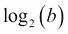
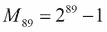
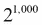
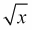
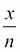
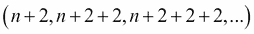

# 第三章：函数、迭代器和生成器

函数式编程的核心是使用纯函数将值从输入域映射到输出范围。纯函数没有副作用，在 Python 中相对容易实现。

避免副作用也意味着减少我们对变量赋值来维护计算状态的依赖。我们无法从 Python 语言中清除赋值语句，但我们可以减少对有状态对象的依赖。这意味着我们需要在可用的 Python 内置数据结构中进行选择，选择那些不需要有状态操作的数据结构。

本章将从功能的角度介绍几个 Python 特性，如下所示：

+   无副作用的纯函数

+   函数作为可以作为参数传递或作为结果返回的对象

+   使用面向对象的后缀表示法和前缀表示法来使用 Python 字符串

+   使用元组和命名元组来创建无状态对象的方法

+   使用可迭代集合作为我们的主要功能编程设计工具

我们将研究生成器和生成器表达式，因为这些是处理对象集合的方法。正如我们在第二章中所指出的，*介绍一些功能特性*，在尝试用递归替换所有生成器表达式时会出现一些边界问题。Python 会强加递归限制，并且不会自动处理 TCO：我们必须使用生成器表达式手动优化递归。

我们将编写生成器表达式来执行以下任务：

+   转换

+   重构

+   复杂计算

我们将快速调查许多内置的 Python 集合，以及在追求功能范式时如何使用集合。这可能会改变我们处理`lists`、`dicts`和`sets`的方式。编写功能性的 Python 鼓励我们专注于元组和不可变集合。在下一章中，我们将强调更多与特定类型的集合一起工作的功能性方法。

# 编写纯函数

纯函数没有副作用：变量没有全局变化。如果我们避免使用`global`语句，我们几乎可以达到这个标准。我们还需要避免改变状态可变对象。我们将研究确保纯函数的这两个方面的几种方法。在 Python 全局中引用一个值，使用自由变量是我们可以重写为适当参数的。在大多数情况下，这是相当容易的。

这里有一个例子，解释了使用全局语句的用法：

```py
 **def some_function(a, b, t):
 **return a+b*t+global_adjustment

```

我们可以重构这个函数，将`global_adjustment`变量变成一个适当的参数。我们需要改变对这个函数的每个引用，这可能会在一个复杂的应用程序中产生很大的连锁反应。全局引用将在函数体中作为自由变量可见。对于这个变量，既没有参数也没有赋值，因此可以清楚地看出它是全局的。

Python 中有许多内部对象，这些对象是有状态的。`file`类的实例和所有类似文件的对象都是常用的有状态对象的例子。我们观察到 Python 中最常用的有状态对象通常表现为上下文管理器。并非所有开发人员都使用可用的上下文管理器，但许多对象实现了所需的接口。在一些情况下，有状态对象并没有完全实现上下文管理器接口；在这些情况下，通常会有一个`close()`方法。我们可以使用`contextlib.closing()`函数为这些对象提供适当的上下文管理器接口。

我们无法轻易消除所有有状态的 Python 对象，除非是小型程序。因此，我们必须在利用函数式设计的优势的同时管理状态。为此，我们应该始终使用`with`语句将有状态的文件对象封装到一个明确定义的范围内。

### 提示

始终在`with`上下文中使用文件对象。

我们应该始终避免全局文件对象、全局数据库连接和相关的状态问题。全局文件对象是处理打开文件的非常常见的模式。我们可能有一个如下命令片段所示的函数：

```py
def open(iname, oname):
 **global ifile, ofile
 **ifile= open(iname, "r")
 **ofile= open(oname, "w")

```

在这种情况下，许多其他函数可以使用`ifile`和`ofile`变量，希望它们正确地引用应用程序要使用的`global`文件，这些文件保持打开状态。

这不是一个很好的设计，我们需要避免它。文件应该是函数的适当参数，并且打开的文件应该嵌套在`with`语句中，以确保它们的有状态行为得到适当处理。

这种设计模式也适用于数据库。数据库连接对象通常可以作为应用程序函数的形式参数提供。这与一些流行的 Web 框架的工作方式相反，这些框架依赖于全局数据库连接，以使数据库成为应用程序的一个透明特性。此外，多线程 Web 服务器可能无法从共享单个数据库连接中受益。这表明使用功能设计和一些孤立的有状态特性的混合方法有一些好处。

# 函数作为一等对象

Python 函数是一等对象并不足为奇。在 Python 中，函数是带有许多属性的对象。参考手册列出了适用于函数的许多特殊成员名称。由于函数是带有属性的对象，我们可以使用特殊属性，如`__doc__`或`__name__`提取`docstring`函数或函数的名称。我们还可以通过`__code__`属性提取函数的主体。在编译语言中，由于需要保留源信息，这种内省相对复杂。在 Python 中，这很简单。

我们可以将函数分配给变量，将函数作为参数传递，并将函数作为值返回。我们可以轻松使用这些技术来编写高阶函数。

由于函数是对象，Python 已经具备了许多成为函数式编程语言所需的特性。

此外，可调用对象还帮助我们创建函数，这些函数是一等对象。我们甚至可以将可调用类定义视为高阶函数。我们需要谨慎地使用可调用对象的`__init__()`方法；我们应该避免设置有状态的类变量。一个常见的应用是使用`__init__()`方法创建符合**策略设计模式**的对象。

遵循策略设计模式的类依赖于另一个对象来提供算法或算法的部分。这允许我们在运行时注入算法细节，而不是将细节编译到类中。

以下是一个带有嵌入式策略对象的可调用对象的示例：

```py
import collections
class Mersenne1(collections.Callable):
 **def __init__(self, algorithm):
 **self.pow2= algorithm
 **def __call__(self, arg):
 **return self.pow2(arg)-1

```

这个类使用`__init__()`保存对另一个函数的引用。我们没有创建任何有状态的实例变量。

作为策略对象给出的函数必须将 2 提升到给定的幂。我们可以将三个候选对象插入到这个类中，如下所示：

```py
def shifty(b):
 **return 1 << b
def multy(b):
 **if b == 0: return 1
 **return 2*multy(b-1)
def faster(b):
 **if b == 0: return 1
 **if b%2 == 1: return 2*faster(b-1)
 **t= faster(b//2)
 **return t*t

```

`shifty()`函数使用位左移将 2 提升到所需的幂。`multy()`函数使用一个天真的递归乘法。`faster()`函数使用分治策略，将执行次乘法，而不是*b*次乘法。

我们可以使用嵌入的策略算法创建`Mersenne1`类的实例，如下所示：

```py
m1s= Mersenne1(shifty)
m1m= Mersenne1(multy)
m1f= Mersenne1(faster)

```

这显示了我们如何定义产生相同结果但使用不同算法的替代函数。

### 提示

Python 允许我们计算，因为这甚至没有接近 Python 的递归限制。这是一个非常大的质数，有 27 位数。

# 使用字符串

由于 Python 字符串是不可变的，它们是函数式编程对象的绝佳示例。Python 的`string`模块有许多方法，所有这些方法都会产生一个新的字符串作为结果。这些方法是没有副作用的纯函数。

`string`方法函数的语法是后缀的，其中大多数函数是前缀的。这意味着当它们与常规函数混合在一起时，复杂的字符串操作可能很难阅读。

在从网页中抓取数据时，我们可能会有一个更干净的函数，它对字符串应用多种转换以清除标点，并返回一个供应用程序其余部分使用的`Decimal`对象。这将涉及前缀和后缀语法的混合使用。

它可能看起来像以下命令片段：

```py
from decimal import *
def clean_decimal(text):
 **if text is None: return text
 **try:
 **return Decimal(text.replace("$", "").replace(",", ""))
 **except InvalidOperation:
 **return text

```

此函数对字符串进行两次替换，以删除`$`和`,`字符串值。生成的字符串被用作`Decimal`类构造函数的参数，该构造函数返回所需的对象。

为了使其更一致，我们可以考虑为`string`方法函数定义自己的前缀函数，如下所示：

```py
def replace(data, a, b):
 **return data.replace(a,b)

```

这使我们可以使用具有一致外观的前缀语法`Decimal(replace(replace(text, "$", ""), ",", ""))`。在这种情况下，我们只是重新排列现有的参数值，允许我们使用额外的技术。我们可以对简单情况进行这样做，例如以下情况：

```py
>>> replace=str.replace
>>> replace("$12.45","$","")

```

12.45

目前尚不清楚这种一致性是否比混合前缀和后缀符号的表示方式有重大改进。多参数函数的问题在于参数最终出现在表达式的各个位置。

一个稍微更好的方法可能是定义一个更有意义的前缀函数来去除标点，如下面的命令片段所示：

```py
def remove( str, chars ):
 **if chars: return remove( str.replace(chars[0], ""), chars[1:] )
 **return str

```

此函数将递归地从`char`变量中删除每个字符。我们可以将其用作`Decimal(remove(text, "$,"))`，以使我们的字符串清理意图更清晰。

# 使用元组和命名元组

由于 Python 元组是不可变对象，它们是适合函数式编程的另一个绝佳示例。Python 的“元组”几乎没有方法函数，因此几乎所有操作都是通过使用前缀语法的函数完成的。元组有许多用例，特别是在处理列表-元组、元组-元组和生成器-元组构造时。

当然，命名元组为元组添加了一个基本功能：我们可以使用名称而不是索引。我们可以利用命名元组来创建数据的堆积对象。这使我们能够编写基于无状态对象的纯函数，但仍然将数据绑定到整洁的对象包中。

我们几乎总是在值集合的上下文中使用元组（和命名元组）。如果我们处理单个值或精确两个值的整洁组，我们通常会将命名参数用作函数的参数。然而，在处理集合时，我们可能需要具有元组的可迭代对象或具有命名元组的可迭代对象。

使用“元组”或“命名元组”对象的决定完全是出于方便考虑。我们可能会将一系列值作为三元组（数字，数字，数字）的形式（假设三元组按照红色、绿色和蓝色的顺序排列）。

我们可以使用函数来拆分三元组，如下面的命令片段所示：

```py
red = lambda color: color[0]
green = lambda color: color[1]
blue = lambda color: color[2]

```

或者，我们可以引入以下命令行：

```py
Color = namedtuple("Color", ("red", "green", "blue", "name"))

```

这使我们可以使用`item.red`而不是`red(item)`。

元组的函数式编程应用集中在可迭代元组设计模式上。我们将仔细研究一些可迭代元组技术。我们将在第七章中查看命名元组技术，*其他元组技术*。

## 使用生成器表达式

我们已经展示了一些生成器表达式的示例。我们将在本章的后面展示更多示例。在本节中，我们将介绍一些更复杂的生成器技术。

我们需要在这里提到一小部分 Python 语法。通常会看到生成器表达式被用来通过`list`推导或`dict`推导创建`list`或`dict`字面量。对于我们的目的，列表显示（或推导）只是生成器表达式的一种用法。我们可以尝试区分显示之外的生成器表达式和显示之内的生成器表达式，但这样做没有任何好处。语法是一样的，除了封闭的标点符号，语义是无法区分的。

显示包括封闭的文字语法：`[x**2 for x in range(10)]`；这个例子是一个列表推导，它从封闭的生成器表达式创建一个列表对象。在本节中，我们将专注于生成器表达式。我们偶尔会创建一个显示，以演示生成器的工作原理。显示的缺点是创建（可能很大的）`collection`对象。生成器表达式是惰性的，只在需要时才创建对象。

我们必须提供关于生成器表达式的两个重要警告，如下：

+   生成器看起来像是序列，除了像`len()`函数这样需要知道集合大小的函数。

+   生成器只能使用一次。之后，它们会变为空。

这是一个我们将用于一些示例的生成器函数：

```py
def pfactorsl(x):
 **if x % 2 == 0:
 **yield 2
 **if x//2 > 1:
 **yield from pfactorsl(x//2)
 **return
 **for i in range(3,int(math.sqrt(x)+.5)+1,2):
 **if x % i == 0:
 **yield i
 **if x//i > 1:
 **yield from pfactorsl(x//i)
 **return
 **yield x

```

我们正在寻找一个数字的质因数。如果数字*x*是偶数，我们将产出 2，然后递归地产出*x*÷2 的所有因子。

对于奇数，我们将遍历大于或等于 3 的奇数值，以找到数字的候选因子。当我们找到一个因子时，我们将产出该因子*i*，然后递归地产出*x*÷*i*的所有因子。

如果我们无法找到一个因子，那么这个数字必须是质数，所以我们可以产出它。

我们将 2 作为一个特殊情况来处理，以减少迭代次数。除了 2 以外，所有的质数都是奇数。

我们除了使用递归之外，还使用了一个重要的`for`循环。这使我们能够轻松处理最多有 1,000 个因子的数字。这个数字至少和一样大，这是一个有 300 位数字的数字。由于`for`变量`i`在缩进的循环体之外没有被使用，`i`变量的有状态特性不会导致混淆，如果我们对循环体进行任何更改。

实际上，我们已经进行了尾递归优化，递归调用从 3 到。`for`循环使我们免受深度递归调用的影响，这些调用会测试范围内的每个数字。

其他两个`for`循环只是为了消耗可迭代的递归函数的结果而存在。

### 提示

在递归生成器函数中，要小心 return 语句。

不要使用以下命令行：

`return recursive_iter(args)`

它只返回一个生成器对象；它不会评估函数以返回生成的值。使用以下任一种：

`for result in recursive_iter(args): yield result`

或者`yield from recursive_iter(args)`

作为替代，以下命令是一个更纯粹的递归版本：

```py
def pfactorsr(x):
 **def factor_n(x, n):
 **if n*n > x:
 **yield x
 **return
 **if x % n == 0:
 **yield n
 **if x//n > 1:
 **yield from factor_n(x//n, n)
 **else:
 **yield from factor_n(x, n+2)
 **if x % 2 == 0:
 **yield 2
 **if x//2 > 1:
 **yield from pfactorsr(x//2)
 **return
 **yield from factor_n(x, 3)

```

我们定义了一个内部递归函数`factor_n()`，来测试范围内的因子*n*。如果候选因子*n*在范围之外，那么*x*就是质数。否则，我们将看看*n*是否是*x*的因子。如果是，我们将产出*n*和的所有因子。如果*n*不是因子，我们将递归地使用*n*+2 进行函数求值。这种递归来测试的每个值可以被优化为一个`for`循环，就像前面的例子中所示的那样。

外部函数处理一些边缘情况。与其他与素数相关的处理一样，我们将 2 作为一个特殊情况处理。对于偶数，我们将产生 2，然后递归地评估`pfactorsr()`以获得*x*÷2。所有其他素数因子必须是大于或等于 3 的奇数。我们将从 3 开始评估`factors_n()`函数以测试这些其他候选素数因子。

### 提示

纯递归函数只能找到最多约 4,000,000 的数字的素数因子。在这之上，Python 的递归限制将被达到。

## 探索生成器的限制

我们注意到生成器表达式和生成器函数有一些限制。可以通过执行以下命令片段来观察这些限制：

```py
>>> from ch02_ex4 import *
>>> pfactorsl( 1560 )
<generator object pfactorsl at 0x1007b74b0>
>>> list(pfactorsl(1560))
[2, 2, 2, 3, 5, 13]
>>> len(pfactorsl(1560))
Traceback (most recent call last):
 **File "<stdin>", line 1, in <module>
TypeError: object of type 'generator' has no len()

```

在第一个例子中，我们看到生成器函数并不严格。它们是懒惰的，在我们消耗生成器函数之前没有正确的值。这并不是一个限制，这正是生成器表达式与 Python 中的函数式编程相匹配的整个原因。

在第二个例子中，我们从生成器函数中实现了一个列表对象。这对于查看输出和编写单元测试用例很方便。

在第三个例子中，我们看到了生成器函数的一个限制：没有`len()`。

生成器函数的另一个限制是它们只能使用一次。例如，看下面的命令片段：

```py
>>> result= pfactorsl(1560)
>>> sum(result)
27
>>> sum(result)
0

```

`sum()`方法的第一次评估执行了生成器的评估。`sum()`方法的第二次评估发现生成器现在为空了。我们只能消耗值一次。

生成器在 Python 中有一个有状态的生命周期。虽然它们对于函数式编程的某些方面非常好，但并不完美。

我们可以尝试使用`itertools.tee()`方法来克服一次性限制。我们将在第八章*迭代工具模块*中深入研究这个问题。这里是它的一个快速示例用法：

```py
import itertools
def limits(iterable):
 **max_tee, min_tee = itertools.tee(iterable, 2)
 **return max(max_tee), min(min_tee)

```

我们创建了参数生成器表达式的两个克隆，`max_tee()`和`min_tee()`。这使原始迭代器保持不变，这是一个令人愉快的特性，允许我们对函数进行非常灵活的组合。我们可以消耗这两个克隆来从可迭代对象中获得`maxima`和`minima`。

虽然吸引人，但我们会发现这在长期内并不奏效。一旦被消耗，可迭代对象将不再提供任何值。当我们想要计算多种类型的缩减，例如`sums`、`counts`、`minimums`、`maximums`时，我们需要考虑这种一次性限制。

## 组合生成器表达式

函数式编程的本质来自于我们如何轻松地组合生成器表达式和生成器函数来创建非常复杂的复合处理序列。在使用生成器表达式时，我们可以以几种方式组合生成器。

组合生成器函数的一种常见方式是当我们创建一个复合函数时。我们可能有一个计算`(f(x) for x in range())`的生成器。如果我们想计算`g(f(x))`，我们有几种方法来组合两个生成器。

我们可以调整原始的生成器表达式如下：

```py
g_f_x = (g(f(x)) for x in range())

```

虽然在技术上是正确的，但这破坏了任何重用的想法。我们不是重用一个表达式，而是重写它。

我们还可以在另一个表达式中替换一个表达式，如下所示：

```py
g_f_x = (g(y) for y in (f(x) for x in range()))

```

这有一个优点，允许我们使用简单的替换。我们可以稍微修改这个以强调重用，使用以下命令：

```py
f_x= (f(x) for x in range())
g_f_x= (g(y) for y in f_x)

```

这有一个优点，它保留了初始表达式`(f(x) for x in range())`，基本上没有改变。我们所做的只是将表达式分配给一个变量。

生成的复合函数也是一个生成器表达式，也是懒惰的。这意味着从`g_f_x`中提取下一个值将从`f_x`中提取一个值，这将从源`range()`函数中提取一个值。

# 使用生成器函数清理原始数据

探索性数据分析中出现的任务之一是清理原始数据源。这通常作为一个复合操作，对每个输入数据应用多个标量函数来创建一个可用的数据集。

让我们看一个简化的数据集。这个数据通常用来展示探索性数据分析技术。它被称为**Anscombe's Quartet**，来源于 F. J. Anscombe 在 1973 年发表在*American Statistician*上的文章**Graphs in Statistical Analysis**。以下是一个下载文件中这个数据集的前几行：

```py
Anscombe's quartet
I  II  III  IV
x  y  x  y  x  y  x  y
10.0  8.04  10.0  9.14	  10.0  7.46  8.0  6.58
8.0	6.95  8.0  8.14  8.0  6.77  8.0  5.76
13.0  7.58  13.0  8.74  13.0  12.74  8.0  7.71
```

遗憾的是，我们不能简单地使用`csv`模块处理这个问题。我们必须对文件进行一些解析，以提取出文件中的有用信息。由于数据是正确的制表符分隔的，我们可以使用`csv.reader()`函数来遍历各行。我们可以定义一个数据迭代器如下：

```py
import csv
def row_iter(source):
 **return csv.reader(source, delimiter="\t")

```

我们只是将一个文件包装在`csv.reader`函数中，以创建一个行的迭代器。我们可以在以下上下文中使用这个迭代器：

```py
with open("Anscombe.txt") as source:
 **print( list(row_iter(source)) )

```

问题在于结果可迭代对象中的前三个项目不是数据。当打开 Anacombe's quartet 文件时，它看起来是这样的：

```py
[["Anscombe's quartet"], ['I', 'II', 'III', 'IV'], ['x', 'y', 'x', 'y', 'x', 'y', 'x', 'y'],** 

```

我们需要从可迭代对象中过滤这些行。下面是一个可以整洁地切除三个预期标题行，并返回剩余行的迭代器的函数：

```py
def head_split_fixed(row_iter):
 **title= next(row_iter)
 **assert len(title) == 1 and title[0] == "Anscombe's quartet"
 **heading= next(row_iter)
 **assert len(heading) == 4 and heading == ['I', 'II', 'III', 'IV']
 **columns= next(row_iter)
 **assert len(columns) == 8 and columns == ['x', 'y', 'x', 'y', 'x', 'y', 'x', 'y']
 **return row_iter

```

这个函数从可迭代对象中取出三行。它断言每行都有一个预期值。如果文件不符合这些基本期望，那么这表明文件已损坏，或者我们的分析可能集中在错误的文件上。

由于`row_iter()`和`head_split_fixed()`函数都期望一个可迭代对象作为参数值，它们可以如下简单地组合：

```py
with open("Anscombe.txt") as source:
 **print( list(head_split_fixed(row_iter(source))))

```

我们只是将一个迭代器应用到另一个迭代器的结果上。实际上，这定义了一个复合函数。当然，我们还没有完成；我们仍然需要将`strings`值转换为`float`值，而且我们还需要拆分每行中的四个并行数据系列。

最终的转换和数据提取更容易使用高阶函数，比如`map()`和`filter()`。我们将在第五章*高阶函数*中回到这些内容。

# 使用列表、字典和集合。

Python 序列对象，比如`list`，是可迭代的。但它还有一些额外的特性。我们将把它看作是一个实现的可迭代对象。我们在几个例子中使用`tuple()`函数来收集生成器表达式或生成器函数的输出到一个单一的`tuple`对象中。我们也可以实现一个序列来创建一个`list`对象。

在 Python 中，列表显示提供了简单的语法来实现生成器：我们只需添加`[]`括号。这是无处不在的，以至于生成器表达式和列表推导之间的区别在实际上并不重要。

以下是一个枚举案例的例子：

```py
>>> range(10)
range(0, 10)
>>> [range(10)]
[range(0, 10)]
>>> [x for x in range(10)]
[0, 1, 2, 3, 4, 5, 6, 7, 8, 9]
>>> list(range(10))
[0, 1, 2, 3, 4, 5, 6, 7, 8, 9]

```

第一个例子是一个生成器函数。

### 提示

`range(10)`函数是惰性的；在通过迭代遍历值的上下文中才会产生这 10 个值。

第二个例子展示了由单个生成器函数组成的列表。要评估这个，我们将不得不使用`嵌套`循环。类似这样`[x for gen in [range(10)] for x in gen]`。

第三个例子展示了从包含生成器函数的生成器表达式构建的`list`推导。函数`range(10)`通过生成器表达式`x for x in range(10)`进行评估。结果值被收集到一个`list`对象中。

我们也可以使用`list()`函数从可迭代对象或生成器表达式构建一个列表。这对于`set()`、`tuple()`和`dict()`也适用。

### 提示

`list(range(10))`函数评估了生成器表达式。`[range(10)]`列表文字不评估生成器函数。

虽然有`list`、`dict`和`set`的简写语法，使用**[]**和`{}`，但没有元组的简写语法。为了实现一个元组，我们必须使用`tuple()`函数。因此，使用`list()`、`tuple()`和`set()`函数作为首选语法似乎是最一致的。

在数据清洗示例中，我们使用一个复合函数来创建四个元组的列表。函数如下所示：

```py
with open("Anscombe.txt") as source:
 **data = head_split_fixed(row_iter(source))
 **print(list(data))

```

我们将复合函数的结果分配给一个名为`data`的名称。数据如下所示：

```py
[['10.0', '8.04', '10.0', '9.14', '10.0', '7.46', '8.0', '6.58'],** 
['8.0', '6.95', '8.0', '8.14', '8.0', '6.77', '8.0', '5.76'], ...
['5.0', '5.68', '5.0', '4.74', '5.0', '5.73', '8.0', '6.89']]

```

我们需要做一些更多的处理才能让它有用。首先，我们需要从八个元组中选择一对列。我们可以使用一个函数选择一对列，如下面的命令片段所示：

```py
from collections import namedtuple
Pair = namedtuple("Pair", ("x", "y"))
def series(n, row_iter):
 **for row in row_iter:
 **yield Pair(*row[n*2:n*2+2])

```

这个函数根据 0 到 3 之间的数字选择两个相邻的列。它从这两列创建一个`namedtuple`对象。这使我们可以从每一行中选择*x*或*y*值。

我们现在可以创建一个元组集合，如下所示：

```py
with open("Anscombe.txt") as source:
 **data = tuple(head_split_fixed(row_iter(source)))
 **sample_I= tuple(series(0,data))
 **sample_II= tuple(series(1,data))
 **sample_III= tuple(series(2,data))
 **sample_IV= tuple(series(3,data))

```

我们将`tuple()`函数应用于基于`head_split_fixed()`和`row_iter()`方法的复合函数。这将创建一个对象，我们可以在其他几个函数中重复使用。如果我们不实现一个`tuple`对象，那么只有第一个样本会有任何数据。之后，源迭代器将被耗尽，所有其他尝试访问它都将产生空的序列。

`series()`函数将选择一对项目来创建`Pair`对象。同样，我们对结果的元组-命名元组序列应用了一个整体的`tuple()`函数，以便我们可以对每个序列进行进一步处理。

`sample_I`序列看起来像下面的命令片段：

```py
(Pair(x='10.0', y='8.04'), Pair(x='8.0', y='6.95'),** 
Pair(x='13.0', y='7.58'), Pair(x='9.0', y='8.81'),** 
Etc.** 
Pair(x='5.0', y='5.68'))

```

其他三个序列的结构类似。然而，值是非常不同的。

我们需要做的最后一件事是从我们积累的字符串中创建适当的数值，以便我们可以计算一些统计摘要值。我们可以将`float()`函数转换应用为最后一步。有许多替代的地方可以应用`float()`函数，我们将在第五章*高阶函数*中看一些选择。

下面是一个描述`float()`函数用法的例子：

```py
 **mean = sum(float(pair.y) for pair in sample_I)/len(sample_I)

```

这将提供`Pair`对象中`y`值的平均值。我们可以按如下方式收集一些统计信息：

```py
for subset in sample_I, sample_II, sample_III, sample_III:
 **mean = sum(float(pair.y) for pair in subset)/len(subset)
 **print(mean)

```

我们计算了从源数据库构建的每个`pair`中`y`值的平均值。我们创建了一个通用的元组-命名元组结构，这样我们就可以清晰地引用源数据集的成员。使用`pair.y`比`pair[1]`更清晰一些。

为了减少内存使用并提高性能，我们尽可能使用生成器表达式和函数。这些以一种惰性（或非严格）的方式迭代集合，只在需要时计算值。由于迭代器只能使用一次，有时我们被迫将一个集合实现为`tuple`（或`list`）对象。实现一个集合会消耗内存和时间，所以我们不情愿地这样做。

熟悉**Clojure**的程序员可以使用`lazy-seq`和`lazy-cat`函数与 Python 的惰性生成器相匹配。这个想法是我们可以指定一个潜在的无限序列，但只在需要时从中取值。

## 使用有状态的映射

Python 提供了几种有状态的集合；各种映射包括 dict 类和`collections`模块中定义的许多相关映射。我们需要强调这些映射的有状态性质，并谨慎使用它们。

对于我们在学习 Python 中的函数式编程技术的目的，`mapping`有两种用例：累积映射的有状态字典和冻结字典。在本章的第一个例子中，我们展示了一个被`ElementTree.findall()`方法使用的冻结字典。Python 没有提供一个易于使用的不可变映射的定义。`collections.abc.Mapping`抽象类是不可变的，但它不是我们可以轻易使用的东西。我们将在第六章中深入了解细节，*递归和归约*。

而不是使用`collections.abc.Mapping`抽象类的形式，我们可以确认变量`ns_map`在赋值语句的左侧只出现一次，方法如`ns_map.update()`或`ns_map.pop()`从未被使用，`del`语句也没有与映射项一起使用。

有状态的字典可以进一步分解为两种典型的用例；它们如下：

+   一个字典只建立一次，从不更新。在这种情况下，我们将利用`dict`类的哈希键特性来优化性能。我们可以通过`dict(sequence)`从任何可迭代的(key, value)两元组序列创建字典。

+   一个逐步构建的字典。这是一个我们可以使用的优化，可以避免实现和排序列表对象。我们将在第六章中看到这一点，*递归和归约*。我们将把`collections.Counter`类作为一个复杂的归约。逐步构建对于记忆化特别有帮助。我们将把记忆化推迟到第十六章中，*优化和改进*。

第一个例子，只建立一次字典，源自一个具有三个操作阶段的应用程序：收集一些输入，创建一个`dict`对象，然后根据字典中的映射处理输入。作为这种应用程序的一个例子，我们可能正在进行一些图像处理，并且有一个特定的调色板，由名称和(R, G, B)元组表示。如果我们使用**GNU 图像处理程序**（**GIMP**）**GNU 通用公共许可证**（**GPL**）文件格式，颜色调色板可能看起来像以下命令片段：

```py
 **GIMP Palette
 **Name: Small
 **Columns: 3
 **#
 **0  0  0    Black
 **255 255 255    White
 **238  32  77    Red
 **28 172 120      Green
 **31 117 254      Blue

```

解析这个文件的细节是第六章的主题，*递归和归约*。重要的是解析的结果。

首先，我们假设我们正在使用以下的`Color`命名元组：

```py
from collections import namedtuple
Color = namedtuple("Color", ("red", "green", "blue", "name"))

```

其次，我们假设有一个产生`Color`对象可迭代的解析器。如果我们将其实现为一个元组，它看起来会像这样：

```py
(Color(red=239, green=222, blue=205, name='Almond'), Color(red=205, green=149, blue=117, name='Antique Brass'), Color(red=253, green=217, blue=181, name='Apricot'), Color(red=197, green=227, blue=132, name='Yellow Green'), Color(red=255, green=174, blue=66, name='Yellow Orange'))

```

为了快速定位给定的颜色名称，我们将从这个序列创建一个冻结字典。这不是获取颜色名称快速查找的唯一方法。我们稍后会看另一个选项。

为了从元组创建映射，我们将使用`process(wrap(iterable))`设计模式。以下命令显示了我们如何创建颜色名称映射：

```py
name_map= dict( (c.name, c) for c in sequence )

```

其中，序列变量是先前显示的`Color`对象的可迭代对象，设计模式的`wrap()`元素简单地将每个`Color`对象`c`转换成两元组`(c.name, c)`。设计的`process()`元素使用`dict()`初始化来创建从名称到`Color`的映射。结果字典如下所示：

```py
{'Caribbean Green': Color(red=28, green=211, blue=162, name='Caribbean Green'),'Peach': Color(red=255, green=207, blue=171, name='Peach'), 'Blizzard Blue': Color(red=172, green=229, blue=238, name='Blizzard Blue'),

```

顺序不能保证，所以你可能看不到加勒比绿色排在第一位。

现在我们已经实现了映射，我们可以在以后的一些处理中使用这个`dict()`对象，用于从颜色名称到(R, G, B)颜色数字的重复转换。查找将非常快，因为字典会快速将键转换为哈希值，然后在字典中查找。

## 使用 bisect 模块创建映射

在前面的例子中，我们创建了一个`dict`映射，以实现从颜色名称到`Color`对象的快速映射。这不是唯一的选择；我们可以使用`bisect`模块。使用`bisect`模块意味着我们必须创建一个排序对象，然后进行搜索。为了与`dict`映射完全兼容，我们可以使用`collections.abc.Mapping`作为基类。

`dict`映射使用哈希来几乎立即定位项。然而，这需要分配一个相当大的内存块。`bisect`映射进行搜索，不需要那么多的内存，但性能可以描述为立即。

`static`映射类看起来像以下命令片段：

```py
import bisect
from collections.abc import Mapping
class StaticMapping(Mapping):
 **def __init__( self, iterable ):
 **self._data = tuple(iterable)
 **self._keys = tuple(sorted(key for key, _ in self._data))

 **def __getitem__(self, key):
 **ix= bisect.bisect_left(self._keys, key)
 **if ix != len(self._keys) and self._keys[ix] == key:
 **return self._data[ix][1]
 **raise ValueError("{0!r} not found".format(key))
 **def __iter__(self):
 **return iter(self._keys)
 **def __len__(self):
 **return len(self._keys)

```

这个类扩展了抽象超类`collections.abc.Mapping`。它提供了三个函数的初始化和实现，这些函数在抽象定义中缺失。`__getitem__()`方法使用`bisect.bisect_left()`函数来搜索键的集合。如果找到键，则返回相应的值。`__iter__()`方法返回一个迭代器，如超类所需。`__len__()`方法同样提供了集合的所需长度。

另一个选择是从`collections.OrderedDict`类的源代码开始，将超类更改为`Mapping`而不是`MutableMapping`，并删除所有实现可变性的方法。有关要保留哪些方法和要丢弃哪些方法的更多详细信息，请参阅*Python 标准库*第 8.4.1 节。

访问以下链接以获取更多详细信息：

[`docs.python.org/3.3/library/collections.abc.html#collections-abstract-base-classes`](https://docs.python.org/3.3/library/collections.abc.html#collections-abstract-base-classes)

这个类似乎并不体现太多的函数式编程原则。我们的目标是支持一个最小化使用有状态变量的更大的应用程序。这个类保存了一组静态的键值对。作为一种优化，它实现了两个对象。

创建此类的实例的应用程序正在使用一个实例化对象来执行对键的快速查找。超类不支持对对象的更新。整个集合是无状态的。它不像内置的`dict`类那样快，但它使用的内存更少，并且通过作为`Mapping`子类的形式，我们可以确保该对象不用于包含处理状态。

## 使用有状态集合

Python 提供了几种有状态的集合，包括 set 集合。对于我们的目的，集合有两种用途：一个是累积项的有状态集合，另一个是用于优化搜索项的 frozenset。

我们可以像创建`tuple`对象一样从可迭代对象中创建 frozenset，`fronzenset(some_iterable)`方法；这将创建一个具有非常快速的`in`运算符的结构。这可以用于收集数据、创建集合，然后使用那个 frozenset 来处理其他数据项的应用程序。

我们可能有一组颜色，我们将使用作为一种**色度**-**键**：我们将使用这种颜色创建一个蒙版，该蒙版将用于组合两个图像。从实用的角度来看，单一颜色并不合适，但一小组非常相似的颜色效果最佳。在这种情况下，我们将检查图像文件的每个像素，以查看像素是否在色度键集中。对于这种处理，色度键颜色在处理目标图像之前加载到 frozenset 中。有关色度键处理的更多信息，请阅读以下链接：

[`en.wikipedia.org/wiki/Chroma_key`](http://en.wikipedia.org/wiki/Chroma_key)

与映射一样 - 具体来说是`Counter`类 - 有一些算法可以从一个记忆化的值集中受益。一些函数受益于记忆化，因为函数是域值和值域之间的映射，这是映射很好的工作。一些算法受益于一个有记忆的集合，它是有状态的，并且随着数据的处理而增长。

我们将在第十六章*优化和改进*中回顾记忆化。

# 总结

在本章中，我们仔细研究了编写纯函数：没有副作用。这里的标准很低，因为 Python 强制我们使用`global`语句来编写不纯的函数。我们研究了生成器函数以及我们如何将其用作函数式编程的支柱。

我们还研究了内置的集合类，以展示它们在函数范式中的使用方式。虽然函数式编程背后的一般理念是限制使用有状态的变量，但集合对象通常是有状态的，并且对于许多算法也是必不可少的。我们的目标是在使用 Python 的非函数式特性时要谨慎。

在接下来的两章中，我们将研究高阶函数：接受函数作为参数并返回函数的函数。我们将从探索内置的高阶函数开始。在后面的章节中，我们将研究定义自己的高阶函数的技术。我们还将在后面的章节中研究`itertools`和`functools`模块及其高阶函数。
