# 第四章：处理集合

Python 提供了许多处理整个集合的函数。它们可以应用于序列（列表或元组）、集合、映射和生成器表达式的可迭代结果。我们将从函数式编程的角度看一些 Python 的集合处理函数。

我们将首先看一下可迭代对象和一些与可迭代对象一起工作的简单函数。我们将看一些额外的设计模式来处理可迭代对象和递归序列，以及显式的`for`循环。我们将看一下如何使用生成器表达式将`scalar()`函数应用于数据集合。

在本章中，我们将展示如何使用以下函数来处理集合的示例：

+   `any()`和`all()`

+   `len()`和`sum()`以及与这些函数相关的一些高阶统计处理

+   `zip()`和一些相关的技术来构造和展平数据列表

+   `reversed()`

+   `enumerate()`

前四个函数都可以称为缩减函数；它们将集合减少为单个值。另外三个函数（`zip()`、`reversed()`和`enumerate()`）是映射函数；它们从现有集合中产生一个新的集合。在下一章中，我们将看一些使用额外函数作为参数来定制其处理的`mapping()`和`reduction()`函数。

在本章中，我们将首先看一下使用生成器表达式处理数据的方法。然后，我们将应用不同类型的集合级函数，以展示它们如何简化迭代处理的语法。我们还将看一些不同的数据重构方式。

在下一章中，我们将专注于使用高阶集合函数来进行类似的处理。

# 函数种类概述

我们需要区分以下两种广义函数：

+   标量函数适用于单个值，并计算单个结果。`abs()`、`pow()`和整个`math`模块都是标量函数的例子。

+   `Collection()`函数与可迭代集合一起工作。

我们可以进一步将集合函数细分为三个亚种：

+   **缩减**：这使用一个函数来将集合中的值合并在一起，产生一个最终的单一值。我们可以称之为聚合函数，因为它为输入集合产生一个单一的聚合值。

+   **映射**：这将一个函数应用于集合的所有项目；结果是相同大小的集合。

+   **过滤器**：这将一个函数应用于集合的所有项目，拒绝一些项目并通过其他项目。结果是输入的子集。过滤器可能什么也不做，这意味着输出与输入匹配；这是一个不恰当的子集，但它仍然符合子集的更广泛定义。

我们将使用这个概念框架来描述我们使用内置集合函数的方式。

# 使用可迭代对象

正如我们在前几章中所指出的，我们经常使用 Python 的`for`循环来处理集合。当处理元素化的集合（如元组、列表、映射和集合）时，`for`循环涉及对状态的显式管理。虽然这偏离了纯函数式编程，但它反映了 Python 的必要优化。如果我们确保状态管理局限于作为`for`语句评估的一部分创建的迭代器对象，我们就可以利用这个特性，而不会偏离纯粹的函数式编程太远。例如，如果我们在缩进的`loop`体之外使用`for`循环变量，我们就偏离了纯粹的函数式编程。

我们将在第六章*递归和缩减*中回顾这一点。这是一个重要的话题，我们在这里只是简单地用一个快速的例子来介绍与生成器一起工作。

`for`循环可迭代处理的一个常见应用是`unwrap(process(wrap(iterable)))`设计模式。`wrap()`函数首先将可迭代对象的每个项转换为一个带有派生排序键或其他值的两个元组，然后是原始的不可变项。然后我们可以根据包装值处理这两个元组。最后，我们将使用`unwrap()`函数丢弃用于包装的值，恢复原始项。

这在功能上经常发生，我们有两个函数经常用于此目的; 它们如下：

```py
fst = lambda x: x[0]
snd = lambda x: x[1]
```

这两个函数从元组中选择第一个和第二个值，对于`process()`和`unwrap()`函数都很方便。

另一个常见的模式是`wrap(wrap(wrap()))`。在这种情况下，我们从简单的元组开始，然后用额外的结果包装它们，以构建更大更复杂的元组。这个主题的一个常见变体是`extend(extend(extend()))`，其中额外的值构建新的更复杂的`namedtuple`实例，而不实际包装原始元组。我们可以将这两者总结为 Accretion 设计模式。

我们将应用 Accretion 设计来处理一系列简单的纬度和经度值。第一步将简单的路径上的点(`lat`, `lon`)转换为腿(`begin`, `end`)的对。结果中的每对将是((`lat`, `lon`), (`lat`, `lon`))。

在接下来的几节中，我们将展示如何创建一个生成器函数，它将迭代文件的内容。这个可迭代对象将包含我们将处理的原始输入数据。

一旦我们有了数据，后面的部分将展示如何在每条路径上装饰**haversine**距离。`wrap(wrap(iterable())))`处理的最终结果将是三个元组的序列：((`lat`, `lon`), (`lat`, `lon`), `distance`)。然后我们可以分析结果，找出最长、最短的距离，边界矩形和其他数据的摘要。

## 解析 XML 文件

我们将从解析一个**XML**（**可扩展** **标记** **语言**的缩写）文件开始，以获取原始的纬度和经度对。这将展示我们如何封装 Python 的一些不太功能性的特性，以创建一个可迭代的值序列。我们将使用`xml.etree`模块。解析后，生成的`ElementTree`对象有一个`findall()`方法，可以遍历可用的值。

我们将寻找以下代码片段这样的结构：

```py
<Placemark><Point>
<coordinates>-76.33029518659048,37.54901619777347,0</coordinates>
</Point></Placemark>
```

文件将有许多`<Placemark>`标签，每个标签中都有一个点和坐标结构。这是包含地理信息的**Keyhole Markup Language** (**KML**)文件的典型情况。

解析 XML 文件可以在两个抽象级别上进行。在较低级别，我们需要定位 XML 文件中的各种标签、属性值和内容。在较高级别，我们希望将文本和属性值转换为有用的对象。

较低级别的处理可以通过以下方式进行：

```py
import xml.etree.ElementTree as XML
def row_iter_kml(file_obj):
 **ns_map= {
 **"ns0": "http://www.opengis.net/kml/2.2",
 **"ns1": "http://www.google.com/kml/ext/2.2"}
 **doc= XML.parse(file_obj)
 **return (comma_split(coordinates.text)
 **for coordinates in doc.findall("./ns0:Document/ns0:Folder/ns0:Placemark/ns0:Point/ns0:coordinates", ns_map))

```

这个函数需要一个已经打开的文件，通常是通过`with`语句打开的。但它也可以是 XML 解析器可以处理的任何文件类对象。该函数包括一个简单的静态`dict`对象`ns_map`，为我们将要搜索的 XML 标签提供`namespace`映射信息。这个字典将被`XML` `ElementTree.findall()`方法使用。

解析的本质是一个生成器函数，它使用`doc.findall()`定位的标签序列。然后，这些标签序列由`comma_split()`函数处理，将文本值分解为逗号分隔的组件。

`comma_split()`函数是字符串`split()`方法的功能版本，如下所示：

```py
def comma_split(text):
 **return text.split(",")

```

我们使用功能包装器来强调略微更统一的语法。

这个函数的结果是一个可迭代的数据行序列。每一行将是一个由三个字符串组成的元组：`纬度`、`经度`和路径上一个航路点的`高度`。这还不直接有用。我们需要做一些额外的处理，以获得`纬度`和`经度`，并将这两个数字转换为有用的浮点值。

将较低级别解析的结果作为元组的可迭代序列的想法，使我们能够以一种简单和统一的方式处理某些类型的数据文件。在第三章中，*函数、迭代器和生成器*，我们看到**逗号** **分隔** **值**（**CSV**）文件可以很容易地处理为元组的行。在第六章中，*递归和归约*，我们将重新讨论解析的想法，以比较这些各种例子。

前一个函数的输出看起来像以下的代码片段：

```py
[['-76.33029518659048', '37.54901619777347', '0'], ['-76.27383399999999', '37.840832', '0'], ['-76.459503', '38.331501', '0'], and so on ['-76.47350299999999', '38.976334', '0']]

```

每一行都是使用`,`分割的`<ns0:coordinates>`标签的源文本内容。这些值是东西经度、南北纬度和高度。我们将对这个函数的输出应用一些额外的函数，以创建一个可用的数据集。

## 在更高级别解析文件

一旦我们解析了低级语法，我们可以将原始数据重构为我们的 Python 程序中可用的形式。这种结构适用于 XML、**JavaScript 对象表示**（**JSON**）、CSV 以及数据序列化的各种物理格式。

我们将致力于编写一套小的生成器函数，将解析后的数据转换为我们的应用程序可以使用的形式。生成器函数包括对`row_iter_kml()`函数找到的文本进行一些简单的转换，如下所示：

+   丢弃`高度`，或者可能只保留`纬度`和`经度`

+   将顺序从（`经度`，`纬度`）更改为（`纬度`，`经度`）

我们可以通过定义一个实用函数来使这两种转换具有更多的语法统一性，如下所示：

```py
def pick_lat_lon(lon, lat, alt):
 **return lat, lon

```

我们可以按照以下方式使用这个函数：

```py
def lat_lon_kml(row_iter):
 **return (pick_lat_lon(*row) for row in row_iter)

```

这个函数将对每一行应用`pick_lat_lon()`函数。我们使用`*row`将每个行的三元组的每个元素分配给`pick_lat_lon()`函数的单独参数。然后函数可以从每个三元组中提取和重新排序两个相关值。

重要的是要注意，一个良好的函数式设计允许我们自由地用其等效物替换任何函数，这使得重构非常简单。当我们提供各种函数的替代实现时，我们试图实现这个目标。原则上，一个聪明的函数式语言编译器可能会在优化过程中进行一些替换。

我们将使用以下类型的处理来解析文件并构建一个我们可以使用的结构，例如以下代码片段：

```py
with urllib.request.urlopen("file:./Winter%202012-2013.kml") as source:
 **v1= tuple(lat_lon_kml(row_iter_kml(source)))
print(v1)

```

我们使用`urllib`命令打开一个源。在这种情况下，它是一个本地文件。然而，我们也可以打开一个远程服务器上的 KML 文件。我们使用这种文件打开的目的是确保我们的处理无论数据的来源如何都是统一的。

我们展示了两个执行 KML 源的低级解析的函数。`row_iter_kml(source)`表达式产生一个文本列的序列。`lat_lon_kml()`函数将提取和重新排序`纬度`和`经度`的值。这创建了一个中间结果，为进一步处理奠定了基础。随后的处理与原始格式无关。

当我们运行这个函数时，我们会看到以下结果：

```py
(('37.54901619777347', '-76.33029518659048'), ('37.840832', '-76.27383399999999'), ('38.331501', '-76.459503'), ('38.330166', '-76.458504'), ('38.976334', '-76.47350299999999'))

```

我们已经从一个复杂的 XML 文件中提取了`纬度`和`经度`的值，使用了几乎纯函数式的方法。由于结果是可迭代的，我们可以继续使用函数式编程技术来处理从文件中检索到的每个点。

我们明确地将低级别的 XML 解析与数据的高级重组分开。XML 解析产生了一个通用的字符串结构元组。这与 CSV 解析器的输出兼容。在处理**SQL**数据库时，我们将有一个类似的元组结构的可迭代对象。这使我们能够编写用于处理来自各种来源的数据的高级处理代码。

我们将展示一系列转换，将这些数据从字符串集合重新排列为路径上的路标集合。这将涉及许多转换。我们需要重组数据，以及从`字符串`转换为`浮点`值。我们还将研究一些简化和澄清后续处理步骤的方法。我们将在后面的章节中使用这个数据集，因为它相当复杂。

## 从序列中配对项目

一个常见的重组要求是将序列中的点制作成起始-停止对。给定一个序列，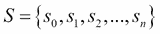，我们想要创建一个配对的序列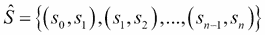。在进行时间序列分析时，我们可能会组合更广泛分开的值。在这个例子中，是相邻的值。

配对的序列将允许我们使用每对来计算点与点之间的距离，使用`haversine`函数的一个简单应用。这种技术也用于将点的路径转换为图形应用程序中的一系列线段。

为什么要配对项目？为什么不像这样做？

```py
begin= next(iterable)
for end in iterable:
 **compute_something(begin, end)
 **begin = end

```

这显然会将数据的每个部分处理为一个起始-结束对。然而，处理函数和重组数据的循环是紧密绑定的，使得重用比必要复杂。配对算法很难在隔离中进行测试，因为它与`compute_something()`函数绑定在一起。

这个组合函数也限制了我们重新配置应用程序的能力。没有简单的方法来注入`compute_something()`函数的替代实现。此外，我们有一个显式状态，即`begin`变量，这可能使生活变得复杂。如果我们试图在`loop`的主体中添加功能，如果一个点被从考虑中删除，我们很容易无法正确设置`begin`变量。`filter()`函数引入了一个`if`语句，可能导致在更新`begin`变量时出错。

通过分离这个简单的配对函数，我们实现了更好的重用。这在长远来看是我们的一个目标。如果我们建立一个有用的原语库，比如这个配对函数，我们就可以更快更自信地解决问题。

有许多方法可以将路径上的点配对，以为每条路径创建起始和停止信息。我们将在这里看一些方法，然后在第五章*高阶函数*中重新讨论这个问题，再次在第八章*Itertools 模块*中重新讨论。

可以使用递归以纯函数方式创建配对。以下是一个配对路径上点的函数的一个版本：

```py
def pairs(iterable):
 **def pair_from( head, iterable_tail ):
 **nxt= next(iterable_tail)
 **yield head, nxt
 **yield from pair_from( nxt, iterable_tail )
 **try:
 **return pair_from( next(iterable), iterable )
 **except StopIteration:
 **return

```

基本函数是内部的`pair_from()`函数。它使用可迭代对象头部的项目加上可迭代对象本身。它产生第一对，从可迭代对象中弹出下一个项目，然后递归调用自身以产生任何额外的对。

我们从`pairs()`函数中调用了这个函数。`pairs()`函数确保初始化被正确处理，并且终止异常被正确地消除。

### 注意

Python 可迭代递归涉及使用`for`循环来正确消耗并产生递归的结果。如果我们尝试使用一个看起来更简单的`return pair_from(nxt, iterable_tail)`方法，我们会发现它并没有正确消耗可迭代对象并产生所有的值。

生成器函数中的递归需要`yield` from 语句来消耗生成的可迭代对象。为此，使用`yield from recursive_iter(args)`。

类似`return recursive_iter(args)`的语句将只返回一个生成器对象；它不会评估函数以返回生成的值。

我们进行尾递归优化的策略是用生成器表达式替换递归。我们可以将这种递归明显优化为简单的`for`循环。以下是另一个配对路线上点的函数的版本：

```py
def legs(lat_lon_iter):
 **begin= next(lat_lon_iter)
 **for end in lat_lon_iter:
 **yield begin, end
 **begin= end

```

这个版本非常快速，没有堆栈限制。它不依赖于任何特定类型的序列，因为它将任何序列生成器发出的任何东西配对。由于循环内没有处理函数，我们可以根据需要重用`legs()`函数。

我们可以将这个函数看作是产生以下类型的配对序列：

```py
list[0:1], list[1:2], list[2:3], ..., list[-2:]

```

这个函数的另一个视图如下：

```py
zip(list, list[1:])

```

虽然信息丰富，但这另外两种表述只适用于序列对象。`legs()`和`pairs()`函数适用于任何可迭代对象，包括序列对象。

## 使用 iter()函数显式地

纯粹的功能观点是，我们所有的可迭代对象都可以用递归函数处理，其中状态仅仅是递归调用堆栈。从实用的角度来看，Python 可迭代对象通常涉及其他`for`循环的评估。有两种常见情况：集合和可迭代对象。在处理集合时，`for`语句会创建一个迭代器对象。在处理生成器函数时，生成器函数是迭代器，并维护其自己的内部状态。从 Python 编程的角度来看，这些通常是等效的。在极少数情况下，通常是那些必须使用显式的`next()`函数的情况下，这两者不会完全等效。

我们之前展示的`legs()`函数有一个显式的`next()`函数调用，以从可迭代对象中获取第一个值。这在生成器函数、表达式和其他可迭代对象中非常有效。但在元组或`lists`等序列对象中却不起作用。

以下是三个例子，以阐明`next()`和`iter()`函数的用法：

```py
>>> list(legs(x for x in range(3)))
[(0, 1), (1, 2)]
>>> list(legs([0,1,2]))
Traceback (most recent call last):
 **File "<stdin>", line 1, in <module>
 **File "<stdin>", line 2, in legs
TypeError: 'list' object is not an iterator
>>> list(legs( iter([0,1,2])))
[(0, 1), (1, 2)]

```

在第一种情况下，我们将`legs()`函数应用于一个可迭代对象。在这种情况下，可迭代对象是一个生成器表达式。根据本章中之前的例子，这是预期的行为。项目被正确地配对，以从三个航点中创建两条腿。

在第二种情况下，我们尝试将`legs()`函数应用于一个序列。这导致了一个错误。虽然`list`对象和可迭代对象在`for`语句中使用时是等效的，但它们在其他地方并不等效。序列不是迭代器；它不实现`next()`函数。然而，`for`语句通过自动从序列创建迭代器来优雅地处理这个问题。

为了使第二种情况起作用，我们需要显式地从`list`对象创建一个迭代器。这允许`legs()`函数从`list`项的迭代器中获取第一个项目。

## 扩展简单循环

我们有两种扩展可以因素成一个简单的循环。我们首先看一下`filter`扩展。在这种情况下，我们可能会拒绝进一步考虑的值。它们可能是数据异常值，或者可能是格式不正确的源数据。然后，我们将通过执行简单的转换来映射源数据，从原始对象创建新对象。在我们的情况下，我们将把`strings`转换为`floating-point`数字。然而，将简单的`loop`与映射扩展的想法适用于各种情况。我们将重新设计上面的`pairs()`函数。如果我们需要调整点的序列以丢弃一个值，会引入一个`filter`扩展来拒绝一些数据值。

由于我们设计的循环只是返回一对，而没有执行任何额外的应用相关处理，所以复杂性是最小的。简单意味着我们更不太可能混淆处理状态。

在这个设计中添加一个`filter`扩展可能看起来像以下代码片段：

```py
def legs_filter(lat_lon_iter):
 **begin= next(lat_lon_iter)
 **for end in lat_lon_iter:
 **if #some rule for rejecting:
 **continue
 **yield begin, end
 **begin= end

```

我们已经插入了一个处理规则来拒绝某些值。由于`loop`保持简洁和表达力十足，我们有信心处理将会被正确完成。此外，我们可以很容易地为这个函数编写一个测试，因为结果适用于任何可迭代对象，而不管这些对象的长期目的地是什么。

下一次重构将向循环引入额外的映射。当设计正在演变时，添加映射是很常见的。在我们的情况下，我们有一系列`string`值。我们需要将它们转换为以后使用的`floating-point`值。这是一个相对简单的映射，展示了设计模式。

以下是通过包装一个生成器函数的生成器表达式来处理这些数据映射的一种方法：

```py
print(tuple(legs((float(lat), float(lon)) for lat,lon in lat_lon_kml())))

```

我们将`legs()`函数应用于一个生成器表达式，该表达式从`lat_lon_kml()`函数的输出中创建`float`值。我们也可以以相反的顺序阅读。`lat_lon_kml()`函数的输出被转换为一对`float`值，然后转换为一系列`legs`。

这开始变得复杂了。我们这里有大量嵌套的函数。我们将`float()`、`legs()`和`tuple()`应用于数据生成器。复杂表达式的一个常见重构是将生成器表达式与任何实现的集合分开。我们可以做以下工作来简化表达式：

```py
flt= ((float(lat), float(lon)) for lat,lon in lat_lon_kml())
print(tuple(legs(flt)))

```

我们将生成函数分配给一个名为`flt`的变量。这个变量不是一个集合对象；我们没有使用`list`推导来创建一个对象。我们只是将生成器表达式分配给一个变量名。然后我们在另一个表达式中使用了`flt`变量。

`tuple()`方法的评估实际上导致了一个适当的对象被构建，以便我们可以打印输出。`flt`变量的对象只在需要时被创建。

我们可能还想做其他的重构。一般来说，数据的来源是我们经常想要更改的。在我们的例子中，`lat_lon_kml()`函数与表达式的其余部分紧密绑定。当我们有不同的数据源时，这使得重用变得困难。

在`float()`操作是我们想要参数化以便重用的情况下，我们可以定义一个围绕生成器表达式的函数。我们将一些处理提取到一个单独的函数中，仅仅是为了将操作分组。在我们的情况下，字符串对到浮点对是特定于特定源数据的。我们可以将复杂的从字符串到浮点数的表达式重写为一个更简单的函数，如下所示：

```py
def float_from_pair( lat_lon_iter ):
 **return ((float(lat), float(lon)) for lat,lon in lat_lon_iter)

```

`float_from_pair()`函数将`float()`函数应用于可迭代项中的第一个和第二个值，产生从输入值创建的两个浮点数元组。我们依赖于 Python 的`for`语句来分解这两个元组。

我们可以在以下上下文中使用这个函数：

```py
legs( float_from_pair(lat_lon_kml()))

```

我们将创建从 KML 文件中获取的`float`值构建的`legs`。很容易将处理可视化，因为过程中的每个阶段都是一个简单的前缀函数。

在解析时，我们经常有一系列`string`值。对于数值应用，我们需要将`strings`转换为`float`、`int`或`Decimal`值。这通常涉及将一个函数插入到一系列清理源数据的表达式中，比如`float_from_pair()`函数。

我们先前的输出都是字符串；看起来像以下代码片段：

```py
(('37.54901619777347', '-76.33029518659048'), ('37.840832', '-76.27383399999999'), ... ('38.976334', '-76.47350299999999'))

```

我们希望数据像以下代码片段一样，其中包含浮点数：

```py
(((37.54901619777347, -76.33029518659048), (37.840832, -76.273834)), ((37.840832, -76.273834), … ((38.330166, -76.458504), (38.976334, -76.473503)))

```

我们需要创建一个更简单的转换函数的管道。上面，我们得到了`flt= ((float(lat), float(lon)) for lat,lon in lat_lon_kml())`。我们可以利用函数的替换规则，用一个具有相同值的函数替换一个复杂的表达式，比如`(float(lat), float(lon)) for lat,lon in lat_lon_kml())`，在这种情况下，是`float_from_pair(lat_lon_kml())`。这种重构允许我们确保简化具有与更复杂表达式相同的效果。

我们将在第五章*高阶函数*中查看一些简化。我们将在第六章*递归和缩减*中重新讨论这个问题，看看如何将这些简化应用到文件解析问题上。

## 将生成器表达式应用于标量函数

我们将看到一种更复杂的生成器表达式，将数据值从一种数据映射到另一种数据。在这种情况下，我们将对生成器创建的单个数据值应用一个相当复杂的函数。

我们将这些非生成器函数称为*标量*，因为它们处理简单的`标量`值。要处理数据集，标量函数将嵌入到生成器表达式中。

继续之前的示例，我们将提供一个`haversine`函数，然后使用生成器表达式将标量`haversine()`函数应用于我们 KML 文件中的一系列对。

`haversine()`函数如下所示：

```py
from math import radians, sin, cos, sqrt, asin

MI= 3959
NM= 3440
KM= 6371

def haversine( point1, point2, R=NM ):
 **lat_1, lon_1= point1
 **lat_2, lon_2= point2

 **Δ_lat = radians(lat_2 - lat_1)
 **Δ_lon = radians(lon_2 - lon_1)
 **lat_1 = radians(lat_1)
 **lat_2 = radians(lat_2)
 **a = sin(Δ_lat/2)**2 + cos(lat_1)*cos(lat_2)*sin(Δ_lon/2)**2
 **c = 2*asin(sqrt(a))

 **return R * c

```

这是一个相对简单的实现，复制自**World** **Wide** **Web**。

以下是我们如何使用我们的函数集合来检查一些 KML 数据并产生一系列距离的方式：

```py
 **trip= ((start, end, round(haversine(start, end),4))
 **for start,end in legs(float_from_pair(lat_lon_kml())))
 **for start, end, dist in trip:
 **print(start, end, dist)

```

处理的精髓是分配给`trip`变量的生成器表达式。我们已经组装了三个元组，其中包括起点、终点和起点到终点的距离。起点和终点对来自`legs()`函数。`legs()`函数使用从 KML 文件中提取的`纬度-经度`对构建的`浮点`数据。

输出看起来像以下命令片段：

```py
(37.54901619777347, -76.33029518659048) (37.840832, -76.273834) 17.7246
(37.840832, -76.273834) (38.331501, -76.459503) 30.7382
(38.331501, -76.459503) (38.845501, -76.537331) 31.0756
(36.843334, -76.298668) (37.549, -76.331169) 42.3962
(37.549, -76.331169) (38.330166, -76.458504) 47.2866
(38.330166, -76.458504) (38.976334, -76.473503) 38.8019

```

每个单独的处理步骤都被简洁地定义了。同样，概述也可以被表达为函数和生成器表达式的组合。

显然，我们可能希望对这些数据应用几个进一步的处理步骤。首先，当然，是使用字符串的`format()`方法来产生更好看的输出。

更重要的是，我们想要从这些数据中提取一些聚合值。我们将这些值称为可用数据的缩减。我们想要缩减数据以获得最大和最小纬度，例如，以显示这条路线的极端北端和南端。我们想要缩减数据以获得一条腿的最大距离以及所有`legs`的总距离。

我们在使用 Python 时会遇到的问题是，`trip`变量中的输出生成器只能使用一次。我们无法轻松地对这些详细数据进行多次缩减。我们可以使用`itertools.tee()`来多次使用可迭代对象。然而，每次缩减都读取和解析 KML 文件似乎是一种浪费。

我们可以通过实现中间结果来使我们的处理更有效。我们将在下一节中看到这一点。然后，我们可以看看如何计算可用数据的多个缩减。

## 使用 any()和 all()作为缩减

`any()`和`all()`函数提供了`布尔`缩减功能。这两个函数都将一组值缩减为单个`True`或`False`。`all()`函数确保所有值都为`True`。`any()`函数确保至少有一个值为`True`。

这些函数与用于表达数学逻辑的普遍量词和存在量词密切相关。例如，我们可能想要断言给定集合中的所有元素都具有某种属性。其中一种形式可能如下所示：

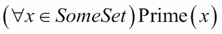

我们会读到这样的内容：*对于 SomeSet 中的所有 x，函数*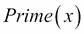 *是真的*。我们在逻辑表达式前面放了一个量词。

在 Python 中，我们稍微改变了项目的顺序，以转录逻辑表达式如下：

```py
all(isprime(x) for x in someset)

```

这将评估每个参数值（`isprime(x)`）并将值集合缩减为单个`True`或`False`。

`any()`函数与存在量词有关。如果我们想要断言集合中没有值是素数，我们可能会有类似以下两个等价表达式之一：

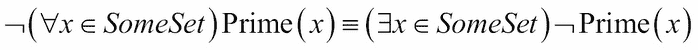

第一个陈述*SomeSet 中的所有元素都不是素数*。第二个版本断言*SomeSet 中存在一个不是素数的元素*。这两者是等价的——也就是说，*如果不是所有元素都是素数，那么必定存在一个元素不是素数*。

在 Python 中，我们可以交换术语的顺序，并将其转录为以下工作代码：

```py
not all(isprime(x) for x in someset)
any(not isprime(x) for x in someset)

```

由于它们是等价的，有两个原因可以优先选择一个而不是另一个：性能和清晰度。性能几乎相同，所以归结为清晰度。哪一个最清晰地陈述了条件？

`all()`函数可以描述为一组值的`and`缩减。结果类似于在给定值序列之间折叠`and`运算符。类似地，`any()`函数可以描述为`or`缩减。当我们查看第十章中的`reduce()`函数时，我们将回到这种通用缩减。*Functools 模块*。

我们还需要看一下这些函数的退化情况。如果序列有 0 个元素会怎样？`all(())`或`all([])`的值是什么？

如果我们问，“空集中的所有元素都是素数吗？”，那么答案是什么？由于没有元素，这个问题有点难以回答。

如果我们问“空集中的所有元素都是素数，`SomeSet`中的所有元素都是素数吗？”，我们对如何继续进行有一些提示。我们正在执行空集的`and`缩减和`SomeSet`的`and`缩减。

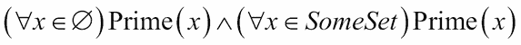

事实证明`and`运算符可以自由分布。我们可以将其重写为两个集合的并集，然后对其进行素数评估：

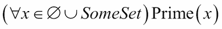

显然，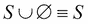。如果我们联合一个空集，我们会得到原始集合。空集可以称为**联合标识元素**。这类似于 0 是加法标识元素的方式：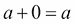。

同样，`any(())`必须是`or`标识元素，即`False`。如果我们考虑乘法标识元素 1，其中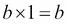，那么`all(())`必须是`True`。

我们可以证明 Python 遵循这些规则：

```py
>>> all(())
True
>>> any(())
False

```

Python 为我们提供了一些非常好的工具来执行涉及逻辑的处理。我们有内置的`and`、`or`和`not`运算符。但是，我们还有这些面向集合的`any()`和`all()`函数。

## 使用 len()和 sum()

`len()`和`sum()`函数提供了两个简单的缩减：元素的计数和序列中元素的总和。这两个函数在数学上是相似的，但它们的 Python 实现是非常不同的。

从数学上讲，我们可以观察到这种很酷的平行性。`len()`函数返回集合 X 中每个值的 1 的总和：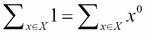。

`sum()`函数返回集合 X 中每个值的*x*的总和：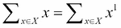。

`sum()`函数适用于任何可迭代对象。`len()`函数不适用于可迭代对象；它只适用于序列。这些函数的实现中存在的这种小不对称在统计算法的边缘有点尴尬。

对于空序列，这两个函数都返回一个适当的加法恒元素 0。

```py
>>> sum(())
0

```

当其他数值类型被使用时，`sum(())`返回整数 0。整数 0 将被强制转换为可用数据的适当类型。

## 使用求和和计数进行统计

算术均值的定义基于`sum()`和`len()`有一个吸引人的平凡定义，如下所示：

```py
def mean( iterable ):
 **return sum(iterable)/len(iterable)

```

虽然优雅，但实际上这对于可迭代对象并不适用。这个定义只适用于序列。

事实上，我们很难基于可迭代对象执行均值或标准差的简单计算。在 Python 中，我们必须要么实例化一个序列对象，要么使用更复杂的操作。

我们有一个相当优雅的均值和标准差的表达式如下定义：

```py
import math
s0= len(data) # sum(1 for x in data) # x**0
s1= sum(data) # sum(x for x in data) # x**1
s2= sum(x*x for x in data)

mean= s1/s0
stdev= math.sqrt(s2/s0 - (s1/s0)**2)

```

这三个总和`s0`、`s1`和`s2`有一个整洁的平行结构。我们可以很容易地从这两个总和中计算均值。标准差稍微复杂一些，但仍然基于这三个总和。

这种愉快的对称性也适用于更复杂的统计函数，比如相关性甚至最小二乘线性回归。

两组样本之间的相关性矩可以从它们的标准化值中计算。以下是一个计算标准化值的函数：

```py
def z( x, μ_x, σ_x ):
 **return (x-μ_x)/σ_x

```

计算很简单，只需从均值`μ_x`中减去每个样本`x`，然后除以标准差`σ_x`。这给出了一个以 sigma 为单位的值，`σ`。±1σ的值预计大约有三分之二的时间。更大的值应该更少见。±3σ之外的值应该少于 1%的时间发生。

我们可以使用这个标量函数如下：

```py
>>> d = [2, 4, 4, 4, 5, 5, 7, 9]
>>> list(z(x, mean(d), stdev(d)) for x in d)
[-1.5, -0.5, -0.5, -0.5, 0.0, 0.0, 1.0, 2.0]

```

我们已经实例化了一个由变量`d`中的一些原始数据基于标准化分数组成的`list`。我们使用了一个生成器表达式来将标量函数`z()`应用于序列对象。

`mean()`和`stdev()`函数只是基于上面显示的例子：

```py
def mean(x):** 
 **return s1(x)/s0(x)
def stdev(x):
 **return math.sqrt(s2(x)/s0(x) - (s1(x)/s0(x))**2)

```

同样，这三个总和函数是基于上面的例子：

```py
def s0(data):
 **return sum(1 for x in data) # or len(data)
def s1(data):** 
 **return sum(x for x in data) # or sum(data)
def s2(data):** 
 **return sum(x*x for x in data)

```

虽然这非常表达和简洁，但有点令人沮丧，因为我们不能简单地在这里使用可迭代对象。我们正在计算一个均值，这需要对可迭代对象进行求和，再加上一个计数。我们还在计算一个需要从可迭代对象中进行两次求和和一个计数的标准差。对于这种统计处理，我们必须实例化一个序列对象，以便我们可以多次检查数据。

以下是我们如何计算两组样本之间的相关性：

```py
def corr( sample1, sample2 ):
 **μ_1, σ_1 = mean(sample1), stdev(sample1)
 **μ_2, σ_2 = mean(sample2), stdev(sample2)
 **z_1 = (z(x, μ_1, σ_1) for x in sample1)
 **z_2 = (z(x, μ_2, σ_2) for x in sample2)
 **r = sum(zx1*zx2 for zx1, zx2 in zip(z_1, z_2) )/s0(sample1)
 **return r

```

这个相关性函数收集了两组样本的基本统计摘要：均值和标准差。在得到这些摘要后，我们定义了两个生成器函数，它们将为每组样本创建标准化值。然后我们可以使用`zip()`函数（见下一个例子）将来自两个标准化值序列的项目配对，并计算这两个标准化值的乘积。标准化分数的乘积的平均值就是相关性。

以下是一个收集两组样本之间相关性的例子：

```py
 **>>> xi= [1.47, 1.50, 1.52, 1.55, 1.57, 1.60, 1.63, 1.65,...    1.68, 1.70, 1.73, 1.75, 1.78, 1.80, 1.83,] #  Height (m)
 **>>> yi= [52.21, 53.12, 54.48, 55.84, 57.20, 58.57, 59.93, 61.29,...    63.11, 64.47, 66.28, 68.10, 69.92, 72.19, 74.46,] # ...    Mass (kg)
 **>>> round(corr( xi, yi ), 5)
 **0.99458

```

我们展示了两组数据点`xi`和`yi`。相关性超过了 0.99，显示了两个序列之间非常强的关系。

这显示了函数式编程的一个优点。我们使用了半打函数来创建一个方便的统计模块，这些函数的定义都是单个表达式。反例是`corr()`函数，它可以简化为一个非常长的表达式。这个函数中的每个内部变量只使用一次；一个局部变量可以用创建它的表达式的复制粘贴来替换。这告诉我们，`corr()`函数具有函数式设计，即使它是用 Python 的六行单独写出的。

# 使用 zip()来构造和展开序列

`zip()`函数会从几个迭代器或序列中交错值。它将从每个*n*输入可迭代对象或序列中的值创建*n*个元组。我们在上一节中使用它来交错来自两组样本的数据点，创建两个元组。

### 注意

`zip()`函数是一个生成器。它不会实现一个结果集合。

以下是一个示例，展示了`zip()`函数的作用：

```py
>>> xi= [1.47, 1.50, 1.52, 1.55, 1.57, 1.60, 1.63, 1.65,... 1.68, 1.70, 1.73, 1.75, 1.78, 1.80, 1.83,]** 
>>> yi= [52.21, 53.12, 54.48, 55.84, 57.20, 58.57, 59.93, 61.29,... 63.11, 64.47, 66.28, 68.10, 69.92, 72.19, 74.46,]** 
>>> zip( xi, yi )
<zip object at 0x101d62ab8>
>>> list(zip( xi, yi ))
[(1.47, 52.21), (1.5, 53.12), (1.52, 54.48), (1.55, 55.84), (1.57, 57.2), (1.6, 58.57), (1.63, 59.93), (1.65, 61.29), (1.68, 63.11), (1.7, 64.47), (1.73, 66.28), (1.75, 68.1), (1.78, 69.92), (1.8, 72.19), (1.83, 74.46)]

```

`zip()`函数有许多边缘情况。我们必须问以下关于其行为的问题：

+   如果没有任何参数会发生什么？

+   当只有一个参数时会发生什么？

+   当序列长度不同时会发生什么？

对于缩减（`any()`、`all()`、`len()`、`sum()`）,我们希望从缩减空序列中得到一个标识元素。

显然，这些边缘情况中的每一个都必须产生某种可迭代的输出。以下是一些例子，以澄清这些行为。首先是空参数列表：

```py
>>> zip()
<zip object at 0x101d62ab8>
>>> list(_)
[]

```

我们可以看到，`zip()`函数没有参数是一个生成器函数，但不会有任何项。这符合输出是可迭代的要求。

接下来，我们将尝试一个单个可迭代对象：

```py
>>> zip( (1,2,3) )
<zip object at 0x101d62ab8>
>>> list(_)
[(1,), (2,), (3,)]

```

在这种情况下，`zip()`函数从每个输入值中发出一个元组。这也是非常有意义的。

最后，我们将看一下`zip()`函数使用的不同长度的`list`方法：

```py
>>> list(zip((1, 2, 3), ('a', 'b')))
[(1, 'a'), (2, 'b')]

```

这个结果是有争议的。为什么要截断？为什么不用`None`值填充较短的列表？`zip()`函数的另一种定义在`itertools`模块中作为`zip_longest()`函数可用。我们将在第八章中看到，*迭代工具模块*。

## 解压压缩的序列

`zip()`映射可以被反转。我们将看几种解压元组集合的方法。

### 注意

我们无法完全解压元组的可迭代对象，因为我们可能需要多次遍历数据。根据我们的需求，我们可能需要实现可迭代对象以提取多个值。

第一种方法是我们已经看到很多次的；我们可以使用一个生成器函数来解压一个元组序列。例如，假设以下对是一个包含两个元组的序列对象：

```py
p0= (x[0] for x in pairs)
p1= (x[1] for x in pairs)

```

这将创建两个序列。`p0`序列有每个两元组的第一个元素；`p1`序列有每个两元组的第二个元素。

在某些情况下，我们可以使用`for`循环的多重赋值来分解元组。以下是一个计算乘积和的示例：

```py
sum(p0*p1 for for p0, p1 in pairs)

```

我们使用`for`语句将每个两元组分解为`p0`和`p1`。

## 展平序列

有时，我们会有需要展平的压缩数据。例如，我们的输入可能是一个看起来像这样的文件：

```py
 **2      3      5      7     11     13     17     19     23     29
 **31     37     41     43     47     53     59     61     67     71
 **...

```

我们可以轻松地使用`((line.split() for line in file)`来创建一个包含十个元组的序列。

我们可能会有以下形式的数据块：

```py
blocked = [['2', '3', '5', '7', '11', '13', '17', '19', '23', '29'], ['31', '37', '41', '43', '47', '53', '59', '61', '67', '71'],...

```

尽管这不是我们想要的。我们希望将数字放入一个单一的、扁平的序列中。输入中的每个项目都是一个十元组；我们宁愿不要与逐个分解这个项目打交道。

我们可以使用两级生成器表达式，如下面的代码片段所示，用于这种展平：

```py
>>> (x for line in blocked for x in line)
<generator object <genexpr> at 0x101cead70>
>>> list(_)
['2', '3', '5', '7', '11', '13', '17', '19', '23', '29', '31', '37', '41', '43', '47', '53', '59', '61', '67', '71', … ]

```

最初，两级生成器是令人困惑的。我们可以通过一个简单的重写来理解这一点：

```py
for line in data:
 **for x in line:
 **yield x

```

这个转换向我们展示了生成器表达式的工作原理。第一个`for`子句（`for line in data`）遍历数据中的每个十元组。第二个`for`子句（`for x in line`）遍历第一个`for`子句中的每个项目。

这个表达式将一个序列结构压缩成一个单一的序列。

## 构造平面序列

有时，我们会有原始数据，它是一列值的平面列表，我们希望将其分成子组。这有点复杂。我们可以使用`itertools`模块的`groupby()`函数来实现这一点。这将等到第八章*迭代工具模块*。

假设我们有一个简单的平面`list`如下：

```py
flat= ['2', '3', '5', '7', '11', '13', '17', '19', '23', '29', '31', '37', '41', '43', '47', '53', '59', '61', '67', '71', ... ]

```

我们可以编写嵌套的生成器函数，从平面数据构建一个序列结构。为了做到这一点，我们需要一个可以多次使用的单一迭代器。表达式看起来像以下的代码片段：

```py
>>> flat_iter=iter(flat)
>>> (tuple(next(flat_iter) for i in range(5)) for row in range(len(flat)//5))
<generator object <genexpr> at 0x101cead70>
>>> list(_)
[('2', '3', '5', '7', '11'), ('13', '17', '19', '23', '29'), ('31', '37', '41', '43', '47'), ('53', '59', '61', '67', '71'), ('73', '79', '83', '89', '97'), ('101', '103', '107', '109', '113'), ('127', '131', '137', '139', '149'), ('151', '157', '163', '167', '173'), ('179', '181', '191', '193', '197'), ('199', '211', '223', '227', '229')]

```

首先，我们创建了一个迭代器，它存在于我们将用来创建我们的序列结构的两个循环之外。生成器表达式使用`tuple(next(flat_iter) for i in range(5))`从`flat_iter`变量中的可迭代值创建了五个元组。这个表达式被嵌套在另一个生成器中，它重复内部循环正确次数，以创建所需的值序列。

这仅在平面列表均匀分割时有效。如果最后一行有部分元素，我们需要单独处理它们。

我们可以使用这种函数将数据分组为相同大小的元组，最后一个元组的大小为奇数，使用以下定义：

```py
def group_by_seq(n, sequence):
 **flat_iter=iter(sequence)
 **full_sized_items = list( tuple(next(flat_iter)** 
 **for i in range(n))
 **for row in range(len(sequence)//n))
 **trailer = tuple(flat_iter)
 **if trailer:
 **return full_sized_items + [trailer]
 **else:
 **return full_sized_items

```

我们创建了一个初始的`list`，其中每个`tuple`的大小为`n`。如果有剩余的元素，我们将有一个长度非零的尾部`tuple`，我们可以将其附加到完整大小的项目的`list`上。如果尾部`tuple`的长度为 0，我们将忽略它。

这不像我们之前看过的其他算法那样简单和功能性。我们可以将其改写为一个相当愉快的生成器函数。以下代码使用`while`循环作为尾递归优化的一部分：

```py
def group_by_iter( n, iterable ):** 
 **row= tuple(next(iterable) for i in range(n))
 **while row:
 **yield row
 **row= tuple(next(iterable) for i in range(n))

```

我们从输入可迭代对象中创建了所需长度的一行。当我们到达输入可迭代对象的末尾时，`tuple(next(iterable) for i in range(n))`的值将是一个长度为零的元组。这是递归的基本情况，我们已经将其写成了`while`循环的终止条件。

## 构造平面序列——另一种方法

假设我们有一个简单的平面`list`，我们想从这个`list`中创建成对的元素。以下是所需的数据：

```py
flat= ['2', '3', '5', '7', '11', '13', '17', '19', '23', '29', '31', '37', '41', '43', '47', '53', '59', '61', '67', '71',... ]

```

我们可以使用列表切片创建成对的元素，如下所示：

```py
zip(flat[0::2], flat[1::2])

```

切片`flat[0::2]`是所有偶数位置。切片`flat[1::2]`是所有奇数位置。如果我们将它们一起压缩，我们得到一个两个元素的元组`(0)`，第一个偶数位置的值，和`(1)`，第一个奇数位置的值。如果元素的数量是偶数，这将很好地产生成对。

这有一个相当简短的优点。前一节中显示的函数是解决相同问题的更长的方法。

这种方法可以泛化。我们可以使用`*(args)`方法生成必须被压缩在一起的序列结构。它看起来像以下的样子：

```py
zip(*(flat[i::n] for i in range(n)))

```

这将生成`n`个切片：`flat[0::n]`，`flat[1::n]`，`flat[2::n]`，…，`flat[n-1::n]`。这些切片的集合成为`zip()`的参数，然后交错地从每个切片中提取值。

回想一下，`zip()`会将序列截断为最短的`list`。这意味着，如果`list`不是分组因子`n`的偶数倍（`len(flat)%n != 0`），也就是最后一个切片，它的长度将不同于其他切片的长度，其他切片都将被截断。这很少是我们想要的。

如果我们使用`itertools.zip_longest()`方法，那么我们将看到最终的元组将填充足够的`None`值，使其长度为`n`。在某些情况下，这种填充是可以接受的。在其他情况下，额外的值是不希望的。

`list`切片方法对数据进行分组是另一种处理将扁平数据结构化为块的方法。作为一种通用解决方案，它似乎并没有比前一节中的函数提供太多优势。作为专门用于从扁平数据中制作两个元组的解决方案，它非常简单。

# 使用 reversed()改变顺序

有时我们需要一个反转的序列。Python 为我们提供了两种方法：`reversed()`函数和使用反转索引的切片。

例如，考虑将基数转换为十六进制或二进制。以下是一个简单的转换函数：

```py
def digits(x, b):
 **if x == 0: return
 **yield x % b
 **for d in to_base(x//b, b):
 **yield d

```

此函数使用递归从最不重要的位到最重要的位产生数字。`x%b`的值将是基数`b`中`x`的最不重要的数字。

我们可以将其形式化如下：

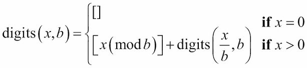

在许多情况下，我们更喜欢以相反的顺序产生数字。我们可以使用`reversed()`函数包装这个函数，以交换数字的顺序：

```py
def to_base(x, b):
 **return reversed(tuple(digits(x, b)))

```

### 注意

`reversed()`函数产生一个可迭代对象，但参数值必须是一个序列对象。然后该函数以相反的顺序产生该对象的项目。

我们也可以使用切片来做类似的事情，比如`tuple(digits(x, b))[::-1]`。然而，切片不是一个迭代器。切片是从另一个实例化对象构建的实例化对象。在这种情况下，对于这样小的值集合，区别是微不足道的。由于`reversed()`函数使用的内存较少，对于更大的集合来说可能更有优势。

# 使用 enumerate()包括序列号

Python 提供了`enumerate()`函数，将索引信息应用于序列或可迭代对象中的值。它执行一种特殊的包装，可以作为`unwrap(process(wrap(data)))`设计模式的一部分使用。

它看起来像下面的代码片段：

```py
>>> xi
[1.47, 1.5, 1.52, 1.55, 1.57, 1.6, 1.63, 1.65, 1.68, 1.7, 1.73, 1.75, 1.78, 1.8, 1.83]
>>> list(enumerate(xi))
[(0, 1.47), (1, 1.5), (2, 1.52), (3, 1.55), (4, 1.57), (5, 1.6), (6, 1.63), (7, 1.65), (8, 1.68), (9, 1.7), (10, 1.73), (11, 1.75), (12, 1.78), (13, 1.8), (14, 1.83)]

```

`enumerate()`函数将每个输入`item`转换为一个带有序列号和原始`item`的对。它与以下内容略有相似：

```py
zip(range(len(source)), source)

```

`enumerate()`的一个重要特点是，结果是可迭代的，并且可以与任何可迭代的输入一起使用。

例如，在统计处理时，`enumerate()`函数非常方便，可以通过为每个样本加上一个数字，将单个值序列转换为更适当的时间序列。

# 摘要

在本章中，我们详细介绍了使用多种内置缩减的方法。

我们使用`any()`和`all()`来进行基本逻辑处理。这些都是使用简单运算符如`or`或`and`的简洁示例。

我们还看了一些数值缩减，如`len()`和`sum()`。我们应用这些函数来创建一些高阶统计处理。我们将在第六章*递归和缩减*中回顾这些缩减。

我们还看了一些内置映射。

`zip()`函数合并多个序列。这使我们考虑在结构化和扁平化更复杂的数据结构的上下文中使用它。正如我们将在后面的章节中看到的例子，嵌套数据在某些情况下很有帮助，而扁平数据在其他情况下很有帮助。

`enumerate()`函数将可迭代对象映射到两个元组的序列。每个两元组都有`(0)`作为序列号和`(1)`作为原始项目。

`reversed()`函数按照它们的原始顺序迭代序列对象中的项目。一些算法更有效地按照一种顺序产生结果，但我们希望以相反的顺序呈现这些结果。

在下一章中，我们将看看`mapping`和`reduction`函数，它们使用额外的函数作为参数来定制它们的处理。接受函数作为参数的函数是我们的第一个高阶函数的例子。我们还将涉及返回函数作为结果的函数。
