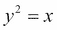
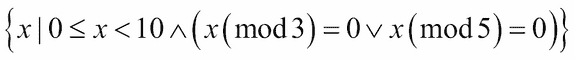

# 第五章：高阶函数

函数式编程范式的一个非常重要的特性是高阶函数。这些是接受函数作为参数或返回函数作为结果的函数。Python 提供了几种这种类型的函数。我们将看看它们和一些逻辑扩展。

正如我们所看到的，有三种高阶函数，它们如下：

+   接受函数作为其参数之一的函数

+   返回函数的函数

+   接受函数并返回函数的函数

Python 提供了几种第一种高阶函数。我们将在本章中查看这些内置的高阶函数。我们将在后面的章节中查看一些提供高阶函数的库模块。

一个发出函数的函数的概念可能看起来有点奇怪。然而，当我们看一个 Callable 类对象时，我们看到一个返回 Callable 对象的函数。这是一个创建另一个函数的函数的例子。

接受函数并创建函数的函数包括复杂的 Callable 类以及函数装饰器。我们将在本章介绍装饰器，但将深入考虑装饰器直到第十一章*装饰器设计技术*。

有时我们希望 Python 具有前一章中集合函数的高阶版本。在本章中，我们将展示使用 reduce`(extract())`设计模式从较大的元组中提取特定字段执行缩减。我们还将看看如何定义我们自己版本的这些常见的集合处理函数。

在这一章中，我们将看一下以下函数：

+   `max()`和`min()`

+   我们可以使用的`Lambda`形式来简化使用高阶函数

+   `map()`

+   `filter()`

+   `iter()`

+   `sorted()`

`itertools`模块中有许多高阶函数。我们将在第八章*Itertools 模块*和第九章*更多 Itertools 技术*中查看这个模块。

此外，`functools`模块提供了一个通用的`reduce()`函数。我们将在第十章*Functools 模块*中看到这一点。我们将推迟这个问题，因为它不像本章中的其他高阶函数那样普遍适用。

`max()`和`min()`函数是缩减函数；它们从集合中创建一个单个值。其他函数是映射函数。它们不会将输入减少到单个值。

### 注意

`max()`、`min()`和`sorted()`函数也有默认行为和高阶函数行为。函数是通过`key=`参数提供的。`map()`和`filter()`函数将函数作为第一个位置参数。

# 使用 max()和 min()查找极值

`max()`和`min()`函数有双重作用。它们是应用于集合的简单函数。它们也是高阶函数。我们可以看到它们的默认行为如下：

```py
>>> max(1, 2, 3)
3
>>> max((1,2,3,4))
4

```

这两个函数都将接受无限数量的参数。这些函数也被设计为接受序列或可迭代对象作为唯一参数，并定位该可迭代对象的最大值（或最小值）。

它们还做一些更复杂的事情。假设我们有来自第四章*与集合一起工作*示例中的旅行数据。我们有一个将生成元组序列的函数，如下所示：

```py
(((37.54901619777347, -76.33029518659048), (37.840832, -76.273834), 17.7246), ((37.840832, -76.273834), (38.331501, -76.459503), 30.7382), ((38.331501, -76.459503), (38.845501, -76.537331), 31.0756), ((36.843334, -76.298668), (37.549, -76.331169), 42.3962), ((37.549, -76.331169), (38.330166, -76.458504), 47.2866), ((38.330166, -76.458504), (38.976334, -76.473503), 38.8019))

```

每个`tuple`有三个值：起始位置、结束位置和距离。位置以纬度和经度对的形式给出。东纬是正数，所以这些点位于美国东海岸，大约西经 76°。距离以海里为单位。

我们有三种方法可以从这个值序列中获取最大和最小距离。它们如下：

+   使用生成器函数提取距离。这将只给我们距离，因为我们丢弃了每个 leg 的其他两个属性。如果我们有任何额外的处理要求，这不会很好地工作。

+   使用`unwrap(process(wrap()))`模式。这将给我们具有最长和最短距离的 legs。从这些中，我们可以提取距离，如果那是所有需要的话。其他两个将给我们包含最大和最小距离的 leg。

+   使用`max()`和`min()`函数作为高阶函数。

为了提供上下文，我们将展示前两种解决方案。以下是一个构建旅程并使用前两种方法来找到最长和最短距离的脚本：

```py
from ch02_ex3 import float_from_pair, lat_lon_kml, limits, haversine, legs
path= float_from_pair(lat_lon_kml())
trip= tuple((start, end, round(haversine(start, end),4))for start,end in legs(iter(path)))

```

这一部分根据从 KML 文件中读取的`path`构建的每个`leg`的`haversine`距离创建了`trip`对象作为`tuple`。

一旦我们有了`trip`对象，我们就可以提取距离并计算这些距离的最大值和最小值。代码如下所示：

```py
long, short = max(dist for start,end,dist in trip), min(dist for start,end,dist in trip)
print(long, short)

```

我们使用了一个生成器函数来从`trip`元组的每个`leg`中提取相关项目。我们不得不重复生成器函数，因为每个生成器表达式只能被消耗一次。

以下是结果：

```py
129.7748 0.1731

```

以下是带有`unwrap(process(wrap()))`模式的版本。我们实际上声明了名为`wrap()`和`unwrap()`的函数，以清楚地说明这种模式的工作原理：

```py
def wrap(leg_iter):
 **return ((leg[2],leg) for leg in leg_iter)

def unwrap(dist_leg):
 **distance, leg = dist_leg
 **return leg
long, short = unwrap(max(wrap(trip))), unwrap(min(wrap(trip)))
print(long, short)

```

与之前的版本不同，这个版本定位了具有最长和最短距离的`legs`的所有属性。而不仅仅是提取距离，我们首先将距离放在每个包装的元组中。然后，我们可以使用`min()`和`max()`函数的默认形式来处理包含距离和 leg 详情的两个元组。处理后，我们可以剥离第一个元素，只留下`leg`详情。

结果如下所示：

```py
((27.154167, -80.195663), (29.195168, -81.002998), 129.7748)
((35.505665, -76.653664), (35.508335, -76.654999), 0.1731)

```

最终且最重要的形式使用了`max()`和`min()`函数的高阶函数特性。我们将首先定义一个`helper`函数，然后使用它来通过执行以下代码片段来将 legs 的集合减少到所需的摘要：

```py
def by_dist(leg):
 **lat, lon, dist= leg
 **return dist
long, short = max(trip, key=by_dist), min(trip, key=by_dist)
print(long, short)

```

`by_dist()`函数拆分了每个`leg`元组中的三个项目，并返回距离项目。我们将在`max()`和`min()`函数中使用这个函数。

`max()`和`min()`函数都接受一个可迭代对象和一个函数作为参数。关键字参数`key=`被 Python 所有高阶函数使用，以提供一个用于提取必要键值的函数。

我们可以使用以下内容来帮助概念化`max()`函数如何使用`key`函数：

```py
wrap= ((key(leg),leg) for leg in trip)
return max(wrap)[1]

```

`max()`和`min()`函数的行为就好像给定的`key`函数被用来将序列中的每个项目包装成一个两元组，处理两元组，然后解构两元组以返回原始值。

# 使用 Python 的 lambda 形式

在许多情况下，定义一个`helper`函数需要太多的代码。通常，我们可以将`key`函数简化为一个单一表达式。必须编写`def`和`return`语句来包装一个单一表达式似乎是浪费的。

Python 提供了 lambda 形式作为简化使用高阶函数的一种方式。lambda 形式允许我们定义一个小的匿名函数。函数的主体限制在一个单一表达式中。

以下是使用简单的`lambda`表达式作为 key 的示例：

```py
long, short = max(trip, key=lambda leg: leg[2]), min(trip, key=lambda leg: leg[2])
print(long, short)

```

我们使用的`lambda`将从序列中获得一个项目；在这种情况下，每个 leg 三元组将被传递给`lambda`。`lambda`参数变量`leg`被赋值，表达式`leg[2]`被评估，从三元组中取出距离。

在极少数情况下，`lambda`从未被重复使用，这种形式是理想的。然而，通常需要重复使用`lambda`对象。由于复制粘贴是一个坏主意，那么有什么替代方案呢？

我们总是可以定义一个函数。

我们还可以将 lambda 分配给变量，做法如下：

```py
start= lambda x: x[0]
end = lambda x: x[1]
dist = lambda x: x[2]

```

`lambda`是一个`callable`对象，可以像函数一样使用。以下是一个交互提示的示例：

```py
>>> leg = ((27.154167, -80.195663), (29.195168, -81.002998), 129.7748)
>>> start= lambda x: x[0]
>>> end  = lambda x: x[1]
>>> dist = lambda x: x[2]
>>> dist(leg)
129.7748

```

Python 为元组的元素分配有意义的名称提供了两种方法：命名元组和一组 lambda。两者是等效的。

为了扩展这个例子，我们将看看如何获取起点或终点的`纬度`或`经度`值。这是通过定义一些额外的 lambda 来完成的。

以下是交互会话的继续：

```py
>>> start(leg)
(27.154167, -80.195663)
>>>** 
>>> lat = lambda x: x[0]
>>> lon = lambda x: x[1]
>>> lat(start(leg))
27.154167

```

lambda 与命名元组相比没有明显的优势。一组`lambda`用于提取字段需要更多的代码行来定义比一个命名元组。另一方面，我们可以使用前缀函数表示法，在函数编程上下文中可能更容易阅读。更重要的是，正如我们将在稍后的`sorted()`示例中看到的，`lambdas`可以比`namedtuple`属性名称更有效地被`sorted()`、`min()`和`max()`使用。

# Lambda 和 lambda 演算

在一本纯函数式编程语言的书中，有必要解释 lambda 演算和 Haskell Curry 发明的我们称之为**柯里化**的技术。然而，Python 并没有严格遵循这种类型的`lambda` `演算`。函数不是柯里化的，以将它们减少为单参数`lambda` `形式`。

我们可以使用`functools.partial`函数实现柯里化。我们将在第十章*Functools 模块*中保存这个。

# 使用 map()函数将函数应用于集合

标量函数将域中的值映射到范围中。当我们看`math.sqrt()`函数时，例如，我们正在看一个从`float`值*x*到另一个`float`值*y = sqrt(x)*的映射，使得。域限制为正值。映射可以通过计算或表插值来完成。

`map()`函数表达了一个类似的概念；它将一个集合映射到另一个集合。它确保给定的函数被用来将域集合中的每个单独项映射到范围集合——这是将内置函数应用于数据集合的理想方式。

我们的第一个例子涉及解析一块文本以获取数字序列。假设我们有以下文本块：

```py
>>> text= """\
...       2      3      5      7     11     13     17     19     23     29** 
...      31     37     41     43     47     53     59     61     67     71** 
...      73     79     83     89     97    101    103    107    109    113** 
...     127    131    137    139    149    151    157    163    167    173** 
...     179    181    191    193    197    199    211    223    227    229** 
... """

```

我们可以使用以下生成器函数重新构造这个文本：

```py
>>> data= list(v for line in text.splitlines() for v in line.split())

```

这将文本分割成行。对于每一行，它将行分割成以空格分隔的单词，并迭代每个结果字符串。结果如下所示：

```py
['2', '3', '5', '7', '11', '13', '17', '19', '23', '29', '31', '37', '41', '43', '47', '53', '59', '61', '67', '71', '73', '79', '83', '89', '97', '101', '103', '107', '109', '113', '127', '131', '137', '139', '149', '151', '157', '163', '167', '173', '179', '181', '191', '193', '197', '199', '211', '223', '227', '229']

```

我们仍然需要将`int()`函数应用于每个`string`值。这就是`map()`函数的优势所在。看一下以下代码片段：

```py
>>> list(map(int,data))
[2, 3, 5, 7, 11, 13, 17, 19, 23, 29, 31, 37, 41, 43, 47, 53, 59, 61, 67, 71, 73, 79, 83, 89, 97, 101, 103, 107, 109, 113, 127, 131, 137, 139, 149, 151, 157, 163, 167, 173, 179, 181, 191, 193, 197, 199, 211, 223, 227, 229]

```

`map()`函数将`int()`函数应用于集合中的每个值。结果是一系列数字而不是一系列字符串。

`map()`函数的结果是可迭代的。`map()`函数可以处理任何类型的可迭代对象。

这里的想法是，任何 Python 函数都可以使用`map()`函数应用于集合的项。有很多内置函数可以在这种 map 处理上下文中使用。

## 使用 lambda 表达式和 map()

假设我们想要将我们的航程距离从海里转换为英里。我们想要将每个航段的距离乘以 6076.12/5280，即 1.150780。

我们可以使用`map()`函数进行这个计算：

```py
map(lambda x: (start(x),end(x),dist(x)*6076.12/5280), trip)

```

我们已经定义了一个`lambda`，它将被`map()`函数应用于航程中的每个航段。`lambda`将使用其他`lambdas`从每个航段中分离起点、终点和英里距离值。它将计算修订后的距离，并从起点、终点和英里距离组装一个新的航段元组。

这与以下生成器表达式完全相同：

```py
((start(x),end(x),dist(x)*6076.12/5280) for x in trip)

```

我们对生成器表达式中的每个项目进行了相同的处理。

`map()`函数和生成器表达式之间的重要区别在于，`map()`函数往往比生成器表达式更快。加速大约减少了 20%的时间。

# 使用多个序列进行 map()处理

有时，我们会有两个需要相互对应的数据集合。在第四章，*处理集合*中，我们看到`zip()`函数如何交错两个序列以创建一系列成对。在许多情况下，我们真的想做这样的事情：

```py
map(function, zip(one_iterable, another_iterable))

```

我们正在从两个（或更多）并行可迭代对象创建参数元组，并将函数应用于参数`tuple`。我们也可以这样看待：

```py
(function(x,y) for x,y in zip(one_iterable, another_iterable))

```

在这里，我们用等效的生成器表达式替换了`map()`函数。

我们可能会有将整个事情概括到这样的想法：

```py
def star_map(function, *iterables)
 **return (function(*args) for args in zip(*iterables))

```

有一个更好的方法已经可用于我们。实际上我们并不需要这些技术。让我们看一个替代方法的具体例子。

在第四章，*处理集合*中，我们看到了我们从 XML 文件中提取的一系列航路点的行程数据。我们需要从这些航路点列表中创建腿，显示每条腿的起点和终点。

以下是一个简化版本，使用了`zip()`函数应用于一种特殊类型的可迭代对象：

```py
>>> waypoints= range(4)
>>> zip(waypoints, waypoints[1:])
<zip object at 0x101a38c20>
>>> list(_)
[(0, 1), (1, 2), (2, 3)]

```

我们创建了一个从单个平面列表中提取的成对序列。每对将有两个相邻的值。`zip()`函数在较短的列表用尽时会正确停止。这种`zip( x, x[1:])`模式只适用于实现的序列和`range()`函数创建的可迭代对象。

我们创建了成对，以便我们可以对每对应用`haversine()`函数来计算路径上两点之间的距离。以下是它在一个步骤序列中的样子：

```py
from ch02_ex3 import lat_lon_kml, float_from_pair, haversine
path= tuple(float_from_pair(lat_lon_kml()))
distances1= map( lambda s_e: (s_e[0], s_e[1], haversine(*s_e)), zip(path, path[1:]))

```

我们已经将关键的航路点序列加载到`path`变量中。这是一个有序的纬度-经度对序列。由于我们将使用`zip(path, path[1:])`设计模式，我们必须有一个实现的序列而不是一个简单的可迭代对象。

`zip()`函数的结果将是具有起点和终点的对。我们希望我们的输出是具有起点、终点和距离的三元组。我们正在使用的`lambda`将分解原始的两元组，并从起点、终点和距离创建一个新的三元组。

如前所述，我们可以通过使用`map()`函数的一个巧妙特性来简化这个过程，如下所示：

```py
distances2= map(lambda s, e: (s, e, haversine(s, e)), path, path[1:])

```

请注意，我们已经向`map()`函数提供了一个函数和两个可迭代对象。`map()`函数将从每个可迭代对象中取出下一个项目，并将这两个值作为给定函数的参数应用。在这种情况下，给定函数是一个`lambda`，它从起点、终点和距离创建所需的三元组。

`map()`函数的正式定义规定，它将使用无限数量的可迭代对象进行**星图**处理。它将从每个可迭代对象中取出项目，以创建给定函数的参数值元组。

# 使用 filter()函数来传递或拒绝数据

`filter()`函数的作用是使用并应用称为谓词的决策函数到集合中的每个值。`True`的决策意味着该值被传递；否则，该值被拒绝。`itertools`模块包括`filterfalse()`作为这一主题的变体。参考第八章，*迭代工具模块*，了解`itertools`模块的`filterfalse()`函数的用法。

我们可以将这个应用到我们的行程数据中，以创建超过 50 海里长的腿的子集，如下所示：

```py
long= list(filter(lambda leg: dist(leg) >= 50, trip)))

```

`lambda`谓词对长腿将为`True`，将被传递。短腿将被拒绝。输出是通过这个距离测试的 14 条腿。

这种处理清楚地将`filter`规则(`lambda leg: dist(leg) >= 50`)与创建`trip`对象或分析长腿的任何其他处理分开。

再举一个简单的例子，看下面的代码片段：

```py
>>> filter(lambda x: x%3==0 or x%5==0, range(10))
<filter object at 0x101d5de50>
>>> sum(_)
23

```

我们定义了一个简单的`lambda`来检查一个数字是否是 3 的倍数或 5 的倍数。我们将这个函数应用到一个可迭代对象`range(10)`上。结果是一个可迭代的数字序列，通过决策规则传递。

`lambda`为`True`的数字是`[0, 3, 5, 6, 9]`，所以这些值被传递。由于`lambda`对所有其他数字都为`False`，它们被拒绝。

这也可以通过执行以下代码来使用生成器表达式来完成：

```py
>>> list(x for x in range(10) if x%3==0 or x%5==0)
[0, 3, 5, 6, 9]

```

我们可以使用以下集合推导符号来形式化这个过程：



这意味着我们正在构建一个*x*值的集合，使得*x*在`range(10)`中，且`x%3==0 or x%5==0`。`filter()`函数和正式的数学集合推导之间有非常优雅的对称性。

我们经常希望使用已定义的函数而不是`lambda` `forms`来使用`filter()`函数。以下是重用先前定义的谓词的示例：

```py
>>> from ch01_ex1 import isprimeg
>>> list(filter(isprimeg, range(100)))
[2, 3, 5, 7, 11, 13, 17, 19, 23, 29, 31, 37, 41, 43, 47, 53, 59, 61, 67, 71, 73, 79, 83, 89, 97]

```

在这个例子中，我们从另一个模块中导入了一个名为`isprimeg()`的函数。然后我们将这个函数应用到一组值上，以传递素数并拒绝集合中的非素数。

这可能是生成素数表的一种非常低效的方法。这种表面上的简单性是律师所说的一种*有吸引力的危险物*。看起来可能很有趣，但它的扩展性非常差。更好的算法是**埃拉托斯特尼筛法**；这个算法保留了先前找到的素数，并使用它们来防止大量低效的重新计算。

# 使用 filter()来识别异常值

在上一章中，我们定义了一些有用的统计函数来计算平均值和标准偏差，并对值进行标准化。我们可以使用这些函数来定位我们旅行数据中的异常值。我们可以将`mean()`和`stdev()`函数应用到旅行中每个`leg`的距离值上，以获得人口平均值和标准偏差。

然后我们可以使用`z()`函数来计算每个`leg`的标准化值。如果标准化值大于 3，数据就远离了平均值。如果我们拒绝这些异常值，我们就有了一个更统一的数据集，不太可能存在报告或测量错误。

以下是我们可以解决这个问题的方法：

```py
from stats import mean, stdev, z
dist_data = list(map(dist, trip))
μ_d = mean(dist_data)
σ_d = stdev(dist_data)
outlier = lambda leg: z(dist(leg),μ_d,σ_d) > 3
print("Outliers", list(filter(outlier, trip)))

```

我们将距离函数映射到`trip`集合中的每个`leg`。由于我们将对结果进行几项操作，因此必须实现一个`list`对象。我们不能依赖迭代器，因为第一个函数会消耗它。然后我们可以使用这个提取来计算人口统计学`μ_d`和`σ_d`，即平均值和标准偏差。

根据统计数据，我们使用异常值 lambda 来`filter`我们的数据。如果标准化值太大，数据就是异常值。

`list(filter(outlier, trip))`的结果是两条腿的列表，与人群中其他腿相比相当长。平均距离约为 34 纳米，标准偏差为 24 纳米。没有一次旅行的标准化距离可以小于-1.407。

### 注意

我们能够将一个相当复杂的问题分解为许多独立的函数，每个函数都可以很容易地独立测试。我们的处理是由更简单的函数组成的。这可以导致简洁、表达力强的函数式编程。

# 使用带有哨兵值的 iter()函数

内置的`iter()`函数在`collection`对象上创建一个迭代器。我们可以使用这个来在`collection`周围包装一个`iterator`对象。在许多情况下，我们将允许`for`语句隐式处理这一点。在一些情况下，我们可能希望显式地创建一个迭代器，以便我们可以将`collection`的头部与尾部分开。这个函数还可以通过可调用的`or`函数迭代直到找到一个`sentinel`值。这个特性有时与文件的`read()`函数一起使用，以消耗行直到找到某个`sentinel`值。在这种情况下，给定的函数可能是某个文件的`readline()`方法。向`iter()`提供一个`callable`函数对我们来说有点困难，因为这个函数必须在内部维护状态。这个隐藏的状态是一个开放文件的特性，例如，每个`read()`或`readline()`函数都会将一些内部状态推进到下一个字符或下一行。

另一个例子是可变集合对象的`pop()`方法如何对对象进行有状态的更改。以下是使用`pop()`方法的示例：

```py
>>> tail= iter([1, 2, 3, None, 4, 5, 6].pop, None)
>>> list(tail)
[6, 5, 4]

```

`tail`变量设置为一个迭代器，该迭代器在列表`[1, 2, 3, None, 4, 5, 6]`上进行遍历，该列表将由`pop()`函数遍历。`pop()`的默认行为是`pop(-1)`，即元素以相反顺序弹出。当找到`sentinel`值时，`iterator`停止返回值。

我们尽可能地想要避免这种内部状态。因此，我们不会试图创造这个特性的用途。

# 使用 sorted()对数据进行排序

当我们需要按照定义的顺序产生结果时，Python 给了我们两种选择。我们可以创建一个`list`对象，并使用`list.sort()`方法对项目进行排序。另一种选择是使用`sorted()`函数。该函数适用于任何可迭代对象，但它会创建一个最终的`list`对象作为排序操作的一部分。

`sorted()`函数可以以两种方式使用。它可以简单地应用于集合。它也可以作为一个高阶函数使用`key=`参数。

假设我们有来自第四章示例中的旅行数据，*与集合一起工作*。我们有一个函数，它将为`trip`的每个`leg`生成一个包含起点、终点和距离的元组序列。数据如下：

```py
(((37.54901619777347, -76.33029518659048), (37.840832, -76.273834), 17.7246), ((37.840832, -76.273834), (38.331501, -76.459503), 30.7382), ((38.331501, -76.459503), (38.845501, -76.537331), 31.0756), ((36.843334, -76.298668), (37.549, -76.331169), 42.3962), ((37.549, -76.331169), (38.330166, -76.458504), 47.2866), ((38.330166, -76.458504), (38.976334, -76.473503), 38.8019))

```

我们可以看到`sorted()`函数的默认行为，使用以下交互：

```py
>>> sorted(dist(x) for x in trip)
[0.1731, 0.1898, 1.4235, 4.3155, ... 86.2095, 115.1751, 129.7748]

```

我们使用了一个生成器表达式（`dist(x) for x in trip`）从我们的旅行数据中提取距离。然后对这个可迭代的数字集合进行排序，以获得从 0.17 nm 到 129.77 nm 的距离。

如果我们想要保持原始的三个元组中的`leg`和距离在一起，我们可以让`sorted()`函数应用一个`key()`函数来确定如何对元组进行排序，如下面的代码片段所示：

```py
>>> sorted(trip, key=dist)
[((35.505665, -76.653664), (35.508335, -76.654999), 0.1731), ((35.028175, -76.682495), (35.031334, -76.682663), 0.1898), ((27.154167, -80.195663), (29.195168, -81.002998), 129.7748)]

```

我们已经对旅行数据进行了排序，使用了一个`dist lambda`来从每个元组中提取距离。`dist`函数如下：

```py
dist = lambda leg: leg[2]

```

这展示了使用简单的`lambda`将复杂的元组分解为组成元素的能力。

# 编写高阶函数

我们可以识别三种高阶函数；它们如下：

+   接受函数作为其参数的函数。

+   返回函数的函数。`Callable`类是一个常见的例子。返回生成器表达式的函数可以被认为是一个高阶函数。

+   接受并返回函数的函数。`functools.partial()`函数是一个常见的例子。我们将这个保存在第十章中，*Functools 模块*。装饰器是不同的；我们将这个保存在第十一章中，*装饰器设计技术*。

我们将使用一个高阶函数来扩展这些简单的模式，以转换数据的结构。我们可以进行一些常见的转换，比如以下几种：

+   包装对象以创建更复杂的对象

+   将复杂对象解包成其组件

+   扁平化结构

+   结构化一个扁平序列

`Callable`类对象是一个常用的函数返回`callable`对象的示例。我们将把它看作一种编写灵活函数的方式，可以向其中注入配置参数。

在本章中，我们还将介绍简单的装饰器。我们将把对装饰器的更深入考虑推迟到第十一章，“装饰器设计技术”中。

# 编写高阶映射和过滤

Python 的两个内置高阶函数`map()`和`filter()`通常可以处理几乎我们想要处理的所有内容。很难以一般方式优化它们以实现更高的性能。我们将在 Python 3.4 的函数中查看这些函数，比如`imap()`、`ifilter()`和`ifilterfalse()`，在第八章，“itertools 模块”中。

我们有三种基本等效的表达映射的方式。假设我们有一些函数`f(x)`和一些对象集合`C`。我们有三种完全等效的表达映射的方式，它们如下：

+   `map()`函数：

```py
map(f, C)
```

+   生成器表达式：

```py
(f(x) for x in C)
```

+   生成器函数：

```py
def mymap(f, C):
    for x in C:
        yield f(x)
mymap(f, C)
```

同样，我们有三种将`filter`函数应用于`collection`的方式，它们都是等效的：

+   `filter()`函数：

```py
filter(f, C)
```

+   生成器表达式：

```py
(x for x in C if f(x))
```

+   生成器函数：

```py
def myfilter(f, C):
    for x in C:
        if f(x):
            yield x
myfilter(f, C)
```

有一些性能差异；`map()`和`filter()`函数最快。更重要的是，有不同类型的扩展适用于这些映射和过滤设计，它们如下：

+   我们可以创建一个更复杂的函数`g(x)`，它应用于每个元素，或者我们可以在处理之前将函数应用于集合`C`。这是最一般的方法，适用于所有三种设计。这是我们的函数式设计能量的主要投入点。

+   我们可以微调`for`循环。一个明显的调整是通过在生成器表达式中添加`if`子句来将映射和过滤合并为单个操作。我们还可以合并`mymap()`和`myfilter()`函数，以合并映射和过滤。

我们可以做出的深刻改变是改变循环处理的数据结构。我们有许多设计模式，包括包装、解包（或提取）、扁平化和结构化。我们在之前的章节中已经看过了其中一些技术。

在设计结合太多转换的映射时，我们需要谨慎行事。尽可能地，我们希望避免创建不够简洁或表达单一思想的函数。由于 Python 没有优化编译器，我们可能被迫通过组合函数来手动优化慢应用程序。我们需要在对性能表现不佳的程序进行分析后，才会不情愿地进行这种优化。

## 在映射时解包数据

当我们使用这样的构造`(f(x) for x, y in C)`时，我们在`for`语句中使用了多重赋值来解包一个多值元组，然后应用一个函数。整个表达式是一个映射。这是一种常见的 Python 优化，用于改变结构并应用函数。

我们将使用来自第四章，“处理集合”的旅行数据。以下是一个解包映射的具体示例：

```py
def convert(conversion, trip):
 **return (conversion(distance) for start, end, distance in trip)

```

这个高阶函数将由我们可以应用于原始数据的转换函数支持，如下所示：

```py
to_miles = lambda nm: nm*5280/6076.12
to_km = lambda nm: nm*1.852
to_nm = lambda nm: nm

```

然后可以如下使用该函数提取距离并应用转换函数：

```py
convert(to_miles, trip)

```

当我们解包时，结果将是一系列浮点值。结果如下：

```py
[20.397120559090908, 35.37291511060606, ..., 44.652462240151515]

```

这个`convert()`函数对我们的起点-终点-距离行程数据结构非常具体，因为`for`循环分解了那个三元组。

我们可以构建一个更一般的解决方案，用于在映射设计模式中进行解包。它有点复杂。首先，我们需要像下面的代码片段一样的通用分解函数：

```py
fst= lambda x: x[0]
snd= lambda x: x[1]
sel2= lambda x: x[2]

```

我们希望能够表示`f(sel2(s_e_d)) for s_e_d in trip`。这涉及到函数组合；我们正在组合一个像`to_miles()`这样的函数和一个像`sel2()`这样的选择器。我们可以使用另一个 lambda 在 Python 中表示函数组合，如下所示：

```py
to_miles= lambda s_e_d: to_miles(sel2(s_e_d))

```

这给我们一个更长但更一般的解包版本，如下所示：

```py
to_miles(s_e_d) for s_e_d in trip

```

虽然这个第二个版本有点更一般化，但似乎并不是特别有用。然而，当与特别复杂的元组一起使用时，它可能会很方便。

关于我们的高阶`convert()`函数需要注意的是，我们接受一个函数作为参数，并返回一个函数作为结果。`convert()`函数不是一个生成器函数；它不会`yield`任何东西。`convert()`函数的结果是一个必须进行评估以累积个别值的生成器表达式。

相同的设计原则适用于创建混合过滤器而不是映射。我们会在返回的生成器表达式的`if`子句中应用过滤器。

当然，我们可以结合映射和过滤来创建更复杂的函数。创建更复杂的函数来限制处理的数量似乎是个好主意。但这并不总是正确的；一个复杂的函数可能无法超越简单的`map()`和`filter()`函数的嵌套使用性能。通常，我们只想创建一个更复杂的函数，如果它封装了一个概念，并且使软件更容易理解。

## 在映射时包装额外的数据

当我们使用这样的结构`((f(x), x) for x in C)`时，我们进行了包装以创建一个多值元组，同时应用了映射。这是一种常见的技术，可以保存派生结果以创建具有避免重新计算的好处的构造，而不会产生复杂的状态更改对象的责任。

这是第四章*处理集合*中显示的示例的一部分，用于从点的路径创建行程数据。代码如下：

```py
from ch02_ex3 import float_from_pair, lat_lon_kml, limits, haversine, legs
path= float_from_pair(lat_lon_kml())
trip= tuple((start, end, round(haversine(start, end),4)) for start,end in legs(iter(path)))

```

我们可以稍微修改这个来创建一个将`wrapping`与其他函数分离的高阶函数。我们可以定义一个这样的函数：

```py
def cons_distance(distance, legs_iter):
 **return ((start, end, round(distance(start,end),4)) for start, end in legs_iter)

```

这个函数将每个`leg`分解为两个变量，`start`和`end`。这些将与给定的`distance()`函数一起用于计算点之间的距离。结果将构建一个更复杂的三元组，其中包括原始的两个`leg`，以及计算出的结果。

然后，我们可以重写我们的行程分配，应用`haversine()`函数来计算距离，如下所示：

```py
path= float_from_pair(lat_lon_kml())
trip2= tuple(cons_distance(haversine, legs(iter(path))))

```

我们用高阶函数`cons_distance()`替换了一个生成器表达式。这个函数不仅接受一个函数作为参数，还返回一个生成器表达式。

这个稍微不同的表述如下：

```py
def cons_distance3(distance, legs_iter):
 **return ( leg+(round(distance(*leg),4),) for leg in legs_iter)

```

这个版本使得从旧对象构建新对象的过程更加清晰。我们正在迭代行程的各个部分。我们正在计算`leg`上的距离。我们正在用`leg`和距离连接起来构建新的结构。

由于这两个`cons_distance()`函数都接受一个函数作为参数，我们可以利用这个特性来提供另一种距离公式。例如，我们可以使用`math.hypot(lat(start)-lat(end), lon(start)-lon(end))`方法来计算每个`leg`上的不太准确的平面距离。

在第十章，“Functools 模块”中，我们将展示如何使用`partial（）`函数为`haversine（）`函数的`R`参数设置一个值，从而改变计算距离的单位。

## 在映射时扁平化数据

在第四章，“处理集合”中，我们看了将嵌套的元组结构扁平化为单个可迭代对象的算法。当时我们的目标只是重新构造一些数据，而不进行任何真正的处理。我们可以创建混合解决方案，将函数与扁平化操作结合起来。

假设我们有一块文本，我们想将其转换为数字的平面序列。文本如下所示：

```py
text= """\
 **2      3      5      7     11     13     17     19     23     29
 **31     37     41     43     47     53     59     61     67     71
 **73     79     83     89     97    101    103    107    109    113
 **127    131    137    139    149    151    157    163    167    173
 **179    181    191    193    197    199    211    223    227    229
"""

```

每行是一个 10 个数字的块。我们需要解除行以创建数字的平面序列。

这是一个两部分生成器函数，如下所示：

```py
data= list(v for line in text.splitlines() for v in line.split())

```

这将把文本分割成行，并遍历每一行。它将把每一行分割成单词，并遍历每一个单词。这样的输出是一个字符串列表，如下所示：

```py
['2', '3', '5', '7', '11', '13', '17', '19', '23', '29', '31', '37', '41', '43', '47', '53', '59', '61', '67', '71', '73', '79', '83', '89', '97', '101', '103', '107', '109', '113', '127', '131', '137', '139', '149', '151', '157', '163', '167', '173', '179', '181', '191', '193', '197', '199', '211', '223', '227', '229']

```

要将字符串转换为数字，我们必须应用转换函数，并解开其原始格式的阻塞结构，使用以下代码片段：

```py
def numbers_from_rows(conversion, text):
 **return (conversion(v) for line in text.splitlines() for v in line.split())

```

此函数具有`conversion`参数，该参数是应用于将被发出的每个值的函数。这些值是通过使用上面显示的算法进行扁平化而创建的。

我们可以在以下类型的表达式中使用`numbers_from_rows（）`函数：

```py
print(list(numbers_from_rows(float, text)))

```

在这里，我们使用内置的`float（）`从文本块中创建一个`浮点数`值列表。

我们有许多选择，可以使用混合高阶函数和生成器表达式。例如，我们可以将其表示如下：

```py
map(float, v for line in text.splitlines() for v in line.split())

```

如果这有助于我们理解算法的整体结构，那可能会有所帮助。这个原则被称为**分块**；具有有意义名称的函数的细节可以被抽象化，我们可以在新的上下文中使用该函数。虽然我们经常使用高阶函数，但有时生成器表达式可能更清晰。

## 在过滤数据的同时构造数据

前三个示例将额外处理与映射结合在一起。将处理与过滤结合起来似乎不像与映射结合那样具有表现力。我们将详细查看一个示例，以表明，尽管它很有用，但似乎没有与映射和处理结合的用例那么引人注目。

在第四章，“处理集合”中，我们看了算法的结构。我们可以将过滤器与结构算法轻松地合并为单个复杂函数。以下是我们首选函数的版本，用于对可迭代对象的输出进行分组：

```py
def group_by_iter(n, iterable):
 **row= tuple(next(iterable) for i in range(n))
 **while row:
 **yield row
 **row= tuple(next(iterable) for i in range(n))

```

这将尝试从可迭代对象中获取`n`个项目的元组。如果元组中有任何项目，则它们将作为结果可迭代对象的一部分产生。原则上，该函数然后对原始可迭代对象中剩余的项目进行递归操作。由于递归在 Python 中相对低效，我们已将其优化为显式的`while`循环。

我们可以按以下方式使用此函数：

```py
 **group_by_iter(7, filter( lambda x: x%3==0 or x%5==0, range(100)))

```

这将对由`range（）`函数创建的可迭代对象应用`filter（）`函数的结果进行分组。

我们可以将分组和过滤合并为一个单一函数，在单个函数体中执行这两个操作。对`group_by_iter（）`的修改如下：

```py
def group_filter_iter(n, predicate, iterable):
 **data = filter(predicate, iterable)
 **row= tuple(next(data) for i in range(n))
 **while row:
 **yield row
 **row= tuple(next(data) for i in range(n))

```

此函数将过滤谓词函数应用于源可迭代对象。由于过滤器输出本身是非严格可迭代对象，因此`data`变量不会提前计算；数据的值将根据需要创建。这个函数的大部分与上面显示的版本相同。

我们可以稍微简化我们使用此函数的上下文，如下所示：

```py
group_filter_iter(7, lambda x: x%3==0 or x%5==0, range(1,100))

```

在这里，我们应用了过滤谓词，并将结果分组在一个函数调用中。在`filter()`函数的情况下，将过滤器与其他处理一起应用很少是一个明显的优势。似乎一个单独的、可见的`filter()`函数比一个组合函数更有帮助。

# 编写生成器函数

许多函数可以被表达为生成器表达式。事实上，我们已经看到几乎任何一种映射或过滤都可以作为生成器表达式来完成。它们也可以使用内置的高阶函数，比如`map()`或`filter()`，或者作为生成器函数来完成。在考虑多语句生成器函数时，我们需要小心，不要偏离函数式编程的指导原则：无状态函数评估。

在 Python 中进行函数式编程意味着在纯函数式编程和命令式编程之间走一条很窄的路。我们需要确定并隔离必须诉诸命令式 Python 代码的地方，因为没有纯函数式的替代方案可用。

当我们需要 Python 的语句特性时，我们有义务编写生成器函数。像下面这样的特性在生成器表达式中是不可用的：

+   使用`with`上下文来处理外部资源。我们将在第六章*递归和归约*中讨论文件解析时看到这一点。

+   `while`语句可以比`for`语句更灵活地进行迭代。这个例子在*在映射时展开数据*部分中已经展示过。

+   使用`break`或`return`语句来实现提前终止循环的搜索。

+   使用`try-except`结构来处理异常。

+   内部函数定义。我们在第一章*介绍函数式编程*和第二章*介绍一些函数式特性*中已经看过了这一点。我们还将在第六章*递归和归约*中重新讨论它。

+   一个非常复杂的`if-elif`序列。试图通过`if-else`条件表达式来表达多个选择可能会变得复杂。

+   在 Python 的边缘，我们有一些不常用的特性，比如`for-else`、`while-else`、`try-else`和`try-else-finally`。这些都是语句级别的特性，不适用于生成器表达式。

`break`语句最常用于提前结束集合的处理。我们可以在满足某些条件的第一项后结束处理。这是我们正在查看的`any()`函数的一个版本，用于查找具有给定属性的值的存在。我们也可以在处理一些较大的项目后结束，但不是全部。

找到单个值可以简洁地表示为`min(some-big-expression)`或`max(something big)`。在这些情况下，我们承诺要检查所有的值，以确保我们已经正确地找到了最小值或最大值。

在一些情况下，我们可以使用`first(function, collection)`函数，其中第一个值为`True`就足够了。我们希望尽早终止处理，节省不必要的计算。

我们可以定义一个函数如下：

```py
def first(predicate, collection):
 **for x in collection:
 **if predicate(x): return x

```

我们已经遍历了`collection`，应用了给定的谓词函数。如果谓词为`True`，我们将返回相关的值。如果我们耗尽了`collection`，将返回`None`的默认值。

我们也可以从`PyPi`下载这个版本。第一个模块包含了这个想法的一个变种。更多详情请访问：[`pypi.python.org/pypi/first`](https://pypi.python.org/pypi/first)。

这可以作为一个辅助函数，用于确定一个数字是否是质数。以下是一个测试数字是否为质数的函数：

```py
import math
def isprimeh(x):
 **if x == 2: return True
 **if x % 2 == 0: return False
 **factor= first( lambda n: x%n==0, range(3,int(math.sqrt(x)+.5)+1,2))
 **return factor is None

```

这个函数处理了关于数字 2 是质数以及每个其他偶数是合数的一些边缘情况。然后，它使用上面定义的`first()`函数来定位给定集合中的第一个因子。

当`first()`函数返回因子时，实际数字并不重要。对于这个特定的例子来说，它的存在才是重要的。因此，如果没有找到因子，`isprimeh()`函数将返回`True`。

我们可以做类似的事情来处理数据异常。以下是`map()`函数的一个版本，它还过滤了不良数据：

```py
def map_not_none(function, iterable):
 **for x in iterable:
 **try:
 **yield function(x)
 **except Exception as e:
 **pass # print(e)

```

这个函数遍历可迭代对象中的项目。它尝试将函数应用于项目；如果没有引发异常，则产生新值。如果引发异常，则默默地丢弃有问题的值。

在处理包含不适用或缺失值的数据时，这可能很方便。我们尝试处理它们并丢弃无效的值，而不是制定复杂的过滤器来排除这些值。

我们可以使用`map()`函数将`非 None`值映射为以下形式：

```py
data = map_not_none(int, some_source)

```

我们将`int()`函数应用于`some_source`中的每个值。当`some_source`参数是一个字符串的可迭代集合时，这可以是一个拒绝不表示数字的`字符串`的方便方法。

# 使用可调用对象构建高阶函数

我们可以将高阶函数定义为`Callable`类的实例。这建立在编写生成器函数的想法上；我们将编写可调用对象，因为我们需要 Python 的语句特性。除了使用语句外，我们在创建高阶函数时还可以应用静态配置。

`Callable`类定义的重要之处在于，由`class`语句创建的类对象本质上定义了一个发出函数的函数。通常，我们将使用`callable`对象来创建一个复合函数，将两个其他函数组合成相对复杂的东西。

为了强调这一点，考虑以下类：

```py
from collections.abc import Callable
class NullAware(Callable):
 **def __init__(self, some_func):
 **self.some_func= some_func
 **def __call__(self, arg):
 **return None if arg is None else self.some_func(arg)

```

这个类创建了一个名为`NullAware()`的函数，它是一个高阶函数，用于创建一个新的函数。当我们评估`NullAware(math.log)`表达式时，我们正在创建一个可以应用于参数值的新函数。`__init__()`方法将保存给定的函数在结果对象中。

`__call__()`方法是对结果函数进行评估的方法。在这种情况下，创建的函数将优雅地容忍`None`值而不会引发异常。

常见的方法是创建新函数并将其保存以备将来使用，方法是给它分配一个名称，如下所示：

```py
null_log_scale= NullAware(math.log)

```

这将创建一个新的函数并分配名称`null_log_scale()`。然后我们可以在另一个上下文中使用该函数。看一下以下示例：

```py
>>> some_data = [10, 100, None, 50, 60]
>>> scaled = map(null_log_scale, some_data)
>>> list(scaled)
[2.302585092994046, 4.605170185988092, None, 3.912023005428146, 4.0943445622221]

```

一个不太常见的方法是在一个表达式中创建并使用发出的函数，如下所示：

```py
>>> scaled= map(NullAware( math.log ), some_data)
>>> list(scaled)
[2.302585092994046, 4.605170185988092, None, 3.912023005428146, 4.0943445622221]

```

对`NullAware( math.log )`的评估创建了一个函数。然后，这个匿名函数被`map()`函数用于处理一个可迭代的`some_data`。

这个例子的`__call__()`方法完全依赖于表达式评估。这是一种优雅而整洁的方式，用于定义由低级组件函数构建而成的复合函数。在处理`标量`函数时，有一些复杂的设计考虑。当我们处理可迭代集合时，我们必须更加小心。

## 确保良好的函数设计

无状态函数式编程的概念在使用 Python 对象时需要一些小心。对象通常是有状态的。事实上，可以说，面向对象编程的整个目的是将状态变化封装到类定义中。因此，当使用 Python 类定义来处理集合时，我们发现自己在函数式编程和命令式编程之间被拉向相反的方向。

使用`Callable`创建复合函数的好处在于，当使用生成的复合函数时，语法会稍微简单一些。当我们开始使用可迭代的映射或缩减时，我们必须意识到我们如何以及为什么引入有状态的对象。

我们将回到上面显示的`sum_filter_f()`复合函数。这是一个基于`Callable`类定义构建的版本：

```py
from collections.abc import Callable
class Sum_Filter(Callable):
 **__slots__ = ["filter", "function"]
 **def __init__(self, filter, function):
 **self.filter= filter
 **self.function= function
 **def __call__(self, iterable):
 **return sum(self.function(x) for x in iterable ifself.filter(x))

```

我们已经导入了抽象超类`Callable`，并将其用作我们类的基础。我们在这个对象中定义了确切的两个插槽；这对我们使用函数作为有状态对象施加了一些限制。这并不会阻止对生成的对象进行所有修改，但它限制了我们只能使用两个属性。尝试添加属性会导致异常。

初始化方法`__init__()`将两个函数名`filter`和`function`存储在对象的实例变量中。`__call__()`方法返回一个基于使用两个内部函数定义的生成器表达式的值。`self.filter()`函数用于传递或拒绝项目。`self.function()`函数用于转换由`filter()`函数传递的对象。

这个类的一个实例是一个具有两个策略函数的函数。我们可以按照以下方式创建一个实例：

```py
count_not_none = Sum_Filter(lambda x: x is not None, lambda x: 1)

```

我们构建了一个名为`count_not_none()`的函数，用于计算序列中的`non-None`值。它通过使用`lambda`传递`non-None`值和一个使用常量 1 而不是实际值的函数来实现这一点。

通常，这个`count_not_none()`对象会像任何其他 Python 函数一样行为。使用起来比我们之前的`sum_filter_f()`例子要简单一些。

我们可以这样使用`count_not_None()`函数：

```py
N= count_not_none(data)

```

不使用`sum_filter_f()`函数：

```py
N= sum_filter_f(valid, count_, data)

```

基于`Callable`的`count_not_none()`函数不需要像传统函数那样多的参数。这使得它表面上更容易使用。然而，这也可能使它有些更加晦涩，因为函数工作的细节在源代码的两个地方：一个是函数作为`Callable`类的实例创建的地方，另一个是函数被使用的地方。

# 看一些设计模式

`max()`、`min()`和`sorted()`函数在没有`key=`函数的情况下有默认行为。它们可以通过提供一个定义如何从可用数据计算键的函数来进行自定义。在我们的许多例子中，`key()`函数是对可用数据的简单提取。这不是必须的；`key()`函数可以做任何事情。

想象一下以下方法：`max(trip, key=random.randint())`。通常，我们尽量不要使用做一些晦涩操作的`key()`函数。

使用`key=`函数是一种常见的设计模式。我们的函数可以轻松地遵循这种模式。

我们还看过可以用来简化使用高阶函数的`lambda` `forms`。使用`lambda` `forms`的一个重要优势是它非常贴近函数式范式。当编写更传统的函数时，我们可能会创建命令式程序，这可能会使本来简洁和表达力强的函数式设计变得混乱。

我们已经看过几种与值集合一起工作的高阶函数。在前几章中，我们已经暗示了几种不同的高阶`collection`和`scalar`函数的设计模式。以下是一个广泛的分类：

+   返回一个生成器。高阶函数可以返回一个生成器表达式。我们认为这个函数是高阶的，因为它没有返回`scalar`值或值的`collections`。其中一些高阶函数也接受函数作为参数。

+   充当生成器。一些函数示例使用`yield`语句使它们成为一流的生成器函数。生成器函数的值是一个惰性评估的可迭代值集合。我们认为生成器函数本质上与返回生成器表达式的函数没有区别。两者都是非严格的。两者都可以产生一系列值。因此，我们也将考虑生成器函数为高阶函数。内置函数如`map()`和`filter()`属于这一类。

+   创建一个集合。一些函数必须返回一个实例化的集合对象：`list`、`tuple`、`set`或`mapping`。如果这些函数的参数中包含一个函数，那么这些函数可以是高阶函数。否则，它们只是普通的函数，恰好可以与`collections`一起使用。

+   减少集合。一些函数与可迭代对象（或`collection`对象）一起工作，并创建一个`scalar`结果。`len()`和`sum()`函数就是这样的例子。当我们接受一个函数作为参数时，我们可以创建高阶减少。我们将在下一章中回顾这一点。

+   标量。一些函数作用于单个数据项。如果它们接受另一个函数作为参数，那么它们可以是高阶函数。

在设计我们自己的软件时，我们可以在这些已建立的设计模式中进行选择。

# 总结

在本章中，我们看到了两个高阶函数：`max()`和`min()`。我们还研究了两个核心的高阶函数，`map()`和`filter()`。我们还看了`sorted()`。

我们还看了如何使用高阶函数来转换数据的结构。我们可以执行几种常见的转换，包括包装、解包、扁平化和不同类型的结构序列。

我们看了三种定义自己的高阶函数的方法，如下所示：

+   `def`语句。类似的是将`lambda` `form`分配给一个变量。

+   将`Callable`类定义为一种发出复合函数的函数。

+   我们还可以使用装饰器来发出复合函数。我们将在第十一章*装饰器设计技术*中回顾这一点。

在下一章中，我们将探讨通过递归实现纯函数迭代的概念。我们将使用 Python 结构对纯函数技术进行几种常见的改进。我们还将探讨将集合减少到单个值的相关问题。
