# 第六章：递归和归约

在之前的章节中，我们已经看过几种相关的处理设计；其中一些如下：

+   从集合中创建集合的映射和过滤

+   从集合中创建标量值的归约

这种区别体现在诸如`map()`和`filter()`之类的函数中，这些函数完成了第一种集合处理。还有几个专门的归约函数，包括`min()`、`max()`、`len()`和`sum()`。还有一个通用的归约函数，`functools.reduce()`。

我们还将考虑`collections.Counter()`函数作为一种归约运算符。它本身并不产生单个标量值，但它确实创建了数据的新组织形式，消除了一些原始结构。从本质上讲，它是一种计数分组操作，与计数归约更类似于映射。

在本章中，我们将更详细地研究归约函数。从纯粹的功能角度来看，归约是递归地定义的。因此，我们将首先研究递归，然后再研究归约算法。

一般来说，函数式编程语言编译器会优化递归函数，将函数尾部的调用转换为循环。这将大大提高性能。从 Python 的角度来看，纯递归是有限的，因此我们必须手动进行尾调用优化。Python 中可用的尾调用优化技术是使用显式的`for`循环。

我们将研究许多归约算法，包括`sum()`、`count()`、`max()`和`min()`。我们还将研究`collections.Counter()`函数和相关的`groupby()`归约。我们还将研究解析（和词法扫描）是适当的归约，因为它们将标记序列（或字符序列）转换为具有更复杂属性的高阶集合。

# 简单的数值递归

我们可以认为所有数值运算都是通过递归定义的。要了解更多，请阅读定义数字的基本特征的**皮亚诺公理**。[`en.wikipedia.org/wiki/Peano_axioms`](http://en.wikipedia.org/wiki/Peano_axioms)是一个开始的地方。

从这些公理中，我们可以看到加法是使用更原始的下一个数字或数字的后继*n*的概念递归地定义的，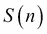。

为了简化演示，我们假设我们可以定义一个前驱函数，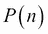，使得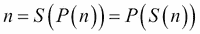，只要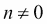。

两个自然数之间的加法可以递归地定义如下：

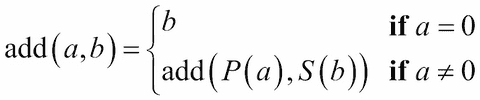

如果我们使用更常见的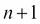和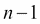而不是和，我们可以看到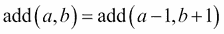。

这在 Python 中可以很好地转换，如下面的命令片段所示：

```py
def add(a,b):
 **if a == 0: return b
 **else: return add(a-1, b+1)

```

我们只是将常见的数学符号重新排列成 Python。`if`子句放在左边而不是右边。

通常，我们不会在 Python 中提供自己的函数来进行简单的加法。我们依赖于 Python 的底层实现来正确处理各种类型的算术。我们的观点是，基本的标量算术可以递归地定义。

所有这些递归定义都包括至少两种情况：非递归情况，其中函数的值直接定义，以及递归情况，其中函数的值是从对具有不同值的函数的递归评估中计算出来的。

为了确保递归会终止，重要的是要看递归情况如何计算接近定义的非递归情况的值。我们在这里的函数中通常省略了参数值的约束。例如，前面命令片段中的`add()`函数可以包括`assert a>= and b>=0`来建立输入值的约束。

在没有这些约束的情况下，`a-1`不能保证接近`a == 0`的非递归情况。

在大多数情况下，这是显而易见的。在少数情例中，可能难以证明。一个例子是 Syracuse 函数。这是终止不明确的病态情况之一。

## 实现尾递归优化

在某些函数的情况下，递归定义是经常被提及的，因为它简洁而富有表现力。最常见的例子之一是`factorial()`函数。

我们可以看到，这可以被重写为 Python 中的一个简单递归函数，从以下公式：

实现尾递归优化

前面的公式可以通过以下命令在 Python 中执行：

```py
def fact(n):
 **if n == 0: return 1
 **else: return n*fact(n-1)

```

这样做的好处是简单。在 Python 中，递归限制人为地限制了我们；我们不能计算大约 fact(997)以上的任何值。1000!的值有 2568 位数，通常超出了我们的浮点容量；在某些系统上，这大约是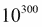。从实用的角度来看，通常会切换到`log gamma`函数，它在处理大浮点值时效果很好。

这个函数演示了典型的尾递归。函数中的最后一个表达式是对具有新参数值的函数的调用。优化编译器可以用一个很快执行的循环替换函数调用堆栈管理。

由于 Python 没有优化编译器，我们必须着眼于标量递归并对其进行优化。在这种情况下，函数涉及从*n*到*n-1*的增量变化。这意味着我们正在生成一系列数字，然后进行缩减以计算它们的乘积。

走出纯粹的函数处理，我们可以定义一个命令式的`facti()`计算如下：

```py
def facti(n):
 **if n == 0: return 1
 **f= 1
 **for i in range(2,n):
 **f= f*i
 **return f

```

这个阶乘函数的版本将计算超过 1000!的值（例如，2000!有 5733 位数）。它并不是纯粹的函数。我们已经将尾递归优化为一个有状态的循环，取决于`i`变量来维护计算的状态。

总的来说，我们在 Python 中被迫这样做，因为 Python 无法自动进行尾递归优化。然而，有些情况下，这种优化实际上并不会有所帮助。我们将看几种情况。

## 保留递归

在某些情况下，递归定义实际上是最优的。一些递归涉及分而治之的策略，可以将工作量最小化从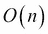到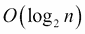。其中一个例子是平方算法的指数运算。我们可以正式地将其陈述如下：

保留递归

我们将这个过程分成三种情况，可以很容易地在 Python 中写成递归。看一下以下命令片段：

```py
def fastexp(a, n):
 **if n == 0: return 1
 **elif n % 2 == 1: return a*fastexp(a,n-1)
 **else:
 **t= fastexp(a,n//2)
 **return t*t

```

这个函数有三种情况。基本情况，`fastexp(a, 0)`方法被定义为值为 1。另外两种情况采取了两种不同的方法。对于奇数，`fastexp()`方法被递归定义。指数*n*减少了 1。简单的尾递归优化对这种情况有效。

然而，对于偶数，`fastexp()`递归使用`n/2`，将问题分成原始大小的一半。由于问题规模减小了一半，这种情况会显著加快处理速度。

我们不能简单地将这种函数重新构建为尾递归优化循环。由于它已经是最优的，我们实际上不需要进一步优化。Python 中的递归限制将强加约束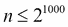，这是一个宽松的上限。

## 处理困难的尾递归优化

我们可以递归地查看**斐波那契**数的定义。以下是一个广泛使用的第*n*个斐波那契数的定义：

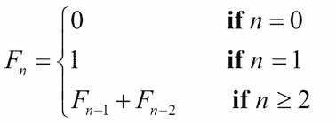

给定的斐波那契数，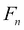，被定义为前两个数的和，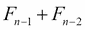。这是一个多重递归的例子：它不能简单地优化为简单的尾递归。然而，如果我们不将其优化为尾递归，我们会发现它太慢而无法使用。

以下是一个天真的实现：

```py
def fib(n):
 **if n == 0: return 0
 **if n == 1: return 1
 **return fib(n-1) + fib(n-2)

```

这遭受了多重递归问题。在计算`fib(n)`方法时，我们必须计算`fib(n-1)`和`fib(n-2)`方法。计算`fib(n-1)`方法涉及重复计算`fib(n-2)`方法。斐波那契函数的两个递归使用将使得计算量翻倍。

由于 Python 的从左到右的评估规则，我们可以计算到大约`fib(1000)`的值。然而，我们必须要有耐心。非常有耐心。

以下是一个替代方案，它重新陈述了整个算法，使用有状态变量而不是简单的递归：

```py
def fibi(n):
 **if n == 0: return 0
 **if n == 1: return 1
 **f_n2, f_n1 = 1, 1
 **for i in range(3, n+1):
 **f_n2, f_n1 = f_n1, f_n2+f_n1
 **return f_n1

```

### 注意

我们的有状态版本的这个函数从 0 开始计数，不像递归，递归是从初始值*n*开始计数。它保存了用于计算和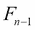的值。这个版本比递归版本快得多。

重要的是，我们无法轻松地通过明显的重写来优化递归。为了用命令式版本替换递归，我们必须仔细研究算法，确定需要多少个有状态的中间变量。

## 通过递归处理集合

在处理集合时，我们也可以递归地定义处理。例如，我们可以递归地定义`map()`函数。形式主义如下所示：

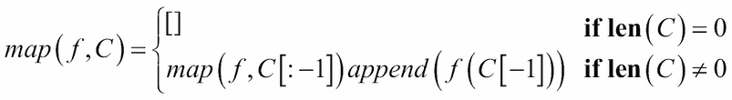

我们已经将函数映射到空集合定义为一个空序列。我们还指定了将函数应用于集合可以通过三个步骤的表达式进行递归定义。首先，将函数应用于除最后一个元素之外的所有集合，创建一个序列对象。然后将函数应用于最后一个元素。最后，将最后的计算附加到先前构建的序列中。

以下是较旧的`map()`函数的纯递归函数版本：

```py
def mapr(f, collection):
 **if len(collection) == 0: return []
 **return mapr(f, collection[:-1]) + [f(collection[-1])]

```

`mapr(f,[])`方法的值被定义为一个空的`list`对象。`mapr()`函数对非空列表的值将应用函数到列表的最后一个元素，并将其附加到从`mapr()`函数递归应用到列表头部构建的列表中。

我们必须强调这个`mapr()`函数实际上创建了一个`list`对象，类似于 Python 中较旧的`map()`函数。Python 3 中的`map()`函数是可迭代的，并不是尾递归优化的很好的例子。

虽然这是一个优雅的形式主义，但它仍然缺乏所需的尾递归优化。尾递归优化允许我们超过 1000 的递归深度，并且比这种天真的递归执行得更快。

## 集合的尾递归优化

我们有两种处理集合的一般方法：我们可以使用一个返回生成器表达式的高阶函数，或者我们可以创建一个使用`for`循环来处理集合中的每个项目的函数。这两种基本模式非常相似。

以下是一个行为类似于内置`map()`函数的高阶函数：

```py
def mapf(f, C):
 **return (f(x) for x in C)

```

我们返回了一个生成器表达式，它产生了所需的映射。这使用了一个显式的`for`循环作为一种尾调用优化。

以下是一个具有相同值的生成器函数：

```py
def mapg(f, C):
 **for x in C:
 **yield f(x)

```

这使用了一个完整的`for`语句进行所需的优化。

在这两种情况下，结果是可迭代的。我们必须在此之后做一些事情来实现一个序列对象：

```py
>>> list(mapg(lambda x:2**x, [0, 1, 2, 3, 4]))
[1, 2, 4, 8, 16]

```

为了性能和可伸缩性，在 Python 程序中基本上需要这种尾调用优化。它使代码不纯粹功能。然而，好处远远超过了纯度的缺失。为了获得简洁和表达式功能设计的好处，有助于将这些不纯粹的函数视为适当的递归。

从实用的角度来看，这意味着我们必须避免用额外的有状态处理来使集合处理函数混乱。即使我们程序的一些元素不纯粹，函数式编程的核心原则仍然有效。

## 减少和折叠 - 从多个到一个

我们可以认为`sum()`函数具有以下类型的定义：

我们可以说一个集合的总和对于一个空集合是 0。对于一个非空集合，总和是第一个元素加上剩余元素的总和。


同样地，我们可以使用两种情况递归地计算一组数字的乘积：

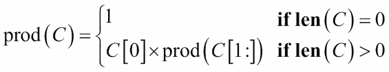

基本情况将空序列的乘积定义为 1。递归情况将乘积定义为第一个项目乘以剩余项目的乘积。

我们在序列的每个项目之间有效地折叠了`×`或`+`运算符。此外，我们对项目进行了分组，以便处理将从右到左进行。这可以称为将集合减少为单个值的右折叠方式。

在 Python 中，可以递归地定义乘积函数如下：

```py
def prodrc(collection):
 **if len(collection) == 0: return 1
 **return collection[0] * prodrc(collection[1:])

```

从技术上讲，这是正确的。这是从数学符号转换为 Python 的一个微不足道的重写。然而，它不够优化，因为它倾向于创建大量中间的`list`对象。它也仅限于与显式集合一起使用；它不能轻松地与`iterable`对象一起使用。

我们可以稍微修改这个函数，使其适用于可迭代对象，从而避免创建任何中间的`collection`对象。以下是一个可以与可迭代数据源一起使用的适当递归乘积函数：

```py
def prodri(iterable):
 **try:
 **head= next(iterable)
 **except StopIteration:
 **return 1
 **return head*prodri(iterable)

```

我们不能使用`len()`函数来查询可迭代对象有多少个元素。我们所能做的就是尝试提取`iterable`序列的头部。如果序列中没有项目，那么任何获取头部的尝试都将引发`StopIteration`异常。如果有一个项目，那么我们可以将该项目乘以序列中剩余项目的乘积。对于演示，我们必须明确地使用`iter()`函数从一个具体化的`sequence`对象中创建一个可迭代对象。在其他情境中，我们可能会有一个可迭代的结果可以使用。以下是一个例子：

```py
>>> prodri(iter([1,2,3,4,5,6,7]))
5040

```

这个递归定义不依赖于 Python 的显式状态或其他命令式特性。虽然它更加纯粹功能，但它仍然局限于处理少于 1000 个项目的集合。从实用的角度来看，我们可以使用以下类型的命令式结构来进行减少函数：

```py
def prodi(iterable):
 **p= 1
 **for n in iterable:
 **p *= n
 **return p

```

这缺乏递归限制。它包括所需的尾调用优化。此外，这将同样适用于`sequence`对象或可迭代对象。

在其他函数式语言中，这被称为`foldl`操作：运算符从左到右折叠到可迭代的值集合中。这与通常称为`foldr`操作的递归公式不同，因为在集合中的评估是从右到左进行的。

对于具有优化编译器和惰性评估的语言，fold-left 和 fold-right 的区别决定了中间结果的创建方式。这可能具有深远的性能影响，但这种区别可能并不明显。例如，fold-left 可能会立即消耗和处理序列中的第一个元素。然而，fold-right 可能会消耗序列的头部，但在整个序列被消耗之前不进行任何处理。

# 分组缩减-从多到少

一个非常常见的操作是通过某个键或指示器对值进行分组的缩减。在**SQL**中，这通常称为`SELECT GROUP BY`操作。原始数据按某些列的值分组，然后对其他列应用缩减（有时是聚合函数）。SQL 聚合函数包括`SUM`、`COUNT`、`MAX`和`MIN`。

统计摘要称为模式，是按独立变量分组的计数。Python 为我们提供了几种在计算分组值的缩减之前对数据进行分组的方法。我们将首先看两种获取分组数据的简单计数的方法。然后我们将看看计算分组数据的不同摘要的方法。

我们将使用我们在第四章*与集合一起工作*中计算的行程数据。这些数据最初是一系列纬度-经度航点。我们重新构造它以创建由`leg`的起点、终点和距离表示的航段。数据如下所示：

```py
(((37.5490162, -76.330295), (37.840832, -76.273834), 17.7246), ((37.840832, -76.273834), (38.331501, -76.459503), 30.7382), ((38.331501, -76.459503), (38.845501, -76.537331), 31.0756), ... ((38.330166, -76.458504), (38.976334, -76.473503), 38.8019))

```

一个常见的操作，可以作为有状态的映射或作为一个实现、排序的对象来处理，就是计算一组数据值的模式。当我们查看我们的行程数据时，变量都是连续的。要计算模式，我们需要量化所覆盖的距离。这也被称为**分箱**：我们将数据分组到不同的箱中。分箱在数据可视化应用中很常见。在这种情况下，我们将使用 5 海里作为每个箱的大小。

可以使用生成器表达式生成量化距离：

```py
quantized= (5*(dist//5) for start,stop,dist in trip)

```

这将把每个距离除以 5-丢弃任何小数-然后乘以 5 来计算代表四舍五入到最近 5 海里的距离的数字。

## 使用 Counter 构建映射

像`collections.Counter`方法这样的映射是进行创建计数（或总数）的优化的好方法，这些计数（或总数）是按集合中的某个值分组的。对于分组数据的更典型的函数式编程解决方案是对原始集合进行排序，然后使用递归循环来识别每个组的开始。这涉及将原始数据实现化，执行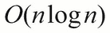排序，然后进行缩减以获得每个键的总和或计数。

我们将使用以下生成器创建一个简单的距离序列，转换为箱：

```py
quantized= (5*(dist//5) for start,stop,dist in trip)

```

我们使用截断的整数除法将每个距离除以 5，然后乘以 5，以创建一个四舍五入到最近 5 英里的值。

以下表达式创建了一个从距离到频率的`映射`：

```py
from collections import Counter
Counter(quantized)

```

这是一个有状态的对象，由技术上的命令式面向对象编程创建。然而，由于它看起来像一个函数，它似乎很适合基于函数式编程思想的设计。

如果我们打印`Counter(quantized).most_common()`函数，我们将看到以下结果：

```py
[(30.0, 15), (15.0, 9), (35.0, 5), (5.0, 5), (10.0, 5), (20.0, 5), (25.0, 5), (0.0, 4), (40.0, 3), (45.0, 3), (50.0, 3), (60.0, 3), (70.0, 2), (65.0, 1), (80.0, 1), (115.0, 1), (85.0, 1), (55.0, 1), (125.0, 1)]

```

最常见的距离约为 30 海里。记录的最短`leg`是 4 个 0 的实例。最长的航段是 125 海里。

请注意，你的输出可能与此略有不同。`most_common()`函数的结果按频率排序；相同频率的箱可能以任何顺序出现。这 5 个长度可能不总是按照所示的顺序排列：

```py
(35.0, 5), (5.0, 5), (10.0, 5), (20.0, 5), (25.0, 5)

```

## 通过排序构建映射

如果我们想要在不使用`Counter`类的情况下实现这一点，我们可以使用更多基于函数的排序和分组方法。以下是一个常见的算法：

```py
def group_sort(trip):
 **def group(data):
 **previous, count = None, 0
 **for d in sorted(data):
 **if d == previous:
 **count += 1
 **elif previous is not None: # and d != previous
 **yield previous, count
 **previous, count = d, 1
 **elif previous is None:
 **previous, count = d, 1
 **else:
 **raise Exception("Bad bad design problem.")
 **yield previous, count
 **quantized= (5*(dist//5) for start,stop,dist in trip)
 **return dict(group(quantized))

```

内部的`group()`函数遍历排序后的数据项序列。如果给定项已经被看到 - 它与`previous`中的值匹配 - 那么计数器可以递增。如果给定项与前一个值不匹配，并且前一个值不是`None`，那么我们就有了值的变化；我们可以输出前一个值和计数，并开始对新值进行新的累积计数。第三个条件只适用一次：如果前一个值从未被设置过，那么这是第一个值，我们应该保存它。

函数的最后一行从分组的项中创建一个字典。这个字典将类似于一个 Counter 字典。主要的区别在于`Counter()`函数有一个`most_common()`方法函数，而默认字典则没有。

`elif previous is None`方法是一个让人讨厌的开销。摆脱这个`elif`子句（并看到轻微的性能改进）并不是非常困难。

为了去掉额外的`elif`子句，我们需要在内部的`group()`函数中使用稍微更复杂的初始化：

```py
 **def group(data):
 **sorted_data= iter(sorted(data))
 **previous, count = next(sorted_data), 1
 **for d in sorted_data:
 **if d == previous:
 **count += 1
 **elif previous is not None: # and d != previous
 **yield previous, count
 **previous, count = d, 1
 **else:
 **raise Exception("Bad bad design problem.")
 **yield previous, count

```

这会从数据集中挑选出第一个项目来初始化`previous`变量。然后剩下的项目通过循环进行处理。这种设计与递归设计有一定的相似之处，其中我们使用第一个项目初始化递归，每次递归调用都提供下一个项目或`None`来指示没有剩余项目需要处理。

我们也可以使用`itertools.groupby()`来实现这一点。我们将在第八章*Itertools 模块*中仔细研究这个函数。

## 按键值对数据进行分组或分区

我们可能想要对分组数据应用的归约类型没有限制。我们可能有一些独立和因变量的数据。我们可以考虑通过一个独立变量对数据进行分区，并计算每个分区中值的最大值、最小值、平均值和标准差等摘要。

进行更复杂的归约的关键是将所有数据值收集到每个组中。`Counter()`函数仅仅收集相同项的计数。我们想要基于关键值创建原始项的序列。

从更一般的角度来看，每个 5 英里的箱都将包含该距离的所有腿，而不仅仅是腿的计数。我们可以将分区视为递归，或者作为`defaultdict(list)`对象的有状态应用。我们将研究`groupby()`函数的递归定义，因为它很容易设计。

显然，对于空集合`C`，`groupby(C, key)`方法返回的是空字典`dict()`。或者更有用的是空的`defaultdict(list)`对象。

对于非空集合，我们需要处理项`C[0]`，即头，然后递归处理序列`C[1:]`，即尾。我们可以使用`head, *tail = C`命令来解析集合，如下所示：

```py
>>> C= [1,2,3,4,5]
>>> head, *tail= C
>>> head
1
>>> tail
[2, 3, 4, 5]

```

我们需要执行`dict[key(head)].append(head)`方法来将头元素包含在结果字典中。然后我们需要执行`groupby(tail,key)`方法来处理剩余的元素。

我们可以创建一个如下的函数：

```py
def group_by(key, data):
 **def group_into(key, collection, dictionary):
 **if len(collection) == 0:** 
 **return dictionary
 **head, *tail= collection
 **dictionary[key(head)].append(head)
 **return group_into(key, tail, dictionary)
 **return group_into(key, data, defaultdict(list))

```

内部函数处理我们的基本递归定义。一个空集合返回提供的字典。非空集合被解析为头和尾。头用于更新字典。然后使用尾递归地更新字典中的所有剩余元素。

我们无法轻松地使用 Python 的默认值将其合并为一个函数。我们不能使用以下命令片段：

```py
def group_by(key, data, dictionary=defaultdict(list)):

```

如果我们尝试这样做，`group_by()`函数的所有用法都共享一个`defaultdict(list)`对象。Python 只构建默认值一次。可变对象作为默认值很少能实现我们想要的效果。与其尝试包含更复杂的决策来处理不可变的默认值（如`None`），我们更喜欢使用嵌套函数定义。`wrapper()`函数正确地初始化了内部函数的参数。

我们可以按距离对数据进行分组，如下所示：

```py
binned_distance = lambda leg: 5*(leg[2]//5)
by_distance= group_by(binned_distance, trip)

```

我们定义了一个简单的可重用的`lambda`，将我们的距离放入 5 纳米的箱中。然后使用提供的`lambda`对数据进行分组。

我们可以按以下方式检查分箱数据：

```py
import pprint
for distance in sorted(by_distance):
 **print(distance)
 **pprint.pprint(by_distance[distance])

```

以下是输出的样子：

```py
0.0
[((35.505665, -76.653664), (35.508335, -76.654999), 0.1731), ((35.028175, -76.682495), (35.031334, -76.682663), 0.1898), ((25.4095, -77.910164), (25.425833, -77.832664), 4.3155), ((25.0765, -77.308167), (25.080334, -77.334), 1.4235)]
5.0
[((38.845501, -76.537331), (38.992832, -76.451332), 9.7151), ((34.972332, -76.585167), (35.028175, -76.682495), 5.8441), ((30.717167, -81.552498), (30.766333, -81.471832), 5.103), ((25.471333, -78.408165), (25.504833, -78.232834), 9.7128), ((23.9555, -76.31633), (24.099667, -76.401833), 9.844)] ... 125.0
[((27.154167, -80.195663), (29.195168, -81.002998), 129.7748)]

```

这也可以写成迭代，如下所示：

```py
def partition(key, data):
 **dictionary= defaultdict(list)
 **for head in data:
 **dictionary[key(head)].append(head)
 **return dictionary

```

在进行尾递归优化时，命令式版本中的关键代码行将与递归定义相匹配。我们已经突出显示了该行以强调重写的目的是具有相同的结果。其余结构代表了我们采用的尾递归优化，这是一种常见的解决 Python 限制的方法。

## 编写更一般的分组约简

一旦我们对原始数据进行了分区，我们就可以对每个分区中的数据元素进行各种类型的约简。例如，我们可能希望每个距离箱的起始点是每个腿的最北端。

我们将介绍一些辅助函数来分解元组，如下所示：

```py
start = lambda s, e, d: s
end = lambda s, e, d: e
dist = lambda s, e, d: d
latitude = lambda lat, lon: lat
longitude = lambda lat, lon: lon

```

这些辅助函数中的每一个都期望提供一个`tuple`对象，使用`*`运算符将元组的每个元素映射到`lambda`的单独参数。一旦元组扩展为`s`、`e`和`p`参数，通过名称返回正确的参数就变得相当明显。这比尝试解释`tuple_arg[2]`方法要清晰得多。

以下是我们如何使用这些辅助函数：

```py
>>> point = ((35.505665, -76.653664), (35.508335, -76.654999), 0.1731)
>>> start(*point)
(35.505665, -76.653664)
>>> end(*point)
(35.508335, -76.654999)
>>> dist(*point)
0.1731
>>> latitude(*start(*point))
35.505665

```

我们的初始点对象是一个嵌套的三元组，包括`(0)` - 起始位置，`(1)` - 结束位置和`(2)` - 距离。我们使用我们的辅助函数提取了各种字段。

有了这些辅助函数，我们可以找到每个箱中腿的最北端起始位置：

```py
for distance in sorted(by_distance):
 **print(distance, max(by_distance[distance], key=lambda pt: latitude(*start(*pt))))

```

我们按距离分组的数据包括给定距离的每条腿。我们将每个箱中的所有腿提供给`max()`函数。我们提供给`max()`函数的`key`函数仅提取了腿的起始点的纬度。

这给我们一个关于每个距离的最北端腿的简短列表，如下所示：

```py
0.0 ((35.505665, -76.653664), (35.508335, -76.654999), 0.1731)
5.0 ((38.845501, -76.537331), (38.992832, -76.451332), 9.7151)
10.0 ((36.444168, -76.3265), (36.297501, -76.217834), 10.2537)
...** 
125.0 ((27.154167, -80.195663), (29.195168, -81.002998), 129.7748)

```

## 编写高阶约简

我们将在这里看一个高阶约简算法的示例。这将介绍一个相当复杂的主题。最简单的约简类型是从一组值中生成一个值。Python 有许多内置的约简，包括`any()`、`all()`、`max()`、`min()`、`sum()`和`len()`。

正如我们在第四章中所指出的，*处理集合*，如果我们从一些简单的约简开始，我们可以进行大量的统计计算，例如以下内容：

```py
def s0(data):
 **return sum(1 for x in data) # or len(data)
def s1(data):
 **return sum(x for x in data) # or sum(data)
def s2(data):
 **return sum(x*x for x in data)

```

这使我们能够使用几个简单的函数来定义均值、标准差、归一化值、校正，甚至最小二乘线性回归。

我们的最后一个简单约简`s2()`显示了我们如何应用现有的约简来创建高阶函数。我们可能会改变我们的方法，使其更像以下内容：

```py
def sum_f(function, data):
 **return sum(function(x) for x in data)

```

我们添加了一个函数，用于转换数据。我们将计算转换值的总和。

现在我们可以以三种不同的方式应用此函数来计算三个基本总和，如下所示：

```py
N= sum_f(lambda x: 1, data) # x**0
S= sum_f(lambda x: x, data) # x**1
S2= sum_f( lambda x: x*x, data ) # x**2

```

我们插入了一个小的`lambda`来计算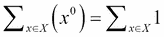，即计数，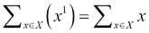，即总和，以及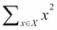，即平方和，我们可以用它来计算标准偏差。

这通常包括一个过滤器，用于拒绝某种方式未知或不合适的原始数据。我们可以使用以下命令来拒绝错误的数据：

```py
def sum_filter_f(filter, function, data):
 **return sum(function(x) for x in data if filter(x))

```

执行以下命令片段允许我们以简单的方式拒绝`None`值：

```py
count_= lambda x: 1
sum_ = lambda x: x
valid = lambda x: x is not None
N = sum_filter_f(valid, count_, data)

```

这显示了我们如何向`sum_filter_f()`函数提供两个不同的`lambda`。`filter`参数是一个拒绝`None`值的`lambda`，我们称之为`valid`以强调其含义。`function`参数是一个实现`count`或`sum`方法的`lambda`。我们可以轻松地添加一个`lambda`来计算平方和。

重要的是要注意，这个函数与其他示例类似，因为它实际上返回一个函数而不是一个值。这是高阶函数的定义特征之一，在 Python 中实现起来非常简单。

## 编写文件解析器

我们经常可以将文件解析器视为一种缩减。许多语言有两个级别的定义：语言中的低级标记和从这些标记构建的高级结构。当查看 XML 文件时，标签、标签名称和属性名称形成了这种低级语法；由 XML 描述的结构形成了高级语法。

低级词法扫描是一种将单个字符组合成标记的缩减。这与 Python 的生成器函数设计模式非常匹配。我们经常可以编写如下的函数：

```py
Def lexical_scan( some_source ):
 **for char in some_source:
 **if some_pattern completed: yield token
 **else: accumulate token

```

对于我们的目的，我们将依赖于低级文件解析器来处理这些问题。我们将使用 CSV、JSON 和 XML 包来管理这些细节。我们将基于这些包编写高级解析器。

我们仍然依赖于两级设计模式。一个低级解析器将产生原始数据的有用的规范表示。它将是一个文本元组的迭代器。这与许多种类的数据文件兼容。高级解析器将产生对我们特定应用程序有用的对象。这些可能是数字元组，或者是命名元组，或者可能是一些其他类的不可变 Python 对象。

我们在第四章*处理集合*中提供了一个低级解析器的示例。输入是一个 KML 文件；KML 是地理信息的 XML 表示。解析器的基本特征看起来类似于以下命令片段：

```py
def comma_split(text):
 **return text.split(",")
def row_iter_kml(file_obj):
 **ns_map={
 **"ns0": "http://www.opengis.net/kml/2.2",
 **"ns1": "http://www.google.com/kml/ext/2.2"}
 **doc= XML.parse(file_obj)
 **return (comma_split(coordinates.text)
 **for coordinates in doc.findall("./ns0:Document/ns0:Folder/ns0:Placemark/ns0:Point/ns0:coordinates", ns_map)

```

`row_iter_kml()`函数的主要部分是 XML 解析，它允许我们使用`doc.findall()`函数来迭代文档中的`<ns0:coordinates>`标签。我们使用了一个名为`comma_split()`的函数来解析这个标签的文本为一个三元组的值。

这专注于使用规范化的 XML 结构。文档大部分符合数据库设计师对**第一范式**的定义，也就是说，每个属性都是原子的，只有一个值。XML 数据中的每一行都具有相同的列，数据类型一致。数据值并不是完全原子的；我们需要将经度、纬度和海拔分割成原子字符串值。

大量数据——xml 标签、属性和其他标点——被缩减为一个相对较小的体积，其中只包括浮点纬度和经度值。因此，我们可以将解析器视为一种缩减。

我们需要一个更高级别的转换来将文本的元组映射为浮点数。此外，我们希望丢弃海拔，并重新排列经度和纬度。这将产生我们需要的特定于应用程序的元组。我们可以使用以下函数进行此转换：

```py
def pick_lat_lon(lon, lat, alt):
 **return lat, lon
def float_lat_lon(row_iter):
 **return (tuple(map(float, pick_lat_lon(*row)))for row in row_iter)

```

关键工具是`float_lat_lon()`函数。这是一个返回生成器表达式的高阶函数。生成器使用`map()`函数将`float()`函数转换应用到`pick_lat_lon()`类的结果上。我们使用`*row`参数将行元组的每个成员分配给`pick_lat_lon()`函数的不同参数。然后该函数以所需顺序返回所选项目的元组。

我们可以按以下方式使用此解析器：

```py
with urllib.request.urlopen("file:./Winter%202012-2013.kml") as source:
 **trip = tuple(float_lat_lon(row_iter_kml(source)))

```

这将为原始 KML 文件中路径上的每个航路点构建一个元组表示。它使用低级解析器从原始表示中提取文本数据行。它使用高级解析器将文本项转换为更有用的浮点值元组。在这种情况下，我们没有实现任何验证。

### 解析 CSV 文件

在第三章，“函数，迭代器和生成器”中，我们看到了另一个例子，我们解析了一个不是规范化形式的 CSV 文件：我们不得不丢弃标题行才能使其有用。为了做到这一点，我们使用了一个简单的函数，提取了标题并返回了剩余行的迭代器。

数据如下：

```py
Anscombe's quartet
I  II  III  IV
x  y  x  y  x  y  x  y
10.0  8.04  10.0  9.14  10.0  7.46  8.0  6.58
8.0  6.95  8.0  8.14  8.0  6.77  8.0  5.76
...** 
5.0  5.68  5.0  4.74  5.0  5.73  8.0  6.89

```

列由制表符分隔。另外还有三行标题，我们可以丢弃。

以下是基于 CSV 的解析器的另一个版本。我们将其分为三个函数。第一个`row_iter()`函数返回制表符分隔文件中行的迭代器。函数如下所示：

```py
def row_iter_csv(source):
 **rdr= csv.reader(source, delimiter="\t")
 **return rdr

```

这是围绕 CSV 解析过程的简单包装。当我们回顾以前用于 XML 和纯文本的解析器时，这是那些解析器缺少的东西。生成可迭代的行元组可以是规范化数据解析器的常见特征。

一旦我们有了一行元组，我们可以传递包含可用数据的行，并拒绝包含其他元数据的行，例如标题和列名。我们将介绍一个辅助函数，我们可以使用它来执行一些解析，以及一个`filter()`函数来验证数据行。

以下是转换：

```py
def float_none(data):
 **try:
 **data_f= float(data)
 **return data_f
 **except ValueError:
 **return None

```

此函数处理将单个`string`转换为`float`值，将错误数据转换为`None`值。我们可以将此函数嵌入到映射中，以便将行的所有列转换为`float`或`None`值。`lambda`如下所示：

```py
float_row = lambda row: list(map(float_none, row))

```

以下是基于使用`all()`函数的行级验证器，以确保所有值都是`float`（或没有值是`None`）：

```py
all_numeric = lambda row: all(row) and len(row) == 8

```

以下是一个高阶函数，它结合了行级转换和过滤：

```py
def head_filter_map(validator, converter, validator, row_iter):
 **return filter(all_validator, map(converter, row_iter))

```

此函数为我们提供了一个稍微更完整的解析输入文件的模式。基础是一个低级函数，它迭代文本元组。然后我们可以将其包装在函数中以转换和验证转换后的数据。对于文件要么处于第一正规形式（所有行都相同），要么简单验证器可以拒绝其他行的情况，这种设计非常有效。

然而，并非所有解析问题都如此简单。一些文件的重要数据位于必须保留的标题或尾随行中，即使它与文件的其余部分的格式不匹配。这些非规范化文件将需要更复杂的解析器设计。

### 解析带有标题的纯文本文件

在第三章，“函数，迭代器和生成器”中，`Crayola.GPL`文件是在没有显示解析器的情况下呈现的。该文件如下所示：

```py
GIMP Palette
Name: Crayola
Columns: 16
#
239 222 205  Almond
205 149 117  Antique Brass
```

我们可以使用正则表达式解析文本文件。我们需要使用过滤器来读取（和解析）标题行。我们还希望返回一个可迭代的数据行序列。这种相当复杂的两部分解析完全基于两部分 - 头部和尾部 - 文件结构。

以下是处理头部和尾部的低级解析器：

```py
def row_iter_gpl(file_obj):
 **header_pat= re.compile(r"GIMP Palette\nName:\s*(.*?)\nColumns:\s*(.*?)\n#\n", re.M)
 **def read_head(file_obj):
 **match= header_pat.match("".join( file_obj.readline() for _ in range(4)))
 **return (match.group(1), match.group(2)), file_obj
 **def read_tail(headers, file_obj):
 **return headers, (next_line.split() for next_line in file_obj)
 **return read_tail(*read_head(file_obj))

```

我们已经定义了一个正则表达式，用于解析标题的所有四行，并将其分配给`header_pat`变量。有两个内部函数用于解析文件的不同部分。`read_head()`函数解析标题行。它通过读取四行并将它们合并成一个长字符串来实现这一点。然后使用正则表达式对其进行解析。结果包括标题中的两个数据项以及一个准备处理额外行的迭代器。

`read_tail()`函数接受`read_head()`函数的输出，并解析剩余行的迭代器。标题行的解析信息形成一个两元组，与剩余行的迭代器一起传递给`read_tail()`函数。剩余行仅仅是按空格分割，因为这符合 GPL 文件格式的描述。

### 注意

有关更多信息，请访问以下链接：

[`code.google.com/p/grafx2/issues/detail?id=518`](https://code.google.com/p/grafx2/issues/detail?id=518)。

一旦我们将文件的每一行转换为规范的字符串元组格式，我们就可以对这些数据应用更高级别的解析。这涉及转换和（如果必要）验证。

以下是一个更高级别的解析器命令片段：

```py
def color_palette(headers, row_iter):
 **name, columns = headers
 **colors = tuple(Color(int(r), int(g), int(b), " ".join(name))for r,g,b,*name in row_iter)
 **return name, columns, colors

```

这个函数将使用低级`row_iter_gpl()`解析器的输出：它需要标题和迭代器。这个函数将使用多重赋值将`color`数字和剩余单词分成四个变量，`r`、`g`、`b`和`name`。使用`*name`参数确保所有剩余值都将被分配给名字作为一个`tuple`。然后`" ".join(name)`方法将单词连接成一个以空格分隔的字符串。

以下是我们如何使用这个两层解析器：

```py
with open("crayola.gpl") as source:
 **name, columns, colors = color_palette(*row_iter_gpl(source))
 **print(name, columns, colors)

```

我们将高级解析器应用于低级解析器的结果。这将返回标题和从`Color`对象序列构建的元组。

# 总结

在这一章中，我们已经详细讨论了两个重要的函数式编程主题。我们详细讨论了递归。许多函数式编程语言编译器将优化递归函数，将函数尾部的调用转换为循环。在 Python 中，我们必须通过使用显式的`for`循环而不是纯函数递归来手动进行尾调用优化。

我们还研究了包括`sum()`、`count()`、`max()`和`min()`函数在内的归约算法。我们研究了`collections.Counter()`函数和相关的`groupby()`归约。

我们还研究了解析（和词法扫描）如何类似于归约，因为它们将标记序列（或字符序列）转换为具有更复杂属性的高阶集合。我们研究了一种将解析分解为尝试生成原始字符串元组的较低级别和创建更有用的应用对象的较高级别的设计模式。

在下一章中，我们将研究一些适用于使用命名元组和其他不可变数据结构的技术。我们将研究一些使有状态对象不必要的技术。虽然有状态的对象并不是纯粹的函数式，但类层次结构的概念可以用来打包相关的方法函数定义。
