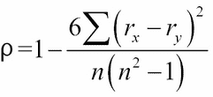
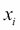
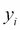

# 第七章：其他元组技术

我们所看到的许多示例要么是`scalar`函数，要么是从小元组构建的相对简单的结构。我们经常可以利用 Python 的不可变`namedtuple`来构建复杂的数据结构。我们将看看我们如何使用以及如何创建`namedtuples`。我们还将研究不可变的`namedtuples`可以用来代替有状态对象类的方法。

面向对象编程的一个有益特性是逐步创建复杂数据结构的能力。在某些方面，对象只是函数结果的缓存；这通常与功能设计模式很匹配。在其他情况下，对象范式提供了包括复杂计算的属性方法。这更适合功能设计思想。

然而，在某些情况下，对象类定义被用于有状态地创建复杂对象。我们将研究一些提供类似功能的替代方案，而不涉及有状态对象的复杂性。我们可以识别有状态的类定义，然后包括元属性以对方法函数调用的有效或必需排序。诸如*如果在调用 X.q()之前调用 X.p()，结果是未定义的*之类的陈述是语言形式主义之外的，是类的元属性。有时，有状态的类包括显式断言和错误检查的开销，以确保方法按正确的顺序使用。如果我们避免有状态的类，我们就消除了这些开销。

我们还将研究一些在任何多态类定义之外编写通用函数的技术。显然，我们可以依赖`Callable`类来创建多态类层次结构。在某些情况下，这可能是功能设计中不必要的开销。

# 使用不可变的命名元组作为记录

在第三章，“函数、迭代器和生成器”中，我们展示了处理元组的两种常见技术。我们也暗示了处理复杂结构的第三种方法。根据情况，我们可以执行以下任一操作：

+   使用`lambdas`（或函数）通过索引选择一个命名项目

+   使用`lambdas`（或函数）与`*parameter`通过参数名称选择一个项目，该参数名称映射到一个索引

+   使用`namedtuples`通过属性名称或索引选择项目

我们的旅行数据，介绍在第四章，“与集合一起工作”，有一个相当复杂的结构。数据最初是一个普通的时间序列位置报告。为了计算覆盖的距离，我们将数据转换为一个具有起始位置、结束位置和距离的嵌套三元组的序列。

序列中的每个项目如下所示为一个三元组：

```py
first_leg= ((37.54901619777347, -76.33029518659048), (37.840832, -76.273834), 17.7246)

```

这是在切萨皮克湾上两点之间的短途旅行。

嵌套元组可能相当难以阅读；例如，诸如`first_leg[0][0]`之类的表达式并不是很有信息量。

让我们看看从`tuple`中选择值的三种替代方案。第一种技术涉及定义一些简单的选择函数，可以按索引位置从`tuple`中选择项目：

```py
start= lambda leg: leg[0]
end= lambda leg: leg[1]
distance= lambda leg: leg[2]
latitude= lambda pt: pt[0]
longitude= lambda pt: pt[1]

```

有了这些定义，我们可以使用`latitude(start(first_leg))`来引用特定的数据片段。

这些定义并没有提供有关所涉及的数据类型的指导。我们可以使用简单的命名约定来使这一点更加清晰。以下是一些使用后缀的选择函数的示例：

```py
start_point = lambda leg: leg[0]
distance_nm= lambda leg: leg[2]
latitude_value= lambda point: point[0]

```

当使用得当时，这可能是有帮助的。它也可能退化为一个复杂的匈牙利符号，作为每个变量的前缀（或后缀）。

第二种技术使用`*parameter`符号来隐藏索引位置的一些细节。以下是一些使用`*`符号的选择函数：

```py
start= lambda start, end, distance: start
end= lambda start, end, distance: end
distance= lambda start, end, distance: distance
latitude= lambda lat, lon: lat
longitude= lambda lat, lon: lon

```

有了这些定义，我们可以使用`latitude(*start(*first_leg))`来引用特定的数据。这有清晰度的优势。在这些选择函数的`tuple`参数前面看到`*`运算符可能有点奇怪。

第三种技术是`namedtuple`函数。在这种情况下，我们有嵌套的命名元组函数，如下所示：

```py
Leg = namedtuple("Leg", ("start", "end", "distance"))
Point = namedtuple("Point", ("latitude", "longitude"))
```

这使我们可以使用`first_leg.start.latitude`来获取特定的数据。从前缀函数名称到后缀属性名称的变化可以被视为一种有用的强调。也可以被视为语法上的混乱转变。

我们还将在构建原始数据的过程中，用适当的`Leg()`或`Point()`函数调用替换`tuple()`函数。我们还必须找到一些隐式创建元组的`return`和`yield`语句。

例如，看一下以下代码片段：

```py
def float_lat_lon(row_iter):
 **return (tuple(map(float, pick_lat_lon(*row))) for row in row_iter)

```

前面的代码将被更改为以下代码片段：

```py
def float_lat_lon(row_iter):
 **return (Point(*map(float, pick_lat_lon(*row))) for row in row_iter)

```

这将构建`Point`对象，而不是`浮点`坐标的匿名元组。

同样，我们可以引入以下内容来构建`Leg`对象的完整行程：

```py
with urllib.request.urlopen("file:./Winter%202012-2013.kml") as source:
 **path_iter = float_lat_lon(row_iter_kml(source))
 **pair_iter = legs(path_iter)
 **trip_iter = (Leg(start, end, round(haversine(start, end),4)) for start,end in pair_iter)
 **trip= tuple(trip_iter)

```

这将遍历基本路径点，将它们配对以为每个`Leg`对象创建`start`和`end`。然后使用这些配对使用`start`点、结束点和来自第四章的`haversine()`函数构建`Leg`实例，*与集合一起工作*。

当我们尝试打印`trip`对象时，它将如下所示：

```py
(Leg(start=Point(latitude=37.54901619777347, longitude=-76.33029518659048), end=Point(latitude=37.840832, longitude=-76.273834), distance=17.7246), Leg(start=Point(latitude=37.840832, longitude=-76.273834), end=Point(latitude=38.331501, longitude=-76.459503), distance=30.7382),...
Leg(start=Point(latitude=38.330166, longitude=-76.458504), end=Point(latitude=38.976334, longitude=-76.473503), distance=38.8019))

```

### 注意

重要的是要注意，`haversine()`函数是用简单的元组编写的。我们已经将这个函数与`namedtuples`一起重用。由于我们仔细保留了参数的顺序，Python 优雅地处理了这种表示上的小改变。

在某些情况下，`namedtuple`函数增加了清晰度。在其他情况下，`namedtuple`是从前缀到后缀的语法不必要的变化。

# 使用功能构造函数构建命名元组

我们可以使用三种方法构建`namedtuple`实例。我们选择使用的技术通常取决于在对象构建时有多少额外的信息可用。

在前一节的示例中，我们展示了三种技术中的两种。我们将在这里强调设计考虑因素。它包括以下选择：

+   我们可以根据它们的位置提供参数值。当我们评估一个或多个表达式时，这种方法非常有效。我们在将`haversine()`函数应用于`start`和`end`点以创建`Leg`对象时使用了它。

```py
Leg(start, end, round(haversine(start, end),4))

```

+   我们可以使用`*argument`符号根据元组中的位置分配参数。当我们从另一个可迭代对象或现有元组中获取参数时，这种方法非常有效。我们在使用`map()`将`float()`函数应用于`latitude`和`longitude`值时使用了它。

```py
Point(*map(float, pick_lat_lon(*row)))

```

+   我们可以使用显式的关键字赋值。虽然在前面的示例中没有使用，但我们可能会看到类似以下的东西，以使关系更加明显：

```py
Point(longitude=float(row[0]), latitude=float(row[1]))

```

拥有多种创建`namedtuple`实例的灵活性是有帮助的。这使我们更容易地转换数据结构。我们可以强调与阅读和理解应用程序相关的数据结构特性。有时，索引号 0 或 1 是需要强调的重要事项。其他时候，`start`、`end`和`distance`的顺序是重要的。

# 通过使用元组族避免有状态的类

在之前的几个示例中，我们展示了**Wrap-Unwrap**设计模式的概念，它允许我们使用不可变的元组和`namedtuples`。这种设计的重点是使用包装其他不可变对象的不可变对象，而不是可变的实例变量。

两组数据之间的常见统计相关度测量是 Spearman 等级相关度。这比较了两个变量的排名。我们将比较相对顺序，而不是尝试比较可能具有不同规模的值。有关更多信息，请访问[`en.wikipedia.org/wiki/Spearman%27s_rank_correlation_coefficient`](http://en.wikipedia.org/wiki/Spearman%27s_rank_correlation_coefficient)。

计算 Spearman 等级相关性需要为每个观察分配一个排名值。我们似乎应该能够使用`enumerate(sorted())`来做到这一点。给定两组可能相关的数据，我们可以将每组转换为一系列排名值，并计算相关度的度量。

我们将应用 Wrap-Unwrap 设计模式来做到这一点。我们将为了计算相关系数而将数据项与其排名`wrap`起来。

在第三章中，*函数、迭代器和生成器*，我们展示了如何解析一个简单的数据集。我们将从该数据集中提取四个样本，如下所示：

```py
from ch03_ex5 import series, head_map_filter, row_iter
with open("Anscombe.txt") as source:
 **data = tuple(head_map_filter(row_iter(source)))
 **series_I= tuple(series(0,data))
 **series_II= tuple(series(1,data))
 **series_III= tuple(series(2,data))
 **series_IV= tuple(series(3,data))

```

这些系列中的每一个都是`Pair`对象的`tuple`。每个`Pair`对象都有`x`和`y`属性。数据如下所示：

```py
(Pair(x=10.0, y=8.04), Pair(x=8.0, y=6.95), …, Pair(x=5.0, y=5.68))

```

我们可以应用`enumerate()`函数来创建值序列，如下所示：

```py
y_rank= tuple(enumerate(sorted(series_I, key=lambda p: p.y)))
xy_rank= tuple(enumerate(sorted(y_rank, key=lambda rank: rank[1].x)))

```

第一步将创建简单的两元组，`(0)`是排名数字，`(1)`是原始的`Pair`对象。由于数据是按每对中的`y`值排序的，排名值将反映这种排序。

序列将如下所示：

```py
((0, Pair(x=8.0, y=5.25)), (1, Pair(x=8.0, y=5.56)), ..., (10, Pair(x=19.0, y=12.5)))

```

第二步将把这两个元组再包装一层。我们将按照原始原始数据中的*x*值进行排序。第二个枚举将按照每对中的*x*值进行排序。

我们将创建更深层次的嵌套对象，应该如下所示：

```py
((0, (0, Pair(x=4.0, y=4.26))), (1, (2, Pair(x=5.0, y=5.68))), ..., (10, (9, Pair(x=14.0, y=9.96))))

```

原则上，我们现在可以使用*x*和*y*的排名来计算两个变量之间的秩序相关。然而，提取表达式相当尴尬。对于数据集中的每个排名样本`r`，我们必须比较`r[0]`和`r[1][0]`。

为了克服这些尴尬的引用，我们可以编写选择器函数如下：

```py
x_rank = lambda ranked: ranked[0]
y_rank= lambda ranked: ranked[1][0]
raw = lambda ranked: ranked[1][1]

```

这样我们就可以使用`x_rank(r)`和`y_rank(r)`来计算相关性，使得引用值不那么尴尬。

我们已经两次`wrapped`原始的`Pair`对象，创建了带有排名值的新元组。我们避免了有状态的类定义来逐步创建复杂的数据结构。

为什么要创建深度嵌套的元组？答案很简单：懒惰。解包`tuple`并构建新的平坦`tuple`所需的处理只是耗时的。在现有的`tuple`上“wrap”涉及的处理更少。放弃深度嵌套结构有一些令人信服的理由。

我们希望做两个改进；它们如下：

我们希望有一个更扁平的数据结构。使用嵌套的`(x rank, (y rank, Pair()))`的`tuple`并不感觉表达或简洁：

+   `enumerate()`函数不能正确处理并列。如果两个观察结果具有相同的值，则它们应该获得相同的排名。一般规则是对相等的观察位置进行平均。序列`[0.8, 1.2, 1.2, 2.3, 18]`应该具有排名值`1, 2.5, 2.5, 4`。在位置 2 和 3 上的两个并列具有它们的共同排名的中点值`2.5`。

## 分配统计排名

我们将把排名排序问题分为两部分。首先，我们将研究一个通用的高阶函数，我们可以用它来为`Pair`对象的*x*或*y*值分配排名。然后，我们将使用这个函数来创建一个`wrapper`，包含*x*和*y*的排名。这将避免深度嵌套的结构。

以下是一个将为数据集中的每个观察创建一个等级顺序的函数：

```py
from collections import defaultdict
def rank(data, key=lambda obj:obj):** 
 **def rank_output(duplicates, key_iter, base=0):
 **for k in key_iter:
 **dups= len(duplicates[k])
 **for value in duplicates[k]:
 **yield (base+1+base+dups)/2, value
 **base += dups
 **def build_duplicates(duplicates, data_iter, key):
 **for item in data_iter:
 **duplicates[key(item)].append(item)
 **return duplicates
 **duplicates= build_duplicates(defaultdict(list), iter(data), key)
 **return rank_output(duplicates, iter(sorted(duplicates)), 0)

```

我们创建排名顺序的函数依赖于创建一个类似于`Counter`的对象，以发现重复值。我们不能使用简单的`Counter`函数，因为它使用整个对象来创建一个集合。我们只想使用应用于每个对象的键函数。这使我们可以选择`Pair`对象的*x*或*y*值。

在这个例子中，`duplicates`集合是一个有状态的对象。我们本来可以编写一个适当的递归函数。然后我们需要进行尾递归优化，以允许处理大量数据的工作。我们在这里展示了该递归的优化版本。

作为对这种递归的提示，我们提供了`build_duplicates()`的参数，以暴露状态作为参数值。显然，递归的基本情况是当`data_iter`为空时。当`data_iter`不为空时，从旧集合和头部`next(data_iter)`构建一个新集合。`build_duplicates()`的递归评估将处理`data_iter`的尾部中的所有项目。

同样，我们可以编写两个适当的递归函数来发出分配了排名值的集合。同样，我们将该递归优化为嵌套的`for`循环。为了清楚地说明我们如何计算排名值，我们包括了范围的低端（`base+1`）和范围的高端（`base+dups`），并取这两个值的中点。如果只有一个`duplicate`，我们评估`(2*base+2)/2`，这有一个通用解决方案的优势。

以下是我们如何测试这个确保它工作。

```py
>>> list(rank([0.8, 1.2, 1.2, 2.3, 18]))
[(1.0, 0.8), (2.5, 1.2), (2.5, 1.2), (4.0, 2.3), (5.0, 18)]
>>> data= ((2, 0.8), (3, 1.2), (5, 1.2), (7, 2.3), (11, 18))
>>> list(rank(data, key=lambda x:x[1]))
[(1.0, (2, 0.8)), (2.5, (3, 1.2)), (2.5, (5, 1.2)), (4.0, (7, 2.3)), (5.0, (11, 18))]

```

示例数据包括两个相同的值。结果排名将位置 2 和 3 分开，以分配位置 2.5 给两个值。这是计算两组值之间的 Spearman 秩相关性的常见统计做法。

### 注意

`rank()`函数涉及重新排列输入数据以发现重复值。如果我们想在每对中的`x`和`y`值上进行排名，我们需要两次重新排序数据。

## 重新包装而不是状态改变

我们有两种一般策略来进行包装；它们如下：

+   **并行性**：我们可以创建数据的两个副本并对每个副本进行排名。然后，我们需要重新组合这两个副本，以便最终结果包括两个排名。这可能有点尴尬，因为我们需要以某种方式合并两个可能按不同顺序排列的序列。

+   **串行性**：我们可以计算一个变量的排名，并将结果保存为一个包含原始原始数据的包装器。然后，我们可以对另一个变量上的这些包装数据进行排名。虽然这可能会创建一个复杂的结构，但我们可以稍微优化它，以创建最终结果的一个更平坦的包装器。

以下是我们如何创建一个对象，该对象使用基于`y`值的排名顺序包装一对：

```py
Ranked_Y= namedtuple("Ranked_Y", ("r_y", "raw",))
def rank_y(pairs):
 **return (Ranked_Y(*row) for row in rank(pairs, lambda pair: pair.y))

```

我们定义了一个包含`y`值排名加上原始（`raw`）值的`namedtuple`函数。我们的`rank_y()`函数将通过使用一个`lambda`选择每个`pairs`对象的`y`值来应用`rank()`函数，从而创建这个元组的实例。然后我们创建了结果的两个元组的实例。

我们可以提供以下输入：

```py
>>> data = (Pair(x=10.0, y=8.04), Pair(x=8.0, y=6.95), ..., Pair(x=5.0, y=5.68))

```

我们可以得到以下输出：

```py
>>> list(rank_y(data))
[Ranked_Y(r_y=1.0, raw=Pair(x=4.0, y=4.26)), Ranked_Y(r_y=2.0, raw=Pair(x=7.0, y=4.82)), ... Ranked_Y(r_y=11.0, raw=Pair(x=12.0, y=10.84))]

```

原始的`Pair`对象已经被包装在一个包含排名的新对象中。这还不够；我们需要再次包装一次，以创建一个既有 x 排名信息又有 y 排名信息的对象。

## 重新包装而不是状态改变

我们可以使用一个名为`Ranked_X`的`namedtuple`，其中包含两个属性：`r_x`和`ranked_y`。`ranked_y`属性是`Ranked_Y`的一个实例，它具有两个属性：`r_y`和`raw`。虽然这看起来很简单，但由于`r_x`和`r_y`值在一个平坦结构中不是简单的对等项，因此生成的对象令人讨厌。我们将引入一个稍微更复杂的包装过程，以产生一个稍微更简单的结果。

我们希望输出看起来像这样：

```py
Ranked_XY= namedtuple("Ranked_XY", ("r_x", "r_y", "raw",))

```

我们将创建一个带有多个对等属性的平面`namedtuple`。这种扩展通常比深度嵌套的结构更容易处理。在某些应用中，我们可能有许多转换。对于这个应用程序，我们只有两个转换：x 排名和 y 排名。我们将把这分为两个步骤。首先，我们将看一个类似之前所示的简单包装，然后是一个更一般的解包-重新包装。

以下是`x-y`排名建立在 y 排名的基础上：

```py
def rank_xy(pairs):
 **return (Ranked_XY(r_x=r_x, r_y=rank_y_raw[0], raw=rank_y_raw[1])
 **for r_x, rank_y_raw in rank(rank_y(pairs), lambda r: r.raw.x))

```

我们使用`rank_y()`函数构建了`Rank_Y`对象。然后，我们将`rank()`函数应用于这些对象，以便按照原始的`x`值对它们进行排序。第二个排名函数的结果将是两个元组，其中`(0)`是`x`排名，`(1)`是`Rank_Y`对象。我们从`x`排名(`r_x`)、`y`排名(`rank_y_raw[0]`)和原始对象(`rank_y_raw[1]`)构建了一个`Ranked_XY`对象。

在这第二个函数中，我们展示了一种更一般的方法来向`tuple`添加数据。`Ranked_XY`对象的构造显示了如何从数据中解包值并重新包装以创建第二个更完整的结构。这种方法通常可以用来向`tuple`引入新变量。

以下是一些样本数据：

```py
>>> data = (Pair(x=10.0, y=8.04), Pair(x=8.0, y=6.95), ..., Pair(x=5.0, y=5.68))

```

这使我们可以创建以下排名对象：

```py
>>> list(rank_xy(data))
[Ranked_XY(r_x=1.0, r_y=1.0, raw=Pair(x=4.0, y=4.26)), Ranked_XY(r_x=2.0, r_y=3.0, raw=Pair(x=5.0, y=5.68)), ...,** 
Ranked_XY(r_x=11.0, r_y=10.0, raw=Pair(x=14.0, y=9.96))]

```

一旦我们有了适当的*x*和*y*排名的数据，我们就可以计算 Spearman 秩相关值。我们可以从原始数据计算 Pearson 相关性。

我们的多排名方法涉及分解一个`tuple`并构建一个新的、平坦的`tuple`，其中包含我们需要的附加属性。当从源数据计算多个派生值时，我们经常需要这种设计。

## 计算 Spearman 秩相关

Spearman 秩相关是两个变量排名之间的比较。它巧妙地绕过了值的大小，甚至在关系不是线性的情况下，它通常也能找到相关性。公式如下：



这个公式告诉我们，我们将对观察值的所有对的排名差异进行求和，和。这个 Python 版本依赖于`sum()`和`len()`函数，如下所示：

```py
def rank_corr(pairs):
 **ranked= rank_xy(pairs)
 **sum_d_2 = sum((r.r_x - r.r_y)**2 for r in ranked)
 **n = len(pairs)
 **return 1-6*sum_d_2/(n*(n**2-1))

```

我们为每对`pair`创建了`Rank_XY`对象。有了这个，我们就可以从这些对中减去`r_x`和`r_y`的值来比较它们的差异。然后我们可以对差异进行平方和求和。

关于统计学的一篇好文章将提供关于系数含义的详细指导。约为 0 的值意味着两个数据点系列的数据排名之间没有相关性。散点图显示了点的随机分布。约+1 或-1 的值表示两个值之间的强关系。图表显示了明显的线条或曲线。

以下是基于安斯库姆四重奏系列 I 的一个例子：

```py
>>> data = (Pair(x=10.0, y=8.04), Pair(x=8.0, y=6.95), …, Pair(x=5.0, y=5.68))
>>> round(rank_corr( data ), 3)
0.818

```

对于这个特定的数据集，相关性很强。

在第四章中，*处理集合*，我们展示了如何计算 Pearson 相关系数。我们展示的`corr()`函数与两个独立的值序列一起工作。我们可以将它与我们的`Pair`对象序列一起使用，如下所示：

```py
import ch04_ex4
def pearson_corr(pairs):
 **X = tuple(p.x for p in pairs)
 **Y = tuple(p.y for p in pairs)
 **return ch04_ex4.corr(X, Y)

```

我们已经解开了`Pair`对象，得到了我们可以与现有的`corr()`函数一起使用的原始值。这提供了一个不同的相关系数。Pearson 值基于两个序列之间标准化值的比较。对于许多数据集，Pearson 和 Spearman 相关性之间的差异相对较小。然而，对于一些数据集，差异可能相当大。

要了解对探索性数据分析具有多个统计工具的重要性，请比较 Anscombe's Quartet 中四组数据的 Spearman 和 Pearson 相关性。

# 多态和 Pythonic 模式匹配

一些函数式编程语言提供了处理静态类型函数定义的巧妙方法。问题在于，我们想要编写的许多函数对于数据类型来说是完全通用的。例如，我们的大多数统计函数对于`integer`或`floating-point`数字来说是相同的，只要除法返回的值是`numbers.Real`的子类（例如`Decimal`，`Fraction`或`float`）。为了使单个通用定义适用于多种数据类型，编译器使用了复杂的类型或模式匹配规则。

与静态类型的函数式语言的（可能）复杂特性不同，Python 通过动态选择基于正在使用的数据类型的操作符的最终实现来改变问题。这意味着编译器不会验证我们的函数是否期望和产生正确的数据类型。我们通常依赖单元测试来解决这个问题。

在 Python 中，我们实际上是在编写通用定义，因为代码不绑定到任何特定的数据类型。Python 运行时将使用一组简单的匹配规则来定位适当的操作。语言参考手册中的*3.3.7 强制规则*部分和库中的`numbers`模块提供了关于操作到特殊方法名称映射的详细信息。

在罕见的情况下，我们可能需要根据数据元素的类型有不同的行为。我们有两种方法来解决这个问题，它们如下：

+   我们可以使用`isinstance()`函数来区分不同的情况。

+   我们可以创建自己的`numbers.Number`或`tuple`的子类，并实现适当的多态特殊方法名称。

在某些情况下，我们实际上需要两者都做，以便包含适当的数据类型转换。

当我们回顾前一节中的排名示例时，我们紧密地与将排名应用于简单对的想法联系在一起。虽然这是 Spearman 相关性的定义方式，但我们可能有一个多变量数据集，并且需要对所有变量进行排名相关性。

我们需要做的第一件事是概括我们对排名信息的想法。以下是一个处理排名元组和原始数据元组的`namedtuple`：

```py
Rank_Data = namedtuple("Rank_Data", ("rank_seq", "raw"))

```

对于任何特定的`Rank_Data`，比如`r`，我们可以使用`r.rank_seq[0]`来获取特定的排名，使用`r.raw`来获取原始观察值。

我们将为我们的排名函数添加一些语法糖。在许多以前的例子中，我们要求要么是一个可迭代对象，要么是一个集合。`for`语句在处理任一种情况时都很优雅。但是，我们并不总是使用`for`语句，对于一些函数，我们不得不明确使用`iter()`来使一个集合成为一个`iterable`。我们可以通过简单的`isinstance()`检查来处理这种情况，如下面的代码片段所示：

```py
def some_function(seq_or_iter):
 **if not isinstance(seq_or_iter,collections.abc.Iterator):
 **yield from some_function(iter(seq_or_iter), key)
 **return
 **# Do the real work of the function using the iterable

```

我们已经包含了一个类型检查，以处理两个集合之间的小差异，它不适用于`next()`和一个支持`next()`的可迭代对象。

在我们的排名函数的上下文中，我们将使用这种设计模式的变体：

```py
def rank_data(seq_or_iter, key=lambda obj:obj):
 **# Not a sequence? Materialize a sequence object
 **if isinstance(seq_or_iter, collections.abc.Iterator):
 **yield from rank_data(tuple(seq_or_iter), key)
 **data = seq_or_iter
 **head= seq_or_iter[0]
 **# Convert to Rank_Data and process.
 **if not isinstance(head, Rank_Data):
 **ranked= tuple(Rank_Data((),d) for d in data)
 **for r, rd in rerank(ranked, key):
 **yield Rank_Data(rd.rank_seq+(r,), rd.raw)
 **return
 **# Collection of Rank_Data is what we prefer.
 **for r, rd in rerank(data, key):
 **yield Rank_Data(rd.rank_seq+(r,), rd.raw)

```

我们已经将排名分解为三种不同类型数据的三种情况。当不同类型的数据不是共同超类的多态子类时，我们被迫这样做。以下是三种情况：

+   给定一个（没有可用的`__getitem__()`方法的）可迭代对象，我们将实现一个我们可以使用的`tuple`。

+   给定一组某种未知类型的数据，我们将未知对象包装成`Rank_Data`元组。

+   最后，给定一组`Rank_Data`元组，我们将在每个`Rank_Data`容器内部的排名元组中添加另一个排名。

这依赖于一个`rerank()`函数，它在`Rank_Data`元组中插入并返回另一个排名。这将从原始数据值的复杂记录中构建一个单独的排名集合。`rerank()`函数的设计与之前显示的`rank()`函数的示例略有不同。

这个算法的这个版本使用排序而不是在对象中创建分组，比如`Counter`对象：

```py
def rerank(rank_data_collection, key):
 **sorted_iter= iter(sorted( rank_data_collection, key=lambda obj: key(obj.raw)))
 **head = next(sorted_iter)
 **yield from ranker(sorted_iter, 0, [head], key)

```

我们首先从头部和数据迭代器重新组装了一个可排序的集合。在使用的上下文中，我们可以说这是一个坏主意。

这个函数依赖于另外两个函数。它们可以在`rerank()`的主体内声明。我们将分开展示它们。以下是 ranker，它接受一个可迭代对象，一个基本排名数字，一个具有相同排名的值的集合，以及一个键：

```py
def ranker(sorted_iter, base, same_rank_seq, key):
 **"""Rank values from a sorted_iter using a base rank value.
 **If the next value's key matches same_rank_seq, accumulate those.
 **If the next value's key is different, accumulate same rank values
 **and start accumulating a new sequence.
 **"""
 **try:
 **value= next(sorted_iter)
 **except StopIteration:
 **dups= len(same_rank_seq)
 **yield from yield_sequence((base+1+base+dups)/2, iter(same_rank_seq))
 **return
 **if key(value.raw) == key(same_rank_seq[0].raw):
 **yield from ranker(sorted_iter, base, same_rank_seq+[value], key)
 **else:
 **dups= len(same_rank_seq)
 **yield from yield_sequence( (base+1+base+dups)/2, iter(same_rank_seq))
 **yield from ranker(sorted_iter, base+dups, [value], key)

```

我们从已排序值的`iterable`集合中提取了下一个项目。如果这失败了，就没有下一个项目，我们需要发出`same_rank_seq`序列中相等值项目的最终集合。如果这成功了，那么我们需要使用`key()`函数来查看下一个项目，即一个值，是否与相同排名项目的集合具有相同的键。如果键相同，则整体值被递归地定义；重新排名是其余的排序项目，排名的相同基值，一个更大的`same_rank`项目集合，以及相同的`key()`函数。

如果下一个项目的键与相等值项目的序列不匹配，则结果是相等值项目的序列。这将在对其余排序项目进行重新排名之后，一个基值增加了相等值项目的数量，一个只有新值的相同排名项目的新列表，以及相同的`key`提取函数。

这取决于`yield_sequence()`函数，其如下所示：

```py
def yield_sequence(rank, same_rank_iter):
 **head= next(same_rank_iter)
 **yield rank, head
 **yield from yield_sequence(rank, same_rank_iter)

```

我们以一种强调递归定义的方式编写了这个。我们实际上不需要提取头部，发出它，然后递归发出其余的项目。虽然单个`for`语句可能更短，但有时更清晰地强调已经优化为`for`循环的递归结构。

以下是使用此函数对数据进行排名（和重新排名）的一些示例。我们将从一个简单的标量值集合开始：

```py
>>> scalars= [0.8, 1.2, 1.2, 2.3, 18]
>>> list(ranker(scalars))
[Rank_Data(rank_seq=(1.0,), raw=0.8), Rank_Data(rank_seq=(2.5,), raw=1.2), Rank_Data(rank_seq=(2.5,), raw=1.2), Rank_Data(rank_seq=(4.0,), raw=2.3), Rank_Data(rank_seq=(5.0,), raw=18)]

```

每个值都成为`Rank_Data`对象的`raw`属性。

当我们处理稍微复杂的对象时，我们也可以有多个排名。以下是两个元组的序列：

```py
>>> pairs= ((2, 0.8), (3, 1.2), (5, 1.2), (7, 2.3), (11, 18))
>>> rank_x= tuple(ranker(pairs, key=lambda x:x[0] ))
>>> rank_x
(Rank_Data(rank_seq=(1.0,), raw=(2, 0.8)), Rank_Data(rank_seq=(2.0,), raw=(3, 1.2)), Rank_Data(rank_seq=(3.0,), raw=(5, 1.2)), Rank_Data(rank_seq=(4.0,), raw=(7, 2.3)), Rank_Data(rank_seq=(5.0,), raw=(11, 18)))
>>> rank_xy= (ranker(rank_x, key=lambda x:x[1] ))
>>> tuple(rank_xy)
(Rank_Data(rank_seq=(1.0, 1.0), raw=(2, 0.8)),Rank_Data(rank_seq=(2.0, 2.5), raw=(3, 1.2)), Rank_Data(rank_seq=(3.0, 2.5), raw=(5, 1.2)), Rank_Data(rank_seq=(4.0, 4.0), raw=(7, 2.3)), Rank_Data(rank_seq=(5.0, 5.0), raw=(11, 18)))

```

在这里，我们定义了一组对。然后，我们对这两个元组进行了排名，将`Rank_Data`对象的序列分配给`rank_x`变量。然后，我们对这个`Rank_Data`对象的集合进行了排名，创建了第二个排名值，并将结果分配给`rank_xy`变量。

生成的序列可以用于稍微修改的`rank_corr()`函数，以计算`Rank_Data`对象的`rank_seq`属性中任何可用值的排名相关性。我们将把这个修改留给读者作为练习。

# 总结

在本章中，我们探讨了使用`namedtuple`对象实现更复杂的数据结构的不同方法。`namedtuple`的基本特性与函数式设计非常匹配。它们可以通过创建函数创建，并且可以按位置和名称访问。

我们研究了如何使用不可变的`namedtuples`而不是有状态的对象定义。核心技术是将对象包装在不可变的`tuple`中，以提供额外的属性值。

我们还研究了如何处理 Python 中的多种数据类型。对于大多数算术运算，Python 的内部方法分派会找到合适的实现。然而，对于处理集合，我们可能希望稍微不同地处理迭代器和序列。

在接下来的两章中，我们将看一下`itertools`模块。这个`库`模块提供了许多函数，帮助我们以复杂的方式处理迭代器。其中许多工具都是高阶函数的例子。它们可以帮助使函数式设计保持简洁和表达力。
