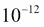
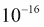
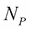
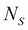
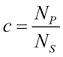
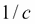

# 第八章. 迭代工具模块

函数式编程强调无状态编程。在 Python 中，这导致我们使用生成器表达式、生成器函数和可迭代对象。在本章中，我们将研究`itertools`库，其中有许多函数可以帮助我们处理可迭代的集合。

我们在第三章中介绍了迭代器函数，*函数、迭代器和生成器*。在本章中，我们将扩展对其的简单介绍。我们在第五章中使用了一些相关函数，*高阶函数*。

### 注意

一些函数只是表现得像是合适的、惰性的 Python 可迭代对象。重要的是要查看每个函数的实现细节。其中一些函数会创建中间对象，导致可能消耗大量内存。由于实现可能会随着 Python 版本的发布而改变，我们无法在这里提供逐个函数的建议。如果您遇到性能或内存问题，请确保检查实现。

这个模块中有大量的迭代器函数。我们将在下一章中检查一些函数。在本章中，我们将看一下三种广泛的迭代器函数。它们如下：

+   与无限迭代器一起工作的函数。这些函数可以应用于任何可迭代对象或任何集合上的迭代器；它们将消耗整个源。

+   与有限迭代器一起工作的函数。这些函数可以多次累积源，或者它们会产生源的减少。

+   tee 迭代器函数可以将迭代器克隆为几个可以独立使用的副本。这提供了一种克服 Python 迭代器的主要限制的方法：它们只能使用一次。

我们需要强调一个重要的限制，这是我们在其他地方提到过的。

### 注意

可迭代对象只能使用一次。

这可能令人惊讶，因为没有错误。一旦耗尽，它们似乎没有元素，并且每次使用时都会引发`StopIteration`异常。

迭代器的一些其他特性并不是如此深刻的限制。它们如下：

+   可迭代对象没有`len()`函数。在几乎所有其他方面，它们似乎都是容器。

+   可迭代对象可以进行`next()`操作，而容器不行。

+   `for`语句使容器和可迭代对象之间的区别变得不可见；容器将通过`iter()`函数产生一个可迭代对象。可迭代对象只是返回自身。

这些观点将为本章提供一些必要的背景。`itertools`模块的理念是利用可迭代对象的功能来创建简洁、表达力强的应用程序，而不需要复杂的管理可迭代对象的细节。

# 与无限迭代器一起工作

`itertools`模块提供了许多函数，我们可以用它们来增强或丰富可迭代的数据源。我们将看一下以下三个函数：

+   `count()`: 这是`range()`函数的无限版本

+   `cycle()`: 这将重复迭代一组值

+   `repeat()`: 这可以无限次重复单个值

我们的目标是了解这些各种迭代器函数如何在生成器表达式和生成器函数中使用。

## 使用 count()进行计数

内置的`range()`函数由上限定义：下限和步长是可选的。另一方面，`count()`函数有一个起始和可选的步长，但没有上限。

这个函数可以被认为是像`enumerate()`这样的函数的原始基础。我们可以用`zip()`和`count()`函数来定义`enumerate()`函数，如下所示：

```py
enumerate = lambda x, start=0: zip(count(start),x)

```

`enumerate()`函数的行为就像使用`count()`函数生成与某个迭代器相关联的值的`zip()`函数。

因此，以下两个命令彼此等价：

```py
zip(count(), some_iterator)
enumerate(some_iterator)

```

两者都会发出与迭代器中的项目配对的两个元组的数字序列。

`zip()`函数在使用`count()`函数时变得稍微简单，如下命令所示：

```py
zip(count(1,3), some_iterator)

```

这将提供 1、4、7、10 等值，作为枚举器的每个值的标识符。这是一个挑战，因为`enumerate`没有提供更改步长的方法。

以下命令描述了`enumerate()`函数：

```py
((1+3*e, x) for e,x in enumerate(a))

```

### 注意

`count()`函数允许非整数值。我们可以使用类似`count(0.5, 0.1)`的方法提供浮点值。如果增量值没有精确表示，这将累积相当大的误差。通常最好使用`(0.5+x*.1 for x in count())`方法来确保表示错误不会累积。

这是一种检查累积误差的方法。我们将定义一个函数，该函数将评估来自迭代器的项目，直到满足某个条件。以下是我们如何定义`until()`函数的方法：

```py
def until(terminate, iterator):
 **i = next(iterator)
 **if terminate(*i): return i
 **return until(terminate, iterator)

```

我们将从迭代器中获取下一个值。如果通过测试，那就是我们的值。否则，我们将递归地评估这个函数，以搜索通过测试的值。

我们将提供一个源可迭代对象和一个比较函数，如下所示：

```py
source = zip(count(0, .1), (.1*c for c in count()))
neq = lambda x, y: abs(x-y) > 1.0E-12

```

当我们评估`until(neq, source)`方法时，我们发现结果如下：

```py
(92.799999999999, 92.80000000000001)

```

经过 928 次迭代，错误位的总和累积到。两个值都没有精确的二进制表示。

### 注意

`count()`函数接近 Python 递归限制。我们需要重写我们的`until()`函数，使用尾递归优化来定位具有更大累积误差的计数。

最小可检测差异可以计算如下：

```py
>>> until(lambda x, y: x != y, source)
(0.6, 0.6000000000000001)

```

仅经过六步，`count(0, 0.1)`方法已经累积了一个可测的误差。不是很大的误差，但在 1000 步内，它将变得相当大。

## 使用 cycle()重复循环

`cycle()`函数重复一系列值。我们可以想象使用它来解决愚蠢的 fizz-buzz 问题。

访问[`rosettacode.org/wiki/FizzBuzz`](http://rosettacode.org/wiki/FizzBuzz)获取对一个相当琐碎的编程问题的全面解决方案。还可以参见[`projecteuler.net/problem=1`](https://projecteuler.net/problem=1)获取这个主题的有趣变化。

我们可以使用`cycle()`函数发出`True`和`False`值的序列，如下所示：

```py
m3= (i == 0 for i in cycle(range(3)))

m5= (i == 0 for i in cycle(range(5)))

```

如果我们将一组有限的数字压缩在一起，我们将得到一组三元组，其中一个数字和两个标志，显示该数字是否是 3 的倍数或 5 的倍数。引入有限的可迭代对象以创建正在生成的数据的适当上限是很重要的。以下是一系列值及其乘法器标志：

```py
multipliers = zip(range(10), m3, m5)

```

现在我们可以分解三元组，并使用过滤器传递是倍数的数字并拒绝所有其他数字：

```py
sum(i for i, *multipliers in multipliers if any(multipliers))

```

这个函数还有另一个更有价值的用途，用于探索性数据分析。

我们经常需要处理大量数据的样本。清洗和模型创建的初始阶段最好使用小数据集开发，并使用越来越大的数据集进行测试。我们可以使用`cycle()`函数从较大的集合中公平选择行。人口规模，，和期望的样本大小，，表示我们可以使用循环的时间长短：



我们假设数据可以使用`csv`模块解析。这导致了一种优雅的方式来创建子集。我们可以使用以下命令创建子集：

```py
chooser = (x == 0 for x in cycle(range(c)))
rdr= csv.reader(source_file)
wtr= csv.writer(target_file)
wtr.writerows(row for pick, row in zip(chooser, rdr) if pick)

```

我们根据选择因子`c`创建了一个`cycle()`函数。例如，我们可能有一千万条记录的人口：选择 1,000 条记录的子集涉及选择 1/10,000 的记录。我们假设这段代码片段被安全地嵌套在一个打开相关文件的`with`语句中。我们还避免显示与 CSV 格式文件的方言问题的细节。

我们可以使用一个简单的生成器表达式来使用`cycle()`函数和来自 CSV 读取器的源数据来过滤数据。由于`chooser`表达式和用于写入行的表达式都是非严格的，所以从这种处理中几乎没有内存开销。

我们可以通过一个小改变，使用`random.randrange(c)`方法而不是`cycle(c)`方法来实现类似大小的子集的随机选择。

我们还可以重写这个方法来使用`compress()`、`filter()`和`islice()`函数，这些我们将在本章后面看到。

这种设计还可以将文件从任何非标准的类 CSV 格式重新格式化为标准的 CSV 格式。只要我们定义返回一致定义的元组的解析器函数，并编写将元组写入目标文件的消费者函数，我们就可以用相对简短、清晰的脚本进行大量的清洗和过滤。

## 使用`repeat()`重复单个值

`repeat()`函数似乎是一个奇怪的特性：它一遍又一遍地返回一个单个值。它可以作为`cycle()`函数的替代。我们可以使用`repeat(0)`方法来扩展我们的数据子集选择函数，而不是在表达式行中使用`cycle(range(100))`方法，例如，`(x==0 for x in some_function)`。

我们可以考虑以下命令：

```py
all = repeat(0)
subset= cycle(range(100))
chooser = (x == 0 for x in either_all_or_subset)

```

这使我们可以进行简单的参数更改，要么选择所有数据，要么选择数据的子集。

我们可以将这个嵌套在循环中，以创建更复杂的结构。这里有一个简单的例子：

```py
>>> list(tuple(repeat(i, times=i)) for i in range(10))
[(), (1,), (2, 2), (3, 3, 3), (4, 4, 4, 4), (5, 5, 5, 5, 5), (6, 6, 6, 6, 6, 6), (7, 7, 7, 7, 7, 7, 7), (8, 8, 8, 8, 8, 8, 8, 8), (9, 9, 9, 9, 9, 9, 9, 9, 9)]
>>> list(sum(repeat(i, times=i)) for i in range(10))
[0, 1, 4, 9, 16, 25, 36, 49, 64, 81]

```

我们使用`repeat()`函数的`times`参数创建了重复的数字序列。

# 使用有限迭代器

`itertools`模块提供了许多函数，我们可以用它们来生成有限的值序列。我们将在这个模块中看到十个函数，以及一些相关的内置函数：

+   `enumerate()`: 这个函数实际上是`__builtins__`包的一部分，但它可以与迭代器一起使用，与`itertools`模块中的其他函数非常相似。

+   `accumulate()`: 这个函数返回输入可迭代对象的一系列减少。它是一个高阶函数，可以进行各种巧妙的计算。

+   `chain()`: 这个函数将多个可迭代对象串联起来。

+   `groupby()`: 这个函数使用一个函数将单个可迭代对象分解为输入数据子集的可迭代对象序列。

+   `zip_longest()`: 这个函数将来自多个可迭代对象的元素组合在一起。内置的`zip()`函数会将序列截断到最短可迭代对象的长度。`zip_longest()`函数会用给定的填充值填充较短的可迭代对象。

+   `compress()`: 这个函数基于第二个`Boolean`值可迭代对象来过滤第一个可迭代对象。

+   `islice()`: 当应用于可迭代对象时，这个函数相当于对序列的切片。

+   `dropwhile()`和`takewhile()`: 这两个函数都使用一个`Boolean`函数来过滤可迭代的项。与`filter()`或`filterfalse()`不同，这些函数依赖于单个`True`或`False`值来改变它们对所有后续值的过滤行为。

+   `filterfalse()`: 这个函数对可迭代对象应用一个过滤函数。这是内置的`filter()`函数的补充。

+   `starmap()`: 这个函数将一个函数映射到一个元组的可迭代序列，使用每个可迭代对象作为给定函数的`*args`参数。`map()`函数使用多个并行可迭代对象做类似的事情。

我们已将这些函数分成了大致的类别。这些类别与重构可迭代对象、过滤和映射的概念大致相关。

## 使用 enumerate()分配数字

在第七章中，*其他元组技术*，我们使用`enumerate()`函数对排序数据进行了天真的排名分配。我们可以做一些事情，比如将一个值与其在原始序列中的位置配对，如下所示：

```py
pairs = tuple(enumerate(sorted(raw_values)))

```

这将对`raw_values`中的项目进行排序，创建两个具有升序数字序列的元组，并实现我们可以用于进一步计算的对象。命令和结果如下：

```py
>>> raw_values= [1.2, .8, 1.2, 2.3, 11, 18]
>>> tuple(enumerate( sorted(raw_values)))
((0, 0.8), (1, 1.2), (2, 1.2), (3, 2.3), (4, 11), (5, 18))

```

在第七章中，*其他元组技术*，我们实现了一个替代形式的 enumerate，`rank()`函数，它将以更具统计意义的方式处理并列。

这是一个常见的功能，它被添加到解析器中以记录源数据行号。在许多情况下，我们将创建某种`row_iter()`函数，以从源文件中提取字符串值。这可能会迭代 XML 文件中标签的`string`值，或者 CSV 文件的列中的值。在某些情况下，我们甚至可能会解析用 Beautiful Soup 解析的 HTML 文件中呈现的数据。

在第四章中，*与集合一起工作*，我们解析了一个 XML 文件，创建了一个简单的位置元组序列。然后我们创建了带有起点、终点和距离的`Leg`。然而，我们没有分配一个明确的`Leg`编号。如果我们对行程集合进行排序，我们将无法确定`Leg`的原始顺序。

在第七章中，*其他元组技术*，我们扩展了基本解析器，为行程的每个`Leg`创建了命名元组。增强解析器的输出如下所示：

```py
(Leg(start=Point(latitude=37.54901619777347, longitude=-76.33029518659048), end=Point(latitude=37.840832, longitude=-76.273834), distance=17.7246), Leg(start=Point(latitude=37.840832, longitude=-76.273834), end=Point(latitude=38.331501, longitude=-76.459503), distance=30.7382), Leg(start=Point(latitude=38.331501, longitude=-76.459503), end=Point(latitude=38.845501, longitude=-76.537331), distance=31.0756),...,Leg(start=Point(latitude=38.330166, longitude=-76.458504), end=Point(latitude=38.976334, longitude=-76.473503), distance=38.8019))

```

第一个`Leg`函数是在切萨皮克湾上两点之间的短途旅行。

我们可以添加一个函数，它将构建一个更复杂的元组，其中包含输入顺序信息作为元组的一部分。首先，我们将定义`Leg`类的一个稍微复杂的版本：

```py
Leg = namedtuple("Leg", ("order", "start", "end", "distance"))

```

这类似于第七章中显示的`Leg`实例，*其他元组技术*，但它包括顺序以及其他属性。我们将定义一个函数，将成对分解并创建`Leg`实例如下：

```py
def ordered_leg_iter(pair_iter):
 **for order, pair in enumerate(pair_iter):
 **start, end = pair
 **yield Leg(order, start, end, round(haversine(start, end),4))

```

我们可以使用此函数对每对起始和结束点进行枚举。我们将分解该对，然后重新组装`order`、`start`和`end`参数以及`haversine(start,end)`参数的值作为单个`Leg`实例。这个`generator`函数将与可迭代序列一起工作。

在前面的解释的背景下，它的用法如下：

```py
with urllib.request.urlopen("file:./Winter%202012-2013.kml") as source:
 **path_iter = float_lat_lon(row_iter_kml(source))
 **pair_iter = legs(path_iter)
 **trip_iter = ordered_leg_iter(pair_iter)
 **trip= tuple(trip_iter)

```

我们已经将原始文件解析为路径点，创建了起始-结束对，然后创建了一个由单个`Leg`对象构建的行程。`enumerate()`函数确保可迭代序列中的每个项目都被赋予一个唯一的数字，该数字从默认的起始值 0 递增。可以提供第二个参数值以提供替代的起始值。

## 使用 accumulate()进行累积总数

`accumulate()`函数将给定的函数折叠到可迭代对象中，累积一系列的减少。这将迭代另一个迭代器中的累积总数；默认函数是`operator.add()`。我们可以提供替代函数来改变从总和到乘积的基本行为。Python 库文档显示了`max()`函数的一个特别巧妙的用法，以创建迄今为止的最大值序列。

累积总数的一个应用是对数据进行四分位数处理。我们可以计算每个样本的累积总数，并用`int(4*value/total)`计算将它们分成四分之一。

在*使用 enumerate()分配数字*部分，我们介绍了一系列描述航行中一系列航段的纬度-经度坐标。我们可以使用距离作为四分位数航路点的基础。这使我们能够确定航行的中点。

`trip`变量的值如下：

```py
(Leg(start=Point(latitude=37.54901619777347, longitude=-76.33029518659048), end=Point(latitude=37.840832, longitude=-76.273834), distance=17.7246), Leg(start=Point(latitude=37.840832, longitude=-76.273834), end=Point(latitude=38.331501, longitude=-76.459503), distance=30.7382), ..., Leg(start=Point(latitude=38.330166, longitude=-76.458504), end=Point(latitude=38.976334, longitude=-76.473503), distance=38.8019))

```

每个`Leg`对象都有一个起点、一个终点和一个距离。四分位数的计算如下例所示：

```py
distances= (leg.distance for leg in trip)
distance_accum= tuple(accumulate(distances))
total= distance_accum[-1]+1.0
quartiles= tuple(int(4*d/total) for d in distance_accum)

```

我们提取了距离数值，并计算了每段的累积距离。累积距离的最后一个就是总数。我们将`1.0`添加到总数中，以确保`4*d/total`为 3.9983，这将截断为 3。如果没有`+1.0`，最终的项目将具有值`4`，这是一个不可能的第五个四分位数。对于某些类型的数据（具有极大的值），我们可能需要添加一个更大的值。

`quartiles`变量的值如下：

```py
(0, 0, 0, 0, 0, 0, 0, 0, 0, 0, 0, 0, 0, 0, 0, 0, 0, 0, 0, 0, 0, 0, 0, 1, 1, 1, 1, 1, 1, 1, 1, 1, 1, 1, 1, 1, 1, 2, 2, 2, 2, 2, 2, 2, 2, 2, 2, 2, 2, 2, 2, 2, 2, 2, 2, 2, 3, 3, 3, 3, 3, 3, 3, 3, 3, 3, 3, 3, 3, 3, 3, 3, 3)

```

我们可以使用`zip()`函数将这个四分位数序列与原始数据点合并。我们还可以使用`groupby()`等函数来创建每个四分位数中各段的不同集合。

## 使用 chain()组合迭代器

我们可以使用`chain()`函数将一系列迭代器组合成一个单一的整体迭代器。这对于组合通过`groupby()`函数分解的数据非常有用。我们可以使用这个来处理多个集合，就好像它们是一个单一的集合一样。

特别是，我们可以将`chain()`函数与`contextlib.ExitStack()`方法结合使用，以处理文件集合作为单个可迭代值序列。我们可以做如下操作：

```py
from contextlib import ExitStack
import csv
def row_iter_csv_tab(*filenames):
 **with ExitStack() as stack:
 **files = [stack.enter_context(open(name, 'r', newline=''))
 **for name in filenames]
 **readers = [csv.reader(f, delimiter='\t') for f in files]
 **readers = map(lambda f: csv.reader(f, delimiter='\t'), files)
 **yield from chain(*readers)

```

我们创建了一个`ExitStack`对象，可以包含许多单独的上下文打开。当`with`语句结束时，`ExitStack`对象中的所有项目都将被正确关闭。我们创建了一个简单的打开文件对象序列；这些对象也被输入到了`ExitStack`对象中。

给定`files`变量中的文件序列，我们在`readers`变量中创建了一系列 CSV 读取器。在这种情况下，我们所有的文件都有一个共同的制表符分隔格式，这使得使用一个简单、一致的函数对文件序列进行打开非常愉快。

我们还可以使用以下命令打开文件：

```py
readers = map(lambda f: csv.reader(f, delimiter='\t'), files)

```

最后，我们将所有的读取器链接成一个单一的迭代器，使用`chain(*readers)`。这用于从所有文件中产生行的序列。

重要的是要注意，我们不能返回`chain(*readers)`对象。如果这样做，将退出`with`语句上下文，关闭所有源文件。相反，我们必须产生单独的行，以保持`with`语句上下文处于活动状态。

## 使用 groupby()对迭代器进行分区

我们可以使用`groupby()`函数将迭代器分成较小的迭代器。这是通过对给定可迭代对象中的每个项目评估给定的`key()`函数来实现的。如果键值与前一个项目的键值匹配，则两个项目属于同一分区。如果键值与前一个项目的键值不匹配，则结束前一个分区并开始一个新的分区。

`groupby()`函数的输出是两个元组的序列。每个元组都有组的键值和组中项目的可迭代对象。每个组的迭代器可以保留为元组，也可以处理以将其减少为某些摘要值。由于组迭代器的创建方式，它们无法被保留。

在*使用 accumulate()计算累积总数*部分，在本章的前面，我们展示了如何计算输入序列的四分位值。

给定具有原始数据的`trip`变量和具有四分位数分配的`quartile`变量，我们可以使用以下命令对数据进行分组：

```py
group_iter= groupby(zip(quartile, trip), key=lambda q_raw:
 **q_raw[0])
for group_key, group_iter in group_iter:
 **print(group_key, tuple(group_iter))

```

这将从原始行程数据开始，将四分位数与原始行程数据一起进行迭代。`groupby（）`函数将使用给定的`lambda`变量按四分位数分组。我们使用`for`循环来检查`groupby（）`函数的结果。这显示了我们如何获得组键值和组成员的迭代器。

`groupby（）`函数的输入必须按键值排序。这将确保组中的所有项目都是相邻的。

请注意，我们还可以使用`defaultdict（list）`方法创建组，如下所示：

```py
def groupby_2(iterable, key):
 **groups = defaultdict(list)
 **for item in iterable:
 **groups[key(item)].append(item)
 **for g in groups:
 **yield iter(groups[g])

```

我们创建了一个`defaultdict`类，其中`list`对象作为与每个键关联的值。每个项目将应用给定的`key（）`函数以创建键值。项目将附加到具有给定键的`defaultdict`类中的列表中。

一旦所有项目被分区，我们就可以将每个分区作为共享公共键的项目的迭代器返回。这类似于`groupby（）`函数，因为传递给此函数的输入迭代器不一定按照完全相同的顺序排序；可能会有相同成员的组，但顺序可能不同。

## 使用`zip_longest（）`和`zip（）`合并可迭代对象

我们在第四章*与集合一起工作*中看到了`zip（）`函数。`zip_longest（）`函数与`zip（）`函数有一个重要的区别：`zip（）`函数在最短的可迭代对象结束时停止，而`zip_longest（）`函数填充短的可迭代对象，并在最长的可迭代对象结束时停止。

`fillvalue`关键字参数允许使用除默认值`None`之外的值进行填充。

对于大多数探索性数据分析应用程序，使用默认值进行填充在统计上很难证明。**Python 标准库**文档显示了一些可以使用`zip_longest（）`函数完成的巧妙事情。很难在不远离我们对数据分析的关注的情况下扩展这些内容。

## 使用`compress（）`进行过滤

内置的`filter（）`函数使用谓词来确定是否传递或拒绝项目。我们可以使用第二个并行可迭代对象来确定要传递哪些项目，要拒绝哪些项目，而不是使用计算值的函数。

我们可以将`filter（）`函数视为具有以下定义：

```py
def filter(iterable, function):
 **i1, i2 = tee(iterable, 2)
 **return compress(i1, (function(x) for x in i2))

```

我们使用`tee（）`函数克隆了可迭代对象。（我们稍后将详细讨论这个函数。）我们对每个值评估了过滤谓词。然后我们将原始可迭代对象和过滤函数可迭代对象提供给`compress`，传递和拒绝值。这从`compress（）`函数的更原始特性中构建了`filter（）`函数的特性。

在本章的*使用 cycle（）重复循环*部分，我们看到了使用简单的生成器表达式进行数据选择。其本质如下：

```py
chooser = (x == 0 for x in cycle(range(c)))
keep= (row for pick, row in zip(chooser, some_source) if pick)

```

我们定义了一个函数，它将产生一个值`1`，后跟*c-1*个零。这个循环将被重复，允许从源中仅选择*1/c*行。

我们可以用`repeat（0）`函数替换`cycle（range（c））`函数以选择所有行。我们还可以用`random.randrange（c）`函数替换它以随机选择行。

保持表达式实际上只是一个`compress（some_source，chooser）`方法。如果我们进行这种更改，处理将变得简化：

```py
all = repeat(0)
subset = cycle(range(c))
randomized = random.randrange(c)
selection_rule = one of all, subset, or randomized
chooser = (x == 0 for x in selection_rule)
keep = compress(some_source, chooser)

```

我们定义了三种替代选择规则：`all`，`subset`和`randomized`。子集和随机化版本将从源中选择*1/c*行。`chooser`表达式将根据选择规则之一构建一个`True`和`False`值的可迭代对象。应用源可迭代对象到行选择可迭代对象来选择要保留的行。

由于所有这些都是非严格的，直到需要时才从源中读取行。这使我们能够高效地处理非常大的数据集。此外，Python 代码的相对简单意味着我们实际上不需要复杂的配置文件和相关解析器来在选择规则中进行选择。我们可以选择使用这段 Python 代码作为更大数据采样应用程序的配置。

## 使用 islice()选择子集

在第四章中，*与集合一起工作*，我们看到了使用切片表示法从集合中选择子集。我们的示例是从`list`对象中切片出成对的项目。以下是一个简单的列表：

```py
flat= ['2', '3', '5', '7', '11', '13', '17', '19', '23', '29', '31', '37', '41', '43', '47', '53', '59', '61', '67', '71',... ]

```

我们可以使用列表切片创建成对的元素，如下所示：

```py
zip(flat[0::2], flat[1::2])

```

`islice()`函数为我们提供了类似的功能，而不需要实例化`list`对象，并且看起来像以下内容：

```py
flat_iter_1= iter(flat)
flat_iter_2= iter(flat)
zip(islice(flat_iter_1, 0, None, 2), islice(flat_iter_2, 1, None, 2))

```

我们在一个扁平数据点列表上创建了两个独立的迭代器。这些可能是打开文件或数据库结果集上的两个独立迭代器。这两个迭代器需要是独立的，以便一个`islice()`函数的更改不会干扰另一个`islice()`函数。

`islice()`函数的两组参数类似于`flat[0::2]`和`flat[1::2]`方法。没有类似切片的简写，因此需要指定开始和结束参数值。步长可以省略，默认值为 1。这将从原始序列产生两个元组的序列：

```py
[(2, 3), (5, 7), (11, 13), (17, 19), (23, 29), ... (7883, 7901), (7907, 7919)]

```

由于`islice()`与可迭代对象一起工作，这种设计可以处理非常大的数据集。我们可以使用它从较大的数据集中选择一个子集。除了使用`filter()`或`compress()`函数外，我们还可以使用`islice(source,0,None,c)`方法从较大的数据集中选择项。

## 使用 dropwhile()和 takewhile()进行有状态过滤

`dropwhile()`和`takewhile()`函数是有状态的过滤函数。它们以一种模式开始；给定的`predicate`函数是一种开关，可以切换模式。`dropwhile()`函数以拒绝模式开始；当函数变为`False`时，它切换到通过模式。`takewhile()`函数以通过模式开始；当给定函数变为`False`时，它切换到拒绝模式。

由于这些是过滤器，两个函数都将消耗整个可迭代对象。给定一个像`count()`函数这样的无限迭代器，它将无限继续。由于 Python 中没有简单的整数溢出，对`dropwhile()`或`takewhile()`函数的不考虑使用不会在整数溢出后经过几十亿次迭代后崩溃。它确实可以运行非常非常长的时间。

我们可以将这些与文件解析一起使用，以跳过输入中的标题或页脚。我们使用`dropwhile()`函数来拒绝标题行并传递剩余数据。我们使用`takewhile()`函数来传递数据并拒绝尾部行。我们将返回第三章中显示的简单 GPL 文件格式，*函数、迭代器和生成器*。该文件的标题如下所示：

```py
GIMP Palette
Name: Crayola
Columns: 16
#
```

接下来是以下示例的行：

```py
255  73 108  Radical Red
```

我们可以使用基于`dropwhile()`函数的解析器轻松定位标题的最后一行——`#`行，如下所示：

```py
with open("crayola.gpl") as source:
 **rdr = csv.reader(source, delimiter='\t')
 **rows = dropwhile(lambda row: row[0] != '#', rdr)

```

我们创建了一个 CSV 读取器，以制表符为基础解析行。这将从名称中整齐地分离出`color`三元组。三元组需要进一步解析。这将产生一个以`#`行开头并继续文件其余部分的迭代器。

我们可以使用`islice()`函数丢弃可迭代对象的第一项。然后我们可以按以下方式解析颜色细节：

```py
 **color_rows = islice(rows, 1, None)
 **colors = ((color.split(), name) for color, name in color_rows)
 **print(list(colors))

```

`islice(rows, 1, None)`表达式类似于请求`rows[1:]`切片：第一项被悄悄丢弃。一旦标题行的最后一行被丢弃，我们就可以解析颜色元组并返回更有用的颜色对象。

对于这个特定的文件，我们还可以使用 CSV 读取器函数定位的列数。我们可以使用`dropwhile(lambda row: len(row) == 1, rdr)`方法来丢弃标题行。这在一般情况下并不总是奏效。定位标题行的最后一行通常比尝试定位一些区分标题（或尾部）行与有意义的文件内容的一般特征更容易。

## 使用 filterfalse()和 filter()进行过滤的两种方法

在第五章中，*高阶函数*我们看了内置的`filter()`函数。`itertools`模块中的`filterfalse()`函数可以从`filter()`函数中定义如下：

```py
filterfalse = lambda pred, iterable:
 **filter(lambda x: not pred(x), iterable)

```

与`filter()`函数一样，谓词函数可以是`None`值。`filter(None, iterable)`方法的值是可迭代对象中的所有`True`值。`filterfalse(None, iterable)`方法的值是可迭代对象中的所有`False`值：

```py
>>> filter(None, [0, False, 1, 2])
<filter object at 0x101b43a50>
>>> list(_)
[1, 2]
>>> filterfalse(None, [0, False, 1, 2])
<itertools.filterfalse object at 0x101b43a50>
>>> list(_)
[0, False]

```

拥有`filterfalse()`函数的目的是促进重用。如果我们有一个简洁的函数可以做出过滤决定，我们应该能够使用该函数将输入分成通过和拒绝组，而不必费力地处理逻辑否定。

执行以下命令的想法是：

```py
iter_1, iter_2 = iter(some_source), iter(some_source)
good = filter(test, iter_1)
bad = filterfalse(test, iter_2)

```

这将显然包括源自所有项目。`test()`函数保持不变，我们不能通过不正确使用`()`引入微妙的逻辑错误。

## 通过 starmap()和 map()将函数应用于数据

内置的`map()`函数是一个高阶函数，它将`map()`函数应用于可迭代对象中的项目。我们可以将`map()`函数的简单版本看作如下：

```py
map(function, arg_iter) == (function(a) for a in arg_iter)

```

当`arg_iter`参数是单个值列表时，这很有效。`itertools`模块中的`starmap()`函数只是`map()`函数的`*a`版本，如下所示：

```py
starmap(function, arg_iter) == (function(*a) for a in arg_iter)

```

这反映了`map()`函数语义的小变化，以正确处理元组结构。

`map()`函数也可以接受多个可迭代对象；这些额外可迭代对象的值被压缩，并且它的行为类似于`starmap()`函数。源可迭代对象的每个压缩项都成为给定函数的多个参数。

我们可以将`map(function, iter1, iter2, ..., itern)`方法定义为以下两个命令：

```py
(function(*args) for args in zip(iter1, iter2, ..., itern))
starmap(function, zip(iter1, iter2, ..., itern))

```

各种迭代器值被用来通过`*args`构造一个参数元组。实际上，`starmap()`函数就像这种更一般的情况。我们可以从更一般的`starmap()`函数构建简单的`map()`函数。

当我们查看行程数据时，可以根据前面的命令重新定义基于`starmap()`函数的`Leg`对象的构造。在创建`Leg`对象之前，我们创建了点对。每对如下所示：

```py
((Point(latitude=37.54901619777347, longitude=-76.33029518659048), Point(latitude=37.840832, longitude=-76.273834)), ...,(Point(latitude=38.330166, longitude=-76.458504), Point(latitude=38.976334, longitude=-76.473503)))

```

我们可以使用`starmap()`函数来组装`Leg`对象，如下所示：

```py
with urllib.request.urlopen(url) as source:
 **path_iter = float_lat_lon(row_iter_kml(source))
 **pair_iter = legs(path_iter)
 **make_leg = lambda start, end: Leg(start, end, haversine(start,end))
 **trip = list(starmap(make_leg, pair_iter))

```

`legs()`函数创建反映航程的腿的起点和终点的点对象对。有了这些对，我们可以创建一个简单的函数`make_leg`，它接受一对`Points`对象，并返回一个具有起点、终点和两点之间距离的`Leg`对象。

`starmap(function, some_list)`方法的好处是可以替换潜在冗长的`(function(*args) for args in some_list)`生成器表达式。

# 使用 tee()克隆迭代器

`tee()`函数为我们提供了一种规避处理可迭代对象的重要 Python 规则的方法。这条规则非常重要，我们在这里重复一遍。

### 注意

迭代器只能使用一次。

`tee()`函数允许我们克隆一个迭代器。这似乎使我们摆脱了必须实现一个序列以便我们可以对数据进行多次遍历的限制。例如，对于一个庞大的数据集，可以按照以下方式编写一个简单的平均值：

```py
def mean(iterator):
 **it0, it1= tee(iterator,2)
 **s0= sum(1 for x in it0)
 **s1= sum(x for x in it1)
 **return s0/s1

```

这将计算平均值，而不会以任何形式在内存中出现整个数据集。

虽然在原则上很有趣，但`tee()`函数的实现受到严重限制。在大多数 Python 实现中，克隆是通过实现一个序列来完成的。虽然这可以规避小集合的“一次性”规则，但对于庞大的集合来说效果不佳。

此外，`tee()`函数的当前实现会消耗源迭代器。可能会很好地创建一些语法糖来允许对迭代器进行无限使用。这在实践中很难管理。相反，Python 要求我们仔细优化`tee()`函数。

# itertools 配方

Python 库文档的*itertools*章节，*Itertools* *Recipes*，是非常出色的。基本定义后面是一系列非常清晰和有用的配方。由于没有理由重复这些，我们将在这里引用它们。它们应该被视为 Python 中函数式编程的必读内容。

### 注意

*Python 标准库*的*10.1.2*章节，*Itertools Recipes*，是一个很好的资源。参见

[`docs.python.org/3/library/itertools.html#itertools-recipes`](https://docs.python.org/3/library/itertools.html#itertools-recipes)。

重要的是要注意，这些不是`itertools`模块中可导入的函数。需要阅读和理解一个配方，然后可能在应用程序中复制或修改它。

以下表总结了一些从 itertools 基础构建的函数式编程算法的配方：

| 函数名称 | 参数 | 结果 |
| --- | --- | --- |
| `take` | `(n, iterable)` | 这将可迭代对象的前 n 个项目作为列表返回。这在一个简单的名称中包装了`islice()`的使用。 |
| `tabulate` | `(function, start=0)` | 这返回`function(0)`和`function(1)`。这基于`map(function, count())`。 |
| `consume` | `(iterator, n)` | 这将迭代器向前推进 n 步。如果*n*是`None`，迭代器将完全消耗这些步骤。 |
| `nth` | `(iterable, n, default=None)` | 这返回第 n 个项目或默认值。这在一个简单的名称中包装了`islice()`的使用。 |
| `quantify` | `(iterable, pred=bool)` | 这计算谓词为真的次数。这使用`sum()`和`map()`，并依赖于布尔谓词在转换为整数值时的方式。 |
| `padnone` | `(iterable)` | 这返回序列元素，然后无限返回`None`。这可以创建行为类似于`zip_longest()或 map()`的函数。 |
| `ncycles` | `(iterable, n)` | 这将序列元素*n*次返回。 |
| `dotproduct` | `(vec1, vec2)` | 这是点积的基本定义。将两个向量相乘并找到结果的和。 |
| `flatten` | `(listOfLists)` | 这将嵌套的一级展平。这将各种列表链接成一个单一的列表。 |
| `repeatfunc` | `(func, times=None, *args)` | 这使用指定的参数重复调用`func`。 |
| `pairwise` | `(iterable):` | `s -> (s0,s1), (s1,s2), (s2, s3).` |
| `grouper` | `(iterable, n, fillvalue=None)` | 将数据收集到固定长度的块中。 |
| `roundrobin` | `(*iterables)` | `roundrobin('ABC', 'D', 'EF') --> A D E B F C` |
| `partition` | `(pred, iterable)` | 这使用谓词将条目分成`False`条目和`True`条目。 |
| `unique_ everseen` | `(iterable, key=None)` | 这列出唯一的元素，保留顺序。记住所有已经看到的元素。`unique_ everseen('AAAABBBCCDAABBB') - -> A B C D.` |
| `unique_justseen` | `(iterable, key=None)` | 这列出了唯一的元素，保留顺序。只记住刚看到的元素。`unique_justseen('AAAABBBCCDAABBB') - -> A B C D A B.` |
| `iter_except` | `(func, exception, first=None)` | 反复调用函数，直到引发异常。这可以用于迭代直到`KeyError`或`IndexError`。 |

# 总结

在本章中，我们已经看过了`itertools`模块中的许多函数。这个库模块提供了许多函数，帮助我们以复杂的方式处理迭代器。

我们已经看过了无限迭代器；这些重复而不终止。这些包括`count()`、`cycle()`和`repeat()`函数。由于它们不终止，消耗函数必须确定何时停止接受值。

我们还看过了许多有限迭代器。其中一些是内置的，一些是`itertools`模块的一部分。这些与源可迭代对象一起工作，因此当该可迭代对象耗尽时它们终止。这些函数包括`enumerate()`、`accumulate()`、`chain()`、`groupby()`、`zip_longest()`、`zip()`、`compress()`、`islice()`、`dropwhile()`、`takewhile()`、`filterfalse()`、`filter()`、`starmap()`和`map()`。这些函数允许我们用看起来更简单的函数替换可能复杂的生成器表达式。

此外，我们还研究了文档中的配方，这些配方提供了更多我们可以研究和复制到我们自己的应用程序中的函数。配方列表显示了丰富的常见设计模式。

在第九章中，*更多迭代工具技术*，我们将继续研究`itertools`模块。我们将看看专注于排列和组合的迭代器。这些不适用于处理大量数据。它们是一种不同类型的基于迭代器的工具。
