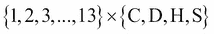
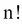
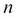
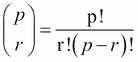

# 第九章：更多迭代工具技术

函数式编程强调无状态编程。在 Python 中，这导致我们使用生成器表达式、生成器函数和可迭代对象。在本章中，我们将继续研究`itertools`库，其中包含许多函数，帮助我们处理可迭代集合。

在上一章中，我们看了三种广泛的迭代器函数分组。它们如下：

+   与无限迭代器一起工作的函数可以应用于任何可迭代对象或任何集合上的迭代器；它们将消耗整个源

+   与有限迭代器一起工作的函数可以多次累积源，或者它们可以产生源的减少

+   `tee()`迭代器函数将一个迭代器克隆成几个独立可用的副本

在本章中，我们将研究与排列和组合一起工作的`itertools`函数。这些包括几个函数和一些基于这些函数构建的配方。这些函数如下：

+   `product()`: 此函数形成一个等同于嵌套`for`循环的笛卡尔积

+   `permutations()`: 此函数按所有可能的顺序从宇宙*p*中发出长度为*r*的元组；没有重复的元素

+   `combinations()`: 此函数按排序顺序从宇宙*p*中发出长度为*r*的元组；没有重复的元素

+   `combinations_with_replacement()`: 此函数按照排序顺序从*p*中发出长度为*r*的元组，其中包含重复的元素

这些函数体现了从输入数据的小集合迭代可能非常大的结果集的算法。某些问题的解决方案基于详尽地枚举可能庞大的排列组合的宇宙。这些函数使得发出大量的排列组合变得简单；在某些情况下，这种简单实际上并不是最优的。

# 枚举笛卡尔积

笛卡尔积这个术语指的是枚举从多个集合中抽取的所有可能组合的想法。

从数学上讲，我们可能会说两个集合的乘积，，有 52 对如下：

```py
{(1, C), (1, D), (1, H), (1, S), (2, C), (2, D), (2, H), (2, S), ..., (13, C), (13, D), (13, H), (13, S)}

```

我们可以通过执行以下命令来产生前述结果：

```py
>>> list(product(range(1, 14), '♣♦♥♠'))
[(1, '♣'), (1, '♦'), (1, '♥'), (1, '♠'),(2, '♣'), (2, '♦'), (2, '♥'), (2, '♠'),… (13, '♣'), (13, '♦'), (13, '♥'), (13, '♠')]

```

产品的计算可以扩展到任意数量的可迭代集合。使用大量的集合可能会导致非常大的结果集。

# 减少一个乘积

在关系数据库理论中，表之间的连接可以被视为一个经过筛选的乘积。一个没有`WHERE`子句的 SQL `SELECT`语句将产生表中行的笛卡尔积。这可以被认为是最坏情况的算法：一个没有任何过滤来选择正确结果的乘积。

我们可以使用`join()`函数来连接两个表，如下所示的命令：

```py
def join(t1, t2, where):):
 **return filter(where, product(t1, t2)))))

```

计算两个可迭代对象`t1`和`t2`的所有组合。`filter()`函数将应用给定的`where`函数来通过或拒绝不符合给定条件的项目，以匹配每个可迭代对象的适当行。当`where`函数返回一个简单的布尔值时，这将起作用。

在某些情况下，我们没有一个简单的布尔匹配函数。相反，我们被迫搜索项目之间的某种距离的最小值或最大值。

假设我们有一个`Color`对象的表如下：

```py
[Color(rgb=(239, 222, 205), name='Almond'), Color(rgb=(255, 255, 153), name='Canary'), Color(rgb=(28, 172, 120), name='Green'),...Color(rgb=(255, 174, 66), name='Yellow Orange')]

```

有关更多信息，请参见第六章，*递归和减少*，在那里我们向您展示了如何解析颜色文件以创建`namedtuple`对象。在这种情况下，我们将 RGB 保留为三元组，而不是分解每个单独的字段。

一幅图像将有一个像素集合：

```py
pixels= [(([(r, g, b), (r, g, b), (r, g, b), ...)

```

实际上，**Python Imaging Library**（**PIL**）包以多种形式呈现像素。其中之一是从（*x*，*y*）坐标到 RGB 三元组的映射。有关更多信息，请访问[Pillow 项目文档](https://pypi.python.org/pypi/Pillow)。

给定一个`PIL.Image`对象，我们可以使用以下命令迭代像素集合：

```py
def pixel_iter(image):
 **w, h = img.size
 **return ((c, img.getpixel(c)) for c in product(range(w), range(h)))

```

我们已经确定了每个坐标的范围，基于图像大小。`product(range(w), range(h))`方法的计算创建了所有可能的坐标组合。实际上，这是两个嵌套的`for`循环。

这样做的好处是为每个像素提供其坐标。然后我们可以以任意顺序处理像素，仍然可以重建图像。当使用多核或多线程来分配工作负载时，这是非常方便的。`concurrent.futures`模块提供了一种在多个核心或处理器之间分配工作的简单方法。

## 计算距离

许多决策问题要求我们找到一个足够接近的匹配。我们可能无法使用简单的相等测试。相反，我们必须使用距离度量，并找到与我们目标的最短距离的项目。对于文本，我们可能使用 Levenshtein 距离；这显示了从给定文本块到我们目标需要多少更改。

我们将使用一个稍微简单的例子。这将涉及非常简单的数学。然而，即使它很简单，如果我们天真地对待它，它也不会很好地解决问题。

在进行颜色匹配时，我们不会有一个简单的相等测试。我们很少能够检查像素颜色的确切相等。我们经常被迫定义一个最小距离函数，以确定两种颜色是否足够接近，而不是相同的 R、G 和 B 三个值。有几种常见的方法，包括欧几里得距离、曼哈顿距离，以及基于视觉偏好的其他复杂加权。

以下是欧几里得距离和曼哈顿距离函数：

```py
def euclidean(pixel, color):
 **return math.sqrt(sum(map(lambda x, y: (x-y)**2, pixel, color.rgb)))))))
def manhattan(pixel, color):
 **return sum(map(lambda x, y: abs(x-y), pixel, color.rgb)))))

```

欧几里得距离测量 RGB 空间中三个点之间直角三角形的斜边。曼哈顿距离对三个点之间的直角三角形的每条边求和。欧几里得距离提供了精度，而曼哈顿距离提供了计算速度。

展望未来，我们的目标是一个看起来像这样的结构。对于每个单独的像素，我们可以计算该像素颜色与有限颜色集中可用颜色之间的距离。单个像素的这种计算结果可能如下所示：

```py
(((0, 0), (92, 139, 195), Color(rgb=(239, 222, 205), name='Almond'), 169.10943202553784), ((0, 0), (92, 139, 195), Color(rgb=(255, 255, 153), name='Canary'), 204.42357985320578), ((0, 0), (92, 139, 195), Color(rgb=(28, 172, 120), name='Green'), 103.97114984456024), ((0, 0), (92, 139, 195), Color(rgb=(48, 186, 143), name='Mountain Meadow'), 82.75868534480233), ((0, 0), (92, 139, 195), Color(rgb=(255, 73, 108), name='Radical Red'), 196.19887869200477), ((0, 0), (92, 139, 195), Color(rgb=(253, 94, 83), name='Sunset Orange'), 201.2212712413874), ((0, 0), (92, 139, 195), Color(rgb=(255, 174, 66), name='Yellow Orange'), 210.7961100210343))

```

我们展示了一个包含多个四元组的整体元组。每个四元组包含以下内容：

+   像素的坐标，例如(0,0)

+   像素的原始颜色，例如(92, 139, 195)

+   例如，我们从七种颜色中选择一个`Color`对象，比如 Color(rgb=(239, 222, 205),name='Almond')

+   原始颜色与给定的`Color`对象之间的欧几里得距离

我们可以看到最小的欧几里得距离是最接近的匹配颜色。这种缩减很容易用`min()`函数实现。如果将整个元组分配给一个变量名`choices`，像素级的缩减将如下所示：

```py
min(choices, key=lambda xypcd: xypcd[3]))])

```

我们称每个四元组为 xypcd，即 xy 坐标、像素、颜色和距离。然后，最小距离计算将选择一个单个的四元组作为像素和颜色之间的最佳匹配。

## 获取所有像素和所有颜色

我们如何得到包含所有像素和所有颜色的结构？答案很简单，但正如我们将看到的那样，不够理想。

将像素映射到颜色的一种方法是使用`product()`函数枚举所有像素和所有颜色：

```py
xy = lambda xyp_c: xyp_c[0][0]
p = lambda xyp_c: xyp_c[0][1]
c = lambda xyp_c: xyp_c[1]
distances= (( = ((xy(item), p(item), c(item), euclidean(p(item), c(item)))
 **for item in product(pixel_iter(img), colors)))))

```

这个核心是`product(pixel_iter(img), colors)`方法，它创建了所有像素与所有颜色的组合。我们将对数据进行一些重组以使其扁平化。我们将应用`euclidean()`函数来计算像素颜色和`Color`对象之间的距离。

最终颜色的选择使用了`groupby()`函数和`min(choices,...)`表达式，如下面的命令片段所示：

```py
for _, choices in groupby(distances, key=lambda xy_p_c_d:
 **xy_p_c_d[0]):
 **print(min(choices, key=lambda xypcd: xypcd[3])))]))

```

像素和颜色的整体乘积是一个长而扁平的可迭代对象。我们将可迭代对象分组成小集合，其中坐标匹配。这将把大的可迭代对象分成小的可迭代对象，每个对象只与一个像素相关联的颜色。然后我们可以为每种颜色选择最小的颜色距离。

在一个 3,648×2,736 像素，有 133 种 Crayola 颜色的图片中，我们有一个可迭代的项数为 1,327,463,424。是的。这是由这个`distances`表达式创建的十亿种组合。这个数字并不一定是不切实际的。它完全在 Python 可以处理的范围内。然而，它揭示了对`product()`函数的天真使用的一个重要缺陷。

我们不能轻易地进行这种大规模处理，而不进行一些分析来看看它有多大。这些只对每个计算进行了 1,000,000 次的`timeit`数字如下：

+   欧几里德 2.8

+   曼哈顿 1.8

从 100 万扩展到 10 亿意味着 1,800 秒，也就是说，曼哈顿距离需要大约半小时，而计算欧几里德距离需要 46 分钟。看来 Python 的核心算术运算对于这种天真的大规模处理来说太慢了。

更重要的是，我们做错了。这种*宽度×高度×颜色*的处理方法只是一个糟糕的设计。在许多情况下，我们可以做得更好。

## 性能分析

任何大数据算法的一个关键特征是找到一种执行某种分而治之策略的方法。这对于函数式编程设计和命令式设计都是正确的。

我们有三种选项来加速这个处理；它们如下：

+   我们可以尝试使用并行处理来同时进行更多的计算。在一个四核处理器上，时间可以缩短到大约 1/4。这将把曼哈顿距离的时间缩短到 8 分钟。

+   我们可以看看缓存中间结果是否会减少冗余计算的数量。问题是有多少颜色是相同的，有多少颜色是唯一的。

+   我们可以寻找算法上的根本变化。

我们将通过计算源颜色和目标颜色之间的所有可能比较来结合最后两点。在这种情况下，与许多其他情境一样，我们可以轻松枚举整个映射，并避免在像素级别上进行冗余计算。我们还将把算法从一系列比较改为一系列简单的查找在一个映射对象中。

当考虑预先计算从源颜色到目标颜色的所有转换时，我们需要一些任意图像的整体统计数据。与本书相关的代码包括`IMG_2705.jpg`。以下是从指定图像收集一些数据的基本算法：

```py
from collections import defaultdict, Counter
palette = defaultdict(list)
for xy_p in pixel_iter(img):
 **xy, p = xy_p
 **palette[p].append(xy)
w, h = img.size
print(""("Total pixels", w*h)
print(""("Total colors", len(palette)))))

```

我们将所有给定颜色的像素收集到一个按颜色组织的列表中。从中，我们将学到以下事实中的第一个：

+   像素的总数是 9,980,928。对于一个 1000 万像素的图像来说，这并不奇怪。

+   颜色的总数是 210,303。如果我们尝试计算实际颜色和 133 种颜色之间的欧几里德距离，我们只需要进行 27,970,299 次计算，可能需要大约 76 秒。

+   使用 3 位掩码`0b11100000`，512 种可能颜色中使用了 214 种。

+   使用 4 位掩码`0b11110000`，4,096 种颜色中使用了 1,150 种。

+   使用 5 位掩码`0b11111000`，32,768 种颜色中使用了 5,845 种。

+   使用 6 位掩码`0b11111100`，262,144 种颜色中有 27,726 种颜色。

这给了我们一些关于如何重新排列数据结构、快速计算匹配颜色，然后重建图像而不进行 10 亿次比较的见解。

我们可以使用以下命令片段将掩码值应用于 RGB 字节：

```py
masked_color= tuple(map(lambda x: x&0b11100000, c))

```

这将挑选出红色、绿色和蓝色值的最重要的 3 位。如果我们使用这个来创建一个`Counter`对象，我们会看到我们有 214 个不同的值。

## 重新排列问题

对所有像素和所有颜色使用`product()`函数进行比较是一个坏主意。有 1000 万个像素，但只有 20 万种独特的颜色。在将源颜色映射到目标颜色时，我们只需要在一个简单的映射中保存 20 万个值。

我们将按以下方式处理：

+   计算源到目标颜色的映射。在这种情况下，让我们使用 3 位颜色值作为输出。每个 R、G 和 B 值来自`range(0, 256, 32)`方法中的八个值。我们可以使用这个表达式来枚举所有的输出颜色：

```py
product(range(0,256,32), range(0,256,32), range(0,256,32))

```

+   然后我们可以计算到源调色板中最近颜色的欧几里得距离，只需计算 68,096 次。这大约需要 0.14 秒。这只需要做一次，就可以计算出 20 万个映射。

+   在图像的一次遍历中，使用修改后的颜色表构建一个新的图像。在某些情况下，我们可以利用整数值的截断。我们可以使用这样的表达式（`0b11100000&r`，`0b11100000&g`，`0b11100000&b`）来去除图像颜色的最不重要的位。我们稍后将看到这种额外的计算减少。

这将用 1 亿次欧几里得距离计算替换成 1000 万次字典查找。这将用大约 30 秒的计算替换 30 分钟的计算。

我们不再为所有像素进行颜色映射，而是从输入到输出值创建一个静态映射。我们可以使用简单的查找映射从原始颜色到新颜色来构建图像。

一旦我们有了所有 20 万种颜色的调色板，我们就可以应用快速的曼哈顿距离来找到输出中最接近的颜色，比如蜡笔颜色。这将使用早期显示的颜色匹配算法来计算映射，而不是结果图像。区别将集中在使用`palette.keys()`函数而不是`pixel_iter()`函数。

我们将再次引入另一个优化：截断。这将给我们一个更快的算法。

## 结合两个转换

在结合多个转换时，我们可以从源到中间目标再到结果构建一个更复杂的映射。为了说明这一点，我们将截断颜色并应用映射。

在某些问题情境中，截断可能很困难。在其他情况下，它通常很简单。例如，将美国邮政编码从 9 位截断为 5 位是常见的。邮政编码可以进一步截断为三个字符，以确定代表更大地理区域的区域设施。

对于颜色，我们可以使用之前显示的位掩码来将三个 8 位值的颜色（24 位，1600 万种颜色）截断为三个 3 位值（9 位，512 种颜色）。

以下是一种构建颜色映射的方法，它同时结合了到给定一组颜色的距离和源颜色的截断：

```py
bit3 = range(0, 256, 0b100000)
best = (min(((((euclidean(rgb, c), rgb, c) for c in colors)
 **for rgb in product(bit3, bit3, bit3)))))
color_map = dict(((((b[1], b[2].rgb) for b in best)

```

我们创建了一个`range`对象`bit3`，它将遍历所有 8 个 3 位颜色值。

### 注意

`range`对象不像普通的迭代器；它们可以被多次使用。因此，`product(bit3, bit3, bit3)`表达式将产生我们将用作输出颜色的所有 512 种颜色组合。

对于每个截断的 RGB 颜色，我们创建了一个三元组，其中包括（0）与所有蜡笔颜色的距离，（1）RGB 颜色和（2）蜡笔“颜色”对象。当我们要求这个集合的最小值时，我们将得到最接近截断的 RGB 颜色的蜡笔“颜色”对象。

我们建立了一个字典，将截断的 RGB 颜色映射到最接近的蜡笔。为了使用这个映射，我们将在查找映射中最接近的蜡笔之前截断源颜色。这种截断与预先计算的映射的结合显示了我们可能需要结合映射技术。

以下是图像替换的命令：

```py
clone = img.copy()
for xy, p in pixel_iter(img):
 **r, g, b = p
 **repl = color_map[(([(0b11100000&r, 0b11100000&g, 0b11100000&b)]])]
 **clone.putpixel(xy, repl)
clone.show()

```

这只是使用一些 PIL 功能来用其他像素替换图片中的所有像素。

我们看到，一些函数式编程工具的天真使用可能导致表达力和简洁的算法，但也可能效率低下。计算计算复杂度的基本工具——有时被称为大 O 分析——对于函数式编程和命令式编程一样重要。

问题不在于`product()`函数效率低下。问题在于我们可以在一个低效的算法中使用`product()`函数。

# 排列一组值

当我们排列一组值时，我们将详细说明所有项目的可能顺序。有种排列项的方法。我们可以使用排列作为各种优化问题的一种蛮力解决方案。

通过访问[`en.wikipedia.org/wiki/Combinatorial_optimization`](http://en.wikipedia.org/wiki/Combinatorial_optimization)，我们可以看到对于更大的问题，穷举所有排列并不合适。使用`itertools.permutations()`函数是探索非常小问题的方便方法。

这些组合优化问题的一个常见例子是分配问题。我们有*n*个代理人和*n*个任务，但每个代理人执行给定任务的成本并不相等。想象一下，一些代理人在某些细节上有困难，而其他代理人在这些细节上表现出色。如果我们能正确分配任务给代理人，我们就可以最小化成本。

我们可以创建一个简单的网格，显示给定代理人执行给定任务的能力。对于半打代理人和任务的小问题，将有一个 36 个成本的网格。网格中的每个单元格显示代理人 0 到 5 执行任务 A 到 F。

我们可以轻松列举所有可能的排列。然而，这种方法不具有良好的可扩展性。10！等于 3,628,800。我们可以使用`list(permutations(range(10)))`方法查看这个包含 300 万项的序列。

我们期望在几秒钟内解决这样大小的问题。如果我们将问题规模扩大到 20！，我们将会遇到可扩展性问题：将有 2,432,902,008,176,640,000 种排列。如果生成 10！排列大约需要 0.56 秒，那么生成 20！排列将需要大约 12,000 年。

假设我们有一个包含 36 个值的成本矩阵，显示了六个代理人和六个任务的成本。我们可以将问题表述如下：

```py
perms = permutations(range(6)))))
alt= [(([(sum(cost[x][y] for y, x in enumerate(perm)), perm) for perm in perms]
m = min(alt)[0]
print([[([ans for s, ans in alt if s == m]))])

```

我们已经创建了六个代理人的所有任务的排列。我们已经计算了分配给每个代理人的每个任务的成本矩阵的所有成本之和。最小成本就是最佳解决方案。在许多情况下，可能会有多个最佳解决方案；我们将找到所有这些解决方案。

对于小型教科书示例，这是非常快的。对于较大的示例，逼近算法更合适。

# 生成所有组合

`itertools`模块还支持计算一组值的所有组合。在查看组合时，顺序并不重要，因此组合远少于排列。组合的数量通常表示为。这是我们可以从整体上取`p`个项目中的`r`个项目的组合方式。

例如，有 2,598,960 种 5 张牌的扑克手。我们可以通过执行以下命令列举所有 200 万手：

```py
hands = list(combinations(tuple(product(range(13), '♠♥♦♣')), 5))

```

更实际的是，我们有一个包含多个变量的数据集。一个常见的探索技术是确定数据集中所有变量对之间的相关性。如果有*v*个变量，那么我们将枚举必须通过执行以下命令进行比较的所有变量：

```py
combinations(range(v), 2)

```

让我们从[`www.tylervigen.com`](http://www.tylervigen.com)获取一些样本数据，以展示这将如何工作。我们将选择三个具有相同时间范围的数据集：数字 7、43 和 3890。我们将简单地将数据层压成网格，重复年份列。

这是年度数据的第一行和剩余行的样子：

```py
[('year', 'Per capita consumption of cheese (US)Pounds (USDA)', 'Number of people who died by becoming tangled in their bedsheetsDeaths (US) (CDC)', 'year', 'Per capita consumption of mozzarella cheese (US)Pounds (USDA)', 'Civil engineering doctorates awarded (US)Degrees awarded (National Science Foundation)', 'year', 'US crude oil imports from VenezuelaMillions of barrels (Dept. of Energy)', 'Per capita consumption of high fructose corn syrup (US)Pounds (USDA)'),
(2000, 29.8, 327, 2000, 9.3, 480, 2000, 446, 62.6),(2001, 30.1, 456, 2001, 9.7, 501, 2001, 471, 62.5),(2002, 30.5, 509, 2002, 9.7, 540, 2002, 438, 62.8),(2003, 30.6, 497, 2003, 9.7, 552, 2003, 436, 60.9),(2004, 31.3, 596, 2004, 9.9, 547, 2004, 473, 59.8),(2005, 31.7, 573, 2005, 10.2, 622, 2005, 449, 59.1),(2006, 32.6, 661, 2006, 10.5, 655, 2006, 416, 58.2),(2007, 33.1, 741, 2007, 11, 701, 2007, 420, 56.1),(2008, 32.7, 809, 2008, 10.6, 712, 2008, 381, 53),(2009, 32.8, 717, 2009, 10.6, 708, 2009, 352, 50.1)]

```

这是我们如何使用`combinations()`函数来生成数据集中九个变量的所有组合，每次取两个：

```py
combinations(range(9), 2)

```

有 36 种可能的组合。我们将不得不拒绝涉及`year`和`year`的组合。这些将与值 1.00 显然相关。

这是一个从我们的数据集中挑选数据列的函数：

```py
def column(source, x):
 **for row in source:
 **yield row[x]

```

这使我们能够使用第四章中的`corr()`函数，比较两列数据。

这是我们如何计算所有相关组合的方法：

```py
from itertools import *
from Chapter_4.ch04_ex4 import corr
for p, q in combinations(range(9), 2):
 **header_p, *data_p = list(column(source, p))
 **header_q, *data_q = list(column(source, q))
 **if header_p == header_q: continue
 **r_pq = corr(data_p, data_q)
 **print("{"{("{2: 4.2f}: {0} vs {1}".format(header_p, header_q, r_pq)))))

```

对于每一列的组合，我们从数据集中提取了两列数据，并使用多重赋值将标题与剩余的数据行分开。如果标题匹配，我们正在比较一个变量与自身。这将对来自冗余年份列的`year`和`year`的三种组合为`True`。

给定一组列的组合，我们将计算相关函数，然后打印两个标题以及列的相关性。我们故意选择了一些显示与不遵循相同模式的数据集的虚假相关性的数据集。尽管如此，相关性仍然非常高。

结果如下：

```py
0.96: year vs Per capita consumption of cheese (US)Pounds (USDA)
0.95: year vs Number of people who died by becoming tangled in their bedsheetsDeaths (US) (CDC)
0.92: year vs Per capita consumption of mozzarella cheese (US)Pounds (USDA)
0.98: year vs Civil engineering doctorates awarded (US)Degrees awarded (National Science Foundation)
-0.80: year vs US crude oil imports from VenezuelaMillions of barrels (Dept. of Energy)
-0.95: year vs Per capita consumption of high fructose corn syrup (US)Pounds (USDA)
0.95: Per capita consumption of cheese (US)Pounds (USDA) vs Number of people who died by becoming tangled in their bedsheetsDeaths (US) (CDC)
0.96: Per capita consumption of cheese (US)Pounds (USDA) vs year
0.98: Per capita consumption of cheese (US)Pounds (USDA) vs Per capita consumption of mozzarella cheese (US)Pounds (USDA)
...
0.88: US crude oil imports from VenezuelaMillions of barrels (Dept. of Energy) vs Per capita consumption of high fructose corn syrup (US)Pounds (USDA)

```

这种模式的含义一点也不清楚。我们使用了一个简单的表达式`combinations(range(9), 2)`，来枚举所有可能的数据组合。这种简洁、表达力强的技术使我们更容易专注于数据分析问题，而不是组合算法的考虑。

# 示例

Python 库文档中的 itertools 章节非常出色。基本定义后面是一系列非常清晰和有用的示例。由于没有理由重复这些，我们将在这里引用它们。它们是 Python 中函数式编程的必读材料。

*Python 标准库*的*10.1.2*节*Itertools Recipes*是一个很好的资源。访问[`docs.python.org/3/library/itertools.html#itertools-recipes`](https://docs.python.org/3/library/itertools.html#itertools-recipes)获取更多详细信息。

这些函数定义不是`itertools`模块中可导入的函数。这些是需要阅读和理解的想法，然后可能在应用程序中复制或修改的想法。

以下表总结了一些从 itertools 基础构建的函数式编程算法的示例：

| 函数名称 | 参数 | 结果 |
| --- | --- | --- |
| `powerset` | `(iterable)` | 这会生成可迭代对象的所有子集。每个子集实际上是一个`tuple`对象，而不是一个集合实例。 |
| `random_product` | `(*args, repeat=1)` | 这从`itertools.product(*args, **kwds)`中随机选择。 |
| `random_permutation` | `(iterable, r=None)` | 这从`itertools.permutations(iterable, r)`中随机选择。 |
| `random_combination` | `(iterable, r)` | 这从`itertools.combinations(iterable, r)`中随机选择。 |

# 总结

在本章中，我们看了`itertools`模块中的许多函数。这个库模块提供了许多帮助我们以复杂的方式处理迭代器的函数。

我们看了`product()`函数，它将计算从两个或多个集合中选择的元素的所有可能组合。`permutations()`函数给我们提供了重新排列给定一组值的不同方式。`combinations()`函数返回原始集合的所有可能子集。

我们还看了`product()`和`permutations()`函数可以天真地用来创建非常大的结果集的方法。这是一个重要的警示。简洁而富有表现力的算法也可能涉及大量的计算。我们必须进行基本的复杂性分析，以确保代码能在合理的时间内完成。

在下一章中，我们将看一下`functools`模块。这个模块包括一些用于处理函数作为一等对象的工具。这是建立在第二章 *介绍一些函数特性*和第五章 *高阶函数*中展示的一些材料上。
