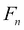
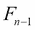
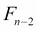
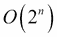
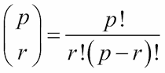
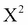

# 第十章：Functools 模块

函数式编程强调函数作为一等对象。我们有许多接受函数作为参数或返回函数作为结果的高阶函数。在本章中，我们将查看`functools`库，其中包含一些函数来帮助我们创建和修改函数。

我们将在本章中查看一些高阶函数。之前，我们在第五章中看了高阶函数。我们还将在第十一章中继续研究高阶函数技术，*装饰器设计技术*。

在本模块中，我们将查看以下函数：

+   `@lru_cache`：这个装饰器对某些类型的应用程序可能会带来巨大的性能提升。

+   `@total_ordering`：这个装饰器可以帮助创建丰富的比较运算符。然而，它让我们看到了面向对象设计与函数式编程的更一般问题。

+   `partial（）`：它创建一个应用于给定函数的一些参数的新函数。

+   `reduce（）`：它是一个泛化的`sum（）`等归约的高阶函数。

我们将把这个库的另外两个成员推迟到第十一章，*装饰器设计技术*：`update_wrapper（）`和`wraps（）`函数。我们还将在下一章更仔细地研究编写我们自己的装饰器。

我们将完全忽略`cmp_to_key（）`函数。它的目的是帮助转换 Python 2 代码（使用比较）以在 Python 3 下运行，Python 3 使用键提取。我们只对 Python 3 感兴趣；我们将编写适当的键函数。

# 函数工具

我们在第五章中看了许多高阶函数，*高阶函数*。这些函数要么接受一个函数作为参数，要么返回一个函数（或生成器表达式）作为结果。所有这些高阶函数都有一个基本算法，可以通过注入另一个函数来定制。像`max（）`，`min（）`和`sorted（）`这样的函数接受一个`key=`函数来定制它们的行为。像`map（）`和`filter（）`这样的函数接受一个函数和一个可迭代对象，并将该函数应用于参数。在`map（）`函数的情况下，函数的结果被简单地保留。在`filter（）`函数的情况下，函数的布尔结果用于从可迭代对象中传递或拒绝值。

第五章中的所有函数，*高阶函数*都是 Python `__builtins__`包的一部分：它们无需进行`import`即可使用。它们是无处不在的，因为它们非常普遍有用。本章中的函数必须通过`import`引入，因为它们并不是如此普遍可用。

`reduce（）`函数跨越了这个界限。它最初是内置的。经过多次讨论，它从`__builtins__`包中移除，因为可能会被滥用。一些看似简单的操作可能表现得非常糟糕。

# 使用 lru_cache 进行记忆先前的结果

`lru_cache`装饰器将给定的函数转换为可能执行得更快的函数。**LRU**表示**最近最少使用**：保留了一组最近使用的项目。不经常使用的项目被丢弃以保持池的有界大小。

由于这是一个装饰器，我们可以将其应用于任何可能从缓存先前结果中受益的函数。我们可以这样使用它：

```py
from functools import lru_cache
@lru_cache(128)
def fibc(n):
 **"""Fibonacci numbers with naive recursion and caching
 **>>> fibc(20)
 **6765
 **>>> fibc(1)
 **1
 **"""
 **if n == 0: return 0
 **if n == 1: return 1
 **return fibc(n-1) + fibc(n-2)

```

这是基于第六章的一个例子，*递归和简化*。我们已经将`@lru_cache`装饰器应用于天真的斐波那契数计算。由于这个装饰，对`fibc(n)`函数的每次调用现在将被检查装饰器维护的缓存。如果参数`n`在缓存中，将使用先前计算的结果，而不是进行可能昂贵的重新计算。每个返回值都被添加到缓存中。当缓存满时，最旧的值将被弹出以腾出空间给新值。

我们强调这个例子，因为在这种情况下，天真的递归是非常昂贵的。计算任何给定的斐波那契数的复杂性，，不仅涉及计算，还涉及计算。这些值的树导致了一个的复杂度。

我们可以尝试使用`timeit`模块来经验性地确认这些好处。我们可以分别执行两种实现一千次，以查看时间的比较。使用`fib(20)`和`fibc(20)`方法显示了没有缓存的情况下这个计算是多么昂贵。因为天真的版本太慢了，`timeit`的重复次数被减少到只有 1,000 次。以下是结果：

+   Naive 3.23

+   缓存 0.0779

请注意，我们无法在`fibc()`函数上轻易使用`timeit`模块。缓存的值将保持不变：我们只会计算一次`fibc(20)`函数，这将在缓存中填充这个值。其余的 999 次迭代将简单地从缓存中获取值。我们需要在使用`fibc()`函数之间清除缓存，否则时间几乎降为 0。这是通过装饰器构建的`fibc.cache_clear()`方法来完成的。

记忆化的概念是强大的。有许多算法可以从结果的记忆化中受益。也有一些算法可能受益不那么多。

`p`个事物中以`r`个为一组的组合数通常被陈述如下：



这个二项式函数涉及计算三个阶乘值。在阶乘函数上使用`@lru_cache`装饰器可能是有意义的。计算一系列二项式值的程序将不需要重新计算所有这些阶乘。对于重复计算类似值的情况，加速可能会令人印象深刻。对于很少重复使用缓存值的情况，维护缓存值的开销超过了任何加速。

当重复计算类似值时，我们看到以下结果：

+   Naive Factorial 0.174

+   缓存阶乘 0.046

+   清除缓存阶乘 1.335

如果我们使用`timeit`模块重新计算相同的二项式，我们只会真正计算一次，并在其余时间返回相同的值；清除缓存的阶乘显示了在每次计算之前清除缓存的影响。清除缓存操作——`cache_clear()`函数——引入了一些开销，使其看起来比实际上更昂贵。故事的寓意是`lru_cache`装饰器很容易添加。它经常产生深远的影响；但也可能没有影响，这取决于实际数据的分布。

重要的是要注意，缓存是一个有状态的对象。这种设计推动了纯函数式编程的边界。一个可能的理想是避免赋值语句和相关状态的改变。避免有状态变量的概念通过递归函数得到了体现：当前状态包含在参数值中，而不是在变量的变化值中。我们已经看到，尾递归优化是一种必要的性能改进，以确保这种理想化的递归实际上可以很好地与可用的处理器硬件和有限的内存预算配合使用。在 Python 中，我们通过用`for`循环替换尾递归来手动进行尾递归优化。缓存是一种类似的优化：我们将根据需要手动实现它。

原则上，每次调用带有 LRU 缓存的函数都有两个结果：预期结果和一个新的缓存对象，应该用于以后的所有请求。实际上，我们将新的缓存对象封装在`fibc()`函数的装饰版本内。

缓存并不是万能的。与浮点值一起工作的应用程序可能不会从记忆化中受益太多，因为所有浮点数之间的差异都很小。浮点值的最低有效位有时只是随机噪音，这会阻止`lru_cache`装饰器中的精确相等测试。

我们将在第十六章中重新讨论这个问题，*优化和改进*。我们将看一些其他实现这个的方法。

# 定义具有完全排序的类

`total_ordering`装饰器有助于创建实现丰富的比较运算符的新类定义。这可能适用于子类`numbers.Number`的数值类。它也可能适用于半数值类。

作为一个半数值类的例子，考虑一张扑克牌。它有一个数值 rank 和一个符号 suit。只有在模拟某些游戏时，rank 才重要。这在模拟赌场二十一点时尤为重要。像数字一样，卡牌有一个顺序。我们经常对每张卡的点数进行求和，使它们类似于数字。然而，*card × card*的乘法实际上没有任何意义。

我们几乎可以用`namedtuple()`函数模拟一张扑克牌：

```py
Card1 = namedtuple("Card1", ("rank", "suit"))

```

这受到了一个深刻的限制：所有比较默认包括 rank 和 suit。这导致了以下尴尬的行为：

```py
>>> c2s= Card1(2, '\u2660')
>>> c2h= Card1(2, '\u2665')
>>> c2h == c2s
False

```

这对于二十一点游戏不起作用。它也不适用于某些扑克模拟。

我们真的希望卡片只按照它们的 rank 进行比较。以下是一个更有用的类定义。我们将分两部分展示。第一部分定义了基本属性：

```py
@total_ordering
class Card(tuple):
 **__slots__ = ()
 **def __new__( class_, rank, suit ):
 **obj= tuple.__new__(Card, (rank, suit))
 **return obj
 **def __repr__(self):
 **return "{0.rank}{0.suit}".format(self)
 **@property
 **def rank(self):
 **return self[0]
 **@property
 **def suit(self):
 **return self[1]

```

这个类扩展了`tuple`类；它没有额外的插槽，因此是不可变的。我们重写了`__new__()`方法，以便我们可以初始化一个 rank 和一个 suit 的初始值。我们提供了一个`__repr__()`方法来打印`Card`的字符串表示。我们提供了两个属性，使用属性名称提取 rank 和 suit。

类定义的其余部分显示了我们如何定义只有两个比较：

```py
 **def __eq__(self, other):
 **if isinstance(other,Card):
 **return self.rank == other.rank
 **elif isinstance(other,Number):
 **return self.rank == other
 **def __lt__(self, other):
 **if isinstance(other,Card):
 **return self.rank < other.rank
 **elif isinstance(other,Number):
 **return self.rank < other

```

我们已经定义了`__eq__()`和`__lt__()`函数。`@total_ordering`装饰器处理了所有其他比较的构造。在这两种情况下，我们允许卡片之间的比较，也允许卡片和数字之间的比较。

首先，我们只能得到 rank 的正确比较如下：

```py
>>> c2s= Card(2, '\u2660')
>>> c2h= Card(2, '\u2665')
>>> c2h == c2s
True
>>> c2h == 2
True

```

我们可以使用这个类进行许多模拟，使用简化的语法来比较卡牌的 rank。此外，我们还有一套丰富的比较运算符，如下所示：

```py
>>> c2s= Card(2, '\u2660')
>>> c3h= Card(3, '\u2665')
>>> c4c= Card(4, '\u2663')
>>> c2s <= c3h < c4c
True
>>> c3h >= c3h
True
>>> c3h > c2s
True
>>> c4c != c2s
True

```

我们不需要编写所有的比较方法函数；它们是由装饰器生成的。装饰器创建的运算符并不完美。在我们的情况下，我们要求使用整数进行比较以及在`Card`实例之间进行比较。这揭示了一些问题。

像`c4c > 3`和`3 < c4c`这样的操作会引发`TypeError`异常。这是`total_ordering`装饰器的局限性。这种混合类强制转换在实践中很少出现问题，因为这种情况相对不常见。

面向对象编程并不与函数式编程对立。两种技术在某些领域是互补的。Python 创建不可变对象的能力与函数式编程技术特别契合。我们可以轻松避免有状态对象的复杂性，但仍然受益于封装，以保持相关的方法函数在一起。定义涉及复杂计算的类属性特别有帮助；这将计算绑定到类定义，使应用程序更容易理解。

## 定义数字类

在某些情况下，我们可能希望扩展 Python 中可用的数字体系。`numbers.Number`的子类可能简化函数式程序。例如，我们可以将复杂算法的部分隔离到`Number`子类定义中，从而使应用程序的其他部分更简单或更清晰。

Python 已经提供了丰富多样的数字类型。内置类型的`int`和`float`变量涵盖了各种问题领域。在处理货币时，`decimal.Decimal`包可以优雅地处理这个问题。在某些情况下，我们可能会发现`fractions.Fraction`类比`float`变量更合适。

例如，在处理地理数据时，我们可能考虑创建`float`变量的子类，引入额外的属性，用于在纬度（或经度）和弧度之间进行转换。这个子类中的算术操作可以简化穿越赤道或本初子午线的计算。

由于 Python 的`Numbers`类旨在是不可变的，普通的函数式设计可以应用于所有各种方法函数。特殊的 Python 就地特殊方法（例如，`__iadd__()`函数）可以简单地忽略。

当使用`Number`的子类时，我们有以下一系列设计考虑：

+   相等性测试和哈希值计算。关于数字的哈希计算的核心特性在*Python 标准库*的*9.1.2 类型实现者注意事项*部分有详细说明。

+   其他比较操作符（通常通过`@total_ordering`装饰器定义）。

+   算术操作符：`+`，`-`，`*`，`/`，`//`，`%`和`**`。前向操作有特殊方法，还有额外的方法用于反向类型匹配。例如，对于表达式`a-b`，Python 使用`a`的类型来尝试找到`__sub__()`方法函数的实现：实际上是`a.__sub__(b)`方法。如果左侧值的类，在这种情况下是`a`，没有该方法或返回`NotImplemented`异常，那么将检查右侧值，看看`b.__rsub__(a)`方法是否提供结果。还有一个特殊情况，当`b`的类是`a`的类的子类时，这允许子类覆盖左侧操作选择。

+   位操作符：`&`，`|`，**^**，`>>`，`<<`和`~`。这些可能对浮点值没有意义；省略这些特殊方法可能是最好的设计。

+   一些额外的函数，如`round()`，`pow()`和`divmod()`，是通过数字特殊方法名称实现的。这些可能对这类数字有意义。

第七章，《精通面向对象的 Python》提供了创建新类型数字的详细示例。访问链接以获取更多详细信息：

[`www.packtpub.com/application-development/mastering-object-oriented-python`](https://www.packtpub.com/application-development/mastering-object-oriented-python)。

正如我们之前所指出的，函数式编程和面向对象编程可以是互补的。我们可以轻松地定义遵循函数式编程设计模式的类。添加新类型的数字是利用 Python 的面向对象特性创建更易读的函数式程序的一个例子。

# 使用 partial（）应用部分参数

`partial（）`函数导致了部分应用的东西。部分应用的函数是从旧函数和一部分所需参数构建的新函数。它与柯里化的概念密切相关。由于柯里化不适用于 Python 函数的实现方式，因此大部分理论背景在这里并不相关。然而，这个概念可以带给我们一些方便的简化。

我们可以看以下的简单例子：

```py
>>> exp2= partial(pow, 2)
>>> exp2(12)
4096
>>> exp2(17)-1
131071

```

我们创建了一个名为`exp2（y）`的函数，它是`pow（2，y）`函数。`partial（）`函数将第一个位置参数限制在`pow（）`函数中。当我们评估新创建的`exp2（）`函数时，我们得到从`partial（）`函数绑定的参数计算出的值，以及提供给`exp2（）`函数的额外参数。

位置参数的绑定以严格的从左到右的顺序进行。对于接受关键字参数的函数，在构建部分应用的函数时也可以提供这些参数。

我们也可以使用 lambda 形式创建这种部分应用的函数，如下所示：

```py
exp2= lambda y: pow(2,y)

```

两者都没有明显的优势。性能测试表明，`partial（）`函数比 lambda 形式稍快，具体如下：

+   0.37 部分

+   lambda 0.42

这是在 100 万次迭代中超过 0.05 秒：并没有显著的节省。

由于 lambda 形式具有`partial（）`函数的所有功能，因此我们可以安全地将此函数设置为不是非常有用。我们将在第十四章*PyMonad 库*中返回它，并看看我们如何使用柯里化来实现这一点。

# 使用`reduce（）`函数减少数据集

`sum（）`，`len（）`，`max（）`和`min（）`函数在某种程度上都是`reduce（）`函数表达的更一般算法的特殊化。`reduce（）`函数是一个高阶函数，它将一个函数折叠到可迭代对象中的每一对项目中。

给定一个序列对象如下：

```py
d = [2, 4, 4, 4, 5, 5, 7, 9]

```

函数`reduce（lambda x，y：x+y，d）`将`+`运算符折叠到列表中如下：

```py
2+4+4+4+5+5+7+9

```

包括`（）`可以显示有效的分组如下：

```py
((((((2+4)+4)+4)+5)+5)+7)+9

```

Python 对表达式的标准解释涉及对运算符的从左到右的评估。左折叠并没有太大的意义变化。

我们也可以提供一个初始值如下：

```py
reduce(lambda x,y: x+y**2, iterable, 0)

```

如果我们不这样做，序列的初始值将被用作初始化。当有`map（）`函数和`reduce（）`函数时，提供初始值是必不可少的。以下是如何使用显式 0 初始化器计算正确答案的：

```py
0+ 2**2+ 4**2+ 4**2+ 4**2+ 5**2+ 5**2+ 7**2+ 9**2

```

如果我们省略 0 的初始化，并且`reduce（）`函数使用第一个项目作为初始值，我们会得到以下错误答案：

```py
2+ 4**2+ 4**2+ 4**2+ 5**2+ 5**2+ 7**2+ 9**2

```

我们可以使用`reduce（）`高阶函数定义一些内置的缩减如下：

```py
sum2= lambda iterable: reduce(lambda x,y: x+y**2, iterable, 0)
sum= lambda iterable: reduce(lambda x, y: x+y, iterable)
count= lambda iterable: reduce(lambda x, y: x+1, iterable, 0)
min= lambda iterable: reduce(lambda x, y: x if x < y else y, iterable)
max= lambda iterable: reduce(lambda x, y: x if x > y else y, iterable)

```

`sum2（）`缩减函数是平方和，用于计算一组样本的标准偏差。这个`sum（）`缩减函数模仿了内置的`sum（）`函数。`count（）`缩减函数类似于`len（）`函数，但它可以在可迭代对象上工作，而`len（）`函数只能在实例化的`collection`对象上工作。

`min（）`和`max（）`函数模仿了内置的缩减。因为可迭代对象的第一个项目被用于初始化，所以这两个函数将正常工作。如果我们为这些`reduce（）`函数提供任何初始值，我们可能会错误地使用原始可迭代对象中从未出现的值。

## 结合 map（）和 reduce（）

我们可以看到如何围绕这些简单定义构建高阶函数。我们将展示一个简单的 map-reduce 函数，它结合了`map()`和`reduce()`函数，如下所示：

```py
def map_reduce(map_fun, reduce_fun, iterable):
 **return reduce(reduce_fun, map(map_fun, iterable))

```

我们从`map()`和`reduce()`函数中创建了一个复合函数，它接受三个参数：映射、缩减操作和要处理的可迭代对象或序列。

我们可以分别使用`map()`和`reduce()`函数构建一个平方和缩减，如下所示：

```py
def sum2_mr(iterable):
 **return map_reduce(lambda y: y**2, lambda x,y: x+y, iterable)

```

在这种情况下，我们使用了`lambda y: y**2`参数作为映射来对每个值进行平方。缩减只是`lambda x,y: x+y`参数。我们不需要明确提供初始值，因为初始值将是`map()`函数对其进行平方后的可迭代对象中的第一项。

`lambda x,y: x+y`参数只是`+`运算符。Python 在`operator`模块中提供了所有算术运算符作为简短的函数。以下是我们如何稍微简化我们的 map-reduce 操作：

```py
import operator
def sum2_mr2(iterable):
 **return map_reduce(lambda y: y**2, operator.add, iterable)

```

我们使用了`operator.add`方法来对值进行求和，而不是更长的 lambda 形式。

以下是我们如何在可迭代对象中计算值的数量：

```py
def count_mr(iterable):
 **return map_reduce(lambda y: 1, operator.add, iterable)

```

我们使用`lambda y: 1`参数将每个值映射为简单的 1。然后计数是使用`operator.add`方法进行`reduce()`函数。

通用的`reduce()`函数允许我们从大型数据集创建任何种类的缩减到单个值。然而，对于我们应该如何使用`reduce()`函数存在一些限制。

我们应该避免执行以下命令：

```py
reduce(operator.add, ["1", ",", "2", ",", "3"], "")

```

是的，它有效。然而，`"".join(["1", ",", "2", ",", "3"])`方法要高效得多。我们测得每百万次执行`"".join()`函数需要 0.23 秒，而执行`reduce()`函数需要 0.69 秒。

## 使用`reduce()`和`partial()`

### 注意

`sum()`函数可以看作是`partial(reduce, operator.add)`方法。这也给了我们一个提示，即我们可以创建其他映射和其他缩减。实际上，我们可以将所有常用的缩减定义为 partial 而不是 lambda。

以下是两个例子：

```py
sum2= partial(reduce, lambda x,y: x+y**2)
count= partial(reduce, lambda x,y: x+1)

```

现在我们可以通过`sum2(some_data)`或`count(some_iter)`方法使用这些函数。正如我们之前提到的，目前还不清楚这有多大的好处。可能可以用这样的函数简单地解释特别复杂的计算。

## 使用`map()`和`reduce()`来清理原始数据

在进行数据清理时，我们经常会引入各种复杂程度的过滤器来排除无效值。在某些情况下，我们还可以包括一个映射，以清理值，即在有效但格式不正确的值可以被替换为有效且正确的值的情况下。

我们可能会产生以下输出：

```py
def comma_fix(data):
 **try:
 **return float(data)
 **except ValueError:
 **return float(data.replace(",", ""))
def clean_sum(cleaner, data):
 **return reduce(operator.add, map(cleaner, data))

```

我们定义了一个简单的映射，即`comma_fix()`类，它将数据从几乎正确的格式转换为可用的浮点值。

我们还定义了一个 map-reduce，它将给定的清理函数（在本例中是`comma_fix()`类）应用于数据，然后使用`operator.add`方法进行`reduce()`函数。

我们可以按照以下方式应用先前描述的函数：

```py
>>> d = ('1,196', '1,176', '1,269', '1,240', '1,307', ... '1,435', '1,601', '1,654', '1,803', '1,734')
>>> clean_sum(comma_fix, d)
14415.0

```

我们已经清理了数据，修复了逗号，并计算了总和。这种语法非常方便，可以将这两个操作结合起来。

然而，我们必须小心，不要多次使用清理函数。如果我们还要计算平方和，我们真的不应该执行以下命令：

```py
comma_fix_squared = lambda x: comma_fix(x)**2

```

如果我们将`clean_sum(comma_fix_squared, d)`方法作为计算标准差的一部分使用，我们将对数据进行两次逗号修复操作：一次用于计算总和，一次用于计算平方和。这是一个糟糕的设计；使用`lru_cache`装饰器可以帮助缓存结果。将经过清理的中间值实现为临时的`tuple`对象可能更好。

## 使用`groupby()`和`reduce()`

一个常见的要求是在将数据分成组后对数据进行汇总。我们可以使用`defaultdict(list)`方法来分区数据。然后我们可以分别分析每个分区。在第四章*处理集合*中，我们看了一些分组和分区的方法。在第八章*Itertools 模块*中，我们看了其他方法。

以下是我们需要分析的一些示例数据：

```py
>>> data = [('4', 6.1), ('1', 4.0), ('2', 8.3), ('2', 6.5), ... ('1', 4.6), ('2', 6.8), ('3', 9.3), ('2', 7.8), ('2', 9.2), ... ('4', 5.6), ('3', 10.5), ('1', 5.8), ('4', 3.8), ('3', 8.1), ... ('3', 8.0), ('1', 6.9), ('3', 6.9), ('4', 6.2), ('1', 5.4), ... ('4', 5.8)]

```

我们有一系列原始数据值，每个键和每个键的测量值。

从这些数据中产生可用的组的一种方法是构建一个将键映射到该组中成员列表的字典，如下所示：

```py
from collections import defaultdict
def partition(iterable, key=lambda x:x):
 **"""Sort not required."""
 **pd = defaultdict(list)
 **for row in iterable:
 **pd[key(row)].append(row)
 **for k in sorted(pd):
 **yield k, iter(pd[k])

```

这将把可迭代对象中的每个项目分成单独的组。`key()`函数用于从每个项目中提取一个键值。这个键用于将每个项目附加到`pd`字典中的列表中。这个函数的结果值与`itertools.groupby()`函数的结果相匹配：它是一个可迭代的`(group key, iterator)`对序列。

以下是使用`itertools.groupby()`函数完成的相同特性：

```py
def partition_s(iterable, key= lambda x:x):
 **"""Sort required"""
 **return groupby(iterable, key)

```

我们可以按如下方式总结分组数据：

```py
mean= lambda seq: sum(seq)/len(seq)
var= lambda mean, seq: sum( (x-mean)**2/mean for x in seq)
def summarize( key_iter ):
 **key, item_iter= key_iter
 **values= tuple((v for k,v in item_iter))
 **μ= mean(values)
 **return key, μ, var(μ, values)

```

`partition()`函数的结果将是一个`(key, iterator)`两个元组的序列。我们将键与项目迭代器分开。项目迭代器中的每个项目都是源数据中的原始对象之一；这些是`(key, value)`对；我们只需要值，因此我们使用了一个简单的生成器表达式来将源键与值分开。

我们还可以执行以下命令，从两个元组中选择第二个项目：

```py
map(snd, item_iter)

```

这需要`snd= lambda x: x[1]`方法。

我们可以使用以下命令将`summarize()`函数应用于每个分区：

```py
>>> partition1= partition(list(data), key=lambda x:x[0])
>>> groups= map(summarize, partition1)

```

替代命令如下：

```py
>>> partition2= partition_s(sorted(data), key=lambda x:x[0])
>>> groups= map(summarize, partition2)

```

两者都将为我们提供每个组的汇总值。生成的组统计如下：

```py
1 5.34 0.93
2 7.72 0.63
3 8.56 0.89
4 5.5 0.7

```

方差可以作为的一部分来测试数据的零假设是否成立。零假设断言没有什么可看的；数据中的方差基本上是随机的。我们还可以比较四个组之间的数据，看各种平均值是否与零假设一致，或者是否存在一些统计学上显著的变化。

# 摘要

在本章中，我们研究了`functools`模块中的许多函数。这个库模块提供了许多函数，帮助我们创建复杂的函数和类。

我们已经将`@lru_cache`函数视为一种提高某些类型的应用程序的方法，这些应用程序需要频繁重新计算相同值。这个装饰器对于那些接受`integer`或`string`参数值的某些类型的函数来说是非常有价值的。它可以通过简单地实现记忆化来减少处理。

我们将`@total_` `ordering`函数视为装饰器，以帮助我们构建支持丰富排序比较的对象。这在函数式编程的边缘，但在创建新类型的数字时非常有帮助。

`partial()`函数创建一个新函数，其中包含参数值的部分应用。作为替代，我们可以构建一个具有类似特性的`lambda`。这种用例是模棱两可的。

我们还研究了`reduce()`函数作为高阶函数。这概括了像`sum()`函数这样的缩减。我们将在后面的章节中的几个示例中使用这个函数。这与`filter()`和`map()`函数在逻辑上是一致的，是一个重要的高阶函数。

在接下来的章节中，我们将看看如何使用装饰器构建高阶函数。这些高阶函数可以导致稍微更简单和更清晰的语法。我们可以使用装饰器来定义我们需要合并到许多其他函数或类中的孤立方面。
