# 第十一章：装饰器设计技术

Python 为我们提供了许多创建高阶函数的方法。在第五章中，*高阶函数*，我们探讨了两种技术：定义一个接受函数作为参数的函数，以及定义`Callable`的子类，该子类可以初始化为一个函数或者使用函数作为参数调用。

在本章中，我们将探讨使用装饰器基于另一个函数构建函数。我们还将研究`functools`模块中的两个函数`update_wrapper()`和`wraps()`，这些函数可以帮助我们构建装饰器。

装饰函数的好处之一是我们可以创建复合函数。这些是单个函数，包含来自多个来源的功能。复合函数，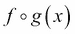，可能比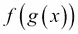更能表达复杂算法。对于表达复杂处理，有多种语法替代方式通常是有帮助的。

# 装饰器作为高阶函数

装饰器的核心思想是将一些原始函数转换为另一种形式。装饰器创建了一种基于装饰器和被装饰的原始函数的复合函数。

装饰器函数可以用以下两种方式之一使用：

+   作为一个前缀，创建一个与基本函数同名的新函数，如下所示：

```py
@decorator
def original_function():
 **pass

```

+   作为一个显式操作，返回一个新的函数，可能有一个新的名称：

```py
def original_function():
 **pass
original_function= decorator(original_function)

```

这些是相同操作的两种不同语法。前缀表示法的优点是整洁和简洁。对于某些读者来说，前缀位置更加可见。后缀表示法是显式的，稍微更加灵活。虽然前缀表示法很常见，但使用后缀表示法的一个原因是：我们可能不希望结果函数替换原始函数。我们可能希望执行以下命令，允许我们同时使用装饰和未装饰的函数：

```py
new_function = decorator(original_function)

```

Python 函数是一等对象。接受函数作为参数并返回函数作为结果的函数显然是语言的内置特性。那么，我们如何更新或调整函数的内部代码结构呢？

答案是我们不需要。

与其在代码内部胡乱搞，不如定义一个包装原始函数的新函数更清晰。在定义装饰器时，我们涉及两个高阶函数层次：

+   装饰器函数将包装器应用于基本函数，并返回新的包装器。此函数可以作为构建装饰函数的一次性评估。

+   包装函数可以（通常会）评估基本函数。每次评估装饰函数时，都会评估此函数。

这是一个简单装饰器的例子：

```py
from functools import wraps
def nullable(function):
 **@wraps(function)
 **def null_wrapper(arg):
 **return None if arg is None else function(arg)
 **return null_wrapper

```

我们几乎总是希望使用`functools.wraps()`函数来确保装饰的函数保留原始函数的属性。例如，复制`__name__`和`__doc__`属性可以确保结果装饰的函数具有原始函数的名称和文档字符串。

所得到的复合函数，在装饰器的定义中称为`null_wrapper()`函数，也是一种高阶函数，它将原始函数`function()`函数与一个保留`None`值的表达式相结合。原始函数不是一个显式参数；它是一个自由变量，将从定义`wrapper()`函数的上下文中获取其值。

装饰器函数的返回值将返回新创建的函数。装饰器只返回函数，不会尝试处理任何数据。装饰器是元编程：创建代码的代码。然而，`wrapper()`函数将用于处理真实的数据。

我们可以应用我们的`@nullable`装饰器来创建一个复合函数，如下所示：

```py
nlog = nullable(math.log)

```

现在我们有了一个函数`nlog()`，它是`math.log()`函数的空值感知版本。我们可以使用我们的复合函数`nlog()`，如下所示：

```py
>>> some_data = [10, 100, None, 50, 60]
>>> scaled = map(nlog, some_data)** 
>>> list(scaled)
[2.302585092994046, 4.605170185988092, None, 3.912023005428146, 4.0943445622221]

```

我们已经将函数应用于一组数据值。`None`值礼貌地导致`None`结果。没有涉及异常处理。

### 注意

这个例子并不适合进行单元测试。我们需要对值进行四舍五入以进行测试。为此，我们还需要一个空值感知的`round()`函数。

以下是使用装饰符表示法创建空值感知舍入函数的方法：

```py
@nullable
def nround4(x):
 **return round(x,4)

```

这个函数是`round()`函数的部分应用，包装成空值感知。在某些方面，这是一种相对复杂的函数式编程，对 Python 程序员来说是很容易使用的。

我们还可以使用以下方法创建空值感知的四舍五入函数：

```py
nround4= nullable(lambda x: round(x,4))

```

这具有相同的效果，但在清晰度方面有一些成本。

我们可以使用`round4()`函数来创建一个更好的测试用例，用于我们的`nlog()`函数，如下所示：

```py
>>> some_data = [10, 100, None, 50, 60]
>>> scaled = map(nlog, some_data)
>>> [nround4(v) for v in scaled]
[2.3026, 4.6052, None, 3.912, 4.0943]

```

这个结果将独立于任何平台考虑。

这个装饰器假设被装饰的函数是一元的。我们需要重新审视这个设计，以创建一个更通用的空值感知装饰器，可以处理任意集合的参数。

在第十四章中，*PyMonad 库*，我们将看一种容忍`None`值的问题的替代方法。`PyMonad`库定义了一个`Maybe`对象类，它可能有一个适当的值，也可能是`None`值。

## 使用 functool 的 update_wrapper()函数

`@wraps`装饰器应用`update_wrapper()`函数以保留包装函数的一些属性。一般来说，这默认情况下就做了我们需要的一切。这个函数将一些特定的属性从原始函数复制到装饰器创建的结果函数中。具体的属性列表是什么？它由一个模块全局变量定义。

`update_wrapper()`函数依赖于一个模块全局变量来确定要保留哪些属性。`WRAPPER_ASSIGNMENTS`变量定义了默认情况下要复制的属性。默认值是要复制的属性列表：

```py
('__module__', '__name__', '__qualname__', '__doc__', '__annotations__')

```

对这个列表进行有意义的修改是困难的。为了复制额外的属性，我们必须确保我们的函数是用这些额外的属性定义的。这是具有挑战性的，因为`def`语句的内部不容易进行简单的修改或更改。

因为我们不能轻松地合并新的属性，所以很难找到修改或扩展包装函数工作方式的原因。将这个变量作为参考信息大多是有趣的。

如果我们要使用`callable`对象，那么我们可能会有一个类，它在定义中提供了一些额外的属性。然后我们可能会遇到这样一种情况，装饰器可能需要将这些额外的属性从原始的被包装的`callable`对象复制到正在创建的包装函数中。然而，似乎更简单的是在类定义本身中进行这些更改，而不是利用棘手的装饰器技术。

虽然有很多灵活性可用，但大部分对于普通应用程序开发并不有用。

# 横切关注点

装饰器背后的一个一般原则是允许我们从应用装饰器的原始函数和装饰器构建一个复合函数。这个想法是有一个常见装饰器库，可以为常见关注点提供实现。

我们经常称这些横切关注，因为它们适用于几个函数。这些是我们希望通过装饰器设计一次并在应用程序或框架中的相关类中应用的事物。

通常集中描述的关注点包括以下内容：

+   记录

+   审计

+   安全

+   处理不完整的数据

例如，`logging`装饰器可能会向应用程序的日志文件写入标准化消息。审计装饰器可能会写入围绕数据库更新的详细信息。安全装饰器可能会检查一些运行时上下文，以确保登录用户具有必要的权限。

我们的一个示例是对函数的*空值感知*包装器是一个横切关注。在这种情况下，我们希望有许多函数处理`None`值，而不是引发异常返回`None`值。在数据不完整的应用程序中，我们可能需要以简单、统一的方式处理行，而不必编写大量分散注意力的`if`语句来处理缺失值。

# 组合设计

复合函数的常见数学表示如下：

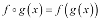

这个想法是我们可以定义一个新函数，，它结合了另外两个函数，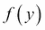和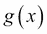。

Python 的多行定义形式如下：

```py
@f
def g(x):
 **something

```

这在某种程度上相当于。等价性并不是非常精确，因为`@f`装饰器与组合和的数学抽象不同。在讨论函数组合的目的时，我们将忽略的抽象和`@f`装饰器之间的实现断开连接。

因为装饰器包装另一个函数，Python 提供了一个稍微更一般化的组合。我们可以将 Python 设计思考如下：

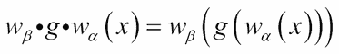

装饰器应用于某些应用程序函数，，将包括一个包装器函数。包装器的一部分，，应用于包装函数之前，另一部分，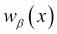，应用于包装函数之后。

`Wrapper()`函数通常如下所示：

```py
@wraps(argument_function)
def something_wrapper(*args, **kw):
 **# The "before" part, w_α, applied to *args or **kw
 **result= argument_function(*args, **kw)
 **# the "after" part, w_β, applied to the result

```

细节会有所不同，而且差异很大。在这个一般框架内可以做很多聪明的事情。

大量的函数式编程归结为种类的构造。我们经常拼写这些函数，因为将函数总结为一个组合，，并没有真正的好处。然而，在某些情况下，我们可能希望使用一个高阶函数，比如`map()`、`filter()`或`reduce()`来使用一个复合函数。

我们总是可以使用`map(f, map(g, x))`方法。然而，使用`map(f_g, x)`方法来应用一个复合到一个集合可能更清晰。重要的是要注意，这两种技术都没有固有的性能优势。`map()`函数是惰性的：使用两个`map()`函数，一个项目将从`x`中取出，由`g()`函数处理，然后由`f()`函数处理。使用单个`map()`函数，一个项目将从`x`中取出，然后由`f_g()`复合函数处理。

在第十四章中，*PyMonad 库*，我们将看看从单独的柯里化函数创建复合函数的另一种方法。

## 预处理坏数据

在一些探索性数据分析应用中的一个横切关注点是如何处理丢失或无法解析的数值。我们经常有一些`float`、`int`和`Decimal`货币值的混合，我们希望以一定的一致性处理它们。

在其他情境中，我们有*不适用*或*不可用*的数据值，不应干扰计算的主线。允许`Not Applicable`值在不引发异常的情况下通过表达式通常很方便。我们将专注于三个坏数据转换函数：`bd_int()`、`bd_float()`和`bd_decimal()`。我们要添加的复合特性将在内置转换函数之前定义。

这是一个简单的坏数据装饰器：

```py
import decimal
def bad_data(function):
 **@wraps(function)
 **def wrap_bad_data(text, *args, **kw):
 **try:
 **return function(text, *args, **kw)
 **except (ValueError, decimal.InvalidOperation):
 **cleaned= text.replace(",", "")
 **return function(cleaned, *args, **kw)
 **return wrap_bad_data

```

这个函数包装了一个给定的转换函数，以尝试在第一次转换涉及坏数据时进行第二次转换。在保留`None`值作为`Not Applicable`代码的情况下，异常处理将简单地返回`None`值。

在这种情况下，我们提供了 Python 的`*args`和`**kw`参数。这确保了包装函数可以提供额外的参数值。

我们可以使用这个包装器如下：

```py
bd_int= bad_data(int)
bd_float= bad_data(float)
bd_decimal= bad_data(Decimal)

```

这将创建一套函数，可以对良好的数据进行转换，同时也可以进行有限的数据清洗，以处理特定类型的坏数据。

以下是使用`bd_int()`函数的一些示例：

```py
>>> bd_int("13")
13
>>> bd_int("1,371")
1371
>>> bd_int("1,371", base=16)
4977

```

我们已经将`bd_int()`函数应用于一个字符串，它转换得很整洁，还有一个带有特定类型标点符号的字符串，我们将容忍它。我们还表明我们可以为每个转换函数提供额外的参数。

我们可能希望有一个更灵活的装饰器。我们可能希望添加的一个功能是处理各种数据清洗的能力。简单的`,`移除并不总是我们需要的。我们可能还需要移除`$`或`°`符号。我们将在下一节中看到更复杂的、带参数的装饰器。

# 向装饰器添加参数

一个常见的要求是使用额外的参数自定义装饰器。我们不仅仅是创建一个复合的，我们做的事情要复杂一些。我们正在创建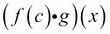。我们应用了一个参数，*c*，作为创建包装器的一部分。这个参数化的复合物，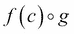，然后可以与实际数据*x*一起使用。

在 Python 语法中，我们可以写成如下形式：

```py
@deco(arg)
def func( ):
 **something

```

这将为基本函数定义提供一个参数化的`deco(arg)`函数。

效果如下：

```py
def func( ):
 **something
func= deco(arg)(func)

```

我们已经做了三件事，它们如下：

1.  定义一个函数`func.`

1.  将抽象装饰器`deco()`应用于其参数，以创建一个具体的装饰器`deco(arg).`

1.  将具体的装饰器`deco(arg)`应用于基本函数，以创建函数的装饰版本`deco(arg)(func).`

带有参数的装饰器涉及间接构建最终函数。我们似乎已经超越了仅仅是高阶函数，进入了更抽象的领域：创建高阶函数的高阶函数。

我们可以扩展我们的*bad-data*感知装饰器，以创建一个稍微更灵活的转换。我们将定义一个可以接受要移除的字符参数的装饰器。以下是一个带参数的装饰器：

```py
import decimal
def bad_char_remove(*char_list):
 **def cr_decorator(function):
 **@wraps(function)
 **def wrap_char_remove(text, *args, **kw):
 **try:
 **return function(text, *args, **kw)
 **except (ValueError, decimal.InvalidOperation):
 **cleaned= clean_list(text, char_list)
 **return function(cleaned, *args, **kw)
 **return wrap_char_remove
 **return cr_decorator

```

一个带参数的装饰器有三个部分，它们如下：

+   整体装饰器。这定义并返回抽象装饰器。在这种情况下，`cr_decorator`是一个抽象装饰器。它有一个自由变量`char_list`，来自初始装饰器。

+   抽象装饰器。在这种情况下，`cr_decorator` 装饰器将绑定其自由变量 `char_list`，以便可以应用到一个函数。

+   装饰包装器。在这个例子中，`wrap_char_remove` 函数将替换被包装的函数。由于 `@wraps` 装饰器，`__name__`（和其他属性）将被替换为被包装的函数的名称。

我们可以使用这个装饰器来创建转换函数，如下所示：

```py
@bad_char_remove("$", ",")
def currency(text, **kw):
 **return Decimal(text, **kw)

```

我们已经使用我们的装饰器来包装一个 `currency()` 函数。`currency()` 函数的基本特征是对 `decimal.Decimal` 构造函数的引用。

这个 `currency()` 函数现在将处理一些变体数据格式：

```py
>>> currency("13")
Decimal('13')
>>> currency("$3.14")
Decimal('3.14')
>>> currency("$1,701.00")
Decimal('1701.00')

```

我们现在可以使用相对简单的 `map(currency, row)` 方法来处理输入数据，将源数据从字符串转换为可用的 `Decimal` 值。`try:/except:` 错误处理已经被隔离到一个函数中，我们用它来构建一个复合转换函数。

我们可以使用类似的设计来创建空值容忍函数。这些函数将使用类似的 `try:/except:` 包装器，但只会返回 `None` 值。

# 实现更复杂的描述符

我们可以轻松地编写以下命令：

```py
@f_wrap
@g_wrap
def h(x):
 **something

```

Python 中没有任何阻止我们的东西。这有一些类似于 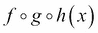。然而，名称仅仅是 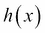。因此，当创建涉及深度嵌套描述符的函数时，我们需要谨慎。如果我们的意图只是处理一些横切关注，那么每个装饰器可以处理一个关注而不会造成太多混乱。

另一方面，如果我们使用装饰来创建一个复合函数，那么使用以下命令可能更好：

```py
f_g_h= f_wrap(g_wrap(h))

```

这澄清了正在发生的事情。装饰器函数并不完全对应于函数被组合的数学抽象。装饰器函数实际上包含一个包装器函数，该包装器函数将包含被组合的函数。当尝试理解应用程序时，函数和创建函数组合的装饰器之间的区别可能会成为一个问题。

与函数式编程的其他方面一样，简洁和表达力是目标。具有表达力的装饰器是受欢迎的。编写一个可以在应用程序中完成所有事情的超级可调用函数，只需要进行轻微的定制，可能是简洁的，但很少是表达性的。

# 识别设计限制

在我们的数据清理的情况下，简单地去除杂散字符可能是不够的。在处理地理位置数据时，我们可能会有各种各样的输入格式，包括简单的度数（`37.549016197`），度和分钟（`37° 32.94097′`），以及度-分-秒（`37° 32′ 56.46″`）。当然，还可能存在更微妙的清理问题：一些设备会创建一个带有 Unicode U+00BA 字符 `º` 的输出，而不是类似的度字符 `°`，它是 U+00B0。

因此，通常需要提供一个单独的清理函数，与转换函数捆绑在一起。这个函数将处理输入格式非常不一致的输入所需的更复杂的转换，比如纬度和经度。

我们如何实现这个？我们有很多选择。简单的高阶函数是一个不错的选择。另一方面，装饰器并不是一个很好的选择。我们将看一个基于装饰器的设计，以了解装饰器的合理性有限制。

要求有两个正交设计考虑，它们如下：

1.  输出转换（`int`，`float`，`Decimal`）

1.  输入清理（清除杂散字符，重新格式化坐标）

理想情况下，其中一个方面是一个被包装的基本函数，另一个方面是通过包装器包含的内容。本质与包装的选择并不清晰。其中一个原因是我们之前的例子比简单的两部分组合要复杂一些。

在之前的例子中，我们实际上创建了一个三部分的组合：

+   输出转换（`int`，`float`，`Decimal`）

+   输入清洁——可以是简单的替换，也可以是更复杂的多字符替换

+   尝试转换的函数，作为对异常的响应进行清洁，并再次尝试转换

第三部分——尝试转换和重试——实际上是包装器，也是组合函数的一部分。正如我们之前提到的，包装器包含一个前阶段和一个后阶段，我们分别称之为和。

我们想要使用这个包装器来创建两个额外函数的组合。对于语法，我们有两种选择。我们可以将清洁函数作为装饰器的参数包含在转换中，如下所示：

```py
@cleanse_before(cleanser)
def convert(text):
 **something

```

或者，我们可以将转换函数作为清洁函数的装饰器的参数包含如下：

```py
@then_convert(converter)
def clean(text):
 **something

```

在这种情况下，我们可以选择`@then_convert(converter)`样式的装饰器，因为我们在很大程度上依赖于内置转换。我们的观点是要表明选择并不是非常清晰的。

装饰器如下所示：

```py
def then_convert(convert_function):
 **def clean_convert_decorator(clean_function):
 **@wraps(clean_function)
 **def cc_wrapper(text, *args, **kw):
 **try:
 **return convert_function(text, *args, **kw)
 **except (ValueError, decimal.InvalidOperation):
 **cleaned= clean_function(text)
 **return convert_function(cleaned, *args, **kw)
 **return cc_wrapper
 **return clean_convert_decorator

```

我们定义了一个三层装饰器。核心是`cc_wrapper()`函数，应用`convert_function`函数。如果失败，它会使用`clean_function`函数，然后再次尝试`convert_function`函数。这个函数被`then_convert_decorator()`具体装饰器函数包裹在`clean_function`函数周围。具体装饰器具有`convert_function`函数作为自由变量。具体装饰器由装饰器接口`then_convert()`创建，该接口由转换函数定制。

现在我们可以构建一个稍微更灵活的清洁和转换函数，如下所示：

```py
@then_convert(int)
def drop_punct(text):
 **return text.replace(",", "").replace("$", "")

```

整数转换是应用于给定清洁函数的装饰器。在这种情况下，清洁函数移除了`$`和`,`字符。整数转换包裹在这个清洁函数周围。

我们可以如下使用整数转换：

```py
>>> drop_punct("1,701")
1701
>>> drop_punct("97")
97

```

虽然这可以将一些复杂的清洁和转换封装成一个非常整洁的包，但结果可能令人困惑。函数的名称是核心清洁算法的名称；另一个函数对组合的贡献被忽略了。

作为替代，我们可以如下使用整数转换：

```py
def drop_punct(text):
 **return text.replace(",", "").replace("$", "")
drop_punct_int = then_convert(int)(drop_punct)

```

这将允许我们为装饰的清洁函数提供一个新的名称。这解决了命名问题，但是通过`then_convert(int)(drop_punct)`方法构建最终函数的过程相当不透明。

看起来我们已经触及了边界。装饰器模式并不适合这种设计。一般来说，当我们有一些相对简单和固定的方面要与给定的函数（或类）一起包含时，装饰器的效果很好。当这些额外的方面可以被看作是基础设施或支持，而不是应用代码含义的重要部分时，装饰器也很重要。

对于涉及多个正交维度的事物，我们可能希望使用各种插件策略对象的`Callables`函数。这可能提供更可接受的东西。我们可能需要仔细研究创建高阶函数。然后，我们可以为高阶函数的各种参数组合创建部分函数。

典型的日志记录或安全测试示例可以被视为与问题域无关的后台处理类型。当我们的处理与我们周围的空气一样普遍时，那么装饰器可能更合适。

# 总结

在本章中，我们看了两种类型的装饰器：没有参数的简单装饰器和带参数的装饰器。我们看到装饰器涉及函数之间的间接组合：装饰器将一个函数（在装饰器内部定义）包裹在另一个函数周围。

使用`functools.wraps()`装饰器可以确保我们的装饰器能够正确地从被包装的函数中复制属性。这应该是我们编写的每个装饰器的一部分。

在下一章中，我们将看一下可用于我们的多进程和多线程技术。这些包在函数式编程环境中特别有帮助。当我们消除复杂的共享状态并设计非严格处理时，我们可以利用并行性来提高性能。
