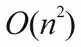
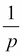

# 第十二章：多进程和线程模块

当我们消除复杂的共享状态并设计非严格处理时，我们可以利用并行性来提高性能。在本章中，我们将研究可用于我们的多进程和多线程技术。Python 库包在应用于允许惰性评估的算法时尤其有帮助。

这里的核心思想是在一个进程内或跨多个进程中分发一个函数式程序。如果我们创建了一个合理的函数式设计，我们就不会有应用程序组件之间的复杂交互；我们有接受参数值并产生结果的函数。这是进程或线程的理想结构。

我们将专注于“多进程”和`concurrent.futures`模块。这些模块允许多种并行执行技术。

我们还将专注于进程级并行而不是多线程。进程并行的理念使我们能够忽略 Python 的全局解释器锁（GIL），实现出色的性能。

有关 Python 的 GIL 的更多信息，请参阅[`docs.python.org/3.3/c-api/init.html#thread-state-and-the-global-interpreter-lock`](https://docs.python.org/3.3/c-api/init.html#thread-state-and-the-global-interpreter-lock)。

我们不会强调“线程”模块的特性。这经常用于并行处理。如果我们的函数式编程设计得当，那么由多线程写访问引起的任何问题都应该被最小化。然而，GIL 的存在意味着在 CPython 中，多线程应用程序会受到一些小限制的影响。由于等待 I/O 不涉及 GIL，一些 I/O 绑定的程序可能具有异常良好的性能。

最有效的并行处理发生在正在执行的任务之间没有依赖关系的情况下。通过一些精心设计，我们可以将并行编程视为一种理想的处理技术。开发并行程序的最大困难在于协调对共享资源的更新。

在遵循函数式设计模式并避免有状态的程序时，我们还可以最小化对共享对象的并发更新。如果我们能够设计出中心是惰性、非严格评估的软件，我们也可以设计出可以进行并发评估的软件。

程序总是会有一些严格的依赖关系，其中操作的顺序很重要。在`2*(3+a)`表达式中，`(3+a)`子表达式必须首先进行评估。然而，在处理集合时，我们经常遇到集合中项目的处理顺序并不重要的情况。

考虑以下两个例子：

```py
x = list(func(item) for item in y)
x = list(reversed([func(item) for item in y[::-1]]))

```

尽管项目以相反的顺序进行评估，但这两个命令都会产生相同的结果。

事实上，即使是以下命令片段也会产生相同的结果：

```py
import random
indices= list(range(len(y)))
random.shuffle(indices)
x = [None]*len(y)
for k in indices:
 **x[k] = func(y[k])

```

评估顺序是随机的。由于每个项目的评估是独立的，评估顺序并不重要。许多允许非严格评估的算法都是如此。

# 并发真正意味着什么

在一台小型计算机上，只有一个处理器和一个核心，所有评估都是通过处理器的核心进行串行化的。操作系统将通过巧妙的时间切片安排交错执行多个进程和多个线程。

在具有多个 CPU 或单个 CPU 中的多个核心的计算机上，可以对 CPU 指令进行一些实际的并发处理。所有其他并发都是通过操作系统级别的时间切片模拟的。Mac OS X 笔记本电脑可以有 200 个共享 CPU 的并发进程；这比可用核心数多得多。由此可见，操作系统的时间切片负责大部分表面上的并发行为。

# 边界条件

让我们考虑一个假设的算法，其中有。假设有一个涉及 1000 字节 Python 代码的内部循环。在处理 10000 个对象时，我们执行了 1000 亿次 Python 操作。这是基本的处理预算。我们可以尝试分配尽可能多的进程和线程，但处理预算是不能改变的。

单个 CPython 字节码没有简单的执行时间。然而，在 Mac OS X 笔记本上的长期平均值显示，我们可以预期每秒执行大约 60MB 的代码。这意味着我们的 1000 亿字节码操作将需要大约 1666 秒，或 28 分钟。

如果我们有一台双处理器、四核的计算机，那么我们可能将经过时间缩短到原始总时间的 25%：7 分钟。这假设我们可以将工作分成四个（或更多）独立的操作系统进程。

这里的重要考虑因素是我们的 1000 亿字节码的预算是不能改变的。并行性不会神奇地减少工作量。它只能改变时间表，也许可以减少经过时间。

切换到一个更好的算法可以将工作量减少到 132MB 的操作。以 60MBps 的速度，这个工作量要小得多。并行性不会像算法改变那样带来戏剧性的改进。

# 与进程或线程共享资源

操作系统确保进程之间几乎没有交互。要使两个进程交互，必须显式共享一些公共的操作系统资源。这可以是一个共享文件，一个特定的共享内存对象，或者是进程之间共享状态的信号量。进程本质上是独立的，交互是例外。

另一方面，多个线程是单个进程的一部分；进程的所有线程共享操作系统资源。我们可以例外地获得一些线程本地内存，可以自由写入而不受其他线程干扰。除了线程本地内存，写入内存的操作可能以潜在的不可预测顺序设置进程的内部状态。必须使用显式锁定来避免这些有状态更新的问题。正如之前所指出的，指令执行的整体顺序很少是严格并发的。并发线程和进程的指令通常以不可预测的顺序交错执行。使用线程会带来对共享变量的破坏性更新的可能性，需要仔细的锁定。并行处理会带来操作系统级进程调度的开销。

事实上，即使在硬件级别，也存在一些复杂的内存写入情况。有关内存写入问题的更多信息，请访问[`en.wikipedia.org/wiki/Memory_disambiguation`](http://en.wikipedia.org/wiki/Memory_disambiguation)。

并发对象更新的存在是设计多线程应用程序时所面临的困难。锁定是避免对共享对象进行并发写入的一种方法。避免共享对象是另一种可行的设计技术。这更适用于函数式编程。

在 CPython 中，GIL 用于确保操作系统线程调度不会干扰对 Python 数据结构的更新。实际上，GIL 将调度的粒度从机器指令改变为 Python 虚拟机操作。没有 GIL，内部数据结构可能会被竞争线程的交错交互所破坏。

# 利益将会产生的地方

一个进行大量计算而相对较少 I/O 的程序不会从并发处理中获得太多好处。如果一个计算有 28 分钟的计算时间，那么以不同的方式交错操作不会产生太大影响。从严格到非严格评估 1000 亿个字节码不会缩短经过的执行时间。

然而，如果一个计算涉及大量 I/O，那么交错 CPU 处理和 I/O 请求可能会影响性能。理想情况下，我们希望在等待操作系统完成下一批数据输入时对一些数据进行计算。

我们有两种交错计算和 I/O 的方法。它们如下：

+   我们可以尝试将 I/O 和计算整体问题交错进行。我们可以创建一个包含读取、计算和写入操作的处理流水线。这个想法是让单独的数据对象从一个阶段流向下一个阶段。每个阶段可以并行操作。

+   我们可以将问题分解成可以并行处理的独立部分，从头到尾进行处理。

这些方法之间的差异并不明显；有一个模糊的中间区域，不太清楚是哪一个。例如，多个并行流水线是两种设计的混合体。有一些形式化方法可以更容易地设计并发程序。**通信顺序进程**（**CSP**）范式可以帮助设计消息传递应用程序。像`pycsp`这样的包可以用来向 Python 添加 CSP 形式化方法。

I/O 密集型程序通常受益于并发处理。这个想法是交错 I/O 和处理。CPU 密集型程序很少受益于尝试并发处理。

# 使用多处理池和任务

为了在更大的上下文中使用非严格评估，`multiprocessing`包引入了`Pool`对象的概念。我们可以创建一个并发工作进程的`Pool`对象，将任务分配给它们，并期望任务并发执行。正如之前所述，这个创建并不实际意味着同时创建`Pool`对象。这意味着顺序很难预测，因为我们允许操作系统调度交错执行多个进程。对于一些应用程序，这允许在更少的经过时间内完成更多的工作。

为了充分利用这一能力，我们需要将应用程序分解成组件，对于这些组件，非严格并发执行是有益的。我们希望定义可以以不确定顺序处理的离散任务。

通过网络抓取从互联网收集数据的应用程序通常通过并行处理进行优化。我们可以创建几个相同的网站抓取器的`Pool`对象。任务是由池化进程分析的 URL。

分析多个日志文件的应用程序也是并行化的一个很好的候选。我们可以创建一个分析进程的`Pool`对象。我们可以将每个日志文件分配给一个分析器；这允许在`Pool`对象的各个工作进程之间并行进行读取和分析。每个单独的工作进程将涉及串行 I/O 和计算。然而，一个工作进程可以在其他工作进程等待 I/O 完成时分析计算。

## 处理许多大文件

这是一个多处理应用程序的例子。我们将在网络日志文件中抓取**通用日志格式**（**CLF**）行。这是访问日志的通用格式。这些行往往很长，但在书的边距处包装时看起来像下面这样：

```py
99.49.32.197 - - [01/Jun/2012:22:17:54 -0400] "GET /favicon.ico HTTP/1.1" 200 894 "-" "Mozilla/5.0 (Windows NT 6.0) AppleWebKit/536.5 (KHTML, like Gecko) Chrome/19.0.1084.52 Safari/536.5"
```

我们经常有大量大文件需要分析。许多独立文件的存在意味着并发对我们的抓取过程有一些好处。

我们将分解分析为两个广泛的功能领域。任何处理的第一阶段都是解析日志文件以收集相关信息的基本阶段。我们将这分解为四个阶段。它们如下：

1.  读取来自多个源日志文件的所有行。

1.  然后，从文件集合中的日志条目的行创建简单的命名元组。

1.  更复杂字段的细节，如日期和 URL，被解析。

1.  日志中的无趣路径被拒绝；我们也可以认为这是只传递有趣的路径。

一旦过了解析阶段，我们就可以执行大量的分析。为了演示`multiprocessing`模块，我们将进行一个简单的分析，计算特定路径的出现次数。

从源文件中读取的第一部分涉及最多的输入处理。Python 对文件迭代器的使用将转换为更低级别的 OS 请求来缓冲数据。每个 OS 请求意味着进程必须等待数据变得可用。

显然，我们希望交错进行其他操作，以便它们不必等待 I/O 完成。我们可以沿着从单个行到整个文件的光谱交错操作。我们将首先查看交错整个文件，因为这相对简单实现。

解析 Apache CLF 文件的功能设计可以如下所示：

```py
data = path_filter(access_detail_iter(access_iter(local_gzip(filename))))

```

我们已经将更大的解析问题分解为将处理解析问题的各部分的多个函数。`local_gzip()`函数从本地缓存的 GZIP 文件中读取行。`access_iter()`函数为访问日志中的每一行创建一个简单的`namedtuple`对象。`access_detail_iter()`函数将扩展一些更难解析的字段。最后，`path_filter()`函数将丢弃一些分析价值不高的路径和文件扩展名。

## 解析日志文件-收集行

这是解析大量文件的第一阶段：读取每个文件并生成一系列简单的行。由于日志文件以`.gzip`格式保存，我们需要使用`gzip.open()`函数而不是`io.open()`函数或`__builtins__.open()`函数来打开每个文件。

`local_gzip()`函数从本地缓存的文件中读取行，如下命令片段所示：

```py
def local_gzip(pattern):
 **zip_logs= glob.glob(pattern)
 **for zip_file in zip_logs:
 **with gzip.open(zip_file, "rb") as log:
 **yield (line.decode('us-ascii').rstrip() for line in log)

```

前面的函数遍历所有文件。对于每个文件，生成的值是一个生成器函数，它将遍历该文件中的所有行。我们封装了一些东西，包括通配符文件匹配、打开以`.gzip`格式压缩的日志文件的细节，以及将文件分解为一系列不带任何尾随`\n`字符的行。

这里的基本设计模式是产生每个文件的生成器表达式的值。前面的函数可以重新表述为一个函数和一个将该函数应用于每个文件的映射。

还有其他几种方法可以产生类似的输出。例如，以下是前面示例中内部`for`循环的另一种替代版本。`line_iter()`函数还将发出给定文件的行：

```py
 **def line_iter(zip_file):
 **log= gzip.open(zip_file, "rb")
 **return (line.decode('us-ascii').rstrip() for line in log)

```

`line_iter()`函数应用`gzip.open()`函数和一些行清理。我们可以使用映射将`line_iter()`函数应用于符合模式的所有文件，如下所示：

```py
map(line_iter, glob.glob(pattern))

```

虽然这种替代映射很简洁，但它的缺点是在没有更多引用时，会留下等待被正确垃圾回收的打开文件对象。处理大量文件时，这似乎是一种不必要的开销。因此，我们将专注于先前显示的`local_gzip()`函数。

先前的替代映射具有与“多进程”模块配合良好的明显优势。我们可以创建一个工作进程池，并将任务（如文件读取）映射到进程池中。如果这样做，我们可以并行读取这些文件；打开的文件对象将成为单独的进程的一部分。

对这种设计的扩展将包括第二个函数，用于使用 FTP 从 Web 主机传输文件。当从 Web 服务器收集文件时，可以使用`local_gzip()`函数对其进行分析。

`local_gzip()`函数的结果被`access_iter()`函数使用，为源文件中描述文件访问的每一行创建命名元组。

## 将日志行解析为命名元组

一旦我们可以访问每个日志文件的所有行，我们就可以提取描述的访问的详细信息。我们将使用正则表达式来分解行。从那里，我们可以构建一个`namedtuple`对象。

以下是解析 CLF 文件中行的正则表达式：

```py
format_pat= re.compile(
    r"(?P<host>[\d\.]+)\s+"
    r"(?P<identity>\S+)\s+"
    r"(?P<user>\S+)\s+"
    r"\[(?P<time>.+?)\]\s+"
    r'"(?P<request>.+?)"\s+'
    r"(?P<status>\d+)\s+"
    r"(?P<bytes>\S+)\s+"
    r'"(?P<referer>.*?)"\s+' # [SIC]
    r'"(?P<user_agent>.+?)"\s*'
)** 

```

我们可以使用这个正则表达式将每一行分解为九个单独的数据元素的字典。使用`[]`和`"`来界定复杂字段（如`time`、`request`、`referrer`和`user_agent`参数）的方式由命名元组模式优雅地处理。

每个单独的访问可以总结为一个`namedtuple()`函数，如下所示：

```py
Access = namedtuple('Access', ['host', 'identity', 'user', 'time', 'request', 'status', 'bytes', 'referrer', 'user_agent'])

```

### 注意

我们已经费心确保`namedtuple`函数的字段与`(?P<name>)`构造中每条记录的正则表达式组名匹配。通过确保名称匹配，我们可以非常容易地将解析的字典转换为元组以进行进一步处理。

以下是`access_iter()`函数，它要求每个文件都表示为文件行的迭代器：

```py
def access_iter(source_iter):
 **for log in source_iter:
 **for line in log:
 **match= format_pat.match(line)
 **if match:
 **yield Access(**match.groupdict())

```

`local_gzip()`函数的输出是一个序列的序列。外部序列由单独的日志文件组成。对于每个文件，都有一个可迭代的行序列。如果行与给定模式匹配，它就是某种文件访问。我们可以从`match`字典中创建一个`Access`命名元组。

这里的基本设计模式是从解析函数的结果构建静态对象。在这种情况下，解析函数是一个正则表达式匹配器。

有一些替代方法可以做到这一点。例如，我们可以修改`map()`函数的使用如下：

```py
 **def access_builder(line):
 **match= format_pat.match(line)
 **if match:
 **return Access(**match.groupdict())

```

先前的替代函数仅包含基本的解析和构建`Access`对象的处理。它将返回一个`Access`或`None`对象。这与上面的版本不同，后者还过滤了不匹配正则表达式的项目。

以下是我们如何使用此函数将日志文件展平为`Access`对象的单个流：

```py
 **map(access_builder, (line for log in source_iter for line in log))

```

这显示了我们如何将`local_gzip()`函数的输出转换为`Access`实例的序列。在这种情况下，我们将`access_builder()`函数应用于从读取文件集合中产生的嵌套迭代器的可迭代结构。

我们的重点在于展示我们有许多解析文件的功能样式。在第四章中，*与集合一起工作*，我们展示了非常简单的解析。在这里，我们正在执行更复杂的解析，使用各种技术。

## 解析访问对象的其他字段

先前创建的初始`Access`对象并没有分解组成访问日志行的九个字段中的一些内部元素。我们将这些项目分别从整体分解成高级字段。如果我们将这个分解成单独的解析操作，可以使解析正则表达式变得更简单。

结果对象是一个`namedtuple`对象，它将包装原始的`Access`元组。它将具有一些额外的字段，用于单独解析的细节：

```py
AccessDetails = namedtuple('AccessDetails', ['access', 'time', 'method', 'url', 'protocol', 'referrer', 'agent'])

```

`access`属性是原始的`Access`对象。`time`属性是解析的`access.time`字符串。`method`、`url`和`protocol`属性来自分解`access.request`字段。`referrer`属性是解析的 URL。`agent`属性也可以分解为细粒度字段。以下是组成代理详情的字段：

```py
AgentDetails= namedtuple('AgentDetails', ['product', 'system', 'platform_details_extensions'])

```

这些字段反映了代理描述的最常见语法。在这个领域有相当大的变化，但这个特定的值子集似乎是相当常见的。

我们将三个详细的解析器函数合并成一个整体解析函数。这是第一部分，包括各种详细解析器：

```py
def access_detail_iter(iterable):
 **def parse_request(request):
 **words = request.split()
 **return words[0], ' '.join(words[1:-1]), words[-1]
 **def parse_time(ts):
 **return datetime.datetime.strptime(ts, "%d/%b/%Y:%H:%M:%S %z")
 **agent_pat= re.compile(r"(?P<product>\S*?)\s+"
 **r"\((?P<system>.*?)\)\s*"
 **r"(?P<platform_details_extensions>.*)")
 **def parse_agent(user_agent):
 **agent_match= agent_pat.match(user_agent)
 **if agent_match:
 **return AgentDetails(**agent_match.groupdict())

```

我们已经为 HTTP 请求、时间戳和用户代理信息编写了三个解析器。请求通常是一个包含三个单词的字符串，例如`GET /some/path HTTP/1.1`。 “parse_request（）”函数提取这三个以空格分隔的值。如果路径中有空格，我们将提取第一个单词和最后一个单词作为方法和协议；其余所有单词都是路径的一部分。

时间解析委托给`datetime`模块。我们在“parse_time（）”函数中提供了正确的格式。

解析用户代理是具有挑战性的。有许多变化；我们为“parse_agent（）”函数选择了一个常见的变体。如果用户代理与给定的正则表达式匹配，我们将拥有`AgentDetails`命名元组的属性。如果用户代理信息不匹配正则表达式，我们将简单地使用`None`值。

我们将使用这三个解析器从给定的“访问”对象构建`AccessDetails`实例。 “access_detail_iter（）”函数的主体如下：

```py
 **for access in iterable:
 **try:
 **meth, uri, protocol = parse_request(access.request)
 **yield AccessDetails(
                access= access,
                time= parse_time(access.time),
                method= meth,
                url= urllib.parse.urlparse(uri),
                protocol= protocol,
                referrer = urllib.parse.urlparse(access.referer),
                agent= parse_agent(access.user_agent)** 
 **except ValueError as e:
 **print(e, repr(access))

```

我们已经使用了与之前的“access_iter（）”函数类似的设计模式。从解析某个输入对象的结果构建了一个新对象。新的`AccessDetails`对象将包装先前的`Access`对象。这种技术允许我们使用不可变对象，但仍然包含更精细的信息。

这个函数本质上是从`Access`对象到`AccessDetails`对象的映射。我们可以想象改变设计以使用“map（）”如下：

```py
def access_detail_iter2(iterable):
 **def access_detail_builder(access):
 **try:
 **meth, uri, protocol = parse_request(access.request)
 **return AccessDetails(access= access,time= parse_time(access.time),method= meth,url= urllib.parse.urlparse(uri),protocol= protocol,referrer = urllib.parse.urlparse(access.referer),agent= parse_agent(access.user_agent))
 **except ValueError as e:
 **print(e, repr(access))
 **return filter(None, map(access_detail_builder, iterable))

```

我们已经更改了`AccessDetails`对象的构造方式，使其成为返回单个值的函数。我们可以将该函数映射到`Access`对象的可迭代输入流。这也与`multiprocessing`模块的工作方式非常匹配。

在面向对象的编程环境中，这些额外的解析器可能是类定义的方法函数或属性。这种设计的优点是，除非需要，否则不会解析项目。这种特定的功能设计解析了一切，假设它将被使用。

不同的函数设计可能依赖于三个解析器函数，根据需要从给定的`Access`对象中提取和解析各个元素。我们将使用“parse_time（access.time）”参数，而不是使用`details.time`属性。语法更长，但只有在需要时才解析属性。

## 过滤访问细节

我们将查看`AccessDetails`对象的几个过滤器。第一个是一组过滤器，拒绝了许多很少有趣的开销文件。第二个过滤器将成为分析函数的一部分，我们稍后会看到。

“path_filter（）”函数是三个函数的组合：

1.  排除空路径。

1.  排除一些特定的文件名。

1.  排除具有特定扩展名的文件。

“path_filter（）”函数的优化版本如下：

```py
def path_filter(access_details_iter):
 **name_exclude = {'favicon.ico', 'robots.txt', 'humans.txt', 'crossdomain.xml' ,'_images', 'search.html', 'genindex.html', 'searchindex.js', 'modindex.html', 'py-modindex.html',}
 **ext_exclude = { '.png', '.js', '.css', }
 **for detail in access_details_iter:
 **path = detail.url.path.split('/')
 **if not any(path):
 **continue
 **if any(p in name_exclude for p in path):
 **continue
 **final= path[-1]
 **if any(final.endswith(ext) for ext in ext_exclude):
 **continue
 **yield detail

```

对于每个单独的`AccessDetails`对象，我们将应用三个过滤测试。如果路径基本为空，或者部分包括被排除的名称之一，或者路径的最终名称具有被排除的扩展名，该项目将被静默地忽略。如果路径不符合这些标准之一，它可能是有趣的，并且是`path_filter()`函数产生的结果的一部分。

这是一个优化，因为所有的测试都是使用命令式风格的`for`循环体应用的。

设计始于每个测试作为一个单独的一流过滤器风格函数。例如，我们可能有一个处理空路径的函数如下：

```py
 **def non_empty_path(detail):
 **path = detail.url.path.split('/')
 **return any(path)

```

这个函数只是确保路径包含一个名称。我们可以使用`filter()`函数如下：

```py
filter(non_empty_path, access_details_iter)

```

我们可以为`non_excluded_names()`和`non_excluded_ext()`函数编写类似的测试。整个`filter()`函数序列将如下所示：

```py
filter(non_excluded_ext,
    filter(non_excluded_names,
        filter(non_empty_path, access_details_iter)))** 

```

这将每个`filter()`函数应用于前一个`filter()`函数的结果。空路径将被拒绝；从这个子集中，被排除的名称和被排除的扩展名也将被拒绝。我们也可以将前面的示例陈述为一系列赋值语句如下：

```py
 **ne= filter(non_empty_path, access_details_iter)
 **nx_name= filter(non_excluded_names, ne)
 **nx_ext= filter(non_excluded_ext, nx_name)
 **return nx_ext

```

这个版本的优点是在添加新的过滤条件时稍微更容易扩展。

### 注意

使用生成器函数（如`filter()`函数）意味着我们不会创建大型的中间对象。每个中间变量`ne`、`nx_name`和`nx_ext`都是适当的惰性生成器函数；直到数据被客户端进程消耗之前，都不会进行处理。

虽然优雅，但这会导致一些小的低效，因为每个函数都需要解析`AccessDetails`对象中的路径。为了使这更有效，我们需要使用`lru_cache`属性包装`path.split('/')`函数。

## 分析访问细节

我们将看看两个分析函数，我们可以用来过滤和分析单个`AccessDetails`对象。第一个函数，一个`filter()`函数，将只传递特定的路径。第二个函数将总结每个不同路径的出现次数。

我们将`filter()`函数定义为一个小函数，并将其与内置的`filter()`函数结合起来，将该函数应用于细节。这是复合`filter()`函数：

```py
def book_filter(access_details_iter):
 **def book_in_path(detail):
 **path = tuple(l for l in detail.url.path.split('/') if l)
 **return path[0] == 'book' and len(path) > 1
 **return filter(book_in_path, access_details_iter)

```

我们定义了一个规则，即`book_in_path()`属性，我们将应用于每个`AccessDetails`对象。如果路径不为空，并且路径的第一级属性是`book`，那么我们对这些对象感兴趣。所有其他`AccessDetails`对象可以被静默地拒绝。

这是我们感兴趣的最终减少：

```py
from collections import Counter
def reduce_book_total(access_details_iter):
 **counts= Counter()
 **for detail in access_details_iter:
 **counts[detail.url.path] += 1
 **return counts

```

这个函数将产生一个`Counter()`对象，显示了`AccessDetails`对象中每个路径的频率。为了专注于特定的路径集，我们将使用`reduce_total(book_filter(details))`方法。这提供了一个仅显示通过给定过滤器的项目的摘要。

## 完整的分析过程

这是消化日志文件集合的复合`analysis()`函数：

```py
def analysis(filename):
 **details= path_filter(access_detail_iter(access_iter(local_gzip(filename))))
 **books= book_filter(details)
 **totals= reduce_book_total(books)
 **return totals

```

前面的命令片段将适用于单个文件名或文件模式。它将一组标准的解析函数`path_filter()`、`access_detail_iter()`、`access_iter()`和`local_gzip()`应用于文件名或文件模式，并返回`AccessDetails`对象的可迭代序列。然后，它将我们的分析过滤器和减少器应用于`AccessDetails`对象的这个序列。结果是一个`Counter`对象，显示了某些路径的访问频率。

一组特定的保存为`.gzip`格式的日志文件总共约 51MB。使用这个函数串行处理文件需要超过 140 秒。我们能否使用并发处理做得更好？

# 使用多进程池进行并发处理

使用`multiprocessing`模块的一个优雅的方法是创建一个处理`Pool`对象，并将工作分配给该池中的各个进程。我们将使用操作系统在各个进程之间交错执行。如果每个进程都有 I/O 和计算的混合，我们应该能够确保我们的处理器非常忙碌。当进程等待 I/O 完成时，其他进程可以进行计算。当 I/O 完成时，一个进程将准备好运行，并且可以与其他进程竞争处理时间。

将工作映射到单独的进程的方法如下：

```py
 **import multiprocessing
 **with multiprocessing.Pool(4) as workers:
 **workers.map(analysis, glob.glob(pattern))

```

我们创建了一个具有四个独立进程的`Pool`对象，并将该`Pool`对象分配给`workers`变量。然后，我们将一个名为`analysis`的函数映射到要执行的工作的可迭代队列上，使用进程池。`workers`池中的每个进程将被分配来自可迭代队列的项目。在这种情况下，队列是`glob.glob(pattern)`属性的结果，它是文件名的序列。

由于`analysis()`函数返回一个结果，创建`Pool`对象的父进程可以收集这些结果。这使我们能够创建几个并发构建的`Counter`对象，并将它们合并成一个单一的复合结果。

如果我们在池中启动*p*个进程，我们的整个应用程序将包括*p+1*个进程。将有一个父进程和*p*个子进程。这通常效果很好，因为在子进程池启动后，父进程将几乎没有什么要做。通常情况下，工作进程将被分配到单独的 CPU（或核心），而父进程将与`Pool`对象中的一个子进程共享一个 CPU。

### 注意

由该模块创建的子进程遵循普通的 Linux 父/子进程规则。如果父进程在没有正确收集子进程的最终状态的情况下崩溃，那么可能会留下“僵尸”进程在运行。因此，进程`Pool`对象是一个上下文管理器。当我们通过`with`语句使用进程池时，在上下文结束时，子进程会被正确终止。

默认情况下，`Pool`对象将具有基于`multiprocessing.cpu_count()`函数值的工作进程数。这个数字通常是最佳的，只需使用`with multiprocessing.Pool() as workers:`属性可能就足够了。

在某些情况下，有时比 CPU 更多的工作进程可能会有所帮助。当每个工作进程都有 I/O 密集型处理时，这可能是真的。有许多工作进程等待 I/O 完成可以改善应用程序的运行时间。

如果给定的`Pool`对象有*p*个工作进程，这种映射可以将处理时间减少到几乎处理所有日志的时间的。实际上，在`Pool`对象中父进程和子进程之间的通信涉及一些开销。因此，一个四核处理器可能只能将处理时间减少一半。

多进程`Pool`对象有四种类似 map 的方法来分配工作给进程池：`map()`、`imap()`、`imap_unordered()`和`starmap()`。每个方法都是将函数映射到进程池的变体。它们在分配工作和收集结果的细节上有所不同。

`map(function, iterable)`方法将可迭代对象中的项目分配给池中的每个工作进程。完成的结果按照它们分配给`Pool`对象的顺序进行收集，以保持顺序。

`imap(function, iterable)` 方法被描述为比 map 方法“更懒”。默认情况下，它会将可迭代对象中的每个单独项目发送给下一个可用的工作进程。这可能涉及更多的通信开销。因此建议使用大于 1 的块大小。

`imap_unordered(function, iterable)`方法类似于`imap()`方法，但结果的顺序不被保留。允许映射无序处理意味着每个进程完成时结果都被收集。否则，结果必须按顺序收集。

`starmap(function, iterable)`方法类似于`itertools.starmap()`函数。可迭代对象中的每个项目必须是一个元组；使用`*`修饰符将元组传递给函数，以便元组的每个值成为位置参数值。实际上，它执行`function(*iterable[0])`，`function(*iterable[1])`等等。

以下是前述映射主题的一个变体：

```py
 **import multiprocessing
 **pattern = "*.gz"
 **combined= Counter()
 **with multiprocessing.Pool() as workers:
 **for result in workers.imap_unordered(analysis, glob.glob(pattern)):
 **combined.update(result)

```

我们创建了一个`Counter()`函数，用于整合池中每个工作进程的结果。我们根据可用 CPU 的数量创建了一个子进程池，并使用`Pool`对象作为上下文管理器。然后我们将我们的`analysis()`函数映射到我们文件匹配模式中的每个文件上。来自`analysis()`函数的结果`Counter`对象被合并成一个单一的计数器。

这大约需要 68 秒。使用多个并发进程，分析日志的时间减少了一半。

我们使用`multiprocessing`模块的`Pool.map()`函数创建了一个两层的 map-reduce 过程。第一层是`analysis()`函数，它对单个日志文件执行了 map-reduce。然后我们在更高级别的 reduce 操作中 consolide 这些减少。

## 使用 apply()来发出单个请求

除了`map()`函数的变体外，池还有一个`apply(function, *args, **kw)`方法，我们可以使用它来将一个值传递给工作池。我们可以看到`map()`方法实际上只是一个包装在`apply()`方法周围的`for`循环，例如，我们可以使用以下命令：

```py
list(workers.apply(analysis, f) for f in glob.glob(pattern))

```

对于我们的目的来说，这并不明显是一个重大的改进。我们几乎可以把所有需要做的事情都表达为一个`map()`函数。

## 使用 map_async()，starmap_async()和 apply_async()

`map()`，`starmap()`和`apply()`函数的行为是将工作分配给`Pool`对象中的子进程，然后在子进程准备好响应时收集响应。这可能导致子进程等待父进程收集结果。`_async()`函数的变体不会等待子进程完成。这些函数返回一个对象，可以查询该对象以获取子进程的单个结果。

以下是使用`map_async()`方法的变体：

```py
 **import multiprocessing
 **pattern = "*.gz"
 **combined= Counter()
 **with multiprocessing.Pool() as workers:
 **results = workers.map_async(analysis, glob.glob(pattern))
 **data= results.get()
 **for c in data:
 **combined.update(c)

```

我们创建了一个`Counter()`函数，用于整合池中每个工作进程的结果。我们根据可用 CPU 的数量创建了一个子进程池，并将这个`Pool`对象用作上下文管理器。然后我们将我们的`analysis()`函数映射到我们文件匹配模式中的每个文件上。`map_async()`函数的响应是一个`MapResult`对象；我们可以查询这个对象以获取池中工作进程的结果和整体状态。在这种情况下，我们使用`get()`方法获取`Counter`对象的序列。

来自`analysis()`函数的结果`Counter`对象被合并成一个单一的`Counter`对象。这个聚合给我们提供了多个日志文件的总体摘要。这个处理并没有比之前的例子更快。使用`map_async()`函数允许父进程在等待子进程完成时做额外的工作。

## 更复杂的多进程架构

`multiprocessing`包支持各种各样的架构。我们可以轻松创建跨多个服务器的多进程结构，并提供正式的身份验证技术，以创建必要的安全级别。我们可以使用队列和管道在进程之间传递对象。我们可以在进程之间共享内存。我们还可以在进程之间共享较低级别的锁，以同步对共享资源（如文件）的访问。

大多数这些架构都涉及显式管理多个工作进程之间的状态。特别是使用锁和共享内存，这是必要的，但与函数式编程方法不太匹配。

我们可以通过一些小心处理，以函数式方式处理队列和管道。我们的目标是将设计分解为生产者和消费者函数。生产者可以创建对象并将它们插入队列。消费者将从队列中取出对象并处理它们，可能将中间结果放入另一个队列。这样就创建了一个并发处理器网络，工作负载分布在这些不同的进程之间。使用`pycsp`包可以简化进程之间基于队列的消息交换。欲了解更多信息，请访问[`pypi.python.org/pypi/pycsp`](https://pypi.python.org/pypi/pycsp)。

在设计复杂的应用服务器时，这种设计技术有一些优势。各个子进程可以存在于服务器的整个生命周期中，同时处理各个请求。

## 使用`concurrent.futures`模块

除了`multiprocessing`包，我们还可以使用`concurrent.futures`模块。这也提供了一种将数据映射到并发线程或进程池的方法。模块 API 相对简单，并且在许多方面类似于`multiprocessing.Pool()`函数的接口。

以下是一个示例，展示它们有多相似：

```py
 **import concurrent.futures
 **pool_size= 4
 **pattern = "*.gz"
 **combined= Counter()
 **with concurrent.futures.ProcessPoolExecutor(max_workers=pool_size) as workers:
 **for result in workers.map(analysis, glob.glob(pattern)):
 **combined.update(result)

```

前面示例和之前的示例之间最显著的变化是，我们使用了`concurrent.futures.ProcessPoolExecutor`对象的实例，而不是`multiprocessing.Pool`方法。基本的设计模式是使用可用工作进程池将`analysis()`函数映射到文件名列表。生成的`Counter`对象被合并以创建最终结果。

`concurrent.futures`模块的性能几乎与`multiprocessing`模块相同。

## 使用`concurrent.futures`线程池

`concurrent.futures`模块提供了第二种我们可以在应用程序中使用的执行器。我们可以使用`concurrent.futures.ProcessPoolExecutor`对象，也可以使用`ThreadPoolExecutor`对象。这将在单个进程中创建一个线程池。

语法与使用`ProcessPoolExecutor`对象完全相同。然而，性能却有显著不同。日志文件处理受 I/O 控制。一个进程中的所有线程共享相同的操作系统调度约束。因此，多线程日志文件分析的整体性能与串行处理日志文件的性能大致相同。

使用示例日志文件和运行 Mac OS X 的小型四核笔记本电脑，以下是表明共享 I/O 资源的线程和进程之间差异的结果类型：

+   使用`concurrent.futures`线程池，经过的时间是 168 秒

+   使用进程池，经过的时间是 68 秒

在这两种情况下，`Pool`对象的大小都是 4。目前尚不清楚哪种应用程序受益于多线程方法。一般来说，多进程似乎对 Python 应用程序最有利。

## 使用线程和队列模块

Python 的`threading`包涉及一些有助于构建命令式应用程序的构造。这个模块不专注于编写函数式应用程序。我们可以利用`queue`模块中的线程安全队列，在线程之间传递对象。

`threading`模块没有一种简单的方法来将工作分配给各个线程。API 并不理想地适用于函数式编程。

与`multiprocessing`模块的更原始特性一样，我们可以尝试隐藏锁和队列的有状态和命令性本质。然而，似乎更容易利用`concurrent.futures`模块中的`ThreadPoolExecutor`方法。`ProcessPoolExecutor.map（）`方法为我们提供了一个非常愉快的界面，用于并发处理集合的元素。

使用`map（）`函数原语来分配工作似乎与我们的函数式编程期望很好地契合。因此，最好专注于`concurrent.futures`模块作为编写并发函数程序的最可访问的方式。

## 设计并发处理

从函数式编程的角度来看，我们已经看到了三种并发应用`map（）`函数概念的方法。我们可以使用以下任何一种：

+   `multiprocessing.Pool`

+   `concurrent.futures.ProcessPoolExecutor`

+   `concurrent.futures.ThreadPoolExecutor`

它们在与它们交互的方式上几乎是相同的；所有三个都有一个`map（）`方法，它将一个函数应用于可迭代集合的项。这与其他函数式编程技术非常优雅地契合。性能有所不同，因为并发线程与并发进程的性质不同。

当我们逐步设计时，我们的日志分析应用程序分解为两个整体领域：

+   解析的下层：这是通用解析，几乎可以被任何日志分析应用程序使用

+   更高级别的分析应用程序：这更具体的过滤和减少专注于我们的应用需求

下层解析可以分解为四个阶段：

+   从多个源日志文件中读取所有行。这是从文件名到行序列的`local_gzip（）`映射。

+   从文件集合中的日志条目的行创建简单的命名元组。这是从文本行到 Access 对象的`access_iter（）`映射。

+   解析更复杂字段的细节，如日期和 URL。这是从`Access`对象到`AccessDetails`对象的`access_detail_iter（）`映射。

+   从日志中拒绝不感兴趣的路径。我们也可以认为这只传递有趣的路径。这更像是一个过滤器而不是一个映射操作。这是捆绑到`path_filter（）`函数中的一系列过滤器。

我们定义了一个总体的`analysis（）`函数，它解析和分析给定的日志文件。它将更高级别的过滤和减少应用于下层解析的结果。它也可以处理通配符文件集合。

考虑到涉及的映射数量，我们可以看到将这个问题分解为可以映射到线程或进程池中的工作的几种方法。以下是一些我们可以考虑的设计替代方案：

+   将`analysis（）`函数映射到单个文件。我们在本章中始终使用这个作为一个一致的例子。

+   将`local_gzip（）`函数重构为总体`analysis（）`函数之外。现在我们可以将修订后的`analysis（）`函数映射到`local_gzip（）`函数的结果。

+   将`access_iter（local_gzip（pattern））`函数重构为总体`analysis（）`函数之外。我们可以将这个修订后的`analysis（）`函数映射到`Access`对象的可迭代序列。

+   将`access_detail_iter（access-iter（local_gzip（pattern）））`函数重构为一个单独的可迭代对象。然后我们将对`AccessDetail`对象的可迭代序列进行`path_filter（）`函数和更高级别的过滤和减少映射。

+   我们还可以将下层解析重构为与更高级别分析分开的函数。我们可以将分析过滤器和减少映射到下层解析的输出。

所有这些都是对示例应用程序相对简单的重组。使用函数式编程技术的好处在于整个过程的每个部分都可以定义为一个映射。这使得考虑不同的架构来找到最佳设计变得实际可行。

在这种情况下，我们需要将 I/O 处理分配到尽可能多的 CPU 或核心。大多数潜在的重构将在父进程中执行所有 I/O；这些重构只会将计算分配给多个并发进程，但效益很小。然后，我们希望专注于映射，因为这些可以将 I/O 分配到尽可能多的核心。

最小化从一个进程传递到另一个进程的数据量通常很重要。在这个例子中，我们只向每个工作进程提供了短文件名字符串。结果的`Counter`对象比每个日志文件中 10MB 压缩详细数据要小得多。我们可以通过消除仅出现一次的项目来进一步减少每个`Counter`对象的大小；或者我们可以将我们的应用程序限制为仅使用最受欢迎的 20 个项目。

我们可以自由重新组织这个应用程序的设计，并不意味着我们应该重新组织设计。我们可以运行一些基准实验来确认我们的怀疑，即日志文件解析主要受到读取文件所需的时间的影响。

# 总结

在本章中，我们已经看到了支持多个数据并发处理的两种方法：

+   `multiprocessing`模块：具体来说，`Pool`类和可用于工作池的各种映射。

+   `concurrent.futures`模块：具体来说，`ProcessPoolExecutor`和`ThreadPoolExecutor`类。这些类还支持一种映射，可以在线程或进程之间分配工作。

我们还注意到了一些似乎不太适合函数式编程的替代方案。`multiprocessing`模块还有许多其他特性，但它们与函数式设计不太匹配。同样，`threading`和`queue`模块可以用于构建多线程应用，但这些特性与函数式程序不太匹配。

在下一章中，我们将介绍`operator`模块。这可以用来简化某些类型的算法。我们可以使用内置的操作函数，而不是定义 lambda 形式。我们还将探讨一些灵活决策设计的技巧，并允许表达式以非严格顺序进行评估。
