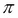
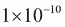

# 第十三章.条件表达式和操作模块

函数式编程强调操作的惰性或非严格顺序。其思想是允许编译器或运行时尽可能少地计算答案。Python 倾向于对评估施加严格顺序。

例如，我们使用了 Python 的`if`、`elif`和`else`语句。它们清晰易读，但暗示了对条件评估的严格顺序。在这里，我们可以在一定程度上摆脱严格的顺序，并开发一种有限的非严格条件语句。目前还不清楚这是否有帮助，但它展示了一些以函数式风格表达算法的替代方式。

本章的第一部分将探讨我们可以实现非严格评估的方法。这是一个有趣的工具，因为它可以导致性能优化。

在前几章中，我们看了一些高阶函数。在某些情况下，我们使用这些高阶函数将相当复杂的函数应用于数据集合。在其他情况下，我们将简单的函数应用于数据集合。

实际上，在许多情况下，我们编写了微小的`lambda`对象来将单个 Python 运算符应用于函数。例如，我们可以使用以下内容来定义`prod()`函数：

```py
>>> prod= lambda iterable: functools.reduce(lambda x, y: x*y, iterable, 1)
>>> prod((1,2,3))
6

```

使用`lambda x,y: x*y`参数似乎有点冗长，用于乘法。毕竟，我们只想使用乘法运算符`*`。我们能简化语法吗？答案是肯定的；`operator`模块为我们提供了内置运算符的定义。

`operator`模块的一些特性导致了一些简化和潜在的澄清，以创建高阶函数。尽管在概念上很重要，但`operator`模块并不像最初看起来那么有趣。

# 评估条件表达式

Python 对表达式施加了相对严格的顺序；显著的例外是短路运算符`and`和`or`。它对语句评估施加了非常严格的顺序。这使得寻找避免这种严格评估的不同方式变得具有挑战性。

事实证明，评估条件表达式是我们可以尝试非严格顺序语句的一种方式。我们将研究一些重构`if`和`else`语句的方法，以探索 Python 中这种非严格评估的方面。

Python 的`if`、`elif`和`else`语句是按从头到尾的严格顺序进行评估的。理想情况下，一种语言可能会放松这个规则，以便优化编译器可以找到更快的顺序来评估条件表达式。这个想法是让我们按照读者理解的顺序编写表达式，即使实际的评估顺序是非严格的。

缺乏优化编译器，这个概念对 Python 来说有点牵强。尽管如此，我们确实有替代的方式来表达涉及函数评估而不是执行命令式语句的条件。这可以让您在运行时进行一些重新排列。

Python 确实有条件`if`和`else`表达式。当只有一个条件时，可以使用这种表达式形式。然而，当有多个条件时，可能会变得非常复杂：我们必须小心地嵌套子表达式。我们可能最终会得到一个命令，如下所示，这是相当难以理解的：

```py
(x if n==1 else (y if n==2 else z))

```

我们可以使用字典键和`lambda`对象来创建一组非常复杂的条件。以下是一种表达阶乘函数的方法：

```py
def fact(n):
 **f= { n == 0: lambda n: 1,
 **n == 1: lambda n: 1,
 **n == 2: lambda n: 2,
 **n > 2: lambda n: fact(n-1)*n }[True]
 **return f(n)

```

这将传统的`if`、`elif`、`elif`和`else`语句序列重写为单个表达式。我们将其分解为两个步骤，以使发生的事情稍微清晰一些。

在第一步中，我们将评估各种条件。给定条件中的一个将评估为`True`，其他条件应该都评估为`False`。生成的字典中将有两个项目：一个具有`True`键和一个`lambda`对象，另一个具有`False`键和一个`lambda`对象。我们将选择`True`项目并将其分配给变量`f`。

我们在此映射中使用 lambda 作为值，以便在构建字典时不评估值表达式。我们只想评估一个值表达式。`return`语句评估与`True`条件相关联的一个表达式。

## 利用非严格的字典规则

字典的键没有顺序。如果我们尝试创建一个具有共同键值的多个项目的字典，那么在生成的`dict`对象中只会有一个项目。不清楚哪个重复的键值将被保留，也不重要。

这是一个明确不关心哪个重复键被保留的情况。我们将看一个`max()`函数的退化情况，它只是选择两个值中的最大值：

```py
def max(a, b):
 **f = {a >= b: lambda: a, b >= a: lambda: b}[True]
 **return f()

```

在`a == b`的情况下，字典中的两个项目都将具有`True`条件的键。实际上只有两者中的一个会被保留。由于答案是相同的，保留哪个并将哪个视为重复并覆盖并不重要。

## 过滤真条件表达式

我们有多种方法来确定哪个表达式是`True`。在前面的示例中，我们将键加载到字典中。由于字典的加载方式，只有一个值将保留具有`True`键的值。

这是使用`filter()`函数编写的这个主题的另一个变体：

```py
def semifact(n):
 **alternatives= [(n == 0, lambda n: 1),
 **(n == 1, lambda n: 1),
 **(n == 2, lambda n: 2),
 **(n > 2, lambda n: semifact(n-2)*n)]
 **c, f= next(filter(itemgetter(0), alternatives))
 **return f(n)

```

我们将替代方案定义为`condition`和`function`对的序列。当我们使用`filter()`函数并使用`itemgetter(0)`参数时，我们将选择那些具有`True`条件的对。在那些`True`的对中，我们将选择`filter()`函数创建的可迭代对象中的第一个项目。所选条件分配给变量`c`，所选函数分配给变量`f`。我们可以忽略条件（它将是`True`），并且可以评估`filter()`函数。

与前面的示例一样，我们使用 lambda 来推迟对函数的评估，直到条件被评估之后。

这个`semifact()`函数也被称为**双阶乘**。半阶乘的定义类似于阶乘的定义。重要的区别是它是交替数字的乘积而不是所有数字的乘积。例如，看一下以下公式：

和

# 使用`operator`模块而不是 lambda

在使用`max()`、`min()`和`sorted()`函数时，我们有一个可选的`key=`参数。作为参数值提供的函数修改了高阶函数的行为。在许多情况下，我们使用简单的 lambda 形式来从元组中选择项目。以下是我们严重依赖的两个示例：

```py
fst = lambda x: x[0]
snd = lambda x: x[1]

```

这些与其他函数式编程语言中的内置函数相匹配。

我们实际上不需要编写这些函数。`operator`模块中有一个版本描述了这些函数。

以下是一些我们可以使用的示例数据：

```py
>>> year_cheese = [(2000, 29.87), (2001, 30.12), (2002, 30.6), (2003, 30.66), (2004, 31.33), (2005, 32.62), (2006, 32.73), (2007, 33.5), (2008, 32.84), (2009, 33.02), (2010, 32.92)]

```

这是年度奶酪消费量。我们在第二章和第九章中使用了这个示例，*介绍一些功能特性*和*更多的迭代工具技术*。

我们可以使用以下命令找到具有最小奶酪的数据点：

```py
>>> min(year_cheese, key=snd)
(2000, 29.87)

```

`operator`模块为我们提供了从元组中选择特定元素的替代方法。这样可以避免使用`lambda`变量来选择第二个项目。

我们可以使用`itemgetter(0)`和`itemgetter(1)`参数，而不是定义自己的`fst()`和`snd()`函数，如下所示：

```py
>>> from operator import *
>>> max( year_cheese, key=itemgetter(1))
(2007, 33.5)

```

`itemgetter()`函数依赖于特殊方法`__getitem__()`，根据它们的索引位置从元组（或列表）中挑选项目。

## 在使用高阶函数时获取命名属性

让我们来看一下稍微不同的数据集合。假设我们使用的是命名元组而不是匿名元组。我们有两种方法来定位奶酪消耗量的范围，如下所示：

```py
>>> from collections import namedtuple
>>> YearCheese = namedtuple("YearCheese", ("year", "cheese"))
>>> year_cheese_2 = list(YearCheese(*yc) for yc in year_cheese)
>>> year_cheese_2
[YearCheese(year=2000, cheese=29.87), YearCheese(year=2001, cheese=30.12), YearCheese(year=2002, cheese=30.6), YearCheese(year=2003, cheese=30.66), YearCheese(year=2004, cheese=31.33), YearCheese(year=2005, cheese=32.62), YearCheese(year=2006, cheese=32.73), YearCheese(year=2007, cheese=33.5), YearCheese(year=2008, cheese=32.84), YearCheese(year=2009, cheese=33.02), YearCheese(year=2010, cheese=32.92)]

```

我们可以使用 lambda 形式，也可以使用`attrgetter()`函数，如下所示：

```py
>>> min(year_cheese_2, key=attrgetter('cheese'))
YearCheese(year=2000, cheese=29.87)
>>> max(year_cheese_2, key=lambda x: x.cheese)
YearCheese(year=2007, cheese=33.5)

```

这里重要的是，使用`lambda`对象时，属性名称在代码中表示为一个标记。而使用`attrgetter()`函数时，属性名称是一个字符串。这可以是一个参数，这使我们可以相当灵活。

# 使用运算符的星形映射

`itertools.starmap()`函数可以应用于运算符和一系列值对。这里有一个例子：

```py
>>> d= starmap(pow, zip_longest([], range(4), fillvalue=60))

```

`itertools.zip_longest()`函数将创建一对序列，如下所示：

```py
[(60, 0), (60, 1), (60, 2), (60, 3)]

```

它之所以这样做，是因为我们提供了两个序列：`[]`括号和`range(4)`参数。当较短的序列用尽数据时，`fillvalue`参数将被使用。

当我们使用`starmap()`函数时，每对都成为给定函数的参数。在这种情况下，我们提供了`operator.pow()`函数，即`**`运算符。我们计算了`[60**0, 60**1, 60**2, 60**3]`的值。变量`d`的值是`[1, 60, 3600, 216000]`。

`starmap()`函数在我们有一系列元组时非常有用。`map(f, x, y)`和`starmap(f, zip(x,y))`函数之间有一个整洁的等价关系。

这是`itertools.starmap()`函数的前面例子的延续：

```py
>>> p = (3, 8, 29, 44)
>>> pi = sum(starmap(truediv, zip(p, d)))

```

我们将两个四个值的序列压缩在一起。我们使用了`starmap()`函数和`operator.truediv()`函数，即`/`运算符。这将计算出一个我们求和的分数序列。总和实际上是的近似值。

这是一个更简单的版本，它使用`map(f, x, y)`函数，而不是`starmap(f, zip(x,y))`函数：

```py
>>> pi = sum(map(truediv, p, d))
>>> pi
3.1415925925925925

```

在这个例子中，我们有效地将一个基数为`60`的分数值转换为基数为`10`。变量`d`中的值是适当的分母。可以使用类似本节前面解释的技术来转换其他基数。

一些近似涉及潜在无限的和（或积）。可以使用本节前面解释的类似技术来评估这些近似。我们可以利用`itertools`模块中的`count()`函数来生成近似中任意数量的项。然后我们可以使用`takewhile()`函数，只使用对答案有用精度水平的值。

这是一个潜在无限序列的例子：

```py
>>> num= map(fact, count())
>>> den= map(semifact, (2*n+1 for n in count()))
>>> terms= takewhile(lambda t: t > 1E-10, map(truediv, num, den))
>>> 2*sum(terms)
3.1415926533011587

```

`num`变量是一个基于阶乘函数的潜在无限序列的分子。`den`变量是一个基于半阶乘（有时称为双阶乘）函数的潜在无限序列的分母。

为了创建项，我们使用`map()`函数将`operators.truediv()`函数（即`/`运算符）应用于每对值。我们将其包装在`takewhile()`函数中，这样我们只取值，而分数大于某个相对较小的值；在这种情况下，。

这是基于 4 arctan(1)=的级数展开。展开式是

系列展开主题的一个有趣变化是用`fractions.Fraction()`函数替换`operator.truediv()`函数。这将创建精确的有理值，不会受到浮点近似的限制。

`operators`模块中包含所有 Python 运算符。这包括所有位操作运算符以及比较运算符。在某些情况下，生成器表达式可能比看起来相当复杂的`starmap()`函数与表示运算符的函数更简洁或更表达。

问题在于`operator`模块只提供了一个运算符，基本上是`lambda`的简写。我们可以使用`operator.add`方法代替`add=lambda a,b: a+b`方法。如果我们有更复杂的表达式，那么`lambda`对象是编写它们的唯一方法。

# 使用运算符进行缩减

我们将看一种我们可能尝试使用运算符定义的方式。我们可以将它们与内置的`functools.reduce()`函数一起使用。例如，`sum()`函数可以定义如下：

```py
sum= functools.partial(functools.reduce, operator.add)

```

我们创建了一个部分求值版本的`reduce()`函数，并提供了第一个参数。在这种情况下，它是`+`运算符，通过`operator.add()`函数实现。

如果我们需要一个类似的计算乘积的函数，我们可以这样定义：

```py
prod= functools.partial(functools.reduce, operator.mul)

```

这遵循了前面示例中所示的模式。我们有一个部分求值的`reduce()`函数，第一个参数是`*`运算符，由`operator.mul()`函数实现。

目前尚不清楚我们是否可以对其他运算符进行类似的操作。我们可能也能够找到`operator.concat()`函数以及`operator.and()`和`operator.or()`函数的用途。

### 注意

`and()`和`or()`函数是位运算符`&`和`/`。如果我们想要正确的布尔运算符，我们必须使用`all()`和`any()`函数，而不是`reduce()`函数。

一旦我们有了`prod()`函数，这意味着阶乘可以定义如下：

```py
fact= lambda n: 1 if n < 2 else n*prod(range(1,n))

```

这有一个简洁的优势：它提供了一个阶乘的单行定义。它还有一个优势，不依赖于递归，但有可能触发 Python 的堆栈限制。

目前尚不清楚这是否比我们在 Python 中拥有的许多替代方案具有明显优势。从原始部分构建复杂函数的概念，如`partial()`和`reduce()`函数以及`operator`模块非常优雅。然而，在大多数情况下，`operator`模块中的简单函数并不是很有用；我们几乎总是希望使用更复杂的 lambda。

# 总结

在本章中，我们探讨了替代`if`、`elif`和`else`语句序列的方法。理想情况下，使用条件表达式可以进行一些优化。从实用的角度来看，Python 并不进行优化，因此处理条件的更奇特方式几乎没有实质性的好处。

我们还看了如何使用`operator`模块与`max()`、`min()`、`sorted()`和`reduce()`等高阶函数。使用运算符可以避免我们创建许多小的 lambda 函数。

在下一章中，我们将研究`PyMonad`库，直接在 Python 中表达函数式编程概念。通常情况下，我们不需要单子，因为 Python 在底层是一种命令式编程语言。

一些算法可能通过单子比通过有状态的变量赋值更清晰地表达。我们将看一个例子，其中单子导致对一组相当复杂的规则进行简洁的表达。最重要的是，`operator`模块展示了许多函数式编程技术。
