# 第十四章：PyMonad 库

单子允许我们在一个否则宽松的语言中对表达式的评估施加顺序。我们可以使用单子来坚持要求像*a + b + c*这样的表达式按从左到右的顺序进行评估。一般来说，单子似乎没有什么意义。然而，当我们希望文件按特定顺序读取或写入其内容时，单子是一种确保`read()`和`write()`函数按特定顺序进行评估的便捷方式。

宽松且具有优化编译器的语言受益于单子，以对表达式的评估施加顺序。Python 在大多数情况下是严格的，不进行优化。我们对单子几乎没有实际用途。

然而，PyMonad 模块不仅仅是单子。它具有许多具有独特实现的函数式编程特性。在某些情况下，PyMonad 模块可以导致比仅使用标准库模块编写的程序更简洁和表达力更强。

# 下载和安装

PyMonad 模块可在**Python Package Index**（**PyPi**）上找到。为了将 PyMonad 添加到您的环境中，您需要使用 pip 或 Easy Install。以下是一些典型情况：

+   如果您使用的是 Python 3.4 或更高版本，您将拥有这两个安装包工具

+   如果您使用的是 Python 3.x，可能已经有了其中一个必要的安装程序，因为您已经添加了包

+   如果你使用的是 Python 2.x，你应该考虑升级到 Python 3.4

+   如果你没有 pip 或 Easy Install，你需要先安装它们；考虑升级到 Python 3.4 以获取这些安装工具

访问[`pypi.python.org/pypi/PyMonad/`](https://pypi.python.org/pypi/PyMonad/)获取更多信息。

对于 Mac OS 和 Linux 开发人员，必须使用`sudo`命令运行命令`pip install PyMonad`或`easy_install-3.3 pymonad`。当运行诸如`sudo easy_install-3.3 pymonad`的命令时，系统会提示您输入密码，以确保您具有进行安装所需的管理权限。对于 Windows 开发人员，`sudo`命令不相关，但您需要具有管理权限。

安装了`pymonad`包后，可以使用以下命令进行确认：

```py
>>> import pymonad
>>> help(pymonad)

```

这将显示`docstring`模块，并确认事情确实安装正确。

# 函数组合和柯里化

一些函数式语言通过将多参数函数语法转换为一组单参数函数来工作。这个过程称为**柯里化**——它是以逻辑学家 Haskell Curry 的名字命名的，他从早期概念中发展出了这个理论。

柯里化是一种将多参数函数转换为高阶单参数函数的技术。在简单情况下，我们有一个函数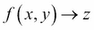；给定两个参数*x*和*y*，这将返回一些结果值*z*。我们可以将其柯里化为两个函数：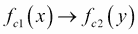和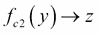。给定第一个参数值*x*，函数返回一个新的单参数函数，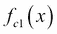返回一个新的单参数函数，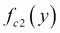。第二个函数可以给定一个参数*y*，并返回结果值*z*。

我们可以在 Python 中评估柯里化函数，如下所示：`f_c(2)(3)`。我们将柯里化函数应用于第一个参数值`2`，创建一个新函数。然后，我们将该新函数应用于第二个参数值`3`。

这适用于任何复杂度的函数。如果我们从一个函数开始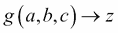，我们将其柯里化为一个函数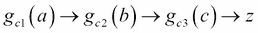。这是递归完成的。首先，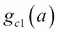函数返回一个带有 b 和 c 参数的新函数，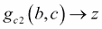。然后，我们可以对返回的两参数函数进行柯里化，创建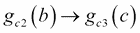。

我们可以使用`g_c(1)(2)(3)`来评估这个柯里化函数。当我们将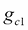应用于参数 1 时，我们得到一个函数；当我们将返回的函数应用于 2 时，我们得到另一个函数。当我们将最终函数应用于 3 时，我们得到预期的结果。显然，正式的语法很臃肿，因此我们使用一些语法糖将`g_c(1)(2)(3)`减少到更容易接受的形式，如`g(1,2,3)`。

让我们以 Python 中的一个具体例子为例，例如，我们有一个如下所示的函数：

```py
from pymonad import curry
@curry
def systolic_bp(bmi, age, gender_male, treatment):
 **return 68.15+0.58*bmi+0.65*age+0.94*gender_male+6.44*treatment

```

这是一个基于多元回归的简单模型，用于预测收缩压。这从**体重指数**（**BMI**）、年龄、性别（1 表示男性）和先前治疗历史（1 表示先前治疗）预测血压。有关模型及其推导方式的更多信息，请访问[`sphweb.bumc.bu.edu/otlt/MPH-Modules/BS/BS704_Multivariable/BS704_Multivariable7.html`](http://sphweb.bumc.bu.edu/otlt/MPH-Modules/BS/BS704_Multivariable/BS704_Multivariable7.html)。

我们可以使用带有所有四个参数的`systolic_bp()`函数，如下所示：

```py
>>> systolic_bp(25, 50, 1, 0)
116.09
>>> systolic_bp(25, 50, 0, 1)
121.59

```

一个 BMI 为 25、年龄为 50、没有先前治疗历史的男性可能会有 116 的血压。第二个例子展示了一个类似的女性，她有治疗史，可能会有 121 的血压。

因为我们使用了`@curry`装饰器，我们可以创建类似于部分应用函数的中间结果。看一下以下命令片段：

```py
>>> treated= systolic_bp(25, 50, 0)
>>> treated(0)
115.15
>>> treated(1)
121.59

```

在前面的例子中，我们评估了`systolic_bp(25, 50, 0)`方法来创建一个柯里化函数，并将其分配给变量`treatment`。BMI、年龄和性别值通常不会改变。我们现在可以将新函数`treatment`应用于剩余的参数，根据患者的历史得到不同的血压期望。

在某些方面，这与`functools.partial()`函数类似。重要的区别在于柯里化创建了一个可以以多种方式工作的函数。`functools.partial()`函数创建了一个更专门的函数，只能与给定的一组绑定值一起使用。

这是创建一些额外柯里化函数的示例：

```py
>>> g_t= systolic_bp(25, 50)
>>> g_t(1, 0)
116.09
>>> g_t(0, 1)
121.59

```

这是基于我们初始模型的基于性别的治疗函数。我们必须提供性别和治疗值才能从模型中得到最终值。

## 使用柯里化的高阶函数

虽然柯里化在使用普通函数时很容易进行可视化，但当我们将柯里化应用于高阶函数时，其真正价值就显现出来了。在理想情况下，`functools.reduce()`函数将是“可柯里化的”，这样我们就可以这样做：

```py
sum= reduce(operator.add)
prod= reduce(operator.mul)

```

然而，`pymonad`库无法对`reduce()`函数进行柯里化，因此这实际上不起作用。然而，如果我们定义自己的`reduce()`函数，我们可以像之前展示的那样对其进行柯里化。以下是一个可以像之前展示的那样使用的自制`reduce()`函数的示例：

```py
import collections.abc
from pymonad import curry
@curry
def myreduce(function, iterable_or_sequence):
 **if isinstance(iterable_or_sequence, collections.abc.Sequence):
 **iterator= iter(iterable_or_sequence)
 **else:
 **iterator= iterable_or_sequence
 **s = next(iterator)
 **for v in iterator:
 **s = function(s,v)
 **return s

```

`myreduce()`函数将表现得像内置的`reduce()`函数。`myreduce()`函数适用于可迭代对象或序列对象。给定一个序列，我们将创建一个迭代器；给定一个可迭代对象，我们将简单地使用它。我们将结果初始化为迭代器中的第一项。我们将函数应用于正在进行的总和（或乘积）和每个后续项。

### 注意

也可以包装内置的`reduce()`函数以创建一个可柯里化的版本。这只需要两行代码；这是留给你的一个练习。

由于`myreduce()`函数是一个柯里化函数，我们现在可以使用它来基于我们的高阶函数`myreduce()`创建函数：

```py
>>> from operator import *
>>> sum= myreduce(add)
>>> sum([1,2,3])
6
>>> max= myreduce(lambda x,y: x if x > y else y)
>>> max([2,5,3])
5

```

我们使用柯里化的 reduce 应用于`add`运算符定义了我们自己版本的`sum()`函数。我们还使用`lambda`对象定义了我们自己版本的默认`max()`函数，它选择两个值中较大的一个。

这种方式不能轻松地创建`max()`函数的更一般形式，因为柯里化侧重于位置参数。尝试使用`key=`关键字参数会增加太多复杂性，使得这种技术无法朝着我们简洁和表达式丰富的函数程序的总体目标发展。

要创建`max()`函数的更一般化版本，我们需要跳出`key=`关键字参数范例，这些函数如`max()`、`min()`和`sorted()`依赖于。我们必须接受高阶函数作为第一个参数，就像`filter()`、`map()`和`reduce()`函数一样。我们还可以创建我们自己的更一致的高阶柯里化函数库。这些函数将完全依赖于位置参数。高阶函数将首先提供，以便我们自己的柯里化`max(function, iterable)`方法遵循`map()`、`filter()`和`functools.reduce()`函数设定的模式。

## 艰难的柯里化

我们可以手动创建柯里化函数，而不使用`pymonad`库中的装饰器；其中一种方法是执行以下命令：

```py
def f(x, *args):
 **def f1(y, *args):
 **def f2(z):
 **return (x+y)*z
 **if args:
 **return f2(*args)
 **return f2
 **if args:
 **return f1(*args)
 **return f1

```

这将一个函数柯里化成一个函数`f(x)`，它返回一个函数。在概念上，我们然后对中间函数进行柯里化，创建`f1(y)`和`f2(z)`函数。

当我们评估`f(x)`函数时，我们将得到一个新的函数`f1`作为结果。如果提供了额外的参数，这些参数将传递给`f1`函数进行评估，要么产生最终值，要么产生另一个函数。

显然，这可能会出现错误。然而，它确实有助于定义柯里化的真正含义以及它在 Python 中的实现方式。

# 函数组合和 PyMonad 乘法运算符

柯里化函数的一个重要价值在于能够通过函数组合来结合它们。我们在第五章和第十一章中讨论了函数组合，*高阶函数*和*装饰器设计技术*。

当我们创建了一个柯里化函数，我们可以轻松地执行函数组合，创建一个新的、更复杂的柯里化函数。在这种情况下，PyMonad 包为组合两个函数定义了`*`运算符。为了展示这是如何工作的，我们将定义两个可以组合的柯里化函数。首先，我们将定义一个计算乘积的函数，然后我们将定义一个计算特定值范围的函数。

这是我们计算乘积的第一个函数：

```py
import  operator
prod = myreduce(operator.mul)

```

这是基于我们之前定义的柯里化`myreduce()`函数。它使用`operator.mul()`函数来计算可迭代对象的“乘法减少”：我们可以称一个乘积为序列的 a 次减少。

这是我们的第二个柯里化函数，它将产生一系列值：

```py
@curry
def alt_range(n):
 **if n == 0: return range(1,2) # Only 1
 **if n % 2 == 0:
 **return range(2,n+1,2)
 **else:
 **return range(1,n+1,2)

```

`alt_range()`函数的结果将是偶数值或奇数值。如果`n`是奇数，它将只有值直到（包括）`n`。如果`n`是偶数，它将只有偶数值直到`n`。这些序列对于实现半阶乘或双阶乘函数很重要。

以下是如何将 `prod()` 和 `alt_range()` 函数组合成一个新的柯里化函数：

```py
>>> semi_fact= prod * alt_range
>>> semi_fact(9)
945

```

这里的 PyMonad `*` 运算符将两个函数组合成一个名为 `semi_fact` 的复合函数。`alt_range()` 函数被应用到参数上。然后，`prod()` 函数被应用到 `alt_range` 函数的结果上。

通过在 Python 中手动执行这些操作，实际上是在创建一个新的 `lambda` 对象：

```py
semi_fact= lambda x: prod(alt_range(x))

```

柯里化函数的组合涉及的语法比创建一个新的 `lambda` 对象要少一些。

理想情况下，我们希望像这样使用函数组合和柯里化函数：

```py
sumwhile= sum * takewhile(lambda x: x > 1E-7)

```

这将定义一个可以处理无限序列的 `sum()` 函数版本，在达到阈值时停止生成值。这似乎行不通，因为 `pymonad` 库似乎无法像处理内部的 `List` 对象一样处理无限可迭代对象。

# 函子和应用函子

函子的概念是简单数据的函数表示。数字 3.14 的函子版本是一个零参数函数，返回这个值。考虑以下示例：

```py
pi= lambda : 3.14

```

我们创建了一个具有简单值的零参数 `lambda` 对象。

当我们将柯里化函数应用于函子时，我们正在创建一个新的柯里化函子。这通过使用函数来表示参数、值和函数本身来概括了“应用函数到参数以获得值”的概念。

一旦我们的程序中的所有内容都是函数，那么所有处理都只是函数组合的变体。柯里化函数的参数和结果可以是函子。在某个时候，我们将对一个 `functor` 对象应用 `getValue()` 方法，以获得一个可以在非柯里化代码中使用的 Python 友好的简单类型。

由于我们所做的只是函数组合，直到我们使用 `getValue()` 方法要求值时才需要进行计算。我们的程序不是执行大量计算，而是定义了一个复杂的对象，可以在需要时产生值。原则上，这种组合可以通过聪明的编译器或运行时系统进行优化。

当我们将一个函数应用到一个 `functor` 对象时，我们将使用类似于 `map()` 的方法，该方法实现为 `*` 运算符。我们可以将 `function * functor` 或 `map(function, functor)` 方法看作是理解函子在表达式中扮演的角色的一种方式。

为了礼貌地处理具有多个参数的函数，我们将使用 `&` 运算符构建复合函子。我们经常会看到 `functor & functor` 方法来构建一个 `functor` 对象。

我们可以用 `Maybe` 函子的子类来包装 Python 的简单类型。`Maybe` 函子很有趣，因为它为我们提供了一种优雅地处理缺失数据的方法。我们在第十一章中使用的方法是装饰内置函数，使其具有 `None` 意识。PyMonad 库采用的方法是装饰数据，使其能够优雅地拒绝被操作。

`Maybe` 函子有两个子类：

+   `Nothing`

+   `Just(some simple value)`

我们使用 `Nothing` 作为简单 Python 值 `None` 的替代。这是我们表示缺失数据的方式。我们使用 `Just(some simple value)` 来包装所有其他 Python 对象。这些函子是常量值的函数式表示。

我们可以使用这些 `Maybe` 对象的柯里化函数来优雅地处理缺失的数据。以下是一个简短的示例：

```py
>>> x1= systolic_bp * Just(25) & Just(50) & Just(1) & Just(0)
>>> x1.getValue()
116.09
>>> x2= systolic_bp * Just(25) & Just(50) & Just(1) & Nothing
>>> x2.getValue() is None
True

```

`*` 运算符是函数组合：我们正在将 `systolic_bp()` 函数与一个参数复合。`&` 运算符构建一个复合函子，可以作为多参数柯里化函数的参数传递。

这向我们表明，我们得到了一个答案，而不是`TypeError`异常。在处理大型复杂数据集时，数据可能缺失或无效，这非常方便。这比不得不装饰所有函数以使它们具有`None`感知性要好得多。

这对于柯里化函数非常有效。我们不能在未柯里化的 Python 代码中操作`Maybe`函子，因为函子的方法非常少。

### 注意

我们必须使用`getValue()`方法来提取未柯里化的 Python 代码的简单 Python 值。

## 使用惰性 List()函子

`List()`函子一开始可能会让人困惑。它非常懒惰，不像 Python 的内置`list`类型。当我们评估内置`list(range(10))`方法时，`list()`函数将评估`range()`对象以创建一个包含 10 个项目的列表。然而，PyMonad 的`List()`函子太懒惰了，甚至不会进行这种评估。

这是比较：

```py
>>> list(range(10))
[0, 1, 2, 3, 4, 5, 6, 7, 8, 9]
>>> List(range(10))
[range(0, 10)]

```

`List()`函子没有评估`range()`对象，它只是保留了它而没有被评估。`PyMonad.List()`函数用于收集函数而不对其进行评估。我们可以根据需要稍后对其进行评估：

```py
>>> x= List(range(10))
>>> x
[range(0, 10)]
>>> list(x[0])
[0, 1, 2, 3, 4, 5, 6, 7, 8, 9]

```

我们创建了一个带有`range()`对象的惰性`List`对象。然后我们提取并评估了该列表中位置`0`处的`range()`对象。

`List`对象不会评估生成器函数或`range()`对象；它将任何可迭代参数视为单个迭代器对象。但是，我们可以使用`*`运算符来展开生成器或`range()`对象的值。

### 注意

请注意，`*`运算符有几种含义：它是内置的数学乘法运算符，是由 PyMonad 定义的函数组合运算符，以及在调用函数时用于将单个序列对象绑定为函数的所有位置参数的内置修饰符。我们将使用`*`运算符的第三个含义来将一个序列分配给多个位置参数。

这是`range()`函数的柯里化版本。它的下限是 1 而不是 0。对于某些数学工作很方便，因为它允许我们避免内置`range()`函数中的位置参数的复杂性。

```py
@curry
def range1n(n):
 **if n == 0: return range(1,2) # Only 1
 **return range(1,n+1)

```

我们简单地包装了内置的`range()`函数，使其可以由 PyMonad 包进行柯里化。

由于`List`对象是一个函子，我们可以将函数映射到`List`对象。该函数应用于`List`对象中的每个项目。这是一个例子：

```py
>>> fact= prod * range1n
>>> seq1 = List(*range(20))
>>> f1 = fact * seq1
>>> f1[:10]
[1, 1, 2, 6, 24, 120, 720, 5040, 40320, 362880]

```

我们定义了一个复合函数`fact()`，它是从先前显示的`prod()`和`range1n()`函数构建的。这是阶乘函数，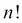。我们创建了一个`List()`函子`seq1`，它是一个包含 20 个值的序列。我们将`fact()`函数映射到`seq1`函子，从而创建了一个阶乘值的序列`f1`。我们之前展示了其中的前 10 个值。

### 注意

函数的组合和函数与函子的组合之间存在相似之处。`prod*range1n`和`fact*seq1`都使用函数组合：一个组合明显是函数的东西，另一个组合是函数和函子。

这是另一个我们将用来扩展此示例的小函数：

```py
@curry
def n21(n):
 **return 2*n+1

```

这个小的`n21()`函数执行简单的计算。但是，它是柯里化的，因此我们可以将其应用于像`List()`函数这样的函子。这是前面示例的下一部分：

```py
>>> semi_fact= prod * alt_range
>>> f2 = semi_fact * n21 * seq1
>>> f2[:10]
[1, 3, 15, 105, 945, 10395, 135135, 2027025, 34459425, 654729075]

```

我们从先前显示的`prod()`和`alt_range()`函数定义了一个复合函数。函数`f2`是半阶乘或双阶乘，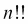。函数`f2`的值是通过将我们的小`n21()`函数应用于`seq1`序列来构建的。这创建了一个新序列。然后我们将`semi_fact`函数应用于这个新序列，以创建一个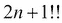值的序列，与值的序列相对应。

现在我们可以将`/`运算符映射到`map()`和`operator.truediv`并行函子：

```py
>>> 2*sum(map(operator.truediv, f1, f2))
3.1415919276751456

```

`map()`函数将给定的运算符应用于两个函子，产生一系列分数，我们可以将它们相加。

### 注意

`f1 & f2`方法将创建两个`List`对象的所有值的组合。这是`List`对象的一个重要特性：它们可以很容易地枚举所有的组合，允许一个简单的算法计算所有的替代方案，并过滤适当的子集。这是我们不想要的；这就是为什么我们使用`map()`函数而不是`operator.truediv * f1 & f2`方法。

我们使用了一些函数组合技术和一个函子类定义来定义了一个相当复杂的计算。这是这个计算的完整定义：

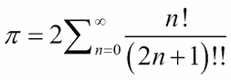

理想情况下，我们不希望使用固定大小的`List`对象。我们更希望有一个惰性的、潜在无限的整数值序列。然后我们可以使用`sum()`和`takewhile()`函数的柯里化版本来找到序列中值的和，直到这些值对结果没有贡献。这将需要一个更懒惰的`List()`对象的版本，它可以与`itertools.counter()`函数一起使用。在 PyMonad 1.3 中，我们没有这个潜在无限的列表；我们只能使用固定大小的`List()`对象。

# 单子概念、bind()函数和二进制右移运算符

PyMonad 库的名称来自函数式编程概念中的**单子**，即具有严格顺序的函数。函数式编程的基本假设是函数求值是自由的：它可以根据需要进行优化或重新排列。单子提供了一个例外，强加了严格的从左到右的顺序。

正如我们所见，Python 是严格的。它不需要单子。然而，在可以帮助澄清复杂算法的地方，我们仍然可以应用这个概念。

强制求值的技术是单子和将返回一个单子的函数之间的绑定。一个*扁平*表达式将变成嵌套的绑定，不能被优化编译器重新排序。`bind()`函数映射到`>>`运算符，允许我们编写这样的表达式：

```py
Just(some file) >> read header >> read next >> read next

```

前面的表达式将转换为以下形式：

```py
bind(bind(bind(Just(some file), read header), read next), read next)

```

`bind()`函数确保在对这个表达式进行求值时施加了严格的从左到右的顺序。另外，注意前面的表达式是函数组合的一个例子。当我们使用`>>`运算符创建一个单子时，我们正在创建一个复杂的对象，当我们最终使用`getValue()`方法时，它将被求值。

`Just()`子类用于创建一个简单的单子兼容对象，它包装了一个简单的 Python 对象。

单子概念对于表达严格的求值顺序是至关重要的——在一个经过高度优化和宽松的语言中。Python 不需要单子，因为它使用从左到右的严格求值。这使得单子很难展示，因为在 Python 环境中它并没有真正做一些全新的事情。事实上，单子多余地陈述了 Python 遵循的典型严格规则。

在其他语言中，比如 Haskell，单子对于需要严格顺序的文件输入和输出至关重要。Python 的命令式模式很像 Haskell 的`do`块，它有一个隐式的 Haskell `>>=`运算符来强制语句按顺序求值。（PyMonad 使用`bind()`函数和 Haskell 的`>>`运算符来执行 Haskell 的`>>=`操作。）

# 使用单子实现模拟

单子被期望通过一种“管道”传递：一个单子将作为参数传递给一个函数，类似的单子将作为函数的值返回。这些函数必须设计为接受和返回类似的结构。

我们将看一下一个简单的流水线，用于模拟一个过程。这种模拟可能是蒙特卡洛模拟的一个正式部分。我们将直接进行蒙特卡洛模拟，并模拟一个赌场骰子游戏——Craps。这涉及到对相当复杂的模拟进行状态规则的模拟。

涉及了很多非常奇怪的赌博术语。我们无法提供有关各种术语的背景信息。在某些情况下，这些术语的起源已经迷失在历史中。

Craps 涉及有人掷骰子（射击者）和额外的赌徒。游戏的进行方式如下：

第一次投掷被称为“come out”投掷。有三种情况：

1.  如果骰子总数为 7 或 11，则射击者获胜。任何在“pass”线上下注的人都将被支付为赢家，而所有其他赌注都将输掉。游戏结束，射击者可以再玩一次。

1.  如果骰子总数为 2、3 或 12，射击者输掉。任何在“don't pass”线上下注的人都会赢，而所有其他赌注都会输掉。游戏结束，射击者必须将骰子传递给另一个射击者。

1.  任何其他总数（即 4、5、6、8、9 或 10）都会建立一个“point”。游戏从“come out”投掷状态转变为“point”投掷状态。游戏继续进行。

如果已经建立了一个点，每个“point”投掷都会根据三个条件进行评估：

+   如果骰子总数为 7，射击者输掉。实际上，几乎所有的赌注都是输家，除了“don't pass”赌注和一个特殊的提议赌注。由于射击者输了，骰子被传递给另一个射击者。

+   如果骰子总数等于最初的点数，射击者获胜。任何在 pass 线上下注的人都将被支付为赢家，而所有其他赌注都将输掉。游戏结束，射击者可以再玩一次。

+   任何其他总数都会使游戏继续进行，没有解决。

规则涉及一种状态变化。我们可以将其视为一系列操作，而不是状态变化。有一个必须首先使用的函数。之后使用另一个递归函数。这样，它很好地符合单子设计模式。

实际上，赌场在游戏过程中允许进行许多相当复杂的副注。我们可以将这些与游戏的基本规则分开进行评估。其中许多赌注（提议、场地赌注和购买数字）是玩家在游戏的“point roll”阶段简单下注的赌注。还有一个额外的“come”和“don't come”一对赌注，建立了一个嵌套游戏中的点。我们将在以下示例中坚持游戏的基本轮廓。

我们需要一个随机数源：

```py
import random
def rng():
 **return (random.randint(1,6), random.randint(1,6))

```

前面的函数将为我们生成一对骰子。

以下是我们对整个游戏的期望：

```py
def craps():
 **outcome= Just(("",0, []) ) >> come_out_roll(rng) >> point_roll(rng)
 **print(outcome.getValue())

```

我们创建一个初始单子，`Just(("",0, []))`，来定义我们要处理的基本类型。游戏将产生一个三元组，其中包含结果、点数和一系列投掷。最初，它是一个默认的三元组，用于定义我们要处理的类型。

我们将这个单子传递给另外两个函数。这将创建一个结果单子，`outcome`，其中包含游戏的结果。我们使用`>>`运算符按特定顺序连接函数，以便它们按顺序执行。在优化语言中，这将防止表达式被重新排列。

我们使用`getValue()`方法在最后获取单子的值。由于单子对象是惰性的，这个请求会触发对各种单子的评估，以创建所需的输出。

`come_out_roll()`函数将`rng()`函数作为第一个参数柯里化。单子将成为这个函数的第二个参数。`come_out_roll()`函数可以掷骰子，并应用开局规则来确定我们是赢了、输了还是建立了一个点。

`point_roll()`函数也将`rng()`函数作为第一个参数柯里化。单子将成为第二个参数。然后`point_roll()`函数可以掷骰子来查看赌注是否解决。如果赌注没有解决，这个函数将递归操作继续寻找解决方案。

`come_out_roll()`函数看起来像这样：

```py
@curry
def come_out_roll(dice, status):
 **d= dice()
 **if sum(d) in (7, 11):
 **return Just(("win", sum(d), [d]))
 **elif sum(d) in (2, 3, 12):
 **return Just(("lose", sum(d), [d]))
 **else:
 **return Just(("point", sum(d), [d]))

```

我们掷骰子一次，以确定我们是首次投掷赢，输，还是点数。我们返回一个适当的单子值，其中包括结果，点数值和骰子的投掷。立即赢得和立即输掉的点数值并不真正有意义。我们可以合理地在这里返回`0`，因为实际上并没有建立点数。

`point_roll()`函数看起来像这样：

```py
@curry
def point_roll(dice, status):
 **prev, point, so_far = status
 **if prev != "point":
 **return Just(status)
 **d = dice()
 **if sum(d) == 7:
 **return Just(("craps", point, so_far+[d]))
 **elif sum(d) == point:
 **return Just(("win", point, so_far+[d]))
 **else:
 **return Just(("point", point, so_far+[d])) >> point_roll(dice)

```

我们将`status`单子分解为元组的三个单独值。我们可以使用小的`lambda`对象来提取第一个，第二个和第三个值。我们也可以使用`operator.itemgetter()`函数来提取元组的项目。相反，我们使用了多重赋值。

如果没有建立点数，先前的状态将是“赢”或“输”。游戏在一次投掷中解决，这个函数只是返回`status`单子。

如果建立了一个点数，就会掷骰子并应用规则到新的投掷。如果投掷是 7，游戏就输了，并返回最终的单子。如果投掷是点数，游戏就赢了，并返回适当的单子。否则，一个稍微修改的单子被传递给`point_roll()`函数。修改后的`status`单子包括这次投掷在投掷历史中。

典型的输出看起来像这样：

```py
>>> craps()
('craps', 5, [(2, 3), (1, 3), (1, 5), (1, 6)])

```

最终的单子有一个显示结果的字符串。它有建立的点数和骰子投掷的顺序。每个结果都有一个特定的赔付，我们可以用来确定投注者赌注的总波动。

我们可以使用模拟来检查不同的投注策略。我们可能正在寻找一种方法来击败游戏内置的庄家优势。

### 附注

游戏基本规则存在一些小的不对称性。11 作为立即赢家与 3 作为立即输家平衡。2 和 12 也是输家的事实是这个游戏中庄家优势的基础，为 5.5%（*1/18 = 5.5*）。想法是确定哪些额外的投注机会会削弱这个优势。

一些简单的、功能性的设计技术可以构建出许多巧妙的蒙特卡洛模拟。特别是单子可以帮助结构化这些类型的计算，当存在复杂的订单或内部状态时。

# 附加的 PyMonad 功能

PyMonad 的另一个特性是令人困惑地命名为**monoid**。这直接来自数学，它指的是一组具有运算符、单位元素，并且对于该运算符是封闭的数据元素。当我们考虑自然数、`add`运算符和单位元素`0`时，这是一个合适的单子。对于正整数，使用运算符`*`和单位值`1`，我们也有一个单子；使用`|`作为运算符和空字符串作为单位元素的字符串也符合条件。

PyMonad 包括许多预定义的单子类。我们可以扩展这个来添加我们自己的`monoid`类。目的是限制编译器对某些类型的优化。我们还可以使用单子类来创建累积复杂值的数据结构，可能包括以前操作的历史。

其中许多内容提供了对函数式编程的见解。总结文档，这是一个学习函数式编程的简单方法，在可能稍微宽容的环境中。与其学习整个语言和工具集来编译和运行函数式程序，我们可以只是用交互式 Python 进行实验。

从实用的角度来看，我们不需要太多这些功能，因为 Python 已经是有状态的，并且提供了表达式的严格评估。在 Python 中引入有状态的对象或严格排序的评估没有实际理由。我们可以通过将函数式概念与 Python 的命令式实现相结合来编写有用的程序。因此，我们不会深入研究 PyMonad。

# 总结

在本章中，我们看了如何使用 PyMonad 库直接在 Python 中表达一些函数式编程概念。该模块展示了许多重要的函数式编程技术。

我们看了柯里化的概念，这是一种允许组合参数的函数，以创建新函数的方法。柯里化函数还允许我们使用函数组合，从简单的部分创建更复杂的函数。我们看了一下函子，它们包装简单的数据对象，使它们成为可以与函数组合一起使用的函数。

单子是一种在使用优化编译器和惰性评估规则时强加严格评估顺序的方法。在 Python 中，我们没有单子的一个很好的用例，因为 Python 在底层是一种命令式编程语言。在某些情况下，命令式 Python 可能比单子构造更具表现力和简洁。

在下一章中，我们将看看如何应用函数式编程技术来构建 Web 服务应用程序。HTTP 的概念可以总结为`response = httpd(request)`。理想情况下，HTTP 是无状态的，这使其与函数式设计完美匹配。然而，大多数网站将保持状态，使用 cookie 来跟踪会话状态。
