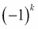
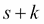

# 第十六章：优化和改进

在本章中，我们将研究一些优化方法，以创建高性能的函数程序。我们将扩展第十章中的`@lru_cache`装饰器，*Functools 模块*。我们有多种方法来实现记忆化算法。我们还将讨论如何编写自己的装饰器。更重要的是，我们将看到如何使用`Callable`对象来缓存记忆化结果。

我们还将研究第六章中提出的一些优化技术，*递归和归约*。我们将回顾尾递归优化的一般方法。对于一些算法，我们可以将记忆化与递归实现结合，实现良好的性能。对于其他算法，记忆化并不是非常有帮助，我们必须寻找其他地方来提高性能。

在大多数情况下，对程序的小改动将导致性能的小幅提升。用`lambda`对象替换函数对性能影响很小。如果我们的程序运行速度不可接受，我们通常必须找到一个全新的算法或数据结构。一些算法具有糟糕的“大 O”复杂度；没有什么能让它们神奇地运行得更快。

一个开始的地方是[`www.algorist.com`](http://www.algorist.com)。这是一个资源，可以帮助找到给定问题的更好算法。

# 记忆化和缓存

正如我们在第十章中看到的，*Functools 模块*，许多算法可以从记忆化中受益。我们将从回顾一些先前的例子开始，以描述可以通过记忆化得到帮助的函数类型。

在第六章中，我们看了一些常见的递归类型。最简单的递归类型是具有可以轻松匹配到缓存值的参数的尾递归。如果参数是整数、字符串或实例化的集合，那么我们可以快速比较参数，以确定缓存是否具有先前计算的结果。

我们可以从这些例子中看到，像计算阶乘或查找斐波那契数这样的整数数值计算将明显改善。查找质因数和将整数提升到幂次方是更多适用于整数值的数值算法的例子。

当我们看递归版本的斐波那契数计算器时，我们发现它包含两个尾递归。以下是定义：


这可以转换为一个循环，但设计变更需要一些思考。这个记忆化版本可以非常快，而且设计上不需要太多思考。

Syracuse 函数，如第六章中所示，*递归和归约*，是用于计算分形值的函数的一个例子。它包含一个简单的规则，递归应用。探索 Collatz 猜想（“Syracuse 函数是否总是导致 1？”）需要记忆化中间结果。

Syracuse 函数的递归应用是具有“吸引子”的函数的一个例子，其中值被吸引到 1。在一些更高维度的函数中，吸引子可以是一条线，或者可能是一个分形。当吸引子是一个点时，记忆化可以帮助；否则，记忆化实际上可能是一个障碍，因为每个分形值都是唯一的。

在处理集合时，缓存的好处可能会消失。如果集合恰好具有相同数量的整数值、字符串或元组，那么集合可能是重复的，可以节省时间。但是，如果需要对集合进行多次计算，手动优化是最好的：只需进行一次计算，并将结果分配给一个变量。

在处理可迭代对象、生成器函数和其他惰性对象时，缓存整个对象基本上是不可能的。在这些情况下，记忆化根本不会有所帮助。

通常包括测量的原始数据使用浮点值。由于浮点值之间的精确相等比较可能不会很好地工作，因此记忆化中间结果可能也不会很好地工作。

然而，包括计数的原始数据可能受益于记忆化。这些是整数，我们可以相信精确的整数比较可以（可能）节省重新计算先前值。一些统计函数在应用于计数时，可以受益于使用`fractions`模块而不是浮点值。当我们用`Fraction(x,y)`方法替换`x/y`时，我们保留了进行精确值匹配的能力。我们可以使用`float(some_fraction)`方法生成最终结果。

# 专门化记忆化

记忆化的基本思想是如此简单，以至于可以通过`@lru_cache`装饰器来捕捉。这个装饰器可以应用于任何函数以实现记忆化。在某些情况下，我们可能能够通过更专业的东西来改进通用的想法。有大量的潜在可优化的多值函数。我们将在这里选择一个，并在更复杂的案例研究中看另一个。

二项式，，显示了*n*个不同的事物可以以大小为*m*的组合方式排列的数量。该值如下：


显然，我们应该缓存阶乘计算，而不是重新进行所有这些乘法。然而，我们也可能受益于缓存整体的二项式计算。

我们将创建一个包含多个内部缓存的可调用对象。这是我们需要的一个辅助函数：

```py
from functools import reduce
from operator import mul
prod = lambda x: reduce(mul, x)

```

`prod()`函数计算数字的可迭代乘积。它被定义为使用`*`运算符的缩减。

这是一个带有两个缓存的可调用对象，它使用了`prod()`函数：

```py
from collections.abc import Callable
class Binomial(Callable):
 **def __init__(self):
 **self.fact_cache= {}
 **self.bin_cache= {}
 **def fact(self, n):
 **if n not in self.fact_cache:
 **self.fact_cache[n] = prod(range(1,n+1))
 **return self.fact_cache[n]
 **def __call__(self, n, m):
 **if (n,m) not in self.bin_cache:
 **self.bin_cache[n,m] = self.fact(n)//(self.fact(m)*self.fact(n-m))
 **return self.bin_cache[n,m]

```

我们创建了两个缓存：一个用于阶乘值，一个用于二项式系数值。内部的`fact()`方法使用`fact_cache`属性。如果值不在缓存中，它将被计算并添加到缓存中。外部的`__call__()`方法以类似的方式使用`bin_cache`属性：如果特定的二项式已经被计算，答案将被简单地返回。如果没有，将使用内部的`fact()`方法计算一个新值。

我们可以像这样使用前面的`Callable`类：

```py
>>> binom= Binomial()
>>> binom(52,5)
2598960

```

这显示了我们如何从我们的类创建一个可调用对象，然后在特定的参数集上调用该对象。一副 52 张的牌可以以 5 张牌的方式发出。有 260 万种可能的手牌。

## 尾递归优化

在第六章中，*递归和缩减*，我们看到了如何将简单的递归优化为`for`循环，还有许多其他情况。

+   设计递归。这意味着基本情况和递归情况。例如，这是一个计算的定义：

要设计递归，请执行以下命令：

```py
def fact(n):
 **if n == 0: return 1
 **else: return n*fact(n-1)

```

+   如果递归在末尾有一个简单的调用，将递归情况替换为`for`循环。命令如下：

```py
def facti(n):
 **if n == 0: return 1
 **f= 1
 **for i in range(2,n):
 **f= f*i
 **return f

```

如果递归出现在简单函数的末尾，它被描述为尾调用优化。许多编译器将其优化为循环。Python——由于其编译器缺乏这种优化——不会进行这种尾调用转换。

这种模式非常常见。进行尾调用优化可以提高性能，并消除可以执行的递归次数的上限。

在进行任何优化之前，确保函数已经正常工作是绝对必要的。对此，一个简单的`doctest`字符串通常就足够了。我们可能会像这样在我们的阶乘函数上使用注释：

```py
def fact(n):
 **"""Recursive Factorial
 **>>> fact(0)
 **1
 **>>> fact(1)
 **1
 **>>> fact(7)
 **5040
 **"""
 **if n == 0: return 1
 **else: return n*fact(n-1)

```

我们添加了两个边缘情况：显式基本情况和超出基本情况的第一项。我们还添加了另一个涉及多次迭代的项目。这使我们可以有信心地调整代码。

当我们有更复杂的函数组合时，我们可能需要执行这样的命令：

```py
test_example="""
>>> binom= Binomial()
>>> binom(52,5)
2598960
"""
__test__ = {
 **"test_example": test_example,
}

```

`__test__`变量由`doctest.testmod()`函数使用。与`__test__`变量关联的字典中的所有值都会被检查是否包含`doctest`字符串。这是测试由多个函数组合而成的功能的一种方便的方法。这也被称为集成测试，因为它测试了多个软件组件的集成。

具有一组测试的工作代码使我们有信心进行优化。我们可以轻松确认优化的正确性。以下是一个常用的引用，用来描述优化：

|   | *"使一个错误的程序变得更糟并不是罪过。"* |   |
| --- | --- | --- |
|   | --*Jon Bentley* |

这出现在 Addison-Wesley, Inc.出版的*More Programming Pearls*的*Bumper Sticker Computer Science*章节中。重要的是，我们只应该优化实际正确的代码。

# 优化存储

优化没有通用规则。我们通常关注优化性能，因为我们有诸如大 O 复杂度度量这样的工具，它们可以告诉我们算法是否是给定问题的有效解决方案。优化存储通常是单独处理的：我们可以查看算法中的步骤，并估计各种存储结构所需的存储空间大小。

在许多情况下，这两种考虑是相互对立的。在某些情况下，具有出色性能的算法需要一个大的数据结构。这种算法在没有大幅增加所需存储空间的情况下无法扩展。我们的目标是设计一个相当快速并且使用可接受的存储空间的算法。

我们可能需要花时间研究算法替代方案，以找到适当的时空权衡方式。有一些常见的优化技术。我们通常可以从维基百科上找到相关链接：[`en.wikipedia.org/wiki/Space–time_tradeoff`](http://en.wikipedia.org/wiki/Space–time_tradeoff)。

我们在 Python 中有一种内存优化技术，即使用可迭代对象。这具有一些适当材料化集合的属性，但不一定占用存储空间。有一些操作（如`len()`函数）无法在可迭代对象上执行。对于其他操作，内存节省功能可以使程序处理非常大的集合。

# 优化准确性

在一些情况下，我们需要优化计算的准确性。这可能是具有挑战性的，并且可能需要一些相当高级的数学来确定给定方法的准确性限制。

在 Python 中，我们可以用`fractions.Fraction`值替换浮点近似。对于一些应用程序，这可以比浮点更准确地创建答案，因为分子和分母使用的比特比浮点尾数更多。

使用`decimal.Decimal`值处理货币很重要。常见的错误是使用`float`值。使用`float`值时，由于提供的`Decimal`值与浮点值使用的二进制近似之间的不匹配，会引入额外的噪声比特。使用`Decimal`值可以防止引入微小的不准确性。

在许多情况下，我们可以对 Python 应用程序进行小的更改，从`float`值切换到`Fraction`或`Decimal`值。在处理超越函数时，这种更改并不一定有益。超越函数——根据定义——涉及无理数。

## 根据观众要求降低精度

对于某些计算，分数值可能比浮点值更直观地有意义。这是以一种观众可以理解并采取行动的方式呈现统计结果的一部分。

例如，卡方检验通常涉及计算实际值和预期值之间的比较。然后，我们可以将这个比较值进行测试，看它是否符合累积分布函数。当预期值和实际值没有特定的关系时-我们可以称之为空关系-变化将是随机的；值趋向于很小。当我们接受零假设时，我们将寻找其他地方的关系。当实际值与预期值显著不同时，我们可能会拒绝零假设。通过拒绝零假设，我们可以进一步探讨确定关系的确切性质。

决策通常基于选定的自由度的累积分布函数（CDF）的表格和给定的值。虽然表格化的 CDF 值大多是无理数值，但我们通常不会使用超过两到三位小数。这仅仅是一个决策工具，0.049 和 0.05 之间在意义上没有实际区别。

拒绝零假设的广泛使用概率为 0.05。这是一个小于 1/20 的“分数”对象。当向观众呈现数据时，有时将结果描述为分数会有所帮助。像 0.05 这样的值很难想象。描述一个关系有 20 分之 1 的机会可以帮助表征相关性的可能性。

# 案例研究-做出卡方决策

我们将看一个常见的统计决策。该决策在[`www.itl.nist.gov/div898/handbook/prc/section4/prc45.htm`](http://www.itl.nist.gov/div898/handbook/prc/section4/prc45.htm)中有详细描述。

这是一个关于数据是否随机分布的卡方决策。为了做出这个决定，我们需要计算一个预期分布并将观察到的数据与我们的预期进行比较。显著差异意味着有些东西需要进一步调查。不显著的差异意味着我们可以使用零假设，即没有更多需要研究的内容：差异只是随机变化。

我们将展示如何使用 Python 处理数据。我们将从一些背景开始-一些不属于案例研究的细节，但通常包括“探索性数据分析”（EDA）应用程序。我们需要收集原始数据并生成一个有用的摘要，以便我们可以进行分析。

在生产质量保证操作中，硅晶圆缺陷数据被收集到数据库中。我们可以使用 SQL 查询来提取缺陷细节以进行进一步分析。例如，一个查询可能是这样的：

```py
SELECT SHIFT, DEFECT_CODE, SERIAL_NUMBER
FROM some tables;

```

这个查询的输出可能是一个带有单个缺陷细节的 CSV 文件：

```py
shift,defect_code,serial_number
1,None,12345
1,None,12346
1,A,12347
1,B,12348
and so on. for thousands of wafers
```

我们需要总结前面的数据。我们可以在 SQL 查询级别使用`COUNT`和`GROUP BY`语句进行总结。我们也可以在 Python 应用程序级别进行总结。虽然纯数据库摘要通常被描述为更有效，但这并不总是正确的。在某些情况下，简单提取原始数据并使用 Python 应用程序进行总结可能比 SQL 摘要更快。如果性能很重要，必须测量两种替代方案，而不是希望数据库最快。

在某些情况下，我们可能能够高效地从数据库中获取摘要数据。这个摘要必须具有三个属性：班次、缺陷类型和观察到的缺陷数量。摘要数据如下：

```py
shift,defect_code,count
1,A,15
2,A,26
3,A,33
and so on.
```

输出将显示所有 12 种班次和缺陷类型的组合。

在下一节中，我们将专注于读取原始数据以创建摘要。这是 Python 特别强大的上下文：处理原始源数据。

我们需要观察和比较班次和缺陷计数与总体预期。如果观察到的计数与预期计数之间的差异可以归因于随机波动，我们必须接受零假设，即没有发生任何有趣的错误。另一方面，如果数字与随机变化不符合，那么我们就有一个需要进一步调查的问题。

## 使用 Counter 对象对原始数据进行过滤和归约

我们将基本缺陷计数表示为`collections.Counter`参数。我们将从详细的原始数据中按班次和缺陷类型构建缺陷计数。以下是从 CSV 文件中读取一些原始数据的函数：

```py
import csv
from collections import Counter
from types import SimpleNamespace
def defect_reduce(input):
 **rdr= csv.DictReader(input)
 **assert sorted(rdr.fieldnames) == ["defect_type", "serial_number", "shift"]
 **rows_ns = (SimpleNamespace(**row) for row in rdr)
 **defects = ((row.shift, row.defect_type) for row in rows_ns:
 **if row.defect_type)
 **tally= Counter(defects)
 **return tally

```

前面的函数将基于通过`input`参数提供的打开文件创建一个字典读取器。我们已经确认列名与三个预期列名匹配。在某些情况下，文件中会有额外的列；在这种情况下，断言将类似于`all((c in rdr.fieldnames) for c in […])`。给定一个列名的元组，这将确保所有必需的列都存在于源中。我们还可以使用集合来确保`set(rdr.fieldnames) <= set([...])`。

我们为每一行创建了一个`types.SimpleNamespace`参数。在前面的示例中，提供的列名是有效的 Python 变量名，这使我们可以轻松地将字典转换为命名空间。在某些情况下，我们需要将列名映射到 Python 变量名以使其工作。

`SimpleNamespace`参数允许我们使用稍微简单的语法来引用行内的项目。具体来说，下一个生成器表达式使用诸如`row.shift`和`row.defect_type`之类的引用，而不是臃肿的`row['shift']`或`row['defect_type']`引用。

我们可以使用更复杂的生成器表达式来进行映射-过滤组合。我们将过滤每一行，忽略没有缺陷代码的行。对于有缺陷代码的行，我们正在映射一个表达式，该表达式从`row.shift`和`row.defect_type`引用创建一个二元组。

在某些应用中，过滤器不会是一个像`row.defect_type`这样的简单表达式。可能需要编写一个更复杂的条件。在这种情况下，使用`filter()`函数将复杂条件应用于提供数据的生成器表达式可能会有所帮助。

给定一个将产生`(shift, defect)`元组序列的生成器，我们可以通过从生成器表达式创建一个`Counter`对象来对它们进行总结。创建这个`Counter`对象将处理惰性生成器表达式，它将读取源文件，从行中提取字段，过滤行，并总结计数。

我们将使用`defect_reduce()`函数来收集和总结数据如下：

```py
with open("qa_data.csv", newline="" ) as input:
 **defects= defect_reduce(input)
print(defects)

```

我们可以打开一个文件，收集缺陷，并显示它们以确保我们已经按班次和缺陷类型正确进行了总结。由于结果是一个`Counter`对象，如果我们有其他数据源，我们可以将其与其他`Counter`对象结合使用。

`defects`值如下：

```py
Counter({('3', 'C'): 49, ('1', 'C'): 45, ('2', 'C'): 34, ('3', 'A'): 33, ('2', 'B'): 31, ('2', 'A'): 26, ('1', 'B'): 21, ('3', 'D'): 20, ('3', 'B'): 17, ('1', 'A'): 15, ('1', 'D'): 13, ('2', 'D'): 5})

```

我们按班次和缺陷类型组织了缺陷计数。接下来我们将看一下摘要数据的替代输入。这反映了一个常见的用例，即摘要级别的数据是可用的。

读取数据后，下一步是开发两个概率，以便我们可以正确计算每个班次和每种缺陷类型的预期缺陷。我们不想将总缺陷数除以 12，因为这并不反映出实际的班次或缺陷类型的偏差。班次可能生产的效率可能更或者更少相等。缺陷频率肯定不会相似。我们期望一些缺陷非常罕见，而其他一些则更常见。

## 读取总结数据

作为读取所有原始数据的替代方案，我们可以考虑只处理摘要计数。我们想创建一个类似于先前示例的`Counter`对象；这将具有缺陷计数作为值，并具有班次和缺陷代码作为键。给定摘要，我们只需从输入字典创建一个`Counter`对象。

这是一个读取我们的摘要数据的函数：

```py
from collections import Counter
import csv
def defect_counts(source):
 **rdr= csv.DictReader(source)
 **assert rdr.fieldnames == ["shift", "defect_code", "count"]
 **convert = map(lambda d: ((d['shift'], d['defect_code']), int(d['count'])),
 **rdr)
 **return Counter(dict(convert))

```

我们需要一个打开的文件作为输入。我们将创建一个`csv.DictReader()`函数，帮助解析从数据库获取的原始 CSV 数据。我们包括一个`assert`语句来确认文件确实具有预期的数据。

我们定义了一个`lambda`对象，它创建一个带有键和计数的两元组。键本身是一个包含班次和缺陷信息的两元组。结果将是一个序列，如`((班次，缺陷)，计数)，((班次，缺陷)，计数)，…)`。当我们将`lambda`映射到`DictReader`参数时，我们将得到一个可以发出两元组序列的生成函数。

我们将从两个元组的集合中创建一个字典，并使用这个字典来构建一个`Counter`对象。`Counter`对象可以很容易地与其他`Counter`对象结合使用。这使我们能够结合从几个来源获取的详细信息。在这种情况下，我们只有一个单一的来源。

我们可以将这个单一来源分配给变量`defects`。该值如下：

```py
Counter({('3', 'C'): 49, ('1', 'C'): 45, ('2', 'C'): 34, ('3', 'A'): 33, ('2', 'B'): 31, ('2', 'A'): 26,('1', 'B'): 21, ('3', 'D'): 20, ('3', 'B'): 17, ('1', 'A'): 15, ('1', 'D'): 13, ('2', 'D'): 5})

```

这与先前显示的详细摘要相匹配。然而，源数据已经被总结。当数据从数据库中提取并使用 SQL 进行分组操作时，通常会出现这种情况。

## 从 Counter 对象计算概率

我们需要计算按班次和按类型的缺陷概率。为了计算预期概率，我们需要从一些简单的总数开始。首先是所有缺陷的总数，可以通过执行以下命令来计算：

```py
total= sum(defects.values())

```

这是直接从分配给`defects`变量的`Counter`对象的值中得到的。这将显示样本集中总共有 309 个缺陷。

我们需要按班次和按类型获取缺陷。这意味着我们将从原始缺陷数据中提取两种子集。"按班次"提取将仅使用`Counter`对象中`(班次，缺陷类型)`键的一部分。"按类型"将使用键对的另一半。

我们可以通过从分配给`defects`变量的`Counter`对象的初始集合中提取额外的`Counter`对象来进行总结。以下是按班次总结：

```py
shift_totals= sum((Counter({s:defects[s,d]}) for s,d in defects), Counter())

```

我们创建了一组单独的`Counter`对象，这些对象以班次`s`为键，并与该班次相关的缺陷计数`defects[s,d]`。生成器表达式将创建 12 个这样的`Counter`对象，以提取所有四种缺陷类型和三个班次的数据。我们将使用`sum()`函数将`Counter`对象组合起来，以获得按班次组织的三个摘要。

### 注意

我们不能使用`sum()`函数的默认初始值 0。我们必须提供一个空的`Counter()`函数作为初始值。

类型总数的创建方式与用于创建班次总数的表达式类似：

```py
type_totals= sum((Counter({d:defects[s,d]}) for s,d in defects), Counter())

```

我们创建了一打`Counter`对象，使用缺陷类型`d`作为键，而不是班次类型；否则，处理是相同的。

班次总数如下：

```py
Counter({'3': 119, '2': 96, '1': 94})

```

缺陷类型的总数如下：

```py
Counter({'C': 128, 'A': 74, 'B': 69, 'D': 38})

```

我们将摘要保留为`Counter`对象，而不是创建简单的`dict`对象或甚至`list`实例。从这一点开始，我们通常会将它们用作简单的 dict。但是，在某些情况下，我们会希望使用适当的`Counter`对象，而不是缩减。

## 替代摘要方法

我们分两步读取数据并计算摘要。在某些情况下，我们可能希望在读取初始数据时创建摘要。这是一种优化，可能会节省一点处理时间。我们可以编写一个更复杂的输入缩减，它会输出总数、班次总数和缺陷类型总数。这些`Counter`对象将逐个构建。

我们专注于使用`Counter`实例，因为它们似乎为我们提供了灵活性。对数据采集的任何更改仍将创建`Counter`实例，并不会改变后续的分析。

这是我们如何计算按班次和缺陷类型计算缺陷概率的方法：

```py
from fractions import Fraction
P_shift = dict( (shift, Fraction(shift_totals[shift],total))
for shift in sorted(shift_totals))
P_type = dict((type, Fraction(type_totals[type],total)) for type in sorted(type_totals))

```

我们创建了两个字典：`P_shift`和`P_type`。`P_shift`字典将一个班次映射到一个`Fraction`对象，显示了该班次对总缺陷数的贡献。类似地，`P_type`字典将一个缺陷类型映射到一个`Fraction`对象，显示了该类型对总缺陷数的贡献。

我们选择使用`Fraction`对象来保留输入值的所有精度。在处理这样的计数时，我们可能会得到更符合人们直观理解的概率值。

我们选择使用`dict`对象，因为我们已经切换了模式。在分析的这一点上，我们不再积累细节；我们使用缩减来比较实际和观察到的数据。

`P_shift`数据看起来像这样：

```py
{'2': Fraction(32, 103), '3': Fraction(119, 309), '1': Fraction(94, 309)}

```

`P_type`数据看起来像这样：

```py
{'B': Fraction(23, 103), 'C': Fraction(128, 309), 'A': Fraction(74, 309), 'D': Fraction(38, 309)}

```

对于一些人来说，例如 32/103 或 96/309 可能比 0.3106 更有意义。我们可以很容易地从`Fraction`对象中获得`float`值，后面我们会看到。

所有班次似乎在缺陷产生方面大致相同。缺陷类型有所不同，这是典型的。似乎缺陷`C`是一个相对常见的问题，而缺陷`B`则要少得多。也许第二个缺陷需要更复杂的情况才会出现。

# 计算预期值并显示列联表

预期的缺陷产生是一个综合概率。我们将计算按班次的缺陷概率乘以基于缺陷类型的概率。这将使我们能够计算所有 12 种概率，从所有班次和缺陷类型的组合中。我们可以用观察到的数字来加权这些概率，并计算缺陷的详细预期。

这是预期值的计算：

```py
expected = dict(((s,t), P_shift[s]*P_type[t]*total) for t in P_type:for s in P_shift)

```

我们将创建一个与初始`defects Counter`对象相对应的字典。这个字典将有一个包含两个元组的序列，带有键和值。键将是班次和缺陷类型的两个元组。我们的字典是从一个生成器表达式构建的，该表达式明确列举了从`P_shift`和`P_type`字典中的所有键的组合。

`expected`字典的值看起来像这样：

```py
{('2', 'B'): Fraction(2208, 103), ('2', 'D'): Fraction(1216, 103),('3', 'D'): Fraction(4522, 309), ('2', 'A'): Fraction(2368, 103),('1', 'A'): Fraction(6956, 309), ('1', 'B'): Fraction(2162, 103),('3', 'B'): Fraction(2737, 103), ('1', 'C'): Fraction(12032, 309),('3', 'C'): Fraction(15232, 309), ('2', 'C'): Fraction(4096, 103),('3', 'A'): Fraction(8806, 309), ('1', 'D'): Fraction(3572, 309)}

```

映射的每个项目都有一个与班次和缺陷类型相关的键。这与基于缺陷的概率的`Fraction`值相关联，基于班次的概率乘以基于缺陷类型的概率乘以总缺陷数。一些分数被简化，例如，6624/309 的值可以简化为 2208/103。

大数字作为适当的分数是尴尬的。将大值显示为`float`值通常更容易。小值（如概率）有时更容易理解为分数。

我们将成对打印观察到的和预期的时间。这将帮助我们可视化数据。我们将创建类似以下内容的内容来帮助总结我们观察到的和我们期望的：

```py
obs exp    obs exp    obs exp    obs exp** 
15 22.51    21 20.99    45 38.94    13 11.56    94
26 22.99    31 21.44    34 39.77     5 11.81    96
33 28.50    17 26.57    49 49.29    20 14.63    119
74        69        128        38        309

```

这显示了 12 个单元格。每个单元格都有观察到的缺陷数和期望的缺陷数。每行以变化总数结束，每列都有一个包含缺陷总数的页脚。

在某些情况下，我们可能会以 CSV 格式导出这些数据并构建电子表格。在其他情况下，我们将构建列联表的 HTML 版本，并将布局细节留给浏览器。我们在这里展示了一个纯文本版本。

以下是创建先前显示的列联表的一系列语句：

```py
print("obs exp"*len(type_totals))
for s in sorted(shift_totals):
 **pairs= ["{0:3d} {1:5.2f}".format(defects[s,t], float(expected[s,t])) for t in sorted(type_totals)]
 **print("{0} {1:3d}".format( "".join(pairs), shift_totals[s]))
footers= ["{0:3d}".format(type_totals[t]) for t in sorted(type_totals)]
print("{0} {1:3d}".format("".join(footers), total))

```

这将缺陷类型分布到每一行。我们已经写了足够的`obs exp`列标题来涵盖所有的缺陷类型。对于每个变化，我们将发出一行观察到的和实际的对，然后是一个变化的总数。在底部，我们将发出一个只有缺陷类型总数和总数的页脚行。

这样的列联表有助于我们可视化观察值和期望值之间的比较。我们可以计算这两组数值的卡方值。这将帮助我们决定数据是否是随机的，或者是否有值得进一步调查的地方。

## 计算卡方值

的值基于，其中*e*值是期望值，*o*值是观察值。

我们可以计算指定公式的值如下：

```py
diff= lambda e,o: (e-o)**2/e
chi2= sum(diff(expected[s,t], defects[s,t]) for s in shift_totals:
 **for t in type_totals
 **)

```

我们定义了一个小的`lambda`来帮助我们优化计算。这使我们能够只执行一次`expected[s,t]`和`defects[s,t]`属性，即使期望值在两个地方使用。对于这个数据集，最终的卡方值为 19.18。

基于三个变化和四种缺陷类型，总共有六个自由度。由于我们认为它们是独立的，我们得到*2×3=6*。卡方表告诉我们，低于 12.5916 的任何值都反映了数据真正随机的 1/20 的机会。由于我们的值是 19.18，数据不太可能是随机的。

的累积分布函数显示，19.18 的值有大约 0.00387 的概率：大约 1000 次中有 4 次是随机的。下一步是进行后续研究，以发现各种缺陷类型和变化的详细信息。我们需要看看哪个自变量与缺陷有最大的相关性，并继续分析。

与进行这个案例研究不同，我们将看一个不同且有趣的计算。

## 计算卡方阈值

测试的本质是基于自由度的数量和我们愿意接受或拒绝零假设的不确定性水平的阈值。通常，我们建议使用约 0.05（1/20）的阈值来拒绝零假设。我们希望数据只有 20 分之 1 的机会是纯粹随机的，而且它看起来是有意义的。换句话说，我们希望有 20 次中有 19 次数据反映了简单的随机变化。

卡方值通常以表格形式提供，因为计算涉及一些超越函数。在某些情况下，库将提供累积分布函数，允许我们计算一个值，而不是在重要值的表上查找一个值。

对于值*x*和自由度*f*的累积分布函数定义如下：


将随机性视为是很常见的。也就是说，如果*p > 0.05*，则数据可以被理解为随机的；零假设成立。

这需要两个计算：不完整的`伽玛`函数，，和完整的`伽玛`函数，。这可能涉及一些相当复杂的数学。我们将简化一些步骤，并实现两个非常好的近似，专注于解决这个问题。这些函数中的每一个都将允许我们查看功能设计问题。

这两个函数都需要一个阶乘计算，。我们已经看到了几种分数主题的变化。我们将使用以下一个：

```py
@lru_cache(128)
def fact(k):
 **if k < 2: return 1
 **return reduce(operator.mul, range(2, int(k)+1))

```

这是：从 2 到*k*（包括*k*）的数字的乘积。我们省略了单元测试案例。

## 计算部分伽玛值

部分`伽玛`函数有一个简单的级数展开。这意味着我们将计算一系列值，然后对这些值进行求和。欲了解更多信息，请访问[`dlmf.nist.gov/8`](http://dlmf.nist.gov/8)。


这个系列将有一系列项，最终变得太小而不相关。计算将产生交替的符号：


当*s=1*和*z=2*时，项的序列如下：

```py
 **2/1, -2/1, 4/3, -2/3, 4/15, -4/45, ..., -2/638512875

```

在某些时候，每个额外的项对结果不会产生重大影响。

当我们回顾累积分布函数时，我们可以考虑使用`fractions.Fraction`值。自由度*k*将是一个除以 2 的整数。值*x*可能是`分数`或`浮点`值；它很少是一个简单的整数值。

在评估计算部分伽玛值时，的值将涉及整数，并且可以表示为适当的`分数`值。的值可能是`分数`或`浮点`值；当不是`整数`值时，它将导致无理数值。的值将是一个适当的`分数`值，有时它将具有整数值，有时它将具有涉及 1/2 的值。

在这里使用`分数`值虽然可能，但似乎并不有用，因为将计算出一个无理数值。然而，当我们看这里给出的完整`伽玛`函数时，我们会发现`分数`值有潜在的帮助。在这个函数中，它们只是偶然发生的。

这是先前解释的级数展开的实现：

```py
def gamma(s, z):
 **def terms(s, z):
 **for k in range(100):
 **t2= Fraction(z**(s+k))/(s+k)
 **term= Fraction((-1)**k,fact(k))*t2
 **yield term
 **warnings.warn("More than 100 terms")
 **def take_until(function, iterable):
 **for v in iterable:
 **if function(v): return
 **yield v
 **ε= 1E-8
 **return sum(take_until(lambda t:abs(t) < ε, terms(s, z)))

```

我们定义了一个`term()`函数，它将产生一系列项。我们使用了一个带有上限的`for`语句来生成只有 100 个项。我们可以使用`itertools.count()`函数来生成无限序列的项。使用带有上限的循环似乎更简单一些。

我们计算了无理数值，并从这个值本身创建了一个`分数`值。如果*z*的值也是`分数`值而不是`浮点`值，那么`t2`的值将是`分数`值。`term()`函数的值将是两个`分数`对象的乘积。

我们定义了一个`take_until()`函数，它从可迭代对象中获取值，直到给定的函数为真。一旦函数变为真，就不会再从可迭代对象中获取更多的值。我们还定义了一个小的阈值`ε`，为。我们将从`term()`函数中获取值，直到这些值小于`ε`。这些值的总和是对部分`gamma`函数的近似。

以下是一些测试案例，我们可以用来确认我们正在正确计算这个值：

+   

+   

+   

误差函数`erf()`是另一个有趣的函数。我们不会在这里探讨它，因为它在 Python 数学库中可用。

我们的兴趣集中在卡方分布上。我们通常不对其他数学目的的不完整`gamma`函数感兴趣。因此，我们可以将我们的测试案例限制在我们期望使用的值类型上。我们还可以限制结果的精度。大多数卡方检验涉及三位数的精度。我们在测试数据中显示了七位数，这比我们可能需要的要多。

## 计算完整的 gamma 值

完整的`gamma`函数有点更难。有许多不同的近似值。有关更多信息，请访问[`dlmf.nist.gov/5`](http://dlmf.nist.gov/5)。Python 数学库中有一个版本。它代表了一个广泛有用的近似值，专为许多情况而设计。

我们实际上并不对完整的`gamma`函数的一般实现感兴趣。我们只对两种特殊情况感兴趣：整数值和一半。对于这两种特殊情况，我们可以得到确切的答案，不需要依赖近似值。

对于整数值，。整数的`gamma`函数可以依赖于我们之前定义的阶乘函数。

对于一半，有一个特殊的形式：


这包括一个无理数值，因此我们只能使用`float`或`Fraction`对象来近似表示它。

由于卡方累积分布函数只使用完整`gamma`函数的以下两个特征，我们不需要一般方法。我们可以欺骗并使用以下两个值，它们相当精确。

如果我们使用适当的“分数”值，那么我们可以设计一个具有几个简单情况的函数：一个“整数”值，一个分母为 1 的“分数”值，以及一个分母为 2 的“分数”值。我们可以使用“分数”值如下：

```py
sqrt_pi = Fraction(677622787, 382307718)
def Gamma_Half(k):
 **if isinstance(k,int):
 **return fact(k-1)
 **elif isinstance(k,Fraction):
 **if k.denominator == 1:
 **return fact(k-1)
 **elif k.denominator == 2:
 **n = k-Fraction(1,2)
 **return fact(2*n)/(Fraction(4**n)*fact(n))*sqrt_pi
 **raise ValueError("Can't compute Γ({0})".format(k))

```

我们将函数称为`Gamma_Half`，以强调这仅适用于整数和一半。对于整数值，我们将使用之前定义的`fact()`函数。对于分母为 1 的“分数”对象，我们将使用相同的`fact()`定义：。

对于分母为 2 的情况，我们可以使用更复杂的“闭式”值。我们对值使用了显式的`Fraction()`函数。我们还为无理数值提供了一个`Fraction`近似值。

以下是一些测试案例：

+   

+   

+   

+   

这些也可以显示为适当的“分数”值。无理数导致大而难以阅读的分数。我们可以使用类似这样的东西：

```py
 **>>> g= Gamma_Half(Fraction(3,2))
 **>>> g.limit_denominator(2000000)
 **Fraction(291270, 328663)

```

这提供了一个数值，其中分母被限制在 1 到 200 万的范围内；这提供了看起来很好的六位数，我们可以用于单元测试目的。

## 计算分布随机性的概率

现在我们有了不完整的`gamma`函数，`gamma`，和完整的`gamma`函数，`Gamma_Half`，我们可以计算出分布随机性的概率值。`CDF`值向我们展示了给定值的分布随机性或可能的相关性的概率。

函数本身非常小：

```py
def cdf(x, k):
 **"""X² cumulative distribution function.
 **:param x: X² value -- generally sum (obs[i]-exp[i])**2/exp[i]
 **for parallel sequences of observed and expected values.:param k: degrees of freedom >= 1; generally len(data)-1
 **"""
 **return 1-gamma(Fraction(k,2), Fraction(x/2))/Gamma_Half(Fraction(k,2))

```

我们包含了一些`docstring`注释来澄清参数。我们从自由度和卡方值*x*创建了正确的`Fraction`对象。当将一个`float`值转换为一个`Fraction`对象时，我们将得到一个非常大的分数结果，带有许多完全无关的数字。

我们可以使用`Fraction(x/2).limit_denominator(1000)`来限制`x/2`的`Fraction`方法的大小为一个相当小的数字。这将计算出一个正确的`CDF`值，但不会导致有数十位数字的巨大分数。

这里有一些从一个表中调用的样本数据，用于计算分布随机性的概率。访问[`en.wikipedia.org/wiki/Chi-squared_distribution`](http://en.wikipedia.org/wiki/Chi-squared_distribution)获取更多信息。

要计算正确的`CDF`值，请执行以下命令：

```py
>>> round(float(cdf(0.004, 1)), 2)
0.95
>>> cdf(0.004, 1).limit_denominator(100)
Fraction(94, 99)
>>> round(float(cdf(10.83, 1)), 3)
0.001
>>> cdf(10.83, 1).limit_denominator(1000)
Fraction(1, 1000)
>>> round(float(cdf(3.94, 10)), 2)
0.95
>>> cdf(3.94, 10).limit_denominator(100)
Fraction(19, 20)
>>> round(float(cdf(29.59, 10)), 3)
0.001
>>> cdf(29.59, 10).limit_denominator(10000)
Fraction(8, 8005)

```

给定一个自由度的值和一个自由度的数量，我们的`CDF`函数产生了与一个广泛使用的值表相同的结果。

这是一个从一个表中的整行，用一个简单的生成器表达式计算出来的：

```py
>>> chi2= [0.004, 0.02, 0.06, 0.15, 0.46, 1.07, 1.64, 2.71, 3.84, 6.64, 10.83]
>>> act= [round(float(x), 3) for x in map(cdf, chi2, [1]*len(chi2))]
>>> act
[0.95, 0.888, 0.806, 0.699, 0.498, 0.301, 0.2, 0.1, 0.05, 0.01, 0.001]

```

预期值如下：

```py
[0.95, 0.90, 0.80, 0.70, 0.50, 0.30, 0.20, 0.10, 0.05, 0.01, 0.001]

```

我们在第三位小数上有一些微小的差异。

我们可以从一个值中得到一个概率，这个值是从一个分布随机性的概率表中获取的。从我们之前展示的例子中，自由度为 6 时的 0.05 概率对应的值为 12.5916。

```py
>>> round(float(cdf(12.5916, 6)), 2)
0.05

```

在例子中，我们得到的实际值为 19.18。这是这个值是随机的概率：

```py
>>> round(float(cdf(19.18, 6)), 5)
0.00387

```

这个概率是 3/775，分母限制为 1000。这些不是数据随机性的好概率。

# 总结

在本章中，我们讨论了三种优化技术。第一种技术涉及找到合适的算法和数据结构。这对性能的影响比任何其他单个设计或编程决策都要大。使用正确的算法可以轻松将运行时间从几分钟减少到几秒钟。例如，将一个使用不当的序列更改为一个正确使用的映射，可能会将运行时间减少 200 倍。

我们通常应该优化我们所有的递归为循环。这在 Python 中会更快，而且不会被 Python 施加的调用堆栈限制所阻止。在其他章节中有许多递归被转换为循环的例子，主要是第六章, *递归和简化*。此外，我们可能还可以通过两种其他方式来提高性能。首先，我们可以应用记忆化来缓存结果。对于数值计算，这可能会产生很大的影响；对于集合，影响可能会小一些。其次，用可迭代对象替换大型物化数据对象也可能通过减少所需的内存管理量来提高性能。

在本章介绍的案例研究中，我们看到了使用 Python 进行探索性数据分析的优势——初始数据获取包括一点解析和过滤。在某些情况下，需要大量的工作来规范来自各种来源的数据。这是 Python 擅长的任务。

计算一个值涉及三个`sum()`函数：两个中间的生成器表达式，以及一个最终的生成器表达式来创建一个带有期望值的字典。最后一个`sum()`函数创建了统计数据。在不到十几个表达式的情况下，我们创建了一种复杂的数据分析，这将帮助我们接受或拒绝零假设。

我们还评估了一些复杂的统计函数：不完全和完全的`gamma`函数。不完全的`gamma`函数涉及潜在的无限级数；我们对此进行了截断并求和。完全的`gamma`函数具有一定的复杂性，但在我们的情况下并不适用。

使用功能性方法，我们可以编写简洁而富有表现力的程序，完成大量处理。Python 并不是一种完全的函数式编程语言。例如，我们需要使用一些命令式编程技术。这种限制迫使我们远离纯函数式递归。我们获得了一些性能优势，因为我们被迫将尾递归优化为显式循环。

我们还看到了采用 Python 的混合式函数式编程风格的许多优势。特别是，使用 Python 的高阶函数和生成器表达式给了我们许多编写高性能程序的方法，这些程序通常非常清晰简单。
