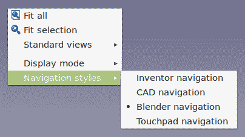
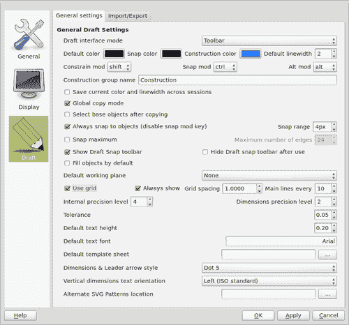

# 第一章。FreeCAD [如何操作]

欢迎来到*FreeCAD [如何操作]*。本书将介绍这个开源应用程序的组织和多功能性。本书中描述的食谱将介绍 FreeCAD 中使用的几乎所有概念，以便在一个领域获得的知识可以帮助您更有效地探索其他领域。

FreeCAD 是一款面向工程世界的通用建模工具。与 Blender 或 Maya 等其他面向动画师和艺术家的建模工具不同，FreeCAD 对三维实体的参数化、基于特征的设计给予了高度重视。

FreeCAD 的底层技术投入了大量的预见性和规划。结果是，一个功能强大、易于使用且易于使用 Python 脚本语言扩展的工具。

本书的第一部分将帮助您熟悉 FreeCAD 界面和理念。我们将探讨一些建模对象的特定技术。后续食谱将更多地关注使用 Python 来自动化和扩展 FreeCAD。

# 获取和安装 FreeCAD（必须了解）

本食谱将描述在三个主要平台（Windows、Mac 和 Linux）上安装 FreeCAD 的可用选项。它将简要介绍稳定发布版本的安装步骤。

## 准备工作

FreeCAD 仍在积极开发中。定期提供经过测试和调试的稳定发布版本。这些版本可能缺少最新的功能，并且可能不匹配本书中描述的许多食谱。

FreeCAD 网站上提供了所有三个平台的安装、卸载和故障排除的详细说明。

## 如何操作...

1.  对于大多数普通用户来说，稳定版本的二进制文件是开始学习 FreeCAD 的最佳起点。

1.  首先，访问 FreeCAD 网站[`free-cad.sourceforge.net/`](http://free-cad.sourceforge.net/)。

1.  FreeCAD 网站的主页有一个面板，包含当前稳定发布的下载链接。

    +   对于 Windows，稳定发布版本以 32 位 Microsoft Installer 应用程序（`.msi`文件）的形式提供。将文件下载到您的计算机上，然后双击它以运行安装程序。

    +   Linux（**Ubuntu**）链接将带您进入一个个人软件包存档（`PPA`）。这里的软件包适用于 Ubuntu，但应该适用于任何最近的基于 Debian 的发行版。通过 PPA 提供 32 位和 64 位版本。将 PPA 添加到您的仓库管理器中，就像安装任何其他应用程序一样安装它。FreeCAD 也可在 Ubuntu 的主要仓库中找到，但这个版本已过时，应避免使用。

    +   Mac OS X (Lion) 通过 64 位安装程序包提供支持。安装程序以磁盘镜像的形式分发。请下载磁盘镜像文件。挂载它并运行 *安装 FreeCAD* 包。在过去，Mac OS X 打包仅由一个小团队支持，并且包并不总是最新的。鼓励 OS X 用户考虑从源代码构建。

## 还有更多...

FreeCAD 的发展速度非常快。新功能和改进几乎每天都在源代码的不稳定和开发分支中出现。在您探索了基础知识之后，您可能希望探索稳定版本中尚未提供的功能。让我们看看其他一些安装选项。

### 每日构建

如果您正在使用 Linux 并且愿意承担功能损坏和偶尔崩溃的风险，您可以安装其中一个每日构建版本。这些版本每天由构建脚本自动生成，因此没有经过正式测试。每日构建包含开发者为源代码提交的最新功能和错误修复。

对于 Windows，没有每日构建版本，但会定期构建不稳定二进制安装程序。请从 [`sourceforge.net/projects/free-cad/files/FreeCAD%20Windows/`](http://sourceforge.net/projects/free-cad/files/FreeCAD%20Windows/) 下载。

### 从源代码构建

从源代码构建 FreeCAD 的详细说明超出了如何操作手册的范围，但概述主要步骤可能会有所帮助：

1.  **满足先决条件**：您需要一个编译器和所有依赖库。FreeCAD 有一个很长的依赖库列表，将它们全部安装好可能是一项繁琐的工作。在 Linux 计算机上这要容易得多，因为大多数或所有依赖库都可以从软件管理器下载。

    对于 Windows，FreeCAD 网站还提供 libpack 下载，以简化依赖要求。

1.  **获取源代码**：FreeCAD 源代码保存在一个 Git 仓库中，可通过 `git://free-cad.git.sourceforge.net/gitroot/free-cad/free-cad` 访问。

1.  **编译**：编译的具体步骤因平台而异，但一旦源代码和依赖库就绪，通常都很简单。请参考 FreeCAD 网站上您平台的相关页面。

### 第三方构建

FreeCAD 网站还维护一个替代构建列表。这些是由 FreeCAD 项目外的人员和组织创建和维护的二进制安装程序。它们可能包括自定义功能，或者可能针对特定操作系统进行优化。在撰写本文时，有第三方构建版本适用于 OpenSuse、Fedora、Slackware、ArchLinux、Gentoo 等。

# 理解 FreeCAD 界面（必须了解）

FreeCAD 被设计成灵活、可扩展且以任务为导向。

核心功能分为**工作台**。每个工作台汇集了特定任务最常用的工具。这个菜谱将引导你通过 FreeCAD 用户界面，并介绍一些在所有工作台中通用的概念。

## 准备中

启动 FreeCAD，并通过截图和界面主要部分的名称来定位自己。本书中的图像和示例来自 0.13 开发快照。


默认视图是**起始页**——一个嵌入的浏览器，显示有趣的视频链接、示例和其他新闻。

用户界面分为三个主要区域：

1.  3D 区域允许你在空间中查看和导航你的设计。

1.  组合视图显示了项目或当前任务状态的分层视图。

1.  工具栏和工作台切换器提供了访问各种工具的权限。

## 如何操作...

1.  通过点击菜单**文件 | 新建**来打开一个新文档。3D 视图将切换以显示一个空的空间。在默认方向中，相机位置是向下看一个由*X*和*Y*轴定义的平面。*Z*轴直接指向相机。角落中的坐标指示器帮助你定位 3D 空间。

1.  点击工作台切换器并选择**部件**工作台。然后点击**创建盒状实体**图标将一个立方体插入到项目中。

1.  你可以同时打开多个项目。你也可以打开同一项目的多个视图。通过点击菜单**视图 | 创建新视图**来打开项目的第二个视图。你可以通过下面的标签切换视图，或者将视图平铺以同时获得多个视角。在下面的屏幕截图中，打开了两个项目，每个项目都有两个视图：

1.  你可以通过**平移、旋转**和**缩放**来更改项目的视图。通过点击对象来选择它们以更改其属性。用于执行此操作的具体鼠标和键盘命令被称为“导航样式”。FreeCAD 默认支持四种样式：*Inventor、CAD、Blender*和*触摸板*。

    你可以通过右键单击 3D 画布来更改当前视图使用的样式。

    

    通过**编辑 | 首选项**菜单更改样式将改变当前所有视图的样式，并将选择设置为新视图的默认值。默认样式**CAD 导航**对一些用户来说不够直观，因为它需要同时点击鼠标的左键和中间键来旋转。**显示**首选项中的**鼠标...**按钮将显示执行每个动作的按钮组合。

1.  选择盒子并轻敲空格键以切换对象的可见性属性。可见性是屏幕上任何对象的多达许多属性之一。在盒子仍然被选中的情况下，检查组合视图的下半部分。所选对象的属性显示在两个选项卡（**视图**和**数据**）上。

1.  点击**测量距离**图标，然后在 3D 窗口中的盒子上点击两个点。将显示一个尺寸，并将距离对象添加到树中。

1.  您可以选择树中的距离对象并探索其属性。

1.  随着项目复杂性的增加，您可能需要同时执行多个对象上的操作。在用鼠标选择的同时按住*Ctrl*键来选择多个对象。

## 它是如何工作的...

**视图/数据**选项卡反映了 FreeCAD 的深层设计特性。构建对象所需的数据（大小、类型、位置和旋转）与在屏幕上显示所需的数据（颜色、线型、可见性和透明度）是分开的。

FreeCAD 中的大多数操作都是非破坏性的，并且会在项目树中添加新的对象。每个新对象都有自己的**视图**和**数据**选项卡，并保留其与简单前驱的关系。这使得在需要时可以删除后续对象并恢复到更简单的对象。

随着对象的添加和修改，它们以分层的方式在组合视图树中组织。通常，最后一个子对象会被显示，父对象会自动隐藏。

## 更多...

FreeCAD 使用“视图”一词来指代几个相关概念。

### 默认视图

提供了八个默认视图，并在工具栏中带有图标，以便于在屏幕上定位项目。这些视图实际上是您工作的方向，不应与之前描述的视图窗口混淆。

“视图”一词还指代相机投影类型：*正交*或*透视*。

### 冻结和保存视图

您可以通过冻结（Shift+F）来保存您工作的一个喜欢的方向。这将为冻结的视图添加一个菜单项，让您可以轻松地稍后返回到这个方向。

### Python 和报告视图

FreeCAD 还有两个默认隐藏且也称为“视图”的重要窗口，这可能会令人困惑。Python 控制台将在本书的后续章节中详细讨论。报告视图提供了关于 FreeCAD 在幕后所做工作的有用信息。

# 在部件工作台中的 CSG 建模（必须了解）

**构造实体几何（CSG）**是一种建模技术，它通过将原始实体与布尔运算结合来创建更复杂的形状。FreeCAD 的 CSG 工具位于**部件工作台**。

此配方将使用部件工作台来建模一个简单的部件，一个用于 NEMA 17 步进电机的偏移安装支架。


## 准备工作

创建一个新的空文档，并使用**设置为顶视图**顶视图图标或按数字*2*来将视图定位为顶部。使用工作台更改器切换到**部件**工作台。

## 如何做...

1.  通过添加和定位三个盒子实体来建模弯曲的金属板。将第一个盒子添加到图中，并在项目树中选择其节点。切换到**数据**选项卡并编辑属性以使其为 2.5 x 50 x 50 mm（高度，长度，宽度）。

1.  创建一个具有相同尺寸的第二个盒子，但编辑*放置*以将盒子在*X*方向上移动 50 mm 和在*Z*方向上移动 10 mm。这将使第二个立方体紧挨着第一个立方体并向上移动。

1.  添加第三个立方体来连接它们。将其尺寸设置为 10 x 2.5 x 50 mm，并将其放置在*X*方向上移动 50 mm。

1.  如果你稍微旋转一下视图，你的三个固体应该看起来像以下这张图：

1.  接下来我们将创建槽口。FreeCAD 没有槽口功能，所以我们将制作一个我们想要的孔形状的实体。稍后，我们将从板中减去它以创建孔。

1.  添加另一个盒子，并设置其尺寸为 10 x 10 x 3 mm。

1.  我们希望槽口两端是圆滑的，所以我们将对盒子进行倒角。选择盒子并按菜单**部件 | 倒角**。

1.  组合视图将切换到**任务**面板，并显示倒角选项。你可以使用这个来细化你的边缘选择并设置倒角的半径。在我们的例子中，选择**边缘 1，边缘 3，边缘 5**和**边缘 7**。我们使用了 1 的半径值。点击**确定**按钮将应用更改。如果你犯了错误，双击树中的倒角对象以更改属性并重试。

1.  一旦立方体看起来正确，选择它，并通过菜单项**编辑 | 复制选择**来复制它。再重复两次，这样我们就有四个倒角对象。选择每一个，并更改其放置属性，将其移动到板的凸起部分。位置由你决定。只需确保倒角对象完全穿透板。

1.  现在添加五个圆柱体来制作孔。更改它们的放置和半径属性。中心孔为 22.5 mm，小螺丝孔为 2.5 mm。

1.  在项目中添加所有固体后，它应该看起来像以下这张图片：

1.  我们几乎准备好从基础板上减去圆柱体和槽口了，但首先我们需要稍微清理一下。在项目树中，选择所有的圆柱体和倒角对象。在它们全部被选中后，点击**创建多个形状的并集**图标：

1.  现在选择我们基础板的三个盒子并重复操作，将它们融合成一个单一的对象。

1.  现在，你应该在树中有两个融合对象，一个用于底板，一个用于从中切割的孔。首先选择底板融合，然后按住*Ctrl*键，选择另一个。点击**制作两个形状的切割**图标：

1.  你选择对象的顺序很重要。第一个对象将被第二个对象切割。如果一切顺利，你将得到一个看起来几乎像食谱开头图像的对象。

1.  为了完成它，我们在板的角落和弯曲的角落应用了另一轮倒角。完整的对象应该看起来像本食谱开头的图像。

## 它是如何工作的……

并运算将对象组合在一起。实体不必接触或重叠。并运算后，它们将有一个单一的位置和方向。

差分布尔运算将第一个对象与第二个对象切割。如果两个对象不重叠，原始对象将不受影响。

交集消除了原始两个对象重叠区域之外的所有内容。

在执行这些操作中的任何一个之后，都会创建一个新的对象，而原始项目则成为其隐藏的子项。你可以删除父节点并切换原始对象的可视性，以返回到之前的位置。例如，倒角和斜边等对象可以双击以重新打开创建它们的对话框并调整选项。

## 还有更多……

做同一件事通常有多种方法，而**部件**工作台有几个隐藏的额外功能。

### 创建原始类型

FreeCAD 可以创建比工具栏中更多的原始类型。使用**创建原始类型**工具创建许多其他类型。例如，一个弹簧状的参数化螺旋。

### 为什么我的部件看起来不正确？

如果你的部件看起来不像本食谱开头的示例，尝试调整最终对象的**视图**属性。将**显示模式**更改为**着色**。

# 记录和编辑宏（应了解）

宏是代表一系列命令或按键的命令，可以消除重复性工作的乏味。宏录制可用于自动化不需要完整脚本编程的任务。本食谱将涵盖记录、编辑和运行宏所需的步骤。

## 准备中

定位**宏**工具栏或**宏**菜单项。


## 如何操作……

1.  按下以下截图所示的红色录制按钮：

1.  宏录制对话框将弹出。给你的宏起一个名字并保存：

1.  执行你想要记录的任务。你可以在 FreeCAD 中创建任何你通常做的事情的宏。处理简单部件创建的宏最容易开始。尝试在**部件**工作台创建一个盒子，并将其宽度更改为 20 毫米。

1.  当你完成录制任务后，按绿色按钮停止录制：

1.  通过选择看起来像草图板的按钮来运行你的宏：

1.  选择你创建的宏的名称，然后点击**执行**：

## 它是如何工作的...

在 FreeCAD 中，宏只是将命令按步骤表示出来，这些命令被保存为 Python 脚本，具有 FreeCAD 宏文件扩展名`*.FCMacro`。当你执行 FreeCAD 中的任务时，它们在后台运行相应的 Python 命令。FreeCAD 宏只是捕获这些命令并将它们保存到可以重复使用的文件中。

如果你保存宏时遇到问题，可能是由于 FreeCAD 宏首选项中的设置。通过点击**编辑** | **首选项 | 通用**打开一般首选项，然后点击**宏**选项卡。在**宏录制设置**下，**宏路径**应该包含一个指向文件目录的有效路径。如果没有，点击它右侧的按钮，并用有效的目录名称更正它。

## 还有更多...

大多数 FreeCAD 命令都可以通过宏和 Python 脚本访问。

### 充分利用宏的强大功能

宏实际上记录了在执行时 Python 指令。我们还有能力稍后读取和编辑它们。通过在宏对话框中点击**编辑**按钮打开我们的新宏。这将打开 FreeCAD 内置的宏编辑器。以下是我们的代码：

```py
# Macro Begin: /home/freecad/10x10x20mm box.FCMacro ++
	import FreeCAD
	import Part

	#Gui.activateWorkbench("PartWorkbench")
	App.ActiveDocument.addObject("Part::Box","Box")
	#App.ActiveDocument.recompute()
	#Gui.SendMsgToActiveView("ViewFit")
	FreeCAD.getDocument("Unnamed").getObject("Box").Width = 20.00

	# Macro End: /home/freecad/10x10x20mm box.FCMacro ++

```

### 小贴士

**下载示例代码**

你可以从[`www.PacktPub.com`](http://www.PacktPub.com)的账户下载你购买的所有 Packt 书籍的示例代码文件。如果你在其他地方购买了这本书，你可以访问[`www.PacktPub.com/support`](http://www.PacktPub.com/support)并注册，以便将文件直接通过电子邮件发送给你。

以`#`开头的行不会被 FreeCAD 执行；它们是 Python 注释。注释帮助我们理解代码中正在发生的事情。实际上被执行的代码行如下：

```py
import FreeCAD
	import Part

	App.ActiveDocument.addObject("Part::Box","Box")
	FreeCAD.getDocument("Unnamed").getObject("Box").Width = 20.00

```

以`import`开头的语句打开一些主要模块，这些模块对于我们的宏能够正常工作至关重要。`import Part`让我们能够创建诸如盒子、圆柱体、球体等几何对象。`App.ActiveDocument.addObject("Part::Box","Box")`实际上创建了一个盒子。

你可以编辑宏以执行它们在录制时没有执行的事情。通过按看起来像文本编辑垫的按钮打开内置的 FreeCAD 编辑器中的宏。选择你的宏，然后选择**编辑**按钮。你可以更改许多不同对象的参数值。在我们的示例宏中，你可以更改以下两行以具有不同的名称和长度：

```py
App.ActiveDocument.addObject("Part::Box","newbox")
	FreeCAD.getDocument("Unnamed").getObject("newbox").Width=20.5

```

通过在顶部菜单中选择**文件** | **保存**来保存你的更改。然后你可以按绿色播放图标尝试你的修改后的宏：


### 通过阅读宏脚本学习一些 Python 编程

创建和编辑宏是学习如何在 FreeCAD 中使用 Python 的好方法。在编辑器中打开你的宏，通过更改不同的参数并重新运行它们来玩弄它们。

要了解更多关于 Python 编程语言的信息，请访问`http://docs.python.org/tutorial`。

# 使用草图工作台建模简单部件（必须知道）

许多 3D 设计最初是二维图纸，通过拉伸或旋转进入第三维度。例如，二维的正方形可以拉伸成三维的立方体。**草图**工作台提供了处理二维几何的工具。

在这个菜谱中，我们将绘制和编辑部件的二维轮廓。在后面的菜谱中，我们将旋转这个轮廓以创建一个时 pulley 的 3D 模型。

## 准备中

开始一个新项目并切换到**草图**工作台。确保你的视图设置为顶视图。

修改你的草图首选项以使其更容易捕捉到网格。将**网格间距**值设置为`1.000`，将**主要线条间隔**值设置为`10`。将**捕捉范围**设置为大约`4px`。



## 如何操作...

1.  选择线工具。取消选择**相对**复选框。可以通过点击画布或手动输入坐标来添加线的点。手动输入第一个点，X = 3.175, Y = -5, Z = 0。你可以使用*Tab*键在字段之间切换，并在 Z 上按*Enter*键来创建点。

1.  在 X = 3.175, Y = 10, Z = -0 处继续添加第二个点。

1.  按顺时针方向输入剩余的点，直到你的线看起来像以下图像。剩余的点可以通过点击画布添加，如果你喜欢，可以捕捉到网格。按住*Shift*键将强制新段成为正交。

在输入最后一个点但返回起点之前，点击**关闭**以自动关闭线并退出工具：


1.  在我们能够编辑线的任何部分之前，我们必须将其分解成一系列边缘。在项目树中选择线。选择**草图**菜单并单击**降级**按钮三次。

1.  我们将用弧线替换边缘的方形。确保在捕捉工具栏上启用了中点和终点。使用弧线工具并在边缘上绘制曲线。

1.  对其他边缘重复此操作，然后删除旧的直线边缘。

1.  在树中选择所有边缘。选择**草图**菜单并单击**升级**按钮将它们重新组合成线。

## 它是如何工作的...

复杂的拓扑形状是由更简单的几何对象（如线、圆和弧）构建而成的。例如，**边**可以由连接两个**顶点**的线构成，每个顶点在空间中只是一个点。边也可以是弧或圆。当多个边首尾相连时，它们就变成了**线**。一个封闭的线可以升级为**面**，如果一组面完全包围一个体积，它就是一个**实体**。如果一组面没有完全包围空间（也就是说，缺失一个或多个面），它被称为**壳**。

**Draft**工作台提供了直接创建、修改和在这些数据类型之间转换的工具。

## 还有更多……

除了创建和修改二维几何形状的工具外，**Draft** 工作台的最新版本还有一些强大且实用的功能。

### 创建数组

数组工具可以创建单个对象的数组。极坐标数组对于创建螺栓圆和齿轮非常有用。正交数组创建类似网格的排列。


选择要复制的对象，然后点击数组工具。然后调整**数据**选项卡中的数组属性。这些包括复制的数量、旋转中心和数组类型。

### 转换草图和草图

**草图**是另一种在 FreeCAD 中绘制 2D 数据的方法，我们将在后面的菜谱中更详细地探讨。草图和草图服务于不同的目的，但有时需要在这两者之间进行转换。Draft 工作台有一个工具可以进行这种转换。请注意，当草图特定数据转换为草图时，将丢失这些数据。

# 旋转和拉伸以创建部件（应了解）

2D 图纸可以通过沿着轴拉伸或围绕轴旋转转换为 3D 模型。

## 准备工作

使用**Draft**工作台绘制部件的封闭轮廓。在我们的例子中，我们使用的是从*使用 Draft 工作台建模简单部件（必须了解）*菜谱中的时间皮带轮廓。

## 如何操作……

1.  切换到**Draft**工作台。

1.  选择要复制的对象，然后点击数组工具。然后在**数据**选项卡中调整数组的属性。这些包括复制的数量、旋转中心和数组类型。

1.  切换到**部件**工作台。

1.  按下**撤销选定的形状**按钮：

1.  在**旋转**对话框中，选择要旋转的形状。

1.  选择旋转的轴。在我们的例子中，使用*Y*轴。保持其他设置不变，点击**确定**。

1.  旋转的对象被添加到项目中。

## 工作原理……

FreeCAD 有两种类型的线对象。在后续版本中称为**dwire**的草图线，在**数据**选项卡上有额外的功能和属性。我们示例中使用的线包含弧线，并且是常规线。如果您在不将其升级为面之前旋转线，屏幕上显示的结果将完全相同。然而，该对象将是一个空心壳体。如果您进行额外的布尔运算，这可能会引起问题。通过旋转面而不是线，旋转扫过的区域是一个实体。

拉伸对象的工作方式类似。选择一个形状，并给出拉伸的方向和距离参数。将拉伸应用于我们的原始线将得到一个非常不同的结果。


**零件**工作台中的拉伸和旋转工具可以用于许多类型的对象，包括草图。产生的对象类型取决于原始对象。

| 输入形状 | 输出形状 |
| --- | --- |
| 顶点 | 边缘 |
| 边缘 | 面状 |
| 线（封闭） | 壳体 |
| Dwire | 实体 |
| 面状 | 实体 |
| 壳体 | 复合实体 |
| 草图 | 壳体 |

零件设计工作台有其自己的工具，用于旋转和拉伸（称为**填充**）草图以创建部件。零件设计填充和旋转工具只能用于草图。如果草图是封闭的，它们总是创建实体，否则将失败。

## 更多...

FreeCAD 还有一个将二维几何形状转换为三维对象的工具。

### 放样

可以使用两个或多个线来定义实体的边界，并且放样工具将通过扫描它们之间的区域来创建实体。在下面的屏幕截图中，两个矩形形状被上下放置并略微旋转。放样工具通过连接两个形状创建了一个扭曲的长方体：


# 使用 Python 创建 3D 实体（成为专家）

Python 是一种易于学习、易于阅读且功能强大的高级编程语言。要了解更多关于 Python 编程语言的信息，请访问[www.python.org](http://www.python.org)。

FreeCAD 使用 Python 作为其脚本语言，这使得它在建模部件方面非常灵活。在 Python 的控制下，用户可以完成手动难以完成的事情。

使用这个配方，渲染了一个伺服电机的模型。

## 准备中

对于这个配方，需要 Python 控制台。确保它已打开。在菜单栏中，点击**视图 | 视图**，然后确保**Python 控制台**被选中。**Python 控制台**将位于 FreeCAD 最底部的面板中。它看起来与以下屏幕截图类似：


您还需要打开一个文档，以便 Python 脚本化的实体模型有地方显示。

### 注意

Python 区分大小写。请确保您输入的以下配方与显示的完全一致。Python 对缩进也很敏感，因此请确保不要在任意行的开头添加额外的空格或制表符。

## 如何做到...

1.  将以下文本输入到 Python 控制台：

    ```py
    import Part
    	from FreeCAD import Vector

    	plate = Part.makeBox(40,40,5,Vector(-20,-20,0))
    	hole1= Part.makeCylinder(1.5,5,Vector(-15,-15,0))
    	hole2= Part.makeCylinder(1.5,5,Vector(-15,15,0))
    	hole3= Part.makeCylinder(1.5,5,Vector(15,15,0))
    	hole4= Part.makeCylinder(1.5,5,Vector(15,-15,0))
    	faceplate = plate.cut(hole1)
    	faceplate = faceplate.cut(hole2)
    	faceplate = faceplate.cut(hole3)
    	faceplate = faceplate.cut(hole4)
    	motorbody=Part.makeCylinder(17.5,60,Vector(0,0,5))
    	shaft = Part.makeCylinder(3.175,15,Vector(0,0,-15))
    	servo = motorbody.fuse(faceplate)
    	servo = servo.fuse(shaft)
    	servo.translate(Vector(-20,-20,0))
    	servo.rotate(Vector(0,0,0),Vector(0,1,0),-90)
    	Part.show(servo)

    ```

1.  确保在最后一行之后按下*Enter*键。

1.  你应该在 FreeCAD 的图形屏幕上看到一个 3D 实体，其外观类似于以下图形：

## 它是如何工作的...

在脚本开始时，FreeCAD 需要导入一些其模块：

```py
import Part
	from FreeCAD import Vector

```

如果不导入这些模块，脚本将无法执行标准 Python 库之外的操作。Part 模块提供了对 FreeCAD 中几何对象访问的权限。Vector 模块与对象的平移和旋转有关。

在类似`plate = Part.makeBox(40,40,5,Vector(-20,-20,0))`的行中，Part 模块为我们提供了一种创建一个 40 毫米 x 40 毫米 x 5 毫米大的实心盒子的方法，这将是我们的伺服电机模型的正面板。它沿着一个向量移动；x 方向 20 毫米；y 方向 20 毫米；z 方向 0 毫米。FreeCAD 允许我们使用 Python 创建许多类型的实体，例如使用`Part.makeCylinder`创建的圆柱体，使用`Part.makeSphere`创建的球体，使用`Part.makeCone`创建的圆锥体，以及使用`Part.makeTorus`创建的环体。

FreeCAD 可以切割 3D 对象并将它们融合在一起。在 Python 代码中，这看起来像这样：`faceplate = plate.cut(hole1)`，我们使用`hole1`切割板。将对象融合在一起可以在类似`servo = motorbody.fuse(faceplate)`的行中看到，其中电机主体与面板融合。

在脚本末尾，我们通过以下代码使我们的伺服电机可见：`show(motor)`。

```py
	Part.show(servo)

```

## 还有更多...

你可以使用 FreeCAD 中的 Python 控制台来帮助你探索 Part 模块的深度。只需在控制台中键入`Part`，FreeCAD 的自动完成功能将显示可用的类并提供提示。`.`是导致控制台自动完成的原因。

下面是自动完成功能实际运行的样子：


注意它如何为你提供关于`makeBox`类的有用提示。

### 在线了解更多关于部分脚本的信息

前往[`sourceforge.net/apps/mediawiki/free-cad/index.php?title=Topological_data_scripting`](http://https://sourceforge.net/apps/mediawiki/free-cad/index.php?title=Topological_data_scripting)获取更多信息以及如何在 FreeCAD 中使用 Python 的示例。也可以通过搜索[`www.thingiverse.com/`](http://www.thingiverse.com/)中的关键字`freecad`找到更多示例。

# 创建一个自定义对话框来自动化任务（成为专家）

FreeCAD 中的 Python 编程语言允许我们使用 PyQt4 或 PySide 添加自己的小部件来创建自定义图形用户界面。在这个菜谱中，我们将创建一个对话框，允许我们创建一个简单的盒子。

## 准备工作

如果 FreeCAD 中的**Draft**工作台运行正常，那么你已经在计算机上安装了 PyQt4。打开一个新的文档，这样我们就有空间显示我们的 3D 盒子。

## 如何做到这一点...

以下是一些代码，可以弹出一个对话框，允许我们使用一些参数创建一个 3D 实体盒子：

1.  将以下代码准确地输入到 Python 控制台中，如所示。Python 对大小写和缩进敏感。请保持缩进的一致性。在这里，我们将使用四个空格作为缩进。在这个文本中，缩进看起来像制表符。我已经在一些行中添加了反斜杠（`\`），以便它们在完整形式下不会超出打印页。

    ```py
    	from PyQt4 import QtGui,QtCore
    	import Part,FreeCAD
    	from FreeCAD import Base,Vector

    	class BoxExample(QtGui.QWidget):
    	    def __init__(self):
    	        super(BoxExample, self).__init__()
    	        self.initUI()
    	    def initUI(self):
    	        self.setGeometry(100, 100,300, 200)
    	        self.setWindowTitle('Make a Box!')
    	        self.lengthLabel = QtGui.QLabel("Length: ",self)
    	        self.lengthLabel.move(50, 15)
    	        self.length = QtGui.QLineEdit(self)
    	        self.length.move(100, 15)
    	        self.widthLabel = QtGui.QLabel("Width: ",self)
    	        self.widthLabel.move(50, 50)
    	        self.width = QtGui.QLineEdit(self)
    	        self.width.move(100, 50)
    	        self.heightLabel = QtGui.QLabel("Height: ",self)
    	        self.heightLabel.move(50, 85)
    	        self.height = QtGui.QLineEdit(self)
    	        self.height.move(100, 85)
    	        self.centered=QtGui.QCheckBox("Center on XY",self)
    	        self.centered.move(80, 115)
    	        self.centerbox = False
    	        self.centered.stateChanged.connect(self.changeState)
    	        self.okButton = QtGui.QPushButton("Create Box",self)
    	        self.okButton.move(160, 150)
    	        self.show()
    	        QtCore.QObject.connect \
    	(self.okButton, QtCore.SIGNAL("pressed()"),self.box)  
    	    def changeState(self, state):
    	        console=FreeCAD.Console
    	        if state == QtCore.Qt.Checked:
    	            console.PrintMessage("Box will be centered\n")
    	            self.centerbox = True
    	        else:
    	            self.centerbox = False
    	    def box(self):
    	        l = float(self.length.text())
    	        w = float(self.width.text())
    	        h = float(self.height.text())
    	        if self.centerbox == True:
    	            box = Part.makeBox(l,w,h)
    	            box.translate(Base.Vector(-l/2,-w/2,0))
    	        else:
    	            box = Part.makeBox(l,w,h)
    	        Part.show(box)

    	d = BoxExample() 

    ```

1.  在输入最后一行后，按两次 *Enter* 键。

1.  当对话框弹出时，填写值并点击 **创建盒子** 按钮。一个简单的 3D 盒子应该出现在 FreeCAD 文档中。它看起来与以下截图类似：

## 工作原理...

我们首先创建一个包含所有对话框功能的类：

```py
	class BoxExample(QtGui.QWidget): 

```

`BoxExample` 类中 `def initUI(self):` 函数内的代码用于设置对话框的控件。包含 `QtGui.QLabel` 的行让我们可以标记由 `QtGui.QLineEdit(self)` 创建的文本框。在函数的末尾有一个复选框和一个按钮，分别以 `QtGui.QCheckBox` 和 `QtGui.QPushButton` 的形式出现。`def changeState(self, state):` 用于检查我们的 **中心对齐 XY** 复选框是否被选中。

以下代码行用于将标记为 **创建盒子** 的按钮连接到下一个函数：

```py
QtCore.QObject.connect \
	(self.okButton, QtCore.SIGNAL("pressed()"),self.box)

```

我使用了反斜杠（`\`）续行符，以便将一行长代码适应这本书的格式化文本，所以这两行看起来像 Python 中的同一行。

`def box(self)` 函数负责在文档中创建 3D 实体盒子。`box = Part.makeBox(l,w,h)` 创建盒子，`Part.show(box)` 使其在我们的文档中显示。

在 FreeCAD Python 脚本中，我们不需要像创建独立应用程序那样使用主调用。相反，我们使用 `d = BoxExample()` 来调用并显示我们的 `BoxExample()` 类。这就是打开对话框的方式。

## 还有更多...

要了解更多关于 FreeCAD 对话框创建的信息，请访问 [`sourceforge.net/apps/mediawiki/free-cad/index.php?title=Dialog_creation`](http://https://sourceforge.net/apps/mediawiki/free-cad/index.php?title=Dialog_creation)。

### 了解更多关于 Python 和 PyQt 编程

新的 Python 程序员应该检查的第一个地方是官方 Python 文档网站，网址为 [`python.org/doc/`](http://python.org/doc/)。

在 [`zetcode.com/tutorials/pyqt4/firstprograms/`](http://zetcode.com/tutorials/pyqt4/firstprograms/) 也有 PyQt 编程的良好入门教程。

### 通过使用 Qt Designer 使事情变得简单

要使编程对话框变得更容易，您将需要使用 Qt Designer，这是一个图形对话框创建工具。它将允许您使用图形编辑器创建对话框，这些对话框可以转换为 Python 代码。如果您使用 Ubuntu Linux 作为操作系统，请在 Synaptic 中查找 **qtdesigner**。

以下网页提供了创建 FreeCAD 对话框的良好介绍：

[`sourceforge.net/apps/mediawiki/free-cad/index.php?title=Dialog_creation`](http://https://sourceforge.net/apps/mediawiki/free-cad/index.php?title=Dialog_creation)

# 使用约束建模（必须知道）

零件设计工作台中的许多工具看起来与草图工作台中的工具很熟悉。然而，工作流程却相当不同。它围绕基于特征的设计理念构建，零件设计草图器中的几何图形首先非常粗略地绘制，然后通过约束进行细化。随着约束的添加，内置求解器将调整几何图形以满足约束要求。

在这个菜谱中，我们将设计一个具有两个轴上特征的简单零件，并展示如何使用约束进行修改。在后面的菜谱中，我们将向这个零件添加特征。


## 准备工作

从一个新的空文档开始。切换到**零件设计**工作台并点击按钮以创建新草图或编辑选定的草图。将弹出一个对话框，询问您希望草图在哪个平面上定位。选择**XZ-平面**选项并点击**确定**。

## 如何做...

1.  大致绘制零件的端部轮廓。在此阶段不必担心精度。以下示例是用圆弧和线绘制的：

1.  添加几何约束。通过选择要约束的草图部分并按下相应的约束按钮来添加约束。新的约束图标将被添加到图中，并在左侧面板中列出。

1.  首先向任何弯曲的线条添加水平和垂直约束。

    如果线条应该连接，选择顶点并添加共线约束。

    选择匹配的线条对并添加等式约束。这将迫使线条具有相等的长度。

1.  当草图看起来对称时，添加尺寸约束。首先约束最重要的尺寸。例如，我们已经将圆弧的半径约束为 25 毫米。

1.  在添加约束时，注意任务面板顶部的求解器消息。当自由度（DOF）接近零时，您可能会发现很难添加约束而不出现冲突约束错误。拖动顶点或段可以显示草图仍然存在约束不足的地方。

1.  如果草图达到 2 DOF，拖动段仅移动整个草图，那么是时候锁定它了。选择一个顶点（我们使用了圆弧的中心）并点击锁定按钮。这将添加垂直和水平距离约束，将顶点锁定到坐标系的原点。一个完全约束的草图将变为绿色。庆祝一下。

1.  在任务面板中点击**关闭**按钮。使用垫片工具将草图垫至 75 毫米，并旋转草图以查看您的零件。

1.  即使草图已经填充，你仍然可以通过在树中双击它来编辑它。保存后，你的更改将立即应用到零件上。

## 它是如何工作的...

约束限制了对象可以变换的方式。平面上的一个圆可以在两个方向上移动，并且可以改变其半径。因此，它有三个自由度。当其半径被约束时，它有 2 个自由度，当其中心在 X 和 Y 方向上锁定时，它被认为是完全约束的。

几何约束是影响实体形状或关系的约束；水平、垂直、切线、对称等。

尺寸约束有数字。双击约束以编辑值。长度、半径和角度都是尺寸约束。

使用约束建模对于具有特征之间隐含关系的离散零件非常实用。

## 更多...

避免和消除冲突的约束是大多数用户在使用草图绘制器时面临的最大挑战。练习对于提高你的技能大有裨益，但遵循一些基本指南也会有所帮助。

### 小心应用约束

首先应用对称约束。接下来在尺寸约束（任何带数字的）之前应用几何约束（水平、垂直、切线等）。

在可能的情况下，固定水平或垂直距离，而不是约束长度。

尝试最后应用坐标锁定。换句话说，在你尝试将其约束到坐标系之前，尽量使草图自身约束。

### 使用多个简单草图

通常来说，使用几个简单的草图来构建零件的复杂性比使用一个包含许多约束的大型草图要容易得多。尽量使你的草图尽可能简单。尽可能使用倒角和圆角操作在实体上，而不是在草图中建模斜边或圆角。

# 使用外部约束（应了解）

我们想要设计的零件的所有特征通常不会都在同一个二维平面上。

想象一下，我们想在*使用约束建模（必须了解）*菜谱中设计的零件的上表面添加孔，如下面的截图所示。为此，我们需要一种方法将新的草图与零件的上表面关联起来。

外部约束为我们提供了一种将草图中的元素与草图本身之外的实体相关联的方法，如零件的表面。


在这个菜谱中，我们还将展示草图中的特征如何与现有对象相关联。

在过程中，我们还将介绍构造线和外部约束。

## 准备工作

这个菜谱使用了 FreeCAD 版本 0.13 及以后的函数。确保你使用的是最新版本或开发快照。

打开在*使用约束建模（必须了解）*菜谱中创建的模型。将视图设置为**顶视图**，这样你就可以从上方查看零件。

## 如何操作...

1.  选择零件的上表面使其高亮显示，然后点击草图按钮。新的草图将被映射到该面上。

1.  画四个圆来表示我们的螺栓孔。通过点击边缘（而不是中心）选择所有四个，并设置等量约束使它们大小相同。

1.  选择四个中的一个并添加一个半径约束。将半径设置为 3.5 毫米。现在可以通过更改一个数字来调整所有四个。

1.  我们希望孔的位置是对称的。选择顶部两个孔的中心和垂直轴。添加一个对称约束。对底部两个孔重复操作。现在两组圆都是独立对称的。

1.  从右上角孔的中心画一条线到底右角孔的中心。确保端点与每个圆的中心重合。选择该线，通过点击构造模式图标将其转换为构造线。

1.  在构造线上设置长度约束为 50 毫米。

1.  现在我们需要一种方法来设置孔相对于零件边缘的位置。

1.  点击**外部约束**图标并选择原始实体的右侧边缘。现在可以像草图的一部分一样在约束中引用边缘及其顶点。

1.  选择右下角圆的中心和外部约束线的底部端点。添加一个水平距离约束（11 毫米）。重复并添加一个垂直距离约束（15 毫米）。

1.  草图应该是完全约束的。要创建贯穿整个块体的孔，关闭草图并使用口袋工具。将口袋深度设置为至少 50 毫米。

## 它是如何工作的...

可以在现有实体的平面面上绘制草图，以添加如凸起或凹槽等特征。

可以将构造几何图形添加到任何草图。这些线、圆和弧不会成为最终对象的一部分，但可以接受所有相同的约束。它们有助于绘制其他实体并建立实体之间的关系。

外部约束线类似于构造线，但它是从绘制草图的面上选定的边缘。

## 还有更多...

要使用外部约束，必须将草图映射到面。当你通过选择对象的一个面开始绘制草图时，这会自动发生。然而，也可以将现有的草图应用到它最初没有绘制到的面上。

### 将草图映射到面

选择一个面，然后点击菜单**零件设计** | **映射草图**到面。

在对话框中，选择要映射到面的草图，然后点击**确定**。将草图映射到面会将草图放入编辑模式。如有必要，调整草图并关闭它。草图可以被重新映射到不同的面，但不能同时映射到多个面。

# 使用 Python 添加或修改约束（成为专家）

除了交互式和图形化地使用 Sketcher，我们还可以使用 Python 来自动编程它。

## 准备中

对于这个菜谱，我们需要打开 Python 控制台。在菜单栏中，打开**视图**，然后**视图**，并确保**Python 控制台**被勾选。

## 如何操作...

1.  将以下代码块输入到控制台：

    ```py
    	from Sketcher import *  
    	import Part
    	import FreeCAD as App
    	from FreeCAD import Vector
    	if(App.activeDocument() == None):App.newDocument()

    	f = App.activeDocument().addObject("Sketcher::SketchObject","Sketch")
    	f.addGeometry(Part.Line(Vector(0,0,0),Vector(2,20,0)))
    	f.addGeometry(Part.Line(Vector(0,0,0),Vector(20,2,0)))
    	f.Constraints = [Constraint('Vertical',0),\ Constraint('Horizontal',1)]
    	App.activeDocument().recompute()

    ```

1.  双击项目树中的**Sketch**图标。

1.  注意水平和垂直约束符号（小红条）。还要注意，线条有端点，但它们没有被约束。

1.  抓住任意一条线并移动它，另一条线不会随之移动。

1.  在控制台添加一些 Python 代码以约束一些点：

    ```py
    StartPoint = 1 ;
    	l = f.Constraints
    	l.append(Constraint('Coincident',0,StartPoint,1,StartPoint))
    	f.Constraints = l
    	App.activeDocument().recompute()

    ```

1.  注意每条线的一端是如何连接到另一端的。

1.  尝试将一条线在屏幕上移动，你会看到线条一起移动。

## 它是如何工作的...

1.  在 Sketcher 模块中导入所有可用函数：

    ```py
    	from Sketcher import *

    ```

1.  我们需要 Part 模块来创建几何对象：

    ```py
    	import Part

    ```

1.  FreeCAD 模块将允许我们操作文档：

    ```py
    	import FreeCAD as App

    ```

1.  我们需要给出我们的线段端点，因此我们需要：

    ```py
    	from FreeCAD import Vector

    ```

1.  如果文档尚未打开，请创建一个新的：

    ```py
    	if(App.activeDocument() == None): App.newDocument()

    ```

1.  创建一个新的 Sketch 对象：

    ```py
    	f = App.activeDocument().addObject("Sketcher::SketchObject",\ "Sketch")

    ```

1.  向草图添加几何形状：

    ```py
    f.addGeometry(Part.Line(Vector(0,0,0),Vector(2,20,0)))
    	f.addGeometry(Part.Line(Vector(0,0,0),Vector(20,2,0)))

    ```

1.  向草图添加一些约束以使线条水平垂直：

    ```py
    	f.Constraints = [Constraint('Vertical',0),\ Constraint('Horizontal',1)]

    ```

1.  重新计算草图以查看更改后的情况：

    ```py
    	App.activeDocument().recompute()

    ```

1.  让我们在我们的线条上添加一个起点名称：

    ```py
    	StartPoint = 1

    ```

1.  创建一个与原始对象相等的代理对象，因为我们不能直接向它添加约束：

    ```py
    	l = f.Constraints

    ```

1.  向我们的代理对象添加更多约束。`0`是第一条线，`1`是第二条：

    ```py
    	l.append(Constraint('Coincident',0,StartPoint,1,StartPoint))

    ```

1.  将原始约束设置为代理并重新计算：

    ```py
    	f.Constraints = l
    	App.activeDocument().recompute()

    ```

### 更多...

你可以使用尺寸约束你的几何形状，使用 Python。

#### 向一条线添加长度约束

你可以按照以下方式为第二条线添加长度约束：

```py
	l.append((Constraint('DistanceX',1,20.0)))

```

# 绘制零件的草图（应了解）

绘图工作台允许我们创建 3D 对象的 2D 视图，以便以理想的打印格式进行展示。在本菜谱中，我们将创建一个包含三个视图的绘图。

## 准备中

在文档中选择一个 3D 对象并打开**绘图**工作台：


## 如何操作...

1.  选择**插入新绘图**图标：

1.  选择**插入正交投影**图标：

1.  在**任务**面板中会弹出一个新任务。选择**主视图**：

1.  选择**次级视图**

1.  在**任务**面板中点击**OK**按钮。

1.  当在项目树中选择**页面**图标时，点击其**数据**选项卡。

1.  双击标签为**..**.的按钮。

1.  将会弹出一个文本对话框。编辑值，输入你的名字、日期等：

1.  点击重新计算按钮查看结果：

## 它是如何工作的...

FreeCAD 利用 OpenCascade CAD 内核的算法从 3D 对象计算 2D 投影，并将其插入到 SVG 画布上。这个画布实际上是在步骤 1 中导入的模板。

任务面板中的正射投影对话框在设定的角度创建不同的投影，并按一致的方式对其进行缩放和定位。

文本对话框帮助我们编辑 SVG 可编辑文本，并在标题块的右下角填写文本信息。

## 更多...

如果你想要将你的图纸给没有 FreeCAD 的人，你可能想将其导出为 PDF 文件。

### 从你的图纸中导出 PDF 文件

在项目树中选择**页面**对象。从顶部菜单中选择**文件**然后**导出 PDF**。给你的文件起一个带有`*.pdf`扩展名的名字，并选择一个保存位置。

# 为其他应用程序导出 DXF 文件（应了解）

大多数 CAD 应用程序并不孤立存在，需要能够保存到不同的文件格式，以便其他 CADCAM 程序使用。FreeCAD 也不例外。有一些任务 FreeCAD 做得不是很好，比如尺寸标注。其他应用程序，如 LibreCAD 或 DraftSight 在这方面做得更好。将 2D 几何形状导出为 DXF 格式是促进这一点的绝佳方式。

## 准备工作

导出几何形状的第一条规则是确保你的几何形状干净且一致。这意味着打算连接的线条和圆弧的端点应该无缝连接。隐藏在其他线条下的线段应该被删除。不可能小的圆弧和线条也应该被删除。不要在文档中留下任何不必要的额外实体。在 FreeCAD 中，3D 几何形状不导出为 DXF 格式。

## 如何操作...

1.  在项目树中，从**草图**或**草图**工作台选择**2D 几何形状**。确保选择所有要导出的几何形状。

1.  从顶部菜单中选择**文件**然后**导出**。

1.  在**导出**文件对话框的右下角，选择**Autodesk DXF**。

1.  在**名称**输入框中，给你的文件起一个带有`*.dxf`扩展名的名字。

1.  选择你想要保存文件的位置。

## 它是如何工作的...

FreeCAD 通常使用**草图**工作台的脚本导出 2D 几何形状。

# 导入数据（应了解）

有时候，使用在其他 CAD 或建模程序中创建的几何形状是很有必要的。FreeCAD 可以导入多种文件类型。DXF、STEP、STL、SVG、VRML、Collada 和 IDF 只是它可以使用的一些文件格式。

在这个菜谱中，我们将打开一个 DXF 文件，并使用其中的几何形状形成一个 3D 实体。

## 准备工作

你应该有一个由 QCAD、LibreCAD、Draftsight 或 AutoCAD 等 CAD 程序生成的 DXF 文件，以便生成 DXF 文件。

1.  在 FreeCAD 中，打开 **草图** 工作台，然后从 **编辑** 菜单中选择 **首选项**。

1.  在 **首选项** 对话框中，单击 **草图** 图标，然后单击 **导入/导出** 选项卡。

1.  在 **DXF 格式选项** 下，将 **导入样式** 更改为 **无（最快）**。

1.  取消选中该部分的所有其他复选框。单击 **应用**，然后 **确定**。

在另一个 CAD 程序中创建一些几何形状。在这个例子中，我们将使用 DraftSight 创建一个简单的形状。以下是一个带有四个圆角和一个圆的多段线矩形：


这张图纸中的线和弧是一个多段线。这些将很好地转换为 FreeCAD，并帮助我们创建一个从圆中减去的实体。

将文件保存为 ASCII 类型的 `dxf`（不要保存为二进制）。

## 如何操作...

1.  在 FreeCAD 中，从 **文件** 菜单中选择 **导入**。

1.  选择要导入的 `dxf` 文件。

1.  在 **组合视图** 中，查看 **项目** 选项卡并展开图标。

1.  切换到 **草图** 工作台，以便我们可以使用看起来像向上箭头的图标 **升级** 圆形。

1.  选择标记为 **多段线** 的几何形状，并使用带有 **拉伸** 图标的 **零件** 工作台将其拉伸成实体。

1.  将标记为 **圆形** 的几何形状拉伸成实体。确保其高度与由多段线制成的实体相同。

1.  选择从 **多段线** 创建的实体，然后选择由 **圆形** 创建的实体。

1.  在 **零件** 工作台中，使用 **布尔减去** 操作从 **多段线** 实体中减去 **圆形** 实体。

## 它是如何工作的...

DXF 导入依赖于草图工作台内的代码，因此其设置由草图首选项控制。在 **零件** 工作台中导入的 `dxf` 多段线作为一个可以拉伸成面的面。草图工作台有工具可以将其他 2D 几何形状转换为面，使用 **升级** 工具，允许 **零件** 工作台从它们创建实体。面将拉伸成实体，而一个没有面的封闭形状将仅仅拉伸成一个看起来像墙的薄片对象。
