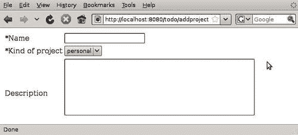
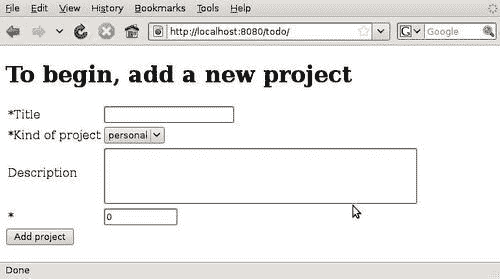
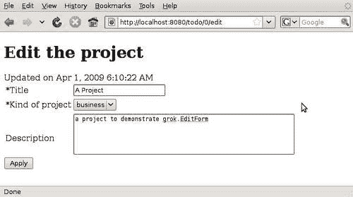
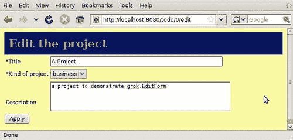
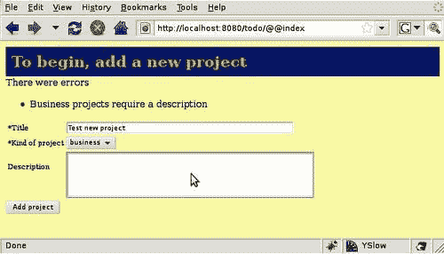

# 第五章。表单

我们已经看到创建一个小型应用程序是多么容易，比如我们在过去几章中开发的待办事项管理器。现在，我们将探讨 Grok 如何帮助我们开发更复杂应用程序的多种方法之一。

到目前为止，我们一直在处理简单的一到两个字段的表单。当我们上一章更改我们的模型时，我们必须回去编辑表单的 HTML。对于几个字段来说，这需要很少的工作，但是当我们有可能有十几个字段或更多的复杂模型时，如果我们每次更改都不必修改两个文件，那就太好了。

幸运的是，Grok 有一个自动化创建和处理表单的机制。我们将在本章中了解它是如何工作的，以及一些其他与表单相关的主题：

+   什么是接口

+   什么是模式

+   如何使用 Grok 的表单组件自动生成表单，以及接口和模式是如何被使用的

+   如何创建、添加和编辑表单

+   如何过滤字段并防止它们出现在表单中

+   如何更改表单模板和展示

# 自动表单的快速演示

让我们先看看它是如何工作的，然后再深入了解细节。为了做到这一点，我们将向我们的应用程序添加一个项目模型。一个项目可以与任何数量的列表相关联，这样相关的待办事项列表就可以一起分组。现在，让我们单独考虑项目模型。将以下行添加到`app.py`文件中，在`Todo`应用程序类定义之后。我们稍后再考虑它是如何融入整个应用程序的。

```py
class IProject(interface.Interface):
name = schema.TextLine(title=u'Name',required=True)
kind = schema.Choice(title=u'Kind of project',
values=['personal','business'])
description = schema.Text(title=u'Description')
class AddProject(grok.Form):
grok.context(Todo)
form_fields = grok.AutoFields(IProject)

```

我们还需要在文件顶部添加几个导入：

```py
from zope import interface
from zope import schema

```

保存文件，重新启动服务器，然后访问 URL [`localhost:8080/todo/addproject`](http://localhost:8080/todo/addproject)。结果应该类似于以下截图：



好吧，表单的 HTML 是从哪里来的？我们知道`AddProject`是一种视图，因为我们使用了`grok.context`类注解来设置其上下文和名称。此外，类的名称（小写）被用于 URL 中，就像之前的视图示例一样。

重要的新事物是如何创建和使用表单字段。首先，定义了一个名为`IProject`的类。该接口定义了表单上的字段，而`grok.AutoFields`方法将它们分配给`Form`视图类。这就是视图知道在表单渲染时生成哪些 HTML 表单控件的原因。

我们有三个字段：`name, description`和`kind`。在代码的后面，`grok.AutoFields`行将这个`IProject`类转换成表单字段。

就这些。不需要模板或`render`方法。`grok.Form`视图负责生成显示表单所需的 HTML，从`grok.AutoFields`调用生成的`form_fields`属性值中获取信息。

# 接口

类名中的`I`代表接口。我们在文件顶部导入了`zope.interface`包，我们用作`IProject`基类的`Interface`类就来自这个包。

## 接口示例

**接口**是一个用于指定和描述对象外部行为的对象。从某种意义上说，接口就像一份合同。当一个类包含接口类中定义的所有方法和属性时，我们说这个类实现了接口。让我们看看一个简单的例子：

```py
from zope import interface
class ICaveman(interface.Interface):
weapon = interface.Attribute('weapon')
def hunt(animal):
"""Hunt an animal to get food"""
def eat(animal):
"""Eat hunted animal"""
def sleep()
"""Rest before getting up to hunt again"""

```

在这里，我们正在描述穴居人的行为。穴居人将拥有武器，他可以狩猎、进食和睡眠。请注意，`武器`是一个*属性*，它是属于对象的某个东西，而`狩猎`、`进食`和`睡眠`是*方法*。

一旦定义了接口，我们就可以创建实现它的类。这些类承诺包括它们接口类中的所有属性和方法。因此，如果我们说：

```py
class Caveman(object):
interface.implements(ICaveman)

```

然后，我们承诺`Caveman`类将实现`ICaveman`接口中描述的方法和属性：

```py
weapon = 'ax'
def hunt(animal):
find(animal)
hit(animal,self.weapon)
def eat(animal):
cut(animal)
bite()
def sleep():
snore()
rest()

```

注意，尽管我们的示例类实现了所有接口方法，但 Python 解释器并没有做出任何类型的强制执行。我们可以定义一个不包含任何定义的方法或属性的类，它仍然可以工作。

## Grok 中的接口

在 Grok 中，一个模型可以通过使用`grok.implements`方法来实现接口。例如，如果我们决定添加一个项目模型，它可以如下实现`IProject`接口：

```py
class Project(grok.Container):
grok.implements(IProject)

```

由于它们的描述性，接口可以用作文档。它们还可以用于启用组件架构，但我们会稍后讨论这一点。对我们来说，现在更有兴趣的是，它们可以用于自动生成表单。

# 模式

定义表单字段的方法是使用`zope.schema`包。这个包包括许多种字段定义，可以用来填充表单。

基本上，模式允许详细描述使用字段的类属性。在形式方面，这是我们在这里感兴趣的内容，模式表示当用户提交表单时将传递给服务器的数据。表单中的每个字段对应于模式中的一个字段。

让我们更仔细地看看我们在上一节中定义的模式：

```py
class IProject(interface.Interface):
name = schema.TextLine(title=u'Name',required=True)
kind = schema.Choice(title=u'Kind of project',
required=False,
values=['personal','business'])
description = schema.Text(title=u'Description',
required=False)

```

我们为 `IProject` 定义的方案有三个字段。有多种类型的字段，如下表所示。在我们的示例中，我们定义了一个 `name` 字段，它将是一个必填字段，并且旁边将有一个标签 `Name`。我们还定义了一个 `kind` 字段，它是一个用户必须从中选择一个选项的选项列表。请注意，`required` 的默认值是 `True`，但通常最好明确指定它，以避免混淆。您可以通过使用 `values` 参数来静态地传递可能的值列表。最后，`description` 是一个文本字段，这意味着它将有多行文本。

## 可用的模式属性和字段类型

除了 `title`、`values` 和 `required` 之外，每个模式字段还可以有多个属性，如下表详细说明：

| 属性 | 描述 |
| --- | --- |
| `title` | 简短的摘要或标签。 |
| `description` | 字段的描述。 |
| `required` | 表示字段是否需要存在值。 |
| `readonly` | 如果为 `True`，则字段的值不能被更改。 |
| `default` | 字段的默认值可以是 `None`，或者一个有效的字段值。 |
| `missing_value` | 如果此字段的输入缺失，并且这是可以接受的，那么这就是要使用的值。 |
| `order` | `order` 属性可以用来确定模式中字段的定义顺序。如果一个字段在另一个字段之后（在同一线程中）创建，则其顺序将更大。 |

除了前面表格中描述的字段属性之外，一些字段类型还提供了额外的属性。在前面的示例中，我们看到了各种字段类型，如 `Text`、`TextLine` 和 `Choice`。还有其他几种字段类型可用，如下表所示。我们可以通过这种方式定义一个方案，并让 Grok 生成它们，从而创建非常复杂的表单。

| 字段类型 | 描述 | 参数 |
| --- | --- | --- |
| `Bool` | 布尔字段。 |   |
| `Bytes` | 包含字节字符串的字段（如 python 的 `str`）。值可能被限制在长度范围内。 |   |
| `ASCII` | 包含 7 位 ASCII 字符串的字段。不允许任何大于 DEL（chr(127)）的字符。值可能被限制在长度范围内。 |   |
| `BytesLine` | 包含没有换行符的字节字符串的字段。 |   |
| `ASCIILine` | 包含没有换行符的 7 位 ASCII 字符串的字段。 |   |
| `Text` | 包含 Unicode 字符串的字段。 |   |
| `SourceText` | 包含对象源文本的字段。 |   |
| `TextLine` | 包含没有换行符的 Unicode 字段的字段。 |   |
| `Password` | 包含没有换行符的 Unicode 字符串的字段，该字符串被设置为密码。 |   |
| `Int` | 包含整数值的字段。 |   |
| `Float` | 包含浮点数的字段。 |   |
| `Decimal` | 包含十进制数的字段。 |   |
| `DateTime` | 包含日期时间的字段。 |   |
| `Date` | 包含日期的字段。 |   |
| `Timedelta` | 包含 timedelta 的字段。 |   |
| `时间` | 包含时间的字段。 |   |
| `URI` | 包含绝对 URI 的字段。 |   |
| `Id` | 包含唯一标识符的字段。唯一标识符可以是绝对 URI 或点分名称。如果是点分名称，它应该有一个模块或包名称作为前缀。 |   |
| 字段类型 | 描述 | 参数 |
| `选择` | 值包含在预定义集合中的字段。 | `values:` 字段文本选择的列表。`vocabulary:` 将动态生成选择的词汇对象。`source:` 生成动态选择的不同、较新的方式。注意：三者中只能提供其一。关于来源和词汇的更多信息将在本书后面提供。 |
| `元组` | 包含实现传统 Python 元组 API 的值的字段。 | `value_type:` 字段值项必须符合通过字段给出的类型，通过字段表达。`Unique`。指定集合的成员是否必须是唯一的。 |
| `列表` | 包含实现传统 Python 列表 API 的值的字段。 | `value_type:` 字段值项必须符合通过字段给出的类型，通过字段表达。`Unique`。指定集合的成员是否必须是唯一的。 |
| `集合` | 包含实现传统 Python 标准库 `sets.Set` 或 Python 2.4+ 集合 API 的值的字段。 | `value_type:` 字段值项必须符合通过字段给出的类型，通过字段表达。 |
| `冻结集合` | 包含实现传统 Python 2.4+ frozenset API 的值的字段。 | `value_type:` 字段值项必须符合通过字段给出的类型，通过字段表达。 |
| `对象` | 包含对象值的字段。 | `Schema:` 定义对象所包含字段的接口。 |
| `字典` | 包含传统字典的字段。`key_type` 和 `value_type` 字段允许指定字典中键和值的限制。 | `key_type:` 字段键必须符合通过字段给出的类型，通过字段表达。`value_type:` 字段值项必须符合通过字段给出的类型，通过字段表达。 |

# 表单字段和部件

模式字段非常适合定义数据结构，但在处理表单时有时它们并不足够。实际上，一旦使用模式作为基础生成表单，Grok 将模式字段转换为表单字段。**表单字段**类似于模式字段，但具有扩展的方法和属性集。它还有一个默认关联的部件，负责在表单内字段的外观。

渲染表单需要不仅仅是字段及其类型。表单字段需要一个用户界面，这正是小部件提供的。例如，`Choice` 字段可以渲染为表单上的 `<select>` 框，但它也可以使用一组复选框，或者可能是单选按钮。有时，字段可能不需要在表单上显示，或者可写字段可能需要以文本形式显示，而不是允许用户设置字段的值。

# 表单组件

Grok 提供了四个不同的组件，可以自动生成表单。我们已经与这些组件中的第一个 `grok.Form` 一起工作过。其他三个是这个组件的专门化：

+   `grok.AddForm` 用于添加新的模型实例。

+   `grok.EditForm` 用于编辑已存在的实例。

+   `grok.DisplayForm` 简单地显示字段的值。

Grok 表单本身是 `grok.View` 的专门化，这意味着它获得与视图相同的方法。这也意味着如果模型已经有了表单，实际上不需要为模型分配视图。实际上，简单的应用程序可以通过将表单用作对象的视图来避免这种情况。当然，有时需要更复杂的视图模板，或者甚至需要在同一视图中显示来自多个表单的字段。Grok 也可以处理这些情况，我们将在稍后看到。

## 在站点的根目录添加一个项目容器

要了解 Grok 的表单组件，让我们将我们的项目模型正确集成到待办事项列表应用程序中。我们需要对代码进行一点重构，因为目前待办事项列表容器是应用程序的根对象。我们需要有一个项目容器作为根对象，然后向其中添加一个待办事项列表容器。

幸运的是，我们在上一章中已经正确地结构化了代码，所以我们现在不需要做很多修改。首先，让我们修改 `app.py` 的顶部，在 `TodoList` 类定义之前，使其看起来像这样：

```py
import grok
from zope import interface, schema
class Todo(grok.Application, grok.Container):
def __init__(self):
super(Todo, self).__init__()
self.title = 'To-Do list manager'
self.next_id = 0
def deleteProject(self,project):
del self[project]

```

首先，我们导入 `zope.interface` 和 `zope.schema`。注意我们如何保持 `Todo` 类作为根应用程序类，但现在它可以包含项目而不是列表。我们还省略了 `addProject` 方法，因为 `grok.AddForm` 实例将负责这一点。除此之外，`Todo` 类几乎相同。

```py
class IProject(interface.Interface):
title = schema.TextLine(title=u'Title',required=True)
kind = schema.Choice(title=u'Kind of project',values=['personal', 'business'])
description = schema.Text(title=u'Description',required=False)
next_id = schema.Int(title=u'Next id',default=0)

```

然后我们有 `IProject` 的接口定义，其中我们添加了 `title, kind, description` 和 `next_id` 字段。这些是我们之前在产品初始化时调用 `__init__` 方法时添加的字段。

```py
class Project(grok.Container):
grok.implements(IProject)
def addList(self,title,description):
id = str(self.next_id)
self.next_id = self.next_id+1
self[id] = TodoList(title,description)
def deleteList(self,list):
del self[list]

```

在 `Project` 类定义中需要注意的关键点是，我们使用 `grok.implements` 类声明来查看这个类将实现我们刚刚定义的模式。

```py
class AddProjectForm(grok.AddForm):
grok.context(Todo)
grok.name('index')
form_fields = grok.AutoFields(Project)
label = "To begin, add a new project"
@grok.action('Add project')
def add(self,**data):
project = Project()
self.applyData(project,**data)
id = str(self.context.next_id)
self.context.next_id = self.context.next_id+1
self.context[id] = project
return self.redirect(self.url(self.context[id]))

```

实际的表单视图是在之后定义的，通过使用`grok.AddForm`作为基类。我们使用`grok.context`注解将此视图分配给主`Todo`容器。目前使用`index`这个名字，这样应用程序的默认页面就是“添加表单”本身。

接下来，我们通过调用`grok.AutoFields`方法创建表单字段。请注意，这次这个方法调用的参数是`Project`类本身，而不是接口。这是因为我们在之前使用`grok.implements`时将`Project`类与正确的接口关联起来了。

在我们分配字段之后，我们将表单的`label`属性设置为文本：“**开始，添加一个新项目**”。这是将在表单上显示的标题。

除了这段新代码之外，文件中所有`grok.context(Todo)`的实例都需要更改为`grok.context(Project)`，因为待办事项列表及其视图现在属于一个项目，而不是主`Todo`应用程序。有关详细信息，请参阅本书第五章的源代码。

## 表单操作

如果你仔细查看“自动表单快速演示”部分中显示的截图，你会看到表单没有提交按钮。在 Grok 中，每个表单都可以有一个或多个操作，并且对于每个操作，表单都会有一个提交按钮。Grok 的`action`装饰器用于标记表单类中将用作操作的方法。在这种情况下，`add`方法被装饰了，并且文本参数的值，在这种情况下是`Add project`，将用作按钮上的文本。要更改按钮上的文本，只需修改传递给装饰器的字符串即可：

```py
@grok.action('Add project')
def add(self,**data):
project = Project()
self.applyData(project,**data)
id = str(self.context.next_id)
self.context.next_id = self.context.next_id+1
self.context[id] = project
return self.redirect(self.url(self.context[id]))

```

`add`方法接收`data`参数中所有填写好的表单字段，然后创建一个`Project`实例。接下来，它通过调用表单的`applyData`方法将`project`的属性设置为表单中的值。最后，它将新项目添加到`Todo`实例中，并将用户重定向到项目页面。

## 尝试应用程序

当你尝试应用程序时，有两点需要注意。首先，当添加项目表单显示时，用于命名项目的`next_id`字段会显示出来。如果我们愿意，甚至可以编辑它。显然，我们不希望这种行为。

第二，一旦项目创建完成并且我们被重定向到项目页面，一切都会像以前一样工作，即使我们没有触摸模板。如果我们使用第三章中尝试的方法，即使用隐藏值和列表索引，我们就需要在`index.pt`模板的许多地方进行修改。现在我们有一个基于模型的架构，为它们注册的视图和方法不需要改变，即使包含层次结构不同。

另一个需要注意的重要事情是，添加项目表单没有任何设计或样式。这是因为表单构建机制使用了一个通用的模板，我们还没有对其进行样式设计。



# 过滤字段

记住，目前我们在表单上显示了项目的`next_id`字段。我们不想让它在那里，所以我们如何移除它？幸运的是，`grok.AutoFields`方法生成的字段列表可以很容易地进行过滤。

我们可以使用`select`方法精确选择我们需要的字段：

```py
form_fields = grok.AutoFields(Project).select('title','kind', 'description')

```

或者，我们可以通过使用`omit`方法省略特定的字段：

```py
form_fields = grok.AutoFields(Project).omit('next_id')

```

在这两种情况下，我们将字段的 ID 作为字符串传递给选择的方法。现在，`next_id`字段已经不再存在了，正如您可以在下一张屏幕截图中所看到的。

过滤字段不仅对于移除不想要的字段（如`next_id`）有用。我们还可以为编辑模式下的部分模式创建专门的表单，或者根据用户信息或输入显示特定字段。

# 使用 grok.EditForm

我们刚才制作的表单是为了向应用程序添加一个新项目，但如果我们需要编辑现有的项目怎么办？在这种情况下，我们需要一个知道如何获取表单上所有字段的现有值并在编辑时显示它们的表单。另一个区别是，添加项目表单被分配给了主 Todo 应用程序，但编辑表单将使用它将要修改的实际项目作为上下文。

这就是为什么 Grok 有另一种形式的编辑组件。使用`grok.EditForm`比`grok.AddForm`更容易。以下是我们需要添加到我们的应用程序中的所有代码，以便能够编辑项目：

```py
class EditProjectForm(grok.EditForm):
grok.context(Project)
grok.name('edit')
form_fields = grok.AutoFields(Project).omit('next_id')
label = "Edit the project"

```

如前所述，此表单的上下文是`Project`类，我们通过使用`grok.context`类注解来设置它。我们给这个表单命名为`edit`，这样就可以直接将这个词添加到项目 URL 后面，以获取其编辑视图。正如我们在上一节中讨论的，从表单中删除`next_id`字段的显示是个好主意，所以我们使用`omit`方法来实现这一点。最后，我们为表单设置了一个标签，然后就可以准备测试它了。

启动应用程序。如果您还没有创建项目，请先创建一个。然后，转到 URL：[`localhost:8080/todo/0/edit`](http://localhost:8080/todo/0/edit)。编辑项目字段，然后点击**应用**按钮。您应该会看到一个类似于以下屏幕截图的屏幕：



注意我们在渲染表单后没有包含重定向，所以当我们点击**应用**按钮时，我们会回到同一个表单，但会显示一条消息告诉我们对象已更新，以及修改的日期。如果我们想的话，我们可以通过使用`action`装饰器和重定向来添加一个`edit`操作，就像我们对添加表单所做的那样。

# 修改单个表单字段

由 Grok 自动创建添加和编辑表单很方便，但在某些情况下，我们可能需要以某种方式对表单的渲染进行小修改。Grok 允许我们轻松修改特定字段属性，以便实现这一点。

记住，每个表单字段都将由一个控件渲染，这可以被视为特定字段的视图。这些视图通常接受多个参数，以便用户以某种方式自定义表单的外观。

在渲染之前，Grok 的表单组件总是调用一个名为`setUpWidgets`的方法，我们可以覆盖它来对字段及其属性进行修改。

在添加和编辑项目表单中，项目标题，其类型为`TextLine`，有一个显示用于捕获其值的`<input>`标签的控件，长度为 20 个字符。许多项目名称可能比这更长，因此我们希望将其长度扩展到 50 个字符。此外，描述文本区域对于项目摘要来说太长了，所以我们将它截断为五行。让我们使用`setUpWidgets`方法来完成这个任务。将以下行添加到`AddProjectForm`和`EditProjectForm`类中：

```py
def setUpWidgets(self, ignore_request=False):
super(EditProjectForm,self).setUpWidgets(ignore_request)
self.widgets['title'].displayWidth = 50
self.widgets['description'].height = 5

```

在将方法添加到适当类时，请注意在超类调用中用`EditProjectForm`替换`AddProjectForm`。`setUpWidgets`方法相当简单。我们首先调用超类，以确保在尝试修改之前我们得到表单中的正确属性。接下来，我们修改我们想要的任何属性。在这种情况下，我们访问`widgets`属性来获取我们定义的字段的控件，并更改我们想要的值。

另一个需要解释的是传递给`setUpWidgets`方法的`ignore_request`参数。如果将其设置为`False`，正如我们定义的那样，这意味着任何存在于`HTTP`请求中的字段值都将应用于相应的字段。`True`的值表示在此调用期间不应更改任何值。

重新启动应用程序，您将看到编辑和添加表单现在使用我们修改过的属性显示控件。

# 表单验证

现在我们已经有了用于添加和编辑项目的有效表单。实际上，这些表单可以做得比我们迄今为止展示的更多。例如，如果我们转到添加表单并尝试提交它而不填写必需的`title`字段，我们将得到表单，而不是被重定向。不会创建任何项目，屏幕上将显示一个错误消息，警告我们该字段不能为空。

这种验证是自动发生的，但我们可以通过在定义模式中的字段时使用`constraint`参数来添加我们自己的约束。例如，假设我们绝对需要在标题中有多于两个单词。我们可以非常容易地做到这一点。只需在接口定义之前添加以下行：

```py
def check_title(value):
return len(value.split())>2

```

接下来，修改标题字段定义，使其看起来像这样：

```py
title = schema.TextLine(title=u'Title', required=True, constraint=check_title)

```

我们首先定义了一个函数，该函数将接收字段值作为参数，如果值有效则返回`True`，否则返回`False`。然后，在定义接口中的字段时，我们将此函数分配给`constraint`参数。这一切都非常简单，但它允许我们为表单数据中需要满足的任何条件添加验证。

有时候，简单的约束不足以验证字段。例如，想象一下，我们需要的是每当项目的类型是“business”时，描述不能为空。在这种情况下，约束是不够的，因为描述字段是否有效取决于另一个字段的值。

在 Grok 中，涉及多个字段的约束被称为**不变量**。要定义一个，使用`@interface.invariant`装饰器。对于之前描述的假设情况，我们可以使用以下定义，并将其添加到`Interface`定义中：

```py
@interface.invariant
def businessNeedsDescription(project):
if project.kind=='business' and not project.description:
raise interface.Invalid( "Business projects require a description")

```

现在，当我们尝试添加一个类型为“business”的项目时，如果描述为空，Grok 将会抱怨。请参考下一张截图以获取参考信息：



# 自定义表单模板

之前，我们评论了我们的新项目表单没有应用样式或设计，因此它们与我们的应用程序的其他部分明显不同。现在是时候改变这一点了。

使用自动表单生成的缺点是默认模板必须相当通用，才能在多个应用程序中发挥作用。然而，Grok 允许我们为编辑表单设置自定义模板。我们所需做的只是设置表单中的`template`属性：

```py
template = grok.PageTemplateFile('custom_edit_form.pt')

```

当然，为了让这起作用，我们还需要在我们的应用程序目录内（而不是在`app_templates`内）提供命名模板。现在，让我们先为 Grok 附带的一般编辑模板添加一个样式表和类。这里没有什么特别之处，所以我们只需采用默认的编辑表单模板，并添加之前定义的相同样式表。如果您想查看模板的其余部分，请查看本书的源代码。

```py
<html>
<head>
<title tal:content="context/title">To-Do list manager</title>
<link rel="stylesheet" type="text/css" tal:attributes="href static/styles.css" />
</head>

```

为了拥有我们自定义的表单编辑模板，所需的就是这些。请查看下一张截图以了解其外观。当然，我们可能需要进一步修改它，以使其看起来正好符合我们的要求。我们甚至可以只留下我们想要的字段，以不规则的方式排列，但使用原始模板并稍作修改的原因是，您可以查看它，并小心处理显示验证消息和生成操作的章节。我们将在未来的章节中对此有更多讨论。



# 摘要

我们已经了解了如何使用模式自动生成表单，以及如何自定义它们的渲染方式。此外，我们还了解了一些 Zope 框架库，例如 `zope.schema` 和 `zope.interface`。
