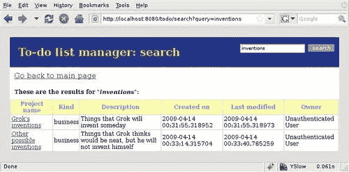
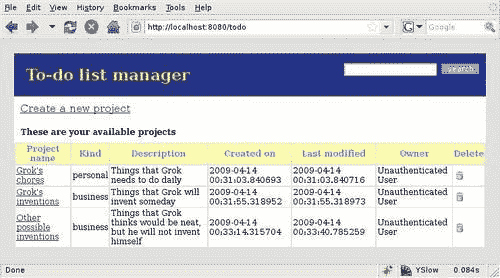

# 第六章：目录：面向对象的搜索引擎

现在我们有一个包含多个项目和列表的应用程序。随着我们开始添加更多的列表，将会有一个时刻我们需要找到特定的列表项。我们可能想要找到所有包含特定单词的项目，或者可能想要找到所有在特定日期完成的项目。由于所有应用程序数据都存储在 ZODB 中，我们需要一个工具来帮助我们查找其中包含的特定对象。这个工具是 Grok 默认提供的，被称为目录。

在本章中，我们将学习如何使用目录。特别是，我们将探讨以下概念：

+   目录是什么以及它是如何工作的

+   索引是什么以及它们是如何工作的

+   在目录中存储数据

+   在目录上执行简单查询

+   为我们的应用程序创建一个搜索界面

# 目录和索引

当我们处理少量数据时，我们可以总是查看列表中的所有元素，例如，以找到我们想要的元素。然而，当我们处理成千上万的对象时，这种方法显然无法扩展。解决这个问题的常见方法之一是使用某种类型的查找表，它将允许我们通过使用对象的一个属性快速轻松地找到特定的对象。这被称为**索引**。

**目录**是一个工具，它允许我们管理一组相关的索引，并通过使用一个或多个索引来对目录进行查询。我们可以向目录添加索引，以跟踪对象的特定属性。从那时起，每次我们创建一个新的对象时，我们都可以调用目录来索引它，它将包括所有具有索引设置的属性，并将它们包含在相应的索引中。一旦它们被包含在内，我们就可以通过使用特定的属性值来查询目录，并获取与查询匹配的对象。

# 向应用程序添加一个简单的搜索功能

目录包含对存储在 ZODB 中的实际对象的引用，每个索引都与这些对象的一个属性相关。

要在目录中搜索对象，对象需要被目录索引。如果它在对象的生命周期中的特定事件发生，这将更有效，这样它就可以在创建时和修改时被索引。

由于在使用 ZODB 时，通过目录处理搜索是最佳方式，因此 Grok 附带了一个类，允许我们轻松地连接到目录、创建索引和执行搜索。这个类被称为`grok.Indexes`，允许我们定义索引并将我们的应用程序对象与适当的生命周期事件挂钩，以实现自动索引。

## 定义一个简单的索引

让我们定义一个简单的索引，用于项目的`title`属性，并展示如何通过使用它来在目录上执行搜索：

```py
class ProjectIndexes(grok.Indexes):
grok.site(ITodo)
grok.context(IProject)
title = grok.index.Text()

```

我们将创建一个针对`Project`类的索引，因此我们将我们的类命名为`ProjectIndexes`。名称并不重要，因为关键是使用`grok.Indexes`作为类的基类。`grok.site`类注解用于通知 Grok 在我们的应用程序中哪种类型的对象将使用这里定义的索引。

接下来，我们需要告诉 Grok 哪些对象在修改时将被自动索引。这是通过使用`grok.context`并使用类或接口作为参数来完成的。在这种情况下，我们选择`IProject`作为将标记要索引的对象的接口。

最后，我们定义索引本身。在这个例子中，我们希望`title`属性的全部文本都是可搜索的，因此我们将使用`Text`索引。我们很快就会详细介绍索引的类型。现在，只需注意将要被索引的属性与索引的名称相同，在这种情况下意味着项目模型中的`title`属性将在这个目录中被索引。也有可能将索引命名为与要索引的属性不同的名称，但那时我们需要使用关键字参数`attribute`来指定实际的属性名称，如下所示：

```py
project_title = grok.index.Text(attribute='title')

```

就这样。仅仅通过在这个类中声明索引，Grok 就会自己创建目录并将索引附加到它上面，同时还会跟踪何时需要重新索引对象。

## 创建搜索视图

现在，我们将创建一个搜索视图，以便我们可以看到目录的实际应用。首先，让我们看一下视图代码：

```py
class TodoSearch(grok.View):
grok.context(Todo)
grok.name('search')
def update(self,query):
if query:
catalog = getUtility(ICatalog)
self.results = catalog.searchResults(title=query)

```

这是一个主应用程序的视图，命名为 search。重要的是`update`方法。我们接收一个作为参数的查询，它代表了用户在项目标题中寻找的文本。在我们能够执行搜索之前，我们必须先获取实际的目录。请注意，此时的目录已经包含了我们之前为`Project`定义的索引。我们不需要做任何其他事情来将它们与目录连接起来；Grok 会处理所有管道。

在我们获取到`catalog`对象之后，我们可以通过使用`searchResults`方法来搜索它，该方法接受键/值对，其中包含索引名称和查询值。在这种情况下，我们将请求中传入的查询传递给`title`索引，这样我们就能得到所有标题中包含此查询文本的项目，作为结果。

你可能还记得，我们之前提到过，接口除了对文档和属性自省有用之外，对于处理组件架构也非常有帮助。在底层，Grok 包含一个注册表，它跟踪所有对象的接口声明，这样就可以通过查询接口来找到对象。目录总是实现`ICatalog`接口，该接口位于 Grok 附带`zope.app.catalog.interfaces`包中。

由于 Grok 通过不强制我们实例化目录并手动添加和填充索引来简化我们的生活，我们无法控制代码执行此操作的部分。那么我们如何找到它呢？通过使用注册表，我们可以查询实现`ICatalog`接口的对象，这将是我们正在寻找的目录。

这正是`zope.component`包中的`getUtility`方法所做的事情。因此，在调用此方法之后，我们将拥有由我们的`catalog`变量引用的目录。这看起来可能是一种绕弯子的机制来获取目录。为什么不直接让 Grok 定义一个全局目录并直接使用它呢？好吧，我们可以用另一个或两个问题来回答：如果我们需要多个目录怎么办？或者如果我们决定用我们自己的目录替换 Grok 创建的目录怎么办？当使用接口和组件注册时，我们可以处理这些情况，并且代码几乎不需要更改。

## 创建一个模板来显示搜索结果

一旦我们在`update`方法的最后一行将结果放置在视图中，我们需要一个模板来显示这个结果。在`app_templates`目录内创建一个名为`todosearch.pt`的模板。首先是标题，包括我们的样式表：

```py
<html>
<head>
<title tal:content="context/title">To-Do list manager</title>
<link rel="stylesheet" type="text/css" tal:attributes="href static/styles.css" />
</head>

```

接下来，我们将在页面的顶部标题内添加一个搜索框。我们使用`tal:attributes`将文本输入值设置为之前搜索的内容，或者如果之前没有搜索，则留空。

表单操作设置为调用我们之前定义的搜索视图：

```py
<body>
<div id="appheader">
<form id="search" tal:attributes="action python:view.url('search')">
<input type="text" name="query" tal:attributes="value request/query|nothing" />
<input class="new_button" type="submit" value="search" />
</form>
<h1 id="apptitle" tal:content="string:${context/title}: search"> To-Do list manager </h1>
</div>
<p class="create">
<a tal:attributes="href python:view.url(context)"> Go back to main page </a>
</p>

```

现在我们来到了问题的关键。回想一下，在视图中我们通过标题进行了搜索，并定义了一个名为`results`的属性。现在我们可以在模板中使用这些结果。首先，我们需要确保我们有东西可以展示，如果没有，我们将显示一条消息说明这一点：

```py
<h2 tal:condition="not:view/results|nothing">There were no results.</h2>

```

接下来，如果有结果，我们将准备一个带有正确标题的表格，并使用`tal:repeat`来遍历结果。视图变量`results`包含所有标题与查询匹配的项目，因此我们遍历这些结果，并在与仪表板相似的表格中简单地显示它们的所有属性。

```py
<div class="projects" tal:condition="view/results|nothing">
<h2>These are the results for "<i tal:content="request/query"></i>":</h2 >
<table>
<tr>
<th>Project name</th>
<th>Kind</th>
<th>Description</th>
<th>Created on</th>
<th>Last modified</th>
<th>Owner</th>
</tr>
<tr tal:repeat="project view/results">
<td>
<a href="" tal:attributes="href python:view.url(project)" tal:content="project/title">title</a>
</td>
<td tal:content="project/kind">type</td>
<td tal:content="project/description">type</td>
<td tal:content="project/creation_date">type</td>
<td tal:content="project/modification_date">type</td>
<td tal:content="project/creator">type</td>
</tr>
</table>
</div>
</body>
</html>

```

现在我们可以创建一个新的应用程序实例在 Grok 管理 UI 中，并定义一些项目，以便我们可以看到搜索是如何工作的。我们需要定义一个新的应用程序的原因是，索引只有在安装应用程序时才会创建。如果我们的`ProjectIndexes`类在应用程序创建后被添加，实际上将不会做任何事情。请看下面的截图，以了解搜索结果是如何显示的：



# 简短的偏离：为搜索结构化我们的应用程序

现在我们已经尝试了目录搜索的基本操作，我们需要对我们的应用程序进行一些重构，以便与目录良好地协同工作，因为我们的待办事项没有所有我们可能需要的属性来使搜索足够强大。例如，我们肯定会通过日期来搜索它们，最终通过用户来搜索。

让我们稍作停顿，思考一下我们的应用程序想要走向何方。如果我们将要管理“项目”，我们需要在我们的模型中添加一些更多的属性。我们之前没有关心这个问题，但随着我们应用程序的复杂性增加，有一个清晰的计划变得更加重要。

我们应用程序的最高级单元将是一个项目。就我们的目的而言，一个*项目*是一系列相关待办事项的集合。我们需要存储项目的创建日期以及最后一次修改日期。当一个项目的所有列表中的所有事项都被勾选时，该项目即为“完成”。

项目可以有所有者和成员。成员是分配了一个或多个事项的用户；所有者是成员，他们还可以添加、编辑或删除列表和事项。我们还没有看到 Grok 中用户管理的工作方式，但我们将看到它将在下一章中，所以现在我们只需存储项目的创建者。

一个待办事项列表可以有任意数量的事项。我们还将存储列表的创建日期。一个事项将有一个完成日期以及一个创建日期。我们还将跟踪谁执行了这些操作。

在上一章中，我们使用接口模式作为基础自动构建了表单。当时，我们只为`Project`类添加了一个接口。让我们完成这项工作，并为其他类做同样的事情。

我们正在处理不同类型的对象，但肯定有一些属性在它们中的大多数都会用到。例如，每个项目、列表和事项都将有一个创建者和创建日期。我们希望避免在每个接口定义中重复这些属性，因此我们将为它们创建一个通用接口，并让所有其他类实现这个接口。

我们之前在处理表单时简要讨论了接口，并看到一个类可以通过使用`grok.implements`类注解来承诺实现一个接口。然而，一个类并不局限于实现单个接口。实际上，一个类可以实现的接口数量是没有限制的。这对我们来说将是有用的，因为我们的所有类都可以实现通用的元数据接口以及它们自己的特定接口。

我们重构后的模型将类似于下面的代码。首先，我们的共享属性接口：

```py
class IMetadata(interface.Interface):
creator = schema.TextLine(title=u'Creator')
creation_date = schema.Datetime(title=u'Creation date')
modification_date = schema.Datetime(title=u'Modification date')

```

主要应用程序类不需要使用元数据模式；只使用它自己的模式：

```py
class ITodo(interface.Interface):
title = schema.TextLine(title=u'Title',required=True)
next_id = schema.Int(title=u'Next id',default=0)
class Todo(grok.Application, grok.Container):
grok.implements(ITodo)
title = u'To-do list manager'
next_id = 0
def deleteProject(self,project):
del self[project]

```

我们在`grok.implements`调用之后向模式中添加了`title`和`next_id`，并为类设置了默认值。

现在看看`Project`类：

```py
class IProject(interface.Interface):
title = schema.TextLine(title=u'Title', required=True, constraint=check_title)
kind = schema.Choice(title=u'Kind of project', values=['personal', 'business'])
description = schema.Text(title=u'Description', required=False)
next_id = schema.Int(title=u'Next id', default=0)
class Project(grok.Container):
grok.implements(IProject, IMetadata)
next_id = 0
description = u''
def addList(self, title, description):
id = str(self.next_id)
self.next_id = self.next_id+1
self[id] = TodoList(title, description)
def deleteList(self, list):
del self[list]

```

在这个情况下，我们定义了`Project`模式，然后告诉 Grok 这个类将使用这个模式和之前定义的元数据模式。这相当简单：我们只需将两个接口定义作为参数传递给`grok.implements`。

当向应用程序添加新项目时，我们将使用新属性，如下所示：

```py
@grok.action('Add project')
def add(self,**data):
project = Project()
self.applyData(project,**data)
id = str(self.context.next_id)
self.context.next_id = self.context.next_id+1
self.context[id] = project
project.creator = self.request.principal.title
project.creation_date = datetime.datetime.now()
project.modification_date = datetime.datetime.now()
return self.redirect(self.url(self.context[id]))

```

在创建新项目并将表单数据应用于它之后，我们为日期和创建者设置值。请记住，接口是信息性的。我们从不要求使用接口模式中的所有字段，但能够为了文档目的而引用模式是非常方便的。在某些情况下，它被用来使用一个或多个字段生成表单。顺便提一下，日期分配发生的事情可能非常清楚，但`self.request.principal.title`这一行可能看起来有点奇怪。**principal**是 Grok 中的一个用户，其标题是这个用户的字符串描述。

关于我们模型重构的介绍到此为止。以下是最后的两个模型：

```py
class ITodoList(interface.Interface):
title = schema.TextLine(title=u'Title',required=True, constraint=check_title)
description = schema.Text(title=u'Description',required=False)
next_id = schema.Int(title=u'Next id',default=0)
class TodoList(grok.Container):
grok.implements(ITodoList, IMetadata)
next_id = 0
description = u''
def __init__(self,title,description):
super(TodoList, self).__init__()
self.title = title
self.description = description
self.next_id = 0
def addItem(self,description):
id = str(self.next_id)
self.next_id = self.next_id+1
self[id] = TodoItem(description)
def deleteItem(self,item):
del self[item]
def updateItems(self, items):
for name,item in self.items():
if name in items:
self[item].checked = True
else:
self[item].checked = False
class ITodoItem(interface.Interface):
description = schema.Text(title=u'Description',required=True)
checked = schema.Bool(title=u'Checked',default=False)
class TodoItem(grok.Model):
grok.implements(ITodoItem, IMetadata)
checked = False
def __init__(self,item_description):
super(TodoItem, self).__init__()
self.description = item_description
self.checked = False
def toggleCheck(self):
self.checked = not self.checked

```

现在我们已经添加了所需的属性和接口，让我们创建一个主页模板，我们可以一眼看到所有项目及其属性，以及每个项目的链接。这将是我们应用程序的仪表板。在此过程中，我们还在顶部添加了一个搜索框。我们将首先添加仪表板的视图：

```py
class DashBoard(grok.View):
grok.context(Todo)
grok.name('index')

```

现在，对于模板，调用`dashboard.pt`文件并将其放置在`app_templates`中。注意我们使用名称`index`，这样它将成为应用程序的默认视图：

```py
<html>
<head>
<title tal:content="context/title">To-Do list manager</title>
<link rel="stylesheet" type="text/css" tal:attributes="href static/styles.css" />
</head>
<body>
<div id="appheader">
<form id="search" tal:attributes="action python:view.url('search')">
<input type="text" name="query" />
<input class="new_button" type="submit" value="search" />
</form>
<h1 id="apptitle" tal:content="context/title"> To-Do list manager</h1>
</div>
<p class="create"><a href="add">Create a new project</a></p>
<h2 tal:define="projects context/values" tal:condition="projects"> These are your available projects</h2>
<div class="projects">
<table>
<tr>
<th>Project name</th>
<th>Kind</th>
<th>Description</th>
<th>Created on</th>
<th>Last modified</th>
<th>Owner</th>
<th>Delete</th>
</tr>
<tr tal:repeat="project context/values">
<td>
<a href="" tal:attributes="href python:view.url(project)" tal:content="project/title">title</a>
</td>
<td tal:content="project/kind">type</td>
<td tal:content="project/description">type</td>
<td tal:content="project/creation_date">type</td>
<td tal:content="project/modification_date">type</td>
<td tal:content="project/creator">type</td>
<td>
<a tal:define="url python:view.url('deleteproject')" tal:attributes="href string:${url}?project=${project/__name__}">

</a>
</td>
</tr>
</table>
</div>
</body>
</html>

```

模板非常直接。我们只需使用`context/values`调用获取所有项目，然后遍历结果，在表格中显示所有属性。模板可以在以下屏幕截图中看到：



# 回到搜索：使用多个索引

让我们简要回顾一下在开始重新组织代码之前我们在搜索方面的位置。在使用 Grok 中的目录时，要理解的关键点是索引定义了我们能执行哪些类型的搜索。在我们的例子中，我们使用了`Text`索引来搜索`title`属性，而这个索引的 Grok 上下文是`Project`模型。这意味着即使一个项目有多个属性，我们目前也只能在标题中进行搜索。

当然，我们不仅限于使用一个索引。我们可以添加任意数量的索引，甚至可以为对象的每个属性添加一个。让我们在`ProjectIndexes`类中立即在标题之后添加一个用于`description`的索引：

```py
description = grok.index.Text()

```

注意，唯一改变的是索引名称，它指向要索引的实际属性。为了保持简单，我们可以使用以下查询：

```py
self.results = catalog.searchResults(title=query, description=query)

```

我们将 `query` 参数传递给两个索引，因为我们只有一个可以容纳一个参数的文本框。结果将包括所有标题和描述与查询中指定的值匹配的项目。如果我们有几个参数，我们可以为每个索引传递不同的值，并且我们会得到所有索引都匹配的所有条目。

让我们考虑在这个应用程序中我们希望搜索框如何工作。理想的情况是尽可能全面，这样我们就可以输入一个或两个词，让目录查看不同的索引以找到结果。例如，如果可以对 `description` 或 `title` 索引执行文本搜索，并且目录返回所有在查询中匹配这些索引的条目，那就很好了。由于这是一个常见的情况，Grok 提供了一个通常很有用且易于实现的解决方案。基本上，我们可以定义一个方法，它可以收集所有属性的信息，并将收集到的信息作为单个索引返回。

首先，我们在接口中添加一个空的方法定义。这样做既是为了记录方法，也是为了让 `grok.Indexes` 类在我们声明其名称为索引时找到该属性。记住，项目索引与 `IProject` 接口相关联，因此这里定义的每个属性或方法都可以用作搜索索引。

```py
class IProject(interface.Interface):
title = schema.TextLine(title=u'Title', required=True, constraint=check_title)
kind = schema.Choice(title=u'Kind of project', values=['personal', 'business'])
description = schema.Text(title=u'Description', required=False)
next_id = schema.Int(title=u'Next id', default=0)
def searchableText():
"""return concatenated string with all text fields to search"""

```

注意方法定义内部缺少 `self` 参数。这个参数不是必需的，因为我们不是定义一个类，而是一个接口。通常，我们会在定义体的注释中包含对方法的描述。

然后，我们在 `ProjectIndexes` 类中将此方法的名称作为一个索引添加，如下所示：

```py
searchableText = grok.index.Text()

```

Grok 使用接口定义来查找具有该名称的方法或属性。如果是一个方法，它将在索引时被调用，因此这里发生的情况是我们正在通知 Grok，通过调用其自身的 `searchableText` 方法，一个项目的全文条目将可用。这个方法在 `Project` 类中定义如下：

```py
def searchableText(self):
return self.title+self.description

```

这个方法非常简单。我们只需将 `title` 和 `description` 属性作为单个字符串返回，这样索引实际上将包括这两个字段。通过使用新的 `searchableText` 索引查询目录，我们可以同时搜索这两个字段：

```py
self.results = catalog.searchResults(searchableText=query)

```

这就完成了对这个要求的覆盖，但正如我们所看到的，这种方法可以用来让 `index` 方法返回任何类型的内容，这给了我们足够的自由来创建我们可能需要的任何数量的组合索引。
