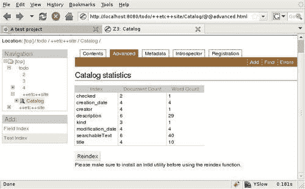

# 第七章：索引不同类型的对象

到目前为止，我们只能搜索`Project`类的标题和描述字段，没有更多。列表和项目也有描述字段，所以如果我们的简单搜索查询也能在列表及其项目内部进行搜索，那就很好了。

目前，我们使用`IProject`作为搜索的上下文。`context`类注解不接受超过一个参数，所以我们不能只是传递`ITodoList`和`ITodoItem`就完成了。这正是接口概念可以发挥作用的地方。我们可以定义一个通用的搜索接口，并让所有我们的对象实现它。它们甚至不需要提供每个属性：

```py
class ISearchable(interface.Interface):
title = interface.Attribute('title')
kind = interface.Attribute('kind')
description = interface.Attribute('description')
creator = interface.Attribute('creator')
creation_date = interface.Attribute('creation date')
modification_date = interface.Attribute('modification date')
checked = interface.Attribute('checked')
def searchableText():
"""return concatenated string with all text fields to search"""

```

注意，我们不是使用模式来定义属性，而是简单地使用`interface`包中的`Attribute`类。我们不会从这个接口生成表单，因此只需描述其属性而无需担心字段属性即可轻松完成。

一旦我们定义了这个接口，并将我们希望在目录中索引的所有属性包含在内，我们只需声明每个模型实现它即可。例如：

```py
class Project(grok.Container):
grok.implements(IProject, IMetadata, ISearchable)

```

然后，我们将`context`注解参数替换掉，以便也能使用它。这非常强大，意味着任何通过`grok.implements(ISearchable)`类注解声明自己可搜索的对象都将被 Grok 自动索引，或者`catalog.searchResults`的调用将考虑它们。

```py
class ProjectIndexes(grok.Indexes):
grok.site(ITodo)
grok.context(ISearchable)
title = grok.index.Text()
description = grok.index.Text()
searchableText = grok.index.Text()
creator = grok.index.Field()
modification_date = grok.index.Field()
creation_date = grok.index.Field()
checked = grok.index.Field()

```

注意我们现在使用`ISearchable`作为上下文，并创建了所有剩余的我们可以使用的索引。由于这些索引将包含对不同类型模型的引用，我们在每个模型中添加了一个`content_type`属性来保存它所代表的模型类型。例如，以下是改进的`TodoList`类定义。我们将`ISearchable`添加到`grok.implements`声明中，这样我们的搜索视图就可以同时处理待办事项和项目。

```py
class TodoList(grok.Container):
grok.implements(ITodoList, IMetadata, ISearchable)
next_id = 0
description = u''
content_type = 'list'
def __init__(self,title,description,creator):
super(TodoList, self).__init__()
self.title = title
self.description = description
self.next_id = 0
self.creator = creator
self.creation_date = datetime.datetime.now()
self.modification_date = datetime.datetime.now()
def searchableText(self):
return self.title+self.description

```

再次，我们实现了`ISearchable`，这标志着`TodoList`模型可索引。然后我们定义`content_type`为`list`，这样当搜索结果包含多种类型的对象时，我们可以通过查看此属性来找出其中是否有一个是列表。注意，其余的元数据属性现在在创建时通过`__init__`方法分配了一些值，以便结果显示完整。

最后，定义了全文搜索的`searchableText`方法。在这种情况下，代码与`Project`类中同名方法的代码相同，但它可能不同，正如在未在此处显示的`TodoItem`类中所示。

# 目录管理界面

当你的目录开始增长时，找出它有多少对象以及每个索引的填充情况可能很有用。Grok 包含一个用于对目录进行简单内省的包，这允许我们查看内部情况。

目录 UI 未集成到 Grok 管理 UI 中。但是，我们可以通过使用直接 URL 从 Zope 端访问目录。让我们这样做。在`todo`应用程序中创建一些项目和列表，然后通过浏览器访问：`http://localhost:8080/todo/++etc++site/Catalog/@@advanced.html`。浏览器中会显示项目索引列表和一些统计数据，如下面的截图所示：



这是目录 UI 的统计屏幕，所以我们在这里不能做太多，除了查看数字，但它确实让我们对我们的应用程序数据在目录中的存储有了很好的认识。

有其他标签页，其中最重要的是**内容**标签页，从这里我们可以访问每个索引的信息屏幕。

# 索引类型

如我们从`ProjectIndexes`类的代码中可以看到，存在多种索引类型。到目前为止，我们已经使用了一个`文本`索引，它允许我们进行全文搜索。然而，并非所有搜索都是平等的；文本搜索允许我们在字段值内部查找单词或单词片段，但在某些情况下，我们需要精确匹配字段值或完全不匹配。

Grok 提供了三个现成的索引类，以下表格中进行了总结：

| 索引 | 描述 |
| --- | --- |
| `字段` | 与整个字段匹配。用于索引可排序的值和查询范围。支持排序和限制结果数量。 |
| `文本` | 支持字段的全文本搜索。查询可以包括'and'和'or'布尔运算符。还可以通过使用星号（通配符）来搜索字符串片段。 |
| `集合` | 支持字段的关键词搜索。该索引允许搜索包含任何一组值、一组值的所有值或一组值之间的文档。 |

我们现在不会在我们的应用程序中添加其他索引的搜索选项，但这里有一些使用它们的示例。为了完整性，让我们从`文本`字段开始：

在标题中查找包含单词'caveman'的对象：

```py
results = catalog.searchResults(title='caveman')

```

在描述中查找包含'spear'或'club'的所有对象：

```py
results = catalog.searchResults(description='spear or club')

```

在标题中查找以'cave'开头的任何单词的对象（如 caveman、caved、caveat 等）：

```py
results = catalog.searchResults(title='cave*')

```

`字段`索引的工作方式不同。查询时必须始终使用元组，即使我们只对单个值感兴趣。如果我们想找到由用户'Manager'创建的所有对象：

```py
results = catalog.searchResults(creator=(u'Manager', u'Manager'))

```

2009 年 3 月 31 日至今天创建的所有对象：

```py
from datetime import datetime
results = catalog.searchResults(creation_date=(datetime(2009,3,31), datetime.now())

```

`集合`索引允许我们在值列表中找到匹配项，这对于查找具有一些关键词或标签的对象很有用，但这些对象不一定应用了相同的标签列表。

# 摘要

在本章中，我们学习了如何使用目录进行内容的搜索和分类。现在我们能够为我们的应用程序添加索引和自定义搜索查询。在下一章中，我们将关注安全性问题。
