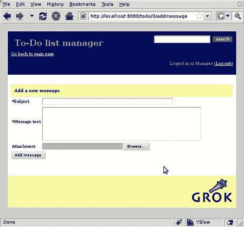
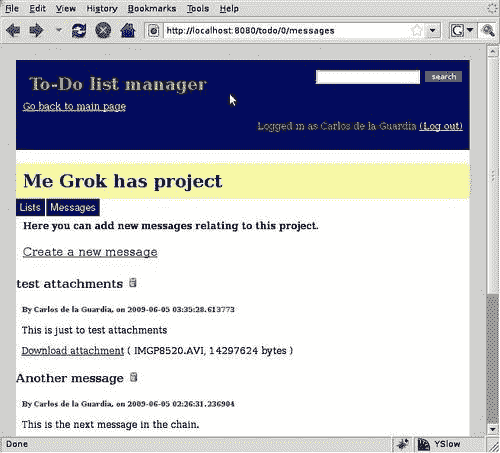
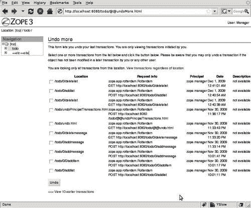
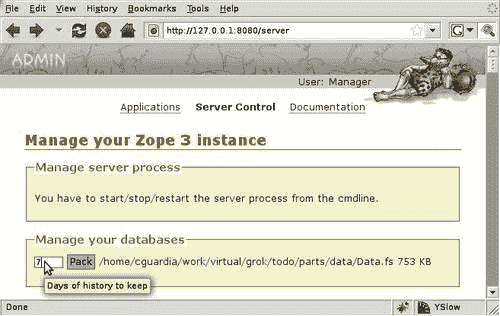

# 第九章. Grok 和 ZODB

正如我们在第一章就强调的，Grok 最重要的组成部分之一是 ZODB。能够透明地存储对象的能力使我们能够创建一个完整的应用程序，而无需考虑其数据的持久化。

虽然 Grok 在幕后处理我们应用程序需要的 ZODB 交互，但 ZODB 还能做更多的事情，我们将在本章中回顾它们。特别是，我们将看到：

+   ZODB 是如何工作的

+   ZODB 存储是什么

+   如何通过使用 Blob 支持将文件附件添加到我们的应用程序中

+   如何打包数据库以及为什么推荐这样做

+   如何在 Grok 之外使用 ZODB

# ZODB 是如何工作的

在我们深入探讨如何使用其他 ZODB 功能之前，让我们再谈谈 ZODB 是如何工作的。

简而言之，ZODB 是一个 Python 对象的持久化系统。其目标是使持久化尽可能透明，以便任何对象更改都可以自动保存到磁盘并在需要时再次读取。

ZODB 是一个对象数据库，这意味着不是根据数据模式将对象分区到一个或多个表中，而是将对象以当前状态写入数据库。在关系型数据库系统中，一旦从数据库中读取了一行数据，程序仍然需要重新组装信息列以获取一个真正的对象实例。在对象数据库系统中，当你从数据库中检索对象时，对象实例立即存在。

## 透明性

由于可以直接将对象以当前状态直接存储到数据库中，因此使对象成为 ZODB 意识所需的努力非常小。换句话说，对象是以透明的方式存储的。因此，尽管在某些情况下可能需要做更多的工作，但通常只需满足一个简单的要求：从 ZODB 提供的`persistent.Persistent`类派生子类，就可以在数据库中持久化对象。

当持久化对象的实例被修改时，它们会被 ZODB 机制标记，如果用户请求这样做，这些更改可以写入数据库。当然，可能同时会有多个修改请求。一组对存储对象的单个或多个更改被称为**事务**，当对象被写入时，我们说事务已经**提交**。

事务也可以被中止，这样自上次提交以来对对象的修改就会被遗忘。还可以回滚已提交的事务，使数据库回到之前的状态。

## ACID 属性

如果你曾经使用过关系型数据库，那么关于事务的所有讨论都应该很熟悉。你可能也知道，事务性系统需要确保数据库永远不会进入不一致的状态，它们通过支持四个属性来实现这一点，这些属性以首字母缩写词**ACID**闻名：

+   **原子性：**

    要么将事务中分组的所有修改都写入数据库，要么如果某些事情使这成为不可能，则整个事务将被中止。这确保了在发生写错误或硬件故障的情况下，数据库将保持之前的状态，避免不一致性。

+   **一致性：**

    对于写事务，这意味着如果事务会导致数据库处于不一致状态，则不允许任何事务。对于读事务，这意味着读操作将看到事务开始时的数据库一致状态，而不管当时是否正在进行其他事务。

+   **隔离：**

    当两个不同的程序对数据库进行更改时，它们将无法看到彼此的事务，直到它们提交自己的事务。

+   **耐用性：**

    这仅仅意味着一旦事务提交，数据就会被安全存储。之后的软件或硬件崩溃不会导致任何信息丢失。

## 其他 ZODB 功能

除了符合 ACID 标准外，ZODB 还提供了其他一些功能，使其成为工业强度数据管理的真正好选择。

+   **内存缓存：**

    每次从数据库读取对象时，它都会保存在内存中的缓存中，这样后续访问该对象时就会消耗更少的资源和时间。ZODB 透明地管理缓存，并自动删除长时间未访问的对象。缓存的大小可以配置，以便具有更多内存的机器可以更好地利用它。

+   **撤销：**

    ZODB 提供了一个非常简单的机制来回滚任何已提交的事务，这是因为它跟踪每个事务之前和之后的数据库状态。这使得即使在之后提交了更多事务的情况下，也可以撤销事务中的更改。当然，如果涉及此事务且需要撤销的对象在后续事务中已更改，则由于一致性要求，将无法撤销。

+   **历史：**

    由于每个事务都保存在数据库中，因此可以查看对象在之前事务中的状态，并将其与当前状态进行比较。这允许开发者快速实现简单的版本控制功能。

+   **保存点：**

    由于在单个事务中进行的更改在事务提交之前都保存在内存中，因此在同时修改大量对象（例如，一个修改 100,000 个对象属性的自循环）的事务中，内存使用量可能会急剧增加。保存点允许我们在事务完成之前提交事务的一部分，这样更改就会被写入数据库，并且释放更改所占用的内存。这些保存点中的更改实际上只有在整个事务完成时才会真正提交，因此如果事务被中止，任何保存点也将回滚。

+   **二进制大对象（Blob）：**

    二进制大对象，如图像或办公文档，不需要 ZODB 提供的所有版本控制功能。实际上，如果它们被当作常规对象属性处理，blob 会大大增加数据库的大小，并通常减慢速度。这就是为什么 ZODB 使用特殊的 blob 存储器，这使得处理高达几百兆字节的大文件而不会出现性能问题成为可能。

+   **打包：**

    正如我们所见，ZODB 保留了存储在其中的所有对象的版本。这意味着数据库随着每个对象的修改而增长，可以达到非常大的大小，这可能会减慢速度。ZODB 允许我们通过称为打包数据库的程序来删除存储对象的旧版本。打包例程足够灵活，可以只删除超过指定天数的老对象，保留较新的版本。

+   **可插拔存储：**

    默认情况下，ZODB 将数据库存储在一个单独的文件中。管理此文件的程序称为文件存储。然而，ZODB 是以这种方式构建的，可以无需修改即可插入其他存储。这个特性可以用来在其他媒体或格式中存储 ZODB 数据，我们将在后面更详细地看到。

## ZEO

**ZEO** 代表 **Zope Enterprise Objects**，是 ZODB 的网络存储。通过使用 ZEO，任何数量的 Grok 实例都可以连接到同一个 ZODB。ZEO 可以用来提供可伸缩性，因为负载可以在多个 ZEO 客户端之间分配，而不仅仅是单个客户端。

我们将在第十四章中了解更多关于 ZEO 的内容。

# 使用 ZODB

要存储对象，ZODB 使用一个根对象，这基本上是其他对象的容器。包含的对象反过来也可以作为容器，这意味着 ZODB 的结构可以用树来表示。

## 持久化规则

并非所有对象修改都可以自动检测并透明地写入数据库。正如我们在本书前面所看到的，有一些规则关于如何使对象持久化以及需要额外工作的条件：

+   从 `persistent.Persistent`（ZODB 代码中定义的一个类）或其子类继承。

+   类实例必须以层次结构相互关联。ZODB 有一个根对象，该对象包含其他对象，这些对象又可以包含进一步的对象，从而形成一个树。

+   当修改非持久化自身的持久化对象的可变属性时，持久化机制必须通过将实例的特殊 `_p_changed` 属性设置为 `True` 来通知。

## 遍历

要访问数据库中的特定对象，ZODB 总是从根对象开始，递归地进入任何容器，直到找到该对象。这被称为 **遍历**，因为访问的对象路径上的每个包含对象都必须被触及才能到达它。

这意味着可以通过其在数据库中的路径来识别唯一的对象。按照设计，URL 路径可以很好地映射到 ZODB 结构，因此当我们有 Grok 中的 URL 时，其路径的每个元素通常代表一个必须遍历以到达特定对象的对象。例外情况有时是路径的最后一个元素，它也可以代表一个视图。

## Grok 如何使用 ZODB

到目前为止，我们还没有直接与 ZODB 打交道，因为 Grok 已经设置好了一切，以便利用 ZODB 的透明性。Grok 的模型和容器已经继承自`persistence.Persistent`，因此对我们模型对象的任何修改都会自动保存到数据库中。

此外，Grok 的 URL 解析机制使用遍历来获取持久化对象，因此我们不需要跟踪我们放置了什么，以便 Grok 能为我们提供正确的对象。

然而，Grok 无法帮助我们避免 ZODB 对可变对象更改进行持久化机制信号的要求。记住，每当对可变属性进行更改时，应用程序需要通知 ZODB 已发生更改。这是通过将实例的特殊`_p_changed`属性设置为`True`来完成的：

```py
self.context.p_changed_ = True

```

如果您使用常规 Python 可变对象，如列表和字典，您必须记住这个规则，这不是很多要求，但仍可能容易忘记。正是出于这个原因，ZODB 包包括这些内置 Python 类型的几个替代品：

```py
From persistent.list import PersistentList
From persistent.dict import PersistentDict

```

这两种类型与内置 Python 类型完全等价，除了它们在需要时负责设置`p_changed`。如果您在应用程序中需要列表或字典，请考虑使用它们。

# 向我们的应用程序添加 Blob 支持

许多应用程序需要允许上传和存储外部文件，无论是办公文档、图像、多媒体还是其他类型的文件。通过使用 ZODB 处理这些文件可能会在资源和带宽方面造成高昂的成本，因此现在展示如何利用 ZODB Blob 支持会更好。

## 向项目中添加消息

目前，我们应用程序中的项目只有任务。当我们的应用程序是单用户应用时，这已经足够了，但现在多个用户可以登录并具有不同的角色，一个用于与其他用户沟通任务状态的机制将很有用。

让我们在项目视图中添加一个**消息**标签，任何人都可以发布消息。消息将包含标题、消息文本，并且可选地允许用户上传文件。

### megrok.form 包

我们可以添加一些代码来使 Grok 表单字段能够使用 blob，但有时，找到已经做了我们需要的包并集成到我们的项目中要容易得多。

由于 Grok 使用 Zope 工具包，有数百个包可供选择。还有许多专门为 Grok 创建的包。只需访问 Python 包索引（PyPI）页面，你就会看到有很多包可供下载。

在这种情况下，有一个包正好符合我们的需求，那就是使 blob 的使用变得简单。这个包叫做`megrok.form`，我们将将其集成到我们的项目中。它可以在[`pypi.python.org/pypi/megrok.form`](http://pypi.python.org/pypi/megrok.form)找到。

### 将外部包添加到我们的项目中

使用 Grok 集成 PyPI 上的包相当简单。第一步是将它添加到项目安装需求中，这些需求在项目根目录下的`setup.py`文件中指定。找到这个文件，并将`install_requires`赋值更改为如下所示：

```py
install_requires=['setuptools',
'grok',
'grokui.admin',
'z3c.testsetup',
'megrok.form',
# Add extra requirements here
],

```

接下来，从命令行运行`bin/buildout`。`megrok.form`包及其依赖项将被下载并安装到项目中。在这种情况下，我们添加了`megrok.form`，但当然，我们也可以从 PyPI 中选择任何其他包并以相同的方式将其添加到我们的项目中。

### 在 Grok 中如何配置 blob 支持

默认情况下，Grok 预先配置为使用 blob 存储，因此利用它很简单。如果你查看我们项目`parts/etc/`目录中的`zope.conf`文件，你可以看到如何完成此配置。相关部分看起来像这样：

```py
<blobstorage>
<filestorage>
path /<your directory>/todo/parts/data/Data.fs
</filestorage>
blob-dir /<your directory>/todo/parts/data/blobs
</blobstorage>

```

### 消息类和模式

现在我们已经拥有了所需的支撑包和配置，让我们开始设置**消息**标签。我们将快速浏览代码，因为大多数概念已经在我们的应用中之前使用过了。

首先，我们添加一个`Message`类来存储消息及其附件。这个类的上下文将是`Project`类，因为我们希望消息按项目存储。当然，我们首先定义类的接口：

```py
class IMessage(interface.Interface):
subject = schema.TextLine(title=u'Subject')
message = schema.Text(title=u'Message text')
attachment = BlobFile(title=u'Attachment',required=False)

```

我们保持简单，只添加`subject, message`和`attachment`字段。请注意，我们将存储附件的字段声明为`BlobFile`。为了使此声明生效，我们当然需要在文件顶部包含以下导入：

```py
from megrok.form.fields import BlobFile

```

现在，找到实际的类定义，我们只是实现接口，并添加一个`searchableText`方法，以便消息出现在搜索结果中：

```py
class Message(grok.Model):
grok.implements(IMessage, IMetadata, ISearchable)
subject = u''
message = u''
content_type = 'message'
def searchableText(self):
return self.subject+self.message

```

我们需要一个用于创建消息和上传附件的表单，所以这是我们下一步要做的事情。这将创建一个`add_message`表单，使用它需要`todo.changeitems`权限。字段来自之前定义的接口，我们使用第五章中创建的定制编辑表单模板。

```py
class AddMessageForm(grok.AddForm):
grok.context(Project)
grok.name('add_message')
grok.require('todo.changeitems')
form_fields = grok.AutoFields(IMessage)
label = "Add a new message"
template = grok.PageTemplateFile('custom_edit_form.pt')

```

表单的关键部分是添加操作，在这里创建消息并使用表单中的值设置其属性。请注意，消息和列表都使用相同的 `next_id` 计数器作为它们的名称，因此 `content_type` 类属性变得非常重要。这将用于根据视图获取仅消息或仅列表：

```py
@grok.action('Add message')
def add(self,**data):
message = Message()
message.creator = self.request.principal.title
message.creation_date = datetime.datetime.now()
message.modification_date = datetime.datetime.now()
message.project = self.context
message.project_name = self.context.__name__
self.applyData(message,**data)
id = str(self.context.next_id)
self.context.next_id = self.context.next_id+1
self.context[id] = message
return self.redirect(self.url('messages'))
def setUpWidgets(self, ignore_request=False):
super(AddMessageForm,self).setUpWidgets(ignore_request)
self.widgets['subject'].displayWidth = 50
self.widgets['message'].height = 12

```

您可以在以下屏幕截图中看到这个表单的实际效果：



### 消息视图小部件

接下来，我们创建用于显示消息的视图和视图小部件。视图通过使用内容类型执行目录搜索。当然，我们首先需要将 `ProjectIndexes` 类（来自第六章）添加到我们的类中，以便它被索引，因为现在项目内部可以存储两种不同类型的对象（消息和列表）。我们还必须将 `todo` 列表的目录搜索更改为使用这个新索引。以下是视图代码：

```py
class ProjectMessages(grok.View):
grok.context(Project)
grok.name('messages')
grok.require('todo.view')
grok.template('master')
def update(self):
catalog = getUtility(ICatalog)
self.messages = catalog.searchResults (content_type=('message','message'), project_name=(self.context.__name__,self.context.__name__))

```

对于视图小部件，我们只需定义一个模板并将视图设置为刚刚创建的那个：

```py
class ProjectMessagesViewlet(grok.Viewlet):
grok.viewletmanager(Main)
grok.context(Project)
grok.template('projectmessages_viewlet')
grok.view(ProjectMessages)

```

### 消息列表模板

项目消息视图小部件使用一个名为 `projectmessages_viewlet` 的新模板。我们将在顶部显示几个链接，它们将大致像标签一样工作，用于在列表视图和消息视图之间切换：

```py
<div id="project">
<h1 id="apptitle" onclick="editTitle();" tal:content="context/title">To-Do list manager</h1>
<ul id="project-tabs">
<li><a tal:attributes="href python:view.url('index')" title="Project lists">Lists</a></li>
<li><a tal:attributes="href python:view.url('messages')" title="Project messages">Messages</a></li>
</ul>
<h2>Here you can add new messages relating to this project.</h2>
<p class="create"><a href="add_message">Create a new message</a></p>

```

之后，我们通过使用“重复”结构来显示消息及其内容。对于本章的目的，模板的关键部分是下载附件的链接，它使用 `view.url` 方法指向下载视图。请注意，一条消息可能不包含附件，这就是为什么带有链接的段落有一个条件来决定是否显示它：

```py
<tal:block repeat="message view/messages">
<div class="message">
<h3><span tal:replace="message/subject">subject</span>
<a tal:define="url python:view.url('deletemessage')" tal:attributes="href string:${url}?message=${message/__name__}"> </a>
</h3>
<p class="message_info" tal:content="string:By ${message/creator}, on ${message/creation_date}"> info </p>
<p tal:content="message/message">text</p>
<p tal:condition="message/attachment"> <a tal:attributes="href python:view.url(message,'download')"> Download attachment </a> ( <span tal:replace="message/attachment/filename">filename </span>, <span tal:replace="message/attachment/size">size</span> bytes ) </p>
</div>
</tal:block>
</div>

```

此外，还向项目中添加了一些 CSS 样式。这里没有显示。请检查这本书的源代码以查看它们是什么。

### 下载附件

最后一步是添加一个用于下载附件的视图。这里我们不需要显示模板；我们必须返回文件。这是如何操作的：

```py
class Download(grok.View):
grok.context(Message)
grok.require('todo.changeitems')
def update(self):
self.data = self.context.attachment.data
self.filename = self.context.attachment.filename
def render(self):
self.response.setHeader('Content-Disposition', 'attachment; filename=%s;' % self.filename)
return self.data

```

首先，我们在 `update` 方法中获取附件的文件名和文件数据。然后，在 `render` 方法中，我们将 `Content-Disposition` 响应头设置为 `attachment` 并将其传递给文件名，这样浏览器就会知道通过使用其原始名称直接下载哪个文件。最后，我们返回文件数据。

### 测试 Blob 支持

我们现在可以运行应用程序了。以下屏幕截图显示了它应该看起来像什么。尝试添加一些消息和文件，然后查看您在 `zope.conf` 文件中指定的 `blob` 目录的内容。您应该看到一个包含每个上传文件目录的 `blobs` 目录。



# 利用事务的优势

我们从本章开始就说过 ZODB 是事务性的，但到目前为止，我们还没有看到我们从中获得的好处。可能最重要的好处是能够回滚或撤销事务。

## 使用 zope.app.undo

由于 Grok 为我们处理事务提交，我们还没有机会展示它，但现在我们将看到如何撤销和重做事务。展示这一点最简单的方法是使用 PyPI 上的 `zope.app.undo` 包。我们将以与本章早期插入 `megrok.form` 相同的方式将其添加到项目中。编辑项目根目录下的 `setup.py` 文件，并添加以下代码：

```py
install_requires=['setuptools',
'grok',
'grokui.admin',
'z3c.testsetup',
'megrok.form',
'zope.app.undo',
# Add extra requirements here
],

```

现在重新运行 `bin/buildout`，让 Grok 下载并安装该包。无需其他操作即可启用它，只需重新启动应用程序。

## 测试撤销功能

创建一个 todo 应用程序实例，并添加一个项目。然后在项目中添加一个列表，标题为 `test undo`。现在删除您刚刚创建的列表。您将再次看到一个空的项目。

要撤销事务，我们必须使用之前在第六章学习目录时使用的 Grok 管理界面。将您的浏览器指向以下 URL：[`localhost:8080/todo/@@undoMore.html`](http://localhost:8080/todo/@@undoMore.html)。

您应该会看到一个事务列表，类似于下一张截图所示。屏幕显示了访问 todo 应用程序实例的最后十个事务。顶部的事务是最后提交的事务。要撤销它，只需选中左侧的复选框，然后点击屏幕底部的**撤销**按钮。

现在回到您的项目。您删除的列表神奇地又回到了那里。如果您回到列表，您会注意到撤销操作现在被列为一个事务，因此您可以通过撤销现在顶部的事务来“重做”旧事务。

“撤销”是一个强大的功能，它可以使您在应用程序用户眼中看起来像英雄。同时撤销多个事务也是可能的。然而，只有当事务操作的对象没有被后续事务修改时，才能撤销事务。这意味着在新的事务使事情复杂化之前，必须快速撤销错误。



# ZODB 维护

与任何其他数据库系统一样，ZODB 需要定期进行一些维护。可能发生的主要情况是数据库大小会增长，占用大量磁盘空间，导致某些任务变慢。

## 文件存储

如我们之前提到的，ZODB 跟踪存储对象的全部版本，这使得每次对象更改时 ZODB 都会增长。打包允许 ZODB 丢弃旧版本的对象，从而减小数据库大小。

数据库通常包含在一个名为`Data.fs`的文件中，该文件位于我们的`project`目录下的`parts/data`文件夹中。

打包是一个可能需要一些时间的操作，因此它在单独的线程上运行。在打包开始之前，会创建数据库文件的备份副本，以防万一出现问题，因此请注意，您至少需要与 ZODB 当前大小一样多的空闲磁盘空间，才能打包它。

在 Grok 中，打包数据库最简单的方法是进入管理界面并点击**服务器控制**链接。这将带您到一个控制面板，其中显示了打包当前数据库的选项（参见下一张截图）。要打包数据库，只需选择超过多少天应该删除对象修订的数字。打包过程将开始，完成后，控制面板顶部将有一条消息通知您。



## 自动打包

在大多数情况下，频繁地进行打包将是一件好事，除非出于某种原因你绝对需要跟踪每个对象的每个修订版本。例如，每周打包一次数据库可能是一个保持数据库大小可控并使备份等任务更容易、更快的好方法。

当然，每次手动打包数据库可能会给管理员带来负担，并且很容易被遗忘，因此自动执行打包操作会很有用。

打包是一个昂贵的操作，并且从 Grok 外部执行需要单独的数据库连接，这就是为什么即使我们的可扩展性需求不需要它，使用 ZEO 也是一个好主意。因为 ZEO 允许多个连接，所以可以从另一个 ZEO 客户端进行打包，而无需停止常规服务。

这个任务如此必要，以至于 Grok 安装已经提供了一个名为`zeopack`的脚本，用于通过 ZEO 打包 ZODB。它位于 Grok 主安装的`bin`目录下。要使用它，只需确保 ZEO 服务器正在运行，然后使用站点的主机和端口调用脚本：

```py
$ bin/zeopack -h localhost -p 8080 

```

可以将此脚本调用添加到 UNIX cron 脚本中，以每周或所需频率执行任务。

## 备份

与所有重要的数据处理服务一样，在使用 ZODB 时，备份被强烈推荐。具体多久进行一次备份可以根据应用程序的类型而有所不同，但应该定期进行。

Grok 安装包括一个名为`repozo`的脚本，用于简化备份。此脚本允许进行增量或完整备份，并且可以用于备份和恢复`Data.fs`文件。为了备份我们的数据库，我们可以在 Grok 主目录内创建一个名为`backups`的目录，然后使用：

```py
$ bin/repozo -B -r backups -f todo/parts/data/Data.fs 

```

`-B` 选项表示执行备份操作。`-f` 选项给出了我们想要备份的 `Data.fs` 文件的路径。第一次，`repozo` 将在 `backups` 目录（由 `-r` 选项指定）中进行完整备份。进一步的调用将导致增量备份，除非在最后一次备份后数据库已被打包。

要从 `repozo` 备份中恢复 `Data.fs` 文件，我们使用 `-R` 选项：

```py
$ bin/repozo -R -r backups -o RecoveredData.fs 

```

此命令将恢复最新的备份并将恢复的文件输出到 `RecoveredData.fs`（由 `-o` 选项指定）。也可以通过使用 `-D` 选项并指定 "yyyy-mm-dd" 格式的日期来恢复指定日期的备份。

## 在没有 Grok 的情况下使用 ZODB

ZODB 是一个非常强大的包，我们没有理由不在 Grok 之外的正常用作应用程序中使用它。事实上，许多通常使用关系型数据库（主要是因为大多数开发者都习惯了）开发的应用程序，如果使用 ZODB，甚至可以更简单。

为了展示从 Python 使用 ZODB 的简便性，我们将展示一个简单的示例。要跟随示例，只需安装 Python 并使用 `easy_install` 获取 ZODB3 egg，或者从 [`pypi.python.org/pypi/ZODB3`](http://pypi.python.org/pypi/ZODB3) 下载 ZODB 包。

创建一个名为 `zodb_demo.py` 的文件。首先，让我们创建一个小的类来处理打开和关闭到 `FileStorage` 的连接。在您的 `zodb_demo.py` 文件开始处添加以下代码：

```py
from ZODB import FileStorage, DB
import transaction
class ZODBHandler(object):
def __init__(self, path):
self.storage = FileStorage.FileStorage(path)
self.db = DB(self.storage)
self.connection = self.db.open()
self.dbroot = self.connection.root()
def close(self):
self.connection.close()
self.db.close()
self.storage.close()

```

首先，我们进行一些导入。`FileStorage` 用于定义数据库存储的文件，`DB` 是实际的 ZODB 库，而 `transaction` 用于将更改提交到数据库。

接下来，我们创建一个名为 `ZODBHandler` 的类，它将接受一个文件路径并为我们的 ZODB 初始化一个文件存储。如果传入路径的文件存在，它将被用作数据库；如果不存在，它将被创建。无论如何，我们不必担心这一点，因为 `FileStorage` 会为我们处理。有了这个，我们就有了一个可以传递给下一行的 `DB` 类的存储。之后，我们可以打开一个连接，一旦完成，我们就获取数据库的根对象并将其存储在 `dbroot` 中。从那里，我们可以像我们将要看到的那样与数据库一起工作。

我们的 ZODB 处理器做的另一件事是在我们完成使用后通过一个 `close` 方法来关闭连接和存储。

我们现在可以初始化一个数据库，并开始向其中写入数据：

```py
if __name__ == _'_main__':
db = ZODBHandler('./Data.fs')
dbroot = db.dbroot
dbroot['pi'] = 3.14159265358979323
dbroot['planet'] = 'Earth'
dbroot['primes'] = [1, 2, 3, 5, 7, 11]
dbroot['pycon'] = { 2009: 'Chicago', 2010: 'Atlanta' }
transaction.commit()

```

我们将一个路径传递给我们的处理器，该路径将在当前目录中创建一个名为 `Data.fs` 的文件。接下来，我们获取存储在那里的数据库的根对象。然后我们添加几个对象，只是为了展示任何可 pick 的 Python 对象都可以存储在数据库中。最后，我们需要提交事务，以便实际保存更改。

要从数据库中获取一个对象，我们只需通过其键来引用它，就像字典的工作方式一样：

```py
print dbroot['primes']

```

删除一个对象也非常简单：

```py
del dbroot['planet']
transaction.commit()

```

当然，大多数应用程序不会使用内置的 Python 对象，而是会创建自己的类，这些类从 `persistent.Persistent` 继承。在上述 `if` 语句之前插入以下类定义：

```py
from persistent import Persistent
class Project(Persistent):
def __init__(self, title, kind, description):
self.title = title
self.kind = kind
self.description = description

```

我们现在可以透明地将项目存储到我们的数据库中。在程序末尾追加以下行：

```py
dbroot['project 1'] = Project('test project', 'business', 'A simple test project')
dbroot['project 2'] = Project('another project', 'personal', 'a personal project')
transaction.commit()
print dbroot['project 1'].title
dbroot['project 1'].title = 'new title'
transaction.commit()

```

这是一个非常简单的例子，但希望你能看到创建有趣的 ZODB 支持的应用程序的潜力。不需要 SQL，只需普通的 Python 对象。

# 摘要

在本章中，我们更多地了解了 ZODB，并学习了如何利用其功能，例如 blob 处理。我们还了解了一些关于 ZODB 维护和需要频繁打包数据库的内容。最后，我们尝试在 Grok 之外使用 ZODB，作为一个常规的 Python 库。
