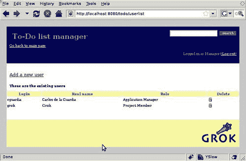

# 第十章. Grok 和关系数据库

到目前为止，我们一直在使用 ZODB 进行数据存储。正如我们在上一章中看到的，这是一个很好的解决方案。Grok 开发者真正喜欢 ZODB，并希望它在 Python 世界中得到更广泛的应用。此外，Grok 充分利用了它的力量和特性。

话虽如此，关系数据库目前是网络应用程序中最常用的持久化机制。一方面，它们是可靠的、高效的和可扩展的。它们也相当为人所熟知，许多新手网络开发者已经对 SQL 有了一些了解。

关系数据库在非网络开发项目中的一致使用也使得它们更有可能在需要访问现有信息的网络应用程序中被需要。

换句话说，ZODB 是很棒的，但一个好的网络框架需要提供足够的支持来处理关系数据库。当然，Grok 就是这样一种框架，所以在本章中，我们将了解 Grok 为关系数据库访问提供了哪些设施。以下是我们将涵盖的一些具体内容：

+   为什么 Grok 允许开发者轻松使用关系数据库很重要

+   对象关系映射器（ORM）是什么

+   如何使用 SQLAlchemy 与 Grok 结合

+   如何将我们的认证机制更改为使用关系数据库而不是 ZODB

# 对象关系映射器

Python 是一种面向对象的编程语言，Grok 严重依赖这种面向对象。在实践中，这意味着我们使用属性和方法定义模型，每个模型实例代表一个对象。因此，我们有项目或待办事项列表对象，我们的视图与它们一起工作，自由地访问它们的属性和调用它们的方法。

当我们保存对象的时候，ZODB 就派上用场了，因为我们只需抓取整个对象并将其放入其中，这就是为什么它被称为对象数据库。另一方面，关系数据库以非常不同的方式工作。它们使用表格和列来存储所有内容，通常将一个对象分成几个相关的表格。

显然，我们不能直接将我们的待办事项列表对象放入关系数据库中；即使只涉及一个表格，也需要进行一些转换。关系数据库使用 SQL 语言来接收对表格或表格的读取和写入命令，因此我们可以逐个生成对象的属性，将它们作为字符串生成一个 SQL 语句，并将其发送到数据库。然后，我们会逆向这个过程，从数据库列中重新组装对象。这实际上并不容易扩展，因此通常的解决方案是使用专门设计用于将对象拆分成表格并在查询时重新组装它们的库，透明地生成所需的 SQL 以使其工作。这些库被称为**对象关系映射器**，或简称**ORM**。

ORMs（对象关系映射）在保持代码与所使用的数据库独立方面也非常出色，因为开发者以对象的形式执行操作，ORMs 在幕后生成针对特定数据库的 SQL 语句。这使得在项目中切换数据库时，无需进行耗时的 SQL 语法更改，从而变得容易得多。

## SQLAlchemy

对于 Python 来说，有众多 ORM，但可能最受欢迎的一个是**SQLAlchemy**。其受欢迎的原因之一是，SQLAlchemy 除了是一个强大的 ORM 之外，还提供了一个数据抽象层，以平台无关的方式构建 SQL 表达式。这为开发者提供了足够的灵活性，可以在不担心数据库或 SQL 细节的情况下与模型对象一起工作，但在需要时仍然能够深入到 SQL 级别，无论是出于性能或其他原因。

SQLAlchemy 支持包括 SQLite、Postgres、MySQL、Oracle 和 MS-SQL 在内的十多种数据库。它将待处理的操作组织到队列中，并一次性批量刷新它们，提供效率和事务安全性。可以通过使用 Python 函数和表达式构建 SQL 子句，从而允许使用语言构造的完整范围。它还负责连接池管理，有助于优化系统资源的使用。

## 将 SQLAlchemy 包含到我们的 Grok 项目中

我们在上一章中已经看到了如何将来自 PyPI 的 Python 包包含到我们的项目中。只需将包添加到项目`setup.py`文件中的`install_requires`变量即可：

```py
install_requires=['setuptools',
'grok',
'grokui.admin',
'z3c.testsetup',
'megrok.form',
'SQLAlchemy',
# Add extra requirements here
],

```

之后，重新运行 buildout，包应该被包含在内：

```py
$ bin/buildout 

```

完成这些操作后，SQLAlchemy 就准备好使用了。

### 使用 SQLAlchemy

为了感受 SQLAlchemy 独立运行的方式，让我们首先直接从 Python 提示符尝试。前往项目的顶层目录，并输入以下命令：

```py
$ bin/python-console 

```

这将在命令行中启动 Python 解释器。由于我们已经运行了带有 SQLAlchemy 包的 buildout，我们应该能够从中导入：

```py
>>> from sqlalchemy import create_engine
>>> engine = create_engine('sqlite:///:memory:',echo=True) 

```

`create_engine`方法用于告诉`sqlalchemy`与哪个数据库进行交互。第一个参数被称为**连接字符串**，包含连接到数据库所需的所有信息，如数据库名称、用户名和密码。在这个例子中，我们使用 SQLite，它是从 Python 2.5 版本开始包含的一个轻量级数据库。SQLite 允许我们在内存中工作，而不是在磁盘上创建数据库。由于我们只是在测试，我们可以使用这个特性。

将`echo`参数传递值为`True`，这样我们就可以在控制台输出中看到 SQLAlchemy 生成的 SQL。

现在，我们将进行更多的导入操作：

```py
>>> from sqlalchemy import Column, Integer, String
>>> from sqlalchemy.ext.declarative import declarative_base
>>> Base = declarative_base() 

```

`Column`类用于定义表列。`Integer`和`String`是列数据类型。我们将使用它们来定义我们的表。

接下来，我们导入`declarative_base`，这允许我们创建一个用于与我们的对象模型一起使用的基类。要使用它，我们必须调用它并将结果赋值给将作为我们模型基类的变量。

我们现在准备好创建一个模型：

```py
>>> class User(Base):
... __tablename__ = 'users'
... id = Column(Integer, primary_key=True)
... name = Column(String)
... realname = Column(String)
... role = Column(String)
... password = Column(String)
... def __init__(self, name, real_name, role, password):
... self.name = name
... self.real_name = real_name
... self.role = role
... self.password = password 

```

在这个例子中，我们创建了一个`User`类来存储用户数据。我们必须使用我们刚刚用`declarative_base`创建的`Base`类，以便 SQLAlchemy 能够透明地与这个模型一起工作。还需要一个`__tablename__`属性来指定数据库中存储模型信息的表名。

接下来，使用`Column`类和之前导入的类型定义列。注意使用`primary_key`参数将`id`设置为该表的键。

最后，我们需要定义一个`__init__`方法来在创建时设置列值。完成此操作后，SQLAlchemy 可以创建表：

```py
>>> metadata = Base.metadata
>>> metadata.create_all(engine)
2009-06-30 03:25:36,368 INFO sqlalchemy.engine.base.Engine.0x...5ecL PRAGMA table_info("users")
2009-06-30 03:25:36,368 INFO sqlalchemy.engine.base.Engine.0x...5ecL ()
2009-06-30 03:25:36,381 INFO sqlalchemy.engine.base.Engine.0x...5ecL
CREATE TABLE users (
id INTEGER NOT NULL,
name VARCHAR,
realname VARCHAR,
role VARCHAR,
password VARCHAR,
PRIMARY KEY (id)
) 

```

表元数据存储在`Base`类的`metadata`属性中，并且可以通过`create_all`方法用来创建表。此方法需要传递给我们之前创建的引擎，以便知道使用哪种 SQL 方言以及如何连接到实际的数据库。注意生成的 SQL 是如何在调用 SQLAlchemy 方法后立即显示的。你可以看到表名是我们之前使用`__tablename__`属性定义的那个。

一旦表被创建，我们就可以用我们的`User`对象来填充它。为了这样做，我们首先需要创建一个会话：

```py
>>> from sqlalchemy.orm import sessionmaker
>>> Session = sessionmaker(bind=engine)
>>> session = Session() 

```

`sessionmaker`方法的工作方式与`declarative_base`类似，它产生一个我们可以调用的类来创建实际的会话。以这种方式创建会话是为了让 SQLAlchemy 能够为引擎定义创建一个特定的`Session`类，这个类通过`bind`参数传递给`sessionmaker`。一旦我们有一个针对我们引擎定制的`sessionmaker`，我们就可以创建数据库会话，并且我们准备好创建第一个对象实例：

```py
>>> grok_user = User('grok','Grok the Caveman','todo.ProjectMember','secret')
>>> session.add(grok_user) 

```

我们创建了一个`User`类的实例，代表用户'grok'。为了将其放入会话队列中，我们使用了`add`方法。此时，`User`对象已经准备好写入数据库：

```py
>>> session.commit()
2009-06-30 03:30:28,873 INFO sqlalchemy.engine.base.Engine.0x...5ecL BEGIN
2009-06-30 03:30:28,874 INFO sqlalchemy.engine.base.Engine.0x...5ecL INSERT INTO users (name, realname, role, password) VALUES (?, ?, ?, ?)
2009-06-30 03:30:28,874 INFO sqlalchemy.engine.base.Engine.0x...5ecL ['grok', None, 'todo.ProjectMember', 'secret']
2009-06-30 03:30:28,875 INFO sqlalchemy.engine.base.Engine.0x...5ecL COMMIT 

```

我们使用`commit`方法将更改保存到数据库。再次，我们可以在控制台输出中查看生成的 SQL。现在我们可以使用 Python 构造函数查询数据库，并按需使用数据：

```py
>>> for user in session.query(User):
... print user.name, user.real_name
...
2009-06-30 03:32:18,286 INFO sqlalchemy.engine.base.Engine.0x...5ecL BEGIN
2009-06-30 03:32:18,287 INFO sqlalchemy.engine.base.Engine.0x...5ecL SELECT users.id AS users_id, users.name AS users_name, users.realname AS users_realname, users.role AS users_role, users.password AS users_password
FROM users
2009-06-30 03:32:18,288 INFO sqlalchemy.engine.base.Engine.0x...5ecL []
grok Grok the Caveman 

```

在前面的例子中，我们使用会话的`query`方法来获取所有存储的`User`对象，目前正好有一个。然后我们打印出结果的`name`和`real_name`属性值。

一旦我们完成，我们应该关闭会话：

```py
>>> session.close() 

```

当然，SQLAlchemy 可以做更多的事情，但深入的解释超出了本书的目的。在项目网站上提供了丰富的文档，包括教程。

# 使用关系型数据库进行身份验证

我们已经看到了如何单独使用 SQLAlchemy，因此现在我们可以在我们的项目中尝试使用它。对于网络应用程序来说，关系数据库连接通常在认证过程中很有用，因为大多数情况下，在实际的企业环境中，网络应用程序并不是孤立的，而是构成公司日常工作中可以使用的一系列工具的一部分。通常有一个单独的数据库来存储所有公司用户，而不是为每个应用程序都有一个单独的数据库。

我们将展示如何使用 SQLAlchemy 将我们的认证数据库从 ZODB 文件夹转换为关系数据库表。首先，将以下行添加到 `auth.py` 的顶部，紧接在导入之后：

```py
from sqlalchemy import create_engine
from sqlalchemy import Column, Integer, String
from sqlalchemy.ext.declarative import declarative_base
from sqlalchemy.orm import sessionmaker
engine = create_engine('sqlite:///todo.db',echo=True)
Base = declarative_base()
Session = sessionmaker(bind=engine)

```

我们在上一节中使用了这些导入和引擎设置语句。唯一的区别是，我们不再使用内存数据库，而将使用一个文件来保存我们的数据。SQLite 允许我们在连接字符串中传递一个相对路径来创建一个数据库文件。在这种情况下，文件将命名为 `todo.db` 并存储在项目根目录中。

由于我们现在将用户数据存储在数据库中，我们不再需要用户文件夹，因此我们从代码中删除其定义。移除以下两行：

```py
Class UserFolder(grok.Container):
pass

```

在完成这些之后，下一步是修改 `Account` 类的定义：

```py
class Account(Base):
__tablename__ = 'users'
id = Column(Integer, primary_key=True)
name = Column(String)
real_name = Column(String)
role = Column(String)
password = Column(String)
def __init__(self, name, password, real_name, role):
self.name = name
self.real_name = real_name
self.role = role
self.setPassword(password)
def setPassword(self, password):
passwordmanager = component.getUtility(IPasswordManager, 'SHA1')
self.password = passwordmanager.encodePassword(password)
def checkPassword(self, password):
passwordmanager = component.getUtility(IPasswordManager, 'SHA1')
relational databaserelational databaseAccount class definition, modifyingreturn passwordmanager.checkPassword(self.password, password)

```

我们不再使用 `grok.Model` 作为基类，而是切换到 `declarative_base` 中的 `Base` 类。然后，我们定义列，使用与在 `__init__` 方法中声明的现有属性相同的名称。请注意，类中的所有其他方法都保持与基于 `grok.Model` 的 `Account` 类相同。

现在我们有了基于 SQLAlchemy 的 `Account` 类，我们可以在代码中使用我们可能需要的任何 SQLAlchemy 功能。在这种情况下，我们必须更改 `UserAuthenticatorPlugin` 的实现以访问数据库进行用户列表、用户创建和用户删除。

这是新的实现。请注意，`authenticateCredentials` 和 `principalInfo` 方法与之前的定义没有变化，因此不包括在内：

```py
class UserAuthenticatorPlugin(grok.LocalUtility):
grok.implements(IAuthenticatorPlugin)
grok.name('users')
def __init__(self):
metadata = Base.metadata
metadata.create_all(engine)

```

`__init__` 方法使用预定义的引擎调用 `metadata.create_all` 方法来创建数据库表，当插件初始化时。

```py
def getAccount(self, login):
session = Session()
result = session.query(Account).filter_by(name=login).first()
return result

```

要获取一个账户，我们首先启动一个会话，然后通过使用`filter_by`方法查询`Account`类，该方法只返回与传入的登录信息匹配的数据库行。SQLAlchemy 允许查询结果的链式调用，因此我们使用过滤结果上的第一个方法来获取第一个（也是唯一一个）匹配项，或者如果没有这样的用户，则返回`None`。

```py
def addUser(self, username, password, real_name, role):
session = Session()
result = session.query(Account).filter_by(| name=username).first()
if result is None:
user = Account(username, password, real_name, role)
session.add(user)
session.commit()
role_manager = IPrincipalRoleManager(grok.getSite())
if role==u'Project Manager':
role_manager.assignRoleToPrincipal( 'todo.ProjectManager',username)
elif role==u'Application Manager':
role_manager.assignRoleToPrincipal( 'todo.AppManager',username)
else:
role_manager.assignRoleToPrincipal( 'todo.ProjectMember',username)

```

要添加用户，我们首先检查登录是否存在，使用与 `getAccount` 方法中的相同 `filter_by` 调用。如果结果是 `None`，我们创建用户账户并将其添加到会话中。我们立即提交以保存结果。

```py
def deleteUser(self, username):
session = Session()
result = session.query(Account).filter_by( name=username).first()
if result is not None:
session.delete(result)
session.commit()

```

在第七章中我们讨论认证时，没有为管理员提供删除用户的能力。上面的`deleteUser`方法正是为了实现这一点。我们再次使用`filter_by`调用以检查是否存在传递的登录用户。如果存在，我们调用`session.delete`将其从数据库中删除并提交。

```py
def listUsers(self):
session = Session()
results = session.query(Account).all()
return results

```

最后，在`listUsers`中，我们简单地调用`all`方法以返回表中的每一行。

这就是将认证从使用 ZODB 中的`grok.Container`改为使用关系数据库中的表所需的所有内容（参考下一张截图）。要使用不同的数据库，我们只需更改引擎定义为我们想要使用的数据库。但请注意，你必须在你系统中安装数据库所需的任何驱动程序，并将相应的 Python 驱动程序添加到项目的`setup.py`中。有关更多信息，请参阅 SQLAlchemy 文档。



# 安全处理数据库事务

因此，我们现在只需做很少的工作就可以实现关系数据库认证。然而，我们的代码中存在一个微妙的问题，尤其是在`addUser`方法中。正如我们所见，Grok 有一个事务机制，但关系数据库也有。

目前我们是在将用户添加到数据库后立即调用`session.commit()`。在那个时刻，用户数据被保存到磁盘。问题是，在保存这个更改后，我们立即使用 Grok 的基于 ZODB 的权限机制为用户设置适当的角色。

现在，如果在调用`assignRoleToPrincipal`时发生错误，Grok 事务将被中止，这意味着新用户将不会设置角色。同时，数据库事务已经提交，所以我们最终得到一个存在于数据库中但无法访问应用程序功能的用户，因为它没有设置任何角色。

这就是我们所说的数据库和用户的不一致状态，用户可能会称之为一个 bug。在这种情况下，我们可以在角色更改后移动`session.commit()`调用，这样至少可以保证数据库错误会导致 Grok 中的事务中止。但显然可能存在更复杂的情况，在这些情况下，仅仅放置`session.commit()`调用可能不足以解决问题。

需要的是一个同步 Grok 和 SQLAlchemy 事务的方法，这样我们就不必分别控制它们。幸运的是，通过 Zope Toolkit 提供的 Grok 的庞大包集合中，有适合这项工作的正确工具。

我们需要的包叫做`zope.sqlalchemy`，可以在 PyPI 上找到，这意味着我们可以通过`setup.py`轻松将其添加到我们的项目中。你现在应该知道了这个流程，将其添加到`install_requires`中，并重新运行 buildout：

```py
install_requires=['setuptools',
'grok',
'grokui.admin',
'z3c.testsetup',
'megrok.form',
'SQLAlchemy',
'zope.sqlalchemy',
# Add extra requirements here
],

```

`zope.sqlalchemy` 包只有一个目的：为集成 Grok 和 SQLAlchemy 事务提供一个事务管理器。要使用它，我们首先必须在 `auth.py` 的顶部添加几个导入：

```py
from sqlalchemy.orm import scoped_session
from zope.sqlalchemy import ZopeTransactionExtension

```

`scoped_session` 是一个特殊的 SQLAlchemy 会话管理器，它确保在同一个事务中，对 `Session()` 的任何调用都将返回相同的会话对象。`ZopeTransactionExtension` 将创建负责绑定 Grok 和 SQLAlchemy 会话的对象。

模块顶部的引擎和 `Base` 声明保持不变，但我们必须删除定义 `Session` 类的那一行，并使用以下代码行来替换它：

```py
Session = scoped_session(sessionmaker(bind=engine, extension=ZopeTransactionExtension()))

```

这将初始化一个作用域会话，并通过使用 `ZopeTransactionExtension` 集成两个事务。现在所需做的就是将所有的 `session.commit()` 调用替换为 `transaction.commit()` 调用，我们的应用程序将享受安全的交易处理。以下是对结果 `addUser` 方法的查看：

```py
def addUser(self, username, password, real_name, role):
session = Session()
result = session.query(Account).filter_by( name=username).first()
if result is None:
user = Account(username, password, real_name, role)
session.add(user)
role_manager = IPrincipalRoleManager(grok.getSite())
if role==u'Project Manager':
role_manager.assignRoleToPrincipal( 'todo.ProjectManager',username)
elif role==u'Application Manager':
role_manager.assignRoleToPrincipal( 'todo.AppManager',username)
else:
role_manager.assignRoleToPrincipal( 'todo.ProjectMember',username)

```

如你所见，现在提交 `db` 事务不再必要，因为我们现在使用的是 Grok 事务管理器，而不是 SQLAlchemy 会话对象。当 Grok 为我们提交事务时，数据库事务将自动提交，并且 Grok 机制将确保两个事务要么都成功，要么都失败。更少的工作，没有数据不一致。

# 创建数据库后端模型和容器

我们已经展示了如何轻松访问和使用关系型数据库中的数据。程序中只需要修改很少的代码行，并且没有使用任何 SQL 代码。当然，认证是主应用程序的一个相对外围的功能。如果我们需要将应用程序生成的所有数据存储在关系型数据库中怎么办？

Grok 的 `Model` 和 `Container` 类将信息存储在 ZODB 中，所以如果我们想使用关系型数据库，我们需要创建自己的模型和容器实现，对吧？这似乎是很多工作。幸运的是，有人已经为我们做了这些工作。

## megrok.rdb 包

结果表明，`megrok.rdb` 包为 Grok 开发者提供了与 Grok 自身类相似工作的 `Container` 和 `Model` 类，但将所有信息存储在关系型数据库中。更重要的是，`megrok.rdb` 还使用了 SQLAlchemy，因此它与我们在本章中迄今为止所做的工作相得益彰。

如你所猜，这个包可以从 PyPI 获取。希望到这个时候你已经知道，应该将 `megrok.rdb` 添加到 `setup.py` 的 `install_requires` 部分，并且需要再次运行 buildout。这样，`megrok.rdb` 包就准备好使用了。

## 创建一个数据库后端应用

将整个应用程序转换为使用 `megrok.rdb` 需要的工作量比本介绍章节中现实可行的工作量要多，所以让我们假设，如果我们从一开始就计划使用关系数据库进行存储，我们会如何设计这个应用程序。

由于这只是一个练习，我们将只展示使 `Project` 类及其包含的待办事项列表工作的代码，首先，我们需要从 `sqlalchemy` 中导入一些内容，类似于我们之前使用的。当然，我们必须从 `megrok.rdb` 中导入 `rdb` 模块：

```py
from sqlalchemy import Column, ForeignKey
from sqlalchemy.types import Integer, String
from sqlalchemy.orm import relation
from megrok.rdb import rdb

```

目前，我们将省略数据库连接设置。假设我们已经在本章的早期创建了数据库。然而，我们需要一个特殊的 `metadata` 对象，而不是 SQLAlchemy 提供的那个。我们将从刚刚导入的 `rdb` 模块中获取它：

```py
metadata = rdb.MetaData()

```

我们现在可以创建模型了。记住，这段代码只是为了说明目的，不要将其添加到我们的项目中。

```py
class TodoLists(rdb.Container):
pass
class Project(rdb.Model):
id = Column(Integer, primary_key=True)
title = Column(String(50))
kind = Column(String(50))
description = Column(String(140))
todolists = relation('TodoList', backref='project', collection_class=TodoLists)
class TodoList(rdb.Model):
id = Column(Integer, primary_key=True)
title = Column(String(50))
description = Column(String(140))
project = Column('project_id', Integer, ForeignKey('project.id'))

```

我们首先定义待办事项列表容器。它只是一个空类。然后，我们使用常规 SQLAlchemy 声明来定义 `Project` 模型和其列。我们在项目上有一个 `todolists` 容器属性，通过使用 SQLAlchemy 关系声明与之前定义的容器连接。这对于在我们的关系数据库应用程序中拥有 Grok 风格容器是必要的。

对于 `TodoList` 类，我们使用 `rdb.Model` 基类，并添加其列，但在这里，我们使用外键将待办事项列表与项目相关联。

完成这些后，我们可以生成数据库结构，这通常在应用程序创建时完成。我们也在前面的部分中做了这件事，所以让我们假设我们已经准备好了所有东西，并开始创建内容：

```py
session = rdb.Session()
project_x = Project(title='Project X',kind='personal', description='My secret project')
session.add(project_x)

```

首先，我们创建一个会话。然后，我们创建一个新的 `Project` 并将其添加到会话中，就像常规 SQLAlchemy 使用一样。接下来，我们定义一些待办事项列表：

```py
planning = TodoList(title='Planning',description='Define steps for master plan')
execution = TodoList(title='Execution',description='Perform plan flawlessly')
world_domination = TodoList(title='World Domination', description='Things to do after conquering the world')

```

这仍然是常规 SQLAlchemy 语法，但现在我们来到了使用我们在 `Project` 类内部定义的容器来存储待办事项列表的部分。这就是我们能够在我们的关系数据库应用程序中拥有 Grok 风格容器功能的原因：

```py
project_x.todolists.set(planning)
project_x.todolists.set(execution)
project_x.todolists.set(world_domination)

```

`set` 方法负责将列表添加到容器中，并让数据库为每一行设置键。现在我们可以调用 Grok 容器方法，例如在 `project_x.todolists` 容器上使用 `items()`，以获得预期的结果，就像使用 `grok.Container` 一样。

使用 `megrok.rdb` 还可以完成其他事情，所以如果你对拥有类似 Grok 的数据库后端应用程序感兴趣，你应该查阅文档。

# 何时使用 ZODB 而不是关系数据库

由于使用 Grok 操作关系型数据库相对容易，那些习惯于使用关系型应用的人可能会 wonder 为什么他们应该使用 ZODB。尽管使用我们最熟悉的技术很舒适，但没有任何数据库技术是适合所有类型项目的。

关系型数据库是一个扁平实体。当使用像 Python 这样的面向对象语言时，通常需要将复杂的相关对象层次结构“扁平化”以适应几个表。有时简单地以它们本来的样子存储对象，就像面向对象数据库所做的那样，会更容易和更快。

哪个最适合您的应用？这里的关键词是*扁平*和*层次结构*。如果您的应用将处理扁平的信息结构，例如客户、产品、记录、订单等，或者如果您需要进行大量的报告和数据操作，关系型数据库很可能是您最好的选择。在线商店就是一个非常适合使用关系型数据库的应用示例。我们刚刚完成的应用的用户管理部分也非常适合这里。

如果您有复杂、层次化的对象结构，使用 ZODB 并以它们自然的形式持久化层次结构可能更好。内容管理应用，其中您需要模拟类似于文件夹和可以嵌套多级深度的页面结构，非常适合面向对象数据库。

最后，这通常只是个人偏好的问题，但无论如何，Grok 都会以简单的方式让您使用其中一种或两种机制，这为您提供了最大的灵活性。

# 摘要

在本章中，我们看到了：

+   Grok 如何使使用现有的 Python 关系型数据库包和 ORM 变得非常容易。我们还学习了如何使用更高级的 `megrok.rdb` 包将我们的模型透明地转换为 ORM 映射。

+   如何将关系型数据库事务与 ZODB 的事务支持集成。

+   如何使用 `megrok.rdb` 将我们的模型转换为 ORM 映射。
