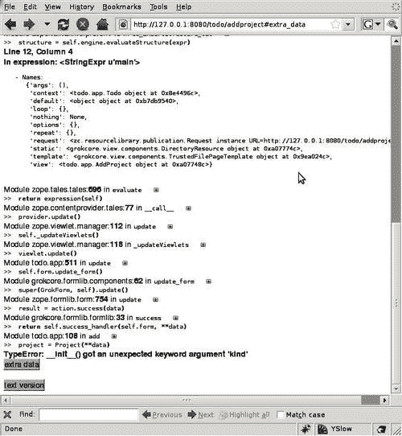
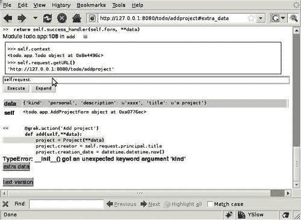

# 第十三章：测试和调试

在整本书中，我们一直在讨论 Grok 如何提供一种敏捷的方式来与 Zope 协同工作。然而，到目前为止，我们还没有忽视一个被认为在敏捷项目中最重要的活动：*测试*。

Grok 提供了一些测试工具，实际上，由`grokproject`（即我们一直在扩展的那个）创建的项目包括一个功能测试套件。在本章中，我们将讨论测试，然后为我们的应用程序迄今为止的功能编写一些测试。

测试帮助我们避免错误，但当然不能完全消除它们。有时我们不得不深入代码以找出其中的问题。在这种情况下，一套好的调试辅助工具变得非常有价值。我们将看到有几种调试 Grok 应用程序的方法，并尝试其中的一些。

我们将涵盖的一些内容包括：

+   测试的需求

+   Grok 中的测试

+   扩展`grokproject`提供的功能测试套件

+   其他类型的测试

+   调试工具

# 测试

理解测试不应被视为事后之想是很重要的。只是在像这样一本大量关注测试的书中，在阅读的初期阶段，可能更难理解解释和代码。

如前所述，敏捷方法非常重视测试。实际上，甚至有一种名为**测试驱动开发**（**TDD**）的方法，它不仅鼓励为我们的代码编写测试，还鼓励在编写任何代码之前编写测试。

有各种类型的测试，但在这里我们只简要描述两种：

+   单元测试

+   集成或功能测试

## 单元测试

单元测试的想法是将程序分解为其组成部分，并单独测试每一个。每个方法或函数调用都是单独测试的，以确保它返回预期的结果并正确处理所有可能的输入。

一个拥有覆盖大部分代码行数的单元测试的应用程序，允许其开发者不断在更改后运行测试，并确保代码的修改不会破坏现有的功能。

## 功能测试

功能测试关注的是应用程序的整体行为。在一个 Web 应用程序中，这意味着它如何响应浏览器请求，以及它是否为给定的调用返回预期的 HTML。

理想情况下，客户自己参与定义这些测试，通常是通过明确的功能需求或验收标准。客户的要求越正式，定义适当的函数测试就越容易。

# Grok 中的测试

Grok 强烈鼓励使用这两种测试，实际上，每个项目都自动配置了一个强大的测试工具。在 Grok 起源的 Zope 世界中，一种称为“doctest”的测试被赋予了很高的价值，因此 Grok 附带了一个此类测试的示例测试套件。

## Doctests

**doctest**是一种以文本文件编写的测试，其中包含代码行和解释代码正在做什么的说明。代码以模拟 Python 解释器会话的方式编写。由于测试会锻炼代码的大部分内容（理想情况下 100%），它们通常提供了一种很好的方法来了解应用程序做什么以及如何做。因此，如果一个应用程序没有书面文档，其测试将是了解其功能的下一个明显的方法。Doctests 通过允许开发者在文本文件中精确地解释每个测试正在做什么，进一步发展了这个想法。

Doctests 在功能测试中特别有用，因为它更有意义地记录了程序的高级操作。另一方面，单元测试则预期逐步评估程序，为每一小段代码编写文本说明可能会很繁琐。

Doctests 的一个可能的缺点是它们可能会让开发者认为他不需要为他的项目提供其他文档。在几乎所有情况下，这都不是真的。记录一个应用程序或包可以立即使其更易于访问和有用，因此强烈建议不要将 doctests 用作良好文档的替代品。我们将在本章的“查看测试代码”部分展示使用 doctests 的示例。

## Grok 项目的默认测试设置

如前所述，使用`grokproject`工具启动的 Grok 项目默认已经包含了一个简单的功能测试套件。让我们详细地来考察一下。

### 测试配置

默认测试配置会查找名称中包含“tests”一词的包或模块，并尝试在其中运行测试。对于功能测试，任何以`.txt`或`.rst`结尾的文件都被认为是测试文件。

对于需要模拟浏览器的功能测试，需要一个特殊的配置来告诉 Grok 除了 Grok 基础设施外还需要初始化哪些包（这些通常是正在工作的包）。`package`目录中的`ftesting.zcml`文件包含这个配置。此文件还包括一些用户定义，这些定义被某些测试用来检查特定于某个角色（如经理）的功能。

### 测试文件

除了已经提到的`ftesting.zcml`文件外，在同一目录下，`grokproject`还添加了一个`tests.py`文件，该文件基本上加载 ZCML 声明并注册包中的所有测试。

默认项目文件中包含的实际测试包含在`app.txt`文件中。这些是通过加载整个 Grok 环境和模拟浏览器来执行功能测试的 doctests。我们很快就会查看文件的内容，但首先让我们运行测试。

### 运行测试

作为项目构建过程的一部分，当你创建一个新项目时，`bin`目录中会包含一个名为`test`的脚本。这是**测试运行器**，不带参数调用它将找到并执行配置中包含的包中的所有测试。

到目前为止，我们还没有添加任何测试，所以如果我们在我们项目的目录中输入`bin/test`，我们会看到与在新项目中执行此操作大致相同的结果：

```py
$ bin/test
Running tests at level 1
Running todo.FunctionalLayer tests:
Set up
in 12.319 seconds.
Running:
...2009-09-30 15:00:47,490 INFO sqlalchemy.engine.base.Engine.0x...782c PRAGMA table_info("users")
2009-09-30 15:00:47,490 INFO sqlalchemy.engine.base.Engine.0x...782c ()
Ran 3 tests with 0 failures and 0 errors in 0.465 seconds.
Tearing down left over layers:
Tear down todo.FunctionalLayer ... not supported 

```

我们输出与新建 Grok 包输出的唯一区别在于`sqlalchemy`行。当然，输出中最重要的部分是倒数第二行，它显示了运行了多少个测试以及是否有失败或错误。*失败*意味着测试没有通过，这意味着代码没有按照预期执行，需要检查。*错误*表示代码在某个点意外崩溃，测试甚至无法执行，因此有必要在担心测试之前找到错误并纠正它。

## 测试运行器

测试运行器程序会寻找包含测试的模块。测试可以是三种不同类型之一：Python 测试、简单的 doctests 和全功能的 doctests。为了让测试运行器知道哪个测试文件包含哪种类型的测试，文件顶部会放置一个类似于以下的注释：

```py
Do a Python test on the app.
:unittestt:

```

在这种情况下，我们将使用 Python 单元测试层来运行测试。我们还将使用 doctest，当我们学习如何编写 doctests 时。

测试运行器随后会找到所有的测试模块，并在相应的层中运行它们。尽管单元测试在常规开发中被认为非常重要，但我们可能会发现对于 Grok Web 应用来说，功能测试更为必要，因为我们通常会测试视图和表单，这需要加载完整的 Zope/Grok 堆栈才能工作。这就是为什么我们在默认设置中只找到功能性的 doctests 的原因。

### 测试层

**测试层**是一种特定的测试设置，用于区分执行的测试。默认情况下，测试运行器处理的三种测试类型中，每种类型都有一个测试层。可以运行一个测试层而不运行其他层。也可以创建新的测试层，以便将需要特定设置的测试聚集在一起。

### 调用测试运行器

如上所示，运行`bin/test`将使用默认选项启动测试运行器。也可以指定多个选项，其中最重要的选项如下总结。在下表中，命令行选项显示在左侧。大多数选项可以使用短形式（一个连字符）或长形式（两个连字符）来表示。每个选项的参数以大写形式显示。

| 选项 | 描述 |
| --- | --- |
| `-s 包, --package=包, --dir=包` | 在指定的包目录中搜索测试。这可以指定多次，以在源树的不同部分运行测试。例如，在重构接口时，你不想看到其他包中测试设置的破坏方式。你只想运行接口测试。包以点分隔的名称提供。为了与旧测试运行器兼容，包名称中的前后斜杠被转换为点。 （在包的特殊情况下，这些包分布在多个目录中，只有测试搜索路径内的目录将被搜索。） |
| `-m 模块, --module=模块` | 指定一个测试模块过滤器作为正则表达式。这是一个区分大小写的正则表达式，用于*搜索*（而非匹配）模式，以限制搜索哪些测试模块。正则表达式将与点分隔的模块名称进行匹配检查。在 Python 正则表达式符号的扩展中，一个前导的"!"将被移除，并导致剩余正则表达式的意义被否定（因此"!bc"匹配任何不匹配"bc"的字符串，反之亦然）。此选项可以指定多个测试模块过滤器。匹配任何测试过滤器的测试模块将被搜索。如果没有指定测试模块过滤器，则使用所有测试模块。 |
| `-t 测试, --test=测试` | 指定一个测试过滤器作为正则表达式。这是一个区分大小写的正则表达式，用于*搜索*（而非匹配）模式，以限制运行哪些测试。在 Python 正则表达式符号的扩展中，一个前导的"!"将被移除，并导致剩余正则表达式的意义被否定（因此"!bc"匹配任何不匹配"bc"的字符串，反之亦然）。此选项可以指定多个测试过滤器。匹配任何测试过滤器的测试将被包含。如果没有指定测试过滤器，则执行所有测试。 |
| `--layer=LAYER` | 指定要运行的测试层。此选项可以多次提供，以便指定多个层。如果没有指定，将执行所有层。运行脚本通常为此选项提供默认值。层是用于搜索模式中对象点名称的正则表达式。在 Python 正则表达式记法的一个扩展中，一个前导的 "!" 被移除，导致剩余正则表达式的意义被否定（因此 "!bc" 匹配任何不匹配 "bc" 的字符串，反之亦然）。名为 'unit' 的层保留用于单元测试；然而，请注意 *unit* 和 *non-unit* 选项。 |
| `-u, --unit` | 仅执行单元测试，忽略任何层选项。 |
| `-f, --non-unit` | 执行除单元测试之外的其他测试。 |
| `-v, --verbose` | 使输出更详细。 |
| `-q, --quiet` | 通过覆盖任何详细程度选项提供最小输出。 |

## 查看测试代码

让我们看看 Grok 项目中的三个默认测试文件，看看每个文件的作用。

### ftesting.zcml

如我们之前所解释的，`ftesting.zcml` 是测试运行器的配置文件。其主要目的是帮助我们设置带有用户的测试实例，以便我们可以根据需要测试不同的角色。

```py
<configure

i18n_domain="todo"
package="todo"
>
<include package="todo" />
<include package="todo_plus" />
<!-- Typical functional testing security setup -->
<securityPolicy
component="zope.securitypolicy.zopepolicy.ZopeSecurityPolicy"
/>
<unauthenticatedPrincipal
id="zope.anybody"
title="Unauthenticated User"
/>
<grant
permission="zope.View"
principal="zope.anybody"
/>
<principal
id="zope.mgr"
title="Manager"
login="mgr"
password="mgrpw"
/>
<role id="zope.Manager" title="Site Manager" />
<grantAll role="zope.Manager" />
<grant role="zope.Manager" principal="zope.mgr" />

```

如前述代码所示，配置简单地包含了一个安全策略，包括用户和角色，以及实例应该加载的包，以及除了常规 Grok 基础设施之外的内容。如果我们运行需要经过身份验证的用户才能工作的任何测试，我们将使用这些特殊用户。

文件顶部的包含确保在运行测试之前执行我们应用程序所需的整个 Zope 组件架构设置。

### tests.py

默认测试模块非常简单。它定义了功能层并注册了我们包的测试：

```py
import os.path
import z3c.testsetup
import todo
from zope.app.testing.functional import ZCMLLayer
ftesting_zcml = os.path.join(
os.path.dirname(todo.__file__), 'ftesting.zcml')
FunctionalLayer = ZCMLLayer(ftesting_zcml, __name__, 'FunctionalLayer', allow_teardown=True)
test_suite = z3c.testsetup.register_all_tests('todo')

```

在导入之后，第一行获取 `ftesting.zcml` 文件的路径，然后将其传递给层定义方法 `ZCMLLayer`。模块中的最后一行告诉测试运行器找到并注册包中的所有测试。

这将足够满足我们本章的测试需求，但如果我们需要为我们的应用程序创建另一个非 Grok 包，我们就需要在其上添加类似于最后一行的行，以便测试运行器可以找到所有测试。这基本上是样板代码，因为只需要更改包名。

### app.txt

我们最终来到了整个配置的原因所在，即测试运行器将要执行的实际测试。默认情况下，测试被包含在 `app.txt` 文件中：

```py
Do a functional doctest test on the app.
========================================
:doctest:
:layer: todo.tests.FunctionalLayer
Let's first create an instance of Todo at the top level:
>>> from todo.app import Todo
>>> root = getRootFolder()
>>> root['app'] = Todo()
Run tests in the testbrowser
----------------------------
The zope.testbrowser.browser module exposes a Browser class that
simulates a web browser similar to Mozilla Firefox or IE. We use that to test how our application behaves in a browser. For more
information, see http://pypi.python.org/pypi/zope.testbrowser.
Create a browser and visit the instance you just created:
>>> from zope.testbrowser.testing import Browser
>>> browser = Browser()
>>> browser.open('http://localhost/app')
Check some basic information about the page you visit:
>>> browser.url
'http://localhost/app/@@login?camefrom=%2Fapp%2F%40%40index'
>>> browser.headers.get('Status').upper()
'200 OK'

```

文本文件有一个标题，紧接着是一个 `:doctest:` 声明，这是一个告诉测试运行器这些测试需要加载一个功能层来执行声明的声明。然后是一个 `:layer:` 声明，它是一个指向我们在 `tests.py` 中之前定义的层的路径。之后是测试代码。以三个括号开头的行代表被测试的 Python 代码。其他任何内容都是注释。

当使用 Python 解释器时，一行代码可能会返回一个值，在这种情况下，预期的返回值必须立即写在那行代码下面。这个预期值将与测试代码的实际返回值进行比较，如果值不匹配，将报告失败。同样，如果一行代码后面跟着一个空行，当代码执行并返回结果时，也会产生失败，因为在这种情况下，预期返回值被认为是 `None`。

例如，在下面的 Python doctest 的最后一行中，表达式 `browser.headers.get('Status').upper()` 预期返回值 `200 OK`。如果返回任何其他值，测试将失败。

## 添加我们自己的测试

现在，让我们添加一些针对我们应用程序的特定功能测试。为此，我们需要模拟一个浏览器。`zope.testbrowser` 包包含一个浏览器模拟器。我们可以通过使用 `browser.open` 将任何有效的 URL 传递给这个浏览器，它将像浏览器一样向我们的应用程序发送请求。然后，我们的应用程序的响应将作为 `browser.contents` 可用，这样我们就可以在上面执行我们的测试比较。

### 浏览器类

在编写我们的测试之前，查看我们的 `testbrowser` 能做什么将非常有用。当然，任何依赖于 JavaScript 的功能在这里都不会工作，但除此之外，我们可以以非常直接的方式与链接甚至表单进行交互。以下是 `Browser` 类提供的主要功能：

| 初始化 | >>> from zope.testbrowser.testing import Browser>>> browser = Browser() |
| --- | --- |
| 页面内容 | >>> print browser.contents<html><head><title>Simple Page</title></head><body><h1>Simple Page</h1></body></html>>>> '<h1>Simple Page</h1>' in browser.contentsTrue |
| 头部信息 | >>> print browser.headersStatus: 200 OKContent-Length: 123Content-Type: text/html;charset=utf-8X-Powered-By: Zope (www.zope.org), Python (www.python.org)>>> browser.headers['content-type']'text/html;charset=utf-8' |
| Cookies | >>> browser.cookies['foo']'bar'>>> browser.cookies.keys()['foo']>>> browser.cookies.values()['bar']>>> browser.cookies.items()[('foo', 'bar')]>>> 'foo' in browser.cookiesTrue>>> browser.cookies['sha'] = 'zam' |
| 链接 | >>> link = browser.getLink('Link Text')>>> link<Link text='Link Text'url='http://localhost/@@/testbrowser/navigate.html?message=By+Link+Text'>>>> link.text'Link Text'>>> link.tag # 链接也可以是图像映射.'a'>>> link.url # 它已被标准化'http://localhost/@@/testbrowser/navigate.html?message=By+Link+Text'>>> link.attrs{'href': 'navigate.html?message=By+Link+Text'}>>> link.click()>>> browser.url'http://localhost/@@/testbrowser/navigate.html?message=By+Link+Text' |
| 表单控件 | >>> control = browser.getControl('Text Control')>>> control<Control name='text-value' type='text'>>>> browser.getControl(label='Text Control') # 等效<Control name='text-value' type='text'>>>> browser.getControl('Text Control').value = 'Other Text'>>> browser.getControl('Submit').click() |

现在我们知道了我们可以做什么，让我们尝试编写一些测试。

### 我们的第一批待办应用测试

理想情况下，我们应该在每次向我们的应用程序添加新功能时，在`app.txt`文件中添加几个 doctests。我们已经讨论了我们为什么没有这样做的原因，但让我们弥补一些失去的地盘。至少，我们将对 doctests 的工作方式有一个感觉。

我们将把新的测试添加到现有的`app.txt`文件中。我们看到的最后一个测试将我们留在了待办实例的 URL 上。我们没有登录，所以如果我们打印浏览器内容，我们会得到登录页面。让我们为这个情况添加一个测试：

```py
Since we haven't logged in, we can't see the application. The login page appears:
>>> 'Username' in browser.contents
True
>>> 'Password' in browser.contents
True

```

如我们之前提到的，当使用`testbrowser`访问 URL 时，页面的整个 HTML 内容都存储在`browser.contents`中。现在我们知道我们的登录页面有一个用户名字段和一个密码字段，所以我们只需使用几个`in`表达式来检查这些字段是否评估为`True`。如果是，这意味着浏览器实际上正在查看登录页面。

让我们为登录添加一个测试。当我们开始在测试中启动应用程序时，用户数据库是空的，因此，最经济的登录方式是使用基本认证。这可以通过更改请求头轻松完成：

让我们使用在`ftesting.zcml`中定义的管理员用户登录。为了使事情简单，让我们使用基本认证头来登录：

```py
>>> browser.addHeader('Authorization', 'Basic mgr:mgrpw')
>>> browser.open('http://localhost/app')
>>> 'Logged in as Manager' in browser.contents
True

```

就这些。我们只需添加标题，“重新加载”主页，我们应该就登录了。我们通过寻找**登录为**消息来验证它，我们知道在成功登录后必须在那里。

一旦我们登录，我们就可以最终正确地测试我们的应用程序了。让我们先添加一个项目：

我们现在已经登录了。让我们创建一个项目：

```py
>>> browser.getLink('Create a new project').click()
>>> browser.getControl(name='form.title').value='a project'
>>> browser.getControl(name='form.description').value='The description.'
>>> browser.getControl('Add project').click()
>>> browser.url
'http://localhost/app/0'
>>> 'Create new list' in browser.contents
True

```

首先，我们在主页上找到将带我们转到 '添加表单' 项目的链接。这可以通过 `getLink` 方法和链接文本轻松完成。我们点击链接，然后应该有一个可以填写的表单。然后我们使用 `getControl` 通过名称找到每个字段并更改其值。最后，我们通过获取提交按钮控件并点击它来提交表单。结果是项目被创建，并且我们被重定向到其主视图。我们可以通过比较 `browser url` 与在这种情况下我们预期的 URL 来确认这一点。

向项目中添加列表同样简单。我们获取表单控件，分配一些值，然后点击提交按钮。列表和添加新项到其中的链接应该出现在浏览器内容中：

我们已经添加了一个项目。现在，我们将向其中添加一个列表。如果我们成功，我们将看到一个用于添加列表新项的链接：

```py
>>> browser.getControl(name='title').value='a list'
>>> browser.getControl(name='description').value='The list description.'
>>> browser.getControl(name='new_list').click()
>>> 'New item' in browser.contents
True

```

好的。让我们看看到目前为止我们做得怎么样：

```py
$ bin/testRunning tests at level 1
Running todo.FunctionalLayer tests:
Set up
in 3.087 seconds.
Running:
.......2009-09-30 21:35:44,585 INFO sqlalchemy.engine.base.Engine.0x...69ec PRAGMA table_info("users")
2009-09-30 21:35:44,585 INFO sqlalchemy.engine.base.Engine.0x...69ec ()
Ran 7 tests with 0 failures and 0 errors in 0.428 seconds.
Tearing down left over layers:
Tear down todo.FunctionalLayer ... not supported 

```

还不错。我们现在比开始时多了四个工作测试。

注意，测试浏览器优雅地处理 `HTTP` 错误，返回一个类似于真实浏览器在遇到错误时返回的字符串。例如，看看以下测试：

```py
>>> browser.open('http://localhost/invalid')
Traceback (most recent call last):
...
HTTPError: HTTP Error 404: Not Found

```

这是默认行为，因为这是真实浏览器的行为方式，但有时，当我们调试时，查看由我们的应用程序引起的原始异常会更好。在这种情况下，我们可以让浏览器停止自动处理错误并抛出原始异常，这样我们就可以处理它们。这是通过将 `browser.handleErrors` 属性设置为 `False` 来实现的：

```py
>>> browser.handleErrors = False
>>> browser.open('http://localhost/invalid')
Traceback (most recent call last):
...
NotFound: Object: <zope.site.folder.Folder object at ...>,
name: u'invalid'

```

### 添加单元测试

除了功能测试之外，我们还可以创建纯 Python 测试用例，测试运行器可以找到它们。而功能测试覆盖应用程序行为，单元测试则关注程序的正确性。理想情况下，应用程序中的每个 Python 方法都应该经过测试。

单元测试层不会加载 Grok 基础设施，因此测试不应该理所当然地接受它所附带的一切，而只接受基本的 Python 行为。

要添加我们的单元测试，我们将创建一个名为 `unit_tests.py` 的模块。记住，为了让测试运行器找到我们的测试模块，它们的名称必须以 'tests' 结尾。以下是我们将放入此文件的内容：

```py
"""
Do a Python test on the app.
:unittest:
"""
import unittest
from todo.app import Todo
class InitializationTest(unittest.TestCase):
todoapp = None
def setUp(self):
self.todoapp = Todo()
def test_title_set(self):
self.assertEqual(self.todoapp.title,u'To-do list manager')
def test_next_id_set(self):
self.assertEqual(self.todoapp.next_id,0)

```

顶部的 `:unittest:` 注释非常重要。没有它，测试运行器将不知道你的测试应该在哪个层执行，它将简单地忽略它们。

单元测试由测试用例组成，理论上，每个测试用例都应该包含与应用程序功能特定区域相关的几个测试。测试用例使用 Python 的 `unittest` 模块中的 `TestCase` 类。在这些测试中，我们定义了一个包含两个非常简单的测试的单个测试用例。

我们在这里不深入细节。只需注意，测试用例可以包括一个`setUp`方法和一个`tearDown`方法，这些方法可以用来执行任何必要的公共初始化和销毁任务，以便使测试工作并干净地完成。

测试用例中的每个测试都需要在其名称中包含前缀'test'，所以我们恰好有两个测试满足这个条件。这两个测试都需要`Todo`类的一个实例来执行，因此我们将其分配给测试用例作为类变量，并在`setUp`方法中创建它。这些测试非常简单，它们只是验证在实例创建时设置了默认属性值。

这两个测试都使用`assertEqual`方法来告诉测试运行器，如果传递的两个值不同，测试应该失败。为了看到它们在行动中的样子，我们只需再次运行`bin/test`命令：

```py
$ bin/test
Running tests at level 1
Running todo.FunctionalLayer tests:
Set up
in 2.691 seconds.
Running:
.......2009-09-30 22:00:50,703 INFO sqlalchemy.engine.base.Engine.0x...684c PRAGMA table_info("users")
2009-09-30 22:00:50,703 INFO sqlalchemy.engine.base.Engine.0x...684c ()
Ran 7 tests with 0 failures and 0 errors in 0.420 seconds.
Running zope.testing.testrunner.layer.UnitTests tests:
Tear down todo.FunctionalLayer ... not supported
Running in a subprocess.
Set up zope.testing.testrunner.layer.UnitTests in 0.000 seconds.
Ran 2 tests with 0 failures and 0 errors in 0.000 seconds.
Tear down zope.testing.testrunner.layer.UnitTests in 0.000 seconds.
Total: 9 tests, 0 failures, 0 errors in 5.795 seconds 

```

现在，功能测试层和单元测试层都包含一些测试，并且它们是依次运行的。我们可以在这些测试的每个层的末尾看到该层的总计，以及当测试运行器完成其工作时九个通过测试的总计。

### 扩展测试套件

当然，我们只是触及了表面，关于哪些测试应该添加到我们的应用程序中。如果我们继续添加测试，到我们完成的时候可能会有数百个测试。然而，这一章并不是进行这项工作的地方。

如前所述，如果我们边编码边添加测试，那么为应用程序的每个部分编写测试要容易得多。测试确实是一项大量工作，但拥有一个完整的测试套件对我们的应用程序来说价值巨大。尤其是当第三方可能独立使用我们的产品时，这一点更为重要。

# 调试

现在，我们将快速查看 Grok 提供的调试功能。即使我们有一个非常全面的测试套件，我们也有可能在我们应用程序中发现相当数量的错误。当这种情况发生时，我们需要一种快速有效的方法来检查代码的运行情况，并轻松找到问题所在。

通常，开发者会在代码中（放置在关键行）使用`print`语句，希望找到问题所在。尽管这通常是一个开始定位代码中的痛点的好方法，但我们往往需要某种方式逐行跟踪代码，以便真正找出问题所在。在下一节中，我们将看到如何使用 Python 调试器逐步执行代码并找到问题所在。我们还将快速看一下如何在 Grok 中执行死后调试，这涉及到在异常发生后立即跳入调试器来分析程序状态。

## Grok 中的调试

对于常规调试，我们需要逐步执行代码以查看其内部情况，Python 调试器是一个出色的工具。要使用它，你只需在你希望开始调试的点添加下一行：

```py
import pdb; pdb.set_trace()

```

让我们试试。打开 `app.py` 模块，并将 `AddProjectForm` 类的 `add` 方法（第 108 行）改为以下内容：

```py
@grok.action('Add project')
def add(self,**data):
import pdb; pdb.set_trace()
project = Project()
project.creator = self.request.principal.title
project.creation_date = datetime.datetime.now()
project.modification_date = datetime.datetime.now()
self.applyData(project,**data)
id = str(self.context.next_id)
self.context.next_id = self.context.next_id+1
self.context[id] = project
return self.redirect(self.url(self.context[id]))

```

注意，我们在方法的开头调用了调试器。现在，启动实例，转到“添加项目”表单，填写它，然后提交。您不会看到新的项目视图，浏览器将停留在“添加表单”页面，并显示 **等待中...** 的信息。这是因为控制权已经转移到控制台，以便调试器可以操作。您的控制台将看起来像这样：

```py
> /home/cguardia/work/virtual/grok1/todo/src/todo/app.py(109)add()
-> project = Project()
(Pdb) | 

```

调试器现在处于活动状态并等待输入。注意，调试开始时的行号就出现在我们所在的模块路径旁边。行号之后是方法名，`add()`。下面显示的是将要执行的下一行代码。

调试器命令很简单。要执行当前行，点击 *n:*。

```py
(Pdb) n
> /home/cguardia/work/virtual/grok1/todo/src/todo/app.py(110)add()
-> project.creator = self.request.principal.title
(Pdb) 

```

如果您输入 *h:*，您可以看到可用的命令。

```py
(Pdb) h
Documented commands (type help <topic>):
========================================
EOF break condition disable help list q step w
a bt cont down ignore n quit tbreak whatis
alias c continue enable j next r u where
args cl d exit jump p return unalias
b clear debug h l pp s up
Miscellaneous help topics:
==========================
exec pdb
Undocumented commands:
======================
retval rv
(Pdb) 

```

列表命令 `id` 用于获取我们目前在代码中的鸟瞰图：

```py
(Pdb) list
105
106 @grok.action('Add project')
107 def add(self,**data):
108 import pdb; pdb.set_trace()
109 project = Project()
110 -> project.creator = self.request.principal.title
111 project.creation_date = datetime.datetime.now()
112 project.modification_date = datetime.datetime.now()
113 self.applyData(project,**data)
114 id = str(self.context.next_id)
115 self.context.next_id = self.context.next_id+1
(Pdb) 

```

如您所见，当前行由一个箭头标识。

在当前执行上下文中，我们可以输入对象的名称并找出它们的值：

```py
(Pdb) project
<todo.app.Project object at 0xa0ef72c>
(Pdb) data
{'kind': 'personal', 'description': u'Nothing', 'title': u'Project about nothing'}
(Pdb) 

```

我们当然可以继续逐行检查应用程序中的所有代码，包括 Grok 的代码，在检查过程中检查值。当我们完成审查后，我们可以点击 *c* 返回控制权到浏览器。此时，我们将看到项目视图。

Python 调试器非常易于使用，并且对于查找代码中的隐蔽错误非常有价值。

### 默认的 Ajax 调试器

另一种调试方式被称为 *事后调试*。在上一个章节中，我们在应用程序处于稳定和运行状态时随意地逐步执行代码。然而，很多时候，我们可能会遇到一个错误条件，这会停止程序，我们需要分析错误发生时程序的状态。这就是事后调试的内容。

我们现在将故意在我们的代码中引入一个错误。从 `add` 方法中删除 `import pdb` 行，并将之后的第 一行改为以下内容：

```py
project = Project(**data)

```

`Project` 类的 `__init__` 方法不期望这个参数，因此会引发 `TypeError`。重新启动实例并添加一个项目。而不是一个视图，将显示一个空白屏幕和错误信息 **系统错误发生**。

回想一下，到目前为止，我们一直使用 `deploy.ini` 文件通过以下命令启动实例：

```py
$ bin/paster serve parts/etc/deploy.ini 

```

要运行一个事后调试会话，我们必须使用调试配置启动实例：

```py
$ bin/paster serve parts/etc/debug.ini 

```

再次尝试添加一个项目。现在，屏幕上会显示完整的错误回溯，而不是简单的错误信息，如下截图所示：



关于回溯信息的一个优点是它可以展开。点击左侧的括号将显示发生错误的那行代码周围的代码行，而点击模块和行消息右侧的加号将显示额外的回溯信息。在此信息之上，您还将看到一个文本框，可以用来在当前上下文中评估表达式（参见图表）。



### 使用 Python 调试器进行事后调试

Ajax 调试器很棒，但如果您真的习惯了 Python 调试器，您可能会希望在使用它进行事后分析时使用 Python 调试器。这没问题；Grok 已经为此做好了准备。

为了快速测试，请编辑项目中的`parts/etc/debug.ini`文件，并在`[filter-app:main]`部分将单词`ajax`更改为`pdb`。完成时，它应该看起来像这样：

```py
[filter-app:main]
# Change the last part from 'ajax' to 'pdb' for a post-mortem debugger
# on the console:
use = egg:z3c.evalexception#pdb # <--- change here to pdb
next = zope

```

现在，使用调试配置重启实例并尝试添加项目。您将不会看到 Ajax 屏幕，控制权将转移到控制台上的 Python 调试器。

请记住，我们只是修改了一个文件，当我们再次运行`buildout`时，该文件将被重写，所以像我们刚才做的那样，只进行快速测试，永远不要依赖于`parts/etc`目录中文件的更改。为了使此更改永久，请记住编辑`etc/debug.ini.in`文件而不是`parts/etc`目录中的文件。然后您需要再次运行`buildout`。

# 摘要

本章讨论了如何测试 Grok 应用程序以及为什么这样做很重要。我们还介绍了调试，并查看了一些对 Grok 开发者有用的调试工具。现在我们已经添加了测试，在下一章中，我们将看到如何部署我们的应用程序。
