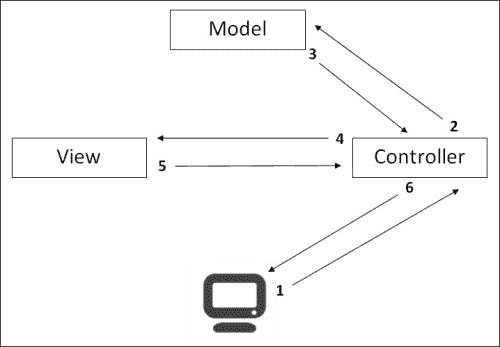

# 第一章：Django 在网络上的位置

近年来，Web 开发发生了重大变化，特别是出现了 Web 框架。我们将学习如何使用 Django 框架创建一个完整的网站。

在本章中，我们将讨论以下内容：

+   网络的变化

+   Django 的介绍

+   MVC 开发模式

# 从 Web 1.0 到 Web 2.0

今天你看到的网络并不总是像今天这样。事实上，许多技术，如 CSS，AJAX 或新的 HTML 5 版本都改进了网络。

## 网络 1.0

25 年前，由于不断增长的新技术，网络诞生了。其中两个非常决定性：

+   HTML 语言是一种显示语言。它允许您使用嵌套标签组织信息。

+   HTTP 协议是一种通信网络协议，允许客户端和服务器进行通信。客户端通常是 Firefox 或 Google Chrome 等浏览器，服务器往往是 Nginx，Apache 或 Microsoft IIS 等 Web 服务器。

起初，开发人员使用`<table>`标签来组织页面的各种元素，如菜单，标题或内容。网页上显示的图像分辨率较低，以避免使页面变得沉重。用户唯一能够执行的操作是点击超文本链接以导航到其他页面。

这些超文本链接使用户能够通过发送一种类型的数据（页面的 URL）从一个页面导航到另一个页面。**统一资源定位符**（**URL**）定义了获取资源（如 HTML 页面，图片或 PDF 文件）的唯一链接。用户发送的数据除了 URL 之外没有其他数据。

## Web 2.0

Web 2.0 这个术语是由 Dale Dougherty，O'Reilly Media 公司创造的，并在 2004 年 10 月由 Tim O'Reilly 在第一次 Web 2.0 会议上传播。

这个新的网络变得互动和可达到初学者。它成为了许多技术的礼物，包括以下内容：

+   服务器端语言，如 PHP，**Java 服务器页面**（**JSP**）或 ASP。这些语言允许您与数据库通信以提供动态内容。这也允许用户通过 HTML 表单发送数据以便使用 Web 服务器处理数据。

+   数据库存储了大量信息。这些信息可以用来验证用户或显示从较旧到最近的条目列表。

+   客户端脚本，如 JavaScript，使用户能够在不刷新页面的情况下执行简单的任务。**异步 JavaScript 和 XML**（**AJAX**）为当前网络带来了一个重要的功能：客户端和服务器之间的异步交换。由于这一点，无需刷新页面即可享受网站。

如今，Web 2.0 无处不在，它已成为我们日常生活的一部分。Facebook 是 Web 2.0 网站的一个完美例子，用户之间完全互动，并在其数据库中存储了大量信息。Web 应用程序已经被普及，如网络邮件或 Google 网络应用程序。

正是在这种哲学中，Django 出现了。

# 什么是 Django？

Django 诞生于 2003 年堪萨斯州劳伦斯的一家新闻机构。它是一个使用 Python 创建网站的 Web 框架。它的目标是编写非常快速的动态网站。2005 年，该机构决定以 BSD 许可证发布 Django 源代码。2008 年，Django 软件基金会成立以支持和推进 Django。几个月后发布了框架的 1.00 版本。

！[什么是 Django？]（img/00002.jpeg）

### 注意

**Django 的口号**

完美主义者与截止日期的网络框架。

Django 的口号很明确。这个框架是为了加速网站开发阶段而创建的，但并不是唯一的。事实上，这个框架使用了 MVC 模式，这使我们能够拥有一个一致的架构，正如我们将在下一章中看到的那样。

直到 2013 年，Django 只兼容 Python 2.x 版本，但 2013 年 2 月 26 日发布的 Django 1.5 版本标志着 Python 3 兼容性的开始。

如今，像 Instagram 移动网站、Mozilla.org 和 Openstack.org 这样的大型组织正在使用 Django。

## Django - 一个 Web 框架

框架是一组软件，它组织了应用程序的架构，并使开发人员的工作更加轻松。框架可以适应不同的用途。它还提供了实用工具，使程序员的工作更快。因此，一些在网站上经常使用的功能可以被自动化，比如数据库管理和用户管理。

一旦程序员掌握了一个框架，它会极大地提高他们的生产力和代码质量。

# MVC 框架

在 MVC 框架存在之前，Web 编程混合了数据库访问代码和页面的主要代码。这将 HTML 页面返回给用户。即使我们将 CSS 和 JavaScript 文件存储在外部文件中，服务器端语言代码仍然存储在至少三种语言之间共享的一个文件中：Python、SQL 和 HTML。

MVC 模式是为了将逻辑与表示分离，并拥有更加具体和真实的内部架构而创建的。**模型-视图-控制器**（**MVC**）代表了该范式推荐的三个应用程序层：

+   **模型**：这些代表数据库中的数据组织。简单地说，我们可以说每个模型定义了数据库中的一个表以及其他模型之间的关系。多亏了它们，每一点数据都存储在数据库中。

+   **视图**：这些包含将发送给客户端的所有信息。它们生成最终的 HTML 文档。我们可以将 HTML 代码与视图关联起来。

+   **控制器**：这些包含服务器执行的所有操作，对客户端不可见。控制器检查用户是否经过身份验证，或者可以从模板生成 HTML 代码。

在具有 MVC 模式的应用程序中遵循以下步骤：

1.  客户端向服务器发送请求，要求显示一个页面。

1.  控制器通过模型使用数据库。它可以创建、读取、更新或删除任何记录，或对检索到的数据应用任何逻辑。

1.  模型从数据库发送数据；例如，如果我们有一个在线商店，它会发送产品列表。

1.  控制器将数据注入视图以生成它。

1.  视图根据控制器提供的数据返回其内容。

1.  控制器将 HTML 内容返回给客户端。

MVC 模式使我们能够为每个项目的工作者获得一致性。在一个有网页设计师和开发人员的网络代理公司中，网页设计师是视图的负责人。鉴于视图只包含 HTML 代码，网页设计师不会被开发人员的代码打扰。开发人员编辑他们的模型和控制器。

特别是 Django 使用了 MVT 模式。在这种模式中，视图被模板替换，控制器被视图替换。在本书的其余部分，我们将使用 MVT 模式。因此，我们的 HTML 代码将是模板，我们的 Python 代码将是视图和模型。

# 为什么使用 Django？

以下是使用 Django 的优势的非尽事例清单：

+   Django 是根据 BSD 许可发布的，这确保了 Web 应用程序可以自由使用和修改，而不会出现任何问题；它也是免费的。

+   Django 是完全可定制的。开发人员可以通过创建模块或覆盖框架方法来轻松地适应它。

+   这种模块化增加了其他优势。有很多 Django 模块可以集成到 Django 中。你可以得到一些帮助，因为你经常会找到你可能需要的高质量模块。

+   在这个框架中使用 Python 可以让你享受所有 Python 库的好处，并确保非常好的可读性。

+   Django 是一个旨在完美的框架。它专门为那些希望为他们的应用程序编写清晰代码和良好架构的人而设计。它完全遵循“不要重复自己”（DRY）的理念，这意味着在多个地方保持代码简洁，而不必复制/粘贴相同的部分。

+   关于质量，Django 集成了许多有效的方法来执行单元测试。

+   Django 得到了一个良好的社区支持。这是一个非常重要的资产，因为它可以让您快速解决问题和修复错误。多亏了社区，我们还可以找到展示最佳实践的代码示例。

Django 也有一些缺点。当开发人员开始使用一个框架时，他/她会开始一个学习阶段。这个阶段的持续时间取决于框架和开发人员。如果开发人员了解 Python 和面向对象编程，那么 Django 的学习阶段相对较短。

还可能出现一个新版本的框架发布，修改了一些语法。例如，Django 1.5 版本改变了模板中 URL 的语法。（更多细节，请访问[`docs.djangoproject.com/en/1.5/ref/templates/builtins/#url`](https://docs.djangoproject.com/en/1.5/ref/templates/builtins/#url)。）尽管如此，文档提供了每个 Django 更新的详细信息。

# 总结

在本章中，我们研究了使 Web 进化为 Web 2.0 的变化。我们还研究了将逻辑与表示分离的 MVC 的运作方式。最后，我们介绍了 Django 框架。

在下一章中，我们将使用 Python、PIP 和 Django 建立我们的开发环境。
