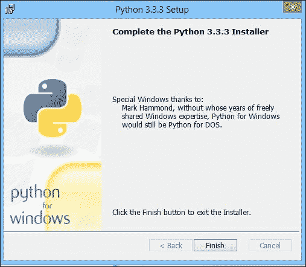
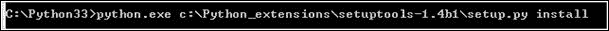
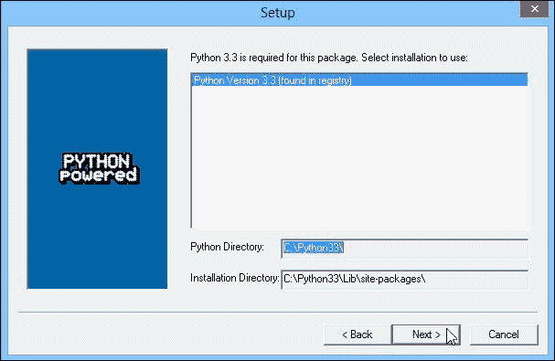

# 第二章：创建 Django 项目

在本章结束时，您将拥有开始使用 Django 进行编程所需的所有必要元素。使用 Django 开发的网站是包含一个或多个应用程序的项目。实际上，当一个网站变得更加重要时，将其在逻辑上分成几个模块变得必要。然后，这些模块被放置在对应于网站的项目中。在本书中，我们不需要创建许多应用程序，但在某些情况下它们可能非常有用。实际上，如果有一天您创建了一个应用程序，并且希望在另一个项目中使用它，您将需要将该应用程序复制并调整以适应新项目。

要能够使用 Django，您需要安装以下软件：

+   Python 3，享受第三版的创新。

+   setuptools 是一个简化外部 Python 模块安装的模块。但是，它无法管理卸载模块。

+   PIP 通过删除软件包、使用更简单的语法和提供其他好处来扩展 setuptools 的可能性。

+   Django，我们将通过 PIP 安装。

这些安装将与 Windows、Linux 和 Mac OS X 兼容。

# 安装 Python 3

要使用到目前为止我们谈到的所有工具，我们首先需要安装 Python 3。以下部分描述了如何在不同的操作系统上安装 Python。

## 为 Windows 安装 Python 3

要下载 Python 可执行文件，请访问[`www.python.org/download/`](http://www.python.org/download/)并下载**Python MSI**文件。请确保您选择与您的平台相关的正确版本。Python 安装可能需要管理员帐户。

对于 Python 安装的所有阶段，您可以将所有设置保留为默认值。如果安装正确完成，您应该看到以下对话框窗口打开：



## 为 Linux 安装 Python 3

要在 Linux 上设置 Python 3，我们可以使用以下命令的包管理器 APT：

```py
root@debian:apt-get install python3

```

### 提示

**下载示例代码**

您可以从您在[`www.packtpub.com`](http://www.packtpub.com)的帐户中为您购买的所有 Packt 图书下载示例代码文件。如果您在其他地方购买了本书，您可以访问[`www.packtpub.com/support`](http://www.packtpub.com/support)并注册，以便直接通过电子邮件接收文件。

我们需要确认 APT 提出的修改。

## 为 Mac OS 安装 Python 3

最新版本的 Mac OS 已经安装了 Python 的一个版本。但是，安装了 Python 的第 2 版，我们想要安装第 3 版。为此，请访问[`www.python.org/download/`](https://www.python.org/download/)并下载正确的版本。然后，打开扩展名为`.dmp`的文件。最后，运行扩展名为`.mpkg`的文件。如果出现诸如`Python 无法打开，因为它来自未知开发者`的错误，请执行以下步骤：

1.  在**Finder**中，找到 Python 安装位置。

1.  按下*ctrl*键，然后单击应用程序图标。

1.  从快捷菜单中选择**打开**。

1.  单击**打开**。

# 安装 setuptools

PIP 是 setuptools 的一个依赖项。我们需要安装 setuptools 才能使用 PIP。以下部分描述了如何在不同的操作系统上安装 setuptools。

## 为 Windows 安装 setuptools

要下载 setuptools 可执行文件，您必须转到 PyPI 网站[`pypi.python.org/pypi/setuptools`](https://pypi.python.org/pypi/setuptools)。然后，我们需要单击**下载**并选择正确的版本。在本书中，我们使用 1.1 版本，如下面的屏幕截图所示：



## 为 Linux 安装 setuptools

使用 APT 时，我们不需要安装 setuptools。实际上，APT 将在安装 PIP 之前自动安装它。

## 为 Mac OS 安装 setuptools

当我们使用`get-pip.py`文件安装 PIP 时，setuptools 将直接安装。因此，我们暂时不需要安装它。

# 安装 PIP

PIP 在 Python 用户中非常受欢迎，并且使用 PIP 是 Django 社区的最佳实践。它处理包安装，执行更新，并删除所有 Python 包扩展。由于这个，我们可以安装所有 Python 所需的包。

如果您安装了 Python 3.4 或更高版本，PIP 已包含在 Python 中。

## 在 Windows 上安装 PIP

要安装 PIP，首先从[`pypi.python.org/pypi/pip/1.5.4`](https://pypi.python.org/pypi/pip/1.5.4)下载它。

然后，我们需要从可执行文件安装 PIP，但不要忘记定义正确的 Python 安装文件夹，如下面的屏幕截图所示：



对于下一组步骤，请使用默认选项并完成安装。有了 PIP，我们将安装所有所需的 Python 包。

## 在 Linux 上安装 PIP

要在 Linux 上安装 PIP 和包括 setuptools 在内的所有组件，您必须使用以下命令使用`get-pip.py`文件：

```py
root@debian: wget https://raw.github.com/pypa/pip/master/contrib/get-pip.py
root@debian:python3 get-pip.py

```

## 在 Mac OS 上安装 PIP

要在 Mac OS 上安装 PIP，我们必须以以下方式使用`get-pip.py`文件：

```py
curl -O https://raw.github.com/pypa/pip/master/contrib/get-pip.py sudo python3 get-pip.py

```

# 安装 Django

然后，我们将安装我们将要使用的框架。以下部分描述了如何在不同的操作系统上安装 Django。

## 在 Windows 上安装 Django

要使用 PIP 安装 Django，您必须打开命令提示符并转到`Python`文件夹中可以找到的`Scripts`目录。您可以使用以下命令安装 Django：

```py
C:\Python33\Scripts\pip.exe install django=="X.X"

```

PIP 将在 Python 的`site-packages`存储库中下载并安装 Django 包。

## 在 Linux 上安装 Django

为了方便我们刚刚安装的 PIP 的使用，我们必须查找系统上安装的版本并定义一个别名来引用已安装的 PIP 版本。不要忘记以 root 身份执行以下命令：

```py
root@debian:compgen -c | grep pip
root@debian:alias pip=pip-3.2
root@debian:pip install django=="1.6"

```

第一个命令查找包含单词`pip`的可用命令。您肯定会找到一行，比如`pip-3.2`。我们将在这个命令上使用第二个命令定义一个别名。

第三个命令安装 Django 的 1.6 版本。

## 在 Mac OS 上安装 Django

如果您想更轻松地使用 PIP，可以使用以下命令创建符号链接：

```py
cd /usr/local/binln -s ../../../Library/Frameworks/Python.framework/Version/3.3/bin/pip3 pip

```

然后，我们可以使用以下命令安装 Django：

```py
pip install django=="1.6"

```

# 使用 Django 启动您的项目

在开始使用 Django 之前，您需要为您的应用程序创建一个环境。我们将创建一个 Django 项目。然后，这个项目将包含我们的应用程序。

要创建我们的应用程序的项目，我们需要使用`django-admin.py`文件运行以下命令（您可以在`Python33\Scripts`文件夹中找到它）：

```py
django-admin.py startproject Work_manager

```

为了方便使用 Django 命令，我们可以设置 Windows 的环境变量。为此，您必须执行以下步骤：

1.  在桌面上右键单击**我的电脑**。

1.  点击**高级系统设置**。

1.  接下来，点击**环境变量**。

1.  添加或更新`PATH`变量：

+   如果不存在，创建`PATH`变量并将其值设置为`C:\Python33/Scripts`

+   如果存在，将`;C:\Python33\Scripts`追加到现有值

1.  现在，您可以使用之前的命令，而无需进入`Python33/Scripts`文件夹。

### 注意

有不同的方法来执行前面的命令：

+   以下命令将在所有情况下执行：

```py
C:\Python33\python.exe C:\Python33\Scripts\django-admin.py startproject Work_manager

```

+   如果我们在`PATH`变量中定义了`C:\Python33\Scripts`，则将执行以下命令：

```py
C:\Python33\python.exe django-admin.py startproject Work_manager

```

+   如果我们在`PATH`变量中定义了`C:\Python33\Scripts`并且`.py`扩展文件被定义为与 Python 一起运行，则将执行以下命令：

```py
django-admin.py startproject Work_manager

```

这个命令在您运行命令的文件夹中创建一个`Work_manager`文件夹。我们将在该文件夹中找到一个文件夹和一个文件：

+   `manage.py`文件将用于在项目上执行操作，比如启动开发服务器或将数据库与模型同步。

+   `Work_manager`文件夹代表我们项目的一个应用程序。默认情况下，`startproject`命令会创建一个新的应用程序。

`Work_manager`文件夹包含两个非常重要的文件：

+   `settings.py`文件包含我们项目的参数。这个文件对我们所有的应用程序都是通用的。我们用它来定义调试模式，配置数据库，或者定义我们将使用的 Django 包。`settings.py`文件允许我们做更多的事情，但我们的使用将局限于之前描述的内容。

+   `urls.py`文件包含我们所有的 URL。通过这个文件，我们在 Django 中进行路由。我们将在下一章中介绍这个。

# 创建一个应用程序

我们不会在`Work_manager`文件夹中编写我们的应用程序，因为我们想要创建我们自己的`Task_manager`应用程序。

为此，请使用`startproject`命令创建的`manage.py`文件运行以下命令。您必须在包含`manage.py`文件的`Work_manager`文件夹中运行以下命令：

```py
Manage.py startapp TasksManager

```

这个命令在我们项目的文件夹中创建了一个`TasksManager`文件夹。这个文件夹包含五个文件：

+   `__init__.py`文件定义了一个包。Python 需要它来区分标准文件夹和包。

+   `admin.py`文件目前没有用。它包含需要并入管理模块的模型。

+   `models.py`文件包含我们应用程序的所有模型。我们在应用程序的开发中经常使用它。模型允许我们创建数据库并存储信息。我们将在第五章中讨论这一点，*使用模型*。

+   `tests.py`文件包含我们应用程序的单元测试。

+   `views.py`文件可以包含视图。这个文件将包含在将 HTML 页面发送给客户端之前执行的所有操作。

既然我们知道了 Django 最重要的文件，我们可以配置我们的项目了。

# 配置应用程序

要配置我们的项目或应用程序，我们需要编辑项目文件夹中的`settings.py`文件。

这个文件包含变量。这些变量是 Django 在初始化 Web 应用程序时读取的设置。以下是其中的一些变量：

+   `DEBUG`：在开发过程中，此参数必须设置为`True`，因为它可以显示错误。当将项目投入生产时，不要忘记将其设置为`False`，因为错误会提供有关站点安全性的非常敏感的信息。

+   `TIME_ZONE`：此参数设置了必须计算日期和时间的区域。默认值是`UTC`。

+   `DEFAULT_CHARSET`：这设置了所使用的字符编码。在`task_manager`应用程序中，我们使用 UTF-8 编码来简化国际化。为此，您必须添加以下行：

```py
DEFAULT_CHARSET = 'utf-8'
```

+   `LANGUAGE_CODE`：这设置了网站上要使用的语言。这是国际化的主要有用参数。

+   `MIDDLEWARE_CLASSES`：这定义了所使用的不同中间件。

中间件是在请求过程中执行的类和方法，包括在参数中执行的方法。为了简化开发的开始，我们将从该参数中删除一个中间件。这需要您在行前添加`#`来注释掉该行：

```py
# 'django.middleware.csrf.CsrfViewMiddleware',
```

我们将在后面的章节中讨论这个中间件，以解释它的操作和重要性。

既然我们已经了解了 Django 的一般设置，我们可以开始开发我们的应用程序了。

# 总结

在本章中，我们已经安装了使用 Django 所需的所有软件。我们学会了如何创建 Django 项目和应用程序。我们还学会了如何配置应用程序。

在下一章中，我们将以一个包含文本`Hello World!`的网页示例开始 Django 开发。
