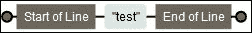
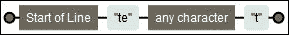
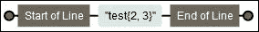
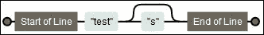
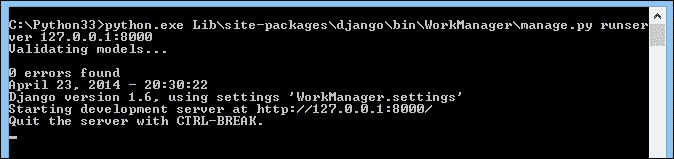

# 第三章：使用 Django 的 Hello World！

在本章中，我们实际上不会开始开发阶段。相反，我们将学习网站的基础知识，以了解 Django，即项目和应用程序的创建。在本章中，我们还将：

+   学习如何使用正则表达式

+   创建你的第一个 URL

+   创建你的第一个视图

+   测试你的应用程序

在本章结束时，我们将创建我们的第一个网页，显示`Hello World!`。

# Django 中的路由

在上一章中，我们编辑了`settings.py`文件来配置我们的 Django 项目。我们将再次编辑`settings.py`以添加一个新参数。以下行必须存在于`settings.py`中：

```py
ROOT_URLCONF = 'Work_manager.urls'
```

此参数将定义包含我们网站所有 URL 的 Python 文件。我们已经谈到了之前的文件，因为它在`Work_manager`文件夹中。用于定义`ROOT_URLCONF`变量的语法意味着 Django 将`Workmanager`包中的`urls.py`文件中的 URLs 带到项目的根目录。

我们的应用程序的路由将基于此文件。路由定义了基于发送的 URL 将如何处理客户端请求。

实际上，当控制器接收到客户端请求时，它将进入`urls.py`文件，并检查 URL 是否是客户端的请求，并使用相应的视图。

例如，在以下 URL 中，Django 将在`urls.py`中查找`search`字符串，以了解要采取什么操作：`http://localhost/search`。

这是`urls.py`文件的样子，它是 Django 创建项目时创建的：

```py
from django.conf.urls import patterns, include, url
from django.contrib import admin
admin.autodiscover()
urlpatterns = patterns('',
    # Examples:
    # url(r'^$', 'Work_msanager.views.home', name='home'),
    # url(r'^blog/', include('blog.urls')),
    url(r'^admin/', include(admin.site.urls)),
)
```

我们将详细介绍此文件的组件：

+   第一行导入了在 URL 管理中常用的函数。

+   下面两行对管理模块很有用。我们将通过在行首添加`#`来进行注释。这些行将在后面的章节中解释。

+   其余的行定义了`urlpatterns`变量中的 URL。我们还将审查以`url (r '^ admin`开头的 URL。

在从 Web 客户端接收到请求后，控制器会线性地遍历 URL 列表，并检查 URL 是否符合正则表达式。如果不符合，控制器将继续检查列表的其余部分。如果符合，控制器将通过在 URL 中发送参数来调用相应视图的方法。如果您想编写 URL，您必须首先了解正则表达式的基础知识。

# 正则表达式

正则表达式就像一个小语言本身。尽管它们复杂且难以理解，但它们可以以极大的灵活性操纵字符串。它们由一系列字符组成，用于定义模式。

我们不会在本书中探讨所有正则表达式的概念，因为这将需要几章，并使我们偏离本书的主要目标。在编写您的第一个 URL 之前，练习您的正则表达式；许多网站可以帮助您在正则表达式上进行训练。搜索“在线正则表达式匹配器”，您将找到通过 JavaScript 检查您的正则表达式的页面。您还可以通过 Félix López 撰写的书籍*Mastering Regular Expressions Python*，*Packt Publishing*进一步探索正则表达式。有一个实用工具可以可视化正则表达式。这个工具叫做**Regexper**，由 Jeff Avallone 创建。我们将使用它来表示正则表达式的图表。

以下部分探讨了使用的模式、函数和示例，以帮助您更好地理解正则表达式。

## 未解释的字符

未解释的字符，如字母和数字，在正则表达式中意味着它们存在于字符串中，并且必须按照完全相同的顺序放置。

例如，正则表达式`test01`将验证`test01`、`dktest01`和`test0145g`字符串，但不会验证`test10`或`tste01`。

正则表达式`test-reg`将验证`a test-regex`，但不会验证`test-aregex`或`testregex:`


`test01`正则表达式的可视化表示

## 行的开头和结尾

要检查字符串是否必须出现在行的开头或结尾，你必须使用`^`和`$`字符。如果`^`出现在字符串的开头，验证将在字符串的开头进行。对于`$`在结尾的情况也是一样。

以下是一些示例：

+   `^test`正则表达式将验证`test`和`test01l`，但不会验证`dktest`或`ttest01`：

+   正则表达式`test$`将验证`test`和`01test`，但不会验证`test01`：

+   正则表达式`^test$`只验证`test`：

## 任意字符的正则表达式

在正则表达式中，句点（`.`）表示“任意字符”。因此，当你验证无法推断的字符时，会使用句点。如果你尝试在你的语音中验证句点，使用转义字符`\`。

以下是示例：

+   `^te.t`验证`test`或`tept`：

+   `^test\.me$`只验证`test.me`：

## 字符类

要验证字符，你可以使用字符类。字符类用方括号括起来，包含所有允许的字符。要验证位置中的所有数字和字母，你必须使用`[0123456789a]`。例如，`^tes[t0e]$`只验证三个字符串：`test`、`tes0`和`tese`。

你也可以使用以下预定义类：

+   `[0-9]`等同于`[0123456789]`

+   `[a-z]`匹配所有字母，`[abcdefghijklmnopqrstuvwxyz]`

+   `[A-Z]`匹配所有大写字母

+   `[a-zA-Z]`匹配所有字母

以下是快捷方式：

+   `\d`等同于`[0-9]`

+   `\w`等同于`[a-zA-Z0-9_]`

+   `[0-9]`等同于`[0123456789]`

## 验证字符的数量

到目前为止，我们学习的一切都是定义一个且仅一个字符的元素。要验证一个字符出现一次或多次，必须使用大括号`{x, y}`，其中`x`定义了最小出现次数，`y`是最大出现次数。如果其中一个未指定，将会有一个未定义的值。例如，如果你忘记在`{2,}`中包含一个元素，这意味着该字符必须至少出现两次。

以下是一些示例：

+   `^test{2, 3}$`只验证`testt`和`testtt`：

+   `^tests{0,1}$`只验证`test`和`tests`

+   `. ^ {1} $`验证除一个之外的所有通道：空字符串

以下是快捷方式：

+   `*`等同于`{0}`

+   `?`等同于`{0, 1}`

+   `+`等同于`{1}`

正则表达式非常强大，即使在 Django 编程之外也会非常有用。

# 创建我们的第一个 URL

Django 的一个有趣特性之一是包含了一个开发服务器。事实上，在网站开发阶段，开发人员不需要设置 Web 服务器。然而，当你将网站投入生产时，你将需要安装一个真正的 Web 服务器，因为它不适用于生产环境。

事实上，Django 服务器并不安全，几乎无法承受大量负载。这并不意味着你的网站会变得缓慢且充满缺陷；它只是意味着你必须在生产中使用一个真正的 Web 服务器。

要使用开发服务器，我们需要使用`manage.py` runserver 命令文件。我们必须启动命令提示符并进入项目根目录（使用`cd`命令浏览文件夹）来执行命令：

```py
manage.py runserver 127.0.0.1:8000

```

这个命令启动了 Django 开发服务器。让我们逐步解释控制：

+   `runserver`参数启动开发服务器。

+   `127.0.0.1`是我们网络适配器的内部 IP 地址。这意味着我们的服务器只会监听和响应在其上启动的计算机。如果我们在一个局域网中，并且希望使我们的网站在除我们之外的计算机上可用，我们将输入我们的本地 IP 地址而不是`127.0.0.1`。值`127.0.0.1`是参数的默认值。

+   `8000`定义了服务器的监听端口。这个设置对于在一台计算机上运行多个 web 服务器非常有用。

如果命令执行正确，窗口应该显示`0 errors found`的消息，如下面的截图所示：



要查看结果，我们必须打开浏览器并输入以下 URL：`http://localhost:8000`。

Django 通过显示以下消息确认我们的开发环境是正常的：


这个消息也意味着我们没有指定的 URL。我们将向我们的文件添加两个 URL：

```py
url (r'^$', 'TasksManager.views.index.page), 
url (r'^index$', 'TasksManager.views.index.page') 

```

### 提示

你应该始终了解 Django 中的错误，特别是在 Django 的 GitHub 页面上：[`github.com/django`](https://github.com/django)。

在我们输入的 URL 中，我们定义了第一个参数（正则表达式），它将验证 URL。我们将在下一章讨论第二个参数。

让我们回到浏览器，用*F5*键刷新页面。Django 将显示一个`ViewDoesNotExist at /`的错误。

这意味着我们的模块不存在。你必须研究你的错误；在这个例子中，我们有一个错误。有了这个错误，我们将直接修复不起作用的部分。

我们经常遇到的另一个问题是`404 页面未找到`错误。我们可以通过在浏览器中输入`http://localhost:8000/test404`来生成它。这个错误意味着没有 URL 验证`test404`字符串。

我们必须注意错误，因为看到并解决它们可以节省我们很多时间。

# 创建我们的第一个视图

现在我们已经创建了我们的 URL 并由路由系统解释，我们必须确保一个视图（在 MVC 模式中是一个控制器）满足客户的需求。

这是`urls.py`中存在的第二个参数的功能。这个参数将定义扮演视图角色的方法。例如，我们的第一个 URL：

```py
url (r'^$', 'TasksManager.views.index.page'), 
```

首先，正如我们在学习正则表达式时所看到的，这个 URL 只有在浏览`http://localhost:8000` URL 时才有效。URL 中的第二个参数意味着在`index.py`文件中有一个名为`page`的方法将处理请求。`index.py`文件位于`TasksManager`应用程序根目录下的`views`包中。

当我们希望 Python 识别一个文件夹为包时，我们需要创建一个包含`__init__.py`文件的文件夹，我们可以将其留空。

你可以选择另一种结构来存储你的视图。你必须选择最适合你的项目的结构。从第一行代码开始，对你的项目有一个长期的愿景，以定义高质量的架构。

在我们的`index.py`文件中，我们将创建一个名为`page()`的方法。这个方法将向客户端返回一个 HTML 页面。页面是通过 HTTP 协议返回的，所以我们将使用`HttpResponse()`函数及其导入。这个`HttpResponse()`函数的参数返回我们将返回给浏览器的 HTML 内容。为了简化阅读这个例子，我们没有使用正确的 HTML 结构，因为我们只是向客户端返回`Hello world!`，如下面的代码所示：

```py
# - * - Coding: utf -8 - * -
from django.http import HttpResponse
# View for index page.
def page (request) :
 return HttpResponse ("Hello world!" )
```

在前面的例子中，我们在`page()`方法之前添加了一个注释。注释非常重要。它们帮助你快速理解你的代码。

我们还设置了 UTF-8 字符的编码。这将提高我们的应用与其他语言的兼容性。我们不一定在书中后面指出它，但建议使用它。

# 测试我们的应用程序

要测试我们的第一个页面，我们将不得不使用`runserver`命令，这是我们在本章中早些时候看到的。为了做到这一点，您必须运行命令并在浏览器中刷新您的页面，`http://localhost:8000`。

如果您在浏览器中看到`Hello World!`而没有错误出现，这意味着您已经按照之前的步骤进行了操作。如果您忘记了某些东西，请不要犹豫在互联网上找到您的错误；其他人可能也经历过同样的情况。

然而，我们必须改善我们的观点，因为目前我们并不尊重 MVC 模型。我们将创建一个模板来分离 Python 代码的 HTML，并且具有更多的灵活性。

# 总结

在本章中，我们学习了正则表达式的基础知识。这是一个强大的工具，用于操作字符串。我们学会了如何操作系统路由 URL。我们还创建了我们的第一个视图，将一个字符串返回给客户端。在下一章中，我们将学习如何使用 Django 创建可维护的模板。
