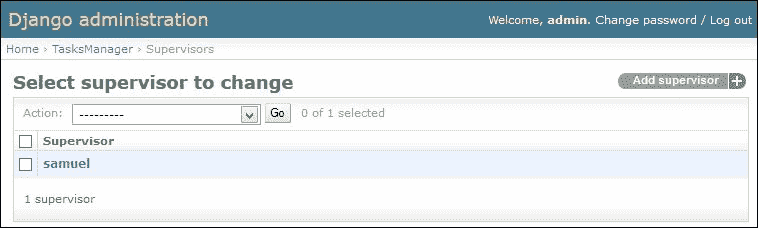
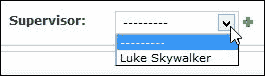

# 第五章：使用模型

我们刚刚创建的网站只包含静态数据；但是，我们想要存储数据以自动化所有任务。这就是为什么有模型；它们将在我们的视图和数据库之间建立联系。

像许多框架一样，Django 提出了使用抽象层进行数据库访问。这个抽象层称为**对象关系映射**（**ORM**）。这允许您使用 Python 实现对象来访问数据，而不必担心使用数据库。使用这个 ORM，我们不需要为简单和稍微复杂的操作使用 SQL 查询。这个 ORM 属于 Django，但还有其他的，比如**SQLAlchemy**，它是一个质量很高的 ORM，特别是在 Python TurboGears 框架中使用。

模型是从`Model`类继承的对象。`Model`类是一个专门设计用于数据持久性的 Django 类。

我们在模型中定义字段。这些属性允许我们在模型内组织数据。要在数据库和 SQL 之间建立连接，我们可以说一个模型在数据库中由一个表表示，而模型属性在表中由一个字段表示。

在本章中，我们将解释：

+   如何设置对数据库的访问

+   如何安装 South 进行数据库迁移

+   如何创建简单的模型

+   如何在模型之间创建关系

+   如何扩展我们的模型

+   如何使用管理模块

# 数据库和 Django

Django 可以与许多数据库进行接口。但是，在我们的应用程序开发过程中，我们使用了 Django 中包含的 SQLite 库。

我们将修改`settings.py`以设置与数据库的连接：

```py
DATABASES = {
  'default': {
    'ENGINE': 'django.db.backends.sqlite3', 
    'NAME': os.path.join(PROJECT_ROOT, 'database.db'), 
    'USER': '',                     
    'PASSWORD': '',                 
    'HOST': '',                     
    'PORT': '',                     
  }
}
```

以下是前面代码中提到的属性的描述：

+   `ENGINE`属性指定要使用的数据库类型。

+   `NAME`属性定义了 SQLite 数据库的路径和最终名称。我们在我们的代码中使用`os.path.join`的语法，并且它与所有操作系统兼容。数据库文件将包含在项目目录中。

+   其他属性在使用数据库服务器时很有用，但由于我们将使用 SQLite，因此不需要定义它们。

# 使用 South 进行迁移

**South**是 Django 的一个非常有用的扩展。它在更改字段时简化了数据库的迁移。它还保留了数据库结构更改的历史记录。

我们现在谈论它是因为必须在创建数据库之前安装它才能正常工作。

Django 1.7 集成了迁移系统。您将不再需要使用 South 来进行 Django 应用的迁移。您可以在[`docs.djangoproject.com/en/dev/topics/migrations/`](https://docs.djangoproject.com/en/dev/topics/migrations/)找到有关集成到 Django 1.7 中的迁移系统的更多信息。

## 安装 South

要安装 South，我们使用`pip`命令。我们已经用它来安装 Django。要做到这一点，请运行以下命令：

```py
pip install South

```

在实际使用 South 之前，我们必须更改`settings.py`文件，以便 South 能够在 Django 中良好集成。为此，您必须转到`INSTALLED_APPS`并添加以下行（根据版本的不同，安装 South 可能已经添加了这行）：

```py
'south',
'TasksManager',
```

## 使用 South 扩展

在我们进行第一次迁移和生成数据库之前，我们还必须创建模式迁移。为此，我们必须运行以下命令：

```py
manage.py schemamigration TasksManager --initial 

```

然后，我们必须执行初始迁移：

```py
manage.py syncdb --migrate 

```

Django 要求我们首先创建一个帐户。这个帐户将是超级用户。记住您输入的登录名和密码；您以后会需要这些信息。

South 现在已经完全可用。每次我们需要修改模型时，我们都会进行迁移。但是，为了正确进行迁移，您必须牢记以下事项：

+   永远不要执行 Django 的`syncdb`命令。第一次运行`syncdb --migrate`后，永远不要再次运行它。之后使用`migrate`。

+   始终在新字段中放置默认值；否则，我们将被要求分配一个值。

+   每次我们完成编辑我们的模型时，我们必须按正确的顺序执行以下两个命令：

```py
manage.py schemamigration TasksManager –auto
manage.py migrate TasksManager

```

# 创建简单模型

要创建模型，我们必须已经深入研究了应用程序。模型是任何应用程序的基础，因为它们将存储所有数据。因此，我们必须仔细准备它们。

关于我们的`Tasksmanager`应用程序，我们需要一个用户来保存在项目上执行的任务。我们将创建两个模型：`User`_`django`和`Project`。

我们需要将我们的模型存储在`models.py`文件中。我们将编辑`TasksManager`文件夹中的`models.py`文件。我们不需要修改配置文件，因为当您需要模型时，我们将不得不导入它。

文件已经存在并且有一行。以下一行允许您导入 Django 的基本模型：

```py
from django.db import models
```

## 用户资料模型

要创建`UserProfile`模型，我们要问自己一个问题，即“*我们需要保存关于用户的哪些数据？*”。我们需要以下数据：

+   用户的真实姓名

+   一个将标识每个用户的昵称

+   一个对用户身份验证有用的密码

+   电话号码

+   出生日期（这不是必要的，但我们必须研究日期！）

+   用户上次连接的日期和时间

+   电子邮件地址

+   年龄（以年为单位）

+   用户帐户的创建日期

+   专业化，如果是主管

+   用户类型

+   如果您是开发人员，那么您就是主管

所需的模型如下：

```py
class UserProfile(models.Model):
  name = models.CharField(max_length=50, verbose_name="Name")
  login = models.CharField(max_length=25, verbose_name="Login")
  password = models.CharField(max_length=100, verbose_name="Password")
  phone = models.CharField(max_length=20, verbose_name="Phone number" , null=True, default=None, blank=True)
  born_date = models.DateField(verbose_name="Born date" , null=True, default=None, blank=True)
  last_connection = models.DateTimeField(verbose_name="Date of last connection" , null=True, default=None, blank=True)
  email = models.EmailField(verbose_name="Email")
  years_seniority = models.IntegerField(verbose_name="Seniority", default=0)
  date_created = models.DateField(verbose_name="Date of Birthday", auto_now_add=True)
```

我们还没有定义专业化、用户类型和主管，因为这些点将在下一部分中看到。

在前面的代码中，我们可以看到`Django_user`继承自`Model`类。这个`Model`类有我们需要操作模型的所有方法。我们也可以重写这些方法来定制模型的使用。

在这个类中，我们通过添加一个属性来添加我们的字段，并指定值。例如，名字字段是一个字符字符串类型，最大长度为 50 个字符。`verbose_name`属性将是我们在表单中定义字段的标签。以下是常用的字段类型列表：

+   `CharField`：这是一个具有有限字符数的字符字符串

+   `TextField`：这是一个具有无限字符的字符字符串

+   `IntegerField`：这是一个整数字段

+   `DateField`：这是一个日期字段

+   `DateTimeField`：这个字段包括日期以及小时、分钟和秒的时间

+   `DecimalField`：这是一个可以精确定义的小数

### 提示

Django 自动保存一个自动递增的`id`字段。因此，我们不需要定义主键。

## 项目模型

为了保存我们的项目，我们需要以下数据：

+   标题

+   描述

+   客户名称

这些因素使我们能够定义以下模型：

```py
class Project(models.Model):
  title = models.CharField(max_length=50, verbose_name="Title")
  description = models.CharField(max_length=1000, verbose_name="Description")
  client_name = models.CharField(max_length=1000, verbose_name="Client name")
```

为了遵守良好的实践，我们本来不需要为客户定义一个文本字段，而是定义一个与客户表的关系。为了简化我们的第一个模型，我们为客户名称定义一个文本字段。

# 模型之间的关系

关系是连接我们的模型的元素。例如，在这个应用程序的情况下，一个任务与一个项目相关联。实际上，开发人员为特定项目执行任务，除非它是一个更一般的任务，但这超出了我们项目的范围。我们定义一对多类型的关系，以表示一个任务总是涉及一个单一项目，但一个项目可以与许多任务相关联。

还有两种其他类型的关系：

+   一对一关系将模型分为两部分。生成的数据库将创建两个通过关系链接的表。我们将在身份验证模块的章节中看到一个例子。

+   多对多关系定义与同一类型的任何模型连接的关系。例如，一个作者可以出版多本书，一本书可能有几个作者。

## 创建具有关系的任务模型

对于任务模型，我们需要以下元素：

+   用几个词定义任务的一种方式

+   有关任务的更多详细描述

+   过去的生活

+   它的重要性

+   它所附属的项目

+   创建它的开发人员

这使我们能够编写以下模型：

```py
class Task(models.Model):
  title = models.CharField(max_length=50, verbose_name="Title")
  description = models.CharField(max_length=1000, verbose_name="Description")
  time_elapsed = models.IntegerField(verbose_name="Elapsed time" , null=True, default=None, blank=True)
  importance = models.IntegerField(verbose_name="Importance")
  project = models.ForeignKey(Project, verbose_name="Project" , null=True, default=None, blank=True)
  app_user = models.ForeignKey(UserProfile, verbose_name="User")
```

在这个模型中，我们定义了两种外键字段类型：`project`和`app_user`。在数据库中，这些字段包含它们所附属的记录的登录详细信息在另一个表中。

定义与`Project`模型的关系的`project`字段有两个额外的属性：

+   `Null`：这决定了元素是否可以定义为空。`project`字段中存在此属性的事实意味着任务不一定与项目相关联。

+   `Default`：这设置字段将具有的默认值。也就是说，如果我们在保存模型之前没有指定项目的值，任务将不会与域相关联。

# 扩展模型

继承模型允许为两个不同的模型使用共同的字段。例如，在我们的`App_user`模型中，我们无法确定随机记录是开发人员还是监督员。

一个解决方案是创建两个不同的模型，但我们将不得不复制所有共同的字段，如名称、用户名和密码，如下所示：

```py
class Supervisor(models.Model):
  # Duplicated common fields
  specialisation = models.CharField(max_length=50, verbose_name="Specialisation")

class Developer(models.Model):
  # Duplicated common fields
  supervisor = models.ForeignKey(Supervisor, verbose_name="Supervisor")
```

复制代码是一件遗憾的事，但这是 Django 和 DRY 必须遵循的原则。这就是为什么有一个继承模型的原因。

实际上，遗留模型用于定义一个主模型（或超级模型），其中包含多个模型的共同字段。子模型会自动继承超级模型的字段。

没有比一个例子更明确的了；我们将修改我们的`Developer`和`Supervisor`类，使它们继承`App_user`：

```py
class Supervisor(UserProfile):
  specialisation = models.CharField(max_length=50, verbose_name="Specialisation")

class Developer(UserProfile):
  supervisor = models.ForeignKey(Supervisor, verbose_name="Supervisor")
```

遗留数据库的结果允许我们创建三个表：

+   `App_user`模型的表，包含模型属性的字段

+   `Supervisor`模型的表，包含一个专业的文本字段和一个与`App_user`表有外键关系的字段

+   一个`Developer`表，有两个字段：一个与`Supervisor`表关联的字段，一个与`App_user`表关联的字段

现在我们已经分开了两种类型的用户，我们将修改与`App_user`的关系，因为只有开发人员会记录他们的任务。在`Tasks`模型中，我们有以下行：

```py
app_user = models.ForeignKey(App_user, verbose_name="User")
```

这段代码转换如下：

```py
developer = models.ForeignKey(Developer, verbose_name="User")
```

为了使数据库命令生成工作，我们必须按正确的顺序放置模型。实际上，如果我们定义与尚未定义的模型的关系，Python 将引发异常。目前，模型需要按照描述的顺序定义。稍后，我们将看到如何解决这个限制。

在下一章中，我们将对模型执行查询。这需要数据库与模型同步。在开始下一章之前，我们必须先迁移 South。

要执行迁移，我们必须使用本章开头看到的命令。为了简化迁移，我们还可以在 Python 文件夹中创建一个批处理文件，其中我们将放入以下行：

```py
manage.py schemamigration TasksManager --auto
manage.py migrate
pause

```

以下是一个 bash 脚本，您可以在`Work_manager`文件夹中创建，可以在 Debian Linux 上执行相同的操作：

```py
#!/bin/bash
manage.py runserver 127.0.0.1:8000

```

这样，当您迁移 South 时，它将执行此文件。`pause`命令允许您在不关闭窗口的情况下查看结果或显示的错误。

# 管理员模块

管理模块非常方便，并且在 Django 中默认包含。这是一个可以轻松维护数据库内容的模块。这不是一个数据库管理器，因为它无法维护数据库的结构。

您可能会问的一个问题是，“*除了管理工具数据库之外还有什么？*”答案是管理模块完全集成了 Django 并使用这些模型。

以下是它的优点：

+   它管理模型之间的关系。这意味着如果我们想保存一个新的开发人员，该模块将提出所有主管的列表。这样，它就不会创建一个不存在的关系。

+   它管理 Django 权限。您可以根据模型和 CRUD 操作为用户设置权限。

+   它很快就建立起来了。

基于 Django 模型而不是数据库，这个模块允许用户编辑记录的数据。

## 安装模块

要实现管理模块，请编辑`settings.py`文件。在`INSTALLED_APPS`设置中，您需要添加或取消注释以下行：

```py
'django.contrib.admin'
```

您还必须通过添加或取消注释以下行来编辑`urls.py`文件：

```py
from django.contrib import admin
admin.autodiscover()
url (r'^admin', include(admin.site.urls)),
```

导入管理模块的行必须在文件的开头与其他导入一起。运行`autodiscover()`方法的行必须在导入之后并在`urlpatterns`定义之前找到。最后，最后一行是一个应该在`urlpatterns`中的 URL。

我们还必须在`TasksManager`文件夹中创建一个`admin.py`文件，在其中我们将定义要集成到管理模块中的样式：

```py
from django.contrib import admin
from TasksManager.models import UserProfile, Project, Task , Supervisor , Developer
admin.site.register(UserProfile)
admin.site.register(Project)
admin.site.register(Task)
admin.site.register(Supervisor)
admin.site.register(Developer)
```

现在我们已经配置了管理模块，我们可以轻松地管理我们的数据。

## 使用模块

要使用管理模块，我们必须连接到刚刚定义的 URL：`http://localhost:8000/admin/`。

我们必须在创建数据库时连接定义的登录：

1.  一旦我们连接，模型列表就会出现。

1.  如果我们点击**Supervisor**模型链接，我们会到达一个页面，我们可以通过窗口右上角的按钮添加一个主管：

1.  通过点击这个按钮，我们加载一个由表单组成的页面。这个表单自动提供了管理日期和时间的实用工具：

让我们添加一个新的主管，然后添加一个开发人员。当您想选择主管时，您可以在下拉框中看到我们刚刚创建的主管。右侧的绿色十字架允许您快速创建一个主管。

在接下来的章节中，我们将为我们的模型定义`str`方法。这将改进管理模块中对象的显示列表。

# 模型的高级用法

我们学习了允许我们创建简单应用程序的模型的基础知识。有时，需要定义更复杂的结构。

## 为同一模型使用两个关系

有时，将两个（或更多）外键存储在单个模型中是有用的。例如，如果我们希望两个开发人员并行工作在同一任务上，我们必须在我们的模型中使用`related_name`属性。例如，我们的`Task`模型包含以下行的两个关系：

```py
developer1 = models.ForeignKey (Developer , verbose_name = "User" , related_name = "dev1" )
developer2 = models.ForeignKey (Developer , verbose_name = "User" , related_name = "dev2" )
```

在本书的后续部分，我们将不使用这两个关系。为了有效地遵循本书，我们必须返回到我们之前定义的`Task`模型。

### 注意

在这里，我们定义了同一任务上的两个开发人员。最佳实践建议我们在`Task`模型中创建一个多对多的关系。详细参数允许您指定一个中间表来存储附加数据。这是一个可选步骤。这种关系的示例如下：

```py
#Relationship to add to the Task model
developers = models.ManyToManyField(Developer , through="DeveloperWorkTask")
class DeveloperWorkTask(models.Model):
  developer = models.ForeignKey(Developer)
  task = models.ForeignKey(Task)
  time_elapsed_dev = models.IntegerField(verbose_name="Time elapsed", null=True, default=None, blank=True)
```

## 定义 str 方法

如在管理模块使用部分中已经提到的，`__str__()`方法将允许更好地查看我们的模型。这个方法将设置用于显示我们的模型实例的字符串。当 Django 与 Python 3 不兼容时，这个方法被`__unicode__()`方法替换。

例如，当我们添加了一个开发者时，定义主管的下拉列表显示了“主管对象”行。显示主管的姓名会更有帮助。为了做到这一点，改变我们的`App_user`类并添加`str()`方法：

```py
class UserProfile ( models.Model ) :
# Fields...
def __str__ (self):
  return self.name
```

这个方法将返回主管的姓名以便显示，并允许您轻松管理管理：



# 总结

在本章中，我们学习了使用 South 进行迁移。我们还学习了如何创建简单的模型和模型之间的关系。此外，我们还学习了如何安装和使用管理模块。在下一章中，我们将学习如何操作我们的数据。我们将学习如何对数据进行四种主要操作：添加、读取（和研究）、修改和删除。
