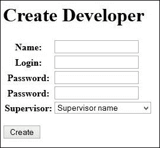
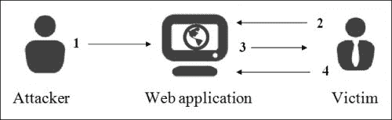
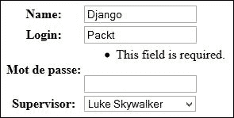

# 第七章：使用 Django 表单

我们都知道 HTML 表单。这是一个包含`<input>`和`<select>`标签的`<form>`标签。用户可以填写或编辑这些项目并将它们返回到服务器。这是存储客户端提供的数据的首选方式。像 Django 这样的框架利用了 HTML 表单来使其更好。

Django 表单继承自`Form`类对象。这是一个我们将设置属性的对象。这些属性将是表单中的字段，我们将定义它们的类型。

在本章中，我们将学习如何执行以下操作：

+   创建 HTML 表单

+   处理表单发送的数据

+   创建 Django 表单

+   验证和操作从 Django 表单发送的数据

+   基于模型创建表单

+   自定义错误消息并使用小部件

Django 表单的优点如下：

+   对抗 CSRF 漏洞可以很容易地实现。我们将在此后讨论 CSRF 漏洞。

+   数据验证是自动的。

+   表单可以很容易地定制。

但比较标准 HTML 表单和 Django 表单的最佳方法是通过一个例子来练习：添加开发者的表单。

# 不使用 Django 表单添加开发者

在本节中，我们将向您展示如何在不使用 Django 表单的情况下添加开发者。这个例子将展示使用 Django 可以节省多少时间。

将以下 URL 添加到您的`urls.py`文件中：

```py
url(r'^create-developer$', 'TasksManager.views.create_developer.page', name="create_developer"),
```

## HTML 表单模板

我们将在视图之前创建一个模板。实际上，我们将用包含表单的模板填充视图。我们没有把所有字段都放在模型中，因为代码太长了。使用更短的代码学习更好。以下是我们的模板`template/en/public/create_developer.html`：

```py


  Create Developer 


  Create Developer


  <form method="post" action="" >
    <table>
      <tr>
        <td>Name</td>
        <td>
          <input type="text" name="name" />
        </td>
      </tr>
      <tr>
        <td>Login</td>
        <td>
          <input type="text" name="login" />
        </td>
      </tr>
      <tr>
        <td>Password</td>
        <td>
          <input type="text" name="password" />
        </td>
      </tr>
      <tr>
        <td>Supervisor</td>
        <td>
          <select name="supervisor">
            
              <option value="{{ supervisor.id }}">{{ supervisor.name }}</option>
            
          </select>
        </td>
      </tr>
      <tr>
        <td></td>
        <td>
          <input type="submit" value="Valid" />
          </td>
      </tr>
    </table>
  </form>

```

请注意，模板令人印象深刻，但它是一个极简的表单。

## 视图使用 POST 数据接收

以下截图显示了我们将创建的网页：



将处理此表单的视图如下。将视图保存在文件`views/create_developer.py`中：

```py
from django.shortcuts import render
from django.http import HttpResponse
from TasksManager.models import Supervisor, Developer
# View for create_developer
def page(request):
  error = False
  # If form has posted
  if request.POST: 
  # This line checks if the data was sent in POST. If so, this means that the form has been submitted and we should treat it.
    if 'name' in request.POST: 
    # This line checks whether a given data named name exists in the POST variables.
      name = request.POST.get('name', '')
      # This line is used to retrieve the value in the POST dictionary. Normally, we perform filters to recover the data to avoid false data, but it would have required many lines of code.
    else:
      error=True
    if 'login' in request.POST:
      login = request.POST.get('login', '')
    else:
      error=True
    if 'password' in request.POST:
      password = request.POST.get('password', '')
    else:
      error=True
    if 'supervisor' in request.POST:
      supervisor_id = request.POST.get('supervisor', '')
    else:
      error=True
    if not error:
      # We must get the supervisor
      supervisor = Supervisor.objects.get(id = supervisor_id)
      new_dev = Developer(name=name, login=login, password=password, supervisor=supervisor)
      new_dev.save()
      return HttpResponse("Developer added")
    else:
      return HttpResponse("An error as occured")
  else:
    supervisors_list = Supervisor.objects.all()
    return render(request, 'en/public/create_developer.html')
```

在这个视图中，我们甚至没有检查监督员是否存在。即使代码是功能性的，注意它需要很多行，而且我们没有验证传输数据的内容。

我们使用`HttpResponse()`方法，这样我们就不必创建额外的模板。当字段输入不正确时，我们也没有关于客户端错误的详细信息。

如果您想验证您的代码是否正常工作，请不要忘记在管理模块中检查数据。

要尝试这个表单，您可以在`index.html`文件的`article_content`块中添加以下行：

```py
<a href="">Create developer</a>
```

# 使用 Django 表单添加开发者

Django 表单使用从`Form`类继承的对象。这个对象将处理我们在前面的例子中手动完成的大部分工作。

在显示表单时，它将生成表单模板的内容。如果需要，我们可以更改对象发送到模板的字段类型。

在接收数据时，对象将检查每个表单元素的内容。如果有错误，对象将向客户端发送明确的错误。如果没有错误，我们可以确定表单数据是正确的。

## CSRF 保护

**跨站请求伪造**（**CSRF**）是一种针对加载包含恶意请求的页面的用户的攻击。恶意脚本利用受害者的身份验证执行不需要的操作，如更改数据或访问敏感数据。

在 CSRF 攻击期间执行以下步骤：

1.  攻击者进行脚本注入。

1.  执行 HTTP 查询以获取网页。

1.  下载包含恶意脚本的网页。

1.  恶意脚本执行。

在这种攻击中，黑客还可以修改对网站用户可能至关重要的信息。因此，对于 Web 开发人员来说，了解如何保护他们的网站免受这种攻击是非常重要的，而 Django 将在此方面提供帮助。

要重新启用 CSRF 保护，我们必须编辑`settings.py`文件，并取消以下行的注释：

```py
'django.middleware.csrf.CsrfViewMiddleware',
```

此保护确保已发送的数据确实是从特定属性页面发送的。您可以通过两个简单的步骤来检查：

1.  在创建 HTML 或 Django 表单时，我们插入一个将存储在服务器上的 CSRF 令牌。当表单被发送时，CSRF 令牌也将被发送。

1.  当服务器接收到来自客户端的请求时，它将检查 CSRF 令牌。如果有效，它将验证请求。

不要忘记在启用保护的站点的所有表单中添加 CSRF 令牌。HTML 表单也涉及其中，我们刚刚创建的表单不包括令牌。为了使先前的表单与 CSRF 保护一起工作，我们需要在标签和`<form> </form>`中添加以下行：

```py

```

## 带有 Django 表单的视图

我们将首先编写包含表单的视图，因为模板将显示在视图中定义的表单。Django 表单可以存储在项目文件的根目录下的`forms.py`等其他文件中。我们直接将它们包含在视图中，因为表单只会在此页面上使用。根据项目，您必须选择最适合您的架构。我们将在`views/create_developer.py`文件中创建我们的视图，代码如下：

```py
from django.shortcuts import render
from django.http import HttpResponse
from TasksManager.models import Supervisor, Developer
from django import forms
# This line imports the Django forms package
class Form_inscription(forms.Form):  
# This line creates the form with four fields. It is an object that inherits from forms.Form. It contains attributes that define the form fields.
  name = forms.CharField(label="Name", max_length=30)
  login      = forms.CharField(label="Login", max_length=30)
  password   = forms.CharField(label="Password", widget=forms.PasswordInput)
  supervisor = forms.ModelChoiceField(label="Supervisor", queryset=Supervisor.objects.all())
# View for create_developer
def page(request):
  if request.POST:
    form = Form_inscription(request.POST)
    # If the form has been posted, we create the variable that will contain our form filled with data sent by POST form.
    if form.is_valid():
    # This line checks that the data sent by the user is consistent with the field that has been defined in the form.
      name          = form.cleaned_data['name']
    # This line is used to retrieve the value sent by the client. The collected data is filtered by the clean() method that we will see later. This way to recover data provides secure data.
      login         = form.cleaned_data['login']
      password      = form.cleaned_data['password']
      supervisor    = form.cleaned_data['supervisor'] 
      # In this line, the supervisor variable is of the Supervisor type, that is to say that the returned data by the cleaned_data dictionary will directly be a model.
      new_developer = Developer(name=name, login=login, password=password, email="", supervisor=supervisor)
      new_developer.save()
      return HttpResponse("Developer added")
    else:
      return render(request, 'en/public/create_developer.html', {'form' : form})
      # To send forms to the template, just send it like any other variable. We send it in case the form is not valid in order to display user errors:
    else:
    form = Form_inscription()
    # In this case, the user does not yet display the form, it instantiates with no data inside.
    return render(request, 'en/public/create_developer.html', {'form' : form})
```

此截图显示了表单的显示以及错误消息的显示：



## Django 表单的模板

我们为此视图设置模板。模板将会更短：

```py


  Create Developer


  Create Developer


  <form method="post" action="" >
     
    <!-- This line inserts a CSRF token. -->
    <table>
      {{ form.as_table }}
    <!-- This line displays lines of the form.-->
    </table>
    <p><input type="submit" value="Create" /></p>
  </form>

```

由于完整的表单操作在视图中，模板只需执行`as_table()`方法来生成 HTML 表单。

先前的代码以表格形式显示数据。生成 HTML 表单结构的三种方法如下：

+   `as_table`：这会在`<tr> <td>`标签中显示字段

+   `as_ul`：这会在`<li>`标签中显示表单字段

+   `as_p`：这会在`<p>`标签中显示表单字段

因此，我们通过 Django 表单快速编写了一个带有错误处理和 CSRF 保护的安全表单。在附录中，*速查表*，您可以找到表单中不同可能的字段。

# 基于模型的表单

ModelForms 是基于模型的 Django 表单。这些表单的字段是从我们定义的模型自动生成的。实际上，开发人员经常需要创建与数据库中的字段对应的表单，以适应非 MVC 网站。

这些特殊的表单有一个`save()`方法，将在新记录中保存表单数据。

## 监督员创建表单

首先，我们将以添加监督员为例。为此，我们将创建一个新页面。为此，我们将创建以下 URL：

```py
url(r'^create-supervisor$', 'TasksManager.views.create_supervisor.page', name="create_supervisor"),
```

我们的视图将包含以下代码：

```py
from django.shortcuts import render
from TasksManager.models import Supervisor
from django import forms
from django.http import HttpResponseRedirect
from django.core.urlresolvers import reverse
def page(request):
  if len(request.POST) > 0:
    form = Form_supervisor(request.POST)
    if form.is_valid():
      form.save(commit=True) 
      # If the form is valid, we store the data in a model record in the form.
      return HttpResponseRedirect(reverse('public_index'))
      # This line is used to redirect to the specified URL. We use the reverse() function to get the URL from its name defines urls.py.
    else:
      return render(request, 'en/public/create_supervisor.html', {'form': form})
  else:
    form = Form_supervisor()
    return render(request, 'en/public/create_supervisor.html', {'form': form})
class Form_supervisor(forms.ModelForm): 
# Here we create a class that inherits from ModelForm.
  class Meta:
  # We extend the Meta class of the ModelForm. It is this class that will allow us to define the properties of ModelForm.
    model = Supervisor
    # We define the model that should be based on the form.
    exclude = ('date_created', 'last_connexion', )
    # We exclude certain fields of this form. It would also have been possible to do the opposite. That is to say with the fields property, we have defined the desired fields in the form.
```

如在`exclude = ('date_created', 'last_connexion', )`行中所示，可以限制表单字段。`exclude`和`fields`属性都必须正确使用。实际上，这些属性接收要排除或包括的字段的元组作为参数。它们可以描述如下：

+   `exclude`：这在管理员可访问的表单的情况下使用。因为，如果您在模型中添加一个字段，它将包含在表单中。

+   `fields`：这在表单对用户可访问的情况下使用。实际上，如果我们在模型中添加一个字段，用户将看不到它。

例如，我们有一个网站，销售免版税图像，其中有一个基于 ModelForm 的注册表单。管理员在用户的扩展模型中添加了一个信用字段。如果开发人员在某些字段中使用了`exclude`属性，并且没有添加信用，用户将能够获取他/她想要的信用。

我们将恢复我们之前的模板，在那里我们将更改`<form>`标签的`action`属性中存在的 URL：

```py

```

这个例子向我们展示了 ModelForms 可以通过拥有一个可以定制的表单（例如修改验证）来节省大量开发时间。

在下一章中，我们将看到如何通过基于类的视图更快。

# Django 表单的高级用法

我们已经学习了允许您创建简单表单并进行少量定制的表单的基础知识。有时，定制数据验证和错误显示，或使用特殊图形等方面是有用的。

## 扩展验证表单

对表单字段执行特定验证是有用的。Django 使这变得容易，同时提醒您表单的优势。我们将以添加开发者表单的例子来说明密码的审核。

为此，我们将以以下方式更改我们视图中的表单（在`create_developer.py`文件中）：

```py
class Form_inscription(forms.Form):
  name       = forms.CharField(label="Name", max_length=30)
  login = forms.CharField(label = "Login")
  password = forms.CharField(label = "Password", widget = forms.PasswordInput)
  # We add another field for the password. This field will be used to avoid typos from the user. If both passwords do not match, the validation will display an error message
  password_bis = forms.CharField(label = "Password", widget = forms.PasswordInput) 
  supervisor = forms.ModelChoiceField(label="Supervisor", queryset=Supervisor.objects.all())
  def clean(self): 
  # This line allows us to extend the clean method that is responsible for validating data fields.
    cleaned_data = super (Form_inscription, self).clean()
    # This method is very useful because it performs the clean() method of the superclass. Without this line we would be rewriting the method instead of extending it.
    password = self.cleaned_data.get('password') 
    # We get the value of the field password in the variable.
    password_bis = self.cleaned_data.get('password_bis')
    if password and password_bis and password != password_bis:
      raise forms.ValidationError("Passwords are not identical.") 
      # This line makes us raise an exception. This way, when the view performs the is_valid() method, if the passwords are not identical, the form is not validated .
    return self.cleaned_data
```

通过这个例子，我们可以看到 Django 在表单和审核管理方面非常灵活。它还允许您定制错误的显示。

## 定制错误的显示

有时，显示特定于用户的错误消息可能很重要。例如，公司可能要求密码必须包含某些类型的字符；例如，密码必须至少包含一个数字和多个字母。在这种情况下，最好也在错误消息中指出这一点。实际上，用户更仔细地阅读错误消息而不是帮助消息。

要做到这一点，您必须在表单字段中使用`error_messages`属性，并将错误消息设置为文本字符串。

还可以根据错误类型定义不同的消息。我们将创建一个包含两种常见错误的字典，并为它们提供消息。我们可以定义这个字典如下：

```py
error_name = {
  'required': 'You must type a name !',
  'invalid': 'Wrong format.'
}
```

我们将修改`create_developer.py`中`Form_inscription`表单的名称字段：

```py
name = forms.CharField(label="Name", max_length=30, error_messages=error_name)
```

这样，如果用户没有填写`name`字段，他/她将看到以下消息：**您必须输入一个名称！**。

要将此消息应用于 ModelForm，我们必须转到`models.py`文件并修改包含`name`字段的行。

```py
name = models.CharField(max_length=50, verbose_name="Name", error_messages=error_name)
```

在编辑`models.py`时，我们不应忘记指定`error_name`字典。

这些错误消息通过通知用户他/她的错误来提高网站的质量。当验证复杂时，使用自定义字段上的自定义错误非常重要。然而，不要在基本字段上过度使用，因为这对开发人员来说会浪费时间。

## 使用小部件

小部件是定制表单元素显示的有效方式。实际上，在某些情况下，指定具有特定尺寸的文本区域字段在 ModelForm 中可能是有帮助的。

为了学习使用小部件的实践并继续开发我们的应用程序，我们将创建项目创建页面。这个页面将包含一个 Django 表单，并且我们将在 HTML 的`<textarea>`标签中设置`description`字段。

我们需要将以下 URL 添加到`urls.py`文件中：

```py
url(r'^create_project$', ' TasksManager.views.create_project.page', name='create_project'),
```

然后，在`create_project.py`文件中创建我们的视图，代码如下：

```py
from django.shortcuts import render
from TasksManager.models import Project
from django import forms
from django.http import HttpResponseRedirect
from django.core.urlresolvers import reverse
class Form_project_create(forms.Form):
  title = forms.CharField(label="Title", max_length=30)
  description = forms.CharField(widget= forms.Textarea(attrs={'rows': 5, 'cols': 100,}))
  client_name = forms.CharField(label="Client", max_length=50)
def page(request):
  if request.POST:
    form = Form_project_create(request.POST)
    if form.is_valid(): 
      title = form.cleaned_data['title'] 
      description = form.cleaned_data['description']
      client_name = form.cleaned_data['client_name']
      new_project = Project(title=title, description=description, client_name=client_name)
      new_project.save()
      return HttpResponseRedirect(reverse('public_index')) 
    else:
      return render(request, 'en/public/create_project.html', {'form' : form}) 
  else:
    form = Form_project_create() 
  return render(request, 'en/public/create_project.html', {'form' : form})
```

可以使用我们创建和调整的模板之一。这个表单将与我们创建的所有 Django 表单一样工作。在复制我们已经创建的模板之后，我们只需要更改`<form>`标签的`action`属性的标题和 URL。通过访问页面，我们注意到小部件运行良好，并显示更适合长文本的文本区域。

有许多其他小部件可以定制表单。Django 的一个很大的特点是它是通用的，并且随着时间的推移完全可适应。

## 在表单中设置初始数据

有两种方法可以使用 Django 声明表单字段的初始值。以下示例发生在`create_developer.py`文件中。

### 在实例化表单时

以下代码将在`name`字段中显示`new`，并在定义主管的`<select>`字段中选择第一个主管。这些字段可由用户编辑：

```py
form = Form_inscription(initial={'name': 'new', 'supervisor': Supervisor.objects.all()[:1].get().id})
```

这一行必须替换`create_developer.py`视图中的以下行：

```py
form = Form_inscription()
```

### 在定义字段时

要达到与上一节相同的效果，在`name`字段中显示`new`并选择相应字段中的第一个主管；您必须使用以下代码更改声明`name`和`supervisor`字段：

```py
name = forms.CharField(label="Name", max_length=30, initial="new")
supervisor = forms.ModelChoiceField(label="Supervisor", queryset=Supervisor.objects.all(), initial=Supervisor.objects.all()[:1].get().id)
```

# 摘要

在本章中，我们学习了如何使用 Django 表单。这些表单可以通过自动数据验证和错误显示来节省大量时间。

在下一章中，我们将进一步探讨通用操作，并通过表单节省更多时间。
