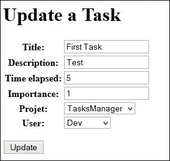

# 第八章：通过 CBV 提高生产力

**基于类的视图**（**CBV**）是从模型生成的视图。简单来说，我们可以说这些就像 ModelForms，因为它们简化了视图并适用于常见情况。

CRUD 是我们在提到数据库上执行的四个主要操作时使用的简写：创建、读取、更新和删除。CBV 是创建执行这些操作的页面的最佳方式。

为创建和编辑模型或数据库表数据创建表单是开发人员工作中非常重复的部分。他们可能会花费很多时间来做这件事（验证、预填字段等）。使用 CBV，Django 允许开发人员在不到 10 分钟内执行模型的 CRUD 操作。它们还有一个重要的优势：如果模型发生变化并且 CBV 做得很好，更改模型将自动更改网站内的 CRUD 操作。在这种情况下，在我们的模型中添加一行代码就可以节省数十甚至数百行代码。

CBV 仍然有一个缺点。它们不太容易使用高级功能或未提供的功能进行自定义。在许多情况下，当您尝试执行具有某些特殊性的 CRUD 操作时，最好创建一个新视图。

您可能会问为什么我们没有直接研究它们-我们本可以节省很多时间，特别是在数据库中添加开发人员时。这是因为这些视图是通用的。它们适用于不需要很多更改的简单操作。当我们需要一个复杂的表单时，CBV 将不起作用，甚至会延长编程时间。

我们应该使用 CBV，因为它们可以节省大量通常用于运行模型上的 CRUD 操作的时间。

在本章中，我们将充分利用我们的`TasksManager`应用程序。事实上，我们将享受 CBV 所提供的时间节省，以便快速推进这个项目。如果你不能立即理解 CBV 的运作方式，没关系。在前几章中我们已经可以制作网站了。

在本章中，我们将尝试通过以下主题来提高我们的生产力：

+   我们将使用`CreateView` CBV 快速构建添加项目页面

+   我们稍后将看到如何显示对象列表并使用分页系统

+   然后我们将使用`DetailView` CBV 来显示项目信息

+   然后，我们将学习如何使用`UpdateView` CBV 更改记录中的数据

+   我们将学习如何更改 CBV 生成的表单

+   然后，我们将创建一个页面来删除记录

+   然后，我们最终将创建`UpdateView`的子类，以使其在我们的应用程序中更加灵活

# CreateView CBV

`CreateView` CBV 允许您创建一个视图，该视图将根据模型自动生成一个表单，并自动保存该表单中的数据。它可以与 ModelForm 进行比较，只是我们不需要创建一个视图。实际上，除了特殊情况外，所有这些代码都将放在`urls.py`文件中。

## 极简用法示例

我们将创建一个 CBV，允许我们创建一个项目。这个例子旨在表明，您可以比使用 Django 表单节省更多的时间。我们将能够使用上一章项目中用于创建表单的模板。现在，我们将更改我们的`create_project` URL 如下：

```py
url (r'^create_project$', CreateView.as_view(model=Project, template_name="en/public/create_project.html", success_url = 'index'), name="create_project"),
```

我们将在`urls.py`文件的开头添加以下行：

```py
from django.views.generic import CreateView
from TasksManager.models import Project
```

在我们的新 URL 中，我们使用了以下新功能：

+   `CreateView.as_view`：我们调用 CBV`CreateView`的`as_view`方法。这个方法将返回一个完整的视图给用户。此外，我们在这个方法中返回多个参数。

+   `model`：这定义了将应用 CBV 的模型。

+   `template_name`：这定义了将显示表单的模板。由于 CBV 使用`ModelForm`，我们不需要更改我们的`create_project.html`模板。

+   `success_url`：这定义了一旦更改已经被考虑到我们将被重定向到的 URL。这个参数不是很 DRY，因为我们不能使用 URL 的`name`属性。当我们扩展我们的 CBV 时，我们将看到如何使用 URL 的名称进行重定向。

就是这样！我们已经添加到`urls.py`文件中的三行将执行以下操作：

+   生成表单

+   生成将表单发送到模板的视图，无论是否有错误。

+   用户发送数据

我们刚刚使用了 Django 最有趣的功能之一。事实上，仅用三行代码，我们就完成了一个没有任何框架需要超过一百行的工作。我们还将编写一个 CBV，它将允许我们添加一个任务。看一下以下代码：

```py
from TasksManager.models import Project, Task
url (r'^create_task$', CreateView.as_view(model=Task, template_name="en/public/create_task.html", success_url = 'index'), name="create_task"),
```

然后我们需要复制`create_project.html`模板并更改`base.html`模板中的链接。我们的新视图是功能性的，并且我们使用了相同的模板来创建项目。这是一种常见的方法，因为它为开发人员节省了大量时间，但是有一种更严谨的方法可以进行。

要测试代码，我们可以在`index.html`模板的`article_content`块的末尾添加以下链接：

```py
<a href="">Create task</a>
```

# 使用 ListView

`ListView`是一个 CBV，用于显示给定模型的记录列表。该视图生成以发送模板对象，从中我们查看列表。

## 极简用法示例

我们将看一个显示项目列表并创建指向项目详情的链接的示例。为此，我们必须在`urls.py`文件中添加以下行：

```py
from TasksManager.models import Project
from django.views.generic.list import ListView
```

在文件中添加以下 URL：

```py
url (r'^project_list$', ListView.as_view(model=Project, template_name="en/public/project_list.html"), name="project_list"),
```

我们将通过在`article_content`块中添加以下行来创建用于以表格形式显示结果的模板，这些行是在扩展`base.html`模板之后添加的：

```py
<table>
<tr>
  <th>Title</th>
  <th>Description</th>
  <th>Client name</th>
</tr>

  <tr>
    <td>{{ project.title }}</td>
    <td>{{ project.description }}</td>
    <td>{{ project.client_name }}</td>
  </tr>

</table>
```

我们创建了与第六章中相同的列表，关于查询集。优点是我们使用了更少的行，并且没有使用任何视图来创建它。在下一部分中，我们将通过扩展此 CBV 来实现分页。

## 扩展 ListView

可以扩展 ListView CBV 的功能并对其进行自定义。这使我们能够根据网站的需求来调整 CBV。我们可以在`as_view`方法中定义与参数中相同的元素，但这样更易读，我们还可以覆盖方法。根据 CBV 的类型，将它们分开可以让您：

+   像我们在 URL 中所做的那样更改模型和模板

+   更改要执行的查询集

+   更改发送到模板的对象的名称

+   指定将重定向用户的 URL

我们将通过修改我们已完成的项目列表来扩展我们的第一个 CBV。我们将对此列表进行两项更改，按标题排序并添加分页。我们将在`views/cbv`模块中创建`ListView.py`文件。该文件将包含我们定制的`listView`。也可以选择架构。例如，我们可以创建一个名为`project.py`的文件来存储所有关于项目的 CBV。该文件将包含以下代码：

```py
from django.views.generic.list import ListView 
# In this line, we import the ListView class
from TasksManager.models import Project

class Project_list(ListView): 
# In this line, we create a class that extends the ListView class.
  model=Project
  template_name = 'en/public/project_list.html' 
# In this line, we define the template_name the same manner as in the urls.py file.
  paginate_by = 5 
In this line, we define the number of visible projects on a single page.
  def get_queryset(self): 
In this line, we override the get_queryset() method to return our queryset.
    queryset=Project.objects.all().order_by("title")
    return queryset
```

```py
ListView.py file:
```

```py
url (r'^project_list$', Project_list.as_view(), name="project_list"),
```

从现在开始，新页面是功能性的。如果我们测试它，我们会意识到只有前五个项目被显示。的确，在`Project_list`对象中，我们定义了每页五个项目的分页。要浏览列表，我们需要在模板的`article_content`块结束之前添加以下代码：

```py

  <div class="pagination">
    <span>
    
      <a href="?page={{ page_obj.previous_page_number }}">Previous</a>
    
    <span style="margin-left:15px;margin-right:15px;">
      Page {{ page_obj.number }} of {{ page_obj.paginator.num_pages }}.
    </span>
    
      <a href="?page={{ page_obj.next_page_number }}">Next</a>
    
    </span>
  </div>

```

模板的这一部分允许我们在页面底部创建到前后页面的链接。通过这个示例，我们非常快速地创建了一个带分页的项目排序列表。扩展 CBV 非常方便，可以让我们适应更复杂的用途。在完成此完整示例后，我们将创建一个 CBV 来显示开发人员列表。这个列表将在本书的后面很有用。在导入`ListView`类之后，我们必须添加以下 URL：

```py
url (r'^developer_list$', ListView.as_view(model=Developer, template_name="en/public/developer_list.html"), name="developer_list"),
```

然后我们使用`base.html`的继承模板，并将以下代码放入`article_content`块中：

```py
<table>
  <tr>
    <td>Name</td>
    <td>Login</td>
    <td>Supervisor</td>
  </tr>
  
    <tr>
      <td><a href="">{{ dev.name }}</a></td>
      <td>{{ dev.login }}</td>
      <td>{{ dev.supervisor }}</td>
    </tr>
  
</table>
```

我们会注意到开发人员的名字是一个空链接。当我们创建显示开发人员详细信息的页面时，您应该重新填写它。这就是我们将在下一节中使用`DetailView`来做的。

# DetailView CBV

`DetailView` CBV 允许我们显示来自注册模型的信息。这是我们将学习的第一个具有 URL 参数的 CBV。为了查看记录的详细信息，它将发送其 ID 到 CBV。我们将学习一些例子。

## 极简主义用法示例

首先，我们将创建一个页面，显示任务的详细信息。为此，我们将通过在`urls.py`文件中添加以下行来创建 URL：

```py
from django.views.generic import DetailView
from TasksManager.models import Task
url (r'^task_detail_(?P<pk>\d+)$', DetailView.as_view(model=Task, template_name="en/public/task_detail.html"), name="task_detail"),
```

在这个 URL 中，我们添加了参数发送方面。我们已经在早期的章节中讨论过这种类型的 URL，当时我们涵盖了查询集。

### 注意

这一次，我们真的需要命名参数`pk`；否则，CBV 将无法工作。`pk`表示主键，它将包含您想要查看的记录的 ID。

关于模板，我们将创建`en/public/task_detail.html`模板，并将以下代码放置在`article_content`块中：

```py
<h4>
  {{ object.title }}
</h4>
<table>
  <tr>
    <td>Project : {{ object.project }}</td>
    <td>Developer : {{ object.app_user }}</td>
  </tr>
  <tr>
    <td>Importence : {{ object.importence }}</td>
    <td>Time elapsed : {{ object.time_elapsed }}</td>
  </tr>
</table>
<p>
  {{ object.description }}
</p>
```

在这段代码中，我们引用了外键`Developer`和`Project`。在模板中使用这种语法，我们调用了相关模型的`__unicode__()`。这使得项目的标题能够显示出来。为了测试这段代码，我们需要创建一个参数化 URL 的链接。将这行添加到您的`index.html`文件中：

```py
<a href="">Detail first view</a><br />
```

这行将允许我们查看第一个任务的细节。您可以尝试在表格的每一行中创建任务列表和`DetailView`的链接。这就是我们要做的。

## 扩展 DetailView

现在我们将创建一个页面，显示开发人员及其任务的详细信息。为了完成这个任务，我们将通过在`views/cbv`模块中创建一个`DetailView.py`文件来覆盖`DetailView`类，并添加以下代码行：

```py
from django.views.generic import DetailView
from TasksManager.models import Developer, Task

class Developer_detail(DetailView): 
  model=Developer
  template_name = 'en/public/developer_detail.html'
  def get_context_data(self, **kwargs):
    # This overrides the get_context_data() method.
    context = super(Developer_detail, self).get_context_data(**kwargs) 
    # This allows calling the method of the super class. Without this line we would not have the basic context.
    tasks_dev = Task.objects.filter(developer = self.object) 
    # This allows us to retrieve the list of developer tasks. We use self.object, which is a Developer type object already defined by the DetailView class.
    context['tasks_dev'] = tasks_dev 
    # In this line, we add the task list to the context.
    return context
```

我们需要在`urls.py`文件中添加以下行：

```py
from TasksManager.views.cbv.DetailView import Developer_detail 
url (r'^developer_detail_(?P<pk>\d+)$', Developer_detail.as_view(), name="developer_detail"),
```

为了查看主要数据和开发任务，我们创建`developer_detail.html`模板。在从`base.html`扩展后，我们必须在`article_content`块中输入以下行：

```py
<h4>
  {{ object.name }}
</h4>
<span>Login : {{ object.login }}</span><br />
<span>Email : {{ object.email }}</span>
<h3>Tasks</h3>
<table>
  
  <tr>
    <td>{{ task.title }}</td>
    <td>{{ task.importence }}</td>
    <td>{{ task.project }}</td>
  </tr>
  
</table>
```

这个例子让我们看到了如何在使用 CBV 时向模板发送数据。

# UpdateView CBV

`UpdateView`是将轻松创建和编辑表单的 CBV。与没有 MVC 模式的开发相比，这是节省更多时间的 CBV。与`DetailView`一样，我们将不得不将记录的登录信息发送到 URL。为了解决`UpdateView`，我们将讨论两个例子：

+   为了让主管能够编辑任务，改变任务

+   减少执行任务所需的时间

## 极简主义用法示例

这个示例将展示如何创建一个页面，允许主管修改任务。与其他 CBV 一样，我们将在`urls.py`文件中添加以下行：

```py
from django.views.generic import UpdateView
url (r'^update_task_(?P<pk>\d+)$', UpdateView.as_view(model=Task, template_name="en/public/update_task.html", success_url="index"), name="update_task"),
```

我们将编写一个与我们用于`CreateView`的模板非常相似的模板。唯一的区别（除了按钮文本之外）将是表单的`action`字段，我们将其定义为空。我们将看到如何在本章末尾填写该字段。现在，我们将利用浏览器在字段为空时提交表单到当前页面的事实。它仍然可见，因此用户可以编写要包含在我们的`article_content`块中的内容。看一下以下代码：

```py
<form method="post" action="">
   
  <table>
    {{ form.as_table }} 
  </table>
  <p><input type="submit" value="Update" /></p>
</form>
```

这个例子真的很简单。如果我们在`success_url`属性中输入了 URL 的名称，它本来可以更加 DRY。

## 扩展 UpdateView CBV

在我们的应用程序中，任务的生命周期如下：

+   主管创建任务而不设置任何持续时间

+   当开发人员完成任务时，他们会保存他们的工作时间。

我们将在后者上工作，开发者只能更改任务的持续时间。在这个例子中，我们将覆盖`UpdateView`类。为此，我们将在`views/cbv`模块中创建一个`UpdateView.py`文件。我们需要添加以下内容：

```py
from django.views.generic import UpdateView
from TasksManager.models import Task
from django.forms import ModelForm
from django.core.urlresolvers import reverse

class Form_task_time(ModelForm): 
# In this line, we create a form that extends the ModelForm. The UpdateView and CreateView CBV are based on a ModelForm system.
  class Meta:
    model = Task
    fields = ['time_elapsed'] 
    # This is used to define the fields that appear in the form. Here there will be only one field.

class Task_update_time(UpdateView):
  model = Task
  template_name = 'en/public/update_task_developer.html'
form_class = Form_task_time 
# In this line, we impose your CBV to use the ModelForm we created. When you do not define this line, Django automatically generates a ModelForm.
  success_url = 'public_empty' 
  # This line sets the name of the URL that will be seen once the change has been completed.
  def get_success_url(self): 
  # In this line, when you put the name of a URL in the success_url property, we have to override this method. The reverse() method returns the URL corresponding to a URL name.
    return reverse(self.success_url)
```

我们可以使用以下 URL 来使用这个 CBV：

```py
from TasksManager.views.cbv.UpdateView import Task_update_time
url (r'^update_task_time_(?P<pk>\d+)$', Task_update_time.as_view(), name = "update_task_time"),
```

对于`update_task_developer.html`模板，我们只需要复制`update_task.html`模板并修改其标题。

# DeleteView CBV

`DeleteView` CBV 可以轻松删除记录。与普通视图相比，它并不节省很多时间，但它不会受到不必要视图的负担。我们将展示一个任务删除的例子。为此，我们需要在`views/cbv`模块中创建`DeleteView.py`文件。事实上，我们需要覆盖它，因为我们将输入我们想要重定向的 URL 的名称。我们只能将 URL 放在`success_url`中，但我们希望我们的 URL 尽可能 DRY。我们将在`DeleteView.py`文件中添加以下代码：

```py
from django.core.urlresolvers import reverse
from django.views.generic import DeleteView
from TasksManager.models import Task

class Task_delete(DeleteView):
  model = Task
  template_name = 'en/public/confirm_delete_task.html'
  success_url = 'public_empty'
  def get_success_url(self):
    return reverse(self.success_url)
```

在上述代码中，该模板将用于确认删除。事实上，`DeleteView` CBV 将在删除之前要求用户确认。我们将在`urls.py`文件中添加以下行，以添加删除的 URL：

```py
from TasksManager.views.cbv.DeleteView import Task_delete
url(r'task_delete_(?P<pk>\d+)$', Task_delete.as_view(), name="task_delete"),
```

为了完成我们的任务抑制页面，我们将通过在`article_content`块中扩展`base.html`创建`confirm_delete_task.html`模板，并添加以下内容：

```py
<h3>Do you want to delete this object?</h3>
<form method="post" action="">
   
  <table>
    {{ form.as_table }} 
  </table>
  <p><input type="submit" value="Delete" /></p>
</form>
```

# 通过扩展 CBV 进一步

通过扩展它们，CBV 允许我们在页面创建过程中节省大量时间，通过对我们的模型执行 CRUD 操作。通过扩展它们，可以将它们适应我们的使用，并节省更多时间。

## 使用自定义类 CBV 更新

为了完成我们的抑制页面，在本章中，我们已经看到 CBV 允许我们不受不必要的视图的负担。然而，我们创建了许多相似的模板，并且我们只是为了使用 DRY URL 而覆盖了 CBV。我们将修复这些小缺陷。在本节中，我们将创建一个 CBV 和通用模板，使我们能够：

+   直接在`urls.py`文件中使用这个 CBV

+   输入重定向的 URL 的`name`属性

+   从一个模板中受益，用于这些 CBV 的所有用途

在编写我们的 CBV 之前，我们将修改`models.py`文件，为每个模型赋予`verbose_name`属性和`verbose_name_plural`。为此，我们将使用`Meta`类。例如，`Task`模型将变成以下内容：

```py
class Task(models.Model):
  # fields
  def __str__(self):
    return self.title
  class Meta:
    verbose_name = "task"
    verbose_name_plural = "tasks"
```

我们将在`views/cbv`文件夹中创建一个`UpdateViewCustom.py`文件，并添加以下代码：

```py
from django.views.generic import UpdateView
from django.core.urlresolvers import reverse

class UpdateViewCustom(UpdateView):
  template_name = 'en/cbv/UpdateViewCustom.html' 
  # In this line, we define the template that will be used for all the CBVs that extend the UpdateViewCustom class. This template_name field can still be changed if we need it.
  url_name="" 
  # This line is used to create the url_name property. This property will help us to define the name of the current URL. In this way, we can add the link in the action attribute of the form.
  def get_success_url(self):
  # In this line, we override the get_success_url() method by default, this method uses the name URLs.
    return reverse(self.success_url)
  def get_context_data(self, **kwargs): 
  # This line is the method we use to send data to the template.
    context = super(UpdateViewCustom, self).get_context_data(**kwargs) 
    # In this line, we perform the super class method to send normal data from the CBV UpdateView.
    model_name = self.model._meta.verbose_name.title() 
    # In this line, we get the verbose_name property of the defined model.
    context['model_name'] = model_name 
    # In this line, we send the verbose_name property to the template.
    context['url_name'] = self.url_name \
    # This line allows us to send the name of our URL to the template.
    return context
```

然后，我们需要创建显示表单的模板。为此，我们需要创建`UpdateViewCustom.html`文件，并添加以下内容：

```py


  Update a {{ model_name }} 
  <!-- In this line, we show the type of model we want to change here. -->


  Update a {{ model_name }} 


  <form method="post" action=""> <!-- line 2 -->
  <!-- In this line, we use our url_name property to redirect the form to the current page. -->
     
    <table>
      {{ form.as_table }} 
    </table>
    <p><input type="submit" value="Update" /></p>
  </form>

```

为了测试这些新的 CBV，我们将以以下方式更改`update_task` URL：

```py
url (r'^update_task_(?P<pk>\d+)$', UpdateViewCustom.as_view(model=Task, url_name="update_task", success_url="public_empty"), name="update_task"),
```

以下是一个屏幕截图，显示了 CBV 将显示的内容：



# 摘要

在本章中，我们学会了如何使用 Django 最强大的功能之一：CBV。借助它们，开发人员可以运行高效的 CRUD 操作。

我们还学会了如何通过在项目列表上添加分页或在显示有关用户信息的页面上显示开发者的工作来改变 CBV 以适应我们的使用。

在下一章中，我们将学习如何使用会话变量。我们将通过一个实际的例子来探讨这个问题。在这个例子中，我们将修改任务列表，以显示最后访问的任务。
