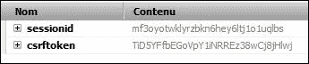
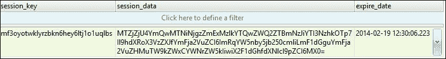
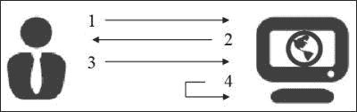

# 第九章：使用会话

会话是根据用户存储在服务器上的变量。在许多网站上，将用户数据保留为标识符、购物篮或配置项是有用的。为此，Django 将这些信息存储在数据库中。然后，它随机生成一个字符串作为哈希码，传输给客户端作为 cookie。这种工作方式允许您存储有关用户的大量信息，同时最大限度地减少服务器和客户端之间的数据交换，例如服务器可以生成的标识符类型。

在本章中，我们将做以下事情：

+   研究会话变量在 Django 框架中的工作方式

+   学习如何创建和检索会话变量

+   通过一个实际而有用的例子来研究会话变量

+   让我们意识到使用会话变量的安全性

Firebug 是 Firefox 的一个插件。这是一个对于 Web 开发人员来说非常方便的工具；它允许您做以下事情：

+   显示 JavaScript 控制台以读取错误

+   从浏览器中读取和编辑页面的 HTML 代码

+   查看网站使用的 cookies



使用 Firebug 实现的 cookies

在使用 Firebug 实现的这个截图中，我们注意到我们有两个 cookies：

+   `sessionid`：这是我们的会话 ID。Django 将通过这个标识符知道它正在处理哪个用户。

+   `csrftoken`：这个 cookie 是典型的 Django。我们在关于表单的章节中已经谈到过它。它在本章中不会被使用。

以下是存储会话数据的表的截图：



会话对于认证系统特别有用。实际上，在许多情况下，当用户连接到网站时，我们会将他们的标识符记录在会话变量中。因此，每个 HTTP 请求，用户都会发送这个标识符来通知网站他们的状态。这也是使管理模块工作的重要系统，我们将在后面的章节中看到。然而，如果会话不经常被删除，它们有一个缺点：它们会在数据库中占用更多的空间。要在 Django 中使用会话，必须启用`django.contrib.sessions.middleware.SessionMiddleware`中间件，并且浏览器必须接受 cookies。

会话的生命周期如下所述：

1.  没有任何会话的用户向网站发出 HTTP 请求。

1.  服务器生成一个会话标识符，并将其与用户请求的页面一起发送到浏览器。

1.  每当浏览器发出请求时，它将自动发送会话标识符。

1.  根据系统管理员的配置，服务器定期检查是否有过期的会话。如果是这种情况，它可能会被删除。



# 创建和获取会话变量

使用 Django，存储在数据库中、生成哈希码并与客户端交换将是透明的。会话存储在由`request`变量表示的上下文中。要在会话变量中保存一个值，我们必须使用以下语法：

```py
request.session['session_var_name'] = "Value"
```

一旦会话变量被注册，您必须使用以下语法来恢复它：

```py
request.session['session_var_name']
```

要使用这些行，我们必须确保与请求上下文进行交互。实际上，在某些情况下，比如 CBV，我们无法简单地访问请求上下文。

## 一个例子 - 显示最后一个被查看的任务

在这个例子中，我们将展示一个使用会话变量的实际例子。一般来说，开发人员会查看要做的任务。他/她选择一个任务，研究它，然后记录和注明花费的时间。我们将在会话变量中存储最后访问的任务的标识符，并将其显示在待完成任务列表的顶部。

为此，我们将不再使用`DetailView` CBV 来显示任务的详细信息，而是使用一个真正的视图。首先，我们必须定义一个 URL，以便查看我们的视图。为此，我们将使用以下代码修改`task_detail` URL：

```py
url (r'^task_detail_(?P<pk>\d+)$', 'TasksManager.views.task_detail.page', name="task_detail"),
```

我们将在`views/task_detail.py`文件中创建我们的视图，使用以下代码：

```py
from django.shortcuts import render
from TasksManager.models import Task
from django.http import HttpResponseRedirect
from django.core.urlresolvers import reverse
def page(request, pk):
  check_task = Task.objects.filter(id = pk) 
  # This line is used to retrieve a queryset of the elements whose ID property matches to the parameter pk sent to the URL. We will use this queryset in the following line : task = check_task.get().

  try:
  # This is used to define an error handling exception to the next line.
    task = check_task.get()
    # This line is used to retrieve the record in the queryset.
  except (Task.DoesNotExist, Task.MultipleObjectsReturned):
  # This allows to process the two kind of exceptions: DoesNotExist and MultipleObjectsReturned. The DoesNotExist exception type is raised if the queryset has no records. The MultipleObjectsReturned exception type is raised if queryset contains multiple records.
    return HttpResponseRedirect(reverse('public_empty'))
    # This line redirects the user if an exception is thrown. We could also redirect to an error page.
  else:
    request.session['last_task'] = task.id
    # This line records the ID property of the task in a session variable named last_task.
    #In this line, we use the same template that defines the form CBV DetailView. Without having to modify the template, we send our task in a variable named object.
  return render(request, 'en/public/task_detail.html', {'object' : task})
```

然后，我们将使用`ListView` CBV 创建任务列表。为此，我们必须将以下 URL 添加到`urls.py`文件中：

```py
url (r'^task_list$', 'TasksManager.views.task_list.page', name="task_list"),
```

该 URL 的相应视图如下：

```py
from django.shortcuts import render
from TasksManager.models import Task
from django.core.urlresolvers import reverse
def page(request):
  tasks_list = Task.objects.all() 
  # This line is used to retrieve all existing tasks databases.
  last_task = 0 
  # In this line, we define last_task variable with a null value without generating a bug when using the render() method.
  if 'last_task' in request.session: 
  # This line is used to check whether there is a session variable named last_task.
    last_task = Task.objects.get(id = request.session['last_task'])
    # In this line, we get the recording of the last task in our last_task variable.
    tasks_list = tasks_list.exclude(id = request.session['last_task'])
    # In this line, we exclude the last task for the queryset to not have duplicates.
  return render(request, 'en/public/tasks_list.html', {'tasks_list': tasks_list, 'last_task' : last_task})
```

然后，我们将为我们的列表创建模板。这个例子将是完整的，因为这个列表将创建、读取、更新和删除任务。以下代码必须放在`tasks_list.html`文件中：

```py


  Tasks list


  <table>
  <tr>
    <th>Title</th>
    <th>Description</th>
    <th colspan="2"><a href="">Create</a></th>
  </tr>
   
  <!-- This line checks to see if we have a record in the last_task variable. If this variable has kept the value 0, the condition will not be validated. In this way, the last accessed task will display at the beginning of the list.-->
    <tr class="important">
      <td><a href="">{{ last_task.title }}</a></td>
      <td>{{ last_task.description|truncatechars:25 }}</td>
      <td><a href="">Edit</a></td>
      <td><a href="">Delete</a></td>
    </tr>
  
  
  <!-- This line runs through the rest of the tasks and displays. -->
    <tr>
      <td><a href="">{{ task.title }}</a></td>
      <td>{{ task.description|truncatechars:25 }}</td>
      <td><a href="">Edit</a></td>
      <td><a href="">Delete</a></td>
    </tr>
  
  </table>

```

为了使这个例子完整，我们必须在我们创建的`style.css`文件中添加以下行：

```py
tr.important td {
  font-weight:bold;
}
```

这些行用于突出显示最后一个被查询的任务的行。

# 关于会话安全

会话变量不可被用户修改，因为它们是由服务器存储的，除非在您的网站中选择存储客户端发送的数据。然而，有一种利用系统会话的缺陷。事实上，如果用户无法更改他们的会话变量，他们可能会尝试篡夺另一个用户的会话。

我们将想象一个现实的攻击场景。我们在一家公司，该公司使用网站来集中每个员工的电子邮件和日程安排。我们指定的员工 Bob 对他的同事 Alicia 非常感兴趣。他想读她的电子邮件以了解更多关于她的信息。有一天，当她去休息室喝咖啡时，Bob 坐在 Alicia 的电脑前。像所有员工一样，他使用相同的密码以便于管理，并且可以轻松地连接到 Alicia 的 PC。幸运的是，浏览器已经打开。此外，浏览器定期联系服务器以查看是否有新消息到达，以便会话没有时间过期。他下载了一个工具，比如 Firebug，可以读取 cookies。他检索哈希值，擦除痕迹，然后返回到他的电脑。他更改了浏览器中的`ID`会话 cookies；因此，他可以访问关于 Alicia 的所有信息。此外，在没有加密的情况下，这种攻击可以在嗅探网络流量的本地网络中远程执行。这被称为会话固定。为了保护自己免受这种攻击，可以采取一些措施：

+   使用 SSL 等加密通信服务器和客户端之间的通信。

+   要求用户在访问敏感信息之前输入密码，例如银行信息。

+   对 IP 地址和会话号码进行审计。如果用户更改 IP 地址，则断开用户的连接。尽管有这个措施，攻击者仍然可以进行 IP 欺骗来窃取受害者的 IP。

# 摘要

在本章中，我们成功保存了与用户相关的数据。这些数据将在整个会话期间存储。用户无法直接修改它。

我们还研究了安全会话。请记住，用户会话可能会被攻击者窃取。根据项目的规模，有必要采取措施来保护网站。

在下一章中，我们将学习如何使用认证模块。它将允许我们创建用户并限制已登录用户访问某些页面。
