# 第四章：在 PyCharm 中轻松编辑和格式化

列奥纳多·达·芬奇，这位伟大的画家和雕塑家，曾沉思他的雕塑在看到大理石之前就已经在采石场的石块中完全成型。达·芬奇解释说，他所做的只是移除那些对于形状不需要的大理石块。换句话说，他的杰作是在雕刻刀触及粗糙的石头之前，在他的脑海中完成的。在许多方面，你就是达·芬奇。你心中有一个完整的项目，渴望向世界展示你的杰作。你不用锤子和雕刻刀来编写代码，而是使用 PyCharm。在前几章中，我们完成了 PyCharm 的安装过程和配置。我们还为你的项目设置了解释器。接下来：探索你将用来打造杰作的主要工具，这些工具主要位于编辑器中。

到目前为止，你已经发现了编辑器中许多明显的功能。我们知道它自动处理许多 PEP-8 语法规则。我们知道我们得到了彩色编码的语法。我们还观察到，**集成开发环境**（**IDE**）将在编码的多个不同领域提供建议，从代码风格规则检查到自动补全。

本章将重点关注编辑器中不那么明显的功能。产品的文档提供了键盘快捷键和编辑器基础知识，这些内容在本章中不会讨论。相反，以下主题将被涵盖：

+   实时代码检查和自动修复，这允许你专注于开发目标，而不是 Python 编码的规则。

+   PyCharm 中的各种代码补全支持功能以及如何利用它们。通过使用这些功能，你将能够更快、更准确地编写代码。我们只会关注 PyCharm 自带而非需要插件如 Kite 或 GitHub Copilot 的第三方**人工智能**（**AI**）增强工具。这些将在*第十五章*中介绍。

+   重构工具，允许你通过耐心、纪律和良好的工具将你的代码打磨成杰作。

+   文档工具，将带你从“优秀开发者”的水平提升到“大师开发者”的水平。发明一个惊人的代码作品是一回事。记录它，让其他人从中受益，则将你的工作提升到了另一个层次。

# 技术要求

为了继续阅读本章和本书的其余部分，你需要以下内容：

+   一个已安装并正常工作的 Python 解释器。我将使用来自[`python.org`](https://python.org)的最新版本。

+   安装好的`pip`和`virtualenv`副本。当您在 Windows 上安装 Python 时，这些会自动获得，而 MacOS 则将它们包含在每一个系统中。如果您使用 Linux，您需要单独安装包管理器，如`pip`，以及虚拟环境工具，如`virtualenv`。我们的示例将使用`pip`和`virtualenv`。

+   安装并运行 PyCharm 的副本。安装过程在*第二章*中已有介绍。

+   您可以在 GitHub 上找到这本书的示例源代码，地址为[`github.com/PacktPublishing/Hands-On-Application-Development-with-PyCharm---Second-Edition/tree/main/chapter-04`](https://github.com/PacktPublishing/Hands-On-Application-Development-with-PyCharm---Second-Edition/tree/main/chapter-04)。我们已经在*第二章*中介绍了代码的克隆，*安装*和*配置*。

# 代码分析、检查和建议

智能代码补全对于任何编程工具的采用都是必不可少的。一个好的代码补全引擎的定义是它能够了解编程的高级方面，包括语言语法的具体细节。引擎还必须了解你所编写的程序的底层具体细节。许多增强型文本编辑器支持代码补全，但缺乏这种高级的复杂性。PyCharm 作为一个异常复杂的代码编辑器脱颖而出，它包含了代码编辑器的历史和现代方面，并且在智能代码补全方面超越了其他许多增强型文本编辑器。

代码补全最常见的形式是在您输入时匹配的单词的大列表。随着更多字母的输入，可能性的列表会缩小。Notepad++是一个被开发者广泛使用的增强型文本编辑器。当我太没有耐心等待 IDE 完全加载时，我认为它是快速轻松编辑的必备工具。*图 4.1*显示了我在输入一些 Python 代码的会话：


图 4.1：Notepad++使用一个非常简单的机制进行代码高亮和补全

工具并不能直观地知道正在输入什么；因此，我必须告诉它我正在用 Python 编写代码。在设置完语言后，它将尝试自动补全一切，尽管这样的练习显然是徒劳的。在*图 4.1*中，我打算输入以下内容：

```py
import time
def test_code():
  pass
```

这显然不会为我赢得任何 Jolt 奖项。您可以从截图看到，列表正在过滤一个已知的单词列表。它的唯一上下文参考点是知道该文件是一个 Python 文件。这并不非常有效，但总比没有好。

这样的系统几乎只是拼写检查器。虽然经验丰富的专业人士可能会嘲笑这样一个简单系统的有用性，但最早显示这种魔法般功能的 IDE 开创了一个我们现在不愿意没有的功能：代码完成。

PyCharm 在复杂度方面处于光谱的另一端。就像 Notepad++一样，PyCharm 能够识别构成 PyCharm 的关键词。然而，PyCharm 还能够洞察组成标准库的对象结构。“图 4.2”展示了我在 PyCharm 中输入一些代码，为这个示例创建了一个简单的文件：

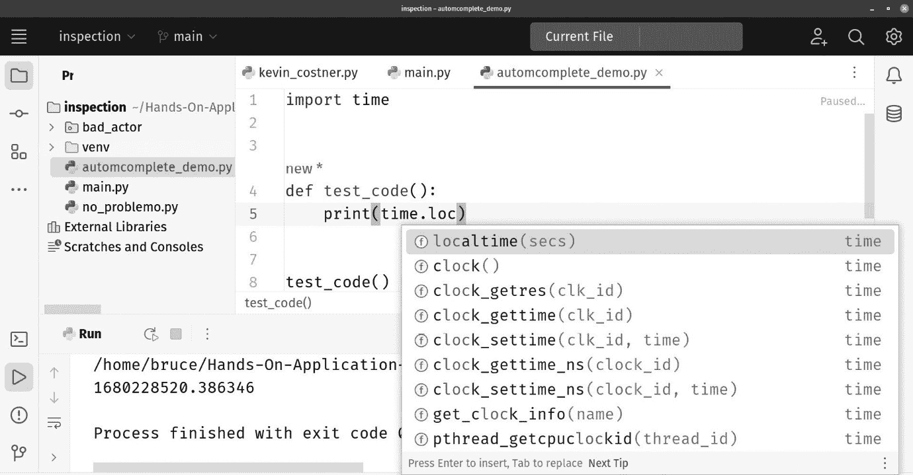

图 4.2：PyCharm 根据其对时间库的理解进行自动完成

在这种情况下，我像在“图 4.1”中的 Notepad++示例中那样导入了`time`库。我已经进行了一步，定义了我的函数，接下来我将简单地使用已经导入的`time`库打印当前本地时间。正如您在“图 4.2”中可以看到的，PyCharm 正在根据对时间库的理解提供自动完成建议。

完成自动完成

一旦自动完成列表出现，您可以按*Tab*或*Enter*键选择高亮选项。您可以使用上箭头和下箭头键在列表中移动，或者用鼠标点击列表中的任何项。不过，如果您保持手指在键盘上，您的工作速度会更快。

到现在为止，您已经开始欣赏 PyCharm 提供的代码完成系统。让我们进一步探索这个重要工具的功能。

## 它 duzunt assewm yew cna spel

我们之前从 Notepad++中的简单单词列表示例已经与 PyCharm 自动完成引擎的更复杂功能形成了鲜明对比。让我们进一步挖掘。如果您的工具依赖于单词列表，那么一旦您的拼写出错，建议列表就会枯竭。实际上，单词列表方法要求您知道您要找的是什么，同时要求拼写正确。

在“图 4.3”中，您将看到一些不同之处：

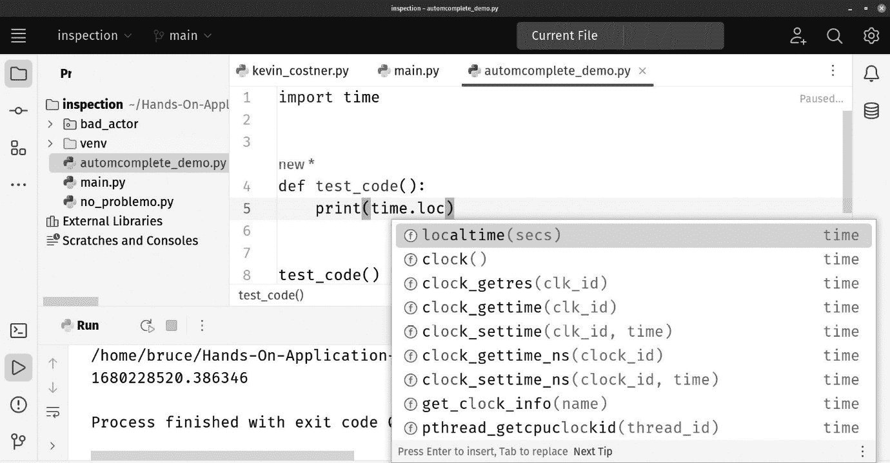

图 4.3：PyCharm 找到包含您已输入文本的所有可能性

PyCharm 被设计成根据输入的字母提供建议。换句话说，当您输入`cl`时，单词`clock`可能会出现。如果您输入`lo`、`ck`或任何包含在匹配关键词列表中的连续字母，`clock`单词也会出现。不需要拼写正确。只要接近正确，您要找的单词很可能会出现。

## 它理解您的代码

良好的代码补全功能能够根据所使用的语言和库来理解和自动补全。在我们的案例中，那就是 Python，与其他语言相比，Python 拥有庞大的标准库。Python 的设计理念是“内置电池”。与之相比，在 Node.js 中实现的 JavaScript，你只能获得文件和 HTTP 库。.NET 语言给你的是一个小的核心。对于 Golang 也可以这么说。大多数语言都需要你使用包管理器。PyCharm 能够做到这一点本身就非常出色。

PyCharm 作为一个优秀的 IDE，也能理解您所编写的代码。*图 4*.4 显示了`autocomplete_demo.py`文件，我在其中添加了对`no_problemo.py`文件的导入。`no_problemo.py`文件中有一个名为`perfection()`的函数。正如您所看到的，PyCharm 能够查看文件内部并提供关于我所编写代码的自动补全，而不仅仅是基于语言词汇表的自动补全：


图 4.4：PyCharm 在您所编写的代码上提供自动补全建议，以及标准 Python 语言和标准库

我得到了关于函数名的自动补全，以及关于**方法签名**的提示。如果您不熟悉“方法签名”这个术语，它仅仅是指函数或方法的名称、参数列表和返回值。如果您已经包含了类型提示，PyCharm 会提醒您函数或方法需要的参数名称和类型。这同样适用于模块以及类，如果您正在使用**面向对象**的**编程**（**OOP**）。

## 后缀代码补全

在 PyCharm 中，传统的代码补全已经被提升到了一个新的水平，但我们还没有完成。通常，在键盘上按住句号(*)键会触发一个列表出现。我们已经习惯了这个列表包含点之后可能出现的代码。然而，如果 PyCharm 能够给出点之前可能出现的代码建议呢？在*图 4*.5 中，我们看到一个后缀代码补全的例子，您可以在*第四章*示例代码中的`postfix_example.py`文件中找到：

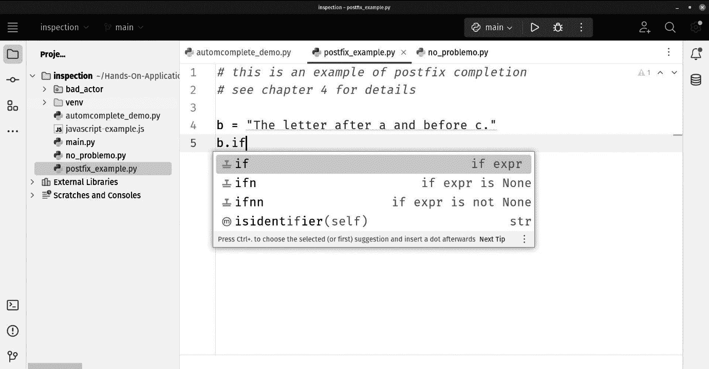

图 4.5：PyCharm 中的后缀补全可以建议在点之前可能出现的代码，而不仅仅是点之后可能出现的代码

如果您看到`.if`（if expr）作为紧跟一个明显是字符串类型的变量的可能选项而感到困惑，我并不怪您。`.if`建议不是 Python 的一部分。它是一个**后缀建议**。如果您完成这个建议，您的代码将被转换。以下代码不是有效的 Python 语法：

```py
b.if
```

因此，它被转换为以下内容：

```py
if b:
```

想象一下所有可能的情况！然而，如果你不是那种富有想象力的人，请查看*图 4**.6*，它显示了 PyCharm 的**后缀完成**配置选项：

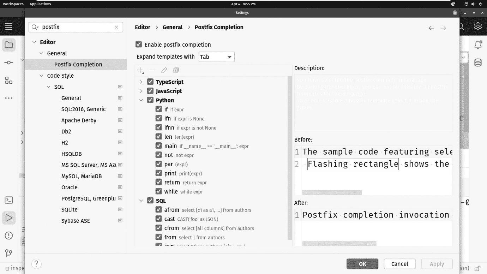

图 4.6：PyCharm 的后缀完成配置选项

自然，这些选项是完全可配置的。你甚至可以添加自己的！模板不仅限于 Python。你可以在列表中看到，有 TypeScript、JavaScript 和**结构化查询语言**（**SQL**）的配置。这是因为应用程序开发很少仅限于 Python 语言的范围。

## 嘿皮士完成

嘿，伙计！你想看看一些绝对超凡脱俗的东西吗？它被称为**循环词扩展**。不过，只有真正的老派人才会这样叫它。如果你想显得*嬉皮士*，你会称它为**嬉皮士完成**！

嘿皮士完成是通过按*Alt* + */*（Windows 和 Linux）或*⌥* + */*在 macOS 上触发的。一旦触发，PyCharm 将索引你当前打开的所有文件，并根据该上下文中的单词提供自动完成建议。实际上，你正在使用最简单的自动完成形式；一个单词列表。单词列表是实时从你打开的文件中的单词生成的。它们不必是代码。纯文本文件、标记、Markdown 或任何文本都会根据简单的正向匹配出现在建议列表中。随着你输入，列表会缩小。你可以在*图 4**.7*中看到一个例子：

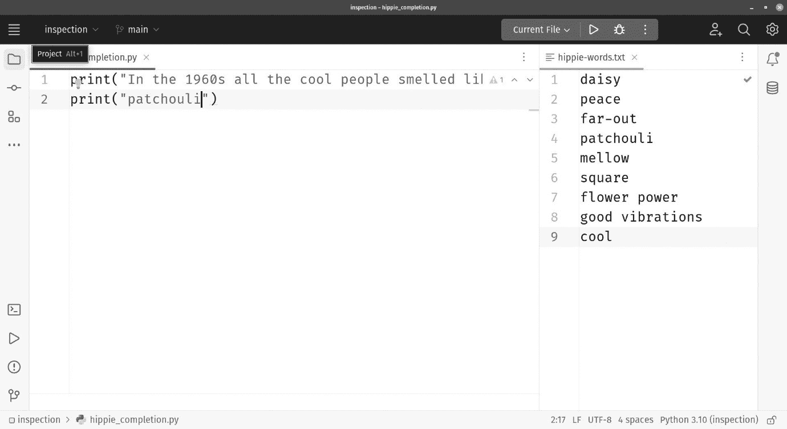

图 4.7：嬉皮士完成绝对超凡脱俗！

右侧的文本文件包含了我从[`fungenerators.com/lorem-ipsum/hippie/`](https://fungenerators.com/lorem-ipsum/hippie/)生成的单词列表。不幸的是，结果发现，美国嬉皮士一代的许多标志性词汇无法在这个级别的书中印刷。我们的标准是最高的！因此，我编辑了列表，这就是剩下的所有内容。这些单词是随机的，所以请不要试图从它们中推断出任何含义，尽管有关于披头士专辑上存在秘密反向信息的所有指控。右侧的代码可以使用嬉皮士完成从该列表中扩展。为了使这起作用，我输入了`print("pat`然后按了*Alt* + */*。神奇地出现了单词*patchouli*！我希望这个例子对你来说是有价值的。我可能永远无法从我的键盘上消除那种气味！

你可以使用*Alt* + *Shift* + */*或*⌥* + *Shift* + */*来启用反向循环词扩展，它从单词的末尾向后匹配到开头。如果当权者问我（他们没有，因为他们从不这样做）我会称这个为`#GingerRogersCompletion`并引用这本书，它可能会流行起来！

嘿皮士小贴士

重复按 *Alt* + */*（Windows 和 Linux）或 *⌥* + */*（macOS）会在列表中循环。你可以一直按这个键组合，直到出现你想要的单词。

## 索引

在为 PyCharm 的各种代码补全技术提供动力方面，有各种引擎在发挥作用。你可能想知道它是如何工作的。我向你保证，这并不是黑暗魔法。理解它的关键是注意 PyCharm 加载项目时的行为。*图 4.8* 引导你的注意力到 PyCharm 应用程序窗口的底部。PyCharm 启动几个后台进程，这些进程会遍历你的代码并对每个字符进行索引。然后，索引被转换成一个内存数据库，该数据库被各种引擎使用：


图 4.8：注意 PyCharm 窗口的底部，以了解索引等后台进程何时运行

通常，我并不真的关心魔法是如何工作的，但这是值得提及的，因为有时 PyCharm 可能会显得缓慢或无响应。当 PyCharm 显得缓慢或自动补全功能不起作用时，检查 *图 4.8* 中指示的屏幕区域，看看是否有索引进程正在运行。如果你监控这类事情，你可能会注意到你的 CPU 会突然升高。这是暂时的。一旦索引过程完成，PyCharm 将再次变得响应。

## 节能模式

PyCharm 菜单中较为晦涩的条目之一，如 *图 4.9* 所示，是 **节能模式**：

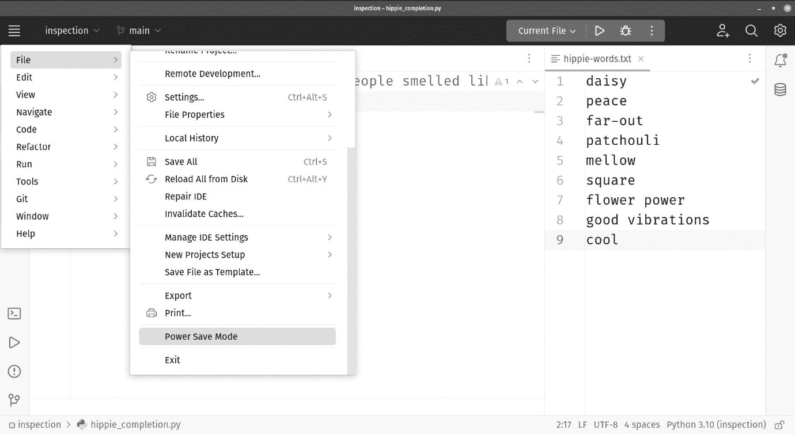

图 4.9：节能模式菜单选项可以在文件菜单下找到

我记得第一次点击它的时候。我住的城市街道的街灯瞬间变得更亮了。几分钟前像锯子一样旋转的电表现在懒洋洋地转得比废弃的陀螺还慢。有一次，电力公司的一个家伙甚至打电话来感谢我为拯救地球做出的贡献。

好吧，我编造了所有那些内容，除了关于电力公司那人的部分。那绝对是真实发生的。早期示例中的 `b.if`：

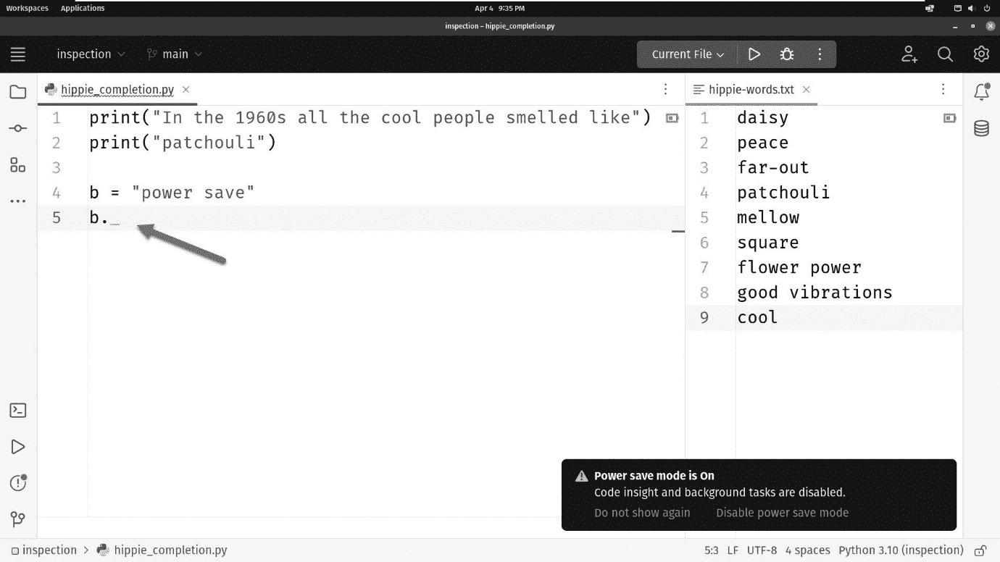

图 4.10：一条消息提醒你节能模式已开启，并且你将不会从 PyCharm 收到通常的水平支持

个人来说，我认为这完全是野蛮的！我们该如何工作呢？接下来，您会告诉我我没有访问互联网、Kite、GitHub Copilot、ChatGPT 或 Stack Overflow！您将剥夺我合理价格的[packtpub.com](http://packtpub.com)订阅权，在那里我可以以一个低廉的价格阅读所有我可以读的电子书。然后您会拿走我的 Herman Miller Aeron 椅子，并限制我每天只能喝一杯 14 美元的中等大杯半脂三倍泡沫双份浓缩咖啡，上面撒上彩虹茉莉花味的糖霜！为什么您还要实施着装规定呢？打倒！打倒！打倒！

抱歉。我有点过于激动了。不用说，这可能是 IDE 中最不受欢迎的功能。也许如果您在国外航班上玩*幽灵行动：断点*耗尽了笔记本电脑的电池，着陆后突然接到老板的电话，需要立即修复某些东西，这可能会有些用。突然，您需要从剩余的 5%电池电量中榨取每一秒。当这种情况发生时，我真的很讨厌。

# 自定义代码补全

在 PyCharm 中进行自定义是一个持续的主题。展示您无法自定义的内容可能更容易，但我实际上还没有找到任何东西。代码补全也不例外。无论您更喜欢非常轻量级的体验，几乎不需要帮助，还是希望每行代码都有指导，PyCharm 都可以满足您的需求。

要打开代码补全的设置，请回到我们在*第二章*，*安装和配置*中探索的设置对话框。您可以通过点击**文件**菜单项并选择**设置**轻松访问它。这会弹出设置对话框。如果您还记得*第二章*，*安装和配置*，这个对话框是巨大的！我们正在寻找**编辑器** | **常规** | **代码补全**，如图*图 4.11*所示。11*：


图 4.11：代码补全设置允许您自定义 PyCharm 代码补全引擎的行为

您应该花点时间浏览一下这个屏幕上您可以做的事情。PyCharm 给了您很大的控制权！我承诺这不是一个对每个选项的繁琐记录。相反，我将您的注意力引向最流行和最有潜力的设置。

## 区分大小写

位于窗口顶部，此选项指定建议列表中的项目是否应该与您输入的内容的大小写匹配。例如，如果我想为 Python 中的`KeyboardInterrupt`异常输入一个异常表达式，并且想要将正确的类名`K`包含在建议列表中。在**匹配大小写**复选框旁边，您还可以选择仅匹配第一个字母的大小写，或者是否应该匹配所有字母。

我个人总是禁用此复选框，这样我只需输入，例如，小写的`k`，就能利用代码补全功能。当我学习一门新语言或 API 时，此设置可以帮助我进行我称之为*属性购物*的练习。我不知道有哪些属性和方法可用，因此一个按字母顺序排列的列表可能会有所帮助。例如，每种编程语言都有某种形式的字符串处理类或库。可以非常肯定地说，该库将具有修剪函数，即从字符串的前面、后面或两边去除额外空格。这些`toUpper`和`toLower`方法都是防御性编程的重要组成部分。如果用户在密码输入时意外地在密码的开始或结尾处包含空格，这将导致用户体验不佳。如果您使用涉及用户输入的任何条件逻辑，那么将所有内容都转换为大写或小写将更容易处理。鉴于这些都是我们工作的基础，我们知道它们将在列表中，但每种语言都称它们为不同的名称。我从事的项目需要在不同两种或三种语言之间切换，很容易输入错误的功能名称。以将字符串转换为上档的方法为例。在 JavaScript 中，这样的函数看起来是这样的：

```py
let foo = "some user option";
if(foo.toUpperCase() === "SOME USER OPTION"){
 console.log("It matched!");
}
```

在 PyCharm 中相同的代码，我可能几分钟内就会创建，看起来是这样的：

```py
foo = "some user option"
if foo.upper() == "SOME USER OPTION":
  print("It matched")
```

为了有效匹配，我需要单词“upper”无论大小写都能匹配。

就像我们在代码补全中看到的一切，以及编程中的所有事物一样，这种做法也有其权衡。具体来说，如果**匹配大小写**被禁用，有时建议列表可能会包含许多更多的不相关选项，这使得找到正确的 API 变得更加困难。然而，同时，您将看到所有可能性的完整列表，这可以帮助您熟悉环境，有时还可以发现 API 中您未曾想象到的功能。

## 按字母顺序排序建议

正如其名所示，此选项允许您按字母顺序对建议列表中的项目进行排序。对于需要开发者仔细滚动查找所需内容的较长的建议列表，此功能非常有用。

在多次事件中，我们已经看到了 PyCharm 的动态特性，这一特性在此功能中再次得到了体现。具体来说，当在编辑器中与建议列表交互时，您可以通过点击建议窗口右下角图标来随时更改列表中项目的顺序，如图 *图 4.12* 所示。12*：

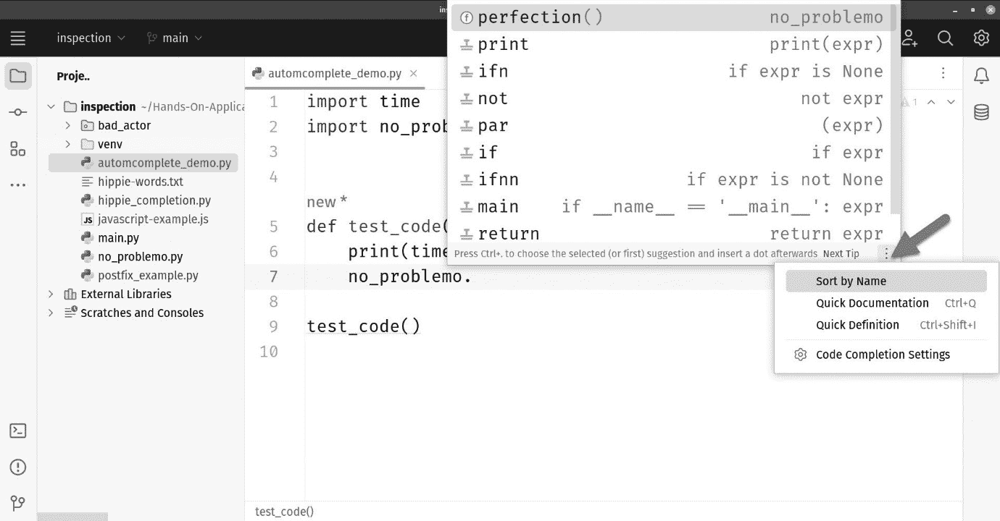

图 4.12：您可以在列表内部更改建议的排序方式

点击 **…**（省略号）元素，您可以更改建议的排序方式：按相关性或按名称字母顺序排序。

## 机器学习辅助补全

这个新选项既神奇又令人恐惧。默认情况下启用，PyCharm 将根据您的代码训练一个机器学习模型。这使得 PyCharm 能够基于您的代码以及成千上万个其他开发者的代码提出建议。传统的代码补全通常只会为您建议下一个关键字、属性、方法名或您即将输入的参数。如果 PyCharm 提供了由机器学习辅助的完整函数或代码块供您选择，请不要感到惊讶。您会在连接数据库、处理 pandas 数据框或验证用户输入等常见任务中看到这一点。

设置仅允许您开启 PyCharm 支持的各种语言。Python、JavaScript 和 TypeScript 默认启用。只有 SQL，一种用于处理关系数据库的特殊用途语言，默认未启用。我怀疑这是因为您在全局和项目级别都有关于您首选 SQL 语言的额外设置，这些设置有助于建议。考虑到 PyCharm 支持的数据库数量以及它们对未由标准化 SQL 定义的元素的不同实现，期望有一个紧密的建议列表会显得有些尴尬。我们将在 *第十一章*，*使用 PyCharm 理解数据库管理* 中稍后查看 SQL 和关系数据库。我保证您不会失望。

## 在 [...] 毫秒内显示文档弹出窗口

当您启用此功能时，您将看到文档以及建议的代码。您将能够理解您正在输入的代码的功能，而不仅仅是盲目接受建议。这对于新开发者来说是个大优点，无论是完全对编码新手还是对 Python 新手来说都是如此。此功能的优点是，您可以在将光标向下移动到项目时动态地查看所有建议项的文档。

当与具有相似 API 的类和方法一起工作时，这一点尤其有益。我们将在本章的最后部分讨论此功能，以及其他与文档相关的功能。

## 参数信息

滚动到 JavaScript 部分以下，如*图 4.13*所示，你会找到一个建议参数信息的选项：


图 4.13：滚动到 JavaScript 以下以找到显示参数信息的选项

第一个选项很简单。它控制了在出现建议之前必须经过的时间量。一般来说，建议是很好的，除非你在教学、进行代码审查或进行某种演示，在这种情况下，它们可能会让你的屏幕变得杂乱。有时提高时间限制是个好主意，这样建议或文档只有在停留几秒钟后才会显示。

第二个选项允许你切换显示完整方法签名。我喜欢这个功能。代码提示会显示整个方法签名，这样你可以一次性看到所有参数。

方法签名独特地定义了在声明它的作用域内的函数或方法。它包括函数的名称。以及函数参数的类型名称，最好还有关于返回类型的提示。这些并不特指 Python。实际上，在 Python 中它们有点模糊。现在让我们将其与使用更严格编程结构的静态语言，如 C#，进行比较。在 Python 中，你可以使用类型提示，这有助于开发者记住传递的参数的预期类型。让我们看看一个没有提示的方法签名的例子：

```py
a = 5
b = 6
def add_two_ints(first, second):
  return a + b
```

这是可以的。这段代码将按预期工作，开发者的意图是清晰的。让我们看看带有提示的相同函数：

```py
a = 5
b = 6
def add_two_ints(first: int, second: int) -> int:
  return a + b
```

这好多了！现在我们确切地知道了作为输入参数期望的类型，以及将要返回的类型。我之前说过，Python 中的方法签名是“模糊”的。我说这个是因为两个代码示例都会工作。Python 在编译过程中完全忽略了提示。提示只是由工具使用，使你的 Python 代码更容易阅读和理解。尽可能地在你的代码中添加提示将增强你和你队友在开启**显示完整方法签名**选项时看到的方法签名的方式。

# 代码分析和自动化修复

代码补全是最多代码编辑器和 IDE 的标准功能。正如我们所见，并非所有补全引擎都是相同的。分析引擎也是如此。从概念上讲，代码分析引擎是代码补全的扩展，如果不是在实现上。代码补全试图预测你正在编写的代码，并帮助你更快地完成。代码分析检查你已编写的代码，并试图确定代码在运行时是否有效。就像代码补全一样，这里存在不同的复杂程度，不同的过程检查不同的事情。

最简单的分析形式被称为*代码检查*。几乎每种编程语言都有代码检查工具，Python 也不例外。虽然有很多可供选择，但 PyCharm 默认使用流行的`pylint`库。

代码检查器通过模式匹配的过程对代码进行隐式分析。有两种代码检查操作：**逻辑检查**和**样式检查**。逻辑检查查找代码错误、可能产生意外结果或副作用以及危险的代码模式。样式检查查找不符合常见约定的代码。在 Python 中，这个问题不太严重，因为该语言已经有一套严格的代码格式化规则，称为**Python 增强提案#8**。没有人会这样称呼它。了解的人只是简单地称之为**PEP-8**。

结合使用`pylint`以及所有类似工具，你可以将其视为类似于常规文本中的拼写和语法检查器。代码检查器会查找拼写错误的关键字、格式不正确的代码和明显的语法错误。代码检查器还可以强制执行样式指南，尽管实际上 Python 已经设计得尽可能使代码易于阅读，并强制执行规则。

当指出代码中的问题时，这固然很重要，但如果工具还能提出甚至实施解决问题的方案，那就更有用了。对于人类来说也是如此。指出缺陷很容易，任何人都能做到。关于如何改正你的缺陷的好建议比批评更有用。因此，除了代码检查之外，PyCharm 还提供了一个系统，它会主动帮助你修复由代码检查器暴露的问题。

## 问题检测

当你编写代码时，PyCharm 会实时执行问题检测。我们之前提到的索引过程在这里也发挥作用，但我们会稍后再谈。首先，让我们关注编辑器中显示你问题所在位置的可见界面。有四个地方可以查看，如图*图 4.14*所示：

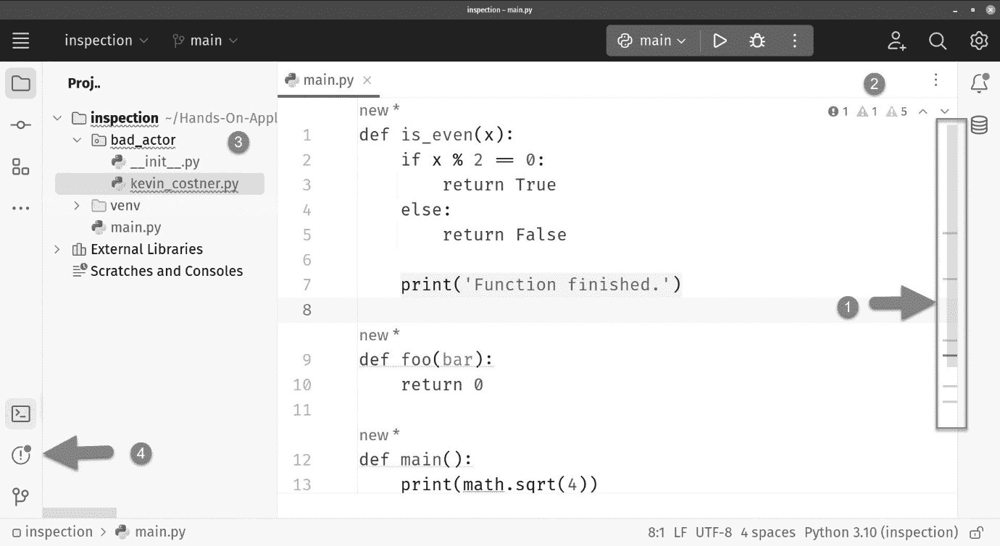

图 4.14：用户界面中的四个地方告诉你存在问题

编辑器的右侧空白处（1）会显示当前打开文件中所有问题所在的行。这个空白处是文件的一个压缩、微型表示。一个文件有数百行甚至数千行是很常见的。你可以点击空白处中看到彩色标记的区域，编辑器会滚动到该位置。

PyCharm 将问题分为三个基本类别：错误（红色）、警告（黄色）和弱警告（灰色）。这将在空白区域的顶部报告整个文件，并显示每种问题类型的计数（2）。除了颜色外，这个区域还提供了不同的形状。错误图标是一个带有感叹号的圆形红色圆圈。警告是一个带有感叹号的三角形。弱警告也使用带有感叹号的三角形来表示，但它们看起来相当暗淡。如果没有检测到任何问题，你将得到一个绿色的勾号。*图 4.15*显示了两个文件。一个没有问题（1），而另一个在不同类别中存在多个问题（2）：


图 4.15：底部的文件没有任何问题，而顶部的文件则不太幸运

任何标红的都是可能阻止你的程序正确运行或根本无法运行的错误。警告意味着你的代码可能能够运行，但在一些明显的情况下它可能不会按预期执行。弱警告通常是一个小缺陷，比如一个不符合英语词典单词的变量名。如果你的区域设置不是英语，PyCharm 将标记来自你本地语言的单词。

第二个寻找问题的地点是在编辑器窗口内部。回顾一下*图 4.15*的第 13 行。你会看到单词`math`下面有一个波浪形的红色下划线（相信我）。这些线的颜色与问题的严重程度相对应。右侧的空白区域显示了问题所在的位置，而下划线则直接显示了问题所在的行。如果你将鼠标悬停在任何下划线上，你会得到关于问题的描述。我将在本章后面更深入地讨论这个问题，当我们谈到**意图**时，这些意图是关于如何修复代码中问题的建议。

你会发现问题的第三个指示是在项目资源管理器中。回顾一下*图 4.15*，区域 3。有一个名为`bad_actor`的 Python 包。在*图 4.15*中，该文件没有打开，但我在创建它时打开了它，输入了一些不完整的代码，然后关闭了文件。你可以在*图 4.16*中看到该文件已打开：

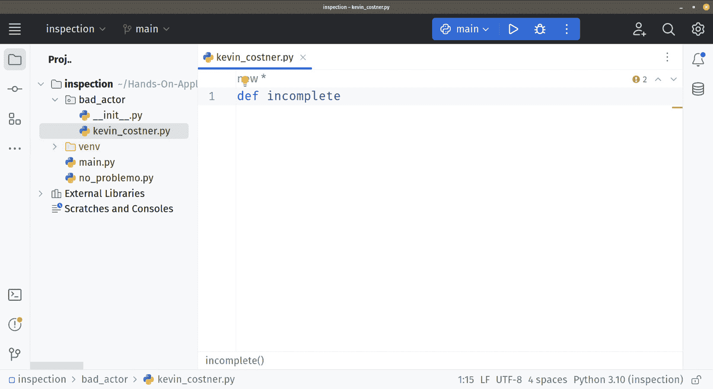

图 4.16：真傻！我开始在文件中输入，但从未完成

如果你正在工作的文件中存在错误，你会在文件列表中找到它。警告会通过目录系统冒泡。项目文件夹顶部有一个红色波浪线，包文件夹中有一个，问题所在的文件下方还有一个下划线。PyCharm 不会检查已关闭的文件。它只检查你打开的文件，但一旦它找到问题，它会记住位置并继续警告你，直到你解决问题。

糟糕的演员

我需要一个典型的反面教材来展示之前的视觉双关语。凯文·科斯特纳是一个糟糕的美国演员。他当然不是最糟糕的，但他在前 10 名之内。如果你不相信我，看看电影《与狼共舞》。如果你仍然不相信我，看看《保镖》。如果你仍然认为他很好，看看《水世界》，并意识到他自掏腰包投资这部电影，因为他坚信它将是一个大热门。

第四位是问题窗口。在**图 4**.17 中，你可以看到截图区域 4 中的图标上有一个红色圆点。点击图标，问题窗口将打开并显示错误列表，如图**4**.17 所示：


图 4.17：打开问题窗口，查看所有问题列表。只显示你的代码问题。生活问题不会显示

## 语法错误

语法错误通常是 IDE 暴露的最浅显的错误。我们已经看到了几个。**图 4**.17 显示了一个不完整的函数定义，因此它被标记为红色语法错误。在**图 4**.14 中，第 13 行在单词`math`下方有一个红色下划线。PyCharm 将其识别为对 Python `math`库的引用，而我忘记导入它。这引发了一个未解决的引用错误。这类错误总是被标记为红色严重错误，因为它们将阻止程序运行。

## 重复的代码

如果你习惯在项目内部或甚至在不同项目之间复制粘贴代码，你可能会收到 PyCharm 的警告。重复的代码是项目出现问题的信号。

最佳实践是遵循名为**不要重复自己**（**DRY**）的概念。我再重复一遍。你希望你的代码始终保持 DRY。永远不要通过复制粘贴来重复代码。确保它是 DRY。好吧，如果你答应注意 PyCharm 关于代码不是 DRY 的警告，我就不再说了。

当你在单个项目中找到这个问题时，你通常可以通过将重复的代码提升到函数中并从代码中重复的部分调用该函数来解决它。

如果你因为在不同项目之间复制粘贴而被标记，你应该将重复的代码转换成一个可以在项目之间共享的 Python 包。

## PEP-8 问题

PyCharm 的代码检查器会提醒你代码中的样式问题，这些问题违反了 PEP-8。对于新接触 Python 的开发者来说，最大的问题是处理空白规则。函数之间的缩进和空行都是 PEP-8 规则的一部分，旨在使你的代码非常易于阅读。大多数 PEP-8 问题都被标记为警告。

## 死代码

这是我个人的一个小烦恼。有人编写了一些代码，最终被不同的函数所取代。旧的、未使用的函数和新函数都坐在代码文件中。它们可能具有相似的名字。它们甚至可能在不同的文件中。当我还是个孩子的时候，我在墙上贴了一张标题为“墨菲的技术法则”的海报。海报宣扬了一种悲观但在我（以及你可能已经做了很长时间的你的）经验中，完全准确的世界观。以下是关于技术的墨菲法则的一些样本：

+   你无法通过看轨道来判断火车行驶的方向

+   逻辑是一种系统地得出错误结论的方法，而且信心十足

+   每当一个系统变得完全定义后，总有一些傻瓜会发现一些东西，这些东西要么废除该系统，要么将其扩展到无法识别的程度

+   技术被那些管理他们不理解的事物的人所主导：如果建造者像程序员编写程序那样建造建筑，那么第一个出现的啄木鸟就会摧毁文明

+   计算机的注意力跨度只与其电源线一样长

+   专家是那些对越来越少的事物了解越来越多，直到他对什么都不了解的人

这与我至少有关，因为我找到并尝试修改死代码（认为它非常活跃，是所有问题的明显来源）的可能性几乎达到 100%。在 99%和 100%之间微小的差异似乎受到我当前咖啡因摄入量和是否跳过早餐的影响。这些影响似乎成反比。

我感谢一个警告我正在查看死代码的系统。我通常的抱怨是，你应该删除死代码。你不需要它，如果你需要，那就是版本控制系统的作用。

## 方法签名不匹配

当一个函数需要的参数多于或少于你提供的数量时，就会发生方法签名不匹配。当这种情况发生时，PyCharm 会警告你。

## 好代码的道路是用 PyCharm 的意图铺就的

现在我们已经花时间了解我们的缺点，让我们看看一些帮助我们修复它们的工具。PyCharm 有一个名为“意图”的机制，旨在自动化修复和改进你的代码。看看*图 4.18*：

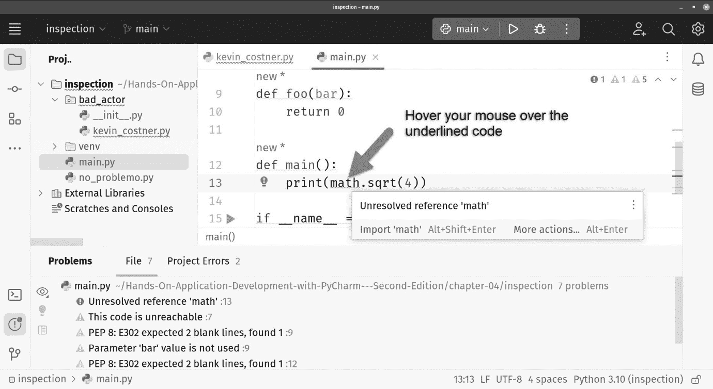

图 4.18：将鼠标悬停在任何下划线代码上，查看为什么它被下划线标记，以及可能的修复方法

在显示的代码的情况下，问题是调用了`sqrt()`方法，该方法找到平方根。该方法是在`math`类中的静态方法。问题是未能导入该类。当我悬停在问题描述下方时，问题描述就会出现。在问题描述下方是最可能的修复方案。按下*Alt* + *Shift* + *Enter*将自动修复问题，通过在文件顶部添加`import math`。

如果你想要尝试这个，你可以在我们克隆的示例代码的`chapter-04`文件夹中的`inspection`项目中尝试，该代码在*第二章*，*安装* *和配置*。

注意这可能不是唯一的解决方案。在*图 4.18*中，我们还可以看到**更多操作…**提示我们点击链接或按*Alt* + *Enter*来查看更多可能性。

真正敏锐的读者可能会注意到灯泡。这是同一功能的另一个向量。查看*图 4.19*以查看灯泡的实际操作：


图 4.19：灯泡是获取意图的另一种方式

点击灯泡会显示可能意图的列表。这次，我们看到一个预览。意图是在文件的第 1 行添加`import math`。

有时候灯泡可能会有些棘手，因为如果你离开它们最初出现的那条线，它们有消失的倾向。如果你想使用灯泡，只需点击下划线内的任何位置并等待一个滴答声。它将出现在问题所在行的开头。

在我们正在探讨的情况下，问题是一个合法的错误。程序在问题修复之前无法运行。你可能在前面两个图中没有看到，但灯泡是红色的。你还会看到黄色灯泡表示不那么严重的错误。

现在你如果像我一样，想看到带有绿色勾选和没有下划线的干净文件。让我告诉你，那可能永远不会发生。PyCharm 几乎总是会发现一些需要更改的地方。有时建议的更改并不很有用。你可能会听从一个建议，以某种小的方式更改你的代码。在你这样做之后，灯泡会回来，PyCharm 会提供将代码改回原来的方式。除非它们里面有感叹号，否则黄色灯泡不是你的敌人。

# 重构

大多数优秀的集成开发环境（IDE）以及专注于开发的文本编辑器，在这方面都有一定程度的重构工具。重构是一项非常重要的实践，但常常被忽视。在我的书中，这本书可在亚马逊（或任何销售最优秀技术书籍的地方）购买，《C# 设计模式的实际应用》，我讨论了一些导致本意良好的编码项目走向失败的无序力。你的代码一开始是纯洁的，整个团队都承诺保持零技术债务。但这种情况从未持续过。时间压力、开发者技能水平、不可避免的变化、可见性和复杂性等因素导致了一个退化的过程。你的代码从精心构建、完美架构的杰作变成了盘子上的一团泥巴！

我知道我在这里指向的是一本 C#的书，但如果你有 Packt 订阅，我强烈建议你阅读这本书的前两章。这两章讨论了工作退化的常见问题和预防措施。你可以做的一件事是保持警惕，永远不要忽视将代码重构作为开发实践常规部分的价值。

## 什么是重构？

简而言之，重构是在不改变其功能的情况下改进代码。如果你有单元测试（你有，对吧！？），它们应该在重构前后通过，而无需对测试本身进行任何更改。你正在寻找优化代码的可读性和性能的方法。也许你忽略了某些代码优雅之处，比如添加**文档字符串**，我们将在本章后面讨论。也许你没有给你的方法签名添加类型提示。也许有机会利用设计模式或 SOLID 原则使你的代码更加灵活。

重构背后的理念是，你在代码上再次审视，最好是经过一段时间之后。你有没有曾经看过自己一个月或甚至一年前写的代码，想知道是什么让你编写了那样糟糕的函数体？你究竟为什么要这样做？（在空白处填入你做过的愚蠢事情。）你无法相信那会是你。你比那聪明。考虑定期进行代码同行评审。这可以在写作过程的任何时间进行。此外，有一个人对你的工作投入较少，将能够发现未实现改进的机会。几乎总是，这会涉及到重构。反过来想。你有多少次接过其他开发者编写的代码？可能是离开公司的那个人？你检查了一下，得出结论，编写代码的人显然是最近从当地的精神病院逃出来的。这必须完全重写。这就是你重构别人的代码。

## PyCharm 中的重构工具

PyCharm 有一套专门用于重构的菜单选项。其中有一些并不是明确标明为重构工具。

### 清理你的代码

PyCharm 有一个非常全面的**代码清理**工具。实际上，这个工具运行了您迄今为止看到的相同检查，但它是以批量方式进行的。您可以让 PyCharm 尝试修复所有问题。当您导入在 PyCharm 之外创建的项目时，这个功能非常有用，比如使用不提供 PyCharm 中看到的帮助的工具。

您可以清理一个打开的文件或您项目中的所有文件。说实话，我不建议您在项目级别上这样做，因为您真的无法预测引擎会对您尚未打开的大量文件做什么。*图 4.20*显示了**代码清理**菜单的位置：

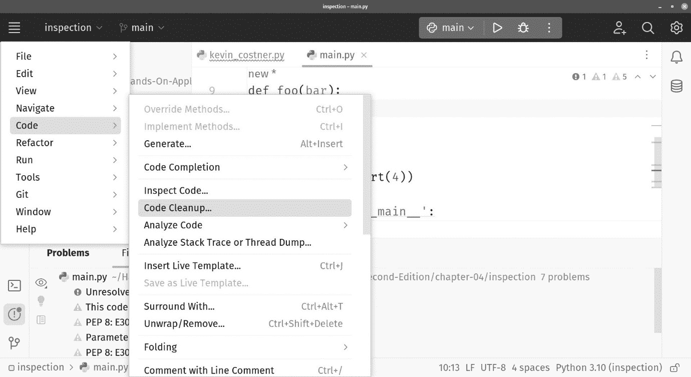

图 4.20：代码清理工具可以在代码菜单中找到

一旦您点击菜单选项，您将看到一个对话框询问清理的范围，如图*图 4.21*所示：


图 4.21：指定代码清理的范围

您可以清理整个项目、未提交的文件、当前文件（对我而言是来自`chapter-04`文件夹中`inspection`项目的`main.py`文件），或者自定义范围。我的建议是不要试图一口吃成胖子。不要在大型项目上做整个项目的清理。通常让 PyCharm 在小批次的文件上施展魔法更明智。**未提交的文件**选项是在您将更改提交到版本控制系统之前可以采取的一个很好的步骤。

### 重命名

世界上最受尊敬的软件开发者之一唐纳德·克努斯在他的书《计算机程序设计艺术》中写道，编程中有两件事很难：给事物命名（例如，变量、函数、类、文件等）以及使缓存失效。这有多么真实！编写有意义的变量定义，使其自文档化同时使意图明确，是一种艺术形式。通常需要多次尝试才能做到正确。PyCharm 有一个工具可以轻松地允许更改名称。您可以对任何已命名的对象右键单击并选择**重命名**。输入要重命名的对象的新的名称。PyCharm 将在引用命名对象的所有地方进行更改。它甚至会在注释和文档字符串中找到并更改引用。

如果更改的范围很小，例如，您正在重命名一个局部函数范围内的某个事物，重命名操作会立即发生。如果您尝试进行范围更广的重命名，例如涉及多个文件的重命名，PyCharm 会通过显示所有受影响的文件来为您预览更改。您可以在更改实际应用之前检查所有更改，以确保更改是适当的。在您满意后，您可以应用这些更改。

文件没有重命名菜单选项！

如果你来自像 Visual Studio Code 这样的其他工具，这可能会让你感到困惑，在 Visual Studio Code 中，重命名文件只是从资源管理器视图中选择文件并点击两次或按*F2*这么简单的事情。你会在文件中寻找重命名选项，但你不会找到。那是因为它位于**重构**菜单中。PyCharm 认为重命名文件是一种重构。与其他工具不同，PyCharm 会确保重命名文件不会影响你的代码。

### 内联变量

PyCharm 让你能够自动内联你的变量。实际上，这是 PyCharm 提供的更常见建议之一。考虑以下代码：

```py
a = 5
b = 6
def add_two(num1: int, num2: int) -> int:
  sum = num1 + num2
  return sum
add_two(a, b)
```

`sum`变量实际上并不需要。如果你内联变量，代码将变成以下这样：

```py
a = 5
b = 6
def add_two(num1: int, num2: int) -> int:
  return num1 + num2
add_two(a, b)
```

我们已经移除了声明`sum`变量并将其赋值为`num1 + num2`的行。

### 提取方法

之前，我提到了一个称为 DRY（不要重复自己）的概念。是的，我意识到再次提到它是在打破规则。我这样做是有目的的。记住，IDE 会指出错误，然后提供建议和工具来解决问题。我想展示一个非常实用的功能。PyCharm 为你提供了一个工具，可以轻松地将代码提取到单独的函数中。你会在几种情况下想要这样做。首先，如果你发现自己正在项目中复制和粘贴代码。你可能需要将那段代码做成一个函数，然后从你粘贴复制的代码的地方调用它。其次，当你找到一个违反单一职责原则的函数时。如果你从未听说过这个，你可以猜到它的意思。一个编写良好的程序应该只包含执行单一任务的函数。包含执行多个职责的函数或方法的代码可能是错误的，应该被拆分成单独的函数。 

看一个这样的机会的简单例子。在示例代码中打开`chapter-04/not_dry.py`文件。其中的代码确实很糟糕！敏感的观众在打开文件之前可能需要坐下来。看吧！每个人在学习到这是坏主意之前至少做过一次的事情：

```py
computer_science_grades = {
  "Guido van Rossum": 100,
  "Ewa Jodlwska": 99,
  "Fabrizio Romano": 88,
  "Henrich Kruger": 87,
  "Rick van Hattem": 83,
  "Steven Lott": 72,
  "Dusty Phillips": 72,
  "Quan Nguyen": 92
}
```

好的，到目前为止，一切正常。我们已经得到了一个包含参加计算机科学课程的人及其成绩的字典。顺便说一句，那些名字并不是随机的。在你完成这一章后，看看你是否能猜出这些杰出人物是谁。我为这些杰出人物对数字本身表示歉意。它们原本应该是大致随机的键，除了范·罗素先生，显然他会得到满分。我相信他们在现实生活中都做得很好。接下来，我们还有另一组课程成绩：

```py
advanced_theoretical_and_applied_recess_grades = {
  "Bruce Van Horn": 100,
  "Prajakta Naik": 92,
  "Kinnari Chohan": 88,
  "Pooja Yadiv": 86
}
```

虽然这是不同的主题和不同的人群，但理念是相同的。现在假设我们需要计算每个班级的平均分。我可以为计算机科学课程编写一个计算平均分的函数：

```py
def computer_science_average(grades: dict) -> float:
  raw_total = 0
  for grade in grades.values():
    raw_total += grade
  average = (raw_total / len(grades))
  return average
```

我们的方法签名提供了很多有用的提示。我们有一个描述性的函数名。该函数接受一个参数，我们的提示告诉我们我们期望一个字典。该函数预期返回一个浮点数。

函数体创建了一个名为`raw_total`的变量并将其设置为`0`。接下来，我们遍历`dict`的值，并在每次迭代中，将`value`添加到`raw_total`中。一旦我们有了总数，我们就将其除以`dict`中的键的数量（`len`）， voila！我们就有了班级平均分。在文件的底部，我们可以看到这个函数被调用的地方：

```py
boring_class_average = computer_science_average(computer_science_grades)
print(f"Boring average is {boring_class_average}")
```

太棒了！我们调用了`computer_science_average`函数，并附带了高度主观（并且可能不准确，因为那可能曾是你的最爱课程）的变量赋值。那么，这有什么问题吗？没有。问题出在接下来，这提供了一个提取方法的机会。下一个函数计算的是不同的类别：高级理论和应用退行。这是一个我本人开创的领域，在这个领域内，我没有对手。不幸的是，由于我在游乐场花更多的时间来完善我的技艺，而在计算机科学课程上花的时间较少，我几乎复制了我们之前写的函数：

```py
def advanced_recess_average(grades: dict) -> float:
  raw_total = 0
  for grade in grades.values():
    raw_total += grade
  average = (raw_total / len(grades))
  return average
```

这是对同一个函数的不同命名！我们需要合并！为此，你需要突出显示方法签名结束的冒号和`return`语句之间的所有内容。参见图 4.22。不要包括`return`语句，否则 PyCharm 不会在你的提取函数中生成`return`语句：

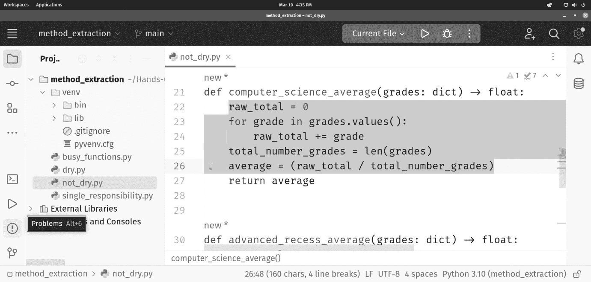

图 4.22：选择代码以提取到新的函数或方法

接下来，右键单击所选代码，然后点击**重构**|**提取方法**，如*图 4.23*所示：

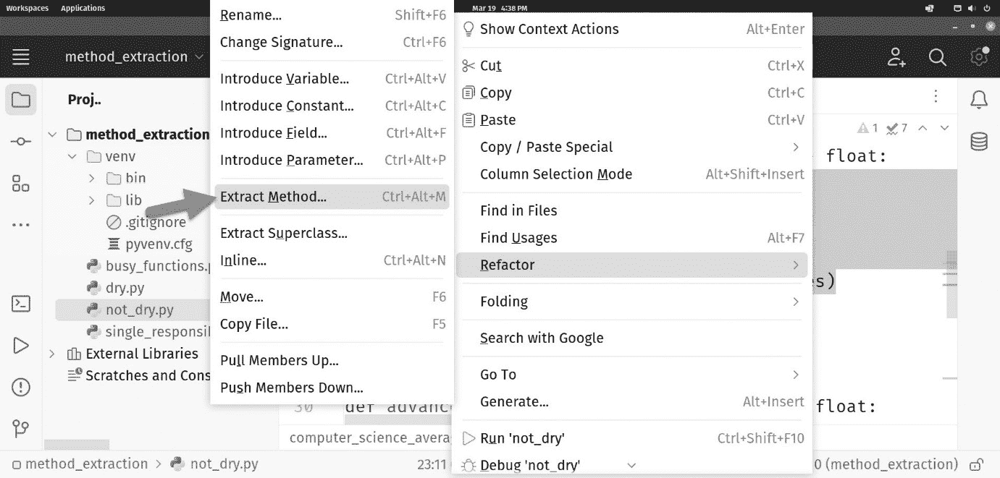

图 4.23：右键单击所选代码，然后点击重构，然后提取方法

这会弹出一个用户界面，允许你定义新的方法，如*图 4.24*所示：


图 4.24：PyCharm 中的提取方法对话框

设置提取方法的名称。我将其设置为`compute_average`。PyCharm 已自动填写其余部分。点击**确定**，你的代码将发生变化。*图 4.25*显示了重构的结果：

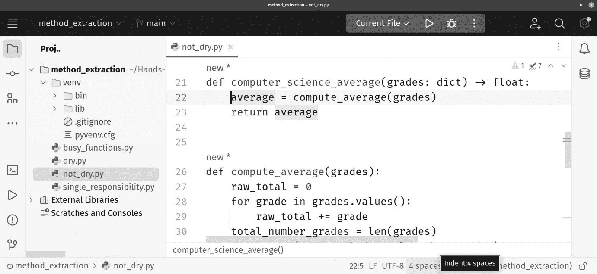

图 4.25：重构的结果。注意 compute_average 函数是从所选代码自动生成的

让我们看看 PyCharm 从重构中生成的代码。首先，`computer_science_average`已更改为以下内容：

```py
def computer_science_average(grades: dict) -> float:
  average = compute_average(grades)
  return average
```

这个函数现在正在调用提取的函数。提取的函数看起来像这样：

```py
def compute_average(grades):
  raw_total = 0
  for grade in grades.values():
    raw_total += grade
  total_number_grades = len(grades)
  average = (raw_total / total_number_grades)
  return average
```

这是我们要提取的代码。PyCharm 为我生成了函数。我必须告诉你，在这个阶段，我通常对生成的代码持谨慎态度。它很少完美。在这里，我更希望对 `grades` 参数有一个类型提示，以及对返回类型有一个提示。尽管这些都是小问题，但结果节省了我一些打字。

可能还有一个悬而未决的问题。为什么 PyCharm 没有检测并标记重复的代码？简短的回答是：我们的示例代码太短。如果我在重复的函数中添加几行代码，它就会被视为重复。让我们试试。修改两个函数中的代码，使其看起来像这样：

```py
def computer_science_average(grades: dict) -> float:
  raw_total = 0
  fake_var_1 = 1
  fake_var_2 = 2
  fake_var_3 = 3
  fake_var_4 = 4
  fake_var_5 = 5
  fake_var_6 = 6
  fake_var_7 = 7
  print(f"{fake_var_1}{fake_var_2}{fake_var_3}{fake_var_4}")
  print(f"{fake_var_5}{fake_var_6}{fake_var_7}")
  for grade in grades.values():
    raw_total += grade
  average = (raw_total / len(grades))
  return average
```

我所做的只是添加了一堆虚假的变量声明。它们并不做任何重要的事情，除了使重复的代码片段更长。默认情况下，PyCharm 只查找长度为 10 行或更长的重复片段。短的重复不会通过筛选。我提这一点是因为方法提取的魔力可以自动处理重复。让我们做同样的练习。首先，查看更改后的 PyCharm。你应该会看到一些指示我们有问题的指标，如 *图 4.26* 所示：

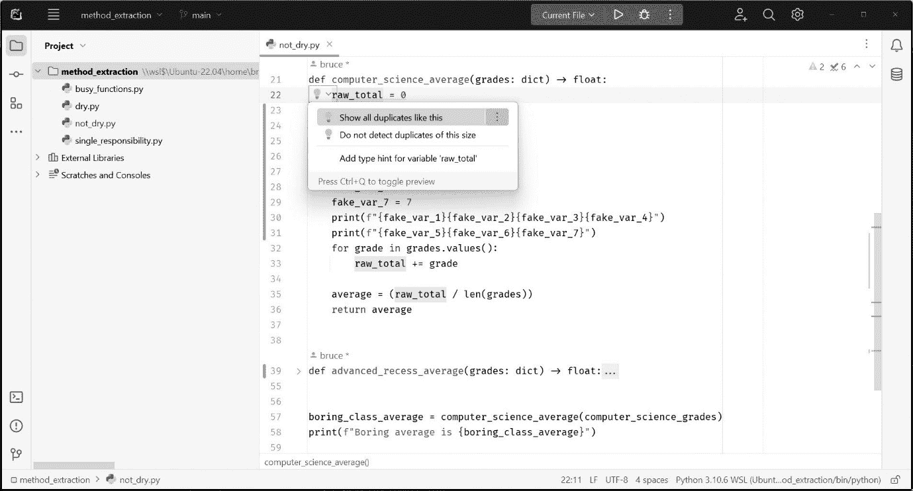

图 4.26：现在我们的重复代码更长，因此被检测并标记

我们可以看到 PyCharm 已经注意到了我们的重复代码。按照 *图 4.27* 所示，突出显示代码以进行提取：

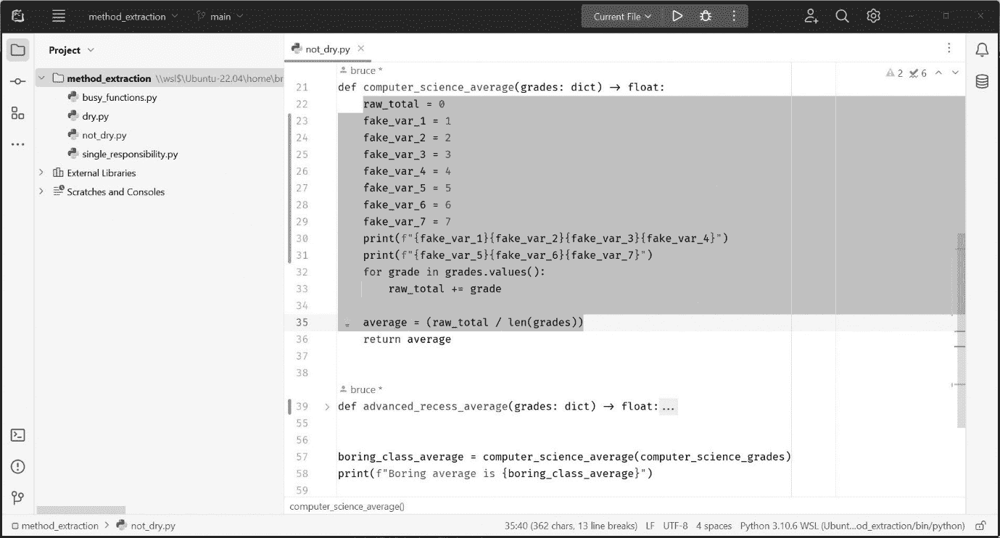

图 4.27：标记要提取的代码

右键单击突出显示的代码，然后点击 **重构** | **提取方法**，如 *图 4.28* 所示：

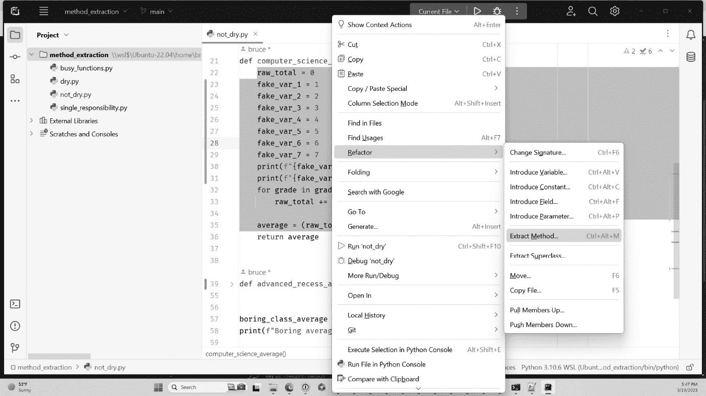

图 4.28：通过右键单击，点击重构，然后提取方法

按照图 4.29 所示，命名提取的函数 `compute_average`：


图 4.29：命名提取的函数 compute_average

点击 **确定**。这次情况略有不同。你会发现 PyCharm 仍然像以前一样创建函数提取，但这次你被提示替换重复的代码，如 *图 4.30* 所示：

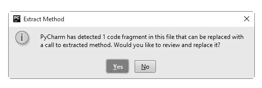

图 4.30：PyCharm 询问是否要替换重复的片段为提取的函数的引用

### 将函数导出到另一个文件

你有多少次在错误的地方编写了一个实用的函数？也许你把它放在一个设计用来做特定事情的模块或类中，但你的实用函数最终在许多地方都被广泛使用。适用于函数的单一职责原则也适用于模块和类。有一个连接数据库的函数是一个很好的例子。假设你刚刚得到一份在比利·布兰卡糖果厂工作的工作。他们需要你编写一些脚本，从几种不同的文本格式中导入他们制作的糖果列表，并将它们存储在数据库中。第一个需求来了，你需要从纯文本文件中读取并写入 SQLite 数据库。

在 `chapter-04/move_function/read_input_file_a.py` 中打开项目。让我们回顾一下内容：

```py
import sqlite3
CANDY_DB = "candy.db"
```

这前两行是从标准库中导入 `sqlite3` 库。如果你之前没有使用过 `sqlite3`，那么现在你需要知道的是：它是一个基于文件的数据库。通过这种方式，我们指的是你不需要像 Postgres 或 MariaDB 这样的数据库那样安装服务器。这使得它成为教学和原型工作的好数据库。我们将在 *第十一章* 中详细讲解数据库，*在 PyCharm 中理解数据库管理*。让我们继续定义将打开文件、读取内容并将其插入数据库的函数：

```py
def read_input_file_type_a(file_path: str) -> None:
  with open(file_path, "r") as data:
    for line in data:
      cleaned = line.strip("\n")
      write_to_database(cleaned)
  print("Processing Complete!")
```

我们已经打开了文件。对于文件中的每一行，我们将其作为文本读取，并删除换行符。这对于数据库插入正常工作是必要的。一旦字符串被清理，我们就调用一个写入数据库的函数：

```py
def write_to_database(datum: str) -> None:
  connection = sqlite3.connect(CANDY_DB)
  cursor = connection.cursor()
  sql = f"INSERT INTO candy(name) VALUES ('{datum}')"
  print(sql)
  cursor.execute(sql)
  cursor.close()
  connection.close()
```

我已经将数据库文件包含在代码仓库中，因此不需要编写代码来创建数据库。这个函数只是打开数据库，然后创建一个游标。游标用于使用 SQL 对数据库执行命令。即使你不知道 SQL，我也相信你能弄清楚发生了什么。数据库中有一个名为 `candy` 的表。该表只有一个字段：`name`。我们在这里保持非常简单。我忘记创建主键了，因为现在数据库并不重要。我们应该更多地关注函数本身，而不是它的工作方式。

在生成一个 SQL 语句来从文本文件的当前行中的 `candy` 名称插入 `candy` 表的 `candy` 名称后，我执行了 SQL 语句，这将向 `candy` 表中插入一行。

在编程中，有一个一般规则：你创建的，你应该销毁；你打开的，你应该始终关闭。因此，我关闭了我的游标和数据库连接，以避免将来出现任何资源锁定。最后，我使用常见的双下划线命名约定来运行文件进行测试：

```py
if __name__ == "__main__":
  read_input_file_type_a("../input_file_a.txt")
```

在 PyCharm 中，我可以通过将我的运行配置设置为 **Current File** 并点击 **Run** 按钮来执行此操作。它成功了！文件被读取，我们没有出现错误。

下划线

一个 `__init__`？你可以这么说，“*下划线下划线 init 下划线下划线*”。但这很麻烦。如果你只说`init`，你不够具体，因为可能还有另一个没有下划线的名为 `init` 的函数或方法。所以，你说“*下划线 init*”或者甚至只说“*下划线 init*”，大家就知道你在说什么了。

第二天我们来到工作地点，得知有一个新的需求。我们需要另一个脚本，用于从 **JavaScript 对象表示法**（**JSON**）文件中读取数据。这个 JSON 文件只包含一个数组，如下所示：

```py
{
 "data": [
  "truffles",
  "turtles",
  "dark chocolate bark"
 ]
}
```

它仍然只是一个糖果列表，但我们需要以不同的方式处理它。打开 `chapter-04/move_function/input/read_input_file_b.py`。你会发现它的代码与其他代码类似：

```py
import json
from read_input_file_a import write_to_database
```

我们知道我们需要处理 JSON，所以我导入了 `json` 包。我也知道我需要写入之前相同的数据库。我知道代码重用是好事，所以我从另一个脚本中导入了函数。然后我开始创建一个读取 JSON 文件的代码版本：

```py
def read_input_file_type_b(file_path: str) -> None:
  with open(file_path, "r") as json_data:
    data = json.load(json_data)
    candies = data["data"]
    for candy in candies:
      write_to_database(candy)
  print("Processing Complete!")
if __name__ == "__main__":
  read_input_file_type_b("../input_file_b.json")
```

`json.load` 方法将原始文本转换为常规 Python 3 `dict`。正如您从前面的文件列表中可以看到，`dict` 中将包含一个东西：一个以 `data` 为键的糖果数组。所以我抓取那个并将其放入 `candies` 变量中，然后我遍历这个数组，为数组中的每个 `candy` 调用 `write_to_database` 函数。哇！甚至还没到午饭时间！也许我可以四处走走？我听说工厂里有个小女孩在测试一种能让人变成树莓的口香糖。

别急！这段代码可以改进。我们的输入脚本实际上是为了读取文本数据设计的。让其中一个脚本包含数据库函数没有意义，因为它根本不属于读取文本输入文件的脚本。它真的应该在自己的包中。让我们将其提取到自己的文件中。

打开 `chapter-04/move_function/input/read_input_file_a.py`。右键点击我们要移动的函数名，如图 *图 4**.31* 所示：


图 4.31：右键点击要移动的函数，然后点击重构，然后移动

在上下文菜单中，点击 `database_helper.py` 文件名。点击 **确定**。仔细观察，因为接下来会发生很多事情。

我得到了一个新的文件名为 `database_helper.py`：

```py
import sqlite3
from input.read_input_file_a import CANDY_DB
def write_to_database(datum: str) -> None:
  connection = sqlite3.connect(CANDY_DB)
  cursor = connection.cursor()
  sql = f"INSERT INTO candy(name) VALUES ('{datum}')"
  print(sql)
  cursor.execute(sql)
  cursor.close()
  connection.close()
```

这是移动到其自身文件中的提取函数。PyCharm 发现了相关的导入语句，并将其也移动到这里。我有一个名为 `CANDY_DB` 的文件名常量。它没有移动那个，那将是我更愿意看到的。不幸的是，PyCharm 当前版本并不是先知。我只好自己移动它。除此之外，这个文件看起来完美无缺。

如果你检查 `input_file_a.py` 的内容，你会看到它已经改变了。文件中的第一行现在如下所示：

```py
from input.database_helper import write_to_database
```

同样，如果我打开`input_file_b.py`，我也能在那里找到输入。PyCharm 将函数提取到自己的文件中，然后更改了每个文件中指向新位置的每个引用。

现在，我意识到我可能应该将其放入自己的模块中，我也意识到你可能会有完全不同的做法。在你准备在 Twitter 上批评我之前，请记住这本书是关于 PyCharm 的，而不是软件架构。我故意让它保持简单。

# 文档

没有程序员会怀疑文档在软件工程和开发中的重要性。然而，为程序创建文档的过程可能相当繁琐。此外，如果编写文档的人没有遵循标准实践，最终结果可能甚至不会有效。

考虑到这一点，PyCharm 致力于简化文档过程，使其尽可能直接和流畅。关于文档，我们将考虑此过程中的两个组成部分：查看和创建文档。我们将了解到 PyCharm 为这两个过程提供了极大的支持。

## 与 docstrings 一起工作

Python 中的文档被称为 docstrings，定义为放置在 Python 模块、函数、类或方法中的任何语句之前的一个字符串字面量。你可以通过查看各种内置 Python 函数的源代码来查看 Python docstrings 的示例。还建议任何你编写的自定义 API 也应具有适当的 docstrings，以提高可读性和可维护性。

创建 docstrings 时最值得注意的微妙之处在于使用三重双引号包围 docstring 的实践（我们将在下一小节中看到示例）。有关 docstring 约定的更多详细信息，请参阅这篇 PEP 文章：[www.python.org/dev/peps/pep-0257/](http://www.python.org/dev/peps/pep-0257/)。

### 创建文档

在本小节中，我们将借助 PyCharm 了解为函数编写 docstring 的过程。让我们开始吧。

打开`chapter-04/documentation`中的示例源代码项目。打开`prime_test.py`文件，它看起来像这样：

```py
import sys
from math import sqrt
def prime_check(n: int) -> bool:
  # TODO: docstring goes here
  if n < 2:
    return False
  limit = int(sqrt(n)) + 1
  for i in range(2, limit):
    if n % i == 0:
      return False # return False if a divisor is found
  return True # return True if no divisor is found
```

文件继续进行，但您需要关注的是`prime_check`函数方法签名下面的那一行。那里有一个`TODO`。如果您来自讲西班牙语的国家，请意识到这并不意味着*所有*。它指的是代码中的“待办”项。在这种情况下，原始开发者，也就是这本书第一版的作者 Quan Nguyen，表示他没有为这个函数编写文档字符串。他在这里表示他知道这一点，并打算稍后回来修复它。让我们用一点 PyCharm 的魔法来帮助他。在您过于兴奋之前，我遗憾地报告说，PyCharm 中没有工具可以读取您的代码并生成文档字符串。鉴于开发者们讨厌编写文档，我敢打赌，某个地方正在进行一项快速而激烈的努力，让 AI 来完成这项工作。但我们将坚持 PyCharm 提供的原装功能。

删除`# TODO`行，并替换为三个双引号(`"""`)，然后按*Enter*键。您会发现一个生成的文档字符串模板出现：

```py
"""
:param n:
:return:
"""
```

此模板需要一些填充才能成为一个合适的文档字符串。注意第一组三重引号下面的空白。在这里，您需要写关于函数做了什么的内容。可能像这样：

```py
"""
Check whether an integer is a prime number of not.
Generally, the function goes through all odd numbers
less than the square root of the input integer, and
checks to see if the input is divisible by that number.
:param n:
:return:
"""
```

在下面是函数期望的参数部分。在这里，函数接受一个名为`n`的参数。我们应该对此参数写一些内容，包括其类型：

```py
"""
Check whether an integer is a prime number of not.
Generally, the function goes through all odd numbers
less than the square root of the input integer, and
checks to see if the input is divisible by that number.
:param n: the integer to prime check
:return:
"""
```

最后部分是关于返回值的文档：

```py
"""
Check whether an integer is a prime number of not.
Generally, the function goes through all odd numbers
less than the square root of the input integer, and
checks to see if the input is divisible by that number.
:param n: the integer to prime check
:return: boolean
"""
```

考虑我们在按下*Return/Enter*键后生成的文档字符串模板。`:param`和`:return:`是模板的一部分，并且每次我们扩展文档字符串时都会包含在内。PyCharm 允许我们更改文档字符串模板的格式，使其高度可自定义并适应需求。

### 自定义文档字符串模板

与往常一样，文档字符串模板具有高度的自定义性。您可以通过进入**设置**窗口来找到自定义设置，该窗口在*第三章*中进行了详细说明，*自定义解释器和虚拟环境*。只需搜索文档字符串，您就会找到应该引起您注意的区域。第一个如图*图 4**.32*所示：

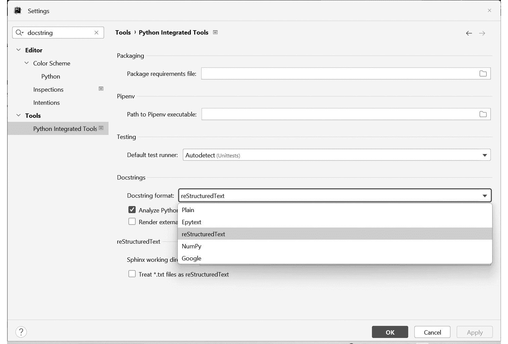

图 4.32：您可以将用于渲染文档字符串的通用格式更改为几种行业标准格式之一

另一组设置是颜色方案设置的一部分，它允许您自定义在 PyCharm 编辑器中渲染文档字符串所使用的颜色。

### 查看文档

想象一下这种情况：您正在使用一个包中的特定方法，但您并不完全确定该方法接受哪些参数以及其返回类型。因此，您需要上网查找该特定方法的文档。

作为 PyCharm 用户，您可以通过两个简单的操作实现相同的功能：将上一节中的`prime_check.py`脚本移动到使用`math.sqrt()`函数的`prime_check()`函数所在的行；它应该在大约第 19 行。

### 快速文档

假设我们想查看此函数的文档。您只需将鼠标悬停在函数调用上并等待片刻。或者，您可以选择**视图** | **快速文档**或其对应的快捷键。您将看到一个弹出窗口，显示类似于 *图 4**.33* 的文档：


图 4.33：快速文档显示所选函数的文档

更重要的是，您还可以使用相同的操作查看您自己的函数、方法、类等文档。当您打开项目时，PyCharm 的索引过程会找到并生成这些信息。

如果您将光标移至以下行中主作用域的`prime_check()`调用处（应该在大约第 38 行）：

`if prime_check(num):`

在等待片刻后，您将能够看到之前输入的相同文档字符串，如图 *图 4**.34* 所示：

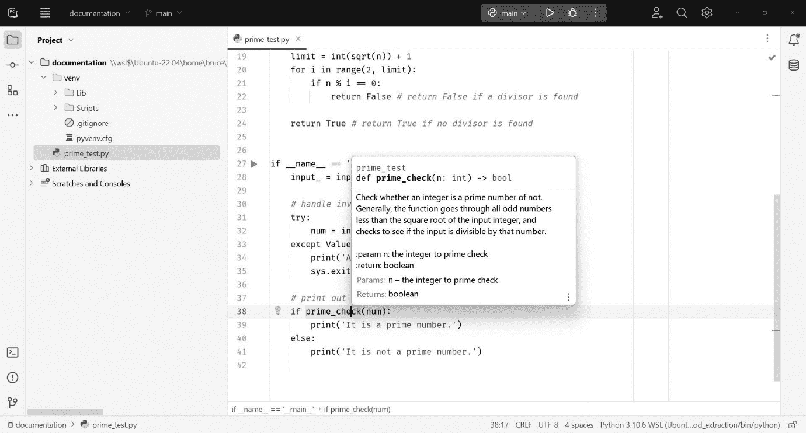

图 4.34：快速文档显示第 38 行所选函数的文档

注意文档中的文档字符串格式与窗口中显示的文档格式相匹配。

### 快速定义

**快速定义**与**快速文档**操作方式相同。这在文档提供的信息不足时非常有用，您希望查看特定函数在源代码中的定义方式。为此，将光标置于特定的 API 调用处，然后转到**视图** | **快速定义**以触发操作。

例如，*图 4**.35* 显示了在示例中对`prime_check()`的调用上触发的快速定义：

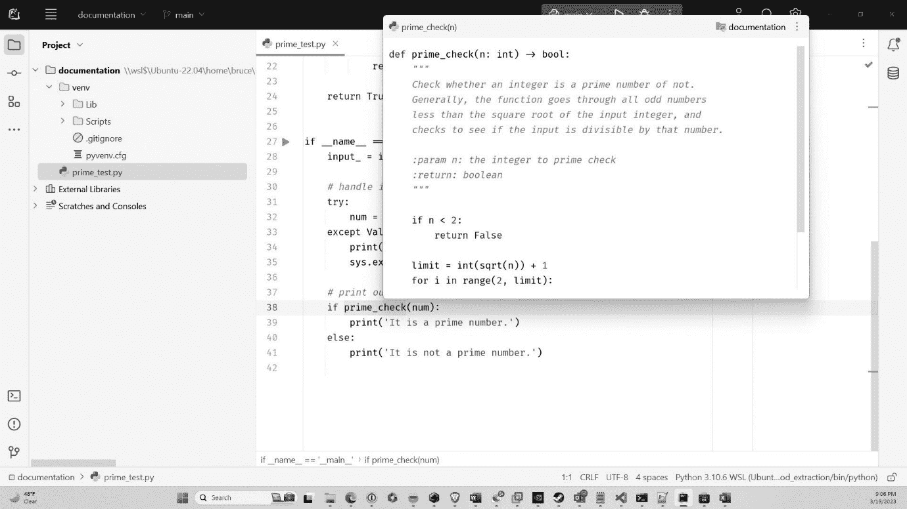

图 4.35：快速定义显示了函数的实际代码定义，如果存在，则自然包括文档字符串

总体而言，PyCharm 在 IDE 中动态查看文档和定义方面提供了强大的选项。当程序员无需从开发环境切换到查找文档时，可以节省大量的时间和精力。

# 摘要

在本章中，我们探讨了 PyCharm 在编程各个方面（包括代码分析、代码补全、重构和文档化）的功能。在这些所有过程中，PyCharm 的智能代码分析器提供了智能和便捷的选项，以便在实时和动态方式中编辑和修复代码中的问题。

除了智能代码分析器可以支持的众多选项之外，PyCharm 还允许用户根据个人喜好自定义分析器的行为。这可以通过通用设置的各个部分实现。总的来说，这些支持功能旨在以定制和有益于您的方式提高您作为开发者的生产力。

在下一章中，我们将专注于编程的一个特定方面：版本控制。我们将学习 Git 版本控制过程的具体细节以及 PyCharm 如何支持和简化这一过程。

# 问题

1.  在 Python 程序中，PyCharm 的代码分析器如何确定问题的严重程度级别？

1.  PyCharm 可以通过其智能代码分析器检测并帮助修复哪些常见问题？

1.  PyCharm 的代码补全支持与其他工具有何不同？

1.  PyCharm 提供了哪些常见的代码补全选项？

1.  为什么 PyCharm 的代码补全支持可能无法正常工作？

1.  PyCharm 提供了哪些常见的重构选项？

# 进一步阅读

+   Jolt Awards：*为开发者推荐的* *最佳书籍* ([informationweek.com](http://informationweek.com))

+   Pylint 主页：[`www.pylint.org/`](https://www.pylint.org/)

+   技术领域的墨菲定律：[`www.netlingo.com/word/murphys-laws-on-technology.php`](https://www.netlingo.com/word/murphys-laws-on-technology.php)

+   请务必查看本书的配套网站：[`www.pycharm-book.com`](https://www.pycharm-book.com)。
