# 第十章：更多全栈框架 - Django 和 Pyramid

我们到目前为止所讨论的 Web 框架在工作方式上都是典范。Flask 是一个无意见的微框架。这意味着 Flask 只处理端点路由，并且可选地提供模板页面内容。FastAPI 提供了一个专门用于构建 RESTful API 的框架，而不是提供超出数据的服务。它还提供了一个类似于在现代 NodeJS 框架中运行的 JavaScript 框架的异步编程模型。

在 PyCharm Professional 的 **新项目** 菜单中，你还会找到另外两个框架，我们将在下面介绍。**Django** 是一个非常流行的框架，从哲学上讲，它是 Flask 的完全对立面。Django 是一个高度有意见的框架，试图为你做出所有平台和框架的选择。

我们将要讨论的最后一个框架是 **Pyramid**。Pyramid 旨在 Flask 和 Django 之间找到平衡点，提供了比 Flask 更多的捆绑功能，但比 Django 更灵活。

在本章中，你将学习以下内容：

+   如何使用 PyCharm Professional 的新项目模板生成 Django 项目

+   如何识别由 PyCharm 生成的模板项目中的主要文件和文件夹

+   如何在 PyCharm 中使用 Django 特定的工具来执行 `manage.py` 任务

+   如何在 PyCharm Professional 中创建 Pyramid 项目

我们已经在早期章节中讨论了关于 Web 应用程序工作原理的大量理论，所以让我们直接使用 PyCharm 开发这两个框架。与其他 Web 开发框架一样，这些功能仅在 PyCharm 的专业版中可用。

# 技术要求

为了继续阅读本章，以及本书的其余部分，你需要以下内容：

+   安装并运行 Python 解释器。我将使用来自 [`python.org`](https://python.org) 的最新版本。

+   安装 `pip` 和 `virtualenv`。当你安装 Python 到 Windows 上时，你会自动获得这些，macOS 在每个系统上都包含它们。如果你使用 Linux，你需要单独安装包管理器，如 `pip` 和虚拟环境工具，如 `virtualenv`。我们的示例将使用 `pip` 和 `virtualenv`。

+   安装并运行 PyCharm。安装已在 *第二章**，安装和配置* 中介绍，如果你是在书的中途开始阅读。我使用的是 PyCharm Professional 2023.1（构建号 #PY-231.8109.197），并且开启了新界面。

+   本书从 GitHub 上的示例源代码。我们已在 *第二章**，安装和配置* 中介绍了代码克隆。你可以在 [`github.com/PacktPublishing/Hands-On-Application-Development-with-PyCharm---Second-Edition/tree/main/chapter-10`](https://github.com/PacktPublishing/Hands-On-Application-Development-with-PyCharm---Second-Edition/tree/main/chapter-10) 找到本章的相关代码。

# 这一切关于 Django 的喧嚣是什么？

如果你问大多数 Python 开发者他们更喜欢哪个框架，我敢打赌，Flask 和 Django 之间是平分的。我还会打赌，Django 群体是 Django 的狂热粉丝，而 Flask 似乎更像是一个用来完成工作的东西。这就像对螺丝刀感到兴奋。Django 有很多意见，因此也很多“直面”。你几乎注意不到 Flask，因为它只是拼图的一部分。Django 是一个盒子里的所有拼图，加上你用来把拼图变成图片的胶水，加上一个昂贵的框架，用于完成粘合后的拼图，加上一个海滩屋，这样你就有地方挂你的拼图。海滩屋里的枕头甚至可能有薄荷糖，但我不能保证。

另一方面，Django 承诺成为一个处理 Web 应用开发中繁重和重复性工作的 Web 框架。Web 开发者可以腾出时间专注于他们应用程序的具体逻辑。Web 框架通常将常见的设计模式和最佳实践实现到其结构中，因此使用框架开发的 Web 应用将默认符合常见标准，而无需开发者手动将这些标准集成到应用程序中。

Django 的目标是将开发 Web 应用所需的一切都集成到框架中。既然这是真的，你就根本不需要考虑你的技术栈。Django 不仅仅是一个框架；它变成了一种理念。你变成了 Django 方式的粉丝。你甚至可以说*“这就是方法，”*而 Django 可能会回应你。以下是 Django 擅长的一些事情：

+   **速度**：与 Python 本身类似，Django 强调将想法转化为实际代码的简便性。凭借简单而广泛的 API，Django 旨在适应各种 Web 应用和功能。

+   **安全性**：Web 开发是编程中一个以安全性为最高优先级的主题。Django 框架提供了功能，帮助 Web 开发者、初学者和专家 alike，避开他们应用程序中的安全漏洞。

+   **可扩展性**：当网站获得更多客户时，可扩展性变得越来越重要。Django 中的可扩展性可以通过灵活和直观的方式实现；事实上，一些互联网上最大的网站（如 Bitbucket、Instagram、Pinterest 等）都是用 Django 构建的，出于这个原因。

这些都没有被 Flask 具体解决。事实上，Flask 通常不用于大型 Web 应用，因为它相对较慢。我个人已经将所有产品后端代码从 Flask 迁移到了 FastAPI，因为性能明显更好。

到目前为止，Django 听起来比我们之前讨论的任何其他东西都要好。尽管 Django 是一个流行且强大的 Web 框架，但像任何技术一样，它也有其批评者。关于 Django 的一些常见批评和担忧包括以下内容：

+   **学习曲线陡峭**：一些开发者发现 Django 的学习曲线相对陡峭，尤其是对于在 Python 或 Web 开发方面经验有限的初学者来说。其广泛的功能集和全面性可能会让新手感到不知所措。

+   **魔法和抽象**：Django 对“内置电池”和抽象的强调可能是一把双刃剑。虽然它可以节省开发时间，但一些开发者认为它可能会掩盖底层机制，使得理解和调试复杂问题变得更加困难。

+   **小型项目的开销**：对于小型项目或简单的网站，一些开发者觉得 Django 的丰富功能和结构可能是过度设计，增加了不必要的开销和复杂性。

+   **单体性质**：批评者认为 Django 是一个单体框架，可能不适合微服务架构或需要轻量级框架的高度专业化的应用。

+   **灵活性与有偏见**：Django 遵循特定的设计哲学并强制执行某些模式，一些开发者认为这过于有偏见。这可能导致关于“Django 方式”做事与替代方法之间的争论。

+   **性能**：尽管 Django 的性能相当不错，但一些开发者声称它可能不如某些微框架或专用工具快。性能关键型项目可能需要额外的优化工作。

+   **ORM 限制**：虽然 Django 的 ORM 功能强大且易于使用，但它可能无法涵盖所有边缘情况，或提供与编写原始 SQL 查询相同级别的控制。在某些情况下，开发者可能更倾向于使用其他 ORM 或查询构建器。

+   **版本升级**：在 Django 的主要版本之间进行升级有时可能具有挑战性，尤其是对于严重依赖已弃用功能的旧项目。这可能导致维护问题和额外的开发工作。

+   **定制复杂性**：虽然 Django 提供了灵活性，但一些开发者发现定制某些内置组件（如管理界面）以适应特定设计要求具有挑战性。

+   **社区和生态系统**：尽管 Django 拥有庞大且活跃的社区，但其生态系统可能没有某些其他 Web 框架那么广泛，可用的第三方包也可能更少。

需要注意的是，尽管存在这些批评，Django 拥有庞大的用户基础，许多开发者都欣赏其生产力、稳定性和全面的功能集。最终，选择 Web 框架取决于项目和发展团队的具体需求和偏好。

## Django 框架组件

Django 包含了一系列包容性的组件，使其成为 Web 开发的全面且功能丰富的框架。以下是一些关键组件：

+   **URL 路由**: Django 使用 URL 分派器将传入的 HTTP 请求路由到适当的视图函数或基于类的视图。这为你的 Web 应用程序提供了干净和逻辑的 URL 模式。

+   **视图函数和基于类的视图**: Django 中的视图负责处理用户请求并返回 HTTP 响应。你可以使用简单的函数作为视图，或者使用 Django 的基于类的视图来编写更组织化和可重用的代码。

+   **模板**: Django 的模板系统允许你使用带有占位符的 HTML 模板来定义你的 Web 页面的结构和布局，这些占位符用于动态内容。这种关注点分离（逻辑和展示）使得维护和扩展你的 Web 应用程序变得更加容易。

+   **模型-视图-模板 (MVT) 架构**: 与 **模型-视图-控制器 (MVC**) 模式类似，Django 遵循 MVT 模式。模型代表数据结构和数据库模式，视图处理逻辑和加工，模板负责渲染输出。

+   **对象-关系映射 (ORM)**: Django 的 ORM 是其定义性特征之一。它提供了一种高级、Pythonic 的方式来与数据库交互，无需编写原始 SQL 查询。它允许你将模型定义为 Python 类，ORM 负责将这些模型映射到数据库表。

+   **表单**: Django 包含一个表单处理系统，简化了表单创建、数据验证和处理用户输入的过程。它有助于处理 HTML 表单并将用户提交的数据转换为 Python 数据类型。

+   **管理界面**: Django 的管理界面是一个自动管理界面，可以用来管理你的应用程序的数据模型。它提供了一个现成的解决方案来管理模型数据，并且可以根据你的特定需求进行定制。

+   **中间件**: Django 中的中间件组件是允许你在请求到达视图之前或离开视图之后全局处理请求和响应的钩子。它实现了包括身份验证、安全检查和请求/响应修改在内的功能。

+   **静态文件**: Django 内置了对管理静态文件（如 CSS、JavaScript 和图像）的支持。它简化了在开发和部署期间提供静态内容的过程。

+   **身份验证和授权**: Django 提供了一个强大的身份验证系统，用于管理用户账户、权限和组。它使得向你的应用程序添加用户注册、登录和密码管理功能变得容易。

+   **国际化与本地化**: Django 支持国际化与本地化，允许你创建可以翻译成多种语言并适应不同地区的应用程序。

+   **测试框架**: Django 附带了一个测试框架，它有助于你的应用程序的单元测试和集成测试。你可以编写测试用例以确保你的代码按预期工作并避免回归。

所有这些准备工作之后，我们很幸运拥有 PyCharm 这样强大的工具。让我们开始创建一个 Django 应用程序。

# 创建 Django 项目

这个过程与其他大多数项目没有不同。点击**文件 | 新项目**，然后点击如图*图 10.1*所示的**Django**选项。

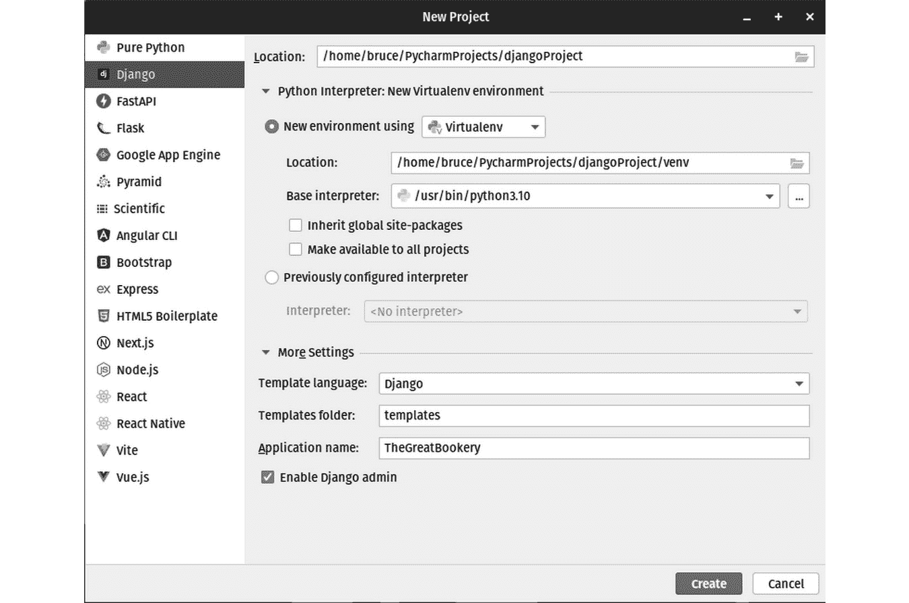

图 10.1：创建一个新的 Django 项目与其他项目非常相似

一定要展开**更多设置**部分。在这里，你可以设置模板语言。你可以使用**Django 模板语言**或**Jinja2**，这是我们之前在*第九章*中使用的，*使用 Flask 构建动态 Web 应用程序*。由于我们已经介绍了 Jinja2，让我们继续使用 Django。你可以设置用于模板的文件夹名称，并且绝对应该为**应用程序名称**字段设置一个值，如图*图 10.1*底部所示。

不要跳过应用程序名称

如果你跳过了我们稍后将要介绍的`manage.py`工具，但那可能不是你在创建新项目时大多数情况下想要的。此外，你不应该将应用程序命名为与 PyCharm 项目相同的名称，因为这可能会在 PyCharm 的索引中引起混淆，更不用说对于在项目上工作的人类了。

Django 项目通常包含多个应用程序，这里的**应用程序名称**设置用于在项目内创建和命名第一个应用程序。在我们的项目中，我们将构建一个单独的库应用程序。由于术语*库*在编程书中是模糊的，我将明确应用程序的名称，以便我们理解*库*是一个服务于书籍而不是编程库的地方。

新创建的项目结果如*图 10.2*所示。

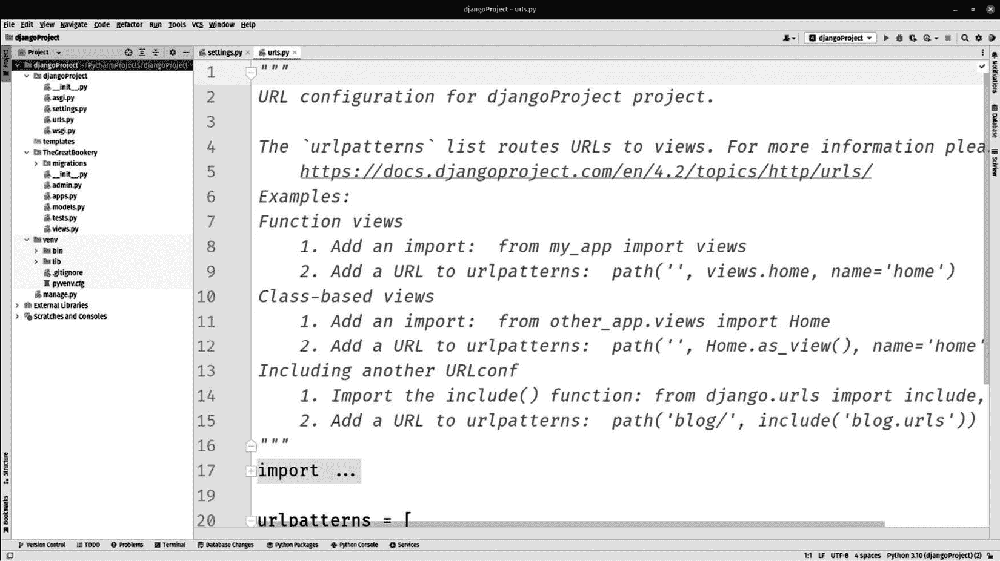

图 10.2：Django 项目已创建，PyCharm 以 urls.py 和 settings.py 文件作为起点打开

考虑到组件列表非常长，创建的文件如此之少确实有点令人惊讶。PyCharm 已自动打开两个作为起点：`urls.py`和`settings.py`。让我们看看这些以及新创建的应用程序中的其他文件和文件夹的用途。

# Django 项目的结构

你可能首先注意到的是项目，我将其命名为`djangoProject`，它有一组与应用程序不同的文件，该应用程序位于`TheGreatBookery`文件夹中。`djangoProject`文件夹中的所有文件都用于将你的应用程序部署到生产环境，以及运行内置的开发服务器。

在 `TheGreatBookery` 文件夹内部，我们有一个用于数据库迁移的文件夹。这对于使用 ORM 的应用程序来说是常见的。当你将新版本滚动到生产环境中时，你需要一种方法来更改生产数据库。你不能简单地删除数据库并重新构建，因为这会删除你应用程序的所有数据。需要有一个系统来将模式更改迁移到现有数据库，同时保持现有的生产数据。Django 的迁移系统利用存储在这个文件夹中的迁移脚本。

模板文件夹，从技术上讲位于应用程序文件夹之外，是我们存储 HTML 模板的地方。

你可能可以通过文件名猜测剩余文件的功能：

+   `admin.py` 用于注册模块、数据模型，也许从名称上看最明显的是，用于控制管理用户界面。

+   `apps.py` 提供了一个中心位置来定制和配置 Django 项目中应用程序的行为。它允许你指定应用程序的各种设置和元数据，例如人类可读的名称、默认应用程序配置和信号。

+   `models.py` 将包含你的数据模型，它受到 ORM 的影响。

+   `tests.py` 将包含你的应用程序单元测试，这些测试使用 Django 自身的测试框架运行。

+   `views.py` 将包含视图函数。这些是 Python 函数，它们接受一个 HTTP 请求作为参数，并返回一个 HTTP 响应。在这些函数中，你可以处理请求，处理来自模型或其他来源的数据，并生成适当的 HTTP 响应，通常是通过渲染包含动态数据的模板来完成的。

## 初始配置

虽然这不是一本关于 Django 的书，但如果我不指出 `settings.py` 文件中的几个问题，我会感到失职。像 Flask 一样，Django 内置了一个开发 Web 服务器，它不是为生产环境设计的。`settings.py` 文件中包含一些危险的设置，这些设置仅适用于本地开发。打开 `settings.py` 并找到这些行：

```py
# SECURITY WARNING: keep the secret key used in production secret!
SECRET_KEY = 'django-insecure-39u&w+cgs2t4*jwe3nuz4y4j^s!s65^xb7eqtb_a3bl!a_s%tn'
# SECURITY WARNING: don't run with debug turned on in production!
DEBUG = True
```

你应该尽早做的一件事是确保从你的代码外部提取这些值。你永远不应该在应用程序代码中硬编码一个秘密，也不应该将秘密提交到版本控制系统！你可以使用来自 `PyPi.org` 的库，通过环境变量、`.ini` 文件或 `.env` 文件来外部化这些值。将 `DEBUG` 设置硬编码可能会导致危险，因为抛出的错误可能会清楚地显示出来，包括堆栈跟踪和其他可能被恶意行为者利用的详细信息。

你可能还想审查另一个设置，即数据库引擎。你将在 `settings.py` 的底部找到这些行：

```py
# Database
# https://docs.djangoproject.com/en/4.2/ref/settings/#databases
DATABASES = {
  'default': {
    'ENGINE': 'django.db.backends.sqlite3',
    'NAME': BASE_DIR / 'db.sqlite3',
  }
}
```

PyCharm 默认为我们选择了 SQLite3，这实际上并不适合生产应用。SQLite3 是一个基于文件的数据库，在本地开发中使用它有优势，因为它不需要安装服务器。你不应该用 SQLite3 来服务生产应用，在我看来，你应该使用你将在生产中使用的相同数据库进行开发。

话虽如此，我们不会将这个应用推向生产，所以我将保持设置不变。你的数据库将作为名为`db.sqlite3`的文件出现在项目目录中。我们将在*第十一章*中学习 PyCharm 的数据库功能。要知道 PyCharm 有一套丰富的工具，用于查看和使用数据库，包括 SQLite3，这有助于开发过程。

## 运行 Django 项目

当我们创建项目时，PyCharm 为我们创建了一个运行配置。我们在*第六章*中详细介绍了运行配置。我们只想运行 PyCharm 生成的那个，所以只需简单地点击*图 10.3*中显示的绿色**运行**按钮。

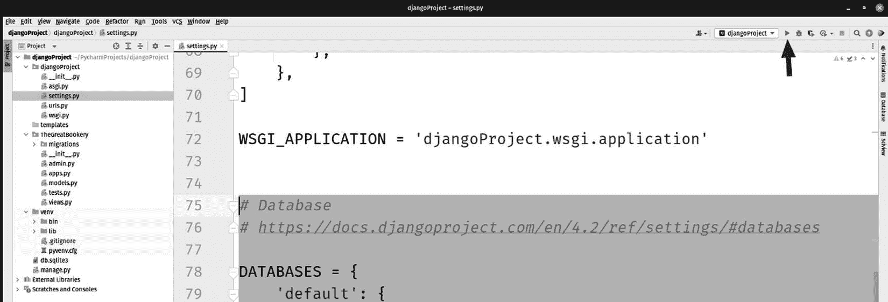

图 10.3：点击“运行”按钮将启动开发服务器

运行项目将在 IDE 窗口底部打开**运行**面板，如图*图 10.4*所示。


图 10.4：我们的项目正在运行，并在本地主机端口 8000 上提供服务

我们可以看到我们的项目正在端口`8000`上运行，还有一个方便的链接，可以打开默认浏览器并显示正在运行的应用，如图*图 10.5*所示。

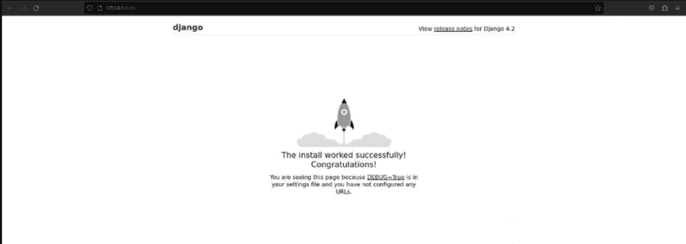

图 10.5：点击链接将打开浏览器并显示一条友好的消息，告诉你一切正常

PyCharm 已经为我们创建了一个最小的工作应用。在实际项目中，这通常是我处理通过**持续集成**（**CI**）和**持续交付**（**CD**）进行部署的地方。我总是给新晋的 Web 开发者一条建议，那就是尽早将生产机制建立起来。如果你做得正确，你就不必再麻烦它们很长时间。

JetBrains 有一个非常优秀的 CI/CD 服务器，名为 TeamCity。我过去 10 年一直在使用它，直到去年才不情愿地转向 Microsoft Azure DevOps。TeamCity 是一个更好的系统，如果你在寻找 CI/CD 服务器，它绝对值得你花费时间和精力。JetBrains 还为 PyCharm 提供了插件，允许你直接从 IDE 中控制和监控构建。

尽管如此，这一章是关于 Django 的，所以让我们继续进行，转到与数据模型一起工作的内容。

# 创建 Django 模型

在 Django 应用程序中，模型扮演着核心和关键的角色。它们是应用程序数据结构的骨架，负责定义数据库模式和处理数据操作。模型允许开发者以面向对象的方式与底层数据库进行交互，使得管理和操作数据变得更加容易。

模型充当应用程序和数据库之间的接口。它们抽象掉了 SQL 查询的复杂性，并提供了一个高级 API 来执行 **创建、读取、更新、删除**（**CRUD**）操作。通过使用模型方法和查询集，开发者可以与数据库交互，而无需编写原始 SQL 代码。与应用程序数据库驱动相关的一切（包括许多开发者通常忽略的事情，如验证和约束）都可以在 Django 模型中找到。

在一些放弃使用 ORM 的项目中，有时会出现一种常见的反模式，即使用数据库来封装业务逻辑。这种做法的理由通常是更改数据库快速、简单，且不需要新的编译或部署。这是一种愚蠢的经济行为，在需要治理和文档化的变更控制的现代时代，它变得令人反感。我的团队中的一位资深数据库开发者，同时也是 *第十一章* 的技术审稿人，将这种做法描述为在卡车以每小时 100 英里的速度在高速公路上行驶时更换轮胎。然而，Django 模型，由于它们在技术上属于对象，能够有效地处理业务逻辑，且不受禁忌。这是因为只有数据模型的结构被转换到数据库中，而逻辑仍然保留在对象内部。

关于使用 ORM（即我们在创建和操作模型时所做的工作），您需要记住的是，我们正在与数据库的抽象进行工作。当我们操作模型实例时，我们正在更改数据库中的数据。同样，当我们更改类的结构时，我们也在更改数据库的结构。在您的编程语言中数据类型的工作方式与在数据库中的工作方式之间存在差异。我们将在稍后看到这一点，但现在我想让您思考这样一个事实：Python 是一种动态语言，使用鸭子类型。在 Python 中，我可以以任何适合我的方式更改任何结构或类型。然而，数据库是静态的且强类型化的。鉴于 Python 与类、类型和变量交互的方式与数据库与表交互的方式之间的范式差异，Django 的 ORM 有很多工作要做。

让我们看看如何创建一个简单的模型。定位到 `models.py` 文件。您可以在 *图 10**.6 中找到它，或者您可以使用 PyCharm 中的导航功能，通过按 *Ctrl* + *Shift* + *N* (`models.py`) 来找到它。

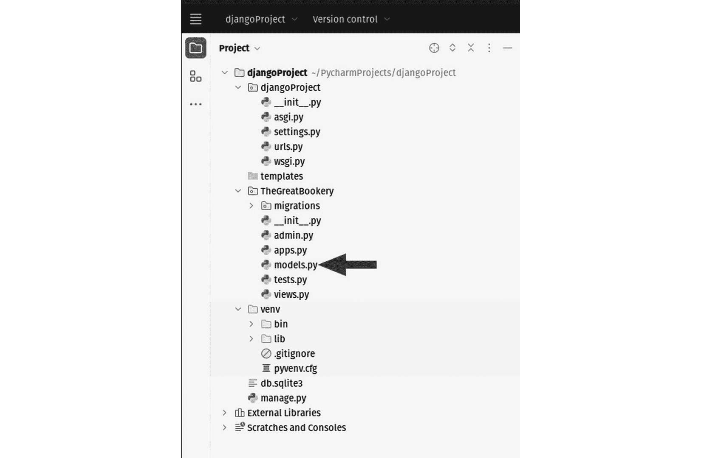

图 10.6：打开 models.py 文件以便我们可以添加一个模型

代码块内的生成代码将如下所示：

```py
from django.db import models
# Create your models here.
```

我们将为 Bookery 应用程序创建两个模型：`author`和`book`。为此，让我们按照以下方式修改`models.py`中的代码：

```py
from django.db import models
import datetime
from django.utils import timezone
```

在这里，我们添加了两个与时间和日期相关的导入。我们将在一些业务逻辑中使用这些库，这些逻辑将附加到书模型上。不过，我们先不要急于求成。让我们创建一个简单的模型来表示书作者：

```py
# Create your models here.
class Author(models.Model):
  first_name = models.CharField(max_length=100)
  last_name = models.CharField(max_length=100)
  def __str__(self):
    return f'{self.last_name}, {self.first_name}'
```

类希望足够简单明了。`Author`类从 Django 的`model.Model`类继承。有两个字段用于作者的姓和名，并使用`models.CharField`类型来表示数据库中的 varchars。关系数据库需要声明一个强类型，在 varchar（一个可变长度的字符字段）的情况下，我们必须提供一个最大长度。双下划线字符串方法简单地为我们提供了一个漂亮的格式，如果我们请求将模型的内容作为字符串。在这里，我们选择将作者的名字格式化为姓，逗号，空格，然后是名。

每个 ORM，无论平台如何，工作方式都是相同的。它的目的是让开发者只与本地语言对象工作。话虽如此，他们通常需要一个自己的类型系统，以便 ORM 能够在语言（Python）的类型系统和数据库之间进行转换。你将在*第十一章*中了解到，数据库数据类型与编程语言中的对应类型并不相同。至少，像将字符串称为 varchars 这样的差异是明显的，并且 int 和 float 类型在两种情况下都存在。有时它们甚至在数据库平台之间不同。SQLite3 中有一些数据类型在 MySQL 中不存在，反之亦然。

ORM 必须在任何地方都能工作，因此它为模型有自己的类型系统，这允许开发者有一个单一的类型系统，可以适应任何数据库平台。这是 Gang of Four 的**适配器模式**的经典实现，我在 Packt 出版的《Real-World Implementation of C# Design Patterns》一书中进行了介绍。

`author`类并不复杂。让我们在`Book`模型代码中做一些更有趣的代码：

```py
class Book(models.Model):
  title = models.CharField(max_length=200)
  author = models.ForeignKey(Author, on_delete=models.CASCADE,)
  pub_date = models.DateTimeField('date published')
```

到目前为止，我们有一个继承自`models.Model`的`Book`类，就像之前一样。我们有一个标题字段，最大长度为 200 个字符。有一个`author`字段，但不是将其作为一个字符串，我们使用了`Author`类来设置一个`authors`表，该表由我们刚才创建的`Author`类控制。外键关系指定了任何添加到数据库的`Book`都必须包含一个与现有作者相关联的数据库（这是一个关系数据库）。从操作的角度来看，这意味着我们必须确保作者存在于数据库中，然后我们才能将作者的书添加到数据库中。

外键约束作为一种内置数据验证形式，但它们还通过强制执行规则来帮助维护数据库中的数据完整性。如果我向数据库中添加一个作者，然后添加该作者写的一批书籍，我们将在两个表之间建立良好的人际关系。如果我从`authors`表中删除作者，我们仍然会有一批没有相关作者的书籍记录。这些将是孤儿记录。孤儿记录很糟糕，因为它们占用数据库空间，并破坏了作者和书籍之间关系的一致性。

在这个类中，当我们定义`author`字段时，我们使用外键约束并定义了一个实际规则，覆盖了删除作者时会发生什么。代码`on_delete=models.CASCADE`告诉 ORM，当删除作者时，他们所写的书籍记录也会被删除。这被称为级联删除，因为删除从作者到书籍记录，这反过来又可能级联到可能具有类似书籍关系的其他表。一个结构良好的数据库可以在数据库结构可能很复杂的情况下保持自身清洁，没有孤儿记录。

最后，我们有一个日期来包含出版日期：

```py
pub_date = models.DateTimeField('date published')
```

如果`外键`字段没有给您带来足够的惊喜，让我们再添加一个东西。由于我们正在处理一个对象，并且由于对象可以包含数据和功能逻辑，让我们在我们的`Book`模型中添加一个函数：

```py
  def was_published_recently(self):
    now = timezone.now()
    return now - datetime.timedelta(days=1) <= self.pub_date <= now
```

这为我们模型添加了一个字段，但这个数据不是存储在数据库中，而是在调用方法时计算得出的。我们正在使用静态的出版日期字段，并计算与当前日期的时间差（delta）。我们考虑了时区，并以自书籍出版以来的天数来呈现。这允许我们向用户展示书籍的年龄（以天为单位），这可能会被用来提示作者出版新书或更新版本书籍。

# 使用`manage.py`执行迁移

为您的 Django 项目生成的文件之一是`manage.py`。您可以在*图 10.7*中看到它。


图 10.7：`manage.py`文件提供了与您的 Django 项目一起工作的实用工具，这样您就不必输入长命令或记住完整的路径

`manage.py`任务的目的允许您从命令行运行 Django 特定的命令，而无需记住 Django 项目的完整路径或手动设置 Python 环境。通过使用`manage.py`，您确保命令在正确的 Django 项目上下文中执行。

您可以使用`manage.py`执行的一些常见任务包括以下内容：

+   使用`manage.py runserver`。这允许您在开发期间本地测试您的应用程序。之前，我们使用生成的运行配置来运行 Django 项目。我们也可以使用`manage.py`来做这件事。

+   使用`manage.py makemigrations`和`manage.py migrate`，您可以分别创建和应用数据库迁移。这有助于您管理模型的变化并保持数据库模式最新。

+   使用`manage.py createsuperuser`。

+   使用`manage.py test`来确保您的应用程序按预期运行。

+   使用`manage.py collectstatic`。

+   使用`manage.py makemessages`和`manage.py compilemessages`。

这只是一个简短列表。`manage.py`中还有许多更多实用工具。`manage.py`文件作为 Django 管理命令的入口点，使得在不离开您的开发环境的情况下执行管理任务变得容易。在您点击 PyCharm 中的终端按钮之前，实际上有一个更简单的方式来与`manage.py`一起工作。如图*图 10**.8*所示，点击**工具 | 运行 manage.py 任务...**。

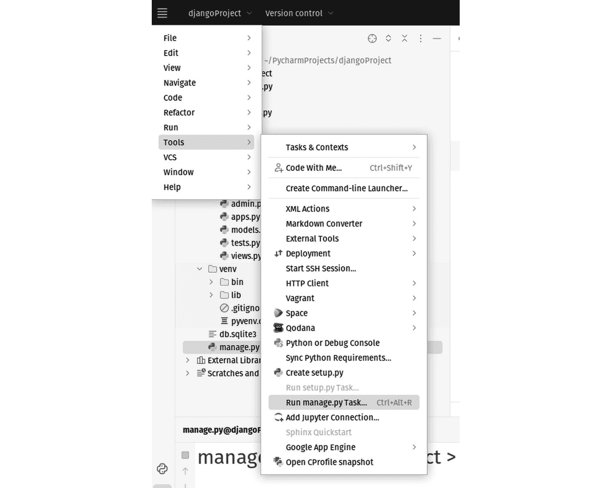

图 10.8：PyCharm 有一个专门用于处理 manage.py 的工具面板

这为您提供了一个新的面板，如图*图 10**.9*所示。

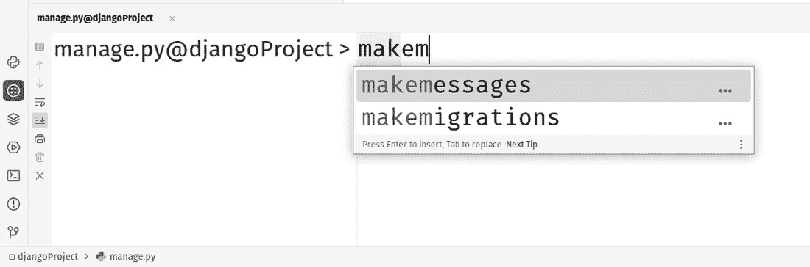

图 10.9：运行 manage.py 任务面板是一个专门的命令行界面，让您可以轻松调用针对 Django 的 manage.py 文件特定的命令

`manage.py`面板在 IDE 的底部打开，就像许多其他面板一样。乍一看，它看起来像一个终端窗口，但这个面板是针对 Django 和`manage.py`文件的。正如您所看到的，面板提供自动完成功能，以帮助完成命令。

为了创建我们的迁移，您应该在面板中输入此命令：

```py
makemigrations TheGreatBookery
```

结果将类似于*图 10**.10*。

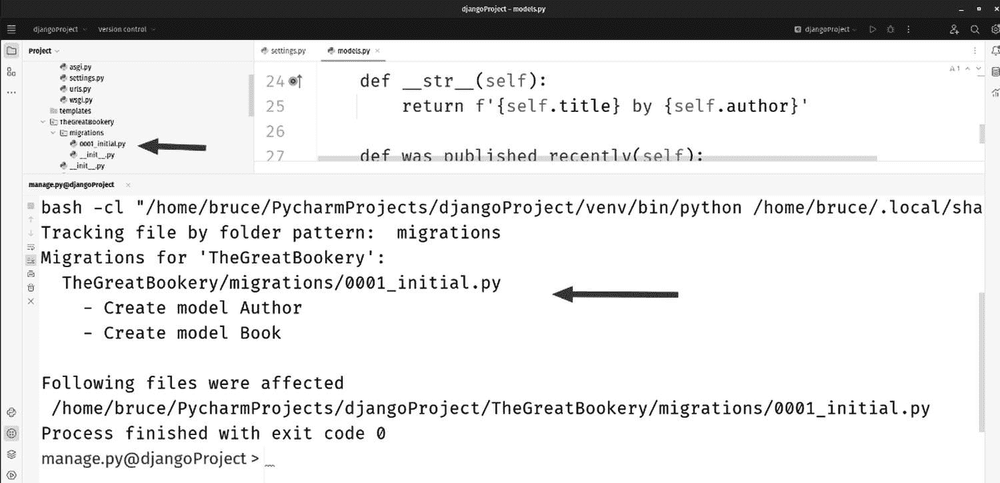

图 10.10：makemigrations 命令的结果

您将在`manage.py`面板中找到一些消息，以及在`migrations`文件夹中名为类似`0001_initial.py`的新文件。`makemigrations`命令生成了迁移所需的代码，但尚未执行迁移。执行迁移是影响数据库变化的方式。为了运行迁移，请在`manage.py`任务面板中输入以下内容：

```py
sqlmigrate TheGreatBookery 0001
```

命令的输出，如图*图 10**.11*所示，表明数据库结构已更新以匹配模型。

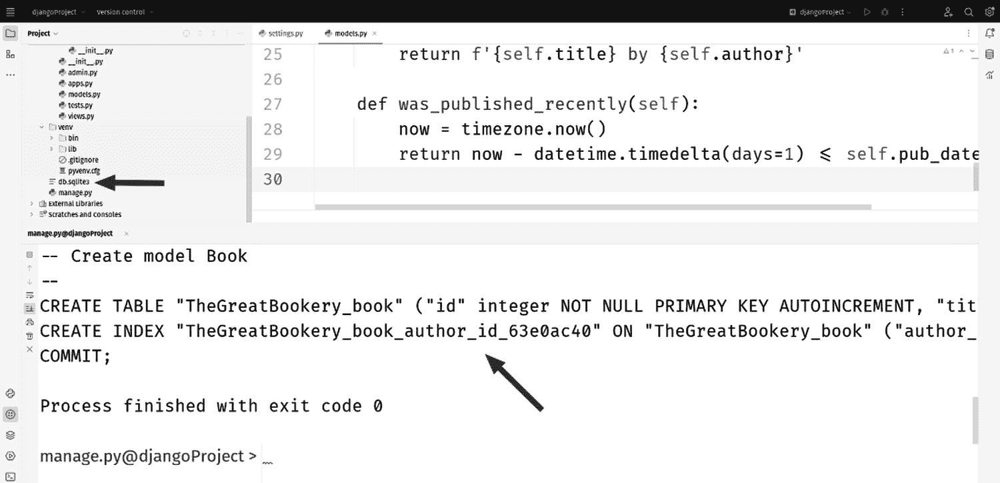

图 10.11：迁移的结果是一系列消息和我们的数据库文件的外观

我们看到了一些 SQL 语句，这些语句被生成以使数据库结构匹配模型的结构。我们还看到了一个关于我们数据库的新文件。如果你记得，我们之前看到这个文件的名字和路径是在`settings.py`文件中设置的。由于 SQLite3 是一个文件数据库，这就是实际的数据库本身。这类东西你可能希望在真实项目中排除在版本控制之外。

# Django 管理界面

这是 Django 的一个杀手级特性：它为你创建了一个基于 Web 的管理面板。这意味着你不需要为处理用户、处理登录或创建简单数据输入到你的模型结构中的屏幕来构建界面。每个应用程序都需要一个管理用户或超级用户。对于应用程序来说，拥有基于角色的用户访问是很常见的，超级用户是能够做任何事情的用户，包括添加新用户。这类事情可能需要开发者两三天才能完成，但使用 Django，这一切都已经准备好了。

## 创建超级用户并登录

在用户、登录或我们在这里讨论的其他任何好东西工作之前，你需要应用在创建项目时为你生成的迁移。

让我们回到我们的`manage.py`任务面板，并输入以下命令：

```py
migrate
```

就这样，自然而然地。这将为应用程序添加所有基础表。我们可能应该先做这件事，但我不想打断我们正在工作的流程。好吧，实际上我忘记了，但那样听起来更好。

通过这次迁移运行，我们现在数据库中已经有了所有表和结构，以支持 Django 的登录和用户管理功能。接下来，让我们创建超级用户。在面板中，输入以下内容：

```py
createsuperuser
```

你会被问到一系列问题，这些问题旨在为你的应用程序创建一个超级用户，如图*图 10.12*所示。

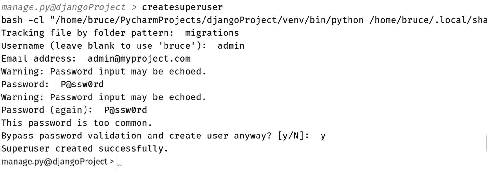

图 10.12：创建超级用户的管理.py 面板交互

让我们尝试一下管理界面！虽然你可以直接使用运行配置，但让我们看看从`manage.py`任务面板运行它的感觉。输入以下内容：

```py
runserver
```

然后点击*图 10.13*中面板消息中的链接。

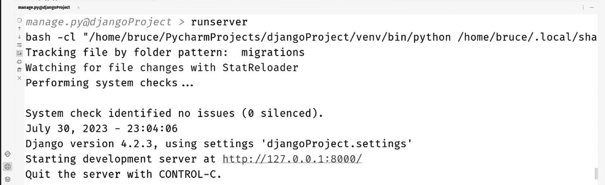

图 10.13：这次，让我们从面板开始运行！

事实上，这正是你第一次运行应用程序时点击绿色运行按钮所得到的结果。点击链接后，你的浏览器会打开到我们之前看到的同一页面。在浏览器中更改 URL 为[`127.0.0.1:8000/admin`](http://127.0.0.1:8000/admin)。这将带你到显示在*图 10.14*中的管理登录页面。

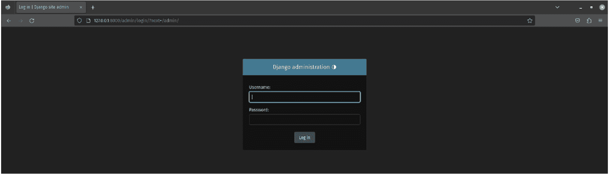

图 10.14：最好的登录系统是你不需要自己制作的！

在任务面板中输入你指定的超级用户用户名和密码。*图 10.15*显示了应该出现的管理屏幕。

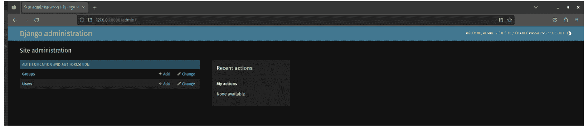

图 10.15：无需编写任何代码，我们就可以向应用程序添加用户和组

点击查看 Django 为我们生成的一切。尽管你没有为这个应用程序编写任何代码，但你仍然可以添加用户和组。这里的缺点是，它是基于 Django 项目对管理面板应该是什么样子以及应该如何工作的想法生成的。虽然可以自定义一些此功能，但请记住，我一直在说 Django 是*有偏见的*。它内置了一些假设。不那么有偏见的框架可能需要你构建这个或使用插件，但你将完全控制这个功能的实现方式。

## 将作者和书籍模型添加到管理界面

虽然你可以免费获得用户和组，但你必须做一点工作才能让作者和书籍显示在管理界面中。让我们从`Author`模型开始。

在`TheGreatBookery`文件夹中打开`admin.py`文件，并找到一条注释，内容为`# Register your models here`。添加以下代码：

```py
# Register your models here.
from .models import Author
admin.site.register(Author)
```

如果你的应用停止或崩溃，请继续重启它，然后像以前一样导航到管理页面。你现在应该会在管理页面上看到**作者**，如*图 10.16*所示。

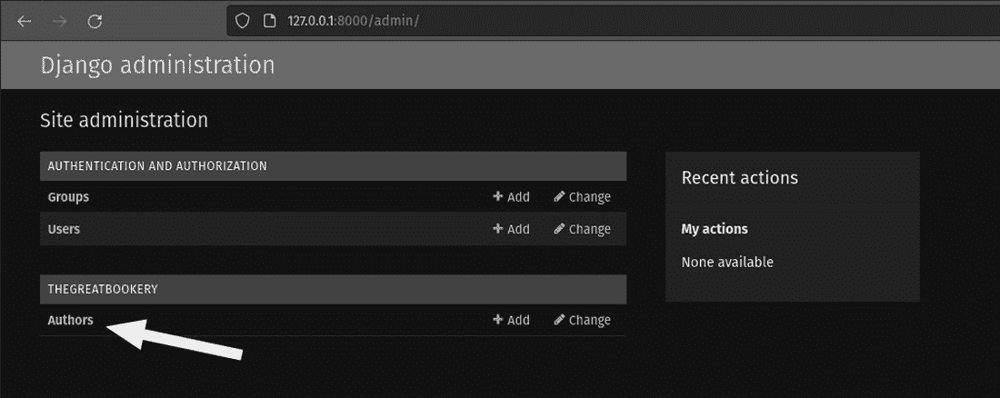

图 10.16：只需付出很少的努力，我们现在就可以添加、编辑和删除作者

我们有作者模型；让我们添加“书籍”。这个模型稍微复杂一些。记住，书籍和作者之间存在关系。每个作者可以与多本书相关联，反之亦然，多本书可以与一个作者相关联。

由于如此，我们希望管理界面不仅反映这种关系，而且在 UI 层强制执行。你只需将书籍模型的导入粘贴进去，就可以期望它完美工作。

返回到`admin.py`文件，并添加以下代码：

```py
from django.contrib import admin
# Register your models here.
from .models import Author, Book
class BookInLine(admin.TabularInline):
  model = Book
  extra = 1
  fieldsets = [
    (None, {'fields': ['title']}),
('Date information', {'fields': ['pub_date']})
  ]
class AuthorAdmin(admin.ModelAdmin):
  inlines = [BookInLine]
admin.site.register(Author, AuthorAdmin)
```

这段代码为`Author` UI 添加了一个功能，允许你内联添加书籍，也就是说，当你添加作者时，你将有机会添加书籍。没有先添加作者，你不能添加书籍。因为我们这样定义了关系和 UI，添加和编辑书籍的能力是管理作者的一部分。你永远不会有机会在添加作者之前添加书籍，或者以某种方式将书籍与作者解关联。

重新启动你的服务器，并刷新你的浏览器。没有任何变化！等等，这是正常的。我们还没有尝试添加作者。点击**作者**，然后点击**添加**，你将看到*图 10.17*所示的界面。

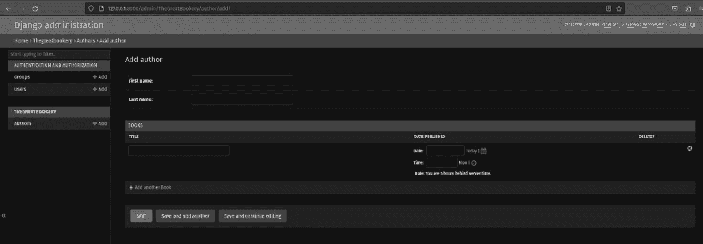

图 10.17：我们的代码将内联书籍添加到管理作者的 UI 中

如您所见，添加书籍的表单现在已内联附加到处理作者的工作表单中。

# 创建 Django 视图

管理员 UI 非常神奇，但它实际上仅设计用于创建用于在数据库中管理数据的简单屏幕。迟早，您将不得不为应用本身实际创建一些真正的屏幕。

在这里我们需要注意术语，因为如果你熟悉更传统的 Web 开发设计模式，那么“视图”这个词可能不会像你预期的那样。主流的行业模式被称为**模型-视图-控制器**（**MVC**）。Django 使用的模式被称为**模型-视图-模板**（**MVT**）。在这两种模式中，“视图”的含义并不相同。让我们比较一下这两种模式。

| **MVC** | **MVT** |
| --- | --- |
| 模型指的是数据结构，通常来自数据库。 | 模型在 MVC 中的含义与 MVC 相同。 |
| 视图层通常指的是用户界面中的视觉元素。 | 视图层指的是控制器层，它接受传入的请求，执行逻辑，并返回内容或数据。 |
| 控制器层接受传入的请求，执行逻辑，并返回内容或数据 | 模板在 MVC 中指的是视图，即应用中的 HTML 或用户界面元素。 |

总结来说，Django 视图实际上是控制器，而 Django 模板将是 MVC 应用中的视图。因此，当我们即将创建视图时，我们谈论的是接收请求、执行某些操作然后返回响应的应用部分。

打开`TheGreatBookery`文件夹中的`views.py`文件。将代码更改为以下内容：

```py
from django.shortcuts import render
from .models import Book
# Create your views here.
def index(request):
  latest_books = Book.objects.order_by('-pub_date')[:5]
  context = {'latest_books': latest_books}
Book model, then defined a method designed to accept a request, retrieve all the books in the database, and order them by the pub_date field in descending order indicated by the minus sign next to pub_date. We’re only going to display the first five books we find as indicated by the slice [:5].
Next, we create a variable called context ,which becomes a dictionary that will be used to pass data to the template during rendering. In this case, it creates a key-value pair where the key is `latest_books` and the value is the `QuerySet` of the latest books retrieved in the previous step.
The `return` line calls the `render` method imported at the top of the file. It passes the `request` object, a path to the template (which we have yet to create), and the `context` dictionary variable we just created.
This view function won’t do all the work by itself. Before it can be used, it must be registered in the `urls.py` file so we have a route to employ this function.
Open `urls.py` and change the code to this:

```

from django.contrib import admin

from django.urls import path

from TheGreatBookery.views import index

urlpatterns = [

path('admin/', admin.site.urls),

path('', index, name='index')

]

```py

 We added an import to the `index` function we just created in the `views.py` file. Next, we added by way of the `path` function an empty string, which will map the root route for the app, a reference to the `index` function that will execute in response to requests at the root route, and a friendly name.
We’re almost done. There’s just one more thing. Go back to the `view.py` file and you’ll see some problematic yellow highlighting. See *Figure 10**.18*.
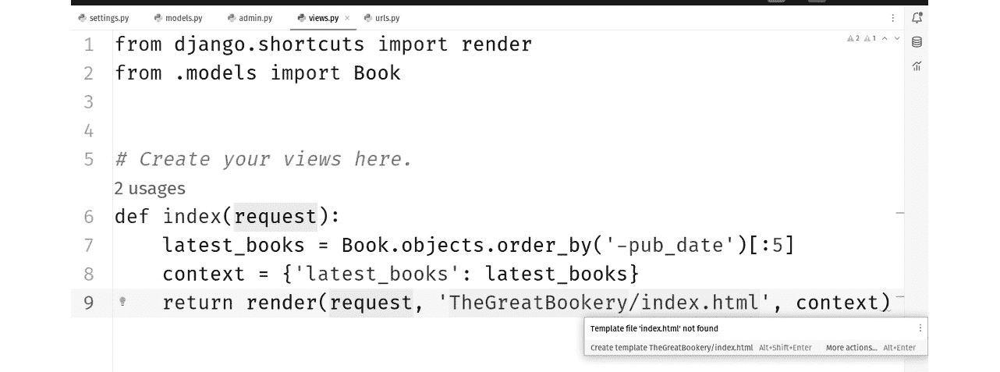

Figure 10.18: We have a view and a URL mapped, but we haven’t made the template yet
Hover your mouse over `index.html` and note that the tooltip has an action available to create the template for us. Either click the blue link text in the tool-tip window or use *Alt* + *Shift* + *Enter* as indicated. *Figure 10**.19* shows the ensuing dialog.
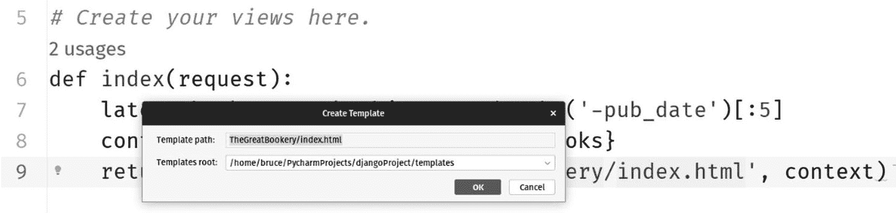

Figure 10.19: The dialog you get when you use the in-line action to create the missing template is automatically filled in based on some obvious assumptions
When you click `Templates` called `TheGreatBookery`. It is possible to have multiple apps in your Django project. Since that is the case, you might want to segregate your templates. Go ahead and let PyCharm create the folder for you. After it does, you get an empty file called `index.html`.
This isn’t a book on web page design, so we aren’t even going to try to make this pretty. Enter this code into your `index.html` page:

```



<ul>



<li>{{ book.title }} by {{ book.author }}</li>



</ul>



<p>没有可用的书籍。</p>



```py

 This looks a lot like Jinja2 code we saw in *Chapter 8* with Flask. It is very similar. All this code does is check whether or not a dictionary key called `latest_books` exists on the data context that was passed in. If you go back and look at the `render` function we called in the view, it’s passing this in.
If the key is there, we render the contents using the templates for loop syntax. This isn’t exactly an amazing UI. It is just going to render an unordered list with each book as a list item. If the key were not there, then we’ll be rendering a paragraph that says **No** **books available**.
What’s with the weird Python icon in the template gutter?
You might have noticed a big, juicy Python icon in the gutter of the `index.html` file. Check out *Figure 18**.20*.
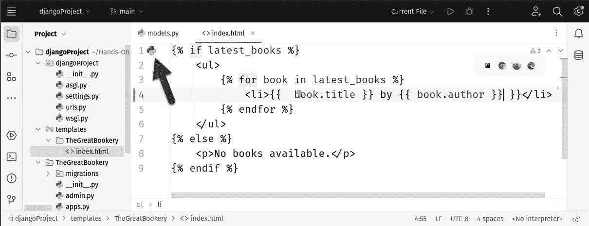

Figure 10.20: Look at that icon up there just begging to be clicked!
That Python icon is actually called a *Pythicon*.
OK, no it isn’t, I just made that up. Still, you really want to click it, don’t you? Go ahead, click it! It takes you to the Python code in `views.py` where we invoke it. Travel works both ways. In `views.py`, you’ll notice a more subtle icon in the gutter where the template is invoked. See *Figure 18**.21*.
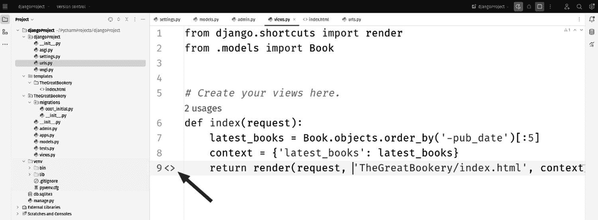

Figure 10.21: Click the HTML icon to navigate to the template
Again, just click the html icon, er, I mean HTML icon, to go to the template. I wouldn’t blame you for clicking back and forth between the two while saying, *“Take that, vi* *and emacs!”*
Run it!
Start or restart your server and check the results as seen in *Figure 18**.22*. 
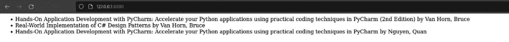

Figure 10.22: This might be the best website ever!
If you direct your browser to [`localhost:8000/`](http://localhost:8000/) you should see either some books or a message stating there are no books. I added some obvious reading choices and so my run looks absolutely glorious!
Clearly, you could leverage the HTML tooling we learned in *Chapter 7* to make this nicer, but we still have more ground to cover, so I’ll leave that up to you.
Building Pyramid applications with PyCharm
We’ve seen three popular web frameworks so far. There is one left that is listed in PyCharm’s **New Project** menu: **Pyramid**. You can find details on Pyramid at [`trypyramid.com/`](https://trypyramid.com/).
The organization behind Pyramid bills it as a framework that allows you to start small, finish big, and stay finished. To my mind, this might be a little bit of a dig at its main competitors. Django is criticized as being overly opinionated, and for being overkill for small projects. This fits with the “start small” idea in Pyramid. You have more leeway in choosing the components for your application, and you can leave out what you don’t need. For example, you can choose from a couple of ORM libraries, or simply choose not to use one. Django really wants you to use theirs.
Flask, in contrast, doesn’t come with an ORM or anything really, besides Jinja2 for templating. Flask is criticized for not being performant in large applications. The “finish big” concept seems to speak to this criticism. I’m not sure what, if anything, the “stay finished” directive is criticizing. I think that’s something we all want.
Having seen the first-rate tooling for Django, switching to Pyramid now is going to seem underwhelming. Django is a good candidate for custom tooling because it is complex, and it makes a lot of technical decisions for you. We can consider the `manage.py` task panel as an example. There are tons of commands in `manage.py`, so having its own panel makes sense. It also helps that Django is wildly popular. Pyramid isn’t. So from a PyCharm perspective, this is a much simpler proposition in terms of tooling.
Creating a Pyramid project
Creating a Pyramid project is no different from any other. Just use **File | New Project**, and pick the **Pyramid** template, as shown in *Figure 10**.23*.


Figure 10.23: PyCharm has a project template for Pyramid
As with Django, you should twirl down the advanced settings, as shown in *Figure 10**.23*. You are able to set a project name, as you were in Django. Be careful with this setting!
Pyramid project name
Make sure the project name is different than the PyCharm project name entered in the **Location** box.
When working with Pyramid, it’s a best practice to have a PyCharm project name that is different from the project name you define within Pyramid. This separation of names is recommended to avoid potential conflicts and confusion between the two namespaced systems: PyCharm, an IDE, and Pyramid, a Python web framework.
Here’s why it’s advisable to keep them different:

*   **Namespace clashes**: If your PyCharm project name matches your Pyramid project name exactly, you may encounter namespace clashes or naming conflicts. These conflicts can make it challenging for PyCharm to distinguish between project-specific settings, configurations, and files, and the Pyramid framework-specific files and configurations. This can lead to confusion and potential errors in your development process.
*   **PyCharm project settings**: PyCharm uses the project name for its internal settings and configurations, including virtual environments, code analysis, and project-specific settings. If your PyCharm project name is the same as your Pyramid project name, PyCharm might overwrite or interfere with Pyramid-specific configurations and settings.
*   **Clarity and maintainability**: Keeping distinct names for your PyCharm project and Pyramid project helps maintain clarity and organization in your development environment. It makes it easier to understand which aspects of your development are controlled by PyCharm and which are specific to your Pyramid web application.
*   **Flexibility**: Having different names provides flexibility, especially if you work on multiple projects with Pyramid or use PyCharm for various other Python projects. It prevents potential conflicts when switching between projects.

I’m going to name my imaginary project `giza_application`, a nod to the location of the Great Pyramids of Egypt.
Having set the project name, you can select from two template engines: **Jinja2** and **Chameleon**. Finally, you have settings for the ORM, which here is specified as **Backend**. The two choices are **SQLAlchemy**, which is very popular, and **ZODB**, which is somewhat exotic.
SQL Alchemy is a straightforward ORM used for working with relational databases. You create models as we did with Django’s ORM, and through a migration process, you can apply your database schema changes to a new or existing database.
ZODB refers to the Zope database. Generally speaking, Zope is an open source web application server written in Python. Less generally speaking, it is used as a content management system similar to WordPress. The database component, ZODB, has some interesting features that distinguish it from typical relational databases. It’s a powerful tool that can be used in conjunction with the Pyramid web framework to manage data in a more Pythonic way. Here’s how ZODB integrates into a Pyramid project and some of its features:

*   **Python native**: ZODB lets you store Python objects without needing to serialize them into a different format. You can work with complex data structures directly, without having to map them to a relational database schema.
*   **ACID transactions**: ZODB supports **Atomicity, Consistency, Isolation, Durability** (**ACID**) transactions. This ensures that your data remains consistent, even if something goes wrong during a transaction.
*   `pyramid_zodbconn` package. This provides a smooth way to get a ZODB connection within Pyramid’s request handling.
*   **Hierarchical storage**: ZODB allows you to organize your data in a tree-like structure. This can be particularly useful in a Pyramid application using traversal, where the URL structure often mirrors a hierarchical data structure.
*   **Scalability**: ZODB can be scaled across multiple machines, allowing for more extensive and complex applications.
*   **Versioning**: ZODB supports object versioning, allowing you to keep track of changes to objects over time. This can be useful for implementing features such as undo/redo.
*   `repoze.catalog`.
*   **No schema required**: Unlike relational databases, ZODB doesn’t require a fixed schema, offering flexibility in data modeling. You can modify the Python classes used for storage without needing to migrate data.
*   **Blob support**: ZODB supports the storage of large binary objects (BLOBs), such as images or videos, alongside regular objects.
*   **Persistence**: ZODB provides a straightforward persistence model. Any changes to persistent objects within a transaction are automatically saved to the database when the transaction is committed.
*   **Compatibility**: ZODB works well with various WSGI servers and can be integrated into a Pyramid application running on different platforms.

ZODB can be a compelling choice for Pyramid developers looking for a database that aligns closely with Python’s object-oriented paradigm. Its integration into a Pyramid project allows for intuitive data management without the need for complex SQL queries or ORM mapping, making it an attractive option for certain types of applications. If the hierarchical, object-oriented nature of ZODB fits the data model of your Pyramid application, it may be an excellent choice. From a PyCharm perspective though, there is no special tooling for this database.
Clicking the **OK** button will generate the project structure and the run configuration.
I really wish there was more to say here, but in truth, besides Djano, any other framework that could have been covered last would have the same problem. We’ve already covered PyCharm’s tools for developing web applications in an unopinionated framework. We have seen the support for Jinja2 templates, working with an ORM, and obviously general Python project work.
Summary
In this chapter, we examined various PyCharm features regarding supporting and automating tasks in the process of web development with Django. While this list of features is in no way exhaustive, I hope it can offer you a solid starting point to continue discovering other powerful features for your web development process.
First, we see that, by specifying the PyCharm project type as Django, an extensive project skeleton will be generated with convenient boilerplate code already filled out. With the implementation of the `manage.py` panel inside the project window as well as its run/debug configuration, PyCharm additionally allows for a higher level of development, with various tasks traditionally achieved via the command line, such as running the server or making migrations. Finally, by acknowledging integrated views and templates in Django, PyCharm makes it as easy as possible for developers to work with them in the editor—be it generating a missing template, code completion even in HTML and Jinja, or even dynamically switching between views and templates.
We concluded with a short coverage of Pyramid. Pyramid is a framework that aims to be more flexible than Django but packs more features than Flask. It’s a happy medium between the two. Unfortunately for Pyramid, we covered it last. PyCharm doesn’t have any special tooling for Pyramid beyond the project template that creates the project structure. To be fair, if Flask had gone last, it would have suffered the same fate because most of PyCharm’s web development tools are useful regardless of which framework you choose. Pyramid has some great features and is worthy of consideration for any project.
In the next chapter, we will tackle the last major component of any web application: the database. Buckle up, because the tooling for databases in PyCharm is extensive!
Questions

1.  What are the major characteristics of Django, and how do they set Django apart from another popular Python web framework, Flask?
2.  What is the purpose of the PyCharm `manage.py` panel in a Django project, and how does one open and utilize it?
3.  What is the purpose of the Django admin interface? How does one create an instance of a model (that is, a new entry in a database table) in this interface? How does the process change if the model references another model?
4.  What is the purpose of the run/debug configuration in PyCharm in the context of running a Django server?
5.  Does PyCharm’s code completion logic only apply to Python code in Django projects?
6.  What is the significance of being able to switch between Django views and corresponding templates in PyCharm?
7.  Describe the PyCharm tooling available for the Pyramid framework.

Further reading
Be sure to check out the companion website for the book at [`www.pycharm-book.com`](https://www.pycharm-book.com).
Check the following resources to expand on what was covered in this chapter:

*   *Web Development with Django,* *Second Edition*
*   *Hands-On RESTful Python Web Services,* *Second Edition*

```
