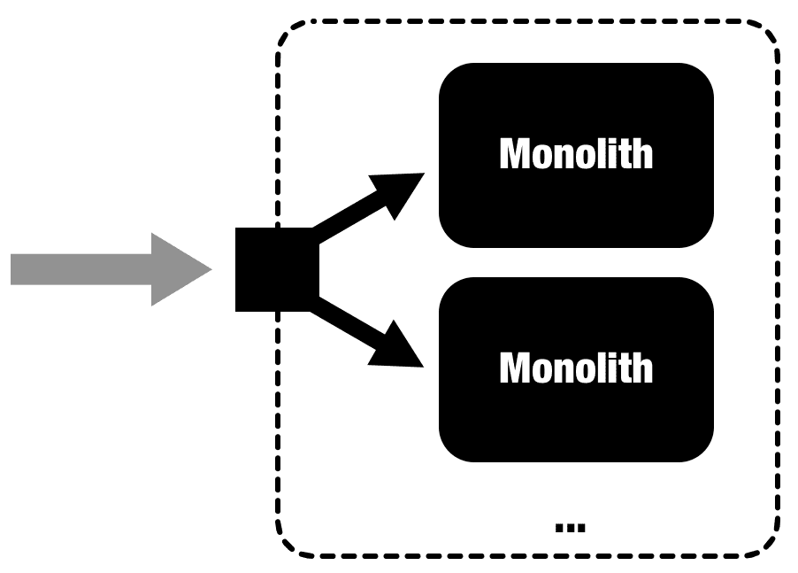
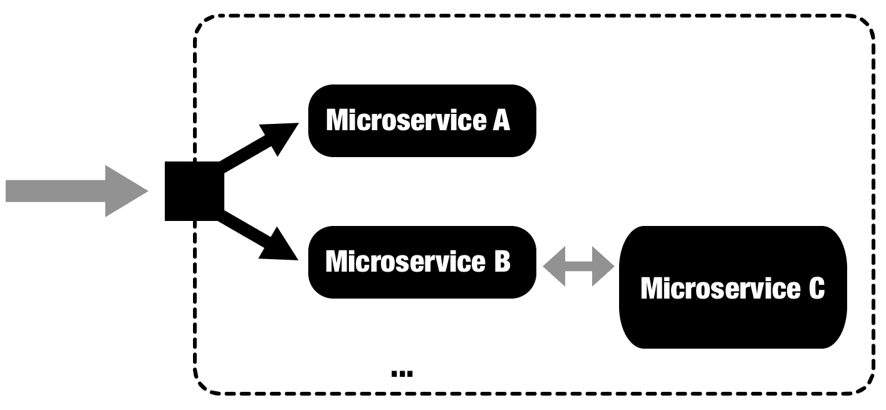
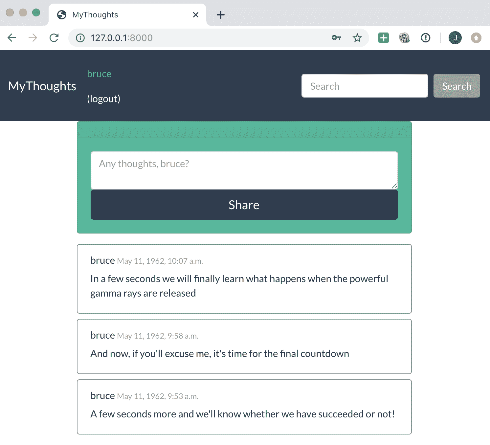
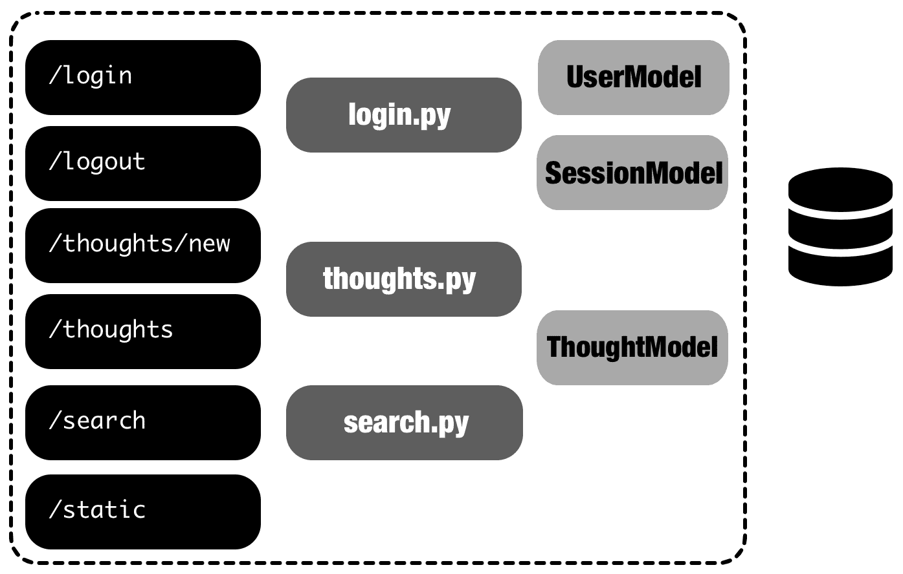
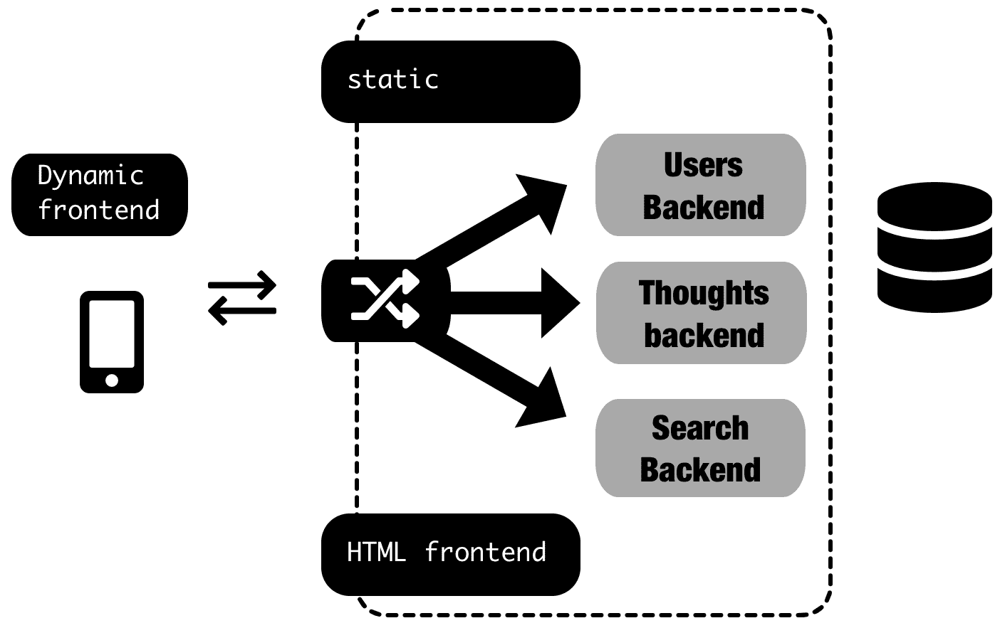
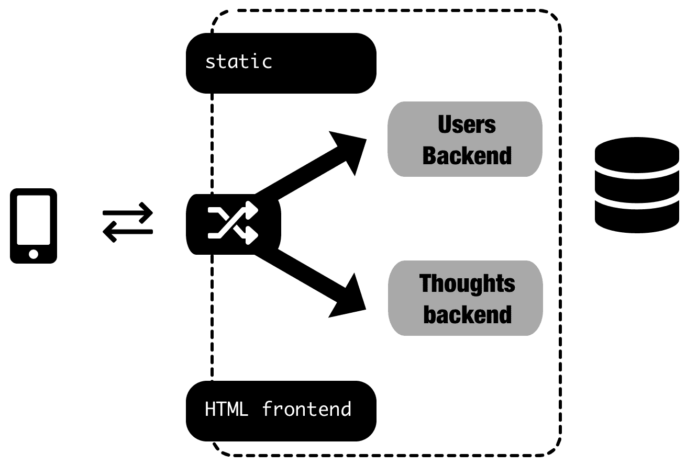
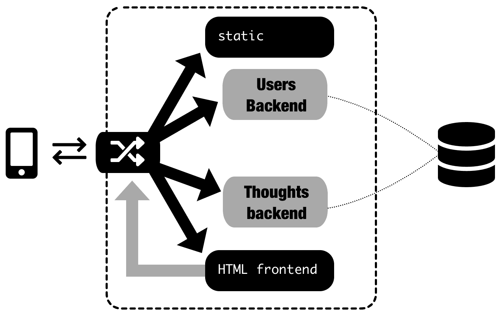
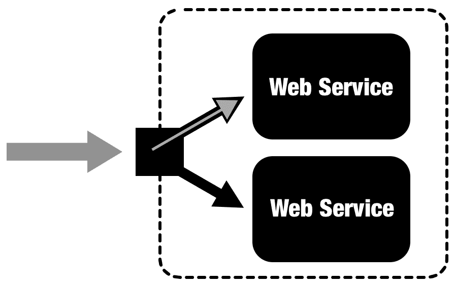
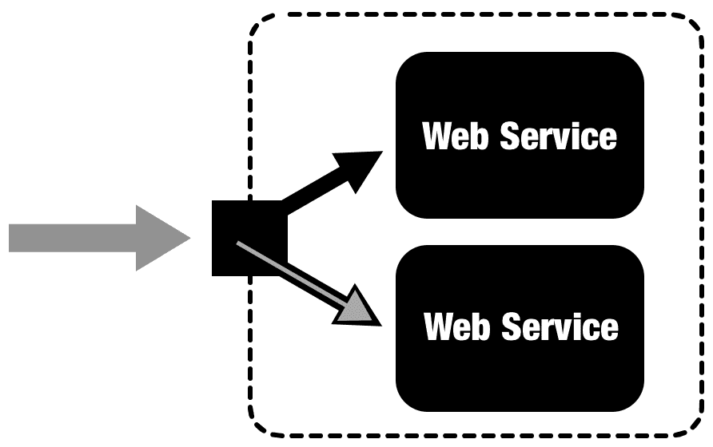

# 第一章：迁移 - 设计、规划和执行

随着 Web 服务变得越来越复杂，软件服务公司的规模也在增长，我们需要新的工作方式来适应并提高变化的速度，同时确保高质量标准。微服务架构已经成为控制大型软件系统的最佳工具之一，得益于容器和编排器等新工具的支持。我们将首先介绍传统单体架构和微服务架构之间的区别，以及迁移到后者的优势。我们将介绍如何构建架构迁移以及如何计划成功完成这一困难的过程。

在本书中，我们将处理 Web 服务器服务，尽管一些想法也可以用于其他类型的软件应用程序，显然需要进行调整。单体/微服务架构与操作系统设计中的单体/微内核讨论有一些相似之处，包括 1992 年 Linus Torvalds 和 Andrew S. Tanenbaum 之间的著名辩论（[`www.oreilly.com/openbook/opensources/book/appa.html`](https://www.oreilly.com/openbook/opensources/book/appa.html)）。本章对工具相对中立，而接下来的章节将介绍具体的工具。

本章将涵盖以下主题：

+   传统的单体方法及其问题

+   微服务方法的特点

+   并行部署和开发速度

+   挑战和警示信号

+   分析当前系统

+   通过测量使用情况进行准备和调整

+   分解单体的战略规划

+   执行迁移

在本章的结尾，您将熟悉我们将在整本书中使用的基本概念，不同的策略，以及在迁移到微服务期间如何进行和构建工作的实际示例。

# 技术要求

本章不专注于特定技术，而采用更中立的方法。我们将讨论一个 Python Django 应用程序作为我们单体示例。

单体示例可以在以下位置找到：[`github.com/PacktPublishing/Hands-On-Docker-for-Microservices-with-Python/tree/master/Chapter01/Monolith`](https://github.com/PacktPublishing/Hands-On-Docker-for-Microservices-with-Python/tree/master/Chapter01/Monolith)。安装和运行说明可以在其`README.md`文件中找到。

# 传统的单体方法及其问题

在开发系统时，传统的软件方法是创建一个单体。这是一个花哨的词，意思是“包含一切的单一元素”，这几乎是每个项目开始的方式。在 Web 应用程序的上下文中，这意味着创建可部署的代码，可以复制，以便请求可以指向任何已部署的副本：



毕竟，每个项目都会从小处开始。在早期进行严格的划分是不方便的，甚至没有意义。新创建的项目很小，可能由单个开发人员处理。虽然设计可以适合几个人的头脑，但在系统的各个部分之间进行严格的界限是适得其反的。

有很多运行 Web 服务的选项，但通常会包括一个或多个服务器（物理服务器、虚拟机和云实例，如 EC2 等），运行 Web 服务器应用程序（如 NGINX 或 Apache）来将请求指向 HTTP 端口`80`或 HTTPS 端口`443`，指向一个或多个 Python 工作进程（通常通过 WSGI 协议），由`mod_wsgi`运行 - [`github.com/GrahamDumpleton/mod_wsgi`](https://github.com/GrahamDumpleton/mod_wsgi)（仅限 Apache）、uWSGI、GNUnicorn 等。

如果使用多台服务器，将会有一个负载均衡器来在它们之间分配负载。我们将在本章后面讨论它们。服务器（或负载均衡器）需要在互联网上可访问，因此它将拥有专用的 DNS 和公共 IP 地址。

在其他编程语言中，结构将是类似的：一个前端 web 服务器公开端口以进行 HTTP/HTTPS 通信，以及在专用 web 工作人员中运行单体代码的后端。

但事情会改变，成功的软件会增长，经过一段时间，拥有一大堆代码可能不是构建大型项目的最佳方式。

单体应用在任何情况下都可以有内部结构，这意味着它们不一定会变成意大利面代码。它可能是完全结构化的代码。定义单体应用的是需要将系统作为一个整体部署，而不能进行部分部署。

意大利面代码是指缺乏任何结构且难以阅读和理解的代码的常见方式。

随着单体应用的增长，一些限制将开始显现：

+   **代码将增加**：没有模块之间的严格边界，开发人员将开始遇到理解整个代码库的问题。尽管良好的实践可以帮助，但复杂性自然倾向于增加，使得在某些方面更改代码变得更加困难，并增加微妙的 bug。运行所有测试将变得缓慢，降低任何持续集成系统的速度。

+   **资源利用效率低下**：每个部署的 web 工作人员都需要整个系统工作所需的所有资源，例如，任何类型的请求所需的最大内存，即使需要大量内存的请求很少，只需要几个工作人员就足够了。CPU 也可能出现相同的情况。如果单体应用连接到数据库，每个工作人员都需要连接到它，无论是否经常使用等等。

+   **开发可扩展性问题**：即使系统被设计成可以水平扩展（可以添加无限数量的新工作人员），随着系统和开发团队的增长，开发将变得越来越困难，而不会相互干扰。一个小团队可以轻松协调，但一旦有几个团队在同一个代码库上工作，冲突的可能性就会增加。除非严格执行纪律，否则对团队的所有权和责任进行界定也可能变得模糊。无论如何，团队都需要积极协调，这会降低他们的独立性和速度。

+   **部署限制**：部署方法需要在团队之间共享，并且团队不能分别对每个部署负责，因为部署可能涉及多个团队的工作。部署问题将导致整个系统崩溃。

+   **技术的相互依赖**：任何新技术都需要与单体应用中使用的技术相匹配。例如，一个对特定问题非常适合的工具可能很难添加到单体应用中，因为技术不匹配。更新依赖项也可能会导致问题。例如，更新到 Python 的新版本（或子模块）需要与整个代码库一起运行。一些必要的维护任务，如安全补丁，可能会导致问题，因为单体应用已经使用了特定版本的库，如果更改将会破坏。适应这些变化也需要额外的工作。

+   **系统的一小部分出现 bug 可能导致整个服务崩溃**：由于服务是一个整体，任何影响稳定性的关键问题都会影响到一切，使得难以制定高质量的服务策略或导致结果下降。

正如您在示例中所看到的，大多数单体问题都是逐渐增长的问题。除非系统有相当大的代码库，否则它们并不真正重要。在单体系统中有一些非常有效的东西，比如，由于代码中没有边界，代码可以被迅速高效地改变。但随着团队的壮大，越来越多的开发人员在系统中工作，边界有助于定义目标和责任。过度的灵活性在长期内会成为问题。

# 微服务方法的特点

单体方法适用，直到它不适用为止。但是，替代方案是什么？这就是微服务架构进入场景的地方。

遵循微服务架构的系统*是一组松散耦合的专门化服务，它们协同工作以提供全面的服务*。让我们稍微分解一下这个定义，更具体地说：

1.  **一组专门的服务**，意味着有不同的、明确定义的模块。

1.  **松散耦合**，意味着每个微服务都可以独立部署。

1.  它们**协同工作**——每个微服务都能够与其他微服务通信。

1.  提供**全面的服务**，因为我们的微服务系统将需要复制使用单体方法可用的相同功能。这是其设计背后的意图。

与之前的图表相比，微服务架构将如下所示：



每个外部请求将被引导到**微服务 A**或**微服务 B**，每个微服务专门处理一种特定类型的请求。在某些情况下，**微服务 B**与**微服务 C**通信，而不是直接对外可用。请注意，每个微服务可能有多个工作人员。

这种架构有几个优势和含义：

1.  如果微服务之间的通信是通过标准协议进行的，那么每个微服务可以用不同的语言编程。

在整本书中，我们将使用 HTTP 请求，并使用 JSON 编码的数据在微服务之间进行通信。虽然还有更多的选择，但这绝对是最标准和广泛使用的选项，因为几乎每种广泛使用的编程语言都对其有很好的支持。

这在某些情况下非常有用，比如专门的问题需要专门的语言，但限制其使用，使其受控，不需要公司进行 drastical 的变化。

1.  更好的资源利用——如果**微服务 A**需要更多的内存，我们可以减少工作人员的副本数量。而在单体系统中，每个工作人员都需要最大的资源分配，现在每个微服务只使用其所需的整个系统部分的资源。也许其中一些不需要连接到数据库，例如。每个单独的元素都可以进行微调，甚至在硬件级别。

1.  每个单独的服务都更小，可以独立处理。这意味着更少的代码需要维护，更快的构建，更简单的设计，更少的技术债务需要维护。服务之间没有依赖问题，因为每个服务都可以自己定义和移动它们的步伐。进行重构可以以更受控的方式进行，因为它们不会影响整个系统的完整性。此外，每个微服务都可以更改其编程语言，而不会影响其他微服务。

从某种角度来看，微服务架构类似于 UNIX 哲学，应用于 Web 服务：编写每个程序（服务）来做一件事，并且做得很好，编写程序（服务）来协同工作，编写程序（服务）来处理文本流（HTTP 调用），因为这是一个通用接口。

1.  一些服务可以隐藏不对外部访问。例如，**微服务 C**只能被其他服务调用，而不能被外部访问。在某些情况下，这可以提高安全性，减少对敏感数据或服务的攻击面积。

1.  由于系统是独立的，一个系统中的稳定问题不会完全停止整个系统。这减少了关键响应并限制了灾难性故障的范围。

1.  每个服务可以由不同的开发人员独立维护。这允许并行开发和部署，增加了公司可以完成的工作量。这要求暴露的 API 是向后兼容的，我们将在后面描述。

# Docker 容器

微服务架构对支持它的平台非常不可知。它可以部署在专用数据中心中的旧物理盒子上，也可以在公共云中或以容器化形式部署。

然而，有一种倾向是使用容器来部署微服务。容器是一种软件的打包捆绑，封装了运行所需的一切，包括所有依赖项。它只需要兼容的操作系统内核来自主运行。

Docker 是 Web 应用程序容器的主角。它有一个非常充满活力的社区支持，以及用于处理各种操作的出色工具。我们将学习如何使用 Docker 进行工作和操作。

第一次使用 Docker 容器时，它们对我来说看起来像一种*轻量级虚拟机*；一个不需要模拟硬件即可运行的小型操作系统。但过了一段时间，我意识到这不是正确的方法。

描述容器的最佳方式是将其视为*被自己的文件系统包围的进程*。您运行一个进程（或几个相关的进程），它们*看到*一个完整的文件系统，不被任何人共享。

这使得容器非常易于移植，因为它们与运行它们的底层硬件和平台分离；它们非常轻量级，因为只需要包含最少量的数据，它们是安全的，因为容器的暴露攻击面非常小。您不需要像在传统服务器上那样管理它们的应用程序，比如`sshd`服务器，或者像 Puppet 这样的配置工具。它们是专门设计成小而单一用途的。

特别是，尽量保持您的容器小而单一用途。如果最终添加了几个守护程序和大量配置，那么很可能您试图包含太多；也许您需要将其拆分成几个容器。

使用 Docker 容器有两个步骤。首先，我们构建容器，对文件系统执行一层又一层的更改，比如添加将要执行的软件和配置文件。然后，我们执行它，启动它的主要命令。我们将在第三章中看到如何做到这一点，*将服务 Docker 化*。

微服务架构与 Docker 容器的一些特征非常契合——小型、单一用途的元素，通过 HTTP 调用进行通信。这就是为什么尽管这不是一个硬性要求，但这些天它们通常一起呈现的原因。

[十二要素应用](https://12factor.net/)原则是一系列在开发 Web 应用程序中被证明成功的实践，它们也与 Docker 容器和微服务架构非常契合。其中一些原则在 Docker 中非常容易遵循，我们将在本书后面深入讨论它们。

处理容器的一个重要因素是容器应该是无状态的（Factor VI—[`12factor.net/processes`](https://12factor.net/processes)）。任何状态都需要存储在数据库中，每个容器都不存储持久数据。这是可扩展的 Web 服务器的关键元素之一，当涉及到几台服务器时，可能无法完成。请务必记住这一点。

Docker 的另一个优势是有大量现成的容器可用。Docker Hub（[`hub.docker.com/`](https://hub.docker.com/)）是一个充满有趣容器的公共注册表，可以继承或直接使用，无论是在开发还是生产中。这有助于您为自己的服务提供示例，并快速创建需要很少配置的小型服务。

# 容器编排和 Kubernetes

尽管 Docker 提供了如何处理每个单独微服务的方法，但我们需要一个编排器来处理整个服务集群。为此，我们将在整本书中使用 Kubernetes（[`kubernetes.io/`](https://kubernetes.io/)）。这是主要的编排项目，并且得到了主要云供应商的大力支持。我们将在第五章中详细讨论它，*使用 Kubernetes 协调微服务*。

# 并行部署和开发速度

最重要的元素是能够独立部署。创建成功的微服务系统的第一条规则是确保每个微服务尽可能独立地运行。这包括开发、测试和部署。

这是允许不同团队并行开发的关键因素，使它们能够扩展工作。这增加了复杂系统变更的速度。

负责特定微服务的团队需要能够在不中断其他团队或服务的情况下部署微服务的新版本。目标是增加部署次数和每次部署的速度。

微服务架构与持续集成和持续部署原则密切相关。小型服务易于保持最新状态和持续构建，以及在不中断的情况下部署。在这方面，CI/CD 系统倾向于采用微服务，因为它增加了并行化和交付速度。

由于微服务的部署对于依赖服务应该是透明的，因此应特别注意向后兼容性。一些更改需要逐步升级并与其他团队协调，以删除旧的、不正确的功能，而不会中断系统。

尽管在理论上，完全断开的服务是可能的，但在实践中并不现实。一些服务之间会存在依赖关系。微服务系统将迫使您在服务之间定义明确的边界，并且任何需要跨服务通信的功能都将带来一些额外的开销，甚至可能需要协调不同团队的工作。

转向微服务架构时，这一举措不仅仅是技术上的改变，还意味着公司工作方式的重大变革。微服务的开发将需要自治和结构化的沟通，这需要在系统的总体架构规划中提前付出额外的努力。在单体系统中，这可能是临时的，并且可能已经演变成一个内部结构不太分离的结构，增加了纠缠的代码和技术债务的风险。

清晰沟通和定义所有者的需求不言而喻。目标是允许每个团队就其代码做出自己的决定，并规范和维护其他服务依赖的外部 API。

这种额外的规划增加了长期交付带宽，因为团队被授权做出更多自主决策，包括诸如使用哪种操作系统或编程语言等重大决策，以及使用第三方软件包、框架或模块结构等许多较小的决策。这增加了日常开发速度。

微服务架构也可能影响组织中团队的结构。一般规则是要尊重现有的团队。他们会有非常有用的专业知识，而彻底革命会破坏这一点。但可能需要进行一些微调。一些概念，比如理解 Web 服务和 RESTful 接口，需要在每个微服务中出现，以及如何部署自己的服务的知识。

传统的团队划分方式是创建一个负责基础设施和任何新部署的运维团队，因为他们是唯一被允许访问生产服务器的人。微服务方法会干扰这一点，因为它需要团队能够控制自己的部署。在第五章中，*使用 Kubernetes 协调微服务*，我们将看到使用 Kubernetes 如何在这种情况下有所帮助，将基础设施的维护与服务的部署分离开来。

这也允许创建一种强烈的所有权感，因为团队被鼓励以自己喜欢的方式在自己的领域内工作，同时与其他团队一起在明确定义和结构化的边界内进行游戏。微服务架构可以允许在系统的小部分进行实验和创新，一旦证明有效，就可以在整个系统中传播。

# 挑战和红旗

我们已经讨论了微服务架构相对于单体应用的许多优势，但迁移是一项庞大的工程，不应该被低估。

系统开始时是单体应用，因为这样更简单，可以在小的代码库中进行更快的迭代。在任何新公司中，转变和改变代码，寻找成功的商业模式至关重要。这比清晰的结构和架构分离更重要——这就是应该的方式。

然而，一旦系统成熟，公司发展起来。随着越来越多的开发人员参与进来，单体应用的优势开始变得不那么明显，长期战略和结构的需求变得更加重要。更多的结构并不一定意味着向微服务架构迈进。一个良好架构的单体应用可以实现很多。

转向微服务也有自己的问题。其中一些是：

1.  迁移到微服务需要大量的努力，积极改变组织的运作方式，并且需要大量的投资，直到开始见效。过渡可能会很痛苦，因为需要采取务实的方法，并需要做出妥协。这还将涉及大量的设计文件和会议来规划迁移，而业务仍在继续运营。这需要全面的承诺和对所涉及内容的理解。

1.  不要低估文化变革——组织是由人组成的，人们不喜欢变化。微服务中的许多变化与不同的运营方式和不同的做事方式有关。虽然这赋予了不同的团队权力，但也迫使他们澄清他们的接口和 API，并形式化沟通和边界。这可能导致团队成员的挫折和抵制。

有一句叫康威定律的格言（[`www.melconway.com/Home/Conways_Law.html`](http://www.melconway.com/Home/Conways_Law.html)），它指出*设计系统的组织受限于产生与这些组织的沟通结构相同的设计*。对于微服务来说，这意味着团队之间的分工应该反映不同的服务。让多个团队在同一个微服务中工作会模糊界面。我们将在第十二章《跨团队协作和沟通》中详细讨论康威定律。

1.  学习工具和程序也需要一定的学习曲线。管理集群与单体的方式不同，开发人员需要了解如何在本地进行测试时相互操作不同的服务。同样，部署也与传统的本地开发不同。特别是，学习 Docker 需要一些时间来适应。因此，要做好计划，并为所有参与者提供支持和培训。

1.  调试跨服务的请求比单体系统更困难。监控请求的生命周期很重要，一些微妙的错误在开发中可能很难复制和修复。

1.  将单体拆分为不同的服务需要仔细考虑。糟糕的划分线会使两个服务紧密耦合，不允许独立部署。这意味着几乎任何对一个服务的更改都需要对另一个服务进行更改，即使通常情况下可以独立完成。这会导致工作的重复，因为通常需要对单个功能进行更改和部署多个微服务。微服务以后可以进行变异，边界可以重新定义，但这是有成本的。在添加新服务时也应该采取同样的谨慎。

1.  创建微服务存在一些额外开销，因为一些工作会在每个服务上复制。这种额外开销通过允许独立和并行开发来进行补偿。但是，要充分利用这一点，你需要数量。一个最多有 10 人的小型开发团队可以高效地协调和处理单体。只有当规模扩大并形成独立团队时，迁移到微服务才开始变得有意义。公司规模越大，这种做法就越有意义。

1.  自由和允许每个团队做出自己的决定以及标准化一些共同的元素和决定之间需要保持平衡。如果团队缺乏方向，他们会一遍又一遍地重新发明轮子。他们也会最终创建知识孤岛，其中公司的某一部分的知识完全无法转移到另一个团队，这使得共同学习变得困难。团队之间需要良好的沟通，以便达成共识并重复使用共同的解决方案。允许受控实验，将其标记为实验，并让所有团队从中汲取教训，以使其他团队受益。共享和可重复使用的想法与独立的、多重实施的想法之间会产生紧张关系。

在引入跨服务共享代码时要小心。如果代码增长，它将使服务相互依赖。这可能会减少微服务的独立性。

1.  遵循敏捷原则，我们知道，工作软件比广泛的文档更重要。然而，在微服务中，最大限度地提高每个单独微服务的可用性以减少团队之间的支持量是很重要的。这涉及一定程度的文档编制。最好的方法是创建自我记录的服务。我们将在本书的后面看一些例子，介绍如何使用工具来允许以最小的努力记录如何使用服务。

1.  每次调用另一个服务，比如内部微服务相互调用，都会增加响应的延迟，因为将涉及多个层。这可能会产生延迟问题，外部响应时间更长。它们也会受到内部网络连接微服务的性能和容量的影响。

迁移到微服务应该谨慎进行，并仔细分析其利弊。在成熟的系统中，完成迁移可能需要数年的时间。但对于一个大型系统来说，结果系统将更加灵活和易于更改，使您能够有效地处理技术债务，并赋予开发人员充分的所有权和创新能力，构建沟通并提供高质量、可靠的服务。

# 分析当前系统

正如我们之前定义的，从单体迁移到一组微服务的第一步是了解当前系统。这个阶段不应该被低估。很可能没有一个人对单体的不同组件有很好的理解，特别是如果一些部分是遗留的。

这个阶段的目标是确定迁移到微服务是否真的有益，并初步了解迁移的结果将是什么样的微服务。正如我们所讨论的，迁移是一个巨大的投资，不应该轻率对待。在这个阶段无法对所需的工作量进行详细估计；此时的不确定性将会很大，但千里之行始于足下。

所涉及的工作将大大取决于单体的结构化程度。这可能从一团没有太多方向的有机生长的意大利面代码混乱到一个结构良好、模块化的代码库。

我们将在本书中使用一个示例应用程序——一个名为 MyThoughts 的微博网站，这是一个简单的服务，允许我们发布和阅读短消息或想法。该网站允许我们登录、发布新想法、查看我们的想法，并在系统中搜索想法。



作为第一步，我们将绘制单体的架构图。将当前系统简化为相互交互的块列表。

我们示例的代码在这里可用：[`github.com/PacktPublishing/Hands-On-Docker-for-Microservices-with-Python/tree/master/Chapter01/Monolith`](https://github.com/PacktPublishing/Hands-On-Docker-for-Microservices-with-Python/tree/master/Chapter01/Monolith)。这是一个使用 Bootstrap 作为其 HTML 界面的 Django 应用程序。查看`README`以获取运行说明。

在我们的示例中，MyThoughts 模型在以下图表中描述：



正如你所看到的，单体似乎遵循了模型视图控制器结构（[`www.codecademy.com/articles/mvc`](https://www.codecademy.com/articles/mvc)）：

Django 使用一种称为模型模板视图的结构，它遵循与 MVC 类似的模式。阅读[`medium.com/shecodeafrica/understanding-the-mvc-pattern-in-django-edda05b9f43f`](https://medium.com/shecodeafrica/understanding-the-mvc-pattern-in-django-edda05b9f43f)上的文章以获取更多信息。它是否完全符合 MVC 是值得商榷的。让我们不要陷入语义，而是将定义作为描述系统的起点。

+   数据库中存储并通过模型访问的三个实体：用户、想法和会话模型。会话用于跟踪登录。

+   用户可以通过`login.py`中的代码登录和退出以访问网站。如果用户登录，将创建一个会话，允许用户查看网站的其余部分。

请注意，此示例中身份验证和密码的处理仅用于演示目的。请使用 Django 中的默认机制以获得更安全的访问。会话也是一样，原生会话管理未被使用。

+   用户可以看到他们自己的想法。在同一页上，有一个新的表单可以创建一个新的想法。这由`thoughts.py`文件处理，通过`ThoughtModel`检索和存储想法。

+   要搜索其他用户的想法，有一个搜索栏连接到`search.py`模块并返回获取的值。

+   HTML 通过`login.html`、`search.html`、`list_thoughts.html`和`base.html`模板呈现。

+   此外，还有样式网站的静态资产。

这个例子非常简单，但我们能够看到一些相互依赖：

+   静态数据非常隔离。它可以在任何时候更改，而无需在其他任何地方进行任何更改（只要模板与 Bootstrap 兼容）。

+   搜索功能与列出想法密切相关。模板相似，信息以相同的方式显示。

+   登录和注销不与`ThoughtModel`交互。它们编辑会话，但应用程序的其余部分只读取那里的信息。

+   `base.html`模板生成顶部栏，并用于所有页面。

在进行这项分析之后，一些关于如何继续的想法浮现在脑海中：

1.  保持现状，投资于结构化，但不将其拆分为多个服务。它已经有一定的结构，尽管有些部分可以改进。例如，处理用户是否已登录的方式可能会更好。这显然是一个小例子，在现实生活中，将其拆分为微服务将会产生很大的开销。请记住，坚持使用单体架构可能是一种可行的策略，但如果这样做，请投入时间来清理代码和偿还技术债务。

1.  搜索想法非常基本。目前，我们直接搜索数据库。如果有数百万个想法，这将不是一个可行的选择。`search.py`中的代码可以调用一个特定的搜索微服务，由 Solr（[`lucene.apache.org/solr/`](https://lucene.apache.org/solr/)）或 Elasticsearch（[`www.elastic.co/products/elasticsearch`](https://www.elastic.co/products/elasticsearch)）支持的搜索引擎。这将扩展搜索，并可以添加诸如在日期之间搜索或显示文本匹配等功能。搜索也是只读的，因此将创建新想法的调用与搜索它们的调用分离可能是一个好主意。

1.  身份验证也是与阅读和编写想法不同的问题。拆分它将使我们能够跟踪新的安全问题，并有一个专门处理这些问题的团队。从应用程序的角度来看，它只需要有一个可用于检查用户是否已登录的东西，这可以委托给一个模块或包。

1.  前端目前非常静态。也许我们想创建一个单页面应用程序，调用后端 API 在客户端渲染前端。为此，需要创建一个能够返回想法和搜索元素的 RESTful API 微服务。前端可以使用 JavaScript 框架编码，例如 Angular（[`angular.io`](https://angular.io)）或 React（[`reactjs.org/`](https://reactjs.org/)）。在这种情况下，新的微服务将成为前端，将作为静态的预编译代码提供，并将从后端拉取。

1.  RESTful API 后端也将可用于允许外部开发人员在 MyThoughts 数据之上创建自己的工具，例如创建原生手机应用程序。

这只是一些想法，需要讨论和评估。对于您的单片应用程序来说，具体的痛点是什么？路线图和战略未来是什么？现在或未来最重要的点和功能是什么？也许对于某家公司来说，拥有强大的安全性是优先考虑的，第 3 点至关重要，但对于另一家公司来说，第 5 点可能是与合作伙伴合作的扩展模型的一部分。

团队的结构也很重要。第 4 点将需要具有良好的前端和 JavaScript 技能的团队，而第 2 点可能涉及后端优化和数据库工作，以允许对数百万条记录进行高效搜索。

在这里不要过快地得出结论；考虑一下什么样的能力是可行的，您的团队可以实现什么。正如我们之前讨论过的，转变为微服务需要一定的工作方式。与相关人员核实他们的反馈和建议。

经过一些考虑，对于我们的示例，我们提出以下潜在架构：



系统将分为以下模块：

1.  **Users backend:** 这将负责所有身份验证任务，并保留有关用户的信息。它将在数据库中存储其数据。

1.  **Thoughts backend:** 这将创建和存储*thoughts*。

1.  **Search backend:** 这将允许搜索*thoughts*。

1.  一个代理将任何请求路由到适当的后端。这需要是外部可访问的。

1.  **HTML frontend:** 这将复制当前的功能。这将确保我们以向后兼容的方式工作，并且过渡可以顺利进行。

1.  允许客户端访问后端将允许创建除我们的 HTML 前端之外的其他客户端。将创建一个动态前端服务器，并且正在与外部公司讨论创建移动应用程序的事宜。

1.  **Static assets:** 能够处理静态文件的 Web 服务器。这将为 HTML 前端提供样式和动态前端的索引文件和 JavaScript 文件。

这种架构需要适应实际使用；为了验证它，我们需要测量现有的使用情况。

# 通过测量来准备和适应。

显然，任何真实世界的系统都会比我们的示例更复杂。通过仔细观察，代码分析能够发现的内容是有限的，而计划往往在接触真实世界时无法生存。

任何划分都需要经过验证，以确保它将产生预期的结果，并且付出的努力是值得的。因此，请仔细检查系统是否按您认为的方式运行。

了解实时系统运行情况的能力被称为**可观测性**。它的主要工具是指标和日志。您将发现的问题是，它们通常会配置为反映外部请求，并且不提供有关内部模块的信息。我们将在第十章中深入讨论系统的可观测性，*监控日志和指标*。您可以参考它以获取更多信息，并在此阶段应用那里描述的技术。

如果您的系统是一个网络服务，默认情况下，它将已激活其访问日志。这将记录系统中进入的每个 HTTP 请求，并存储 URL、结果和发生时间。与您的团队核实这些日志的位置，因为它们将提供关于调用哪些 URL 的良好信息。

尽管这种分析可能只会提供有关被调用的外部端点的信息，但对于根据我们的计划将被分割为不同微服务的内部模块，它不会提供太多信息。请记住，对于微服务长期成功的最重要因素是允许团队独立。如果您跨模块进行分割，而这些模块需要不断协同变更，部署将不会真正独立，并且在过渡后，您将被迫使用两个紧密耦合的服务。

特别要小心的是，不要创建一个对每个其他服务都是依赖的微服务。除非该服务非常稳定，否则当任何其他服务需要新功能时，可能会频繁更新。

为了验证新的微服务不会紧密耦合，让团队了解这些分割以及他们周围的接口需要多久改变一次。在接下来的几周内监控这些变化，确保分割线是稳定的，不需要不断变化。如果微服务之间的接口被频繁更改，任何功能都将需要在多个服务中进行多次更改，这将减缓交付新功能的速度。

在我们的示例中，经过分析提出的架构后，我们决定简化设计，如图所示：



在监控和与团队交流之后，已经做出了一些决定：

1.  团队对 JavaScript 动态编程的了解不够。在同时进行前端变更和转向微服务的情况下，被视为过于冒险。

1.  另一方面，外部移动应用被视为公司的战略举措，使外部可访问的 API 成为一个可取的举措。

1.  分析日志，似乎搜索功能并不经常使用。搜索次数的增长很小，将搜索拆分为独立的服务将需要与 Thoughts 后端进行协调，因为这是一个积极开发的领域，正在添加新字段。决定将搜索保留在 Thoughts 后端，因为它们都与相同的 Thoughts 一起工作。

1.  用户后端已经得到了良好的接受。这将通过明确负责修补安全漏洞和改进服务的所有权来提高身份验证的安全性。其余的微服务将需要独立工作，并由用户后端进行验证，这意味着负责这个微服务的团队将需要创建和维护一个包，其中包含验证请求的信息。

一旦我们决定了最终状态，我们仍然需要决定如何从一个状态转移到另一个状态。

# 分解单体的战略规划

正如我们之前讨论过的，从初始状态到期望状态的转变将是一个缓慢的过程。不仅因为它涉及到新的工作方式，而且还因为它将与其他“业务如常”的功能和发展并行进行。实际上，公司的业务活动不会停止。因此，应该制定一个计划，以便在一个状态和另一个状态之间实现平稳过渡。

这被称为**窒息模式**（[`docs.microsoft.com/en-us/azure/architecture/patterns/strangler`](https://docs.microsoft.com/en-us/azure/architecture/patterns/strangler)）-逐渐替换系统的部分，直到旧系统被“窒息”，可以安全地移除。

有几种技术方法可以选择，以进行转变并将每个元素分割以迁移到新系统：

+   替换方法，将旧代码替换为全新编写的新服务

+   分割方法，挑选现有代码并将其移入全新的服务

+   两者的结合

让我们更仔细地看一看。

# 替换方法

大块地替换服务，只考虑它们的外部接口或影响。这种黑盒方法完全用从头开始的替代功能编码替换现有功能。一旦新代码准备就绪，它就会被激活，旧系统中的功能就会被弃用。

请注意，这并不是指替换整个系统的单个部署。这可以部分地、一块一块地完成。这种方法的基础是创建一个新的外部服务，旨在取代旧系统。

这种方法的优点在于它极大地有助于构建新服务，因为它不会继承技术债务，并且可以以新的视角审视旧问题。

新服务还可以使用新工具，并且不需要继续使用与公司技术未来方向战略观点不一致的旧技术栈。

这种方法的问题在于成本可能很高，而且可能需要很长时间。对于未经记录的旧服务，替换它们可能需要大量的工作。此外，这种方法只能应用于稳定的模块；如果它们在积极开发中，试图用其他东西替换它们就会不断改变目标。

这种方法对于小型的旧遗留系统或者至少有一小部分执行有限功能的系统来说是最合理的，而且这些系统是使用难以维护的旧技术栈开发的，或者已不再被认为是可取的。

# 分割的方法

如果系统结构良好，也许它的一些部分可以干净地分割成自己的系统，保持相同的代码。

在这种情况下，创建一个新服务更多地是一个复制粘贴的练习，并用最少量的代码包装它，以使其能够独立执行并与其他系统进行交互，换句话说，以 HTTP 请求为基础来构建其 API 以获得标准接口。

如果可以使用这种方法，这意味着代码已经相当结构化，这是个好消息。

被调用到这一部分的系统也必须进行调整，不是调用内部代码，而是通过 HTTP 调用。好处是这可以分几步完成：

1.  将代码复制到自己的微服务中并部署它。

1.  旧的调用系统正在使用旧的嵌入式代码。

1.  迁移一个调用并检查系统是否正常工作。

1.  迭代，直到所有旧的调用都迁移到新系统。

1.  从旧系统中删除分割的代码。

如果代码结构不太干净，我们需要先进行更改。

# 更改和结构化方法

如果单体系统是有机增长的，那么它的所有模块都不太可能是干净的结构化。可能存在一些结构，但也许它们并不是我们期望的微服务划分的正确结构。

为了适应服务，我们需要进行一些内部更改。这些内部更改可以进行迭代，直到服务可以被干净地分割。

这三种方法可以结合起来进行完整的迁移。每种方法所涉及的工作量并不相同，因为一个易于分割的服务将能够比替换文档不完整的遗留代码更快地进行迁移。

在项目的这个阶段，目标是拥有一个清晰的路线图，应该分析以下元素：

+   一个有序的计划，确定哪些微服务将首先可用，考虑如何处理依赖关系。

+   了解最大的痛点是什么，以及是否解决它们是一个优先事项。痛点是经常处理的元素，而目前处理单体系统的方式使它们变得困难。

+   有哪些困难点和棘手的问题？很可能会有一些。承认它们的存在，并将它们对其他服务的影响最小化。请注意，它们可能与痛点相同，也可能不同。困难点可能是非常稳定的旧系统。

+   一些快速的成功案例将保持项目的动力。快速向您的团队和利益相关者展示优势！这也将使每个人都能够理解您想要转移到的新操作模式并开始以这种方式工作。

+   团队需要的培训和您想要引入的新元素的想法。此外，您的团队是否缺乏任何技能——您可能计划招聘。

+   任何团队变化和对新服务的所有权。重要的是要考虑团队的反馈，这样他们就可以表达他们对计划制定过程中任何疏忽的担忧。

对于我们的具体示例，结果计划如下：

+   作为先决条件，负载均衡器需要位于操作的前面。这将负责将请求引导到适当的微服务。然后，更改这个元素的配置，我们将能够将请求路由到旧的单体或任何新的微服务。

+   之后，静态文件将通过它们自己独立的服务提供，这是一个简单的更改。一个静态的 Web 服务器就足够了，尽管它将部署为一个独立的微服务。这个项目将有助于理解转移到 Docker。

+   身份验证的代码将被复制到一个新的服务中。它将使用 RESTful API 进行登录和生成会话，以及注销。该服务将负责检查用户是否存在，以及添加和删除他们：

+   最初的想法是针对每个检索到的会话进行检查，但是，鉴于检查会话是一个非常常见的操作，我们决定生成一个包，在外部面向的微服务之间共享，这将允许检查会话是否已经使用我们自己的服务生成。这将通过对会话进行加密签名并在我们的服务之间共享密钥来实现。预计这个模块不会经常更改，因为它是所有微服务的依赖项。这使得会话不需要存储。

+   用户后端需要能够使用 OAuth 2.0 模式进行身份验证，这将允许其他不基于 Web 浏览器的外部服务进行身份验证和操作，例如移动应用程序。

+   Thoughts 后端也将作为 RESTful API 进行复制。这个后端目前非常简单，它将包括搜索功能。

+   在两个后端都可用之后，当前的单体将被更改，从直接调用数据库到使用后端的 RESTful API。成功完成后，旧的部署将被 Docker 构建替换，并添加到负载均衡器。

+   新的 API 将被添加到负载均衡器并作为外部可访问的推广。制作移动应用程序的公司将开始集成他们的客户端。

我们的新架构图如下：



请注意，HTML 前端将使用与外部可用的相同的 API。这将验证调用是否有用，因为我们将首先为我们自己的客户使用它们。

这个行动计划可以有可衡量的时间和日程安排。还可以采取一些技术选项——在我们的情况下，如下：

+   每个微服务将部署在自己的 Docker 容器中（[`www.docker.com/`](https://www.docker.com/)）。我们将建立一个 Kubernetes 集群来编排不同的服务。

+   我们决定使用 Flask（[`palletsprojects.com/p/flask/`](https://palletsprojects.com/p/flask/)）制作新的后端服务，使用 Flask-RESTPlus（[`flask-restplus.readthedocs.io/en/stable/`](https://flask-restplus.readthedocs.io/en/stable/)）生成一个文档完备的 RESTful 应用，并使用 SQLAlchemy（[`www.sqlalchemy.org/`](https://www.sqlalchemy.org/)）连接到现有的数据库。这些工具都是 Python 编写的，但比 Django 更轻量级。

+   后端服务将使用 uWSGI 服务器提供（[`uwsgi-docs.readthedocs.io/en/latest/`](https://uwsgi-docs.readthedocs.io/en/latest/)）。

+   静态文件将使用 NGINX 提供（[`www.nginx.com/`](https://www.nginx.com/)）。

+   NGINX 也将用作负载均衡器来控制输入。

+   HTML 前端将继续使用 Django ([`www.djangoproject.com/`](https://www.djangoproject.com/))。

团队们同意继续使用这些技术栈，并期待学习一些新技巧！

# 执行移动

最后一步是执行精心设计的计划，开始从过时的单体架构向新的微服务乐土迁移！

但这个阶段可能是最长和最困难的，特别是如果我们希望保持服务运行而不会出现中断业务的情况。

在这个阶段最重要的想法是**向后兼容**。这意味着系统在外部看来仍然像旧系统一样运行。如果我们能够做到这一点，我们就可以在客户继续无中断操作的情况下透明地改变我们的内部操作。

这显然更容易说而不易做，有时被称为用福特 T 型车开始比赛，最后用法拉利结束，而不停下来更换每一个零件。好消息是，软件是如此灵活和可塑的，实际上是可能的。

# Web 服务的好朋友 - 负载均衡器

负载均衡器是一种工具，允许将 HTTP 请求（或其他类型的网络请求）分配给多个后端资源。

负载均衡器的主要操作是允许将流量定向到单个地址，然后分发到几个相同的后端服务器，以分担负载并实现更好的吞吐量。通常，流量将通过轮询方式分发，即依次分配到所有服务器上：



首先一个工作进程，然后是另一个，依次类推：



这是正常的操作。但它也可以用来替换服务。负载均衡器确保每个请求都干净地发送到一个工作进程或另一个。工作进程池中的服务可以是不同的，因此我们可以使用它来干净地在 Web 服务的一个版本和另一个版本之间进行过渡。

对于我们的目的，一个老的 Web 服务组在负载均衡器后面可以添加一个或多个向后兼容的替代服务，而不会中断操作。替换旧服务的新服务将以较小的数量（也许是一个或两个工作进程）添加到合理的配置中，确保一切都按预期工作。验证后，通过停止向旧服务发送新请求，排空它们，只留下新服务器来完全替换它。

如果以快速的方式进行，就像部署服务的新版本一样，这被称为滚动更新，因此工作进程逐个替换。

但是对于从旧的单体架构迁移到新的微服务，更慢的步伐更明智。一个服务可以在 5%/95%的分裂中生存几天，因此任何意外错误只会出现五分之一的时间，然后转移到 33/66，然后 50/50，然后 100%迁移。

一个高负载的系统具有良好的可观测性，将能够非常快速地检测到问题，并且可能只需要等待几分钟就可以继续。但大多数传统系统可能不会属于这一类。

任何能够以反向代理模式运行的 Web 服务器，如 NGINX，都可以作为负载均衡器工作，但是，对于这项任务，可能最完整的选择是 HAProxy ([`www.haproxy.org/`](http://www.haproxy.org/))。

HAProxy 专门用于在高可用性和高需求的情况下充当负载均衡器。它非常灵活，并且在必要时接受从 HTTP 到更低级别的 TCP 连接的流量。它还有一个出色的状态页面，将帮助监视通过它的流量，并采取快速行动，如禁用失败的工作进程。

云提供商如 AWS 或 Google 也提供集成的负载均衡器产品。它们非常适合从网络边缘工作，因为它们的稳定性使它们非常出色，但它们不会像 HAProxy 那样易于配置和集成到您的操作系统中。例如，亚马逊网络服务提供的产品称为**弹性负载均衡**（**ELB**）-[`aws.amazon.com/elasticloadbalancing/`](https://aws.amazon.com/elasticloadbalancing/)。

要从具有由 DNS 引用的外部 IP 的传统服务器迁移到前端放置负载均衡器，您需要遵循以下程序：

1.  创建一个新的 DNS 来访问当前系统。这将允许您在过渡完成后独立地引用旧系统。

1.  部署负载均衡器，配置为为旧 DNS 上的旧系统提供流量。这样，无论是访问负载均衡器还是旧系统，请求最终都将在同一位置交付。为负载均衡器创建一个专门的 DNS，以允许特别引用它。

1.  测试向负载均衡器发送请求，指向旧 DNS 的主机是否按预期工作。您可以使用以下`curl`命令发送请求：

```py
$ curl --header "Host:old-dns.com" http://loadbalancer/path/
```

1.  更改 DNS 指向负载均衡器 IP。更改 DNS 注册表需要时间，因为会涉及缓存。在此期间，无论请求从何处接收，都将以相同的方式处理。保持这种状态一两天，以确保每个可能的缓存都已过时并使用新的 IP 值。

1.  旧 IP 不再使用。服务器可以（也应该）从外部网络中删除，只留下负载均衡器进行连接。需要访问旧服务器的任何请求都可以使用其特定的新 DNS。

请注意，像 HAProxy 这样的负载均衡器可以使用 URL 路径工作，这意味着它可以将不同的路径指向不同的微服务，这在从单体架构迁移中非常有用。

由于负载均衡器是单点故障，您需要对负载均衡器进行负载平衡。最简单的方法是创建几个相同的 HAProxy 副本，就像您对任何其他网络服务所做的那样，并在顶部添加一个云提供商负载均衡器。

因为 HAProxy 如此多才多艺和快速，当正确配置时，您可以将其用作重定向请求的中心点-真正的微服务风格！

# 保持新旧之间的平衡

计划只是计划，而转移到微服务是为了内部利益而做的事情，因为它需要投资，直到外部改进可以以更好的创新速度的形式显示出来。

这意味着开发团队将面临外部压力，要求在公司正常运营的基础上增加新功能和要求。即使我们进行这种迁移以加快速度，也会有一个初始阶段，您将移动得更慢。毕竟，改变事物是困难的，您需要克服最初的惯性。

迁移将经历三个大致阶段。

# 试点阶段-设置前两个微服务

在看到第一个部署之前可能需要很多基础设施。这个阶段可能很难克服，也是需要最大努力的阶段。一个好的策略是组建一个专门的新微服务架构团队，并允许他们领导开发。他们可以是参与设计的人，或者可能喜欢新技术或在副业项目中使用过 Docker 和 Kubernetes 的人。并不是你团队中的每个开发人员都会对改变运营方式感到兴奋，但其中一些人会。利用他们的热情开始项目，并在其初步阶段加以照顾：

1.  **从小开始** - 将有足够的工作来建立基础设施。这个阶段的目标是学习工具，建立平台，并调整如何使用新系统。团队合作和协调的方面很重要，从一个小团队开始可以让我们测试一些方法，并迭代以确保它们有效。

1.  选择**非关键服务**。在这个阶段，有很多事情可能会出错。确保问题不会对运营或收入产生巨大影响。

1.  确保保持**向后兼容性**。用新服务替换单体架构的部分，但不要试图同时改变行为，除非它们显然是错误。

如果有一个新功能可以作为新的微服务实现，那就抓住机会采用新方法，但要确保额外花费的时间或错误的风险是值得的。

# 巩固阶段 - 稳定迁移至微服务

在初始设置之后，其他团队开始采用微服务方式工作。这扩大了处理容器和新部署的人数，因此最初的团队需要给予他们支持和培训。

培训将是迁移项目的关键部分 - 确保分配足够的时间。虽然培训活动如研讨会和课程对于启动流程非常有用，但经验丰富的开发人员的持续支持是无价的。指定开发人员作为问题的联系点，并明确告诉他们，他们的工作是确保他们回答问题并帮助其他开发人员。让支持团队定期会面，分享对知识转移的关注和改进。

传播知识是这个阶段的主要重点之一，但还有另外两个：澄清和规范流程，以及保持迁移微服务的适当速度。

文档化标准将有助于提供清晰和方向。创建检查点，明确要求，以便非常清楚地知道何时一个微服务准备投入生产。创建适当的反馈渠道，以确保流程可以得到改进。

在这段时间里，迁移的速度可以加快，因为很多不确定性和问题已经得到解决；并且开发将同时进行。尽管可能需要做出妥协，但一定要保持动力并遵循计划。

# 最终阶段 - 微服务商店

单体架构已经拆分，架构现在是微服务。可能会有被认为优先级较低的单体架构残留部分。任何新功能都是以微服务方式实现的。

虽然理想情况下，从单体架构迁移绝对所有东西可能并不现实。有些部分可能需要很长时间才能迁移，因为它们特别难以迁移，或者涉及公司的奇怪角落。如果是这种情况，至少要清晰地定义边界并限制它们的行动范围。

这个阶段是团队可以完全拥有他们的微服务并开始进行测试和创新，比如改变编程语言。架构也可以改变，微服务可以分割或合并。明确界定微服务的约定要求，但在其中允许自由。

团队将会成熟稳定，流程会运行顺利。密切关注来自不同团队的好主意，并确保传播开来。

恭喜！你做到了！

# 总结

在本章中，我们看到了传统单体架构方法和微服务架构之间的区别，以及微服务如何使我们能够跨多个团队扩展开发，并改善高质量软件的交付。

我们讨论了从单体架构到微服务架构过渡中所面临的主要挑战，以及如何在不同阶段执行变更的方法：分析当前系统，测量以验证我们的假设，制定分割单体架构的计划，并成功执行迁移的策略。

尽管本章是以技术中立的方式编写的，但我们了解了为什么 Docker 容器是实现微服务的一种好方法，这将在接下来的章节中进行探讨。您现在也知道使用负载均衡器如何帮助保持向后兼容性并以不间断的方式部署新服务。

您学会了如何制定将单体架构分割为更小的微服务的计划。我们描述了这样一个过程的示例以及单体架构的示例以及如何分割它。我们将在接下来的章节中详细了解如何做到这一点。

# 问题

1.  单体架构是什么？

1.  单体架构的一些问题是什么？

1.  描述微服务架构。

1.  微服务的最重要特性是什么？

1.  从单体架构迁移到微服务架构的主要挑战是什么？

1.  做这样迁移的基本步骤是什么？

1.  描述如何使用负载均衡器从旧服务器迁移到新服务器而不中断系统。

# 进一步阅读

您可以在书籍《架构模式》（[`www.packtpub.com/application-development/architectural-patterns`](https://www.packtpub.com/application-development/architectural-patterns)）和《软件架构师手册》（[`www.packtpub.com/application-development/software-architects-handbook`](https://www.packtpub.com/application-development/software-architects-handbook)）中了解更多关于系统架构以及如何划分和构建复杂系统的知识。
