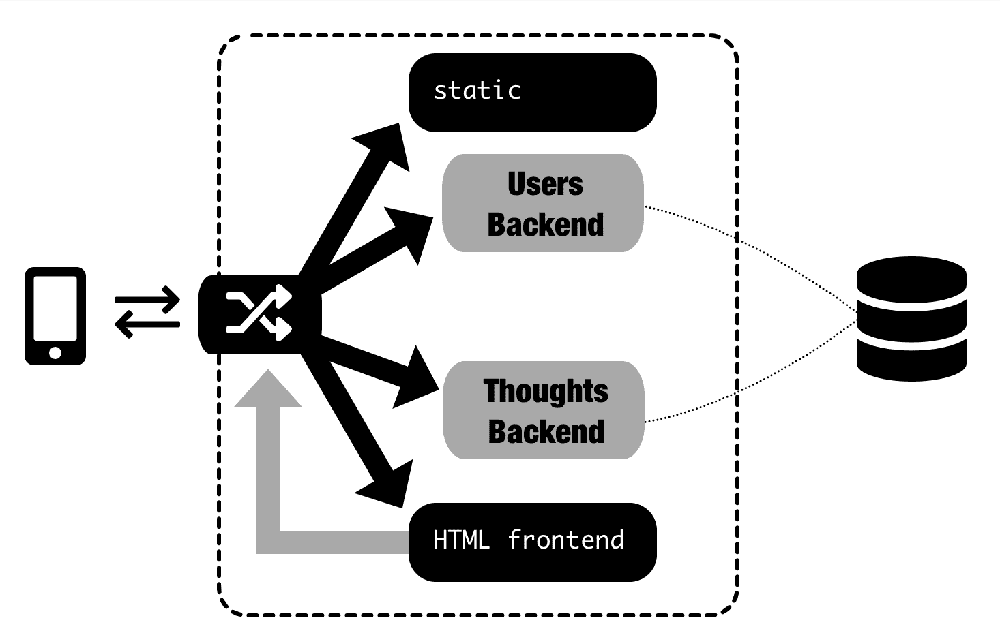
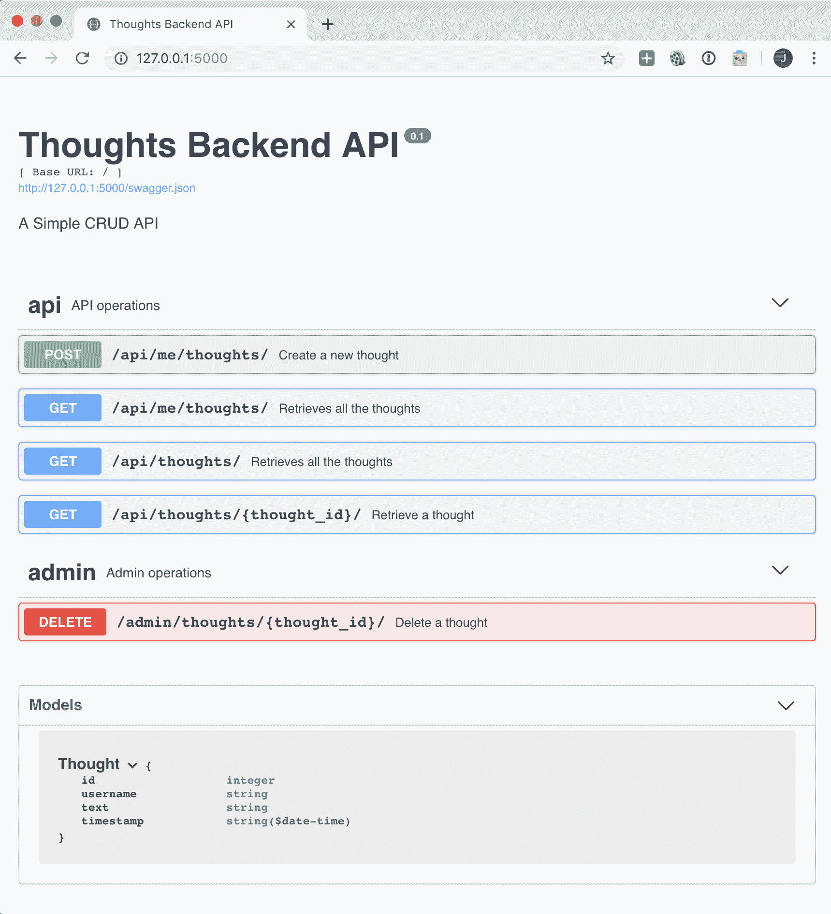
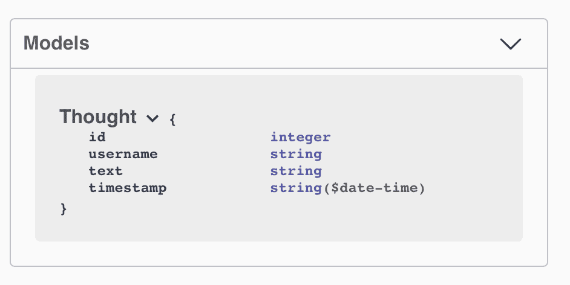

# 第二章：使用 Python 创建 REST 服务

按照上一章的示例，我们将设计为单体的系统拆分为更小的服务。在本章中，我们将详细分析上一章中提到的一个微服务（Thoughts 后端）。

我们将讨论如何使用 Python 开发这个微服务作为一个应用程序。这个微服务将准备好通过标准的 Web RESTful 接口与其他微服务进行交互，这使得它成为我们全局微服务架构系统的基础。

我们将讨论不同的元素，如 API 设计，支持它的数据库模式，以及如何实现和如何实现微服务。最后，我们将看到如何测试应用程序，以确保它正常工作。

本章将涵盖以下主题：

+   分析 Thoughts 后端微服务

+   设计 RESTful API

+   定义数据库模式

+   实施服务

+   测试代码

在本章结束时，您将知道如何成功开发一个微服务应用程序，包括从设计到测试的不同阶段。

# 技术要求

Thoughts 后端示例可以在这里找到([`github.com/PacktPublishing/Hands-On-Docker-for-Microservices-with-Python/tree/master/Chapter02/ThoughtsBackend`](https://github.com/PacktPublishing/Hands-On-Docker-for-Microservices-with-Python/tree/master/Chapter02/ThoughtsBackend))。安装和运行说明可以在其`README.md`文件中找到。

# 分析 Thoughts 后端微服务

让我们回顾一下我们在上一章中创建的微服务图表：



图表显示了我们示例系统的不同元素：两个后端，用户和想法，以及 HTML 前端。

**Thoughts 后端**将负责存储新的想法，检索现有的想法，并搜索数据库。

# 理解安全层

由于 Thoughts 后端将会对外开放，我们需要实现一个安全层。这意味着我们需要识别产生操作的用户并验证其有效性。在这个服务示例中，我们将从已登录的用户创建一个新的想法，并且我们将检索我的想法，以及当前已登录用户创建的想法。

请注意用户已登录也验证了用户的存在。

这个安全层将以一个头部的形式出现。这个头部将包含由用户后端签名的信息，验证其来源。它将采用 **JSON Web Token** (**JWT**)，[`jwt.io/introduction/`](https://jwt.io/introduction/)，这是一个标准的用途。

JWT 本身是加密的，但这里包含的信息大多只与检查已登录的用户相关。

JWT 并不是令牌的唯一可能性，还有其他替代方案，比如将等效数据存储在会话 cookie 中，或者在更安全的环境中使用类似的模块，比如 PASETO ([`github.com/paragonie/paseto`](https://github.com/paragonie/paseto))。确保您审查系统的安全影响，这超出了本书的范围。

这个方法应该由**用户后端**团队处理，并打包，以便其他微服务可以使用它。在本章中，我们将把代码包含在这个微服务中，但稍后我们将看到如何创建它，使其与用户后端相关联。

如果请求没有有效的头部，API 将返回 401 未经授权的状态码。

请注意，并非所有 API 端点都需要身份验证。特别是`search`不需要登录。

理解了认证系统的工作原理，我们可以开始设计 API 接口。

# 设计 RESTful API

我们将遵循 RESTful 设计原则来设计我们的 API。这意味着我们将使用构建的 URI 来表示资源，然后使用 HTTP 方法来对这些资源执行操作。

在这个示例中，我们将只使用`GET`（检索）、`POST`（创建）和`DELETE`（删除）方法，因为思想是不可编辑的。请记住，`PUT`（完全覆盖）和`PATCH`（执行部分更新）也是可用的。

RESTful API 的主要特性之一是请求需要是无状态的，这意味着每个请求都是完全独立的，可以由任何服务器提供。所有必需的数据应该在客户端（将其附加到请求中发送）或数据库中（因此服务器将完全检索它）。当处理 Docker 容器时，这个属性是一个硬性要求，因为它们可以在没有警告的情况下被销毁和重建。

虽然通常资源直接映射到数据库中的行，但这并非必需。资源可以是不同表的组合，其中的一部分，甚至完全代表不同的东西，例如满足某些条件的数据聚合，或者基于当前数据分析的预测。

分析服务的需求，不要受现有数据库设计的限制。迁移微服务是重新审视旧设计决策并尝试改进整个系统的好机会。还要记住十二要素应用原则（[`12factor.net/`](https://12factor.net/)）来改进设计。

在设计 API 之前，最好先简要回顾一下 REST，这样您可以查看[`restfulapi.net/`](https://restfulapi.net/)进行复习。

# 指定 API 端点

我们的 API 接口将如下：

|  | **端点** | **需要身份验证** | **返回** |
| --- | --- | --- | --- |
| `GET` | `/api/me/thoughts/` | 是 | 用户的思想列表 |
| `POST` | `/api/me/thoughts/` | 是 | 新创建的思想 |
| `GET` | `/api/thoughts/` | 否 | 所有思想的列表 |
| `GET` | `/api/thoughts/X/` | 否 | ID 为`X`的思想 |
| `GET` | `/api/thoughts/?search=X` | 否 | 搜索包含`X`的所有思想 |
| `DELETE` | `/admin/thoughts/X/` | 否 | 删除 ID 为`X`的思想 |

请注意 API 有两个元素：

+   一个公共 API，以`/api`开头：

+   一个经过身份验证的公共 API，以`/api/me`开头。用户需要经过身份验证才能执行这些操作。未经身份验证的请求将返回 401 未经授权状态码。

+   一个非经过身份验证的公共 API，以`/api`开头。任何用户，即使没有经过身份验证，也可以执行这些操作。

+   一个管理员 API（以`/admin`开头）。这不会公开。它省去了身份验证，并允许您执行不是为客户设计的操作。明确地使用前缀标记有助于审计操作，并清楚地表明它们不应该在数据中心之外可用。

思想的格式如下：

```py
thought
{
    id integer
    username string
    text string
    timestamp string($date-time)
}
```

要创建一个，只需要发送文本。时间戳会自动设置，ID 会自动创建，用户名会被身份验证数据检测到。

由于这只是一个示例，这个 API 被设计为最小化。特别是，可以创建更多的管理员端点来有效地模拟用户并允许管理员操作。`DELETE`操作是第一个包括的操作，用于清理测试。

最后一个细节：关于是否最好以斜杠结尾 URI 资源存在一些争论。然而，在使用 Flask 时，用斜杠定义它们将返回一个重定向状态码，`308 PERMANENT_REDIRECT`，对于没有正确结尾的请求。无论如何，尽量保持一致以避免混淆。

# 定义数据库模式

数据库模式简单，继承自单体。我们只关心存储在`thought_model`表中的想法，因此数据库结构如下：

| **字段** | **类型** | **注释** |
| --- | --- | --- |
| `id` | `INTEGER NOT NULL` | 主键 |
| `username` | `VARCHAR(50)` |  |
| `text` | `VARCHAR(250)` |  |
| `timestamp` | `DATETIME` | 创建时间 |

thought_model 表

这个表在`thoughts_backend/models.py`文件中以 SQLAlchemy 格式表示，代码如下：

```py
class ThoughtModel(db.Model):
    id = db.Column(db.Integer, primary_key=True)
    username = db.Column(db.String(50))
    text = db.Column(db.String(250))
    timestamp = db.Column(db.DateTime, server_default=func.now())
```

SQLAlchemy 能够为测试目的或开发模式创建表。在本章中，我们将数据库定义为 SQLite，它将数据存储在`db.sqlite3`文件中。

# 使用 SQLAlchemy

SQLAlchemy ([`www.sqlalchemy.org/`](https://www.sqlalchemy.org/))是一个强大的 Python 模块，用于处理 SQL 数据库。处理高级语言（如 Python）的数据库有两种方法。一种是保持低级方法，使用原始 SQL 语句，检索数据库中的数据。另一种是使用**对象关系映射器**（**ORM**）来抽象数据库，并在不涉及实现细节的情况下使用接口。

第一种方法由 Python 数据库 API 规范（PEP 249—[`www.python.org/dev/peps/pep-0249/`](https://www.python.org/dev/peps/pep-0249/)）很好地代表，所有主要数据库都遵循这一规范，比如`psycopg2` ([`initd.org/psycopg/`](http://initd.org/psycopg/))用于 PostgreSQL。这主要创建 SQL 字符串命令，执行它们，然后解析结果。这使我们能够定制每个查询，但对于重复的常见操作来说并不是很高效。PonyORM ([`ponyorm.org/`](https://ponyorm.org/))是另一个例子，它不那么低级，但仍旨在复制 SQL 语法和结构。

对于第二种方法，最著名的例子可能是 Django ORM ([`docs.djangoproject.com/en/2.2/topics/db/`](https://docs.djangoproject.com/en/2.2/topics/db/))。它使用定义的模型 Python 对象来抽象数据库访问。对于常见操作，它的工作效果非常好，但它的模型假设数据库的定义是在我们的 Python 代码中完成的，映射遗留数据库可能非常痛苦。ORM 创建的一些复杂 SQL 操作可能需要很长时间，而定制的查询可以节省大量时间。工具使我们与最终结果的关系如此之远，甚至可能不自觉地执行缓慢的查询。

SQLAlchemy ([`www.sqlalchemy.org/`](https://www.sqlalchemy.org/))非常灵活，可以在两端工作。它不像 Django ORM 那样直截了当或易于使用，但它允许我们将现有的数据库映射到 ORM。这就是为什么我们会在我们的示例中使用它：它可以接受现有的、复杂的遗留数据库并进行映射，使您可以轻松执行简单的操作和以您想要的方式执行复杂的操作。

请记住，我们将在本书中使用的操作非常简单，SQLAlchemy 在这些任务中不会特别突出。但是，如果您计划从通过手动编写 SQL 语句访问数据库的旧单体迁移到新创建的微服务，那么 SQLAlchemy 是一个无价的工具。如果您已经处理了一个复杂的数据库，花一些时间学习如何使用 SQLAlchemy 将是非常宝贵的。一个精心设计的 SQLAlchemy 定义可以非常高效地执行一些抽象任务，但它需要对工具有很好的了解。

Flask-SQLAlchemy 的文档([`flask-sqlalchemy.palletsprojects.com/en/2.x/`](https://flask-sqlalchemy.palletsprojects.com/en/2.x/))是一个很好的起点，因为它总结了主要操作，而主要的 SQLAlchemy 文档一开始可能会让人感到不知所措。

在我们定义模型之后，我们可以通过模型中的`query`属性执行查询，并相应地进行过滤：

```py
# Retrieve a single thought by its primary key
thought = ThoughtModel.query.get(thought_id)
# Retrieve all thoughts filtered by a username
thoughts = ThoughtModel.query.filter_by(username=username)
.order_by('id').all()
```

存储和删除一行需要使用会话，然后提交它：

```py
# Create a new thought
new_thought = ThoughtModel(username=username, text=text, timestamp=datetime.utcnow())
db.session.add(new_thought)
db.session.commit()

# Retrieve and delete a thought
thought = ThoughtModel.query.get(thought_id)
db.session.delete(thought)
db.session.commit()
```

要查看如何配置数据库访问，请查看`thoughts_backend/db.py`文件。

# 实施服务

为了实现这个微服务，我们将使用 Flask-RESTPlus（[`flask-restplus.readthedocs.io/en/stable/`](https://flask-restplus.readthedocs.io/en/stable/)）。这是一个 Flask（[`palletsprojects.com/p/flask/`](https://palletsprojects.com/p/flask/)）的扩展。Flask 是一个著名的 Python 微框架，特别擅长实现微服务，因为它小巧、易于使用，并且与 Web 应用程序的常规技术栈兼容，因为它使用**Web 服务器网关接口**（**WSGI**）协议。

# 介绍 Flask-RESTPlus

Flask 能够实现 RESTful 接口，但 Flask-RESTPlus 添加了一些非常有趣的功能，可以支持良好的开发实践和快速开发：

+   它定义了命名空间，这是创建前缀和结构化代码的一种方式。这有助于长期维护，并在创建新的端点时有助于设计。

如果在单个命名空间中有超过 10 个端点，那么现在可能是考虑分割它的好时机。使用一个文件一个命名空间，并允许文件大小提示何时是一个尝试进行分割的好时机。

+   它有一个完整的解决方案来解析输入参数。这意味着我们有一种简单的方法来处理需要多个参数并验证它们的端点。使用*请求解析*（[`flask-restplus.readthedocs.io/en/stable/parsing.html`](https://flask-restplus.readthedocs.io/en/stable/parsing.html)）模块类似于使用 Python 标准库中包含的`argparse`命令行模块（[`docs.python.org/3/library/argparse.html`](https://docs.python.org/3/library/argparse.html)）。它允许在请求体、标头、查询字符串甚至 cookie 的参数中定义参数。

+   同样，它还有一个用于生成对象的序列化框架。Flask-RESTful 称之为**响应编组**（[`flask-restplus.readthedocs.io/en/stable/marshalling.html`](https://flask-restplus.readthedocs.io/en/stable/marshalling.html)）。这有助于定义可以重复使用的对象，澄清接口并简化开发。如果启用，它还允许字段掩码，返回部分对象。

+   它具有完整的 Swagger API 文档支持。Swagger（[`swagger.io/`](https://swagger.io/)）是一个开源项目，用于帮助设计、实现、文档化和测试 RESTful API Web 服务，遵循标准的 OpenAPI 规范。Flask-RESTPlus 自动生成了 Swagger 规范和自我记录页面：



Thoughts Backend API 的主要 Swagger 文档页面，自动生成

Flask 的其他好元素源自它是一个受欢迎的项目，并且有很多支持的工具：

+   我们将使用 SQLAlchemy 的连接器 Flask-SQLAlchemy（[`flask-sqlalchemy.palletsprojects.com/en/2.x/`](https://flask-sqlalchemy.palletsprojects.com/en/2.x/)）。它的文档涵盖了大多数常见情况，而 SQLAlchemy 的文档更详细，可能有点令人不知所措。

+   要运行测试，`pytest-flask`模块（[`pytest-flask.readthedocs.io/en/latest/`](https://pytest-flask.readthedocs.io/en/latest/)）创建了一些准备与 Flask 应用程序一起工作的固定装置。我们将在*测试代码*部分更多地谈论这个。

# 处理资源

典型的 RESTful 应用程序具有以下一般结构：

1.  一个由 URL 定义的资源。这个资源允许通过 HTTP 方法（`GET`，`POST`等）执行一个或多个操作。

1.  每次调用这些操作时，框架都会路由请求，直到定义的代码执行操作。

1.  如果有任何输入参数，它们将首先需要进行验证。

1.  执行操作并获得结果值。此操作通常涉及对数据库的一个或多个调用，这将以模型的形式完成。

1.  准备结果值并以客户端理解的方式进行编码，通常是 JSON 格式。

1.  将编码值返回给客户端，并附上适当的状态码。

大多数这些操作都是由框架完成的。需要进行一些配置工作，但这就是我们的 Web 框架，例如在这个例子中的 Flask-RESTPlus，将提供最大的帮助。特别是除了*步骤 4*之外，其他都将大大简化。

让我们来看一个简单的代码示例（在 GitHub 上可用）来描述它：

```py
api_namespace = Namespace('api', description='API operations')

@api_namespace.route('/thoughts/<int:thought_id>/')
class ThoughtsRetrieve(Resource):

    @api_namespace.doc('retrieve_thought')
    @api_namespace.marshal_with(thought_model)
    def get(self, thought_id):
        '''
        Retrieve a thought
        '''
        thought = ThoughtModel.query.get(thought_id)
        if not thought:
            # The thought is not present
            return '', http.client.NOT_FOUND

        return thought
```

这实现了`GET /api/thoughts/X/`操作，通过 ID 检索单个想法。

让我们分析每个元素。请注意，行是按主题分组的。

1.  首先，我们通过其 URL 定义资源。请注意，`api_namespace`设置了 URL 的`api`前缀，这将验证参数`X`是一个整数：

```py
api_namespace = Namespace('api', description='API operations')

@api_namespace.route('/thoughts/<int:thought_id>/')
class ThoughtsRetrieve(Resource):
    ...
```

1.  该类允许您对同一资源执行多个操作。在这种情况下，我们只执行一个：`GET`操作。

1.  请注意，编码在 URL 中的`thought_id`参数作为参数传递给该方法：

```py
class ThoughtsRetrieve(Resource):

    def get(self, thought_id):
        ...
```

1.  现在我们可以执行该操作，这是在数据库中搜索以检索单个对象。调用`ThoughModel`来搜索指定的想法。如果找到，将以`http.client.OK (200)`状态代码返回。如果未找到，则返回空结果和`http.client.NOT_FOUND 404`状态代码：

```py
def get(self, thought_id):
    thought = ThoughtModel.query.get(thought_id)
    if not thought:
        # The thought is not present
        return '', http.client.NOT_FOUND

    return thought
```

1.  返回`thought`对象。`marshal_with`装饰器描述了 Python 对象应如何序列化为 JSON 结构。稍后我们将看到如何配置它：

```py
@api_namespace.marshal_with(thought_model)
def get(self, thought_id):
    ...
    return thought
```

1.  最后，我们有一些文档，包括由自动生成的 Swagger API 呈现的文档字符串：

```py
class ThoughtsRetrieve(Resource):

    @api_namespace.doc('retrieve_thought')
    def get(self, thought_id):
        '''
        Retrieve a thought
        '''
        ...
```

正如您所看到的，大多数操作都是通过 Flask-RESTPlus 配置和执行的，作为开发人员的主要工作是肉体的*步骤 4*。但是还有一些工作要做，例如配置预期的输入参数并验证它们，以及如何将返回的对象序列化为适当的 JSON。我们将看到 Flask-RESTPlus 如何帮助我们。

# 解析输入参数

输入参数可以采用不同的形式。当我们谈论输入参数时，主要谈论两种类型：

+   字符串查询参数编码到 URL 中。这些通常用于`GET`请求，看起来像下面这样：

```py
http://test.com/some/path?param1=X&param2=Y
```

它们是 URL 的一部分，并将存储在沿途的任何日志中。参数被编码为它们自己的格式，称为**URL 编码**（[`www.urlencoder.io/learn/`](https://www.urlencoder.io/learn/)）。您可能已经注意到，例如，空格会被转换为`%20`。

通常，我们不需要手动解码查询参数，因为诸如 Flask 之类的框架会为我们完成，但是 Python 标准库具有用于执行此操作的实用程序（[`docs.python.org/3/library/urllib.parse.html`](https://docs.python.org/3/library/urllib.parse.html)）。

+   让我们来看一下 HTTP 请求的主体。这通常用于`POST`和`PUT`请求。可以使用`Content-Type`头指定特定格式。默认情况下，`Content-Type`头被定义为`application/x-www-form-urlencoded`，它以 URL 编码的方式进行编码。在现代应用程序中，这被替换为`application/json`以将其编码为 JSON。

请求的主体不会存储在日志中。期望是`GET`请求多次调用时产生相同的结果，这意味着它们是幂等的。因此，它可以被一些代理或其他元素缓存。这就是为什么在再次发送`POST`请求之前，您的浏览器会要求确认，因为此操作可能会产生不同的结果。

但还有另外两个地方可以传递参数：

+   **作为 URL 的一部分**：像`thought id`这样的东西是参数。尽量遵循 RESTful 原则，并将 URL 定义为资源，以避免混淆。查询参数最好留作可选项。

+   **标头**：通常，标头提供有关元数据的信息，例如请求的格式、预期的格式或身份验证数据。但它们也需要被视为输入参数。

所有这些元素都会被 Flask-RESTPlus 自动解码，因此我们不需要处理编码和低级访问。

让我们看看这在我们的例子中是如何工作的。这段代码是从 GitHub 中提取的，并缩短以描述解析参数：

```py
authentication_parser = api_namespace.parser()
authentication_parser.add_argument('Authorization', 
location='headers', type=str, help='Bearer Access 
Token')

thought_parser = authentication_parser.copy()
thought_parser.add_argument('text', type=str, required=True, help='Text of the thought')

@api_namespace.route('/me/thoughts/')
class MeThoughtListCreate(Resource):

    @api_namespace.expect(thought_parser)
    def post(self):
        args = thought_parser.parse_args()
        username = authentication_header_parser(args['Authorization'])
        text=args['text']
        ...

```

我们在下面的行中定义了一个解析器：

```py
authentication_parser = api_namespace.parser()
authentication_parser.add_argument('Authorization', 
location='headers', type=str, help='Bearer Access Token')

thought_parser = authentication_parser.copy()
thought_parser.add_argument('text', type=str, required=True, help='Text of the thought')
```

`authentication_parser`被`thought_parser`继承，以扩展功能并结合两者。每个参数都根据类型和是否需要来定义。如果缺少必需的参数或其他元素不正确，Flask-RESTPlus 将引发`400 BAD_REQUEST`错误，并提供有关出了什么问题的反馈。

因为我们想以稍微不同的方式处理身份验证，我们将其标记为不需要，并允许它使用默认值（由框架创建）`None`。请注意，我们指定`Authorization`参数应该在标头中。

`post`方法得到一个装饰器，表明它期望`thought_parser`参数，并且我们用`parse_args`解析它：

```py
@api_namespace.route('/me/thoughts/')
class MeThoughtListCreate(Resource):

    @api_namespace.expect(thought_parser)
    def post(self):
        args = thought_parser.parse_args()
        ...
```

此外，`args`现在是一个带有所有参数正确解析并在下一行中使用的字典。

在身份验证标头的特定情况下，有一个特定的函数来处理它，并且通过使用`abort`返回`401 UNAUTHORIZED`状态码。这个调用立即停止了一个请求：

```py
def authentication_header_parser(value):
    username = validate_token_header(value, config.PUBLIC_KEY)
    if username is None:
        abort(401)
    return username

class MeThoughtListCreate(Resource):

    @api_namespace.expect(thought_parser)
    def post(self):
       args = thought_parser.parse_args()
       username = authentication_header_parser(args['Authentication'])
       ...
```

我们暂时不考虑要执行的操作（将新的想法存储在数据库中），而是专注于其他框架配置，将结果序列化为 JSON 对象。

# 序列化结果

我们需要返回我们的结果。最简单的方法是通过定义 JSON 结果的形状来实现，通过一个序列化器或编组模型（[`flask-restplus.readthedocs.io/en/stable/marshalling.html`](https://flask-restplus.readthedocs.io/en/stable/marshalling.html)）。

序列化器模型被定义为一个带有预期字段和字段类型的字典：

```py
from flask_restplus import fields

model = {
    'id': fields.Integer(),
    'username': fields.String(),
    'text': fields.String(),
    'timestamp': fields.DateTime(),
}
thought_model = api_namespace.model('Thought', model)
```

该模型将接受一个 Python 对象，并将每个属性转换为相应的 JSON 元素，如字段中所定义的那样：

```py
@api_namespace.route('/me/thoughts/')
class MeThoughtListCreate(Resource):

    @api_namespace.marshal_with(thought_model)
    def post(self):
        ...
        new_thought = ThoughtModel(...)
        return new_thought
```

请注意，`new_thought`是一个`ThoughtModel`对象，由 SQLAlchemy 检索到。我们将在下面详细介绍它，但现在，可以说它具有模型中定义的所有属性：`id`、`username`、`text`和`timestamp`。

内存对象中不存在的任何属性默认值为`None`。您可以将此默认值更改为将返回的值。您可以指定一个函数，因此在生成响应时将调用它来检索值。这是向对象添加动态信息的一种方式：

```py
model = {
    'timestamp': fields.DateTime(default=datetime.utcnow),
}
```

您还可以添加要序列化的属性的名称，以防它与预期的结果不同，或者添加一个将被调用以检索值的`lambda`函数：

```py
model = {
    'thought_text': fields.String(attribute='text'),
    'thought_username': fields.String(attribute=lambda x: x.username),
 }
```

对于更复杂的对象，你可以像这样嵌套值。请注意，这从文档的角度定义了两个模型，并且每个`Nested`元素都创建了一个新的作用域。你也可以使用`List`来添加多个相同类型的实例：

```py
extra = {
   'info': fields.String(),
}
extra_info = api_namespace.model('ExtraInfo', extra)

model = {
    'extra': fields.Nested(extra),
    'extra_list': fields.List(fields.Nested(extra)),
 }

```

一些可用字段有更多的选项，比如`DateTime`字段的日期格式。查看完整的字段文档（[`flask-restplus.readthedocs.io/en/stable/api.html#models`](https://flask-restplus.readthedocs.io/en/stable/api.html#models)）以获取更多详细信息。

如果返回一个元素列表，在`marshal_with`装饰器中添加`as_list=True`参数：

```py
@api_namespace.route('/me/thoughts/')
class MeThoughtListCreate(Resource):

    @api_namespace.marshal_with(thought_model, as_list=True)
    def get(self):
        ...
        thoughts = (
            ThoughtModel.query.filter(
                ThoughtModel.username == username
            )
            .order_by('id').all()
        )
        return thoughts

```

`marshal_with`装饰器将把`result`对象从 Python 对象转换为相应的 JSON 数据对象。

默认情况下，它将返回`http.client.OK (200)`状态码，但我们可以返回不同的状态码，返回两个值：第一个是要`marshal`的对象，第二个是状态码。`marshal_with`装饰器中的代码参数用于文档目的。请注意，在这种情况下，我们需要添加特定的`marshal`调用：

```py
@api_namespace.route('/me/thoughts/')
class MeThoughtListCreate(Resource):

    @api_namespace.marshal_with(thought_model, 
         code=http.client.CREATED)
    def post(self):
        ...
        result = api_namespace.marshal(new_thought, thought_model)
        return result, http.client.CREATED
```

Swagger 文档将显示所有您定义的`marshal`对象：



Swagger 页面的末尾

Flask-RESTPlus 的一个不便之处是，为了输入和输出相同的对象，它们需要定义两次，因为输入和输出的模块是不同的。这在一些其他 RESTful 框架中并非如此，例如在 Django REST 框架中([`www.django-rest-framework.org/`](https://www.django-rest-framework.org/))。Flask-RESTPlus 的维护者们意识到了这一点，并且根据他们的说法，他们将集成一个外部模块，可能是`marshmallow`([`marshmallow.readthedocs.io/en/stable/`](https://marshmallow.readthedocs.io/en/stable/))。如果您愿意，您可以手动集成它，因为 Flask 足够灵活，可以这样做，看看这个示例([`marshmallow.readthedocs.io/en/stable/examples.html#quotes-api-flask-sqlalchemy`](https://marshmallow.readthedocs.io/en/stable/examples.html#quotes-api-flask-sqlalchemy))。

有关更多详细信息，您可以在 Flask-RESTPlus 的完整编组文档中查看[`flask-restplus.readthedocs.io/en/stable/marshalling.html`](https://flask-restplus.readthedocs.io/en/stable/marshalling.html)。

# 执行操作

最后，我们来到了输入数据已经清洁并准备好使用的具体部分，我们知道如何返回结果。这部分可能涉及执行一些数据库查询和组合结果。让我们以以下内容作为示例：

```py
@api_namespace.route('/thoughts/')
class ThoughtList(Resource):

    @api_namespace.doc('list_thoughts')
    @api_namespace.marshal_with(thought_model, as_list=True)
    @api_namespace.expect(search_parser)
    def get(self):
        '''
        Retrieves all the thoughts
        '''
        args = search_parser.parse_args()
        search_param = args['search']
        # Action
        query = ThoughtModel.query
        if search_param:
            query =(query.filter(
                ThoughtModel.text.contains(search_param)))

        query = query.order_by('id')
        thoughts = query.all()
        # Return the result
        return thoughts
```

您可以在此处看到，在解析参数后，我们使用 SQLAlchemy 检索查询，如果`search`参数存在，将应用过滤器。我们使用`all()`获取所有`ThoughtModel`对象的结果。

返回对象编组(自动将它们编码为 JSON)，如我们在`marshal_with`装饰器中指定的那样。

# 验证请求

身份验证逻辑封装在`thoughts_backend/token_validation.py`文件中。其中包含头部的生成和验证。

以下函数生成`Bearer`令牌：

```py
def encode_token(payload, private_key):
    return jwt.encode(payload, private_key, algorithm='RS256')

def generate_token_header(username, private_key):
    '''
    Generate a token header base on the username. 
    Sign using the private key.
    '''
    payload = {
        'username': username,
        'iat': datetime.utcnow(),
        'exp': datetime.utcnow() + timedelta(days=2),
    }
    token = encode_token(payload, private_key)
    token = token.decode('utf8')
    return f'Bearer {token}'
```

这将生成一个 JWT 有效负载。它包括`username`作为自定义值使用，但它还添加了两个标准字段，即`exp`到期日期和`iat`令牌生成时间。

然后使用私钥使用 RS256 算法对令牌进行编码，并以正确的格式返回：`Bearer <token>`。

反向操作是从编码的头部获取用户名。这里的代码较长，因为我们应该考虑我们可能收到`Authentication`头部的不同选项。这个头部直接来自我们的公共 API，所以我们应该期望任何值并编写程序来做好防御准备。

令牌本身的解码很简单，因为`jwt.decode`操作将执行此操作：

```py
def decode_token(token, public_key):
    return jwt.decode(token, public_key, algoritms='RS256')
```

但在到达该步骤之前，我们需要获取令牌并验证多种情况下的头部是否有效，因此我们首先检查头部是否为空，以及是否具有正确的格式，提取令牌：

```py
def validate_token_header(header, public_key):
    if not header:
        logger.info('No header')
        return None

    # Retrieve the Bearer token
    parse_result = parse('Bearer {}', header)
    if not parse_result:
        logger.info(f'Wrong format for header "{header}"')
        return None
    token = parse_result[0]
```

然后，我们解码令牌。如果无法使用公钥解码令牌，则会引发`DecodeError`。令牌也可能已过期：

```py
    try:
        decoded_token = decode_token(token.encode('utf8'), public_key)
    except jwt.exceptions.DecodeError:
        logger.warning(f'Error decoding header "{header}". '
        'This may be key missmatch or wrong key')
        return None
    except jwt.exceptions.ExpiredSignatureError:
        logger.info(f'Authentication header has expired')
        return None
```

然后，检查它是否具有预期的`exp`和`username`参数。如果其中任何一个参数缺失，这意味着令牌在解码后的格式不正确。这可能发生在不同版本中更改代码时。

```py
    # Check expiry is in the token
    if 'exp' not in decoded_token:
        logger.warning('Token does not have expiry (exp)')
        return None

    # Check username is in the token
    if 'username' not in decoded_token:
        logger.warning('Token does not have username')
        return None

    logger.info('Header successfully validated')
    return decoded_token['username']
```

如果一切顺利，最后返回用户名。

每个可能的问题都以不同的严重程度记录。最常见的情况以信息级别的安全性记录，因为它们并不严重。例如，在令牌解码后出现格式错误可能表明我们的编码过程存在问题。

请注意，我们使用的是私钥/公钥架构，而不是对称密钥架构，用于编码和解码令牌。这意味着解码和编码密钥是不同的。

从技术上讲，这是一个签名/验证，因为它用于生成签名，而不是编码/解码，但这是 JWT 中使用的命名约定。

在我们的微服务结构中，只有签名机构需要私钥。这增加了安全性，因为其他服务中的任何密钥泄漏都无法检索到能够签署 bearer tokens 的密钥。但是，我们需要生成适当的私钥和公钥。

要生成私钥/公钥，请运行以下命令：

```py
$ openssl genrsa -out key.pem 2048
Generating RSA private key, 2048 bit long modulus
.....................+++
.............................+++
```

然后，要提取公钥，请使用以下命令：

```py
$ openssl rsa -in key.pem -outform PEM -pubout -out key.pub
```

这将生成两个文件：`key.pem`和`key.pub`，其中包含私钥/公钥对。以文本格式读取它们就足以将它们用作编码/解码 JWT 令牌的密钥：

```py
>> with open('private.pem') as fp:
>> ..  private_key = fp.read()

>> generate_token_header('peter', private_key)
'Bearer <token>'
```

请注意，对于测试，我们生成了一个**样本密钥对**，作为字符串附加。这些密钥是专门为此用途创建的，不会在其他任何地方使用。请不要在任何地方使用它们，因为它们在 GitHub 上是公开可用的。

请注意，您需要一个非加密的私钥，不受密码保护，因为 JWT 模块不允许您添加密码。**不要将生产秘钥存储在未受保护的文件中**。在第三章中，*使用 Docker 构建、运行和测试您的服务*，我们将看到如何使用环境变量注入这个秘钥，在第十一章中，*处理系统中的更改、依赖和秘钥*，我们将看到如何在生产环境中正确处理秘钥。

# 测试代码

为了测试我们的应用程序，我们使用了优秀的`pytest`框架，这是 Python 应用程序的测试运行器的黄金标准。

基本上，`pytest`有许多插件和附加组件，可用于处理许多情况。我们将使用`pytest-flask`，它有助于运行 Flask 应用程序的测试。

运行所有测试，只需在命令行中调用`pytest`：

```py
$ pytest
============== test session starts ==============
....
==== 17 passed, 177 warnings in 1.50 seconds =====

```

请注意，`pytest`具有许多可用于处理许多测试情况的功能。在处理测试时，运行匹配测试的子集（`-k`选项）、运行上次失败的测试（`--lf`）或在第一个失败后停止（`-x`）等功能非常有用。我强烈建议查看其完整文档（[`docs.pytest.org/en/latest/`](https://docs.pytest.org/en/latest/)）并发现其所有可能性。

还有许多用于使用数据库或框架、报告代码覆盖率、分析、BDD 等的插件和扩展。值得了解一下。

我们配置了基本用法，包括在`pytest.ini`文件中始终启用标志和在`conftest.py`中的 fixtures。

# 定义 pytest fixtures

在`pytest`中使用 fixture 来准备测试应该执行的上下文，准备并在结束时清理它。`pytest-flask`需要应用 fixture，如文档中所示。该插件生成一个`client` fixture，我们可以用它来在测试模式下发送请求。我们在`thoughts_fixture` fixture 中看到了这个 fixture 的使用，它通过 API 生成三个 thoughts，并在我们的测试运行后删除所有内容。

简化后的结构如下：

1.  生成三个 thoughts。存储其`thought_id`：

```py
@pytest.fixture
def thought_fixture(client):

    thought_ids = []
    for _ in range(3):
        thought = {
            'text': fake.text(240),
        }
        header = token_validation.generate_token_header(fake.name(),
                                                        PRIVATE_KEY)
        headers = {
            'Authorization': header,
        }
        response = client.post('/api/me/thoughts/', data=thought,
                               headers=headers)
        assert http.client.CREATED == response.status_code
        result = response.json
        thought_ids.append(result['id'])
```

1.  然后，在测试中添加`yield thought_ids`：

```py
yield thought_ids
```

1.  检索所有 thoughts 并逐个删除它们：

```py
# Clean up all thoughts
response = client.get('/api/thoughts/')
thoughts = response.json
for thought in thoughts:
    thought_id = thought['id']
    url = f'/admin/thoughts/{thought_id}/'
    response = client.delete(url)
    assert http.client.NO_CONTENT == response.status_code
```

请注意，我们使用`faker`模块生成假姓名和文本。您可以在[`faker.readthedocs.io/en/stable/`](https://faker.readthedocs.io/en/stable/)查看其完整文档。这是一个生成测试随机值的好方法，避免反复使用`test_user`和`test_text`。它还有助于塑造您的测试，通过独立检查输入而不是盲目地复制占位符。

Fixture 也可以测试您的 API。您可以选择更低级的方法，比如在数据库中编写原始信息，但使用您自己定义的 API 是确保您拥有完整和有用接口的好方法。在我们的例子中，我们添加了一个用于删除想法的管理员界面。这在整个 fixture 中都得到了运用，以及为整个和完整的接口创建想法。

这样，我们还使用测试来验证我们可以将我们的微服务作为一个完整的服务使用，而不是欺骗自己以执行常见操作。

还要注意`client` fixture 的使用，这是由`pytest-flask`提供的。

# 理解 test_token_validation.py

这个测试文件测试了`token_validation`模块的行为。该模块涵盖了认证头的生成和验证，因此对其进行彻底测试非常重要。

这些测试检查了头部是否可以使用正确的密钥进行编码和解码。它还检查了在无效输入方面的所有不同可能性：不同形状的不正确格式，无效的解码密钥或过期的令牌。

为了检查过期的令牌，我们使用了两个模块：`freezegun`，使测试检索特定的测试时间（[`github.com/spulec/freezegun`](https://github.com/spulec/freezegun)），以及`delorean`，以便轻松解析日期（尽管该模块能够做更多；请查看[`delorean.readthedocs.io/en/latest/`](https://delorean.readthedocs.io/en/latest/)的文档）。这两个模块非常易于使用，非常适合测试目的。

例如，这个测试检查了一个过期的令牌：

```py
@freeze_time('2018-05-17 13:47:34')
def test_invalid_token_header_expired():
    expiry = delorean.parse('2018-05-17 13:47:33').datetime
    payload = {
        'username': 'tonystark',
        'exp': expiry,
    }
    token = token_validation.encode_token(payload, PRIVATE_KEY)
    token = token.decode('utf8')
    header = f'Bearer {token}'
    result = token_validation.validate_token_header(header, PUBLIC_KEY)
    assert None is result
```

请注意，冻结时间恰好是令牌到期时间后的 1 秒。

用于测试的公钥和私钥在`constants.py`文件中定义。还有一个额外的独立公钥用于检查如果使用无效的公钥解码令牌会发生什么。

值得再次强调：请*不要*使用这些密钥。这些密钥仅用于运行测试，并且可以被任何有权访问本书的人使用。

# test_thoughts.py

这个文件检查了定义的 API 接口。每个 API 都经过测试，以正确执行操作（创建新的想法，返回用户的想法，检索所有想法，搜索想法，按 ID 检索想法），以及一些错误测试（未经授权的请求来创建和检索用户的想法，或检索不存在的想法）。

在这里，我们再次使用`freezegun`来确定思想的创建时间，而不是根据测试运行时的时间戳创建它们。

# 总结

在这一章中，我们看到了如何开发一个 Web 微服务。我们首先按照 REST 原则设计了其 API。然后，我们描述了如何访问数据库的模式，并使用 SQLAlchemy 进行操作。

然后，我们学习了如何使用 Flask-RESTPlus 来实现它。我们学习了如何定义资源映射到 API 端点，如何解析输入值，如何处理操作，然后如何使用序列化模型返回结果。我们描述了认证层的工作原理。

我们包括了测试，并描述了如何使用`pytest` fixture 来为我们的测试创建初始条件。在下一章中，我们将学习如何将服务容器化，并通过 Docker 运行。

# 问题

1.  你能说出 RESTful 应用程序的特点吗？

1.  使用 Flask-RESTPlus 的优势是什么？

1.  你知道除了 Flask-RESTPlus 之外的替代框架吗？

1.  在测试中使用的 Python 软件包名称来修复时间。

1.  您能描述一下认证流程吗？

1.  为什么我们选择 SQLAlchemy 作为示例项目的数据库接口？

# 进一步阅读

关于 RESTful 设计的深入描述，不仅限于 Python，您可以在*Hands-On RESTful API Design Patterns and Best Practices*中找到更多信息（[`www.packtpub.com/gb/application-development/hands-restful-api-design-patterns-and-best-practices`](https://www.packtpub.com/gb/application-development/hands-restful-api-design-patterns-and-best-practices)）。您可以在书籍*Flask: Building Python Web Services*中了解如何使用 Flask 框架（[`www.packtpub.com/gb/web-development/flask-building-python-web-services`](https://www.packtpub.com/gb/web-development/flask-building-python-web-services)）。
