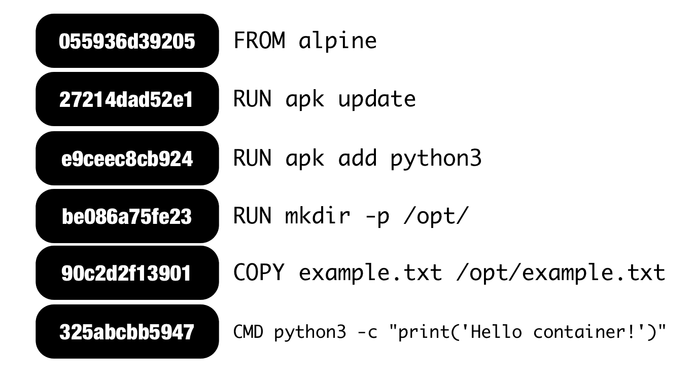
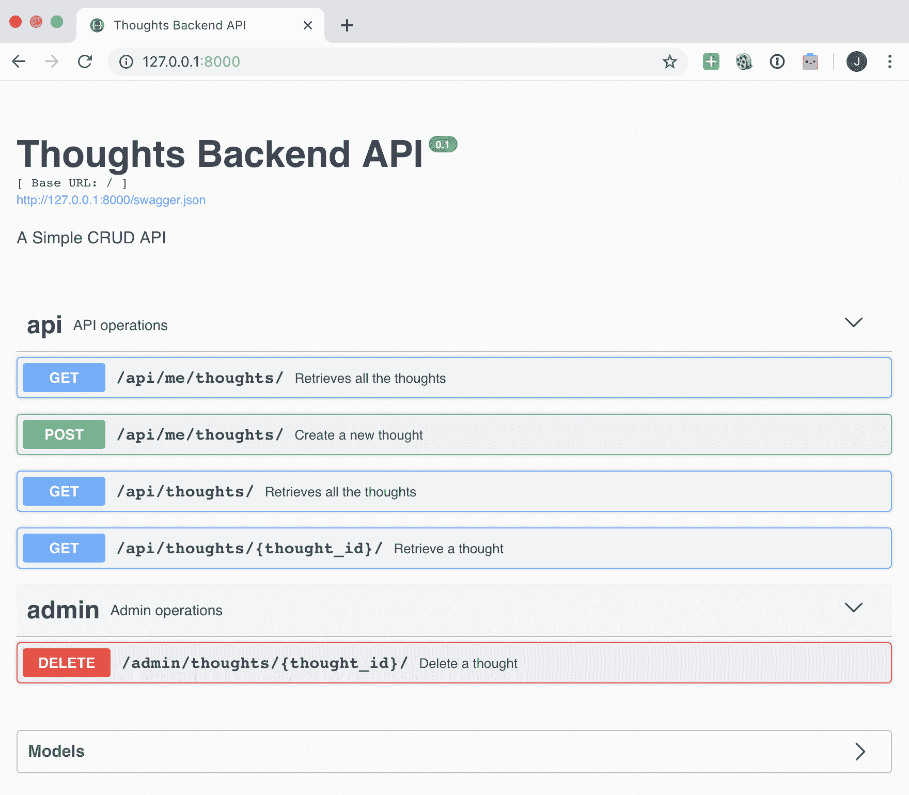
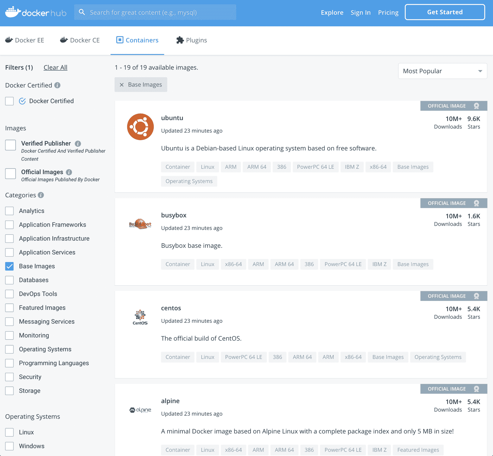
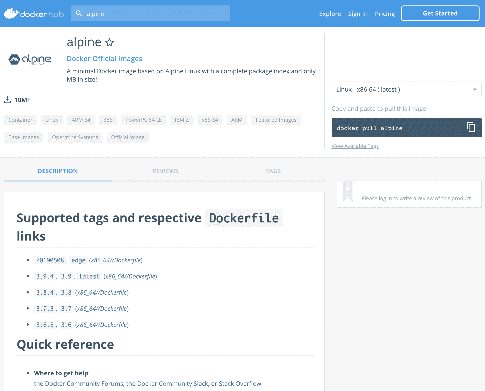
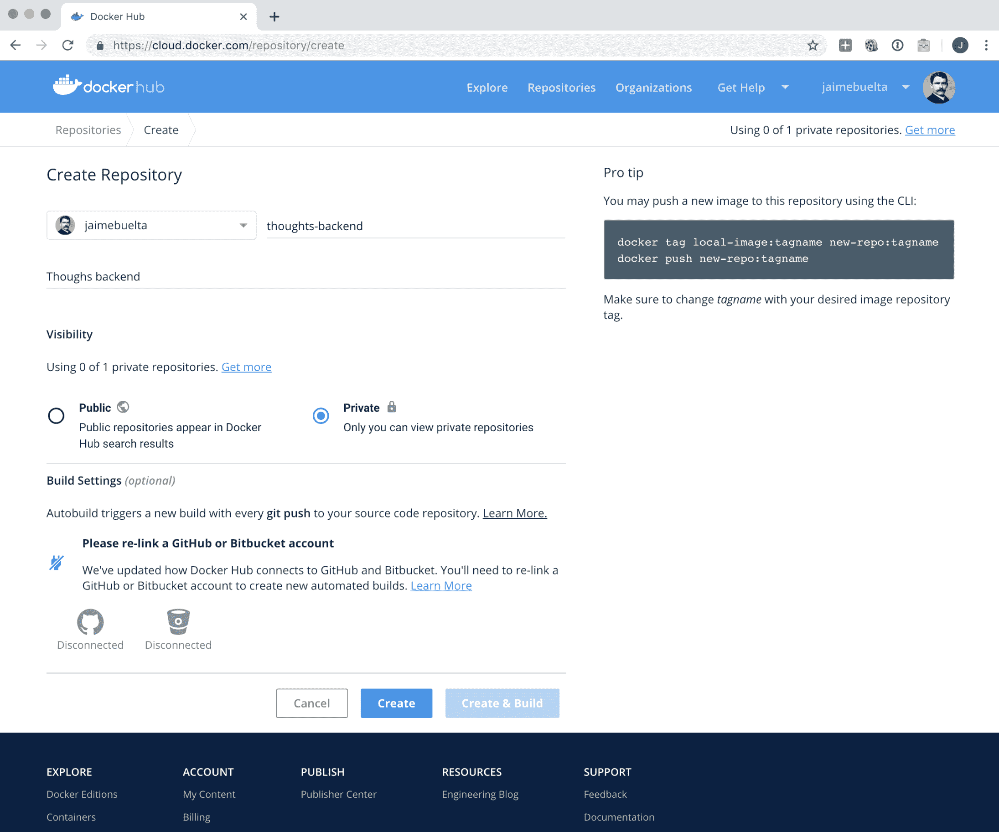

# 第三章：使用 Docker 构建、运行和测试您的服务

在上一章中设计了一个工作的 RESTful 微服务，本章将介绍如何以*Docker 方式*使用它，将服务封装到一个自包含的容器中，使其不可变，并且可以独立部署。本章非常明确地描述了服务的依赖关系和使用方式。运行服务的主要方式是作为 Web 服务器运行，但也可以进行其他操作，比如运行单元测试，生成报告等。我们还将看到如何在本地计算机上部署服务进行测试，以及如何通过镜像仓库共享服务。

本章将涵盖以下主题：

+   使用 Dockerfile 构建您的服务

+   操作不可变的容器

+   配置您的服务

+   在本地部署 Docker 服务

+   将您的 Docker 镜像推送到远程注册表

在本章结束时，您将了解如何使用 Docker 操作，创建基本服务，构建镜像并运行它。您还将了解如何共享镜像以在另一台计算机上运行。

# 技术要求

对于本章，您需要安装 Docker，版本为 18.09 或更高版本。请参阅官方文档([`docs.docker.com/install/`](https://docs.docker.com/install/))，了解如何在您的平台上进行安装。

如果您在 Linux 上安装 Docker，可能需要配置服务器以允许非 root 访问。请查看文档：[`docs.docker.com/install/linux/linux-postinstall/`](https://docs.docker.com/install/linux/linux-postinstall/)。

使用以下命令检查版本：

```py
$ docker version
Client: Docker Engine - Community
 Version: 18.09.2
 API version: 1.39
 Go version: go1.10.8
 Git commit: 6247962
 Built: Sun Feb 10 04:12:39 2019
 OS/Arch: darwin/amd64
 Experimental: false
```

您还需要安装 Docker Compose 版本 1.24.0 或更高版本。请注意，在某些安装中，如 macOS，这是自动为您安装的。请查看 Docker 文档中的安装说明：[`docs.docker.com/compose/install/`](https://docs.docker.com/compose/install/)。

```py
$ docker-compose version
docker-compose version 1.24.0, build 0aa5906
docker-py version: 3.7.2
CPython version: 3.7.3
OpenSSL version: OpenSSL 1.0.2r 26 Feb 2019
```

代码可以在 GitHub 上找到，位于此目录：[`github.com/PacktPublishing/Hands-On-Docker-for-Microservices-with-Python/tree/master/Chapter03`](https://github.com/PacktPublishing/Hands-On-Docker-for-Microservices-with-Python/tree/master/Chapter03)。在第二章中介绍了`ThoughtsBackend`的副本，*使用 Python 创建 REST 服务*，但代码略有不同。我们将在本章中看到这些差异。

# 使用 Dockerfile 构建您的服务

一切都始于一个容器。正如我们在第一章中所说的，*迁移-设计、计划和执行*，容器是一种标准化的软件包，以标准方式封装的软件包。它们是可以独立运行的软件单元，因为它们是完全自包含的。要创建一个容器，我们需要构建它。

记得我们描述容器为一个被其自己的文件系统包围的进程吗？构建容器会构建这个文件系统。

要使用 Docker 构建容器，我们需要定义其内容。文件系统是通过逐层应用来创建的。每个 Dockerfile，即生成容器的配方，都包含了生成容器的步骤的定义。

例如，让我们创建一个非常简单的 Dockerfile。创建一个名为`example.txt`的文件，其中包含一些示例文本，另一个名为`Dockerfile.simple`，内容如下：

```py
# scratch is a special container that is totally empty
FROM scratch
COPY example.txt /example.txt
```

现在使用以下命令构建它：

```py
$ # docker build -f <dockerfile> --tag <tag> <context>
$   docker build -f Dockerfile.simple --tag simple .
Sending build context to Docker daemon 3.072kB
Step 1/2 : FROM scratch
 --->
Step 2/2 : COPY example.txt /example.txt
 ---> Using cache
 ---> f961aef9f15c
Successfully built f961aef9f15c
Successfully tagged simple:latest

$ docker images
REPOSITORY TAG IMAGE ID CREATED SIZE
simple latest f961aef9f15c 4 minutes ago 11B
```

这将创建一个只包含`example.txt`文件的 Docker 镜像。这并不是很有用，但非常小-只有 11 个字节。这是因为它继承自空容器`scratch`，然后将`example.txt`文件复制到容器中的`/example.txt`位置。

让我们来看看`docker build`命令。使用`-f`参数定义 Dockerfile，使用`--tag`定义结果镜像的标签，使用`context`参数定义为点（`.`）。`context`参数是指在 Dockerfile 中的步骤中查找文件的引用。

该镜像还具有自动分配的镜像 ID`f961aef9f15c`。这是文件系统内容的哈希值。稍后我们将看到这为什么是相关的。

# 执行命令

之前的容器并不是很令人兴奋。完全可以从头开始创建自己的容器，但通常情况下，您会寻找一个包含某种 Linux 发行版的基线，以便您可以在容器中执行一些有用的操作。

正如我们在`FROM`命令中看到的，我们可以从以前的容器开始。我们将在整本书中使用 Alpine Linux（[`alpinelinux.org/`](https://alpinelinux.org/)）发行版，尽管还有其他发行版可用，如 Ubuntu 和 CentOS。查看这篇文章[`sweetcode.io/linux-distributions-optimized-hosting-docker/`](https://sweetcode.io/linux-distributions-optimized-hosting-docker/)，了解针对 Docker 容器的发行版。

为什么选择 Alpine Linux？它可以说是 Docker 系统中最受欢迎的发行版，因为它的占用空间非常小，旨在提高安全性。它得到了很好的维护，并定期更新和修补。它还具有完整的软件包管理系统，可以轻松安装大多数常见的 Web 服务工具。基础镜像的大小只有大约 5MB，并包含一个可用的 Linux 操作系统。

在使用时，它有一些怪癖，比如使用自己的包管理，称为`apk`，但它很容易使用，几乎可以直接替代常见的 Linux 发行版。

以下 Dockerfile 将继承自基础`alpine`容器，并添加`example.txt`文件：

```py
FROM alpine

RUN mkdir -p /opt/
COPY example.txt /opt/example.txt
```

这个容器允许我们运行命令，因为通常的命令行实用程序都包括在内：

```py
$ docker build -f Dockerfile.run --tag container-run .
Sending build context to Docker daemon 4.096kB
Step 1/3 : FROM alpine
 ---> 055936d39205
Step 2/3 : RUN mkdir -p /opt/
 ---> Using cache
 ---> 4f565debb941
Step 3/3 : COPY example.txt /opt/example.txt
 ---> Using cache
 ---> d67a72454d75
Successfully built d67a72454d75
Successfully tagged container-run:latest

$ # docker run <image name> <command> 
$   docker run container-run cat /opt/example.txt
An example file
```

注意`cat /opt/example.txt`命令行的执行。这实际上是在容器内部发生的。我们在`stdout`控制台中打印结果。但是，如果有文件被创建，当容器停止时，该文件不会保存在我们的本地文件系统中，而只保存在容器内部：

```py
$ ls
Dockerfile.run example.txt
$ docker run container-run /bin/sh -c 'cat /opt/example.txt > out.txt'
$ ls
Dockerfile.run example.txt
```

文件实际上是保存在一个已停止的容器中。一旦容器完成运行，它将被 Docker 保持停止状态，直到被移除。您可以使用`docker ps -a`命令查看已停止的容器。尽管已停止的容器并不是很有趣，但它的文件系统已保存在磁盘上。

运行 Web 服务时，正在运行的命令不会停止；它将一直运行，直到停止。记住我们之前说过的，容器是一个附加了文件系统的进程。正在运行的命令是容器的关键。

您可以通过添加以下内容来添加默认命令，当没有给出命令时将执行该命令：

```py
CMD cat /opt/example.txt
```

使用以下命令使其自动运行：

```py
$ docker run container-run
An example file
```

定义标准命令使容器变得非常简单。只需运行它，它将执行其配置的任何操作。记得在您的容器中包含一个默认命令。

我们还可以在容器中执行 shell 并与其交互。记得添加`-it`标志以保持连接正常打开，`-i`保持`stdin`打开，`-t`创建伪终端，您可以将其记住为交互式终端：

```py
$ docker run -it container-run /bin/sh
/ # cd opt/
/opt # ls
example.txt
/opt # cat example.txt
An example file
/opt # exit
$
```

在发现问题或执行探索性测试时非常有用。

# 了解 Docker 缓存

构建镜像时，构建图层的工作原理是构建镜像时的一个主要困惑点。

Dockerfile 上的每个命令都是按顺序执行的，并在前一个图层的基础上执行。如果您熟悉 Git，您会注意到这个过程是类似的。每个图层只存储对上一步的更改：



这使得 Docker 可以进行非常积极的缓存，因为任何更改之前的层已经计算过了。例如，在这个例子中，我们使用`apk update`更新可用的软件包，然后安装`python3`软件包，然后复制`example.txt`文件。对`example.txt`文件的任何更改只会在层`be086a75fe23`上执行最后两个步骤。这加快了镜像的重建速度。

这也意味着您需要仔细构建您的 Dockerfile，以免使缓存无效。从很少更改的操作开始，比如安装项目依赖，然后进行更频繁更改的操作，比如添加您的代码。我们的示例的带注释的 Dockerfile 有关于缓存使用的指示。

这也意味着，即使层删除了数据，图像的大小也永远不会变小，因为前一个层仍然存储在磁盘上。如果要从一个步骤中删除不需要的数据，需要在同一个步骤中进行。

保持容器的小是非常重要的。在任何 Docker 系统中，倾向于有大量的容器和大量的镜像。没有理由的大图像会很快填满仓库。它们下载和推送都会很慢，并且在您的基础设施中复制容器时也会很慢。

还有另一个实际的考虑。容器是简化和减少服务到最低程度的好工具。通过一点投资，您将获得很好的结果，并保持小而简洁的容器。

有几种保持图像小的做法。除了小心不安装额外的元素之外，主要的做法是创建一个单一的、复杂的层，安装和卸载，以及多阶段图像。多阶段 Dockerfile 是一种引用先前中间层并从中复制数据的方式。查看 Docker 文档（[`docs.docker.com/develop/develop-images/multistage-build/`](https://docs.docker.com/develop/develop-images/multistage-build/)）。

编译器，特别是倾向于占用大量空间。如果可能的话，尽量使用预编译的二进制文件。您可以使用多阶段 Dockerfile 在一个容器中进行编译，然后将二进制文件复制到正在运行的容器中。

您可以在这篇文章中了解两种策略之间的区别：[`pythonspeed.com/articles/smaller-python-docker-images/`](https://pythonspeed.com/articles/smaller-python-docker-images/)。

分析特定图像及其组成层的好工具是`dive`（[`github.com/wagoodman/dive`](https://github.com/wagoodman/dive)）。它还会发现图像可以缩小的方法。

我们将在下一步创建一个多阶段容器。

# 构建 web 服务容器

我们有一个具体的目标，那就是创建一个能够运行我们的微服务`ThoughtsBackend`的容器。为此，我们有一些要求：

+   我们需要将我们的代码复制到容器中。

+   代码需要通过 web 服务器提供。

因此，大致上，我们需要创建一个带有 web 服务器的容器，添加我们的代码，配置它以运行我们的代码，并在启动容器时提供结果。

我们将把大部分配置文件存储在`./docker`目录的子目录中。

作为一个 web 服务器，我们将使用 uWSGI（[`uwsgi-docs.readthedocs.io/en/latest/`](https://uwsgi-docs.readthedocs.io/en/latest/)）。uWSGI 是一个能够通过 WSGI 协议为我们的 Flask 应用提供服务的 web 服务器。uWSGI 非常灵活，有很多选项，并且能够直接提供 HTTP 服务。

一个非常常见的配置是在 uWSGI 前面放置 NGINX 来提供静态文件，因为对于这一点来说更有效率。在我们特定的用例中，我们不提供太多静态文件，因为我们正在运行一个 RESTful API，并且在我们的主要架构中，如第一章中所述，*进行移动-设计，计划和执行*，前端已经有一个负载均衡器和一个专用的静态文件服务器。这意味着我们不会为了简单起见添加额外的组件。NGINX 通常使用`uwsgi`协议与 uWSGI 通信，这是专门为 uWSGI 服务器设计的协议，但也可以通过 HTTP 进行通信。请查看 NGINX 和 uWSGI 文档。

让我们来看一下`docker/app/Dockerfile`文件。它有两个阶段；第一个是编译依赖项：

```py
########
# This image will compile the dependencies
# It will install compilers and other packages, that won't be carried
# over to the runtime image
########
FROM alpine:3.9 AS compile-image

# Add requirements for python and pip
RUN apk add --update python3

RUN mkdir -p /opt/code
WORKDIR /opt/code

# Install dependencies
RUN apk add python3-dev build-base gcc linux-headers postgresql-dev libffi-dev

# Create a virtual environment for all the Python dependencies
RUN python3 -m venv /opt/venv
# Make sure we use the virtualenv:
ENV PATH="/opt/venv/bin:$PATH"
RUN pip3 install --upgrade pip

# Install and compile uwsgi
RUN pip3 install uwsgi==2.0.18
# Install other dependencies
COPY ThoughtsBackend/requirements.txt /opt/
RUN pip3 install -r /opt/requirements.txt
```

这个阶段执行以下步骤：

1.  将阶段命名为`compile-image`，继承自 Alpine。

1.  安装`python3`。

1.  安装构建依赖项，包括`gcc`编译器和 Python 头文件（`python3-dev`）。

1.  创建一个新的虚拟环境。我们将在这里安装所有的 Python 依赖项。

1.  激活虚拟环境。

1.  安装 uWSGI。这一步从代码中编译它。

您还可以在 Alpine 发行版中安装包含的 uWSGI 包，但我发现编译的包更完整，更容易配置，因为 Alpine 的`uwsgi`包需要您安装其他包，如`uwsgi-python3`，`uwsgi-http`等，然后在 uWSGI 配置中启用插件。大小差异很小。这还允许您使用最新的 uWSGI 版本，而不依赖于 Alpine 发行版中的版本。

1.  复制`requirements.txt`文件并安装所有依赖项。这将编译并复制依赖项到虚拟环境中。

第二阶段是准备运行容器。让我们来看一下：

```py
########
# This image is the runtime, will copy the dependencies from the other
########
FROM alpine:3.9 AS runtime-image

# Install python
RUN apk add --update python3 curl libffi postgresql-libs

# Copy uWSGI configuration
RUN mkdir -p /opt/uwsgi
ADD docker/app/uwsgi.ini /opt/uwsgi/
ADD docker/app/start_server.sh /opt/uwsgi/

# Create a user to run the service
RUN addgroup -S uwsgi
RUN adduser -H -D -S uwsgi
USER uwsgi

# Copy the venv with compile dependencies from the compile-image
COPY --chown=uwsgi:uwsgi --from=compile-image /opt/venv /opt/venv
# Be sure to activate the venv
ENV PATH="/opt/venv/bin:$PATH"

# Copy the code
COPY --chown=uwsgi:uwsgi ThoughtsBackend/ /opt/code/

# Run parameters
WORKDIR /opt/code
EXPOSE 8000
CMD ["/bin/sh", "/opt/uwsgi/start_server.sh"]
```

执行以下操作：

1.  将镜像标记为`runtime-image`，并像之前一样继承自 Alpine。

1.  安装 Python 和运行时的其他要求。

请注意，需要安装用于编译的任何运行时。例如，我们在运行时安装了`libffi`和`libffi-dev`来编译，这是`cryptography`包所需的。如果不匹配，尝试访问（不存在的）库时会引发运行时错误。`dev`库通常包含运行时库。

1.  复制 uWSGI 配置和启动服务的脚本。我们稍后会看一下。

1.  创建一个用户来运行服务，并使用`USER`命令将其设置为默认用户。

这一步并不是严格必要的，因为默认情况下会使用 root 用户。由于我们的容器是隔离的，在其中获得 root 访问权限比在真实服务器中更安全。无论如何，最好的做法是不要将我们的面向公众的服务配置为 root 用户，并且这样做会消除一些可以理解的警告。

1.  从`compile-image`镜像中复制虚拟环境。这将安装所有编译的 Python 包。请注意，它们是与运行服务的用户一起复制的，以便访问它们。虚拟环境已激活。

1.  复制应用程序代码。

1.  定义运行参数。请注意，端口`8000`已暴露。这将是我们将在其上提供应用程序的端口。

如果以 root 身份运行，可以定义端口`80`。在 Docker 中路由端口是微不足道的，除了前端负载均衡器之外，没有真正需要使用默认的 HTTP 端口的理由。不过，可以在所有系统中使用相同的端口，这样可以消除不确定性。

请注意，应用程序代码是在文件末尾复制的。应用程序代码可能是最经常更改的代码，因此这种结构利用了 Docker 缓存，并且只重新创建了最后的几个层，而不是从头开始。在设计 Dockerfile 时，请考虑这一点。

另外，请记住，在开发过程中没有什么能阻止您改变顺序。如果您试图找到依赖关系的问题等，您可以注释掉不相关的层，或者在代码稳定后添加后续步骤。

现在让我们构建我们的容器。请注意，已创建了两个镜像，尽管只有一个被命名。另一个是编译镜像，它更大，因为它包含了编译器等。

```py
$ docker build -f docker/app/Dockerfile --tag thoughts-backend .
...
 ---> 027569681620
Step 12/26 : FROM alpine:3.9 AS runtime-image
...
Successfully built 50efd3830a90
Successfully tagged thoughts-backend:latest
$ docker images | head
REPOSITORY TAG IMAGE ID CREATED SIZE
thoughts-backend latest 50efd3830a90 10 minutes ago 144MB
<none>           <none> 027569681620 12 minutes ago 409MB
```

现在我们可以运行容器了。为了能够访问内部端口`8000`，我们需要使用`-p`选项进行路由：

```py
$ docker run -it  -p 127.0.0.1:8000:8000/tcp thoughts-backend
```

访问我们的本地浏览器`127.0.0.1`会显示我们的应用程序。您可以在标准输出中看到访问日志：



您可以使用`docker exec`从不同的终端访问正在运行的容器，并执行一个新的 shell。记得添加`-it`以保持终端开启。使用`docker ps`检查当前正在运行的容器以找到容器 ID：

```py
$ docker ps
CONTAINER ID IMAGE            COMMAND ... PORTS ...
ac2659958a68 thoughts-backend ... ...     127.0.0.1:8000->8000/tcp 
$ docker exec -it ac2659958a68 /bin/sh
/opt/code $ ls
README.md __pycache__ db.sqlite3 init_db.py pytest.ini requirements.txt tests thoughts_backend wsgi.py
/opt/code $ exit
$ 
```

您可以使用*Ctrl* + *C*停止容器，或者更优雅地，从另一个终端停止它：

```py
$ docker ps
CONTAINER ID IMAGE            COMMAND ... PORTS ...
ac2659958a68 thoughts-backend ... ...     127.0.0.1:8000->8000/tcp 
$ docker stop ac2659958a68
ac2659958a68
```

日志将显示`graceful stop`：

```py
...
spawned uWSGI master process (pid: 6)
spawned uWSGI worker 1 (pid: 7, cores: 1)
spawned uWSGI http 1 (pid: 8)
Caught SIGTERM signal! Sending graceful stop to uWSGI through the master-fifo
Fri May 31 10:29:47 2019 - graceful shutdown triggered...
$ 
```

正确捕获`SIGTERM`并优雅地停止我们的服务对于避免服务突然终止很重要。我们将看到如何在 uWSGI 中配置这一点，以及其他元素。

# 配置 uWSGI

`uwsgi.ini`文件包含了 uWSGI 的配置：

```py
[uwsgi]
uid=uwsgi
chdir=/opt/code
wsgi-file=wsgi.py
master=True
pidfile=/tmp/uwsgi.pid
http=:8000
vacuum=True
processes=1
max-requests=5000
# Used to send commands to uWSGI
master-fifo=/tmp/uwsgi-fifo
```

其中大部分信息都是我们从 Dockerfile 中获取的，尽管它需要匹配，以便 uWSGI 知道在哪里找到应用程序代码、启动 WSGI 文件的名称、以及从哪个用户开始等。

其他参数是特定于 uWSGI 行为的：

+   `master`：创建一个控制其他进程的主进程。作为 uWSGI 操作的推荐选项，因为它创建了更平稳的操作。

+   `http`：在指定端口提供服务。HTTP 模式创建一个进程，负载均衡 HTTP 请求到工作进程，并建议在容器外提供 HTTP 服务。

+   `processes`：应用程序工作进程的数量。请注意，在我们的配置中，这实际上意味着三个进程：一个主进程，一个 HTTP 进程和一个工作进程。更多的工作进程可以处理更多的请求，但会使用更多的内存。在生产中，您需要找到适合您的数量，将其与容器的数量平衡。

+   `max-requests`：在工作进程处理此数量的请求后，回收工作进程（停止并启动新的）。这减少了内存泄漏的可能性。

+   `vacuum`：在退出时清理环境。

+   `master-fifo`：创建一个 Unix 管道以向 uWSGI 发送命令。我们将使用这个来处理优雅的停止。

uWSGI 文档（[`uwsgi-docs.readthedocs.io/en/latest/`](https://uwsgi-docs.readthedocs.io/en/latest/)）非常全面和详尽。它包含了很多有价值的信息，既可以操作 uWSGI 本身，也可以理解关于 Web 服务器操作的细节。我每次阅读它时都会学到一些新东西，但一开始可能会有点压倒性。

值得投入一些时间来运行测试，以发现您的服务在超时、工作进程数量等方面的最佳参数是什么。但是，请记住，uWSGI 的一些选项可能更适合您的容器配置，这简化了事情。

为了允许优雅的停止，我们将 uWSGI 的执行包装在我们的`start_server.sh`脚本中：

```py
#!/bin/sh

_term() {
  echo "Caught SIGTERM signal! Sending graceful stop to uWSGI through the master-fifo"
  # See details in the uwsgi.ini file and
  # in http://uwsgi-docs.readthedocs.io/en/latest/MasterFIFO.html
  # q means "graceful stop"
  echo q > /tmp/uwsgi-fifo
}

trap _term SIGTERM

uwsgi --ini /opt/uwsgi/uwsgi.ini &

# We need to wait to properly catch the signal, that's why uWSGI is started
# in the background. $! is the PID of uWSGI
wait $!
# The container exits with code 143, which means "exited because SIGTERM"
# 128 + 15 (SIGTERM)
# http://www.tldp.org/LDP/abs/html/exitcodes.html
# http://tldp.org/LDP/Bash-Beginners-Guide/html/sect_12_02.html
```

脚本的核心是调用`uwsgi`来启动服务。然后它会等待直到服务停止。

`SIGTERM`信号将被捕获，并通过向`master-fifo`管道发送`q`命令来优雅地停止 uWSGI。

优雅的停止意味着当有新的容器版本可用时，请求不会被中断。我们稍后会看到如何进行滚动部署，但其中一个关键元素是在现有服务器不提供请求时中断它们，以避免在请求中间停止并留下不一致的状态。

Docker 使用`SIGTERM`信号来停止容器的执行。超时后，它将使用`SIGKILL`来杀死它们。

# 刷新 Docker 命令

我们已经了解了一些重要的 Docker 命令：

+   `docker build`：构建镜像

+   `docker run`：运行镜像

+   `docker exec`：在运行的容器中执行命令

+   `docker ps`：显示当前正在运行的容器

+   `docker images`：显示现有的镜像

虽然这些是基本命令，但了解大多数可用的 Docker 命令对于调试问题和执行操作（如监视、复制和标记镜像、创建网络等）非常有用。这些命令还会向您展示 Docker 内部工作的很多内容。

一个重要的命令：一定要定期使用`docker system prune`清理旧的容器和镜像。在使用几周后，Docker 占用的空间相当大。

Docker 文档（[`docs.docker.com/v17.12/engine/reference/commandline/docker/`](https://docs.docker.com/v17.12/engine/reference/commandline/docker/)）非常完整。一定要熟悉它。

# 使用不可变容器进行操作

像本章前面看到的 Docker 命令一样，这些命令是一切的基础。但是，当处理多个命令时，开始变得复杂。您已经看到一些命令可能会变得相当长。

要在集群操作中操作容器，我们将使用`docker-compose`。这是 Docker 自己的编排工具，用于定义多容器操作。它通过一个 YAML 文件定义所有不同的任务和服务，每个都有足够的上下文来构建和运行它。

它允许您在默认情况下的配置文件`docker-compose.yaml`中存储不同服务和每个服务的参数。这允许您协调它们并生成可复制的服务集群。

# 测试容器

我们将首先创建一个服务来运行单元测试。请记住，测试需要在容器内部运行。这将标准化它们的执行并确保依赖关系是恒定的。

请注意，在创建容器时，我们包括执行测试所需的所有要求。有选项创建运行容器并从中继承以添加测试和测试依赖项。

这确实创建了一个较小的运行容器，但也创建了一个情况，即测试容器与生产中的容器并不完全相同。如果大小很重要并且存在很大差异，这可能是一个选择，但要注意如果存在细微错误。

我们需要在`docker-compose.yaml`文件中定义一个服务，如下所示：

```py
version: '3.7'

services:
    # Development related
    test-sqlite:
        environment:
            - PYTHONDONTWRITEBYTECODE=1
        build:
            dockerfile: docker/app/Dockerfile
            context: .
        entrypoint: pytest
        volumes:
            - ./ThoughtsBackend:/opt/code
```

此部分定义了一个名为`test-sqlite`的服务。构建定义了要使用的 Dockerfile 和上下文，方式与`docker build`命令相同。`docker-compose`会自动设置名称。

我们可以使用以下命令构建容器：

```py
$ docker-compose build test-sqlite
Building test-sqlite
...
Successfully built 8751a4a870d9
Successfully tagged ch3_test-sqlite:latest
```

`entrypoint`指定要运行的命令，在本例中通过`pytest`命令运行测试。

命令和`entrypoint`之间有一些差异，它们都执行命令。最重要的差异是`command`更容易被覆盖，而`entrypoint`会在最后附加任何额外的参数。

要运行容器，请调用`run`命令：

```py
$ docker-compose run test-sqlite
=================== test session starts ===================
platform linux -- Python 3.6.8, pytest-4.5.0, py-1.8.0, pluggy-0.12.0 -- /opt/venv/bin/python3
cachedir: .pytest_cache
rootdir: /opt/code, inifile: pytest.ini
plugins: flask-0.14.0
collected 17 items

tests/test_thoughts.py::test_create_me_thought PASSED [ 5%]
...
tests/test_token_validation.py::test_valid_token_header PASSED [100%]

========== 17 passed, 177 warnings in 1.25 seconds ============
$ 
```

您可以附加要传递给内部`entrypoint`的`pytest`参数。例如，要运行与*validation*字符串匹配的测试，请运行以下命令：

```py
$ docker-compose run test-sqlite -k validation
...
===== 9 passed, 8 deselected, 13 warnings in 0.30 seconds =======
$
```

还有两个额外的细节：当前代码通过卷挂载，并覆盖容器中的代码。看看如何将`./ThoughtsBackend`中的当前代码挂载到容器中的代码位置`/opt/code`。这对开发非常方便，因为它将避免每次更改时都需要重新构建容器。

这也意味着在挂载目录层次结构中的任何写入都将保存在您的本地文件系统中。例如，`./ThoughtsBackend/db.sqlite3`数据库文件允许您用于测试。它还将存储生成的`pyc`文件。

`db.sqlite3`文件的生成可能会在某些操作系统中创建权限问题。如果是这种情况，请删除它以重新生成和/或允许所有用户读写`chmod 666 ./ThoughtsBackend/db.sqlite3`。

这就是为什么我们使用`environment`选项传递一个`PYTHONDONTWRITEBYTECODE=1`环境变量。这可以阻止 Python 创建`pyc`文件。

虽然 SQLite 适用于测试，但我们需要创建一个更好的反映部署的结构，并配置对数据库的访问以能够部署服务器。

# 创建一个 PostgreSQL 数据库容器

我们需要针对 PostgreSQL 数据库测试我们的代码。这是我们将在生产中部署代码的数据库。

虽然 SQLAlchemy 中的抽象层旨在减少差异，但数据库的行为仍然存在一些差异。

例如，在`/thoughts_backend/api_namespace.py`中，以下行是不区分大小写的，这是我们想要的行为：

```py
query = (query.filter(ThoughtModel.text.contains(search_param)))
```

将其翻译成 PostgreSQL，它是区分大小写的，这需要你进行检查。如果在 SQLite 中进行测试并在 PostgreSQL 中运行，这将是一个生产中的错误。

使用`ilike`替换的代码，以获得预期的行为，如下所示：

`param = f'%{search_param}%'`

`query = (query.filter(ThoughtModel.text.ilike(param)))`

我们将旧代码保留在注释中以显示这个问题。

要创建一个数据库容器，我们需要定义相应的 Dockerfile。我们将所有文件存储在`docker/db/`子目录中。让我们来看看 Dockerfile 及其不同的部分。整个文件可以在 GitHub 上找到（[`github.com/PacktPublishing/Hands-On-Docker-for-Microservices-with-Python/blob/master/Chapter03/docker/db/Dockerfile`](https://github.com/PacktPublishing/Hands-On-Docker-for-Microservices-with-Python/blob/master/Chapter03/docker/db/Dockerfile)）。

1.  使用`ARG`关键字，定义基本的 PostgreSQL 配置，如数据库名称、用户和密码。它们被设置为环境变量，以便 PostgreSQL 命令可以使用它们。

这些命令仅用于本地开发。它们需要与环境设置匹配。`ARG`关键字在构建时为 Dockerfile 定义了一个参数。我们将看到它们如何在`docker-compose.yaml`文件中设置为输入参数。

`ARG`元素也被定义为`ENV`变量，因此我们将它们定义为环境变量：

```py
# This Dockerfile is for localdev purposes only, so it won't be
# optimised for size
FROM alpine:3.9

# Add the proper env variables for init the db
ARG POSTGRES_DB
ENV POSTGRES_DB $POSTGRES_DB
ARG POSTGRES_USER
ENV POSTGRES_USER $POSTGRES_USER
ARG POSTGRES_PASSWORD
ENV POSTGRES_PASSWORD $POSTGRES_PASSWORD
ARG POSTGRES_PORT
ENV LANG en_US.utf8
EXPOSE $POSTGRES_PORT

# For usage in startup
ENV POSTGRES_HOST localhost
ENV DATABASE_ENGINE POSTGRESQL
# Store the data inside the container, as we don't care for
# persistence
RUN mkdir -p /opt/data
ENV PGDATA /opt/data
```

1.  安装`postgresql`包及其所有依赖项，如 Python 3 及其编译器。我们需要它们来运行应用程序代码：

```py
RUN apk update
RUN apk add bash curl su-exec python3
RUN apk add postgresql postgresql-contrib postgresql-dev
RUN apk add python3-dev build-base linux-headers gcc libffi-dev
```

1.  安装并运行`postgres-setup.sh`脚本：

```py
# Adding our code
WORKDIR /opt/code

RUN mkdir -p /opt/code/db
# Add postgres setup
ADD ./docker/db/postgres-setup.sh /opt/code/db/
RUN /opt/code/db/postgres-setup.sh
```

这初始化了数据库，设置了正确的用户、密码等。请注意，这并没有为我们的应用程序创建特定的表。

作为我们初始化的一部分，我们在容器内创建数据文件。这意味着数据在容器停止后不会持久保存。这对于测试来说是件好事，但是如果你想要访问数据进行调试，请记住保持容器运行。

1.  安装我们应用程序的要求和在数据库容器中运行的特定命令：

```py
## Install our code to prepare the DB
ADD ./ThoughtsBackend/requirements.txt /opt/code

RUN pip3 install -r requirements.txt
```

1.  复制存储在`docker/db`中的应用程序代码和数据库命令。运行`prepare_db.sh`脚本，该脚本创建应用程序数据库结构。在我们的情况下，它设置了`thoughts`表：

```py
## Need to import all the code, due dependencies to initialize the DB
ADD ./ThoughtsBackend/ /opt/code/
# Add all DB commands
ADD ./docker/db/* /opt/code/db/

## get the db ready
RUN /opt/code/db/prepare_db.sh
```

该脚本首先在后台启动运行 PostgreSQL 数据库，然后调用`init_db.py`，最后优雅地停止数据库。

请记住，在 Dockerfile 的每个步骤中，为了访问数据库，它需要在运行，但也会在每个步骤结束时停止。为了避免数据损坏或进程突然终止，确保在最后使用`stop_postgres.sh`脚本。尽管 PostgreSQL 通常会恢复突然停止的数据库，但这会减慢启动时间。

1.  要启动数据库运行，CMD 只是`postgres`命令。它需要以`postgres`用户身份运行：

```py
# Start the database in normal operation
USER postgres
CMD ["postgres"]
```

运行数据库服务，我们需要将其设置为`docker-compose`文件的一部分：

```py
    db:
        build:
            context: .
            dockerfile: ./docker/db/Dockerfile
            args:
                # These values should be in sync with environment
                # for development. If you change them, you'll 
                # need to rebuild the container
                - POSTGRES_DB=thoughts
                - POSTGRES_USER=postgres
                - POSTGRES_PASSWORD=somepassword
                - POSTGRES_PORT=5432
        ports:
            - "5432:5432"
```

请注意，`args`参数将在构建期间设置`ARG`值。我们还将路由 PostgreSQL 端口以允许访问数据库。

现在，您可以构建和启动服务器：

```py
$ docker-compose up build
$ docker-compose up db
Creating ch3_db_1 ... done
Attaching to ch3_db_1
...
db_1 | 2019-06-02 13:55:38.934 UTC [1] LOG: database system is ready to accept connections
```

在另一个终端中，您可以使用 PostgreSQL 客户端访问数据库。我建议使用 fantastic `pgcli`。您可以查看其文档（[`www.pgcli.com/`](https://www.pgcli.com/)）。

您还可以使用官方的`psql`客户端或您喜欢的任何其他 PostgreSQL 客户端。默认客户端的文档可以在此处找到：[`www.postgresql.org/docs/current/app-psql.html`](https://www.postgresql.org/docs/current/app-psql.html)。

在这里，我们使用`PGPASSWORD`环境变量来显示密码是先前配置的密码：

```py
$ PGPASSWORD=somepassword pgcli -h localhost -U postgres thoughts
Server: PostgreSQL 11.3
Version: 2.0.2
Chat: https://gitter.im/dbcli/pgcli
Mail: https://groups.google.com/forum/#!forum/pgcli
Home: http://pgcli.com
postgres@localhost:thoughts> select * from thought_model
+------+------------+--------+-------------+
|  id  |  username  |  text  |  timestamp  |
|------+------------+--------+-------------|
+------+------------+--------+-------------+
SELECT 0
Time: 0.016s
```

能够访问数据库对于调试目的很有用。

# 配置您的服务

我们可以配置服务使用环境变量来更改行为。对于容器来说，这是使用配置文件的绝佳替代方案，因为它允许不可变的容器注入其配置。这符合十二要素应用程序（[`12factor.net/config`](https://12factor.net/config)）原则，并允许良好地分离代码和配置，并设置代码可能用于的不同部署。

我们稍后将在使用 Kubernetes 时看到的一个优势是根据需要创建新环境，这些环境可以根据测试目的进行调整，或者专门用于开发或演示。通过注入适当的环境，能够快速更改所有配置，使此操作非常简单和直接。它还允许您根据需要启用或禁用功能，如果正确配置，这有助于在启动日启用功能，而无需代码发布。

这允许配置数据库以连接，因此我们可以在 SQLite 后端或 PostgreSQL 之间进行选择。

系统配置不仅限于开放变量。环境变量将在本书后面用于存储秘密。请注意，秘密需要在容器内可用。

我们将配置测试以访问我们新创建的数据库容器。为此，我们首先需要通过配置选择 SQLite 或 PostgreSQL 的能力。查看`./ThoughtsBackend/thoughts_backend/db.py`文件：

```py
import os
from pathlib import Path
from flask_sqlalchemy import SQLAlchemy

DATABASE_ENGINE = os.environ.get('DATABASE_ENGINE', 'SQLITE')

if DATABASE_ENGINE == 'SQLITE':
    dir_path = Path(os.path.dirname(os.path.realpath(__file__)))
    path = dir_path / '..'

    # Database initialisation
    FILE_PATH = f'{path}/db.sqlite3'
    DB_URI = 'sqlite+pysqlite:///{file_path}'
    db_config = {
        'SQLALCHEMY_DATABASE_URI': DB_URI.format(file_path=FILE_PATH),
        'SQLALCHEMY_TRACK_MODIFICATIONS': False,
    }

elif DATABASE_ENGINE == 'POSTGRESQL':
    db_params = {
        'host': os.environ['POSTGRES_HOST'],
        'database': os.environ['POSTGRES_DB'],
        'user': os.environ['POSTGRES_USER'],
        'pwd': os.environ['POSTGRES_PASSWORD'],
        'port': os.environ['POSTGRES_PORT'],
    }
    DB_URI = 'postgresql://{user}:{pwd}@{host}:{port}/{database}'
    db_config = {
        'SQLALCHEMY_DATABASE_URI': DB_URI.format(**db_params),
        'SQLALCHEMY_TRACK_MODIFICATIONS': False,
    }

else:
    raise Exception('Incorrect DATABASE_ENGINE')

db = SQLAlchemy()
```

当使用`DATABASE_ENGINE`环境变量设置为`POSTGRESQL`时，它将正确配置。其他环境变量需要正确设置；也就是说，如果数据库引擎设置为 PostgreSQL，则需要设置`POSTGRES_HOST`变量。

环境变量可以单独存储在`docker-compose.yaml`文件中，但更方便的是将多个环境变量存储在一个文件中。让我们看一下`environment.env`：

```py
DATABASE_ENGINE=POSTGRESQL
POSTGRES_DB=thoughts
POSTGRES_USER=postgres
POSTGRES_PASSWORD=somepassword
POSTGRES_PORT=5432
POSTGRES_HOST=db
```

请注意，用户的定义等与为测试创建 Dockerfile 的参数一致。`POSTGRES_HOST`被定义为`db`，这是服务的名称。

在为`docker-compose`创建的 Docker 集群中，您可以通过它们的名称引用服务。这将由内部 DNS 指向适当的容器，作为快捷方式。这允许服务之间轻松通信，因为它们可以通过名称非常容易地配置其访问。请注意，此连接仅在集群内有效，用于容器之间的通信。

我们使用 PostgreSQL 容器的测试服务定义如下：

```py
    test-postgresql:
        env_file: environment.env
        environment:
            - PYTHONDONTWRITEBYTECODE=1
        build:
            dockerfile: docker/app/Dockerfile
            context: .
        entrypoint: pytest
        depends_on:
            - db
        volumes:
            - ./ThoughtsBackend:/opt/code
```

这与`test-sqlite`服务非常相似，但它在`environment.env`中添加了环境配置，并添加了对`db`的依赖。这意味着如果不存在`db`服务，`docker-compose`将启动`db`服务。

现在可以针对 PostgreSQL 数据库运行测试：

```py
$ docker-compose run test-postgresql
Starting ch3_db_1 ... done
============== test session starts ====================
platform linux -- Python 3.6.8, pytest-4.6.0, py-1.8.0, pluggy-0.12.0 -- /opt/venv/bin/python3
cachedir: .pytest_cache
rootdir: /opt/code, inifile: pytest.ini
plugins: flask-0.14.0
collected 17 items

tests/test_thoughts.py::test_create_me_thought PASSED [ 5%]
...
tests/test_token_validation.py::test_valid_token_header PASSED [100%]

===== 17 passed, 177 warnings in 2.14 seconds ===
$
```

这个环境文件对于任何需要连接到数据库的服务都很有用，比如在本地部署服务。

# 本地部署 Docker 服务

有了所有这些元素，我们可以创建服务来本地部署 Thoughts 服务：

```py
     server:
        env_file: environment.env
        image: thoughts_server
        build:
            context: .
            dockerfile: docker/app/Dockerfile
        ports:
            - "8000:8000"
        depends_on:
            - db
```

我们需要确保添加`db`数据库服务的依赖关系。我们还绑定了内部端口，以便可以在本地访问它。

我们使用`up`命令启动服务。`up`和`run`命令之间有一些区别，但主要区别在于`run`用于启动和停止的单个命令，而`up`设计用于服务。例如，`run`创建一个交互式终端，显示颜色，`up`显示标准输出作为日志，包括生成时间，接受`-d`标志以在后台运行等。通常使用其中一个而不是另一个是可以的，但是`up`会暴露端口并允许其他容器和服务连接，而`run`则不会。

现在我们可以使用以下命令启动服务：

```py
$ docker-compose up server
Creating network "ch3_default" with the default driver
Creating ch3_db_1 ... done
Creating ch3_server_1 ... done
Attaching to ch3_server_1
server_1 | [uWSGI] getting INI configuration from /opt/uwsgi/uwsgi.ini
server_1 | *** Starting uWSGI 2.0.18 (64bit) on Sun Jun 2 
...
server_1 | spawned uWSGI master process (pid: 6)
server_1 | spawned uWSGI worker 1 (pid: 7, cores: 1)
server_1 | spawned uWSGI http 1 (pid: 8)
```

现在在浏览器中访问`localhost:8000`中的服务：

![

您可以在终端中查看日志。按下*Ctrl* + *C*将停止服务器。该服务也可以使用`-d`标志启动，以分离终端并以守护程序模式运行：

```py
$ docker-compose up -d server
Creating network "ch3_default" with the default driver
Creating ch3_db_1 ... done
Creating ch3_server_1 ... done
$
```

使用`docker-compose ps`检查运行的服务、它们的当前状态和打开的端口：

```py
$ docker-compose ps
 Name Command State Ports
------------------------------------------------------------------------------
ch3_db_1 postgres Up 0.0.0.0:5432->5432/tcp
ch3_server_1 /bin/sh /opt/uwsgi/start_s ... Up 0.0.0.0:8000->8000/tcp
```

正如我们之前所见，我们可以直接访问数据库并在其中运行原始的 SQL 命令。这对于调试问题或进行实验非常有用：

```py
$ PGPASSWORD=somepassword pgcli -h localhost -U postgres thoughts
Server: PostgreSQL 11.3
Version: 2.0.2

postgres@localhost:thoughts> 
INSERT INTO thought_model (username, text, timestamp) 
VALUES ('peterparker', 'A great power carries a great
 responsability', now());

INSERT 0 1
Time: 0.014s
postgres@localhost:thoughts>
```

现在 Thoughts 通过以下 API 可用：

```py
$ curl http://localhost:8000/api/thoughts/
[{"id": 1, "username": "peterparker", "text": "A great power carries a great responsability", "timestamp": "2019-06-02T19:44:34.384178"}]
```

如果需要以分离模式查看日志，可以使用`docker-compose logs <optional: service>`命令：

```py
$ docker-compose logs server
Attaching to ch3_server_1
server_1 | [uWSGI] getting INI configuration from /opt/uwsgi/uwsgi.ini
server_1 | *** Starting uWSGI 2.0.18 (64bit) on [Sun Jun 2 19:44:15 2019] ***
server_1 | compiled with version: 8.3.0 on 02 June 2019 11:00:48
...
server_1 | [pid: 7|app: 0|req: 2/2] 172.27.0.1 () {28 vars in 321 bytes} [Sun Jun 2 19:44:41 2019] GET /api/thoughts/ => generated 138 bytes in 4 msecs (HTTP/1.1 200) 2 headers in 72 bytes (1 switches on core 0)
```

要完全停止集群，请调用`docker-compose down`：

```py
$ docker-compose down
Stopping ch3_server_1 ... done
Stopping ch3_db_1 ... done
Removing ch3_server_1 ... done
Removing ch3_db_1 ... done
Removing network ch3_default
```

这将停止所有容器。

# 将 Docker 镜像推送到远程注册表

我们所见的所有操作都适用于我们的本地 Docker 存储库。鉴于 Docker 镜像的结构以及每个层可以独立工作，它们很容易上传和共享。为此，我们需要使用一个远程存储库或 Docker 术语中的注册表，它将接受推送到它的镜像，并允许从中拉取镜像。

Docker 镜像的结构由每个层组成。只要注册表包含它所依赖的层，每个层都可以独立推送。如果先前的层已经存在，这将节省空间，因为它们只会被存储一次。

# 从 Docker Hub 获取公共镜像

默认注册表是 Docker Hub。这是默认配置的，它作为公共镜像的主要来源。您可以在[`hub.docker.com/`](https://hub.docker.com/)上自由访问它，并搜索可用的镜像来基于您的镜像：



每个镜像都有关于如何使用它以及可用标签的信息。您不需要单独下载镜像，只需使用镜像的名称或运行`docker pull`命令。如果没有指定其他注册表，Docker 将自动从 Docker Hub 拉取：



镜像的名称也是我们在 Dockerfiles 中使用的`FROM`命令。

Docker 是一种分发工具的绝佳方式。现在很常见的是，一个开源工具在 Docker Hub 中有一个官方镜像，可以下载并以独立模式启动，从而标准化访问。

这可以用于快速演示，比如 Ghost（https://hub.docker.com/_/ghost）（一个博客平台），或者 Redis（https://hub.docker.com/_/redis）实例作为最小工作量的缓存。尝试在本地运行 Ghost 示例。

# 使用标签

标签是用来标记同一镜像的不同版本的描述符。有一个镜像`alpine:3.9`，另一个是`alpine:3.8`。还有 Python 的官方镜像用于不同的解释器（3.6、3.7、2.7 等），但除了版本之外，解释器可能指的是创建镜像的方式。

例如，这些镜像具有相同的效果。第一个是包含 Python 3.7 解释器的完整镜像：

```py
$ docker run -it python:3.7
Python 3.7.3 (default, May 8 2019, 05:28:42)
[GCC 6.3.0 20170516] on linux
Type "help", "copyright", "credits" or "license" for more information.
>>>
```

第二个也有一个 Python 3.7 解释器。请注意名称中的`slim`变化：

```py
$ docker run -it python:3.7-slim
Python 3.7.3 (default, May 8 2019, 05:31:59)
[GCC 6.3.0 20170516] on linux
Type "help", "copyright", "credits" or "license" for more information.
>>>
```

然而，镜像的大小相当不同：

```py
$ docker images | grep python
python 3.7-slim ca7f9e245002 4 weeks ago 143MB
python 3.7      a4cc999cf2aa 4 weeks ago 929MB
```

如果没有指定其他标签，任何构建都会自动使用`latest`标签。

请记住，标签可以被覆盖。这可能会让人感到困惑，因为 Docker 和 Git 的工作方式之间存在一些相似之处，例如 Git 中的“标签”意味着不可更改。Docker 中的标签类似于 Git 中的分支。

单个镜像可以多次打标签，使用不同的标签。例如，`latest`标签也可以是版本`v1.5`：

```py
$ docker tag thoughts-backend:latest thoughts-backend:v1.5
$ docker images
REPOSITORY       TAG    IMAGE ID     CREATED    SIZE
thoughts-backend latest c7a8499623e7 5 min ago 144MB
thoughts-backend v1.5   c7a8499623e7 5 min ago 144MB
```

请注意`image id`是相同的。使用标签允许您标记特定的镜像，以便我们知道它们已经准备部署或赋予它们某种意义。

# 推送到注册表

一旦我们给我们的镜像打了标签，我们就可以将它推送到共享注册表中，以便其他服务可以使用它。

可以部署自己的 Docker 注册表，但是，除非绝对必要，最好避免使用它。有一些云服务提供商允许您创建自己的注册表，无论是公共的还是私有的，甚至在您自己的私有云网络中。如果您想使您的镜像可用，最好的选择是 Docker Hub，因为它是标准的，而且最容易访问。在本章中，我们将在这里创建一个，但是我们将在本书的后面探索其他选项。

值得再次强调的是：维护自己的 Docker 注册表比使用提供者的注册表要昂贵得多。商业注册表的价格，除非您需要大量的仓库，将在每月几十美元的范围内，而且有来自知名云服务提供商如 AWS、Azure 和 Google Cloud 的选项。

除非您确实需要，否则避免使用自己的注册表。

我们将在 Docker Hub 注册表中创建一个新的仓库。您可以免费创建一个私有仓库，以及任意数量的公共仓库。您需要创建一个新用户，这可能是在下载 Docker 时的情况。

在 Docker 术语中，仓库是一组具有不同标签的镜像；例如，所有`thoughts-backend`的标签。这与注册表不同，注册表是一个包含多个仓库的服务器。

更不正式地说，通常将注册表称为*仓库*，将仓库称为*镜像*，尽管从纯粹的角度来说，镜像是唯一的，可能是一个标签（或者不是）。

然后，您可以按以下方式创建一个新的仓库：



创建仓库后，我们需要相应地给我们的镜像打标签。这意味着它应该包括 Docker Hub 中的用户名以标识仓库。另一种选择是直接使用包含用户名的镜像名称：

```py
$ docker tag thoughts-backend:latest jaimebuelta/thoughts-backend:latest
```

为了能够访问仓库，我们需要使用我们在 Docker Hub 中的用户名和密码登录 Docker：

```py
$ docker login
Login with your Docker ID to push and pull images from Docker Hub. If you don't have a Docker ID, head over to https://hub.docker.com to create one.
Username: jaimebuelta
Password:
Login Succeeded
```

一旦登录，您就可以推送您的镜像：

```py
$ docker push jaimebuelta/thoughts-backend:latest
The push refers to repository [docker.io/jaimebuelta/thoughts-backend]
1ebb4000a299: Pushed
669047e32cec: Pushed
6f7246363f55: Pushed
ac1d27280799: Pushed
c43bb774a4bb: Pushed
992e49acee35: Pushed
11c1b6dd59b3: Pushed
7113f6aae2a4: Pushed
5275897866cf: Pushed
bcf2f368fe23: Mounted from library/alpine
latest: digest: sha256:f1463646b5a8dec3531842354d643f3d5d62a15cc658ac4a2bdbc2ecaf6bb145 size: 2404
```

现在你可以分享镜像并从任何地方拉取它，只要本地的 Docker 已经正确登录。当我们部署生产集群时，我们需要确保执行它的 Docker 服务器能够访问注册表并且已经正确登录。

# 总结

在本章中，我们学习了如何使用 Docker 命令来创建和操作容器。我们学习了大多数常用的 Docker 命令，比如`build`，`run`，`exec`，`ps`，`images`，`tag`和`push`。

我们看到了如何构建一个 Web 服务容器，包括准备配置文件，如何构建 Dockerfile 的结构，以及如何尽可能地减小我们的镜像。我们还介绍了如何使用`docker-compose`在本地操作，并通过`docker-compose.yaml`文件连接运行在集群配置中的不同容器。这包括创建一个允许更接近生产部署的数据库容器，使用相同的工具进行测试。

我们看到了如何使用环境变量来配置我们的服务，并通过`docker-compose`配置来注入它们，以允许不同的模式，比如测试。

最后，我们分析了如何使用注册表来分享我们的镜像，以及如何充分标记它们并允许将它们从本地开发中移出，准备在部署中使用。

在下一章中，我们将看到如何利用创建的容器和操作来自动运行测试，并让自动化工具为我们做繁重的工作，以确保我们的代码始终是高质量的！

# 问题

1.  在 Dockerfile 中，`FROM`关键字是做什么的？

1.  你会如何启动一个带有预定义命令的容器？

1.  为什么在 Dockerfile 中创建一个步骤来删除文件不会使镜像变得更小？

1.  你能描述一下多阶段 Docker 构建是如何工作的吗？

1.  `run`和`exec`命令有什么区别？

1.  在使用`run`和`exec`命令时，什么时候应该使用`-it`标志？

1.  你知道除了 uWSGI 之外还有什么替代方案来提供 Python Web 应用程序吗？

1.  `docker-compose`用于什么？

1.  你能描述一下 Docker 标签是什么吗？

1.  为什么有必要将镜像推送到远程注册表？

# 进一步阅读

为了进一步了解 Docker 和容器，你可以查看*Mastering Docker – Third Edition*一书（[`www.packtpub.com/eu/virtualization-and-cloud/mastering-docker-third-edition`](https://www.packtpub.com/eu/virtualization-and-cloud/mastering-docker-third-edition)）。要调整容器并学习如何使你的应用程序更高效，可以查看* Docker High Performance - Second Edition*一书（[`www.packtpub.com/eu/networking-and-servers/docker-high-performance-second-edition`](https://www.packtpub.com/eu/networking-and-servers/docker-high-performance-second-edition)），其中涵盖了许多分析和发现性能问题的技术。
