# 第四章：创建流水线和工作流程

自动运行的流水线工作流程，通过不同阶段，将及早发现问题，并帮助您的团队以最有效的方式进行协作。

在本章中，我们将遵循持续集成实践，自动运行流水线并在每次更改时确保我们所有的代码都符合高质量标准，并且运行并通过所有测试。我们还将准备一个容器以便投入生产。

我们将看到如何利用 GitHub 和 Travis CI 等工具来创建最小干预的镜像。

在本章中，我们将涵盖以下主题：

+   理解持续集成实践

+   配置 Travis CI

+   配置 GitHub

+   从 Travis CI 推送 Docker 镜像

在本章结束时，您将了解如何在每次代码更改时自动运行测试，以及如何创建一个安全网，使您能够更快，更高效地开发。

# 技术要求

您需要一个 GitHub 帐户，并且需要是您为持续集成设置的项目的所有者。我们将在本章中创建一个 Travis CI 帐户。

您可以在 GitHub 的`Chapter04`子目录中查看本章中提到的完整代码（[`github.com/PacktPublishing/Hands-On-Docker-for-Microservices-with-Python/tree/master/Chapter04`](https://github.com/PacktPublishing/Hands-On-Docker-for-Microservices-with-Python/tree/master/Chapter04)）。以`.travis.yml`结尾的文件位于根目录中（[`github.com/PacktPublishing/Hands-On-Docker-for-Microservices-with-Python/blob/master/.travis.yml`](https://github.com/PacktPublishing/Hands-On-Docker-for-Microservices-with-Python/blob/master/.travis.yml)）。

# 理解持续集成实践

**持续集成**（通常缩写为**CI**）是一系列软件工程实践，确保代码始终处于工作状态。

持续集成这个术语的由来是历史上经常需要频繁集成软件，通常一天多次。这是因为开发人员使用的是本地代码，不一定会自动与其他人的代码结合。如今，使用 Git 等源代码控制版本软件使一些元素自动可用。

持续集成强调始终具有潜在可发布的代码。这使得以非常小的代码增量非常频繁地进行发布成为可能。

更频繁地发布更多的版本实际上会增加每个版本的质量。更多的部署也意味着每个部署都更小，减少了出现大问题的可能性。即使听起来违反直觉，更快的部署与部署质量更高以及更少的生产问题之间存在高度相关性。

这里的目标是能够提高部署速度。但为此，我们需要确保建立一个良好的安全网，自动检查我们正在做的是否安全发布。这就是所有 CI 实践发挥作用的地方。

在设置所有流程和基础设施之后，完全有可能一天多次实施发布（假设代码生成速度足够快）。可能需要一段时间才能达到这一点，但一定要花时间了解流程，并生成所有必要的工具，以确保您在不牺牲稳定性的情况下获得速度。相信我，这是完全可以实现的！

# 生成自动化构建

CI 的核心要素是生成与源代码控制系统集成的自动化构建。软件构建是一个过程（从源代码开始），执行一系列操作并产生输出。如果项目是用编译语言编写的，输出通常将是编译后的程序。

如果我们想要高质量的软件，那么构建的一部分就是检查生成的代码是否符合代码标准。如果代码不符合这些标准，那么构建将返回一个错误。

描述构建错误的一种常见方式是说*构建已损坏*。构建可以以不同的方式中断，某些类型的错误可能会在早期停止它（例如在运行测试之前的编译错误），或者我们可以继续检测更多问题（例如运行所有测试以返回所有可能的错误）。

构建中可能包括的一些步骤示例如下：

+   编译代码。

Python 通常不需要编译，但如果使用 C 扩展（用 C 编写并从 Python 导入的模块：[`docs.python.org/3/extending/`](https://docs.python.org/3/extending/)）或诸如 Cython ([`cython.org/`](https://cython.org/)) 这样的工具可能需要编译。

+   运行单元测试

+   运行静态代码分析工具

+   构建一个或多个容器

+   使用诸如 Safety ([`pyup.io/safety/`](https://pyup.io/safety/))这样的工具检查已知漏洞的依赖项。

+   生成用于分发的二进制或源代码包。例如，RPM ([`rpm.org/`](https://rpm.org/))，Debian 软件包 ([`www.debian.org/doc/manuals/debian-faq/ch-pkg_basics`](https://www.debian.org/doc/manuals/debian-faq/ch-pkg_basics))，等等

+   运行其他类型的测试

+   从代码生成报告、图表或其他资产

任何可以自动运行的东西都可以成为构建的一部分。可以随时生成本地构建，即使代码仍在进行中。这对于调试和解决问题非常重要。但自动构建将针对每个单独的提交运行，并不会在任何中间阶段运行。这使得明确检查预期在生产中运行的代码以及仍在进行中的代码非常重要。

请注意，单个提交可能仍然是正在进行的工作，但无论如何都值得提交。也许这是朝着一个功能迈出的一小步，有多人在同一部分代码上工作，或者工作分布在几天之间，代码在一天结束时被推送。无论如何，每个提交都是一个可重现的步骤，可以构建并检查构建是否成功。

对每个提交运行构建可以非常快速地检测问题。如果提交很小，那么很容易找出破坏性的更改。它还可以轻松地撤销破坏构建的更改并返回到已知的工作代码。

# 了解使用 Docker 进行构建的优势

构建的一个主要传统问题是拥有一个适当的构建环境，其中包含运行完整构建所需的所有依赖项。这可能包括编译器、运行测试的测试框架、任何静态分析工具和软件包管理器。版本不一致也可能导致错误。

正如我们之前所看到的，Docker 是封装软件的绝佳方式。它允许我们创建一个包含我们的代码和所有能够执行所有步骤的工具的镜像。

在上一章中，我们看到了如何在一个构建镜像上运行单元测试的单个命令。镜像本身可以运行自己的单元测试。这样可以抽象测试环境并明确定义它。这里唯一必要的依赖是安装了 Docker。

请记住，单个构建可能会生成多个镜像并使它们协调工作。我们在上一章中看到了如何运行单元测试——通过生成服务镜像和数据库镜像——但还有更多可能的用途。例如，您可以在两个不同的操作系统上运行测试，从每个操作系统创建两个镜像或不同的 Python 解释器版本，并检查测试是否在所有这些版本中都通过。

使用 Docker 镜像可以在所有环境中实现标准化。我们可以在开发环境中本地运行镜像，使用与自动化环境中相同的命令。这样可以简化查找错误和问题，因为它在每次运行构建的地方都创建了相同的环境，包括封装的操作系统。

不要低估这一点。在此之前，一个在运行 Ubuntu 的笔记本电脑上工作的开发人员，想要运行在 CentOS 中部署的代码，需要安装一个虚拟机并按照步骤来创建一个与生产环境类似的环境。但是，本地虚拟机往往会偏离，因为很难保持每个开发人员的本地虚拟机与生产环境中的虚拟机同步；此外，任何自动构建工具也可能有要求，比如不支持在生产中运行的旧版本 CentOS。

更糟糕的是，有时不同的项目安装在同一个虚拟机上，以避免每个项目都有一个虚拟机，这可能会导致兼容性问题。

Docker 大大简化了这个问题，部分原因是它迫使你明确声明依赖关系，并减少了实际运行我们的代码所需的表面。

请注意，我们不一定需要创建一个运行整个构建的单个步骤；它可以是几个 Docker 命令，甚至可以使用不同的镜像。但要求是它们都包含在 Docker 中，这是运行它所需的唯一软件。

使用 Docker 构建的主要产品是 Docker 镜像。我们需要正确地给它们打标签，但只有在构建成功的情况下才需要。

# 利用流水线的概念

CI 工具有助于澄清构建应该如何进行，并围绕流水线的概念进行工作。流水线是一系列阶段。如果其中任何一个不成功，流水线就会停止。

流水线中的每个阶段都可以产生可以在后续阶段使用的元素，或者作为完整构建的最终产品可用。这些最终元素被称为构件。

让我们看一个流水线的例子：


第一个阶段从源代码控制系统中拉取最新的提交。然后，我们构建所有的容器并运行测试和静态分析。如果一切顺利，我们就会给生成的`server`容器打标签，并将其推送到注册表中。

这些阶段运行的顺序应该是为了尽快检测问题，以便快速反馈。例如，如果`static-analysis`阶段比`test`阶段快得多，将分析阶段放在第一位将使失败的构建更快完成。要注意哪些部分可以更早执行以减少反馈时间。

CI 工具通常允许在流水线中进行大量配置，包括并行运行不同阶段的可能性。为了能够并行运行阶段，它们需要能够并行化，这意味着它们不应该改变相同的元素。

如果所选的 CI 工具允许并行运行阶段，可以将流水线定义如下：

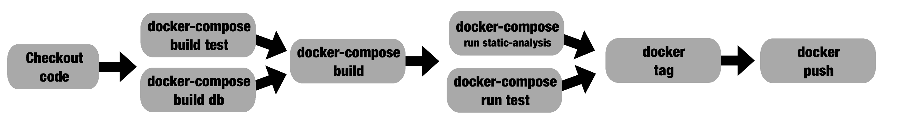

请注意，我们同时构建数据库和测试图像。下一个阶段构建其余的元素，这些元素已经在缓存中可用，因此速度会非常快。测试和静态分析都可以在两个不同的容器中并行运行。

这可能加快复杂的构建速度。

一定要验证所花费的时间是否减少。有些情况下，所花费的时间会非常相似。例如，静态分析可能非常快，或者你运行它的硬件可能不够强大，无法并行构建，使得并行构建和顺序构建所花费的时间非常相似。因此，一定要验证你的假设。

流水线是特定于 Travis CI 工具的脚本描述的。我们稍后会看一个 Travis CI 的例子。

# 分支、合并和确保清晰的主要构建

何时运行构建？每次推送提交时。但每个结果并不相同。在处理 Git 等源代码控制系统时，我们通常有两种类型的分支：

+   一个主分支

+   功能分支

它们实现了特定的功能或错误修复，当准备好时将合并到主分支中，如下图所示：

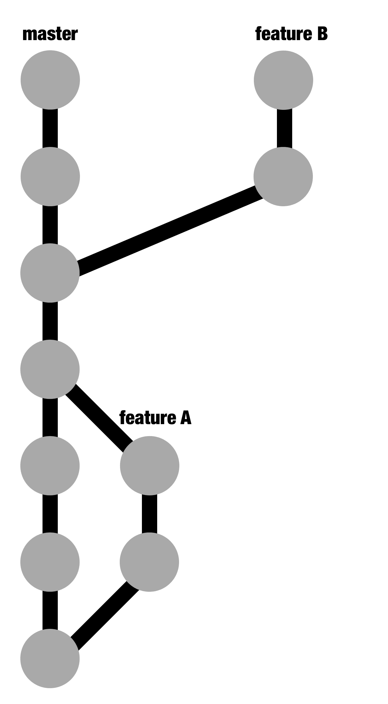

在这个例子中，我们看到主分支（**master**）分支到开发**feature** **A**。**Feature** **A**随后被简要介绍。还有一个**feature B**，因为它还没有准备好，所以尚未合并。有了额外的信息，我们可以知道何时安全地将一个功能分支合并到主分支中：

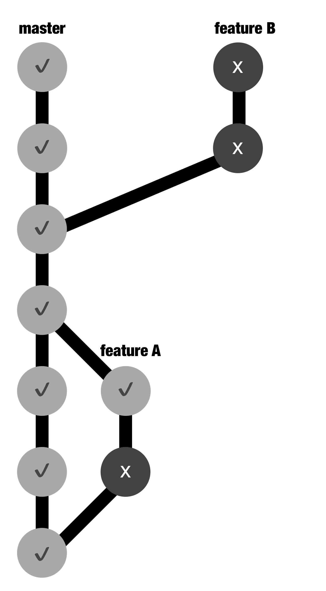

尚未合并的功能分支出现故障并不是很好，但在进行中的工作中，这是可以预料的。与此同时，主分支的破坏是一个应该尽快修复的事件。如果主分支状态良好，那意味着它有可能发布。

GitHub 有一个模型：拉取请求。我们将配置拉取请求自动检查构建是否通过并避免合并。如果我们强制任何功能分支在合并回来之前也与主分支保持最新，那么主分支最终会非常稳定。

对于在 Git 中处理分支以定义发布，最流行的模型是 Git-flow，在这篇有影响力的博文中定义（[`nvie.com/posts/a-successful-git-branching-model/`](https://nvie.com/posts/a-successful-git-branching-model/)）。以下的 CI 实践可以简化一些事情，不涉及诸如发布分支之类的元素。这篇博文是强烈推荐阅读的。

在主分支上有一系列连续成功的构建也对项目的稳定性和质量有很大帮助。如果主分支的破坏非常罕见，那么使用最新的主分支创建新版本的信心就会非常高。

# 配置 Travis CI

Travis CI ([`travis-ci.com/`](https://travis-ci.com/)) 是一个流行的持续集成服务，可免费用于公共 GitHub 项目。与 GitHub 的集成非常简单，它允许您配置它运行的平台，如 macOS、Linux，甚至 iOS。

Travis CI 与 GitHub 紧密集成，因此您只需要登录 GitHub 即可访问它。我们将看看如何将我们的项目连接到它。

为了清晰起见，本章中的代码将只与 Travis 连接起来。

Travis 的工作方式与其他 CI 工具有些不同，它通过启动一个新的虚拟机创建独立的任务。这意味着任何为上一个阶段创建的构件都需要复制到其他地方，以便在下一个阶段开始时下载。

有时这会让事情变得有点不切实际，一个简单的解决方案是为每个单独的任务构建多次。

配置远程系统，如 Travis CI，有时可能会有点令人沮丧，因为它要求您推送一个提交以进行构建，以查看配置是否正确。此外，它使用一个 YAML 文件进行配置，在语法方面可能有点暴躁。您可能需要尝试几次才能得到稳定的东西，但不要担心。一旦设置好，您只能通过特定的拉取请求来更改它，因为配置文件也受源代码控制。

您还可以检查 Travis CI 配置中的请求，看看`.yml`文件是否创建了解析错误。

您可以在这里查看完整的 Travis CI 文档：[`docs.travis-ci.com/`](https://docs.travis-ci.com/)。

要配置 Travis CI，让我们首先从 GitHub 添加一个存储库。

# 将存储库添加到 Travis CI

要将存储库添加到 Travis CI，我们需要采取以下步骤：

1.  第一阶段是转到 Travis CI 网页并使用您的 GitHub 凭据登录。

1.  然后，您需要授权 Travis 访问 GitHub，通过激活它。

1.  然后，选择要构建的存储库。

最简单的起点是在[`github.com/PacktPublishing/Hands-On-Docker-for-Microservices-with-Python`](https://github.com/PacktPublishing/Hands-On-Docker-for-Microservices-with-Python)中 fork 此书中的示例的存储库。随意操作！

但请记住更改用户名、凭据和注册信息以匹配您自己的信息。

您需要对 GitHub 存储库拥有者权限，然后您就可以开始了！

# 创建.travis.yml 文件

Travis CI 中的主要元素是创建`.travis.yml`文件。

请确保将其命名为这样（包括初始点和`.yml`扩展名），并将其包含在 GitHub 存储库的根目录中。如果不这样做，Travis CI 构建将不会启动。请注意，在示例存储库中，该文件位于**根目录**中，而**不是**在`Chapter04`子目录下。

`.travis.yml`描述了构建及其不同的步骤。构建在一个或多个虚拟机中执行。可以通过指定一般操作系统和具体版本来配置这些虚拟机。默认情况下，它们在 Ubuntu Linux 14.04 Trusty 中运行。您可以在此处找到有关可用操作系统的更多信息：[`docs.travis-ci.com/user/reference/overview/`](https://docs.travis-ci.com/user/reference/overview/)。

使用 Docker 允许我们抽象出大部分操作系统的差异，但我们需要确保我们使用的特定`docker`和`docker-compose`版本是正确的。

我们将开始`.travis.yml`，确保存在有效的`docker-compose`版本（1.23.2），使用以下代码：

```py
services:
  - docker

env:
  - DOCKER_COMPOSE_VERSION=1.23.2

before_install:
  - sudo rm /usr/local/bin/docker-compose
  - curl -L https://github.com/docker/compose/releases/download/${DOCKER_COMPOSE_VERSION}/docker-compose-`uname -s`-`uname -m` > docker-compose
  - chmod +x docker-compose
  - sudo mv docker-compose /usr/local/bin
  - docker --version
  - docker-compose version
```

`before_install`块将在所有虚拟机中执行。现在，为了运行测试，我们添加一个`script`块：

```py
script:
- cd ch4
- docker-compose build db
- docker-compose build static-analysis
- docker-compose build test-postgresql
- docker-compose run test-postgresql
- docker-compose run static-analysis
```

我们构建所有要使用的镜像，然后运行测试。请注意，使用 PostgreSQL 数据库运行测试需要构建`db`容器。

关于`db`容器有一个小细节：Travis 虚拟机不允许我们打开端口`5432`。因此我们在`docker-compose`中删除了`ports`。请注意，这仅仅是为了调试目的而使得 PostgreSQL 在外部可用；在内部，容器可以通过其内部网络相互通信。

我们创建了一个名为`db-debug`的服务，它是`db`的副本，但它公开了本地开发的端口。您可以在`docker-compose.yaml`文件中查看它，网址为[`github.com/PacktPublishing/Hands-On-Docker-for-Microservices-with-Python/blob/master/Chapter04/docker-compose.yaml`](https://github.com/PacktPublishing/Hands-On-Docker-for-Microservices-with-Python/blob/master/Chapter04/docker-compose.yaml)。

这将运行所有测试。将代码推送到存储库后，我们可以看到构建在 Travis CI 中开始：

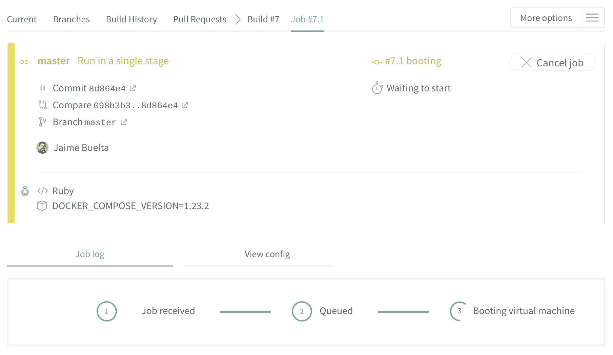

一旦完成，我们可以通过标记为绿色来确认构建成功。然后可以检查日志以获取更多信息：

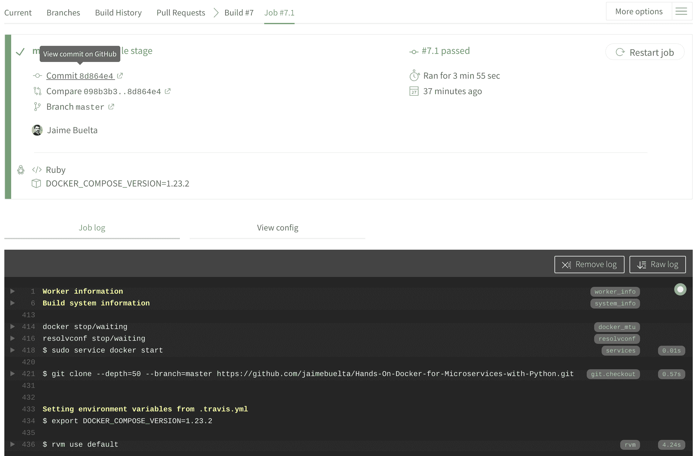

现在您可以在日志的末尾看到测试：

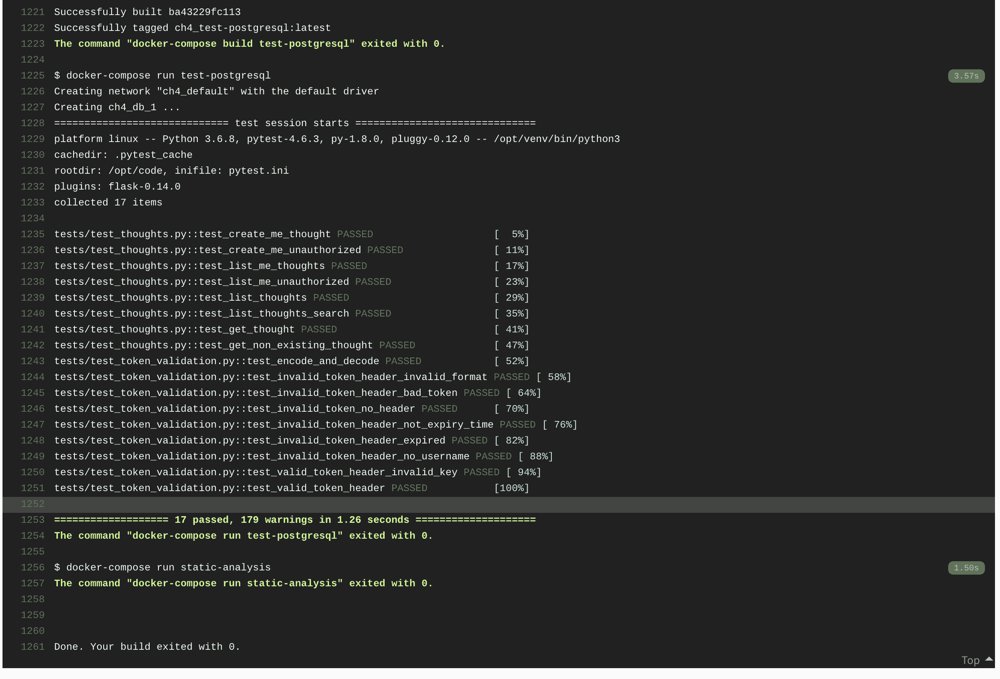

这对于检测问题和构建中断非常有用。现在，让我们看看 Travis 中作业的工作方式。

# 使用 Travis 作业

Travis 将整个构建划分为一系列将依次运行的阶段。在每个阶段，可以有多个作业。同一构建中的所有作业将并行运行。

正如我们之前所见，可以通过用`jobs`部分替换`script`部分来配置测试和静态分析并行运行：

```py
jobs:
  include:
    - stage: tests
      name: "Unit Tests"
      script:
      - cd ch4
      - docker-compose build db
      - docker-compose build test-postgresql
      - docker-compose run test-postgresql
    - stage: tests
      name: "Static Analysis"
      script:
      - cd ch4
      - docker-compose build static-analysis
      - docker-compose run static-analysis
```

这在一个阶段隐式地创建了两个作业。该阶段命名为`tests`，作业分别称为“单元测试”和“静态分析”。

结果显示在 Travis 页面上：

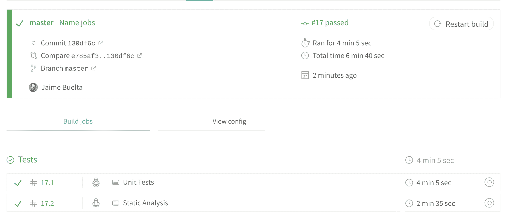

请注意，在这两种情况下，由于作业是独立的，它们需要构建所需的映像。由于单元测试作业需要构建`db`映像，这需要几分钟的时间，所以比静态分析慢。

您可以检查每个作业的详细日志。请注意，环境设置和`before_install`操作在所有作业中都会执行。

这个分工不仅可以极大地加快构建速度，还可以澄清问题所在。一眼就可以看出破坏因素是单元测试还是静态分析。这样可以减少混乱。

# 发送通知

默认情况下，Travis CI 会发送电子邮件通知构建的结果，但只有在构建失败或修复了破损的构建时才会发送。这样可以避免不断发送“成功”电子邮件，并且只在需要采取行动时才会发送。默认情况下，电子邮件只发送给提交者（如果不同，则发送给提交作者）。

请注意，“失败”构建和“错误”构建之间存在差异。后者是作业设置中的失败，这意味着`before_install`、`install`或`before_script`部分存在问题，而失败的构建是因为脚本部分返回了非零结果。在更改 Travis 配置时，*错误*构建很常见。

Travis 允许我们配置通知电子邮件并连接更多通知系统，包括 Slack、IRC，甚至 OpsGenie，它可以根据值班计划发送短信。在此处查看更多信息的完整文档：[`docs.travis-ci.com/user/notifications/`](https://docs.travis-ci.com/user/notifications/)。

# 配置 GitHub

为了充分利用我们配置的 CI 系统，我们需要确保在将其合并到主分支之前检查构建。为此，我们可以在 GitHub 中将`master`配置为主分支，并在合并到它之前添加要求：

确保`.travis.yaml`文件包含适当的凭据，如果您 fork 了存储库。您需要使用自己的更新它们。

1.  转到我们的 GitHub 存储库中的设置和分支，然后单击添加规则。

1.  然后，我们启用了要求状态检查通过才能合并选项，并使用来自`travis-ci`的状态检查：

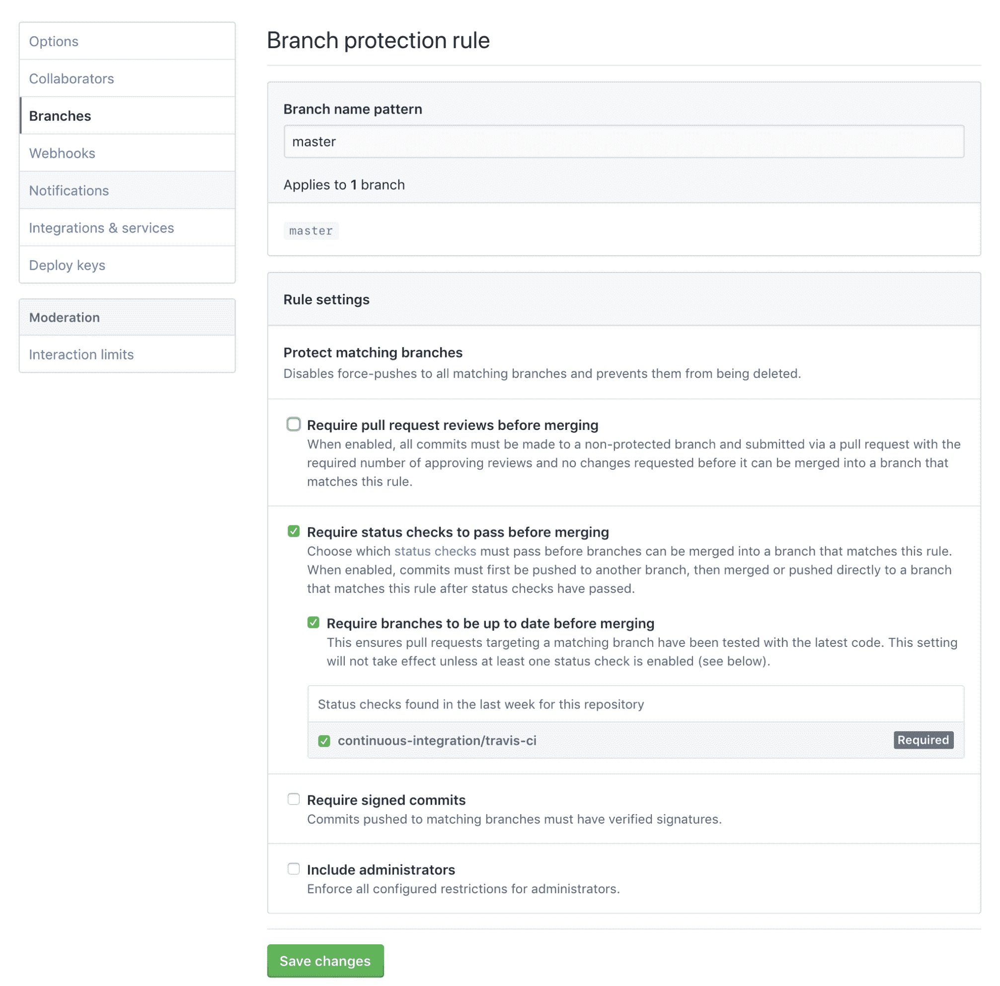

1.  我们还选择了在合并之前要求分支是最新的选项。这确保了没有合并到`master`的分支在之前没有运行过。

看看 GitHub 提供的其他可能性。特别是，强制执行代码审查是明智的，可以在合并之前对代码进行审查并传播知识。

1.  创建新分支和新的拉取请求，旨在失败静态测试，我们可以看到测试是如何添加到 GitHub 的：

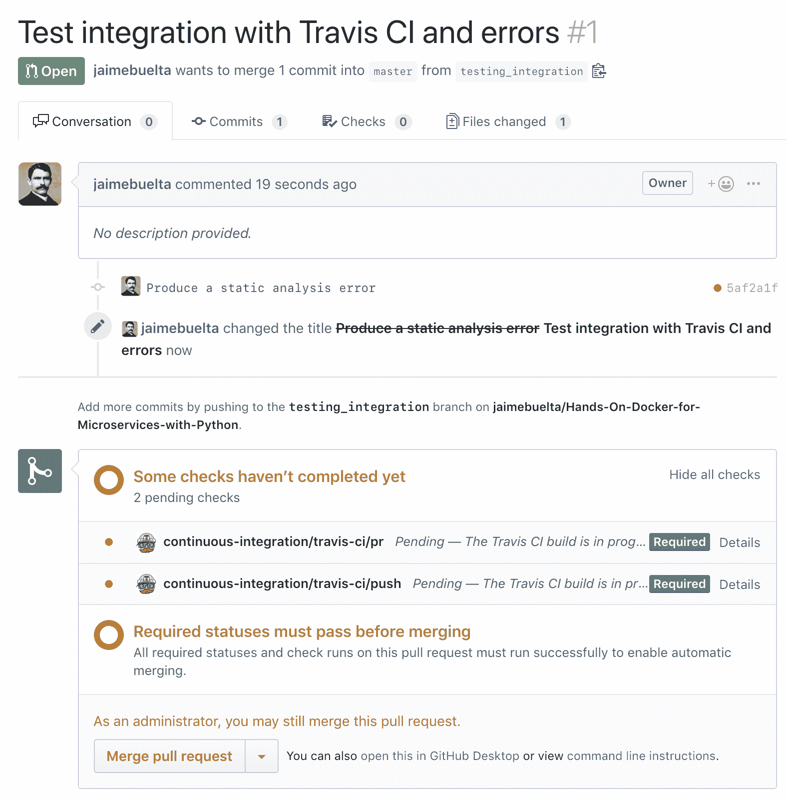

详细链接将带您到 Travis CI 和特定的构建。您还可以查看构建的历史记录：

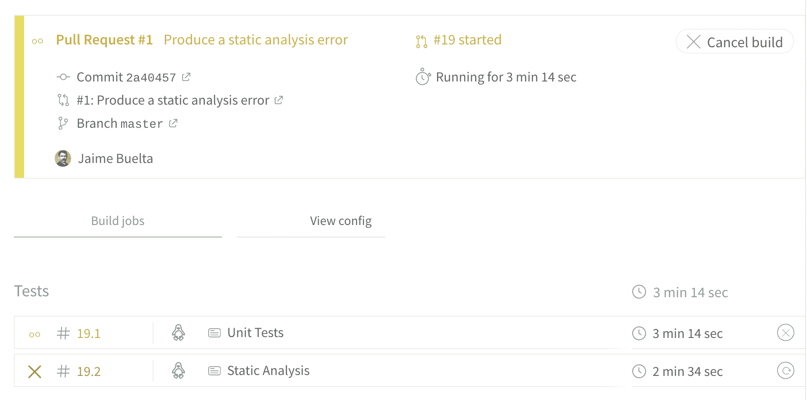

当构建完成时，GitHub 不会让您合并拉取请求：

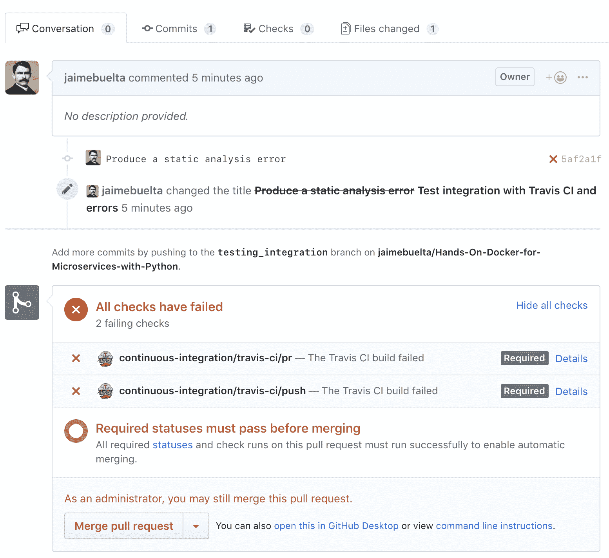

有关 Travis CI 中构建页面的详细信息可以在此处找到：

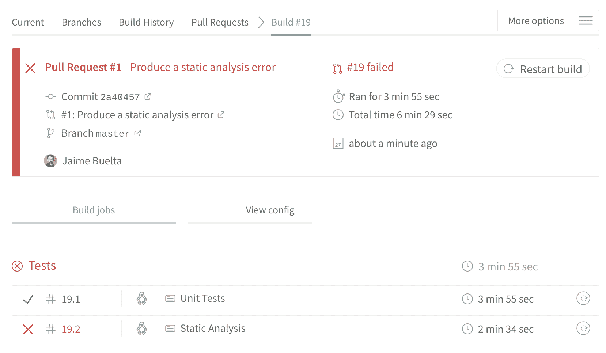

修复问题并推送代码将触发另一个构建。这一次，它将成功，并且拉取请求将成功合并。您可以看到每个提交都有自己的构建信息，无论是正确还是错误：

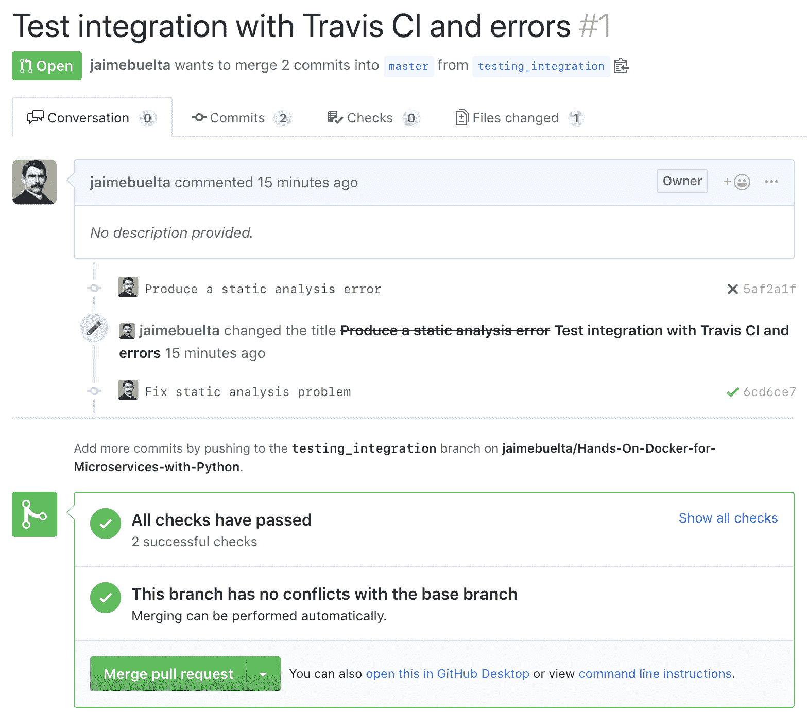

现在我们可以放心地合并到主分支，确保`master`分支在运行测试时不会中断。

请注意，拉取请求中有两个构建：一个用于分支，另一个用于拉取请求。默认情况下，Travis CI 有这种配置。如果您强制它在合并之前始终创建拉取请求，那么请求将是多余的，尽管在某些情况下，当分支在创建拉取请求之前被推送时，它可能有所帮助。您可以在 Travis 项目配置中启用或禁用它。

可以配置的另一个有趣的特性是，如果推送了更新的提交，可以自动取消构建。这有助于减少系统中的总构建数量。

在 GitHub 的 Commits 视图中也可以检查构建结果。

# 从 Travis CI 推送 Docker 图像

在我们的构建创建了一个 Docker 镜像之后，我们需要能够与团队的其他成员共享或部署它。我们将使用 Docker Hub 中的 Docker 注册表，如前一章所述，来推送镜像。

让我们从设置安全变量开始。

# 设置安全变量

为了能够推送到 Docker 存储库，我们首先需要在 Travis CI 的秘密配置中配置密码，以避免在 GitHub 存储库中提交敏感信息：

值得重申：**不要在 GitHub 存储库中提交机密信息**。这些技术可以用于任何其他所需的机密。

1.  使用`gem`安装`travis`命令行。这假设你的系统上已经安装了`gem`（Ruby 1.93 或更高版本）。如果没有，请查看安装说明（[`github.com/travis-ci/travis.rb#installation`](https://github.com/travis-ci/travis.rb#installation)）：

```py
$ gem install travis
```

1.  登录到 Travis：

```py
travis login --pro
```

1.  使用 Docker Hub 用户名创建一个安全变量：

```py
$ travis encrypt --com DOCKER_USERNAME="<your user name>"
```

1.  你会看到类似以下的输出：

```py
secure: ".... encrypted data ...."
```

1.  然后，您需要将加密数据添加到环境变量中，如下所示：

```py
env:
  global:
    - DOCKER_COMPOSE_VERSION=1.23.2
    - secure: ".... encrypted data ...."
```

1.  现在，请注意新的`global`部分，并重复第 3 步，使用 Docker Hub 密码：

```py
$ travis encrypt --com DOCKER_PASSWORD="<password>"
```

1.  在第一个之后添加另一个安全变量：

```py
env:
  global:
    - DOCKER_COMPOSE_VERSION=1.23.2
    - secure: ".... encrypted data ...."
    - secure: ".... encrypted data ...."
```

此操作创建了两个环境变量，在构建期间可用。不用担心——它们不会显示在日志中：

```py
Setting environment variables from .travis.yml
$ export DOCKER_COMPOSE_VERSION=1.23.2
$ export DOCKER_PASSWORD=[secure]
$ export DOCKER_USERNAME=[secure]
```

现在，我们可以在`before_install`部分添加适当的登录命令，以便 Docker 服务可以连接并推送图像：

```py
before_install:
  ...
  - echo "Login into Docker Hub"
  - echo "$DOCKER_PASSWORD" | docker login -u "$DOCKER_USERNAME" --password-stdin
```

下一阶段是构建和标记结果图像。

# 标记和推送构建

以下代码将添加一个新的阶段，用于构建、标记和最终将结果推送到 Docker 注册表：

```py
jobs:
  include:
    ...
    - stage: push
      script:
      - cd Chapter04
      - docker-compose build server
      - docker tag thoughts_server:latest <registry>/thoughts-backend:$TRAVIS_BRANCH
```

这第一部分构建了服务器的最终镜像，并使用分支的名称进行标记。为了部署它，我们将添加一个`deploy`部分：

```py
- stage: push
  script:
  ...
  - docker tag thoughts_server:latest <registry>/thoughts-backend:$TRAVIS_BRANCH
  deploy:
  - provider: script
    script: docker push <registry>/thoughts-backend:$TRAVIS_BRANCH
    on:
      branch: master 
```

当分支是`master`时，`deploy`部分将执行一个`script`命令。现在，我们的构建还将生成一个最终镜像并推送它。这将确保我们的注册表中有主分支的最新版本。

我们可以添加更多的`deploy`条件来推送标签；例如，如果我们创建了一个新的 Git 标签，我们可以推送带有适当标签的结果图像。

请记住，如前一章所述，标签是标记图像为重要的一种方式。通常，这意味着它已准备好在自动测试之外的某些地方使用，例如在部署中。

我们可以在`deploy`部分添加标签：

```py
      deploy:
      - provider: script
        script: docker push <registry>/thoughts-backend:$TRAVIS_BRANCH
        on:
          branch: master 
      - provider: script
        script: docker push <registry>/thoughts-backend:$TRAVIS_TAG
        on:
          tags: True
```

请注意，这里我们推送的是主分支或有定义标签的情况，因为这两种情况都不会匹配。

您可以在此处查看完整的部署文档：[`docs.travis-ci.com/user/deployment`](https://docs.travis-ci.com/user/deployment)。我们已经介绍了`script`提供程序，这是一种创建自己的命令的方式，但也支持提供程序，如 Heroku、PyPI（用于创建 Python 包的情况）和 AWS S3。

# 对每次提交进行标记和推送

可以将每个构建的图像推送到注册表，由其 Git SHA 标识。当工作正在进行中可以共享用于演示目的、测试等时，这可能很有用。

为此，我们需要在`before_install`部分创建一个包含 Git SHA 的环境变量：

```py
before_install:
  ...
  - export GIT_SHA=`git rev-parse --short HEAD`
  - echo "Building commit $GIT_SHA"
```

然后，`push`部分添加了图像的标记和推送：

```py
- stage: push
  script:
  - cd Chapter04
  - docker-compose build server
  - docker tag thoughts_server:latest <registry>/thoughts-backend:$GIT_SHA
  - docker push <registry>/thoughts-backend:$GIT_SHA
  - docker tag thoughts_server:latest <registry>/thoughts-backend:$TRAVIS_BRANCH
```

由于此操作发生在`deploy`部分之前，因此它将在达到此部分的每次构建中产生。

这种方法将产生大量的标签。根据您的注册表如何管理它们，这可能是昂贵的。请确保这是一个明智的做法。

请记住，这种方法也可以用于其他条件推送。

请注意，注册表需要根据您自己的注册表详细信息进行调整。如果您克隆示例存储库，则后者需要更改。

# 总结

在本章中，我们介绍了持续集成的实践，并探讨了 Docker 如何帮助实现这些实践。我们还研究了如何设计一个管道，确保我们的代码始终符合高标准，并尽快检测到偏差。在 GitHub 中使用 Git 分支和拉取请求与此相一致，因为我们可以确定代码何时准备合并到主分支并部署。

然后，我们介绍了 Travis CI 作为一个与 GitHub 一起使用的优秀工具，以实现持续集成，并讨论了它的特点。我们学习了如何在 Travis CI 中创建一个管道，从创建`.travis.yml`文件，配置作业，使构建推送经过验证的 Docker 镜像到我们的 Docker 注册表，以及如何收到通知。

我们描述了如何加快并行运行部分的速度，以及如何将值设置为秘密。我们还配置了 GitHub，以确保 Travis CI 管道在将新代码合并到我们的主分支之前已成功运行。

在下一章中，我们将学习基本的 Kubernetes 操作和概念。

# 问题

1.  增加部署数量是否会降低它们的质量？

1.  描述管道是什么。

1.  我们如何知道我们的主分支是否可以部署？

1.  Travis CI 的主要配置来源是什么？

1.  Travis CI 何时会默认发送通知电子邮件？

1.  我们如何避免将一个损坏的分支合并到我们的主分支中？

1.  为什么我们应该避免在 Git 存储库中存储秘密？

# 进一步阅读

要了解更多关于持续集成和其他工具的信息，您可以查看《实践持续集成和交付》一书（[`www.packtpub.com/eu/virtualization-and-cloud/hands-continuous-integration-and-delivery`](https://www.packtpub.com/eu/virtualization-and-cloud/hands-continuous-integration-and-delivery)），该书不仅涵盖了 Travis CI，还包括 Jenkins 和 CircleCI 等其他工具。如果您想深入了解 GitHub 及其所有可能性，包括如何有效地协作以及它所支持的不同工作流程，请在《GitHub Essentials》中了解更多信息（[`www.packtpub.com/eu/web-development/github-essentials-second-edition`](https://www.packtpub.com/eu/web-development/github-essentials-second-edition)）。
