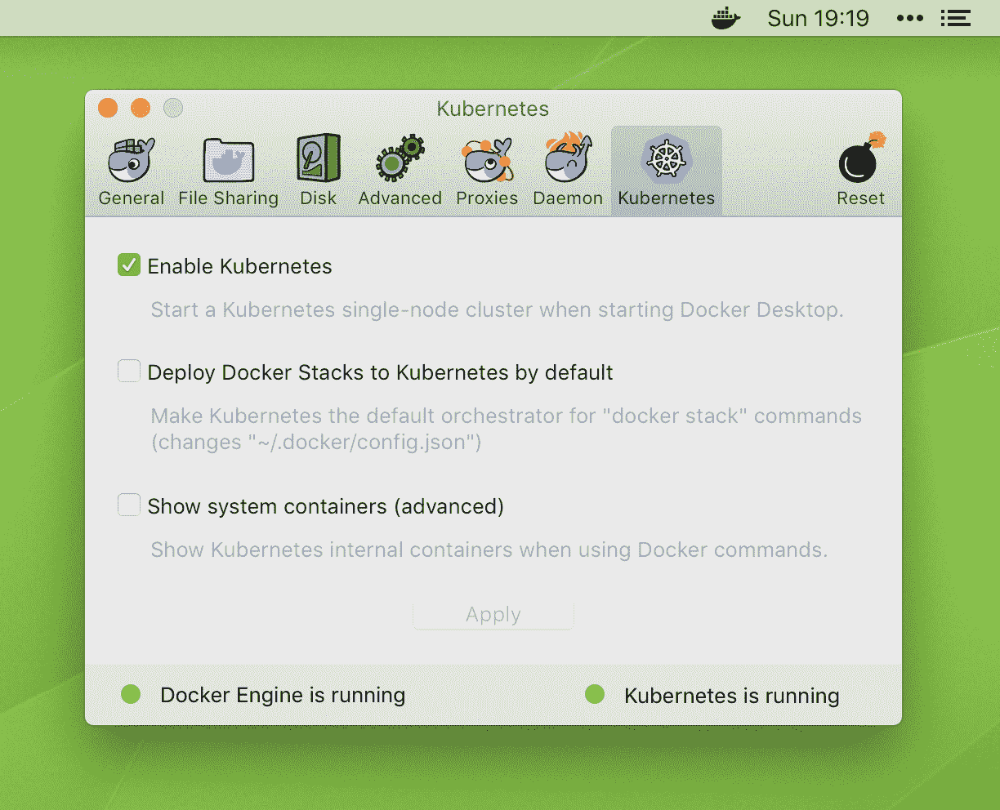
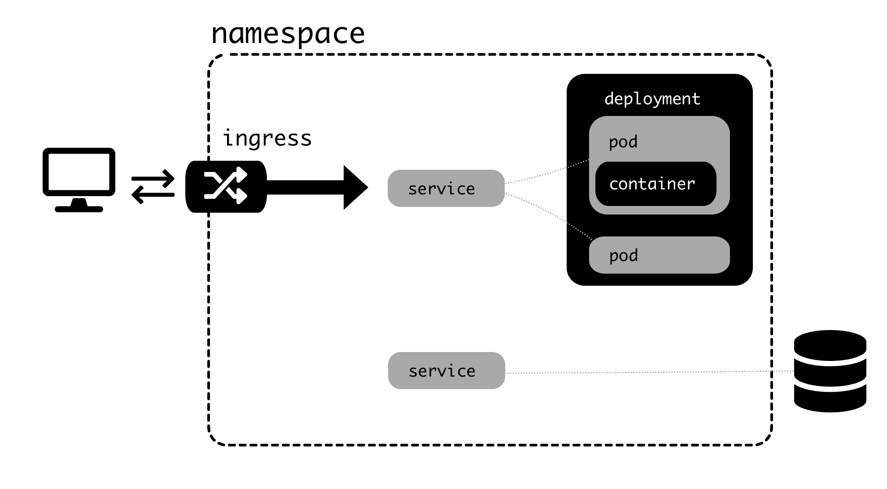

# 第五章：使用 Kubernetes 协调微服务

在本章中，我们将讨论 Kubernetes 背后的基本概念，这是一个允许您管理多个容器并协调它们的工具，从而使已部署在每个容器上的微服务协同工作。

本章将涵盖容器编排器的概念以及特定的 Kubernetes 术语，例如 pod、service、deployment 等之间的区别。我们还将学习如何分析运行中的集群并执行其他常见操作，以便您可以将它们应用于我们的微服务示例。

在本章中，我们将涵盖以下主题：

+   定义 Kubernetes 编排器

+   理解不同的 Kubernetes 元素

+   使用 kubectl 执行基本操作

+   故障排除运行中的集群

在本章结束时，您将了解 Kubernetes 的基本元素，并能够执行基本操作。您还将学习基本的故障排除技能，以便您可以检测可能的问题。

# 技术要求

如果您使用的是 macOS 或 Windows，默认的 Docker 桌面安装可以启动本地 Kubernetes 集群。只需确保在 Kubernetes 的首选项中启用了此功能：



对于 Linux，本地安装 Kubernetes 的最简单方法是使用 k3s（[`k3s.io/`](https://k3s.io/)）。

k3s 是对 Kubernetes（即 k8s）的一种致敬，但是它是其简化版本。

k3s 是 Kubernetes 的一个简化安装，您可以使用它来运行包含在单个二进制文件中的集群。如果您希望下载并运行它，请查看安装页面（[`github.com/rancher/k3s/blob/master/README.md`](https://github.com/rancher/k3s/blob/master/README.md)）。

为了能够使用运行在 k3s 集群内的 Docker 版本，我们需要使用以下代码：

```py
$ # Install k3s
$ curl -sfL https://get.k3s.io | sh -
$ # Restart k3s in docker mode
$ sudo systemctl edit --full k3s.service
# Replace `ExecStart=/usr/local/bin/k3s` with `ExecStart=/usr/local/bin/k3s server --docker`
$ sudo systemctl daemon-reload
$ sudo systemctl restart k3s
$ sudo systemctl enable k3s
$ # Allow access outside of root to KUBECTL config
$ sudo chmod 644 /etc/rancher/k3s/k3s.yaml
$ # Add your user to the docker group, to be able to run docker commands
$ # You may need to log out and log in again for the group to take effect
$ sudo usermod -a -G docker $USER
```

确保安装`kubectl`（k3s 默认安装了一个单独的版本）。安装`kubectl`的步骤可以在[`kubernetes.io/docs/tasks/tools/install-kubectl/`](https://kubernetes.io/docs/tasks/tools/install-kubectl/)找到。`kubectl`命令控制 Kubernetes 操作。

检查上述页面上的说明以添加 Bash 完成，这将允许我们按*Tab*键完成一些命令。

如果一切安装正确，您应该能够使用以下命令检查运行中的 pod：

```py
$ kubectl get pods --all-namespaces
NAMESPACE NAME                                         READY STATUS  RESTARTS AGE
docker    compose-89fb656cf-cw7bb                      1/1   Running 0        1m
docker    compose-api-64d7d9c945-p98r2                 1/1   Running 0        1m
kube-system etcd-docker-for-desktop                    1/1   Running 0        260d
kube-system kube-apiserver-docker-for-desktop          1/1   Running 0        2m
kube-system kube-controller-manager-docker-for-desktop 1/1   Running 0        2m
kube-system kube-dns-86f4d74b45-cgpsj                  3/3   Running 1        260d
kube-system kube-proxy-rm82n                           1/1   Running 0        2m
kube-system kube-scheduler-docker-for-desktop          1/1   Running 0        2m
kube-system kubernetes-dashboard-7b9c7bc8c9-hzpkj      1/1   Running 1        260d
```

注意不同的命名空间。它们都是 Kubernetes 自己创建的默认命名空间。

转到以下页面安装 Ingress 控制器：[`github.com/kubernetes/ingress-nginx/blob/master/docs/deploy/index.md`](https://github.com/kubernetes/ingress-nginx/blob/master/docs/deploy/index.md)。在 Docker 桌面上，您需要运行以下两个命令：

```py
$ kubectl apply -f https://raw.githubusercontent.com/kubernetes/ingress-nginx/master/deploy/static/mandatory.yaml
$ kubectl apply -f https://raw.githubusercontent.com/kubernetes/ingress-nginx/master/deploy/static/provider/cloud-generic.yaml
```

这将创建一个带有控制器 pod 的`ingress-nginx`命名空间。Kubernetes 将使用该 pod 来设置 Ingress 配置。

现在，让我们来看看使用 Kubernetes 的优势。

# 定义 Kubernetes 编排器

Kubernetes 是一种流行的容器编排工具。它允许我们以协调的方式管理和部署多个相互交互的容器。由于每个微服务都存在于单独的容器中，正如我们在第一章中提到的那样，*进行迁移-设计、计划和执行*，它们可以协同工作。

要了解更多关于 Kubernetes 的深入介绍，您可以查看由 Scott McCloud 发布的以下漫画：[`cloud.google.com/kubernetes-engine/kubernetes-comic/`](https://cloud.google.com/kubernetes-engine/kubernetes-comic/)。

Kubernetes 旨在用于生产系统。它旨在能够控制大规模部署并抽象出大部分基础设施的细节。Kubernetes 集群中的每个元素都是以编程方式配置的，Kubernetes 本身根据可用的容量来管理集群的部署位置。

Kubernetes 可以完全使用配置文件进行配置。这使得在出现完全瘫痪导致所有物理服务器宕机的情况下，可以复制集群成为可能。甚至可以在不同的硬件上进行这样的操作，而传统的部署可能会非常困难。

这个例子假设数据被存储和检索；例如，在备份设备中。显然，这可能很困难——灾难恢复总是如此。然而，它简化了许多如果你希望复制一个集群所需的步骤。

鉴于 Kubernetes 使用容器并且很容易安装它们，有一个庞大的容器生态系统可以为 Kubernetes 本身添加功能。最好的例子可能是 Kubernetes 仪表板（[`kubernetes.io/docs/tasks/access-application-cluster/web-ui-dashboard/`](https://kubernetes.io/docs/tasks/access-application-cluster/web-ui-dashboard/)），一个显示 Kubernetes 操作概述的用户界面。它不是默认安装的，但可以以与安装服务相同的方式安装。其他用例的例子包括监控和日志记录。这使得 Kubernetes 非常可扩展。

# 将 Kubernetes 与 Docker Swarm 进行比较

Kubernetes 并不是唯一可用的编排器。正如我们在第三章中提到的，还有`docker-compose`。Docker Compose 也可以编排不同的容器并协调它们，但不涉及多台服务器。

Docker 有一个名为 Docker Swarm 的本机扩展，它允许我们使用一组机器来运行`docker-compose`，同时重用相同的 YAML 文件，但增加了一些细节来描述你希望它们如何运行。

您可以在官方文档中了解更多关于 Docker Swarm 的信息（[`docs.docker.com/engine/swarm/`](https://docs.docker.com/engine/swarm/)）。

与 Kubernetes 相比，Docker Swarm 更容易设置，假设您必须管理服务器。随着您扩展 Docker Compose 的功能，您会发现它的学习曲线很低。

另一方面，Kubernetes 更强大和可定制。它有一个更大的社区和更快的创新步伐。它在处理问题方面也更好。最大的问题是设置一个集群，但正如我们将在第七章中看到的，*配置和保护生产系统*，现在有易于商业部署的方式，我们可以用几分钟的时间创建一个集群，这降低了 Kubernetes 的准入门槛。

这使得 Kubernetes（可以说）在处理从旧系统迁移和展望未来时是更好的解决方案。对于小规模部署，或者如果您需要部署和管理自己的服务器，Docker Swarm 可能是一个有趣的选择。

为了帮助您从使用`docker-compose.yaml`文件转移到使用等效的 Kubernetes YAML 文件，您可以使用`kompose`（[`github.com/kubernetes/kompose`](https://github.com/kubernetes/kompose)）。它可能有助于快速启动一个 Kubernetes 集群，并将`docker-compose.yaml`文件中描述的服务转换为它们等效的 Kubernetes 元素，但两个系统之间总是存在差异，可能需要进行调整。

让我们从描述 Kubernetes 的特定元素和命名方式开始。

# 理解不同的 Kubernetes 元素

Kubernetes 有自己的不同元素的命名方式。我们在本书中经常会使用这些命名方式，Kubernetes 文档也在使用它们。了解它们之间的区别很重要，因为其中一些可能是微妙的。

# 节点

Kubernetes 的主要基础设施元素称为**节点**。Kubernetes 集群由一个或多个节点组成，这些节点是支持其他元素抽象化的物理机器（或虚拟机器）。

每个节点需要能够与其他节点通信，并且它们都在一个容器运行时中运行 - 通常是 Docker，但它们也可以使用其他系统，比如`rktlet`（[`github.com/kubernetes-incubator/rktlet`](https://github.com/kubernetes-incubator/rktlet)）。

节点之间创建了一个网络，将所有发送到集群的请求路由到适当的节点，因此发送到集群中任何节点的任何请求都将得到充分的回答。Kubernetes 将处理哪个可部署元素应该部署到哪个节点，甚至在节点出现问题或资源问题时重新部署节点或将它们从一个节点移动到另一个节点。

节点不一定需要完全相同，当部署特定元素到特定节点时需要一定程度的控制，但通常情况下它们是相同的。

虽然节点是支持集群的支柱，但 Kubernetes 通过定义期望的结果并让 Kubernetes 决定何处放置元素，并确保内部网络通道的请求被发送到适当的服务，帮助抽象化特定节点。

# Kubernetes 控制平面

Kubernetes 控制平面是 Kubernetes 用来正确配置作为 Kubernetes 集群中节点的一部分的一组服务器的所有过程的地方。服务器允许节点相互连接，允许我们监视它们的当前状态，并允许我们根据部署、规模等方面进行必要的更改。

负责注册和进行这些更改的节点称为主节点。可以有多个主节点。

所有这些控制通常在幕后顺利运行。它的网络与其他部分分离，这意味着在这个级别出现问题不会影响集群的当前操作，除了我们无法进行更改。

# Kubernetes 对象

Kubernetes 对象是表示部署在集群中的服务状态的抽象。主要涉及运行容器和这些容器的路由，以及持久存储。

让我们从最小到最大来看不同的元素。这个列表并不详尽；查看 Kubernetes 文档以获取更多细节：

+   **容器**：一个单独的 Docker 容器。这些是 Kubernetes 的构建块，但它们永远不会单独存在。

+   **Pod：**在 Kubernetes 中可以部署的基本单元。Pod 是一个或多个容器的集合，通常来自不同的镜像。通常，一个 Pod 只有一个容器，但有时可能有更多的容器是有用的。同一 Pod 中的所有容器共享相同的 IP 地址（Pod IP），这意味着访问`localhost`端口的容器可能实际上在访问另一个容器。这实际上是与它们通信的推荐方式。

这对你来说一开始可能有点奇怪，但通常，多容器 Pod 将有一个主要容器和执行辅助任务的其他内容，比如导出指标。

+   **ConfigMap**：这定义了一组可以注入到 Pod 中的键值对，通常作为环境变量或文件。这允许我们在不同定义的 Pod 之间共享配置，例如，使所有容器记录调试信息。请注意，Pod 可以有自己的配置，但 ConfigMaps 是一种方便的方式来共享相同的值，以便它们可用于不同的 Pod。

+   **卷**：容器内的文件是临时的，如果容器停止执行，这些文件将丢失。卷是一种持久存储形式，可用于在启动之间保持数据信息并在 pod 中的容器之间共享信息。

作为一个一般原则，尽量减少卷的数量。大多数应用程序本来就应该是无状态的，任何可变数据都应该存储在数据库中。如果同一 pod 中的容器需要通信，最好通过 HTTP 请求进行。请记住，任何不可变数据，例如静态文件，都可以存储在容器镜像中。

+   **部署**：这是一个或多个相同 pod 的分组。部署的定义将说明所需的数量，Kubernetes 将根据定义的策略努力实现这一点。单个部署中的 pod 可以部署到不同的节点，并且通常会这样做。如果任何 pod 被删除、完成或出现任何问题，部署将启动另一个，直到达到定义的数量。

+   **作业**：作业创建一个或多个预期完成的 pod。虽然部署会假设任何完成的 pod 都是问题，并且会启动另一个，但作业会重试，直到满足适当数量的成功。完成的 pod 不会被删除，这意味着我们可以检查它们的日志。作业是一次性执行。还有**定时作业**，将在特定时间运行。

+   **服务**。由于 pod 被创建和重新创建，并且具有不同的 IP，为了允许服务访问它们，服务需要定义其他元素可以使用的名称来发现它。换句话说，它将请求路由到适当的 pod。通常，服务和部署将相关联，服务使部署可访问，并在所有定义的 pod 之间进行轮询。服务还可以用于为外部服务创建内部名称。

Kubernetes 中的服务解决了分布式系统中的一个旧问题，即*服务发现*。当集群中的节点需要知道服务的位置时，即使节点发生变化，也会出现这个问题；也就是说，当我们添加或删除节点时，不会改变所有节点的配置设置。

如果创建一个服务，Kubernetes 将自动执行此操作。

+   **入口**: 虽然服务是内部的，但入口是外部的。它将任何外部请求路由到适当的服务，以便它们可以提供服务。您可以通过主机名定义不同的入口，这样可以确保集群通过请求的目标主机路由到不同的服务，或者根据其路径托管单个入口。在内部，入口被实现为实现入口控制器的容器，默认情况下是`nginx`。

根据您的 Kubernetes 安装，您可能需要安装默认控制器。要安装默认控制器，请按照[`github.com/kubernetes/ingress-nginx/blob/master/docs/deploy/index.md`](https://github.com/kubernetes/ingress-nginx/blob/master/docs/deploy/index.md)上的说明操作。

+   **命名空间**：这是虚拟集群的定义。您可以在同一个物理 Kubernetes 集群中定义多个命名空间。在命名空间下定义的每个名称都需要是唯一的，但另一个命名空间可以使用相同的定义。不同命名空间中的对象无法在内部进行通信，但可以在外部进行通信。

使用非常相似的定义生成不同的命名空间可能是有用的，如果您希望为测试、开发或演示概念等目的创建不同的环境。 Kubernetes 的主要优势在于您可以复制整个系统，并利用这一点创建具有细节上的小改变的类似环境，例如环境的新版本。

对象可以在`.yaml`文件中找到，这些文件可以加载到系统中。单个`.yaml`文件可以定义多个对象，例如，定义包含容器的 pod 的部署。

以下图表总结了可用的不同对象：



作业和卷不存在，但有两个服务可用：一个指向部署，另一个指向外部服务。外部服务针对内部元素，并且不会向外部公开。

# 使用 kubectl 执行基本操作

通过使用`kubectl`，我们可以对所有不同的元素执行操作。我们已经偷偷看了一眼`get`，以了解可用的元素。

有关更多信息和`kubectl`中可用的最常见操作的快速概述，请查看[`kubernetes.io/docs/reference/kubectl/cheatsheet/`](https://kubernetes.io/docs/reference/kubectl/cheatsheet/)上的`kubectl`备忘单。

我们可以使用`kubectl`来`create`一个新元素。例如，要创建和列出命名空间，我们可以使用以下代码：

```py
$ kubectl create namespace example
namespace/example created
$ kubectl get namespaces
NAME        STATUS AGE
default     Active 260d
docker      Active 260d
example     Active 9s
kube-public Active 260d
kube-system Active 260d
```

我们可以创建各种元素，其中一些我们将在本书中介绍。

# 定义元素

命名空间是一个特殊情况，因为它不需要任何配置。要创建新元素，需要创建一个描述该元素的 YAML 文件。例如，我们可以使用 Docker Hub 中的官方 NGINX 镜像创建一个新的 pod：

```py
---
apiVersion: v1
kind: Pod
metadata:
  name: nginx
  namespace: example
spec:
  containers:
    - name: nginx
      image: library/nginx:latest
```

作为最低要求，元素应包含以下内容：

+   元素的 API 版本。

+   元素的类型。

+   元素的名称，以及其命名空间。

+   包括配置详细信息的`spec`部分。对于 pod，我们需要添加必要的容器。

YAML 文件有时可能有点反复无常，特别是涉及缩进和语法时。您可以使用诸如 Kubeval（[`kubeval.instrumenta.dev/`](https://kubeval.instrumenta.dev/)）之类的工具来检查文件是否正确，并且在使用文件之前遵循 Kubernetes 良好实践。

我们将此文件保存为`example_pod.yml`。我们将使用`apply`命令创建它，并使用以下命令监视其运行情况：

```py
$ kubectl apply -f example_pod.yml
pod/nginx created
$ kubectl get pods -n example
NAME  READY STATUS            RESTARTS AGE
nginx 0/1   ContainerCreating 0        2s
$ kubectl get pods -n example
NAME  READY STATUS  RESTARTS AGE
nginx 1/1   Running 0        51s
```

注意使用`-n`参数来确定命名空间。

现在我们可以`exec`进入容器并在其中运行命令。例如，要检查 NGINX 服务器是否正在运行并提供文件，我们可以使用以下代码：

```py
$ kubectl exec -it nginx -n example /bin/bash
root@nginx:/# apt-get update
...
root@nginx:/# apt-get install -y curl
...
root@nginx:/# curl localhost
<!DOCTYPE html>
<html>
<head>
<title>Welcome to nginx!</title>
...
</head>
<body>
<h1>Welcome to nginx!</h1>
<p>If you see this page, the nginx web server is successfully installed and
working. Further configuration is required.</p>

<p>For online documentation and support please refer to
<a href="http://nginx.org/">nginx.org</a>.<br/>
Commercial support is available at
<a href="http://nginx.com/">nginx.com</a>.</p>

<p><em>Thank you for using nginx.</em></p>
</body>
</html>
```

pod 可以以两种方式更改。第一种方法是手动运行`edit`，它会打开您预定义的终端编辑器，以便您可以编辑文件：

```py
$ kubectl edit pod nginx -n example
```

您将看到带有所有默认参数的 pod。这种更改 pod 的方式对于小型测试很有用，但一般来说，最好更改原始的 YAML 文件，以便您可以跟踪发生的更改。例如，我们可以更改 NGINX，以便我们使用其以前的版本：

```py
---
apiVersion: v1
kind: Pod
metadata:
  name: nginx
  namespace: example
spec:
  containers:
    - name: nginx
      image: library/nginx:1.16
```

然后，我们可以再次`apply`这些更改，这将重新启动 pod：

```py
$ kubectl apply -f example_pod.yml
pod/nginx configured
$ kubectl get pods -n example
NAME  READY STATUS  RESTARTS AGE
nginx 1/1   Running 1        36s
```

# 获取更多信息

`get`命令接受更多配置。您可以使用`wide`输出选项检索更多信息：

```py
$ kubectl get pods -n example -o wide
NAME  READY STATUS  RESTARTS AGE IP        NODE
nginx 1/1   Running 1        30m 10.1.0.11 docker-for-desktop
```

如果您进行更改并对此更改产生兴趣，可以使用`-w`参数来监视任何更改。例如，以下代码显示了 pod 的重启结果。此重启是由于对容器图像进行更改而产生的：

```py
$ kubectl get pods -n example -w
NAME  READY STATUS  RESTARTS AGE
nginx 1/1   Running 2        32m
nginx 1/1   Running 3        32m
```

如果您需要有关特定元素的更多信息，可以使用`describe`：

```py
$ kubectl describe pod nginx -n example
Name: nginx
Namespace: example
Node: docker-for-desktop/192.168.65.3
Start Time: Sun, 23 Jun 2019 20:56:23 +0100
Labels: <none>
Annotations: ...
Status: Running
IP: 10.1.0.11
...
Events:
 Type Reason Age From Message
 ---- ------ ---- ---- -------
 Normal Scheduled 40m default-scheduler Successfully assigned nginx to docker-for-desktop
 ...
 Normal Created 4m43s (x5 over 40m) kubelet, docker-for-desktop Created container
 Normal Started 4m43s (x5 over 40m) kubelet, docker-for-desktop Started container
```

这返回了大量信息。最有用的信息通常是关于事件的信息，它将返回有关元素的生命周期的信息。

# 删除元素

`delete`命令删除一个元素及其下的所有内容：

```py
$ kubectl delete namespace example
namespace "example" deleted
$ kubectl get pods -n example
No resources found.
```

请注意，有时删除元素将导致其重新创建。这在通过部署创建 pod 时很常见，因为部署将努力使 pod 的数量达到配置的数量。

# 运行集群故障排除

我们可以用`get`和`describe`命令来排查 Kubernetes 中的问题。

根据我的经验，Kubernetes 运行中最常见的问题是，有时某些 Pod 无法启动。排查步骤如下：

1.  容器镜像是否正确？下载镜像出现问题将显示`ErrImagePull`。这可能是由于无法从注册表下载镜像导致的身份验证问题。

1.  `CrashLoopBackOff`状态表示容器的进程已中断。Pod 将尝试一遍又一遍地重新启动。这通常是由于容器的潜在问题引起的。检查配置是否正确。您可以使用以下命令检查容器的`stdout`日志：

```py
$ kubectl logs <pod> -n <namespace> -c <container>
```

确保容器可运行。尝试使用以下命令手动运行它：

```py
$ docker run <image>
```

1.  Pod 通常不会被外部暴露。这通常是由于暴露它们的服务和/或 Ingress 存在问题。您可以通过使用`exec`进入另一个容器，然后尝试访问服务和 Pod 的内部 IP，通常使用`curl`来检测 Pod 在集群内是否响应。

正如我们之前所看到的，`curl`通常不会默认安装在容器中，因为它们通常只安装了一组最小的工具。不用担心，您可以使用操作系统的软件包管理器安装它，优点是，一旦容器被回收（在正常的 Kubernetes 操作中很快就会发生），它就不会占用任何空间！出于同样的原因，每次需要调试问题时可能都需要安装它。

记住我们讨论过的 Ingress、服务、部署和 Pod 的链条，并从内部向外部查找配置错误的位置。

在排查问题时，请记住，可以通过`exec`命令访问 Pod 和容器，这将允许我们检查运行中的进程、文件等。这类似于访问物理服务器的终端。您可以使用以下代码来执行此操作：

```py
$ kubectl exec -it <pod> -n <namespace> /bin/sh
```

要小心，因为 Kubernetes 集群的性质可能需要您检查一个 Pod 中是否有多个容器运行，如果是这样，您可能需要检查特定的容器。

# 总结

在本章中，我们了解了 Kubernetes 的基本概念，以及如何管理和协调包含我们的微服务的多个容器。

首先，我们介绍了 Kubernetes 的概念以及一些高级优势。然后，我们描述了 Kubernetes 术语中定义集群的不同元素。这既包括物理方面，其中节点是主要的定义元素，也包括抽象方面，如 Pod、部署、服务和 Ingress，这些是我们生成工作集群所需的构建块。

我们描述了`kubectl`以及我们可以使用的常见操作来定义元素和通过 YAML 文件检索信息。我们还描述了在处理 Kubernetes 集群时可能出现的一些常见问题。

在下一章中，我们将定义在 YAML 文件中可以使用的不同选项，以便生成集群，并学习如何为我们的微服务示例生成 Kubernetes 集群。

# 问题

1.  什么是容器编排器？

1.  在 Kubernetes 中，什么是节点？

1.  Pod 和容器之间有什么区别？

1.  工作和 Pod 之间有什么区别？

1.  何时应该添加 Ingress？

1.  什么是命名空间？

1.  我们如何在文件中定义一个 Kubernetes 元素？

1.  `kubectl`的`get`和`describe`命令有什么区别？

1.  `CrashLoopBackOff`错误表示什么？

# 进一步阅读

您可以通过阅读《Kubernetes 入门指南-第三版》（[`www.packtpub.com/eu/virtualization-and-cloud/getting-started-kubernetes-third-edition`](https://www.packtpub.com/eu/virtualization-and-cloud/getting-started-kubernetes-third-edition)）和《完整的 Kubernetes 指南》（[`www.packtpub.com/eu/virtualization-and-cloud/complete-kubernetes-guide`](https://www.packtpub.com/eu/virtualization-and-cloud/complete-kubernetes-guide)）来了解更多关于 Kubernetes 的信息。
