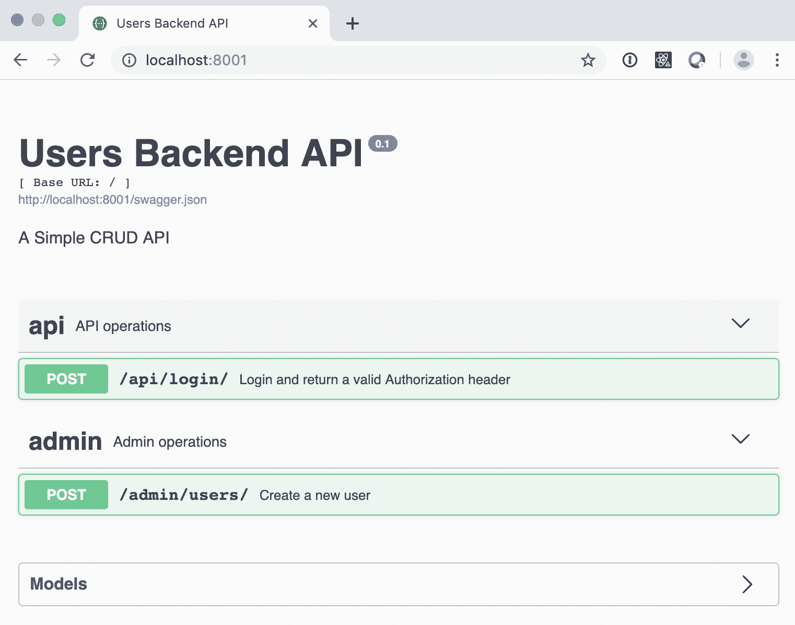
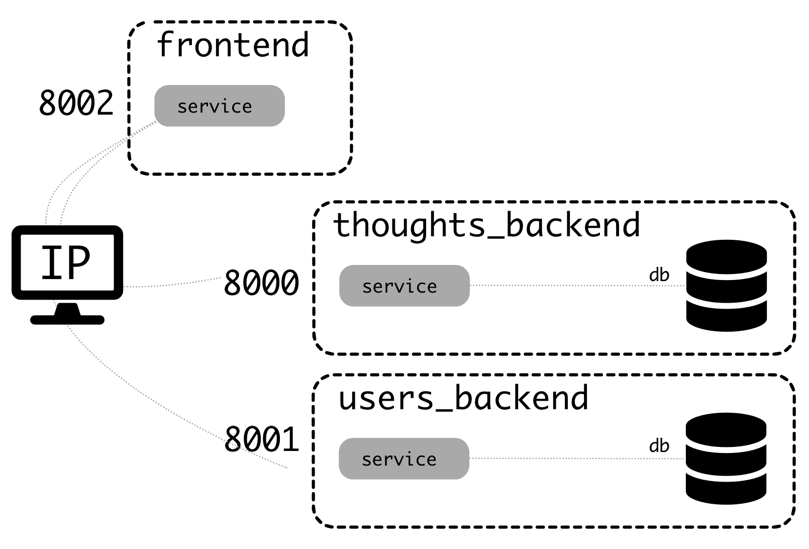
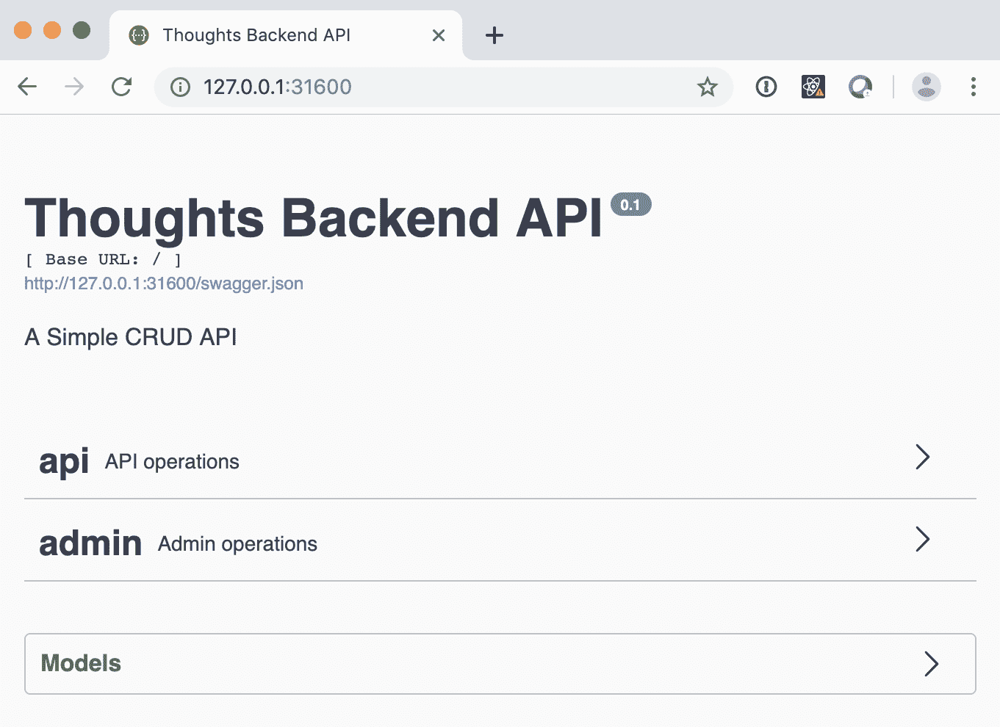
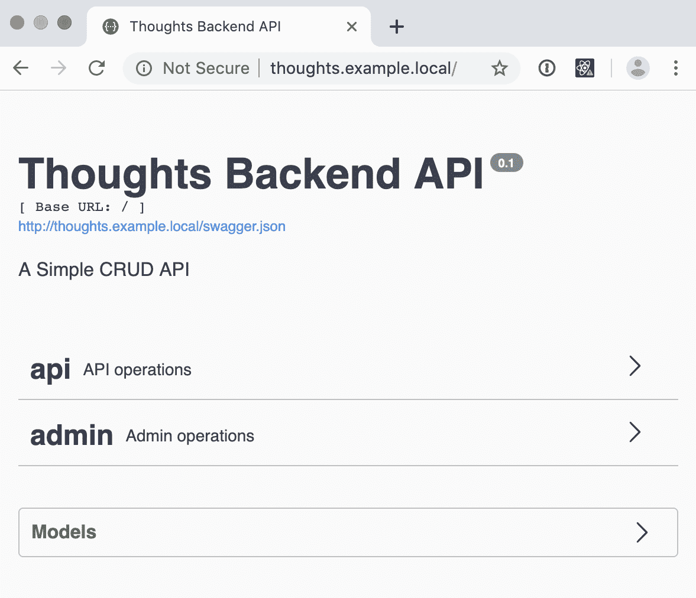
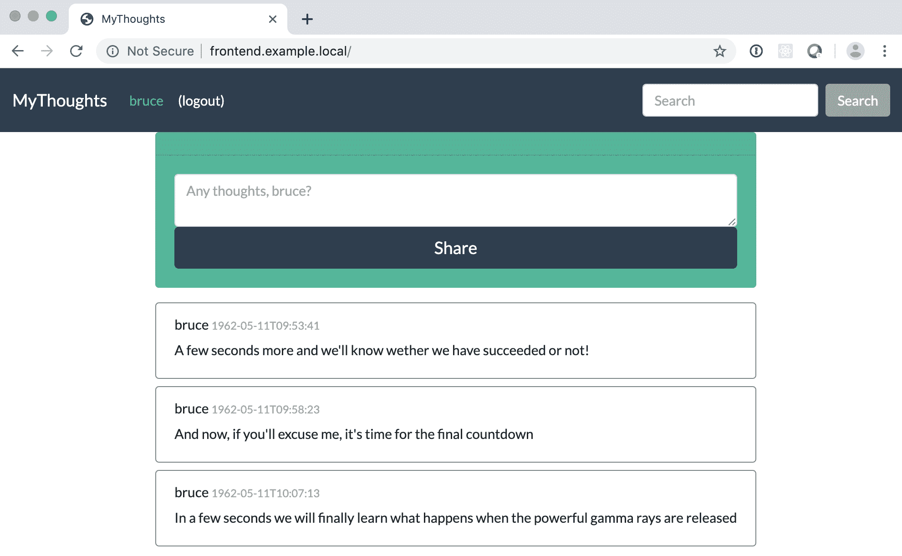

# 第六章：使用 Kubernetes 进行本地开发

在本章中，您将学习如何定义一个集群，部署所有交互式微服务，以及如何在本地进行开发。我们将在前一章介绍的概念基础上进行构建，并描述如何在 Kubernetes 中以实际方式配置整个系统，部署多个微服务，并使其在您自己的本地计算机上作为一个整体运行。

在这里，我们将介绍另外两个微服务：前端和用户后端。它们在第一章中讨论过，在*战略规划以打破单体*部分。我们将在本章中看到它们需要如何配置才能在 Kubernetes 中工作。这是除了第二章中介绍的 Thoughts 后端，*使用 Python 创建 REST 服务*，第三章，*使用 Docker 构建、运行和测试您的服务*，和第四章，*创建管道和工作流*。我们将讨论如何正确配置它们三个，并添加一些其他选项，以确保它们在部署到生产环境后能够顺利运行。

本章将涵盖以下主题：

+   实施多个服务

+   配置服务

+   在本地部署完整系统

到本章结束时，您将拥有一个在本地工作的 Kubernetes 系统，其中三个微服务已部署并作为一个整体运行。您将了解不同元素的工作原理以及如何配置和调整它们。

# 技术要求

对于本章，您需要像前一章中描述的那样运行本地 Kubernetes 实例。记得安装 Ingress 控制器。

您可以在 GitHub 存储库中检查我们将在其中使用的完整代码（[`github.com/PacktPublishing/Hands-On-Docker-for-Microservices-with-Python/tree/master/Chapter06`](https://github.com/PacktPublishing/Hands-On-Docker-for-Microservices-with-Python/tree/master/Chapter06)）。

# 实施多个服务

在 GitHub 存储库中，您可以找到本章中将使用的三个微服务。它们基于第一章中介绍的单体，并分为三个元素：

+   Thoughts 后端：如前一章所述，它处理了 Thoughts 的存储和搜索。

+   用户后端：存储用户并允许他们登录。根据身份验证方法的描述，它创建一个可用于对其他系统进行身份验证的令牌。

+   前端：这来自单体应用，但是不直接访问数据库，而是向用户和 Thoughts 后端发出请求以复制功能。

请注意，尽管我们描述了集群独立提供静态文件的最终阶段，但静态文件仍由前端提供。这是为了简单起见，以避免多余的服务。

上述服务与 Thoughts 后端在第三章中的方式类似进行了 Docker 化，*使用 Docker 构建、运行和测试您的服务*。让我们看看其他微服务的一些细节。

# 描述用户后端微服务

用户后端的代码可以在[`github.com/PacktPublishing/Hands-On-Docker-for-Microservices-with-Python/tree/master/Chapter06/users_backend`](https://github.com/PacktPublishing/Hands-On-Docker-for-Microservices-with-Python/tree/master/Chapter06/users_backend)找到。其结构与 Thoughts 后端非常相似，是一个与 PostgreSQL 数据库通信的 Flask-RESTPlus 应用程序。

它有两个端点，如其 Swagger 接口中所示：



端点如下：

|  | **端点** | **输入** | **返回** |
| --- | --- | --- | --- |
| `POST` | `/api/login` | `{username: <username>, password: <password>}` | `{Authorized: <token header>}` |
| `POST` | `/admin/users` | `{username: <username>, password: <password>}` | `<new_user>` |

`admin`端点允许您创建新用户，登录 API 返回一个有效的标头，可用于 Thoughts Backend。

用户存储在数据库中，具有以下架构：

| **字段** | **格式** | **注释** |
| --- | --- | --- |
| `id` | `Integer` | 主键 |
| `username` | `String (50)` | 用户名 |
| `password` | `String(50)` | 密码以明文存储，这是一个坏主意，但简化了示例 |
| `creation` | `Datetime` | 用户创建时间 |

使用以下代码描述了 SQLAlchemy 模型定义中的此模式：

```py
class UserModel(db.Model):
    id = db.Column(db.Integer, primary_key=True)
    username = db.Column(db.String(50))
    # DO NOT EVER STORE PLAIN PASSWORDS IN DATABASES
    # THIS IS AN EXAMPLE!!!!!
    password = db.Column(db.String(50))
    creation = db.Column(db.DateTime, server_default=func.now())
```

请注意，创建日期会自动存储。还要注意，我们以明文形式存储密码。这是*在生产服务中一个可怕的主意*。您可以查看一篇名为*如何在数据库中存储密码？*的文章（[`www.geeksforgeeks.org/store-password-database/`](https://www.geeksforgeeks.org/store-password-database/)）以获取有关使用盐种加密密码的一般想法。您可以使用`pyscrypt`（[`github.com/ricmoo/pyscrypt`](https://github.com/ricmoo/pyscrypt)）等软件包在 Python 中实现此类结构。

用户*bruce*和*stephen*被添加到`db`示例中，作为示例数据。

# 描述前端微服务

前端代码可以在 GitHub 存储库中找到。它基于 Django 单体应用程序（[`github.com/PacktPublishing/Hands-On-Docker-for-Microservices-with-Python/tree/master/Chapter01/Monolith`](https://github.com/PacktPublishing/Hands-On-Docker-for-Microservices-with-Python/tree/master/Chapter01/Monolith)）介绍于第一章，*进行移动-设计，计划和执行*。

与单体应用程序的主要区别在于不访问数据库。因此，Django ORM 没有用处。它们被替换为对其他后端的 HTTP 请求。为了发出请求，我们使用了 fantastic `requests`库。

例如，`search.py`文件被转换为以下代码，该代码将搜索委托给 Thoughts Backend 微服务。请注意，客户的请求被转换为对`GET /api/thoughts`端点的内部 API 调用。结果以 JSON 格式解码并呈现在模板中：

```py
import requests

def search(request):
    username = get_username_from_session(request)
    search_param = request.GET.get('search')

    url = settings.THOUGHTS_BACKEND + '/api/thoughts/'
    params = {
        'search': search_param,
    }
    result = requests.get(url, params=params)
    results = result.json()

    context = {
        'thoughts': results,
        'username': username,
    }
    return render(request, 'search.html', context)
```

单体等效代码可以在存储库的`Chapter01`子目录中进行比较（[`github.com/PacktPublishing/Hands-On-Docker-for-Microservices-with-Python/blob/master/Chapter01/Monolith/mythoughts/thoughts/search.py`](https://github.com/PacktPublishing/Hands-On-Docker-for-Microservices-with-Python/blob/master/Chapter01/Monolith/mythoughts/thoughts/search.py)）。

请注意，我们通过`requests`库向定义的搜索端点发出`get`请求，结果以`json`格式返回并呈现。

`THOUGTHS_BACKEND`根 URL 来自设置，通常是 Django 的风格。

这个例子很简单，因为没有涉及身份验证。参数从用户界面捕获，然后路由到后端。请求在发送到后端和获取结果后都得到了正确格式化，然后呈现。这是两个微服务共同工作的核心。

一个更有趣的案例是`list_thought`（[`github.com/PacktPublishing/Hands-On-Docker-for-Microservices-with-Python/blob/master/Chapter06/frontend/mythoughts/thoughts/thoughts.py#L18`](https://github.com/PacktPublishing/Hands-On-Docker-for-Microservices-with-Python/blob/master/Chapter06/frontend/mythoughts/thoughts/thoughts.py#L18)）视图。以下代码列出了已登录用户的想法：

```py
def list_thoughts(request):
    username = get_username_from_session(request)
    if not username:
        return redirect('login')

    url = settings.THOUGHTS_BACKEND + '/api/me/thoughts/'
    headers = {
        'Authorization': request.COOKIES.get('session'),
    }
    result = requests.get(url, headers=headers)
    if result.status_code != http.client.OK:
        return redirect('login')

    context = {
        'thoughts': result.json(),
        'username': username,
    }
    return render(request, 'list_thoughts.html', context)
```

在这里，在做任何事情之前，我们需要检查用户是否已登录。这是在 `get_username_from_session` 调用中完成的，它返回 `username` 或 `None`（如果他们未登录）。如果他们未登录，则返回将被重定向到登录屏幕。

由于此端点需要身份验证，因此我们需要将用户的会话添加到请求的 `Authorization` 标头中。用户的会话可以从 `request.COOKIES` 字典中获取。

作为保障，我们需要检查后端返回的状态代码是否正确。对于此调用，任何不是 200（HTTP 调用正确）的结果状态代码都将导致重定向到登录页面。

为了简单和清晰起见，我们的示例服务不处理不同的错误情况。在生产系统中，应该区分错误，其中问题是用户未登录或存在其他类型的用户错误（400 错误），或者后端服务不可用（500 状态码）。

错误处理，如果做得当，是困难的，但值得做好，特别是如果错误帮助用户理解发生了什么。

`get_username_from_session` 函数封装了对 `validate_token_header` 的调用，与上一章介绍的相同：

```py
def get_username_from_session(request):
    cookie_session = request.COOKIES.get('session')
    username = validate_token_header(cookie_session,
                                     settings.TOKENS_PUBLIC_KEY)
    if not username:
        return None

    return username
```

`settings` 文件包含解码令牌所需的公钥。

在本章中，为简单起见，我们直接将密钥复制到 `settings` 文件中。这不适用于生产环境。任何秘密都应通过 Kubernetes 环境配置获取。我们将在接下来的章节中看到如何做到这一点。

环境文件需要指定用户后端和 Thoughts 后端的基本 URL，以便能够连接到它们。

# 连接服务

只有使用 `docker-compose` 才能测试服务是否协同工作。检查 Users 后端和 Thoughts 后端的 `docker-compose.yaml` 文件是否在外部公开了不同的端口。

Thoughts 后端公开端口`8000`，用户后端公开端口`8001`。这允许前端连接到它们（并公开端口`8002`）。此图显示了此系统的工作原理：



您可以看到三个服务是如何隔离的，因为 `docker-compose` 将为它们创建自己的网络以进行连接。两个后端都有自己的容器，充当数据库。

前端服务需要连接到其他服务。服务的 URL 应该添加到 `environment.env` 文件中，并且应该指示具有计算机 IP 的服务。

内部 IP，如 localhost 或`127.0.0.1`，不起作用，因为它在容器内部被解释。您可以通过运行 `ifconfig` 来获取本地 IP。

例如，如果您的本地 IP 是 `10.0.10.3`，则 `environment.env` 文件应包含以下内容：

```py
THOUGHTS_BACKEND_URL=http://10.0.10.3:8000
USER_BACKEND_URL=http://10.0.10.3:8001
```

如果您在浏览器中访问前端服务，它应该连接到其他服务。

一种可能性是生成一个更大的 `docker-compose` 文件，其中包括所有内容。如果所有微服务都在同一个 Git 存储库中，这可能是有意义的，这种技术被称为**monorepo** ([`gomonorepo.org/`](https://gomonorepo.org/))。可能的问题包括保持内部的 `docker-compose` 与单个系统一起工作，并使通用的 `docker-compose` 保持同步，以便自动化测试应该检测到任何问题。

这种结构有点累赘，因此我们可以将其转换为一个适当的 Kubernetes 集群，以便进行本地开发。

# 配置服务

要在 Kubernetes 中配置应用程序，我们需要为每个应用程序定义以下 Kubernetes 对象：

+   **部署**：部署将控制 pod 的创建，因此它们将始终可用。它还将根据镜像创建它们，并在需要时添加配置。Pod 运行应用程序。

+   **Service**：该服务将使 RESTful 请求在集群内部可用，具有简短的名称。这将路由请求到任何可用的 pod。

+   **Ingress**：这使得服务在集群外部可用，因此我们可以从集群外部访问该应用。

在本节中，我们将详细查看 Thoughts Backend 配置作为示例。稍后，我们将看到不同部分是如何连接的。我们创建了一个 Kubernetes 子目录 ([`github.com/PacktPublishing/Hands-On-Docker-for-Microservices-with-Python/tree/master/Chapter06/thoughts_backend/kubernetes`](https://github.com/PacktPublishing/Hands-On-Docker-for-Microservices-with-Python/tree/master/Chapter06/thoughts_backend/kubernetes)) 来存储每个定义的 `.yaml` 文件。

我们将使用 `example` 命名空间，因此请确保它已创建：

```py
$ kubectl create namespace example
```

让我们从第一个 Kubernetes 对象开始。

# 配置部署

对于 Thoughts Backend 部署，我们将部署一个具有两个容器的 pod，一个带有数据库，另一个带有应用程序。这种配置使得在本地工作变得容易，但请记住，重新创建 pod 将重新启动两个容器。

配置文件完全在这里可用 ([`github.com/PacktPublishing/Hands-On-Docker-for-Microservices-with-Python/blob/master/Chapter06/thoughts_backend/kubernetes/deployment.yaml`](https://github.com/PacktPublishing/Hands-On-Docker-for-Microservices-with-Python/blob/master/Chapter06/thoughts_backend/kubernetes/deployment.yaml))，让我们来看看它的不同部分。第一个元素描述了它是什么以及它的名称，以及它所在的命名空间：

```py
---
apiVersion: apps/v1
kind: Deployment
metadata:
    name: thoughts-backend
    labels:
        app: thoughts-backend
    namespace: example
```

然后，我们生成 `spec`。它包含我们应该保留多少个 pod 以及每个 pod 的模板。`selector` 定义了要监视的标签，它应该与模板中的 `labels` 匹配：

```py
spec:
    replicas: 1
    selector:
        matchLabels:
            app: thoughts-backend
```

`template` 部分在其自己的 `spec` 部分中定义了容器：

```py

    template:
        metadata:
            labels:
                app: thoughts-backend
        spec:
            containers:
                - name: thoughts-backend-service
                  ...
                - name: thoughts-backend-db
                  ...
```

`thoughts-backend-db` 更简单。唯一需要的元素是定义容器的名称和镜像。我们需要将拉取策略定义为 `Never`，以指示镜像在本地 Docker 仓库中可用，并且不需要从远程注册表中拉取它：

```py
- name: thoughts-backend-db
  image: thoughts_backend_db:latest
  imagePullPolicy: Never
```

`thoughts-backend-service` 需要定义服务的暴露端口以及环境变量。变量的值是我们在创建数据库时使用的值，除了 `POSTGRES_HOST`，在这里我们有一个优势，即同一 pod 中的所有容器共享相同的 IP：

```py
 - name: thoughts-backend-service
   image: thoughts_server:latest
   imagePullPolicy: Never
   ports:
   - containerPort: 8000
   env:
   - name: DATABASE_ENGINE
     value: POSTGRESQL
   - name: POSTGRES_DB
     value: thoughts
   - name: POSTGRES_USER
     value: postgres
   - name: POSTGRES_PASSWORD
     value: somepassword
   - name: POSTGRES_PORT
     value: "5432"
   - name: POSTGRES_HOST
     value: "127.0.0.1"
```

要在 Kubernetes 中获取部署，需要应用该文件，如下所示：

```py
$ kubectl apply -f thoughts_backend/kubernetes/deployment.yaml
deployment "thoughts-backend" created
```

部署现在已在集群中创建：

```py
$ kubectl get deployments -n example
NAME             DESIRED CURRENT UP-TO-DATE AVAILABLE AGE
thoughts-backend 1       1       1          1         20s
```

这将自动创建 pods。如果 pod 被删除或崩溃，部署将使用不同的名称重新启动它：

```py
$ kubectl get pods -n example
NAME                              READY STATUS  RESTARTS AGE
thoughts-backend-6dd57f5486-l9tgg 2/2   Running 0        1m
```

部署正在跟踪最新的镜像，但除非删除，否则不会创建新的 pod。要进行更改，请确保手动删除 pod，之后它将被重新创建：

```py
$ kubectl delete pod thoughts-backend-6dd57f5486-l9tgg -n example
pod "thoughts-backend-6dd57f5486-l9tgg" deleted
$ kubectl get pods -n example
NAME                              READY STATUS  RESTARTS AGE
thoughts-backend-6dd57f5486-nf2ds 2/2   Running 0        28s
```

该应用程序在集群内部仍然无法被发现，除非通过其特定的 pod 名称引用它，而这个名称可能会改变，因此我们需要为此创建一个服务。

# 配置服务

我们创建了一个 Kubernetes 服务来为创建的部署公开的应用程序创建一个名称。服务可以在 `service.yaml` 文件中进行检查。让我们来看一下：

```py
---
apiVersion: v1
kind: Service
metadata:
    namespace: example
    labels:
        app: thoughts-service
    name: thoughts-service
spec:
    ports:
        - name: thoughts-backend
          port: 80
          targetPort: 8000
    selector:
        app: thoughts-backend
    type: NodePort
```

初始数据类似于部署。`spec` 部分定义了开放端口，将对 `thoughts-backend` 中的容器中的服务的端口 `80` 的访问路由到端口 `8000`，部署的名称。`selector` 部分将所有请求路由到与之匹配的任何 pod。

类型为 `NodePort`，以允许从集群外部访问。这使我们能够检查它是否正常工作，一旦找到外部暴露的 IP：

```py
$ kubectl apply -f kubernetes/service.yaml
service "thoughts-service" configured
$ kubectl get service -n example
NAME CLUSTER-IP EXTERNAL-IP PORT(S) AGE
thoughts-service 10.100.252.250 <nodes> 80:31600/TCP 1m
```

我们可以通过访问所描述的 pod 的本地主机来访问 Thoughts Backend。在这种情况下，`http://127.0.0.1:31600`：



服务为我们提供了内部名称，但是如果我们想要控制它如何在外部暴露，我们需要配置 Ingress。

# 配置 Ingress

最后，我们在`ingress.yaml`中描述 Ingress（[`github.com/PacktPublishing/Hands-On-Docker-for-Microservices-with-Python/blob/master/Chapter06/thoughts_backend/kubernetes/ingress.yaml`](https://github.com/PacktPublishing/Hands-On-Docker-for-Microservices-with-Python/blob/master/Chapter06/thoughts_backend/kubernetes/ingress.yaml)）。文件在此处复制。注意我们如何设置元数据以存储在正确的命名空间中：

```py
---
apiVersion: extensions/v1beta1
kind: Ingress
metadata:
    name: thoughts-backend-ingress
    namespace: example
spec:
    rules:
        - host: thoughts.example.local
          http:
            paths:
              - backend:
                  serviceName: thoughts-service
                  servicePort: 80
                path: /
```

此 Ingress 将使服务在端口`80`上暴露给节点。由于多个服务可以在同一节点上暴露，它们通过主机名进行区分，在本例中为`thoughts.example.local`。

我们使用的 Ingress 控制器只允许在`servicePort`中暴露端口`80`（HTTP）和`443`（HTTPS）。

应用服务后，我们可以尝试访问页面，但是，除非我们将调用指向正确的主机，否则我们将收到 404 错误：

```py
$ kubectl apply -f kubernetes/ingress.yaml
ingress "thoughts-backend-ingress" created
$ kubectl get ingress -n example
NAME                     HOSTS                  ADDRESS  PORTS  AGE
thoughts-backend-ingress thoughts.example.local localhost 80 1m
$ curl http://localhost
<html>
<head><title>404 Not Found</title></head>
<body>
<center><h1>404 Not Found</h1></center>
<hr><center>nginx/1.15.8</center>
</body>
</html>
```

我们需要能够将任何请求指向`thoughts.example.local`到我们的本地主机。在 Linux 和 macOS 中，最简单的方法是更改您的`/etc/hosts`文件，包括以下行：

```py
127.0.0.1 thoughts.example.local
```

然后，我们可以使用浏览器检查我们的应用程序，这次是在`http://thoughts.example.local`（端口`80`）：



定义不同的主机条目允许我们外部访问所有服务，以便能够调整它们并调试问题。我们将以相同的方式定义其余的 Ingresses。

如果在运行`kubectl get ingress -n example`时出现`Connection refused`错误，并且单词`localhost`没有出现，那么您的 Kubernetes 安装没有安装 Ingress 控制器。请仔细检查安装文档[`github.com/kubernetes/ingress-nginx/blob/master/docs/deploy/index.md.`](https://github.com/kubernetes/ingress-nginx/blob/master/docs/deploy/index.md)

所以现在我们在 Kubernetes 中本地部署了一个可工作的应用程序！

# 在本地部署完整系统

我们的每个微服务都可以独立运行，但是要使整个系统工作，我们需要部署这三个（Thoughts 后端、用户后端和前端）并将它们连接在一起。特别是前端需要其他两个微服务正在运行。使用 Kubernetes，我们可以在本地部署它。

要部署完整系统，我们需要先部署用户后端，然后是前端。我们将描述这些系统的每一个，将它们与已部署的 Thoughts 后端相关联，我们之前看到如何部署它。

# 部署用户后端

用户后端文件与 Thoughts 后端非常相似。您可以在 GitHub 存储库中检查它们（[`github.com/PacktPublishing/Hands-On-Docker-for-Microservices-with-Python/tree/master/Chapter06/users_backend/kubernetes`](https://github.com/PacktPublishing/Hands-On-Docker-for-Microservices-with-Python/tree/master/Chapter06/users_backend/kubernetes)）。确保`deployment.yaml`中的环境设置值是正确的：

```py
$ kubectl apply -f users_backend/kubernetes/deployment.yaml
deployment "users-backend" created
$ kubectl apply -f users_backend/kubernetes/service.yaml
service "users-service" created
$ kubectl apply -f users_backend/kubernetes/ingress.yaml
ingress "users-backend-ingress" created
```

记得确保在`/etc/hosts`中包含新的主机名：

```py
127.0.0.1 users.example.local
```

您可以在`http://users.example.local`访问用户后端。

# 添加前端

前端服务和 Ingress 与先前的非常相似。部署略有不同。让我们分三组查看配置：

1.  首先，我们添加关于`namespace`、`name`和`kind`（deployment）的元数据，如下面的代码所示：

```py
---
apiVersion: apps/v1
kind: Deployment
metadata:
    name: frontend
    labels:
        app: frontend
    namespace: example
```

1.  然后，我们使用模板和`replicas`的数量定义`spec`。对于本地系统来说，一个副本就可以了：

```py
spec:
    replicas: 1
    selector:
        matchLabels:
            app: frontend
    template:
        metadata:
            labels:
                app: frontend
```

1.  最后，我们使用容器定义`spec`模板：

```py
        spec:
            containers:
                - name: frontend-service
                  image: thoughts_frontend:latest
                  imagePullPolicy: Never
                  ports:
                     - containerPort: 8000
                  env:
                      - name: THOUGHTS_BACKEND_URL
                        value: http://thoughts-service
                      - name: USER_BACKEND_URL
                        value: http://users-service
```

与先前定义的 Thoughts 后端部署的主要区别在于只有一个容器，而且它上面的环境更简单。

我们将后端 URL 环境定义为服务端点。这些端点在集群内可用，因此它们将被定向到适当的容器。

请记住，`*.example.local`地址仅在您的计算机上可用，因为它们只存在于`/etc/hosts`中。在容器内，它们将不可用。

这适用于本地开发，但另一种选择是拥有一个可以重定向到`127.0.0.1`或类似地址的 DNS 域。

我们应该在`/etc/hosts`文件中添加一个新的域名：

```py
127.0.0.1 frontend.example.local
```

Django 要求您设置`ALLOWED_HOSTS`设置的值，以允许它接受主机名，因为默认情况下它只允许从 localhost 进行连接。有关更多信息，请参阅 Django 文档([`docs.djangoproject.com/en/2.2/ref/settings/#allowed-hosts`](https://docs.djangoproject.com/en/2.2/ref/settings/#allowed-hosts))。为了简化事情，我们可以使用`'*'`来允许任何主机。在 GitHub 上查看代码([`github.com/PacktPublishing/Hands-On-Docker-for-Microservices-with-Python/blob/master/Chapter06/frontend/mythoughts/mythoughts/settings.py#L28`](https://github.com/PacktPublishing/Hands-On-Docker-for-Microservices-with-Python/blob/master/Chapter06/frontend/mythoughts/mythoughts/settings.py#L28))。

在生产中，将主机限制为**完全限定域名**（**FQDN**），主机的完整 DNS 名称是一个良好的做法，但 Kubernetes Ingress 将检查主机头并在不正确时拒绝它。

前端应用程序将像以前一样部署：

```py
$ kubectl apply -f frontend/kubernetes/deployment.yaml
deployment "frontend" created
$ kubectl apply -f frontend/kubernetes/service.yaml
service "frontend-service" created
$ kubectl apply -f frontend/kubernetes/ingress.yaml
ingress "frontend-ingress" created
```

然后我们可以访问整个系统，登录，搜索等。

记住有两个用户，`bruce`和`stephen`。他们的密码与他们的用户名相同。您无需登录即可搜索。

在浏览器中，转到`http://frontend.example.local/`：



恭喜！您拥有一个工作的 Kubernetes 系统，包括不同的部署的微服务。您可以独立访问每个微服务以进行调试或执行操作，例如创建新用户等。

如果需要部署新版本，请使用`docker-compose`构建适当的容器并删除 pod 以强制重新创建它。

# 总结

在本章中，我们看到了如何在 Kubernetes 本地集群中部署我们的微服务，以允许本地开发和测试。在本地计算机上部署整个系统大大简化了开发新功能或调试系统行为的过程。生产环境将非常相似，因此这也为其奠定了基础。

我们首先描述了两个缺失的微服务。用户后端处理用户的身份验证，前端是第一章中介绍的单体的修改版本，*进行移动-设计，计划和执行*，它连接到两个后端。我们展示了如何以`docker-compose`的方式构建和运行它们。

之后，我们描述了如何设置一组`.yaml`文件来在 Kubernetes 中正确配置应用程序。每个微服务都有自己的部署来定义可用的 pod，一个服务来定义一个稳定的访问点，以及一个 Ingress 来允许外部访问。我们对它们进行了详细描述，然后将它们应用到所有的微服务上。

在下一章中，我们将看到如何从本地部署转移到部署准备好生产的 Kubernetes 集群。

# 问题

1.  我们正在部署的三个微服务是什么？

1.  哪个微服务需要其他两个可用？

1.  为什么我们需要在运行`docker-compose`时使用外部 IP 来连接微服务？

1.  每个应用程序所需的主要 Kubernetes 对象是什么？

1.  有哪些对象是不必要的？

1.  如果我们将任何微服务扩展到多个 pod，您能看到任何问题吗？

1.  为什么我们要使用`/etc/hosts`文件？

# 进一步阅读

您可以在书籍《Kubernetes for Developers》（[`www.packtpub.com/eu/virtualization-and-cloud/kubernetes-developers`](https://www.packtpub.com/eu/virtualization-and-cloud/kubernetes-developers)）和《Kubernetes Cookbook - Second Edition》（[`www.packtpub.com/in/virtualization-and-cloud/kubernetes-cookbook-second-edition`](https://www.packtpub.com/in/virtualization-and-cloud/kubernetes-cookbook-second-edition)）中了解更多关于 Kubernetes 的信息。
