# 第七章：配置和保护生产系统

生产（来自生产环境）是描述主要系统的常用名称-为真实客户提供服务的系统。这是公司中可用的主要环境。它也可以被称为**live**。该系统需要在互联网上公开可用，这也使得安全性和可靠性成为重要的优先事项。在本章中，我们将看到如何为生产部署 Kubernetes 集群。

我们将看到如何使用第三方提供商 Amazon Web Services（AWS）来设置一个，以及为什么自己创建是一个坏主意。我们将在这个新部署中部署我们的系统，并将查看如何设置负载均衡器以有序地将流量从旧的单体系统转移到新系统。

我们还将看到如何自动扩展 Kubernetes 集群内的 Pod 和节点，以使资源适应需求。

本章将涵盖以下主题：

+   在野外使用 Kubernetes

+   设置 Docker 注册表

+   创建集群

+   使用 HTTPS 和 TLS 保护外部访问

+   为迁移到微服务做好准备

+   自动扩展集群

+   顺利部署新的 Docker 镜像

我们还将介绍一些良好的实践方法，以确保我们的部署尽可能顺利和可靠地部署。到本章结束时，您将在一个公开可用的 Kubernetes 集群中部署系统。

# 技术要求

我们将在本书中的示例中使用 AWS 作为我们的云供应商。我们需要安装一些实用程序以从命令行进行交互。查看如何在此文档中安装 AWS CLI 实用程序（[`aws.amazon.com/cli/`](https://aws.amazon.com/cli/)）。此实用程序允许从命令行执行 AWS 任务。

为了操作 Kubernetes 集群，我们将使用`eksctl`。查看此文档（[`eksctl.io/introduction/installation/`](https://eksctl.io/introduction/installation/)）以获取安装说明。

您还需要安装`aws-iam-authenticator`。您可以在此处查看安装说明（[`docs.aws.amazon.com/eks/latest/userguide/install-aws-iam-authenticator.html`](https://docs.aws.amazon.com/eks/latest/userguide/install-aws-iam-authenticator.html)）。

本章的代码可以在 GitHub 的此链接找到：[`github.com/PacktPublishing/Hands-On-Docker-for-Microservices-with-Python/tree/master/Chapter07`](https://github.com/PacktPublishing/Hands-On-Docker-for-Microservices-with-Python/tree/master/Chapter07)。

确保您的计算机上安装了`ab`（Apache Bench）。它与 Apache 捆绑在一起，并且在 macOS 和一些 Linux 发行版中默认安装。您可以查看这篇文章：[`www.petefreitag.com/item/689.cfm`](https://www.petefreitag.com/item/689.cfm)。

# 在野外使用 Kubernetes

在部署用于生产的集群时，最好的建议是使用商业服务。所有主要的云提供商（AWS EKS，Google Kubernetes Engine（GKE）和 Azure Kubernetes Service（AKS））都允许您创建托管的 Kubernetes 集群，这意味着唯一需要的参数是选择物理节点的数量和类型，然后通过`kubectl`访问它。

在本书的示例中，我们将使用 AWS，但请查看其他提供商的文档，以确定它们是否更适合您的用例。

Kubernetes 是一个抽象层，因此这种操作方式非常方便。定价类似于支付原始实例以充当节点服务器，并且无需安装和管理 Kubernetes 控制平面，因此实例充当 Kubernetes 节点。

值得再次强调：除非您有非常充分的理由，*不要部署自己的 Kubernetes 集群*；而是使用云提供商的服务。这样做会更容易，并且可以节省大量的维护成本。配置 Kubernetes 节点以实现高性能并实施良好的实践以避免安全问题并不是一件简单的事情。

如果您拥有自己的内部数据中心，则可能无法避免创建自己的 Kubernetes 集群，但在其他任何情况下，直接使用已知云提供商管理的集群更有意义。可能您当前的提供商已经为托管的 Kubernetes 提供了服务！

# 创建 IAM 用户

AWS 使用不同的用户来授予它们多个角色。它们具有不同的权限，使用户能够执行操作。在 AWS 的命名约定中，这个系统称为**身份和访问管理**（**IAM**）。

根据您的设置以及 AWS 在您的组织中的使用方式，创建适当的 IAM 用户可能会相当复杂。查阅文档（[`docs.aws.amazon.com/IAM/latest/UserGuide/id_users_create.html`](https://docs.aws.amazon.com/IAM/latest/UserGuide/id_users_create.html)），并找到负责处理 AWS 的人员，并与他们核实所需的步骤。

让我们看看创建 IAM 用户的步骤：

1.  如果尚未创建具有适当权限的 AWS 用户，则需要创建。确保它能够通过激活程序化访问来访问 API，如下面的屏幕截图所示：

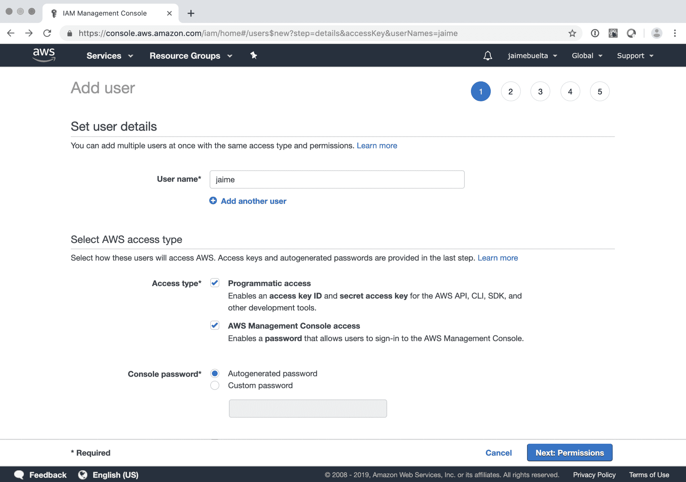

这将显示其访问密钥、秘密密钥和密码。请务必将它们安全地存储起来。

1.  要通过命令行访问，您需要使用 AWS CLI。使用 AWS CLI 和访问信息，配置您的命令行以使用`aws`：

```py
$ aws configure
AWS Access Key ID [None]: <your Access Key>
AWS Secret Access Key [None]: <your Secret Key>
Default region name [us-west-2]: <EKS region>
Default output format [None]:
```

您应该能够通过以下命令获取身份以检查配置是否成功：

```py
$ aws sts get-caller-identity
{
 "UserId": "<Access Key>",
 "Account": "<account ID>",
 "Arn": "arn:aws:iam::XXXXXXXXXXXX:user/jaime"
}
```

现在您可以访问命令行 AWS 操作。

请记住，IAM 用户可以根据需要创建更多密钥，撤销现有密钥等。这通常由负责 AWS 安全的管理员用户处理。您可以在亚马逊文档中阅读更多信息（[`docs.aws.amazon.com/IAM/latest/UserGuide/id_credentials_access-keys.html#Using_CreateAccessKey_API`](https://docs.aws.amazon.com/IAM/latest/UserGuide/id_credentials_access-keys.html#Using_CreateAccessKey_API)）。密钥轮换是一个不错的主意，以确保旧密钥被废弃。您可以通过`aws`客户端界面执行此操作。

我们将使用 Web 控制台进行一些操作，但其他操作需要使用`aws`。

# 设置 Docker 注册表

我们需要能够访问存储要部署的图像的 Docker 注册表。确保 Docker 注册表可访问的最简单方法是使用相同服务中的 Docker 注册表。

您仍然可以使用 Docker Hub 注册表，但是在同一云提供商中使用注册表通常更容易，因为它集成得更好。这也有助于身份验证方面。

我们需要使用以下步骤配置**弹性容器注册表**（**ECR**）：

1.  登录 AWS 控制台并搜索 Kubernetes 或 ECR：

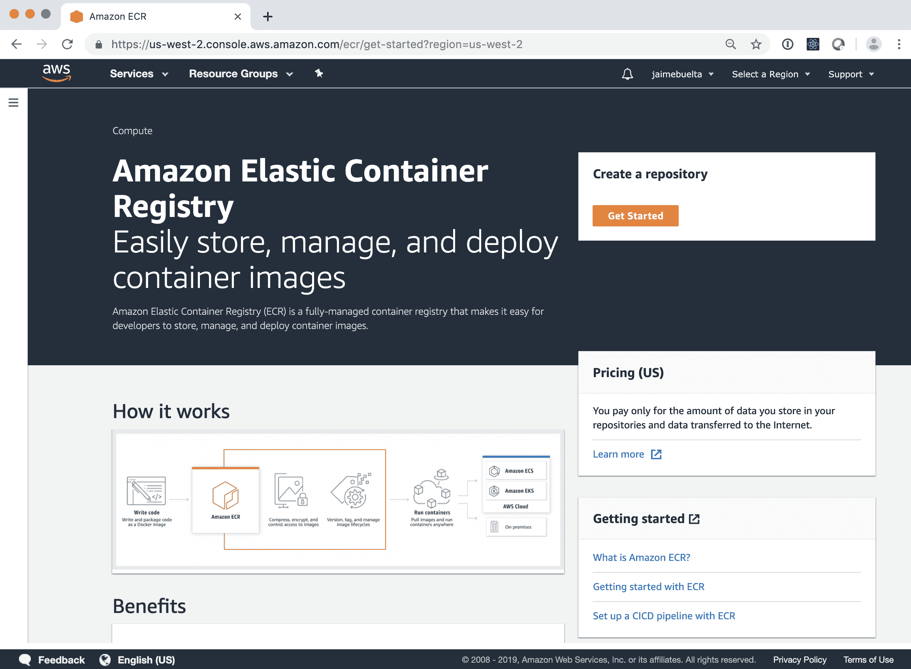

1.  创建名为`frontend`的新注册表。它将创建一个完整的 URL，您需要复制：

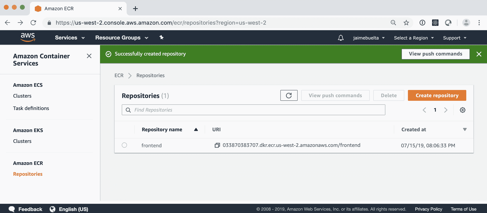

1.  我们需要使本地`docker`登录注册表。请注意，`aws ecr get-login`将返回一个`docker`命令，该命令将使您登录，因此请复制并粘贴：

```py
$ aws ecr get-login --no-include-email
<command>
$ docker login -u AWS -p <token>
Login Succeeded
```

1.  现在我们可以使用完整的注册表名称标记要推送的图像，并将其推送：

```py
$ docker tag thoughts_frontend 033870383707.dkr.ecr.us-west-2.amazonaws.com/frontend
$ docker push 033870383707.dkr.ecr.us-west-2.amazonaws.com/frontend
The push refers to repository [033870383707.dkr.ecr.us-west-2.amazonaws.com/frontend]
...
latest: digest: sha256:21d5f25d59c235fe09633ba764a0a40c87bb2d8d47c7c095d254e20f7b437026 size: 2404
```

1.  镜像已推送！您可以通过在浏览器中打开 AWS 控制台来检查：

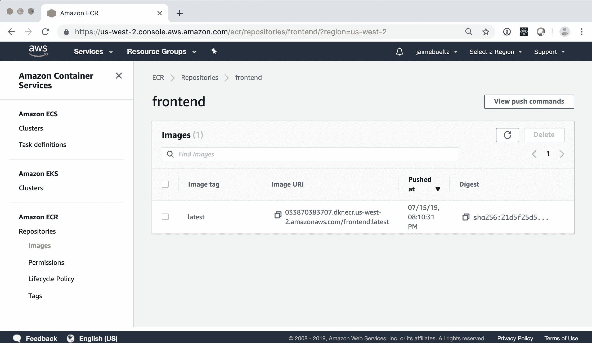

1.  我们需要重复这个过程，以推送用户后端和思想后端。

我们使用两个容器的设置来部署用户后端和想法后端，其中包括一个用于服务，另一个用于易失性数据库。这是为了演示目的而做的，但不会是生产系统的配置，因为数据需要是持久的。

在本章的最后，有一个关于如何处理这种情况的问题。一定要检查一下！

所有不同的注册表都将被添加。您可以在浏览器的 AWS 控制台中查看它们：

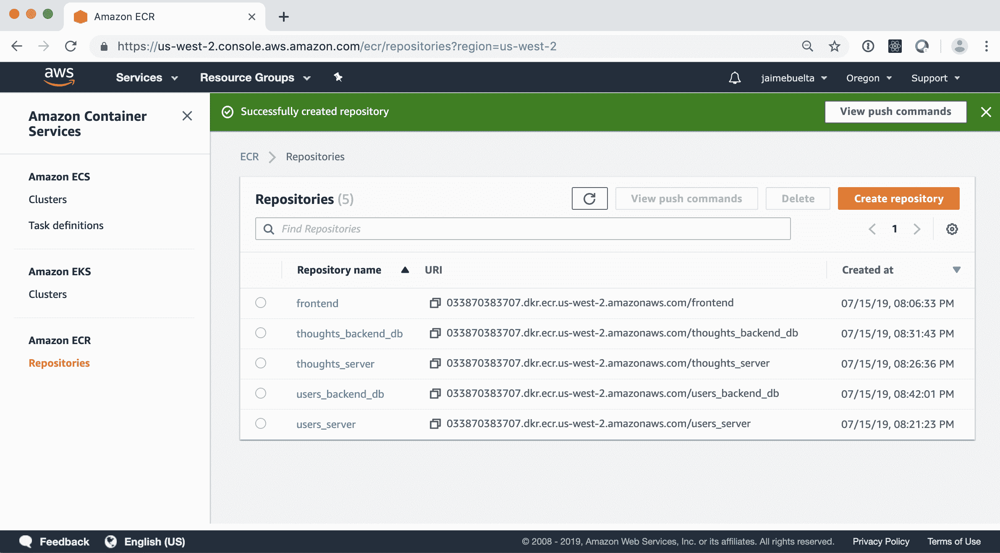

我们的流水线需要适应推送到这些存储库。

在部署中的一个良好的做法是进行一个称为**推广**的特定步骤，其中准备用于生产的镜像被复制到一个特定的注册表，降低了错误地在生产中部署坏镜像的机会。

这个过程可能需要多次进行，以在不同的环境中推广镜像。例如，在一个暂存环境中部署一个版本。运行一些测试，如果它们正确，推广版本，将其复制到生产注册表并标记为在生产环境中部署的好版本。

这个过程可以在不同的提供商中使用不同的注册表进行。

我们需要在我们的部署中使用完整 URL 的名称。

# 创建集群

为了使我们的代码在云中可用并且可以公开访问，我们需要设置一个工作的生产集群，这需要两个步骤：

1.  在 AWS 云中创建 EKS 集群（这使您能够运行在此云集群中操作的`kubectl`命令）。

1.  部署您的服务，使用一组`.yaml`文件，就像我们在之前的章节中看到的那样。这些文件需要进行最小的更改以适应云环境。

让我们来检查第一步。

# 创建 Kubernetes 集群

创建集群的最佳方式是使用`eksctl`实用程序。这将为我们自动化大部分工作，并且允许我们以后进行扩展。

请注意，EKS 只在一些地区可用，而不是所有地区。检查 AWS 区域表（[`aws.amazon.com/about-aws/global-infrastructure/regional-product-services/`](https://aws.amazon.com/about-aws/global-infrastructure/regional-product-services/)）以查看可用的区域。我们将使用俄勒冈（`us-west-2`）地区。

要创建 Kubernetes 集群，让我们采取以下步骤：

1.  首先，检查`eksctl`是否正确安装：

```py
$ eksctl get clusters
No clusters found
```

1.  创建一个新的集群。这将需要大约 10 分钟：

```py
$ eksctl create cluster -n Example
[i] using region us-west-2
[i] setting availability zones to [us-west-2d us-west-2b us-west-2c]
...
[✔]  EKS cluster "Example" in "us-west-2" region is ready

```

1.  这将创建集群。检查 AWS web 界面将显示新配置的元素。

需要添加`--arg-access`选项以创建一个能够自动扩展的集群。这将在*自动扩展集群*部分中进行更详细的描述。

1.  `eksctl create`命令还会添加一个包含有关远程 Kubernetes 集群信息的新上下文，并激活它，因此`kubectl`现在将指向这个新集群。

请注意，`kubectl`有上下文的概念，作为它可以连接的不同集群。您可以通过运行`kubectl config get-contexts`和`kubectl config use-context <context-name>`来查看所有可用的上下文，以更改它们。请查看 Kubernetes 文档（[`kubernetes.io/docs/tasks/access-application-cluster/configure-access-multiple-clusters/`](https://kubernetes.io/docs/tasks/access-application-cluster/configure-access-multiple-clusters/)）以了解如何手动创建新的上下文。

1.  这个命令设置了`kubectl`以正确的上下文来运行命令。默认情况下，它生成一个具有两个节点的集群：

```py
$ kubectl get nodes
NAME                    STATUS ROLES AGE VERSION
ip-X.us-west-2.internal Ready <none> 11m v1.13.7-eks-c57ff8
ip-Y.us-west-2.internal Ready <none> 11m v1.13.7-eks-c57ff8
```

1.  我们可以扩展节点的数量。为了减少资源使用和节省金钱。我们需要检索节点组的名称，它控制节点的数量，然后缩减它：

```py
$ eksctl get nodegroups --cluster Example
CLUSTER NODEGROUP CREATED MIN SIZE MAX SIZE DESIRED CAPACITY INSTANCE TYPE IMAGE ID
Example ng-fa5e0fc5 2019-07-16T13:39:07Z 2 2 0 m5.large ami-03a55127c613349a7
$ eksctl scale nodegroup --cluster Example --name ng-fa5e0fc5 -N 1
[i] scaling nodegroup stack "eksctl-Example-nodegroup-ng-fa5e0fc5" in cluster eksctl-Example-cluster
[i] scaling nodegroup, desired capacity from to 1, min size from 2 to 1
```

1.  您可以通过`kubectl`联系集群并正常进行操作：

```py
$ kubectl get svc
NAME TYPE CLUSTER-IP EXTERNAL-IP PORT(S) AGE
kubernetes ClusterIP 10.100.0.1 <none> 443/TCP 7m31s
```

集群已经设置好了，我们可以从命令行上对其进行操作。

创建 EKS 集群可以以许多方式进行调整，但是 AWS 在访问、用户和权限方面可能会变化无常。例如，集群喜欢有一个 CloudFormation 规则来处理集群，并且所有元素应该由相同的 IAM 用户创建。与您组织中负责基础架构定义的任何人核对，以确定正确的配置是什么。不要害怕进行测试，集群可以通过`eksctl`配置或 AWS 控制台快速删除。

此外，`eksctl`会在不同的可用区（AWS 同一地理区域内的隔离位置）中创建集群节点，以尽量减少因 AWS 数据中心出现问题而导致整个集群宕机的风险。

# 配置云 Kubernetes 集群

下一阶段是在 EKS 集群上运行我们的服务，以便在云中可用。我们将使用`.yaml`文件作为基础，但需要进行一些更改。

查看 GitHub `Chapter07`（[`github.com/PacktPublishing/Hands-On-Docker-for-Microservices-with-Python/tree/master/Chapter07`](https://github.com/PacktPublishing/Hands-On-Docker-for-Microservices-with-Python/tree/master/Chapter07)）子目录中的文件。

我们将看到与上一章中的 Kubernetes 配置文件的不同，然后在*部署系统*部分部署它们。

# 配置 AWS 镜像注册表

第一个区别是我们需要将镜像更改为完整的注册表，以便集群使用 ECS 注册表中可用的镜像。

请记住，您需要在 AWS 内部指定注册表，以便 AWS 集群可以正确访问它。

例如，在`frontend/deployment.yaml`文件中，我们需要以这种方式定义它们：

```py
containers:
- name: frontend-service
  image: XXX.dkr.ecr.us-west-2.amazonaws.com/frontend:latest
  imagePullPolicy: Always
```

镜像应该从 AWS 注册表中拉取。拉取策略应更改为强制从集群中拉取。

在创建`example`命名空间后，您可以通过应用文件在远程服务器上部署：

```py
$ kubectl create namespace example
namespace/example created
$ kubectl apply -f frontend/deployment.yaml
deployment.apps/frontend created
```

过一会儿，部署会创建 pod：

```py
$ kubectl get pods -n example
NAME                      READY STATUS  RESTARTS AGE
frontend-58898587d9-4hj8q 1/1   Running 0        13s
```

现在我们需要更改其余的元素。所有部署都需要适应包括正确注册表。

在 GitHub 上检查所有`deployment.yaml`文件的代码。

# 配置使用外部可访问负载均衡器

第二个区别是使前端服务可以在外部访问，以便互联网流量可以访问集群。

这很容易通过将服务从`NodePort`更改为`LoadBalancer`来完成。检查`frontend/service.yaml`文件：

```py
apiVersion: v1
kind: Service
metadata:
    namespace: example
    labels:
        app: frontend-service
    name: frontend-service
spec:
    ports:
        - name: frontend
          port: 80
          targetPort: 8000
    selector:
        app: frontend
    type: LoadBalancer
```

这将创建一个可以外部访问的新**弹性负载均衡器**（**ELB**）。现在，让我们开始部署。

# 部署系统

整个系统可以从`Chapter07`子目录中部署，使用以下代码：

```py
$ kubectl apply --recursive -f .
deployment.apps/frontend unchanged
ingress.extensions/frontend created
service/frontend-service created
deployment.apps/thoughts-backend created
ingress.extensions/thoughts-backend-ingress created
service/thoughts-service created
deployment.apps/users-backend created
ingress.extensions/users-backend-ingress created
service/users-service created
```

这些命令会迭代地通过子目录并应用任何`.yaml`文件。

几分钟后，您应该看到一切都正常运行：

```py
$ kubectl get pods -n example
NAME                              READY STATUS  RESTARTS AGE
frontend-58898587d9-dqc97         1/1   Running 0        3m
thoughts-backend-79f5594448-6vpf4 2/2   Running 0        3m
users-backend-794ff46b8-s424k     2/2   Running 0        3m
```

要获取公共访问点，您需要检查服务：

```py
$ kubectl get svc -n example
NAME             TYPE         CLUSTER-IP EXTERNAL-IP AGE
frontend-service LoadBalancer 10.100.152.177 a28320efca9e011e9969b0ae3722320e-357987887.us-west-2.elb.amazonaws.com 3m
thoughts-service NodePort 10.100.52.188 <none> 3m
users-service    NodePort 10.100.174.60 <none> 3m
```

请注意，前端服务有一个外部 ELB DNS 可用。

如果您在浏览器中输入该 DNS，可以访问服务如下：

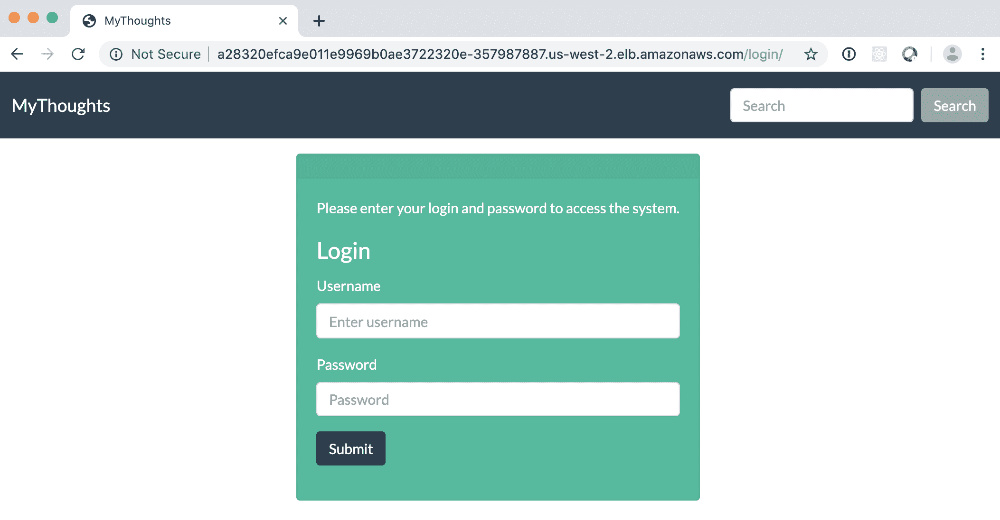

恭喜，您拥有自己的云 Kubernetes 服务。服务可访问的 DNS 名称不太好，因此我们将看到如何添加注册的 DNS 名称并在 HTTPS 端点下公开它。

# 使用 HTTPS 和 TLS 保护外部访问

为了向客户提供良好的服务，您的外部端点应通过 HTTPS 提供。这意味着您和客户之间的通信是私密的，不能在网络路由中被窃听。

HTTPS 的工作原理是服务器和客户端加密通信。为了确保服务器是他们所说的那样，需要有一个由授予 DNS 已验证的权威颁发的 SSL 证书。

请记住，HTTPS 的目的不是服务器本身是可信的，而是客户端和服务器之间的通信是私密的。服务器仍然可能是恶意的。这就是验证特定 DNS 不包含拼写错误的重要性。

您可以在这本奇妙的漫画中获取有关 HTTPS 如何运作的更多信息：[`howhttps.works/`](https://howhttps.works/)。

获取外部端点的证书需要两个阶段：

+   您拥有特定的 DNS 名称，通常是通过从域名注册商购买获得的。

+   您通过认可的**证书颁发机构**（**CA**）获得 DNS 名称的唯一证书。 CA 必须验证您控制 DNS 名称。

为了促进 HTTPS 的使用，非营利性组织*Let's Encrypt*（[`letsencrypt.org`](https://letsencrypt.org)）提供有效期为 60 天的免费证书。这将比通过云服务提供商获得证书更费力，但如果资金紧张，这可能是一个选择。

这些天，这个过程非常容易通过云服务提供商来完成，因为它们可以同时充当两者，简化流程。

需要通过 HTTPS 进行通信的重要元素是我们网络的边缘。我们自己的微服务在内部网络中进行通信时不需要使用 HTTPS，HTTP 就足够了。但它需要是一个不受公共干扰的私有网络。

按照我们的例子，AWS 允许我们创建并将证书与 ELB 关联，以 HTTP 提供流量。

让 AWS 提供 HTTPS 流量可以确保我们使用最新和最安全的安全协议，例如**传输层安全性**（**TLS**）v1.3（撰写时的最新版本），但也保持与旧协议的向后兼容性，例如 SSL。

换句话说，默认情况下使用最安全的环境是最佳选择。

设置 HTTPS 的第一步是直接从 AWS 购买 DNS 域名，或将控制权转移到 AWS。这可以通过他们的 Route 53 服务完成。您可以在[`aws.amazon.com/route53/`](https://aws.amazon.com/route53/)上查看文档。

严格来说，不需要将您的 DNS 转移到亚马逊，只要您可以将其指向外部 ELB，但这有助于集成和获取证书。在创建证书时，您需要证明自己拥有 DNS 记录，使用 AWS 可以简化此过程，因为他们会为他们控制的 DNS 记录创建证书。请查看[`docs.aws.amazon.com/acm/latest/userguide/gs-acm-validate-dns.html`](https://docs.aws.amazon.com/acm/latest/userguide/gs-acm-validate-dns.html)上的文档。

要在 ELB 上启用 HTTPS 支持，请查看以下步骤：

1.  转到 AWS 控制台中的监听器：

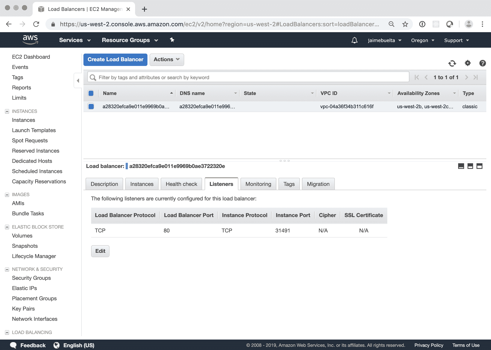

1.  单击“编辑”并添加 HTTPS 支持的新规则：

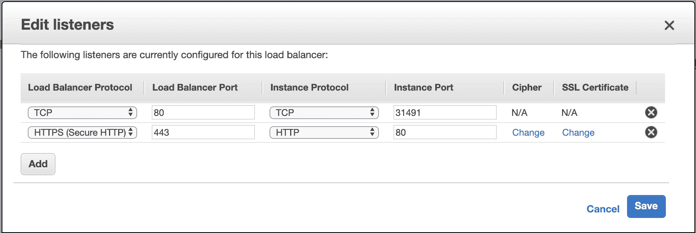

1.  如您所见，它将需要 SSL 证书。单击“更改”以进行管理：

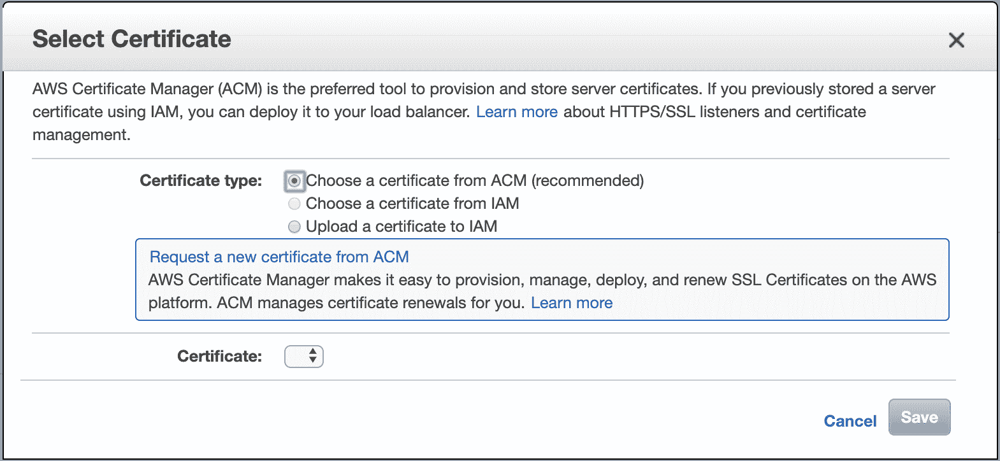

1.  从这里，您可以添加现有证书或从亚马逊购买证书。

务必查看亚马逊负载均衡器的文档。有几种类型的 ELB 可供使用，根据您的用例，一些 ELB 具有与其他 ELB 不同的功能。例如，一些新的 ELB 能够在客户端请求 HTTP 数据时重定向到 HTTPS。请查看[`aws.amazon.com/elasticloadbalancing/`](https://aws.amazon.com/elasticloadbalancing/)上的文档。

恭喜，现在您的外部端点支持 HTTPS，确保您与客户的通信是私密的。

# 准备好迁移到微服务

为了在进行迁移时顺利运行，您需要部署一个负载均衡器，它可以让您快速在后端之间切换并保持服务运行。

正如我们在第一章中讨论的那样，*进行移动-设计、计划和执行*，HAProxy 是一个很好的选择，因为它非常灵活，并且有一个很好的 UI，可以让您通过单击网页上的按钮快速进行操作。它还有一个出色的统计页面，可以让您监视服务的状态。

AWS 有一个名为**应用负载均衡器**（**ALB**）的 HAProxy 替代方案。这是 ELB 的功能丰富更新，允许您将不同的 HTTP 路径路由到不同的后端服务。

HAProxy 具有更丰富的功能集和更好的仪表板与之交互。它也可以通过配置文件进行更改，这有助于控制更改，正如我们将在第八章中看到的那样，*使用 GitOps 原则*。

显然，只有在所有服务都在 AWS 上可用时才能使用，但在这种情况下，它可能是一个很好的解决方案，因为它将更简单并且更符合技术堆栈的其余部分。查看文档：[`aws.amazon.com/blogs/aws/new-aws-application-load-balancer/`](https://aws.amazon.com/blogs/aws/new-aws-application-load-balancer/)。

要在服务前部署负载均衡器，我建议不要在 Kubernetes 上部署它，而是以与传统服务相同的方式运行它。这种类型的负载均衡器将是系统的关键部分，消除不确定性对于成功运行是很重要的。它也是一个相对简单的服务。

请记住，负载均衡器需要正确复制，否则它将成为单点故障。亚马逊和其他云提供商允许您设置 ELB 或其他类型的负载均衡器，以便将流量平衡在它们之间。

举例来说，我们创建了一个示例配置和`docker-compose`文件来快速运行它，但配置可以按照团队最舒适的方式进行设置。

# 运行示例

代码可在 GitHub 上找到（[`github.com/PacktPublishing/Hands-On-Docker-for-Microservices-with-Python/tree/master/Chapter07/haproxy`](https://github.com/PacktPublishing/Hands-On-Docker-for-Microservices-with-Python/tree/master/Chapter07/haproxy)）。我们从 Docker Hub 中的 HAProxy Docker 镜像继承（[`hub.docker.com/_/haproxy/`](https://hub.docker.com/_/haproxy/)），添加我们自己的配置文件。

让我们来看看配置文件`haproxy.cfg`中的主要元素：

```py
frontend haproxynode
    bind *:80
    mode http
    default_backend backendnodes

backend backendnodes
    balance roundrobin
    option forwardfor
    server aws a28320efca9e011e9969b0ae3722320e-357987887
               .us-west-2.elb.amazonaws.com:80 check
    server example www.example.com:80 check

listen stats
    bind *:8001
    stats enable
    stats uri /
    stats admin if TRUE
```

我们定义了一个前端，接受任何端口`80`的请求，并将请求发送到后端。后端将请求平衡到两个服务器，`example`和`aws`。基本上，`example`指向`www.example.com`（您的旧服务的占位符），`aws`指向先前创建的负载均衡器。

我们在端口`8001`上启用统计服务器，并允许管理员访问。

`docker-compose`配置启动服务器，并将本地端口转发到容器端口`8000`（负载均衡器）和`8001`（统计）。使用以下命令启动它：

```py
$ docker-compose up --build proxy
...
```

现在我们可以访问`localhost:8000`，它将在`thoughts`服务和 404 错误之间交替。

通过这种方式调用`example.com`时，我们正在转发主机请求。这意味着我们发送一个请求，请求`Host:localhost`到`example.com`，它返回一个 404 错误。请确保检查您的服务，所有后端都接受相同的主机信息。

打开统计页面查看设置：

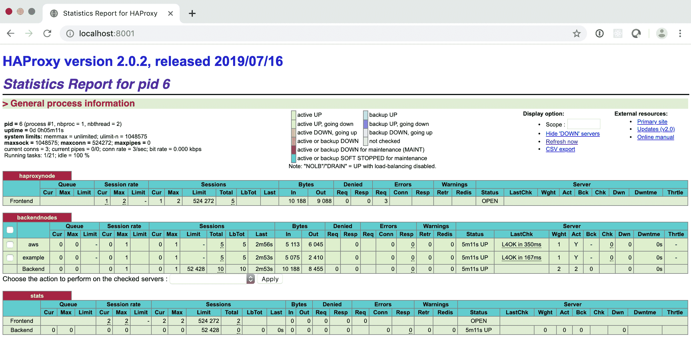

检查后端节点中的`aws`和`example`条目。还有很多有趣的信息，比如请求数量、最后连接、数据等等。

您可以在检查`example`后端时执行操作，然后在下拉菜单中将状态设置为 MAINT。应用后，`example`后端将处于维护模式，并从负载均衡器中移除。统计页面如下：

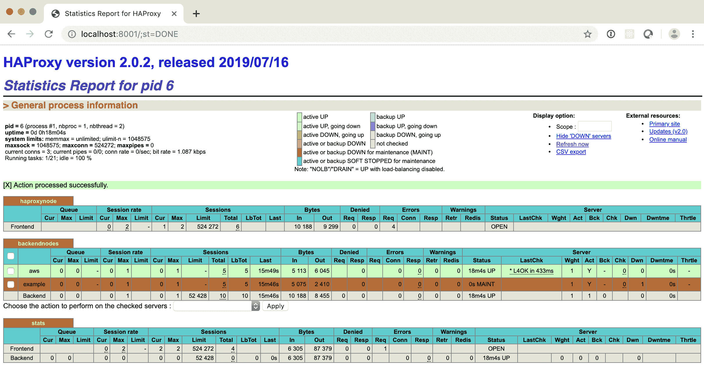

现在在`localhost:8000`中访问负载均衡器只会返回**thoughts**前端。您可以重新启用后端，将其设置为 READY 状态。

有一种称为 DRAIN 的状态，它将停止新会话进入所选服务器，但现有会话将继续。这在某些配置中可能很有趣，但如果后端真正是无状态的，直接转移到 MAINT 状态就足够了。

HAProxy 也可以配置使用检查来确保后端可用。在示例中，我们添加了一个被注释的检查，它发送一个 HTTP 命令来检查返回。

```py
option httpchk HEAD / HTTP/1.1\r\nHost:\ example.com
```

检查将对两个后端相同，因此需要成功返回。默认情况下，它将每隔几秒运行一次。

您可以在[`www.haproxy.org/`](http://www.haproxy.org/)上查看完整的 HAProxy 文档。有很多可以配置的细节。与您的团队跟进，确保像超时、转发标头等区域的配置是正确的。

健康检查的概念也用于 Kubernetes，以确保 Pod 和容器准备好接受请求并保持稳定。我们将在下一节中看到如何确保正确部署新镜像。

# 平稳部署新的 Docker 镜像

在生产环境中部署服务时，确保其能够平稳运行以避免中断服务至关重要。

Kubernetes 和 HAProxy 能够检测服务是否正常运行，并在出现问题时采取行动，但我们需要提供一个充当健康检查的端点，并配置它以定期被 ping，以便及早发现问题。

为简单起见，我们将使用根 URL 作为健康检查，但我们可以设计特定的端点进行测试。一个良好的健康检查应该检查服务是否按预期工作，但是轻便快速。避免过度测试或执行外部验证，这可能会使端点花费很长时间。

返回空响应的 API 端点是一个很好的例子，因为它检查整个管道系统是否正常工作，但回答非常快。

在 Kubernetes 中，有两个测试来确保 Pod 正常工作，即就绪探针和活动探针。

# 活动探针

活动探针检查容器是否正常工作。它是在容器中启动的返回正确的进程。如果返回错误（或更多，取决于配置），Kubernetes 将终止容器并重新启动。

活动探针将在容器内执行，因此需要有效。对于 Web 服务，添加`curl`命令是一个好主意：

```py
spec:
  containers:
  - name: frontend-service
    livenessProbe:
      exec:
        command:
        - curl
        - http://localhost:8000/
        initialDelaySeconds: 5
        periodSeconds: 30
```

虽然有一些选项，比如检查 TCP 端口是否打开或发送 HTTP 请求，但运行命令是最通用的选项。它也可以用于调试目的。请参阅文档以获取更多选项。

要小心对活动探针过于激进。每次检查都会给容器增加一些负载，因此根据负载情况，多个探针可能会导致杀死更多的容器。

如果您的服务经常被活动探针重新启动，要么探针太过激进，要么容器数量负载过高，或者两者兼而有之。

该探针配置为等待五秒，然后每 30 秒运行一次。默认情况下，连续三次失败的检查后，将重新启动容器。

# 就绪探针

就绪探针检查容器是否准备好接受更多请求。这是一个不那么激进的版本。如果测试返回错误或超时，容器不会重新启动，而只会被标记为不可用。

就绪探针通常用于避免过早接受请求，但它会在启动后运行。一个智能的就绪探针可以标记容器何时达到最大容量，无法接受更多请求，但通常配置类似于活跃探针的探针就足够了。

就绪探针在部署配置中定义，方式与活跃探针相同。让我们来看一下：

```py
spec:
  containers:
  - name: frontend-service
    readinessProbe:
      exec:
        command:
        - curl
        - http://localhost:8000/
        initialDelaySeconds: 5
        periodSeconds: 10
```

就绪探针应该比活跃探针更积极，因为结果更安全。这就是为什么`periodSeconds`更短。根据您的特定用例，您可能需要两者或者不需要，但就绪探针是启用滚动更新所必需的，接下来我们将看到。

示例代码中的`frontend/deployment.yaml`部署包括了两个探针。查看 Kubernetes 文档（[`kubernetes.io/docs/tasks/configure-pod-container/configure-liveness-readiness-startup-probes/`](https://kubernetes.io/docs/tasks/configure-pod-container/configure-liveness-readiness-startup-probes/)）以获取更多详细信息和选项。

请注意，这两个探针用于不同的目标。就绪探针延迟请求的输入，直到 Pod 准备就绪，而活跃探针有助于处理卡住的容器。

延迟的活跃探针返回将重新启动 Pod，因此负载的增加可能会产生重新启动 Pod 的级联效应。相应地进行调整，并记住两个探针不需要重复相同的命令。

就绪探针和活跃探针都帮助 Kubernetes 控制 Pod 的创建方式，这影响了部署的更新。

# 滚动更新

默认情况下，每次我们更新部署的镜像时，Kubernetes 部署将重新创建容器。

通知 Kubernetes 新版本可用并不足以将新镜像推送到注册表，即使标签相同。您需要更改部署`.yaml`文件中`image`字段中描述的标签。

我们需要控制图像的变化方式。为了不中断服务，我们需要执行滚动更新。这种更新方式会添加新的容器，等待它们就绪，将它们添加到池中，并移除旧的容器。这种部署比移除所有容器并重新启动它们要慢一些，但它允许服务不中断。

如何执行这个过程可以通过调整部署中的`strategy`部分来配置：

```py
spec:
    replicas: 4
    strategy:
      type: RollingUpdate
      rollingUpdate:
        maxUnavailable: 25%
        maxSurge: 1
```

让我们了解这段代码：

+   `strategy`和`type`可以是`RollingUpdate`（默认）或`Recreate`，后者会停止现有的 Pod 并创建新的 Pod。

+   `maxUnavailable`定义了更改期间不可用的最大 Pod 数量。这定义了新容器将被添加和旧容器将被移除的速度。它可以被描述为一个百分比，就像我们的例子，或者是一个固定的数字。

+   `maxSurge`定义了可以在期望 Pod 的限制之上创建的额外 Pod 的数量。这可以是一个特定的数字或者是总数的百分比。

+   当我们将`replicas`设置为`4`时，在两种情况下的结果都是一个 Pod。这意味着在更改期间，最多可以有一个 Pod 不可用，并且我们将逐个创建新的 Pod。

更高的数字将使更新速度更快，但会消耗更多资源（`maxSurge`）或在更新期间更积极地减少可用资源（`maxUnavailable`）。

对于少量的副本，要保守并在您对流程更加熟悉并且有更多资源时增加数量。

最初，手动扩展 Pod 将是最简单和最好的选择。如果流量变化很大，有高峰和低谷，那么自动扩展集群可能是值得的。

# 自动扩展集群

我们之前已经看到了如何为服务更改 Pod 的数量，以及如何添加和移除节点。这可以自动化地描述一些规则，允许集群弹性地改变其资源。

请记住，自动缩放需要调整以适应您的特定用例。如果资源利用率随时间发生很大变化，例如，如果某些小时的活动比其他小时多得多，或者如果有一种病毒元素意味着服务意外地将请求增加了 10 倍，那么这是一种使用技术。

如果您对服务器的使用量很小，并且利用率相对恒定，可能没有必要添加自动缩放。

集群可以在两个不同的方面自动扩展或缩小：

+   在 Kubernetes 配置中，pod 的数量可以自动增加或减少。

+   节点的数量可以在 AWS 中自动增加或减少。

pod 的数量和节点的数量都需要保持一致，以允许自然增长。

如果 pod 的数量增加而没有添加更多的硬件（节点），Kubernetes 集群将没有更多的容量，只是在不同分布中分配了相同的资源。

如果节点数量增加而没有创建更多的 pod，那么在某个时候，额外的节点将没有 pod 可分配，导致资源利用不足。另一方面，任何新添加的节点都会有相关成本，因此我们希望能够正确地使用它。

要能够自动缩放 pod，请确保它是可扩展的。要确保 pod 是可扩展的，请检查它是否是无状态的 Web 服务，并从外部源获取所有信息。

请注意，在我们的代码示例中，前端 pod 是可扩展的，而 Thoughts 和 Users Backend 不可扩展，因为它们包括自己的数据库容器，应用程序连接到该容器。

创建一个新的 pod 会创建一个新的空数据库，这不是预期的行为。这是有意为之的，以简化示例代码。预期的生产部署是，如前所述，连接到外部数据库。

Kubernetes 配置和 EKS 都具有根据规则更改 pod 和节点数量的功能。

# 创建 Kubernetes 水平 Pod 自动缩放器

在 Kubernetes 术语中，用于增加和减少 pod 的服务称为**水平 Pod 自动缩放器**（**HPA**）。

这是因为它需要一种检查测量以进行缩放的方法。要启用这些指标，我们需要部署 Kubernetes 度量服务器。

# 部署 Kubernetes 度量服务器

Kubernetes 度量服务器捕获内部低级别的指标，如 CPU 使用率，内存等。HPA 将捕获这些指标并使用它们来调整资源。

Kubernetes 度量服务器不是向 HPA 提供指标的唯一可用服务器，还可以定义其他度量系统。当前可用适配器的列表可在 Kubernetes 度量项目中找到（[`github.com/kubernetes/metrics/blob/master/IMPLEMENTATIONS.md#custom-metrics-api`](https://github.com/kubernetes/metrics/blob/master/IMPLEMENTATIONS.md#custom-metrics-api)）。

这允许定义自定义指标作为目标。首先从默认指标开始，只有在特定部署存在真正限制时才转移到自定义指标。

要部署 Kubernetes 度量服务器，请从官方项目页面下载最新版本（[`github.com/kubernetes-incubator/metrics-server/releases`](https://github.com/kubernetes-incubator/metrics-server/releases)）。写作时，版本为`0.3.3`。

下载`tar.gz`文件，写作时为`metrics-server-0.3.3.tar.gz`。解压缩并将版本应用到集群：

```py
$ tar -xzf metrics-server-0.3.3.tar.gz
$ cd metrics-server-0.3.3/deploy/1.8+/
$ kubectl apply -f .
clusterrole.rbac.authorization.k8s.io/system:aggregated-metrics-reader created
clusterrolebinding.rbac.authorization.k8s.io/metrics-server:system:auth-delegator created
rolebinding.rbac.authorization.k8s.io/metrics-server-auth-reader created
apiservice.apiregistration.k8s.io/v1beta1.metrics.k8s.io created
serviceaccount/metrics-server created
deployment.extensions/metrics-server created
service/metrics-server created
clusterrole.rbac.authorization.k8s.io/system:metrics-server created
clusterrolebinding.rbac.authorization.k8s.io/system:metrics-server created
```

您将在`kube-system`命名空间中看到新的 pod：

```py
$ kubectl get pods -n kube-system
NAME                            READY STATUS  RESTARTS AGE
...
metrics-server-56ff868bbf-cchzp 1/1   Running 0        42s
```

您可以使用`kubectl top`命令获取有关节点和 pod 的基本信息：

```py
$ kubectl top node
NAME                    CPU(cores) CPU% MEM(bytes) MEMORY%
ip-X.us-west-2.internal 57m        2%   547Mi      7%
ip-Y.us-west-2.internal 44m        2%   534Mi      7%
$ kubectl top pods -n example
$ kubectl top pods -n example
NAME                              CPU(cores) MEMORY(bytes)
frontend-5474c7c4ff-d4v77         2m         51Mi
frontend-5474c7c4ff-dlq6t         1m         50Mi
frontend-5474c7c4ff-km2sj         1m         51Mi
frontend-5474c7c4ff-rlvcc         2m         51Mi
thoughts-backend-79f5594448-cvdvm 1m         54Mi
users-backend-794ff46b8-m2c6w     1m         54Mi
```

为了正确控制使用量的限制，我们需要在部署中配置分配和限制资源。

# 在部署中配置资源

在容器的配置中，我们可以指定所请求的资源以及它们的最大资源。

它们都向 Kubernetes 提供有关容器的预期内存和 CPU 使用情况的信息。在创建新容器时，Kubernetes 将自动将其部署到具有足够资源覆盖的节点上。

在`frontend/deployment.yaml`文件中，我们包括以下`resources`实例：

```py
spec:
    containers:
    - name: frontend-service
      image: 033870383707.dkr.ecr.us-west-2
                 .amazonaws.com/frontend:latest
      imagePullPolicy: Always
      ...
      resources:
          requests:
              memory: "64M"
              cpu: "60m"
          limits:
              memory: "128M"
              cpu: "70m"
```

最初请求的内存为 64 MB，0.06 个 CPU 核心。

内存资源也可以使用 Mi 的平方，相当于兆字节（*1000²*字节），称为 mebibyte（*2²⁰*字节）。在任何情况下，差异都很小。您也可以使用 G 或 T 来表示更大的数量。

CPU 资源是以分数形式衡量的，其中 1 表示节点运行的任何系统中的一个核心（例如，AWS vCPU）。请注意，1000m，表示 1000 毫核心，相当于一个完整的核心。

限制为 128 MB 和 0.07 个 CPU 核心。容器将无法使用超过限制的内存或 CPU。

目标是获得简单的整数以了解限制和所请求的资源。不要期望第一次就完美无缺；应用程序将改变它们的消耗。

以聚合方式测量指标，正如我们将在第十一章中讨论的那样，*处理系统中的变化、依赖关系和机密*，将帮助您看到系统的演变并相应地进行调整。

限制为自动缩放器创建了基准，因为它将以资源的百分比来衡量。

# 创建 HPA

要创建一个新的 HPA，我们可以使用`kubectl autoscale`命令：

```py
$ kubectl autoscale deployment frontend --cpu-percent=10 --min=2 --max=8 -n example
horizontalpodautoscaler.autoscaling/frontend autoscaled
```

这将创建一个新的 HPA，它以`example`命名空间中的`frontend`部署为目标，并设置要在`2`和`8`之间的 Pod 数量。要缩放的参数是 CPU，我们将其设置为可用 CPU 的 10%，并在所有 Pod 中平均。如果超过了，它将创建新的 Pod，如果低于，它将减少它们。

10%的限制用于触发自动缩放器并进行演示。

自动缩放器作为一种特殊类型的 Kubernetes 对象工作，可以查询它：

```py
$ kubectl get hpa -n example
NAME     REFERENCE           TARGETS  MIN MAX REPLICAS AGE
frontend Deployment/frontend 2%/10%   2   8   4        80s
```

请注意，目标显示当前约为 2%，接近限制。这是为了小型可用 CPU 而设计的，将具有相对较高的基线。

几分钟后，副本的数量将减少，直到达到最小值`2`。

缩容可能需要几分钟。这通常是预期的行为，扩容比缩容更积极。

为了创建一些负载，让我们使用应用程序 Apache Bench（`ab`），并与前端中专门创建的端点结合使用大量 CPU：

```py
$ ab -n 100 http://<LOADBALANCER>.elb.amazonaws.com/load
Benchmarking <LOADBALANCER>.elb.amazonaws.com (be patient)....
```

请注意，`ab`是一个方便的测试应用程序，可以同时生成 HTTP 请求。如果愿意，您也可以在浏览器中多次快速点击 URL。

请记住添加负载均衡器 DNS，如在*创建集群*部分中检索到的。

这将在集群中生成额外的 CPU 负载，并使部署扩展：

```py
NAME     REFERENCE           TARGETS MIN MAX REPLICAS AGE
frontend Deployment/frontend 47%/10% 2   8   8        15m
```

请求完成后，几分钟后，Pod 的数量将缓慢缩减，直到再次达到两个 Pod。

但是我们需要一种方式来扩展节点，否则我们将无法增加系统中的资源总数。

# 扩展集群中节点的数量

EKS 集群中作为节点工作的 AWS 实例的数量也可以增加。这为集群增加了额外的资源，并使其能够启动更多的 Pod。

支持这一功能的底层 AWS 服务是自动扩展组。这是一组共享相同镜像并具有定义大小的 EC2 实例，包括最小和最大实例。

在任何 EKS 集群的核心，都有一个控制集群节点的自动扩展组。请注意，`eksctl`将自动扩展组创建并公开为节点组：

```py
$ eksctl get nodegroup --cluster Example
CLUSTER NODEGROUP   MIN  MAX  DESIRED INSTANCE IMAGE ID
Example ng-74a0ead4 2    2    2       m5.large ami-X
```

使用`eksctl`，我们可以手动扩展或缩小集群，就像我们创建集群时描述的那样。

```py
$ eksctl scale nodegroup --cluster Example --name ng-74a0ead4 --nodes 4
[i] scaling nodegroup stack "eksctl-Example-nodegroup-ng-74a0ead4" in cluster eksctl-Example-cluster
[i] scaling nodegroup, desired capacity from to 4, max size from 2 to 4
```

这个节点组也可以在 AWS 控制台中看到，在 EC2 | 自动缩放组下：

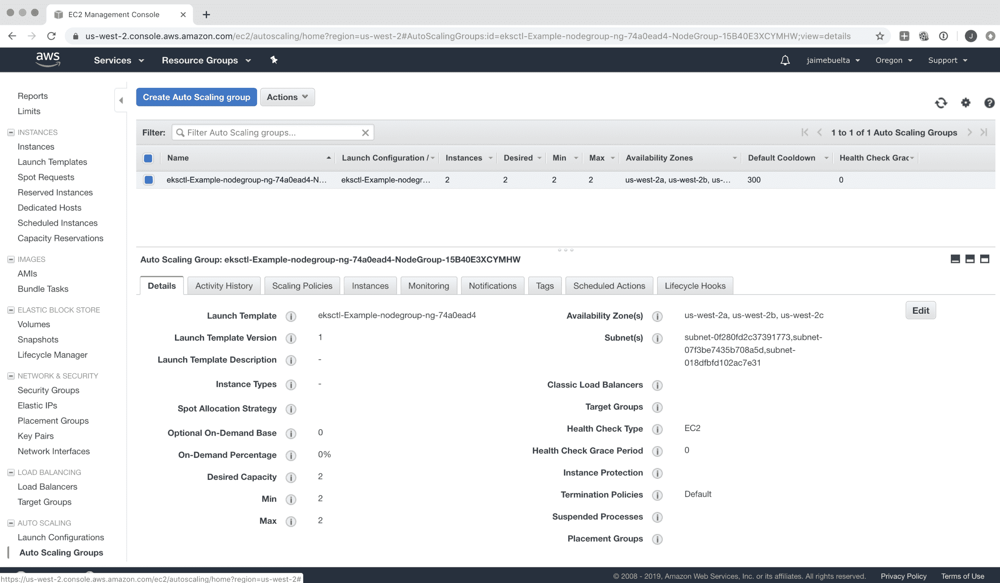

在 Web 界面中，我们可以收集有关自动缩放组的一些有趣信息。活动历史选项卡允许您查看任何扩展或缩小事件，监控选项卡允许您检查指标。

大部分处理都是由`eksctl`自动创建的，比如实例类型和 AMI-ID（实例上的初始软件，包含操作系统）。它们应该主要由`eksctl`控制。

如果需要更改实例类型，`eksctl`要求您创建一个新的节点组，移动所有的 pod，然后删除旧的。您可以在`eksctl`文档中了解更多关于这个过程的信息。

但是从 Web 界面，很容易编辑缩放参数并为自动缩放添加策略。

通过 Web 界面更改参数可能会使`eksctl`中检索的数据混乱，因为它是独立设置的。

可以为 AWS 安装 Kubernetes 自动缩放器，但需要一个`secrets`配置文件，其中包括在自动缩放器 pod 中添加适当的 AMI 的 AWS 权限。

在代码中以 AWS 术语描述自动缩放策略也可能会令人困惑。Web 界面使这变得更容易一些。好处是你可以在配置文件中描述一切，这些文件可以在源代码控制下。

在这里，我们将使用 Web 界面配置，但您可以按照[`eksctl.io/usage/autoscaling/`](https://eksctl.io/usage/autoscaling/)上的说明进行操作。

对于缩放策略，有两个主要的组件可以创建：

+   **定时操作**：这些是在定义的时间发生的扩展和缩小事件。该操作可以通过所需数量和最小和最大数量的组合来改变节点的数量，例如，在周末增加集群。操作可以定期重复，例如每天或每小时。操作还可以有一个结束时间，这将使值恢复到先前定义的值。这可以在系统中预期额外负载时提供几个小时的提升，或者在夜间减少成本。

+   **缩放策略**：这些策略是在特定时间查找需求并在所描述的数字之间扩展或缩小实例的策略。有三种类型的策略：目标跟踪、阶梯缩放和简单缩放。目标跟踪是最简单的，因为它监视目标（通常是 CPU 使用率）并根据需要扩展和缩小以保持接近该数字。另外两种策略需要您使用 AWS CloudWatch 指标系统生成警报，这更强大，但也需要使用 CloudWatch 和更复杂的配置。

节点的数量不仅可以增加，还可以减少，这意味着删除节点。

# 删除节点

删除节点时，正在运行的 pod 需要移动到另一个节点。Kubernetes 会自动处理这个操作，EKS 会以安全的方式执行该操作。

如果节点由于任何原因关闭，例如意外的硬件问题，也会发生这种情况。正如我们之前所看到的，集群是在多个可用区创建的，以最小化风险，但如果 Amazon 的一个可用区出现问题，一些节点可能会出现问题。

Kubernetes 是为这种问题而设计的，因此在意外情况下很擅长将 pod 从一个节点移动到另一个节点。

将一个 pod 从一个节点移动到另一个节点是通过销毁该 pod 并在新节点上重新启动来完成的。由于 pod 受部署控制，它们将保持副本或自动缩放值所描述的适当数量的 pod。

请记住，Pod 本质上是不稳定的，应设计成可以被销毁和重新创建。

扩展还可以导致现有的 Pod 移动到其他节点以更好地利用资源，尽管这种情况较少。增加节点数量通常是在增加 Pod 数量的同时进行的。

控制节点的数量需要考虑要遵循的策略，以实现最佳结果，具体取决于要求。

# 设计一个成功的自动缩放策略

正如我们所看到的，Pod 和节点两种自动缩放需要相互关联。保持节点数量减少可以降低成本，但会限制可用于增加 Pod 数量的资源。

请记住，自动缩放是一个大量数字的游戏。除非您有足够的负载变化来证明其必要性，否则调整它将产生成本节省，这与开发和维护过程的成本不可比。对预期收益和维护成本进行成本分析。

在处理集群大小变化时，优先考虑简单性。在夜间和周末缩减规模可以节省大量资金，而且比生成复杂的 CPU 算法来检测高低要容易得多。

请记住，自动缩放并不是与云服务提供商降低成本的唯一方法，可以与其他策略结合使用。

例如，在 AWS 中，预订 EC2 实例一年或更长时间可以大大减少账单。它们可以用于集群基线，并与更昂贵的按需实例结合使用进行自动缩放，从而额外降低成本：[`aws.amazon.com/ec2/pricing/reserved-instances/`](https://aws.amazon.com/ec2/pricing/reserved-instances/)。

通常情况下，您应该有额外的硬件可用于扩展 Pod，因为这样更快。这在不同的 Pod 以不同的速度扩展的情况下是允许的。根据应用程序的不同，当一个服务的使用量增加时，另一个服务的使用量可能会减少，这将保持利用率在相似的数字。

这可能不是您首先想到的用例，但例如，在夜间安排的任务可能会利用白天被外部请求使用的可用资源。

它们可以在不同的服务中工作，随着负载从一个服务转移到另一个服务而自动平衡。

一旦头部空间减少，就开始扩展节点。始终留出安全余地，以避免陷入节点扩展不够快，由于资源不足而无法启动更多的 Pod 的情况。

Pod 自动缩放器可以尝试创建新的 Pod，如果没有可用资源，它们将不会启动。同样，如果删除了一个节点，任何未删除的 Pod 可能由于资源不足而无法启动。

请记住，我们在部署的`resources`部分向 Kubernetes 描述了新 Pod 的要求。确保那里的数字表明了 Pod 所需的数字。

为了确保 Pod 在不同节点上充分分布，您可以使用 Kubernetes 的亲和性和反亲和性规则。这些规则允许定义某种类型的 Pod 是否应在同一节点上运行。

例如，这对于确保各种 Pod 均匀分布在区域中，或者确保两个服务始终部署在同一节点以减少延迟非常有用。

您可以在这篇博客文章中了解有关亲和性和如何进行配置的更多信息：[`supergiant.io/blog/learn-how-to-assign-pods-to-nodes-in-kubernetes-using-nodeselector-and-affinity-features/`](https://supergiant.io/blog/learn-how-to-assign-pods-to-nodes-in-kubernetes-using-nodeselector-and-affinity-features/)，以及在 Kubernetes 官方配置中（[`kubernetes.io/docs/concepts/configuration/assign-pod-node/`](https://kubernetes.io/docs/concepts/configuration/assign-pod-node/)）。

总的来说，Kubernetes 和`eksctl`默认情况下对大多数应用程序都能很好地工作。仅在高级配置时使用此建议。

# 总结

在本章中，我们看到了如何将 Kubernetes 集群应用到生产环境中，并在云提供商（在本例中是 AWS）中创建 Kubernetes 集群。我们看到了如何设置我们的 Docker 注册表，使用 EKS 创建集群，并调整现有的 YAML 文件，使其适用于该环境。

请记住，尽管我们以 AWS 为例，但我们讨论的所有元素都可以在其他云提供商中使用。查看它们的文档，看看它们是否更适合您。

我们还看到了如何部署 ELB，以便集群对公共接口可用，并如何在其上启用 HTTPS 支持。

我们讨论了部署的不同元素，以使集群更具弹性，并顺利部署新版本，不中断服务——既可以通过使用 HAProxy 快速启用或禁用服务，也可以确保以有序方式更改容器映像。

我们还介绍了自动缩放如何帮助合理利用资源，并允许您覆盖系统中的负载峰值，既可以通过创建更多的 pod，也可以通过在需要时向集群添加更多的 AWS 实例来增加资源，并在不需要时将其删除以避免不必要的成本。

在下一章中，我们将看到如何使用 GitOps 原则控制 Kubernetes 集群的状态，以确保对其进行的任何更改都经过适当审查和捕获。

# 问题

1.  管理自己的 Kubernetes 集群的主要缺点是什么？

1.  您能否列举一些具有托管 Kubernetes 解决方案的商业云提供商的名称？

1.  有没有什么操作需要您执行才能推送到 AWS Docker 注册表？

1.  我们使用什么工具来设置 EKS 集群？

1.  在本章中，我们对先前章节的 YAML 文件进行了哪些主要更改？

1.  在本章中，有哪些 Kubernetes 元素在集群中是不需要的？

1.  为什么我们需要控制与 SSL 证书相关的 DNS？

1.  活跃探针和就绪探针之间有什么区别？

1.  为什么在生产环境中滚动更新很重要？

1.  自动缩放 pod 和节点有什么区别？

1.  在本章中，我们部署了自己的数据库容器。在生产中，这将发生变化，因为需要连接到已经存在的外部数据库。您将如何更改配置以实现这一点？

# 进一步阅读

要了解更多关于如何使用 AWS 的网络能力的信息，您可以查看书籍*AWS Networking Cookbook* ([`www.packtpub.com/eu/virtualization-and-cloud/aws-networking-cookbook`](https://www.packtpub.com/eu/virtualization-and-cloud/aws-networking-cookbook))。要了解如何确保在 AWS 中设置安全系统，请阅读*AWS: Security Best Practices on AWS* ([`www.packtpub.com/eu/virtualization-and-cloud/aws-security-best-practices-aws`](https://www.packtpub.com/eu/virtualization-and-cloud/aws-security-best-practices-aws))。
