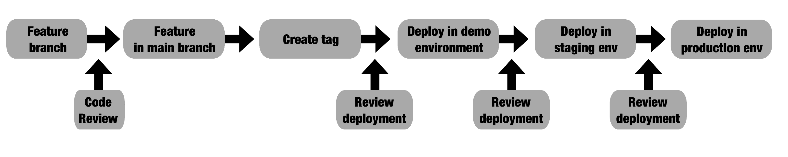
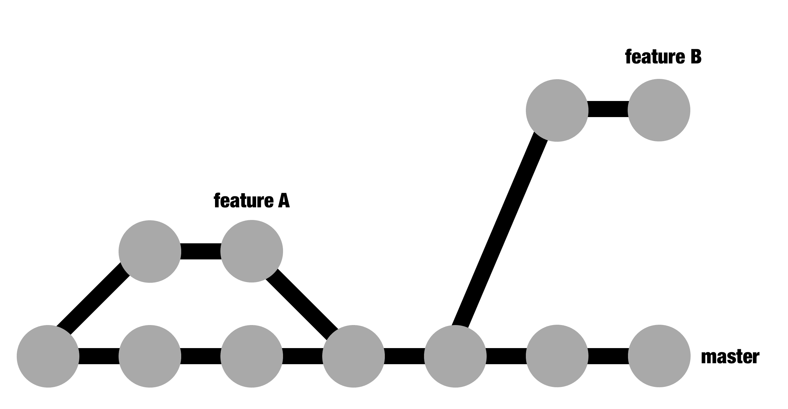

# 第九章：管理工作流程

在本章中，我们将把前几章描述的不同流程汇总到一般工作流程中，以便对单个微服务进行更改。我们将从获取新功能请求的过程转移到本地开发、审查、在演示环境中测试，并批准更改并将其发布到实时集群。

这与我们在第四章中介绍的流水线概念有关，*创建流水线和工作流*。然而，在本章中，我们将讨论任务的过程。流水线和构建结构旨在确保任何提议的更改都符合质量标准。在本章中，我们将重点关注技术的团队合作方面，以及如何在跟踪不同更改的同时实现顺畅的互动。

在本章中，我们将涵盖以下主题：

+   理解功能的生命周期

+   审查和批准新功能

+   设置多个环境

+   扩展工作流程并使其正常运行

本章结束时，我们将清楚地了解设置新功能所涉及的不同步骤，以及如何使用多个环境来测试和确保发布成功。

# 理解功能的生命周期

遵循敏捷原则，任何团队的主要目标是能够快速实现新功能，而不会影响系统的质量或稳定性。变化的第一个元素是**功能请求**。

功能请求是以非技术术语描述系统变更的请求。功能请求通常由非工程师（产品所有者、经理和 CEO）生成，他们希望出于业务原因改进系统，比如打造更好的产品或增加收入。

功能请求可能很简单，比如*更新公司主页的标志*，也可能很大且复杂，比如*添加对新的 5G 网络的支持*。功能请求可能包括错误报告。虽然通常不会，但在本章中会有。

复杂的功能请求可能需要分解为更小的独立功能请求，以便我们可以逐步迭代。

我们的重点是微服务方法和实践，而不是敏捷实践。这些实践涉及如何将功能请求结构化为任务和估算，但并不特定于基础技术。

请查看本章末尾的*进一步阅读*部分，以了解更多关于敏捷实践和方法论的信息。

在单体架构中，所有元素都在同一个代码库下。因此，无论特定功能请求有多复杂，只会影响一个系统。在单体架构中只有一个系统。然而，一旦我们迁移到微服务，情况就不同了。

在微服务架构中，我们需要分析任何新功能请求涉及的微服务。如果我们正确设计了微服务，大多数请求只会影响单个微服务。然而，最终，一些功能请求将太大，无法完全适应单个微服务，需要分成两个或更多步骤，每个步骤都改变不同的微服务。

例如，如果我们有一个新的功能请求，允许我们在一条*想法*的文本中提及用户（类似于 Twitter 上的提及方式），那么这个提及将需要存储在 Thoughts 后端，并在前端显示。这个功能影响了两个微服务：前端和 Thoughts 后端。

在本节中，我们引用了前几章介绍的概念，并从全局角度将它们结合起来。

在下一小节中，我们将看看影响多个微服务的特性。

# 影响多个微服务的特性

对于多个微服务的特性请求，您需要将特性分成几个技术特性，每个特性影响一个单独的微服务。

每个技术特性应涵盖与其影响的微服务相关的方面。如果每个微服务都有明确的目的和目标，那么特性将被完成和概括，以便以后的请求可以使用。

成功的微服务架构的基础是有松散耦合的服务。确保每个微服务的 API 本身是有意义的，这一点很重要，如果我们希望避免模糊服务之间的界限。不这样做可能意味着独立的工作和部署是不被允许的。

还应考虑请求和微服务之间的依赖关系，以便工作可以从后往前安排。这意味着准备添加额外数据或功能的新特性，但默认情况下保留旧行为。在这样做之后，可以部署使用这些额外数据的新特性。这种工作方式确保了任何给定时间的向后兼容性。

我们将在第十一章中更详细地查看影响多个微服务的特性，*处理系统中的变更、依赖和秘密*。我们还将学习如何更详细地协调工作和依赖关系。

回到我们之前的例子，要将用户的提及添加到他们的想法中，我们需要使 Thoughts Backend 能够处理对用户的可选引用。这是一个独立的任务，不会影响现有的功能。它可以被部署和测试。

然后，我们可以在前端进行相应的更改，以允许外部用户通过 HTML 界面与其进行交互。

正如我们在第一章中讨论的，*迁移-设计、计划和执行*，对于任何微服务架构来说，独立部署服务是至关重要的。这使我们能够独立测试服务，并避免任何需要复杂部署的开销，这使得我们难以调试和回滚错误。

如果不同的团队独立地在不同的微服务上工作，那么它们也将需要协调。

在下一节中，我们将学习如何在单个微服务中实施特性。

# 实施特性

一旦我们有了独立技术特性的定义，就可以实施它。

清晰地定义技术特性可能是具有挑战性的。请记住，一个特性可能需要进一步细分为更小的任务。然而，正如我们之前提到的，这里的目标不是构建我们的任务结构。

通过创建一个新的 Git 分支来开始您的任务。代码可以被更改以反映这个分支中的新特性。正如我们在第二章和第三章中所看到的，*使用 Python 创建 REST 服务*和*使用 Docker 构建、运行和测试您的服务*，可以运行单元测试来确保这项工作不会破坏构建。

正如我们在第三章中所描述的，*使用 Docker 构建、运行和测试您的服务*，在*使用不可变容器进行操作*部分，我们可以使用`pytest`参数来运行测试的子集，以加快开发速度，从而在运行测试时获得快速反馈。确保您使用它。

这个功能在整个系统中的工作方式可以通过部署本地集群来检查。这会启动其他可能受到这个分支工作影响的微服务，但它有助于确保当前的工作不会破坏影响其他微服务的现有调用。

根据流水线，推送到 Git 的任何提交都将运行所有测试。 这将及早发现问题，并确保在与主分支合并之前构建正确。

在此过程中，我们可以使用拉取请求来审查主分支和新功能之间的更改。 我们可以检查我们的 GitHub 配置，以确保代码在合并之前处于良好状态。

一旦功能准备就绪并已与主分支合并，应创建一个新标签以允许其部署。 作为配置的一部分，此标签将触发生成注册表中的图像的构建，并使用相同的标签标记图像。 标签和图像是不可变的，因此我们可以确保代码在不同环境之间不会更改。 您可以放心地前进和后退，确保代码与标签中定义的完全相同的代码。

正如我们在第八章中看到的，*使用 GitOps 原则*，可以通过遵循 GitOps 原则部署标签。 部署在 Kubernetes 配置文件中，受 Git 控制，并在需要获得批准的拉取请求中进行审查。 一旦拉取请求已与主分支合并，Flux 将自动部署，正如我们在第八章中描述的那样，在*设置 Flux 控制 Kubernetes 集群*部分。 此时，功能在集群中可用。

让我们回顾一下这个生命周期，从技术请求的描述到部署到集群为止：

这是我们在第四章中介绍的流程的更完整版本。

1.  技术请求已准备好实施到单个微服务中。

1.  创建一个新的功能分支。

1.  在此分支中更改微服务的代码，直到功能准备就绪。

1.  创建了一个拉取请求，用于将功能分支合并到主分支中。 正如我们在第四章中描述的那样，在*理解持续集成实践*部分，运行 CI 流程以确保其质量。

1.  拉取请求已经审查，批准并合并到主分支。

1.  创建了一个新标签。

1.  在 GitOps 存储库中创建一个部署分支，将微服务的版本更改为新标签。

1.  创建用于合并此部署分支的拉取请求。 然后进行审查和合并。

1.  一旦代码已合并，集群将自动发布微服务的新版本。

1.  最后，新功能在集群中可用！

这是生命周期的简化版本； 实际上，可能更复杂。 在本章后面，我们将看到需要将生命周期部署到多个集群的情况。

在接下来的部分中，我们将看一些关于审查和批准拉取请求的建议。

# 审查和批准新功能

根据我们在第四章中描述的流水线模型，候选代码通过一系列阶段，如果出现问题就停止。

正如我们之前提到的，使用 GitHub 拉取请求进行审查适用于我们希望向微服务代码引入新功能，以及希望通过 GitOps 实践将这些更改部署到集群中。

在这两种情况下，我们可以通过自动化测试和流程自动检查。 但是，还有最后一步需要手动干预：知识转移和额外的眼睛。 一旦审阅者认为新功能已准备就绪，他们可以批准它。

工具是一样的，尽管审查过程有些不同。这是因为目标不同。对于功能代码，审查更加开放，直到获得批准并合并到主分支。另一方面，审查和批准发布通常更加直接和快速。

让我们从学习如何审查功能代码开始。

# 审查功能代码

代码审查可以在开发功能并打开合并请求时启动。正如我们已经看到的，在 GitHub 中，代码可以在**拉取请求**阶段进行审查。

代码审查基本上是关于代码和新功能的讨论；也就是说，在将代码引入主分支之前，我们会对代码进行检查。这为我们提供了在开发过程中改进功能的机会，以及在其成为系统组件之前进行改进。

在这里，团队的成员可以阅读尚未合并的代码，并给作者一些反馈。这可能来回进行，直到审阅者认为代码已经准备好合并并批准它。实质上，除了功能的作者之外，其他人需要同意新代码符合所需的标准。

代码库随着时间的推移而增长，它们的组件可以相互帮助。将代码合并到主分支表示您完全接受新代码将作为代码库的一部分由团队维护。

代码可能需要得到一个或多个人的批准，或者特定人员的批准。

在 GitHub 中，你可以启用代码所有者。这些是负责批准存储库或存储库部分的工程师。查看 GitHub 文档以获取更多信息：[`help.github.com/en/articles/about-code-owners`](https://help.github.com/en/articles/about-code-owners)。

代码审查是一个非常常见的过程，而在 GitHub 中使用拉取请求的流行度和便利性已经传播开来。大多数开发人员都熟悉这个过程。

实施良好的反馈文化比看起来更加困难。编写代码是一种深层次的个人体验；没有两个人会写出相同的代码。对开发人员来说，让他人批评自己的代码可能是一种困难的经历，除非有明确的规则。

以下是一些建议：

+   告诉你的审阅者他们应该寻找什么。坚持使用检查表。这有助于在团队内部培养关心共享核心价值观的文化。这也有助于初级开发人员知道要寻找什么。这可能会因团队而异，但以下是一些示例：

+   有新的测试。

+   错误条件要经过测试。

+   文档要得到适当的更新。

+   任何新的端点都要符合标准。

+   架构图已更新。

+   审查代码并不等同于编写代码。总会有差异（例如，这个变量名可以更改），但需要审查的是是否需要实施这样的更改。挑剔将会侵蚀团队成员之间的信任。

+   要审查的代码越大，就越难以完成。最好是以小的增量工作，这与持续集成的原则相符。

+   所有的代码都应该在同等的基础上进行审查。这包括高级开发人员的代码，应鼓励初级开发人员留下诚实的反馈。这有助于代码的所有权和公平性增长。

+   代码审查是一种对话。评论并不一定意味着审阅者的反馈必须在你质疑之前立即实施。它开启了关于改进代码的对话，进行澄清和反驳是完全可以的。有时，处理请求的正确方式，也就是更改代码的一部分，是留下一条评论解释为什么以这种方式进行。

+   审查有助于传播关于代码库的知识。然而，这并不是万能的。代码审查往往会陷入隧道视野，只关注诸如拼写错误和局部代码片段等小问题，而不关注更大的元素。这就是为什么以小的增量实现功能很重要的原因：以帮助周围的人消化变化。

+   留下赞赏的评论很重要。营造一个欣赏写得好的代码的文化。只强调问题会让作者对审查过程感到痛苦。

+   批评应该针对代码，而不是针对编码人员。确保您的审查是文明的。在这一步中，我们要确保代码质量高；作为审查人，您不希望让自己显得更优越。

对于那些不习惯代码审查的人来说，代码审查可能会带来压力。一些公司正在制定原则和想法，以减轻这一过程的痛苦。一个很好的例子可以在[`www.recurse.com/social-rules`](https://www.recurse.com/social-rules)找到。不要害怕制定并分享您自己的原则。

+   重要的是，代码可以随时获得批准，即使团队中的某人正在度假或生病。确保您授予团队多名成员批准，以便批准过程本身不成为瓶颈。

当您开始进行代码审查时，请确保团队领导牢记这些考虑，并强调为什么所有代码都要经过审查。

强调代码审查并不是技术解决方案，而是与人相关的解决方案。因此，它们可能会受到与人相关的问题的影响，比如自负、对立的讨论或无效的辩论。

微服务架构适用于有多人共同开发的大型系统。团队合作至关重要。其中一部分是确保代码不属于单个人，而是整个团队的。代码审查是实现这一目标的好工具，但一定要积极寻找健康的审查。

随着时间的推移，将形成共识，并且会一致地开发大量代码。在一个健康的团队中，花在审查上的时间应该减少。

随着时间的推移，团队将定期进行代码审查，但在开始阶段建立这些基础可能会很复杂。确保您留出时间来介绍它们。正如我们之前提到的，一旦功能准备就绪，我们需要继续批准它。批准新功能的代码并将其合并到主分支是功能审查的最后阶段，但仍然需要发布。发布受代码控制，也需要进行审查。

# 批准发布

使用 GitOps 原则使我们能够启用相同的审查和批准方法，以便我们可以对 Kubernetes 基础架构进行更改。正如我们之前提到的，基础架构是由 Kubernetes 中的 YAML 文件定义的，这使我们能够控制这些更改。

对 Kubernetes 集群进行的任何更改都可以经过拉取请求和审查方法。这使得批准将发布到集群变得简单。

这有助于最小化问题，因为团队的成员参与了更改，并且他们对基础架构的了解更加深入。这与 DevOps 原则很好地契合，允许团队掌控自己的部署和基础架构。

然而，GitOps 中的基础架构更改往往比常规代码审查更容易审查。一般来说，它们是以非常小的增量进行的，大多数更改都是如此直截了当，几乎不会引发辩论的可能性很小。

一般原则是，尽量使基础架构更改尽可能小。基础架构更改存在风险，因为错误可能导致其中的重要部分崩溃。更改越小，风险越小，诊断任何问题也就越容易。

我们之前提到的关于代码审查的所有建议也都有一定作用。其中最重要的一个是包括一些参考基础设施关键部分的指南。

基础设施的某些部分可能受到 GitHub 代码所有者的保护。这使得某些工程师必须批准对基础设施关键部分的更改。查看更多信息，请参阅文档：[`help.github.com/en/articles/about-code-owners`](https://help.github.com/en/articles/about-code-owners)。

由于基础设施被定义为存储在 GitHub 中的代码，这也使得复制基础设施变得容易，从而极大地简化了生成多个环境的过程。

# 设置多个环境

在 Kubernetes 下创建、复制和删除命名空间的便利大大减轻了以前保持多个环境副本以复制基础设施的负担。您可以利用这一点。

根据我们之前提到的 GitOps 原则，我们可以定义新的命名空间来生成新的集群。我们可以使用另一个分支（例如，使用`master`分支用于生产集群，`demo`用于演示集群），或者复制包含集群定义的文件并更改命名空间。

可以为不同的目的使用不同的物理 Kubernetes 集群。最好将生产集群保持独立，不与任何其他环境共享，以减少风险。然而，其他每个环境可以存在于同一个集群中，这不会影响外部客户。

一些功能请求足以证明开发团队将确切知道该做什么，比如在处理错误报告时。然而，其他可能需要更多的测试和沟通，以确保它们在开发过程中满足要求。当我们检查新功能是否确实对预期的外部用户有用时，或者可能是更具探索性的功能时，就可能出现这种情况。在这种情况下，我们需要联系外部方，也就是功能的最终批准者：*利益相关者*。

利益相关者是项目管理中的一个术语，指定了第三方，也就是产品的最终用户或受其影响的用户。在这里，我们使用这个术语来指定对功能感兴趣但不属于团队外部的人，因此他们无法从内部定义功能要求。利益相关者可以是例如经理、客户、公司的 CEO 或内部工具的用户。

任何曾经不得不处理模糊定义的利益相关者请求的开发人员，比如*允许按名称搜索*，都不得不对其进行微调：*不是按名字，而是按姓氏*。

确保您为这类任务定义适当的结束。如果允许其无限制地运行，利益相关者的反馈可能是无穷无尽的。事先定义其中包含和不包含的内容，以及任何截止日期。

为了运行测试并确保正在开发的功能朝着正确的方向发展，您可以创建一个或多个演示环境，在这些环境中，您将部署尚未合并到主分支中的工作。这将帮助我们与利益相关者分享这项工作，以便他们在功能完成之前向我们提供反馈，而无需我们在生产环境中发布它。

正如我们在前几章中看到的，在 Kubernetes 中生成新环境很容易。我们需要创建一个新的命名空间，然后复制集群的生产定义，同时更改命名空间。这将创建一个环境的副本。

更改正在开发的微服务的特定版本将允许我们创建其工作版本。新版本可以像往常一样部署在这个演示环境中。

这是一个简化版本。您可能需要在生产环境和演示环境之间进行更改，例如副本数量和数据库设置。在这种情况下，可以使用*模板环境*作为参考，以便随时可以复制。

其他环境，如暂存，可以以类似的方式创建，旨在创建确保已部署到生产环境的代码将按预期工作的测试。这些测试可以是自动的，但如果我们想要检查用户体验是否合适，也可以是手动的。

暂存环境是一个尽可能忠实于生产环境的副本设置，这意味着我们可以运行测试，以确保在生产环境中部署将正常工作。暂存通常帮助我们验证部署过程是否正确，以及任何最终测试。

暂存环境通常非常昂贵。毕竟，它们是生产环境的副本。使用 Kubernetes，您可以轻松复制生产环境并减少所需的物理基础设施。甚至可以在不使用时启动和停止它以减少成本。

您可以使用多个环境以类似的方式创建部署的级联结构。这意味着需要将标签部署到暂存环境并获得批准，然后才能部署到生产环境。

现在让我们从开发人员的角度来看如何处理这个结构。

# 扩展工作流并使其正常工作

实施这种工作方式的一些挑战包括创建提供充分反馈循环的文化，并在快速审查新代码时仔细检查它。等待审查是一种阻塞状态，会阻止开发人员实施正在审查的功能。

虽然这段等待时间可以用于其他目的，但无法取得进展会迅速降低生产率。开发人员要么会同时保留几个功能，这在上下文切换的角度来看是非常有问题的，要么他们需要等待并无所事事，直到审查完成。

上下文切换可能是生产力的最严重杀手。保持团队的生产力高的关键之一是能够开始并完成任务。如果任务足够小，它将很快完成，因此在项目之间切换更容易。然而，同时处理两个或更多任务是非常不好的做法。

如果这经常发生，请尝试将任务分解为较小的块。

为了能够彻底审查代码并减少阻塞时间，有一些要点需要牢记。

# 审查和批准由整个团队完成

必须随时有足够的审阅者可用。如果只有开发人员有经验，审查可能最终只由团队中最资深的人员完成，例如团队负责人。尽管这个人原则上可能是更好的审阅者，但从长远来看，这种结构将损害团队，因为审阅者将无法做其他事情。如果审阅者因病或度假等原因不可用，开发和发布阶段的进展也将受阻。

相反，使整个团队都能够审查其同行的代码。即使资深贡献者在教导团队其他成员如何审查方面扮演更积极的角色，但一段时间后，大多数审查不应需要他们的帮助。

尽管最初实施这个流程需要积极的指导，但这通常由团队的资深成员来领导。审查代码是一种可培训的能力，其目标是在一段时间后，每个人都能够进行审查并获准批准拉取请求。

部署拉取请求也遵循相同的流程。最终，团队中的每个人，或者至少是相当数量的成员，都应该能够部署一个发布。不过，最初的主要审阅者可能会是不同的人。

最适合审查发布的候选人可能是对 Kubernetes 基础设施配置非常了解，但对微服务代码不是专家。

# 理解并不是每个批准都是一样的

记住，一个功能的不同阶段并不同样关键。代码审查的早期过程是为了确保代码可读，并且保持质量标准。在早期阶段，代码将有相对较多的注释，并且会有更多需要讨论的地方，因为需要调整的元素更多。

审查的一个重要部分是创建*足够易懂*的代码，以便团队的其他成员能够理解。尽管有些人声称代码审查可以让每个人都意识到团队其他成员正在实施的更改，但根据我的经验，审阅者并不那么了解特定功能。

然而，一个良好的审查将确保没有令人费解的东西被引入到代码库中，并且核心元素得到尊重（例如引入测试，保持文档更新，保持代码可读）。正如我们在本章前面建议的那样，尝试创建一个明确的检查事项列表。这将有助于使审查和代码更加一致。

新功能的部署阶段只需要检查微服务版本的更改以及基础设施的其余部分是否完好。这些通常会非常小；大多数情况下会再次检查是否有拼写错误，以及要更改的微服务是否正确。

# 定义发布的明确路径

拥有一个简单明了的流程可以帮助所有参与者清楚地了解一个功能是如何从开发到发布到生产环境的。例如，基于我们讨论过的想法，我们可能会得到一个类似于以下图表所示的部署路径：

对于这些步骤中的每一步，我们需要验证该步骤是否正确。正如我们在第四章中所看到的，*创建流水线和工作流*，自动化测试确保合并到主分支的任何内容都不会破坏现有的构建。这涵盖了前面的图表直到**创建标签**步骤。

同样，可能有一种方法可以在部署后验证部署是否成功。以下是关于此的一些想法：

+   手动测试，以检查部署的微服务是否按预期工作

+   自动化测试，比如第四章中描述的那些，*创建流水线和工作流*

+   检查要部署的图像是否已经使用 Kubernetes 工具或版本 API 正确部署

一旦一个部署阶段成功完成，就可以开始下一个阶段。

在非生产环境中进行部署可以最大程度地减少破坏生产环境的风险，因为这将确保部署过程是正确的。流程需要足够快，以便允许快速部署，从而使它们尽可能小。

从合并到主分支到新版本发布到生产环境，整个过程应该不超过几个小时，但最好是更短。

如果需要更多时间，那么这个流程可能太繁重了。

小而频繁的部署将最大程度地减少破坏生产环境的风险。在一些特殊情况下，常规流程可能会很慢，需要使用紧急程序。

# 紧急发布

让我们假设在生产中有一个关键错误，需要尽快解决。对于这些特殊情况，事先定义一个紧急流程是可以的。

这种紧急流程可能涉及加快审查甚至完全跳过审查。这可能包括跳过中间发布（例如在事先不部署到演示环境）。确保明确定义何时需要使用此流程，并确保仅在紧急情况下使用。

如果您的常规部署流程足够快，那么就不需要紧急流程。这是尝试提高部署时间的一个很好的理由。

回滚是一个很好的例子。要撤销微服务的部署，因为上一个版本引入了关键错误，只需在生产环境中回滚并返回到上一个版本，而不影响其他任何东西，这是一个合理的流程。

请注意，这里我们减少了进行快速更改的风险，并确保已经回滚的版本已经在之前部署过。这是紧急程序可能起作用并减少风险的一个很好的例子。

在发现特殊情况时要运用常识，并与团队事先讨论如何处理。我们将在第十二章 *跨团队协作和沟通* 中讨论回顾。

# 频繁发布和添加功能标志

虽然回滚是可能的，正如我们刚才看到的，但一般共识应该是每次新部署都是向前推进的。新版本的代码包含了上一个版本的代码，再加上一些小的更改。按照 Git 的操作方式，我们在一个分支上工作（主分支），并将其推进。

这意味着要避免几个长期存在的活跃分支。这种模式被称为*基于主干的开发*，是持续集成的推荐工作方式。在基于主干的开发中，功能分支是短暂存在的，并且始终与主分支（或主干）合并，通常在 Git 中称为`master`。

基于主干的开发避免了当我们有长期存在且与主分支分歧的分支时出现的问题，从而使多个组件的集成变得复杂。持续集成的基础是始终具有可以以小的增量发布的代码。这种模式以“主干”作为发布的参考。

在下图中，我们可以看到**功能 A**是如何合并到**主分支**中的，以及**功能 B**仍在进行中。任何发布都将来自**主分支**：

如果**功能 A**引入了一个错误，一个新的 bug 修复分支将从**主分支**分支出来，并将被合并回去。请注意结构是继续向前推进的。

为了使这个系统工作，功能分支需要短暂存在 - 通常只有几天。这样做可以使合并变得容易，并允许进行小的增量更改，这是持续集成的关键。

# 使用功能标志

有时，有一些功能，由设计需要一次性进行大规模/重大更改，比如新的 UI 界面。持续集成倡导者提倡的短小迭代周期，逐渐添加小功能的方式在这些频繁发布的情况下行不通。新界面需要一次性包含所有元素，否则会显得奇怪。

当您希望以小的增量方式继续工作，并同时延迟功能的激活时，可以使用功能标志。

功能标志是启用或禁用特定功能的配置元素。这使您可以通过配置更改改变微服务的行为，起到开关的作用。

在 Kubernetes 中，我们使用`deployment.yaml`文件来描述环境变量，以及 ConfigMaps。我们将在第十一章《处理系统中的变更、依赖关系和机密信息》中讨论 ConfigMaps。

配置与每个单独的环境相关联。这使我们能够在特定环境中展示一个功能，而在另一个环境中不展示，同时代码库保持不变。

例如，可以慢慢开发并在功能标志下保护一个新接口。一些环境，比如演示环境，仍然可以处于活动状态，以便收集内部反馈，但这不会显示在生产环境中。

一旦新接口准备就绪，就可以进行小的更改；例如，我们可以更改配置参数以启用它。这在外部看起来可能是一个很大的变化，但如果我们切换回参数，它可以很容易地恢复。

功能标志在处理外部可访问服务时非常有用。内部服务可以添加更多功能而不会出现任何问题，因为它们只会被系统中的其他微服务调用。

内部微服务通常可以添加新功能。在这里，会尊重向后兼容性。外部可访问的功能有时需要我们出于各种原因（包括接口更改或产品弃用）用另一个功能替换一个功能。

一个相关的方法是将功能推送给一部分用户。这可以是预定义的用户集，例如已经加入测试计划以获得早期功能访问权限的用户，或者是一个随机样本，以便他们可以在全球发布之前及早发现问题。

一些大公司也使用区域访问，其中一些功能首先在特定国家/地区启用。

一旦功能标志被激活，任何已弃用的功能都可以被移除和清理，这样就不会有不会被使用的旧代码了。

# 处理数据库迁移

数据库迁移是对存储在特定环境中的持久数据进行的更改（通常是在一个或多个数据库中）。大多数情况下，这意味着改变数据库模式，但也有其他情况。

生产环境中的数据是运行系统中最重要的资产。对数据库迁移需要特别小心。

在某些情况下，迁移可能会锁定表一段时间，从而使系统无法使用。确保您适当地测试您的迁移，以避免或至少为这些情况做好准备。

尽管数据库迁移在技术上可能是可逆的，但从开发时间的角度来看，这样做是非常昂贵的。例如，添加和删除列可能很简单，但一旦列投入使用，它将包含不应删除的数据。

为了能够在数据迁移事件中无缝工作，您需要将其与将调用它的代码分离，并按照以下步骤进行操作：

1.  设计数据库迁移时，要以不干扰当前代码为目标。例如，向数据库添加表或列是安全的，因为旧代码会忽略它。

1.  执行数据库迁移。这样就可以在现有代码继续运行而不中断的情况下进行所需的更改。

1.  现在，代码可以部署。一旦部署完成，它将开始使用新数据库定义的优势。如果出现问题，代码可以回滚到先前的版本。

这意味着我们需要创建两个部署：

+   一个用于迁移

+   另一个用于使用此迁移的代码

迁移部署可能类似于代码部署。也许有一个运行迁移的微服务，或者可能是一个执行所有工作的脚本。大多数框架都会有一种迁移的方法，以确保迁移不会被应用两次。

例如，对于 SQLAlchemy，有一个名为 Alembic 的工具（[`alembic.sqlalchemy.org/en/latest/`](https://alembic.sqlalchemy.org/en/latest/)），我们可以使用它来生成和运行迁移。

然而，还有一种替代操作：尝试将迁移应用于将使用它们的微服务。在处理生产环境时，这是一个坏主意，因为这将在所有情况下减慢启动时间，而不管是否正在进行迁移。此外，它不会检查代码是否可以安全回滚，并且是否与数据库的先前版本兼容。

与两个独立的部署一起工作显然比自由更改数据库更加受限，但它确保每一步都是稳固的，服务不会中断。这更加故意。例如，要重命名列，我们将按照以下步骤进行：

1.  首先，我们将部署一个创建具有新列名称的新列的迁移，从而复制旧列中的数据。代码从旧列读取和写入。

1.  然后，我们将部署从旧列读取并向两者写入的新代码。在发布过程中，从旧代码到旧列的任何写入都将被正确读取。

1.  之后，我们将创建另一个迁移，将数据从旧迁移复制到新迁移。这样可以确保任何瞬态复制都被正确应用。此时，任何新数据仍然会同时写入两列。

1.  然后，我们将部署代码，从新列读取和写入，忽略旧列。

1.  最后，我们将实施一个迁移来删除旧列。此时，旧列不包含相关数据，可以安全地删除。这不会影响代码。

这是一个故意的长流程示例，但在大多数情况下，不需要这样的长流程。然而，在这些步骤中的任何时候都没有任何不一致。如果某个阶段出现问题，我们可以回滚到上一个阶段 - 直到修复为止，它仍然可以工作。

主要目标是避免数据库与当前部署的代码不兼容的瞬态状态。

# 总结

在本章中，我们讨论了团队的流程，从开始一个新功能到将其部署到生产环境中。

我们首先讨论了在微服务架构中工作时功能请求的关键点。我们介绍了影响多个微服务的请求，并学习了如何构建工作，以便服务不会中断。

我们讨论了构成良好审查和批准流程的要素，以及 GitHub 拉取请求如何帮助我们做到这一点。使用 GitOps 实践来控制基础设施使得部署可以轻松地进行审查。

然后，我们讨论了如何使用 Kubernetes 和 GitOps 帮助我们创建多个环境，以及在处理演示和分段环境时如何利用它们的优势，以测试部署并在进入生产之前在受控环境中展示功能。

之后，我们讨论了如何使团队能够全面了解整个生命周期，从功能请求到部署，并能够快速跟踪整个路径。我们学会了如何澄清这些步骤，以及如何使团队负责审查和批准自己的代码，这使开发人员可以完全拥有开发周期。

我们还讨论了在处理数据库迁移时可能出现的问题，并解释了如何进行这种特殊类型的部署，这不容易回滚。

在下一章中，我们将讨论实时系统以及如何启用诸如指标和日志之类的元素，以便我们可以检测在生产环境中发生的问题和错误，并获得足够的信息尽快主动地进行修复。

# 问题

1.  当接收到一个新的业务功能时，在微服务架构下，我们需要进行怎样的分析？

1.  如果一个功能需要修改两个或更多微服务，我们如何决定首先修改哪一个？

1.  Kubernetes 如何帮助我们建立多个环境？

1.  代码审查是如何工作的？

1.  代码审查的主要瓶颈是什么？

1.  根据 GitOps 原则，部署审查与代码审查有何不同？

1.  为什么一旦一个功能准备合并到主分支时，有一个清晰的部署路径是很重要的？

1.  为什么数据库迁移与常规代码部署不同？

# 进一步阅读

想要了解更多关于敏捷实践并将其引入团队的信息，请查阅以下书籍：

+   《The Agile Developer's Handbook》

+   《Agile Technical Practices Distilled》

如果你的组织在使用 JIRA，阅读《Hands-On Agile Software Development with JIRA》可以帮助你更好地利用这个工具来进行敏捷实践。
