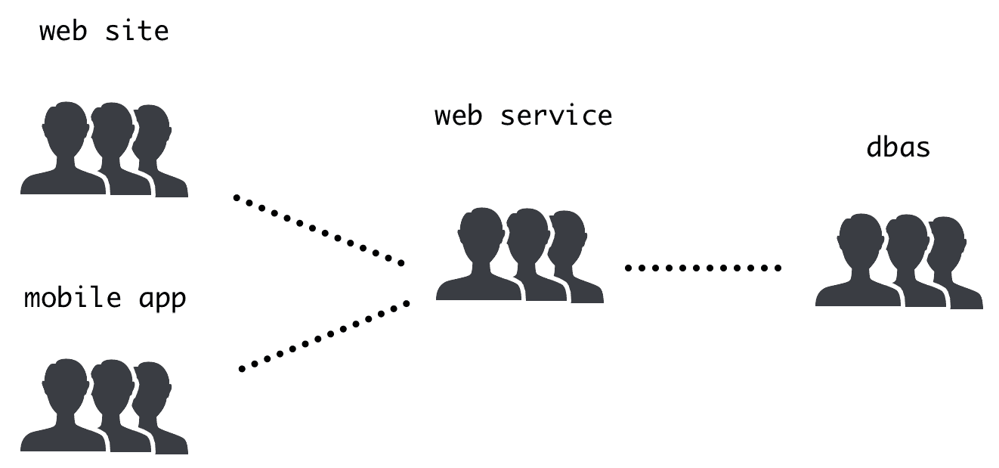
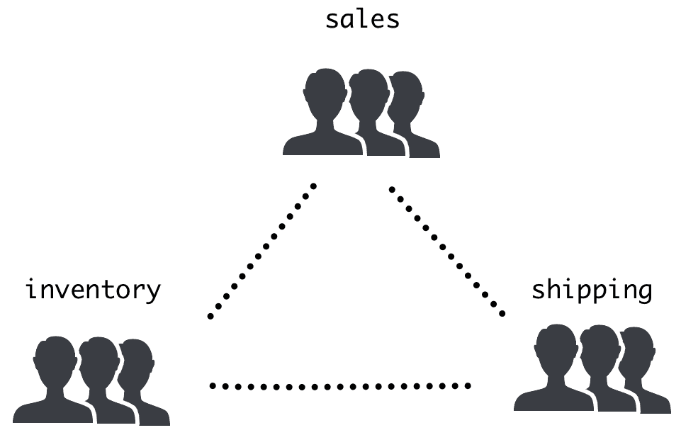
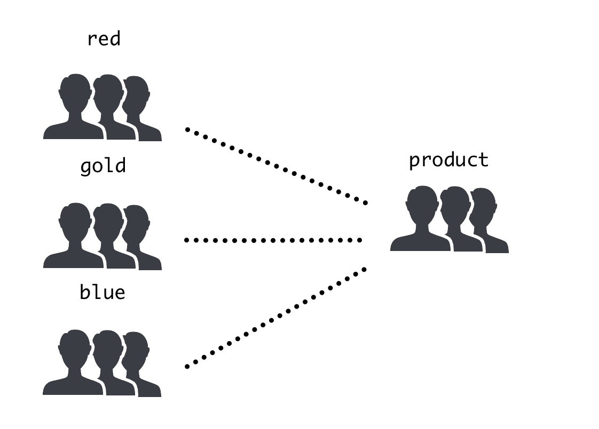

# 第十二章：跨团队合作和沟通

正如我们之前讨论的，微服务的主要特点是能够并行开发。为了确保最大效率，我们需要成功协调我们的团队，以避免冲突。在本章中，我们将讨论确保不同团队成功合作所需了解的不同元素。

首先，我们将介绍如何在不同的微服务中获得一致的视野，不同的沟通结构如何塑造软件元素中的沟通，以及如何确保我们不会在软件中积累垃圾。然后，我们将讨论如何确保团队在发布和完善其流程和工具方面协调自己，使它们变得越来越可靠。

本章将涵盖以下主题：

+   保持一致的架构视野

+   分工和康威定律

+   平衡新功能和维护

+   设计更广泛的发布流程

在本章结束时，我们将知道如何构建和协调不同独立工作的团队，以便我们能够充分利用它们。

# 保持一致的架构视野

在基于微服务的系统中，每个团队能够独立完成大部分任务，独立于其他团队。设计服务，使其尽可能独立并且具有最小的依赖性，对于实现良好的开发速度至关重要。

因此，微服务的分离允许团队独立并行工作，而在单体系统中，大多数人都在关注发生的事情，甚至分散了特定开发人员关注领域之外的工作。他们会知道何时发布新版本，并看到新代码添加到他们正在工作的同一代码库中。然而，在微服务架构中并非如此。在这里，团队专注于他们的服务，不会被其他功能分散注意力。这带来了清晰和高效。

然而，仍然需要一个全局的系统视野。需要对系统的架构如何随时间变化而改变有一个长期的观点，以便能够适应。这种视野（在单片系统中）是隐含的。微服务需要更好地理解这些变化，以便能够有效地工作，因此一个能统一这种全局视野的领先架构师非常重要。

软件行业中的架构师角色并没有一致的定义。

在本书中，我们将其定义为处理 API 和服务整体结构的角色。他们的主要目标是在技术问题上协调团队，而不是直接处理代码。

明确指定一个负责系统全局架构的人有助于我们保持对系统如何发展的长期视野。

在小公司中，首席技术官可能会担任架构师的角色，尽管他们还忙于处理与管理流程和成本相关的元素。

领先架构师的主要责任是确保微服务划分在演变中仍然有意义，并且服务之间通信的 API 是一致的。他们还应该努力促进跨团队的标准生成，并在整个组织中分享知识。

架构师在涉及哪个功能与哪个微服务相关的任何问题以及可能涉及多个团队的其他冲突时，也应该是最终的决策者。这个角色在从单体架构过渡到微服务架构时非常有帮助，但在这个过程完成后，他们也可以确保组织能够适应新的挑战，并控制技术债务。微服务架构系统旨在创建独立的团队，但他们都会从一个外部人员创造的共享全局愿景中受益。

为了更好地协调，团队如何分工是非常重要的。让我们了解一下当我们将系统开发分成不同团队时会出现的一些挑战。

# 分工和康威定律

微服务架构系统适用于大型软件系统，尽管公司往往从单体应用程序开始。这对于任何有小团队的系统都是有意义的。随着系统的探索和转变，它会随着时间的推移而增长。

但当单体系统增长到一定规模时，它们变得难以处理和开发。由于历史原因，内部变得交织在一起，随着复杂性的增加，系统的可靠性可能会受到影响。在灵活性和冗余之间找到平衡可能很困难。

记住，当开发团队很大时，微服务是有用的。对于小团队来说，单体架构更容易开发和维护。只有当许多开发人员在同一个系统上工作时，分工和接受微服务架构的额外开销才是有意义的。

扩展开发团队可能会变得困难，因为那里会有太多的旧代码，学习如何在其中导航是困难且需要很长时间。开发人员（那些在团队中待了很长时间的人）知道哪些注意事项可以帮助，但他们成为了瓶颈。增加团队的规模并不能帮助，因为任何改变都可能变得复杂。因此，每个新的开发人员在能够成功地进行错误修复和新功能开发之前都需要接受大量的培训。

团队也有一个自然的规模限制。超过这个限制可能意味着必须将其分成更小的团队。

团队的规模是非常灵活的，但通常来说，7±2 个成员被认为是团队中理想人数的经验法则。

更大的团体往往会自行生成更小的团体，但这意味着管理的任务会变得繁重，有些团队可能没有明确的焦点。很难知道其他团队在做什么。

较小的团队在管理和团队间沟通方面往往会产生额外的开销。他们会因为成员更多而开发更快。

在一个大型单体系统中，多个独立团队往往会在没有明确的长期视野的情况下胡乱操作。通过设计一个健壮的内部结构可以缓解这种情况，但这需要巨大的前期规划和严格的监管来确保其得到遵守。

微服务架构是一种解决这些问题的设计，因为它在系统的各个部分之间建立了非常严格的边界。然而，这样做需要开发团队达到一定规模，以便他们可以像几个小团队一样独立工作。这是微服务架构系统的主要特点。构成它的每个微服务都是一个独立的服务，可以独立开发和发布。

这种工作方式允许团队并行工作，没有任何干扰。他们的行动范围是明确的，任何依赖关系都是明确设定的。因此，微服务之间的边界是强大的。

仅仅因为一个微服务可以独立发布并不意味着单个发布就足以发布一个完整的功能。正如我们已经看到的，有时，一个微服务中的一个功能需要在部署之前对另一个微服务进行处理。在这种情况下，需要处理多个微服务。

在规划如何划分团队时，要牢记的最重要的想法是团队结构如何在软件中得到体现。这是由康威定律描述的。

# 描述康威定律

康威定律是一个软件格言。换句话说，在任何生产软件的组织中，软件将复制组织的通信结构。例如，以一种非常简化的方式，一个组织被分为两个部门：采购和销售。这将产生两个软件模块：一个专注于购买，另一个专注于销售。它们将在需要时进行通信。

在这一部分，我们将讨论*软件单元*。这是一个通用术语，用来描述任何被视为单一凝聚元素的软件。它可以是一个模块、一个包，或者一个微服务。

在微服务架构中，这些软件单元主要是微服务，但在某些情况下，也可能是其他类型。我们将在*将软件划分为不同类型的软件单元*部分看到这方面的例子。

这可能并不奇怪。不同团队之间的沟通水平以及同一个团队内部的沟通水平是不同的，这是很自然的。然而，团队合作的影响是巨大的，其中一些如下：

+   团队间的 API 比团队内的 API 更昂贵，无论是在操作上还是在开发上，因为它们的通信更加复杂。将它们设计成通用和灵活的是有意义的，这样它们就可以被重复使用。

+   如果通信结构复制了人类组织，那么明确是有意义的。团队间的 API 应该比团队内的 API 更加可见、公开和有文档记录。

+   在设计系统时，将它们划分到分层团队结构的界线上是最不费力的路径。以其他方式对其进行工程设计将需要组织变革。

+   另一方面，改变组织结构是一个困难和痛苦的过程。任何经历过组织重组的人都知道这一点。这种变化将反映在软件中，因此要做好计划。

+   让两个团队共同处理同一个软件单元会产生问题，因为每个团队都会试图将其引向自己的目标。

软件单元的所有者应该是一个团队。这向每个人展示了谁对任何变化负责并有最终决定权，并帮助我们专注于我们的愿景并减少技术债务。

+   不同的物理位置会施加通信限制，比如时差，这将在我们跨地域开发软件时产生障碍。通常会根据地理位置划分团队，这就需要构建这些团队之间的通信（因此 API）结构。

请注意，DevOps 运动与康威定律有关。传统的工作分工方式是将正在开发的软件与其运行方式分开。这在康威定律所描述的两个团队之间产生了鸿沟，从而产生了与两个团队之间缺乏理解相关的问题。

对这个问题的反应是创建能够开发和运行自己软件的团队，并部署它。这就是所谓的 DevOps。它将运营问题转移到开发团队，旨在创建一个反馈循环来激励、理解和解决问题。

康威定律并不是一件需要克服的坏事。它反映了任何组织结构对软件结构的影响。

记住这一点可能有助于我们设计系统，使得组织和现有软件的通信流程合理。

DevOps 运动的一个关键组成部分是推进构建系统的技术，以简化生产环境的操作，使部署过程更简单。这使我们能够以新的方式组织团队，从而使多个团队能够控制发布。

现在，让我们谈谈软件如何被结构化为不同的部门。

# 将软件划分为不同类型的软件单元

虽然本书的主要目标是讨论微服务中软件的划分，但这并不是唯一可能的划分。其他划分可以包括微服务内的模块或共享包。

微服务的主要特点是在开发和部署方面是独立的，因此可以实现完全的并行化。其他划分可能会减少这一点并引入依赖关系。

确保你能够证明这些改变。

在我们在本书中介绍的示例系统中，我们引入了一个模块，用于验证请求是否由用户签名。用户后端生成一个签名头，思想后端和前端通过`token_validation.py`模块独立验证它。

这个模块应该由拥有用户后端的同一个团队拥有，因为它是它的自然延伸。我们需要验证它是否生成与用户后端生成的相同的令牌。

避免重复并始终保持同步的最佳方法是生成一个 Python 软件包，可以安装在依赖的微服务上。然后，这些软件包可以像`requirements.txt`文件中的任何其他外部依赖一样对待。

要在 Python 中打包一个库，我们可以使用几种工具，包括官方的*Python Packaging User Guide*（[`packaging.python.org/`](https://packaging.python.org/)）中的工具，以及较新的工具，如 Poetry（[`poetry.eustace.io`](https://poetry.eustace.io)），这些工具对于新项目来说更容易使用。

如果我们希望将软件包公开，可以将其上传到 PyPI。或者，如果需要，我们可以将其上传到私有存储库，使用诸如 Gemfury 之类的工具，或者自己托管存储库。这将明确划分软件包及其维护者，以及使用它作为依赖项的团队之间的关系。

将软件单元划分成团队划分方面有着重要的影响。现在，让我们来看看如何组织团队。

# 设计工作结构

考虑到康威定律，划分软件应该反映组织的结构。当我们从单体架构迁移到微服务架构时，这一点非常重要。

记住，从单体架构迁移到微服务在我们操作方式上是一个重大的改变。这既是组织上的改变，也是技术上的改变。主要的风险在于人的因素，包括培训人员使用新技术以及让开发人员满意他们将要工作的新领域。

对组织结构进行根本性的改变可能非常困难，但将需要进行一些小的调整。当从单体架构迁移到微服务时，团队将需要重新调整。

请记住，大规模的重组可能会激怒人们并引发政治问题。人类不喜欢改变，任何决定都需要有意义。需要准备好解释和澄清这一举措。明确新结构的目标将有助于赋予其目的。

让我们来看一些团队划分的例子，以及它们的优缺点。

# 围绕技术构建团队

在某些情况下，与技术相关的不同技能可能是相关的。系统的某些部分可能涉及与其他任何东西完全不同的技术。

一个很好的例子是移动应用程序，因为它们在使用的语言方面是受限制的（Android 使用 Java，iOS 使用 Objective-C 或 Swift）。一个具有网站和移动应用程序的应用可能需要一个专门的团队来处理移动应用程序的代码。

一个更传统的例子是围绕**数据库管理员**（**DBA**）构建的数据库团队。他们将控制对数据库的访问并操作它们以保持良好状态。然而，这种结构正在消失，因为数据库操作现在更容易，通常由大多数开发人员处理，并且近年来数据库的基础设施管理已大大简化。

这可能使我们能够为特定领域创建特定团队。技术的障碍确保系统之间的通信是有结构的。

下图是我们将遇到的团队类型的示例。它们按技术和沟通方式分组。数据库团队将与创建 Web 服务后端的团队进行通信，他们将与 Web 和移动团队进行通信：

这种模式的主要缺点是新功能可能需要多个团队共同努力。对客户端代码的任何更改，以便我们可以在数据库中存储新值，都需要每个团队的工作投入。这些功能需要额外的协调，这可能会限制开发速度。

# 围绕领域构建团队

另一种结构是围绕不同的知识领域，通常与公司的业务领域相关。每个知识领域都有自己独立的系统，但它们彼此通信。一些部分可能具有外部可访问的接口，而其他部分可能没有。

这种结构通常在已经成功运作多年的成熟组织中找到。

例如，一个在线零售商可能分为三个领域：

+   **销售**：负责外部网站和营销。

+   **库存**：购买商品以便销售，并处理库存。

+   **运输**：将产品送到客户手中。跟踪信息显示在网站上。

在这种情况下，每个领域都有自己的数据库，以便存储相关数据和服务。它们通过定义的 API 相互通信，最频繁的变化发生在特定领域内。这允许在领域内快速发布和开发。

跨领域拥有新功能也是可能的。例如，对运输跟踪信息的更改可能需要我们匹配销售产生的更改。然而，这些变化应该发生得更少。

在这个例子中，每个团队将像下图所示相互通信：

这种结构的主要不便之处在于可能会创建孤立的团队和独立思维。每个系统都有自己的做事方式，因此它们可能会分歧到不共享相同的基本语言的程度。当需要跨领域功能时，可能会导致讨论和摩擦。

# 围绕客户构建团队

在一些组织中，主要目标是为客户创建定制工作。也许客户需要以定制的 B2B 方式与产品集成。在这种情况下，能够开发和运行定制代码至关重要。

结构侧重于客户。三个团队（称为红色、金色和蓝色）分配给客户，并为每个客户维护特殊服务，包括他们的自定义代码。每个客户团队处理几个客户。另一个团队处理产品的后端，其中包含系统的通用代码和基础设施。这个团队与客户分开工作，但在共享时从客户团队添加功能，以便将其包含在产品中。一般的改进也是共享的。

这在组织中形成了两种速度。客户团队专注于客户的短期需求，而产品团队专注于客户的长期需求。

在这里，产品团队将与客户团队交谈，但客户团队之间的交流不会太多。这在下图中有所体现：

这种结构对于高度定制的服务非常有效，以便它们可以包含为单个客户生成的代码，这可能会使它们失去对一般产品的关注。这里的主要问题是客户团队可能面临的高压力，因为他们面对苛刻的客户，这可能对开发人员造成负担。产品团队需要确保他们为产品做出有用的添加，并尽量减少他们的长期问题。

# 围绕混合结构团队

前面的三个例子是合成用例。现实生活更加复杂，可能需要混合使用所有这些例子，或者完全新的结构。

如果组织足够大，可能会有数十个不同的团队和软件单元。请记住，如果团队足够大，一个团队可以处理多个软件单元。但是，为了避免所有权和缺乏重点，两个团队不应拥有相同的软件单元。

分析组织中的沟通流程，以便了解在转向微服务时需要解决的痛点，并确保人员结构考虑了微服务和软件单元的设计。

团队的另一个重要元素是找到在添加新功能和维护现有代码之间花费的时间之间的适当平衡。

# 平衡新功能和维护

每个软件服务都需要维护，以保持良好状态，但不会增加明显的外部价值。维护任务对于良好的运行至关重要，可以分为两类：定期维护和管理技术债务。

技术债务是将使用大部分时间并需要进一步讨论的部分，但在此之前，让我们先看看定期维护。

# 定期维护

这种维护以与软件服务的性质固有的任务形式出现。通过运行依赖于其他组件的服务，例如底层操作系统或 Python 解释器，我们需要使它们保持最新并升级到新版本。

在使用容器和 Kubernetes 的情况下，有两个充当操作系统的系统需要考虑。一个是容器中的操作系统；在这里，我们使用了 Alpine。另一个是处理 Kubernetes 节点的操作系统，在这里 AWS EKS 会自动处理，但需要升级到 Kubernetes 版本。

保持依赖项最新的主要原因如下，按重要性排序：

+   新版本修复安全问题。

+   一般性能改进。

+   可以添加新功能以实现新功能。

如果我们计划进行这些任务，这些任务可以得到缓解。例如，使用标记为**长期支持**（**LTS**）的操作系统版本可以减少在更新系统时出现的问题。

操作系统的 LTS 版本是在长周期内接收支持和关键更新的版本。例如，常规的 Ubuntu 版本每 6 个月发布一次，并在 9 个月内接收更新（包括关键安全更新）。LTS 版本每 2 年发布一次，并获得 5 年的支持。

运行服务时，建议使用 LTS 版本，以最小化所需的维护工作。

所有这些软件包和依赖关系都需要更新，以确保操作系统正常工作。另一种选择是存在安全漏洞或者使用过时的系统。

更新依赖关系可能需要我们调整代码，这取决于它的部分是否已被弃用或移除。在某些情况下，这可能是昂贵的。在撰写本文时，Python 社区最著名的迁移是从 Python 2 升级到 Python 3，这是一个需要多年时间的任务。

大多数升级通常相当常规，需要很少的工作。尝试生成一个跟得上的升级计划，并制定明确的指导方针；例如，规则如*当新的操作系统 LTS 版本发布时*和*所有系统应在接下来的 3 个月内迁移*。这样可以产生可预测性，并给每个人一个明确的目标，可以跟进和执行。

持续集成工具可以帮助这个过程。例如，GitHub 自动检测文件中的依赖关系，如`requirements.txt`，并在检测到漏洞时通知我们。甚至可以在更新模块时自动生成拉取请求。查看更多信息的文档：[`help.github.com/en/github/managing-security-vulnerabilities/configuring-automated-security-fixes`](https://help.github.com/en/github/managing-security-vulnerabilities/configuring-automated-security-fixes)。

升级依赖关系可能是最常见的定期维护任务，但还有其他可能性：

+   清理或归档旧数据。这些操作通常可以自动化，节省大量时间并减少问题。

+   修复依赖于业务流程的操作，比如生成月度报告等等。这些应该在可能的情况下自动化，或者设计工具，使用户可以自动产生它们，而不是依赖技术人员进行定制操作。

+   修复由错误或其他错误产生的永久问题。错误有时会使系统处于糟糕的状态；例如，数据库中可能有损坏的条目。在修复错误时，我们可能需要通过解除进程或用户来解决这种情况。

这些过程可能很烦人，特别是如果它们是重复的，但通常是被理解的。

另一种维护形式，涉及技术债务，更加复杂，因为它更逐渐地引入，并且更难以清晰地检测到。妥善解决技术债务是最具挑战性的维护任务，但在我们做任何事情之前，我们需要理解它。

# 理解技术债务

技术债务是软件开发中使用的一个概念，用来描述当实施非最佳解决方案时将在未来增加的额外成本。换句话说，选择快速或简单的选择意味着以后的功能需要更长时间和更难开发。

作为一个隐喻，技术债务自上世纪 90 年代初就存在，但在此之前就已经描述了这个概念。

像任何隐喻一样，它是有用的，但也有局限性。特别是，非技术人员倾向于将其与财务债务联系起来，尽管它们有不同的含义。例如，大多数技术债务是在我们甚至没有注意到的情况下创建的。确保不要过分使用这个隐喻。

技术债务在一定程度上是不可避免的。在实施功能之前，没有无限的时间来研究所有可能性，也没有完美的信息。这也是任何复杂系统中熵增长的结果。

除了是不可避免的，技术债务也可以是一个有意识的选择。由于时间的限制，开发受到限制，因此对市场的不完美快速解决方案可能比错过截止日期更可取。

技术债务的另一个迹象是专注于某些知识。无论如何，技术债务会随着时间的推移不断积累，并给新功能带来摩擦。复杂性的增加也可能会导致可靠性问题，因为错误会变得越来越难以理解和修复。

简单是可靠系统的最好朋友。简单的代码易于理解和纠正，使错误要么显而易见，要么很容易检测到。微服务架构旨在通过创建独立的、更小的服务，并为它们分配明确的责任，并在它们之间创建明确的接口，来减少单体架构的固有复杂性。

技术债务可能会增长到需要一个大型架构的程度。我们已经看到，从单体架构转移到微服务架构可能是其中一个时刻。

这样的架构迁移是一项艰巨的工作，需要时间来完成。在单体架构中已经存在的功能，新微服务可能会与引入的新功能发生冲突。

这会产生一个移动目标效应，可能会带来很大的破坏性。确保你识别出这些冲突点，并尽量在迁移计划中将其最小化。例如，一些新功能可能可以推迟到新的微服务准备就绪的时候。

然而，我们不应该等到技术债务变得如此庞大，以至于只有激进的改变才足以解决它，我们需要能够更早地解决技术债务。

# 持续解决技术债务

减少技术债务需要是一个持续的过程，并且需要引入到日常运营中。专注于持续改进的敏捷技术试图引入这种思维方式。

检测技术债务通常来自开发团队内部，因为他们更接近代码。团队应该考虑哪些地方的操作可以更顺畅，并留出时间进行改进。

允许我们检测技术债务的一个很好的信息来源是指标，比如我们在第十章中设置的监控日志和指标。

忽视解决这些问题的风险是陷入软件腐烂，已经存在的功能变得越来越慢和不太可靠。随着时间的推移，它们将对客户和外部合作伙伴变得越来越明显。在那之前，工作在这种环境中将使开发人员的生活变得困难，并存在燃尽的风险。新开发的延迟也会很常见，因为代码本身就很难处理。

为了避免陷入这种情况，需要不断地分配时间来持续减少技术债务，交替进行新功能和其他工作。应该在维护和技术债务减少以及新功能之间找到平衡。

我们在本书中讨论的许多技术手段都有助于我们以持续的方式改进系统，从我们在第四章中描述的持续集成技术，到我们在第八章中描述的代码审查和批准，再到我们在第十章中设置的监控日志和指标。

分布可能高度依赖于系统的当前形状，但明确并强制执行这一点确实有帮助。例如，花费在技术债务减少上的特定时间百分比可能会有所帮助。

减少技术债务是昂贵且困难的，因此尽量减少引入技术债务是有意义的。

# 避免技术债务

处理技术债务的最佳方法是首先不引入技术债务。然而，这说起来容易做起来难。有多个因素可能影响导致技术债务的决策的质量。

最常见的原因如下：

+   **缺乏战略性的高层计划来指导**：这会产生不一致的结果，因为每次发现相同的问题时，都会以不同的方式解决。我们谈到了跨团队协调需要解决组织内的标准，并确保它们得到遵守。有人担任软件架构师，寻求在整个组织中创建一致的指导方针，应该会极大地改善这种情况。

+   **没有足够的知识来选择正确的选项**：这是相当常见的。有时，需要做决定的人由于沟通不畅或简单缺乏经验而没有所有相关信息。这个问题是缺乏处理当前问题经验的结构的典型问题。确保团队经过高度培训，并且正在创造一个更有经验的成员帮助和指导初级成员的文化，将减少这些情况。跟踪以前的决定并简化如何使用其他微服务的文档将帮助我们协调团队，使他们拥有所有相关的拼图部分。这有助于他们避免由于错误的假设而犯错。另一个重要因素是确保团队对他们使用的工具进行适当的培训，以便他们充分了解自己的能力。这对于外部工具来说应该是这样，比如熟练掌握 Python 或 SQL，以及任何需要培训材料、文档和指定联系点的内部工具。

+   **没有花足够的时间调查不同的选项或进行规划**：这个问题是由压力和迫切需要取得快速进展所造成的。这可能已经根深蒂固在组织文化中，当组织增长时，减缓决策过程可能是一项具有挑战性的任务，因为较小的组织往往需要更快的流程。记录决策过程并要求同行审查或批准可以帮助减缓这一过程，并确保工作是彻底的。在决定哪些决策需要更多审查和哪些不需要方面找到平衡是很重要的。例如，所有适合在一个微服务内的东西可以在团队内部进行审查，但需要多个微服务和团队的功能应该在外部进行审查和批准。在这种情况下，找到收集信息和做决定之间的适当平衡是重要的。记录决策和输入，以便了解得出这些决策的过程并完善你的流程。

避免这些问题的最佳方法是反思以前的错误并从中吸取教训。

# 设计更广泛的发布流程

虽然能够独立部署每个微服务确实是系统的关键要素，但这并不意味着不需要协调。

首先，仍然有一些功能需要在多个微服务中部署。我们已经看过如何可以在开发过程中处理这些细节，包括处理版本和明确检查依赖关系。那么现在呢？

在这些情况下，需要团队之间的协调，以确保依赖关系得到实施，并且不同的部署按适当的顺序执行。

虽然一些协调可以由主要架构师来协助，但架构角色应该专注于长期目标，而不是短期发布。允许团队自行协调的好工具是在会议上通知其他团队有关发布的情况。

# 在每周发布会议中的规划

当发布流程是新的，并且从单体系统迁移仍在进行时，向每个团队提供他们正在做什么的见解是一个好主意。每周的发布会应该由每个团队的代表参加，这样可以很好地传播关于其他团队正在进行的工作的知识。

发布会的目标应该是：

+   下一个 7 天的计划发布和大致时间；例如，我们计划在周三发布新版本的用户后端。

+   对于任何重要的新功能，尤其是其他团队可以使用的功能，你应该提前通知。例如，如果新版本改进了身份验证，请确保将你的团队重定向到新的 API，以便他们也可以获得这些改进。

+   说明任何阻碍因素。例如，我们无法发布这个版本，直到 Thoughts 后端发布带有功能 A 的版本。

+   如果有关键维护或可能影响发布的任何更改，请提出警告。例如，周四早上，我们需要进行数据库维护，所以请不要在 12 点之前发布任何东西。工作完成后，我们会发送电子邮件通知。

+   回顾上周发生的发布问题。我们稍后会更详细地讨论这个问题。

这类似于许多敏捷实践中常见的站立会议，比如 SCRUM，但专注于发布。为了能够做到这一点，我们需要提前指定发布时间。

考虑到微服务发布的异步性质，以及持续集成实践的实施和加速这一过程，将会有很多例行发布不会提前计划那么长时间。这是可以接受的，也意味着发布流程正在得到完善。

在涉及风险较高的发布时，尽量提前计划，并利用发布会有效地与其他团队沟通。这个会议是保持对话开放的工具。

随着持续集成实践的不断确立和发布速度的不断加快，每周的发布会将逐渐变得越来越不重要，甚至可能不再需要定期举行。这是对持续改进实践的反思的一部分，也是通过识别发布问题来实现的。

# 反思发布问题

并不是每次发布都会顺利进行。有些可能会因为工具或基础设施的问题而失败，或者可能是因为流程中存在易犯的错误。事实上，有些发布会出现问题。不幸的是，无法避免这些情况。

随着时间的推移，减少和最小化发布问题，每次发现问题时，都需要将其记录并在每周的发布会或等价的论坛上提出。

一些问题可能很小，只需要额外的一点工作，就可以成功发布；例如，一个错误的配置会导致新版本无法启动，直到修复，或者一个协调问题，导致一个服务在其依赖之前部署。

其他问题可能更大，甚至可能导致故障。在这种情况下，回滚将非常有用，这样我们就可以快速返回到已知状态并重新规划。

无论如何，它们都应该被适当地记录，即使只是简要地记录，然后共享，以便流程得以完善。分析出了什么问题是关键，以便不断改进发布，使其更快速、更简单。

对这些问题要坦诚。如果希望检测到每一个问题并快速评估解决方案，那么创建一个公开讨论和承认问题的文化是很重要的。

捕捉问题并不是，也永远不应该是，归咎于谁的责任。检测和纠正问题是组织的责任。

如果发生这种情况，环境不仅会变得不那么吸引人，而且团队会隐藏问题，以免受到指责。

未解决的问题往往会成倍增加，因此可靠性将大大降低。

能够顺利发布对于快速部署和提高速度至关重要。当处理这类问题时，通常只需要轻量级文档，因为它们通常是轻微的，最坏的情况下可能会延迟一两天的发布。

对于更大的问题，当外部服务中断时，最好有一个更正式的流程来确保问题得到适当解决。

我们可以改进的另一种方式是正确理解中断现场系统服务的问题的原因。这方面最有效的工具是事后总结会议。

# 进行事后总结会议

不仅限于发布，有时会发生中断服务并需要大量工作才能修复的重大事件。在这些紧急情况下，第一个目标是尽快恢复服务。

在服务恢复稳定后，为了从这次经历中吸取教训并避免再次发生，应该由参与事件的所有人参加事后总结会议。事后总结会议的目标是从紧急情况中学到的教训中创建一系列后续任务。

为了记录这一点，您需要创建一个模板。这将在事后总结会议期间填写。模板应该包括以下信息：

+   **检测到了什么问题？** 如果这不明显，包括如何检测到的；例如，网站宕机并返回 500 错误。这表明错误增加了。

+   **它是什么时候开始和结束的？** 事件的时间轴；例如，周四下午 3 点到 5 点。

+   **谁参与了解决这次事件？** 无论是检测问题还是解决问题。这有助于我们收集关于发生了什么的信息。

+   **为什么会失败？** 找到根本原因和导致这一结果的一系列事件；例如，网站宕机是因为应用程序无法连接到数据库。数据库无响应是因为硬盘已满。硬盘已满是因为本地日志填满了磁盘。

+   **它是如何修复的？** 采取了解决事件的步骤；例如，删除了一周前的日志。

+   **从这次事件中应该采取哪些行动？** 应该采取纠正或修复不同问题的行动。理想情况下，它们应该包括谁将执行这些行动；例如，不应该存储本地日志，而应该将其发送到集中日志。应该监视硬盘空间的使用情况，并在空间少于 80%时发出警报。

其中一些元素可以在紧急情况后立即填写，例如谁参与了。然而，最好是在事件发生后一到三天安排事后总结会议，以便每个人都有时间消化和处理这些数据。根本原因可能与我们最初的想法不同，花一些时间思考发生了什么有助于我们提出更好的解决方案。

正如我们在*反思发布问题*部分讨论的那样，在处理服务中断事件时，一定要鼓励开放和坦率的讨论。

事后总结会议并不是为了责怪任何人，而是为了改进服务并在团队合作时减少风险。

应该在会议中决定后续行动，并相应地进行优先排序。

尽管检测根本原因非常重要，但请注意应该采取针对其他原因的行动。即使根本原因只有一个，也有其他预防性行动可以最小化其再次发生时的影响。

事后总结会议产生的行动通常具有很高的优先级，并应尽快完成。

# 总结

在本章中，我们看了团队之间协调的不同方面，以便成功管理运行微服务架构的组织。

我们首先讨论了保持全局视野和各部分之间协调的好处。我们谈到了明确指定的领先架构师监督系统，并具有高层视图，使他们能够确保团队之间不会发生冲突。

我们描述了康威定律以及沟通结构最终塑造了软件结构，因此对软件所做的任何更改都应在组织中得到反映，反之亦然。然后，我们学习了如何划分责任领域，并提供了一些可能的划分示例，基于不同的组织。

接下来，我们介绍了技术债务如何减缓持续开发过程，以及引入持续解决技术债务的思维方式对于避免降低内部团队和客户体验的重要性。

最后，我们解决了发布可能引起的一些问题，无论是在团队之间进行充分协调方面，特别是在使用 GitOps 的早期阶段，还是在发布失败或服务中断时进行回顾分析。

# 问题

1.  为什么领先的架构师对微服务架构系统很方便？

1.  康威定律是什么？

1.  为什么会引入技术债务？

1.  为什么重要创造一种文化，可以持续努力减少技术债务？

1.  为什么重要记录发布中的问题并与每个团队分享？

1.  事后总结会议的主要目标是什么？

# 进一步阅读

要了解更多有关架构师角色的信息，请阅读《软件架构师手册》（[`www.packtpub.com/application-development/software-architects-handbook`](https://www.packtpub.com/application-development/software-architects-handbook)），其中包括专门讨论软技能和架构演变的章节。您可以在《新工程游戏》（[`www.packtpub.com/data/the-new-engineering-game`](https://www.packtpub.com/data/the-new-engineering-game)）中了解更多有关康威定律和构建数字化业务的信息。
