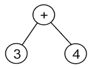

# 第六章：树

**树**是一种层次化的数据结构。列表、队列和栈等数据结构是线性的，因为项目以顺序方式存储。然而，树是一种非线性数据结构，因为项目之间存在**父子关系**。树的顶端数据结构被称为**根节点**。这是树中所有其他节点的祖先。

树数据结构非常重要，因为它们在各种应用中使用，例如解析表达式、高效搜索和优先队列。某些文档类型，如`XML`和`HTML`，也可以用树来表示。

在本章中，我们将介绍以下主题：

+   树的术语和定义

+   二叉树和二叉搜索树

+   树遍历

+   二叉搜索树

# 术语

让我们考虑一些与树数据结构相关的术语。

要理解树，我们首先需要了解与它们相关的概念。树是一种数据结构，其中数据以层次形式组织。

*图 6.1*包含一个典型的树，由字母`A`到`M`的字符节点组成：


图 6.1：示例树数据结构

下面是一个与树相关的术语列表：

+   **节点**：在前面的图中，每个圆圈中的字母代表一个节点。节点是任何存储数据的结构。

+   **根节点**：根节点是从其派生所有其他树节点的第一个节点。换句话说，根节点是一个没有父节点的节点。在每一棵树中，总有一个唯一的根节点。在上面的示例树中，根节点是节点`A`。

+   **子树**：子树是从某个其他树派生出的树。例如，节点`F`、`K`和`L`是原始树的子树。

+   **度**：给定节点的子节点总数称为该节点的**度**。只有一个节点的树具有度 0。在前面的图中，节点`A`的度是 2，节点`B`的度是 3，节点`C`的度是 3，节点`G`的度是 1。

+   **叶节点**：叶节点没有子节点，是给定树的终端节点。叶节点的度数总是 0。在前面的图中，节点`J`、`E`、`K`、`L`、`H`、`M`和`I`都是叶节点。

+   **边**：树中任意两个节点之间的连接称为边。给定树中的边总数将最多比节点总数少一个。一个示例边在*图 6.1*中显示。

+   **父节点**：具有子树节点的节点是该子树的父节点。例如，节点`B`是节点`D`、`E`和`F`的父节点，节点`F`是节点`K`和`L`的父节点。

+   **子节点**：这是一个从父节点派生的节点。例如，节点`B`和`C`是父节点`A`的子节点，而节点`H`、`G`和`I`是父节点`C`的子节点。

+   **兄弟节点**：所有具有相同父节点的节点都是兄弟节点。例如，节点 `B` 是节点 `C` 的兄弟节点，同样地，节点 `D`、`E` 和 `F` 也是兄弟节点。

+   **层级**：树的根节点被认为是处于层级 0。根节点的子节点被认为是处于层级 1，层级 1 的节点的子节点被认为是处于层级 2，依此类推。例如，在 *图 6.1* 中，根节点 `A` 处于层级 0，节点 `B` 和 `C` 处于层级 1，节点 `D`、`E`、`F`、`H`、`G` 和 `I` 处于层级 2。

+   **树的高度**：树中最长路径上的节点总数是树的高度。例如，在 *图 6.1* 中，树的高度是 4，因为最长的路径 `A`-`B`-`D`-`J`、`A`-`C`-`G`-`M` 和 `A`-`B`-`F`-`K` 都有四个节点。

+   **深度**：一个节点的深度是从树的根节点到该节点的边的数量。在先前的树示例中，节点 `H` 的深度是 2。

在线性数据结构中，数据项以顺序存储，而非线性数据结构以非线性顺序存储数据项，其中数据项可以连接到多个其他数据项。线性数据结构（如 *数组*、*列表*、*栈* 和 *队列*）中的所有数据项都可以一次遍历，而在非线性数据结构（如树）的情况下则不可能；它们以与其他线性数据结构不同的方式存储数据。

在树数据结构中，节点以父子关系排列。树中的节点之间不应存在任何循环。树结构通过节点形成层次结构，没有节点的树称为**空树**。

首先，我们将讨论最重要的一种树，那就是**二叉树**。

# 二叉树

二叉树是由节点组成的集合，其中树中的节点可以有零个、一个或两个子节点。一个简单的二叉树最多有两个子节点，即左子节点和右子节点。

例如，在 *图 6.2* 中显示的二叉树中，有一个根节点，它有两个子节点（一个左子节点，一个右子节点）：


图 6.2：二叉树的示例

二叉树中的节点以左子树和右子树的形式组织。例如，*图 6.3* 中显示的五个节点的树有一个根节点 `R` 和两个子树，即左子树 `T1` 和右子树 `T2`：


图 6.3：五个节点的二叉树示例

正规的二叉树在元素如何排列在树中没有其他规则。它应该只满足每个节点最多有两个子节点的条件。

如果二叉树的所有节点要么没有子节点，要么有两个子节点，并且没有节点只有一个子节点，则该树被称为**满二叉树**。*图 6.4* 中显示了一个满二叉树的示例：


图 6.4：满二叉树的示例

一个完全二叉树填充了二叉树中的所有节点，并且没有空间为任何新节点留白；如果我们添加新节点，它们只能通过增加树的高度来添加。一个示例完全二叉树如图*图 6.5*所示：


图 6.5：完全二叉树的示例

一个**完全二叉树**填充了除了树最低层可能有一个例外之外的所有可能的节点。所有节点也都在左侧填充。一个完全二叉树如图*图 6.6*所示：


图 6.6：完全二叉树的示例

二叉树可以是平衡的或不平衡的。在一个平衡的二叉树中，树中每个节点的左右子树的高度差不超过 1。一个平衡的树如图*图 6.7*所示：


图 6.7：平衡树的示例

不平衡的二叉树是右子树和左子树之间高度差超过 1 的二叉树。一个不平衡树的示例如图*图 6.8*所示：


图 6.8：不平衡树的示例

接下来，我们将讨论简单二叉树实现的细节。

## 树节点的实现

如我们已在前面章节中讨论过的，一个节点由数据项和其他节点的引用组成。

在二叉树节点中，每个节点将包含数据项和两个引用，分别指向它们的左子树和右子树。让我们看看以下代码，用于在 Python 中构建二叉树`Node`类：

```py
class Node:
    def __init__(self, data):
        self.data = data
        self.right_child = None
        self.left_child = None 
```

为了更好地理解这个类的运作，让我们首先创建一个包含四个节点——`n1`、`n2`、`n3`和`n4`——的二叉树，如图*图 6.9*所示：


图 6.9：四个节点的示例二叉树

为了此，我们首先创建四个节点——`n1`、`n2`、`n3`和`n4`：

```py
n1 = Node("root node")
n2 = Node("left child node")
n3 = Node("right child node")
n4 = Node("left grandchild node") 
Figure 6.9:
```

```py
n1.left_child = n2
n1.right_child = n3
n2.left_child = n4 
```

在这里，我们创建了一个由四个节点组成的非常简单的树结构。在创建树之后，要对树应用的最重要操作之一是**遍历**。接下来，我们将了解如何遍历树。

## 树遍历

访问树中所有节点的方法称为**树遍历**。在线性数据结构的情况下，数据元素遍历很简单，因为所有项目都是按顺序存储的，所以每个数据项只被访问一次。然而，在非线性数据结构的情况下，如树和图，遍历算法很重要。为了理解遍历，让我们遍历上一节创建的二叉树的左子树。为此，我们从根节点开始，打印出节点，然后沿着树向下移动到下一个左节点。我们一直这样做，直到我们到达左子树的末尾，如下所示：

```py
current = n1
while current:
    print(current.data)
    current = current.left_child 
```

上述代码块遍历的输出如下：

```py
root node
left child node
left grandchild node 
```

根据访问根节点、左子树或右子树的顺序，有多种处理和遍历树的方法。主要来说，有两种方法，第一种是我们从一个节点开始，遍历所有可用的子节点，然后继续遍历到下一个兄弟节点。这种方法有三种可能的变体，即**中序**、**先序**和**后序**。另一种遍历树的方法是从根节点开始，然后访问每一层的所有节点，并逐层处理节点。我们将在以下各节中讨论每种方法。

### 中序遍历

中序树遍历的工作原理如下：我们开始递归地遍历左子树，一旦左子树被访问，就访问根节点，然后最终递归地访问右子树。它有以下三个步骤：

+   我们开始遍历左子树，并递归地调用排序函数

+   接下来，我们访问根节点

+   最后，我们遍历右子树，并递归地调用排序函数

因此，简而言之，对于中序树遍历，我们按照左子树、根、然后右子树的顺序访问树中的节点。

让我们考虑一个在*图 6.10*中显示的示例树，以理解中序树遍历：


图 6.10：用于中序树遍历的示例二叉树

在*图 6.10*中显示的二叉树中，中序遍历的工作原理如下：首先，我们递归地访问根节点`A`的左子树。节点`A`的左子树的根节点是`B`，因此我们再次访问根节点`B`的左子树，即节点`D`。我们递归地访问根节点`D`的左子树，以便我们得到根节点`D`的左孩子。我们访问左孩子`G`，然后访问根节点`D`，接着访问右孩子`H`。

接下来，我们访问节点`B`，然后访问节点`E`。这样，我们已经访问了根节点`A`的左子树。接下来，我们访问根节点`A`。之后，我们访问根节点`A`的右子树。在这里，我们首先访问根节点`C`的左子树，它是空的，所以接下来我们访问节点`C`，然后我们访问节点`C`的右孩子，即节点`F`。

因此，这个示例树的中序遍历是`G`-`D`-`H`-`B`-`E`-`A`-`C`-`F`。

返回树中节点中序列表的递归函数的 Python 实现如下：

```py
def inorder(root_node):
    current = root_node
    if current is None:
        return
    inorder(current.left_child)
    print(current.data)
    inorder(current.right_child)
inorder(n1) 
```

首先，我们检查当前节点是否为空或为空。如果不为空，我们遍历树。我们通过打印访问的节点来访问节点。在这种情况下，我们首先递归地调用`inorder`函数，传入`current.left_child`，然后访问根节点，最后递归地调用`inorder`函数，传入`current.right_child`。

最后，当我们将上述中序遍历算法应用于上述四个节点的示例树时，以`n1`作为根节点，我们得到以下输出：

```py
left grandchild node
left child node
root node
right child node 
```

接下来，我们将讨论前序遍历。

### 前序遍历

前序树遍历按照根节点、左子树，然后是右子树的顺序遍历树。它的工作方式如下：

1.  我们从根节点开始遍历

1.  接下来，我们遍历左子树，并递归地调用带有左子树的排序函数

1.  接下来，我们递归地访问右子树并调用带有右子树的排序函数

考虑*图 6.11*所示的示例树来理解前序遍历：


图 6.11：理解前序遍历的示例树

如*图 6.11*所示的示例二叉树的前序遍历工作如下：首先，我们访问根节点`A`。接下来，我们访问根节点`A`的左子树。节点`A`的左子树以节点`B`为根，因此我们访问这个根节点，然后访问根节点`B`的左子树，节点`D`。我们访问节点`D`，然后访问根节点`D`的左子树，然后访问左孩子，`G`，它是根节点`D`的子树。由于节点`G`没有子节点，我们访问右子树。我们访问根节点`D`的子树的右孩子，节点`H`。接下来，我们访问根节点`B`的子树的右孩子，节点`E`。

以这种方式，我们已经访问了根节点`A`和根节点`A`的左子树。接下来，我们访问根节点`A`的右子树。在这里，我们访问根节点`C`，然后我们访问根节点`C`的左子树，它是空的，所以我们访问节点`C`的右孩子，节点`F`。

这个示例树的前序遍历将是`A`-`B`-`D`-`G`-`H`-`E`-`C`-`F`。

前序树遍历的递归函数如下：

```py
def preorder(root_node):
    current = root_node
    if current is None:
        return
    print(current.data)
    preorder(current.left_child)
    preorder(current.right_child)
preorder(n1) 
```

首先，我们检查当前节点是否为空或为空。如果它是空的，这意味着树是一个空树；如果当前节点不为空，那么我们使用前序算法遍历树。前序遍历算法递归地按照根、左子树和右子树的顺序遍历树，如上述代码所示。最后，当我们对上述以`n1`节点作为根节点的四个节点的示例树应用上述前序遍历算法时，我们得到以下输出：

```py
root node
left child node
left grandchild node
right child node 
```

接下来，我们将讨论后序遍历。

### 后序遍历

后序树遍历的工作方式如下：

1.  我们开始遍历左子树，并递归地调用排序函数

1.  接下来，我们递归地遍历右子树并调用排序函数

1.  最后，我们访问根节点

因此，简而言之，对于后序树遍历，我们按照左子树、右子树，最后是根节点的顺序访问树中的节点。

考虑以下示例树，如*图 6.12*所示，来理解后序树遍历：


图 6.12：理解前序遍历的示例树

在前面的图，*图 6.12* 中，我们首先递归地访问根节点 `A` 的左子树。我们到达最后一个左子树，即根节点 `D`，然后我们访问它左边的节点，即节点 `G`。在此之后，我们访问右子节点 `H`，然后访问根节点 `D`。遵循相同的规则，我们接下来访问节点 `B` 的右子节点，即节点 `E`。然后，我们访问节点 `B`。在此基础上，我们遍历节点 `A` 的右子树。在这里，我们首先到达最后一个右子树并访问节点 `F`，然后访问节点 `C`。最后，我们访问根节点 `A`。

对于这个示例树的后序遍历将是 `G`-`H`-`D`-`E`-`B`-`F`-`C`-`A`。

树遍历的后序方法的实现如下：

```py
def postorder( root_node):
    current = root_node
    if current is None:
        return
    postorder(current.left_child)
    postorder(current.right_child)
    print(current.data)
postorder(n1) 
```

首先，我们检查当前节点是否为空或空。如果不为空，我们使用前面讨论的后序算法遍历树，最后，当我们对上面以 `n1` 作为根节点的四个节点的示例树应用上述后序遍历算法时，我们得到以下输出：

```py
left grandchild node
left child node
right child node
root node 
```

接下来，我们将讨论层次遍历。

### 层次遍历

在这种遍历方法中，我们首先访问树的根节点，然后再访问树的下一层的每个节点。然后，我们继续访问树的下一层，依此类推。这种树遍历方式是图中的广度优先遍历，因为它在深入树之前先遍历了同一层的所有节点。

让我们考虑以下示例树并遍历它：


图 6.13：理解层次遍历的示例树

在 *图 6.13* 中，我们首先访问第 0 层的根节点，其值为 `4`。我们通过打印其值来访问此节点。接下来，我们移动到第 1 层并访问此层的所有节点，这些节点的值分别为 `2` 和 `8`。最后，我们移动到树的下一层，即第 3 层，并访问此层的所有节点，这些节点的值分别为 `1`、`3`、`5` 和 `10`。因此，此树的层次遍历顺序如下：`4`、`2`、`8`、`1`、`3`、`5` 和 `10`。

这种层次遍历树是通过使用队列数据结构实现的。我们首先访问根节点，并将其推入队列。队列前面的节点被访问（出队），然后可以打印或存储以供以后使用。在添加根节点后，将左子节点添加到队列中，然后是右子节点。因此，在遍历树的任何给定层时，首先从左到右将那一层的所有数据项插入队列中。之后，逐个从队列中访问所有节点。这个过程重复应用于树的每一层。

使用此算法遍历前面的树将入队根节点`4`，出队并访问该节点。接下来，节点`2`和`8`被入队，因为它们是下一级的左节点和右节点。节点`2`被出队以便访问。接下来，它的左节点和右节点，节点`1`和`3`，被入队。此时，队列前面的节点是节点`8`。我们出队并访问节点`8`，之后将其左节点和右节点入队。这个过程一直持续到队列为空。

Python 中广度优先遍历的实现如下。我们将根节点入队，并在`list_of_nodes`列表中保持已访问节点的列表。使用`dequeue`类来维护队列：

```py
from collections import deque
class Node:
    def __init__(self, data):
        self.data = data
        self.right_child = None
        self.left_child = None

n1 = Node("root node")
n2 = Node("left child node")
n3 = Node("right child node")
n4 = Node("left grandchild node")
n1.left_child = n2
n1.right_child = n3
n2.left_child = n4

def level_order_traversal(root_node):
    list_of_nodes = []
    traversal_queue = deque([root_node])
    while len(traversal_queue) > 0:
        node = traversal_queue.popleft()
        list_of_nodes.append(node.data)
        if node.left_child:
            traversal_queue.append(node.left_child)
            if node.right_child:
                traversal_queue.append(node.right_child)
    return list_of_nodes
print(level_order_traversal(n1)) 
```

如果`traversal_queue`中的元素数量大于零，则执行循环体。将队列前面的节点弹出并添加到`list_of_nodes`列表中。第一个`if`语句如果提供的`node`存在左节点，则将左子节点入队。第二个`if`语句对右子节点做同样的处理。此外，在最后一个语句中返回`list_of_nodes`列表。

上述代码的输出如下：

```py
['root node', 'left child node', 'right child node', 'left grandchild node'] 
```

我们已经讨论了不同的树遍历算法；我们可以根据应用选择使用这些算法中的任何一个。当我们需要从树中获取排序内容时，中序遍历非常有用。这也适用于我们需要按降序排列项的情况，我们可以通过反转顺序来实现，例如右子树、根节点，然后是左子树。这被称为逆中序遍历。而且，如果我们需要在任何叶子节点之前检查根节点，我们使用前序遍历。同样地，如果我们需要在根节点之前检查叶子节点。

二叉树的一些重要应用如下：

1.  二叉树作为表达式树在编译器中使用

1.  它也用于数据压缩中的霍夫曼编码

1.  二叉搜索树用于高效地搜索、插入和删除列表中的项目

1.  **优先队列**（**PQ**），用于在元素集合中以对数时间复杂度（在最坏情况下）查找和删除最小或最大项

接下来，让我们讨论表达式树。

## 表达式树

表达式树是一种特殊的二叉树，可以用来表示算术表达式。算术表达式由运算符和操作数组合而成，其中运算符可以是单目或双目。在这里，运算符表示我们想要执行哪种操作，而运算符告诉我们我们想要应用这些操作的数据项。如果运算符应用于一个操作数，则称为单目运算符；如果应用于两个操作数，则称为双目运算符。

算术表达式也可以使用二叉树来表示，这也被称为表达式树。**中缀**表示法是一种常用的表示法，用于表达算术表达式，其中运算符位于操作数之间。它是一种常用的表示算术表达式的方法。在表达式树中，所有叶节点包含操作数，而非叶节点包含运算符。还值得注意的是，在单目运算符的情况下，表达式树将会有一个子树（右或左）为空。

算术表达式可以使用三种表示法来表示：**中缀**、**后缀**或**前缀**。表达式的中序遍历会产生中缀表示法。例如，`3 + 4`的表达式树将如图*图 6.14*所示：



图 6.14：表达式 3 + 4 的表达式树

在这个例子中，运算符被插入（中缀）在操作数之间，如`3 + 4`。当需要时，可以使用括号来构建更复杂的表达式。例如，对于`(4 + 5) * (5 - 3)`，我们会得到以下结果：


图 6.15：表达式(4 + 5) * (5-3)的表达式树

前缀表示法通常被称为*波兰表示法*。在这种表示法中，运算符位于其操作数之前。例如，用于将两个数字 3 和 4 相加的算术表达式将表示为`+ 3 4`。让我们再举一个例子，`(3 + 4) * 5`。在前缀表示法中，这也可以表示为`* (+ 3 4) 5`。表达式的先序遍历会产生算术表达式的前缀表示法。例如，考虑*图 6.16*中所示的表达式树：


图 6.16：一个示例表达式树，用于理解先序遍历

*图 6.16*中所示的表达式树的先序遍历将给出前缀表示法的表达式，即`+- 8 3 3`。

后缀，或称为**逆波兰表示法**（**RPN**），将运算符放在操作数之后，例如`3 4 +`。*图 6.17*中所示的表达式树的后续遍历给出了算术表达式的后缀表示法。


图 6.17：一个示例表达式树，用于理解后序遍历

上述表达式树的后缀表示法为`8 3 -3 +`。我们已经讨论了表达式树。由于它提供了更快的计算，因此使用逆波兰表示法来评估给定算术表达式的表达式树很容易。

### 解析逆波兰表达式

要从后缀表示法创建表达式树，使用一个栈。在这里，我们一次处理一个符号；如果符号是操作数，则将其引用推入栈中，如果符号是运算符，则从栈中弹出两个指针并形成一个新子树，其根是运算符。从栈中弹出的第一个引用是子树的右侧子节点，第二个引用成为子树的左侧子节点。进一步，将此新子树的引用推入栈中。以这种方式，处理所有后缀表示法的符号以创建表达式树。

让我们以 `4 5 + 5 3 - *` 为例。

首先，我们将符号 `4` 和 `5` 推入栈中，然后我们按照 *图 6.18* 中的方式处理下一个符号 `+`：


图 6.18：操作数 4 和 5 被推入栈中

当读取新的符号 `+` 时，它被转换为新子树的根节点，然后从栈中弹出两个引用，最上面的引用被添加为根节点的右侧，下一个弹出的引用被添加为子树的左侧子节点，如图 *图 6.19* 所示：


图 6.19：在创建表达式树时处理运算符 +

下一个符号是 `5` 和 `3`，它们被推入栈中。接下来，当新的符号是一个运算符（`-`）时，它被创建为新子树的根，然后从栈中弹出两个顶部引用，分别添加到根的右侧和左侧子节点，如图 *图 6.20* 所示。然后，将此子树的引用推入栈中：


图 6.20：在创建表达式树时处理运算符（-）

下一个符号是运算符 `*`；如我们所做的那样，这将作为根创建，然后从栈中弹出两个引用，如图 *图 6.21* 所示。最终的树如图 *图 6.21* 所示：


图 6.21：在创建表达式树时处理运算符（*）

要了解如何在 Python 中实现此算法，我们将查看如何为后缀表示法编写的表达式构建树。为此，我们需要一个树节点实现；它可以定义为如下：

```py
class TreeNode:
    def __init__(self, data=None):
        self.data = data
        self.right = None
        self.left = None 
```

下面的代码是我们将要使用的栈类实现的代码：

```py
class Stack:
    def __init__(self):
        self.elements = []

    def push(self, item):
        self.elements.append(item)

    def pop(self):
        return self.elements.pop() 
```

为了构建树，我们将借助栈来列出项目。让我们以一个算术表达式为例，并设置我们的栈：

```py
expr = "4 5 + 5 3 - *".split()
stack = Stack() 
```

在第一个语句中，`split()` 方法默认按空白分隔。`expr` 是一个包含值 `4`、`5`、`+`、`5`、`3`、`-` 和 `*` 的列表。

`expr` 列表中的每个元素都将是一个运算符或操作数。如果我们得到一个操作数，那么我们将其嵌入到一个树节点中并将其推入栈中。如果我们得到一个运算符，我们将运算符嵌入到一个树节点中，并将其两个操作数弹出并放入节点的左右子节点中。在这里，我们必须注意确保第一次 `pop` 引用进入右子节点。

在前面的代码片段之后，下面的代码是一个循环来构建树：

```py
for term in expr:
    if term in "+-*/":
        node = TreeNode(term)
        node.right = stack.pop()
        node.left = stack.pop()
    else:
        node = TreeNode(int(term))
    stack.push(node) 
```

注意，在操作数的情况下，我们执行从 `string` 到 `int` 的转换。如果你希望支持浮点操作数，你可以使用 `float()`。

在此操作结束时，我们应该在栈中有一个单独的元素，它包含整个树。

如果我们要评估表达式，我们可以使用以下函数：

```py
def calc(node):
    if node.data == "+":
        return calc(node.left) + calc(node.right)
    elif node.data == "-":
        return calc(node.left) - calc(node.right)
    elif node.data == "*":
        return calc(node.left) * calc(node.right)
    elif node.data == "/":
        return calc(node.left) / calc(node.right)
    else:
        return node.data 
```

在前面的代码中，我们向函数传递一个节点。如果节点包含一个操作数，那么我们只需返回该值。如果我们得到一个运算符，那么我们在节点的两个子节点上执行运算符所表示的操作。然而，由于一个或多个子节点也可能包含运算符或操作数，我们在两个子节点上递归地调用 `calc()` 函数（记住，每个节点的所有子节点也是节点）。

现在，我们只需将根节点从栈中弹出并传递给 `calc()` 函数。然后，我们应该得到计算结果：

```py
root = stack.pop()
result = calc(root)
print(result) 
```

运行此程序应得到结果 `18`，这是 `(4 + 5) * (5 - 3)` 的结果。

表达式树在轻松表示和评估复杂表达式方面非常有用。它也有助于评估后缀、前缀和中缀表达式。它可以用来找出给定表达式中的运算符的结合性。

在下一节中，我们将讨论二叉搜索树，它是一种特殊的二叉树。

# 二叉搜索树

**二叉搜索树**（**BST**）是一种特殊的二叉树。它是计算机科学应用中最重要且最常用的数据结构之一。二叉搜索树是一种结构上为二叉树的树，并且在其节点中非常有效地存储数据。它提供了非常快的搜索、插入和删除操作。

如果树中任何节点的值都大于其左子树中所有节点的值，并且小于（或等于）其右子树中所有节点的值，则称为二叉搜索树。例如，如果 `K1`、`K2` 和 `K3` 是三个节点树中的关键值（如图 *6.22* 所示），那么它应该满足以下条件：

+   关键值 *K2<=K1*

+   关键值 *K3>K1*

以下图描述了二叉搜索树的上述条件：


图 6.22：二叉搜索树的一个示例

让我们考虑另一个例子，以便我们更好地理解二叉搜索树。考虑图 *6.23* 所示的二叉搜索树：


图 6.23：六个节点的二叉搜索树

在这个树中，左子树中的所有节点值都小于（或等于）其父节点的值。这个节点的右子树中的所有节点值也都大于其父节点的值。

为了查看上述示例树是否满足二叉搜索树的属性，我们看到根节点的左子树中的所有节点值都小于 `5`。同样，右子树中的所有节点值都大于 `5`。这个属性适用于树中的所有节点，没有例外。例如，如果我们取另一个值为 `3` 的节点，我们可以看到所有左子树节点的值都小于 `3`，而所有右子树节点的值都大于 `3`。

考虑另一个二叉树的示例。让我们检查它是否是一个二叉搜索树。尽管以下图，*图 6.24*，看起来与前面的图相似，但它不符合二叉搜索树的资格，因为节点 `7` 大于根节点 `5`；即使它位于根节点的左子树中。节点 `4` 在其父节点 `7` 的右子树中，这也违反了二叉搜索树的规则。因此，以下图，*图 6.24*，不是一个二叉搜索树：


图 6.24：一个不是二叉搜索树的二叉树示例

让我们在 Python 中开始实现二叉搜索树。由于我们需要跟踪树的根节点，我们首先创建一个 `Tree` 类，它包含对根节点的引用：

```py
class Tree:
    def __init__(self):
        self.root_node = None 
```

这就是维护树状态所需的所有操作。现在，让我们检查在二叉搜索树中使用的所有主要操作。

## 二叉搜索树操作

可以在二叉搜索树上执行的操作有 `insert`、`delete`、`寻找最小值`、`寻找最大值` 和 `搜索`。我们将在以下各节中逐一详细讨论它们。

### 插入节点

在二叉搜索树上要实现的最重要操作之一是在树中插入数据项。为了将新元素插入到二叉搜索树中，我们必须确保在添加新元素后二叉搜索树的属性没有被违反。

为了插入一个新元素，我们首先比较新节点的值与根节点的值：如果值小于根值，则新元素将被插入到左子树中；否则，它将被插入到右子树中。以这种方式，我们走到树的末端来插入新元素。

让我们在树中插入数据项 `5`、`3`、`7` 和 `1` 来创建一个二叉搜索树。考虑以下情况：

1.  **插入 5**：我们从第一个数据项 `5` 开始。为此，我们将创建一个节点，其数据属性设置为 `5`，因为它是第一个节点。

1.  **插入 3**：现在，我们想要添加一个值为 `3` 的第二个节点，以便将 `3` 的数据值与根节点的现有值 `5` 进行比较。由于节点值 `3` 小于 `5`，它将被放置在节点 `5` 的左子树中。二叉搜索树将看起来像 *图 6.25* 所示：

    图 6.25：示例二叉搜索树插入操作的步骤 2

    在这里，树满足二叉搜索树规则，即左子树中的所有节点都小于父节点。

1.  **插入 7**：要将另一个值为 `7` 的节点添加到树中，我们从值为 `5` 的根节点开始，并进行比较，如图 *图 6.26* 所示。由于 `7` 大于 `5`，值为 `7` 的节点被放置在这个根的右侧：


图 6.26：示例二叉搜索树插入操作的步骤 3

1.  **插入 1**：接下来，我们添加另一个值为 `1` 的节点。从树的根开始，我们将 `1` 与 `5` 进行比较，如图 *图 6.27* 所示：


图 6.27：示例二叉搜索树插入操作的步骤 4

这种比较表明 `1` 小于 `5`，因此我们进入 `5` 的左子树，该子树有一个值为 `3` 的节点，如图 *图 6.28* 所示：


图 6.28：示例二叉搜索树中节点 1 和节点 3 的比较

当我们将 `1` 与 `3` 进行比较时，`1` 小于 `3`，因此我们向下移动到节点 `3` 的下一级，并移动到其左侧，如图 *图 6.28* 所示。然而，那里没有节点。因此，我们创建一个值为 `1` 的节点，并将其与节点 `3` 的左指针关联，以获得最终的树。在这里，我们有了包含 `4` 个节点的最终二叉搜索树，如图 *图 6.29* 所示：


图 6.29：示例二叉搜索树插入操作的最终步骤

我们可以看到，这个例子只包含整数或数字。因此，如果我们需要在二叉搜索树中存储字符串数据，字符串将按字母顺序进行比较。

如果我们想在二叉搜索树中存储任何自定义数据类型，我们必须确保二叉搜索树类支持排序。

在二叉搜索树中添加节点的方法 `insert` 的 Python 实现如下：

```py
class Node:
    def __init__(self, data):
        self.data = data
        self.right_child = None
        self.left_child = None
class Tree:
    def __init__(self):
        self.root_node = None
    def insert(self, data):
        node = Node(data)
        if self.root_node is None:
            self.root_node = node
            return self.root_node
        else:
            current = self.root_node
            parent = None
            while True:
                parent = current
                if node.data < parent.data:
                    current = current.left_child
                    if current is None:
                        parent.left_child = node
                        return self.root_node
                else:
                    current = current.right_child
                    if current is None:
                        parent.right_child = node
                        return self.root_node 
```

在上述代码中，我们首先使用 `Tree` 类声明 `Node` 类。可以在 `Tree` 类中定义可以应用于树的所有操作。让我们了解 `insert` 方法的步骤。我们从函数声明开始：

```py
 def insert(self, data): 
```

接下来，我们使用 `Node` 类封装数据。我们检查是否有一个根节点。如果没有树中的根节点，新节点将成为根节点，然后返回根节点：

```py
 node = Node(data)
        if self.root_node is None:
            self.root_node = node
            return self.root_node
        else: 
```

此外，为了插入一个新元素，我们必须遍历树并到达可以插入新元素的正确位置，同时确保二叉搜索树的性质不被违反。为此，我们在遍历树的同时跟踪当前节点及其父节点。`current`变量始终用于跟踪新节点将被插入的位置：

```py
 current = self.root_node
        parent = None
        while True:
            parent = current 
```

在这里，我们必须进行比较。如果新节点中的数据小于当前节点中的数据，那么我们检查当前节点是否有左子节点。如果没有，这就是我们插入新节点的位置。否则，我们继续遍历：

```py
 if node.data < parent.data:
                current = current.left_child
                if current is None:
                    parent.left_child = node
                    return self.root_node 
```

在此之后，我们需要处理大于（或等于）的情况。如果当前节点没有右子节点，则新节点作为右子节点插入。否则，我们向下移动并继续寻找插入点：

```py
 else:
                current = current.right_child
                if current is None:
                    parent.right_child = node
                    return self.root_node 
```

现在，为了查看我们在二叉搜索树中插入的内容，我们可以使用任何现有的树遍历算法。让我们实现中序遍历，这应该在`Tree`类中定义。代码如下：

```py
 def inorder(self, root_node):
        current = root_node
        if current is None:
            return
        self.inorder(current.left_child)
        print(current.data)
        self.inorder(current.right_child) 
```

现在，让我们以插入几个元素（例如元素`5`、`2`、`7`、`9`和`1`）到二叉搜索树为例，如图*图 6.24*所示，然后我们可以使用中序遍历算法来查看我们在树中插入的内容：

```py
tree = Tree()
r = tree.insert(5)
r = tree.insert(2)
r = tree.insert(7)
r = tree.insert(9)
r = tree.insert(1)

tree.inorder(r) 
```

上述代码的输出如下：

```py
1
2
5
7
9 
```

在二叉搜索树中插入一个节点的时间复杂度为`O(h)`，其中`h`是树的高度。

### 搜索树

二叉搜索树是一种树形数据结构，其中每个节点的左子树的所有节点都具有比该节点更低的键值，而右子树具有更高的键值。因此，搜索具有给定键值的元素相当容易。让我们考虑一个具有节点`1`、`2`、`3`、`4`、`8`、`5`和`10`的示例二叉搜索树，如图*图 6.30*所示：


图 6.30：具有七个节点的示例二叉搜索树

在前面显示的*图 6.30*的树中，如果我们想搜索具有值`5`的节点，例如，我们从根节点开始，将根节点与我们的目标值进行比较。由于节点`5`的值大于根节点的值`4`，我们移动到右子树。在右子树中，我们有节点`8`作为根节点，因此我们将节点`5`与节点`8`进行比较。由于要搜索的节点值小于节点`8`，我们将其移动到左子树。当我们移动到左子树时，我们将左子树节点`5`与所需的节点值`5`进行比较。这是一个匹配，因此我们返回`"item found"`。

这里是二叉搜索树中搜索方法的实现，该方法正在`Tree`类中定义：

```py
 def search(self, data):
        current = self.root_node
        while True:
            if current is None:
                print("Item not found")
                return None
            elif current.data is data:
                print("Item found", data)
                return data
            elif current.data > data:
                current = current.left_child
            else:
                current = current.right_child 
```

在前面的代码中，如果找到了数据，我们返回数据，如果没有找到，则返回`None`。我们从根节点开始搜索。接下来，如果要搜索的数据项在树中不存在，我们返回`None`。如果我们找到了数据，则返回。

如果我们正在搜索的数据小于当前节点的数据，我们向下到树的左侧。此外，在代码的`else`部分，我们检查我们正在寻找的数据是否大于当前节点持有的数据，这意味着我们向下到树的右侧。

最后，以下代码可以用来创建一个具有 1 到 10 之间一些值的示例二叉搜索树。然后，我们搜索具有值`9`的数据项，以及该范围内的所有数字。存在于树中的那些数字将被打印出来：

```py
tree = Tree()
tree.insert(5)
tree.insert(2)
tree.insert(7)
tree.insert(9)
tree.insert(1)
tree.search(9) 
```

上述代码的输出如下：

```py
Item found 9 
```

在上面的代码中，我们看到树中存在的项目已经被正确找到；其余的项目在 1 到 10 的范围内找不到。在下一节中，我们将讨论二叉搜索树中节点的删除。

### 删除节点

在二叉搜索树上的另一个重要操作是节点的删除或移除。在这个过程中，我们需要注意三种可能的情况。我们想要删除的节点可能具有以下情况：

+   **没有子节点**：如果没有叶子节点，则直接删除该节点

+   **一个子节点**：在这种情况下，我们将该节点的值与其子节点交换，然后删除该节点

+   **两个子节点**：在这种情况下，我们首先找到中序后继或前驱，交换它们的值，然后删除那个节点

第一种情况最容易处理。如果即将被删除的节点没有子节点，我们可以简单地从其父节点中删除它。在*图 6.31*中，假设我们想要删除没有子节点的节点`A`。在这种情况下，我们可以简单地从其父节点（节点`Z`）中删除它：


图 6.31：删除没有子节点的节点时的删除操作

在第二种情况下，当我们要删除的节点有一个子节点时，该节点的父节点被设置为指向该特定节点的子节点。让我们看看以下图表，其中我们想要删除有一个子节点`5`（如*图 6.32*所示）的节点`6`：


图 6.32：删除具有一个子节点的节点时的删除操作

为了删除节点`6`，该节点只有一个子节点`5`，我们将节点`9`的左指针指向节点`5`。在这里，我们需要确保子节点和父节点的关系符合二叉搜索树的属性。

在第三种情况下，当要删除的节点有两个子节点时，为了删除它，我们首先找到一个后继节点，然后将后继节点的内容移动到要删除的节点中。后继节点是要删除节点的右子树中具有最小值的节点；它将是当我们对要删除节点的右子树进行中序遍历时第一个元素。

让我们通过*图 6.33*中显示的示例树来理解它，其中我们想要删除具有两个子节点的节点`9`：


图 6.33：删除具有两个子节点的节点时的删除操作

在图 6.33 所示的示例树中，我们找到节点右子树中的最小元素（即在右子树中顺序遍历的第一个元素），即节点 `12`。之后，我们将节点 `9` 的值替换为 `12` 并删除节点 `12`。节点 `12` 没有子节点，因此我们相应地应用删除没有子节点的规则。

要使用 Python 实现上述算法，我们需要编写一个辅助方法来获取我们想要删除的节点及其父节点的引用。我们必须编写一个单独的方法，因为我们没有在 `Node` 类中找到任何父节点的引用。这个辅助方法 `get_node_with_parent` 与 `search` 方法类似，它找到要删除的节点，并返回该节点及其父节点：

```py
 def get_node_with_parent(self, data):
        parent = None
        current = self.root_node
        if current is None:
            return (parent, None)
        while True:
            if current.data == data:
                return (parent, current)
            elif current.data > data:
                parent = current
                current = current.left_child
            else:
                parent = current
                current = current.right_child
        return (parent, current) 
```

唯一的区别在于，在我们更新循环中的当前变量之前，我们使用 `parent = current` 存储其父节点。实际删除节点的操作方法从以下搜索开始：

```py
 def remove(self, data):
        parent, node = self.get_node_with_parent(data)
        if parent is None and node is None:
            return False
        # Get children count
        children_count = 0
        if node.left_child and node.right_child:
            children_count = 2
        elif (node.left_child is None) and (node.right_child is None):
            children_count = 0
        else:
            children_count = 1 
```

我们使用 `parent`, `node = self.get_node_with_parent(data)` 将父节点和找到的节点分别传递给 `parent` 和 `node`。了解我们想要删除的节点有多少个子节点非常重要，我们在 `if` 语句中这样做。

一旦我们知道要删除的节点有多少个子节点，我们需要处理各种可以删除节点的条件。`if` 语句的第一部分处理的是节点没有子节点的情况：

```py
 if children_count == 0:
            if parent:
                if parent.right_child is node:
                    parent.right_child = None
                else:
                    parent.left_child = None
            else:
                self.root_node = None 
```

在要删除的节点只有一个子节点的情况下，`if` 语句的 `elif` 部分执行以下操作：

```py
 elif children_count == 1:
            next_node = None
            if node.left_child:
                next_node = node.left_child
            else:
                next_node = node.right_child
            if parent:
                if parent.left_child is node:
                    parent.left_child = next_node
                else:
                    parent.right_child = next_node
            else:
                self.root_node = next_node 
```

`next_node` 用于跟踪单个节点，即要删除的节点的子节点。然后我们将 `parent.left_child` 或 `parent.right_child` 连接到 `next_node`。

最后，我们处理要删除的节点有两个子节点的情况：

```py
 else:
            parent_of_leftmost_node = node
            leftmost_node = node.right_child
            while leftmost_node.left_child:
                parent_of_leftmost_node = leftmost_node
                leftmost_node = leftmost_node.left_child
            node.data = leftmost_node.data 
```

在寻找顺序后继时，我们使用 `leftmost_node = node.right_child` 移动到右侧节点。只要存在左节点，`leftmost_node.left_child` 将为 `True`，`while` 循环将运行。当我们到达最左节点时，它要么是一个叶子节点（意味着它将没有子节点）或者有一个右子节点。

我们使用 `node.data = leftmost_node.data` 更新即将被删除的节点，使其具有顺序后继节点的值：

```py
 if parent_of_leftmost_node.left_child == leftmost_node:
                parent_of_leftmost_node.left_child = leftmost_node.right_child
            else:
                parent_of_leftmost_node.right_child = leftmost_node.right_child 
```

前面的语句使我们能够正确地将最左节点的父节点连接到任何子节点。观察等号右侧保持不变。这是因为顺序后继节点只能有一个右子节点作为其唯一的子节点。

以下代码演示了如何在 `Tree` 类中使用 `remove` 方法：

```py
tree = Tree()
tree.insert(5)
tree.insert(2)
tree.insert(7)
tree.insert(9)
tree.insert(1)
tree.search(9)
tree.remove(9)
tree.search(9) 
```

上述代码的输出是：

```py
Item found 9
Item not found 
```

在上述代码中，当我们搜索项目 `9` 时，它在树中可用，并且在删除方法之后，项目 `9` 不再存在于树中。在最坏的情况下，`remove` 操作的时间复杂度为 `O(h)`，其中 `h` 是树的高度。

### 查找最小和最大节点

二叉搜索树的结构使得搜索具有最大或最小值的节点非常容易。为了找到树中最小的节点，我们从树的根节点开始遍历，每次都访问左节点，直到我们到达树的末尾。同样，我们递归地遍历右子树，直到我们到达树的末尾以找到树中最大的节点。

例如，考虑*图 6.34*，为了搜索最小和最大元素。


图 6.34：在二叉搜索树中找到最小和最大节点

在这里，我们首先从根节点 `6` 向下移动到 `3`，然后从节点 `3` 移动到 `1` 以找到具有最小值的节点。同样，为了从树中找到最大值节点，我们沿着树的右侧从根节点向下移动，因此我们从节点 `6` 移动到节点 `8`，然后从节点 `8` 移动到节点 `10` 以找到具有最大值的节点。

返回任何节点最小值的 Python 实现方法如下：

```py
 def find_min(self):
        current = self.root_node
        while current.left_child:
            current = current.left_child
        return current.data 
```

`while` 循环继续获取左节点并访问它，直到最后一个左节点指向 `None`。这是一个非常简单的方法。

同样，以下代码是返回最大节点的方法的代码：

```py
 def find_max(self):
        current = self.root_node
        while current.right_child:
            current = current.right_child
        return current.data 
```

以下代码演示了如何在 `Tree` 类中使用 `find_min` 和 `find_max` 方法：

```py
tree = Tree()
tree.insert(5)
tree.insert(2)
tree.insert(7)
tree.insert(9)
tree.insert(1)
print(tree.find_min())
print(tree.find_max()) 
```

上述代码的输出如下所示：

```py
1
9 
```

上述代码的输出，`1` 和 `9`，分别是最小值和最大值。树中的最小值是 `1`，最大值是 `9`。在二叉搜索树中查找最小或最大值的运行时间复杂度是 `O(h)`，其中 `h` 是树的高度。

## 二叉搜索树的好处

通常情况下，当我们主要对任何应用程序中频繁访问元素感兴趣时，与数组和链表相比，二叉搜索树是一个更好的选择。二叉搜索树对于大多数操作，如搜索、插入和删除，都非常快，而数组提供快速的搜索，但在插入和删除操作方面相对较慢。同样，链表在执行插入和删除操作时效率很高，但在执行搜索操作时较慢。从二叉搜索树中搜索元素的最好情况运行时间复杂度是 `O(log n)`，最坏情况时间复杂度是 `O(n)`，而列表中搜索的最好和最坏情况时间复杂度都是 `O(n)`。

下表提供了数组、链表和二叉搜索树数据结构的比较：

| **属性** | **数组** | **链表** | **BST** |
| --- | --- | --- | --- |
| 数据结构 | 线性 | 线性 | 非线性 |
| 使用便捷性 | 创建和使用简单。搜索、插入和删除的平均情况复杂度为 `O(n)`。 | 插入和删除速度快，尤其是在使用双链表时。 | 元素访问、插入和删除速度快，平均情况复杂度为 `O(log n)`。 |
| 访问复杂度 | 容易访问元素。复杂度为 `O(1)`。 | 只能进行顺序访问，因此较慢。平均和最坏情况复杂度为 `O(n)`。 | 访问速度快，但当树不平衡时较慢，最坏情况复杂度为 `O(n)`。 |
| 搜索复杂度 | 平均和最坏情况复杂度为 `O(n)`。 | 由于顺序搜索，较慢。平均和最坏情况复杂度为 `O(n)`。 | 搜索的最坏情况复杂度为 `O(n)`。 |
| 插入复杂度 | 插入较慢。平均和最坏情况复杂度为 `O(n)`。 | 平均和最坏情况复杂度为 `O(1)`。 | 插入的最坏情况复杂度为 `O(n)`。 |
| 删除复杂度 | 删除较慢。平均和最坏情况复杂度为 `O(n)`。 | 平均和最坏情况复杂度为 `O(1)`。 | 删除的最坏情况复杂度为 `O(n)`。 |

让我们通过一个例子来理解何时二叉搜索树是存储数据的良好选择。假设我们有以下数据节点—`5`, `3`, `7`, `1`, `4`, `6`, 和 `9`，如图 *图 6.35* 所示。如果我们使用列表来存储这些数据，最坏的情况将需要我们搜索整个包含七个元素的列表来找到项目。因此，在图 *图 6.35* 中，搜索数据节点中的项目 `9` 将需要六次比较：


图 6.35：一个包含七个元素的列表，如果存储在列表中，则需要六次比较

然而，如果我们使用二叉搜索树来存储这些值，如图下所示，在最坏的情况下，我们将需要两次比较来搜索项目 `9`，如图 *图 6.36* 所示：


图 6.36：一个包含七个元素的列表，如果存储在二叉搜索树中，则需要三次比较

然而，重要的是要注意，搜索效率还取决于我们如何构建二叉搜索树。如果树没有正确构建，它可能会很慢。例如，如果我们按照 `1`, `3`, `4`, `5`, `6`, `7`, `9` 的顺序将元素插入到树中，如图 *图 6.37* 所示，那么树将不会比列表更有效率：


图 6.37：使用元素顺序 1, 3, 4, 5, 6, 7, 9 构建的二叉搜索树

根据添加到树中的节点序列，我们可能会得到一个不平衡的二叉树。因此，使用一种可以使树成为自平衡树的方法是很重要的，这反过来又会提高 `搜索` 操作。因此，我们应该注意，如果二叉树是平衡的，那么二叉搜索树是一个很好的选择。

# 摘要

在本章中，我们讨论了一个重要的数据结构，即树数据结构。一般来说，与线性数据结构相比，树数据结构在`搜索`、`插入`和`删除`操作中提供更好的性能。我们还讨论了如何将各种操作应用于树数据结构。我们研究了二叉树，每个节点最多有两个子节点。此外，我们还学习了二叉搜索树，并讨论了如何对它们应用不同的操作。当我们想要开发一个现实世界应用，其中数据元素的检索或搜索是一个重要操作时，二叉搜索树非常有用。我们需要确保树是平衡的，以获得二叉搜索树的良好性能。我们将在下一章讨论优先队列和堆。

# 练习

1.  以下关于二叉树的哪个说法是正确的？

    1.  每棵二叉树要么是完整的，要么是满的

    1.  每棵完整的二叉树也是满的

    1.  每棵满二叉树也是完整的

    1.  没有一棵二叉树既是完整的又是满的

    1.  以上都不对

1.  哪种树遍历算法最后访问根节点？

    考虑以下二叉搜索树：


图 6.38：示例二叉搜索树

1.  假设我们移除根节点 `8`，并希望用左子树中的任意节点来替换它，那么新的根节点会是什么？

1.  以下树的`中序`、`后序`和`前序`遍历是什么？


图 6.39：示例树

1.  你如何判断两棵树是否相同？

1.  在第 4 个问题中提到的树中有多少个叶子节点？

1.  一个完美二叉树的高度与该树中的节点数之间有什么关系？

# 加入我们的 Discord 社区

加入我们的社区 Discord 空间，与作者和其他读者进行讨论：[`packt.link/MEvK4`](https://packt.link/MEvK4)


