# 第八章：哈希表

哈希表是一种实现关联数组的抽象数据结构，其中数据通过将键映射到值作为`键值对`进行存储。在许多应用中，我们通常需要在字典数据结构中执行不同的操作，如插入、搜索和删除。例如，符号表是一种基于哈希表的数据结构，由编译器使用。将编程语言翻译成机器语言的编译器维护一个符号表，其中键是映射到标识符的字符串。在这种情况下，哈希表是一种有效的数据结构，因为我们可以通过对键应用哈希函数直接计算所需记录的索引。因此，我们不是直接使用键作为数组索引，而是通过将键应用于哈希函数来计算数组索引。这使得从哈希表的任何索引访问元素变得非常快。哈希表使用哈希函数来计算数据项在哈希表中应存储的位置的索引。

在哈希表中查找元素时，键的哈希运算给出表中相应记录的索引。理想情况下，哈希函数为每个键分配一个唯一值；然而，在实践中，我们可能会遇到哈希冲突，即哈希函数为多个键生成相同的索引。在本章中，我们将讨论处理此类冲突的不同技术。

在本章中，我们将讨论与这些概念相关的所有内容，包括：

+   哈希方法和哈希表技术

+   哈希表中的不同冲突解决技术

# 介绍哈希表

如我们所知，**数组**和**列表**按顺序存储数据元素。与数组一样，数据项通过索引号访问。使用索引号访问数组元素是快速的。然而，当需要访问任何元素而我们又无法记住索引号时，它们非常不便。例如，如果我们希望从索引 56 的地址簿中提取某人的电话号码，没有任何东西可以将特定的联系人与号码 56 联系起来。使用索引值从列表中检索条目是困难的。

哈希表是更适合此类问题的数据结构。**哈希表**是一种数据结构，其中元素通过关键字而不是索引号访问，这与**列表**和**数组**不同。在这个数据结构中，数据项以类似于字典的方式存储在键值对中。哈希表使用哈希函数来找到元素应存储和检索的索引位置。这使我们能够快速查找，因为我们使用的是与键的哈希值相对应的索引号。

哈希表如何存储数据的概述如图 8.1 所示，其中使用任何哈希函数对键值进行哈希运算，以获得记录在哈希表中的索引位置。

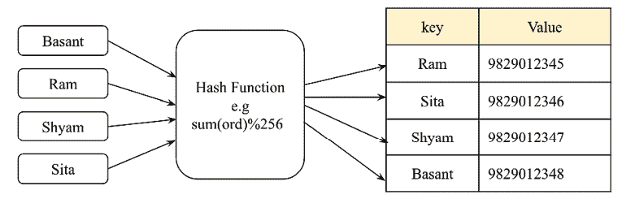

图 8.1：哈希表的示例

字典是一种广泛使用的数据结构，通常使用哈希表构建。字典使用关键字而不是索引号，并以 (`key`, `value`) 对的形式存储数据。也就是说，我们不是使用索引值来访问联系人，而是使用字典数据结构中的 *key* 值。

以下代码演示了存储在 (`key`, `value`) 对中的字典的工作原理：

```py
my_dict={"Basant" : "9829012345", "Ram": "9829012346", "Shyam": "9829012347", "Sita": "9829012348"}
print("All keys and values")
for x,y in my_dict.items():
    print(x, ":" , y)       #prints keys and values
my_dict["Ram"] 
```

上述代码的输出如下：

```py
Basant : 9829012345
Ram : 9829012346
Shyam : 9829012347
Sita : 9829012348
'9829012346' 
```

哈希表以非常高效的方式存储数据，以便检索可以非常快。哈希表基于称为哈希的概念。

## 哈希函数

哈希是一种技术，当我们向函数提供任意大小的数据时，我们得到一个小的、简化的值。这个函数被称为哈希函数。哈希使用哈希函数将键映射到另一个数据范围，以便可以使用新的键范围作为哈希表中的索引；换句话说，哈希用于将键值转换为整数，这些整数可以用作哈希表中的索引。

在本章的讨论中，我们使用哈希将字符串转换为整数。我们本可以使用任何其他可以转换为整数的类型来代替字符串。让我们举一个例子。比如说，我们想要哈希表达式 `hello world`，也就是说，我们想要得到与这个字符串相对应的数值，这个数值可以用作哈希表中的索引。

在 Python 中，`ord()` 函数返回一个唯一的整数值（称为序数值），该值映射到 Unicode 编码系统中的字符。只要字符是 Unicode 兼容的，序数值将 Unicode 字符映射到唯一的数值表示，例如，数字 0-127 映射到 ASCII 字符，这些字符也对应于 Unicode 系统中的序数值。然而，Unicode 编码的范围可能更大。因此，Unicode 编码是 ASCII 的超集。例如，在 Python 中，我们通过使用 `ord('f')` 获取字符 `'f'` 的唯一序数值 `102`。进一步地，为了获取整个字符串的哈希值，我们只需将字符串中每个字符的序数值相加。请看以下代码片段：

```py
sum(map(ord, 'hello world')) 
```

上述输出的结果如下：

```py
1116 
```

在上述输出中，我们获得了字符串 `hello world` 的数值 `1116`，这是给定字符串的**哈希值**。考虑以下**图 8.2**以查看导致哈希值 `1116` 的字符串中每个字符的序数值：

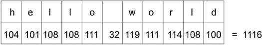

图 8.2：hello world 字符串中每个字符的序数值

```py
'world hello' string:
```

```py
sum(map(ord, 'world hello')) 
```

上述输出的结果如下：

```py
1116 
```

再次，对于 `'gello xorld'` 字符串，也会有相同的哈希值，因为该字符串中字符的序数值之和是相同的，因为 `g` 的序数值比 `h` 小一，而 `x` 的序数值比 `w` 大一。请看以下代码片段：

```py
sum(map(ord, 'gello xorld')) 
```

上述输出的结果如下：

```py
1116 
```

看一下以下*图 8.3*，我们可以看到这个`'gello xorld'`字符串的散列值再次是`1116`：

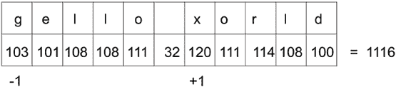

图 8.3：gello xorld 字符串中每个字符的序数值

在实践中，大多数散列函数都是不完美的，会面临冲突。这意味着散列函数会给多个字符串相同的散列值。这种冲突对于实现散列表来说是不希望的。

## 完美散列函数

一个完美的**散列函数**是指对于给定的字符串（可以是任何数据类型；在这里，我们使用字符串数据类型作为例子），我们得到一个唯一的散列值。我们的目标是创建一个散列函数，该函数最小化冲突的数量，速度快，易于计算，并且在散列表中均匀分布数据项。但是，通常创建一个既快速又为每个字符串提供唯一散列值的效率高的散列函数是非常困难的。如果我们试图开发一个避免冲突的散列函数，这将变得非常慢，而一个慢速的散列函数并不能满足散列表的目的。因此，我们使用一个快速的散列函数，并试图找到一种解决冲突的策略，而不是试图找到一个完美的散列函数。

为了避免在前一节讨论的散列函数中的冲突，我们可以在字符串的每个字符的序数值上添加一个乘数，随着我们在字符串中的进展，这个乘数会持续增加。此外，可以通过将每个字符的乘积序数值相加来获得字符串的散列值。为了更好地理解这一概念，请参考以下*图 8.4*：

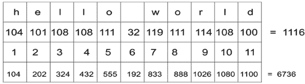

图 8.4：hello world 字符串中每个字符的序数值乘以数值

在前面的*图 8.4*中，每个字符的序数值逐渐乘以一个数。请注意，第二行有每个字符的序数值；第三行显示乘数值；在第四行，我们通过将第二行和第三行的值相乘得到值，例如`104 x 1`等于`104`。最后，我们将所有这些乘积值相加，得到`hello world`字符串的散列值，即`6736`。

以下函数展示了这一概念的实施：

```py
def myhash(s): 
       mult = 1 
       hv = 0 
       for ch in s: 
           hv += mult * ord(ch) 
           mult += 1 
       return hv 
```

我们可以在我们之前使用的字符串上测试这个函数，如下所示：

```py
for item in ('hello world', 'world hello', 'gello xorld'): 
        print("{}: {}".format(item, myhash(item))) 
```

当我们执行前面的代码时，我们得到以下输出：

```py
hello world: 6736
world hello: 6616
gello xorld: 6742 
```

我们可以看到，这次，我们为这三个字符串得到了不同的散列值。但这仍然不是一个完美的散列。现在让我们尝试字符串`ad`和`ga`：

```py
for item in ('ad', 'ga'): 
        print("{}: {}".format(item, myhash(item))) 
```

前面代码片段的输出如下：

```py
ad: 297
ga: 297 
```

因此，我们仍然没有得到一个完美的散列函数，因为我们为这两个不同的字符串得到了相同的散列值。因此，我们需要制定一种解决这种冲突的策略。我们将在下一节中讨论更多解决冲突的策略。

# 解决冲突

哈希表中的每个位置通常被称为**槽**或**桶**，可以存储一个元素。每个以（`键`，`值`）对形式存在的数据项存储在哈希表中，其位置由键的哈希值决定。让我们以一个例子来说明，首先我们使用一个散列函数，通过计算所有字符的序数值之和来计算哈希值。然后，我们通过计算总序数值对 256 取模来得到最终的哈希值（换句话说，索引位置）。在这里，我们以 256 个槽/桶为例。我们可以根据在哈希表中需要多少条记录来使用任意数量的槽。我们在*图 8.5*中展示了样本哈希，其中包含对应数据值的关键字符串，例如，`eggs`关键字符串对应的值为`123456789`。

这个哈希表使用一个散列函数，将输入字符串`hello world`映射到哈希值`92`，这找到了哈希表中的槽位置：

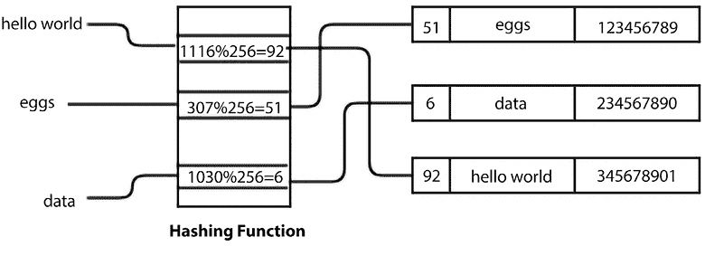

图 8.5：一个样本哈希表

一旦我们知道了键的哈希值，它将被用来找到元素在哈希表中应该存储的位置。因此，我们需要找到一个空槽。我们从与键的哈希值相对应的槽开始。如果那个槽是空的，我们就将数据项插入那里。如果槽不为空，这意味着我们发生了冲突。这意味着我们有一个与表中之前存储的项相同的哈希值。我们需要确定一种策略来避免这种冲突或冲突。

例如，在下面的图中，关键字符串`hello world`已经存储在索引位置`92`的表中，并且对于一个新的关键字符串，例如`world hello`，我们得到相同的哈希值`92`。这意味着发生了冲突。请参考下面的*图 8.6*来展示这个概念：

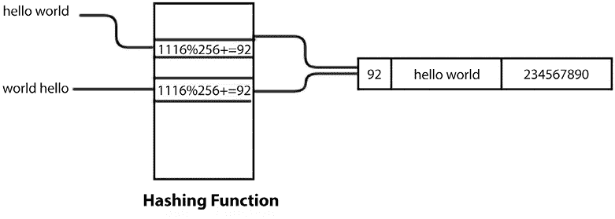

图 8.6：两个字符串的哈希值相同

解决这种冲突的一种方法是从冲突的位置找到另一个空闲槽。这种冲突解决过程被称为**开放寻址**。

## 开放寻址

在开放寻址中，关键值存储在哈希表中，并且使用探测技术来解决冲突。开放寻址是一种在哈希表中使用的冲突解决技术。冲突通过搜索（也称为探测）一个替代位置来解决，直到我们在哈希表中找到一个未使用的槽来存储数据项。

对于基于开放寻址的冲突解决技术，有三种流行的方法：

1.  线性探测

1.  二次探测

1.  双重散列

### 线性探测

系统地访问每个槽位的方法是线性解决冲突的方式，其中我们通过将 `1` 加到发生冲突的前一个哈希值上来线性地寻找下一个可用的槽位。这被称为线性探测。我们可以通过将键字符串中每个字符的序数值之和加 `1` 来解决冲突，这个和进一步用于根据哈希表的大小计算最终的哈希值。

让我们考虑一个例子。首先，计算键的哈希值。如果位置已被占用，我们按顺序检查哈希表以找到下一个空闲槽位。让我们用以下 *图 8.7* 来解决冲突，其中，对于键字符串 `egg`，序数值之和为 `307`，然后我们通过取模 256 来计算哈希值，得到 `egg` 键字符串的哈希值为 `51`。然而，数据已经存储在这个位置，这意味着发生了冲突。因此，我们将字符串中每个字符的序数值之和计算出的哈希值加 `1`。这样，我们为这个键字符串获得一个新的哈希值 `52` 来存储数据。请参考以下 *图 8.7*，它描述了上述过程：

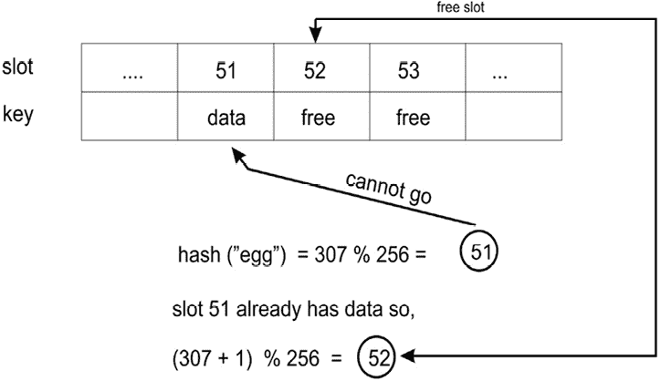

图 8.7：冲突解决的示例

为了在哈希表中找到下一个空闲槽位，我们增加哈希值，在线性探测的情况下，这个增加是固定的。由于在发生冲突时哈希值的增加是固定的，新的数据元素总是存储在由哈希函数给出的下一个可用索引位置。这创建了一个连续的占用索引位置的簇，当我们在簇内的任何位置得到另一个具有哈希值的数据元素时，这个簇就会增长。

因此，这种方法的一个主要缺点是哈希表可能会有连续的占用位置，这些位置被称为项的簇。在这种情况下，哈希表的一部分可能会变得密集，而表的另一部分则保持为空。由于这些限制，我们可能更喜欢使用不同的策略来解决冲突，例如四分探测或双哈希，这些内容我们将在后续章节中讨论。让我们首先讨论使用线性探测作为冲突解决技术的哈希表实现，在理解了线性探测的概念之后，我们将讨论其他冲突解决技术。

# 实现哈希表

要实现哈希表，我们首先创建一个类来存储哈希表项。由于哈希表是一个 `{键-值}` 存储结构，这些项需要有一个键和一个值：

```py
class HashItem: 
    def __init__(self, key, value): 
        self.key = key 
        self.value = value 
```

接下来，我们开始处理哈希表类本身。像往常一样，我们从构造函数开始：

```py
class HashTable: 
     def __init__(self): 
         self.size = 256 
         self.slots = [None for i in range(self.size)] 
         self.count = 0 
```

标准的 Python 列表可以用来在哈希表中存储数据元素。让我们从设置哈希表的大小为`256`个元素开始。稍后，我们将讨论如何随着哈希表的填充而扩展哈希表的战略。现在，我们在代码中初始化一个包含`256`个元素的列表。这些是元素要存储的位置——槽位或桶。因此，我们有`256`个槽位来在哈希表中存储元素。重要的是要注意表的大小和计数的区别。表的大小指的是表中槽位的总数（已使用或未使用）。表的计数指的是已填充的槽位数量，意味着已添加到表中的实际`(键-值)`对的数量。

现在，我们必须为表选择一个哈希函数。我们可以使用任何哈希函数。让我们采用返回字符串中每个字符序数值之和的相同哈希函数，但稍作修改。由于这个哈希表有`256`个槽位，这意味着我们需要一个返回值在`0`到`255`（表的大小）范围内的哈希函数。一种好的方法是返回哈希值除以表大小的余数，因为余数肯定是一个介于`0`和`255`之间的整数值。

由于哈希函数仅打算由类内部使用，我们在名称前加上下划线(`_`)以表示这一点。这是 Python 表示某物打算用于内部使用的约定。以下是`hash`函数的实现，该函数应在`HashTable`类中定义：

```py
def _hash(self, key): 
      mult = 1 
      hv = 0 
      for ch in key: 
          hv += mult * ord(ch) 
          mult += 1 
      return hv % self.size 
```

目前，我们假设键是字符串。我们将在稍后讨论如何使用非字符串键。现在，`_hash()`函数将生成字符串的哈希值。

## 在哈希表中存储元素

要在哈希表中存储元素，我们使用`put()`函数将它们添加到表中，并使用`get()`函数检索它们。首先，我们将查看`put()`函数的实现。我们首先将键和值添加到`HashItem`类中，然后计算键的哈希值。`put()`方法应在`HashTable`类中定义：

```py
def put(self, key, value): 
    item = HashItem(key, value) 
    h = self._hash(key)
    while self.slots[h] != None:
        if self.slots[h].key == key:
            break
        h = (h + 1) % self.size
    if self.slots[h] == None:
        self.count += 1
    self.slots[h] = item
    self.check_growth() 
```

在获取键的哈希值并且如果槽位不为空的情况下，通过将前一个哈希值加`1`并应用线性探测技术来检查下一个空闲槽位。考虑以下代码：

```py
while self.slots[h] != None: 
      if self.slots[h].key == key: 
          break 
      h = (h + 1) % self.size 
```

如果槽位为空，则我们将计数增加`1`并将新元素（意味着槽位之前包含`None`）存储在所需位置上的列表中。参考以下代码：

```py
if self.slots[h] is None: 
     self.count += 1 
self.slots[h] = item 
self.check_growth() 
```

在上面的代码中，我们创建了一个哈希表，并讨论了在发生冲突时使用线性探测技术在哈希表中存储数据元素的`put()`方法。

在上述代码的最后一行，我们调用一个 `check_growth()` 方法，该方法用于在我们哈希表中剩余非常有限的空槽位时扩展哈希表的大小。我们将在下一节中更详细地讨论这个问题。

## 增加哈希表

在我们讨论的示例中，我们将哈希表的大小固定为 `256`。很明显，当我们向哈希表中添加元素时，哈希表开始填满，在某个时刻，所有的槽位都将被填满，哈希表将满。为了避免这种情况，我们可以在表开始填满时增加表的大小。

为了增加哈希表的大小，我们比较表中的大小和计数。`size` 是槽位的总数，而 `count` 表示包含元素的槽位数量。因此，如果 `count` 等于 `size`，这意味着我们已经填满了表。哈希表的负载因子通常用于扩展表的大小；这为我们提供了关于表中有多少可用槽位被使用的指示。哈希表的负载因子是通过将已用槽位数量除以表中槽位的总数来计算的。它定义如下：

*负载因子 = n/k*

在这里，n 是已用槽位的数量，k 是槽位的总数。当负载因子值接近 1 时，这意味着表将要被填满，我们需要增加表的大小。在表几乎填满之前增加表的大小会更好，因为当表填满时，从表中检索元素会变得缓慢。负载因子为 0.75 可能是增加表大小的良好值。另一个问题是我们应该增加表的大小多少。一种策略是简单地将其大小加倍。

线性探测的问题在于，随着负载因子的增加，找到新元素插入点所需的时间会变长。此外，在开放寻址冲突解决技术的情况下，我们应该根据负载因子增加哈希表的大小，以减少冲突的数量。

当负载因子超过阈值时增加哈希表大小的实现如下。首先，我们重新定义包含一个额外变量 `MAXLOADFACTOR` 的 `HashTable` 类，该变量用于确保哈希表的负载因子始终低于预定义的最大负载因子。`HashTable` 类定义如下：

```py
class HashTable: 
     def __init__(self): 
         self.size = 256 
         self.slots = [None for i in range(self.size)] 
         self.count = 0 
         self.MAXLOADFACTOR = 0.65 
```

接下来，我们使用以下 `check_growth()` 方法检查在向哈希表添加任何记录后哈希表的负载因子，该方法应在 `HashTable` 类中定义：

```py
 def check_growth(self):
        loadfactor = self.count / self.size 
        if loadfactor > self.MAXLOADFACTOR:
            print("Load factor before growing the hash table", self.count / self.size )
            self.growth()
            print("Load factor after growing the hash table", self.count / self.size ) 
```

在前述代码中，我们计算表的重载因子，然后检查它是否超过设定的阈值（换句话说，`MAXLOADFACTOR`是一个在创建哈希表时初始化的变量）。在这种情况下，我们调用`growth()`方法来增加哈希表的大小（在这个例子中，我们加倍哈希表的大小）。`growth()`方法应该在`HashTable`类中定义，其实现如下：

```py
 def growth(self):
        New_Hash_Table = HashTable()
        New_Hash_Table.size = 2 * self.size
        New_Hash_Table.slots = [None for i in range(New_Hash_Table.size)]

        for i in range(self.size):
             if self.slots[i] != None:
                New_Hash_Table.put(self.slots[i].key, self.slots[i].value)

        self.size = New_Hash_Table.size
        self.slots = New_Hash_Table.slots 
```

在前述代码中，我们首先创建一个新的哈希表，其大小是原始哈希表的两倍，然后我们初始化其所有槽位为`None`。接下来，我们检查原始哈希表中所有已填充的槽位，因为我们必须将这些现有记录插入到新的哈希表中，因此，我们使用现有哈希表的所有键值对调用`put()`方法。一旦我们将所有记录复制到新的哈希表中，我们就用新的哈希表替换现有表的大小和槽位。

让我们通过在`HashTable`类的`__init__`方法中定义`self.size = 10`来创建一个最大容量为 10 条记录，阈值负载因子为 65%的哈希表，这意味着每当第七条记录被添加到哈希表中时，我们调用一个`check_growth()`方法：

```py
ht = HashTable() 
ht.put("good", "eggs") 
ht.put("better", "ham") 
ht.put("best", "spam") 
ht.put("ad", "do not") 
ht.put("ga", "collide") 
ht.put("awd", "do not") 
ht.put("add", "do not") 
ht.checkGrow() 
```

在上述代码中，我们使用`put()`方法添加了七个记录。前述代码的输出如下：

```py
Load factor before growing the hash table 0.7
Load factor after growing the hash table 0.35 
```

在上述输出中，我们可以看到在添加第七条记录之前和之后，负载因子变成了增长哈希表之前的负载因子的一半。

在下一节中，我们将讨论用于检索存储在哈希表中的数据元素的`get()`方法。

## 从哈希表中检索元素

要从哈希表中检索元素，将返回与键存储的值。在这里，我们讨论检索方法的实现——`get()`方法。此方法返回表中存储的与给定键对应的值。

首先，我们计算给定键对应的要检索的值的哈希值。一旦我们得到了键的哈希值，我们就在哈希表的哈希值位置查找。如果键项与该位置的存储键值匹配，则检索相应的值。

如果不匹配，那么我们将字符串中所有字符的序数值之和加 1，类似于我们在存储数据时所做的，然后我们查看新获得的哈希值。我们继续搜索，直到我们得到键元素，或者检查哈希表中的所有槽位。

在这里，我们使用了线性探测技术来解决冲突，因此在从哈希表中检索数据元素时也使用了同样的技术。因此，如果我们打算在存储数据元素时使用不同的技术，比如说双重哈希或二次探测，那么在检索数据元素时也应该使用相同的方法。考虑*图 8.8*中的例子，以及以下四个步骤：

1.  我们计算给定键字符串`egg`的哈希值，结果为`51`。然后，我们将这个键与位置`51`处的存储键值进行比较，但它们不匹配。

1.  由于键不匹配，我们计算一个新的哈希值。

1.  我们在新建的哈希值位置查找键，该值为`52`；我们将键字符串与存储的键值进行比较，在这里它们匹配，如下面的图所示。

1.  哈希表返回与该键值对应的存储值。请参考以下*图 8.8*：

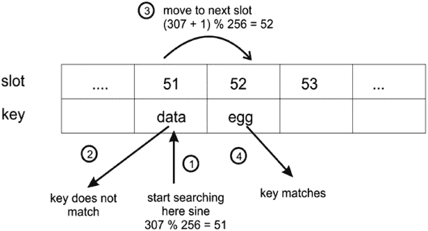

图 8.8：演示了从哈希表中检索元素的四步

为了实现这种检索方法，即`get()`方法，我们首先计算键的哈希值。接下来，我们在表中查找计算出的哈希值。如果找到匹配项，我们返回相应的存储值。否则，我们继续查看按照描述计算出的新哈希值位置。以下是`get()`方法的实现，它应该在`HashTable`类中定义：

```py
def get(self, key): 
    h = self._hash(key)    # computed hash for the given key 
    while self.slots[h] != None:
        if self.slots[h].key == key: 
            return self.slots[h].value 
        h = (h+ 1) % self.size 
    return None 
```

最后，如果在表中找不到键，我们返回`None`；我们本可以打印出键在哈希表中未找到的消息。

## 测试哈希表

为了测试哈希表，我们创建`HashTable`并存储一些元素在其中，然后尝试检索它们。我们可以使用`get()`方法来查找是否存在给定键的记录。我们还使用了两个字符串`ad`和`ga`，它们在哈希函数中返回了相同的哈希值，并且发生了冲突。为了评估哈希表的工作，我们将这个冲突也抛出，只是为了看看冲突是否得到了适当的解决。请参考以下示例代码：

```py
ht = HashTable()
ht.put("good", "eggs")
ht.put("better", "ham")
ht.put("best", "spam")
ht.put("ad", "do not")
ht.put("ga", "collide")
for key in ("good", "better", "best", "worst", "ad", "ga"):
        v = ht.get(key)
        print(v) 
```

执行上述代码后，我们得到以下输出：

```py
eggs
ham
spam
none
do not
collide 
```

如您所见，查找`worst`键返回`None`，因为该键不存在。`ad`和`ga`键也返回它们各自的值，这表明它们之间的冲突得到了适当的处理。

## 将哈希表实现为字典

使用`put()`和`get()`方法在哈希表中存储和检索元素可能看起来有些不便。然而，我们也可以将哈希表用作字典，这样使用起来会更方便。例如，我们希望使用`ht["good"]`而不是`ht.get("good")`来从表中检索元素。

这可以通过特殊方法`__setitem__()`和`__getitem__()`轻松实现，这些方法应该在`HashTable`类中定义。

以下代码展示了这一点：

```py
def __setitem__(self, key, value):
     self.put(key, value)
def __getitem__(self, key):
     return self.get(key) 
```

现在，我们的测试代码如下：

```py
ht = HashTable()
ht["good"] = "eggs"
ht["better"] = "ham"
ht["best"] = "spam"
ht["ad"] = "do not"
ht["ga"] = "collide"
for key in ("good", "better", "best", "worst", "ad", "ga"):
     v = ht[key]
     print(v)
print("The number of elements is: {}".format(ht.count)) 
```

上述代码的输出如下：

```py
eggs
ham
spam
none
do not
collide
The number of elements is: 5 
```

注意，我们还使用`count`变量打印已存储在哈希表中的元素数量。上述代码与上一节中所做的一样，但使用起来更方便。

在下一节中，我们讨论用于冲突解决的二次探测技术。

### 二次探测

这也是一种用于解决哈希表冲突的开放寻址方案。它通过计算键的哈希值并添加二次多项式的连续值来解决冲突；新的哈希值迭代计算，直到找到空槽位。如果发生冲突，则在位置 h + 1²、h + 2²、h + 3²、h + 4²等位置检查下一个空闲槽位。因此，新的哈希值按以下方式计算：

```py
new-hash(key) = (old-hash-value + i²)
Here, hash-value = key mod table_size 
```

当我们有一个字符串键时，我们使用每个字符的序数值乘以数值之和来计算哈希值，然后将其传递给哈希函数，最终获得键字符串的哈希值。然而，在非字符串键元素的情况下，我们可以直接使用哈希函数来计算键的哈希值。

让我们以一个有七个槽位的简单哈希表为例，并假设哈希函数是`h(key) = key mod 7`。为了理解二次探测的概念，让我们假设我们有键元素值，它们是给定键字符串的哈希值。

因此，每次当我们使用二次探测技术来确定存储数据元素的下一次索引位置时，我们遇到冲突，我们应该执行以下步骤来解决冲突：

1.  初始时，由于我们有一个空表，当我们得到一个键元素`15`（假设它是给定字符串的哈希值）时，我们使用我们的给定哈希函数来计算哈希值，换句话说，`15 mod 7= 1`。因此，数据元素存储在索引位置`1`。

1.  然后，假设我们得到一个键元素`22`（假设它是下一个给定字符串的哈希值），我们使用哈希函数来计算哈希值，换句话说，`22 mod 7 = 1`，它给出索引位置`1`。由于索引位置`1`已被占用，因此发生冲突，所以我们使用二次探测计算一个新的哈希值，即（1+ 1² = 2）。新的索引位置是`2`。因此，数据元素存储在索引位置`2`。

1.  接下来，假设我们得到一个数据元素`29`（假设它是给定字符串的哈希值），我们计算哈希值`29 mod 7 = 1`。由于这里发生冲突，我们再次计算哈希值，就像*步骤 2*中那样，但在这里我们又遇到了冲突，因此我们必须重新计算哈希值一次，换句话说（1+2² = 5），所以数据存储在那个位置。

使用二次探测技术解决过程的上述示例显示在*图 8.9*中：

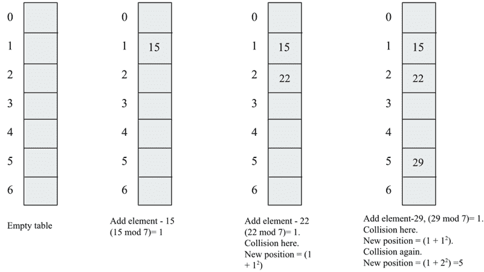

图 8.9：使用二次探测解决冲突的示例

用于冲突避免的二次探测技术不会像线性探测那样形成相同项的簇；然而，它确实会遭受次级簇的影响。次级簇会创建一个填充槽位的长时间运行，因为具有相同哈希值的数据元素也将具有相同的探测序列。

我们在上一节中讨论了哈希表的实现，包括数据元素的添加和检索，并使用了线性探测技术来解决冲突。现在，如果我们想使用任何其他冲突解决技术，如二次探测技术，我们可以更新哈希表的实现。除了以下两个方法外，`HashTable`类中的所有方法都将保持不变，这两个方法应该在`HashTable`类中定义：

```py
 def get_quadratic(self, key):
        h = self._hash(key)
 `j = 1`
        while self.slots[h] != None:
            if self.slots[h].key == key:
                return self.slots[h].value
 `h = (h+ j*j) % self.size`
 `j = j + 1`
        return None
    def put_quadratic(self, key, value):
        item = HashItem(key, value)
        h = self._hash(key)
 `j = 1`
        while self.slots[h] != None:
            if self.slots[h].key == key:
                break
 `h = (h + j*j) % self.size`
 `j = j+1`
        if self.slots[h] == None:
            self.count += 1
        self.slots[h] = item
        self.check_growth() 
```

上面的`get_quadratic()`和`put_quadratic()`方法的代码与之前讨论的`get()`和`put()`方法的实现类似，只是前面的代码中代码语句是加粗的。加粗的语句表示在发生冲突时，我们使用二次探测公式检查下一个空槽：

```py
ht = HashTable() 
ht.put_quadratic("good", "eggs") 
ht.put_quadratic("ad", "packt") 
ht.put_quadratic("ga", "books") 

v = ht.get_quadratic("ga") 
print(v) 
```

在上面的代码中，我们首先添加了三个数据元素及其关联的值，然后我们在哈希表中搜索键为`"ga"`的数据项。前面代码的输出如下：

```py
books 
```

上面的输出对应于键字符串`"ga"`，这是正确的，因为输入数据存储在哈希表中。接下来，我们将讨论另一种冲突解决技术——双重哈希。

### 双重哈希

在双重哈希冲突解决技术中，我们使用两个哈希函数。这种技术的工作原理如下。首先，使用主哈希函数计算哈希表中的索引位置，每当发生冲突时，我们使用另一个哈希函数通过增加哈希值来决定存储数据的下一个空闲槽位。

为了在哈希表中找到下一个空闲槽位，我们增加哈希值，在线性探测和二次探测的情况下，这个增加是固定的。由于在发生冲突时哈希值的增加是固定的，记录总是被移动到由哈希函数给出的下一个可用索引位置。这会创建一个连续的占用索引位置的簇。每当有另一个记录的哈希值在簇内任何位置时，这个簇就会增长。

然而，在双重哈希技术的情况下，探测间隔取决于键数据本身，这意味着每次发生冲突时，我们总是映射到哈希表中的不同索引位置，这反过来又有助于避免簇的形成。

这种冲突解决技术的探测序列如下：

```py
(h¹(key)+i*h²(key))mod table_size
h¹(key) = key mod table_size 
```

这里需要注意的是，第二个散列函数应该是快速的，易于计算，不应等于 0，并且应与第一个散列函数不同。

第二个散列函数的一个选择可以定义为以下内容：

```py
h²(key) = prime_number - (key mod prime_number) 
```

在上述散列函数中，素数应该小于表的大小。

例如，假设我们有一个最多可以容纳七个槽位的哈希表，当我们按顺序将数据元素`{15, 22, 29}`添加到该表中时。以下步骤是在发生碰撞时使用双散列技术将这些数据元素存储在哈希表中的步骤：

1.  首先，我们有数据元素`15`，我们使用主散列函数计算散列值，换句话说，`(15 mod 7 = 1)`。由于表最初是空的，我们将数据存储在索引位置`1`。

1.  接下来，数据元素是`22`，我们使用主散列函数计算散列值，换句话说，`(22 mod 7 = 1)`。由于索引位置 1 已经被占用，这意味着发生了碰撞。接下来，我们使用上面定义的二级散列函数`h²(key) = prime_number - (key mod prime_number)`来确定哈希表中的下一个索引位置。这里，我们假设小于表大小的素数是 5。这意味着哈希表中的下一个索引位置将是`(1 + 1*(5 - (22 mod 5))) mod 7`，这相当于 4。因此，我们将此数据元素存储在索引位置`4`。

1.  接下来，我们有数据元素 29，因此我们使用主散列函数计算散列值，换句话说，`(29 mod 7 =1)`。我们遇到了碰撞，现在我们使用二级散列函数来确定存储数据元素的下一个索引位置，换句话说，`(1 + 1*(5 - (29 mod 5))) mod 7`，结果是 2，因此我们将此数据元素存储在位置 2。

使用双散列法解决碰撞的过程示例如*图 8.10*所示：

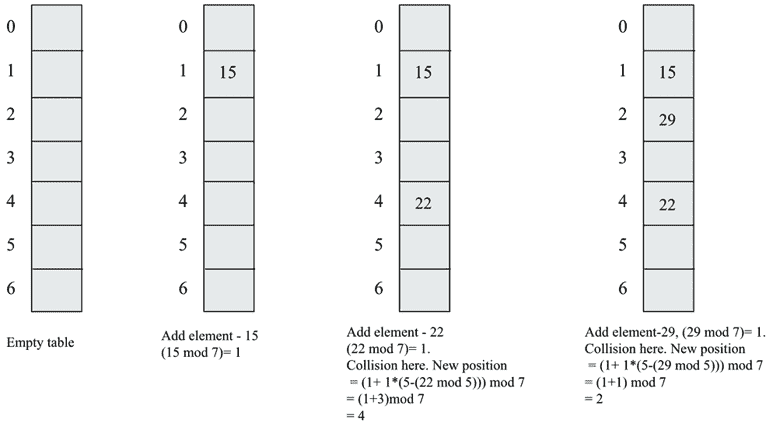

图 8.10：使用双散列法解决碰撞的示例

让我们现在看看如何实现具有双散列技术以解决碰撞的哈希表。`put_double_hashing()`和`get_double_hashing()`方法如下，这些方法应在`HashTable`类中定义。

以下`h2()`方法用于计算序数值之和，因为在我们示例中，我们将字符串作为键元素：

```py
 def h2(self, key):
        mult = 1
        hv = 0
        for ch in key:
            hv += mult * ord(ch)
            mult += 1
        return hv 
```

此外，我们应该重新定义哈希表，包括一个作为变量使用的素数，该变量将用于计算二级散列函数：

```py
class HashTable:
    def __init__(self):
        self.size = 256
        self.slots = [None for i in range(self.size)]
        self.count = 0
        self.MAXLOADFACTOR = 0.65
        self.prime_num = 5 
```

以下代码旨在在哈希表中插入数据元素及其关联值，并在碰撞时使用双散列技术：

```py
 def put_double_hashing(self, key, value):
        item = HashItem(key, value)
        h = self._hash(key)
        j = 1    
        while self.slots[h] != None:
            if self.slots[h].key == key:
                break
 `h = (h + j * (self.prime_num - (self.h2(key) % self.prime_num))) % self.size`
 `j = j+1`
        if self.slots[h] == None:
            self.count += 1
        self.slots[h] = item
        self.check_growth()

    def get_double_hashing(self, key):
        h = self._hash(key)
        j = 1
        while self.slots[h] != None:
            if self.slots[h].key == key:
                return self.slots[h].value
 `h = (h + j * (self.prime_num - (self.h2(key) % self.prime_num))) % self.size`
 `j = j + 1`
        return None 
```

`get_doubleHashing()` 和 `put_doubleHashing()` 方法的上述代码与之前讨论的 `get()` 和 `put()` 方法的实现非常相似，除了前述代码中加粗的语句。加粗的语句表明在发生冲突时，我们使用双哈希技术公式来获取散列表中的下一个空槽位：

```py
ht = HashTable() 
ht.put_doubleHashing("good", "eggs") 
ht.put_doubleHashing("better", "spam") 
ht.put_doubleHashing("best", "cool") 
ht.put_doubleHashing("ad", "donot") 
ht.put_doubleHashing("ga", "collide") 
ht.put_doubleHashing("awd", "hello") 
ht.put_doubleHashing("addition", "ok") 

for key in ("good", "better", "best", "worst", "ad", "ga"): 
        v = ht.get_doubleHashing(key) 
        print(v) 
print("The number of elements is: {}".format(ht.count)) 
```

在上述代码中，我们首先插入七个不同的数据元素及其关联的值，然后我们在散列表中搜索和检查一些随机数据项。前述代码的输出如下：

```py
eggs
spam
cool
none
donot
collide
The number of elements is: 7 
```

在上述输出中，我们可以观察到键字符串 `worst` 不在散列表中，这意味着对应的输出是 `None`。

线性探测会导致主要聚簇，而二次探测可能会导致次级聚簇，而双哈希技术是解决冲突的最有效方法之一，因为它不会产生任何聚簇。这种技术的优点是它在散列表中产生记录的均匀分布。

在开放寻址冲突解决技术中，我们像在线性探测、二次探测和双哈希中做的那样，在散列表中搜索另一个空槽位。“closed”在“closed hashing”中指的是我们不会离开散列表，并且每个记录都存储在哈希函数给出的索引位置，因此“closed hashing”和“open addressing”是同义词。

另一方面，当一个记录始终存储在哈希函数给出的索引位置时，这被称为“closed addressing”或“open hashing”技术。在这里，“open”在“open hashing”中指的是我们愿意通过一个单独的列表离开散列表，其中可以存储数据元素；例如，链地址法是一种封闭寻址技术。

在下一节中，我们将讨论另一种冲突解决技术——链表技术。

## 链地址法

链地址法是另一种处理散列表中冲突问题的方法。它通过允许散列表中的每个槽位存储多个项的引用来解决此问题。因此，在冲突的位置，我们允许在散列表中存储多个项。

在链表中，散列表的槽位被初始化为空列表。当插入一个数据元素时，它被追加到对应该元素哈希值的列表中。例如，在以下 *图 8.11* 中，键字符串 `hello world` 和 `world hello` 发生了冲突。在链地址法的情况下，两个数据元素都使用哈希函数给出的索引位置存储，也就是说，在 *图 8.11* 中的示例中是 `92`。以下是一个使用链地址法解决冲突的示例：

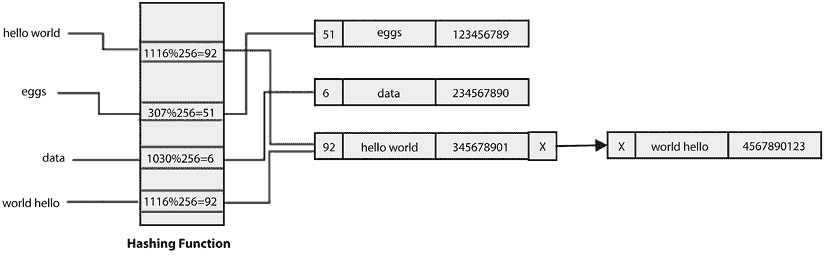

*图 8.11*：使用链式连接解决冲突的示例

另一个示例在*图 8.12*中展示，其中如果我们有多个具有哈希值`51`的数据元素，所有这些元素都会被添加到哈希表相同槽位中存在的列表中：

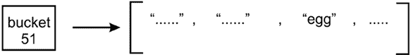

*图 8.12*：存储在列表中的多个具有相同哈希值的元素

通过允许多个元素具有相同的哈希值，链式连接避免了冲突。因此，在哈希表中存储元素的数量没有限制，而在开放寻址冲突解决技术的情况下，我们必须固定表的大小，当表被填满时，我们还需要扩展它。此外，哈希表可以存储比可用槽位更多的值，因为每个槽位都包含一个可以增长的列表。

然而，链式连接存在一个问题——当特定哈希值位置的列表增长时，它会变得低效。由于特定槽位中有许多项目，搜索它们可能会变得非常缓慢，因为我们必须对列表进行线性搜索，直到找到具有我们想要的键的元素。这可能会减慢检索速度，这对哈希表来说并不好，因为哈希表旨在高效。因此，使用链表进行单独链式连接算法搜索的最坏情况时间复杂度为 O(n)，因为在最坏的情况下，所有项目都将添加到哈希表中的唯一索引位置，搜索一个项目的工作方式将与链表相似。以下*图 8.13*展示了通过列表项进行线性搜索直到找到匹配项：

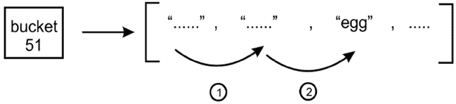

*图 8.13*：演示线性搜索以找到哈希值为 51 的匹配项

因此，当哈希表中的特定位置有多个条目时，检索项目会变得缓慢。这个问题可以通过使用另一种数据结构来解决，而不是使用可以快速搜索和检索的列表。一个很好的选择是使用**二叉搜索树**（**BST**），正如我们在上一章中讨论的那样，它提供了快速的检索。

我们可以在每个槽位中简单地插入一个（最初为空的）二叉搜索树（BST），如下面的*图 8.14*所示：

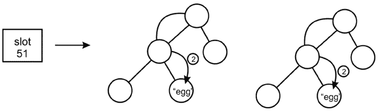

*图 8.14*：哈希值为 51 的桶的二叉搜索树

在前面的图中，`51`槽位包含一个 BST，我们用它来存储和检索数据项。然而，我们仍然可能遇到一个问题——取决于项目添加到 BST 中的顺序，我们可能会得到一个与列表一样低效的搜索树。也就是说，树中的每个节点恰好有一个子节点。为了避免这种情况，我们需要确保我们的 BST 是自平衡的。

下面是具有单独链式连接的哈希表的实现。首先，我们创建一个`Node`类来存储键值对，并有一个指针指向链表中的下一个节点：

```py
class Node:
    def __init__(self, key=None, value=None):
        self.key = key
        self.value = value
        self.next = None 
```

接下来，我们定义单链表，其详细信息在*第四章*，*链表*中提供。在这里，我们已定义了`append()`方法，用于向链表中添加新的数据记录：

```py
class SinglyLinkedList:
    def __init__ (self):
        self.tail = None
        self.head = None

    def append(self, key, value):
        node = Node(key, value)
        if self.tail:
            self.tail.next = node 
            self.tail = node        else:
            self.head = node 
            self.tail = node 
```

接下来，我们定义`traverse()`方法，该方法打印出所有带有`键值对`的数据记录。`traverse()`方法应在`SinglyLinkedList`类中定义。我们从头节点开始，在迭代`while`循环时移动下一个节点：

```py
 def traverse(self):
        current = self.head
        while current:
            print("\"", current.key, "--", current.value, "\"")
            current = current.next 
```

接下来，我们定义一个`search()`方法，该方法匹配我们想要在链表中搜索的键。如果键与任何节点匹配，则打印相应的键值对。`search()`方法应在`SinglyLinkedList`类中定义：

```py
 def search(self, key):
        current = self.head
        while current:
            if current.key == key: 
                print("\"Record found:", current.key, "-", current.value, "\"")
                return True
            current = current.next
        return False 
```

一旦我们定义了链表和所有必需的方法，我们定义`HashTableChaining`类，在其中我们初始化哈希表的大小和所有槽位为空链表：

```py
 class HashTableChaining:
    def __init__(self):
        self.size = 6
        self.slots = [None for i in range(self.size)]
        for x in range(self.size) :
            self.slots[x] = SinglyLinkedList() 
```

接下来，我们定义哈希函数，即`_hash()`，类似于我们在前面的章节中讨论的内容：

```py
 def _hash(self, key):
        mult = 1
        hv = 0
        for ch in key:
            hv += mult * ord(ch)
            mult += 1
        return hv % self.size 
```

然后，我们定义`put()`方法，用于在哈希表中插入新的数据记录。首先，我们创建一个带有键值对的节点，然后根据哈希函数计算索引位置。然后，我们将节点追加到与给定索引位置关联的链表的末尾。`put()`方法应在`HashTableChaining`类中定义：

```py
 def put(self, key, value):
        node = Node(key, value)        
        h = self._hash(key) 
        self.slots[h].append(key, value) 
```

接下来，我们定义`get()`方法，用于根据哈希表中的键值检索数据元素。首先，我们使用与在哈希表中添加记录时相同的哈希函数计算索引位置，然后我们在与计算出的给定索引位置关联的链表中搜索所需的数据记录。`get()`方法应在`HashTableChaining`类中定义：

```py
 def get(self, key):
        h = self._hash(key)
        v = self.slots[h].search(key) 
```

最后，我们可以定义`printHashTable()`方法，该方法打印出完整的哈希表，显示哈希表中的所有记录：

```py
 def printHashTable(self) :
        print("Hash table is :- \n")
        print("Index \t\tValues\n")
        for x in range(self.size) :
            print(x,end="\t\n")
            self.slots[x].traverse() 
```

我们可以使用以下代码在哈希表中插入一些示例数据记录，并使用链式技术存储数据。然后，我们使用键字符串`best`搜索数据记录，并打印出完整的哈希表：

```py
ht = HashTableChaining() 
ht.put("good", "eggs") 
ht.put("better", "ham") 
ht.put("best", "spam") 
ht.put("ad", "do not") 
ht.put("ga", "collide") 
ht.put("awd", "do not") 

ht.printHashTable() 
```

上述代码的输出如下：

```py
Hash table is :- 
Index              Values
0
1
2
" good - eggs "
3
" better - ham "
" ad - do not "
" ga - collide "
4
5
" best - spam "
" awd - do not " 
```

上述输出显示了所有数据记录如何存储在哈希表的每个索引位置。我们可以观察到，根据哈希函数给出的相同索引位置，存储了多个数据记录。

哈希表是存储键值对数据的重要数据结构，我们可以使用任何冲突解决技术，即开放寻址或单独链表。当键在哈希表中均匀分布时，开放寻址技术非常快，但可能存在集群形成的复杂性。

单链表技术没有聚集问题，但当所有数据记录都哈希到哈希表中的非常少数索引位置时，它可能会变慢。

# 符号表

符号表被编译器和解释器用来跟踪程序中声明的符号和不同实体，例如对象、类、变量和函数名。由于从表中高效检索符号很重要，符号表通常使用哈希表构建。

让我们来看一个例子。假设我们在`symb.py`文件中有以下 Python 代码：

```py
 name = "Joe"
    age = 27 
```

在这里，我们有两个符号，`name`和`age`。每个符号都有一个值；例如，`name`符号的值是`Joe`，而`age`符号的值是`27`。符号表允许编译器或解释器查找这些值。因此，`name`和`age`符号成为哈希表中的键。所有与之相关的其他信息成为符号表条目的`value`。

在编译器中，符号表还可以包含其他符号，例如函数和类名。例如，`greet()`函数和两个变量，换句话说，`name`和`age`，如*图 8.15*所示存储在符号表中：

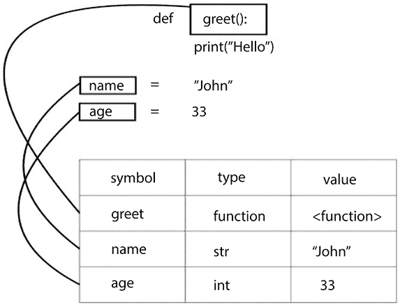

图 8.15：符号表示例

编译器为它在执行时加载到内存中的每个模块创建一个符号表。符号表是哈希表的重要应用之一，主要用于编译器和解释器中高效存储和检索符号及其相关值。

# 摘要

在本章中，我们讨论了哈希技术和哈希表的数据结构。我们学习了在哈希表上执行的不同操作的实现和概念。我们还讨论了几种冲突解决技术，包括开放寻址技术，即线性探测、二次探测和双重哈希。此外，我们还讨论了另一种冲突解决方法——分离链接。最后，我们探讨了通常使用哈希表构建的符号表。符号表允许编译器或解释器查找已定义的符号（如变量、函数或类），并检索有关它的所有信息。在下一章中，我们将详细讨论图算法。

# 练习

1.  有一个包含 40 个槽位的哈希表，表中存储了 200 个元素。哈希表的负载因子是多少？

1.  使用分离链接算法进行哈希的最坏情况搜索时间是什么？

1.  假设哈希表中的键分布均匀。搜索/插入/删除操作的时间复杂度将是什么？

1.  从字符数组中删除重复字符的最坏情况复杂度是什么？

# 加入我们的 Discord 社区

加入我们社区的 Discord 空间，与作者和其他读者进行讨论：[`packt.link/MEvK4`](https://packt.link/MEvK4)


