# 第十一章：排序

排序意味着以升序或降序重新组织数据。排序是计算机科学中最重要的算法之一，在数据库相关算法中得到广泛应用。对于一些应用，如果数据被排序，它可以被有效地检索，例如，如果它是一组名称、电话号码或简单的待办事项列表中的项目。

在本章中，我们将研究一些最重要和最受欢迎的排序技术，包括以下内容：

+   冒泡排序

+   插入排序

+   选择排序

+   快速排序

+   Timsort

# 技术要求

本章中用于解释概念的所有源代码都提供在以下 GitHub 仓库链接中：

[`github.com/PacktPublishing/Hands-On-Data-Structures-and-Algorithms-with-Python-Third-Edition/tree/main/Chapter11`](https://github.com/PacktPublishing/Hands-On-Data-Structures-and-Algorithms-with-Python-Third-Edition/tree/main/Chapter11)

# 排序算法

排序意味着以升序或降序排列列表中的所有项目。我们可以通过比较使用不同排序算法所需的时间和内存空间来比较不同的排序算法。

算法所需的时间取决于输入的大小。此外，一些算法相对容易实现，但在时间和空间复杂度方面可能表现不佳，而其他算法虽然实现起来稍微复杂一些，但在排序较长的数据列表时可以表现良好。我们已经讨论过的一种排序算法是归并排序，它在*第三章*，*算法设计技术和策略*中有所提及。我们将逐一详细讨论更多排序算法及其实现细节，从冒泡排序算法开始。

# 冒泡排序算法

冒泡排序算法背后的思想非常简单。给定一个无序列表，我们比较列表中的相邻元素，并在每次比较后根据它们的值将它们放置在正确的顺序。因此，如果相邻的元素不在正确的顺序，我们会交换它们。这个过程会重复`n-1`次，其中`n`是列表中的项目数量。

在每次迭代中，列表中的最大元素会被移动到列表的末尾。经过第二次迭代后，第二大的元素将被放置在列表的倒数第二位。这个过程会一直重复，直到列表被排序。

让我们以只有一个元素为`5`和`2`的列表为例，来理解冒泡排序的概念，如图*11.1*所示：

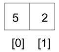

图 11.1：冒泡排序的示例

为了对这两个元素的列表进行排序，首先，我们比较`5`和`2`；由于`5`大于`2`，这意味着它们不在正确的顺序，因此我们需要交换这些值以将它们放在正确的顺序。为了交换这两个数字，首先，我们将存储在索引`0`的元素移动到一个临时变量中（*图 11.2*的*步骤 1*），然后存储在索引`1`的元素被复制到索引`0`（*图 11.2*的*步骤 2*），最后将存储在临时变量中的第一个元素存储回索引`1`（*图 11.2*的*步骤 3*）。因此，首先，元素`5`被复制到一个临时变量`temp`中。然后，元素`2`被移动到索引`0`。最后，`5`从`temp`移动到索引`1`。列表现在将包含元素`[2, 5]`：

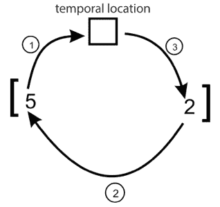

图 11.2：冒泡排序中两个元素的交换

以下代码将在`unordered_list[0]`和`unordered_list[1]`不在正确顺序的情况下交换它们的元素：

```py
unordered_list = [5, 2]
temp = unordered_list[0]
unordered_list[0] = unordered_list[1]
unordered_list[1] = temp
print(unordered_list) 
```

上述代码的输出是：

```py
[2, 5] 
```

现在我们已经能够交换一个两个元素的数组，那么使用这个相同的思想来使用冒泡排序对整个列表进行排序应该很简单。

让我们考虑另一个例子来理解冒泡排序算法的工作原理，并对一个包含六个元素的未排序列表进行排序，例如 `{45, 23, 87, 12, 32, 4}`。在第一次迭代中，我们开始比较前两个元素`45`和`23`，并将它们交换，因为`45`应该放在`23`之后。然后，我们比较下一个相邻的值`45`和`87`，看看它们是否处于正确的顺序。由于`87`的值高于`45`，我们不需要交换它们。如果它们不在正确的顺序，我们将交换两个元素。

我们可以在*图 11.3*中看到，在冒泡排序的第一次迭代之后，最大的元素`87`被放置在列表的最后一个位置：

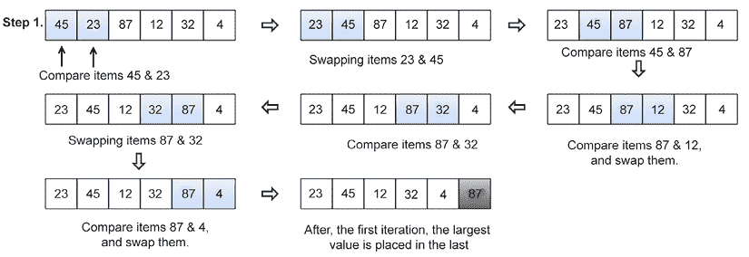

图 11.3：使用冒泡排序对示例数组进行第一次迭代的步骤

在第一次迭代之后，我们只需要排列剩余的`(n-1)`个元素；我们通过比较剩余五个元素的相邻元素来重复相同的过程。在第二次迭代之后，第二大元素`45`被放置在列表的倒数第二位置，如图*图 11.4*所示：

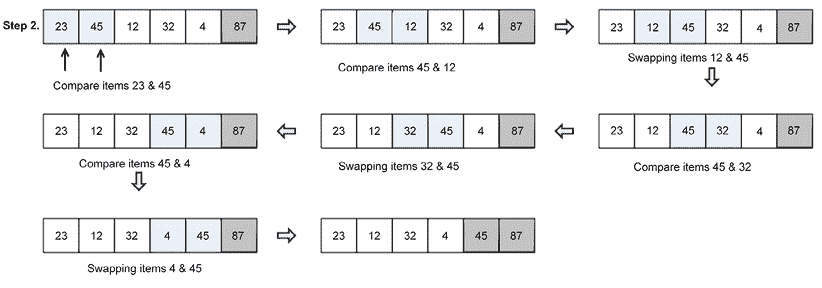

图 11.4：使用冒泡排序对示例数组进行第二次迭代的步骤

接下来，我们必须比较剩余的`(n-2)`个元素，如图*图 11.5*所示，以将它们排列好：

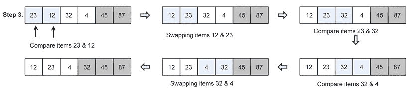

图 11.5：使用冒泡排序对示例数组进行第三次迭代的步骤

同样，我们比较剩余的元素以对它们进行排序，如图*图 11.6*所示：

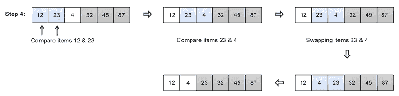

图 11.6：使用冒泡排序对示例数组进行第四次迭代的步骤

最后，对于最后两个剩余的元素，我们将它们放置在正确的顺序中，以获得最终的排序列表，如图*图 11.7*所示：

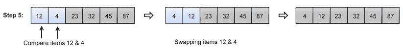

图 11.7：使用冒泡排序对示例数组进行排序的第五次迭代步骤

冒泡排序算法的完整 Python 代码如下，之后将详细解释每个步骤：

```py
def bubble_sort(unordered_list):
    iteration_number = len(unordered_list)-1
    for i in range(iteration_number,0,-1):
        for j in range(i):
            if unordered_list[j] > unordered_list[j+1]:
                temp = unordered_list[j]
                unordered_list[j] = unordered_list[j+1]
                unordered_list[j+1] = temp 
```

冒泡排序是通过使用双层循环实现的，其中一个循环嵌套在另一个循环中。在冒泡排序中，内层循环在每次迭代中重复比较和交换给定列表中的相邻元素，外层循环跟踪内层循环应该重复多少次。

首先，在上面的代码中，我们计算循环应该运行多少次才能完成所有交换；这等于列表长度减 1，可以写成`iteration_number = len(unordered_list)-1`。在这里，`len`函数将给出列表的长度。我们减去 1 是因为它给出了运行的最大迭代次数。外层循环确保这一点，并执行列表大小的减 1 次。

此外，在上面的代码中，对于每次迭代，在内层循环中，我们使用`if`语句比较相邻的元素，并检查相邻的元素是否处于正确的顺序。对于第一次迭代，内层循环应该运行`n`次，对于第二次迭代，内层循环应该运行`n-1`次，以此类推。例如，要排序一个包含三个数字的列表，例如`[3, 2, 1]`，内层循环运行两次，我们最多需要交换两次元素，如*图 11.8*所示：

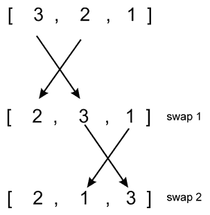

图 11.8：示例列表[3, 2, 1]在第一次迭代中的交换次数

此外，在第一次迭代之后，在第二次迭代中，我们执行内层循环一次，如*图 11.9*所示：

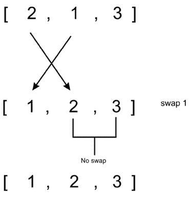

图 11.9：示例列表[3, 2, 1]在第二次迭代中的交换次数

以下代码片段可以用来部署冒泡排序算法：

```py
my_list = [4,3,2,1]
bubble_sort(my_list)
print(my_list)

my_list = [1,12,3,4]
bubble_sort(my_list)
print(my_list) 
```

输出如下：

```py
[1, 2, 3, 4]
[1, 3, 4, 12] 
```

在最坏的情况下，第一次迭代所需的比较次数将是(`n-1`)，第二次迭代，比较次数将是(`n-2`)，第三次迭代将是(`n-3`)，以此类推。因此，冒泡排序所需的总比较次数如下：

```py
(n-1) + (n-2) + (n-3) +.....+ 1 = n(n-1)/2
n(n+1)/2
O(n²) 
```

冒泡排序算法不是一个高效的排序算法，因为它提供了最坏情况下的运行时间复杂度为`O(n²)`，最佳情况下的复杂度为`O(n)`。最坏的情况是我们想要按升序排序给定的列表，而给定的列表是降序的，最佳情况是给定的列表已经排序；在这种情况下，将不需要进行交换。

通常情况下，冒泡排序算法不适用于排序大型列表。冒泡排序算法适用于性能不重要或给定列表长度较短的应用，而且更倾向于简短和简单的代码。冒泡排序算法在相对较小的列表上表现良好。

现在我们将探讨插入排序算法。

# 插入排序算法

插入排序的想法是，我们维护两个子列表（子列表是原始较大列表的一部分），一个是已排序的，另一个是未排序的，元素逐个从未排序的子列表添加到已排序的子列表中。因此，我们从未排序的子列表中取出元素，并将它们插入到已排序子列表的正确位置，这样这个子列表仍然保持排序状态。

在插入排序算法中，我们始终从一个元素开始，将其视为已排序，然后逐个从未排序的子列表中取出元素，并将它们放置在已排序子列表中的正确位置（与第一个元素相关）。因此，在从未排序的子列表中取出一个元素并将其添加到已排序的子列表后，现在我们已排序的子列表中有两个元素。然后，我们再次从未排序的子列表中取出另一个元素，并将其放置在已排序子列表中的正确位置（与已排序的两个元素相关）。我们反复执行此过程，将未排序子列表中的所有元素逐个插入到已排序子列表中。阴影元素表示*图 11.10*中的有序子列表，并且在每次迭代中，未排序子列表中的一个元素被插入到已排序子列表的正确位置。

让我们通过一个例子来理解插入排序算法的工作原理。假设；我们需要对一个包含六个元素的列表进行排序：{`45`, `23`, `87`, `12`, `32`, `4`}。首先，我们从一个元素开始，假设它已排序，然后从未排序的子列表中取出下一个元素`23`，并将其插入到已排序子列表的正确位置。在下一个迭代中，我们从未排序的子列表中取出第三个元素`87`，并将其再次插入到已排序子列表的正确位置。我们遵循相同的步骤，直到所有元素都在已排序子列表中。整个过程如*图 11.10*所示：

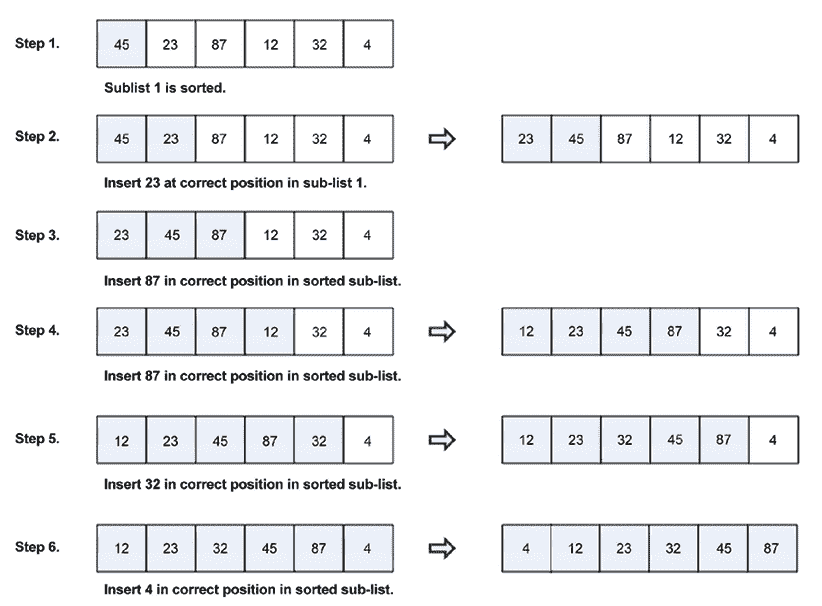

图 11.10：使用插入排序算法对示例数组元素进行排序的步骤

下面给出了插入排序的完整 Python 代码；算法的每个语句都通过示例进行了详细的解释：

```py
def insertion_sort(unsorted_list):
    for index in range(1, len(unsorted_list)):
        search_index = index
        insert_value = unsorted_list[index]
        while search_index > 0 and unsorted_list[search_index-1] > insert_value :
            unsorted_list[search_index] = unsorted_list[search_index-1]
            search_index -= 1
        unsorted_list[search_index] = insert_value 
```

为了理解插入排序算法的实现，让我们再举一个包含五个元素的例子，`{5, 1, 100, 2, 10}`，并对其进行详细的解释。让我们考虑以下数组，如*图 11.11*所示：

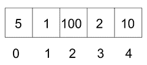

图 11.11：带有索引位置的示例数组

算法首先使用一个`for`循环在`1`和`4`索引之间运行。我们从索引`1`开始，因为我们将存储在索引`0`的元素视为已排序的子数组，而索引`1`到`4`之间的元素是未排序的子列表，如*图 11.12*所示：

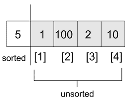

图 11.12：插入排序中排序和未排序子列表的演示

在循环执行开始时，我们有以下代码片段：

```py
 for index in range(1, len(unsorted_list)):
        search_index = index
        insert_value = unsorted_list[index] 
```

在每次`for`循环执行的开始，`unsorted_list[index]`处的元素被存储在`insert_value`变量中。稍后，当我们找到子列表排序部分的适当位置时，`insert_value`将被存储在该索引的排序子列表中。下面的代码片段显示了：

```py
 while search_index > 0 and unsorted_list[search_index-1] > insert_value :
        unsorted_list[search_index] = unsorted_list[search_index-1]
        search_index -= 1
    unsorted_list[search_index] = insert_value 
```

`search_index`用于向`while`循环提供信息，即确切地找到下一个需要插入到排序子列表中的元素的位置。

`while`循环从列表的末尾开始遍历，由两个条件引导。首先，如果`search_index > 0`，那么这意味着列表的排序部分还有更多元素；其次，为了`while`循环能够运行，`unsorted_list[search_index-1]`必须大于`insert_value`变量。`unsorted_list[search_index-1]`数组将执行以下任一操作：

+   指向`unsorted_list[search_index]`之前的元素，在第一次执行`while`循环之前

+   指向`unsorted_list[search_index-1]`之前的一个元素，在第一次执行`while`循环之后

在示例列表中，`while`循环将执行，因为`5 > 1`。在`while`循环体内，`unsorted_list[search_index-1]`处的元素将被存储在`unsorted_list[search_index]`处。然后，`search_index -= 1`将列表遍历向后移动，直到它持有值为`0`。

在`while`循环退出后，最后一个已知的`search_index`位置（在这种情况下为`0`）现在帮助我们了解在哪里插入`insert_value`。*图 11.13*显示了第一次迭代后元素的位置：

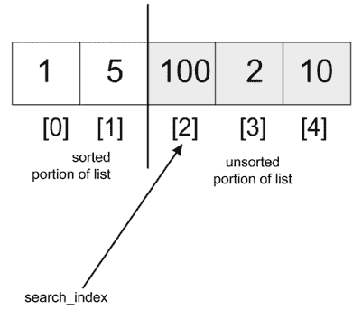

图 11.13：第一次迭代后示例列表的位置

在`for`循环的第二次迭代中，`search_index`将具有值为`2`，这是数组中第三个元素的索引。此时，我们开始从左向右（向索引`0`）进行比较。`100`将与`5`进行比较，但由于`100`大于`5`，`while`循环将不会执行。`100`将被替换为自己，因为`search_index`变量从未递减。因此，`unsorted_list[search_index] = insert_value`将没有效果。

当`search_index`指向索引`3`时，我们比较`2`与`100`，并将`100`移动到`2`存储的位置。然后，我们比较`2`与`5`，并将`5`移动到`100`最初存储的位置。此时，`while`循环将中断，`2`将被存储在索引`1`处。数组将部分排序，值为`[1, 2, 5, 100, 10]`。为了使列表排序，上述步骤将最后一次发生。

以下代码可以用来创建一个元素列表，我们可以使用定义的`insertion_sort()`方法对其进行排序：

```py
my_list = [5, 1, 100, 2, 10]
print("Original list", my_list)
insertion_sort(my_list)
print("Sorted list", my_list) 
```

上述代码的输出如下：

```py
Original list [5, 1, 100, 2, 10]
Sorted list [1, 2, 5, 10, 100] 
```

插入排序的最坏情况时间复杂度发生在给定的元素列表按逆序排序时。在这种情况下，每个元素都必须与其他每个元素进行比较。因此，在第一轮迭代中需要一次比较，第二轮迭代中需要两次比较，第三轮迭代中需要三次比较，在(n-1)^(th)迭代中需要(n-1)次比较。因此，总的比较次数为：

```py
1 + 2 + 3 .. (n-1) 
n(n-1)/2 
```

因此，插入排序算法的最坏情况运行时间复杂度为 O(n²)。此外，插入排序算法的最佳情况复杂度为 O(n)，在这种情况下，给定的输入列表已经排序，并且每个未排序子列表的每个元素在每个迭代中只与已排序子列表的最右侧元素进行比较。当给定的列表元素数量较少时，插入排序算法很好用，当输入数据逐个到达，并且我们需要保持列表排序时，它是最适合的。现在我们将来看看选择排序算法。

# 选择排序算法

另一个流行的排序算法是选择排序。选择排序算法首先在列表中寻找最小的元素，并将其与列表第一个位置存储的数据交换。因此，它对直到第一个元素为止的子列表进行排序。这个过程重复`(n-1)`次，以对`n`个元素进行排序。

接下来，找到的第二小元素，即剩余列表中的最小元素，被识别并与列表的第二个位置交换。这使得前两个元素排序。这个过程重复进行，列表中剩余的最小元素与列表的第三个索引处的元素交换。这意味着现在前三个元素已经排序。

让我们通过一个例子来了解算法是如何工作的。我们将使用选择排序算法对以下四个元素的列表 `{`15, 12, 65, 10, 7`}` 进行排序，如图*图 11.14*所示，同时使用选择排序算法显示它们的索引位置：

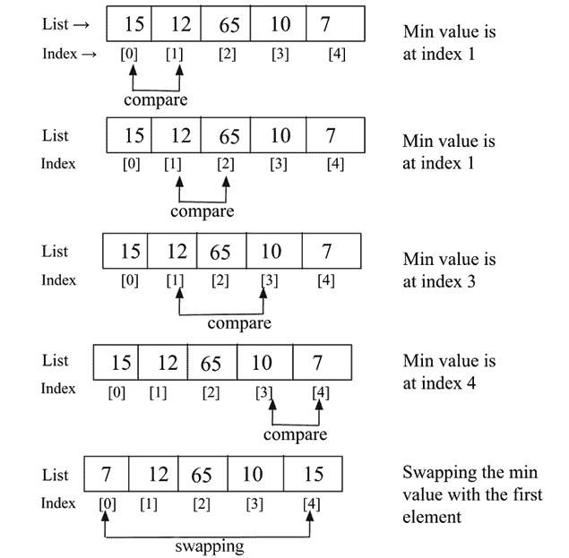

图 11.14：选择排序第一轮迭代的演示

在选择排序的第一轮迭代中，我们从索引`0`开始，在列表中寻找最小的元素，当找到最小元素时，它会被与列表索引`0`处的第一个数据元素交换。我们简单地重复这个过程，直到列表完全排序。在第一轮迭代之后，最小的元素将被放置在列表的第一个位置。

接下来，我们从列表的第二个元素（索引位置`1`）开始，从索引位置`1`到列表长度的数据列表中寻找最小的元素。一旦从这个剩余的元素列表中找到最小的元素，我们就将这个元素与列表的第二个元素交换。选择排序第二轮迭代的逐步过程如图*图 11.15*所示：

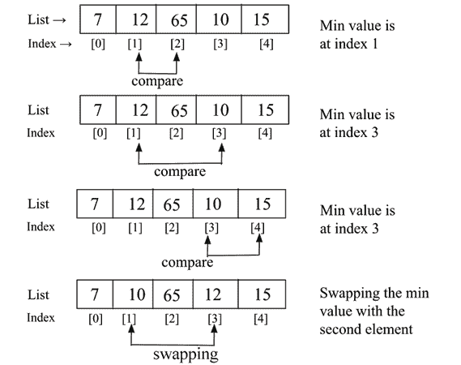

图 11.15：选择排序第二次迭代的演示

在下一次迭代中，我们在索引位置 `2` 到 `4` 的剩余列表中找到最小的元素，并将最小的数据元素与第二次迭代中索引 `2` 的数据元素交换。我们遵循相同的流程，直到整个列表排序完成。

以下是对选择排序算法的实现。函数的参数是我们想要按值升序排列的未排序项目列表：

```py
def selection_sort(unsorted_list): 
    size_of_list = len(unsorted_list) 
    for i in range(size_of_list): 
        small = i
        for j in range(i+1, size_of_list): 
            if unsorted_list[j] < unsorted_list[small]: 
                small = j
        temp = unsorted_list[i] 
        unsorted_list[i] = unsorted_list[small] 
        unsorted_list[small] = temp 
```

在上述选择排序的代码中，算法从外部的 `for` 循环开始遍历列表，从索引 `0` 到 `size_of_list`。因为我们把 `size_of_list` 传递给 `range` 方法，它将生成从 `0` 到 `size_of_list-1` 的序列。

接下来，我们声明一个变量 `small`，它存储最小元素的索引。进一步地，内循环负责遍历列表，我们跟踪列表中最小值的索引。一旦找到最小元素的索引，我们就将这个元素与列表中的正确位置交换。

以下代码可以用来创建元素列表，我们使用选择排序算法来排序列表：

```py
a_list = [3, 2, 35, 4, 32, 94, 5, 7]
print("List before sorting", a_list)
selection_sort(a_list)
print("List after sorting", a_list) 
```

上述代码的输出如下：

```py
List before sorting [3, 2, 35, 4, 32, 94, 5, 7]
List after sorting [2, 3, 4, 5, 7, 32, 35, 94] 
```

在选择排序中，第一次迭代需要 `(n-1)` 次比较，第二次迭代需要 `(n-2)` 次比较，第三次迭代需要 `(n-3)` 次比较，以此类推。所以，所需的总比较次数是：`(n-1) + (n-2) + (n-3) + ... + 1 = n(n-1) / 2`，这几乎等于 n²。因此，选择排序的最坏情况时间复杂度为 O(n²)。最坏的情况是给定的元素列表是逆序的。选择排序算法给出了最佳情况运行时间复杂度为 O(n²)。当元素列表较小的时候，可以使用选择排序算法。

接下来，我们将讨论快速排序算法。

# 快速排序算法

快速排序是一种高效的排序算法。快速排序算法基于分而治之的算法类别，类似于归并排序算法，其中我们将问题分解（分）成更小的部分，这些部分更容易解决，并且最终结果是通过组合较小问题的输出（治）获得的。

快速排序背后的概念是将给定的列表或数组分区。为了分区列表，我们首先从给定的列表中选择一个数据元素，这个元素被称为基准元素。

我们可以在列表中选择任何元素作为枢轴元素。然而，为了简单起见，我们将取数组中的第一个元素作为枢轴元素。接下来，列表中的所有元素都与这个枢轴元素进行比较。在第一轮迭代结束时，列表中的所有元素都按照以下方式排列：小于枢轴元素的元素排列在枢轴的左侧，而大于枢轴元素的元素排列在枢轴的右侧。

现在，让我们通过一个例子来理解快速排序算法的工作原理。

在这个算法中，首先我们将给定的未排序数据元素列表分成两个子列表，使得该分区点（也称为枢轴）左侧的所有元素都应该小于枢轴，而枢轴右侧的所有元素都应该大于枢轴。这意味着左右子列表中的元素将未排序，但枢轴元素将在整个列表中的正确位置。这如图*图 11.16*所示。

因此，在快速排序算法的第一轮迭代之后，选定的枢轴点被放置在列表中的正确位置，然后我们在这两个子列表上再次执行相同的步骤。这样，快速排序算法将列表分成两部分，并递归地对这两个子列表应用快速排序算法以对整个列表进行排序：

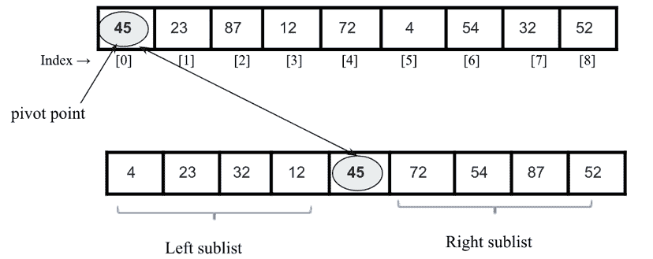

图 11.16：快速排序中子列表的示意图

快速排序算法的工作原理如下：

1.  我们首先选择一个枢轴元素，所有数据元素都要与之比较，在第一轮迭代结束时，这个枢轴元素将放置在列表中的正确位置。为了将枢轴元素放置在其正确位置，我们使用两个指针，一个左指针和一个右指针。这个过程如下：

    1.  左指针最初指向索引`1`处的值，右指针指向最后一个索引处的值。这里的主要思想是移动位于枢轴元素错误一侧的数据项。因此，我们从左指针开始，向左到右移动，直到我们到达一个位置，列表中的数据项的值大于枢轴元素。

    1.  同样，我们将右指针向左移动，直到我们找到一个小于枢轴元素的元素。

    1.  接下来，我们交换这两个由左指针和右指针指示的值。

    1.  我们重复相同的步骤，直到两个指针交叉，换句话说，直到右指针的索引指示的值小于左指针的索引。

1.  在描述的 *步骤 1* 每次迭代之后，枢轴元素将放置在列表中的正确位置，原始列表将被分为两个无序的子列表，左子列表和右子列表。我们对这两个左子列表和右子列表都遵循相同的流程（如 *步骤 1* 所述），直到每个子列表只包含一个元素。

1.  最后，所有元素都将放置在其正确的位置，这将给出排序后的列表作为输出。

让我们以一个数字列表 `{45`, `23`, `87`, `12`, `72`, `4`, `54`, `32`, `52}` 为例，来了解快速排序算法是如何工作的。假设我们列表中的枢轴元素（也称为枢轴点）是第一个元素，`45`。我们将左指针从索引 `1` 向右移动，直到我们达到值 `87`，因为 `(87>45)`。接下来，我们将右指针向左移动，直到我们找到值 `32`，因为 `(32<45)`。现在，我们交换这两个值。这个过程如图 *图 11.17* 所示：

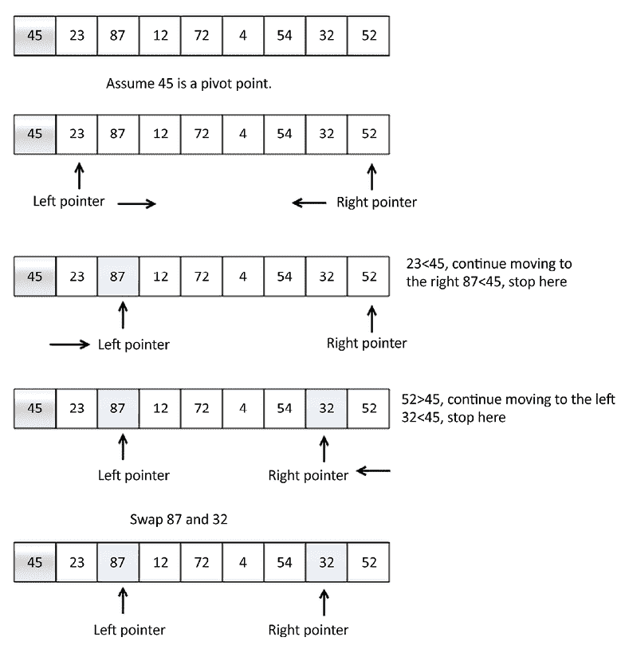

图 11.17：快速排序算法的说明性示例

然后，我们重复相同的流程，并将左指针向右移动，直到我们找到值 `72`，因为 `(72 > 45)`。接下来，我们将右指针向左移动，直到我们达到值 `4`，因为 `(4 < 45)`。现在，我们交换这两个值，因为它们位于枢轴值的错误一侧。我们重复相同的流程，直到右指针的索引值小于左指针的索引。在这里，我们找到 `4` 作为分割点，并将其与枢轴值交换。这如图 *图 11.18* 所示：

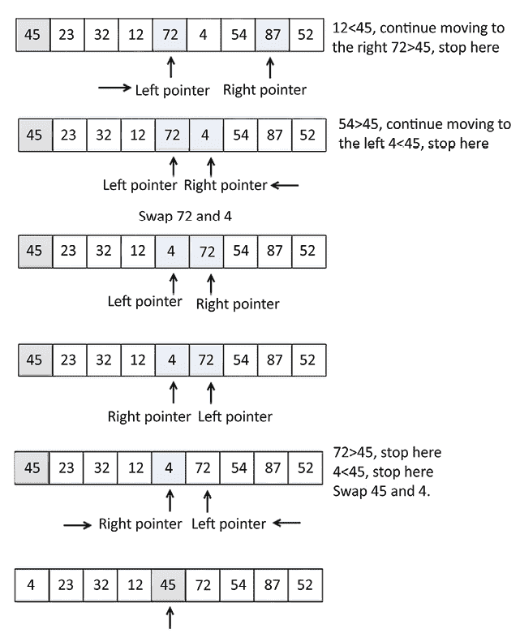

图 11.18：快速排序算法的一个示例（继续）

可以观察到，在快速排序算法的第一次迭代之后，枢轴值 `45` 被放置在列表中的正确位置。

现在我们有两个子列表：

1.  位于枢轴值 `45` 左侧的子列表包含小于 `45` 的值。

1.  位于枢轴值右侧的另一个子列表包含大于 `45` 的值。我们将对这些两个子列表递归地应用快速排序算法，并重复此过程，直到整个列表排序，如图 *图 11.19* 所示：

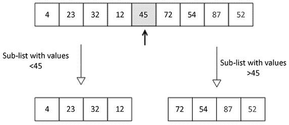

图 11.19：在示例元素列表上快速排序算法的第一次迭代后的结果

我们将在下一节中查看快速排序算法的实现。

# 快速排序的实现

快速排序算法的主要任务是首先将基准元素放置在其正确的位置，以便我们将给定的未排序列表分成两个子列表（左子列表和右子列表）；这个过程称为分区步骤。分区步骤在理解快速排序算法的实现中非常重要，因此我们将首先通过一个示例来理解分区步骤的实现。在这个过程中，给定一个元素列表，所有元素都将按照以下方式排列：小于基准元素的元素将位于其左侧，而大于基准元素的元素将排列在基准元素的右侧。

让我们通过一个示例来理解实现。考虑以下整数列表：`[43, 3, 20, 89, 4, 77]`。我们将使用分区函数来对这个列表进行分区：

`[43, 3, 20, 89, 4, 77]`

考虑以下分区函数的代码；我们将详细讨论代码的每一行：

```py
def partition(unsorted_array, first_index, last_index):
    pivot = unsorted_array[first_index]
    pivot_index = first_index
    index_of_last_element = last_index
    less_than_pivot_index = index_of_last_element
    greater_than_pivot_index = first_index + 1
    while True:
        while unsorted_array[greater_than_pivot_index] < pivot and greater_than_pivot_index < last_index:
            greater_than_pivot_index += 1
        while unsorted_array[less_than_pivot_index] > pivot and less_than_pivot_index >= first_index:
            less_than_pivot_index -= 1
        if greater_than_pivot_index < less_than_pivot_index:
            temp = unsorted_array[greater_than_pivot_index]
            unsorted_array[greater_than_pivot_index] = unsorted_array[less_than_pivot_index]
            unsorted_array[less_than_pivot_index] = temp
        else:
            break
    unsorted_array[pivot_index] = unsorted_array[less_than_pivot_index]
    unsorted_array[less_than_pivot_index] = pivot
    return less_than_pivot_index 
```

分区函数接收作为其参数的数组中需要分区的第一个和最后一个元素的索引。

基准值存储在`pivot`变量中，而其索引存储在`pivot_index`中。我们没有使用`unsorted_array[0]`，因为当使用数组的某个片段作为未排序数组参数调用时，索引`0`不一定指向该数组中的第一个元素。紧邻基准元素的元素的索引，即**左指针**`first_index + 1`，标记了我们开始查找数组中元素的位置。这个数组大于`pivot`，因为`greater_than_pivot_index = first_index + 1`表明。**右指针**`less_than_pivot_index`变量指向`less_than_pivot_index = index_of_last_element`列表中最后一个元素的位置，我们从这个位置开始搜索小于基准的元素。

进一步地，在主`while`循环执行开始时，数组看起来如图*图 11.20*所示：

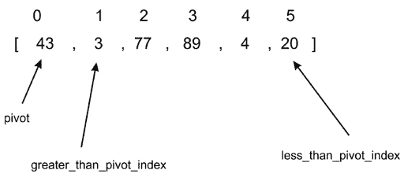

图 11.20：快速排序算法示例数组的说明 1

第一个内部`while`循环将索引向右移动一个位置，直到它落在索引`2`上，因为该索引处的值大于`43`。在这个点上，第一个`while`循环中断，不再继续。在第一个`while`循环中的每次条件测试中，只有当`while`循环的测试条件评估为`True`时，才会评估`greater_than_pivot_index += 1`。这使得搜索大于基准的元素的搜索进展到数组的下一个元素。

第二个内部`while`循环每次移动一个索引，直到它落在索引`5`上，其值`20`小于`43`，如图*图 11.21*所示：

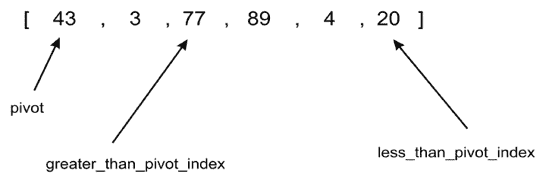

图 11.21：快速排序算法示例数组的说明 2

接下来，在这个点上，内部`while`循环中的任何一个都不能再执行下去，下一个代码片段如下所示：

```py
 if greater_than_pivot_index < less_than_pivot_index:
        temp = unsorted_array[greater_than_pivot_index]
        unsorted_array[greater_than_pivot_index] = 
                unsorted_array[less_than_pivot_index] 
        unsorted_array[less_than_pivot_index] = temp
    else:
        break 
```

在这里，由于 `greater_than_pivot_index < less_than_pivot_index`，`if` 语句的主体交换了那些索引处的元素。`else` 条件在任何 `greater_than_pivot_index` 变得大于 `less_than_pivot_index` 时中断无限循环。在这种情况下，这意味着 `greater_than_pivot_index` 和 `less_than_pivot_index` 已经交叉。

数组现在看起来如 *图 11.22* 所示：

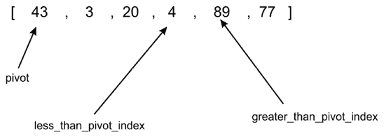

图 11.22：快速排序算法示例数组的第 3 个示例说明

当 `less_than_pivot_index` 等于 `3` 而 `greater_than_pivot_index` 等于 `4` 时执行 `break` 语句。

一旦退出 `while` 循环，我们就交换 `unsorted_array[less_than_pivot_index]` 和 `less_than_pivot_index` 处的元素，该索引作为枢轴的索引返回：

```py
 unsorted_array[pivot_index]=unsorted_array[less_than_pivot_index]
    unsorted_array[less_than_pivot_index]=pivot
    return less_than_pivot_index 
```

*图 11.23* 展示了代码如何在分区过程的最后一步将 `4` 与 `43` 交换：

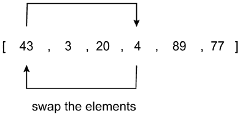

图 11.23：快速排序算法示例数组的第 4 个示例说明

回顾一下，第一次调用 `quick_sort` 函数时，它在索引 `0` 的元素处进行了分区。在分区函数返回后，我们获得了按顺序排列的数组 `[4, 3, 20, 43, 89, 77]`。

如您所见，元素 `43` 右侧的所有元素都大于 `43`，而左侧的元素都较小。因此，分区完成。

使用分割点 `43` 和索引 `3`，我们将递归地对两个子数组 `[4, 30, 20]` 和 `[89, 77]` 进行排序，使用我们刚才使用的过程。

主要 `quick_sort` 函数的主体如下：

```py
def quick_sort(unsorted_array, first, last):
    if last - first <= 0:
        return
    else:
        partition_point = partition(unsorted_array, first, last)
        quick_sort(unsorted_array, first, partition_point-1)
        quick_sort(unsorted_array, partition_point+1, last) 
```

`quick_sort` 函数相当简单；最初，调用 `partition` 方法，该方法返回分区点。这个分区点位于 `unsorted_array` 数组中，其中所有左边的元素都小于枢轴值，而所有右边的元素都大于枢轴值。我们在分区过程之后立即打印 `unsorted_array` 的状态，以查看每次调用后的数组状态。

在第一次分区后，第一个子数组 `[4, 3, 20]` 将完成；当 `greater_than_pivot_index` 在索引 `2` 而 `less_than_pivot_index` 在索引 `1` 时，这个子数组的分区将停止。在那个点上，两个标记被认为是交叉的。因为 `greater_than_pivot_index` 大于 `less_than_pivot_index`，所以 `while` 循环的进一步执行将停止。枢轴 `4` 将与 `3` 交换，而索引 `1` 被返回作为分区点。

我们可以使用以下代码片段创建一个元素列表，并使用快速排序算法对其进行排序：

```py
my_array = [43, 3, 77, 89, 4, 20]
print(my_array)
quick_sort(my_array, 0, 5)
print(my_array) 
```

上述代码的输出如下：

```py
[43, 3, 77, 89, 4, 20]
[3, 4, 20, 43, 77, 89] 
```

在快速排序算法中，分区算法需要`O(n)`的时间。由于快速排序算法遵循**分而治之**的范式，它需要`O(logn)`的时间；因此，快速排序算法的平均情况运行时间复杂度为`O(n)` `*` `O(logn)` `= O(nlogn)`。快速排序算法的最坏情况运行时间复杂度为 O(n²)。快速排序算法的最坏情况复杂度会在每次都选择最差的基准点时出现，其中一个分区始终只有一个元素。例如，如果列表已经排序，如果分区选择了最小的元素作为基准点，那么最坏情况复杂度就会发生。当最坏情况复杂度发生时，可以通过使用随机快速排序来改进快速排序算法。当给定的元素列表非常长时，快速排序算法是高效的；与其他上述排序算法相比，在这种情况下排序效果更好。

# Timsort 算法

Timsort 被用作所有 Python 版本>=2.3 的默认标准排序算法。Timsort 算法是基于归并排序和插入排序算法组合的针对现实世界长列表的最优算法。Timsort 算法利用了两种算法的最佳之处；插入排序在数组部分排序且大小较小时表现最佳，而归并排序的合并方法在需要合并小的、已排序的列表时运行速度快。

Timsort 算法的主要概念是它使用插入排序算法对数据元素的小块（也称为块）进行排序，然后使用归并排序算法合并所有已排序的块。Timsort 算法的主要特点是它利用了已知为“自然运行”的已排序数据元素，这在现实世界的数据中非常常见。

Timsort 算法的工作原理如下：

1.  首先，我们将给定的数据元素数组划分为多个块，这些块也称为运行。

1.  我们通常使用 32 或 64 作为运行的大小，因为它适合 Timsort；然而，我们可以使用任何其他可以从给定数组长度（例如`N`）计算出的大小。`minrun`是每个运行的最小长度。`minrun`的大小可以通过遵循以下原则来计算：

    1.  `minrun`的大小不应过长，因为我们使用插入排序算法对这些小块进行排序，这对于短列表的元素表现良好。

    1.  运行的长度不应过短；在这种情况下，会导致运行数量更多，这将使合并算法变慢。

    1.  由于归并排序在运行的数量是 2 的幂时效果最佳，因此如果计算为`N/minrun`的运行数量是 2 的幂，那就很好。

1.  例如，如果我们取运行大小为 32，那么运行的数量将是`(size_of_array/32)`；如果这是一个 2 的幂，那么合并过程将非常高效。

1.  使用插入排序算法逐个对每个运行进行排序。

1.  使用归并排序算法的合并方法逐个合并所有排序好的运行。

1.  在每次迭代后，我们将合并的子数组大小加倍。

让我们通过一个例子来理解 Timsort 算法的工作原理。假设我们有数组 `[4, 6, 3, 9, 2, 8, 7, 5]`。我们使用 Timsort 算法对其进行排序；这里，为了简单起见，我们取运行大小为 4。因此，我们将给定的数组分为两个运行，运行 1 和运行 2。接下来，我们使用插入排序算法对运行 1 进行排序，然后使用插入排序算法对运行 2 进行排序。一旦我们有了所有排序好的运行，我们使用归并排序算法的合并方法来获得最终的完整排序列表。整个过程如 *图 11.24* 所示：

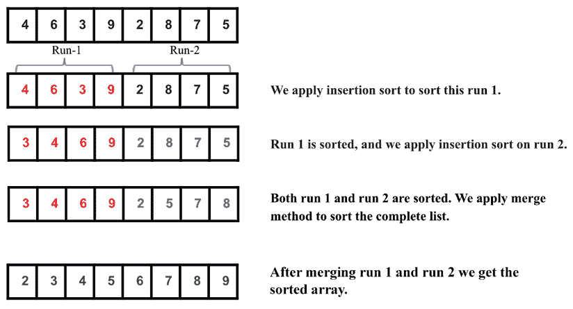

图 11.24：Timsort 算法示例数组的说明

接下来，让我们讨论 Timsort 算法的实现。首先，我们实现插入排序算法和归并排序算法的合并方法。插入排序算法已经在之前的章节中详细讨论过。为了完整性，下面再次给出：

```py
def Insertion_Sort(unsorted_list): 
    for index in range(1, len(unsorted_list)): 
        search_index = index 
        insert_value = unsorted_list[index] 
        while search_index > 0 and unsorted_list[search_index-1] > insert_value : 
            unsorted_list[search_index] = unsorted_list[search_index-1] 
            search_index -= 1 
        unsorted_list[search_index] = insert_value 
    return unsorted_list 
```

在上述代码中，插入排序方法负责对运行进行排序。接下来，我们介绍归并排序算法的合并方法；这在 *第三章*，*算法设计技术和策略* 中已经详细讨论过。这个 `Merge()` 函数用于合并排序好的运行，其定义如下：

```py
def Merge(first_sublist, second_sublist):
    i = j = 0
    merged_list = []
    while i < len(first_sublist) and j < len(second_sublist):
        if first_sublist[i] < second_sublist[j]:
            merged_list.append(first_sublist[i])  
            i += 1  
        else:
            merged_list.append(second_sublist[j])  
            j += 1
    while i < len(first_sublist):  
        merged_list.append(first_sublist[i])  
        i += 1  
    while j < len(second_sublist):
        merged_list.append(second_sublist[j])  
        j += 1
    return merged_list 
```

接下来，让我们讨论 Timsort 算法的实现。以下是其实施代码。让我们一点一点地理解它：

```py
def Tim_Sort(arr, run):
    for x in range(0, len(arr), run):
        arr[x : x + run] = Insertion_Sort(arr[x : x + run]) 
    runSize = run    
    while runSize < len(arr):
        for x in range(0, len(arr), 2 * runSize):
            arr[x : x + 2 * runSize] = Merge(arr[x : x + runSize], arr[x + runSize: x + 2 * runSize]) 

        runSize = runSize * 2 
```

在上述实现中，我们首先传递两个参数，要排序的数组和运行的大小。接下来，我们使用插入排序在下面的代码片段中按运行大小对子数组进行排序：

```py
for x in range(0, len(arr), run):
       arr[x : x + run] = Insertion_Sort(arr[x : x + run]) 
```

在上述示例列表 `[4, 6, 3, 9, 2, 8, 7, 5]` 的代码中，假设运行大小为 2，那么我们将有总共四个块/块/运行，在退出这个循环后，数组将变成这样：`[4, 6, 3, 9, 2, 8, 5, 7]`，这表明所有大小为 2 的运行都已排序。之后我们初始化 `runSize` 并迭代，直到 `runSize` 等于数组长度。因此，我们使用合并方法来合并排序的小列表：

```py
 runSize = run    
    while runSize < len(arr):
        for x in range(0, len(arr), 2 * runSize):
            arr[x : x + 2 * runSize] = Merge(arr[x : x + runSize], arr[x + runSize: x + 2 * runSize]) 

        runSize = runSize * 2 
```

在上述代码中，`for` 循环使用 `Merge` 函数合并大小为 `runSize` 的运行。对于上面的例子，`runSize` 是 `2`。在第一次迭代中，它将合并从索引 `(0` 到 `1)` 的左运行和从索引 `(2` 到 `3)` 的右运行，形成一个从索引 `(0` 到 `3`) 的排序数组，数组将变成 `[3, 4, 6, 9, 2, 8, 5, 7]`。

进一步，在第二次迭代中，它将合并从索引 `(4 到 5)` 的左侧运行和从索引 `(6 到 7)` 的右侧运行，以形成一个从索引 `(4 到 7)` 的排序运行。在第二次迭代后，`for` 循环将终止，数组将变为 `[3, 4, 6, 9, 2, 5, 7, 8]`，这表明数组已经从索引 `(0 到 3)` 和 `(4 到 7)` 排序。

现在我们将运行的大小更新为 `2*runSize`，并重复相同的步骤来更新 `runSize`。因此，现在 `runSize` 是 `4`。现在，在第一次迭代中，它将合并从索引 `0` 到 `3` 的左侧运行和从索引 `4` 到 `7` 的右侧运行，以形成一个从索引 `0` 到 `7` 的排序数组，然后 `for` 循环将终止，数组将变为 `[2, 3, 4, 5, 6, 7, 8, 9]`，这表明数组已经排序。

现在，`runSize` 将等于数组长度，因此 `while` 循环将终止，最后我们将得到一个排序后的数组。

我们可以使用下面的代码片段来创建一个列表，然后使用 Timsort 算法对列表进行排序：

```py
arr = [4, 6, 3, 9, 2, 8, 7, 5]
run = 2
Tim_Sort(arr, run) 
print(arr) 
```

上述代码的输出如下：

```py
[2,3,4,5,6,7,8,9] 
```

Timsort 对于实际应用非常高效，因为它具有最坏情况复杂度 `O(n log n)`。即使给定的列表长度较短，Timsort 也是排序的最佳选择。在这种情况下，它使用插入排序算法，这对于较短的列表非常快，而 Timsort 算法由于合并方法，对于长列表工作得很快；因此，由于其在实际应用中对任何长度的数组排序的适应性，Timsort 算法是排序的一个很好的选择。

下表给出了不同排序算法复杂度的比较：

| **算法** | **最坏情况** | **平均情况** | **最好情况** |
| --- | --- | --- | --- |
| 冒泡排序 | `O(n²)` | `O(n²)` | `O(n)` |
| 插入排序 | `O(n²)` | `O(n²)` | `O(n)` |
| 选择排序 | `O(n²)` | `O(n²)` | `O(n²)` |
| 快速排序 | `O(n²)` | `O(n log n)` | `O(n log n)` |
| Timsort | `O(n log n)` | `O(n log n)` | `O(n)` |

表 11.1：比较不同排序算法的复杂度

# 摘要

在本章中，我们探讨了重要且流行的排序算法，这些算法对于许多实际应用非常有用。我们讨论了冒泡排序、插入排序、选择排序、快速排序和 Timsort 算法，并解释了它们在 Python 中的实现。一般来说，快速排序算法的性能优于其他排序算法，而 Timsort 算法是实际应用中最佳的选择。

在下一章中，我们将讨论选择算法。

# 练习

1.  如果给定一个数组 `arr = {55, 42, 4, 31}` 并使用冒泡排序对数组元素进行排序，那么需要多少次迭代才能对数组进行排序？

    1.  3

    1.  2

    1.  1

    1.  0

1.  冒泡排序的最坏情况复杂度是多少？

    1.  `O(n log n)`

    1.  `O(log n)`

    1.  `O(n)`

    1.  `O(n²)`

1.  对序列 (`56, 89, 23, 99, 45, 12, 66, 78, 34`) 应用快速排序。第一阶段后序列是什么，第一个元素是什么枢轴？

    1.  45, 23, 12, 34, 56, 99, 66, 78, 89

    1.  34, 12, 23, 45, 56, 99, 66, 78, 89

    1.  12, 45, 23, 34, 56, 89, 78, 66, 99

    1.  34, 12, 23, 45, 99, 66, 89, 78, 56

1.  快速排序是一种 ___________

    1.  贪心算法

    1.  分而治之算法

    1.  动态规划算法

    1.  回溯算法

1.  考虑一种情况，交换操作非常昂贵。以下哪种排序算法应该被使用以使交换操作的数量最小化？

    1.  堆排序

    1.  选择排序

    1.  插入排序

    1.  归并排序

1.  如果输入数组 `A` `=` `{15`, `9`, `33`, `35`, `100`, `95`, `13`, `11`, `2`, `13}`，使用选择排序，第五次交换后数组的顺序会是什么？（注意：无论它们是否交换位置，都计算在内。）

    1.  2, 9, 11, 13, 13, 95, 35, 33, 15, 100

    1.  2, 9, 11, 13, 13, 15, 35, 33, 95, 100

    1.  35, 100, 95, 2, 9, 11, 13, 33, 15, 13

    1.  11, 13, 9, 2, 100, 95, 35, 33, 13, 13

1.  使用插入排序对元素 `{44, 21, 61, 6, 13, 1}` 进行排序需要多少次迭代？

    1.  6

    1.  5

    1.  7

    1.  1

1.  如果使用插入排序对数组元素 `A= [35, 7, 64, 52, 32, 22]` 进行排序，第二次迭代后数组元素将如何排列？

    1.  7, 22, 32, 35, 52, 64

    1.  7, 32, 35, 52, 64, 22

    1.  7, 35, 52, 64, 32, 22

    1.  7, 35, 64, 52, 32, 22

# 加入我们的 Discord 社区

加入我们的 Discord 空间，与作者和其他读者进行讨论：[`packt.link/MEvK4`](https://packt.link/MEvK4)


