# 附录

# 答案到问题

# 第二章：算法设计简介

## 问题 1

求以下 Python 代码片段的时间复杂度：

1.  ```py
    i=1 
    while(i<n): 
        i*=2 
        print("data") 
    ```

1.  ```py
    i =n
    while(i>0):
        print("complexity")
        i/ = 2 
    ```

1.  ```py
    for i in range(1,n):
        j = i 
        while(j<n):
            j*=2 
    ```

1.  ```py
    i=1
    while(i<n): 
        print("python")
        i = i**2 
    ```

## 解答

1.  复杂度将是`O(log(n))`。

    在每一步中，我们将整数`i`乘以`2`，因此将会有恰好`log(n)`步。（`1`，`2`，`4`，……直到`n`）。

1.  复杂度将是`O(log(n))`。

    在每一步中，我们将整数`i`除以`2`，因此将会有恰好`log(n)`步。（`n`，`n/2`，`n/4`，……直到`1`）。

1.  外层循环将为每个外层循环中的`i`运行`n`次，而内层`while`循环将运行`log(i)`次，因为我们正在将每个`j`值乘以`2`，直到它小于`n`。因此，内层循环中最多将有`log(n)`步。因此，整体复杂度将是`O(nlog(n))`。

    ```py
    while loop will execute based on the value of i until the condition becomes false. The value of i is incrementing in the following series:
    ```

    `2, 4, 16, 256, ... n`

    我们可以看到，对于给定的`n`值，循环执行的次数是 log2)。因此，对于这个序列，循环将恰好执行 log2)次。因此，时间复杂度将是 O(log2))。

# 第三章：算法设计技术和策略

## 问题 1

当使用自顶向下的动态规划方法解决与空间和时间复杂度相关的问题时，以下哪个选项将是正确的？

1.  它将同时增加时间和空间复杂度

1.  它将增加时间复杂度，并降低空间复杂度

1.  它将增加空间复杂度，并降低时间复杂度

1.  它将同时降低时间和空间复杂度

## 解答

选项 c 是正确的。

由于自顶向下的动态规划方法使用记忆化技术，它存储子问题的预计算解，这避免了重复计算相同的子问题，从而降低了时间复杂度，但同时也因为存储额外的子问题解而增加了空间复杂度。

## 问题 2

使用贪心算法，以下边权有向图中的节点序列将是什么（假设节点**A**为源节点）？

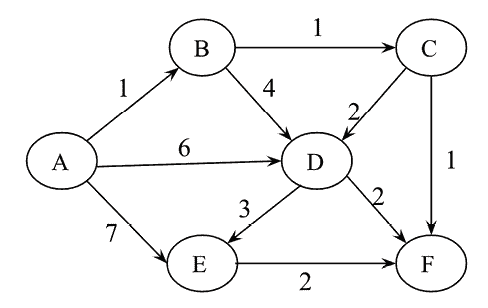

图 A.1：加权有向图

## 解答

A, B, C, F, E, D

在迪杰斯特拉算法中，在每一步，我们选择权重最小的边，它从迄今为止找到的最短路径中的任何一个顶点开始，并将其添加到最短路径中。

## 问题 3

考虑*表 3.8*中的物品的重量和价值。注意，每种物品只有一个单位。

| **物品** | **重量** | **价值** |
| --- | --- | --- |
| A | 2 | 10 |
| B | 10 | 8 |
| C | 4 | 5 |
| D | 7 | 6 |

表 A.1：不同物品的重量和价值

我们需要最大化价值；最大重量应为 11 公斤。不允许分割任何物品。使用贪心算法确定物品的价值。

## 解答

首先，我们选择了项目 A（重量 2 公斤），因为其值是最大的（10）。第二高的值是项目 B，但由于总重量达到 12 公斤，这违反了给定的条件，因此我们不能选择它。下一个最高的值是项目 D，现在总重量变为 2+7 = 9 公斤（项目 A + 项目 D）。下一个剩余的项目 C 不能选择，因为添加它后，总重量条件将被违反。

因此，使用贪婪方法选择的物品的总价值 = 10 + 6 = 16

# 第四章：链表

## 问题 1

在链表中插入数据元素后，指向该元素的指针的时间复杂度是多少？

## 解决方案

这将是 `O(1)`，因为不需要遍历列表以到达要添加新元素的目标位置。有一个指针指向当前位置，可以直接通过链接添加新元素。

## 问题 2

确定给定链表长度的时间复杂度是多少？

## 解决方案

`O(n)`。

为了找出长度，必须遍历列表中的每个节点，这将花费 `O(n)`。

## 问题 3

在长度为 n 的单链表中搜索给定元素的最坏情况时间复杂度是多少？

## 解决方案

`O(n)`.

在最坏的情况下，要搜索的数据元素将在列表的末尾，或者根本不在列表中。在这种情况下，将进行总共 `n` 次比较，从而使最坏情况下的时间复杂度为 `O(n)`。

## 问题 4

对于给定的链表，假设它只有一个指向列表起始点的 `head` 指针，以下操作的时间复杂度是多少？

1.  在链表前插入

1.  在链表末尾插入

1.  删除链表的前节点

1.  删除链表的最后一个节点

## 解决方案

1.  `O(1)`. 这个操作可以通过头节点直接执行。

1.  `O(n)`. 需要遍历列表以到达列表的末尾。

1.  `O(1)`. 这个操作可以通过头节点直接执行。

1.  `O(n)`. 需要遍历列表以到达列表的末尾。

## 问题 5

从链表末尾找到第 n 个节点。

## 解决方案

为了从链表末尾找到第 n 个节点，我们可以使用两个指针——`first` 和 `second`。首先，将第二个指针移动到起始点的第 n 个节点。然后，每次移动两个指针一步，直到第二个指针到达列表的末尾。那时，第一个指针将指向链表末尾的第 n 个节点。

## 问题 6

你如何确定给定链表中是否存在循环（或环）？

## 解决方案

为了找到链表中的循环，最有效的方法是使用**弗洛伊德循环查找算法**。在这种方法中，使用两个指针来检测循环——比如说第一个和第二个指针。我们从列表的起始点开始移动这两个指针。

我们每次将第一个和第二个指针各移动一个和两个节点。如果这两个指针在同一个节点相遇，那么这表明存在一个循环，否则，给定的链表中不存在循环。

以下图例展示了这个过程的一个示例：

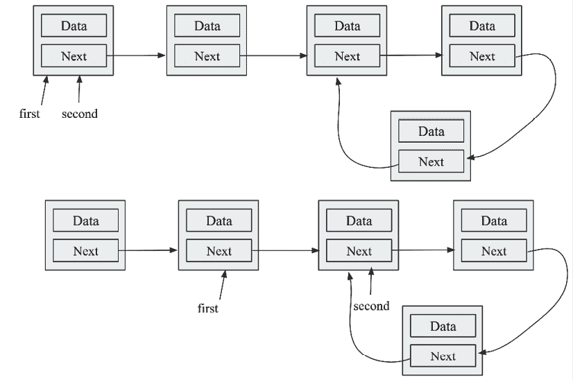

图 A.2：单链表中的循环

## 问题 7

如何确定链表的中间元素？

## 解答

可以使用两个指针来完成，比如，第一个和第二个指针。从起始节点开始移动这两个指针。第一个和第二个指针应该分别每次移动一个和两个节点。当第二个指针到达列表的末尾时，第一个指针将指向单链表的中间元素。

# 第五章：栈和队列

## 问题 1

以下哪个选项是使用链表实现的正确队列实现？

1.  如果在入队操作中，新的数据元素被添加到列表的起始位置，那么出队操作必须从列表的末尾执行。

1.  如果在入队操作中，新的数据元素被添加到列表的末尾，那么入队操作必须从列表的起始位置执行。

1.  两个都是。

1.  以上都不对。

## 解答

B 是正确的。队列数据结构遵循 FIFO 顺序，因此数据元素必须添加到列表的末尾，然后从前面移除。

## 问题 2

假设一个队列使用一个具有`head`和`tail`指针的单链表实现。入队操作在`head`处实现，出队操作在队列的`tail`处实现。入队和出队操作的时间复杂度将是什么？

## 解答

入队操作的时间复杂度将是`O(1)`，出队操作的时间复杂度是`O(n)`。至于入队操作，我们只需要删除`head`节点，对于单链表来说，这可以在`O(1)`时间内完成。对于出队操作，为了删除`tail`，我们需要先遍历整个列表到`tail`，然后才能删除它。为此，我们需要线性时间，`O(n)`。

## 问题 3

实现一个队列需要多少个栈？

## 解答

两个栈。

使用两个栈和入队操作，新元素被添加到`stack1`的顶部。在出队过程中，如果`stack2`为空，则将所有元素移动到`stack2`，最后返回`stack2`的顶部。

## 问题 4

在队列中使用数组高效地实现了入队和出队操作。这两个操作的时间复杂度将是多少？

## 解答

两个操作都是`O(1)`。

如果我们使用循环数组来实现队列，那么我们不需要移动元素，只需要移动指针，因此我们可以以`O(1)`的时间复杂度实现入队和出队操作。

## 问题 5

我们如何以相反的顺序打印队列数据结构的数据元素？

## 解答

创建一个空栈，然后将队列中的每个元素从队列中取出并推入栈中。当队列为空时，开始从栈中弹出元素并逐个打印。

# 第六章：树

## 问题 1

关于二叉树以下哪个说法是正确的：

1.  每棵二叉树要么是完全二叉树，要么是满二叉树

1.  每棵完全二叉树也都是满二叉树

1.  每个满二叉树也都是一个完全二叉树

1.  没有二叉树既是完全二叉树又是满二叉树

1.  以上都不对

## 解答

选项 A 是错误的，因为二叉树不一定是完全二叉树或满二叉树。

选项 B 是错误的，因为完全二叉树可以有某些节点在最后一层未填充，所以完全二叉树不一定是满二叉树。

选项 C 是错误的，因为这不总是正确的，以下图是一个满二叉树，但不是完全二叉树：

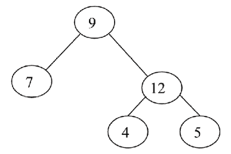

图 A.3：一棵是满二叉树但不是完全二叉树的二叉树

选项 D 是错误的，因为这不总是正确的。以下树既是完全二叉树，也是满二叉树：

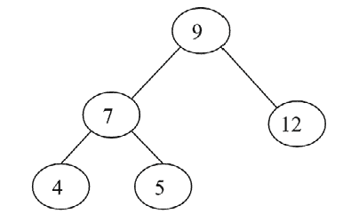

图 A.4：一棵既是满二叉树又是完全二叉树的二叉树

## 问题 2

哪种树遍历算法最后访问根节点？

## 解答

`后序遍历`.

使用 `后序遍历`，我们首先访问左子树，然后是右子树，最后访问 `根` 节点。

## 问题 3

考虑这个二叉搜索树：

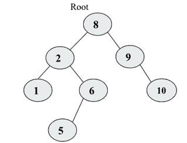

图 A.5：示例二叉搜索树

假设我们移除根节点 `8`，并希望用左子树中的任何节点替换它，那么新的根节点将是什么？

## 解答

新节点将是节点 `6`。为了保持二叉搜索树的性质，左子树中的最大值应该是新的根。

## 问题 4

以下树的 `中序`、`后序`和 `前序`遍历将是什么？

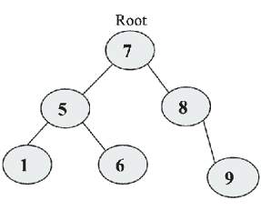

图 A.6：示例树

## 解答

`前序遍历`将是 `7`-`5`-`1`-`6`-`8`-`9`。

`中序遍历`将是 `1`-`5`-`6`-`7`-`8`-`9`。

`后序遍历`将是 `1`-`6`-`5`-`9`-`8`-`7`。

## 问题 5

你如何判断两棵树是否相同？

## 解答

为了找出两棵二叉树是否相同，这两棵树应该有完全相同的数据和元素排列。这可以通过使用任何遍历算法（对于两棵树应该是相同的）遍历这两棵树并逐个匹配元素来实现。如果在遍历两棵树的过程中所有元素都相同，那么这两棵树是相同的。

## 问题 6

在问题 4 中提到的树中有多少个叶子节点？

## 解答

三个节点 `1`、`6` 和 `9`。

## 问题 7

完美二叉树的高度与该树中的节点数之间有什么关系？

## 解答

`log2 = h.`

每一层的节点数：

层级 `0`: `2`⁰ = 1 个节点

层级 `1`: `2`¹ = 2 个节点

层级 `2`: `2`² = 4 个节点

层级 `3`: `2`³ = 8 个节点

可以通过将每一层的所有节点相加来计算第 `h` 层的总节点数：

n = 2⁰ + 2¹ + 2² + 2³ + …… 2^(h-1) = 2^h - 1

因此，`n` 和 `h` 之间的关系是：`n = 2`^h - 1

= log (n+1) = log2^h

= log[2] (n+1) = h

# 第七章：堆和优先队列

## 问题 1

从 `min-heap` 中删除任意元素的时间复杂度是多少？

## 解答

要从 `heap` 中删除任何元素，我们首先必须搜索要删除的元素，然后删除该元素。

总时间复杂度 = 搜索元素的时间 + 删除元素的时间

= `O(n)` + `O(log n)`

= `O(n)`

## 问题 2

从 `min-heap` 中找到第 `k` 个最小元素的时间复杂度是多少？

## 解答

可以通过执行 `delete` 操作 `k` 次来从 `min-heap` 中找到第 `k` 个元素。对于每次 `delete` 操作，时间复杂度是 `O(logn)`。因此，找到第 `k` 个最小元素的总时间复杂度将是 `O(klogn)`。

## 问题 3

将两个大小为 `n` 的 `max-heap` 合并成一个 `max-heap` 的时间复杂度是多少？

## 解答

`O(n)`。

由于从 `n` 个元素创建 `heap` 的时间复杂度是 `O(n)`，因此创建 `2n` 个元素的 `heap` 也将是 `O(n)`。

## 问题 4

确定二叉最大堆和二叉最小堆中最小元素的最坏情况时间复杂度是多少？

## 解答

在最大堆中，最小的元素始终位于叶节点。因此，为了找到最小的元素，我们必须搜索所有的叶节点。因此，最坏情况复杂度将是 `O(n)`。

在最小堆中找到最小元素的最坏情况时间复杂度将是 `O(1)`，因为它始终位于根节点。

## 问题 5

`max-heap` 的层序遍历是 `12`, `9`, `7`, `4`, `2`。在插入新元素 `1` 和 `8` 之后，最终的 `max-heap` 和最终 `max-heap` 的层序遍历将是什么？

## 解答

插入元素 `1` 后的 `max-heap` 如下图所示：

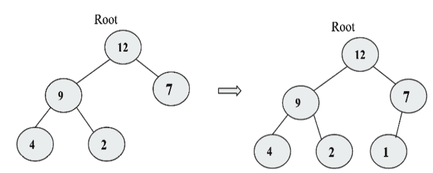

图 A.7：插入元素 8 之前的最大堆

插入元素 `8` 后的最终 `max-heap` 如下图所示：

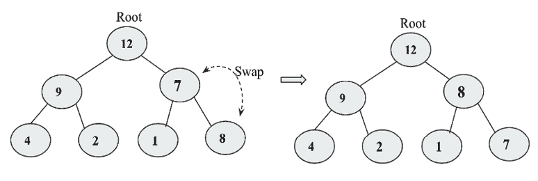

图 A.8：插入元素 1 和 8 后的最大堆

最终 `max-heap` 的层序遍历将是 `12`, `9`, `8`, `4`, `2`, `1`, `7`。

## 问题 6

以下哪个是二叉 `max-heap`？

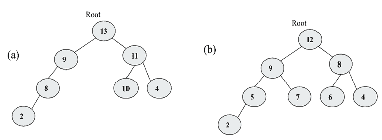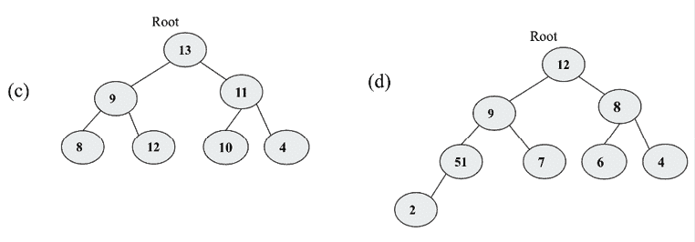

图 A.9：示例树

## 解答

B.

一个二叉 `max-heap` 应该是一个完整的二叉树，除了最后一层之外的所有层都应该被填满。父节点的值应该大于或等于其子节点的值。

选项 A 是不正确的，因为它不是一个完整的二叉树。选项 C 和 D 是不正确的，因为它们没有满足 `heap` 属性。选项 B 是正确的，因为它既完整又满足 `heap` 属性。

# 第八章：哈希表

## 问题 1

该哈希表有 40 个槽位，表中存储了 200 个元素。哈希表的负载因子是多少？

## 解答

哈希表的负载因子 = (元素数量) / (表槽位数量) = 200/40 = 5。

## 问题 2

使用单独链接算法进行哈希的最坏情况搜索时间是多少？

## 解答

使用链表进行单独链接算法搜索的最坏情况时间复杂度是`O(n)`，因为在最坏的情况下，所有项目都将添加到链表的`index 1`，搜索一个项目的工作方式将与链表类似。

## 问题 3

假设哈希表中的键均匀分布。`搜索`/`插入`/`删除`操作的时间复杂度将是什么？

## 解答

当哈希表中的键均匀分布时，哈希表的索引在`O(1)`时间内从键中计算出来。创建表将花费`O(n)`时间，而其他操作如`搜索`、`插入`和`删除`操作将花费`O(1)`时间，因为所有元素都是均匀分布的，因此，我们可以直接获取所需元素。

## 问题 4

从字符数组中删除重复字符的最坏情况复杂度是多少？

## 解答

暴力算法从第一个字符开始，与数组的所有字符进行线性搜索。如果找到重复字符，则应将该字符与最后一个字符交换，然后字符串的长度应减少一个。重复此过程，直到所有字符都被处理。此过程的时间复杂度是 O(n²)。

可以使用哈希表以`O(n)`的时间复杂度更有效地实现。

使用这种方法，我们从数组的第一个字符开始，根据哈希值将其存储在哈希表中。我们对所有字符都这样做。如果有任何冲突，则可以忽略该字符，否则，该字符将被存储在哈希表中。

# 第九章：图和算法

## 问题 1

在具有五个节点的无向简单图中，可能的最大边数（不包括自环）是多少？

## 解答

每个节点可以连接到图中的其他每个节点。因此，第一个节点可以连接到`n-1`个节点，第二个节点可以连接到`n-2`个节点，第三个节点可以连接到`n-3`个节点，以此类推。节点的总数将是：

*[(n-1)+(n-2)+…+3+2+1] = n(n-1)/2.*

## 问题 2

我们称所有节点具有相等度数的图为什么？

## 解答

一个完全图。

## 问题 3

解释什么是割点，并识别给定图中的割点？

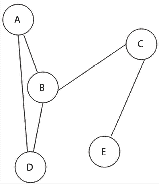

图 A.10：示例图

## 解答

割点也称为连通点。这些是在图中，移除后图将分成两个不连通部分的顶点。在给定的图中，顶点 `B` 和 `C` 是割点，因为移除节点 `B` 后，图将分成 `{A,D}`、`{C,E}` 顶点。同样，移除节点 `C` 后，图将分成 `{A,B,D}`、`{E}` 顶点。

## 问题 4

假设有一个阶数为 n 的图 G，图 G 中可能的最大割点数是多少？

## 解答

将是 `n-2`，因为第一个和最后一个顶点不会是割点，除了这两个节点，所有节点都可以将图分割成两个不连通的图。请参见下面的图：

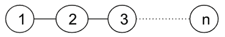

图 A.11：图 G

# 第十章：搜索

## 问题 1

在平均情况下，对 n 个元素的线性搜索需要多少次比较？

## 解答

线性搜索的平均比较次数如下。当搜索元素在第一个位置、第二个位置、第三个位置，以及类似地在第 n 个位置找到时，相应地，它将需要 1、2、3…n 次比较。

总平均比较次数

= 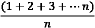

= 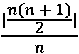

= 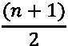

## 问题 2

假设有一个排序数组中有八个元素。如果所有搜索都成功并且使用二分搜索算法，平均需要多少次比较？

## 解答

平均比较次数 = (1+2+2+3+3+3+3+4)/8

= 21/8

= 2.625

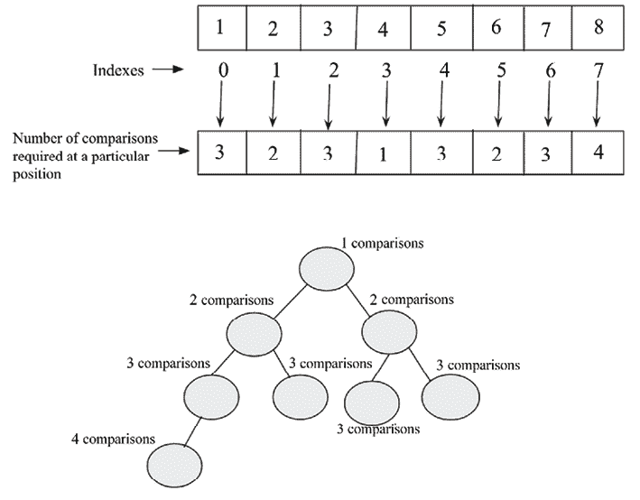


## 问题 3

二分搜索算法的最坏情况时间复杂度是多少？

## 解答

`O(logn)`。

二分搜索算法的最坏情况将在所需元素位于第一个位置或最后一个位置时发生。在这种情况下，需要 `log(n)` 次比较。因此，最坏情况的复杂度将是 `O(logn)`。

## 问题 4

在什么情况下插值搜索算法的性能应该优于二分搜索算法？

## 解答

当数组中的数据项均匀分布时，插值搜索算法的性能优于二分搜索算法。

# 第十一章：排序

## 问题 1

如果给定一个数组 `arr = {55, 42, 4, 31}` 并使用冒泡排序对数组元素进行排序，那么需要多少次遍历才能对数组进行排序？

1.  3

1.  2

1.  1

1.  0

## 解答

答案是 a。为了对 n 个元素进行排序，冒泡排序算法需要 (`n-1`) 次迭代（遍历），其中 n 是给定数组中的元素数量。在此问题中，n 的值为 `4`，所以需要 `4-1` = `3` 次迭代来排序给定的数组。

## 问题 2

冒泡排序的最坏情况复杂度是多少？

1.  O(nlogn)

1.  O(logn)

1.  O(n)

1.  O(n²)

## 解答

答案是 d。最坏情况出现在给定数组是逆序的情况下。在这种情况下，冒泡排序的时间复杂度将是 O(n²)。

## 问题 3

将快速排序应用于序列 (`56`, `89`, `23`, `99`, `45`, `12`, `66`, `78`, `34`)。第一阶段后的序列是什么，第一个元素是什么支点？

1.  45, 23, 12, 34, 56, 99, 66, 78, 89

1.  34, 12, 23, 45, 56, 99, 66, 78, 89

1.  12, 45, 23, 34, 56, 89, 78, 66, 99

1.  34, 12, 23, 45, 99, 66, 89, 78, 56

## 解决方案

b.

在第一阶段后，`56` 将处于正确的位置，以便所有小于 `56` 的元素都将位于其左侧，而大于 `56` 的元素都将位于其右侧。进一步，快速排序递归地应用于左子数组和右子数组。如图所示，对给定序列进行快速排序的过程。

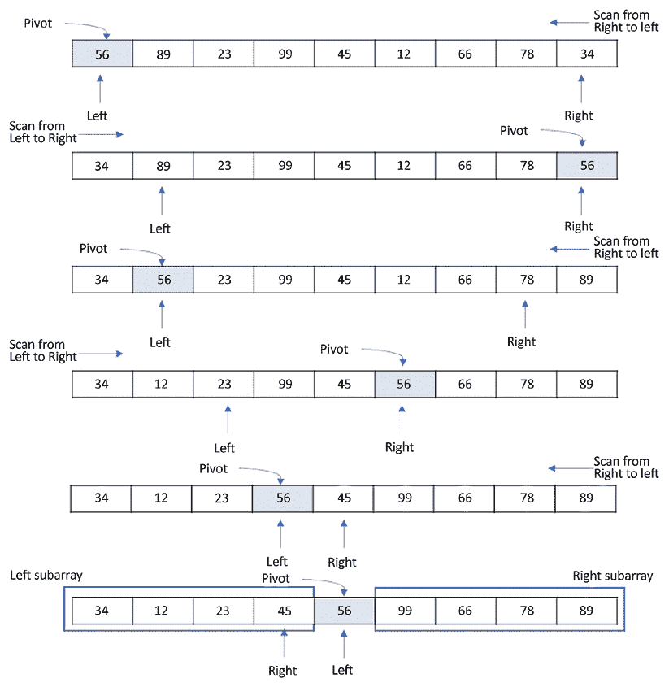

图 A.13：快速排序算法的演示

## 问题 4

快速排序是一种 ___________

1.  贪心算法

1.  分而治之算法

1.  动态规划算法

1.  回溯算法

## 解决方案

答案是 b。快速排序是一种分而治之算法。快速排序首先将一个大数组分成两个较小的子数组，然后递归地对子数组进行排序。在这里，我们找到支点元素，使得支点元素左侧的所有元素都小于支点元素，并创建第一个子数组。支点元素右侧的元素都大于支点元素，并创建第二个子数组。因此，给定问题被简化为两个较小的集合。现在，再次对这些两个子数组进行排序，在每个子数组中找到支点元素，即在每个子数组上应用快速排序。

## 问题 5

考虑一种情况，`swap` 操作非常昂贵。以下哪种排序算法应该被使用，以便最小化 `swap` 操作的数量？

1.  堆排序

1.  选择排序

1.  插入排序

1.  归并排序

## 解决方案

b. 在选择排序算法中，通常我们识别最大的元素，然后将其与最后一个元素交换，以便在每次迭代中只需要一个 `swap`。对于 `n` 个元素，总共需要 (`n-1`) 次 `swap`，这是与其他所有算法相比最低的。

## 问题 6

如果给定的输入数组 `A = {15, 9, 33, 35, 100, 95, 13, 11, 2, 13}`，使用选择排序，第五次 `swap` 后数组的顺序是什么？（注意：无论它们是否交换或保持在同一位置，都计算在内。）

1.  2, 9, 11, 13, 13, 95, 35, 33, 15, 100

1.  2, 9, 11, 13, 13, 15, 35, 33, 95, 100

1.  35, 100, 95, 2, 9, 11, 13, 33, 15, 13

1.  11, 13, 9, 2, 100, 95, 35, 33, 13, 13

## 解决方案

答案是 a。在选择排序中，选择最小的元素。从数组的开始处开始比较，并将最小的元素与第一个最大的元素交换。现在，排除之前选为最小的元素，因为它已经被放在了正确的位置。

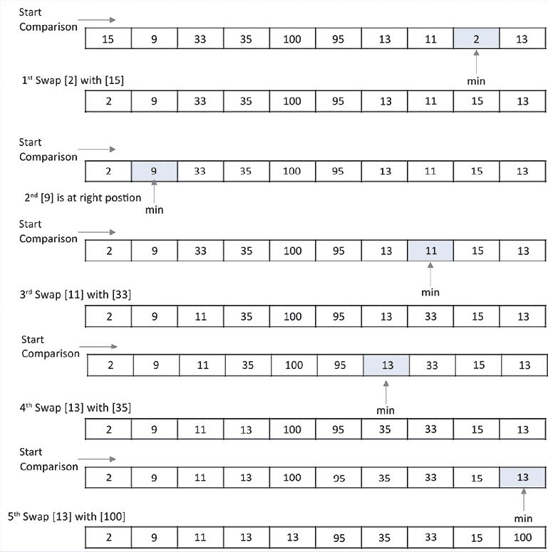

图 A.14：给定序列上插入排序的演示

## 问题 7

使用插入排序对元素 `{44, 21, 61, 6, 13, 1}` 进行排序需要多少次迭代？

1.  6

1.  5

1.  7

1.  1

## 解答

答案是 a。假设输入列表中有 `N` 个键，那么使用插入排序对整个列表进行排序需要 `N` 次迭代。

## 问题 8

如果使用插入排序对数组元素 `A= [35, 7, 64, 52, 32, 22]` 进行排序，那么在第二次迭代后数组元素将如何排列？

1.  7, 22, 32, 35, 52, 64

1.  7, 32, 35, 52, 64, 22

1.  7, 35, 52, 64, 32, 22

1.  7, 35, 64, 52, 32, 22

## 解答

d. 在这里 `N` = `6`。在第一次迭代中，第一个元素，即 `A[1]` `=` `35`，被插入到初始为空的数组 `B` 中。在第二次迭代中，`A[2] = 7` 与 `B` 的最右侧元素开始比较，以找到其位置。因此，在第二次迭代后，输入数组将是 `A = [7, 35, 64, 52, 32, 22]`。

# 第十二章：选择算法

## 问题 1

如果将快速选择算法应用于给定的数组 `arr=[3, 1, 10, 4, 6, 5]` 并给定 `k` 为 2，输出将是什么？

## 解答

1.  给定初始数组：`[3, 1, 10, 4, 6, 5]`，我们可以找到中位数的中位数：`4`（索引 = `3`）。

1.  我们将枢轴元素与第一个元素交换：`[4, 1, 3, 10, 6, 5]`。

1.  我们将枢轴元素移动到其正确的位置：`[1, 3, 4, 10, 6, 5]`。

1.  现在我们得到一个分割索引等于 `2`，但 `k` 的值也等于 `2`，因此索引 `2` 的值将是我们的输出。因此，输出将是 `4`。

## 问题 2

快速选择算法能否在具有重复值的数组中找到最小元素？

## 解答

是的，它有效。在每个迭代的结束时，我们都有所有小于当前枢轴的元素存储在枢轴的左侧。让我们考虑当所有元素都相同的情况。在这种情况下，每个迭代都会在数组的左侧放置一个枢轴元素。下一个迭代将继续使用数组中少一个元素的数组。

## 问题 3

快速排序算法与快速选择算法之间的区别是什么？

## 解答

在快速选择算法中，我们不对数组进行排序，它专门用于在数组中找到第 k 个最小的元素。该算法根据枢轴元素的值将数组反复分为两个部分。正如我们所知，枢轴元素将被放置，使得其左侧的所有元素都小于枢轴元素，而其右侧的所有元素都大于枢轴元素。因此，我们可以根据目标值选择数组的任意一个部分。这样，我们数组可操作的范围不断缩小。这降低了复杂度从 O(nlog2) 到 O(n)。

## 问题 4

确定性选择算法与快速选择算法的主要区别是什么？

## 解答

在 `quickselect` 算法中，我们根据随机选择的枢轴元素在无序列表中找到第 k 小的元素。而，在确定性选择算法中，该算法也用于从无序列表中找到第 k 小的元素，但在这个算法中，我们通过中位数的中位数来选择枢轴元素，而不是随机选择任何枢轴元素。

## 问题 5

什么触发了选择算法的最坏情况行为？

## 解答

在每次迭代中连续选择最大或最小元素会触发选择算法的最坏情况行为。

# 第十三章：字符串匹配算法

## 问题 1

展示模式 `"aabaabcab"` 的 KMP `prefix` 函数。

## 解答

给定的 `prefix` 函数值如下：

| **模式** | a | a | b | a | a | b | c | a | b |
| --- | --- | --- | --- | --- | --- | --- | --- | --- | --- |
| `prefix_function` 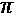 | 0 | 1 | 0 | 1 | 2 | 3 | 0 | 1 | 0 |

表 A.2：给定模式的预置函数

## 问题 2

如果期望的有效位移数很小，并且模数大于模式长度，那么 Rabin-Karp 算法的匹配时间是多少？

1.  Theta (`m`)

1.  Big O (`n+m`)

1.  Theta (`n-m`)

1.  Big O (`n`)

## 解答

Big O (`n+m`)

## 问题 3

当在文本 `T = "3141512653849792"` 中寻找模式 `P = "26"` 的所有出现时，Rabin-Karp 字符串匹配算法遇到多少虚假匹配，工作在模 `q = 11` 和字母表集 `Σ = {0, 1, 2,..., 9}` 上？

## 解答

2.

## 问题 4

Rabin-Karp 算法中用于获得计算时间为 Theta (m) 的基本公式是什么？

1.  二分法

1.  Horner 规则

1.  求和引理

1.  抵消引理

## 解答

Horner 规则。

## 问题 5

Rabin-Karp 算法可用于在文本文档中检测剽窃。

1.  真的

1.  错误

## 解答

真的，Rabin-Karp 算法是一种字符串匹配算法，它可以用于检测文本文档中的剽窃。

# 加入我们的 Discord 社区

加入我们社区的 Discord 空间，与作者和其他读者进行讨论：[`packt.link/MEvK4`](https://packt.link/MEvK4)


