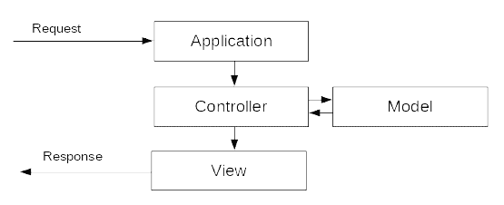

# 第二章：设计模式-做出选择

当进行软件应用程序开发项目时，它本质上被视为需要解决的问题。当我们开始开发应用程序时，我们开始开发一个特定于给定问题的解决方案。最终，这个解决方案可能开始在类似问题中得到重复使用，并成为解决这类问题的标准解决方案。随着时间的推移，我们发现很多显示相同模式的问题。一旦我们修改我们的标准解决方案以适应这种观察到的模式，我们就提出了一个**设计模式**。设计模式不是闹着玩的；经过多年的尝试和测试，才能产生，用于解决大量具有相似模式的问题。

设计模式不仅定义了我们构建软件应用程序的方式，还提供了关于在尝试解决特定类型问题时什么有效和什么无效的知识。有时候，没有特定的设计模式可能适合特定应用程序的需求，开发人员别无选择，只能提出独特的解决方案。

是否有一些现有的标准设计模式可以用于特定类型的问题？我们如何决定在我们的问题中使用哪种设计模式？我们可以偏离特定的设计模式并在解决方案中使用它们吗？随着我们在本章的进展，我们将尝试回答这些问题。

在本章结束时，您将了解以下内容：

+   设计模式及其分类

+   Python 的面向对象特性，以及我们如何使用它来实现一些常见的设计模式

+   特定模式可能被使用的用例

# 技术要求

本书的代码清单可以在[`github.com/PacktPublishing/Hands-On-Enterprise-Application-Development-with-Python`](https://github.com/PacktPublishing/Hands-On-Enterprise-Application-Development-with-Python)的`chapter02`目录下找到。

可以通过运行以下命令克隆代码示例：

```py
git clone https://github.com/PacktPublishing/Hands-On-Enterprise-Application-Development-with-Python
```

运行代码示例的说明可以在章节目录内的`README.md`文件中找到。

# 设计模式

设计模式定义了我们如何组织解决给定问题的方式。它不定义可以用来解决问题的算法，而是提供了关于例如代码应该如何组织，需要定义哪些类，它们的粒度将是什么，以及如何创建不同对象的抽象。

设计模式已经获得了很多关注，1994 年出版的书籍《设计模式：可复用面向对象软件的元素》仍然是理解设计模式时的事实参考。

设计模式通常包括以下元素：

+   **问题陈述**：问题陈述描述了我们想要解决的问题，因此也定义了我们可以使用的设计模式。问题陈述将告诉我们关于我们计划追求的设计范围，我们可能需要注意的约束，有时还会告诉我们应用程序中不同组件如何相互通信。

+   **解决方案**：解决方案描述了弥补问题的设计。它详细说明了类层次结构应该如何形成，对象将如何形成，对象之间的关系以及不同组件之间的通信将如何进行。解决方案将是一个抽象设计，不指定实现的细节。这使得解决方案通用，可以应用于一类问题，而不用关心应该使用什么算法来解决特定问题。

+   **后果**：在软件开发世界中，没有免费的东西。一切都有代价，我们为一件事情而牺牲另一件事情。重要的是权衡是否合理。同样适用于设计模式的选择，它们也有自己的后果。大多数情况下，这些后果是空间和时间的权衡，是评估替代选项的重要部分，如果特定的设计选择不能证明权衡成本的合理性。有时，后果也可能定义语言的实现障碍，并且通常会影响应用程序的可重用性和灵活性。

选择设计模式并不是每组问题都通用的事情。解决问题将基于多种因素，如开发人员对问题的解释，需要使用的编程语言的限制，与项目相关的截止日期等。

# 设计模式的分类

在书籍《设计模式：可重用面向对象软件的元素》中，设计模式被分类为三大类：

+   **创建模式**：这些模式定义了如何创建对象，以便您的代码可以独立于存在哪些对象，并因此使其与可能发生的新对象引入代码库的影响分离。这需要将对象创建逻辑与代码库隔离开来。Singleton 和 Factory 等模式属于创建模式类别。

+   **结构模式**：与创建模式不同，结构模式通常用于描述...

# 定义设计模式的选择

在选择设计模式时，我们可能希望设计模式具有一定的特征。让我们看看如果我们要使用 Python 来实现我们的设计模式，这些特征可能包括什么：

+   **最小惊讶原则**：Python 之禅说应该遵循最小惊讶原则。这意味着使用的设计模式在行为方面不应该让用户感到惊讶。

+   **减少耦合**：耦合被定义为软件内不同组件之间相互依赖的程度。具有高耦合度的软件可能很难维护，因为对一个组件的更改可能需要对许多其他组件进行更改。耦合作为一种影响无法完全从软件中移除，但应该选择设计模式，以便在开发过程中最小化耦合度。

+   **专注于简单性**：开始开发一个软件时，过于泛化的设计原则可能会带来更多的害处。它可能会在代码库中引入许多不需要的功能，这些功能很少被使用或根本不被使用。设计模式的选择应该更多地专注于为所述问题提供简单的解决方案，而不是专注于特定设计模式可以解决多少常见类型的问题。

+   **避免重复**：良好的设计模式选择将帮助开发人员避免重复代码逻辑，并将其保留在一个位置，系统的不同组件可以从该位置访问。逻辑重复的减少不仅可以节省开发时间，还可以使维护过程变得简单，其中逻辑的更改只需要在一个地方进行，而不是在代码库的多个部分进行。

# 面向对象的 Python

**面向对象编程**（**OOP**）指的是以一种不关心方法组织的格式组织代码，而是关心对象、它们的属性和行为。

一个对象可以代表任何逻辑实体，比如动物、车辆和家具，并且会包含描述它们的属性和行为。

面向对象编程语言的基本构建块是**类**，通常将逻辑相关的实体组合成一个单一的单元。当我们需要使用这个单元时，我们创建这个单元的一个新实例，称为类对象，并使用对象公开的接口来操作对象。

Python 中的面向对象编程...

# 基本的面向对象编程原则

一个语言不能仅仅因为它支持类和对象就被认为是面向对象的语言。该语言还需要支持一系列不同的功能，比如封装、多态、组合和继承，才能被认为是面向对象的语言。在这方面，Python 支持许多基于面向对象编程的概念，但由于其松散的类型特性，它的实现方式有些不同。让我们看看这些特性在 Python 中的区别。

# 封装

封装是一个术语，用来指代类限制对其成员的访问的能力，只能通过对象公开的接口来访问。封装的概念帮助我们只关注我们想要对对象做什么的细节，而不是对象如何处理内部的变化。

在 Python 中，封装并不是严格执行的，因为我们没有访问修饰符的支持，比如私有、公共和受保护，这些可以严格控制类内部特定成员的访问。

然而，Python 确实支持封装，借助名称修饰，可以用来限制对特定属性的直接访问...

# 组合

组合是用来表达不同对象之间关系的属性。在组合中表达这种关系的方式是将一个对象作为另一个对象的属性。

Python 通过允许程序员构建对象，然后将其作为其他对象的一部分来支持组合的概念。例如，让我们看下面的代码片段：

```py
class MessageHandler:
  __message_type = ['Error', 'Information', 'Warning', 'Debug']

  def __init__(self, date_format):
    self.date_format = date_format

  def new_message(message, message_code, message_type='Information'):
    if message_type not in self.__message_type:
      raise Exception("Unable to handle the message type")
    msg = "[{}] {}: {}".format(message_type, message_code, message)
    return msg

class WatchDog:

  def __init__(self, message_handler, debug=False):
    self.message_handler = message_handler
    self.debug = debug

  def new_message(message, message_code, message_type):
    try:
      msg = self.message_handler.new_message(message, message_code, message_type)
    except Exception:
      print("Unable to handle the message type")
    return msg

message_handler = MessageHandler('%Y-%m-%d')
watchdog = WatchDog(message_handler)
```

从例子中我们可以看到，我们已经将`message_handler`对象作为`watchdog`对象的属性。这标志着我们可以在 Python 中实现组合的一种方式。

# 继承

继承是我们创建对象层次结构的一种方式，从最一般的到最具体的。通常作为另一个类的基础的类也被称为基类，而继承自基类的类被称为子类。例如，如果一个类`B`派生自类`A`，那么我们会说类`B`是类`A`的子类。

就像 C++一样，Python 支持多重和多层继承的概念，但不支持在继承类时使用访问修饰符的概念，而 C++支持。

让我们看看如何在 Python 中实现继承，尝试模拟 BugZot 应用程序中的新请求将是什么样子。以下代码片段给出...

# Python 中的多重继承

让我们看一个抽象的例子，展示了我们如何在 Python 中实现多重继承，可以在接下来的代码片段中看到：

```py
class A:
    def __init__(self):
        print("Class A")

class B:
    def __init__(self):
        print("Class B")

class C(A,B):
    def __init__(self):
        print("Class C")
```

这个例子展示了我们如何在 Python 中实现多重继承。一个有趣的地方是要理解当我们使用多重继承时，Python 中的方法解析顺序是如何工作的。让我们来看看。

# 多重继承中的方法解析顺序

那么，基于前面的例子，如果我们创建一个`C`类的对象会发生什么呢？

```py
>>> Cobj = C()Class C
```

正如我们所看到的，这里只调用了派生类的构造函数。那么如果我们想要调用父类的构造函数呢？为此，我们需要在我们的类`C`构造函数内部使用`super()`调用。为了看到它的作用，让我们稍微修改一下`C`的实现：

```py
>>> class C(A,B):...  def __init__(self):...    print("C")...    super().__init__()>>> Cobj = C()CA
```

一旦我们创建了派生类的对象，我们可以看到派生类的构造函数首先被调用，然后是第一个继承类的构造函数。`super()`调用自动...

# 利用 mixin

Mixin 是每种面向对象语言中都存在的概念，可以用来实现可以在代码的不同位置重复使用的对象类。诸如 Django Web 框架之类的项目提供了许多预构建的 mixin，可以用于在我们为应用程序实现的自定义类中实现一定的功能集（例如，对象操作、表单渲染等）。

那么，mixin 是语言的一些特殊特性吗？答案是否定的，它们不是一些特殊特性，而是一些不打算成为独立对象的小类。相反，它们被构建为通过多重继承支持为类提供一些指定的额外功能。

回到我们的示例应用 BugZot，我们需要一种以 JSON 格式返回多个对象数据的方法。现在，我们有两个选择；我们可以在单个方法的级别构建返回 JSON 数据的功能，或者我们可以构建一个可以在多个类中重复使用的 mixin：

```py
Import json
class JSONMixin:
  def return_json(self, data):
    try:
      json_data = json.dumps(data)
    except TypeError:
      print("Unable to parse the data into JSON")
    return json_data
```

现在，让我们想象一下，如果我们想要我们在尝试理解继承时在示例中实现的 bug 类。我们所需要做的就是在`Bug`类中继承`JSONMixin`：

```py
class Bug(Request, JSONMixin):
  …
```

通过简单地继承该类，我们就得到了所需的功能。

# 抽象基类

在面向对象编程中，抽象基类是那些只包含方法声明而不包含实现的类。这些类不应该有独立的对象，而是被构建为基类。从抽象基类派生的类需要为抽象类中声明的方法提供实现。

在 Python 中，虽然你可以通过不提供已声明方法的实现来构建抽象类，但语言本身并不强制派生类为方法提供实现。因此，如果在 Python 中执行以下示例，它将完美运行：

```py
class AbstractUser:  def return_data(self):    passclass ...
```

# 元类

Python 提供了许多特性，其中一些直接对我们可见，例如列表推导、动态类型评估等，而另一些则不那么直接。在 Python 中，许多事情都可以被认为是魔术，是在幕后发生的。其中之一就是元类的概念。

在 Python 中，一切都是对象，无论是方法还是类。即使在 Python 内部，类也被认为是可以传递给方法、分配给变量等的一等对象。

但是，正如面向对象编程的概念所述，每个对象都表示一个类的实例。因此，如果我们的类是对象，那么它们也应该是某个类的实例。那么这个类是什么？这个问题的答案是`type`类。Python 中的每个类都是`type`类的实例。

这可以很容易地验证，如下面的代码片段所示：

```py
class A:
  def __init__(self):
    print("Hello there from class A")

>>>isinstance(A, type)
True
```

这些对象是类的对象，被称为元类。

在 Python 中，我们不经常直接使用元类，因为大多数时候，我们试图通过其他简单的解决方案来解决元类的问题。但是元类确实为我们提供了很多创建类的方法。让我们首先看一下如何通过设计`LoggerMeta`类来创建我们自己的元类，该类将强制实例类为不同以`HANDLER_`为前缀的日志方法提供有效的处理程序方法：

```py
class LoggerMeta(type):
  def __init__(cls, name, base, dct):
    for k in dct.keys():
      if k.startswith('HANDLER_'):
        if not callable(dct[k]):
          raise AttributeError("{} is not callable".format(k))
    super().__init__(name, base, dct)

def error_handler():
  print("error")
def warning_handler():
  print("warning")

class Log(metaclass=LoggerMeta):
  HANDLER_ERROR = error_handler
  HANDLER_WARN = warning_handler
  HANDLER_INFO = 'info_handler'

  def __init__(self):
    print(“Logger class”)
```

在这个例子中，我们通过从 type 类继承来定义了一个名为`LoggerMeta`的`元类`。（为了定义任何元类，我们需要从 type 类或任何其他元类继承。继承的概念在`元类`创建期间也适用。）一旦我们声明了我们的`元类`，我们在`元类`中提供了`__init__`魔术方法的定义。元类的`__init__`魔术方法接收类对象、要创建的新类的名称、新类将派生自的基类列表以及包含用于初始化新类的属性的字典。

在`__init__`方法中，我们提供了一个实现，用于验证以`HANDLER_`开头的类属性是否有有效的处理程序分配给它们。如果属性分配的处理程序不可调用，我们会引发`AttributeError`并阻止类的创建。在`__init__`方法的最后，我们返回基类`__init__`方法的调用结果。

在下一个例子中，我们创建两个简单的方法，它们将充当我们处理错误类型消息和警告类型消息的处理程序。

在这个例子中，我们定义了一个元类为`LoggerMeta`的类日志。这个类包含一些属性，比如`HANDLER_ERROR`、`HANDLER_WARN`、`HANDLER_INFO`和魔术方法`__init__`。

现在，让我们看看如果我们尝试执行提供的例子会发生什么：

```py
python3 metaclass_example.py
Traceback (most recent call last):
  File "<stdin>", line 1, in <module>
  File "<stdin>", line 6, in __init__
AttributeError: HANDLER_INFO is not callable
```

从输出中可以看出，一旦解释器解析了类日志的定义以创建类，元类`__init__`方法就会被调用，验证类的属性并引发`AttributeError`。

Python 中的元类为我们提供了很多强大的功能，并使我们能够以神奇的方式做很多事情，例如基于方法名称生成类属性，并跟踪类的实例化数量。

通过学习 Python 中的面向对象编程和元类的所有内容，现在让我们继续使用它们来实现 Python 中的一些设计模式，并学习如何决定使用哪种设计模式。

# 单例模式

单例模式是《设计模式》一书中*四人帮*之一的模式，它可以在应用程序中有各种用途，我们希望一个类在整个应用程序中只有一个实例。

单例模式强制一个类只能有一个实例，该实例将被应用程序中的任何组件/模块使用。当我们想要控制只使用一个对象来访问资源时，这种强制可以很有用。这种类型的资源可以是日志文件、数据库、崩溃处理机制等。

在大多数基于面向对象的语言中，要实现单例模式，第一步是将类构造函数设为私有，然后在类内部使用静态方法...

# __call__ 魔术方法

`__call__`魔术方法在 Python 元类的上下文中是特殊的。与`__init__`方法不同，`__init__`方法在我们从元类创建新类时被调用，而`__call__`方法在初始化类的对象时被调用。为了更好地理解这一点，让我们尝试运行以下示例：

```py
class ExampleMeta(type):
  def __init__(cls, name, bases, dct):
    print("__init__ called")
    return super().__init__(name, bases, dct)
  def __call__(cls, *args, **kwargs):
    print("__call__ called")
    return super().__call__(*args, **kwargs)
class Example(metaclass=Example):
  def __init__(self):
    print("Example class")
__init__ called
>>> obj = Example()
__call__ called
```

从这个例子中，可以清楚地看出`__init__`方法是在解释器完成基于`元类`的类初始化后被调用的，而`__call__`方法是在创建类的对象时被调用的。

现在，有了这个理解，让我们构建我们的数据库连接类，它将提供我们的数据库操作的支持。在这个例子中，我们只关注类的初始化部分，而将在后面的章节中提供完整的类实现细节。

现在，在`bugzot`目录下，让我们创建一个名为`database.py`的文件，其中将保存我们的数据库类：

```py
from bugzot.meta import Singleton

class Database(metaclass=Singleton):
  def __init__(self, hostname, port, username, password, dbname, **kwargs):
    """Initialize the databases
    Initializes the database class, establishing a connection with the database and providing
    the functionality to call the database.
    :params hostname: The hostname on which the database server runs
    :parms port: The port on which database is listening
    :params username: The username to connect to database
    :params password: The password to connect to the database
    :params dbname: The name of the database to connect to
    """ 
    self.uri = build_uri(hostname, port, username, password, dbname)
    #self.db = connect_db()
    self.db_opts = kwargs
    #self.set_db_opts()

  def connect_db(self):
    """Establish a connection with the database."""
    pass
  def set_db_opts(self):
    """Setup the database connection options."""
    pass
```

在这个例子中，我们定义了一个数据库类，它将帮助我们建立与数据库的连接。这个类的不同之处在于，无论我们尝试创建这个类的新实例时，它总是返回相同的对象。例如，让我们看看如果我们创建这个相同类的两个不同对象会发生什么：

```py
dbobj1 = Database("example.com", 5432, "joe", "changeme", "testdb")
dbobj2 = Database("example.com", 5432, "joe", "changeme", "testdb")
>>> dbobj1
<__main__.Database object at 0x7fb6d754a7b8>
>>> dbobj2
<__main__.Database object at 0x7fb6d754a7b8>
```

在这个例子中，我们可以看到，当我们尝试实例化该类的新对象时，返回的是数据库对象的相同实例。

现在，让我们来看看另一个有趣的模式，即**工厂**模式。

# 工厂模式

在开发大型应用程序时，有些情况下我们可能希望根据用户输入或其他动态因素动态初始化一个类。为了实现这一点，我们可以在类实例化期间初始化所有可能的对象，并根据环境输入返回所需的对象，或者可以完全推迟类对象的创建，直到收到输入为止。

工厂模式是后一种情况的解决方案，其中我们在类内部开发一个特殊的方法，负责根据环境输入动态初始化对象。

现在，让我们看看如何在 Python 中实现工厂模式...

# 模型-视图-控制器模式

让我们从一个图表开始讨论 MVC 模式：



该图表显示了使用 MVC 模式的**应用程序**中请求的流程。当用户发出新的**请求**时，**应用程序**拦截**请求**，然后将**请求**转发给适当的**控制器**处理该**请求**。一旦**控制器**接收到**请求**，它将与模型交互，根据其收到的**请求**执行一些业务逻辑。这可能涉及更新数据库或获取一些数据。一旦**模型**执行了业务逻辑，**控制器**执行**视图**并传递给**视图**需要显示**请求**的任何数据。

虽然我们将在本书的后面实现 MVC 模式，但在开发 BugZot 应用程序时，让我们来看看 MVC 模式中的不同组件以及它们扮演的角色。

# 控制器

控制器充当模型和视图之间的中介。当首次向应用程序发出请求时，控制器拦截请求，并根据此决定需要调用哪个模型和视图。一旦决定了这一点，控制器就执行模型来运行业务逻辑，从模型中检索数据。一旦检索到数据并且模型执行完成，控制器就执行视图，并使用从模型中收集的数据。一旦视图执行完成，用户就会看到视图的响应。

简而言之，控制器负责执行以下操作：

+   拦截应用程序发出的请求，并执行所需的...

# 模型

模型是应用程序的业务逻辑所在的地方。许多时候，开发人员会将模型与数据库混淆，这对于一些 Web 应用程序可能是正确的，但在一般情况下并非如此。

模型的作用是处理数据，提供对数据的访问，并在请求时允许修改。这包括从数据库或文件系统检索数据，向其中添加新数据，并在需要更新时修改现有数据。

模型不关心存储的数据应该如何呈现给用户或应用程序的其他组件，因此将呈现逻辑与业务逻辑解耦。模型也不经常更改其模式，并且在应用程序生命周期中基本保持一致。

因此，简而言之，模型负责执行以下角色：

+   提供访问应用程序中存储的数据的方法

+   将呈现逻辑与业务逻辑解耦

+   为存储在应用程序中的数据提供持久性

+   提供一致的接口来处理数据

# 视图

视图负责向用户呈现数据，或通过向用户呈现界面来操作模型中存储的数据。MVC 中的视图通常是动态的，并根据模型中发生的更改频繁变化。视图也可以被认为仅包含应用程序的呈现逻辑，而不考虑应用程序将如何存储数据以及如何检索数据。通常，视图可以用于缓存呈现状态，以加速数据的显示。

因此，简而言之，以下是视图执行的功能：

+   为应用程序提供呈现逻辑，以显示应用程序中存储的数据

+   为用户提供...

# 摘要

在本章中，我们讨论了设计模式的概念以及它们如何帮助我们解决设计应用程序中常遇到的一些问题。然后，我们讨论了如何决定使用哪种设计模式，以及是否有必要选择已经定义的模式之一。在本章的进一步探讨中，我们探索了 Python 作为一种语言的一些面向对象的能力，并且还探讨了在 Python 中实现抽象类和元类的一些示例，以及我们如何使用它们来构建其他类并修改它们的行为。

在掌握了面向对象的 Python 知识后，我们继续在 Python 中实现一些常见的设计模式，如单例模式和工厂模式，并探索了 MVC 模式，了解它们试图解决的问题。

现在我们掌握了设计模式的知识，是时候了解如何使我们应用程序内部处理数据的过程更加高效了。下一章将带领我们探索不同的技术，帮助我们有效地处理应用程序内部将发生的数据库操作。

# 问题

1.  我们如何在 Python 中实现责任链模式，以及它可以使用的一些可能用例是什么？

1.  `__new__`方法和`__init__`方法之间有什么区别？

1.  我们如何使用 ABCMeta 类作为抽象类的元类来实现抽象类？
