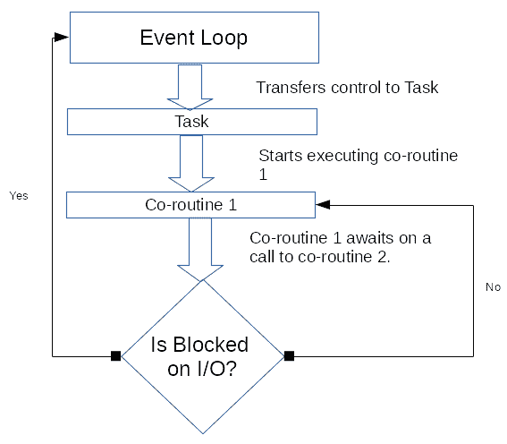
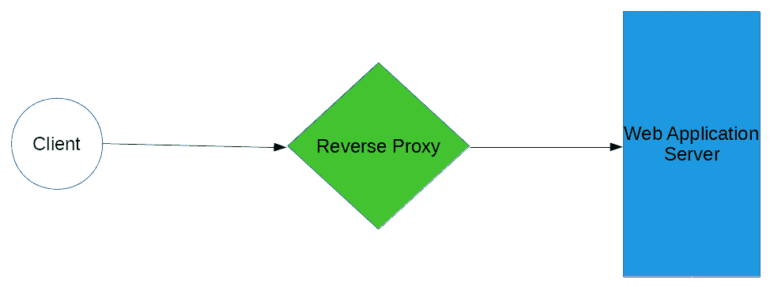

# 第五章：构建大规模请求处理

在企业环境中，随着用户数量的增长，同时尝试访问 Web 应用程序的用户数量也会增长是正常的。这给我们带来了一个有趣的问题，即如何扩展 Web 应用程序以处理大量用户的并发请求。

将 Web 应用程序扩展以处理大量用户是可以通过多种方式实现的任务，其中最简单的方式之一可以是增加更多基础设施并运行应用程序的更多实例。然而，尽管这种技术简单，但对应用程序可扩展性的经济影响很大，因为运行规模化应用程序的基础设施成本可能是巨大的。我们当然需要以这样的方式设计我们的应用程序，以便它能够轻松处理大量并发请求，而不需要频繁地扩展基础设施。

在前一章奠定的基础上，我们将看到如何应用这些技术来构建一个可扩展的应用程序，可以处理大量并发请求，同时学习一些其他技术，将帮助我们轻松地扩展应用程序。

在本章中，我们将看到以下技术来扩展我们的 Web 应用程序，以处理大规模的请求处理：

+   在 Web 应用部署中利用反向代理

+   使用线程池来扩展请求处理

+   了解使用 Python AsyncIO 的单线程并发代码的概念

# 技术要求

本书中的代码清单可以在[`github.com/PacktPublishing/Hands-On-Enterprise-Application-Development-with-Python`](https://github.com/PacktPublishing/Hands-On-Enterprise-Application-Development-with-Python)的`chapter05`目录下找到。

可以通过运行以下命令克隆代码示例：

```py
git clone https://github.com/PacktPublishing/Hands-On-Enterprise-Application-Development-with-Python
```

为了成功执行代码示例，需要安装 python-`virtualenv`包。

# 容纳增加的并发问题

多年来，互联网存在的时间里，Web 应用架构师常常面临的最常见问题之一是如何处理不断增加的并发。随着越来越多的用户上线并使用 Web 应用程序，迫切需要扩展基础设施来管理所有这些请求。

即使对于我们的企业 Web 应用程序也是如此。尽管我们可以估计企业内可能有多少用户同时访问这些 Web 应用程序，但没有硬性规定适用于未来的时间。随着企业的发展，访问应用程序的客户数量也会增加，给基础设施增加更多压力，并增加扩展的需求。但是，在尝试扩展应用程序以适应不断增加的客户数量时，我们有哪些选择？让我们来看看。

# 多种扩展选项

技术世界提供了许多选项，以扩展应用程序以适应不断增长的用户群体；其中一些选项只是要求增加硬件资源，而其他选项则要求应用程序围绕处理内部的多个请求来构建。大多数情况下，扩展选项分为两大类，即垂直扩展和水平扩展：


让我们看看它们，找出它们的利弊：

+   **垂直扩展**：垂直扩展的整个概念基于向现有资源添加更多资源的事实...

# 为可扩展性工程应用

在大多数企业项目在生产阶段通常使用一个框架或另一个框架来决定应用程序的服务方式的时候，仍然有必要深入了解如何在开发应用程序时保持应用程序的可扩展性。

在本节中，我们将看看不使用一些预先构建的框架，如何构建可扩展的应用程序的不同技术。在本节课程中，我们将看到如何使用线程/进程池来同时处理多个客户端，以及资源池化为什么是必要的，以及是什么阻止我们为处理每个其他传入请求启动单独的线程或进程。

但在我们深入探讨如何在应用程序开发中利用线程池或进程池之前，让我们首先看一下通过哪种简单的方式我们可以将传入请求的处理交给后台线程。

以下代码实现了一个简单的套接字服务器，首先接受传入的连接，然后将其交给后台线程进行读写，从而释放主线程以接受其他传入连接：

```py
# simple_socket_thread.py
#!/usr/bin/python3
import socket
import threading

# Let's first create a TCP type Server for handling clients
class Server(object):
    """A simple TCP Server."""

    def __init__(self, hostname, port):
        """Server initializer

        Keyword arguments:
        hostname -- The hostname to use for the server
        port -- The port on which the server should bind
        """

        self.server = socket.socket(socket.AF_INET, socket.SOCK_STREAM)
        self.hostname = hostname
        self.port = port
        self.bind_connection()
        self.listen()

    def bind_connection(self):
        """Bind the server to the host."""

        self.server.bind((self.hostname, self.port))

    def listen(self):
        """Start listening for the incoming connections."""

        self.server.listen(10) # Queue a maximum of 10 clients
        # Enter the listening loop
        while True:
            client, client_addr = self.server.accept()
            print("Received a connection from %s" % str(client_addr))
            client_thread = threading.Thread(target=self.handle_client, args=(client,))
            client_thread.daemon = True
            client_thread.start()

    def handle_client(self, client):
        """Handle incoming client connection.

        Keyword arguments:
        client -- The client connection socket
        """

        print("Accepted a client connection")
        while True:
            buff = client.recv(1024).decode()
            if not buff:
                break
            print(buff)
        print("Client closed the connection")
        client.close() # We are done now, let's close the connection

if __name__ == '__main__':
    server = Server('localhost', 7000)
```

在这段代码中，我们实现了一个简单的`Server`类，它在机器上初始化了一个基于 TCP 的服务器，准备接受传入的连接。在不偏离太多的情况下，让我们试着专注于这段代码的重要方面，在这里我们在`listen()`方法下启动了服务器的监听循环。

在`listen()`方法下，我们首先调用套接字的`listen()`方法，并告诉它最多可以排队 10 个尚未被接受的连接。一旦达到这个限制，服务器将拒绝任何进一步的客户端连接。接下来，我们开始一个无限循环，在循环中首先调用套接字的`accept()`方法。对`accept()`方法的调用将阻塞，直到客户端尝试建立连接。成功尝试后，`accept()`调用将返回客户端连接套接字和客户端地址。客户端连接套接字可用于与客户端执行 I/O 操作。

接下来发生的有趣部分是：一旦客户端连接被接受，我们就启动一个负责处理与客户端通信的守护线程，并将客户端连接套接字交给线程处理。这实质上使我们的主线程从处理客户端套接字的 I/O 中解放出来，因此，我们的主线程现在可以接受更多的客户端。这个过程对于连接到我们服务器的每个其他客户端都会继续进行。

到目前为止一切都很好；我们有了一个很好的方法来处理传入的客户端，我们的服务可以随着客户端数量的增加逐渐扩展。这是一个简单的解决方案，不是吗？嗯，在提出这个解决方案的过程中，显然我们忽略了一个主要缺陷。缺陷在于我们没有实现任何与应用程序可以启动多少个线程来处理传入客户端相关的控制。想象一下，如果一百万个客户端尝试连接到我们的服务器会发生什么？我们真的会同时运行一百万个线程吗？答案是否定的。

但为什么不可能呢？让我们来看看。

# 控制并发

在前面的例子中，我们遇到了一个问题，为什么我们不能有一百万个线程，每个线程处理一个单独的客户端？这应该为我们提供了大量的并发性和可扩展性。但是，有许多原因实际上阻止我们同时运行一百万个线程。让我们试着看看可能阻止我们无限扩展应用程序的原因：

+   **资源限制**：服务器处理的每个客户端连接都不是免费的。随着每个新连接的客户端，我们都在消耗机器的一些资源。这些资源可能包括映射到套接字的文件描述符，用于保存信息的一些内存...

# 使用线程池处理传入的连接

正如我们在前一节中看到的，我们不需要无限数量的线程来处理传入的客户端。我们可以通过有限数量的线程来处理大量的客户端。但是，我们如何在我们的应用程序中实现这个线程池呢？事实证明，使用 Python 3 和`concurrent.futures`模块实现线程池功能是相当容易的。

以下代码示例修改了我们现有的 TCP 服务器示例，以使用线程池来处理传入的客户端连接，而不是任意启动无限数量的线程：

```py
# simple_socket_threadpool.py
#!/usr/bin/python3
from concurrent.futures import ThreadPoolExecutor
import socket

# Let's first create a TCP type Server for handling clients
class Server(object):
    """A simple TCP Server."""

    def __init__(self, hostname, port, pool_size):
        """Server initializer

        Keyword arguments:
        hostname -- The hostname to use for the server
        port -- The port on which the server should bind
        pool_size -- The pool size to use for the threading executor
        """

        # Setup thread pool size
        self.executor_pool = ThreadPoolExecutor(max_workers=pool_size)

        # Setup the TCP socket server
        self.server = socket.socket(socket.AF_INET, socket.SOCK_STREAM)
        self.hostname = hostname
        self.port = port
        self.bind_connection()
        self.listen()

    def bind_connection(self):
        """Bind the server to the host."""

        self.server.bind((self.hostname, self.port))

    def listen(self):
        """Start listening for the incoming connections."""

        self.server.listen(10) # Queue a maximum of 10 clients
        # Enter the listening loop
        while True:
            client, client_addr = self.server.accept()
            print("Received a connection from %s" % str(client_addr))
            self.executor_pool.submit(self.handle_client, client)

    def handle_client(self, client):
        """Handle incoming client connection.

        Keyword arguments:
        client -- The client connection socket
        """

        print("Accepted a client connection")
        while True:
            buff = client.recv(1024).decode()
            if not buff:
                break
            print(buff)
        print("Client closed the connection")
        client.close() # We are done now, let's close the connection

if __name__ == '__main__':
    server = Server('localhost', 7000, 20)
```

在这个例子中，我们修改了我们的 TCP 服务器代码，以利用线程池来处理客户端连接，而不是启动任意数量的线程。让我们看看我们是如何做到的。

首先，要使用线程池，我们需要初始化线程池执行器的实例。在`Server`类的`__init__`方法中，我们首先通过调用其构造函数来初始化线程池执行器：

```py
self.executor_pool = ThreadPoolExecutor(max_workers=pool_size)
```

`ThreadPoolExecutor`构造函数接受一个`max_workers`参数，该参数定义了`ThreadPool`内可能有多少并发线程。但是，`max_workers`参数的最佳值是多少呢？

一个经验法则是将`max_workers` = *(5 x CPU 核心总数)*。这个公式背后的原因是，在 Web 应用程序中，大多数线程通常在等待 I/O 完成，而少数线程正在忙于执行 CPU 绑定的操作。

创建了`ThreadPoolExecutor`之后，下一步是提交作业，以便它们可以由执行器池内的线程处理。这可以通过`Server`类的`listen()` 方法来实现：

```py
self.executor_pool.submit(self.handle_client, client)
```

`ThreadPoolExecutor`的`submit()` 方法的第一个参数是要在线程内执行的方法的名称，第二个参数是要传递给执行方法的参数。

这样做非常简单，而且给我们带来了很多好处，比如：

+   充分利用底层基础设施提供的资源

+   处理多个请求的能力

+   增加了可扩展性，减少了客户端的等待时间

这里需要注意的一点是，由于`ThreadPoolExecutor`利用了线程，CPython 实现可能由于 GIL 的存在而无法提供最大性能，GIL 不允许同时执行多个线程。因此，应用程序的性能可能会因所使用的底层 Python 实现而异。

现在出现的问题是，如果我们想要规避全局解释器锁，那该怎么办呢？在仍然使用 Python 的 CPython 实现的情况下，有没有一些机制？我们在上一章讨论了这种情况，并决定使用 Python 的多进程模块来代替线程库。

此外，事实证明，使用`ProcessPoolExecutor`是一件相当简单的事情。并发.futures 包中的底层实现处理了大部分必要性，并为程序员提供了一个简单易用的抽象。为了看到这一点，让我们修改我们之前的例子，将`ProcessPoolExecutor`替换为`ThreadPoolExecutor`。要做到这一点，我们只需要首先从 concurrent.futures 包中导入正确的实现，如下行所述：

```py
from concurrent.futures import ProcessPoolExecutor
```

我们需要做的下一件事是修改我们的`__init__`方法，以创建一个进程池而不是线程池。下面的`__init__`方法的实现显示了我们如何做到这一点：

```py
def __init__(self, hostname, port, pool_size):
        """Server initializer

        Keyword arguments:
        hostname -- The hostname to use for the server
        port -- The port on which the server should bind
        pool_size -- The size of the pool to use for the process based executor
        """

        # Setup process pool size
        self.executor_pool = ProcessPoolExecutor(max_workers=pool_size)

        # Setup the TCP socket server
        self.server = socket.socket(socket.AF_INET, socket.SOCK_STREAM)
        self.hostname = hostname
        self.port = port
        self.bind_connection()
        self.listen()
```

确实，这是一个简单的过程，现在我们的应用程序可以使用多进程模型而不是多线程模型。

但是，我们可以保持池大小不变，还是它也需要改变？

每个进程都有自己的内存空间和需要维护的内部指针，这使得进程比使用线程实现并发更重。这提供了减少池大小的理由，以便允许更重的底层系统资源的使用。作为一个一般规则，对于`ProcessPoolExecutor`，`max_workers`可以通过公式`max_workers` = *(2 x CPU 核心数 + 1)*来计算。

这个公式背后的推理可以归因于这样一个事实，即在任何给定时间，我们可以假设一半的进程将忙于执行网络 I/O，而另一半可能忙于执行 CPU 密集型任务。

所以，现在我们对如何使用资源池以及为什么这是一个比启动任意数量的线程更好的方法有了一个相当清楚的想法。但是，这种方法仍然需要大量的上下文切换，并且也高度依赖于所使用的底层 Python 实现。但肯定有比这更好的东西。

考虑到这一点，让我们尝试进入 Python 王国的另一个领域，即异步编程领域。

# 使用 AsyncIO 进行异步编程

在我们深入探讨异步编程这个未知领域之前，让我们首先回顾一下为什么我们使用线程或多个进程。

使用线程或多个进程的主要原因之一是增加并发性，从而使应用程序能够处理更多的并发请求。但这是以增加资源利用率为代价的，而且使用多线程或启动更重的进程来适应更高的并发性，需要复杂的实现在共享数据结构之间实现锁定。

现在，在构建可扩展的 Web 应用程序的背景下，我们还有一些与一般用途不同的主要区别...

# AsyncIO 术语

正如我们最近讨论的，Python 中对异步编程的支持是通过事件循环和协程来实现的。但它们究竟是什么？让我们来看一下：



# 事件循环

事件循环，顾名思义，就是一个循环。这个循环的作用是，当一个新任务应该被执行时，事件循环会将这个任务排队。现在，控制权转移到了事件循环。当事件循环运行时，它会检查它的队列中是否有任务。如果有任务存在，控制权就会转移到这个任务上。

现在，在异步执行任务的上下文中，这是一个有趣的部分。假设事件循环的队列中有两个任务，即任务 A 和任务 B。当事件循环开始执行时，它会检查它的任务队列的状态。事件队列发现它的队列中有任务。因此，事件队列选择了任务 A。现在发生了上下文切换...

# 协程

Python AsyncIO 中的协程提供了执行多个同时操作的轻量级机制。协程在 Python 中作为生成器的特殊用例实现。因此，在我们深入理解协程之前，让我们花一点时间来理解生成器。

一般来说，生成器是那些生成一些值的函数。然而，这是每个其他函数所做的，那么生成器与常规函数有何不同。区别在于一般函数的生命周期与生成器的生命周期不同。当我们调用一个函数时，它产生一些值，返回它，一旦调用移出函数体，函数的作用域就被销毁。当我们再次调用函数时，会生成并执行一个新的作用域。

相比之下，当我们调用一个生成器时，生成器可以返回一个值，然后进入暂停状态，控制权转移到调用者。此时，生成器的作用域不会被销毁，它可以从之前离开的地方继续生成值。这基本上为我们提供了一个通过它可以拉取或产生一些值的函数。

以下代码示例显示了如何编写一个简单的生成器函数：

```py
def get_number():
  i = 0
  while True:
    yield i 
    i = i + 1
num = get_number()
print(next(num))
>>> 0
print(next(num))
>>> 1
```

这里有趣的部分是，通过简单地一次又一次地调用生成器，生成器不会继续提供下一个结果。为了产生新的结果，我们需要在生成器上使用`next()`方法。这允许我们从生成器中产生新的结果。

现在，协程实现了生成器的一个特殊用例，在这个用例中，它不仅可以产生新的结果，还可以接收一些数据。这是通过 yield 和生成器的`send()`方法的组合实现的。

以下代码示例显示了一个简单协程的实现：

```py
def say_hello():
  msg = yield "Hello"
  yield msg
greeting = say_hello()
next(greeting)
>>> Hello
greeting.send("Joe")
>>> Joe
```

由于协程允许函数暂停和恢复，因此可以懒惰地生成结果，这使得它成为异步编程的一个很好的选择，其中任务经常进入阻塞状态，一旦它们的操作完成，就会从那里恢复。

# 任务

Python AsyncIO 中的任务是包装协程的机制。每个任务都有与之关联的结果，可能会立即生成，也可能会延迟，这取决于任务的类型。这个结果被称为 Future。

在 AsyncIO 中，任务是 Future 的一个子类，它包装了一个协程。当协程完成生成值时，任务返回并被事件循环标记为完成，因此从事件队列的任务队列中移除。

现在，我们对与 Python AsyncIO 相关的术语有了相当清楚的概念。现在让我们深入一些行动，并编写一个简单的程序来了解 Python AsyncIO 的工作原理。

# 编写一个简单的 Python AsyncIO 程序

现在是时候做好准备，开始深入了解 Python 异步编程的世界，了解 AsyncIO 是如何工作的。

以下代码使用 Python 请求库和 AsyncIO 实现了一个简单的 URL 获取器：

```py
# async_url_fetch.py
#!/usr/bin/python3
import asyncio
import requests

async def fetch_url(url):
   response = requests.get(url)
   return response.text

async def get_url(url):
    return await fetch_url(url)

def process_results(future):
    print("Got results")
    print(future.result())

loop = asyncio.get_event_loop()
task1 = loop.create_task(get_url('http://www.google.com'))
task2 = loop.create_task(get_url('http://www.microsoft.com'))
task1.add_done_callback(process_results)
task2.add_done_callback(process_results)
loop.run_forever()
```

这是一个小而不错的异步程序，实现了 Python AsyncIO 库。现在，让我们花一些时间来理解我们在这里做了什么。

从头开始，我们已经导入了 Python 请求库来从我们的 Python 代码中进行网络请求，并且还导入了 Python 的 AsyncIO 库。

接下来，我们定义了一个名为`fetch_url`的协程。在 AsyncIO 中定义协程的一般语法需要使用`async`关键字：

```py
async def fetch_url(url)
```

接下来是另一个名为`get_url`的协程的定义。在`get_url`例程中，我们调用另一个协程`fetch_url`，它执行实际的 URL 获取。

由于`fetch_url`是一个阻塞协程，我们在调用`fetch_url`之前使用`await`关键字。这表示这个方法可以被暂停，直到结果被获取：

```py
return await fetch_url(url)
```

程序中的下一个部分是`process_results`方法的定义。我们使用这个方法作为一个回调来处理`get_url`方法的结果一旦它们到达。这个方法接受一个参数，一个`future`对象，它将包含`get_url`函数调用的结果。

在方法内部，可以通过`future`对象的`results()`方法访问 future 的结果：

```py
print(future.results())
```

有了这个，我们已经为执行 AsyncIO 事件循环设置了所有基本的机制。现在，是时候实现一个真正的事件循环并向其提交一些任务了。

我们首先通过调用`get_event_loop()`方法获取 AsyncIO 事件循环。`get_event_loop()`方法返回在代码运行的平台上的 AsyncIO 的最佳事件循环实现。

AsyncIO 实现了多个事件循环，程序员可以使用。通常，对`get_event_loop()`的简单调用将返回系统解释器正在运行的最佳事件循环实现。

一旦我们创建了循环，现在我们通过使用`create_task()`方法向事件循环提交了一些任务。这将任务添加到事件循环的队列中以执行。现在，由于这些任务是异步的，我们不知道哪个任务会首先产生结果，因此我们需要提供一个回调来处理任务的结果。为了实现这一点，我们使用任务的`add_done_callback()`方法向任务添加回调：

```py
task1.add_done_callback(process_results)
```

一旦这里的一切都设置好了，我们就开始进入`run_forever`模式的事件循环，这样事件循环就会继续运行并处理新的任务。

有了这个，我们已经完成了一个简单的 AsyncIO 程序的实现。但是，嘿，我们正在尝试构建一个企业规模的应用程序。如果我想用 AsyncIO 构建一个企业级 Web 应用程序呢？

因此，现在让我们看看如何使用 AsyncIO 来实现一个简单的异步套接字服务器。

# 使用 AsyncIO 实现简单的套接字服务器

Python 实现提供的 AsyncIO 库提供了许多强大的功能。其中之一是能够接口和管理套接字通信。这为程序员提供了实现异步套接字处理的能力，因此允许更多的客户端连接到服务器。

以下代码示例构建了一个简单的套接字处理程序，使用基于回调的机制来处理与客户端的通信：

```py
# async_socket_server.py#!/usr/bin/python3import asyncioclass MessageProtocol(asyncio.Protocol):    """An asyncio protocol implementation to handle the incoming messages.""" def connection_made(self, transport): ...
```

# 增加应用程序的并发性

当我们通过框架构建 Web 应用程序时，大多数情况下，框架通常会提供一个小巧易用的 Web 服务器。尽管这些服务器在开发环境中用于快速实现更改并在开发阶段内部调试应用程序中的问题，但这些服务器无法处理生产工作负载。

即使整个应用程序是从头开始开发的情况下，通常也是一个好主意通过使用反向代理来代理与 Web 应用程序的通信。但问题是，为什么我们需要这样做？为什么我们不直接运行 Web 应用程序并让它处理传入的请求。让我们快速浏览一下 Web 应用程序的所有职责：

+   **处理传入请求**：当一个新的请求到达 Web 应用程序时，Web 应用程序可能需要决定如何处理该请求。如果 Web 应用程序有可以处理请求的工作进程，应用程序将接受请求，将其交给工作进程，并在工作进程完成处理后返回请求的响应。如果没有工作进程，那么 Web 应用程序必须将此请求排队以供以后处理。在最坏的情况下，当队列积压超过最大排队客户端数量的阈值时，Web 应用程序必须拒绝请求。

+   **提供静态资源**：如果 Web 应用程序需要生成动态 HTML 页面，它也可以兼作服务器发送静态资源，如 CSS、Javascript、图像等，从而增加负载。

+   **处理加密**：现在大多数网络应用程序都启用了加密。在这种情况下，我们的网络应用程序还需要我们来管理加密数据的解析并提供安全连接。

这些都是由一个简单的网络应用程序服务器处理的相当多的责任。我们实际上需要的是一种机制，通过这种机制，我们可以从网络应用程序服务器中卸载很多这些责任，让它只处理它应该处理的基本工作，并且真正发挥其作用。

# 在反向代理后运行

因此，我们改进网络应用程序处理大量客户端的第一步行动是，首先从它的肩上卸下一些责任。为了实现这一点，首先要做的简单选择是将网络应用程序放在**反向代理**后面运行：



那么，**反向代理**到底是做什么的呢？反向代理的工作方式是，当**客户端**请求到达**网络应用程序服务器**时，**反向代理**会拦截该请求。根据定义的规则将请求匹配到适当的后端应用程序，**反向代理**然后将该请求转发到...

# 提高安全性

考虑使用反向代理时首先想到的一个优势是提高安全性。这是因为现在我们可以在防火墙后面运行我们的网络应用程序，因此无法直接访问。反向代理拦截请求并将其转发到应用程序，而不让用户知道他们所发出的请求在幕后发生了什么。

对网络应用程序的受限访问有助于减少恶意用户可以利用的攻击面，从而破坏网络应用程序，并访问或修改关键记录。

# 改进连接处理

反向代理服务器还可以用于改进网络应用程序的连接处理能力。如今，为了加快获取远程内容的速度，Web 浏览器会打开多个连接到 Web 服务器，以增加资源的并行下载。反向代理可以排队并提供连接请求，同时网络应用程序正在处理待处理的请求，从而提高连接接受性并减少应用程序管理连接状态的负载。

# 资源缓存

当网络应用程序为特定客户端请求生成响应时，有可能会再次收到相同类型的请求，或者再次请求相同的资源。对于每个类似的请求，使用网络应用程序一遍又一遍地生成响应可能并不是一个优雅的解决方案。

反向代理有时可以帮助理解请求和响应模式，并为它们实施缓存。当启用缓存时，当再次收到类似的请求或再次请求相同的资源时，反向代理可以直接发送缓存的响应，而不是将请求转发到网络应用程序，从而卸载了网络应用程序的很多开销。这将提高网络应用程序的性能，并缩短客户端的响应时间。

# 提供静态资源

大多数网络应用程序提供两种资源。一种是根据外部输入生成的动态响应，另一种是保持不变的静态内容，例如 CSS 文件、Javascript 文件、图像等。

如果我们可以从网络应用程序中卸载这些责任中的任何一项，那么它将提供很大的性能增益和改进的可扩展性。

我们在这里最好的可能性是将静态资源的提供转移到客户端。反向代理也可以充当服务器，为客户端提供静态资源，而无需将这些请求转发到 Web 应用程序服务器，从而大大减少了等待的请求数量...

# 摘要

在本章的过程中，我们了解了构建我们的 Web 应用程序以处理大量并发请求的不同方式。我们首先了解并学习了不同的扩展技术，如垂直扩展和水平扩展，并了解了每种技术的不同优缺点。然后，我们进一步深入讨论了帮助我们提高 Web 应用程序本身处理更多请求的能力的主题。这使我们进入了使用资源池的旅程，以及为什么使用资源池而不是随意分配资源给每个到达 Web 应用程序的新请求是一个好主意。在旅程的进一步过程中，我们了解了处理传入请求的异步方式，以及为什么异步机制更适合于更 I/O 绑定的 Web 应用程序的更高可扩展性。我们通过研究反向代理的使用以及反向代理为我们扩展 Web 应用程序提供的优势来结束了我们关于为大量客户端扩展应用程序的讨论。

现在，通过了解我们如何使我们的应用程序处理大量并发请求，下一章将带领我们通过构建演示应用程序的过程，利用到目前为止在本书中学到的不同概念。

# 问题

1.  我们如何使用同一应用程序的多个实例来处理传入请求？

1.  我们如何实现进程池并将客户端请求分发到它们之上？

1.  我们是否可以实现一个同时利用进程池和线程池的应用程序？在实施相同的过程中可能会遇到什么问题？

1.  我们如何使用 AsyncIO 实现基本的 Web 服务器？
