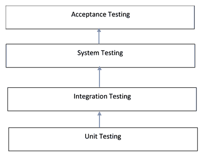

# 第八章：编写可测试的代码

通过本章，我们已经进入了本书的第二部分，涵盖了使用 Python 开发企业级应用程序的过程。而本书的第一部分侧重于如何构建具有可扩展性和性能的企业级应用程序，本书的第二部分侧重于应用程序的内部开发方面，例如我们如何确保我们的应用程序是安全的，它的性能如何，以及如何在生产阶段进行更高质量的检查，以最大程度地减少意外行为的发生。

在本章中，我们想要把您的注意力集中在企业应用程序开发或者说...

# 技术要求

本书中的代码清单可以在[`github.com/PacktPublishing/Hands-On-Enterprise-Application-Development-with-Python`](https://github.com/PacktPublishing/Hands-On-Enterprise-Application-Development-with-Python)的`chapter08`目录下找到。

与第六章中开发的 bugzot 应用程序相关的代码示例可以在`chapter06`目录下找到。

可以通过运行以下命令来克隆代码示例：

```py
git clone https://github.com/PacktPublishing/Hands-On-Enterprise-Application-Development-with-Python
```

这包括了关于如何运行代码的说明。除此之外，本章还需要安装一个 Python 库，它可以简化我们的测试代码编写。可以通过运行以下命令来安装该库和所有相关依赖项：

```py
pip install -r requirements.txt
```

# 测试的重要性

作为开发人员，我们通常致力于解决具有挑战性的问题，试图穿越复杂的连接，并提出解决方案。但是我们有多少次关心过我们的代码可能失败以提供预期的结果的所有可能方式？尽管我们作为开发人员自己编写的东西很难去尝试破坏，但它构成了开发周期中最重要的方面之一。

这是测试成为开发生命周期中重要方面的时候。应用程序测试的目标可以通过回答以下问题来总结：

+   代码中的个别组件是否按预期执行？

+   代码的流程是否从...

# 不同种类的测试

当重点是交付质量应用程序时，无论是为一般客户还是企业，都需要执行多种测试。这些测试技术可能从应用程序开发生命周期的不同阶段开始，因此被相应地分类。

在本节中，我们不是专注于一些可以归为黑盒测试和白盒测试的测试方法，而是更加专注于理解与开发人员相关的术语。所以，让我们来看一下。

# 单元测试

当我们开始构建应用程序时，我们将应用程序划分为多个子模块。这些子模块包含了许多相互交互的类或方法，以实现特定的输出。

为了生成正确的输出，所有个别类和方法都需要正常工作，否则结果将有所不同。

现在，当我们的目标是检查代码库中个别组件的正确性时，我们通常编写针对这些个别组件的测试，独立于应用程序的其他组件。这种测试，其中一个个别组件独立于其他组件进行测试，被称为**单元测试**。

简而言之，以下是一些...

# 集成测试

一个应用程序不仅仅是在所有单独的组件都编写完成后就完成了。为了产生任何有意义的输出，这些单独的组件需要根据提供的输入类型以不同的方式相互交互。为了完全检查应用程序代码库，组成应用程序的组件不仅需要在隔离状态下进行测试，而且在它们相互交互时也需要进行测试。

集成测试是在应用程序经过单元测试阶段后开始的。在集成测试中，通过接口使单个组件相互交互，然后测试这种交互是否符合预期的结果。

在集成测试阶段，不仅测试应用程序组件之间的交互，还测试组件与任何其他外部服务（如第三方 API 和数据库）之间的交互。

简而言之，以下是一些集成测试的特点：

+   **专注于测试接口：**由于应用程序的不同组件通过组件提供的接口相互交互，集成测试的作用是验证这些接口是否按预期工作。

+   **通常在单元测试之后开始：**一旦组件通过了单元测试，它们就会被集成在一起相互连接，然后进行集成测试

+   **代码流测试：**与单元测试相反，单元测试通常侧重于从一个组件到另一个组件的数据流，因此还检查代码流的结果

正如我们所看到的，集成测试是应用测试过程的重要组成部分，其目的是验证应用程序的不同组件是否能够正确地相互交互。

一旦集成测试完成，测试过程的下一个阶段是进行系统测试，然后是最终的验收测试阶段。以下图片显示了从单元测试阶段到验收测试阶段的测试流程以及在应用程序开发过程中可能发生的不同类型的测试。



为了控制本书的长度，我们将跳过对这两种测试技术的解释，而是将本章的其余部分专注于实施一些实际的单元测试。

在本章的其余部分，我们将专注于单元测试实践以及如何在我们的演示应用程序中实现它们。

# 以测试为导向构建应用程序

因此，我们现在知道测试很重要，也了解了不同类型的测试。但是在构建应用程序时，我们需要做一些重要的事情，以便能够正确地测试它吗？

对这个问题的答案有点复杂。虽然我们可以轻松地按照任何我们想要的特定方式编写代码，并通过多种程序进行测试，例如单元测试，但最好还是遵循一般的一套指南，以便能够轻松高效地测试代码。因此，让我们继续看一下这些指南：

+   每个组件都应该有一个责任：为了测试的高效性和覆盖率...

# 测试驱动开发

测试驱动开发是一种软件开发过程，其中软件开发的过程首先涉及为单个需求编写测试，然后构建或改进能够通过这些测试的方法。这种过程通常有利于生成具有比在组件开发后编写测试时更少缺陷的应用程序。

在测试驱动开发过程中，遵循以下步骤：

1.  添加一个测试：一旦需求被指定，开发人员就会开始为先前组件的改进或新组件编写新的测试。这个测试设置了特定组件的预期结果。

1.  运行测试以查看新测试是否失败：当新测试被添加后，对代码运行测试，以查看新测试是否因预期原因而失败。这可以确保测试按预期工作，并且在不利条件下不会通过。

1.  编写/修改组件：一旦测试运行并且可以看到预期结果，我们就会继续编写新组件或修改现有组件，以使新添加的测试用例通过。

1.  运行测试：一旦对测试进行了必要的修改以使测试通过，就会再次运行测试套件，以查看之前失败的测试现在是否通过。这可以确保修改按预期工作。

1.  重构：随着应用程序开发生命周期的进展，会有时候会出现重复的测试或者可能承担相同责任的组件。为了消除这些问题，需要不断进行重构以减少重复。

现在，我们已经对测试在任何成功应用程序的开发中扮演重要角色有了相当的了解，也知道如何编写易于测试的代码。现在，是时候开始为我们在第六章中构建的应用程序编写一些测试了。

# 编写单元测试

因此，现在是时候开始编写我们的单元测试了。Python 库为我们提供了许多编写测试的选项，而且非常容易。我们通常会被选择所困扰。该库本身提供了一个单元测试模块，可用于编写单元测试，而且我们可以使用各种框架来更轻松地编写单元测试。

因此，让我们首先看一下如何使用 Python 的`unittest`模块编写一些简单的单元测试，然后我们将继续使用著名的 Python 测试框架为我们的应用程序编写单元测试。

# 使用 Python unittest 编写单元测试

Python 3 提供了一个非常好的、功能齐全的库，允许我们为应用程序编写单元测试。这个名为`unittest`的库用于编写单元测试，可以从非常简单的测试的复杂性到在运行单元测试之前进行适当设置的非常复杂的测试。

Python `unittest`库支持的一些功能包括：

+   面向对象：该库以面向对象的方式简化了单元测试的编写。这意味着，通过类和方法以面向对象的形式编写对象。这绝不意味着只有面向对象的代码才能使用该库进行测试。该库支持测试面向对象和非面向对象的代码。

+   测试夹具的能力：一些测试可能需要在运行测试之前以某种方式设置环境，并在测试完成执行后进行适当的清理。这称为测试夹具，Python 的`unittest`库完全支持这一特性。

+   **能够编写测试套件：**该库提供了编写完整功能的测试套件的功能，由多个测试用例组成。测试套件的结果被汇总并一次性显示。

+   **内置测试运行器：**测试运行器用于编排测试并编译执行测试的结果以生成报告。该库提供了一个内置的测试运行器来实现这个功能。

现在，让我们看一下以下代码，我们将使用它来编写我们的单元测试：

```py
import hashlib
import secrets

def strip_password(password):
    """Strip the trailing and leading whitespace.

    Returns:
        String
    """
    return password.strip()

def generate_salt(num_bytes=8):
    """Generate a new salt

    Keyword arguments:
    num_bytes -- Number of bytes of random salt to generate

    Returns:
        Bytes
    """

    return secrets.token_bytes(num_bytes)

def encrypt_password(password, salt):
    """Encrypt a provided password and return a hash.

    Keyword arguments:
    password -- The plaintext password to be encrypted
    salt -- The salt to be used for padding

    Returns:
        String
    """

    passwd_hash = hashlib.pbkdf2_hmac('sha256', password.encode('utf-8'), salt, 10000).hex()
    return passwd_hash
```

在这段代码中，我们定义了一些函数，旨在帮助我们生成可以安全存储在数据库中的密码哈希。

现在，我们的目标是利用 Python 的`unittest`库为前面的代码编写一些单元测试。

以下代码旨在为密码助手模块实现一小组单元测试：

```py
from helpers import strip_password, encrypt_password
import unittest

class TestPasswordHelpers(unittest.TestCase):
    """Unit tests for Password helpers."""

    def test_strip_password(self):
        """Test the strip password function."""

        self.assertEqual(strip_password(' saurabh '), 'saurabh')

    def test_encrypt_password(self):
        """Test the encrypt password function."""

        salt = b'\xf6\xb6(\xa1\xe8\x99r\xe5\xf6\xa5Q\xa9\xd5\xc1\xad\x08'
        encrypted_password = '2ba31a39ccd2fb7225d6b1ee564a6380713aa94625e275e59900ebb5e7b844f9'

        self.assertEqual(encrypt_password('saurabh', salt), encrypted_password)

if __name__ == '__main__':
    unittest.main()
```

我们创建了一个简单的文件来运行我们的单元测试。现在，让我们看看这个文件做了什么。

首先，我们从所需模块中导入我们要测试的函数。在本例中，我们将从名为`helpers.py`的文件中导入这些函数。接下来的导入让我们获得了 Python 的 unittest 库。

一旦我们导入了所需的内容，下一步就是开始编写单元测试。为此，我们首先定义一个名为`TestPasswordHelpers`的类，它继承自`unittest.TestCase`类。该类用于定义我们可能想要执行的一组测试用例，如下所示：

```py
class TestPasswordHelpers(unittest.TestCase):
```

在类定义内部，我们继续为我们想要测试的方法定义单独的测试用例。定义测试用例的方法必须以单词`test`开头，以表明这个特定的方法是一个测试，并且需要由测试运行器执行。例如，负责测试我们的`strip_password`方法的方法被命名为`test_strip_password()`：

```py
def test_strip_password(self):
```

在方法定义内部，我们使用断言来验证特定方法的输出是否符合我们的预期。例如，`assertEqual`方法用于断言参数 1 是否与参数 2 匹配：

```py
self.assertEqual(strip_password(' saurabh '), 'saurabh')
```

一旦这些测试被定义，下一步就是定义一个入口点，用于在终端运行我们的测试文件。这是通过从入口点调用`unittest.main()`方法来完成的。一旦调用完成，文件中提到的测试用例将被运行，并显示输出，如下所示：

```py
python helpers_test.py
..
----------------------------------------------------------------------
Ran 2 tests in 0.020s

OK
```

当你想要用 Python 编写单元测试时，这是最简单的方法。现在，是时候转向更重要的事情了。让我们为我们的演示应用程序编写一些单元测试。

# 使用 pytest 编写单元测试

正如我们讨论的那样，在 Python 中编写单元测试可以利用我们手头的许多选项。例如，在前一节中，我们利用了 Python 的`unittest`库来编写我们的单元测试。在本节中，我们将继续使用`pytest`来编写单元测试，这是一个用于编写应用程序单元测试的框架。

但是，`pytest`提供了哪些好处，使我们应该转向它呢？为什么我们不能坚持使用 Python 捆绑的`unittest`库呢？

尽管`unittest`库为我们提供了许多灵活性和易用性，但`pytest`仍然带来了一些改进，让我们来看看这些改进是什么：

# 设置 pytest

`pytest`框架是一个独立的框架，作为标准化 Python 发行版之外的一个单独库。在我们开始使用`pytest`编写测试之前，我们需要安装`pytest`。安装`pytest`并不是一件大事，可以通过运行以下命令轻松完成：

```py
pip install pytest
```

现在，在我们开始为应用程序编写测试之前，让我们首先在应用程序目录下创建一个名为*tests*的新目录，并与`run.py`位于同一级别，以存储这些测试用例，通过运行以下命令来创建：

```py
mkdir -p bugzot/tests
```

现在，是时候用`pytest`编写我们的第一个测试了。

# 使用 pytest 编写我们的第一个测试

在我们的演示应用程序中，我们定义了一些模型，用于在数据库中存储数据。作为我们的第一个测试，让我们着手编写一个针对我们模型的测试用例。

以下代码片段显示了我们的`User`模型的简单测试用例：

```py
'''File: test_user_model.pyDescription: Tests the User database model'''import sysimport pytest# Setup the import path for our applicationsys.path.append('.') # Add the current rootdir as the module path# import our bugzot model we want to testfrom bugzot.models import User@pytest.fixture(scope='module')def create_user():  user = User(username='joe', email='joe@gmail.com', password='Hello123')  return userdef test_user_creation(create_user): assert create_user.email ...
```

# 使用 pytest 编写功能测试

`pytest`框架以及其独特的装置和`flask`的强大功能，使我们能够轻松地为我们的应用程序编写功能测试。这使我们能够相当轻松地测试我们构建的 API 端点。

让我们看一下我们的索引 API 端点的一个示例测试，然后我们将深入了解我们如何编写测试。

以下代码片段显示了使用`pytest`编写的简单测试用例，用于测试索引 API 端点：

```py
'''
File: test_index_route.py
Description: Test the index API endpoint
'''
import os
import pytest
import sys
import tempfile

sys.path.append('.')
import bugzot

@pytest.fixture(scope='module')
def test_client():
  db, bugzot.app.config['DATABASE'] = tempfile.mkstemp()
  bugzot.app.config['TESTING'] = True
  test_client = bugzot.app.test_client()

  with bugzot.app.app_context():
    bugzot.db.create_all()

  yield test_client

  os.close(db)
  os.unlink(bugzot.app.config['DATABASE'])

def test_index_route(test_client):
  resp = test_client.get('/')
  assert resp.status_code == 200
```

这是我们为测试我们的索引 API 路由编写的一个非常简单的功能测试，以查看它是否正常工作。现在，让我们看看我们在这里做了什么来使这个功能测试起作用：

前几行代码或多或少是通用的，我们导入了一些构建测试所需的库。

有趣的工作从我们构建的`test_client()`装置开始。这个装置用于为我们获取一个基于 flask 的测试客户端，我们可以用它来测试我们的应用程序端点，以查看它们是否正常工作。

由于我们的应用程序是一个面向数据库的应用程序，需要数据库才能正常运行，我们需要为应用程序设置数据库配置。为了测试目的，我们可以使用在大多数操作系统中都可以轻松创建的 SQLite3 数据库。以下调用为我们提供了我们将用于测试目的的数据库：

```py
db, bugzot.app.config['DATABASE'] = tempfile.mkstemp()
```

调用返回一个文件描述符到数据库和一个 URI，我们将其存储在应用程序配置中。

数据库创建完成后，下一步是告诉我们的应用程序它正在测试环境中运行，以便禁用应用程序内部的错误处理，以改善测试的输出。这很容易通过将应用程序配置中的`TESTING`标志设置为`True`来实现。

Flask 为我们提供了一个简单的测试客户端，我们可以使用它来运行应用程序测试。通过调用应用程序的`test_client()`方法可以获得此客户端，如下所示：

```py
test_client = bugzot.app.test_client()
```

一旦获得了测试客户端，我们需要设置应用程序上下文，这是通过调用 Flask 应用程序的`app_context()`方法来实现的。

建立应用程序上下文后，我们通过调用`db.create_all()`方法创建我们的数据库。

一旦我们设置好应用程序上下文并创建了数据库，接下来要做的是开始测试。这是通过产生测试客户端来实现的：

```py
yield test_client
```

完成后，测试现在执行，控制权转移到`test_index_route()`方法，我们只需尝试通过调用`test_client`的`get`方法加载索引路由，如下所示：

```py
resp = test_client.get('/')
```

完成后，我们通过检查响应的 HTTP 状态码并验证其是否为`200`来检查 API 是否提供了有效的响应，如下所示：

```py
assert resp.status_code == 200
```

一旦测试执行完成，控制权就会转移到测试装置，我们通过关闭数据库文件描述符和删除数据库文件来进行清理，如下所示：

```py
os.close(db)
os.unlink(bugzot.app.config['DATABASE'])
```

相当简单，不是吗？这就是我们如何使用`pytest`和`Flask`编写简单的功能测试。我们甚至可以编写处理用户身份验证和数据库修改的测试，但我们将把这留给您作为读者来练习。

# 总结

在本章中，我们看到测试如何成为应用开发项目中重要的一部分，以及为什么它是必要的。在这里，我们看了通常在开发生命周期中使用的不同类型的测试以及不同技术的用途。然后，我们继续看如何以一种使测试变得简单和有效的方式来编写我们的代码。接着，我们开始深入研究 Python 语言，看看它提供了哪些用于编写测试的工具。在这里，我们发现了如何使用 Python 的 unittest 库来编写单元测试，以及如何运行它们。然后，我们看了如何利用像 pytest 这样的测试框架来编写测试用例...

# 问题

1.  单元测试和功能测试之间有什么区别？

1.  我们如何使用 Python 的 unittest 编写单元测试套件？

1.  在 pytest 中，固定装置的作用是什么？

1.  在编写固定装置时，pytest 中的作用域是什么？
