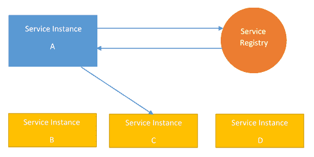
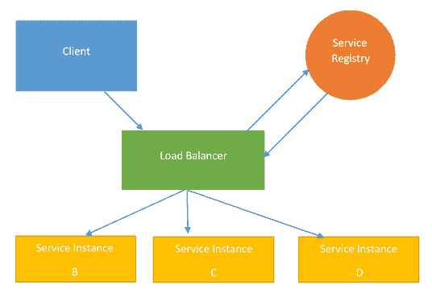
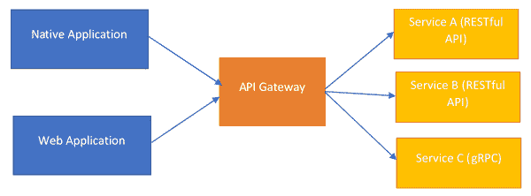

# 第十一章：采用微服务方法

到目前为止，在本书中，我们已经了解了如何开发企业级应用程序以及如何成熟我们的流程，以便我们交付的应用程序符合我们的质量标准，并为其用户提供强大而有韧性的体验。在本章中，我们将看看一种新的应用程序开发范式，其中应用程序不是一个单一的产品，而是多个产品相互交互，以提供统一的体验。

近年来，开发场景发生了快速变化。应用程序开发已经从开发大型单体转变为开发小型服务，所有这些服务相互交互，为用户提供所需的结果。这种变化是为了满足更快地发布项目的需求，以增加添加新功能和提高应用程序可扩展性的能力。

在本章中，我们将看看这种新的应用程序开发范式，团队变得更小，能够以越来越低的成本在应用程序中发布新功能已经成为新的标准。这种被称为微服务开发方法的范式彻底改变了应用程序开发周期的工作方式，并且还导致了与 DevOps、持续集成和部署相关的技术的当前趋势。

随着本章的进行，您将了解以下内容：

+   朝着微服务开发方法迈进

+   服务之间基于 API 的通信

+   构建健壮的微服务

+   处理微服务中的用户-服务器交互

+   微服务之间的异步通信

# 技术要求

本书中的代码清单可以在[`github.com/PacktPublishing/Hands-On-Enterprise-Application-Development-with-Python`](https://github.com/PacktPublishing/Hands-On-Enterprise-Application-Development-with-Python)的`chapter11`目录下找到。

可以通过运行以下命令克隆代码示例：

```py
git clone https://github.com/PacktPublishing/Hands-On-Enterprise-Application-Development-with-Python
```

设置和运行代码的步骤已包含在`README.md`文件中，以便更深入地了解代码示例。

# 向微服务开发方法转变

在过去几年里，开发人员一直在尝试用新的方式来开发应用程序。其目的是缩短开发生命周期，增加更快地将项目投入生产的能力，增加组件之间的解耦，使它们可以独立开发，并提高团队并行开发应用程序的能力。

随之而来的是使用微服务的开发技术，这有助于解决上述的用例。在这种方法中，应用程序不是一个单一的大型代码库，所有组件都放在一起，对任何组件的单一更改都需要再次部署整个应用程序。首先，让我们看看微服务模型与单体模型的不同之处，然后看看遵循微服务方法有哪些优势。

# 单体开发模型与微服务

我们都习惯于构建一个应用程序，其中单个代码库包含应用程序的所有功能组件，紧密地联系在一起，以实现特定的期望结果。这些应用程序遵循严格的开发方法，应用程序的功能和架构首先在初始需求收集和设计阶段进行思考，然后应用程序的严格开发开始。

只有在所有组件都经过开发和彻底测试后，应用程序才进入生产阶段，在那里它被部署在基础设施上供常规使用。这个模型在下图中显示：

这个过程...

# 微服务架构的优势

微服务架构为我们解决了许多问题，主要是因为我们开发和部署微服务的方式发生了变化。让我们来看看微服务架构为我们的开发过程带来的一些优势，如下列表所示：

+   **小团队：**由于一个特定的微服务通常专注于做一件事并且做得很好，负责构建该微服务的团队通常可以很小。一个团队可以全面拥有多个微服务，他们不仅负责开发，还负责部署和管理，从而形成良好的 DevOps 文化。

+   **增强了独立性：**在微服务架构中，负责开发一个微服务的团队不需要完全了解另一个微服务的内部工作方式。团队只需要关注微服务暴露的 API 端点，以便与其进行交互。这避免了团队在开展开发活动时对彼此的依赖。

+   **增强了对故障的韧性：**在微服务架构中，由于一个微服务的故障不会影响整个应用程序，而是会逐渐降低服务的性能，因此故障韧性相当高。在此期间，可能会启动一个新的失败服务实例，或者可以轻松地将失败服务隔离以进行调试，以减少影响。

+   **增强了可扩展性：**微服务架构为应用程序的可扩展性提供了很大的自由度。现在，随着负载的增加，可以独立地扩展各个微服务，而不是整体扩展应用程序。这种扩展可以以水平扩展的方式进行，根据应用程序所经历的负载，可以启动更多的特定微服务实例，或者可以使用垂直扩展的方式单独扩展这些服务，为特定服务分配更多资源，以便更好地处理不断增加的负载。

+   **简单集成：**使用微服务，不需要了解其他微服务内部的知识，因此不需要了解其他微服务的内部情况，不需要了解其他微服务的内部情况。所有的集成都是在假设其他微服务是黑匣子的情况下进行的。

+   **增强了可重用性：**一旦开发完成，一个微服务可以在不同的应用程序中被利用。例如，负责用户认证处理的微服务可以在多个应用程序中重复使用，而无需复制代码。

+   **轻松推出新功能的自由：**使用微服务架构，新功能可以轻松推出。在大多数情况下，特定功能被转换为自己的微服务，然后在经过适当测试后部署到生产环境。一旦服务在生产环境中上线，其功能就可以使用。这与整体式方法不同，整个应用程序需要在新功能或改进需要部署到生产环境时重新部署。

从这个列表中，我们可以看到微服务架构向我们提供了许多好处。从工具的选择到快速推出新功能的便利性，微服务架构使开发人员有利可图，并迅速开始推出新的微服务。

但所有这些优势并非免费。尽管有优势，但在微服务架构中工作时也有可能创建基础设施的混乱，这不仅会增加成本。然而，这也可能影响团队的整体生产力，他们可能更专注于解决因架构实施不当而可能出现的问题，而不是专注于改进和开发对应用程序用户至关重要的功能。

这并不是什么大问题。我们可以遵循一些简单的建议，在微服务架构的旅程中会有很大帮助。因此，让我们花些时间了解这些简单的技巧，这些技巧可以帮助我们顺利进行微服务的旅程。

# 微服务开发指南

微服务的开发是具有挑战性的，而且很难做到完美。有没有什么方法可以让这个过程变得更容易？事实证明，有一些指南，如果遵循，可以在微服务的开发中提供很大帮助。因此，让我们看一下以下列表中所示的这些指南：

+   **开发前的设计**：当进行微服务开发时，它们通常应该模拟特定的责任领域。但这也是最常出现最大错误的地方。通常情况下，服务的边界没有定义。在后期阶段，随着领域的发展，微服务也变得复杂，以处理增加的...

# 微服务中的服务发现

在应用程序开发的传统模型中，通常会以静态方式部署特定应用程序的服务，它们的网络位置不会自动更改。如果是这种情况，那么偶尔更新配置文件以反映服务的更改网络位置是完全可以的。

但在现代基于微服务的应用程序中，服务的数量可能会根据多种因素而上下波动，例如负载平衡、扩展、新功能的推出等，因此维护配置文件会变得有些困难。此外，如今大多数云环境都不提供这些服务的静态网络部署，这意味着服务的网络位置可能会不断变化，增加了维护配置文件的麻烦。

为了解决这些情况，我们需要有一些更加动态的东西，可以适应不断变化的环境。这就是服务发现的概念。服务发现允许动态解析所需服务的网络端点，并消除了手动更新配置文件的需要。

服务发现通常有以下两种方式：

+   客户端服务发现

+   服务器端服务发现

但在讨论这两种方法之前，我们需要了解服务发现系统的另一个重要组件。让我们看看这个重要组件是什么，以及它如何促进服务发现过程。

# 客户端服务发现

使用客户端服务发现方法，各个服务需要知道服务注册表。例如，在这种模型中，如果**服务实例 A**想要向**服务实例 C**发出请求，那么进行此请求的过程如下图所示：



请求的流程如下所示：

+   **服务实例 A**查询服务注册表以获取**服务实例 C**的网络地址。

+   **服务注册表**检查其数据库以获取**服务实例 C**的网络地址，并将其返回给**服务实例 A**。如果**服务实例 C**是负载平衡服务...

# 服务器端服务发现

使用服务器端服务发现模式，解析服务的网络地址的能力不在个体客户端内部——相反，这个逻辑被移动到负载均衡器中。在服务器端服务发现模式中，请求流程如下图所示：



这个图表显示了以下过程：

1.  **客户端**发出对 API 端点的请求

1.  **负载均衡器**拦截请求并查询**服务注册表**以解析适当服务的网络地址

1.  **负载均衡器**然后将请求发送到适当的网络服务来处理请求

这种模式的优势在于通过从客户端中删除服务发现逻辑来减少代码重复，并且由于服务注册表不负担负载均衡算法的负载，因此负载均衡更好。

现在我们知道了微服务架构中服务发现是如何发生的，让我们把重点放在理解微服务中另一个有趣的概念上。

想象一下，你正在构建一个应用程序，该应用程序应该处理多个设备，并且每个设备提供的功能根据某些方面而有所不同，比如移动设备将不具备向其他用户发送直接消息的功能。在这种情况下，每个设备都需要一个不同的 API 端点，以便调用其特定的服务集。然而，在应用程序的维护阶段或某些 API 发生变化时，让客户端了解每个单独的 API 端点可能会成为一个问题。为了处理这种情况，我们需要有一些可以作为我们通信的中间层的东西。

幸运的是，在微服务架构中，我们有一些东西可以帮助我们解决这个问题。让我们看看我们可以利用什么。

# 微服务中的服务级别协议

在基于微服务架构的任何生产级应用程序的开发过程中，服务可能会在很大程度上依赖于生产环境中部署的其他服务的可用性。例如，为应用程序的管理面板提供功能的服务可能需要用户认证服务的可用性，以允许管理员登录和权限管理。如果用户管理服务出现故障，应用程序提供的操作的稳定性可能会受到严重影响。

为了保证这些要求，我们需要有作为团队之间特定微服务交付的合同的 SLA。这...

# 构建你的第一个微服务应用程序

我们现在准备使用微服务架构构建我们的第一个应用程序。在开发这个应用程序的过程中，我们将看到如何利用我们迄今为止所获得的知识来推出一个可工作的应用程序。

现在，关于我们的例子，为了保持这个应用程序简单，并且提供对微服务架构工作原理的简单理解，我们将构建一个简单的待办事项创建应用程序：让我们看看这个应用程序将会是什么样子，如下列表所规定的：

+   该应用程序将由两个微服务组成——即待办事项管理服务和用户认证服务

+   这些服务将使用 Python 开发

+   为了这个练习，服务将利用它们自己的 SQLite 数据库

+   待办事项服务将依赖用户服务来收集与用户操作相关的任何信息，包括用户认证、配置获取等

+   服务将通过使用 RESTful API 进行通信，每个服务提供 JSON 编码的响应

具体要求已经指定，现在是时候开始编写我们的微服务了。

# 用户微服务

用户微服务负责处理与用户配置文件管理相关的任何事务。该服务提供以下功能：

+   注册新用户

+   用户配置文件管理

+   现有用户的身份验证

+   为用户生成唯一的身份验证令牌以登录

+   为其他服务提供用户认证功能

为了使该服务运行，我们需要以下两个数据库模型：

+   **用户数据库模型：** 用户数据库模型负责管理用户记录，如他们的用户名、哈希密码等。

+   **令牌数据库模型：** 令牌数据库模型负责存储已生成的令牌的信息...

# 待办事项管理器服务

待办事项管理器服务是帮助用户管理其`todo`项目的服务。该服务提供了用户创建新列表并向列表添加项目的功能。为此，唯一的要求是用户应该经过身份验证。

为了正确工作，服务将需要存在一个列表数据库模型，用于存储用户创建的`todo`列表的信息，以及一个项目模型，其中将包含特定`todo`列表的项目列表。

以下代码片段实现了这些模型：

```py
'''
File: models.py
Description: The models for the todo service.
'''
from todo_service.todo_service import db
import datetime

class List(db.Model):
    """The list database model.

    The list database model is used to create a new todo list
    based on the input provided by the user.
    """

    id = db.Column(db.Integer, primary_key=True)
    user_id = db.Column(db.Integer, nullable=False)
    list_name = db.Column(db.String(25), nullable=False)
    db.UniqueConstraint('user_id', 'list_name', name='list_name_uiq')

    def __repr__(self):
        """Provide a representation of model."""
        return "<List {}>".format(self.list_name)

class Item(db.Model):
    """The item database model.

    The model is used to store the information about the items
    in a particular list maintained by the user.
    """

    id = db.Column(db.Integer, primary_key=True)
    list_id = db.Column(db.Integer, db.ForeignKey(List.id))
    item_name = db.Column(db.String(50), nullable=False)
    db.UniqueConstraint('list_id', 'item_name', name='item_list_uiq')

    def __repr__(self):
        """Provide a representation of model."""
        return "<Item {}>".format(self.item_name)
```

一旦开发了这些模型，我们需要做的下一件事就是实现 API。

对于待办事项管理器服务，将设置以下 API，为服务提供交互端点：

+   `/list/new`：此 API 端点接受要创建的列表的名称并创建新列表。

+   `/list/add_item`：此 API 端点接受需要添加到列表中的项目列表以及应将项目添加到的列表的名称。一旦验证通过，项目将被添加到列表中。

+   `/list/view`：此 API 端点接受需要显示内容的列表的名称，并显示列表的内容。

以下代码片段显示了服务的端点实现：

```py
def check_required_fields(req_fields, input_list):
    """Check if the required fields are present or not in a given list.

    Keyword arguments:
    req_fields -- The list of fields required
    input_list -- The input list to check for

    Returns:
        Boolean
    """

    if all(field in req_fields for field in input_list):
        return True
    return False

def validate_user(auth_token):
    """Validates a user and returns it user id.

    Keyword arguments:
    auth_token -- The authentication token to be used

    Returns:
        Integer
    """

    endpoint = user_service + '/auth/validate'
    resp = requests.post(endpoint, json={"auth_token": auth_token})
    if resp.status_code == 200:
        user = resp.json()
        user_id = user['user_id']
        return user_id
    else:
        return None

@app.route('/list/new', methods=['POST'])
def new_list():
    """Handle the creation of new list."""

    required_fields = ['auth_token', 'list_name']
    response = {}
    list_data = request.get_json()
    if not check_required_fields(required_fields, list_data.keys()):
        response['message'] = 'The required parameters are not provided'
        return jsonify(response), 400

    auth_token = list_data['auth_token']

    # Get the user id for the auth token provided
    user_id = validate_user(auth_token)

    # If the user is not valid, return an error
    if user_id is None:
        response['message'] = "Unable to login user. Please check the auth token"
        return jsonify(response), 400

    # User token is valid, let's create the list
    list_name = list_data['list_name']
    new_list = List(user_id=user_id, list_name=list_name)
    db.session.add(new_list)
    try:
        db.session.commit()
    except Exception:
        response['message'] = "Unable to create a new todo-list"
        return jsonify(response), 500
    response['message'] = "List created"
    return jsonify(response), 200

@app.route('/list/add_item', methods=['POST'])
def add_item():
    """Handle the addition of new items to the list."""

    ...
    # The complete code for the service can be found inside the assisting code repository for the book
```

有了上述代码，我们现在已经准备好使用我们的待办事项管理器服务，它将通过 RESTful API 帮助我们创建和管理待办事项列表。

但在我们执行待办事项管理器服务之前，我们需要记住一件重要的事情。该服务依赖于用户服务来执行任何类型的用户认证并获取有关用户配置文件的信息。为了实现这一点，我们的待办事项管理器需要知道用户服务在哪里运行，以便可以与用户服务进行交互。在这个例子中，我们通过在待办事项管理器服务配置文件中设置用户服务端点的配置键来实现这一点。以下代码片段显示了待办事项管理器服务配置文件的内容：

```py
DEBUG = False
SECRET_KEY = 'du373r3uie3yf3@U#^$*EU9373^#'
BCRYPT_LOG_ROUNDS = 5
SQLALCHEMY_DATABASE_URI = 'sqlite:///todo_service.db'
SQLALCHEMY_ECHO = False
USER_SERVICE_ENDPOINT = 'http://localhost:5000'
```

要使待办事项管理器服务运行，需要从存储库的`todo_service`目录内执行以下命令：

```py
python3 run.py
```

一旦命令成功执行，待办事项管理器服务将在`http://localhost:5001/`上可用。

一旦服务启动运行，我们可以利用其 API 来管理我们的清单。例如，如果我们想要创建一个新的待办事项列表，我们只需要向`http://localhost:5001/list/new` API 端点发送 HTTP POST 请求，传递以下键作为 JSON 格式的输入：

+   `auth_token`**：** 这是用户在使用`http://localhost:5000/auth/login` API 端点成功登录用户服务后收到的身份验证令牌

+   `list_name`**：** 这是要创建的新列表的名称

一旦 API 端点调用完成，待办事项管理器服务首先尝试通过与用户服务交互来验证 API 调用中提供的`auth`令牌。如果`auth`令牌验证通过，待办事项管理器服务将接收一个用于识别用户的用户 ID。完成这一步后，待办事项管理器服务会在其数据库中为新的待办事项列表创建一个条目，并针对检索到的用户 ID。

这是待办事项管理器服务的简单工作流程。

现在我们了解了如何构建一个简单的微服务，我们现在可以专注于有关微服务架构的一些有趣的主题。你是否注意到我们如何告知待办事项管理器服务用户服务的存在？我们利用了配置密钥来实现这一点。当你只有两个或三个服务，无论发生什么，它们总是在相同的端点上运行时，使用配置密钥绝不是一个坏选择。然而，当微服务的数量甚至比两个或三个服务稍微多一点时，这种方法会严重崩溃，因为它们可能在基础设施的任何地方运行。

除此之外，如果新服务频繁投入生产以为应用程序添加新功能，问题会进一步加剧。在这一点上，我们需要更好的解决方案，不仅应提供一种简单的方式来识别新服务，还应自动解析它们的端点。

# 微服务内的服务注册表

假设有一场魔术表演将在礼堂内举行。这场表演对所有人开放，任何人都可以来礼堂参加。在礼堂的门口，有一个登记处，你需要在进入礼堂之前先登记。当观众开始到来时，他们首先去登记处，提供他们的信息，比如他们的姓名、地址等，然后被给予一张入场券。

服务注册表就像这样。它是一种特殊类型的数据库，记录了基础设施上运行的服务以及它们的位置。每当新服务启动时，它都会注册...

# 微服务中的 API 网关

在构建微服务架构时，我们有很多选择，大多数情况下可以自由选择最适合实现微服务的技术栈。除此之外，我们始终可以通过推出针对特定设备的不同微服务来为不同设备提供不同的功能。但是当我们这样做时，我们也给客户端增加了复杂性，现在客户端必须处理所有这些不同的情况。

因此，让我们首先看一下客户端可能面临的挑战，如下图所示：



前面的图表显示了我们面临的挑战，如下列表所示：

+   **处理不同的 API：** 当每个设备都有一个特定的微服务，为其提供所需的功能集时，该设备的客户端需要了解与该特定服务相关的 API 端点。这增加了复杂性，因为现在负责处理客户端开发的团队需要了解可能会减慢客户端开发过程的微服务特定端点。

+   **更改 API 端点：** 随着时间的推移，我们可能会修改微服务内特定 API 端点的工作方式。这将要求我们更新所有利用微服务提供的服务的客户端，以反映这些更改。这是一个繁琐的过程，也可能引入错误或破坏现有功能。

+   **协议支持不足：**使用微服务架构，我们有权控制用于构建微服务的技术栈。有时，微服务可能由通常不受其他平台支持或在其他平台上实现不佳的协议驱动。例如，客户端运行的大多数平台可能不支持像 AMQP 这样的东西，这将使得客户端的开发变得困难，因为现在开发人员必须在每个客户端内构建处理 AMQP 协议的逻辑。这种要求不仅可能具有挑战性，而且如果平台无法处理所需的过多处理负载，可能也无法完成。

+   **安全性：**如果我们需要嵌入每个客户端支持的微服务的个别网络位置的细节，我们可能会在基础设施中打开安全漏洞，即使其中一个微服务未正确配置安全性。

这些只是在开发微服务应用程序过程中可能面临的一些挑战。但我们能做些什么来克服它们呢？

这个问题的答案在于使用 API 网关。

**API 网关**可以被视为客户端和应用程序通信之间的中介，处理客户端请求的路由以及将这些请求从客户端支持的协议转换为后端微服务支持的协议。它可以在不让客户端担心微服务可能运行的位置的情况下完成所有这些操作。

在使用 API 网关的基于微服务架构的应用程序中，从客户端到应用程序的请求流程可以描述如下：

1.  客户端有一组共同的端点，用于访问一定的功能集。

1.  客户端向 API 端点发送请求，以及需要传递的任何数据，以便完成请求。

1.  API 网关拦截客户端对 API 端点的请求。

1.  API 网关确定客户端类型和客户端支持的功能。

1.  然后 API 网关确定需要调用哪些个别微服务来完成请求。

1.  然后 API 网关将请求转发到后端运行的特定微服务。如果微服务接受的协议与客户端发出请求的协议不同，API 网关会将请求从客户端协议转换为微服务支持的协议，然后转发请求。

1.  一旦微服务完成生成响应，API 网关收集响应并将集体响应发送回请求的客户端。

这种过程有几个优点；让我们来看看其中的一些：

+   **简单客户端：**有了 API 网关，客户端无需知道它们可能需要调用的各个微服务。这里的客户端对特定功能调用一个共同的端点，然后 API 网关负责确定需要调用哪个服务来完成请求。这大大减少了正在开发的客户端的复杂性，并使其维护变得容易。

+   **更改 API 端点的便利性：**当后端微服务的特定 API 实现发生变化时，API 网关可以处理未更新的旧客户端的兼容性。这可以通过使 API 网关返回降级响应或自动更新其接收到的请求以适应新的 API 兼容层来实现，如果可能的话。

+   **更简单的协议支持：**有了 API 网关来处理微服务可能需要的任何协议转换，客户端就不需要担心如何处理它无法支持的协议，大大减少了引入不受平台支持的协议支持可能带来的复杂性和问题。

+   **改进的安全性：**通过 API 网关，客户端不需要知道特定微服务运行的个别网络位置。他们只需要知道 API 网关监听请求的位置，以便成功调用 API。一旦调用完成，API 网关负责确定提供该 API 的各个微服务的运行位置，然后将请求转发给它们。

+   **改进的故障处理：**如果特定的后端服务出现故障，API 网关也可以提供帮助。在这种情况下，如果后端微服务是非关键微服务，API 网关可以向客户端返回降级响应，而如果关键后端服务出现故障，API 网关可以立即返回错误响应，而不让请求排队，增加服务器的负载。

正如我们所看到的，使用 API 网关的好处是巨大的，并且极大地简化了微服务应用程序中客户端的开发。此外，通过利用 API 网关，可以轻松建立服务之间的通信。

为了使服务相互通信，它们只需调用 API 网关知道的适当端点，然后 API 网关负责确定适当的微服务及其网络地址，以完成对其发出的请求。

前面的方法确实很好，但有一个缺点：这里的一切都是串行和同步的。发出调用，然后调用客户端/服务等待直到生成响应。如果服务的负载很高，这些响应可能需要很长时间才能到达，这可能会导致大量请求在基础设施上排队，进一步增加基础设施的负载，或者可能导致大量请求超时。这可能会大大降低应用程序的吞吐量，甚至可能使整个基础设施崩溃，如果排队请求的数量变得非常大。

是否有一种服务之间可以相互交互的异步通信方法，而不需要一遍又一遍地进行 API 调用？让我们看看这样一种方法。

# 微服务中的异步通信

在微服务架构中，每个服务都有一个明确的职责，并且做得很好。为了实现业务应用的任何有意义的响应，这些服务需要相互通信。所有这些通信都发生在网络上。

在这里，一个服务向另一个服务发出请求，然后等待响应返回。但有一个问题。如果另一个服务花费很长时间来处理请求，或者服务宕机了呢？那时会发生什么？

大多数情况下，请求会超时。但如果这个服务是一个关键服务，那么可能会到达它的请求数量可能会很大，并且可能会不断排队。如果服务很慢，这将...

# 消息队列用于微服务通信

消息队列是一种相当古老的机制，用于在应用程序内的许多不同组件之间建立通信。这种古老的方法甚至适用于我们当前的微服务架构用例。但在我们深入研究如何使用消息队列使微服务通信异步之前，让我们首先看一下在处理这种通信方法时使用的一些行话：

+   **消息：**消息是特定服务生成的一种包，用于与另一个服务交流其想要实现的目标。

+   **队列：**队列是一种主题，特定消息可能会出现在其中。对于任何实际应用程序，可能会有许多队列，每个队列表示特定的通信主题。

+   **生产者：**生产者是生成消息并将其发送到特定主题的服务。

+   **消费者：**消费者是监听特定主题并处理可能到达的任何消息的服务。

+   **路由器：**路由器是消息队列内的一个组件，负责将特定主题的消息路由到适当的队列。

现在我们知道了行话，我们可以继续看看消息队列如何帮助我们建立微服务之间的通信。

当微服务利用诸如消息队列之类的东西时，它们会使用异步协议进行交互。例如，AMQP 是更著名的异步通信协议之一。

通过异步通信，微服务之间的通信将如下进行：

1.  建立一个消息代理，它将提供消息队列的管理功能，并将消息路由到适当的队列。

1.  新服务启动并注册它想要监听或发送消息的主题。消息代理为该主题创建适当的队列，并将请求服务添加为该队列的消费者或生产者。这个过程也会继续进行其他服务。

1.  现在，一个想要实现特定目标的服务将消息发送到主题，比如*Topic Authenticate*。

1.  监听*Topic Authenticate*的消费者收到有关新消息的通知并将其消耗掉。

1.  消费者处理它已经消费的消息，并将响应放回另一个主题*Topic Auth_Response*。

1.  原始消息的生产者是*Topic Auth_Response*的消费者，并收到有关新消息的通知。

1.  原始请求客户端然后读取此消息并完成请求-响应循环。

现在，我们知道了由异步消息队列驱动的微服务架构内部的通信是什么样子。但是除了异步通信之外，这种方法还有其他好处吗？

事实证明，我们可能会从这种通信模式中看到许多好处。以下列表显示了我们可能会体验到的一些好处：

+   **更好的请求分发：**由于可能有许多消费者可能会监听特定主题，因此消息可以并行处理，并且负载平衡可以通过在消费者之间平均分配消息来自动处理。

+   **更好的错误韧性：**在特定微服务宕机的情况下，需要由该微服务处理的消息可以在消息队列内排队一段时间，然后在服务恢复后进行处理，从而减少可能的数据丢失。

+   **减少重复响应：**由于消息只传递一次给单个消费者，并且在被消费后立即出列，因此很少有可能为单个请求产生重复响应。

+   **增加的容忍度：**在基础设施内部的不同微服务经历高负载时，消息队列系统提供了异步请求-响应循环，从而减少了请求排队的机会。

有了这个，我们现在知道了如何在微服务之间建立异步通信，并且使我们的基础设施随着时间的推移而发展，而不必担心如何处理新增的 API 端点以进行服务间通信。

# 总结

在本章中，我们看了一下如何使用微服务架构以及它与传统的单片式企业应用程序开发方式有何不同。然后，我们看了一下向微服务开发方式转变的优势，并了解了我们可以遵循的指南，使我们朝着微服务更顺利地前进。

一旦我们了解了微服务的基础知识，我们继续看了一下 SLA 如何保证我们在服务之间获得一定的期望功能集，并且它们作为合同来支持应用程序的顺畅服务。然后，我们进行了一个实践练习，编写了一个简单的待办事项管理应用程序...

# 问题

1.  服务导向架构与微服务架构有何不同？

1.  如何确保基于微服务的应用程序的高可用性？

1.  SLA 提供了什么样的保证？

1.  我们可以让 API 网关直接与服务注册表通信吗？

1.  我们可以使用哪些工具来实现微服务之间的异步通信？

# 进一步阅读

想了解更多关于微服务的知识吗？看看*Packt Publishing*的*Umesh Ram Sharma*的*Practical Microservices*。
