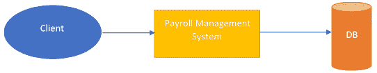
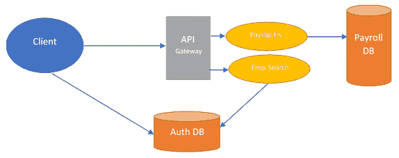

# 第十三章：无服务器

正如我们迄今所探讨的，微服务提供了一种很好的替代架构，我们可以通过它来处理应用程序开发场景。具有更快的发布周期、易于启动新功能和高可伸缩性的优势，微服务对开发人员来说是一个引人注目的选择。但所有这些微服务仍然在基于服务器的环境中运行。

在基于服务器的环境中运行对于应用程序的响应时间是有用的，因为总是有一个准备接受传入请求的服务。但有一个缺点：如果没有用户，应用程序将继续消耗系统资源。

最近，应用程序开发人员开始转向一种新的应用程序开发方法。这种开发方法侧重于应用程序是事件驱动的，并且根据某些事件的发生启动操作。这种类型的应用程序被称为无服务器应用程序，因为当没有用户时它们不会继续运行，它们的实例只有在发生了某些事件时才会启动。

随着我们在本章中的深入，我们将看看这种无服务器应用程序开发方法以及它如何改变开发场景。

作为本章的读者，您将学习以下内容：

+   应用程序开发的无服务器方法

+   驱动无服务器架构的流程

+   构建无服务器应用程序

+   无服务器方法的好处

# 技术要求

本书中的代码清单可以在[`github.com/PacktPublishing/Hands-On-Enterprise-Application-Development-with-Python`](https://github.com/PacktPublishing/Hands-On-Enterprise-Application-Development-with-Python)的`chapter13`目录下找到[.](https://github.com/PacktPublishing/Hands-On-Enterprise-Application-Development-with-Python)

可以通过运行以下命令克隆代码示例：

```py
git clone https://github.com/PacktPublishing/Hands-On-Enterprise-Application-Development-with-Python
```

此外，为了成功执行代码，还需要一些额外的软件：

+   **Docker**：Docker 是运行 OpenWhisk 软件平台以部署无服务器应用程序所需的依赖项。要在您的平台上安装`docker`，请查看[`docs.docker.com/install/`](https://docs.docker.com/install/)。

+   **Apache OpenWhisk**：Apache OpenWhisk 提供了一个开源平台，用于...

# 无服务器应用程序开发方法

近年来，作为开发人员，我们已经习惯了以传统方式构建应用程序并在生产基础设施上处理它们的部署。在这种传统架构中，我们开发了应用程序，其中应用程序接收来自**客户端**的请求，检查**客户端**是否被授权执行该操作，然后继续执行该操作。

一旦应用程序开发完成，我们将其部署到与我们的应用程序兼容的平台上。这涉及选择操作系统、平台运行的基础设施类型，例如裸金属服务器、虚拟机或容器，然后通过处理其可伸缩性和解决可能出现的任何问题来维护基础设施。例如，一个管理组织内员工工资的简单系统将如下所示：



在这种情况下，应用程序在服务器上持续运行，等待请求到来，并在请求到达时执行操作。

这种方法虽然非常有用，但通常会使开发人员从编写实现系统特定结果的逻辑的主要任务中分心，并使他们专注于涉及基础设施管理和可伸缩性的许多领域。

现在想象一种架构，它允许开发人员专注于只编写特定业务流程背后的逻辑，而不必担心这些逻辑将在何处执行以及如何扩展。

构建应用程序的无服务器方法提供了这些功能。在无服务器中，这是通过引入两种新的应用程序开发技术来实现的：

+   **后端即服务**（**BaaS**）：BaaS 是一种新的云计算服务，为应用程序开发人员提供了通过 API 将其应用程序与后端服务链接的功能，以提供一些常见的功能集，如用户认证和数据存储。它与应用程序开发的一般架构不同，因为后端提供的这些服务可能不需要由应用程序开发人员自己开发，而是通过这些服务提供的 API 来访问这些服务。

+   **函数即服务**（**FaaS**）：FaaS 是云计算的另一类别，允许开发人员专注于编写应用程序逻辑，而不必担心这些逻辑将在何处执行。在 FaaS 中，应用程序以无状态和短暂的方式运行，它们可能在执行的基础设施仅适用于少数调用，甚至可能只有一个调用。

在应用程序开发的无服务器架构中，应用程序通常被开发为作为对某个事件的响应而执行的函数。这些函数在它们自己的无状态容器中执行，这些容器可能仅在基础设施中存在几次调用。我们将在本章的后面部分看一下无服务器应用程序是如何工作的。作为一个快速参考，如果我们必须将工资系统实现为无服务器应用程序；以下图表显示了系统架构的样子：



正如我们所看到的，我们的无服务器工资单应用程序包含了 BaaS 提供的功能，其中**客户**直接通过**Auth DB**暴露的 API 与**Auth DB**进行交互，并且**工资单**生成和员工搜索在 FaaS 提供的功能中运行，它们被存储为函数，并且只在特定事件发生时执行。

这两个功能都不维护任何状态，因此它们可以在短暂的容器中运行，这些容器可能只存在很短的时间。

现在，让我们看看驱动无服务器架构的组件以及无服务器架构如何工作，以更好地理解我们如何开发最好利用无服务器架构的应用程序。

# 无服务器架构的组件

正如我们所见，无服务器架构为我们提供了一种开发应用程序的方式，我们只需要负责编写应用程序背后的逻辑，而不用担心如何管理运行应用程序的基础设施，以及应用程序如何根据请求的数量进行扩展或缩减。

但是是什么驱动了这种架构？让我们花点时间来看看架构内部的不同组件是如何工作的，以提供一种无服务器开发方法来进行应用开发。

正如前面讨论的，应用程序开发的无服务器方法是通过使用两种技术来实现的...

# 后端即服务

我们开发的大多数应用程序共享一组常见的功能。这些功能可能包括实现用户认证数据库，提供存储和检索文件的方式，或者通过电子邮件或推送通知发送通知。

大多数情况下，这些功能是通过在应用程序中引入新组件来构建的，其他组件可以与这些组件进行交互。对于基于微服务的应用程序也是如此，这些功能被实现为不同的微服务，其他微服务与这些服务进行交互以实现特定的结果。

在 BaaS 方法中，我们通过使用第三方云提供商来解耦这些功能，通过使用第三方提供商提供的 API，我们的应用程序通常集成这些功能。

为了更好地理解这一点，让我们来看一下我们之前介绍的无服务器工资管理系统。在这个系统中，我们通过利用第三方提供的 BaaS 服务，将用户认证作为我们应用程序的一个不相关的部分。

在这种方法中，我们的用户认证系统及其相关的任何数据都由第三方提供商管理。该提供商公开了一些服务的 API，我们可以使用这些 API 将服务与我们的应用程序集成。

在我们的例子中，我们通过使用服务提供的 API 来向客户端公开部分用户认证服务。这允许客户端直接与服务进行用户认证，而无需通过整个应用程序的后端。我们使用 BaaS 服务的第二个地方是当我们将员工搜索功能与用户认证服务链接起来，根据某些标准检索特定的员工。

BaaS 的这一概念为我们提供了几个优势，例如：

+   **减少开发时间：**通过 BaaS，应用程序的开发人员无需担心开发可以直接从第三方服务提供商那里获取的常见功能集，而是使用服务提供商提供的 API。

+   **操作的便利性：**由于服务和与服务相关的基础设施仅由云计算提供商管理，这减少了管理服务和其提供的操作的复杂性，从而减少了操作上的麻烦。

+   **易于扩展性：**云计算提供商提供的服务直接由他们管理，可以轻松扩展，现在只由提供商完成。

+   **集成的灵活性：**提供商提供的服务通常通过 API 进行集成。如果提供的平台有所需的服务集成 API，平台可以轻松地与服务集成，而不必担心集成背后的复杂性，从而支持不同类型的应用程序。

# 函数即服务

FaaS 是一个有趣的概念，也是支持无服务器架构的主要技术之一。在这种方法中，我们开发后端代码，而不用担心代码将如何部署以及在哪里执行。

针对 FaaS 的应用程序就像任何其他不需要任何特殊框架进行开发和执行的应用程序一样。FaaS 应用程序与部署在服务器上的常规应用程序之间唯一的区别在于，FaaS 应用程序在维护其状态和执行的时间方面有严格的限制。因此，让我们深入探讨这两个主要方面...

# 国家管理的限制

在 FaaS 模型中，应用程序的不同部分被构建为单独的函数，每个函数在发生某个事件时被执行。当应用程序应该被部署时，云提供商会自动管理应用程序将在哪里运行以及应用程序如何扩展。

与传统应用程序相比，一旦部署，就会启动服务器进程并准备接受传入连接，基于 FaaS 的应用程序是动态启动作为对某个输入的响应。一旦事件发生，函数开始执行，等待一段时间，然后包含函数的实例被终止。现在，这使得这个过程变得有趣，因为函数在基础设施中存在的时间是有限的，而且不能保证同一个函数实例也会处理下一个调用。

这使得状态管理，也就是当前执行操作的本地数据管理，在基于 FaaS 的服务中成为一个具有挑战性的任务，严重限制了我们可以在函数实例中存储的本地数据。

为了处理这种情况，我们依赖于一个可以为我们存储状态数据的外部服务。这可能包括使用外部数据库或缓存服务器，其中数据可以被持久化以供将来参考。

# 执行时间限制

一旦函数在 FaaS 服务中开始执行，它只有有限的时间来完成执行。大多数知名的云服务提供商都对 FaaS 服务中的函数执行时间设置了限制。例如，如果我们选择 AWS 最著名的 FaaS 服务 AWS Lambda，函数的最大执行时间限制为五分钟。其他提供商的限制可能略有不同，但不会太高。

现在，这对我们作为应用程序开发人员来说是一个有趣的案例。如果我们试图将一个应用程序组件实现为一个函数，可能需要花费相当长的时间...

# 在 FaaS 中执行函数

一旦我们将应用程序开发为函数形式，我们需要一个地方来托管和运行它。这些函数的托管地点由云服务提供商提供。一旦我们成功托管了这些函数并实施了特定函数执行的规则，云服务提供商就有责任处理这些函数的正确执行。

现在，当这些函数需要执行时，云服务提供商确定执行特定函数所需的正确环境。一旦确定了这个环境，云服务提供商就会启动一个临时容器，函数代码就驻留在这个容器内。这个容器为函数提供了完全隔离，使其与可能在环境中执行的其他函数隔离开来。一旦容器成功启动，函数就会执行，并返回响应。

有趣的部分发生在函数完成执行后。一旦函数完成执行，云服务提供商可以终止包含函数的容器实例，也可以保持其活动以处理新的请求。大多数情况下，决定是基于到达的请求频率和用户设置的策略来做出的。

如果一个函数实例仍在运行并等待，新的请求可能会被重定向到该实例，而如果没有正在运行的函数实例，云服务提供商将启动一个新实例并将请求重定向到该实例。

通过这样，我们对 FaaS 在无服务器架构中的工作原理以及它如何使我们能够开发无服务器应用程序有了一个很好的了解。但是这些函数实际上是如何触发的呢？这就引出了构成无服务器服务的另一个重要组件。让我们看看它是什么。

# 无服务器架构中的 API 网关

在第十一章 *采用微服务方法*中，当我们了解了微服务的概念时，我们介绍了 API 网关以及它们如何帮助开发微服务。这些 API 网关在基于无服务器架构的应用程序开发中也起着重要作用。

API 网关只是嵌入有关应用程序的某些 API 端点的信息并将这些端点与某些处理程序相关联的 HTTP 服务器。一旦向某个 API 端点发出请求，就会调用与 API 端点相关联的处理程序来处理请求。

在无服务器架构中，与特定 API 端点相关联的处理程序...

# 理解无服务器应用程序的执行

到目前为止，我们已经了解到无服务器应用程序是以函数的形式构建的，这些函数基于某些事件的发生而执行。此外，这些函数并不永远保持活动状态。相反，这些函数在需要时被执行。那么，当请求到来时，提供者如何处理这些函数的执行呢？让我们来看一下。

# 冷启动函数

当应用程序刚刚部署时，很容易想象当前不会有任何正在执行的函数实例。当新请求到来并要求由我们刚刚部署在基础设施上的函数提供的功能时。现在，云提供者系统被通知说没有正在运行的函数实例可以处理传入的请求。

一旦提供者系统意识到情况，它就会生成一个包含函数代码的新实例。这个实例现在开始根据请求中提供的参数执行函数，并且函数生成响应并发送回请求的客户端。

# 热启动函数

与冷启动完全相反，热启动函数利用已经在提供者基础设施中运行的函数的现有实例。当这种情况发生时，传入的请求不必等待新实例生成才能处理请求。这允许请求快速处理。

这里需要注意一点：即使在函数的热启动情况下，也不会存储函数先前执行的状态。

现在我们知道了函数性能可能取决于的一个主要因素。现在让我们继续构建我们的第一个无服务器应用程序。

# 构建我们的第一个无服务器应用程序

有了我们对无服务器架构及其工作原理的基本了解，现在是时候开发我们的第一个无服务器应用程序了。在本教程中，我们将使用 Apache OpenWhisk 项目，在本地开发系统上运行我们的演示应用程序。因此，让我们看看 Apache OpenWhisk 为我们提供了什么，以及我们如何利用该平台来获益。

# Apache OpenWhisk 的快速介绍

Apache OpenWhisk 平台为我们提供了功能和功能，使我们能够设置自己的平台来运行无服务器应用程序。该项目提供了根据环境中某些事件的触发执行函数的功能。

这些函数的执行发生在 docker 容器内，OpenWhisk 平台管理其中的函数的部署和扩展。

以下是平台提供的一些功能：

+   **易于使用的工具：** 该平台提供了许多工具，使我们能够轻松打包和移植应用程序以在 OpenWhisk 平台上运行，除了应用程序遵循平台定义的一组约定。

+   **使用容器进行隔离：** 该平台通过使用 Docker 容器来隔离不同的功能，使得每个功能都在自己独立的环境中运行，以避免任何环境依赖冲突。

+   **支持多种语言：** OpenWhisk 平台为我们提供了许多支持的语言平台，我们可以使用这些平台来构建我们的无服务器应用程序。这还包括使用 Go、C++和 Rust 构建的二进制可执行文件。

+   **内置 API 网关：** OpenWhisk 软件包配备了自己的内置 API 网关，使我们能够通过 RESTful API 端点轻松集成应用程序。

所有这些功能使 OpenWhisk 成为在云端或本地开发环境中运行无服务器应用程序的绝佳平台。

但在我们开始构建应用程序之前，我们需要在系统上部署 OpenWhisk。要部署项目，请按照本章开头的*技术要求*部分中的步骤进行操作。

对于演示，我们将构建一个应用程序，该应用程序会查询 GitHub API，并检索与我们的用户帐户关联的存储库。

# 设置开发环境

在我们开始编写应用程序的代码之前，我们需要先安装一些依赖项。因此，让我们先构建环境，然后开始编写将驱动我们应用程序的代码。

作为第一步，让我们创建一个目录，其中包含与我们项目相关的所有文件。让我们将这个文件夹命名为`github_demo`。以下命令可以帮助我们创建这个文件夹：

```py
mkdir github_demo
```

一旦我们设置好目录，让我们进入目录并设置一些东西：

```py
cd github_demo
```

完成这些步骤后，我们现在可以设置我们的项目了。在我们开始编写代码之前，让我们完成虚拟环境的设置，这将帮助我们保持项目依赖项的隔离。...

# 构建我们的配置文件

为了这个应用程序，我们将使用一个配置文件来存储与我们用户帐户相关的数据，这将允许我们对`Github` API 进行身份验证。为此，在我们的项目目录中，创建一个名为`config.ini`的新文件，其中包含以下内容：

```py
[github_auth]
username = ‘<your github username>’
password = ‘<your github password>’
```

一旦我们完成了配置文件的设置，让我们继续编写我们的应用程序代码，这将与`Github`交互以获取我们的`repos`。

# 与 GitHub API 集成

现在我们即将开始我们应用程序的实际部分，让我们开始编写代码。以下代码片段描述了我们用来查询`Github` API 的代码：

```py
from github import Githubimport configparser# Provide the location of where the config file existsCONFIG_FILE = 'config.ini'def parse_config():    """Parse the configuration file and setup the required configuration."""    config = configparser.ConfigParser()    config.read(CONFIG_FILE)    if 'github_auth' not in config.sections():        return False    username = config['github_auth']['username']    password = config['github_auth']['password']    return (username, password)def get_repos():    """Retrieve the github repos associated with the user.    Returns: Dict ...
```

# 准备好与 OpenWhisk 一起运行的代码

代码就绪后，现在是时候将其转换为 OpenWhisk 可以执行的格式了。

要在 OpenWhisk 内执行任何功能，代码应该从`__main__.py`文件中调用。因此，让我们创建该文件并添加以下内容：

```py
from github_demo import get_repos

def main(dict):
    repos = get_repos()
    return repos
```

代码就位后，让我们试着理解我们在这里做了什么。首先，我们导入了在`github_demo.py`文件中创建的`get_repos`函数，该函数有助于从`Github` API 中检索内容：

```py
from github_demo import get_repos
```

然后，我们定义`main()`函数，OpenWhisk 将调用该函数来执行代码。任何存在于主函数中的代码都将由 OpenWhisk 直接执行。因此，我们使用这种方法来调用我们的`get_repos()`函数：

```py
def main(dict):
```

一旦完成这一步，我们就快要准备好部署我们的应用程序了。

# 朝着部署的最后步骤迈进

在我们部署应用程序之前，我们还有一些步骤要完成。为了成功安装应用程序，让我们创建一个文件，用于存储运行我们项目所需的依赖项。以下命令可帮助我们安装所需的依赖项：

```py
pip freeze > requirements.txt
```

有了这些要求打包好后，现在让我们打包我们的项目，以便可以部署到 OpenWhisk。为此，运行以下命令可以帮助我们创建不同项目组件的包：

```py
tar -zcvf github_demo.tar.gz github_demo
```

有了这个，我们现在已经准备好将我们的应用程序部署到 OpenWhisk 了。

# 部署到 OpenWhisk

一旦我们准备好部署包，我们需要运行 OpenWhisk 提供的一些命令，以便在平台上启动并运行包。

作为第一步，我们必须执行以下命令，将包上传到 OpenWhisk：

```py
wsk action create github_demo –kind python:3 github_demo.tar.gz
```

一旦执行了这个命令，包将被上传到 OpenWhisk 平台，并准备好运行。

现在，要调用应用程序，我们可以运行以下命令，以异步方式执行应用程序：

```py
wsk action invoke github_demo
```

完成后，我们的应用程序开始以异步方式执行。通过异步运行，我们的意思是命令的执行不会等到函数执行结束，而是会提供一个可以用来跟踪调用结果的操作激活 ID。

现在，让我们看看应用程序部署后 OpenWhisk 如何处理这个应用程序的执行。

# 了解 Openwhisk 内应用程序的执行

有了演示应用程序，现在是时候了解这个应用程序在幕后是如何执行的了。

应用程序成功执行的背后，有几个步骤涉及，从我们运行`wsk action invoke`命令开始执行我们的应用程序。因此，让我们看看幕后发生的步骤：

1.  **发出 API 调用：** 我们构建的每个要部署到 OpenWhisk 的操作都被映射为将调用该操作的 API 端点。当我们运行`wsk action invoke`时，该命令会调用为所提供的函数映射的 API 端点。然后，这个调用被 OpenWhisk 内的 Nginx 拦截，起到...

# 无服务器的优势

了解了无服务器应用程序的工作原理后，现在是时候看看这种开发方法提供的优势了：

+   **减少开发工作量：** 通过使用第三方云提供商提供的服务，我们可以减少一些在应用程序中找到的常见功能的开发工作量，例如用户身份验证、通知和文件存储。所有这些功能都可以通过云提供商提供的 API 来实现。

+   **操作复杂性较低：** 无服务器应用程序的执行和扩展由云服务提供商管理，这消除了管理我们自己的基础设施以处理应用程序执行的操作复杂性。

+   **高可用性：** 以无服务器方式构建的应用程序由于基础设施由云提供商管理，因此可以在世界各地的不同数据中心运行应用程序，从而降低了应用程序的可用性受影响的机会。

+   **优化资源分配：** 由于只有在发生某个事件时才执行函数，因此只有在执行特定函数时才分配资源，这优化了跨基础设施的资源使用。

+   **编程语言的选择：** 大多数无服务器解决方案都支持各种类型的编程语言，这使我们能够使用最佳的技术栈来实现我们的解决方案。

有了这个，我们现在有足够的理由选择无服务器开发方法，以便我们的需求与构建无服务器应用程序所需遵循的开发方法论相一致。

# 总结

在我们阅读本章的过程中，我们看到了无服务器架构如何成为应用程序开发的新趋势，以及这种架构的工作原理。我们涵盖了无服务器架构的不同组件，并介绍了后端即服务和函数即服务的概念，它们支持无服务器架构。然后，我们看了一下 API 网关在架构中的作用，以及无服务器应用程序中的 API 网关与微服务中使用的 API 网关有何不同。

之后，我们开始构建我们的第一个无服务器应用程序，并通过 Apache OpenWhisk 运行它，该平台提供了一个运行无服务器应用程序的开源平台。在这里，我们也深入探讨了...

# 问题

1.  无服务器架构提供了哪些优势？

1.  BaaS 如何帮助应用程序开发？

1.  API 网关如何帮助执行无服务器应用程序？

1.  有哪些因素使将应用程序转换为无服务器格式变得困难？

# 进一步阅读

你觉得无服务器架构的理念有趣吗？看看*Jalem Raj Rohit*的*Packt Publishing*出版的*使用 Python 构建无服务器应用程序*，深入了解无服务器架构。
