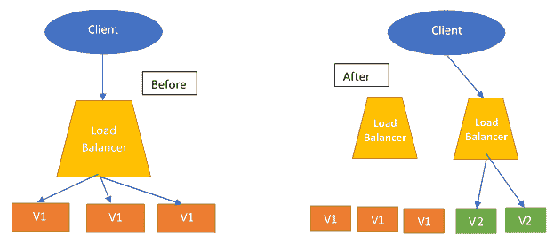
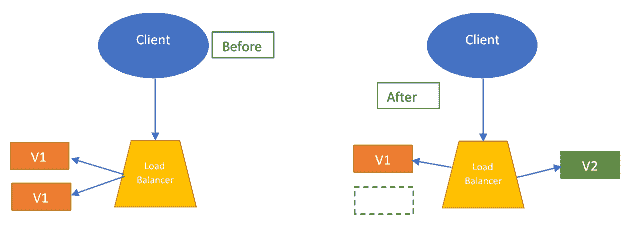
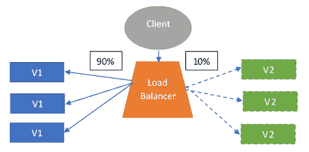
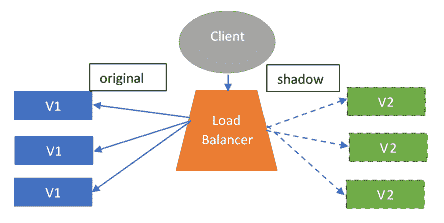

# 第十四章：部署到云端

到目前为止，我们的重点大部分都花在了应用程序的开发上，不管是以大型单体应用程序的形式还是以基于微服务的应用程序形式，其中存在许多服务。为了让这些应用程序对用户可用，应用程序需要部署到一定的地方，以便一般用户可以与应用程序进行交互。

在 DevOps 的现代世界中，部署策略以及应用程序的部署地点在定义应用程序如何工作和向用户提供访问权限方面起着重要作用。关于应用程序部署的决策可以影响基础设施中的许多事情，例如运行特定应用程序所需的基础设施的复杂性，以及应用程序内的新功能将如何推出。

在本章的过程中，我们将看看如何为单体应用程序和基于微服务的应用程序创建部署，以及如何实施部署策略，优先考虑应用程序在基础设施上部署后的稳定性。我们还将研究使用容器部署应用程序的现代方法，并在私有、公共和混合云部署之间做出选择。

作为本章的读者，您将学习以下内容：

+   部署策略的需求

+   将应用程序容器化以进行部署

+   将测试集成为部署策略的一部分

+   在私有云上部署

+   在公共云上部署

+   向混合云的转变

# 技术要求

为了理解本章，对使用 Docker 进行容器化和至少一个云提供商的 CLI 的知识将会有所帮助。

# 部署企业应用程序

在本书的过程中，我们已经看到了如何使用不同的原则开发企业应用程序，无论是通过单体应用程序开发的方式还是通过使用小型微服务来开发应用程序。但这些事情都汇聚在一个共同点。为了让我们的应用程序对一般用户可用，它们需要部署到开发环境之外的某个地方，以便一般用户可以访问。

为了成功部署，特定应用程序的基础设施和所选择的部署类型需要提供一定的功能：

+   **高可用性：** 应用程序部署的任何基础设施都需要提供高可用性，以便为用户提供几乎无中断的应用程序服务。如果基础设施容易频繁宕机，那么可能会导致应用程序的可用性严重中断，并且可能会导致依赖于应用程序的流程停滞，直到应用程序运行的基础设施恢复在线。

+   **低延迟：** 为应用程序提供服务的基础设施的延迟应该低，以便为用户提供足够的响应时间。如果基础设施的延迟很高，用户可能需要等待与应用程序进行交互，或者应用程序生成的响应可能严重影响他们的生产力。

+   **容错性：** 部署基础设施应具有容错性，并且应能够从偶尔的几个节点故障中恢复。如果缺乏容错性，即使基础设施内出现单个问题，也足以使整个应用程序崩溃，给应用程序的用户造成严重的可靠性问题。

这只是需要满足的基本基础设施要求，才能考虑将应用程序部署到该基础设施上。可能会有其他要求，这些要求可能是由于选择特定的基础设施部署策略而施加的，但讨论这些要求超出了本书的范围。

到目前为止，我们经常听到*部署策略*这个词，但当我们说我们需要为应用程序选择适当的部署策略时，我们到底是什么意思呢？让我们花点时间来探讨一下。

# 选择部署策略

一旦我们确定我们现在准备将应用程序投入生产，我们现在的任务是找出我们将要使用的应用程序部署策略。

应用程序的部署策略通常会规定应用程序的推出方式，取决于我们所拥有的应用程序的类型。这些部署策略涵盖了有关在生产中使应用程序可用所需的步骤的信息，并且可能还涵盖有关如何在应用程序中推出新功能的其他重要领域。

因此，让我们花点时间讨论可用的不同部署策略...

# 不同的部署策略

在软件开发世界中，没有一种解决方案适用于所有情况，即使在选择我们将要遵循的部署策略类型时也是如此。

我们选择的每种部署策略都会有与之相关的优缺点。一些部署策略提供的灵活性不大，但实施起来简单，而其他部署策略非常灵活，但在实施过程中可能会变得麻烦。作为开发人员，选择取决于我们如何处理应用程序的部署。主要地，我们将在本章的过程中涵盖六种部署策略，即：

+   重新创建部署

+   滚动部署

+   蓝绿部署

+   金丝雀部署

+   A/B 部署

+   影子部署

因此，让我们花点时间来熟悉每种部署策略。

# 重新创建部署

这是应用程序部署的最传统方法。在这种部署策略中，我们简单地销毁旧版本的应用程序，并引入新版本的应用程序，并将所有用户请求路由到新版本的应用程序。以下图表显示了重新创建部署策略的表示：

这种策略对于遵循单体开发方法的应用程序的部署非常有用，因为对于每个新功能或升级，整个应用程序都需要重新部署。

使用重新创建部署的优势...

# 滚动部署

在部署应用程序的滚动部署模型中，我们不会突然关闭所有旧版本应用程序的实例，以替换它们为新版本。相反，我们采取逐步推出新应用程序版本的方法，覆盖整个基础设施。

在这个过程中，我们首先启动升级后的应用程序的新实例，放在**负载均衡器**后面，一旦它准备好接受流量，我们就移除旧版本应用程序的等效实例。这个过程会持续进行，直到所有旧版本应用程序的实例都被新版本实例替换。以下图表显示了滚动部署策略的表示：

这种部署策略对于单片应用程序也是一个不错的选择，如果我们希望通过应用程序的逐步推出来实现低停机时间，因为应用程序在基础设施内逐渐推出。

滚动部署提供了几个好处，例如：

+   易于恢复故障升级：如果应用程序的升级版本引入了一些错误或故障，我们可以在中间阶段轻松回滚升级。这是因为新版本在基础设施内逐渐推出。

+   易于设置：具有应用程序运行基础设施知识的情况下，这种部署策略易于设置和自动化，基础设施的不同部分逐一更新。

# 蓝/绿部署

蓝/绿部署策略是一种有趣的策略。该策略实现了一系列用于测试应用程序并在生产环境中启动的技术的混合。

在蓝/绿部署方法中，更新的应用程序被引入基础设施，其实例数量与旧版本的应用程序相同。完成后，在基础设施内测试新版本的应用程序。一旦发现版本稳定，流量就会从旧版本切换到新版本的应用程序，然后旧版本的应用程序被废弃。以下图表显示了蓝/绿...

# 金丝雀部署

在这种部署方法中，我们遵循与蓝/绿部署相同的策略，但有一个小改变。在蓝/绿部署中，测试是在内部进行的，一旦应用程序的新版本被标记为稳定，所有请求都将立即切换到新版本。

在金丝雀部署方法中，测试是基于实际用户请求进行的。负载均衡器被配置为将一定百分比的请求重定向到已部署在基础设施中的金丝雀版本，以查看新版本在实际请求存在的情况下的性能。

以下图表显示了金丝雀部署策略的表示：

当应用程序的内部测试被认为不足以满足要求，并且对应用程序运行的基础设施的稳定性存在疑虑时，通常会使用这种部署方法。

这种测试方法提供了在生产用例中测试应用程序的优势，同时允许在应用程序未达到预期结果时轻松回滚。

使用这种部署方法的缺点是基础设施内部的复杂性增加，现在需要智能地将部分传入请求路由到应用程序的金丝雀版本。

# A/B 部署

A/B 部署方法与金丝雀部署方法有很多相似之处，其中新版本的应用程序被引入生产基础设施，并且一定数量的传入请求被重定向到金丝雀版本。

在 A/B 部署中，应用程序的升级版本（版本 B）被引入生产基础设施，然后负载均衡器被配置为根据一些预定义的标准将一定数量的请求重定向到升级版本。

当我们不确定升级版本将如何影响某个用户子集时，就需要这种部署方法。例如，使用智能手机的用户将如何受到升级版本的影响...

# 阴影部署

在阴影部署方法中，我们引入了一种新方法。与金丝雀部署或 A/B 部署相比，在这些方法中，一定数量的请求由旧版本处理，一定数量的请求由新版本处理，我们在生产基础设施中有两个应用程序版本。这些是旧版本和包含最新更新的新版本。

在阴影部署中，应用程序的更新版本看到与旧稳定版本应用程序发送的完全相同的请求，但新版本应用程序实例的任何处理都不会影响仅由生产中的稳定实例处理的请求的响应。以下图表显示了阴影部署策略的表示：

这种部署方式通常适用于基于微服务的应用程序，并且在开发人员希望测试应用程序在负载变化时的行为时使用。

这种部署方式也被用来检查应用程序在真实使用情况下是否表现正常，这是在内部环境无法测试的。

采用这种方式的唯一缺点是这种部署方式会增加基础设施成本，因为我们需要同时以全面规模运行旧版本和新版本。

现在，通过这个，我们已经习惯了不同类型的部署策略，这些策略可以帮助我们决定如何在生产环境中部署应用程序。虽然其中一些部署策略侧重于流程的简单性，但其他部署策略侧重于确保部署的新版本足够稳定并提供最佳结果。

选择应用程序部署的部署策略在很大程度上取决于几个因素，包括您可以承担的基础设施成本、可以花费在基础设施维护上的时间以及您计划部署的应用程序类型。另一个限制可以使用的部署策略的重要因素是应用程序之间的 API 是否发生了变化。通常，这些变化受 SLA 的约束，如果发生了变化，可能需要更新部署策略以适应所做的更改。

在撰写本书时，许多组织正在将云作为他们首选的基础设施选择，用于在生产环境中部署他们的应用程序。因此，让我们花一些时间了解目前存在的各种云基础设施，以及我们如何决定使用哪种基础设施进行部署。

# 选择基础设施

应用程序需要一个可以运行的基础设施。根据存在的应用程序类型，所需的基础设施可能会发生变化。选择哪种基础设施用于部署应用程序的选择受到正在部署的应用程序类型、应用程序的复杂性以及应用程序将支持的用例类型的极大影响。

在选择应用程序部署的基础设施时，另一个重要因素是对应用程序可扩展性的关注，包括我们可以如何扩展应用程序以及可以采用的扩展类型的复杂性。

首先让我们来看一下...

# 传统基础设施

过去，当应用程序使用大型单块来执行多个业务流程时，开发人员和组织通常会采用由大型主机或虚拟机组成的基础设施，以提供运行应用程序所需的充足资源。

这些裸机或虚拟机都配备了运行应用程序所需的所有要求，然后将应用程序部署在这些机器上，并提供给用户供一般使用。

这种基础设施选择运行良好，甚至允许多个应用程序存在于同一台强大的裸机服务器上，通过使用虚拟机进行隔离，将服务器的硬件抽象化。

然而，这种方法存在许多问题，例如：

+   **基础设施成本高**：对于使用裸机系统或虚拟机的部署，基础设施成本很高。组织要么需要购买能够运行这些应用程序的强大服务器，要么必须求助于专门的托管提供商，这通常成本很高。

+   **开销增加**：对于任何运行在虚拟机内的应用程序，运行支持应用程序的完整虚拟化操作系统所产生的开销非常高，大大减少了可以共存在同一硬件上的应用程序数量。

+   **启动时间长**：随着负载的增加，需要生成应用程序的新实例来处理增加的请求数量。然而，由于需要为虚拟机启动完成整个过程，启动完整的虚拟机及其中运行的应用程序实例是一个缓慢的过程。

+   **扩展困难**：在传统基础设施中，可以进行的水平扩展量非常有限，通常唯一的选择是通过使用垂直扩展来扩展应用程序，即根据需求增加应用程序所需的资源。

这些缺点使开发人员开始考虑替代传统的应用程序部署方式。

推动远离传统基础设施的另一个主要原因是转向容器化的应用程序打包方式。让我们来看看这是什么。

# 容器化的应用程序打包方式

随着现代硬件的出现和软件工程的进步，一些操作系统推出了一种轻量级的替代方案，用以取代笨重的虚拟机。这种替代方案以容器的形式出现，承诺不仅可以更轻量地进行应用程序隔离，而且由于它们根本不会对底层硬件进行抽象，因此也可以快速启动。

随着应用程序开发向微服务架构的转变，容器化的应用程序打包方式变得越来越主流。在这种方法中，每个微服务都被打包为一个单独的容器，可以部署...

# 向云端转移

在过去的十年里，许多云服务提供商已经出现，以帮助支持应用程序部署。每个云服务提供商都提供一套独特的功能，以使他们的服务在吸引组织和开发人员使用其平台进行应用程序部署时脱颖而出。

云部署模型的转变为负责应用程序开发的开发人员/组织提供了各种优势，包括以下内容：

+   **降低基础设施维护成本**：随着应用程序部署转移到云端，维护基础设施的成本正在降低。这是因为云服务提供商现在负责维护应用程序运行的硬件，个人开发人员和组织不需要购买这些硬件或处理可能发生的任何问题。

+   **高运行时间**：大多数云提供商保证其基础设施的高运行时间，这是由于他们在端上进行的大量基础设施复制。受益者是在云中维护特定应用程序的开发人员，因为现在他们可以为应用程序用户提供高运行时间，而不必担心基础设施崩溃可能导致的生产损失。

+   **低延迟**：在云部署方法中，开发人员可以为用户提供低延迟的应用程序。这是通过在云服务提供商的不同地理数据中心之间复制应用程序实例来实现的。一旦应用程序被复制，云服务提供商就会将请求重新路由到靠近客户端的应用程序服务器，以便实现低延迟响应。

+   **易扩展**：随着应用程序的负载增加，可能需要生成新的应用程序实例来处理增加的负载。云服务提供商通常提供动态扩展应用程序的功能，随着负载的增加而扩展应用程序，并随着负载的减少而缩减实例。这提供了一种高吞吐量、低成本的解决方案，可以处理高峰负载，而不必担心传统基础设施通常需要的手动干预。此外，与传统基础设施相比，这种扩展的响应时间通常较低。

所有前述观点都为应用程序转向基于云的部署提供了有力的论据。但根据组织的需求，他们可能希望或不希望将其应用程序部署在组织几乎无法控制的第三方服务器上。为了处理这种情况，组织可能决定转向在其基础设施上运行并处理组织内所有应用程序部署的私有云。因此，让我们花一些时间了解当前存在的各种云部署模型。

# 不同类型的云部署

对于企业来说，他们非常关注他们的应用程序在哪里运行。这是因为企业处理各种可能包含大量敏感信息的数据，任何一种违规行为都可能威胁到他们的业务。作为构建企业应用程序的开发人员，我们有责任建议和决定应该使用哪种云部署来部署应用程序。目前存在的云类型主要分为两大类：

+   公共云

+   私有云

最近，还出现了第三种类别，称为混合云。因此，让我们来看看...

# 私有云

私有云是由企业严格管理的一组计算资源。这些云运行在企业的企业内网中，通常位于组织拥有的数据中心或由第三方维护。

这些云实施了非常严格的安全策略，定义了在其上运行的应用程序如何被访问以及谁可以访问它们。

通常，企业选择私有云是因为以下几点：

+   企业已经拥有自己的数据中心，不想再投资于第三方云

+   企业运行的应用程序非常重视安全性，并且公共云提供商实施的安全策略不能被信任或不足以满足所需的用例。

私有云提供了一定的优势：

+   **更灵活：**由于组织控制决定私有云中将存在哪些计算资源，组织保持了灵活性，可以做出符合其最佳利益的决定

+   **提高安全性：**组织可以自由地在企业防火墙或内部网络后运行其云基础设施，并实施严格的安全策略，这在使用公共云时可能是不可能的

对于处理安全敏感数据并且没有成本障碍的企业来说，私有云是部署和运行应用程序的不错选择。

# 公共云

在公共云中，计算资源由第三方云服务提供商拥有和管理。作为企业，您部署的应用与其他应用共享相同的硬件资源，这些应用可能是您开发的，也可能是其他组织开发的。

当组织的应用程序不涉及可能需要严格的安全策略来防止任何事件发生的安全敏感数据，或者运行常用的应用程序，例如他们的电子邮件服务器时，通常会使用公共云。

公共云提供的优势是巨大的。其中一些如下：

+   **降低成本：**由于公共云提供商提供的基础设施...

# 混合云

混合云部署模型提供了私有云和公共云方法的最佳结合。在这里，来自私有云和公共云的计算资源被汇集，应用程序可以根据需要从私有云转移到公共云。

企业通常采用这种部署模型，在公共云上运行一些不太安全敏感的应用程序，同时在私有云中运行安全敏感的应用程序。

通常采取的另一种方法是首先在私有云中部署应用程序，然后当请求数量增加时，从公共云中汇集资源，通过在公共云中启动更多进程来扩展应用程序。

混合云方法的好处如下：

+   **控制：**组织可以控制在私有云中运行安全敏感的应用程序，同时在公共云上运行不太安全敏感的应用程序

+   **灵活性：**在需要时，组织可以从公共云中汇集资源来处理更高的负载

+   **成本效益：**由于只有在应用程序需求高时才从公共云中汇集资源，组织可以通过仅在需要时使用公共云资源来节省公共云的成本

对于可以轻松从一个地方过渡到另一个地方的应用，或者可能需要动态扩展同时保持安全性的基础设施的应用，混合云部署方法为一个不错的选择。

# 总结

在我们对这一章的探索中，我们看了如何做出与企业应用程序部署相关的决策。我们探讨了不同的部署策略以及它们如何影响我们的应用程序在生产环境中的运行方式。接下来，我们了解了可用于部署单片和基于微服务的应用程序的六种不同部署策略，以及它们提供的优缺点。

一旦熟悉了部署策略，我们深入研究了应用程序部署的基础设施选择，并了解了从传统...过渡到基于微服务的开发方法如何推动了转变。

# 问题

1.  采用蓝/绿部署方法有哪些好处？

1.  在应用程序投入生产之前，金丝雀部署如何帮助测试应用程序？

1.  如果我们使用虚拟机的方法来运行基于微服务的应用程序，可能会面临哪些问题？

1.  我们如何在混合云模型中处理部署？
