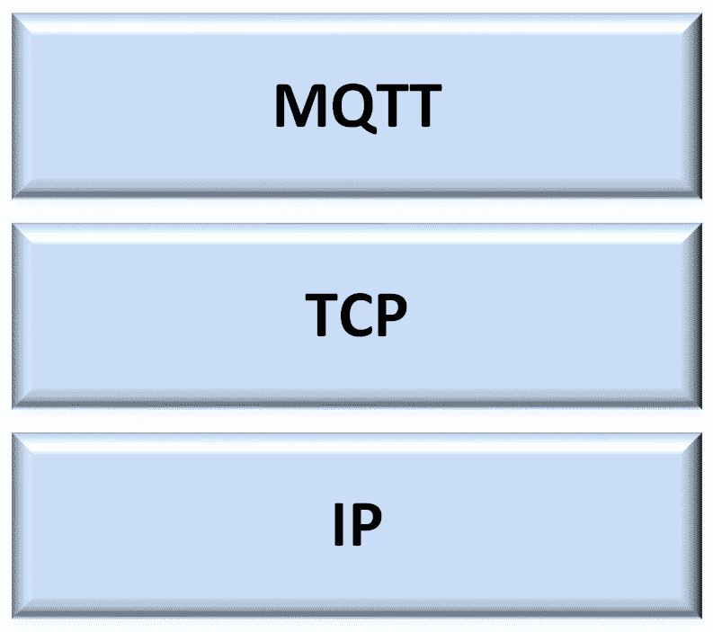
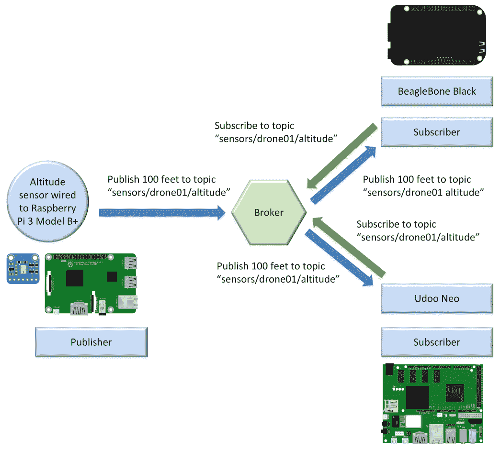
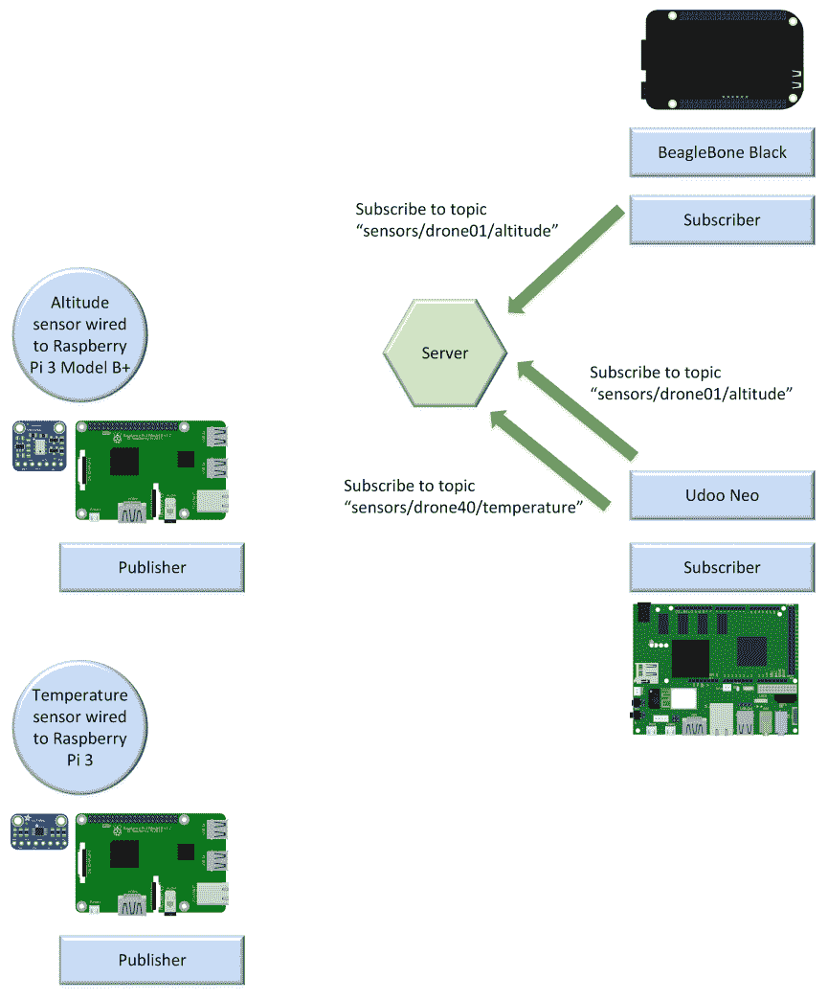
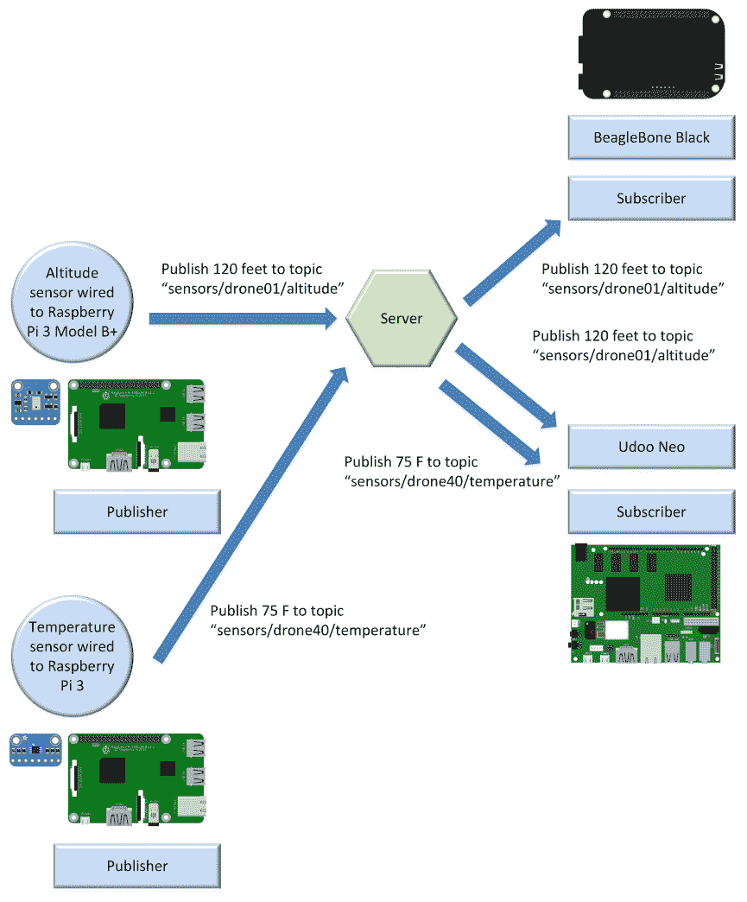
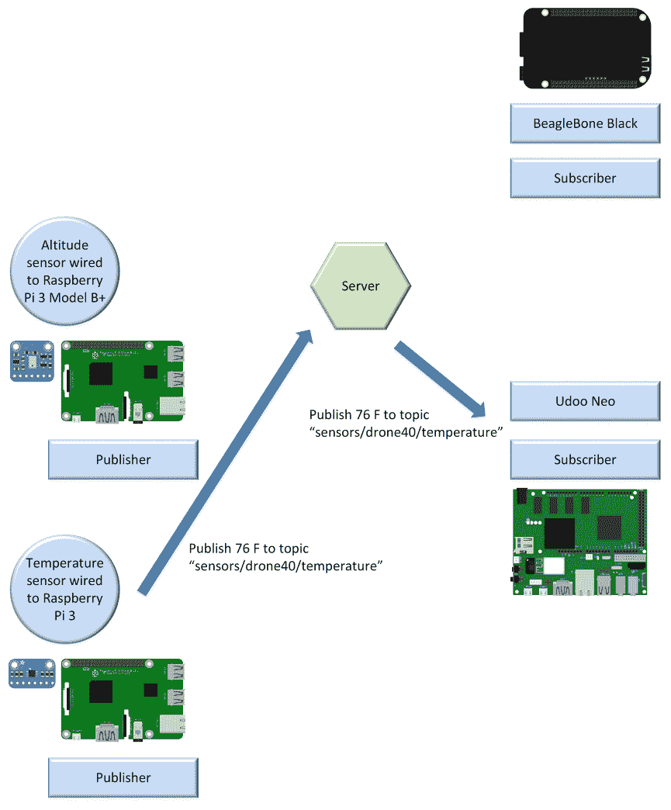
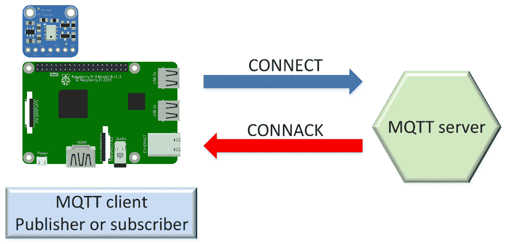
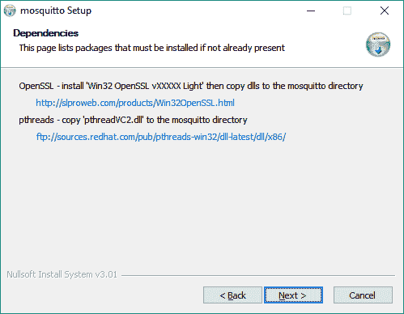
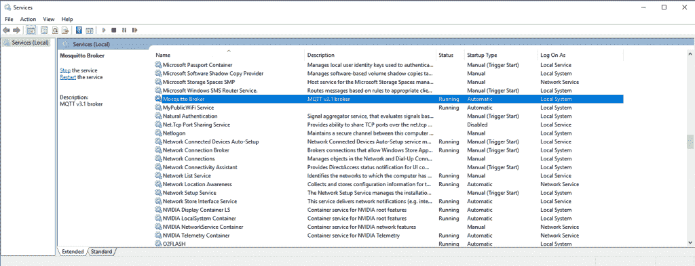

# 第一章：安装 MQTT 3.1.1 Mosquitto 服务器

在本章中，我们将开始使用首选的物联网发布-订阅轻量级消息传递协议，在不同的物联网解决方案中与移动应用和 Web 应用程序相结合。我们将学习 MQTT 及其轻量级消息系统的工作原理。

我们将理解 MQTT 谜题：客户端、服务器（以前称为经纪人）和连接。我们将学习在 Linux、macOS 和 Windows 上安装 MQTT 3.1.1 Mosquitto 服务器的程序。我们将学习在云中运行 Mosquitto 服务器（Azure、AWS 和其他云提供商）的特殊注意事项。我们将了解以下内容：

+   理解 MQTT 协议的便利场景

+   使用发布-订阅模式

+   使用消息过滤

+   理解 MQTT 谜题：客户端、服务器和连接

+   在 Linux 上安装 Mosquitto 服务器

+   在 macOS 上安装 Mosquitto 服务器

+   在 Windows 上安装 Mosquitto 服务器

+   在云中运行 Mosquitto 服务器的注意事项

# 理解 MQTT 协议的便利场景

想象一下，我们有数十个不同的设备必须在它们之间交换数据。这些设备必须从其他设备请求数据，接收请求的设备必须用所需的数据做出响应。请求数据的设备必须处理来自响应所需数据的设备的数据。

这些设备是物联网（IoT）板，上面连接了数十个传感器。我们有以下不同处理能力的物联网板：

+   Raspberry Pi 3 Model B+

+   Qualcomm DragonBoard 410c

+   Udoo Neo

+   BeagleBone Black

+   Phytec phyBoard-i.MX7-Zeta

+   e-con Systems eSOMiMX6-micro

+   MinnowBoard Turbot Quad-Core

每个这些板都必须能够发送和接收数据。此外，我们希望 Web 应用程序能够发送和接收数据。我们希望能够在互联网上实时发送和接收数据，并且可能会遇到一些网络问题：我们的无线网络有些不可靠，而且有些高延迟的环境。一些设备功耗低，许多设备由电池供电，它们的资源有限。此外，我们必须小心网络带宽的使用，因为一些设备使用按流量计费的连接。

按流量计费的连接是指每月有限的数据使用量的网络连接。如果超出此数据量，将额外收费。

我们可以使用 HTTP 请求并构建发布-订阅模型来在不同设备之间交换数据。然而，有一个专门设计的协议比 HTTP 1.1 和 HTTP/2 协议更轻。MQ Telemetry Transport（MQTT）更适合于许多设备在互联网上实时交换数据并且需要消耗尽可能少的网络带宽的场景。当涉及不可靠的网络和连接不稳定时，该协议比 HTTP 1.1 和 HTTP/2 更有效。

MQTT 协议是一种机器对机器（M2M）和物联网连接协议。MQTT 是一种轻量级的消息传递协议，使用基于服务器的发布-订阅机制，并在 TCP/IP（传输控制协议/互联网协议）之上运行。以下图表显示了 MQTT 协议在 TCP/IP 堆栈之上的情况：

MQTT 最流行的版本是 3.1.1 和 3.1。在本书中，我们将使用 MQTT 3.1.1。每当我们提到 MQTT 时，我们指的是 MQTT 3.1.1，这是协议的最新版本。MQTT 3.1.1 规范已经由 OASIS 联盟标准化。此外，MQTT 3.1.1 在 2016 年成为 ISO 标准（ISO/IEC 20922）。

MQTT 比 HTTP 1.1 和 HTTP/2 协议更轻，因此在需要以发布-订阅模式实时发送和接收数据时，同时需要最小的占用空间时，它是一个非常有趣的选择。MQTT 在物联网、M2M 和嵌入式项目中非常受欢迎，但也在需要可靠消息传递和高效消息分发的 Web 应用和移动应用中占据一席之地。总之，MQTT 适用于以下需要数据交换的应用领域：

+   资产跟踪和管理

+   汽车远程监控

+   化学检测

+   环境和交通监测

+   现场力量自动化

+   火灾和气体测试

+   家庭自动化

+   **车载信息娱乐**（**IVI**）

+   医疗

+   消息传递

+   **销售点**（**POS**）自助服务亭

+   铁路

+   **射频识别**（**RFID**）

+   **监控和数据采集**（**SCADA**）

+   老虎机

总之，MQTT 旨在支持物联网、M2M、嵌入式和移动应用中的以下典型挑战：

+   轻量化，使得能够在没有巨大开销的情况下传输大量数据

+   在大量数据中分发最小的数据包

+   支持异步、双向、低延迟推送消息的事件驱动范式

+   轻松地从一个客户端向多个客户端发出数据

+   使得能够在事件发生时监听事件（面向事件的架构）

+   支持始终连接和有时连接的模式

+   在不可靠的网络上发布信息，并在脆弱的连接上提供可靠的传递

+   非常适合使用电池供电的设备或需要低功耗

+   提供响应性，使得能够实现信息的准实时传递

+   为所有数据提供安全性和隐私

+   能够提供必要的可扩展性，将数据分发给数十万客户端

# 使用发布-订阅模式工作

在深入研究 MQTT 之前，我们必须了解发布-订阅模式，也称为发布-订阅模式。在发布-订阅模式中，发布消息的客户端与接收消息的其他客户端或客户端解耦。客户端不知道其他客户端的存在。客户端可以发布特定类型的消息，只有对该特定类型的消息感兴趣的客户端才会接收到发布的消息。

发布-订阅模式需要一个*服务器*，也称为**代理**。所有客户端都与服务器建立连接。通过服务器发送消息的客户端称为**发布者**。服务器过滤传入的消息，并将其分发给对该类型接收消息感兴趣的客户端。向服务器注册对特定类型消息感兴趣的客户端称为**订阅者**。因此，发布者和订阅者都与服务器建立连接。

通过简单的图表很容易理解事物是如何工作的。以下图表显示了一个发布者和两个订阅者连接到服务器：



连接有高度传感器的**树莓派 3 型 B+**板是一个发布者，它与服务器建立连接。**BeagleBone Black**板和**Udoo Neo**板是两个订阅者，它们与服务器建立连接。

**BeagleBone Black**板向服务器指示要订阅属于**传感器/无人机 01/高度**主题的所有消息。**Udoo Neo**板也向服务器指示相同的内容。因此，两个板都订阅了**传感器/无人机 01/高度**主题。

*主题*是一个命名的逻辑通道，也称为通道或主题。服务器只会向订阅了特定主题的订阅者发送消息。

**Raspberry Pi 3 Model B+**板发布了一个有效负载为**100 英尺**，主题为**sensors/drone01/altitude**的消息。这个板，也就是发布者，向服务器发送了发布请求。

消息的数据称为**有效负载**。消息包括它所属的主题和有效负载。

服务器将消息分发给订阅了**sensors/drone01/altitude**主题的两个客户端：**BeagleBone Black**和**Udoo Neo**板。

发布者和订阅者在空间上是解耦的，因为它们彼此不知道。发布者和订阅者不必同时运行。发布者可以发布一条消息，订阅者可以稍后接收。此外，发布操作与接收操作不是同步的。

发布者请求服务器发布一条消息，已订阅适当主题的不同客户端可以在不同时间接收消息。发布者可以将消息作为异步操作发送，以避免在服务器接收消息之前被阻塞。但是，也可以将消息作为同步操作发送到服务器，并且仅在操作成功后继续执行。在大多数情况下，我们将希望利用异步操作。

一个需要向数百个客户端发送消息的出版商可以通过向服务器进行单次发布操作来完成。服务器负责将发布的消息发送给所有已订阅适当主题的客户端。由于发布者和订阅者是解耦的，因此发布者不知道是否有任何订阅者会收听它即将发送的消息。因此，有时需要使订阅者也成为发布者，并发布一条消息，表明它已收到并处理了一条消息。具体要求取决于我们正在构建的解决方案的类型。MQTT 提供了许多功能，使我们在分析的许多场景中更轻松。我们将在整本书中使用这些不同的功能。

# 使用消息过滤

服务器必须确保订阅者只接收他们感兴趣的消息。在发布-订阅模式中，可以根据不同的标准过滤消息。我们将专注于分析*基于主题*的过滤，也称为基于主题的过滤。

考虑到每条消息都属于一个主题。当发布者请求服务器发布一条消息时，它必须同时指定主题和消息。服务器接收消息并将其传递给所有已订阅消息所属主题的订阅者。

服务器不需要检查消息的有效负载以将其传递给相应的订阅者；它只需要检查已到达的每条消息的主题，并在发布给相应订阅者之前进行过滤。

订阅者可以订阅多个主题。在这种情况下，服务器必须确保订阅者接收属于其订阅的所有主题的消息。通过另一个简单的图表，很容易理解事情是如何工作的。

以下图表显示了两个尚未发布任何消息的未来发布者，一个服务器和两个连接到服务器的订阅者：



一个**Raspberry Pi 3 Model B+**板上连接了一个高度传感器，另一个**Raspberry Pi 3**板上连接了一个温度传感器，它们将成为两个发布者。一个**BeagleBone Black**板和一个**Udoo Neo**板是两个订阅者，它们与服务器建立连接。

**BeagleBone Black**板告诉服务器它想订阅属于**sensors/drone01/altitude**主题的所有消息。**Udoo Neo**板告诉服务器它想订阅属于以下两个主题之一的所有消息：**sensors/drone01/altitude**和**sensors/drone40/temperature**。因此，**Udoo Neo**板订阅了两个主题，而**BeagleBone Black**板只订阅了一个主题。

下图显示了两个发布者连接并通过服务器发布不同主题的消息后会发生什么：



**Raspberry Pi 3 Model B+**板发布了一个以**120 英尺**为有效载荷和**sensors/drone01/altitude**为主题的消息。即发布者的板发送发布请求到服务器。服务器将消息分发给订阅了**sensors/drone01/altitude**主题的两个客户端：**BeagleBone Black**和**Udoo Neo**板。

**Raspberry Pi 3**板发布了一个以**75 F**为有效载荷和**sensors/drone40/temperature**为主题的消息。即发布者的板发送发布请求到服务器。服务器将消息分发给唯一订阅了**sensors/drone40/temperature**主题的客户端：**Udoo Neo**板。因此，**Udoo Neo**板从服务器接收了两条消息，一条属于**sensors/drone01/altitude**主题，另一条属于**sensors/drone40/temperature**主题。

下图显示了当一个发布者通过服务器发布消息到一个主题，而这个主题只有一个订阅者时会发生什么：



**Raspberry Pi 3**板发布了一个以**76 F**为有效载荷和**sensors/drone40/temperature**为主题的消息。即发布者的板发送发布请求到服务器。服务器将消息分发给唯一订阅了**sensors/drone40/temperature**主题的客户端：**Udoo Neo**板。

# 理解 MQTT 谜题-客户端、服务器和连接

在低于 3.1.1 版本的 MQTT 协议中，MQTT 服务器被称为 MQTT 代理。从 MQTT 3.1.1 开始，MQTT 代理被重命名为 MQTT 服务器，因此我们将称其为服务器。然而，我们必须考虑到 MQTT 服务器、工具和客户端库的文档可能会使用旧的 MQTT 代理名称来指代服务器。MQTT 服务器也被称为消息代理。

MQTT 服务器使用先前解释的基于主题的过滤器来过滤和分发消息给适当的订阅者。有许多 MQTT 服务器实现提供了通过提供自定义插件来提供额外的消息过滤功能。但是，我们将专注于作为 MQTT 协议要求一部分的功能。

如前所述，在 MQTT 中，发布者和订阅者是完全解耦的。发布者和订阅者都是仅与 MQTT 服务器建立连接的 MQTT 客户端。一个 MQTT 客户端可以同时是发布者和订阅者，也就是说，客户端可以向特定主题发布消息，同时接收订阅了的主题的消息。

各种流行的编程语言和平台都有 MQTT 客户端库可用。在选择 MQTT 客户端库时，我们必须考虑的最重要的事情之一是它们支持的 MQTT 功能列表以及我们解决方案所需的功能。有时，我们可以在特定编程语言和平台之间选择多个库，其中一些可能不实现所有功能。在本书中，我们将使用支持各种平台的现代 Python 版本的最完整的库。

任何具有 TCP/IP 协议栈并能够使用 MQTT 库的设备都可以成为 MQTT 客户端，即发布者、订阅者，或者既是发布者又是订阅者。MQTT 库使设备能够在 TCP/IP 协议栈上与 MQTT 通信，并与特定类型的 MQTT 服务器进行交互。例如，以下设备都可以成为 MQTT 客户端，除其他设备外：

+   一个 Arduino 板

+   一个树莓派 3 Model B+板

+   一个 BeagleBone Black 板

+   一个 Udoo Neo 板

+   一个 iPhone

+   一个 iPad

+   一个安卓平板电脑

+   一个安卓智能手机

+   运行 Windows 的笔记本电脑

+   运行 Linux 的服务器

+   运行 macOS 的 MacBook

许多 MQTT 服务器适用于最流行的平台，包括 Linux、Windows 和 macOS。其中许多是可以作为 MQTT 服务器工作并提供额外功能的服务器。MQTT 服务器可能只实现 MQTT 功能的子集，并可能具有特定的限制。因此，在选择 MQTT 服务器之前，检查我们解决方案中所需的所有功能非常重要。与其他中间件一样，我们有开源版本、免费版本和付费版本。因此，我们还必须确保根据我们的预算和特定需求选择适当的 MQTT 服务器。

在本书中，我们将使用 Eclipse Mosquitto MQTT 服务器（[`www.mosquitto.org`](http://www.mosquitto.org)）。Mosquitto 是一个开源的 MQTT 服务器，具有 EPL/EDL 许可证，与 MQTT 版本 3.1.1 和 3.1 兼容。我们可以利用我们学到的一切与其他 MQTT 服务器一起工作，比如**Erlang MQTT Broker**（**EMQ**），也称为 Emqttd（[`www.emqtt.io`](http://www.emqtt.io)），以及 HiveMQ（[`hivemq.com`](http://hivemq.com)），等等。此外，我们可能会利用我们的知识与基于云的 MQTT 服务器一起工作，比如 CloudMQTT（[`www.cloudmqtt.com`](http://www.cloudmqtt.com)）或 PubNub MQTT 桥接器（[`pubnub.com`](http://pubnub.com)）。我们还将专门与基于云的 MQTT 提供商一起工作。

MQTT 服务器是我们之前分析的发布-订阅模型的中心枢纽。MQTT 服务器负责对将能够成为发布者和/或订阅者的 MQTT 客户端进行身份验证和授权。因此，MQTT 客户端必须做的第一件事就是与 MQTT 服务器建立连接。

为了建立连接，MQTT 客户端必须向 MQTT 服务器发送一个带有有效载荷的`CONNECT`控制数据包，该有效载荷必须包括启动连接和进行身份验证和授权所需的所有必要信息。MQTT 服务器将检查`CONNECT`数据包，执行身份验证和授权，并向客户端发送一个`CONNACK`控制数据包的响应，我们将在理解`CONNECT`控制数据包后详细分析。如果 MQTT 客户端发送了无效的`CONNECT`控制数据包，服务器将自动关闭连接。

以下图显示了 MQTT 客户端与 MQTT 服务器之间建立连接的交互：



在 MQTT 客户端和 MQTT 服务器之间建立成功连接后，服务器将保持连接开放，直到客户端失去连接或向服务器发送`DISCONNECT`控制数据包以关闭连接。

`CONNECT`控制数据包的有效载荷必须包括以下字段的值，以及包含在控制数据包中的特殊标志字节的位。我们希望理解这些字段和标志的含义，因为当我们使用 Python 中的 MQTT 工具和 MQTT 客户端库时，我们将能够指定它们的值：

+   `ClientId`：客户端标识符，也称为客户端 ID，是一个字符串，用于标识连接到 MQTT 服务器的每个 MQTT 客户端。连接到 MQTT 服务器的每个客户端必须具有唯一的`ClientId`，服务器使用它来标识与客户端和服务器之间的 MQTT 会话相关的状态。如果客户端将空值指定为`ClientId`，MQTT 服务器必须生成一个唯一的`ClientId`来标识客户端。但是，此行为取决于为`CleanSession`字段指定的值。

+   `CleanSession`：清理会话标志是一个布尔值，指定 MQTT 客户端从 MQTT 服务器断开连接然后重新连接后会发生什么。如果`CleanSession`设置为`1`或`True`，客户端向 MQTT 服务器指示会话只会持续到网络连接保持活跃。MQTT 客户端从 MQTT 服务器断开连接后，与会话相关的任何信息都会被丢弃。同一 MQTT 客户端重新连接到 MQTT 服务器时，不会使用上一个会话的数据，而会创建一个新的清理会话。如果`CleanSession`设置为`0`或`False`，我们将使用持久会话。在这种情况下，MQTT 服务器会存储 MQTT 客户端的所有订阅，当 MQTT 客户端断开连接时，MQTT 服务器会存储与订阅匹配的特定服务质量级别的所有消息。这样，当同一 MQTT 客户端与 MQTT 服务器建立新连接时，MQTT 客户端将拥有相同的订阅，并接收在失去连接时无法接收的所有消息。我们将在后面的第二章中深入探讨消息的服务质量级别及其与清理会话标志或持久会话选项的关系。

当清理会话标志设置为`0`或`False`时，客户端向服务器指示它需要一个持久会话。我们只需要记住，清理会话是持久会话的相反。

+   `UserName`：如果客户端想要指定一个用户名来请求 MQTT 服务器的认证和授权，它必须将`UserName`标志设置为`1`或`True`，并为`UserName`字段指定一个值。

+   `Password`：如果客户端想要指定一个密码来请求 MQTT 服务器的认证和授权，它必须将`Password`标志设置为`1`或`True`，并为`Password`字段指定一个值。

我们将专门为 MQTT 安全性撰写一整章，因此我们只提及`CONNECT`控制数据包中包含的字段和标志。

+   `ProtocolLevel`：协议级别值指示 MQTT 客户端请求 MQTT 服务器使用的 MQTT 协议版本。请记住，我们将始终使用 MQTT 版本 3.1.1。

+   `KeepAlive`：`KeepAlive`是以秒为单位表示的时间间隔。如果`KeepAlive`的值不等于`0`，MQTT 客户端承诺在指定的`KeepAlive`时间内向服务器发送控制数据包。如果 MQTT 客户端不必发送任何控制数据包，它必须向 MQTT 服务器发送一个`PINGREQ`控制数据包，以告知 MQTT 服务器客户端连接仍然活跃。MQTT 服务器会用`PINGRESP`响应控制数据包回应 MQTT 客户端，以告知 MQTT 客户端与 MQTT 服务器的连接仍然活跃。当缺少这些控制数据包时，连接将被关闭。如果`KeepAlive`的值为`0`，则保持活动机制将被关闭。

+   Will，WillQoS，WillRetain，WillTopic 和 WillMessage：这些标志和字段允许 MQTT 客户端利用 MQTT 的遗嘱功能。如果 MQTT 客户端将 Will 标志设置为 1 或 True，则指定它希望 MQTT 服务器存储与会话关联的遗嘱消息。WillQoS 标志指定了遗嘱消息的期望服务质量，而 WillRetain 标志指示发布此消息时是否必须保留。如果 MQTT 客户端将 Will 标志设置为 1 或 True，则必须在 WillTopic 和 WillMessage 字段中指定 Will 消息的主题和消息。如果 MQTT 客户端断开连接或与 MQTT 服务器失去连接，MQTT 服务器将使用 WillTopic 字段中指定的主题以所选的服务质量发布 WillMessage 字段中指定的消息。我们将稍后详细分析此功能。

MQTT 服务器将处理有效的 CONNECT 控制数据包，并将以 CONNACK 控制数据包作出响应。此控制数据包将包括标头中包含的以下标志的值。我们希望了解这些标志的含义，因为在使用 MQTT 工具和 MQTT 客户端库时，我们将能够检索它们的值：

+   SessionPresent: 如果 MQTT 服务器收到了一个将 CleanSession 标志设置为 1 或 True 的连接请求，SessionPresent 标志的值将为 0 或 False，因为不会重用任何存储的会话。如果连接请求中的 CleanSession 标志设置为 0 或 False，MQTT 服务器将使用持久会话，并且如果服务器从先前的连接中为客户端检索到持久会话，则 SessionPresent 标志的值将为 1 或 True。否则，SessionPresent 将为 0 或 False。想要使用持久会话的 MQTT 客户端可以使用此标志的值来确定是否必须请求订阅所需主题，或者订阅是否已从持久会话中恢复。

+   ReturnCode: 如果授权和认证通过，并且连接成功建立，ReturnCode 的值将为 0。否则，返回代码将不同于 0，客户端和服务器之间的网络连接将被关闭。以下表格显示了 ReturnCode 的可能值及其含义：

| ReturnCode 值 | 描述 |
| --- | --- |
| 0 | 连接被接受 |
| 1 | 由于 MQTT 服务器不支持 MQTT 客户端在 CONNECT 控制数据包中请求的 MQTT 协议版本，连接被拒绝 |
| 2 | 由于指定的 ClientId（客户端标识符）已被拒绝，连接被拒绝 |
| 3 | 由于网络连接已建立但 MQTT 服务不可用，连接被拒绝 |
| 4 | 由于用户名或密码数值格式不正确，连接被拒绝 |
| 5 | 由于授权失败，连接被拒绝 |

# 在 Linux 上安装 Mosquitto 服务器

现在，我们将学习在最流行的操作系统上安装 Mosquitto 服务器所需的步骤：Linux，macOS 和 Windows。

使用最新版本的 Mosquitto 非常重要，以确保解决了先前版本中发现的许多安全漏洞。例如，Mosquitto 1.4.15 解决了影响版本 1.0 至 1.4.14（含）的两个重要安全漏洞。

首先，我们将从 Linux 开始；具体来说，我们将使用 Ubuntu Linux。如果您想使用其他 Linux 发行版，您可以在 Mosquitto 下载部分找到有关安装过程的详细信息：[`mosquitto.org/download`](http://mosquitto.org/download)。

按照以下步骤在 Ubuntu Linux 上安装 Mosquitto 服务器；请注意，您需要 root 权限：

1.  打开终端窗口或使用安全 shell 访问 Ubuntu，并运行以下命令以添加 Mosquitto 存储库：

```py
 sudo apt-add-repository ppa:mosquitto-dev/mosquitto-ppa 
```

您将看到类似于下面的输出（临时文件名将不同）：

```py
 gpg: keyring `/tmp/tmpi5yrsz7i/secring.gpg' created
 gpg: keyring `/tmp/tmpi5yrsz7i/pubring.gpg' created
 gpg: requesting key 262C4500 from hkp server keyserver.ubuntu.com
 gpg: /tmp/tmpi5yrsz7i/trustdb.gpg: trustdb created
 gpg: key 262C4500: public key "Launchpad mosquitto" imported
 gpg: Total number processed: 1
 gpg: imported: 1 (RSA: 1)
 OK
```

1.  运行以下命令以更新最近添加的 Mosquitto 存储库中的软件包：

```py
 sudo apt-get update
```

您将看到类似于下面的输出。请注意，下面的行显示了作为 Windows Azure 虚拟机运行的 Ubuntu 服务器的输出，因此输出将类似：

```py
 Hit:1 http://azure.archive.ubuntu.com/ubuntu xenial InRelease
      Get:2 http://azure.archive.ubuntu.com/ubuntu xenial-updates       
      InRelease [102 kB]
      Get:3 http://azure.archive.ubuntu.com/ubuntu xenial-backports 
      InRelease [102 kB]

      ...

      Get:32 http://security.ubuntu.com/ubuntu xenial-security/universe        
      Translation-en [121 kB]
      Get:33 http://security.ubuntu.com/ubuntu xenial-
      security/multiverse amd64 Packages [3,208 B]
      Fetched 12.8 MB in 2s (4,809 kB/s)
      Reading package lists... Done
```

1.  现在，运行以下命令以安装 Mosquitto 服务器的软件包：

```py
 sudo apt-get install mosquitto
```

您将看到类似于下面的输出。

1.  输入`Y`并按*Enter*回答问题，完成安装过程：

```py
 Building dependency tree
      Reading state information... Done
      The following additional packages will be installed:
        libev4 libuv1 libwebsockets7
      The following NEW packages will be installed:
        libev4 libuv1 libwebsockets7 mosquitto
      0 upgraded, 4 newly installed, 0 to remove and 29 not upgraded.
      Need to get 280 kB of archives.
      After this operation, 724 kB of additional disk space will be 
      used.
      Do you want to continue? [Y/n] Y
```

1.  最后几行应包括一行，其中说`Setting up mosquitto`，后面跟着版本号，如下所示：

```py
 Setting up libuv1:amd64 (1.8.0-1) ...
 Setting up libev4 (1:4.22-1) ...
 Setting up libwebsockets7:amd64 (1.7.1-1) ...
 Setting up mosquitto (1.4.15-0mosquitto1~xenial1) ...
 Processing triggers for libc-bin (2.23-0ubuntu10) ...
 Processing triggers for systemd (229-4ubuntu21.1) ...
 Processing triggers for ureadahead (0.100.0-19) ...
```

1.  现在，运行以下命令以安装 Mosquitto 客户端软件包，这将允许我们运行命令以发布消息到主题和订阅主题过滤器：

```py
 sudo apt-get install mosquitto-clients
```

您将看到类似于下面的输出。

1.  输入`Y`并按*Enter*回答问题，完成安装过程：

```py
 Reading package lists... Done
 Building dependency tree
 Reading state information... Done
 The following additional packages will be installed:
 libc-ares2 libmosquitto1
 The following NEW packages will be installed:
 libc-ares2 libmosquitto1 mosquitto-clients
 0 upgraded, 3 newly installed, 0 to remove and 29 not upgraded.
 Need to get 144 kB of archives.
 After this operation, 336 kB of additional disk space will be   
      used.
 Do you want to continue? [Y/n] Y
```

最后几行应包括一行，其中说`Setting up mosquitto-clients`，后面跟着版本号，如下所示：

```py
 Setting up libmosquitto1:amd64 (1.4.15-0mosquitto1~xenial1) ...
      Setting up mosquitto-clients (1.4.15-0mosquitto1~xenial1) ...
      Processing triggers for libc-bin (2.23-0ubuntu10) ... 
```

1.  最后，运行以下命令来检查最近安装的`mosquitto`服务的状态：

```py
 sudo service mosquitto status
```

输出的前几行应类似于以下行，显示`active (running)`状态。`CGroup`后面的详细信息指示启动服务的命令行。`-c`选项后跟`/etc/mosquitto/mosquitto.conf`指定 Mosquitto 正在使用此配置文件：

```py
mosquitto.service - LSB: mosquitto MQTT v3.1 message broker
 Loaded: loaded (/etc/init.d/mosquitto; bad; vendor preset: enabled)
 Active: active (running) since Sun 2018-03-18 19:58:15 UTC; 3min 8s ago
 Docs: man:systemd-sysv-generator(8)
 CGroup: /system.slice/mosquitto.service
 └─15126 /usr/sbin/mosquitto -c /etc/mosquitto/mosquitto.conf
```

您还可以运行以下命令来检查 Mosquitto MQTT 服务器是否在默认端口`1883`上监听：

```py
netstat -an | grep 1883
```

以下行显示了上一个命令的结果，指示 Mosquitto MQTT 服务器已在端口`1883`上打开了 IPv4 和 IPv6 监听套接字：

```py
tcp 0 0 0.0.0.0:1883 0.0.0.0:* LISTEN

tcp6 0 0 :::1883 :::* LISTEN 
```

# 在 macOS 上安装 Mosquitto 服务器

按照以下步骤在 macOS 上安装 Mosquitto 服务器，即 macOS Sierra 之前的 OS X：

1.  如果您尚未安装 Homebrew，请打开终端窗口并运行 Homebrew 主页上指定的命令[`brew.sh`](http://brew.sh)，以安装 macOS 的这个流行软件包管理器。以下命令将完成工作。但是，最好检查 Homebrew 主页并查看所有始终更新为最新 macOS 版本的详细说明。如果您已经安装了 Homebrew，请转到下一步：

```py
 /usr/bin/ruby -e "$(curl -fsSL      
    https://raw.githubusercontent.com/Homebrew/install/master/install)"
```

1.  打开终端窗口并运行以下命令以请求 Homebrew 安装 Mosquitto：

```py
 brew install mosquitto
```

请注意，在某些情况下，Homebrew 可能需要在您安装 Mosquitto 之前在计算机上安装其他软件。如果需要安装其他软件，例如 Xcode 命令行工具，Homebrew 将为您提供必要的说明。

1.  以下行显示了在终端中显示的最后消息，指示 Homebrew 已安装 Mosquitto 并启动 MQTT 服务器的说明：

```py
 ==> Installing dependencies for mosquitto: c-ares, openssl, 
 libev, libuv, libevent, libwebsockets
 ==> Installing mosquitto dependency: c-ares
 ==> Caveats
 A CA file has been bootstrapped using certificates from the 
 SystemRoots
 keychain. To add additional certificates (e.g. the certificates 
 added in the System keychain), place .pem files in
 /usr/local/etc/openssl/certs and run
 /usr/local/opt/openssl/bin/c_rehash

 This formula is keg-only, which means it was not symlinked into 
 /usr/local, because Apple has deprecated use of OpenSSL in favor 
 of its own TLS and crypto libraries. If you need to have this 
 software first in your PATH run:
 echo 'export PATH="/usr/local/opt/openssl/bin:$PATH"' >> 
 ~/.bash_profile

 For compilers to find this software you may need to set:
 LDFLAGS: -L/usr/local/opt/openssl/lib
 CPPFLAGS: -I/usr/local/opt/openssl/include

 ==> Installing mosquitto
 ==> Downloading https://homebrew.bintray.com/bottles/mosquitto- 
 1.4.14_2.el_capit
 ##################################################
 #####################100.0%
 ==> Pouring mosquitto-1.4.14_2.el_capitan.bottle.tar.gz
 ==> Caveats
 mosquitto has been installed with a default configuration file.
 You can make changes to the configuration by editing:
 /usr/local/etc/mosquitto/mosquitto.conf

 To have launchd start mosquitto now and restart at login:
 brew services start mosquitto

 Or, if you don't want/need a background service you can just run:
 mosquitto -c /usr/local/etc/mosquitto/mosquitto.conf
```

1.  Mosquitto 安装完成后，在新的终端窗口中运行以下命令以使用默认配置文件启动 Mosquitto。 `-c`选项后跟`/usr/local/etc/mosquitto/mosquitto.conf`指定我们要使用此配置文件：

```py
 /usr/local/sbin/mosquitto -c       
     /usr/local/etc/mosquitto/mosquitto.conf
```

在运行上一个命令后，以下是输出结果：

```py
 1521488973: mosquitto version 1.4.14 (build date 2017-10-22 
 16:34:20+0100) starting
 1521488973: Config loaded from 
 /usr/local/etc/mosquitto/mosquitto.conf.
 1521488973: Opening ipv4 listen socket on port 1883.
 1521488973: Opening ipv6 listen socket on port 1883.
```

最后几行指示 Mosquitto MQTT 服务器已在默认 TCP 端口`1883`上打开了 IPv4 和 IPv6 监听套接字。保持终端窗口打开，因为我们需要在本地计算机上运行 Mosquitto 以使用下面的示例。

# 在 Windows 上安装 Mosquitto 服务器

按照以下步骤在 Windows 上安装 Mosquitto 服务器。请注意，您需要 Windows Vista 或更高版本（Windows 7、8、8.1、10 或更高版本）。这些说明也适用于 Windows Server 2008、2012、2016 或更高版本：

1.  在 Mosquitto 下载网页上下载提供本机构建的可执行文件，该网页列出了二进制安装和 Windows 下的文件：[`mosquitto.org/download`](http://mosquitto.org/download)。对于 Mosquitto 1.4.15，文件名为`mosquitto-1.4.15-install-win32.exe`。您必须单击或点击文件名，然后将被重定向到 Eclipse 存储库，其中包括默认推荐的许多镜像选项，您可以从中下载可执行文件。

1.  运行先前下载的可执行文件，mosquitto 设置向导将显示其欢迎对话框。单击“下一步>”继续。设置向导将显示您必须安装的依赖项：OpenSSL 和 pthreads。对话框将显示您可以使用的链接来下载和运行这两个要求的安装程序，如下面的屏幕截图所示：



1.  如果您在 Windows 上没有安装 Win32 OpenSSL v1.0.2j Light，请转到 Win32 OpenSSL 网页，[`slproweb.com/products/Win32OpenSSL.html`](http://slproweb.com/products/Win32OpenSSL.html)，并下载`Win32 OpenSSL v1.1.0g Light`文件。不要下载 Win64 版本，因为您需要 Win32 版本才能使 Mosquitto 具有其依赖项。如果您已经安装了 Win32 OpenSSL v1.1.0g Light，请转到第 7 步。对于 Win32 OpenSSL v1.1.0g Light，文件名为`Win32OpenSSL_Light-1_1_0g.exe`。运行下载的可执行文件，OpenSSL Light（32 位）将显示其欢迎对话框。单击“下一步>”继续。

1.  设置向导将显示许可协议。阅读并选择“我接受协议”，然后单击“下一步>”。如果您不想使用默认文件夹，请选择要安装 OpenSSL Light（32 位）的文件夹。请记住您指定的文件夹，因为您稍后需要从此文件夹复制一些 DLL 文件。默认文件夹为`C:\OpenSSL-Win32`。

1.  单击“下一步>”继续，如有必要，指定不同的开始菜单文件夹，然后单击“下一步>”。选择 OpenSSL 二进制文件（/bin）目录作为“复制 OpenSSL DLLs”的所需选项。这样，安装将把 DLL 复制到先前指定文件夹内的`bin`子文件夹中，默认为`C:\OpenSSL-Win32\bin`。

1.  单击“下一步>”继续。查看所选的安装选项，然后单击“安装”以完成 OpenSSL Light（32 位）的安装。最后，考虑向 Win32 OpenSSL 项目捐赠，然后单击“完成”退出设置。

1.  在 Web 浏览器中转到以下地址：ftp://sources.redhat.com/pub/pthreads-win32/dll-latest/dll/x86。浏览器将显示此 FTP 目录的许多文件。右键单击**pthreadVC2.dll**，然后将文件保存在您的`Downloads`文件夹中。稍后您需要将此 DLL 复制到 Mosquitto 安装文件夹中。

1.  现在，返回到 Mosquitto 设置窗口，单击“下一步>”继续。默认情况下，Mosquitto 将安装文件和 Mosquitto 服务。保留默认组件以安装所选内容，然后单击“下一步>”继续。

1.  如果您不想使用默认文件夹，请选择要安装 Mosquitto 的文件夹。请记住您指定的文件夹，因为您稍后需要将一些 DLL 文件复制到此文件夹。默认文件夹为`C:\Program Files (x86)\mosquitto`。单击“安装”以完成安装。请注意，mosquitto 设置向导可能会显示与缺少 DLL 相关的错误。我们将在接下来的步骤中解决此问题。安装完成后，单击“完成”关闭 mosquitto 设置向导。

1.  打开文件资源管理器窗口，转到您安装 OpenSSL Light（32 位）的文件夹中的`bin`子文件夹，默认情况下为`C:\OpenSSL-Win32\bin`。

1.  复制以下四个 DLL 文件：`libcrypto-1_1.dll`、`libeay32.dll`、`ssleay32.dll`和`libssl-1_1.dll`。现在，转到您安装 Mosquitto 的文件夹，并将这四个 DLL 粘贴进去。默认情况下，Mosquitto 安装文件夹是`C:\Program Files (x86)\mosquitto`。您需要提供管理员权限才能将 DLL 粘贴到默认文件夹中。

1.  打开文件资源管理器窗口，转到您的下载文件夹。复制您在先前步骤中下载的 pthreads DLL，`pthreadVC2.dll`。现在，转到您安装 Mosquitto 的文件夹，并将此 DLL 粘贴进去。您需要提供管理员权限才能将 DLL 粘贴到默认的 Mosquitto 安装文件夹中。

1.  现在，所有依赖项都包含在 Mosquitto 安装文件夹中，需要再次运行安装程序以使 Mosquitto 设置配置 Windows 服务。再次运行先前下载的 Mosquitto 安装可执行文件。对于 Mosquitto 1.4.15，文件名是`mosquito-1.4.15-install-win32.exe`。确保指定与您复制 DLL 的文件夹相同的安装文件夹，并激活`Service`组件。点击**下一步**多次，然后点击**安装**以完成 Windows 服务的配置。安装完成后，点击完成以关闭 Mosquitto 设置向导。

1.  在 Windows 中打开服务应用程序，并搜索服务名称为**Mosquitto Broker**的服务。右键单击服务名称，然后选择**启动**。状态将变为**运行**。默认情况下，服务配置为其**启动类型**设置为**自动**。如果您不想自动启动 Mosquitto Broker 服务，请将**启动类型**更改为**手动**。在 Windows 计算机上使用 Mosquitto 之前，您必须重复手动启动服务的步骤。请注意，服务的描述为 MQTT v3.1 代理，如下图所示。该描述已过时，因为该服务提供了一个与 MQTT 3.1 兼容的 MQTT 3.1.1 服务器。



打开 Windows PowerShell 或命令提示符窗口，并运行以下命令以检查 Mosquitto MQTT 服务器是否在默认 TCP 端口`1883`上监听：

```py
 netstat -an | findstr 1883
```

以下行显示了先前命令的结果，表明 Mosquitto MQTT 服务器已在端口`1883`上打开了 IPv4 和 IPv6 监听套接字：

```py
 TCP 0.0.0.0:1883 0.0.0.0:0 LISTENING
 TCP [::]:1883 [::]:0 LISTENING
```

# 在云中运行 Mosquitto 服务器时需要考虑的事项

我们已经在 Linux、macOS 和 Windows 上使用了 Mosquitto 服务器的默认配置。Mosquitto 服务器将使用 TCP 端口`1883`。如果您想从其他设备或计算机与 Mosquitto 服务器交互，您必须确保运行在您计算机上的防火墙对该端口号有适当的配置。

当您在云中的 Linux 或 Windows 虚拟机上运行 Mosquitto 服务器时，您还必须确保虚拟机网络过滤器对入站和出站流量都有适当的配置，以允许端口`1883`上的入站和出站流量。您必须授权端口`1883`上的入站和出站流量。

# 测试您的知识

让我们看看您是否能正确回答以下问题：

1.  MQTT 运行在以下之上：

1.  MQIP 协议

1.  TCP/IP 协议

1.  物联网协议

1.  MQTT 消息的数据称为：

1.  有效载荷

1.  数据包

1.  上传

1.  在 MQTT 3.1.1 版本中，代理被命名为：

1.  MQTT 代理

1.  MQTT 客户端

1.  MQTT 服务器

1.  Mosquitto 是：

1.  仅在 Windows Azure 上可用的基于云的 MQTT 服务器

1.  仅在亚马逊网络服务上可用的基于云的 MQTT 服务器

1.  与 MQTT 版本 3.1.1 和 3.1 兼容的开源 MQTT 服务器

1.  Mosquitto 服务器使用的默认 TCP 端口是：

1.  `22`

1.  `1883`

1.  `9000`

正确答案包含在附录的*Solutions*部分中。

# 总结

在本章中，我们开始了解 MQTT 协议。我们了解了该协议的便利场景，发布-订阅模式的细节以及消息过滤。我们学习了与 MQTT 相关的基本概念，并了解了不同的组件：客户端、服务器或代理和连接。

我们学会了在 Linux、macOS 和 Windows 上安装 Mosquitto 服务器。我们使用了默认配置，因为这样可以让我们在使用 Mosquitto 的同时了解其内部工作原理。然后，我们将保护服务器。这样，我们就可以更容易地开始使用 Python 客户端库来发布 MQTT 消息和订阅 MQTT 主题过滤器。

现在我们的环境已经准备好开始使用尚未安全保护的 Mosquitto 服务器进行工作，我们将使用命令行和图形界面工具来详细了解 MQTT 的工作原理。我们将学习 MQTT 的基础知识，MQTT 的特定词汇以及其工作模式，这些都是我们将在第二章中讨论的主题，*使用命令行和图形界面工具来学习 MQTT 的工作原理*。
