# 第二章：使用命令行和 GUI 工具学习 MQTT 的工作原理

在本章中，我们将使用命令行和 GUI 工具详细了解 MQTT 3.1.1 的工作原理。我们将学习 MQTT 的基础知识，MQTT 的特定词汇以及其工作模式。我们将使用不同的实用程序和图表来了解与 MQTT 相关的最重要的概念。在编写 Python 代码与 MQTT 协议一起工作之前，我们将了解我们需要知道的一切。我们将使用不同的服务质量（QoS）级别，并分析和比较它们的开销。我们将了解以下内容：

+   使用命令行工具订阅主题

+   使用 GUI 工具订阅主题

+   使用命令行工具发布消息

+   使用 GUI 工具发布消息

+   使用 GUI 工具取消订阅主题

+   学习主题的最佳实践

+   理解 MQTT 通配符

+   了解不同的服务质量级别

+   使用至少一次传递（QoS 级别 1）工作

+   使用恰好一次传递（QoS 级别 2）工作

+   理解不同服务质量级别的开销

# 使用命令行工具订阅主题

无人机是一种与许多传感器和执行器进行交互的物联网设备，包括与发动机、螺旋桨和伺服电机连接的数字电子调速器。无人机也被称为**无人驾驶飞行器**（**UAV**），但我们肯定会称其为无人机。假设我们必须监视许多无人机。具体来说，我们必须显示它们的高度和每个伺服电机的速度。并非所有无人机都具有相同数量的发动机、螺旋桨和伺服电机。我们必须监视以下类型的无人机：

| **名称** | **螺旋桨数量** |
| --- | --- |
| 四旋翼 | `4` |
| 六旋翼 | `6` |
| 八旋翼 | `8` |

每架飞行器将每 2 秒发布一次其高度到以下主题：`sensors/dronename/altitude`，其中`dronename`必须替换为分配给每架飞行器的名称。例如，名为`octocopter01`的飞行器将其高度值发布到`sensors/octocopter01/altitude`主题，名为`quadcopter20`的飞行器将使用`sensors/quadcopter20/altitude`主题。

此外，每架飞行器将每 2 秒发布一次其每个转子的速度到以下主题：`sensors/dronename/speed/rotor/rotornumber`，其中`dronename`必须替换为分配给每架飞行器的名称，`rotornumber`必须替换为将要发布速度的转子编号。例如，名为`octocopter01`的飞行器将其转子编号`1`的速度值发布到`sensors/octocopter01/speed/rotor/1`主题。

我们将使用 Mosquitto 中包含的`mosquitto_sub`命令行实用程序生成一个简单的 MQTT 客户端，该客户端订阅主题并打印接收到的所有消息。在 macOS 或 Linux 中打开终端，或在 Windows 中打开命令提示符，转到 Mosquitto 安装的目录，并运行以下命令：

```py
mosquitto_sub -V mqttv311 -t sensors/octocopter01/altitude -d
```

如果您想使用 Windows PowerShell 而不是命令提示符，您将不得不在`mosquitto_sub`之前添加`.\`作为前缀。

上述命令将创建一个 MQTT 客户端，该客户端将与本地 MQTT 服务器建立连接，然后将使客户端订阅在`-t`选项之后指定的主题：`sensors/octocopter01/altitude`。当客户端建立连接时，我们指定要使用的 MQTT 协议的版本为`-V mqttv311`。这样，我们告诉 MQTT 服务器我们要使用 MQTT 版本 3.11。我们指定`-d`选项以启用调试消息，这将使我们能够了解底层发生了什么。稍后我们将分析连接和订阅的其他选项。

终端或命令提示符窗口将显示类似以下行的调试消息。请注意，生成的`ClientId`将与`Client mosqsub|17040-LAPTOP-5D`之后显示的不同：

```py
Client mosqsub|17040-LAPTOP-5D sending CONNECT
Client mosqsub|17040-LAPTOP-5D received CONNACK
Client mosqsub|17040-LAPTOP-5D sending SUBSCRIBE (Mid: 1, Topic: sensors/octocopter01/altitude, QoS: 0)
Client mosqsub|17040-LAPTOP-5D received SUBACK
Subscribed (mid: 1): 0
```

终端或命令提示符窗口将显示从 MQTT 服务器到 MQTT 客户端的到达的消息。保持窗口打开。您将看到客户端向 MQTT 服务器发送`PINGREQ`数据包，并从 MQTT 服务器接收`PINQRESP`数据包。以下行显示了这些数据包的消息示例：

```py
Client mosqsub|17040-LAPTOP-5D sending PINGREQ
Client mosqsub|17040-LAPTOP-5D received PINGRESP
```

# 使用 GUI 工具订阅主题

MQTT.fx 是使用 JavaFX 实现的 GUI 实用程序，适用于 Windows、Linux 和 macOS。该工具允许我们连接到 MQTT 服务器，订阅主题过滤器，查看接收到的消息，并向主题发布消息。您可以从此实用程序的主网页的下载部分下载适合您操作系统的版本：[`www.mqttfx.org`](http://www.mqttfx.org)。

现在，我们将使用 MQTT.fx GUI 实用程序生成另一个订阅相同主题`sensors/octocopter01/altitude`并显示所有接收到的消息的 MQTT 客户端。我们将使用 MQTT.fx 版本 1.6.0。按照以下步骤：

1.  启动 MQTT.fx，在位于左上角的下拉菜单中选择本地 mosquitto，并单击该下拉菜单右侧和连接按钮左侧的配置图标。MQTT.fx 将显示带有名为本地 mosquitto 的连接配置文件的不同选项的编辑连接配置文件对话框。当我们学习 MQTT 客户端发送到 MQTT 服务器以建立连接的数据时，我们分析了许多这些选项。

1.  确保按下“General”按钮，并确保取消激活“MQTT 版本使用默认”复选框。确保在“MQTT 版本”下拉菜单中选择 3.1.1。这样，我们告诉 MQTT 服务器我们要使用 MQTT 版本 3.11。注意，客户端 ID 文本框指定了 MQTT_FX_Client。这是 MQTT.fx 将发送到 MQTT 服务器（Mosquitto）的`CONNECT`控制数据包中的`ClientId`值。以下屏幕截图显示了所选选项的对话框：

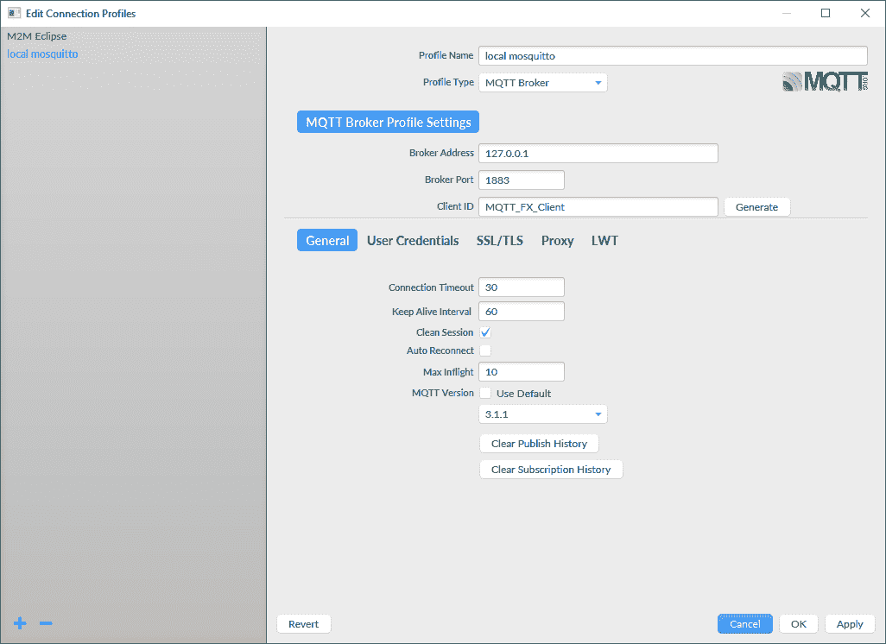

1.  单击“确定”，然后单击“连接”按钮。MQTT.fx 将与本地 Mosquitto 服务器建立连接。请注意，连接按钮已禁用，断开连接按钮已启用，因为客户端已连接到 MQTT 服务器。

1.  单击“订阅”，并在“订阅”按钮左侧的下拉菜单中输入`sensors/octocopter01/altitude`。然后，单击“订阅”按钮。MQTT.fx 将在左侧显示一个新面板，显示我们已订阅的主题，如下图所示：

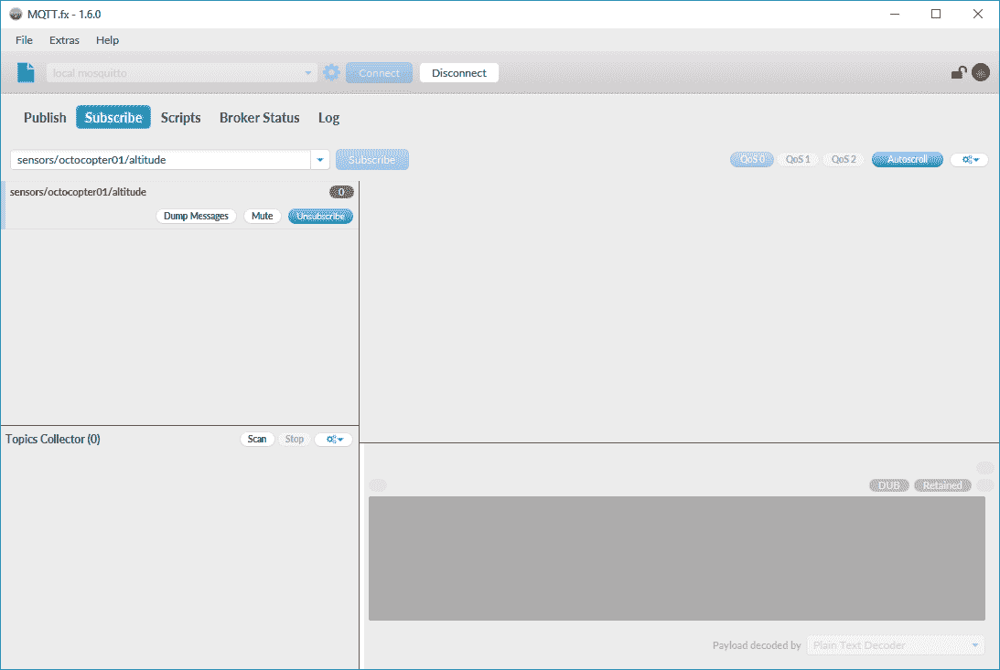

如果您不想使用 MQTT.fx 实用程序，可以运行另一个`mosquitto_sub`命令，生成另一个订阅主题并打印接收到的所有消息的 MQTT 客户端。您只需要在 macOS 或 Linux 中打开另一个终端，或者在 Windows 中打开另一个命令提示符，转到安装 Mosquitto 的目录，并再次运行以下命令。在这种情况下，不需要指定此处给出的`-d`选项：

```py
mosquitto_sub -V mqttv311 -t sensors/octocopter01/altitude
```

现在，我们有两个订阅相同主题`sensors/octocopter01/altitude`的 MQTT 客户端。现在，我们将了解客户端订阅主题时发生的情况。

MQTT 客户端向 MQTT 服务器发送一个带有标识符（`PacketId`）的`SUBSCRIBE`数据包，并在有效载荷中包含一个或多个主题过滤器及其所需的服务质量级别。

**服务质量**被称为**QoS**。

因此，单个`SUBSCRIBE`数据包可以要求 MQTT 服务器订阅客户端到多个主题。`SUBSCRIBE`数据包必须至少包括一个主题过滤器和一个 QoS 对，以符合协议。

在我们请求订阅的两种情况下，我们使用特定的主题名称作为主题过滤器的值，因此我们要求 MQTT 服务器订阅单个主题。稍后我们将学习主题过滤器中通配符的使用。

我们使用了默认选项，因此请求的服务质量是默认级别 0。我们稍后将深入研究 QoS 级别。现在，我们将专注于最简单的订阅情况。如果 QoS 级别等于 0，则`PacketId`字段的值将为 0。如果 QoS 级别等于 1 或 2，则数据包标识符将具有一个数字值，以标识数据包并使其能够识别与此数据包相关的响应。

MQTT 服务器将处理有效的`SUBSCRIBE`数据包，并将用`SUBACK`数据包做出响应，该数据包指示订阅确认并确认了`SUBSCRIBE`数据包的接收和处理。 `SUBACK`数据包将在标头中包括与在`SUBSCRIBE`数据包中收到的`PacketId`相同的数据包标识符（`PacketId`）。 `SUBACK`数据包将包括每对主题过滤器和在`SUBSCRIBE`数据包中收到的所需 QoS 级别的返回代码。返回代码的数量将与`SUBSCRIBE`数据包中包含的主题过滤器的数量相匹配。以下表显示了这些返回代码的可能值。前三个返回代码表示成功订阅，每个值都指定了根据请求的 QoS 和 MQTT 服务器授予请求的 QoS 的可能性来交付的最大 QoS：

| **ReturnCode value** | **Description** |
| --- | --- |
| `0` | 成功订阅，最大 QoS 为 0 |
| `1` | 成功订阅，最大 QoS 为 1 |
| `2` | 成功订阅，最大 QoS 为 2 |
| `128` | 订阅失败 |

如果订阅成功，MQTT 服务器将开始将与订阅中指定的主题过滤器匹配的每条发布的消息以指定的 QoS 发送到 MQTT 客户端。

以下图表显示了 MQTT 客户端与 MQTT 服务器之间订阅一个或多个主题过滤器的交互：

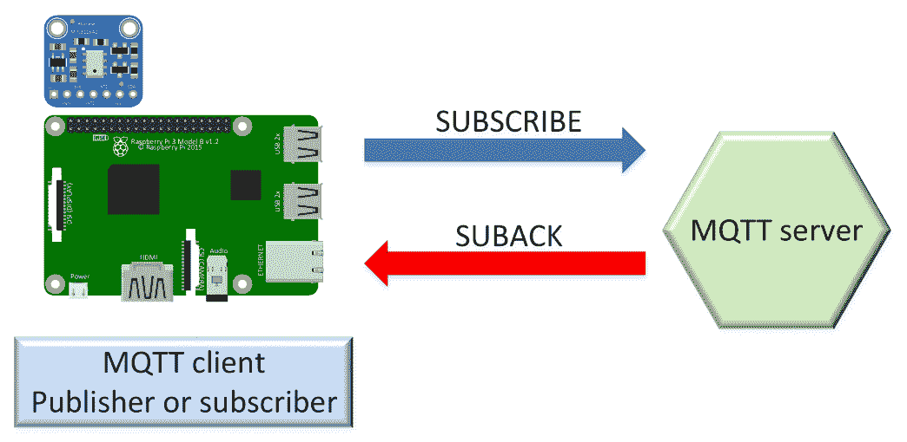

# 使用命令行工具发布消息

我们将使用 Mosquitto 中包含的`mosquitto_pub`命令行实用程序生成一个简单的 MQTT 客户端，该客户端将向主题发布一条消息。在 macOS 或 Linux 中打开终端，或在 Windows 中打开命令提示符，转到安装 Mosquitto 的目录，并运行以下命令：

```py
mosquitto_pub -V mqttv311 -t sensors/octocopter01/altitude -m  "25 f" -d
```

上述命令将创建一个 MQTT 客户端，该客户端将与本地 MQTT 服务器建立连接，然后使客户端发布一条消息到`-t`选项后指定的主题：`sensors/octocopter01/altitude`。我们在`-m`选项后指定消息的有效载荷：`"25 f"`。当客户端建立连接时，我们指定要使用的 MQTT 协议的版本为`-V mqttv311`。这样，我们告诉 MQTT 服务器我们要使用 MQTT 版本 3.11。我们指定`-d`选项以启用调试消息，这将使我们能够了解底层发生了什么。稍后我们将分析连接和发布的其他选项。

终端或命令提示符窗口将显示类似以下行的调试消息。请注意，生成的`ClientId`将与`Client mosqpub|17912-LAPTOP-5D`后显示的不同。发布消息后，客户端将断开连接：

```py
Client mosqpub|17912-LAPTOP-5D sending CONNECT
Client mosqpub|17912-LAPTOP-5D received CONNACK
Client mosqpub|17912-LAPTOP-5D sending PUBLISH (d0, q0, r0, m1, 'sensors/octocopter01/altitude', ... (4 bytes))
Client mosqpub|17912-LAPTOP-5D sending DISCONNECT
```

# 使用 GUI 工具发布消息

现在，我们将使用 MQTT.fx GUI 实用程序生成另一个 MQTT 客户端，该客户端将发布另一条消息到相同的主题“sensors/octocopter01/altitude”。按照以下步骤进行：

1.  转到您建立连接并订阅主题的 MQTT.fx 窗口。

1.  单击“Publish”，并在发布按钮左侧的下拉菜单中输入`sensors/octocopter01/altitude`。

1.  在发布按钮下的文本框中输入以下文本：`32 f`，如下图所示：

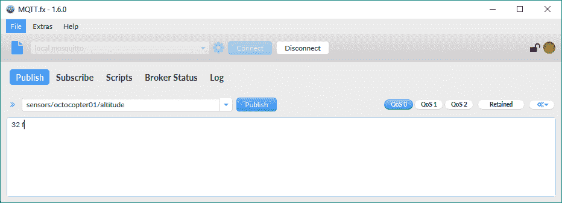

1.  然后，单击发布按钮。 MQTT.fx 将发布输入的文本到指定的主题。

如果您不想使用 MQTT.fx 实用程序，可以运行另一个`mosquitto_pub`命令，以生成另一个发布消息到主题的 MQTT 客户端。您只需在 macOS 或 Linux 中打开另一个终端，或在 Windows 中打开另一个命令提示符，转到 Mosquitto 安装的目录，并运行以下命令：

```py
mosquitto_pub -V mqttv311 -t sensors/octocopter01/altitude -m "32 f"
```

现在，返回到您执行`mosquitto_sub`命令并订阅`sensors/octocopter01/atitude`主题的终端或命令提示符窗口。您将看到类似以下内容的行：

```py
Client mosqsub|3476-LAPTOP-5DO received PUBLISH (d0, q0, r0, m0, 'sensors/octocopter01/altitude', ... (4 bytes))
25 f
Client mosqsub|3476-LAPTOP-5DO received PUBLISH (d0, q0, r0, m0, 'sensors/octocopter01/altitude', ... (4 bytes))
32 f
```

如果我们清除以 Client 前缀开头的调试消息，我们将只看到接下来的两行。这些行显示了我们订阅`sensors/octocopter01/altitude`主题后收到的两条消息的有效负载：

```py
25 f
32 f
```

转到 MQTT.fx 窗口，单击订阅。您将在窗口左侧的面板中看到用于订阅的主题过滤器标题右侧的 2。MQTT.fx 告诉您，您已在`sensors/octocopter01/altitude`主题中收到两条消息。单击此面板，MQTT.fx 将在面板右侧显示所有收到的消息。 MQTT.fx 将在每条消息的右侧显示一个数字，以指定自订阅主题过滤器以来的消息编号。单击每条消息，MQTT.fx 将显示消息的 QoS 级别（0），接收日期和时间，以及消息的默认纯文本格式的有效负载。以下屏幕截图显示了订阅者由 MQTT.fx 生成的已收到的第二条消息的有效负载：

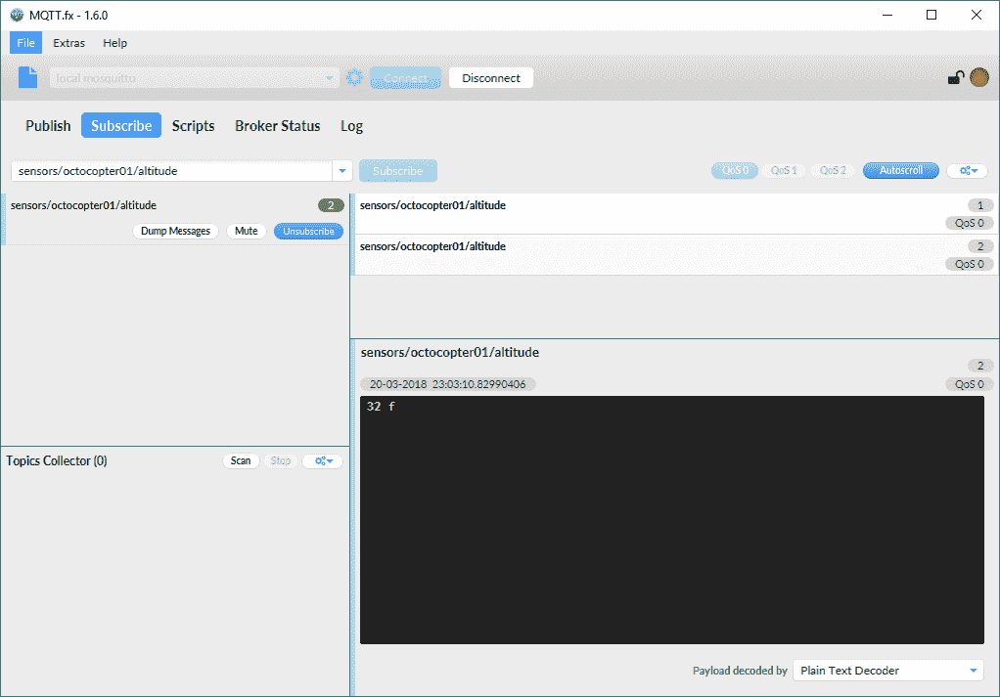

我们创建了两个发布者，每个发布者都向相同的主题`sensors/octocopter01/altitude`发布了一条消息。此主题的两个订阅者都收到了这两条消息。现在，我们将了解当客户端向主题发布消息时发生了什么。

已经建立连接的 MQTT 客户端向 MQTT 服务器发送一个包含以下字段和标志的`PUBLISH`数据包的标头。我们需要理解这些字段和标志的含义，因为当我们使用 MQTT 工具和 Python 中的 MQTT 客户端库时，我们将能够指定其中一些值：

+   `PacketId`：如果 QoS 级别等于 0，则此字段的值将为 0 或不存在。如果 QoS 级别等于 1 或 2，则数据包标识符将具有一个数字值，用于标识数据包并使其能够识别与此数据包相关的响应。

+   `Dup`：如果 QoS 级别等于 0，则此字段的值将为 0。如果 QoS 级别等于 1 或 2，则 MQTT 客户端库或 MQTT 服务器可以在订阅者未确认第一条消息时重新发送先前由客户端发布的消息。每当尝试重新发送已经发布的消息时，Dup 标志的值必须为 1 或`True`。

+   `QoS`：指定消息的 QoS 级别。我们将深入研究消息的服务质量级别，以及它们与许多其他标志的关系。到目前为止，我们一直在使用 QoS 级别 0。

+   `Retain`：如果此标志的值设置为`1`或`True`，MQTT 服务器将使用指定的 QoS 级别存储消息。每当新的 MQTT 客户端订阅与存储或保留消息的主题匹配的主题过滤器时，将向新订阅者发送此主题的最后存储的消息。如果此标志的值设置为`0`或`False`，MQTT 服务器将不会存储消息，并且不会替换具有相同主题的保留消息。

+   `TopicName`：要发布消息的主题名称的字符串。主题名称具有层次结构，斜杠(`/`)用作分隔符。在我们的示例中，`TopicName`的值是`"sensors/octocopter01/altitude"`。我们稍后将分析主题名称的最佳实践。

有效载荷包含 MQTT 客户端希望 MQTT 服务器发布的实际消息。MQTT 是数据无关的，因此我们可以发送任何二进制数据，我们不受 JSON 或 XML 等所施加的限制。当然，如果愿意，我们可以使用这些或其他方式来组织有效载荷。在我们的示例中，我们发送了一个包含表示海拔的数字，后跟一个空格和一个表示单位为`feet`的`"f"`的字符串。

MQTT 服务器将读取有效的`PUBLISH`数据包，并且只会对大于 0 的 QoS 级别做出响应。如果 QoS 级别为 0，则 MQTT 服务器不会做出响应。MQTT 服务器将识别所有订阅主题与消息指定的主题名称匹配的订阅者，并将消息发布给这些客户端。

以下图表显示了 MQTT 客户端与 MQTT 服务器之间以 QoS 级别 0 发布消息的交互：

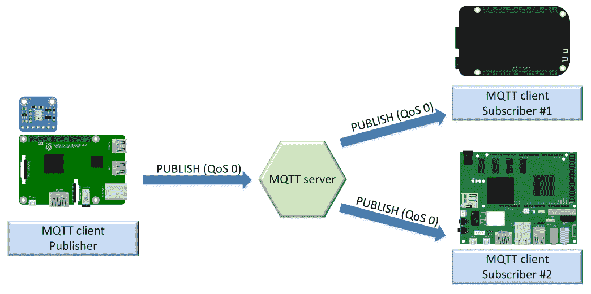

其他 QoS 级别具有不同的流程，发布者和 MQTT 服务器之间有额外的交互，并增加了我们稍后将分析的开销。

# 使用 GUI 工具取消订阅主题

每当我们不希望订阅者接收更多与一个或多个主题过滤器匹配的目标主题名称的消息时，订阅者可以向 MQTT 服务器发送取消订阅到主题过滤器列表的请求。显然，取消订阅主题过滤器与订阅主题过滤器相反。我们将使用 MQTT.fx GUI 实用程序从`sensors/octocopter01/altitude`主题中取消订阅 MQTT 客户端。按照以下步骤：

1.  转到您建立连接并订阅主题的 MQTT.fx 窗口。

1.  单击“订阅”。

1.  单击窗口左侧显示`sensors/octocopter01/altitude`主题名称的面板。然后，单击此面板中的“取消订阅”按钮。以下屏幕截图显示了此按钮：

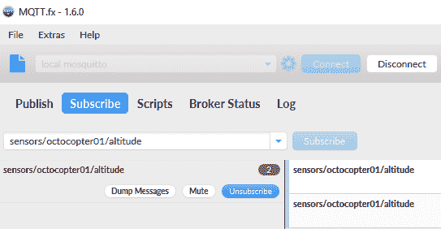

1.  MQTT.fx 将取消订阅客户端的`sensors/octocopter01/altitude`主题，因此客户端将不会接收发布到`sensors/octocopter01/altitude`主题的任何新消息。

现在，我们将使用 MQTT.fx GUI 实用程序使 MQTT 客户端向`sensors/octocopter01/altitude`发布另一条消息。按照以下步骤：

1.  转到您建立连接并订阅主题的 MQTT.fx 窗口。

1.  单击“发布”并在“发布”按钮左侧的下拉菜单中输入`sensors/octocopter01/altitude`。

1.  然后，单击“发布”按钮。MQTT.fx 将向指定的主题发布输入的文本。

1.  在发布按钮下方的文本框中输入以下文本：`37 f`，如下面的屏幕截图所示：

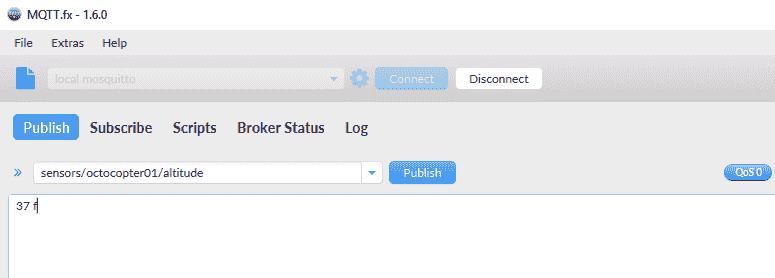

如果您不想使用 MQTT.fx 实用程序，您可以运行`mosquitto_pub`命令生成另一个 MQTT 客户端，以向主题发布消息。您只需要在 macOS 或 Linux 中打开另一个终端，或者在 Windows 中打开另一个命令提示符，转到 Mosquitto 安装的目录，并运行以下命令：

```py
mosquitto_pub -V mqttv311 -t sensors/octocopter01/altitude -m "37 f"
```

现在，返回到 MQTT.fx 窗口，点击订阅以检查已接收的消息。在我们发布新消息到`sensors/octocopter01/altitude`主题之前，客户端已经取消订阅了该主题，因此最近发布的带有负载`"37 f"`的消息没有显示出来。

返回到您执行`mosquitto_sub`命令并订阅`sensors/octocopter01/atitude`主题的终端或命令提示符窗口。您将看到类似以下的行：

```py
Client mosqsub|3476-LAPTOP-5DO received PUBLISH (d0, q0, r0, m0, 'sensors/octocopter01/altitude', ... (4 bytes))
37 f
```

该客户端仍然订阅`sensors/octocopter01/altitude`主题，因此它接收到了负载为`"37 f"`的消息。

MQTT 客户端向 MQTT 服务器发送一个带有头部中的数据包标识符（`PacketId`）和负载中的一个或多个主题过滤器的`UNSUBSCRIBE`数据包。与`SUBSCRIBE`数据包的主要区别在于，对于每个主题过滤器并不需要包括 QoS 等级，因为 MQTT 客户端只是想要取消订阅。

当 MQTT 客户端取消订阅一个或多个主题过滤器后，MQTT 服务器仍然保持连接打开；与`UNSUBSCRIBE`数据包中指定的主题过滤器不匹配的主题过滤器的订阅将继续工作。

因此，一个`UNSUBSCRIBE`数据包可以要求 MQTT 服务器取消订阅客户端的多个主题。`UNSUBSCRIBE`数据包必须至少包括一个主题过滤器的负载，以符合协议。

在前面的例子中，我们要求 MQTT 服务器取消订阅时，我们使用了特定的主题名称作为主题过滤器的值，因此我们请求 MQTT 服务器取消订阅单个主题。如前所述，我们将在后面学习主题过滤器中通配符的使用。

数据包标识符将具有一个数字值，用于标识数据包并使其能够识别与此`UNSUBSCRIBE`数据包相关的响应。MQTT 服务器将处理有效的`UNSUBSCRIBE`数据包，并将以`UNSUBACK`数据包作出响应，该数据包表示取消订阅的确认，并确认了`UNSUBSCRIBE`数据包的接收和处理。`UNSUBACK`数据包将在头部中包含与`UNSUBSCRIBE`数据包中接收到的相同的数据包标识符（`PacketId`）。

MQTT 服务器将删除`UNSUBSCRIBE`数据包的负载中指定的特定客户端的订阅列表中完全匹配的任何主题过滤器。主题过滤器匹配必须是精确的才能被删除。在 MQTT 服务器从客户端的订阅列表中删除主题过滤器后，服务器将停止向客户端添加要发布的新消息。只有已经以 QoS 等级为 1 或 2 开始传递到客户端的消息将被发布到客户端。此外，服务器可能会发布已经缓冲以分发给订阅者的现有消息。

以下图表显示了 MQTT 客户端与 MQTT 服务器在取消订阅一个或多个主题过滤器时的交互：

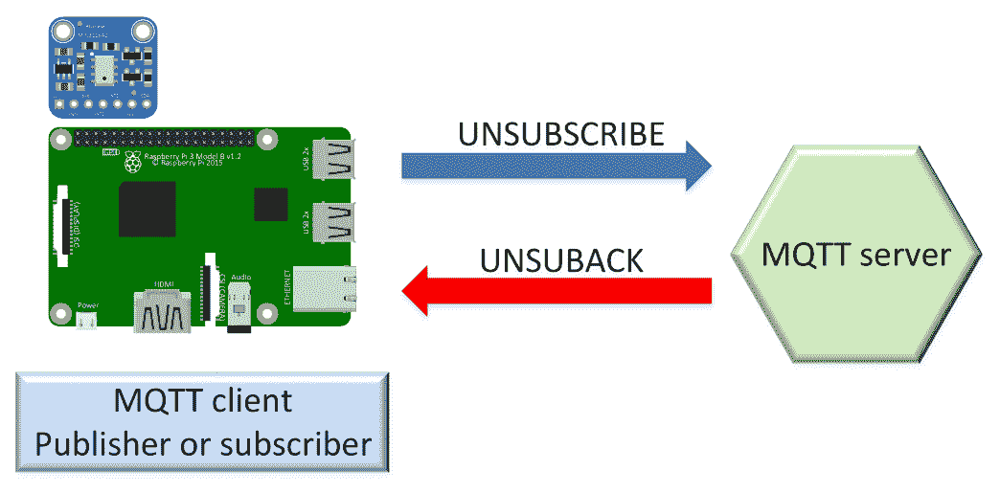

# 学习主题的最佳实践

我们已经知道 MQTT 允许我们在主题上发布消息。发布者必须始终指定要发布消息的主题名称。理解 MQTT 中主题名称的最简单方法是将它们视为文件系统中的路径。

如果我们需要保存数十个文件，这些文件包含有关不同类型传感器的信息，用于各种无人机，我们可以创建一个目录层次结构来组织我们将保存的所有文件。我们可以创建一个名为`sensors`的目录，然后为每个无人机创建一个子目录，比如`octocopter01`，最后再创建一个传感器名称的子目录，比如`altitude`。在 macOS 或 Linux 中的路径将是`sensors/octocopter01/altitude`，因为这些操作系统使用正斜杠(`/`)作为分隔符。在 Windows 中，路径将是`sensors\drone\altitude`，因为这个操作系统使用反斜杠(`\`)作为分隔符。

然后，我们将保存有关名为`octocopter01`的无人机的高度传感器信息的文件在创建的路径中。我们可以考虑发布消息到一个路径，使用与我们用于组织文件路径的相同机制来安排主题中的消息。

与目录或文件夹不同，主题具有主题级别，具体是主题级别的层次结构，并且斜杠(`/`)被用作分隔符，即主题级别分隔符。如果我们将`sensors/octocopter01/altitude`用作主题名称，`sensors`是第一个主题级别，`octocopter01`是第二个主题级别，`altitude`是第三个主题级别。

主题名称区分大小写，因此`sensors/octocopter01/altitude`与`sensors/Octocopter01/altitude`、`Sensors/octocopter01/altitude`和`Sensors/Octocopter01/Altitude`是不同的。实际上，这四个字符串将被视为四个单独的主题名称。我们必须确保为主题名称选择一个大小写方案，并将其用于所有主题名称和主题过滤器。

我们可以在主题名称中使用任何 UTF-8 字符，除了我们稍后将分析的两个通配符字符：加号(`+`)和井号(`#`)。因此，我们必须避免在主题名称中使用`+`和`#`。然而，限制字符集以避免客户端库出现意外问题是一个好的做法。例如，我们可以避免使用重音符号和在英语中不常见的字符，就像我们在构建 URL 时所做的那样。虽然可以使用这些字符，但在使用它们时可能会遇到问题。

我们应该避免创建以美元符号(`$`)开头的主题，因为许多 MQTT 服务器会在以`$`开头的主题中发布与服务器相关的统计数据。具体来说，第一个主题级别是`$SYS`。

在发送消息到不同主题名称时，我们必须保持一致性，就像我们在不同路径中保存文件时一样。例如，如果我们想要发布名为`hexacopter20`的无人机的高度，我们将使用`sensors/hexacopter20/altitude`。我们必须使用与为`octocopter01`相同目标使用的相同主题级别，只需将无人机名称从`octocopter01`更改为`hexacopter20`。使用不同结构或不一致大小写的主题将是一个非常糟糕的做法，比如`altitude/sensors/hexacopter20`或`Sensors/Hexacopter20/Altitude`。我们必须考虑到我们可以通过使用主题过滤器订阅多个主题，因此创建主题名称非常重要。

# 了解 MQTT 通配符

当我们分析订阅操作时，我们了解到 MQTT 客户端可以订阅一个或多个主题过滤器。如果我们将主题名称指定为主题过滤器，我们将只订阅一个单一主题。我们可以利用以下两个通配符来创建订阅与过滤器匹配的所有主题的主题过滤器：

+   **加号**(`+`)：这是一个单级通配符，匹配特定主题级别的任何名称。我们可以在主题过滤器中使用这个通配符，代替指定主题级别的名称。

+   **井号** (`#`)：这是一个多级通配符，我们只能在主题过滤器的末尾使用它，作为最后一级，并且它匹配任何主题，其第一级与`#`符号左侧指定的主题级别相同。

例如，如果我们想接收所有无人机海拔相关的消息，我们可以使用`+`单级通配符，而不是特定的无人机名称。我们可以使用以下主题过滤器：`sensors/+/altitude`。

如果我们发布消息到以下主题，使用`sensors/+/altitude`主题过滤器的订阅者将会收到所有这些消息：

+   `sensors/octocopter01/altitude`

+   `sensors/hexacopter20/altitude`

+   `sensors/superdrone01/altitude`

+   `sensors/thegreatestdrone/altitude`

使用`sensors/+/altitude`主题过滤器的订阅者将不会收到发送到以下任何主题的消息，因为它们不匹配主题过滤器：

+   `sensors/octocopter01/speed/rotor/1`

+   `sensors/superdrone01/speed/rotor/2`

+   `sensors/superdrone01/remainingbattery`

如果我们想接收所有名为`octocopter01`的无人机所有传感器相关的消息，我们可以在无人机名称后使用`#`多级通配符和斜杠(`/`)。我们可以使用以下主题过滤器：`sensors/octocopter01/#`。

如果我们发布消息到以下主题，使用`sensors/octocopter01/#`主题过滤器的订阅者将会收到所有这些消息：

+   `sensors/octocopter01/altitude`

+   `sensors/octocopter01/speed/rotor/1`

+   `sensors/octocopter01/speed/rotor/2`

+   `sensors/octocopter01/speed/rotor/3`

+   `sensors/octocopter01/speed/rotor/4`

+   `sensors/octocopter01/remainingbattery`

我们使用了多级通配符，因此，无论`sensors/octocopter01/`后面有多少额外的主题级别，我们都会收到所有这些消息。

使用`sensors/octocopter01/#`主题过滤器的订阅者将不会收到发送到以下任何主题的消息，因为它们不匹配主题过滤器。以下任何主题都没有`sensors/octocopter01/`作为前缀，因此它们不匹配主题过滤器：

+   `sensors/hexacopter02/altitude`

+   `sensors/superdrone01/altitude`

+   `sensors/thegreatestdrone/altitude`

+   `sensors/drone02/speed/rotor/1`

+   `sensors/superdrone02/speed/rotor/2`

+   `sensors/superdrone02/remainingbattery`

显然，当我们使用通配符时，必须小心，因为我们可能会使用单个主题过滤器订阅大量主题。我们必须避免订阅对客户端不感兴趣的主题，以避免浪费不必要的带宽和服务器资源。

稍后我们将在订阅中使用这些通配符，以分析不同的 QoS 级别如何与 MQTT 一起工作。

# 学习不同的 QoS 级别

现在我们了解了连接、订阅和发布如何与主题名称和带通配符的主题过滤器结合使用，我们可以深入了解 QoS 级别。到目前为止，我们已经分析了订阅和发布如何使用 QoS 级别等于 0。现在，我们将了解这个数字的含义，以及当我们使用其他可用的发布和订阅 QoS 级别时，事情是如何工作的。

记住，发布涉及从 MQTT 客户端到 MQTT 服务器的发布，然后从服务器到订阅的客户端。非常重要的是要理解，我们可以使用一个 QoS 级别进行发布，使用另一个 QoS 级别进行订阅。因此，发布过程中有一个 QoS 级别，用于发布者和 MQTT 服务器之间的过程，另一个 QoS 级别用于 MQTT 服务器和订阅者之间的发布过程。我们将使用发送者和接收者来识别参与不同 QoS 级别消息传递的各方。在发布者和 MQTT 服务器之间的发布过程中，发布者将是发送者，MQTT 服务器将是接收者。在 MQTT 服务器和订阅者之间的发布过程中，发送者将是 MQTT 服务器，接收者将是订阅者。

根据 QoS 级别，在 MQTT 协议中，发送方和接收方之间关于实际传递消息的保证的含义有所不同。QoS 级别是关于发送方和接收方之间消息保证的协议。这些保证可能包括消息到达的次数以及重复的可能性（或不可能性）。MQTT 支持以下三种可能的 QoS 级别：

+   **0，至多一次交付**：此 QoS 级别提供与基础 TCP 协议相同的保证。消息不会被接收方或目的地确认。发送方只是将消息发送到目的地，然后什么都不会发生。发送方既不存储也不安排任何可能未能到达目的地的消息的新交付。这个 QoS 级别的主要优势是与其他 QoS 级别相比，它具有最低的开销。

+   **1，至少一次交付**：此 QoS 级别向目的地添加了一个必须接收消息的确认要求。因此，QoS 级别 1 提供了消息至少一次传递给订阅者的保证。这个 QoS 级别的一个关键缺点是它可能会产生重复，也就是说，同一条消息可能会被发送多次到同一个目的地。发送方将消息存储，直到它收到订阅者的确认。如果发送方在特定时间内没有收到确认，它将再次向接收方发布消息。最终的接收方必须具有必要的逻辑来检测重复，如果它们不应该被处理两次的话。

+   **2，仅一次交付**：此 QoS 级别提供了消息仅一次传递到目的地的保证。与其他 QoS 级别相比，QoS 级别 2 具有最高的开销。此 QoS 级别需要发送方和接收方之间的两个流。使用 QoS 级别 2 发布的消息在发送方确信它已被目的地成功接收一次后被视为成功传递。

有时，我们只希望以最少的带宽使用交付消息，我们有一个非常可靠的网络，如果由于某种原因丢失了一些消息，也无所谓。在这种情况下，QoS 级别 0 是合适的选择。

在其他情况下，消息非常重要，因为它们代表了控制物联网设备的命令，网络不可靠，我们必须确保消息到达目的地。此外，重复的命令可能会产生大问题，因为我们不希望物联网设备处理特定命令两次。在这种情况下，QoS 级别 2 将是合适的选择。

如果发布者使用比订阅者指定的 QoS 级别更高的 QoS 级别，MQTT 服务器将不得不将 QoS 级别降级到特定订阅者使用的最低级别，当它从 MQTT 服务器向该订阅者发布消息时。例如，如果我们使用 QoS 级别 2 从发布者向 MQTT 服务器发布消息，但一个订阅者在订阅时请求了 QoS 级别 1，那么从 MQTT 服务器到该订阅者的发布将使用 QoS 级别 1。

# 使用至少一次交付（QoS 级别 1）

首先，我们将使用通配符订阅具有 QoS 级别 1 的主题过滤器，然后我们将向与 QoS 级别 1 匹配的主题名称发布一条消息。这样，我们将分析发布和订阅如何使用 QoS 级别 1。

我们将使用 Mosquitto 中包含的`mosquitto_sub`命令行实用程序生成一个简单的 MQTT 客户端，该客户端订阅具有 QoS 级别 1 的主题过滤器，并打印它接收到的所有消息。在 macOS 或 Linux 中打开终端，或在 Windows 中打开命令提示符，转到安装 Mosquitto 的目录，并运行以下命令：

```py
mosquitto_sub -V mqttv311 -t sensors/+/altitude -q 1 -d
```

上述命令将创建一个 MQTT 客户端，该客户端将与本地 MQTT 服务器建立连接，然后将使客户端订阅在`-t`选项之后指定的主题过滤器：`sensors/+/altitude`。我们指定要使用 QoS 级别 1 来订阅`-q 1`选项指定的主题过滤器。我们指定`-d`选项以启用调试消息，这将使我们能够了解底层发生的事情以及与使用 QoS 级别 0 发布消息时的差异。

终端或命令提示窗口将显示类似以下行的调试消息。请注意，生成的`ClientId`将与`Client mosqsub|16736-LAPTOP-5D`之后显示的不同。请注意，`QoS: 1`表示使用 QoS 级别 1 进行订阅：

```py
Client mosqsub|16736-LAPTOP-5D sending CONNECT
Client mosqsub|16736-LAPTOP-5D received CONNACK
Client mosqsub|16736-LAPTOP-5D sending SUBSCRIBE (Mid: 1, Topic: sensors/+/altitude, QoS: 1)
Client mosqsub|16736-LAPTOP-5D received SUBACK
Subscribed (mid: 1): 1
```

我们将使用 Mosquitto 中包含的`mosquitto_pub`命令行实用程序生成一个简单的 MQTT 客户端，该客户端将以 QoS 级别 1 发布消息到主题，而不是我们之前发布消息时使用的 QoS 级别 0。在 macOS 或 Linux 中打开终端，或在 Windows 中打开命令提示符，转到安装 Mosquitto 的目录，并运行以下命令：

```py
mosquitto_pub -V mqttv311 -t sensors/hexacopter02/altitude -m  "75 f" -q 1 -d
```

上述命令将创建一个 MQTT 客户端，该客户端将与本地 MQTT 服务器建立连接，然后将使客户端发布一条消息到`-t`选项之后指定的主题：`sensors/hexacopter02/altitude`。我们在`-m`选项之后指定消息的有效载荷：`"75 f"`。我们指定要使用 QoS 级别 1 来发布消息，使用`-q 1`选项。我们指定 X 选项以启用调试消息，这将使我们能够了解底层发生的事情以及与使用 QoS 级别 0 发布消息时的差异。

终端或命令提示窗口将显示类似以下行的调试消息。请注意，生成的`ClientId`将与`Client mosqpub|19544-LAPTOP-5D`之后显示的不同。发布消息后，客户端将断开连接：

```py
Client mosqpub|19544-LAPTOP-5D sending CONNECT
Client mosqpub|19544-LAPTOP-5D received CONNACK
Client mosqpub|19544-LAPTOP-5D sending PUBLISH (d0, q1, r0, m1, 'sensors/drone02/altitude', ... (4 bytes))
Client mosqpub|19544-LAPTOP-5D received PUBACK (Mid: 1)
Client mosqpub|19544-LAPTOP-5D sending DISCONNECT
```

上述行显示，生成的 MQTT 客户端向 MQTT 服务器发送`PUBLISH`数据包，然后从服务器接收`PUBACK`数据包。

现在，回到您执行`mosquitto_sub`命令并订阅`sensors/+/atitude`主题过滤器的终端或命令提示窗口。您将看到类似以下行的内容：

```py
Client mosqsub|16736-LAPTOP-5D received PUBLISH (d0, q1, r0, m1, 'sensors/drone02/altitude', ... (4 bytes))
Client mosqsub|16736-LAPTOP-5D sending PUBACK (Mid: 1)
75 f
```

上述行显示，生成的 MQTT 客户端，即订阅者，从 MQTT 服务器接收了`PUBLISH`数据包，然后向服务器发送了`PUBACK`数据包以确认消息。如果我们清除以`Client`前缀开头的调试消息，我们将只看到最后一行，显示我们订阅`sensors/+/altitude`主题过滤器后收到的消息的有效载荷：`75 f`。

已经建立连接的 MQTT 客户端，即发布者，向 MQTT 服务器发送了一个`PUBLISH`数据包，其中包含我们已经描述的标头，QoS 设置为 1，并包括一个`PacketId`数值，该数值对于此客户端是唯一的。此时，发布者将`PacketId`标识的`PUBLISH`数据包视为未确认的`PUBLISH`数据包。

MQTT 服务器读取有效的`PUBLISH`数据包，并使用与`PUBLISH`数据包相同的`PacketId`值向发布者发送`PUBACK`数据包。一旦发布者收到`PUBACK`数据包，它将丢弃消息，MQTT 服务器负责将其发布给适当的订阅者。

以下图表显示了发布者与 MQTT 服务器之间以 QoS 级别 1 发布消息的交互：

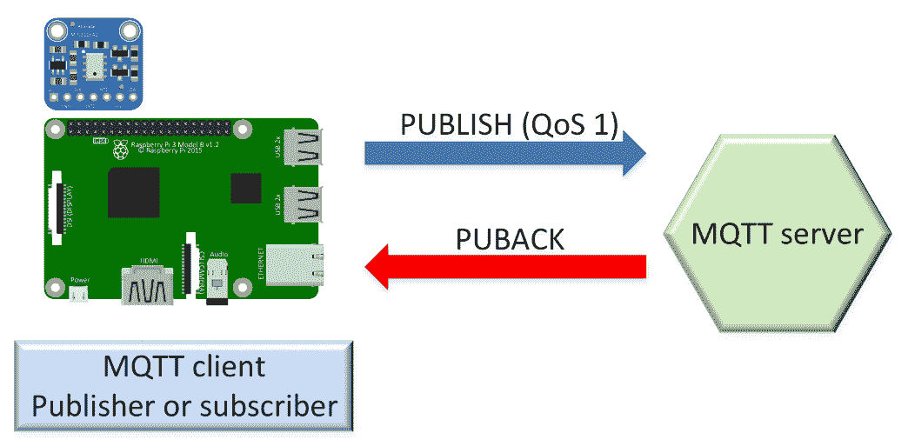

MQTT 服务器可以在向发布者发送`PUBACK`数据包之前开始向适当的订阅者发布消息。因此，当发布者从 MQTT 服务器接收到`PUBACK`数据包时，并不意味着所有订阅者都已收到消息。理解这个`PUBACK`数据包的含义非常重要。

对于每个需要发布消息的订阅者，MQTT 服务器将发送一个`PUBLISH`数据包，订阅者必须通过向 MQTT 服务器发送一个`PUBACK`数据包来确认收到消息。下图显示了当使用 QoS 级别为 1 发布消息时，MQTT 服务器与订阅者之间的交互：

如果应用程序能够容忍重复，并且我们必须确保消息至少到达订阅者一次，QoS 级别 1 是一个很好的选择。如果没有办法处理重复，我们必须使用 QoS 级别 2。

# 使用仅一次传递（QoS 级别 2）

首先，我们将使用通配符订阅一个带有 QoS 级别 2 的主题过滤器，然后我们将向与 QoS 级别 2 匹配的主题发布一条消息。这样，我们将分析发布和订阅在 QoS 级别 2 下的工作方式。

我们将使用 Mosquitto 中包含的`mosquitto_sub`命令行实用程序生成一个简单的 MQTT 客户端，该客户端订阅带有 QoS 级别 1 的主题过滤器，并打印接收到的所有消息。在 macOS 或 Linux 中打开终端，或在 Windows 中打开命令提示符，转到安装 Mosquitto 的目录，并运行以下命令：

```py
mosquitto_sub -V mqttv311 -t sensors/quadcopter30/# -q 2 -d
```

上述命令将创建一个 MQTT 客户端，该客户端将与本地 MQTT 服务器建立连接，然后将客户端订阅到`-t`选项后指定的主题过滤器：`sensors/quadcopter30/#`。我们指定要使用`-q 2`选项订阅带有 QoS 级别 2 的主题过滤器。我们指定`-d`选项以启用调试消息，以便我们了解底层发生了什么以及与使用 QoS 级别 0 和 1 发布消息时的区别。

终端或命令提示符窗口将显示类似以下行的调试消息。请注意，生成的`ClientId`将与`Client mosqsub|8876-LAPTOP-5DO`后显示的不同。请注意，`QoS: 2`表示使用 QoS 级别 2 进行订阅：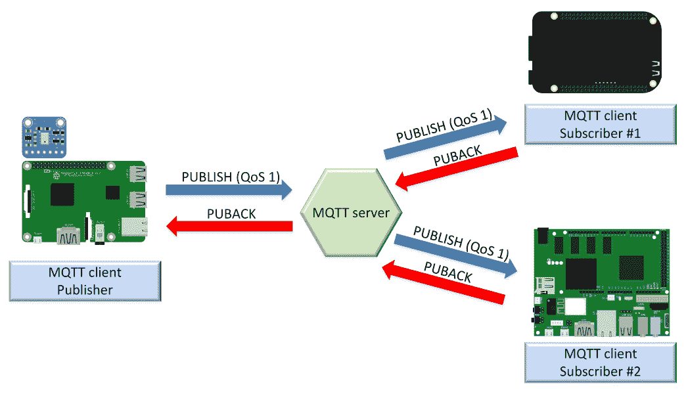

```py
Client mosqsub|8876-LAPTOP-5DO sending CONNECT
Client mosqsub|8876-LAPTOP-5DO received CONNACK
Client mosqsub|8876-LAPTOP-5DO sending SUBSCRIBE (Mid: 1, Topic: sensors/quadcopter30/#, QoS: 2)
Client mosqsub|8876-LAPTOP-5DO received SUBACK
Subscribed (mid: 1): 2
```

我们将使用 Mosquitto 中包含的`mosquitto_pub`命令行实用程序生成一个简单的 MQTT 客户端，该客户端将向具有 QoS 级别 2 的主题发布消息，而不是我们之前发布消息时使用的 QoS 级别 0 和 1。在 macOS 或 Linux 中打开终端，或在 Windows 中打开命令提示符，转到安装 Mosquitto 的目录，并运行以下命令：

```py
mosquitto_pub -V mqttv311 -t sensors/quadcopter30/speed/rotor/1 -m  "123 f" -q 2 -d
```

上述命令将创建一个 MQTT 客户端，该客户端将与本地 MQTT 服务器建立连接，然后将客户端发布一条消息到`-t`选项后指定的主题：`sensors/quadcopter30/speed/rotor/1`。我们在`-m`选项后指定消息的有效载荷：`"123 f"`。我们指定要使用`-q 2`选项发布消息的 QoS 级别 2。我们指定`-d`选项以启用调试消息，以便我们了解底层发生了什么以及与使用 QoS 级别 0 和 1 发布消息时的区别。

终端或命令提示符窗口将显示类似以下行的调试消息。请注意，生成的`ClientId`将与`Client mosqpub|14652-LAPTOP-5D`后显示的不同。发布消息后，客户端将断开连接：

```py
Client mosqpub|14652-LAPTOP-5D sending CONNECT
Client mosqpub|14652-LAPTOP-5D received CONNACK
Client mosqpub|14652-LAPTOP-5D sending PUBLISH (d0, q2, r0, m1, 'sensors/quadcopter30/speed/rotor/1', ... (5 bytes))
Client mosqpub|14652-LAPTOP-5D received PUBREC (Mid: 1)
Client mosqpub|14652-LAPTOP-5D sending PUBREL (Mid: 1)
Client mosqpub|14652-LAPTOP-5D received PUBCOMP (Mid: 1)
Client mosqpub|14652-LAPTOP-5D sending DISCONNECT
```

上述行显示生成的 MQTT 客户端（即发布者）与 MQTT 服务器的数据包交换如下：

1.  发布者向 MQTT 服务器发送一个`PUBLISH`数据包

1.  发布者从 MQTT 服务器接收到一个`PUBREC`数据包

1.  发布者向 MQTT 服务器发送了`PUBREL`数据包

1.  发布者从 MQTT 服务器接收了`PUBCOMP`数据包

现在，回到您执行`mosquitto_sub`命令并订阅`sensors/quadcopter30/#`主题过滤器的终端或命令提示符窗口。您将看到类似以下行的行：

```py
Client mosqsub|8876-LAPTOP-5DO received PUBLISH (d0, q2, r0, m1, 'sensors/quadcopter30/speed/rotor/1', ... (5 bytes))
Client mosqsub|8876-LAPTOP-5DO sending PUBREC (Mid: 1)
Client mosqsub|8876-LAPTOP-5DO received PUBREL (Mid: 1)
123 f
Client mosqsub|8876-LAPTOP-5DO sending PUBCOMP (Mid: 1)
```

前面的行显示了生成的 MQTT 客户端，即订阅者，与 MQTT 服务器进行的数据包交换：

1.  订阅者从 MQTT 服务器接收了`PUBLISH`数据包

1.  订阅者向 MQTT 服务器发送了`PUBREC`数据包

1.  订阅者从 MQTT 服务器接收了`PUBREL`数据包

1.  订阅者在成功接收有效载荷为消息的消息后向 MQTT 服务器发送了`PUBCOMP`数据包

如果我们清除以`Client`前缀开头的调试消息，我们将只看到最后一行，它显示了我们订阅`sensors/quadcopter30/#`主题过滤器收到的消息的有效载荷：`123 f`。

已经建立连接的 MQTT 客户端，即发布者，发送了带有我们已经描述的标头的`PUBLISH`数据包到 MQTT 服务器，QoS 设置为 2，并包括一个对于此客户端将是唯一的`PacketId`数值。此时，发布者将把带有`PacketId`的`PUBLISH`数据包视为未被确认的`PUBLISH`数据包。

MQTT 服务器读取有效的`PUBLISH`数据包，并将用相同的`PacketId`值向发布者发送`PUBREC`数据包作为响应`PUBLISH`数据包。`PUBREC`数据包表示 MQTT 服务器接受了消息的所有权。一旦发布者收到`PUBREC`数据包，它会丢弃消息，并存储与消息相关的`PacketId`和`PUBREC`数据包。

出版商将`PUBREL`数据包发送到 MQTT 服务器，作为对收到的`PUBREC`数据包的响应。直到它收到与 MQTT 服务器相关的`PacketId`的`PUBCOMP`数据包，这个`PUBREL`数据包将被视为未被确认。最后，MQTT 服务器向发布者发送带有`PacketId`的`PUBCOMP`数据包，此时，发布者和 MQTT 服务器都确信消息已成功传递。

以下图表显示了发布者和 MQTT 服务器之间以 QoS 级别 2 发布消息的交互：

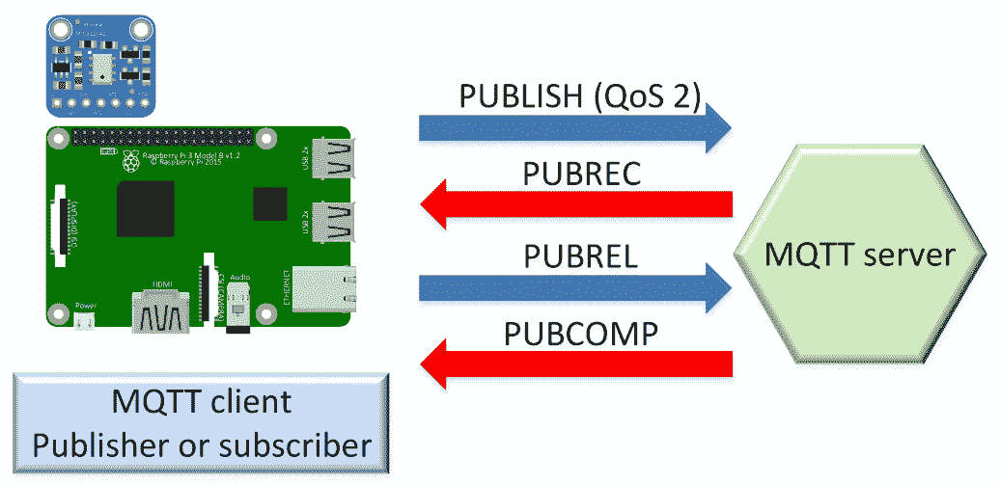

对于每个具有 QoS 级别 2 的订阅者，消息必须被发布到 MQTT 服务器，MQTT 服务器将发送一个`PUBLISH`数据包，并且我们已经分析过的与发布者和 MQTT 服务器之间的相同数据包交换将在 MQTT 服务器和订阅者之间发生。但是，在这种情况下，MQTT 服务器将作为发布者并启动流程。以下图表显示了在使用 QoS 级别 2 发布消息时 MQTT 服务器和订阅者之间的交互：

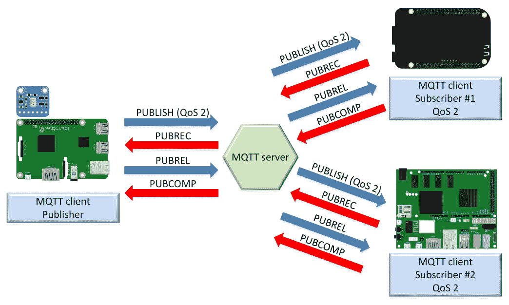如果应用程序无法容忍重复，并且我们必须确保消息只到达订阅者一次，那么 QoS 级别 2 是合适的选择。然而，魔法是有代价的：我们必须考虑到 QoS 级别 2 与其他 QoS 级别相比具有最高的开销。

# 了解不同服务质量级别的开销

以下图表总结了 MQTT 客户端和 MQTT 服务器之间交换的不同数据包，以发布具有 QoS 级别 0、1 和 2 的消息。通过这种方式，我们可以轻松识别随着 QoS 级别的增加而增加的开销：

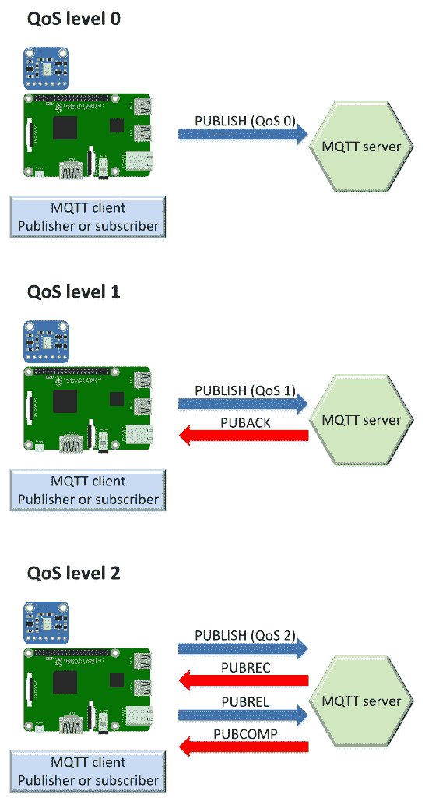非常重要的是要考虑 QoS 级别 2 所需的额外开销，并且只在真正必要时使用它。

# 测试你的知识

让我们看看你是否能正确回答以下问题：

1.  MQTT 的 QoS 级别 0 表示：

1.  确切一次传递

1.  至多一次传递

1.  至少一次交付

1.  MQTT 的 QoS 级别 1 意味着：

1.  恰好一次交付

1.  至多一次交付

1.  至少一次交付

1.  MQTT 的 QoS 级别 2 意味着：

1.  恰好一次交付

1.  至多一次交付

1.  至少一次交付

1.  如果应用程序无法容忍重复，并且我们必须确保消息仅一次到达订阅者，那么适当的选择是：

1.  QoS 级别 0

1.  QoS 级别 1

1.  QoS 级别 2

1.  哪个 QoS 级别的开销最高：

1.  QoS 级别 0

1.  QoS 级别 1

1.  QoS 级别 2

正确答案包含在[附录]（d9cf708f-f027-4bfa-a2d2-9fd3653165d9.xhtml）中，*解决方案*。

# 摘要

在本章中，我们使用不同的工具与我们在[第一章]（d20ae00b-2bb7-4d81-b3eb-5c47215bce1f.xhtml）中安装的 Mosquitto MQTT 3.1.1 服务器进行交互，*安装 MQTT 3.1.1 Mosquitto 服务器*。我们使用了一个未经保护的 MQTT 服务器，以便轻松理解 MQTT 客户端与 MQTT 服务器之间的交互。

我们通过命令行和 GUI 工具订阅了主题。然后，我们以 QoS 级别 0 发布消息，并从主题中取消订阅。我们学习了与主题相关的最佳实践；以及单级和多级通配符。我们详细研究了 MQTT 支持的不同服务质量级别，以及在何时使用每个级别是适当的。我们分析了它们的优点和缺点。

现在我们了解了 MQTT 3.1.1 基础知识的工作原理，我们将学习如何保护 MQTT 服务器并遵循与安全相关的最佳实践，这些是我们将在[第三章]（89bdce8f-72bc-4fda-82a0-5cab33fa4bd8.xhtml）中讨论的主题，*保护 MQTT 3.1.1 Mosquitto 服务器*。
